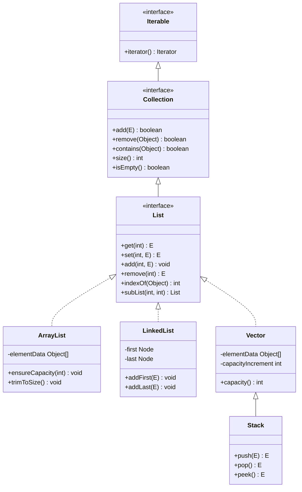
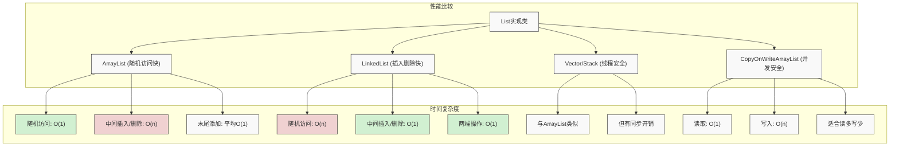

import Tabs from '@theme/Tabs';
import TabItem from '@theme/TabItem';

# Java List 集合详解

List是Java集合框架中最核心的接口之一，它继承自Collection接口，提供了有序、可重复、可索引的集合操作能力。在Java开发中，List集合被广泛应用于各种场景，从简单的数据存储到复杂的业务逻辑处理，都离不开List的支持。

:::tip 核心特性
**List接口 = 有序性 + 可重复性 + 可索引性 + 可修改性 + 批量操作支持**
- 📋 **有序性**：元素按照插入顺序排列，位置可预测
- 🔄 **可重复性**：允许添加相同的元素，不强制唯一性
- 🔢 **可索引性**：支持通过索引快速定位和访问元素（如get(i)）
- ✏️ **可修改性**：支持在任意位置添加、删除、替换元素
- 🛠️ **批量操作**：支持子列表视图和整体集合操作
:::

## 1. List接口基础概念

### 1.1 什么是List接口？

List接口是Java集合框架中的核心接口，它继承自Collection接口，为有序集合提供了完整的抽象。



List集合具有以下核心特征：

- **有序性**：元素按照插入顺序存储，可以通过索引访问
- **可重复性**：允许存储重复的元素  
- **可索引性**：支持基于位置的元素访问和操作
- **可修改性**：支持元素的增删改查操作
- **批量操作**：支持集合级别的批量处理

### 1.2 List接口的重要性

| 重要性 | 具体体现 | 业务价值 |
|--------|----------|----------|
| **数据组织** | 提供有序的数据存储结构 | 支持业务逻辑的顺序性要求 |
| **快速访问** | 基于索引的O(1)随机访问 | 提高数据检索效率 |
| **灵活操作** | 支持位置相关的增删改查 | 满足复杂的业务操作需求 |
| **框架基础** | 为其他集合类型提供基础 | 构建完整的集合体系 |

### 1.3 List接口设计原则

List接口的设计遵循以下几个核心原则：

#### 位置访问原则
提供基于索引的元素访问能力，支持随机访问模式

#### 位置操作原则  
支持在指定位置插入和删除元素，满足精确控制需求

#### 批量操作原则
支持集合级别的批量处理，提高操作效率

#### 视图操作原则
提供子列表视图，支持范围操作和分段处理

```java title="List接口核心方法示例"
public interface List<E> extends Collection<E> {
    
    // ========== 位置访问 ==========
    E get(int index);                    // 获取指定位置的元素
    E set(int index, E element);         // 设置指定位置的元素
    
    // ========== 位置操作 ==========
    void add(int index, E element);      // 在指定位置插入元素
    E remove(int index);                 // 删除指定位置的元素
    
    // ========== 批量操作 ==========
    boolean addAll(Collection<? extends E> c);           // 批量添加
    boolean addAll(int index, Collection<? extends E> c); // 指定位置批量添加
    
    // ========== 视图操作 ==========
    List<E> subList(int fromIndex, int toIndex);        // 获取子列表视图
}
```

### 1.4 List接口核心方法详解

List接口提供了丰富的方法来操作有序集合，这些方法可以分为几个主要类别：

<Tabs>
<TabItem value="basic" label="基本操作方法">

```java title="List基本操作方法"
public interface List<E> extends Collection<E> {
    
    // 添加和删除元素
    boolean add(E e);                    // 添加元素到末尾
    boolean remove(Object o);            // 删除指定元素
    
    // 位置访问
    E get(int index);                   // 获取指定位置元素
    E set(int index, E element);        // 设置指定位置元素
    
    // 集合信息
    int size();                         // 获取集合大小
    boolean isEmpty();                  // 判断是否为空
    boolean contains(Object o);         // 判断是否包含元素
    void clear();                       // 清空集合
}
```

| 方法 | 描述 | 返回值 | 时间复杂度 |
|------|------|--------|------------|
| `add(E e)` | 添加元素到末尾 | 成功返回true | O(1)~O(n) |
| `remove(Object o)` | 删除第一个匹配元素 | 成功返回true | O(n) |
| `get(int index)` | 获取指定位置元素 | 元素值 | O(1)~O(n) |
| `set(int index, E element)` | 设置指定位置元素 | 原元素值 | O(1)~O(n) |

</TabItem>
<TabItem value="positional" label="位置操作方法">
```java title="List位置操作方法"
public interface List<E> extends Collection<E> {
    
    // 位置插入和删除
    void add(int index, E element);     // 在指定位置插入
    E remove(int index);                // 删除指定位置元素
    
    // 位置查找
    int indexOf(Object o);              // 查找元素第一次出现位置
    int lastIndexOf(Object o);          // 查找元素最后一次出现位置
}
```
    
| 方法 | 描述 | 返回值 | 时间复杂度 |
|------|------|--------|------------|
| `add(int index, E element)` | 在指定位置插入元素 | void | O(n) |
| `remove(int index)` | 删除指定位置元素 | 被删除的元素 | O(n) |
| `indexOf(Object o)` | 查找第一次出现位置 | 索引值或-1 | O(n) |
| `lastIndexOf(Object o)` | 查找最后一次出现位置 | 索引值或-1 | O(n) |

</TabItem>
<TabItem value="batch" label="批量操作方法">
```java title="List批量操作方法"
public interface List<E> extends Collection<E> {
    
    // 批量添加
    boolean addAll(Collection<? extends E> c);           // 末尾批量添加
    boolean addAll(int index, Collection<? extends E> c); // 指定位置批量添加
    
    // 批量删除
    boolean removeAll(Collection<?> c);                  // 删除指定集合中的元素
    boolean retainAll(Collection<?> c);                  // 保留指定集合中的元素
    
    // 视图操作
    List<E> subList(int fromIndex, int toIndex);        // 获取子列表视图
}
```

| 方法 | 描述 | 返回值 | 时间复杂度 |
|------|------|--------|------------|
| `addAll(Collection<? extends E> c)` | 在末尾批量添加 | 成功返回true | O(n) |
| `addAll(int index, Collection<? extends E> c)` | 在指定位置批量添加 | 成功返回true | O(n) |
| `removeAll(Collection<?> c)` | 移除所有包含元素 | 成功返回true | O(n²) |
| `retainAll(Collection<?> c)` | 仅保留共有元素 | 成功返回true | O(n²) |
| `subList(int fromIndex, int toIndex)` | 获取子列表视图 | List视图 | O(1) |

</TabItem>
<TabItem value="iterator" label="迭代器方法">
```java title="List迭代器方法"
public interface List<E> extends Collection<E> {
    
    // 列表迭代器
    ListIterator<E> listIterator();                      // 获取列表迭代器
    ListIterator<E> listIterator(int index);             // 从指定位置开始的迭代器
    
    // 普通迭代器（继承自Collection）
    Iterator<E> iterator();                              // 获取迭代器
}
```

| 方法 | 描述 | 返回值 | 特殊功能 |
|------|------|--------|----------|
| `iterator()` | 获取普通迭代器 | Iterator对象 | 单向遍历、remove() |
| `listIterator()` | 获取列表迭代器 | ListIterator对象 | 双向遍历、添加元素 |
| `listIterator(int index)` | 从指定位置开始的迭代器 | ListIterator对象 | 从任意位置开始 |

:::info ListIterator特有功能
ListIterator是List接口的特有迭代器，相比普通Iterator具有更多功能：
- `hasPrevious()`/`previous()`：支持**双向遍历**
- `add(E e)`：在当前位置**添加元素**
- `set(E e)`：**替换**最后返回的元素
- `nextIndex()`/`previousIndex()`：获取**元素索引**
:::

</TabItem>
</Tabs>

### 1.5 List接口方法分类对比

| 方法类别 | 主要方法 | 时间复杂度 | 使用场景 |
|----------|----------|------------|----------|
| **基本操作** | add(E), remove(Object), get(int), set(int) | O(1) - O(n) | 日常的增删改查操作 |
| **位置操作** | add(int, E), remove(int), indexOf(Object) | O(1) - O(n) | 需要精确位置控制的操作 |
| **批量操作** | addAll(Collection), subList(int, int) | O(n) | 批量数据处理和范围操作 |
| **迭代器** | listIterator(), listIterator(int) | O(1) | 双向遍历和修改操作 |

:::tip 性能考虑
- 随机访问操作（get、set）在ArrayList中为O(1)，在LinkedList中为O(n)
- 位置插入删除操作在ArrayList中为O(n)，在LinkedList中为O(1)
- 选择实现类时应根据主要操作类型进行权衡
:::

## 2. List 实现类详解



<Tabs>
<TabItem value="arraylist" label="ArrayList 实现">

### 2.1 ArrayList 概述

:::tip 核心特点
ArrayList是List接口最常用的实现类，基于动态数组实现，具有以下特点：
- 🔄 **动态扩容**：自动调整容量以适应元素数量变化
- ⚡ **随机访问**：基于索引的快速访问，时间复杂度O(1)
- 🚀 **尾部操作高效**：在列表末尾添加和删除元素效率很高
- 📦 **内存连续**：元素在内存中连续存储，缓存友好
- ⚠️ **线程不安全**：在多线程环境下需要外部同步
:::

#### 适用场景
- 频繁的随机访问操作
- 元素数量相对稳定的场景
- 需要高性能读取的应用
- 内存使用要求不严格的场景

### 2.2 ArrayList 内部结构

ArrayList基于动态数组实现，内部维护一个Object数组来存储元素。当数组容量不足时，会自动创建更大的数组并复制原有元素。

#### 核心字段

```java title="ArrayList核心字段"
public class ArrayList<E> extends AbstractList<E>
        implements List<E>, RandomAccess, Cloneable, java.io.Serializable {
    
    // 默认初始容量
    private static final int DEFAULT_CAPACITY = 10;
    
    // 空数组实例，用于空实例
    private static final Object[] EMPTY_ELEMENTDATA = {};
    
    // 默认大小的空数组实例
    private static final Object[] DEFAULTCAPACITY_EMPTY_ELEMENTDATA = {};
    
    // 存储元素的数组缓冲区
    transient Object[] elementData;
    
    // ArrayList的大小（包含的元素数量）
    private int size;
}
```

#### 构造方法

```java title="ArrayList构造方法"
public class ArrayList<E> extends AbstractList<E> {
    
    /**
     * 构造一个初始容量为10的空列表
     */
    public ArrayList() {
        this.elementData = DEFAULTCAPACITY_EMPTY_ELEMENTDATA;
    }
    
    /**
     * 构造一个指定初始容量的空列表
     */
    public ArrayList(int initialCapacity) {
        if (initialCapacity > 0) {
            this.elementData = new Object[initialCapacity];
        } else if (initialCapacity == 0) {
            this.elementData = EMPTY_ELEMENTDATA;
        } else {
            throw new IllegalArgumentException("Illegal Capacity: " + initialCapacity);
        }
    }
    
    /**
     * 构造一个包含指定集合元素的列表
     */
    public ArrayList(Collection<? extends E> c) {
        elementData = c.toArray();
        if ((size = elementData.length) != 0) {
            if (elementData.getClass() != Object[].class) {
                elementData = Arrays.copyOf(elementData, size, Object[].class);
            }
        } else {
            this.elementData = EMPTY_ELEMENTDATA;
        }
    }
}
```

#### 内存布局示意图

```
ArrayList 实例
┌─────────────────────────────────────────┐
│ elementData: Object[]                   │
│ ├── [0] → "Element1"                   │
│ ├── [1] → "Element2"                   │
│ ├── [2] → "Element3"                   │
│ ├── [3] → null                         │
│ └── [4] → null                         │
│ size: 3                                │
│ modCount: 1                            │
└─────────────────────────────────────────┘
```

### 2.3 ArrayList 核心方法实现

#### 2.3.1 添加元素

ArrayList的添加操作包括在末尾添加和在指定位置插入两种方式：

```java title="ArrayList添加元素实现"
public class ArrayList<E> extends AbstractList<E> {
    
    /**
     * 在列表末尾添加元素
     * 时间复杂度：平均O(1)，最坏情况O(n)（需要扩容）
     */
    public boolean add(E e) {
        // 确保容量足够
        ensureCapacityInternal(size + 1);
        // 在末尾添加元素
        elementData[size++] = e;
        return true;
    }
    
    /**
     * 在指定位置插入元素
     * 时间复杂度：O(n)，需要移动后续元素
     */
    public void add(int index, E element) {
        // 检查索引范围
        rangeCheckForAdd(index);
        // 确保容量足够
        ensureCapacityInternal(size + 1);
        // 移动后续元素
        System.arraycopy(elementData, index, elementData, index + 1, size - index);
        // 插入新元素
        elementData[index] = element;
        size++;
    }
}
```

#### 2.3.2 扩容机制

当数组容量不足时，ArrayList会自动扩容：

```java title="ArrayList扩容机制"
public class ArrayList<E> extends AbstractList<E> {
    
    /**
     * 确保内部容量足够
     */
    private void ensureCapacityInternal(int minCapacity) {
        if (elementData == DEFAULTCAPACITY_EMPTY_ELEMENTDATA) {
            minCapacity = Math.max(DEFAULT_CAPACITY, minCapacity);
        }
        ensureExplicitCapacity(minCapacity);
    }
    
    /**
     * 确保显式容量足够
     */
    private void ensureExplicitCapacity(int minCapacity) {
        modCount++;
        if (minCapacity - elementData.length > 0) {
            grow(minCapacity);
        }
    }
    
    /**
     * 扩容核心方法
     */
    private void grow(int minCapacity) {
        int oldCapacity = elementData.length;
        // 新容量 = 旧容量 + 旧容量/2（1.5倍增长）
        int newCapacity = oldCapacity + (oldCapacity >> 1);
        
        if (newCapacity - minCapacity < 0) {
            newCapacity = minCapacity;
        }
        
        if (newCapacity - MAX_ARRAY_SIZE > 0) {
            newCapacity = hugeCapacity(minCapacity);
        }
        
        // 创建新数组并复制元素
        elementData = Arrays.copyOf(elementData, newCapacity);
    }
}
```

:::tip 扩容策略
- 默认初始容量：10
- 扩容倍数：1.5倍（oldCapacity + oldCapacity >> 1）
- 最大容量：Integer.MAX_VALUE - 8
- 扩容操作会创建新数组并复制元素，开销较大
:::

#### 2.3.3 删除元素

ArrayList的删除操作包括按值删除和按位置删除两种方式：

```java title="ArrayList删除元素实现"
public class ArrayList<E> extends AbstractList<E> {
    
    /**
     * 删除指定位置的元素
     * 时间复杂度：O(n)，需要移动后续元素
     */
    public E remove(int index) {
        rangeCheck(index);
        modCount++;
        E oldValue = elementData(index);
        
        int numMoved = size - index - 1;
        if (numMoved > 0) {
            // 移动后续元素
            System.arraycopy(elementData, index + 1, elementData, index, numMoved);
        }
        elementData[--size] = null; // 清除引用，帮助GC
        
        return oldValue;
    }
    
    /**
     * 删除指定元素的第一个出现
     * 时间复杂度：O(n)，需要遍历查找
     */
    public boolean remove(Object o) {
        if (o == null) {
            for (int index = 0; index < size; index++) {
                if (elementData[index] == null) {
                    fastRemove(index);
                    return true;
                }
            }
        } else {
            for (int index = 0; index < size; index++) {
                if (o.equals(elementData[index])) {
                    fastRemove(index);
                    return true;
                }
            }
        }
        return false;
    }
    
    /**
     * 快速删除（不进行边界检查）
     */
    private void fastRemove(int index) {
        modCount++;
        int numMoved = size - index - 1;
        if (numMoved > 0) {
            System.arraycopy(elementData, index + 1, elementData, index, numMoved);
        }
        elementData[--size] = null; // 清除引用，帮助GC
    }
}
```

:::tip 删除操作性能分析
- **按位置删除**：时间复杂度O(n)，需要移动后续元素
- **按值删除**：时间复杂度O(n)，需要遍历查找元素
- **批量删除**：可以使用removeIf()方法提高效率
- **内存管理**：删除后将引用设为null，帮助垃圾回收
:::

### 2.4 ArrayList 性能分析

#### 2.4.1 时间复杂度对比

| 操作 | 时间复杂度 | 说明 |
|------|------------|------|
| **随机访问** | O(1) | 基于数组索引直接访问 |
| **末尾添加** | 平均O(1) | 最坏情况O(n)（扩容时） |
| **位置插入** | O(n) | 需要移动后续元素 |
| **位置删除** | O(n) | 需要移动后续元素 |
| **按值删除** | O(n) | 需要遍历查找元素 |
| **查找元素** | O(n) | 需要遍历比较 |

#### 2.4.2 空间复杂度

- **存储开销**：每个元素占用一个引用空间
- **扩容开销**：扩容时会创建新数组，临时占用双倍内存
- **内存碎片**：删除元素后可能产生内存碎片

#### 2.4.3 性能优化建议

```java title="ArrayList性能优化示例"
public class ArrayListOptimization {
    
    public static void main(String[] args) {
        // 1. 预分配容量，避免频繁扩容
        ArrayList<String> list1 = new ArrayList<>(1000);
        
        // 2. 批量操作，减少方法调用开销
        List<String> batchData = Arrays.asList("A", "B", "C", "D");
        list1.addAll(batchData);
        
        // 3. 使用迭代器进行删除操作
        Iterator<String> iterator = list1.iterator();
        while (iterator.hasNext()) {
            String item = iterator.next();
            if (item.equals("B")) {
                iterator.remove(); // 避免ConcurrentModificationException
            }
        }
        
        // 4. 使用removeIf进行条件删除
        list1.removeIf(item -> item.equals("C"));
        
        // 5. 使用trimToSize()释放多余空间
        list1.trimToSize();
    }
}
```

### 2.5 ArrayList 使用示例

#### 2.5.1 基本操作示例

```java title="ArrayList基本操作示例"
public class ArrayListBasicExample {
    
    public static void main(String[] args) {
        // 创建ArrayList
        List<String> list = new ArrayList<>();
        
        // 添加元素
        list.add("Java");
        list.add("Python");
        list.add("C++");
        
        // 访问元素
        String first = list.get(0);
        System.out.println("第一个元素: " + first);
        
        // 修改元素
        list.set(1, "JavaScript");
        
        // 删除元素
        list.remove("C++");
        
        // 遍历方式1：增强for循环
        for (String item : list) {
            System.out.println(item);
        }
        
        // 遍历方式2：索引遍历
        for (int i = 0; i < list.size(); i++) {
            System.out.println("索引 " + i + ": " + list.get(i));
        }
        
        // 遍历方式3：迭代器
        Iterator<String> iterator = list.iterator();
        while (iterator.hasNext()) {
            System.out.println(iterator.next());
        }
        
        // 遍历方式4：Lambda表达式
        list.forEach(System.out::println);
    }
}
```

#### 2.5.2 高级操作示例

```java title="ArrayList高级操作示例"
public class ArrayListAdvancedExample {
    
    public static void main(String[] args) {
        List<String> list = new ArrayList<>();
        
        // 批量添加
        list.addAll(Arrays.asList("A", "B", "C", "D", "E"));
        
        // 条件删除
        list.removeIf(item -> item.startsWith("A"));
        
        // 条件替换
        list.replaceAll(String::toLowerCase);
        
        // 排序
        list.sort(String::compareTo);
        
        // 子列表操作
        List<String> subList = list.subList(1, 3);
        subList.set(0, "NEW");
        
        System.out.println("原列表: " + list);
        System.out.println("子列表: " + subList);
    }
}
```

</TabItem>
<TabItem value="linkedlist" label="LinkedList 实现">

### 3.1 LinkedList 概述

:::tip 核心特点
LinkedList是List接口的另一个重要实现类，基于双向链表实现，具有以下特点：
- 🔗 **双向链表**：每个节点都有前后指针，支持双向遍历
- ⚡ **插入删除高效**：在任意位置插入删除元素时间复杂度都是O(1)
- 🐢 **随机访问慢**：基于索引访问需要遍历链表，时间复杂度O(n)
- 🔄 **队列操作**：实现了Deque接口，支持队列和栈操作
- 📊 **内存分散**：元素在内存中分散存储，缓存不友好
:::

#### 适用场景
- 频繁的插入删除操作
- 需要实现队列或栈功能
- 元素数量变化较大的场景
- 对随机访问性能要求不高的应用

### 3.2 LinkedList 内部结构

LinkedList基于双向链表实现，每个节点都包含对前一个和后一个节点的引用，支持双向遍历。

#### 核心字段

```java title="LinkedList核心字段"
public class LinkedList<E> extends AbstractSequentialList<E>
        implements List<E>, Deque<E>, Cloneable, java.io.Serializable {
    
    // 双向链表节点
    private static class Node<E> {
        E item;           // 存储的元素
        Node<E> next;     // 下一个节点
        Node<E> prev;     // 上一个节点
        
        Node(Node<E> prev, E element, Node<E> next) {
            this.item = element;
            this.next = next;
            this.prev = prev;
        }
    }
    
    // 头节点（第一个元素）
    transient Node<E> first;
    
    // 尾节点（最后一个元素）
    transient Node<E> last;
    
    // 链表中的元素个数
    transient int size = 0;
}
```

#### 构造方法

```java title="LinkedList构造方法"
public class LinkedList<E> extends AbstractSequentialList<E> {
    
    /**
     * 构造一个空的双向链表
     */
    public LinkedList() {}
    
    /**
     * 构造一个包含指定集合元素的链表
     */
    public LinkedList(Collection<? extends E> c) {
        this();
        addAll(c);
    }
}
```

#### 内存布局示意图

```
LinkedList 实例
┌─────────────────────────────────────────┐
│ first: Node<E>                          │
│ last: Node<E>                           │
│ size: 3                                 │
│ modCount: 1                             │
└─────────────────────────────────────────┘
         │                    │
         ▼                    ▼
    ┌─────────┐    ┌─────────┐    ┌─────────┐
    │ Node 1  │◄──►│ Node 2  │◄──►│ Node 3  │
    │ item: A │    │ item: B │    │ item: C │
    │ prev:   │    │ prev: 1 │    │ prev: 2 │
    │ next: 2 │    │ next: 3 │    │ next:   │
    └─────────┘    └─────────┘    └─────────┘
```

### 3.3 LinkedList 核心方法实现

#### 3.3.1 添加元素

```java title="LinkedList添加元素实现"
public class LinkedList<E> extends AbstractSequentialList<E> {
    
    /**
     * 在链表头部添加元素
     * 时间复杂度：O(1)
     */
    private void linkFirst(E e) {
        final Node<E> f = first;
        final Node<E> newNode = new Node<>(null, e, f);
        first = newNode;
        if (f == null) {
            last = newNode;  // 如果链表为空
        } else {
            f.prev = newNode;  // 设置原头节点的前驱
        }
        size++;
        modCount++;
    }
    
    /**
     * 在链表尾部添加元素
     * 时间复杂度：O(1)
     */
    void linkLast(E e) {
        final Node<E> l = last;
        final Node<E> newNode = new Node<>(l, e, null);
        last = newNode;
        if (l == null) {
            first = newNode;  // 如果链表为空
        } else {
            l.next = newNode;  // 设置原尾节点的后继
        }
        size++;
        modCount++;
    }
    
    /**
     * 在指定节点前插入新元素
     * 时间复杂度：O(1)
     */
    void linkBefore(E e, Node<E> succ) {
        final Node<E> pred = succ.prev;
        final Node<E> newNode = new Node<>(pred, e, succ);
        succ.prev = newNode;
        if (pred == null) {
            first = newNode;  // 如果前驱为空，新节点成为头节点
        } else {
            pred.next = newNode;  // 设置前驱节点的后继
        }
        size++;
        modCount++;
    }
}
```

#### 3.3.2 删除元素

```java title="LinkedList删除元素实现"
public class LinkedList<E> extends AbstractSequentialList<E> {
    
    /**
     * 删除头节点
     * 时间复杂度：O(1)
     */
    private E unlinkFirst(Node<E> f) {
        final E element = f.item;
        final Node<E> next = f.next;
        f.item = null;
        f.next = null; // 帮助GC
        first = next;
        if (next == null) {
            last = null;  // 如果链表变为空
        } else {
            next.prev = null;  // 新头节点的前驱设为null
        }
        size--;
        modCount++;
        return element;
    }
    
    /**
     * 删除尾节点
     * 时间复杂度：O(1)
     */
    private E unlinkLast(Node<E> l) {
        final E element = l.item;
        final Node<E> prev = l.prev;
        l.item = null;
        l.prev = null; // 帮助GC
        last = prev;
        if (prev == null) {
            first = null;  // 如果链表变为空
        } else {
            prev.next = null;  // 新尾节点的后继设为null
        }
        size--;
        modCount++;
        return element;
    }
    
    /**
     * 删除指定节点
     * 时间复杂度：O(1)
     */
    E unlink(Node<E> x) {
        final E element = x.item;
        final Node<E> next = x.next;
        final Node<E> prev = x.prev;
        
        if (prev == null) {
            first = next;  // 如果前驱为空，后继成为头节点
        } else {
            prev.next = next;  // 前驱的后继指向后继
            x.prev = null;     // 帮助GC
        }
        
        if (next == null) {
            last = prev;  // 如果后继为空，前驱成为尾节点
        } else {
            next.prev = prev;  // 后继的前驱指向前驱
            x.next = null;     // 帮助GC
        }
        
        x.item = null;  // 帮助GC
        size--;
        modCount++;
        return element;
    }
}
```

#### 3.3.3 查找元素

```java title="LinkedList查找元素实现"
public class LinkedList<E> extends AbstractSequentialList<E> {
    
    /**
     * 根据索引查找节点
     * 时间复杂度：O(n)
     */
    Node<E> node(int index) {
        // 如果索引在前半部分，从头开始查找
        if (index < (size >> 1)) {
            Node<E> x = first;
            for (int i = 0; i < index; i++) {
                x = x.next;
            }
            return x;
        } else {
            // 如果索引在后半部分，从尾开始查找
            Node<E> x = last;
            for (int i = size - 1; i > index; i--) {
                x = x.prev;
            }
            return x;
        }
    }
    
    /**
     * 获取指定位置的元素
     * 时间复杂度：O(n)
     */
    public E get(int index) {
        checkElementIndex(index);
        return node(index).item;
    }
    
    /**
     * 设置指定位置的元素
     * 时间复杂度：O(n)
     */
    public E set(int index, E element) {
        checkElementIndex(index);
        Node<E> x = node(index);
        E oldVal = x.item;
        x.item = element;
        return oldVal;
    }
}
```

### 3.4 LinkedList 性能分析

#### 3.4.1 时间复杂度对比

| 操作 | 时间复杂度 | 说明 |
|------|------------|------|
| **头部插入** | O(1) | 直接修改头节点引用 |
| **尾部插入** | O(1) | 直接修改尾节点引用 |
| **中间插入** | O(n) | 需要遍历到指定位置 |
| **头部删除** | O(1) | 直接修改头节点引用 |
| **尾部删除** | O(1) | 直接修改尾节点引用 |
| **中间删除** | O(n) | 需要遍历到指定位置 |
| **随机访问** | O(n) | 需要遍历链表 |
| **查找元素** | O(n) | 需要遍历比较 |

#### 3.4.2 空间复杂度

- **节点开销**：每个元素需要额外的节点对象（包含item、next、prev引用）
- **内存分散**：元素在内存中分散存储，缓存不友好
- **引用开销**：每个节点有两个引用（next、prev）

### 3.5 LinkedList 使用示例

#### 3.5.1 基本操作示例

```java title="LinkedList基本操作示例"
public class LinkedListBasicExample {
    
    public static void main(String[] args) {
        // 创建LinkedList
        LinkedList<String> list = new LinkedList<>();
        
        // 添加元素
        list.add("Java");
        list.addFirst("Python");    // 添加到头部
        list.addLast("C++");        // 添加到尾部
        
        // 获取元素
        String first = list.getFirst();
        String last = list.getLast();
        
        // 删除元素
        list.removeFirst();         // 删除头部元素
        list.removeLast();          // 删除尾部元素
        
        // 遍历
        for (String item : list) {
            System.out.println(item);
        }
    }
}
```

#### 3.5.2 队列和栈操作示例

```java title="LinkedList队列栈操作示例"
public class LinkedListQueueStackExample {
    
    public static void main(String[] args) {
        LinkedList<String> list = new LinkedList<>();
        
        // 作为队列使用
        list.offer("任务1");   // 入队
        list.offer("任务2");
        list.offer("任务3");
        
        while (!list.isEmpty()) {
            String task = list.poll(); // 出队
            System.out.println("处理任务: " + task);
        }
        
        // 作为栈使用
        list.push("操作1");           // 压栈
        list.push("操作2");
        list.push("操作3");
        
        while (!list.isEmpty()) {
            String operation = list.pop(); // 弹栈
            System.out.println("执行操作: " + operation);
        }
    }
}
```

#### 3.5.3 双向遍历示例

```java title="LinkedList双向遍历示例"
public class LinkedListBidirectionalExample {
    
    public static void main(String[] args) {
        LinkedList<String> list = new LinkedList<>();
        list.addAll(Arrays.asList("A", "B", "C", "D", "E"));
        
        // 正向遍历
        System.out.println("正向遍历:");
        for (String item : list) {
            System.out.print(item + " ");
        }
        
        // 反向遍历
        System.out.println("\n反向遍历:");
        Iterator<String> descendingIterator = list.descendingIterator();
        while (descendingIterator.hasNext()) {
            System.out.print(descendingIterator.next() + " ");
        }
        
        // 使用ListIterator双向遍历
        System.out.println("\nListIterator遍历:");
        ListIterator<String> listIterator = list.listIterator();
        while (listIterator.hasNext()) {
            System.out.print(listIterator.next() + " ");
        }
        
        System.out.println();
        while (listIterator.hasPrevious()) {
            System.out.print(listIterator.previous() + " ");
        }
    }
}
```

</TabItem>
<TabItem value="vector" label="Vector/Stack 实现">

### 4.1 Vector 概述

:::tip 核心特点
Vector是最早的List实现，类似ArrayList但线程安全，而Stack继承自Vector并实现LIFO栈功能：
- 🔒 **线程安全**：所有方法都使用synchronized同步
- 🚧 **性能较低**：同步机制导致性能开销大
- 📈 **动态扩容**：默认扩容为原来的两倍
- 📚 **栈结构**：Stack类提供push/pop等栈操作
- ⚠️ **过时设计**：现代应用中一般不推荐使用
:::

#### Vector与ArrayList对比

| 特性 | Vector | ArrayList |
|------|--------|-----------|
| **线程安全** | 是 | 否 |
| **性能** | 较低 | 较高 |
| **扩容机制** | 默认2倍 | 默认1.5倍 |
| **适用场景** | 多线程环境（不推荐） | 单线程环境 |

#### Stack使用示例

```java title="Stack使用示例"
public class StackExample {
    public static void main(String[] args) {
        Stack<String> stack = new Stack<>();
        
        // 压栈操作
        stack.push("第一个元素");
        stack.push("第二个元素");
        stack.push("第三个元素");
        
        // 查看栈顶但不移除
        System.out.println("栈顶元素: " + stack.peek());
        
        // 出栈操作
        System.out.println("弹出元素: " + stack.pop());
        System.out.println("弹出后栈顶: " + stack.peek());
        
        // 判断是否为空
        System.out.println("栈是否为空: " + stack.isEmpty());
        
        // 查找元素位置
        System.out.println("第一个元素位置: " + stack.search("第一个元素"));
    }
}
```

:::caution 现代替代方案
- 使用 `Collections.synchronizedList(new ArrayList<>())` 代替 Vector
- 使用 `ArrayDeque` 或 `LinkedList` 代替 Stack
- 需要并发安全时，使用 `CopyOnWriteArrayList` 或 `ConcurrentLinkedDeque`
:::

</TabItem>
</Tabs>

## 4. 实际应用场景

### 4.1 数据处理和分析

```java title="数据处理场景示例"
public class DataProcessingExample {
    
    /**
     * 用户行为数据分析
     */
    public static void userBehaviorAnalysis() {
        List<UserAction> actions = new ArrayList<>();
        
        // 收集用户行为数据
        actions.add(new UserAction("用户A", "点击", "2024-01-01 10:00:00"));
        actions.add(new UserAction("用户B", "购买", "2024-01-01 10:05:00"));
        actions.add(new UserAction("用户A", "浏览", "2024-01-01 10:10:00"));
        
        // 按用户分组统计
        Map<String, List<UserAction>> userActions = actions.stream()
            .collect(Collectors.groupingBy(UserAction::getUserId));
        
        // 分析用户行为模式
        userActions.forEach((userId, userActionsList) -> {
            System.out.println("用户 " + userId + " 的行为:");
            userActionsList.forEach(action -> 
                System.out.println("  - " + action.getAction() + " at " + action.getTimestamp())
            );
        });
    }
    
    /**
     * 日志数据过滤和排序
     */
    public static void logDataProcessing() {
        List<LogEntry> logs = new ArrayList<>();
        
        // 模拟日志数据
        logs.add(new LogEntry("ERROR", "数据库连接失败", "2024-01-01 10:00:00"));
        logs.add(new LogEntry("INFO", "用户登录成功", "2024-01-01 10:01:00"));
        logs.add(new LogEntry("WARN", "内存使用率过高", "2024-01-01 10:02:00"));
        
        // 按级别过滤并排序
        List<LogEntry> errorLogs = logs.stream()
            .filter(log -> "ERROR".equals(log.getLevel()))
            .sorted(Comparator.comparing(LogEntry::getTimestamp))
            .collect(Collectors.toList());
        
        System.out.println("错误日志:");
        errorLogs.forEach(log -> 
            System.out.println(log.getTimestamp() + " - " + log.getMessage())
        );
    }
}

// 辅助类
class UserAction {
    private String userId;
    private String action;
    private String timestamp;
    
    // 构造函数、getter、setter省略
    public UserAction(String userId, String action, String timestamp) {
        this.userId = userId;
        this.action = action;
        this.timestamp = timestamp;
    }
    
    public String getUserId() { return userId; }
    public String getAction() { return action; }
    public String getTimestamp() { return timestamp; }
}

class LogEntry {
    private String level;
    private String message;
    private String timestamp;
    
    // 构造函数、getter、setter省略
    public LogEntry(String level, String message, String timestamp) {
        this.level = level;
        this.message = message;
        this.timestamp = timestamp;
    }
    
    public String getLevel() { return level; }
    public String getMessage() { return message; }
    public String getTimestamp() { return timestamp; }
}
```

### 4.2 缓存和配置管理

```java title="缓存配置管理示例"
public class CacheConfigExample {
    
    /**
     * 配置项缓存管理
     */
    public static void configCacheManagement() {
        List<ConfigItem> configCache = new ArrayList<>();
        
        // 添加配置项
        configCache.add(new ConfigItem("db.url", "jdbc:mysql://localhost:3306/test"));
        configCache.add(new ConfigItem("db.username", "admin"));
        configCache.add(new ConfigItem("cache.ttl", "3600"));
        
        // 配置项查找和更新
        String dbUrl = findConfig(configCache, "db.url");
        System.out.println("数据库URL: " + dbUrl);
        
        // 批量更新配置
        List<ConfigItem> updates = Arrays.asList(
            new ConfigItem("db.url", "jdbc:mysql://localhost:3306/prod"),
            new ConfigItem("cache.ttl", "7200")
        );
        
        updateConfigs(configCache, updates);
        
        // 配置验证
        validateConfigs(configCache);
    }
    
    private static String findConfig(List<ConfigItem> cache, String key) {
        return cache.stream()
            .filter(item -> key.equals(item.getKey()))
            .findFirst()
            .map(ConfigItem::getValue)
            .orElse(null);
    }
    
    private static void updateConfigs(List<ConfigItem> cache, List<ConfigItem> updates) {
        updates.forEach(update -> {
            cache.removeIf(item -> update.getKey().equals(item.getKey()));
            cache.add(update);
        });
    }
    
    private static void validateConfigs(List<ConfigItem> cache) {
        List<String> requiredKeys = Arrays.asList("db.url", "db.username", "cache.ttl");
        List<String> missingKeys = requiredKeys.stream()
            .filter(key -> findConfig(cache, key) == null)
            .collect(Collectors.toList());
        
        if (!missingKeys.isEmpty()) {
            System.out.println("缺少必需配置: " + missingKeys);
        }
    }
}

class ConfigItem {
    private String key;
    private String value;
    
    public ConfigItem(String key, String value) {
        this.key = key;
        this.value = value;
    }
    
    public String getKey() { return key; }
    public String getValue() { return value; }
}
```

## 5. 最佳实践总结

### 5.1 List实现类选择策略

:::tip 选择建议
选择合适的List实现类需要考虑以下因素：
- **访问模式**：频繁随机访问选择ArrayList，频繁插入删除选择LinkedList
- **内存要求**：内存敏感选择ArrayList，内存充足可选择LinkedList
- **线程安全**：单线程环境选择ArrayList/LinkedList，多线程环境选择CopyOnWriteArrayList
- **性能要求**：对性能要求极高时，需要根据具体场景进行性能测试
:::

| 实现类 | 适用场景 | 优势 | 劣势 |
|--------|----------|------|------|
| **ArrayList** | 频繁随机访问、数据量相对固定 | 随机访问快、内存连续、缓存友好 | 插入删除慢、扩容开销 |
| **LinkedList** | 频繁插入删除、队列栈操作 | 插入删除快、双向遍历 | 随机访问慢、内存分散 |
| **Vector** | 需要线程安全（不推荐） | 线程安全 | 性能差、已被替代 |
| **CopyOnWriteArrayList** | 读多写少、线程安全 | 线程安全、读性能好 | 写性能差、内存开销大 |

### 5.2 性能优化策略

```java title="性能优化示例"
public class ListPerformanceOptimization {
    
    /**
     * 预分配容量优化
     */
    public static void capacityOptimization() {
        // 知道大概元素数量时，预分配容量
        int expectedSize = 10000;
        List<String> optimizedList = new ArrayList<>(expectedSize);
        
        // 避免频繁扩容
        for (int i = 0; i < expectedSize; i++) {
            optimizedList.add("item" + i);
        }
    }
    
    /**
     * 批量操作优化
     */
    public static void batchOperationOptimization() {
        List<String> list = new ArrayList<>();
        List<String> items = Arrays.asList("a", "b", "c", "d", "e");
        
        // 批量添加，比循环add效率高
        list.addAll(items);
        
        // 批量删除
        list.removeAll(Arrays.asList("a", "b"));
        
        // 批量替换
        Collections.replaceAll(list, "c", "C");
    }
    
    /**
     * 迭代器优化
     */
    public static void iteratorOptimization() {
        List<String> list = new ArrayList<>(Arrays.asList("a", "b", "c", "d"));
        
        // 使用迭代器进行安全的删除操作
        Iterator<String> iterator = list.iterator();
        while (iterator.hasNext()) {
            String item = iterator.next();
            if ("b".equals(item)) {
                iterator.remove(); // 安全删除
            }
        }
        
        // 使用ListIterator进行双向遍历和修改
        ListIterator<String> listIterator = list.listIterator();
        while (listIterator.hasNext()) {
            String item = listIterator.next();
            if ("c".equals(item)) {
                listIterator.set("C"); // 安全修改
            }
        }
    }
}
```

### 5.3 常见陷阱和解决方案

:::caution 注意事项
1. **ConcurrentModificationException**：在遍历过程中修改集合会抛出此异常
2. **Arrays.asList()的不可变性**：返回的List不支持add/remove操作
3. **subList的视图特性**：对子列表的修改会影响原列表
4. **null值处理**：某些操作不支持null值，需要特别注意
:::

```java title="常见陷阱示例"
public class ListCommonTraps {
    
    /**
     * ConcurrentModificationException示例
     */
    public static void concurrentModificationExample() {
        List<String> list = new ArrayList<>(Arrays.asList("a", "b", "c"));
        
        // 错误：在遍历过程中删除元素
        try {
            for (String item : list) {
                if ("b".equals(item)) {
                    list.remove(item); // 抛出ConcurrentModificationException
                }
            }
        } catch (Exception e) {
            System.out.println("异常: " + e.getMessage());
        }
        
        // 正确：使用迭代器删除
        Iterator<String> iterator = list.iterator();
        while (iterator.hasNext()) {
            String item = iterator.next();
            if ("b".equals(item)) {
                iterator.remove(); // 安全删除
            }
        }
    }
    
    /**
     * Arrays.asList()陷阱
     */
    public static void arraysAsListTrap() {
        List<String> list = Arrays.asList("a", "b", "c");
        
        // 错误：不支持add操作
        try {
            list.add("d"); // 抛出UnsupportedOperationException
        } catch (Exception e) {
            System.out.println("异常: " + e.getMessage());
        }
        
        // 正确：创建新的ArrayList
        List<String> mutableList = new ArrayList<>(Arrays.asList("a", "b", "c"));
        mutableList.add("d"); // 正常添加
    }
    
    /**
     * subList陷阱
     */
    public static void subListTrap() {
        List<String> original = new ArrayList<>(Arrays.asList("a", "b", "c", "d", "e"));
        List<String> subList = original.subList(1, 4); // [b, c, d]
        
        System.out.println("原列表: " + original);
        System.out.println("子列表: " + subList);
        
        // 修改子列表会影响原列表
        subList.set(0, "B");
        System.out.println("修改后原列表: " + original);
        System.out.println("修改后子列表: " + subList);
    }
}
```

### 5.4 测试和调试建议

```java title="测试调试示例"
public class ListTestingDebugging {
    
    /**
     * 单元测试示例
     */
    public static void unitTestExample() {
        List<String> list = new ArrayList<>();
        
        // 测试添加操作
        assert list.isEmpty();
        list.add("test");
        assert list.size() == 1;
        assert "test".equals(list.get(0));
        
        // 测试删除操作
        list.remove("test");
        assert list.isEmpty();
        
        System.out.println("所有测试通过");
    }
    
    /**
     * 性能测试示例
     */
    public static void performanceTestExample() {
        int size = 100000;
        
        // ArrayList性能测试
        long start = System.currentTimeMillis();
        List<Integer> arrayList = new ArrayList<>();
        for (int i = 0; i < size; i++) {
            arrayList.add(i);
        }
        long arrayListTime = System.currentTimeMillis() - start;
        
        // LinkedList性能测试
        start = System.currentTimeMillis();
        List<Integer> linkedList = new LinkedList<>();
        for (int i = 0; i < size; i++) {
            linkedList.add(i);
        }
        long linkedListTime = System.currentTimeMillis() - start;
        
        System.out.println("ArrayList添加" + size + "个元素耗时: " + arrayListTime + "ms");
        System.out.println("LinkedList添加" + size + "个元素耗时: " + linkedListTime + "ms");
    }
}
```

## 6. 总结

List接口作为Java集合框架的核心，提供了有序、可重复、可索引的集合操作能力。通过深入理解ArrayList和LinkedList的实现原理，我们可以根据具体的使用场景选择最合适的实现类，并通过最佳实践来优化性能、避免常见陷阱。

在实际开发中，需要综合考虑以下几个方面：
- **性能要求**：根据访问模式选择合适的数据结构
- **内存约束**：考虑内存使用和缓存效率
- **线程安全**：在多线程环境下选择合适的实现
- **代码可维护性**：遵循最佳实践，编写清晰、高效的代码

通过合理使用List集合，我们可以构建出高效、可靠的Java应用程序。

## 7. 面试题精选

### 7.1 基础概念题

**Q: ArrayList和LinkedList的区别是什么？**

A: 主要区别包括：
- **底层实现**：ArrayList基于动态数组，LinkedList基于双向链表
- **随机访问**：ArrayList O(1)，LinkedList O(n)
- **插入删除**：ArrayList O(n)，LinkedList O(1)（头尾操作）
- **内存布局**：ArrayList连续存储，LinkedList分散存储
- **缓存友好性**：ArrayList更好，LinkedList较差

**Q: ArrayList的扩容机制是怎样的？**

A: ArrayList扩容机制：
- 默认初始容量：10
- 扩容触发：当元素个数超过当前容量时
- 扩容倍数：1.5倍（oldCapacity + oldCapacity >> 1）
- 扩容过程：创建新数组，复制原有元素
- 最大容量：Integer.MAX_VALUE - 8

### 7.2 性能优化题

**Q: 如何优化ArrayList的性能？**

A: 主要优化策略：
- **预分配容量**：使用带初始容量的构造函数
- **批量操作**：使用addAll()而非循环add()
- **避免频繁插入删除**：在列表中间频繁操作影响性能
- **使用迭代器删除**：避免ConcurrentModificationException
- **及时trimToSize()**：释放多余空间

**Q: 什么场景下选择LinkedList？**

A: LinkedList适用场景：
- 频繁的插入删除操作
- 需要实现队列或栈功能
- 元素数量变化较大
- 对随机访问性能要求不高
- 需要双向遍历

### 7.3 实践应用题

**Q: 如何实现线程安全的List操作？**

A: 线程安全方案：
- **Collections.synchronizedList()**：包装现有List
- **CopyOnWriteArrayList**：读多写少场景
- **Vector**：不推荐，性能较差
- **外部同步**：使用synchronized或Lock
- **并发集合**：考虑使用ConcurrentLinkedQueue等

**Q: 如何处理List中的ConcurrentModificationException？**

A: 解决方案：
- **使用迭代器删除**：`iterator.remove()`
- **使用removeIf()**：Java 8+的方法
- **创建副本**：`new ArrayList<>(originalList)`
- **使用CopyOnWriteArrayList**：写时复制
- **外部同步**：确保单线程访问

:::tip 面试要点
1. **理解底层实现**：掌握ArrayList和LinkedList的内部结构
2. **性能分析**：能够分析不同操作的时间复杂度
3. **场景选择**：根据具体需求选择合适的实现类
4. **最佳实践**：了解常见陷阱和优化策略
5. **线程安全**：理解并发环境下的使用方案
:::

---

通过本章的学习，你应该已经掌握了Java List集合的核心概念、实现原理和最佳实践。List是Java开发中最常用的集合类型之一，深入理解其特性和使用场景，对于编写高效、可靠的Java程序至关重要。 