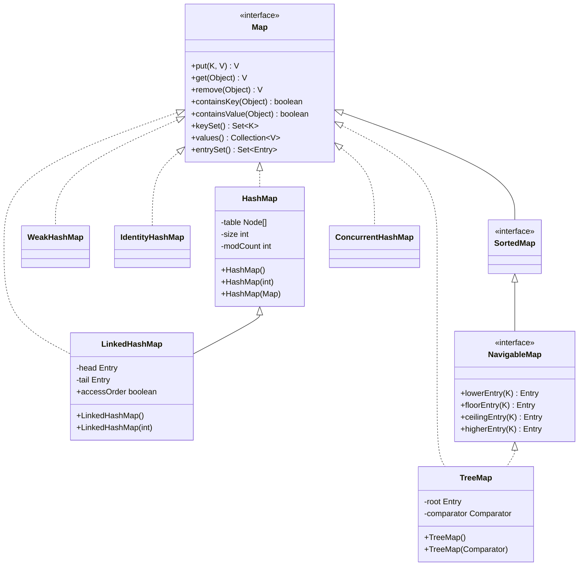
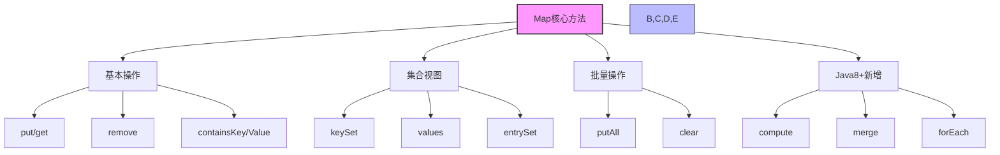
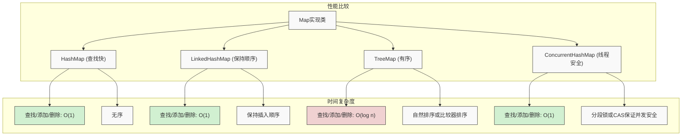
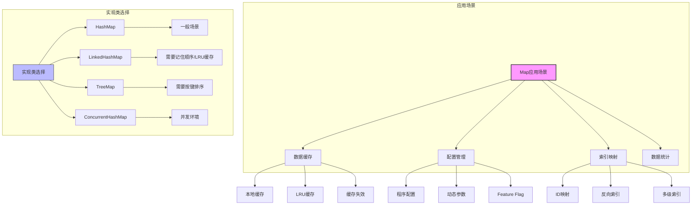

import Tabs from '@theme/Tabs';
import TabItem from '@theme/TabItem';

# Java Map 集合详解

Map是Java集合框架中用于存储键值对的数据结构，它不继承自Collection接口，是一个独立的接口。Map集合在Java开发中应用广泛，从简单的数据缓存到复杂的业务逻辑处理，都离不开Map的支持。

:::tip 核心特性
**Map接口 = 键值对存储 + 键唯一性 + 高效查找 + 灵活操作 + 多种实现选择**
- 🔑 **键值对存储**：每个元素包含键(Key)和值(Value)，形成一对一映射关系
- 🔍 **键唯一性**：每个键在Map中只能出现一次，重复添加会覆盖原值
- ⚡ **高效查找**：大多数实现提供O(1)查找性能，适合频繁检索
- 🛠️ **灵活操作**：支持基于键的增删改查和集合视图操作
- 📦 **丰富实现**：HashMap、TreeMap、LinkedHashMap等多种实现满足不同需求
:::

## 1. Map接口基础概念

### 1.1 什么是Map接口？

Map接口是Java集合框架中的核心接口，用于存储键值对（key-value pair）数据。



Map集合具有以下核心特征：

- **键值对存储**：每个元素包含一个键和一个值
- **键唯一性**：键不能重复，值可以重复
- **高效查找**：基于键的快速查找，时间复杂度O(1)
- **灵活操作**：支持增删改查、批量操作等
- **多种实现**：提供多种实现类满足不同需求

### 1.2 Map接口的重要性

| 重要性 | 具体体现 | 业务价值 |
|--------|----------|----------|
| **数据关联** | 建立键与值之间的映射关系 | 支持复杂的数据关联需求 |
| **快速查找** | 基于键的O(1)查找性能 | 提高数据检索效率 |
| **缓存实现** | 天然适合缓存数据结构 | 支持各种缓存场景 |
| **配置管理** | 键值对形式的配置存储 | 简化配置管理逻辑 |

### 1.3 Map接口设计原则

Map接口的设计遵循以下几个核心原则：

#### 键值对原则
提供键与值之间的映射关系，支持基于键的快速访问

#### 键唯一性原则  
确保键的唯一性，避免数据冲突和覆盖

#### 高效查找原则
基于哈希算法实现高效的查找和访问

#### 灵活操作原则
支持丰富的操作方法，满足各种使用场景

```java title="Map接口核心方法示例"
public interface Map<K,V> {
    
    // ========== 基本操作 ==========
    V put(K key, V value);                    // 添加或更新键值对
    V get(Object key);                        // 根据键获取值
    V remove(Object key);                     // 根据键删除键值对
    boolean containsKey(Object key);          // 是否包含指定键
    boolean containsValue(Object value);      // 是否包含指定值
    
    // ========== 集合操作 ==========
    Set<K> keySet();                          // 获取所有键的集合
    Collection<V> values();                   // 获取所有值的集合
    Set<Map.Entry<K,V>> entrySet();          // 获取所有键值对的集合
    
    // ========== 批量操作 ==========
    void putAll(Map<? extends K,? extends V> m); // 添加另一个Map的所有元素
    void clear();                             // 清空Map
    
    // ========== 查询操作 ==========
    int size();                               // 获取元素个数
    boolean isEmpty();                        // 判断是否为空
}
```

### 1.4 Map接口核心方法详解

Map接口提供了丰富的方法来操作键值对集合，这些方法可以分为几个主要类别：



<Tabs>
<TabItem value="basic" label="基本操作方法">

```java title="Map基本操作方法"
public interface Map<K,V> {
    
    // 添加和更新
    V put(K key, V value);                    // 添加或更新键值对
    V putIfAbsent(K key, V value);            // 如果键不存在则添加
    
    // 获取和查找
    V get(Object key);                        // 根据键获取值
    V getOrDefault(Object key, V defaultValue); // 获取值，不存在返回默认值
    boolean containsKey(Object key);          // 是否包含指定键
    boolean containsValue(Object value);      // 是否包含指定值
    
    // 删除操作
    V remove(Object key);                     // 根据键删除键值对
    boolean remove(Object key, Object value); // 根据键值对删除
}
```

| 方法 | 描述 | 返回值 | 特殊行为 |
|------|------|--------|----------|
| `put(K,V)` | 添加或更新键值对 | 原值或null | 键已存在时会覆盖原值 |
| `get(Object)` | 获取指定键的值 | 值或null | 键不存在返回null |
| `remove(Object)` | 删除键值对 | 被删除的值或null | 键不存在返回null |
| `containsKey(Object)` | 检查键是否存在 | boolean | HashMap为O(1)，TreeMap为O(log n) |
| `containsValue(Object)` | 检查值是否存在 | boolean | 遍历全部元素，性能较差O(n) |

</TabItem>
<TabItem value="view" label="集合视图方法">
```java title="Map集合视图方法"
public interface Map<K,V> {
    
    // 键集合视图
    Set<K> keySet();                          // 获取所有键的Set视图
    NavigableSet<K> navigableKeySet();        // 获取可导航的键Set视图（SortedMap）
    
    // 值集合视图
    Collection<V> values();                   // 获取所有值的Collection视图
    
    // 键值对集合视图
    Set<Map.Entry<K,V>> entrySet();          // 获取所有键值对的Set视图
}
```
    
| 方法 | 描述 | 返回视图特性 | 应用场景 |
|------|------|------------|----------|
| `keySet()` | 获取所有键的Set | 键集合，与原Map同步 | 需要遍历或操作所有键时 |
| `values()` | 获取所有值的集合 | 值集合，与原Map同步 | 需要遍历或访问所有值时 |
| `entrySet()` | 获取所有键值对 | Entry集合，与原Map同步 | 同时需要键和值，效率最高 |

:::info 视图操作特性
Map返回的集合视图具有以下特性：
- 视图是**动态的**，对视图的修改会反映到原Map，反之亦然
- 通过视图的`remove()`方法可以删除Map中的元素
- 不允许通过键集视图添加元素（会抛出`UnsupportedOperationException`）
- 视图对象不需要额外内存，它们引用的是同一个底层数据结构
:::

```java title="视图操作示例"
Map<String, Integer> map = new HashMap<>();
map.put("A", 1);
map.put("B", 2);

// 使用keySet遍历
for (String key : map.keySet()) {
    System.out.println(key);  // 输出: A, B
}

// 使用values遍历
for (Integer value : map.values()) {
    System.out.println(value);  // 输出: 1, 2
}

// 使用entrySet遍历 (最高效)
for (Map.Entry<String, Integer> entry : map.entrySet()) {
    System.out.println(entry.getKey() + ": " + entry.getValue());
}
```

</TabItem>
<TabItem value="batch" label="批量操作方法">
```java title="Map批量操作方法"
public interface Map<K,V> {
    
    // 批量添加
    void putAll(Map<? extends K,? extends V> m); // 添加另一个Map的所有元素
    
    // 批量删除
    void clear();                             // 清空Map
    
    // 条件操作
    V replace(K key, V value);                // 替换指定键的值
    boolean replace(K key, V oldValue, V newValue); // 条件替换
    void replaceAll(BiFunction<? super K,? super V,? extends V> function); // 批量替换
}
```

| 方法 | 描述 | 返回值 | 性能特征 |
|------|------|--------|----------|
| `putAll(Map)` | 批量添加键值对 | void | 时间复杂度O(n) |
| `clear()` | 清空所有键值对 | void | 时间复杂度O(n) |
| `replace(K,V)` | 替换指定键的值 | 原值或null | 键不存在时不操作 |

</TabItem>
<TabItem value="java8" label="Java 8+ 新增方法">
```java title="Map原子操作方法"
public interface Map<K,V> {
    
    // Java 8+ 新增方法
    default V computeIfAbsent(K key, Function<? super K,? extends V> mappingFunction) {
        // 如果键不存在，则计算值并插入
    }
    
    default V computeIfPresent(K key, BiFunction<? super K,? super V,? extends V> remappingFunction) {
        // 如果键存在，则重新计算值
    }
    
    default V compute(K key, BiFunction<? super K,? super V,? extends V> remappingFunction) {
        // 计算新值（无论键是否存在）
    }
    
    default V merge(K key, V value, BiFunction<? super V,? super V,? extends V> remappingFunction) {
        // 合并现有值与给定值
    }
    
    default void forEach(BiConsumer<? super K,? super V> action) {
        // 对每个键值对执行操作
    }
}
```

| 方法 | 描述 | 使用场景 | 优势 |
|------|------|----------|------|
| `computeIfAbsent` | 键不存在时才计算并插入 | 缓存实现 | 避免重复计算 |
| `compute` | 重新计算键的值 | 值依赖于键和旧值 | 原子更新 |
| `merge` | 合并现有值和新值 | 累积统计 | 原子更新 |
| `forEach` | 遍历所有键值对 | 批量处理 | 简洁语法 |

```java title="Java 8 Map方法示例"
Map<String, Integer> scores = new HashMap<>();

// computeIfAbsent示例
scores.computeIfAbsent("Alice", key -> calculateScore(key));  // 键不存在时才计算

// 计数器示例
Map<String, Integer> wordCounts = new HashMap<>();
String[] words = {"apple", "banana", "apple", "orange", "banana", "apple"};

for (String word : words) {
    wordCounts.merge(word, 1, (oldValue, value) -> oldValue + value);
}

// 结果: {orange=1, banana=2, apple=3}
```

</TabItem>
</Tabs>

### 1.5 Map接口方法分类对比

| 方法类别 | 主要方法 | 时间复杂度 | 使用场景 |
|----------|----------|------------|----------|
| **基本操作** | put(K,V), get(K), remove(K) | O(1) - O(log n) | 日常的增删改查操作 |
| **查找操作** | containsKey(K), containsValue(V) | O(1) - O(n) | 键值存在性检查 |
| **集合视图** | keySet(), values(), entrySet() | O(1) | 遍历和批量操作 |
| **批量操作** | putAll(Map), clear() | O(n) | 批量数据处理 |

:::tip 性能考虑
- 基本操作的时间复杂度取决于具体实现类
- HashMap的查找、插入、删除为O(1)
- TreeMap的查找、插入、删除为O(log n)
- 选择实现类时应根据性能要求和使用场景
::: 

## 2. Map 实现类详解



<Tabs>
<TabItem value="hashmap" label="HashMap 实现">

### 2.1 HashMap 概述

:::tip 核心特点
HashMap是基于哈希表实现的Map，是Java中最常用的Map实现类，具有以下特点：
- 🔍 **哈希表实现**：基于数组+链表+红黑树的数据结构
- 🔀 **无序性**：不保证元素的顺序
- ⚪ **允许null**：允许null键和null值
- ⚠️ **线程不安全**：在多线程环境下需要外部同步
- ⚡ **高效操作**：查找、插入、删除性能好，平均O(1)
:::

#### 适用场景
- 一般的键值对存储需求
- 需要高效的查找、插入、删除操作
- 对元素顺序没有要求
- 单线程环境或已进行外部同步

### 2.2 HashMap 内部结构

HashMap基于哈希表实现，内部使用数组+链表+红黑树的数据结构。当链表长度超过阈值时，会转换为红黑树以提高性能。

#### 核心字段

```java title="HashMap核心字段"
public class HashMap<K,V> extends AbstractMap<K,V>
    implements Map<K,V>, Cloneable, Serializable {
    
    // 默认初始容量
    static final int DEFAULT_INITIAL_CAPACITY = 1 << 4; // 16
    
    // 最大容量
    static final int MAXIMUM_CAPACITY = 1 << 30;
    
    // 默认负载因子
    static final float DEFAULT_LOAD_FACTOR = 0.75f;
    
    // 链表转红黑树的阈值
    static final int TREEIFY_THRESHOLD = 8;
    
    // 红黑树转链表的阈值
    static final int UNTREEIFY_THRESHOLD = 6;
    
    // 最小树化容量
    static final int MIN_TREEIFY_CAPACITY = 64;
    
    // 哈希表
    transient Node<K,V>[] table;
    
    // 键值对集合
    transient Set<Map.Entry<K,V>> entrySet;
    
    // 元素个数
    transient int size;
    
    // 修改次数
    transient int modCount;
    
    // 阈值
    int threshold;
    
    // 负载因子
    final float loadFactor;
}
```

#### 构造方法

```java title="HashMap构造方法"
public class HashMap<K,V> extends AbstractMap<K,V> {
    
    /**
     * 构造一个默认初始容量(16)和默认负载因子(0.75)的空HashMap
     */
    public HashMap() {
        this.loadFactor = DEFAULT_LOAD_FACTOR;
    }
    
    /**
     * 构造一个指定初始容量的空HashMap
     */
    public HashMap(int initialCapacity) {
        this(initialCapacity, DEFAULT_LOAD_FACTOR);
    }
    
    /**
     * 构造一个指定初始容量和负载因子的空HashMap
     */
    public HashMap(int initialCapacity, float loadFactor) {
        if (initialCapacity < 0)
            throw new IllegalArgumentException("Illegal initial capacity: " + initialCapacity);
        if (initialCapacity > MAXIMUM_CAPACITY)
            initialCapacity = MAXIMUM_CAPACITY;
        if (loadFactor <= 0 || Float.isNaN(loadFactor))
            throw new IllegalArgumentException("Illegal load factor: " + loadFactor);
        
        this.loadFactor = loadFactor;
        this.threshold = tableSizeFor(initialCapacity);
    }
    
    /**
     * 构造一个包含指定Map元素的HashMap
     */
    public HashMap(Map<? extends K, ? extends V> m) {
        this.loadFactor = DEFAULT_LOAD_FACTOR;
        putMapEntries(m, false);
    }
}
```

#### 内存布局示意图

```
HashMap 实例
┌─────────────────────────────────────────┐
│ table: Node<K,V>[]                      │
│ ├── [0] → Node("key1", "value1")       │
│ ├── [1] → Node("key2", "value2") → Node("key10", "value10")
│ ├── [2] → null                         │
│ └── [3] → TreeNode("key3", "value3")   │
│ size: 4                                │
│ threshold: 12                          │
│ loadFactor: 0.75                       │
└─────────────────────────────────────────┘
```

### 2.3 HashMap 核心方法实现

#### 2.3.1 哈希算法

HashMap使用高效的哈希算法来计算键的哈希值：

```java title="HashMap哈希算法"
public class HashMap<K,V> extends AbstractMap<K,V> {
    
    /**
     * 计算键的哈希值
     * 使用高16位异或低16位的方式减少冲突
     */
    static final int hash(Object key) {
        int h;
        return (key == null) ? 0 : (h = key.hashCode()) ^ (h >>> 16);
    }
    
    /**
     * 计算数组索引
     * 使用位运算替代取模运算，提高性能
     */
    static int indexFor(int h, int length) {
        return h & (length - 1);
    }
    
    /**
     * 计算大于等于给定容量的最小2的幂
     */
    static final int tableSizeFor(int cap) {
        int n = cap - 1;
        n |= n >>> 1;
        n |= n >>> 2;
        n |= n >>> 4;
        n |= n >>> 8;
        n |= n >>> 16;
        return (n < 0) ? 1 : (n >= MAXIMUM_CAPACITY) ? MAXIMUM_CAPACITY : n + 1;
    }
}
```

#### 2.3.2 节点结构

HashMap支持两种节点类型：链表节点和红黑树节点：

```java title="HashMap节点结构"
public class HashMap<K,V> extends AbstractMap<K,V> {
    
    /**
     * 链表节点
     */
static class Node<K,V> implements Map.Entry<K,V> {
    final int hash;
    final K key;
    V value;
    Node<K,V> next;
    
    Node(int hash, K key, V value, Node<K,V> next) {
        this.hash = hash;
        this.key = key;
        this.value = value;
        this.next = next;
    }
    
    public final K getKey()        { return key; }
    public final V getValue()      { return value; }
    public final String toString() { return key + "=" + value; }
    
    public final int hashCode() {
        return Objects.hashCode(key) ^ Objects.hashCode(value);
    }
    
    public final V setValue(V newValue) {
        V oldValue = value;
        value = newValue;
        return oldValue;
    }
    
    public final boolean equals(Object o) {
        if (o == this)
            return true;
        if (o instanceof Map.Entry) {
            Map.Entry<?,?> e = (Map.Entry<?,?>)o;
            if (Objects.equals(key, e.getKey()) &&
                Objects.equals(value, e.getValue()))
                return true;
        }
        return false;
        }
    }
    
    /**
     * 红黑树节点（继承自Node）
     */
    static final class TreeNode<K,V> extends LinkedHashMap.Entry<K,V> {
        TreeNode<K,V> parent;  // 父节点
        TreeNode<K,V> left;    // 左子节点
        TreeNode<K,V> right;   // 右子节点
        TreeNode<K,V> prev;    // 前驱节点
        boolean red;           // 颜色标记
        
        TreeNode(int hash, K key, V val, Node<K,V> next) {
            super(hash, key, val, next);
        }
    }
}
```

#### 2.3.3 添加元素

```java title="HashMap添加元素实现"
public class HashMap<K,V> extends AbstractMap<K,V> {
    
    /**
     * 添加或更新键值对
     * 时间复杂度：平均O(1)，最坏情况O(n)
     */
    public V put(K key, V value) {
        return putVal(hash(key), key, value, false, true);
    }
    
    /**
     * 核心添加方法
     */
    final V putVal(int hash, K key, V value, boolean onlyIfAbsent, boolean evict) {
        Node<K,V>[] tab; Node<K,V> p; int n, i;
        
        // 如果表为空或长度为0，进行初始化
        if ((tab = table) == null || (n = tab.length) == 0)
            n = (tab = resize()).length;
        
        // 计算索引位置
        if ((p = tab[i = (n - 1) & hash]) == null)
            // 如果该位置为空，直接创建新节点
            tab[i] = newNode(hash, key, value, null);
        else {
            Node<K,V> e; K k;
            if (p.hash == hash &&
                ((k = p.key) == key || (key != null && key.equals(k))))
                // 如果键相同，更新值
                e = p;
            else if (p instanceof TreeNode)
                // 如果是红黑树节点，在树中插入
                e = ((TreeNode<K,V>)p).putTreeVal(this, tab, hash, key, value);
            else {
                // 在链表中查找或插入
                for (int binCount = 0; ; ++binCount) {
                    if ((e = p.next) == null) {
                        p.next = newNode(hash, key, value, null);
                        if (binCount >= TREEIFY_THRESHOLD - 1)
                            treeifyBin(tab, hash);
                        break;
                    }
                    if (e.hash == hash &&
                        ((k = e.key) == key || (key != null && key.equals(k))))
                        break;
                    p = e;
                }
            }
            
            if (e != null) { // 如果找到了相同的键
                V oldValue = e.value;
                if (!onlyIfAbsent || oldValue == null)
                    e.value = value;
                afterNodeAccess(e);
                return oldValue;
            }
        }
        
        ++modCount;
        if (++size > threshold)
            resize();
        afterNodeInsertion(evict);
        return null;
    }
}
```

#### 2.3.4 扩容机制

当HashMap的元素个数超过阈值时，会自动扩容：

```java title="HashMap扩容机制"
public class HashMap<K,V> extends AbstractMap<K,V> {
    
    /**
     * 扩容方法
     */
    final Node<K,V>[] resize() {
        Node<K,V>[] oldTab = table;
        int oldCap = (oldTab == null) ? 0 : oldTab.length;
        int oldThr = threshold;
        int newCap, newThr = 0;
        
        if (oldCap > 0) {
            if (oldCap >= MAXIMUM_CAPACITY) {
                threshold = Integer.MAX_VALUE;
                return oldTab;
            }
            else if ((newCap = oldCap << 1) < MAXIMUM_CAPACITY &&
                     oldCap >= DEFAULT_INITIAL_CAPACITY)
                newThr = oldThr << 1; // 双倍扩容
        }
        else if (oldThr > 0)
            newCap = oldThr;
        else {
            newCap = DEFAULT_INITIAL_CAPACITY;
            newThr = (int)(DEFAULT_LOAD_FACTOR * DEFAULT_INITIAL_CAPACITY);
        }
        
        if (newThr == 0) {
            float ft = (float)newCap * loadFactor;
            newThr = (newCap < MAXIMUM_CAPACITY && ft < (float)MAXIMUM_CAPACITY ?
                      (int)ft : Integer.MAX_VALUE);
        }
        
        threshold = newThr;
        @SuppressWarnings({"rawtypes","unchecked"})
        Node<K,V>[] newTab = (Node<K,V>[])new Node[newCap];
        table = newTab;
        
        if (oldTab != null) {
            // 重新哈希所有元素
            for (int j = 0; j < oldCap; ++j) {
                Node<K,V> e;
                if ((e = oldTab[j]) != null) {
                    oldTab[j] = null;
                    if (e.next == null)
                        newTab[e.hash & (newCap - 1)] = e;
                    else if (e instanceof TreeNode)
                        ((TreeNode<K,V>)e).split(this, newTab, j, oldCap);
                    else {
                        Node<K,V> loHead = null, loTail = null;
                        Node<K,V> hiHead = null, hiTail = null;
                        Node<K,V> next;
                        do {
                            next = e.next;
                            if ((e.hash & oldCap) == 0) {
                                if (loTail == null)
                                    loHead = e;
                                else
                                    loTail.next = e;
                                loTail = e;
                            }
                            else {
                                if (hiTail == null)
                                    hiHead = e;
                                else
                                    hiTail.next = e;
                                hiTail = e;
                            }
                        } while ((e = next) != null);
                        if (loTail != null) {
                            loTail.next = null;
                            newTab[j] = loHead;
                        }
                        if (hiTail != null) {
                            hiTail.next = null;
                            newTab[j + oldCap] = hiHead;
                        }
                    }
                }
            }
        }
        return newTab;
    }
}
```

:::tip 扩容策略
- 默认初始容量：16
- 扩容触发：当元素个数超过threshold时
- 扩容倍数：2倍（newCap = oldCap \<\< 1）
- 阈值计算：threshold = capacity * loadFactor
- 扩容开销：需要重新哈希所有元素，开销较大
:::

### 2.4 HashMap 性能分析

#### 2.4.1 时间复杂度对比

| 操作 | 时间复杂度 | 说明 |
|------|------------|------|
| **查找** | 平均O(1) | 基于哈希值直接定位 |
| **插入** | 平均O(1) | 直接插入或更新 |
| **删除** | 平均O(1) | 直接删除节点 |
| **遍历** | O(n) | 需要遍历所有元素 |

#### 2.4.2 空间复杂度

- **存储开销**：每个键值对需要一个Node对象
- **数组开销**：哈希表数组的空间开销
- **链表开销**：冲突时链表的额外空间
- **红黑树开销**：树化时的额外空间

#### 2.4.3 性能优化建议

```java title="HashMap性能优化示例"
public class HashMapOptimization {
    
    public static void main(String[] args) {
        // 1. 预分配容量，避免频繁扩容
        Map<String, Integer> map1 = new HashMap<>(1000);
        
        // 2. 选择合适的负载因子
        Map<String, Integer> map2 = new HashMap<>(16, 0.5f); // 降低负载因子
        
        // 3. 使用合适的键类型
        Map<String, Integer> goodKeys = new HashMap<>(); // 推荐：不可变对象
        // Map<StringBuilder, Integer> badKeys = new HashMap<>(); // 不推荐：可变对象
        
        // 4. 批量操作
        Map<String, Integer> sourceMap = new HashMap<>();
        sourceMap.put("A", 1);
        sourceMap.put("B", 2);
        
        Map<String, Integer> targetMap = new HashMap<>();
        targetMap.putAll(sourceMap); // 批量添加
        
        // 5. 使用getOrDefault避免null检查
        Integer value = targetMap.getOrDefault("C", 0);
        
        // 6. 使用computeIfAbsent延迟初始化
        targetMap.computeIfAbsent("D", k -> expensiveOperation(k));
    }
    
    private static Integer expensiveOperation(String key) {
        // 模拟昂贵的操作
        return key.length() * 10;
    }
}
```

### 2.5 HashMap 使用示例

#### 2.5.1 基本操作示例

```java title="HashMap基本操作示例"
public class HashMapBasicExample {
    
    public static void main(String[] args) {
        // 创建HashMap
        Map<String, Integer> map = new HashMap<>();
        
        // 添加元素
        map.put("Java", 1);
        map.put("Python", 2);
        map.put("C++", 3);
        
        // 获取元素
        Integer value = map.get("Java");
        System.out.println("Java的值: " + value);
        
        // 检查键是否存在
        boolean containsKey = map.containsKey("Java");
        System.out.println("是否包含Java: " + containsKey);
        
        // 检查值是否存在
        boolean containsValue = map.containsValue(2);
        System.out.println("是否包含值2: " + containsValue);
        
        // 删除元素
        map.remove("C++");
        
        // 遍历键值对
        for (Map.Entry<String, Integer> entry : map.entrySet()) {
            System.out.println(entry.getKey() + ": " + entry.getValue());
        }
        
        // 遍历键
        for (String key : map.keySet()) {
            System.out.println("键: " + key);
        }
        
        // 遍历值
        for (Integer val : map.values()) {
            System.out.println("值: " + val);
        }
    }
}
```

#### 2.5.2 高级操作示例

```java title="HashMap高级操作示例"
public class HashMapAdvancedExample {
    
    public static void main(String[] args) {
        Map<String, Integer> map = new HashMap<>();
        
        // 批量添加
        map.putAll(Map.of("A", 1, "B", 2, "C", 3));
        
        // 条件操作
        map.putIfAbsent("A", 10); // 如果键不存在则添加
        map.replace("B", 2, 20);  // 条件替换
        map.remove("C", 3);       // 条件删除
        
        // 计算操作
        map.compute("D", (k, v) -> (v == null) ? 1 : v + 1);
        map.computeIfAbsent("E", k -> k.length());
        map.computeIfPresent("A", (k, v) -> v * 2);
        
        // 合并操作
        map.merge("F", 1, (oldValue, newValue) -> oldValue + newValue);
        
        // 批量替换
        map.replaceAll((k, v) -> v * 10);
        
        System.out.println("操作后的Map: " + map);
    }
} 

</TabItem>
<TabItem value="linkedhashmap" label="LinkedHashMap 实现">

### 3.1 LinkedHashMap 概述

:::tip 核心特点
LinkedHashMap是HashMap的子类，它在HashMap的基础上维护了一个双向链表，具有以下特点：
- 🔄 **继承HashMap**：拥有HashMap的所有特性
- 📝 **维护顺序**：维护插入顺序或访问顺序
- 🔗 **双向链表**：通过双向链表维护元素顺序
- 🗄️ **LRU缓存**：可以实现LRU（最近最少使用）缓存
- 📉 **性能略低**：相比HashMap有轻微的性能开销
:::

#### 适用场景
- 需要保持元素插入顺序的场景
- 需要实现LRU缓存的场景
- 需要按访问顺序排序的场景
- 对顺序有要求但不需要排序的场景

### 3.2 LinkedHashMap 内部结构

LinkedHashMap在HashMap的基础上增加了双向链表来维护元素顺序：

```java title="LinkedHashMap核心字段"
public class LinkedHashMap<K,V> extends HashMap<K,V> implements Map<K,V> {
    
    // 双向链表节点
    static class Entry<K,V> extends HashMap.Node<K,V> {
        Entry<K,V> before, after;  // 前驱和后继节点
        Entry(int hash, K key, V value, Node<K,V> next) {
            super(hash, key, value, next);
        }
    }
    
    // 头节点
    transient LinkedHashMap.Entry<K,V> head;
    
    // 尾节点
    transient LinkedHashMap.Entry<K,V> tail;
    
    // 是否按访问顺序排序
    final boolean accessOrder;
}
```

#### 内存布局示意图

```
LinkedHashMap 实例
┌─────────────────────────────────────────┐
│ HashMap部分                              │
│ table: Node<K,V>[]                      │
│ ├── [0] → Entry("key1", "value1")      │
│ ├── [1] → Entry("key2", "value2")      │
│ └── [2] → null                         │
│                                         │
│ 双向链表部分                             │
│ head → Entry1 ←→ Entry2 ←→ Entry3 ← tail│
│         │         │         │           │
│      before    before    before        │
│      after     after     after         │
│                                         │
│ accessOrder: false                      │
└─────────────────────────────────────────┘
```

### 3.3 LinkedHashMap 核心方法实现

#### 3.3.1 节点链接

```java title="LinkedHashMap节点链接"
public class LinkedHashMap<K,V> extends HashMap<K,V> {
    
    /**
     * 在链表头部添加节点
     */
    private void linkNodeLast(LinkedHashMap.Entry<K,V> p) {
        LinkedHashMap.Entry<K,V> last = tail;
        tail = p;
        if (last == null)
            head = p;
        else {
            p.before = last;
            last.after = p;
        }
    }
    
    /**
     * 在链表头部添加节点
     */
    private void linkNodeFirst(LinkedHashMap.Entry<K,V> p) {
        LinkedHashMap.Entry<K,V> first = head;
        head = p;
        if (first == null)
            tail = p;
        else {
            p.after = first;
            first.before = p;
        }
    }
    
    /**
     * 从链表中移除节点
     */
    private void unlinkNode(LinkedHashMap.Entry<K,V> p) {
        LinkedHashMap.Entry<K,V> before = p.before;
        LinkedHashMap.Entry<K,V> after = p.after;
        
        if (before == null)
            head = after;
        else {
            before.after = after;
            p.before = null;
        }
        
        if (after == null)
            tail = before;
        else {
            after.before = before;
            p.after = null;
        }
    }
}
```

#### 3.3.2 访问顺序维护

```java title="LinkedHashMap访问顺序维护"
public class LinkedHashMap<K,V> extends HashMap<K,V> {
    
    /**
     * 访问节点后的处理
     */
    void afterNodeAccess(Node<K,V> e) {
        LinkedHashMap.Entry<K,V> last;
        if (accessOrder && (last = tail) != e) {
            LinkedHashMap.Entry<K,V> p = (LinkedHashMap.Entry<K,V>)e;
            LinkedHashMap.Entry<K,V> b = p.before;
            LinkedHashMap.Entry<K,V> a = p.after;
            p.after = null;
            if (b == null)
                head = a;
            else
                b.after = a;
            if (a != null)
                a.before = b;
            else
                last = b;
            if (last == null)
                head = p;
            else {
                p.before = last;
                last.after = p;
            }
            tail = p;
            ++modCount;
        }
    }
    
    /**
     * 插入节点后的处理
     */
    void afterNodeInsertion(boolean evict) {
        LinkedHashMap.Entry<K,V> first;
        if (evict && (first = head) != null && removeEldestEntry(first)) {
            K key = first.key;
            removeNode(hash(key), key, null, false, true);
        }
    }
    
    /**
     * 是否移除最老的节点（用于LRU缓存）
     */
    protected boolean removeEldestEntry(Map.Entry<K,V> eldest) {
        return false; // 默认不移除
    }
}
```

### 3.4 LinkedHashMap 使用示例

#### 3.4.1 基本使用示例

```java title="LinkedHashMap基本使用示例"
public class LinkedHashMapBasicExample {
    
    public static void main(String[] args) {
        // 按插入顺序排序
        Map<String, Integer> insertOrderMap = new LinkedHashMap<>();
        insertOrderMap.put("Java", 1);
        insertOrderMap.put("Python", 2);
        insertOrderMap.put("C++", 3);
        
        System.out.println("按插入顺序:");
        for (Map.Entry<String, Integer> entry : insertOrderMap.entrySet()) {
            System.out.println(entry.getKey() + ": " + entry.getValue());
        }
        
        // 按访问顺序排序
        Map<String, Integer> accessOrderMap = new LinkedHashMap<>(16, 0.75f, true);
        accessOrderMap.put("Java", 1);
        accessOrderMap.put("Python", 2);
        accessOrderMap.put("C++", 3);
        
        // 访问元素，会改变顺序
        accessOrderMap.get("Java");
        accessOrderMap.get("Python");
        
        System.out.println("按访问顺序:");
        for (Map.Entry<String, Integer> entry : accessOrderMap.entrySet()) {
            System.out.println(entry.getKey() + ": " + entry.getValue());
        }
    }
}
```

#### 3.4.2 LRU缓存实现

```java title="LinkedHashMap实现LRU缓存"
public class LRUCache<K, V> extends LinkedHashMap<K, V> {
    private final int capacity;
    
    public LRUCache(int capacity) {
        super(capacity, 0.75f, true); // 按访问顺序排序
        this.capacity = capacity;
    }
    
    @Override
    protected boolean removeEldestEntry(Map.Entry<K, V> eldest) {
        return size() > capacity; // 超过容量时移除最老的元素
    }
    
    public static void main(String[] args) {
        LRUCache<String, Integer> cache = new LRUCache<>(3);
        
        cache.put("A", 1);
        cache.put("B", 2);
        cache.put("C", 3);
        
        System.out.println("初始缓存: " + cache);
        
        cache.get("A"); // 访问A，A变为最新
        cache.put("D", 4); // 添加D，B被移除（最老的）
        
        System.out.println("访问A后添加D: " + cache);
    }
}
```

</TabItem>
<TabItem value="treemap" label="TreeMap 实现">

### 4.1 TreeMap 概述

:::tip 核心特点
TreeMap是基于红黑树实现的Map，具有以下特点：
- 🌳 **红黑树实现**：基于红黑树的有序数据结构
- 📊 **有序性**：按键的自然顺序或自定义顺序排序
- ⛔ **不允许null键**：键不能为null，值可以为null
- ⚠️ **线程不安全**：在多线程环境下需要外部同步
- 📈 **性能稳定**：查找、插入、删除性能为O(log n)
:::

</TabItem>
</Tabs>

#### 适用场景
- 需要按键排序的场景
- 需要范围查询的场景
- 需要获取最大最小键的场景
- 对性能稳定性要求较高的场景

### 4.2 TreeMap 内部结构

TreeMap基于红黑树实现，每个节点包含键值对和左右子节点：

```java title="TreeMap核心字段"
public class TreeMap<K,V> extends AbstractMap<K,V>
    implements NavigableMap<K,V>, Cloneable, java.io.Serializable {
    
    // 比较器
    private final Comparator<? super K> comparator;
    
    // 根节点
    private transient Entry<K,V> root;
    
    // 元素个数
    private transient int size = 0;
    
    // 修改次数
    private transient int modCount = 0;
    
    // 红黑树节点
    static final class Entry<K,V> implements Map.Entry<K,V> {
        K key;
        V value;
        Entry<K,V> left;
        Entry<K,V> right;
        Entry<K,V> parent;
        boolean color = BLACK;
        
        Entry(K key, V value, Entry<K,V> parent) {
            this.key = key;
            this.value = value;
            this.parent = parent;
        }
    }
}
```

### 4.3 TreeMap 核心方法实现

#### 4.3.1 查找操作

```java title="TreeMap查找操作"
public class TreeMap<K,V> extends AbstractMap<K,V> {
    
    /**
     * 根据键获取值
     * 时间复杂度：O(log n)
     */
    public V get(Object key) {
        Entry<K,V> p = getEntry(key);
        return (p == null ? null : p.value);
    }
    
    /**
     * 查找指定键的节点
     */
    final Entry<K,V> getEntry(Object key) {
        if (comparator != null)
            return getEntryUsingComparator(key);
        if (key == null)
            throw new NullPointerException();
        @SuppressWarnings("unchecked")
        Comparable<? super K> k = (Comparable<? super K>) key;
        Entry<K,V> p = root;
        while (p != null) {
            int cmp = k.compareTo(p.key);
            if (cmp < 0)
                p = p.left;
            else if (cmp > 0)
                p = p.right;
            else
                return p;
        }
        return null;
    }
    
    /**
     * 使用比较器查找
     */
    final Entry<K,V> getEntryUsingComparator(Object key) {
        @SuppressWarnings("unchecked")
        K k = (K) key;
        Comparator<? super K> cpr = comparator;
        if (cpr != null) {
            Entry<K,V> p = root;
            while (p != null) {
                int cmp = cpr.compare(k, p.key);
                if (cmp < 0)
                    p = p.left;
                else if (cmp > 0)
                    p = p.right;
                else
                    return p;
            }
        }
        return null;
    }
}
```

#### 4.3.2 插入操作

```java title="TreeMap插入操作"
public class TreeMap<K,V> extends AbstractMap<K,V> {
    
    /**
     * 添加或更新键值对
     * 时间复杂度：O(log n)
     */
    public V put(K key, V value) {
        Entry<K,V> t = root;
        if (t == null) {
            compare(key, key); // 类型检查
            root = new Entry<>(key, value, null);
            size = 1;
            modCount++;
            return null;
        }
        int cmp;
        Entry<K,V> parent;
        Comparator<? super K> cpr = comparator;
        if (cpr != null) {
            do {
                parent = t;
                cmp = cpr.compare(key, t.key);
                if (cmp < 0)
                    t = t.left;
                else if (cmp > 0)
                    t = t.right;
                else
                    return t.setValue(value);
            } while (t != null);
        } else {
            if (key == null)
                throw new NullPointerException();
            @SuppressWarnings("unchecked")
            Comparable<? super K> k = (Comparable<? super K>) key;
            do {
                parent = t;
                cmp = k.compareTo(t.key);
                if (cmp < 0)
                    t = t.left;
                else if (cmp > 0)
                    t = t.right;
                else
                    return t.setValue(value);
            } while (t != null);
        }
        Entry<K,V> e = new Entry<>(key, value, parent);
        if (cmp < 0)
            parent.left = e;
        else
            parent.right = e;
        fixAfterInsertion(e);
        size++;
        modCount++;
        return null;
    }
}
```

### 4.4 TreeMap 使用示例

#### 4.4.1 基本使用示例

```java title="TreeMap基本使用示例"
public class TreeMapBasicExample {
    
    public static void main(String[] args) {
        // 自然顺序排序
        Map<String, Integer> naturalOrderMap = new TreeMap<>();
        naturalOrderMap.put("Java", 1);
        naturalOrderMap.put("Python", 2);
        naturalOrderMap.put("C++", 3);
        
        System.out.println("自然顺序:");
        for (Map.Entry<String, Integer> entry : naturalOrderMap.entrySet()) {
            System.out.println(entry.getKey() + ": " + entry.getValue());
        }
        
        // 自定义比较器
        Map<String, Integer> customOrderMap = new TreeMap<>((s1, s2) -> s2.compareTo(s1));
        customOrderMap.put("Java", 1);
        customOrderMap.put("Python", 2);
        customOrderMap.put("C++", 3);
        
        System.out.println("自定义顺序:");
        for (Map.Entry<String, Integer> entry : customOrderMap.entrySet()) {
            System.out.println(entry.getKey() + ": " + entry.getValue());
        }
    }
}
```

#### 4.4.2 导航方法示例

```java title="TreeMap导航方法示例"
public class TreeMapNavigationExample {
    
    public static void main(String[] args) {
        TreeMap<String, Integer> treeMap = new TreeMap<>();
        treeMap.put("A", 1);
        treeMap.put("B", 2);
        treeMap.put("C", 3);
        treeMap.put("D", 4);
        treeMap.put("E", 5);
        
        // 获取第一个元素
        Map.Entry<String, Integer> first = treeMap.firstEntry();
        System.out.println("第一个元素: " + first.getKey() + "=" + first.getValue());
        
        // 获取最后一个元素
        Map.Entry<String, Integer> last = treeMap.lastEntry();
        System.out.println("最后一个元素: " + last.getKey() + "=" + last.getValue());
        
        // 获取小于指定键的最大键值对
        Map.Entry<String, Integer> lower = treeMap.lowerEntry("C");
        System.out.println("小于C的最大元素: " + lower.getKey() + "=" + lower.getValue());
        
        // 获取大于指定键的最小键值对
        Map.Entry<String, Integer> higher = treeMap.higherEntry("B");
        System.out.println("大于B的最小元素: " + higher.getKey() + "=" + higher.getValue());
        
        // 范围查询
        SortedMap<String, Integer> subMap = treeMap.subMap("B", "D");
        System.out.println("B到D的子Map: " + subMap);
    }
}
```

## 5. ConcurrentHashMap 实现类详解

### 5.1 ConcurrentHashMap 概述

:::tip 核心特点
ConcurrentHashMap是线程安全的HashMap实现，具有以下特点：
- **线程安全**：支持多线程并发访问
- **分段锁机制**：使用分段锁减少锁竞争
- **不允许null**：键和值都不能为null
- **高性能**：性能优于Hashtable和Collections.synchronizedMap
- **原子操作**：提供原子操作方法
:::

#### 适用场景
- 多线程环境下的Map操作
- 高并发场景下的缓存实现
- 需要线程安全的键值对存储
- 对性能要求较高的并发应用

### 5.2 ConcurrentHashMap 内部结构

ConcurrentHashMap使用分段锁机制，将整个Map分成多个段，每个段使用独立的锁：

```java title="ConcurrentHashMap核心字段"
public class ConcurrentHashMap<K,V> extends AbstractMap<K,V>
    implements ConcurrentMap<K,V>, Serializable {
    
    // 段数组
    final Segment<K,V>[] segments;
    
    // 段的数量
    static final int DEFAULT_CONCURRENCY_LEVEL = 16;
    
    // 段类
    static final class Segment<K,V> extends ReentrantLock implements Serializable {
        transient volatile HashEntry<K,V>[] table;
        transient int count;
        transient int modCount;
        transient int threshold;
        final float loadFactor;
    }
    
    // 哈希表节点
    static final class HashEntry<K,V> {
        final K key;
        final int hash;
        volatile V value;
        final HashEntry<K,V> next;
        
        HashEntry(K key, int hash, HashEntry<K,V> next, V value) {
            this.key = key;
            this.hash = hash;
            this.next = next;
            this.value = value;
        }
    }
}
```

### 5.3 ConcurrentHashMap 使用示例

#### 5.3.1 基本使用示例

```java title="ConcurrentHashMap基本使用示例"
public class ConcurrentHashMapBasicExample {
    
    public static void main(String[] args) {
        Map<String, Integer> map = new ConcurrentHashMap<>();
        
        // 多线程安全操作
        Thread t1 = new Thread(() -> {
            for (int i = 0; i < 1000; i++) {
                map.put("Thread1-" + i, i);
            }
        });
        
        Thread t2 = new Thread(() -> {
            for (int i = 0; i < 1000; i++) {
                map.put("Thread2-" + i, i);
            }
        });
        
        t1.start();
        t2.start();
        
        try {
            t1.join();
            t2.join();
        } catch (InterruptedException e) {
            e.printStackTrace();
        }
        
        System.out.println("最终大小: " + map.size());
    }
}
```

#### 5.3.2 原子操作示例

```java title="ConcurrentHashMap原子操作示例"
public class ConcurrentHashMapAtomicExample {
    
    public static void main(String[] args) {
        ConcurrentHashMap<String, Integer> map = new ConcurrentHashMap<>();
        
        // 原子操作
        map.putIfAbsent("key", 1);  // 如果键不存在则添加
        map.replace("key", 1, 2);   // 如果值等于1则替换为2
        map.remove("key", 2);       // 如果值等于2则删除
        
        // 原子更新
        map.put("counter", 0);
        map.compute("counter", (k, v) -> v + 1);
        map.merge("counter", 1, Integer::sum);
        
        System.out.println("最终结果: " + map);
    }
} 

## 6. 其他Map实现

### 6.1 Hashtable

Hashtable是Java早期提供的线程安全的Map实现，现在已经不推荐使用：

```java title="Hashtable示例"
public class HashtableExample {
    
    public static void main(String[] args) {
        Map<String, Integer> map = new Hashtable<>();
        
        // 基本操作
        map.put("Java", 1);
        map.put("Python", 2);
        
        // 不允许null键和null值
        // map.put(null, 1);  // 抛出NullPointerException
        // map.put("key", null);  // 抛出NullPointerException
        
        System.out.println(map);
        
        // 性能对比
        long start = System.currentTimeMillis();
        for (int i = 0; i < 100000; i++) {
            map.put("key" + i, i);
        }
        long end = System.currentTimeMillis();
        System.out.println("Hashtable插入100000个元素耗时: " + (end - start) + "ms");
    }
}
```

### 6.2 WeakHashMap

WeakHashMap使用弱引用作为键，当键不再被强引用时，对应的键值对会被自动回收：

```java title="WeakHashMap示例"
public class WeakHashMapExample {
    
    public static void main(String[] args) {
        Map<String, Integer> map = new WeakHashMap<>();
        
        String key1 = new String("key1");
        String key2 = new String("key2");
        
        map.put(key1, 1);
        map.put(key2, 2);
        
        System.out.println("GC前: " + map.size()); // 2
        
        // 释放强引用
        key1 = null;
        key2 = null;
        
        // 触发GC
        System.gc();
        
        System.out.println("GC后: " + map.size()); // 0
    }
}
```

### 6.3 IdentityHashMap

IdentityHashMap使用`==`而不是`equals()`来比较键，适用于需要精确对象引用的场景：

```java title="IdentityHashMap示例"
public class IdentityHashMapExample {
    
    public static void main(String[] args) {
        Map<String, Integer> normalMap = new HashMap<>();
        Map<String, Integer> identityMap = new IdentityHashMap<>();
        
        String key1 = new String("key");
        String key2 = new String("key");
        
        // HashMap使用equals()比较
        normalMap.put(key1, 1);
        normalMap.put(key2, 2);
        System.out.println("HashMap大小: " + normalMap.size()); // 1
        
        // IdentityHashMap使用==比较
        identityMap.put(key1, 1);
        identityMap.put(key2, 2);
        System.out.println("IdentityHashMap大小: " + identityMap.size()); // 2
    }
}
```

## 7. 实际应用场景



### 7.1 缓存系统

```java title="缓存系统示例"
public class CacheSystemExample {
    
    /**
     * 简单的内存缓存实现
     */
    public static class SimpleCache<K, V> {
        private final Map<K, V> cache = new ConcurrentHashMap<>();
        private final Map<K, Long> timestamps = new ConcurrentHashMap<>();
        private final long ttl; // 生存时间
        
        public SimpleCache(long ttl) {
            this.ttl = ttl;
        }
        
        public V get(K key) {
            V value = cache.get(key);
            if (value != null) {
                Long timestamp = timestamps.get(key);
                if (timestamp != null && System.currentTimeMillis() - timestamp < ttl) {
                    return value;
                } else {
                    // 过期，删除
                    cache.remove(key);
                    timestamps.remove(key);
                }
            }
            return null;
        }
        
        public void put(K key, V value) {
            cache.put(key, value);
            timestamps.put(key, System.currentTimeMillis());
        }
        
        public void clear() {
            cache.clear();
            timestamps.clear();
        }
    }
    
    public static void main(String[] args) {
        SimpleCache<String, String> cache = new SimpleCache<>(5000); // 5秒TTL
        
        cache.put("user:1", "Alice");
        cache.put("user:2", "Bob");
        
        System.out.println("获取用户1: " + cache.get("user:1"));
        
        // 等待6秒后，缓存过期
        try {
            Thread.sleep(6000);
        } catch (InterruptedException e) {
            e.printStackTrace();
        }
        
        System.out.println("6秒后获取用户1: " + cache.get("user:1")); // null
    }
}
```

### 7.2 配置管理

```java title="配置管理示例"
public class ConfigManagementExample {
    
    /**
     * 配置管理器
     */
    public static class ConfigManager {
        private final Map<String, Object> config = new ConcurrentHashMap<>();
        private final Map<String, List<ConfigChangeListener>> listeners = new ConcurrentHashMap<>();
        
        public void setConfig(String key, Object value) {
            Object oldValue = config.put(key, value);
            notifyListeners(key, oldValue, value);
        }
        
        public Object getConfig(String key) {
            return config.get(key);
        }
        
        public <T> T getConfig(String key, Class<T> type) {
            Object value = config.get(key);
            return type.isInstance(value) ? type.cast(value) : null;
        }
        
        public void addListener(String key, ConfigChangeListener listener) {
            listeners.computeIfAbsent(key, k -> new ArrayList<>()).add(listener);
        }
        
        private void notifyListeners(String key, Object oldValue, Object newValue) {
            List<ConfigChangeListener> keyListeners = listeners.get(key);
            if (keyListeners != null) {
                for (ConfigChangeListener listener : keyListeners) {
                    listener.onConfigChange(key, oldValue, newValue);
                }
            }
        }
    }
    
    @FunctionalInterface
    interface ConfigChangeListener {
        void onConfigChange(String key, Object oldValue, Object newValue);
    }
    
    public static void main(String[] args) {
        ConfigManager configManager = new ConfigManager();
        
        // 添加配置变更监听器
        configManager.addListener("database.url", (key, oldValue, newValue) -> {
            System.out.println("数据库URL变更: " + oldValue + " -> " + newValue);
        });
        
        // 设置配置
        configManager.setConfig("database.url", "jdbc:mysql://localhost:3306/test");
        configManager.setConfig("database.url", "jdbc:mysql://localhost:3306/prod");
        
        // 获取配置
        String dbUrl = configManager.getConfig("database.url", String.class);
        System.out.println("当前数据库URL: " + dbUrl);
    }
}
```

### 7.3 数据统计

```java title="数据统计示例"
public class DataStatisticsExample {
    
    /**
     * 用户行为统计
     */
    public static class UserBehaviorStats {
        private final Map<String, Integer> pageViews = new ConcurrentHashMap<>();
        private final Map<String, Set<String>> uniqueUsers = new ConcurrentHashMap<>();
        private final Map<String, List<Long>> accessTimes = new ConcurrentHashMap<>();
        
        public void recordPageView(String page, String userId) {
            // 页面访问次数统计
            pageViews.merge(page, 1, Integer::sum);
            
            // 独立用户统计
            uniqueUsers.computeIfAbsent(page, k -> ConcurrentHashMap.newKeySet()).add(userId);
            
            // 访问时间记录
            accessTimes.computeIfAbsent(page, k -> new ArrayList<>()).add(System.currentTimeMillis());
        }
        
        public int getPageViews(String page) {
            return pageViews.getOrDefault(page, 0);
        }
        
        public int getUniqueUsers(String page) {
            Set<String> users = uniqueUsers.get(page);
            return users != null ? users.size() : 0;
        }
        
        public double getAverageAccessTime(String page) {
            List<Long> times = accessTimes.get(page);
            if (times == null || times.isEmpty()) {
                return 0.0;
            }
            return times.stream().mapToLong(Long::longValue).average().orElse(0.0);
        }
        
        public Map<String, Integer> getTopPages(int limit) {
            return pageViews.entrySet().stream()
                .sorted(Map.Entry.<String, Integer>comparingByValue().reversed())
                .limit(limit)
                .collect(Collectors.toMap(
                    Map.Entry::getKey,
                    Map.Entry::getValue,
                    (e1, e2) -> e1,
                    LinkedHashMap::new
                ));
        }
    }
    
    public static void main(String[] args) {
        UserBehaviorStats stats = new UserBehaviorStats();
        
        // 模拟用户访问
        stats.recordPageView("home", "user1");
        stats.recordPageView("home", "user2");
        stats.recordPageView("home", "user1");
        stats.recordPageView("products", "user1");
        stats.recordPageView("products", "user3");
        
        System.out.println("首页访问次数: " + stats.getPageViews("home"));
        System.out.println("首页独立用户: " + stats.getUniqueUsers("home"));
        System.out.println("热门页面: " + stats.getTopPages(3));
    }
}
```

## 8. 最佳实践总结

### 8.1 Map实现类选择策略

:::tip 选择建议
选择合适的Map实现类需要考虑以下因素：
- **性能要求**：HashMap性能最好，TreeMap性能稳定
- **顺序要求**：需要顺序选择LinkedHashMap或TreeMap
- **线程安全**：多线程环境选择ConcurrentHashMap
- **内存管理**：缓存场景考虑WeakHashMap
- **特殊需求**：根据具体业务需求选择
:::

| 实现类 | 适用场景 | 优势 | 劣势 |
|--------|----------|------|------|
| **HashMap** | 一般用途 | 性能最好、功能完整 | 无序、线程不安全 |
| **LinkedHashMap** | 需要保持顺序 | 维护插入/访问顺序 | 性能略低于HashMap |
| **TreeMap** | 需要排序 | 有序、支持范围查询 | 性能O(log n) |
| **ConcurrentHashMap** | 多线程环境 | 线程安全、高性能 | 不允许null键值 |
| **WeakHashMap** | 缓存场景 | 自动回收、内存友好 | 键可能被回收 |
| **Hashtable** | 不推荐使用 | 线程安全 | 性能差、已过时 |

### 8.2 性能优化策略

```java title="Map性能优化示例"
public class MapPerformanceOptimization {
    
    /**
     * 容量优化
     */
    public static void capacityOptimization() {
        // 预分配容量，避免频繁扩容
        Map<String, Integer> optimizedMap = new HashMap<>(1000);
        
        // 选择合适的负载因子
        Map<String, Integer> lowLoadFactorMap = new HashMap<>(16, 0.5f);
    }
    
    /**
     * 键类型优化
     */
    public static void keyTypeOptimization() {
        // 使用不可变对象作为键
        Map<String, Integer> goodKeys = new HashMap<>();
        
        // 避免使用可变对象作为键
        // Map<StringBuilder, Integer> badKeys = new HashMap<>();
    }
    
    /**
     * 批量操作优化
     */
    public static void batchOperationOptimization() {
        Map<String, Integer> sourceMap = new HashMap<>();
        sourceMap.put("A", 1);
        sourceMap.put("B", 2);
        
        Map<String, Integer> targetMap = new HashMap<>();
        targetMap.putAll(sourceMap); // 批量添加
        
        // 批量删除
        targetMap.keySet().removeAll(Arrays.asList("A", "B"));
    }
    
    /**
     * 原子操作优化
     */
    public static void atomicOperationOptimization() {
        ConcurrentHashMap<String, Integer> map = new ConcurrentHashMap<>();
        
        // 使用原子操作避免竞态条件
        map.putIfAbsent("key", 1);
        map.replace("key", 1, 2);
        map.compute("counter", (k, v) -> (v == null) ? 1 : v + 1);
    }
}
```

### 8.3 常见陷阱和解决方案

:::caution 注意事项
1. **HashMap的线程安全问题**：多线程环境下需要外部同步
2. **TreeMap的null键限制**：键不能为null，需要特殊处理
3. **ConcurrentHashMap的null限制**：键和值都不能为null
4. **WeakHashMap的键回收**：键可能被垃圾回收，需要谨慎使用
:::

```java title="常见陷阱示例"
public class MapCommonTraps {
    
    /**
     * 线程安全问题
     */
    public static void threadSafetyTrap() {
        Map<String, Integer> map = new HashMap<>();
        
        // 错误：多线程环境下直接使用HashMap
        Thread t1 = new Thread(() -> {
            for (int i = 0; i < 1000; i++) {
                map.put("key" + i, i);
            }
        });
        
        Thread t2 = new Thread(() -> {
            for (int i = 0; i < 1000; i++) {
                map.put("key" + i, i);
            }
        });
        
        // 正确：使用ConcurrentHashMap
        Map<String, Integer> safeMap = new ConcurrentHashMap<>();
    }
    
    /**
     * null值处理
     */
    public static void nullValueTrap() {
        // TreeMap不允许null键
        try {
            TreeMap<String, Integer> treeMap = new TreeMap<>();
            treeMap.put(null, 1); // 抛出NullPointerException
        } catch (Exception e) {
            System.out.println("TreeMap不允许null键: " + e.getMessage());
        }
        
        // ConcurrentHashMap不允许null键和null值
        try {
            ConcurrentHashMap<String, Integer> concurrentMap = new ConcurrentHashMap<>();
            concurrentMap.put("key", null); // 抛出NullPointerException
        } catch (Exception e) {
            System.out.println("ConcurrentHashMap不允许null值: " + e.getMessage());
        }
    }
    
    /**
     * 键的不可变性
     */
    public static void keyImmutabilityTrap() {
        Map<StringBuilder, Integer> badMap = new HashMap<>();
        StringBuilder key = new StringBuilder("key");
        badMap.put(key, 1);
        
        // 修改键的内容
        key.append("Modified");
        
        // 现在无法通过原键获取值
        System.out.println("修改键后获取值: " + badMap.get(new StringBuilder("key"))); // null
        System.out.println("修改后的键获取值: " + badMap.get(key)); // 1
    }
}
```

## 9. 总结

Map接口作为Java集合框架的重要组成部分，提供了键值对存储的核心功能。通过深入理解HashMap、LinkedHashMap、TreeMap和ConcurrentHashMap的实现原理，我们可以根据具体的使用场景选择最合适的实现类，并通过最佳实践来优化性能、避免常见陷阱。

在实际开发中，需要综合考虑以下几个方面：
- **性能要求**：根据访问模式选择合适的数据结构
- **顺序要求**：根据业务需求选择有序或无序的实现
- **线程安全**：在多线程环境下选择合适的实现
- **内存管理**：考虑内存使用和垃圾回收的影响
- **特殊需求**：根据具体业务场景选择特殊实现

通过合理使用Map集合，我们可以构建出高效、可靠的Java应用程序。

## 10. 面试题精选

### 10.1 基础概念题

**Q: HashMap和Hashtable的区别是什么？**

A: 主要区别包括：
- **线程安全**：HashMap线程不安全，Hashtable线程安全（同步）
- **null值处理**：HashMap允许null键和null值，Hashtable不允许
- **性能**：HashMap性能更好，Hashtable性能较差
- **继承关系**：HashMap继承AbstractMap，Hashtable继承Dictionary
- **推荐使用**：HashMap是推荐选择，Hashtable已过时

**Q: HashMap的工作原理是怎样的？**

A: HashMap工作原理：
- **哈希算法**：使用`hashCode()`和位运算计算哈希值
- **索引计算**：`hash &amp; (length - 1)`计算数组索引
- **冲突处理**：链表法处理哈希冲突，链表长度超过8时转为红黑树
- **扩容机制**：负载因子超过阈值时进行2倍扩容
- **重新哈希**：扩容时重新计算所有元素的索引

### 10.2 性能优化题

**Q: 如何优化HashMap的性能？**

A: 主要优化策略：
- **预分配容量**：使用带初始容量的构造函数避免频繁扩容
- **合适的负载因子**：根据内存和性能需求调整负载因子
- **合适的键类型**：使用不可变对象作为键，避免键被修改
- **批量操作**：使用`putAll()`等方法进行批量操作
- **避免频繁扩容**：合理预估元素数量，设置合适的初始容量

**Q: 什么场景下选择TreeMap？**

A: TreeMap适用场景：
- 需要按键排序的场景
- 需要范围查询的场景
- 需要获取最大最小键的场景
- 对性能稳定性要求较高的场景
- 需要自定义排序规则的场景

### 10.3 实践应用题

**Q: 如何实现线程安全的Map操作？**

A: 线程安全方案：
- **ConcurrentHashMap**：推荐的多线程环境下的Map实现
- **Collections.synchronizedMap()**：包装现有Map提供同步
- **Hashtable**：不推荐，性能较差
- **外部同步**：使用synchronized或Lock进行外部同步
- **原子操作**：使用ConcurrentHashMap的原子操作方法

**Q: 如何实现LRU缓存？**

A: LRU缓存实现方案：
- **LinkedHashMap**：继承LinkedHashMap，重写`removeEldestEntry()`方法
- **自定义实现**：使用HashMap + 双向链表实现
- **第三方库**：使用Guava Cache或Caffeine等缓存库
- **Redis**：使用Redis的LRU淘汰策略

### 10.4 高级特性题

**Q: ConcurrentHashMap的线程安全机制是什么？**

A: ConcurrentHashMap线程安全机制：
- **分段锁**：将整个Map分成多个段，每个段使用独立的锁
- **段内同步**：每个段使用ReentrantLock进行同步
- **读不加锁**：读取操作不需要加锁，提高并发性能
- **写加锁**：写入操作只锁定对应的段，减少锁竞争
- **原子操作**：提供原子操作方法如`putIfAbsent()`、`replace()`等

**Q: TreeMap和HashMap的性能对比如何？**

A: 性能对比：
- **时间复杂度**：HashMap平均O(1)，TreeMap O(log n)
- **空间复杂度**：HashMap略高（数组+链表），TreeMap较低（红黑树）
- **插入性能**：HashMap更快，TreeMap需要维护树结构
- **查找性能**：HashMap更快，TreeMap需要遍历树
- **遍历性能**：TreeMap有序遍历更快，HashMap无序
- **内存使用**：TreeMap更节省内存，HashMap有数组开销

:::tip 面试要点
1. **理解底层实现**：掌握各种Map的内部结构和实现原理
2. **性能分析**：能够分析不同操作的时间复杂度和性能特点
3. **场景选择**：根据具体需求选择合适的Map实现类
4. **线程安全**：理解并发环境下的使用方案和注意事项
5. **最佳实践**：了解性能优化和常见陷阱的解决方案
:::

---

通过本章的学习，你应该已经掌握了Java Map集合的核心概念、实现原理和最佳实践。Map是Java开发中最常用的集合类型之一，深入理解其特性和使用场景，对于编写高效、可靠的Java程序至关重要。 