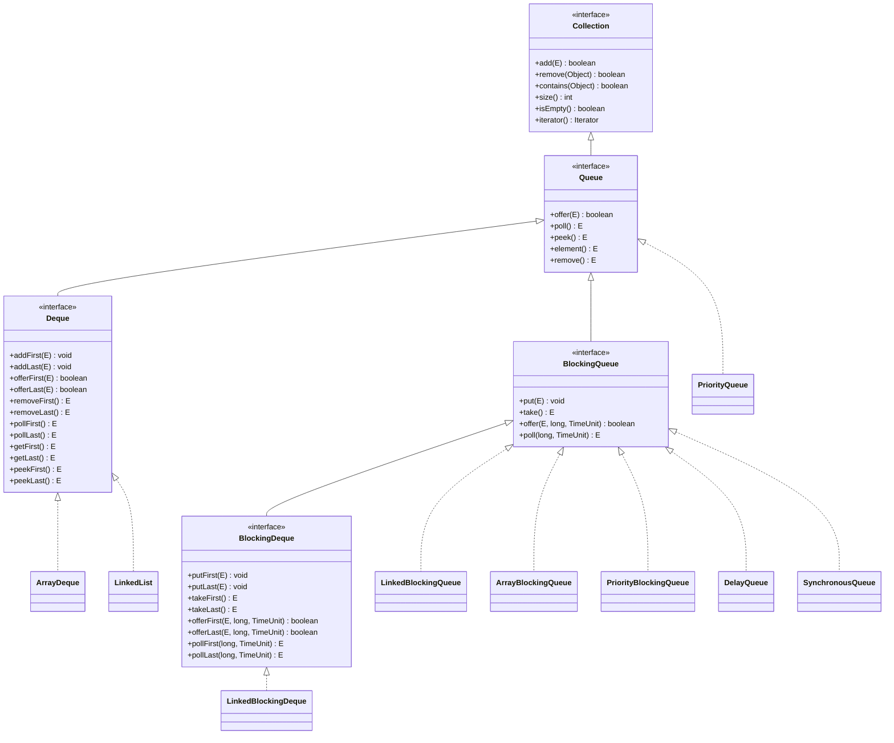
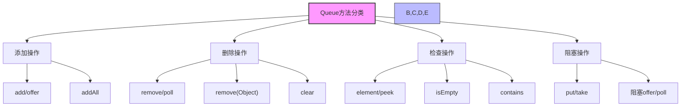
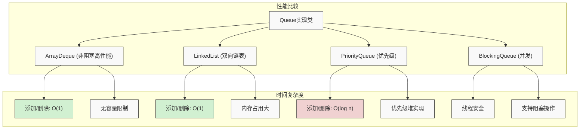
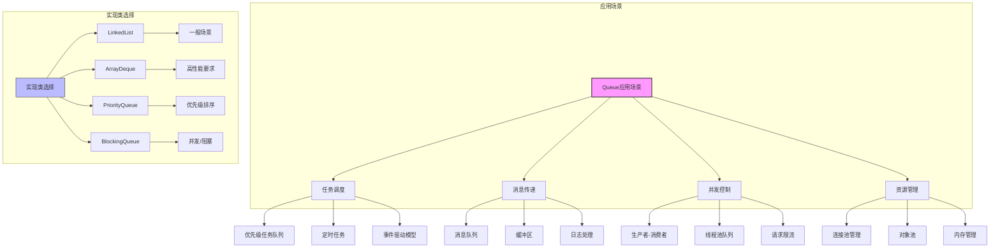

import Tabs from '@theme/Tabs';
import TabItem from '@theme/TabItem';

# Java Queue 集合详解

Queue是Java集合框架中用于处理元素队列的核心接口，它继承自Collection接口，提供了先进先出(FIFO)的数据结构。在Java开发中，Queue集合被广泛应用于任务调度、消息传递、生产者-消费者模式等各种场景，是并发编程和异步处理的重要基础。

:::tip 核心特性
**Queue接口 = 先进先出 + 阻塞操作支持 + 优先级排序 + 线程安全 + 并发控制**

- 🚶‍♂️ **先进先出(FIFO)** - 元素按照插入顺序被处理，遵循"先来先服务"原则
- ⏳ **阻塞操作** - 支持在队列满或空时自动等待，简化并发编程
- 🥇 **优先级支持** - 可基于元素优先级而非插入顺序进行处理
- 🔒 **线程安全** - 提供多种线程安全实现，适用于并发环境
- 🔄 **双端队列** - 通过Deque接口扩展，支持两端插入和删除操作
:::

## 1. Queue接口基础概念

### 1.1 什么是Queue接口？

Queue接口是Java集合框架中的核心接口，它继承自Collection接口，为队列操作提供了完整的抽象。下面是Queue接口的继承层次结构和主要实现类：



Queue集合具有以下核心特征：

- **先进先出**：元素按照插入顺序处理，最先插入的元素最先被处理
- **阻塞操作**：某些实现类支持阻塞操作，适合并发环境
- **优先级排序**：某些实现类支持按优先级排序
- **线程安全**：某些实现类提供线程安全保证
- **并发控制**：支持生产者-消费者模式

### 1.2 Queue接口的重要性

| 重要性 | 具体体现 | 业务价值 |
|--------|----------|----------|
| **任务调度** | 提供有序的任务处理机制 | 支持系统任务的有序执行 |
| **消息传递** | 实现异步消息处理 | 提高系统响应性能 |
| **并发控制** | 支持多线程间的数据传递 | 简化并发编程复杂度 |
| **资源管理** | 控制资源访问顺序 | 避免资源竞争和死锁 |

### 1.3 Queue接口设计原则

Queue接口的设计遵循以下几个核心原则：

#### FIFO原则
提供先进先出的元素处理顺序，保证处理的公平性

#### 阻塞原则  
支持阻塞操作，在队列满或空时自动等待

#### 优先级原则
支持按优先级排序，满足不同业务场景需求

#### 并发原则
提供线程安全的操作，支持多线程环境

```java title="Queue接口核心方法示例"
public interface Queue<E> extends Collection<E> {
    
    // ========== 添加操作 ==========
    boolean add(E e);                    // 添加元素，失败时抛出异常
    boolean offer(E e);                  // 添加元素，失败时返回false
    
    // ========== 删除操作 ==========
    E remove();                          // 删除并返回头部元素，失败时抛出异常
    E poll();                           // 删除并返回头部元素，失败时返回null
    
    // ========== 查看操作 ==========
    E element();                        // 查看头部元素，失败时抛出异常
    E peek();                          // 查看头部元素，失败时返回null
}
```

### 1.4 Queue接口方法分类详解

Queue接口提供了丰富的方法来操作队列，这些方法可以分为几个主要类别：



<Tabs>
<TabItem value="add" label="添加操作方法">

```java title="Queue添加操作方法"
public interface Queue<E> extends Collection<E> {
    
    // 添加元素到队列尾部
    boolean add(E e);                    // 添加元素，队列满时抛出IllegalStateException
    boolean offer(E e);                  // 添加元素，队列满时返回false
    
    // 继承自Collection的方法
    boolean addAll(Collection<? extends E> c);  // 批量添加元素
}
```

| 方法 | 描述 | 失败时行为 | 适用场景 |
|------|------|------------|----------|
| `add(E)` | 添加元素到队列尾部 | 抛出异常 | 希望立即知道操作是否成功 |
| `offer(E)` | 添加元素到队列尾部 | 返回false | 对操作失败有特殊处理逻辑 |
| `addAll(Collection)` | 批量添加元素 | 部分添加并抛出异常 | 需要批量操作时 |

:::info 阻塞队列的添加操作
对于`BlockingQueue`实现，还提供了额外的添加方法：
- `put(E)`：添加元素，如果队列已满则阻塞等待
- `offer(E, long, TimeUnit)`：添加元素，如果队列已满则阻塞等待指定时间
:::

```java title="阻塞队列添加示例"
BlockingQueue<String> queue = new LinkedBlockingQueue<>(10);
// 阻塞添加
queue.put("元素");  // 如果队列已满，会阻塞等待
// 限时添加
boolean success = queue.offer("元素", 5, TimeUnit.SECONDS); // 最多等待5秒
```

</TabItem>
<TabItem value="remove" label="删除操作方法">
```java title="Queue删除操作方法"
public interface Queue<E> extends Collection<E> {
    
    // 删除并返回队列头部元素
    E remove();                          // 删除元素，队列空时抛出NoSuchElementException
    E poll();                           // 删除元素，队列空时返回null
    
    // 删除指定元素
    boolean remove(Object o);            // 删除指定元素，继承自Collection
    boolean removeAll(Collection<?> c);  // 批量删除元素，继承自Collection
}
```

| 方法 | 描述 | 队列为空时行为 | 适用场景 |
|------|------|--------------|----------|
| `remove()` | 移除并返回队列头部元素 | 抛出异常 | 确信队列非空时 |
| `poll()` | 移除并返回队列头部元素 | 返回null | 队列可能为空时 |
| `remove(Object)` | 移除特定元素(若存在) | 返回操作结果 | 按值删除而非位置 |
| `clear()` | 清空整个队列 | 队列变为空 | 需要重置队列时 |

:::info 阻塞队列的删除操作
对于`BlockingQueue`实现，还提供了额外的删除方法：
- `take()`：获取并移除队列头部元素，如果队列为空则阻塞等待
- `poll(long, TimeUnit)`：获取并移除队列头部元素，如果队列为空则阻塞等待指定时间
:::

```java title="阻塞队列删除示例"
BlockingQueue<String> queue = new LinkedBlockingQueue<>();
// 阻塞删除
String element = queue.take();  // 如果队列为空，会阻塞等待
// 限时删除
String element2 = queue.poll(3, TimeUnit.SECONDS); // 最多等待3秒
```

</TabItem>
<TabItem value="peek" label="查看操作方法">
```java title="Queue查看操作方法"
public interface Queue<E> extends Collection<E> {
    
    // 查看队列头部元素但不删除
    E element();                        // 查看元素，队列空时抛出NoSuchElementException
    E peek();                          // 查看元素，队列空时返回null
}
```

| 方法 | 描述 | 队列为空时行为 | 适用场景 |
|------|------|--------------|----------|
| `element()` | 获取但不移除队列头部元素 | 抛出异常 | 确信队列非空时 |
| `peek()` | 获取但不移除队列头部元素 | 返回null | 队列可能为空时 |

:::tip 与删除操作的区别
查看操作与删除操作的主要区别在于：
- 查看操作只是获取元素引用，不会修改队列结构
- 删除操作会将元素从队列中移除
- 在并发环境中，查看后再删除的操作不是原子的，可能会导致不一致
:::

```java title="查看操作示例"
Queue<Integer> queue = new LinkedList<>();
queue.add(1);
queue.add(2);

// 查看元素但不删除
Integer head1 = queue.peek();  // 返回1，队列仍有[1,2]
// 使用element方法
Integer head2 = queue.element(); // 返回1，队列仍有[1,2]

// 删除操作会修改队列
Integer removed = queue.poll(); // 返回1，队列变为[2]
```

</TabItem>
<TabItem value="collection" label="集合操作方法">
```java title="Queue集合操作方法"
public interface Queue<E> extends Collection<E> {
    
    // 集合信息
    int size();                         // 获取队列大小
    boolean isEmpty();                  // 判断队列是否为空
    boolean contains(Object o);         // 判断是否包含指定元素
    void clear();                       // 清空队列
    
    // 迭代器
    Iterator<E> iterator();             // 获取迭代器
}
```

| 方法 | 描述 | 特点 | 适用场景 |
|------|------|------|----------|
| `size()` | 获取队列中元素数量 | O(1)时间复杂度 | 需要知道队列大小时 |
| `isEmpty()` | 检查队列是否为空 | 比size()==0更高效 | 判断队列空状态时 |
| `contains(Object)` | 检查元素是否存在 | O(n)时间复杂度 | 需要确认元素存在时 |
| `clear()` | 清空所有元素 | 不保留容量 | 完全重置队列时 |
| `iterator()` | 获取迭代器 | 可能不保证顺序 | 需要遍历所有元素时 |

:::warning 迭代器使用注意
使用迭代器遍历Queue时要注意：
- 迭代顺序可能与Queue的出队顺序不一致
- 并发修改会导致ConcurrentModificationException
- 某些Queue实现不支持迭代器的remove()操作
:::

```java title="集合操作示例"
Queue<String> queue = new ArrayDeque<>();
queue.add("A");
queue.add("B");
queue.add("C");

// 检查大小和内容
System.out.println("Size: " + queue.size());  // 输出3
System.out.println("Contains 'B': " + queue.contains("B"));  // 输出true

// 使用迭代器遍历
for (String item : queue) {
    System.out.println(item);  // 输出A, B, C (顺序可能因实现而异)
}

// 清空队列
queue.clear();
System.out.println("Is empty: " + queue.isEmpty());  // 输出true
```

</TabItem>
</Tabs>

### 1.5 Queue接口方法对比分析

| 操作类型 | 方法名 | 成功时返回值 | 失败时行为 | 使用场景 |
|----------|--------|--------------|------------|----------|
| **添加操作** | add(E) | true | 抛出异常 | 必须成功的场景 |
| **添加操作** | offer(E) | true | 返回false | 可容忍失败的场景 |
| **删除操作** | remove() | 被删除的元素 | 抛出异常 | 必须成功的场景 |
| **删除操作** | poll() | 被删除的元素 | 返回null | 可容忍失败的场景 |
| **查看操作** | element() | 头部元素 | 抛出异常 | 必须成功的场景 |
| **查看操作** | peek() | 头部元素 | 返回null | 可容忍失败的场景 |

:::tip 方法选择建议
- **非阻塞场景**：优先使用offer()、poll()、peek()方法
- **阻塞场景**：使用BlockingQueue的put()、take()方法
- **异常处理**：使用add()、remove()、element()方法时注意异常处理
:::

## 2. Queue实现类详解



<Tabs>
<TabItem value="linkedlist" label="LinkedList 实现">

### 2.1 LinkedList 概述

:::tip 核心特点
LinkedList是Queue接口的重要实现类，基于双向链表实现，具有以下特点：
- 🔄 **双向链表**：每个节点都有前后指针，支持双向遍历
- 📥 **队列操作**：实现了Queue接口，支持FIFO操作
- 🔀 **双端队列**：实现了Deque接口，支持两端操作
- ⚡ **插入删除高效**：在任意位置插入删除元素时间复杂度都是O(1)
- ⚠️ **线程不安全**：在多线程环境下需要外部同步
:::

#### 适用场景
- 需要队列功能的场景
- 需要双端队列功能的场景
- 频繁的插入删除操作
- 元素数量变化较大的场景

### 2.2 LinkedList 内部结构

LinkedList基于双向链表实现，每个节点都包含对前一个和后一个节点的引用，支持双向遍历。

#### 核心字段

```java title="LinkedList核心字段"
public class LinkedList<E> extends AbstractSequentialList<E>
        implements List<E>, Deque<E>, Cloneable, java.io.Serializable {
    
    // 双向链表节点
    private static class Node<E> {
        E item;           // 存储的元素
        Node<E> next;     // 下一个节点
        Node<E> prev;     // 上一个节点
        
        Node(Node<E> prev, E element, Node<E> next) {
            this.item = element;
            this.next = next;
            this.prev = prev;
        }
    }
    
    // 头节点（第一个元素）
    transient Node<E> first;
    
    // 尾节点（最后一个元素）
    transient Node<E> last;
    
    // 链表中的元素个数
    transient int size = 0;
}
```

#### 内存布局示意图

```
LinkedList 实例
┌─────────────────────────────────────────┐
│ first: Node<E>                          │
│ last: Node<E>                           │
│ size: 3                                 │
│ modCount: 1                             │
└─────────────────────────────────────────┘
         │                    │
         ▼                    ▼
    ┌─────────┐    ┌─────────┐    ┌─────────┐
    │ Node 1  │◄──►│ Node 2  │◄──►│ Node 3  │
    │ item: A │    │ item: B │    │ item: C │
    │ prev:   │    │ prev: 1 │    │ prev: 2 │
    │ next: 2 │    │ next: 3 │    │ next:   │
    └─────────┘    └─────────┘    └─────────┘
```

### 2.3 LinkedList 队列操作实现

#### 2.3.1 添加元素

```java title="LinkedList添加元素实现"
public class LinkedList<E> extends AbstractSequentialList<E> {
    
    /**
     * 在链表头部添加元素
     * 时间复杂度：O(1)
     */
    private void linkFirst(E e) {
        final Node<E> f = first;
        final Node<E> newNode = new Node<>(null, e, f);
        first = newNode;
        if (f == null) {
            last = newNode;  // 如果链表为空
        } else {
            f.prev = newNode;  // 设置原头节点的前驱
        }
        size++;
        modCount++;
    }
    
    /**
     * 在链表尾部添加元素
     * 时间复杂度：O(1)
     */
    void linkLast(E e) {
        final Node<E> l = last;
        final Node<E> newNode = new Node<>(l, e, null);
        last = newNode;
        if (l == null) {
            first = newNode;  // 如果链表为空
        } else {
            l.next = newNode;  // 设置原尾节点的后继
        }
        size++;
        modCount++;
    }
}
```

#### 2.3.2 删除元素

```java title="LinkedList删除元素实现"
public class LinkedList<E> extends AbstractSequentialList<E> {
    
    /**
     * 删除头节点
     * 时间复杂度：O(1)
     */
    private E unlinkFirst(Node<E> f) {
        final E element = f.item;
        final Node<E> next = f.next;
        f.item = null;
        f.next = null; // 帮助GC
        first = next;
        if (next == null) {
            last = null;  // 如果链表变为空
        } else {
            next.prev = null;  // 新头节点的前驱设为null
        }
        size--;
        modCount++;
        return element;
    }
    
    /**
     * 删除尾节点
     * 时间复杂度：O(1)
     */
    private E unlinkLast(Node<E> l) {
        final E element = l.item;
        final Node<E> prev = l.prev;
        l.item = null;
        l.prev = null; // 帮助GC
        last = prev;
        if (prev == null) {
            first = null;  // 如果链表变为空
        } else {
            prev.next = null;  // 新尾节点的后继设为null
        }
        size--;
        modCount++;
        return element;
    }
}
```

### 2.4 LinkedList 性能分析

#### 2.4.1 时间复杂度对比

| 操作 | 时间复杂度 | 说明 |
|------|------------|------|
| **头部插入** | O(1) | 直接修改头节点引用 |
| **尾部插入** | O(1) | 直接修改尾节点引用 |
| **头部删除** | O(1) | 直接修改头节点引用 |
| **尾部删除** | O(1) | 直接修改尾节点引用 |
| **随机访问** | O(n) | 需要遍历链表 |
| **查找元素** | O(n) | 需要遍历比较 |

#### 2.4.2 空间复杂度

- **节点开销**：每个元素需要额外的节点对象（包含item、next、prev引用）
- **内存分散**：元素在内存中分散存储，缓存不友好
- **引用开销**：每个节点有两个引用（next、prev）

### 2.5 LinkedList 使用示例

#### 2.5.1 基本队列操作示例

```java title="LinkedList基本队列操作示例"
public class LinkedListQueueExample {
    
    public static void main(String[] args) {
        // 创建LinkedList作为Queue使用
        Queue<String> queue = new LinkedList<>();
        
        // 添加元素
        queue.offer("Java");
        queue.offer("Python");
        queue.offer("C++");
        queue.offer("JavaScript");
        
        System.out.println("队列大小: " + queue.size());
        System.out.println("队列是否为空: " + queue.isEmpty());
        
        // 查看头部元素
        String head = queue.peek();
        System.out.println("头部元素: " + head);
        
        // 删除并返回头部元素
        String removed = queue.poll();
        System.out.println("删除的元素: " + removed);
        
        // 遍历队列
        System.out.println("剩余元素:");
        while (!queue.isEmpty()) {
            System.out.println(queue.poll());
        }
    }
}
```

#### 2.5.2 双端队列操作示例

```java title="LinkedList双端队列操作示例"
public class LinkedListDequeExample {
    
    public static void main(String[] args) {
        // 创建LinkedList作为Deque使用
        Deque<String> deque = new LinkedList<>();
        
        // 头部操作
        deque.addFirst("First");
        deque.offerFirst("OfferFirst");
        
        // 尾部操作
        deque.addLast("Last");
        deque.offerLast("OfferLast");
        
        System.out.println("双端队列: " + deque);
        
        // 头部查看和删除
        String first = deque.getFirst();
        System.out.println("第一个元素: " + first);
        
        String removedFirst = deque.removeFirst();
        System.out.println("删除的第一个元素: " + removedFirst);
        
        // 尾部查看和删除
        String last = deque.getLast();
        System.out.println("最后一个元素: " + last);
        
        String removedLast = deque.removeLast();
        System.out.println("删除的最后一个元素: " + removedLast);
        
        System.out.println("操作后的双端队列: " + deque);
    }
}
```

#### 2.5.3 栈操作示例

```java title="LinkedList栈操作示例"
public class LinkedListStackExample {
    
    public static void main(String[] args) {
        // 使用LinkedList实现栈
        Deque<String> stack = new LinkedList<>();
        
        // 压栈操作
        stack.push("元素1");
        stack.push("元素2");
        stack.push("元素3");
        
        System.out.println("栈大小: " + stack.size());
        
        // 弹栈操作
        while (!stack.isEmpty()) {
            String element = stack.pop();
            System.out.println("弹栈: " + element);
        }
        
        // 使用LinkedList实现队列
        Queue<String> queue = new LinkedList<>();
        
        // 入队操作
        queue.offer("任务1");
        queue.offer("任务2");
        queue.offer("任务3");
        
        // 出队操作
        while (!queue.isEmpty()) {
            String task = queue.poll();
            System.out.println("处理任务: " + task);
        }
    }
}

</TabItem>
<TabItem value="arraydeque" label="ArrayDeque 实现">

### 3.1 ArrayDeque 概述

:::tip 核心特点
ArrayDeque是基于数组实现的双端队列，是Java中最高效的队列实现之一，具有以下特点：
- 📊 **数组实现**：基于循环数组实现，存取效率高
- 🔄 **双端操作**：支持在两端高效添加和删除元素
- ⚡ **无容量限制**：自动扩容，无需指定初始大小
- ❌ **不允许null**：不能存储null元素
- 📈 **高性能**：在大多数场景下性能优于LinkedList
:::

#### 适用场景
- 需要在两端高效操作的队列场景
- 实现栈或队列的场景
- 需要频繁添加、删除元素的场景
- 对内存占用敏感的场景

### 3.2 ArrayDeque 内部结构

```java title="ArrayDeque核心字段"
public class ArrayDeque<E> extends AbstractCollection<E>
    implements Deque<E>, Cloneable, Serializable {
    
    // 存储元素的数组
    transient Object[] elements;
    
    // 头部元素的索引
    transient int head;
    
    // 尾部元素的下一个位置的索引
    transient int tail;
    
    // 最小初始容量
    private static final int MIN_INITIAL_CAPACITY = 8;
}
```

#### 内存布局示意图

```
ArrayDeque 实例 (循环数组)
┌─────────────────────────────────────────┐
│ elements: Object[]                      │
│ ├── [0] → D                            │
│ ├── [1] → E                            │
│ ├── [2] → null                         │
│ ├── [3] → null                         │
│ ├── [4] → null                         │
│ ├── [5] → null                         │
│ ├── [6] → A                            │
│ ├── [7] → B                            │
│ └── [8] → C                            │
│ head: 6                                │
│ tail: 2                                │
└─────────────────────────────────────────┘

逻辑队列: [A, B, C, D, E]  (head指向A，tail指向D后面的位置)
```

</TabItem>
<TabItem value="priorityqueue" label="PriorityQueue 实现">

### 4.1 PriorityQueue 概述

:::tip 核心特点
PriorityQueue是基于优先级堆的无界队列，具有以下特点：
- 🏆 **优先级堆**：基于数组实现的二叉堆数据结构
- 🔄 **自动排序**：元素按照自然顺序或自定义比较器排序
- 📈 **无界队列**：容量可以动态增长
- ❌ **不允许null**：不支持null元素
- ⚠️ **线程不安全**：在多线程环境下需要外部同步
:::

#### 适用场景
- 需要按优先级处理任务的场景
- 任务调度系统
- 事件处理系统
- 需要自动排序的数据处理

### 3.2 PriorityQueue 内部结构

PriorityQueue基于数组实现的二叉堆，通过堆的性质保证优先级顺序。

#### 核心字段

```java title="PriorityQueue核心字段"
public class PriorityQueue<E> extends AbstractQueue<E>
    implements java.io.Serializable {
    
    // 默认初始容量
    private static final int DEFAULT_INITIAL_CAPACITY = 11;
    
    // 存储元素的数组
    transient Object[] queue;
    
    // 元素个数
    private int size = 0;
    
    // 比较器
    private final Comparator<? super E> comparator;
    
    // 修改次数
    transient int modCount = 0;
}
```

#### 构造方法

```java title="PriorityQueue构造方法"
public class PriorityQueue<E> extends AbstractQueue<E> {
    
    /**
     * 构造一个默认容量的优先级队列
     */
    public PriorityQueue() {
        this(DEFAULT_INITIAL_CAPACITY, null);
    }
    
    /**
     * 构造一个指定初始容量的优先级队列
     */
    public PriorityQueue(int initialCapacity) {
        this(initialCapacity, null);
    }
    
    /**
     * 构造一个指定比较器的优先级队列
     */
    public PriorityQueue(Comparator<? super E> comparator) {
        this(DEFAULT_INITIAL_CAPACITY, comparator);
    }
    
    /**
     * 构造一个指定初始容量和比较器的优先级队列
     */
    public PriorityQueue(int initialCapacity, Comparator<? super E> comparator) {
        if (initialCapacity < 1)
            throw new IllegalArgumentException();
        this.queue = new Object[initialCapacity];
        this.comparator = comparator;
    }
}
```

#### 内存布局示意图

```
PriorityQueue 实例 (最小堆)
┌─────────────────────────────────────────┐
│ queue: Object[]                         │
│ ├── [0] → 1 (根节点)                   │
│ ├── [1] → 3 (左子节点)                 │
│ ├── [2] → 5 (右子节点)                 │
│ ├── [3] → 7                            │
│ ├── [4] → 9                            │
│ └── [5] → null                         │
│ size: 5                                │
│ comparator: null (自然顺序)             │
└─────────────────────────────────────────┘

堆的树形结构:
       1
     /   \
    3     5
   / \
  7   9
```

### 3.3 PriorityQueue 核心方法实现

#### 3.3.1 添加元素

```java title="PriorityQueue添加元素实现"
public class PriorityQueue<E> extends AbstractQueue<E> {
    
    /**
     * 添加元素到优先级队列
     * 时间复杂度：O(log n)
     */
    public boolean offer(E e) {
        if (e == null)
            throw new NullPointerException();
        modCount++;
        int i = size;
        if (i >= queue.length)
            grow(i + 1);  // 扩容
        size = i + 1;
        if (i == 0)
            queue[0] = e;  // 第一个元素
        else
            siftUp(i, e);  // 上浮操作
        return true;
    }
    
    /**
     * 上浮操作（最小堆）
     * 时间复杂度：O(log n)
     */
    private void siftUp(int k, E x) {
        if (comparator != null)
            siftUpUsingComparator(k, x);
        else
            siftUpComparable(k, x);
    }
    
    /**
     * 使用自然顺序的上浮操作
     */
    @SuppressWarnings("unchecked")
    private void siftUpComparable(int k, E x) {
        Comparable<? super E> key = (Comparable<? super E>) x;
        while (k > 0) {
            int parent = (k - 1) >>> 1;  // 父节点索引
            Object e = queue[parent];
            if (key.compareTo((E) e) >= 0)
                break;
            queue[k] = e;
            k = parent;
        }
        queue[k] = key;
    }
}
```

#### 3.3.2 删除元素

```java title="PriorityQueue删除元素实现"
public class PriorityQueue<E> extends AbstractQueue<E> {
    
    /**
     * 删除并返回优先级最高的元素
     * 时间复杂度：O(log n)
     */
    public E poll() {
        if (size == 0)
            return null;
        int s = --size;
        modCount++;
        E result = (E) queue[0];  // 根节点
        E x = (E) queue[s];       // 最后一个元素
        queue[s] = null;
        if (s != 0)
            siftDown(0, x);       // 下沉操作
        return result;
    }
    
    /**
     * 下沉操作（最小堆）
     * 时间复杂度：O(log n)
     */
    private void siftDown(int k, E x) {
        if (comparator != null)
            siftDownUsingComparator(k, x);
        else
            siftDownComparable(k, x);
    }
    
    /**
     * 使用自然顺序的下沉操作
     */
    @SuppressWarnings("unchecked")
    private void siftDownComparable(int k, E x) {
        Comparable<? super E> key = (Comparable<? super E>) x;
        int half = size >>> 1;  // 非叶子节点数量
        while (k < half) {
            int child = (k << 1) + 1;  // 左子节点
            Object c = queue[child];
            int right = child + 1;     // 右子节点
            if (right < size &&
                ((Comparable<? super E>) c).compareTo((E) queue[right]) > 0)
                c = queue[child = right];
            if (key.compareTo((E) c) <= 0)
                break;
            queue[k] = c;
            k = child;
        }
        queue[k] = key;
    }
}
```

#### 3.3.3 扩容机制

```java title="PriorityQueue扩容机制"
public class PriorityQueue<E> extends AbstractQueue<E> {
    
    /**
     * 扩容方法
     */
    private void grow(int minCapacity) {
        int oldCapacity = queue.length;
        // 新容量 = 旧容量 + 旧容量/2（1.5倍增长）
        int newCapacity = oldCapacity + ((oldCapacity < 64) ?
                                       (oldCapacity + 2) : (oldCapacity >> 1));
        
        if (newCapacity - MAX_ARRAY_SIZE > 0)
            newCapacity = hugeCapacity(minCapacity);
        
        queue = Arrays.copyOf(queue, newCapacity);
    }
    
    /**
     * 计算最大容量
     */
    private static int hugeCapacity(int minCapacity) {
        if (minCapacity < 0)
            throw new OutOfMemoryError();
        return (minCapacity > MAX_ARRAY_SIZE) ?
            Integer.MAX_VALUE : MAX_ARRAY_SIZE;
    }
}
```

### 3.4 PriorityQueue 性能分析

#### 3.4.1 时间复杂度对比

| 操作 | 时间复杂度 | 说明 |
|------|------------|------|
| **插入元素** | O(log n) | 需要上浮操作调整堆结构 |
| **删除元素** | O(log n) | 需要下沉操作调整堆结构 |
| **查看元素** | O(1) | 直接访问根节点 |
| **查找元素** | O(n) | 需要遍历整个堆 |

#### 3.4.2 空间复杂度

- **存储开销**：每个元素占用一个数组位置
- **扩容开销**：扩容时会创建新数组，临时占用双倍内存
- **比较器开销**：如果使用自定义比较器，需要额外的对象引用

### 3.5 PriorityQueue 使用示例

#### 3.5.1 基本使用示例

```java title="PriorityQueue基本使用示例"
public class PriorityQueueBasicExample {
    
    public static void main(String[] args) {
        // 自然顺序优先级队列（最小堆）
        Queue<Integer> naturalOrderQueue = new PriorityQueue<>();
        naturalOrderQueue.offer(5);
        naturalOrderQueue.offer(2);
        naturalOrderQueue.offer(8);
        naturalOrderQueue.offer(1);
        naturalOrderQueue.offer(3);
        
        System.out.println("自然顺序优先级队列（从小到大）:");
        while (!naturalOrderQueue.isEmpty()) {
            System.out.println(naturalOrderQueue.poll());
        }
        
        // 自定义比较器优先级队列（最大堆）
        Queue<Integer> customOrderQueue = new PriorityQueue<>((a, b) -> b - a);
        customOrderQueue.offer(5);
        customOrderQueue.offer(2);
        customOrderQueue.offer(8);
        customOrderQueue.offer(1);
        customOrderQueue.offer(3);
        
        System.out.println("自定义顺序优先级队列（从大到小）:");
        while (!customOrderQueue.isEmpty()) {
            System.out.println(customOrderQueue.poll());
        }
        
        // 字符串优先级队列
        Queue<String> stringQueue = new PriorityQueue<>();
        stringQueue.offer("Java");
        stringQueue.offer("Python");
        stringQueue.offer("C++");
        stringQueue.offer("JavaScript");
        stringQueue.offer("Go");
        
        System.out.println("字符串优先级队列（按字母顺序）:");
        while (!stringQueue.isEmpty()) {
            System.out.println(stringQueue.poll());
        }
    }
}
```

#### 3.5.2 自定义对象优先级队列

```java title="PriorityQueue自定义对象示例"
public class PriorityQueueCustomExample {
    
    // 任务类
    static class Task implements Comparable<Task> {
        private String name;
        private int priority;  // 优先级，数字越小优先级越高
        private long createTime;
        
        public Task(String name, int priority) {
            this.name = name;
            this.priority = priority;
            this.createTime = System.currentTimeMillis();
        }
        
        @Override
        public int compareTo(Task other) {
            // 首先按优先级比较
            int priorityCompare = Integer.compare(this.priority, other.priority);
            if (priorityCompare != 0) {
                return priorityCompare;
            }
            // 优先级相同时，按创建时间比较（先创建的优先）
            return Long.compare(this.createTime, other.createTime);
        }
        
        @Override
        public String toString() {
            return "Task{name='" + name + "', priority=" + priority + "}";
        }
    }
    
    public static void main(String[] args) {
        // 创建任务优先级队列
        Queue<Task> taskQueue = new PriorityQueue<>();
        
        // 添加任务
        taskQueue.offer(new Task("低优先级任务1", 3));
        taskQueue.offer(new Task("高优先级任务1", 1));
        taskQueue.offer(new Task("中优先级任务1", 2));
        taskQueue.offer(new Task("高优先级任务2", 1));
        taskQueue.offer(new Task("低优先级任务2", 3));
        
        System.out.println("任务处理顺序:");
        while (!taskQueue.isEmpty()) {
            Task task = taskQueue.poll();
            System.out.println("处理任务: " + task);
        }
    }
}
```

#### 3.5.3 使用自定义比较器

```java title="PriorityQueue自定义比较器示例"
public class PriorityQueueComparatorExample {
    
    public static void main(String[] args) {
        // 使用自定义比较器创建优先级队列
        Queue<String> lengthQueue = new PriorityQueue<>((s1, s2) -> {
            // 按字符串长度排序，长度短的优先
            int lengthCompare = Integer.compare(s1.length(), s2.length());
            if (lengthCompare != 0) {
                return lengthCompare;
            }
            // 长度相同时，按字母顺序排序
            return s1.compareTo(s2);
        });
        
        lengthQueue.offer("Java");
        lengthQueue.offer("Python");
        lengthQueue.offer("C++");
        lengthQueue.offer("JavaScript");
        lengthQueue.offer("Go");
        lengthQueue.offer("Rust");
        
        System.out.println("按长度排序的字符串队列:");
        while (!lengthQueue.isEmpty()) {
            System.out.println(lengthQueue.poll());
        }
        
        // 使用Lambda表达式创建比较器
        Queue<Integer> evenFirstQueue = new PriorityQueue<>((a, b) -> {
            boolean aEven = a % 2 == 0;
            boolean bEven = b % 2 == 0;
            
            if (aEven && !bEven) return -1;  // a是偶数，b是奇数，a优先
            if (!aEven && bEven) return 1;   // a是奇数，b是偶数，b优先
            return Integer.compare(a, b);    // 都是偶数或都是奇数，按数值大小
        });
        
        evenFirstQueue.offer(5);
        evenFirstQueue.offer(2);
        evenFirstQueue.offer(8);
        evenFirstQueue.offer(1);
        evenFirstQueue.offer(6);
        evenFirstQueue.offer(3);
        
        System.out.println("偶数优先的整数队列:");
        while (!evenFirstQueue.isEmpty()) {
            System.out.println(evenFirstQueue.poll());
        }
    }
} 

</TabItem>
<TabItem value="blockingqueue" label="BlockingQueue 实现">

### 5.1 BlockingQueue 接口概述

:::tip 核心特点
BlockingQueue是Queue的子接口，提供了阻塞操作，具有以下特点：
- ⏱️ **阻塞操作**：支持put/take等阻塞方法
- 🔒 **线程安全**：所有操作都是线程安全的
- 📊 **有界队列**：某些实现类是有界的
- 🔄 **生产者-消费者**：天然适合生产者-消费者模式
- ⏳ **超时操作**：支持带超时的阻塞操作
:::

#### 适用场景
- 生产者-消费者模式
- 线程池任务队列
- 消息队列实现
- 并发数据处理
- 异步任务调度

### 4.2 BlockingQueue 接口方法

```java title="BlockingQueue接口方法"
public interface BlockingQueue<E> extends Queue<E> {
    
    // ========== 阻塞添加操作 ==========
    void put(E e) throws InterruptedException;           // 阻塞添加
    boolean offer(E e, long timeout, TimeUnit unit)      // 超时添加
        throws InterruptedException;
    
    // ========== 阻塞删除操作 ==========
    E take() throws InterruptedException;                // 阻塞删除
    E poll(long timeout, TimeUnit unit)                  // 超时删除
        throws InterruptedException;
    
    // ========== 批量操作 ==========
    int drainTo(Collection<? super E> c);                // 批量转移
    int drainTo(Collection<? super E> c, int maxElements); // 限制批量转移
}
```

### 4.3 ArrayBlockingQueue 实现类详解

#### 4.3.1 ArrayBlockingQueue 概述

:::tip 核心特点
ArrayBlockingQueue是基于数组的有界阻塞队列，具有以下特点：
- **数组实现**：基于数组的循环队列
- **有界队列**：容量固定，创建时指定
- **线程安全**：使用ReentrantLock保证线程安全
- **FIFO顺序**：严格按先进先出顺序处理
- **阻塞操作**：支持put/take等阻塞方法
:::

#### 4.3.2 ArrayBlockingQueue 内部结构

```java title="ArrayBlockingQueue核心字段"
public class ArrayBlockingQueue<E> extends AbstractQueue<E>
        implements BlockingQueue<E>, java.io.Serializable {
    
    // 存储元素的数组
    final Object[] items;
    
    // 下一个要取元素的位置
    int takeIndex;
    
    // 下一个要放元素的位置
    int putIndex;
    
    // 元素个数
    int count;
    
    // 锁
    final ReentrantLock lock;
    
    // 非空条件
    private final Condition notEmpty;
    
    // 非满条件
    private final Condition notFull;
}
```

#### 4.3.3 内存布局示意图

```
ArrayBlockingQueue 实例
┌─────────────────────────────────────────┐
│ items: Object[]                         │
│ ├── [0] → "Java"                       │
│ ├── [1] → "Python"                     │
│ ├── [2] → "C++"                        │
│ ├── [3] → null                         │
│ └── [4] → null                         │
│ takeIndex: 0                            │
│ putIndex: 3                             │
│ count: 3                                │
│ lock: ReentrantLock                     │
│ notEmpty: Condition                     │
│ notFull: Condition                      │
└─────────────────────────────────────────┘
```

#### 4.3.4 ArrayBlockingQueue 核心方法实现

```java title="ArrayBlockingQueue核心方法实现"
public class ArrayBlockingQueue<E> extends AbstractQueue<E> {
    
    /**
     * 阻塞添加元素
     * 如果队列满，则阻塞等待
     */
    public void put(E e) throws InterruptedException {
        checkNotNull(e);
        final ReentrantLock lock = this.lock;
        lock.lockInterruptibly();
        try {
            while (count == items.length)
                notFull.await();  // 队列满时等待
            enqueue(e);
        } finally {
            lock.unlock();
        }
    }
    
    /**
     * 阻塞删除元素
     * 如果队列空，则阻塞等待
     */
    public E take() throws InterruptedException {
        final ReentrantLock lock = this.lock;
        lock.lockInterruptibly();
        try {
            while (count == 0)
                notEmpty.await();  // 队列空时等待
            return dequeue();
        } finally {
            lock.unlock();
        }
    }
    
    /**
     * 入队操作
     */
    private void enqueue(E x) {
        final Object[] items = this.items;
        items[putIndex] = x;
        if (++putIndex == items.length)
            putIndex = 0;  // 循环队列
        count++;
        notEmpty.signal();  // 唤醒等待的消费者
    }
    
    /**
     * 出队操作
     */
    private E dequeue() {
        final Object[] items = this.items;
        @SuppressWarnings("unchecked")
        E x = (E) items[takeIndex];
        items[takeIndex] = null;
        if (++takeIndex == items.length)
            takeIndex = 0;  // 循环队列
        count--;
        notFull.signal();  // 唤醒等待的生产者
        return x;
    }
}
```

#### 4.3.5 ArrayBlockingQueue 使用示例

```java title="ArrayBlockingQueue使用示例"
public class ArrayBlockingQueueExample {
    
    public static void main(String[] args) {
        // 创建有界阻塞队列
        BlockingQueue<String> queue = new ArrayBlockingQueue<>(3);
        
        // 生产者线程
        Thread producer = new Thread(() -> {
            try {
                String[] items = {"Java", "Python", "C++", "JavaScript", "Go"};
                for (String item : items) {
                    queue.put(item);  // 阻塞添加
                    System.out.println("生产者添加: " + item);
                    Thread.sleep(500);
                }
            } catch (InterruptedException e) {
                e.printStackTrace();
            }
        });
        
        // 消费者线程
        Thread consumer = new Thread(() -> {
            try {
                Thread.sleep(1000); // 延迟消费
                for (int i = 0; i < 5; i++) {
                    String item = queue.take();  // 阻塞删除
                    System.out.println("消费者处理: " + item);
                    Thread.sleep(1000);
                }
            } catch (InterruptedException e) {
                e.printStackTrace();
            }
        });
        
        producer.start();
        consumer.start();
        
        try {
            producer.join();
            consumer.join();
        } catch (InterruptedException e) {
            e.printStackTrace();
        }
    }
}
```

### 4.4 LinkedBlockingQueue 实现类详解

#### 4.4.1 LinkedBlockingQueue 概述

:::tip 核心特点
LinkedBlockingQueue是基于链表的有界或无界阻塞队列，具有以下特点：
- **链表实现**：基于单向链表的队列
- **可选有界**：可以是有界或无界队列
- **线程安全**：使用两个ReentrantLock分别保护头部和尾部
- **高性能**：相比ArrayBlockingQueue有更好的并发性能
- **内存效率**：动态分配内存，避免内存浪费
:::

#### 4.4.2 LinkedBlockingQueue 内部结构

```java title="LinkedBlockingQueue核心字段"
public class LinkedBlockingQueue<E> extends AbstractQueue<E>
        implements BlockingQueue<E>, java.io.Serializable {
    
    // 链表节点
    static class Node<E> {
        E item;
        Node<E> next;
        
        Node(E x) { item = x; }
    }
    
    // 队列容量
    private final int capacity;
    
    // 当前元素个数
    private final AtomicInteger count = new AtomicInteger();
    
    // 头节点
    transient Node<E> head;
    
    // 尾节点
    private transient Node<E> last;
    
    // 取锁
    private final ReentrantLock takeLock = new ReentrantLock();
    
    // 非空条件
    private final Condition notEmpty = takeLock.newCondition();
    
    // 放锁
    private final ReentrantLock putLock = new ReentrantLock();
    
    // 非满条件
    private final Condition notFull = putLock.newCondition();
}
```

#### 4.4.3 LinkedBlockingQueue 使用示例

```java title="LinkedBlockingQueue使用示例"
public class LinkedBlockingQueueExample {
    
    public static void main(String[] args) {
        // 无界队列
        BlockingQueue<String> unboundedQueue = new LinkedBlockingQueue<>();
        
        // 有界队列
        BlockingQueue<String> boundedQueue = new LinkedBlockingQueue<>(100);
        
        // 生产者-消费者模式
        BlockingQueue<String> queue = new LinkedBlockingQueue<>(5);
        
        // 生产者
        Thread producer = new Thread(() -> {
            try {
                for (int i = 0; i < 10; i++) {
                    String item = "Item-" + i;
                    queue.put(item);
                    System.out.println("生产: " + item);
                    Thread.sleep(100);
                }
            } catch (InterruptedException e) {
                e.printStackTrace();
            }
        });
        
        // 消费者
        Thread consumer = new Thread(() -> {
            try {
                for (int i = 0; i < 10; i++) {
                    String item = queue.take();
                    System.out.println("消费: " + item);
                    Thread.sleep(200);
                }
            } catch (InterruptedException e) {
                e.printStackTrace();
            }
        });
        
        producer.start();
        consumer.start();
        
        try {
            producer.join();
            consumer.join();
        } catch (InterruptedException e) {
            e.printStackTrace();
        }
    }
}
```

### 4.5 SynchronousQueue 实现类详解

#### 4.5.1 SynchronousQueue 概述

:::tip 核心特点
SynchronousQueue是一个不存储元素的阻塞队列，具有以下特点：
- **不存储元素**：每个插入操作必须等待另一个线程的移除操作
- **直接传递**：适合线程间直接传递数据
- **性能较高**：避免了数据复制和存储开销
- **公平性**：支持公平和非公平模式
- **零容量**：队列容量始终为0
:::

#### 4.5.2 SynchronousQueue 使用示例

```java title="SynchronousQueue使用示例"
public class SynchronousQueueExample {
    
    public static void main(String[] args) {
        BlockingQueue<String> queue = new SynchronousQueue<>();
        
        // 生产者线程
        Thread producer = new Thread(() -> {
            try {
                for (int i = 0; i < 5; i++) {
                    String item = "Item-" + i;
                    queue.put(item);
                    System.out.println("生产: " + item);
                }
            } catch (InterruptedException e) {
                e.printStackTrace();
            }
        });
        
        // 消费者线程
        Thread consumer = new Thread(() -> {
            try {
                for (int i = 0; i < 5; i++) {
                    String item = queue.take();
                    System.out.println("消费: " + item);
                    Thread.sleep(100);
                }
            } catch (InterruptedException e) {
                e.printStackTrace();
            }
        });
        
        consumer.start(); // 消费者先启动
        Thread.sleep(100);
        producer.start(); // 生产者后启动
        
        try {
            producer.join();
            consumer.join();
        } catch (InterruptedException e) {
            e.printStackTrace();
        }
    }
}
```

### 4.6 DelayQueue 实现类详解

#### 4.6.1 DelayQueue 概述

:::tip 核心特点
DelayQueue是一个无界阻塞队列，具有以下特点：
- **延迟获取**：只有在延迟期满时才能从中提取元素
- **优先级队列**：基于PriorityQueue实现
- **Delayed接口**：元素必须实现Delayed接口
- **定时任务**：适合定时任务调度
- **线程安全**：所有操作都是线程安全的
:::

#### 4.6.2 DelayQueue 使用示例

```java title="DelayQueue使用示例"
public class DelayQueueExample {
    
    // 延迟元素
    static class DelayedElement implements Delayed {
        private String name;
        private long startTime;
        
        public DelayedElement(String name, long delay) {
            this.name = name;
            this.startTime = System.currentTimeMillis() + delay;
        }
        
        @Override
        public long getDelay(TimeUnit unit) {
            long diff = startTime - System.currentTimeMillis();
            return unit.convert(diff, TimeUnit.MILLISECONDS);
        }
        
        @Override
        public int compareTo(Delayed o) {
            return Long.compare(this.startTime, ((DelayedElement) o).startTime);
        }
        
        @Override
        public String toString() {
            return name + " - " + startTime;
        }
    }
    
    public static void main(String[] args) {
        DelayQueue<DelayedElement> queue = new DelayQueue<>();
        
        // 添加延迟元素
        queue.put(new DelayedElement("Task1", 2000));
        queue.put(new DelayedElement("Task2", 1000));
        queue.put(new DelayedElement("Task3", 3000));
        
        // 消费者线程
        Thread consumer = new Thread(() -> {
            try {
                while (!queue.isEmpty()) {
                    DelayedElement element = queue.take();
                    System.out.println("执行: " + element);
                }
            } catch (InterruptedException e) {
                e.printStackTrace();
            }
        });
        
        consumer.start();
        
        try {
            consumer.join();
        } catch (InterruptedException e) {
            e.printStackTrace();
        }
    }
}
```

### 4.7 阻塞队列性能对比

| 实现类 | 底层结构 | 容量 | 线程安全 | 性能特点 | 适用场景 |
|--------|----------|------|----------|----------|----------|
| **ArrayBlockingQueue** | 数组 | 有界 | 是 | 中等 | 固定容量场景 |
| **LinkedBlockingQueue** | 链表 | 可选 | 是 | 高 | 动态容量场景 |
| **SynchronousQueue** | 无存储 | 0 | 是 | 最高 | 直接传递场景 |
| **DelayQueue** | 优先级队列 | 无界 | 是 | 中等 | 定时任务场景 |
| **PriorityBlockingQueue** | 优先级队列 | 无界 | 是 | 中等 | 优先级处理场景 | 

</TabItem>
</Tabs>

## 5. 实际应用场景



### 5.1 生产者-消费者模式

```java title="生产者-消费者模式示例"
public class ProducerConsumerExample {
    private static final int QUEUE_SIZE = 10;
    private static final BlockingQueue<String> queue = new ArrayBlockingQueue<>(QUEUE_SIZE);
    
    // 生产者
    static class Producer implements Runnable {
        private String name;
        
        public Producer(String name) {
            this.name = name;
        }
        
        @Override
        public void run() {
            try {
                for (int i = 0; i < 5; i++) {
                    String item = name + "-Item-" + i;
                    queue.put(item);
                    System.out.println(name + " 生产: " + item);
                    Thread.sleep(100);
                }
            } catch (InterruptedException e) {
                e.printStackTrace();
            }
        }
    }
    
    // 消费者
    static class Consumer implements Runnable {
        private String name;
        
        public Consumer(String name) {
            this.name = name;
        }
        
        @Override
        public void run() {
            try {
                for (int i = 0; i < 5; i++) {
                    String item = queue.take();
                    System.out.println(name + " 消费: " + item);
                    Thread.sleep(200);
                }
            } catch (InterruptedException e) {
                e.printStackTrace();
            }
        }
    }
    
    public static void main(String[] args) {
        Thread producer1 = new Thread(new Producer("Producer1"));
        Thread producer2 = new Thread(new Producer("Producer2"));
        Thread consumer1 = new Thread(new Consumer("Consumer1"));
        Thread consumer2 = new Thread(new Consumer("Consumer2"));
        
        producer1.start();
        producer2.start();
        consumer1.start();
        consumer2.start();
        
        try {
            producer1.join();
            producer2.join();
            consumer1.join();
            consumer2.join();
        } catch (InterruptedException e) {
            e.printStackTrace();
        }
    }
}
```

### 5.2 任务调度系统

```java title="任务调度系统示例"
public class TaskSchedulerExample {
    private static final DelayQueue<DelayedTask> taskQueue = new DelayQueue<>();
    
    static class DelayedTask implements Delayed {
        private String taskName;
        private long executeTime;
        
        public DelayedTask(String taskName, long delay) {
            this.taskName = taskName;
            this.executeTime = System.currentTimeMillis() + delay;
        }
        
        @Override
        public long getDelay(TimeUnit unit) {
            return unit.convert(executeTime - System.currentTimeMillis(), TimeUnit.MILLISECONDS);
        }
        
        @Override
        public int compareTo(Delayed o) {
            return Long.compare(this.executeTime, ((DelayedTask) o).executeTime);
        }
        
        public void execute() {
            System.out.println("执行任务: " + taskName + " 时间: " + new Date());
        }
    }
    
    public static void main(String[] args) {
        // 添加定时任务
        taskQueue.put(new DelayedTask("Task1", 2000));
        taskQueue.put(new DelayedTask("Task2", 1000));
        taskQueue.put(new DelayedTask("Task3", 3000));
        
        // 任务执行器
        Thread executor = new Thread(() -> {
            try {
                while (true) {
                    DelayedTask task = taskQueue.take();
                    task.execute();
                }
            } catch (InterruptedException e) {
                e.printStackTrace();
            }
        });
        
        executor.start();
        
        try {
            Thread.sleep(5000);
            executor.interrupt();
        } catch (InterruptedException e) {
            e.printStackTrace();
        }
    }
}
```

### 5.3 消息队列实现

```java title="消息队列实现示例"
public class MessageQueueExample {
    
    // 消息类
    static class Message {
        private String id;
        private String content;
        private long timestamp;
        
        public Message(String id, String content) {
            this.id = id;
            this.content = content;
            this.timestamp = System.currentTimeMillis();
        }
        
        @Override
        public String toString() {
            return "Message{id='" + id + "', content='" + content + "', timestamp=" + timestamp + "}";
        }
    }
    
    // 消息队列
    static class MessageQueue {
        private final BlockingQueue<Message> queue;
        private final String name;
        
        public MessageQueue(String name, int capacity) {
            this.name = name;
            this.queue = new LinkedBlockingQueue<>(capacity);
        }
        
        public void sendMessage(Message message) throws InterruptedException {
            queue.put(message);
            System.out.println("发送消息到队列 " + name + ": " + message);
        }
        
        public Message receiveMessage() throws InterruptedException {
            Message message = queue.take();
            System.out.println("从队列 " + name + " 接收消息: " + message);
            return message;
        }
        
        public int size() {
            return queue.size();
        }
    }
    
    public static void main(String[] args) {
        MessageQueue messageQueue = new MessageQueue("main", 100);
        
        // 发送者线程
        Thread sender = new Thread(() -> {
            try {
                for (int i = 0; i < 10; i++) {
                    Message message = new Message("msg-" + i, "内容-" + i);
                    messageQueue.sendMessage(message);
                    Thread.sleep(100);
                }
            } catch (InterruptedException e) {
                e.printStackTrace();
            }
        });
        
        // 接收者线程
        Thread receiver = new Thread(() -> {
            try {
                for (int i = 0; i < 10; i++) {
                    messageQueue.receiveMessage();
                    Thread.sleep(200);
                }
            } catch (InterruptedException e) {
                e.printStackTrace();
            }
        });
        
        sender.start();
        receiver.start();
        
        try {
            sender.join();
            receiver.join();
        } catch (InterruptedException e) {
            e.printStackTrace();
        }
    }
}
```

### 5.4 线程池任务队列

```java title="线程池任务队列示例"
public class ThreadPoolTaskQueueExample {
    
    // 任务类
    static class Task implements Runnable {
        private String name;
        private int priority;
        
        public Task(String name, int priority) {
            this.name = name;
            this.priority = priority;
        }
        
        @Override
        public void run() {
            System.out.println("执行任务: " + name + " (优先级: " + priority + ")");
            try {
                Thread.sleep(100); // 模拟任务执行时间
            } catch (InterruptedException e) {
                e.printStackTrace();
            }
        }
        
        public int getPriority() {
            return priority;
        }
    }
    
    // 优先级任务比较器
    static class TaskComparator implements Comparator<Task> {
        @Override
        public int compare(Task t1, Task t2) {
            return Integer.compare(t1.getPriority(), t2.getPriority());
        }
    }
    
    public static void main(String[] args) {
        // 使用优先级队列的线程池
        BlockingQueue<Runnable> taskQueue = new PriorityBlockingQueue<>(100, new TaskComparator());
        
        // 创建线程池
        ThreadPoolExecutor executor = new ThreadPoolExecutor(
            2,  // 核心线程数
            4,  // 最大线程数
            60L, // 空闲线程存活时间
            TimeUnit.SECONDS,
            taskQueue
        );
        
        // 提交任务
        executor.submit(new Task("高优先级任务1", 1));
        executor.submit(new Task("低优先级任务1", 3));
        executor.submit(new Task("中优先级任务1", 2));
        executor.submit(new Task("高优先级任务2", 1));
        executor.submit(new Task("低优先级任务2", 3));
        
        // 关闭线程池
        executor.shutdown();
        
        try {
            executor.awaitTermination(5, TimeUnit.SECONDS);
        } catch (InterruptedException e) {
            e.printStackTrace();
        }
    }
}
```

## 6. 最佳实践总结

### 6.1 Queue实现类选择策略

:::tip 选择建议
选择合适的Queue实现类需要考虑以下因素：
- **使用场景**：一般队列、优先级队列、阻塞队列
- **性能要求**：插入删除性能、内存使用效率
- **线程安全**：单线程环境还是多线程环境
- **容量要求**：有界队列还是无界队列
- **功能需求**：是否需要阻塞操作、优先级排序等
:::

| 实现类 | 适用场景 | 优势 | 劣势 |
|--------|----------|------|------|
| **LinkedList** | 一般队列、双端队列 | 插入删除快、功能丰富 | 随机访问慢、线程不安全 |
| **PriorityQueue** | 优先级处理 | 自动排序、性能稳定 | 线程不安全、内存开销 |
| **ArrayBlockingQueue** | 固定容量生产者-消费者 | 线程安全、性能稳定 | 容量固定、内存浪费 |
| **LinkedBlockingQueue** | 动态容量生产者-消费者 | 线程安全、内存效率高 | 内存分配开销 |
| **SynchronousQueue** | 线程间直接传递 | 性能最高、零内存开销 | 容量为零、使用复杂 |
| **DelayQueue** | 定时任务调度 | 延迟处理、自动排序 | 使用复杂、性能中等 |

### 6.2 性能优化策略

```java title="Queue性能优化示例"
public class QueuePerformanceOptimization {
    
    /**
     * 预分配容量优化
     */
    public static void capacityOptimization() {
        // 知道大概元素数量时，预分配容量
        int expectedSize = 1000;
        BlockingQueue<String> optimizedQueue = new ArrayBlockingQueue<>(expectedSize);
        
        // 避免频繁扩容
        for (int i = 0; i < expectedSize; i++) {
            try {
                optimizedQueue.put("item" + i);
            } catch (InterruptedException e) {
                e.printStackTrace();
            }
        }
    }
    
    /**
     * 批量操作优化
     */
    public static void batchOperationOptimization() {
        Queue<String> queue = new LinkedList<>();
        Collection<String> items = Arrays.asList("a", "b", "c", "d", "e");
        
        // 批量添加，比循环add效率高
        queue.addAll(items);
        
        // 批量处理
while (!queue.isEmpty()) {
    String item = queue.poll();
            // 处理元素
        }
    }
    
    /**
     * 阻塞操作优化
     */
    public static void blockingOperationOptimization() {
        BlockingQueue<String> queue = new LinkedBlockingQueue<>(10);
        
        // 使用超时操作避免无限阻塞
        try {
            boolean offered = queue.offer("item", 1, TimeUnit.SECONDS);
            if (!offered) {
                System.out.println("添加失败，队列已满");
            }
            
            String item = queue.poll(1, TimeUnit.SECONDS);
            if (item == null) {
                System.out.println("获取失败，队列为空");
            }
        } catch (InterruptedException e) {
            e.printStackTrace();
        }
    }
}
```

### 6.3 常见陷阱和解决方案

:::caution 注意事项
1. **无限阻塞**：使用put/take方法时可能无限阻塞，应使用超时版本
2. **内存泄漏**：无界队列可能导致内存溢出，应设置合理的容量限制
3. **线程安全问题**：LinkedList和PriorityQueue不是线程安全的
4. **优先级队列排序**：自定义对象必须实现Comparable接口或提供Comparator
5. **延迟队列使用**：元素必须实现Delayed接口
:::

```java title="常见陷阱示例"
public class QueueCommonTraps {
    
    /**
     * 无限阻塞陷阱
     */
    public static void infiniteBlockingTrap() {
        BlockingQueue<String> queue = new ArrayBlockingQueue<>(1);
        
        // 错误：可能无限阻塞
        try {
            queue.put("item1");
            queue.put("item2"); // 可能无限阻塞
        } catch (InterruptedException e) {
            e.printStackTrace();
        }
        
        // 正确：使用超时操作
        try {
            boolean offered = queue.offer("item2", 1, TimeUnit.SECONDS);
            if (!offered) {
                System.out.println("添加失败，超时");
            }
        } catch (InterruptedException e) {
            e.printStackTrace();
        }
    }
    
    /**
     * 线程安全问题
     */
    public static void threadSafetyTrap() {
        Queue<String> queue = new LinkedList<>(); // 线程不安全
        
        // 错误：多线程访问
        Thread t1 = new Thread(() -> {
            for (int i = 0; i < 100; i++) {
                queue.offer("item" + i);
            }
        });
        
        Thread t2 = new Thread(() -> {
            for (int i = 0; i < 100; i++) {
                queue.poll();
            }
        });
        
        // 正确：使用线程安全的队列
        BlockingQueue<String> safeQueue = new LinkedBlockingQueue<>();
        // 或者使用Collections.synchronizedQueue(queue)
    }
    
    /**
     * 优先级队列陷阱
     */
    public static void priorityQueueTrap() {
        // 错误：自定义对象没有实现Comparable
        // Queue<CustomObject> queue = new PriorityQueue<>(); // 编译错误
        
        // 正确：实现Comparable接口
        Queue<ComparableObject> queue1 = new PriorityQueue<>();
        
        // 或者提供Comparator
        Queue<CustomObject> queue2 = new PriorityQueue<>((o1, o2) -> o1.name.compareTo(o2.name));
    }
    
    static class ComparableObject implements Comparable<ComparableObject> {
        String name;
        
        @Override
        public int compareTo(ComparableObject other) {
            return this.name.compareTo(other.name);
        }
    }
    
    static class CustomObject {
        String name;
    }
}
```

### 6.4 测试和调试建议

```java title="Queue测试调试示例"
public class QueueTestingDebugging {
    
    /**
     * 单元测试示例
     */
    public static void unitTestExample() {
        Queue<String> queue = new LinkedList<>();
        
        // 测试添加操作
        assert queue.isEmpty();
        queue.offer("test");
        assert queue.size() == 1;
        assert "test".equals(queue.peek());
        
        // 测试删除操作
        String removed = queue.poll();
        assert "test".equals(removed);
        assert queue.isEmpty();
        
        System.out.println("所有测试通过");
    }
    
    /**
     * 性能测试示例
     */
    public static void performanceTestExample() {
        int size = 100000;
        
        // LinkedList性能测试
        long start = System.currentTimeMillis();
        Queue<Integer> linkedListQueue = new LinkedList<>();
        for (int i = 0; i < size; i++) {
            linkedListQueue.offer(i);
        }
        long linkedListTime = System.currentTimeMillis() - start;
        
        // PriorityQueue性能测试
        start = System.currentTimeMillis();
        Queue<Integer> priorityQueue = new PriorityQueue<>();
        for (int i = 0; i < size; i++) {
            priorityQueue.offer(i);
        }
        long priorityQueueTime = System.currentTimeMillis() - start;
        
        System.out.println("LinkedList添加" + size + "个元素耗时: " + linkedListTime + "ms");
        System.out.println("PriorityQueue添加" + size + "个元素耗时: " + priorityQueueTime + "ms");
    }
    
    /**
     * 并发测试示例
     */
    public static void concurrentTestExample() {
        BlockingQueue<String> queue = new ArrayBlockingQueue<>(100);
        int producerCount = 3;
        int consumerCount = 2;
        
        // 生产者线程
        for (int i = 0; i < producerCount; i++) {
            final int producerId = i;
            new Thread(() -> {
                try {
                    for (int j = 0; j < 100; j++) {
                        queue.put("Producer" + producerId + "-Item" + j);
                        Thread.sleep(10);
                    }
                } catch (InterruptedException e) {
                    e.printStackTrace();
                }
            }).start();
        }
        
        // 消费者线程
        for (int i = 0; i < consumerCount; i++) {
            final int consumerId = i;
            new Thread(() -> {
                try {
                    for (int j = 0; j < 150; j++) {
                        String item = queue.take();
                        System.out.println("Consumer" + consumerId + " 处理: " + item);
                        Thread.sleep(20);
                    }
                } catch (InterruptedException e) {
                    e.printStackTrace();
                }
            }).start();
        }
    }
}
```

## 7. 总结

Queue接口作为Java集合框架的重要组成部分，提供了丰富多样的队列实现，满足了不同场景下的需求。通过深入理解各种Queue实现类的特性和使用场景，我们可以构建出高效、可靠的并发应用程序。

在实际开发中，需要综合考虑以下几个方面：
- **功能需求**：根据业务需求选择合适的队列类型
- **性能要求**：考虑插入删除性能、内存使用效率
- **并发安全**：在多线程环境下选择合适的线程安全实现
- **资源管理**：合理设置队列容量，避免内存溢出
- **错误处理**：正确处理阻塞操作和异常情况

通过合理使用Queue集合，我们可以构建出高效、可靠的Java应用程序。

## 8. 面试题精选

### 8.1 基础概念题

**Q: Queue和Stack的区别是什么？**

A: 主要区别包括：
- **处理顺序**：Queue是先进先出(FIFO)，Stack是后进先出(LIFO)
- **继承关系**：Queue继承自Collection，Stack继承自Vector
- **阻塞操作**：Queue的某些实现类支持阻塞操作，Stack不支持
- **使用场景**：Queue适合任务调度，Stack适合函数调用栈

**Q: PriorityQueue的工作原理是怎样的？**

A: PriorityQueue工作原理：
- **底层结构**：基于数组实现的二叉堆
- **排序机制**：使用自然顺序或自定义比较器排序
- **插入操作**：O(log n)，需要上浮操作调整堆结构
- **删除操作**：O(log n)，需要下沉操作调整堆结构
- **堆性质**：保证根节点是优先级最高（或最低）的元素

### 8.2 性能优化题

**Q: 如何优化Queue的性能？**

A: 主要优化策略：
- **预分配容量**：使用带初始容量的构造函数
- **批量操作**：使用addAll()而非循环add()
- **选择合适的实现类**：根据使用场景选择最合适的队列
- **避免频繁扩容**：合理设置初始容量
- **使用超时操作**：避免无限阻塞

**Q: 什么场景下选择阻塞队列？**

A: 阻塞队列适用场景：
- 生产者-消费者模式
- 线程池任务队列
- 需要线程间协调的场景
- 需要控制并发度的场景
- 异步任务处理

### 8.3 实践应用题

**Q: 如何实现线程安全的Queue操作？**

A: 线程安全方案：
- **使用阻塞队列**：ArrayBlockingQueue、LinkedBlockingQueue等
- **Collections.synchronizedQueue()**：包装现有Queue
- **外部同步**：使用synchronized或Lock
- **并发集合**：考虑使用ConcurrentLinkedQueue等

**Q: 如何处理Queue中的阻塞操作？**

A: 处理方案：
- **使用超时版本**：offer(e, timeout, unit)、poll(timeout, unit)
- **异常处理**：正确处理InterruptedException
- **中断处理**：响应线程中断信号
- **替代方案**：使用非阻塞方法配合轮询

**Q: PriorityQueue的排序规则是什么？**

A: 排序规则：
- **自然顺序**：元素必须实现Comparable接口
- **自定义比较器**：通过Comparator指定排序规则
- **最小堆**：默认情况下，根节点是最小元素
- **最大堆**：可以通过比较器实现最大堆
- **稳定性**：相同优先级的元素顺序不确定

### 8.4 高级应用题

**Q: 如何实现一个自定义的阻塞队列？**

A: 实现步骤：
- **继承AbstractQueue**：实现基本的队列操作
- **使用ReentrantLock**：保证线程安全
- **使用Condition**：实现阻塞和唤醒机制
- **实现put/take方法**：提供阻塞操作
- **处理边界条件**：队列满/空时的处理

**Q: DelayQueue的应用场景有哪些？**

A: 应用场景：
- **定时任务调度**：延迟执行任务
- **缓存过期**：延迟清理过期数据
- **超时处理**：延迟处理超时请求
- **重试机制**：延迟重试失败的操作
- **事件处理**：延迟处理某些事件

**Q: SynchronousQueue的特点和用途？**

A: 特点和用途：
- **零容量**：不存储任何元素
- **直接传递**：生产者直接传递给消费者
- **高性能**：避免了数据复制和存储开销
- **公平性**：支持公平和非公平模式
- **用途**：线程间直接数据传递、事件处理

:::tip 面试要点
1. **理解底层实现**：掌握各种Queue的内部结构和工作原理
2. **性能分析**：能够分析不同操作的时间复杂度
3. **场景选择**：根据具体需求选择合适的Queue实现
4. **并发安全**：理解线程安全和并发控制机制
5. **最佳实践**：了解常见陷阱和优化策略
:::

---

通过本章的学习，你应该已经掌握了Java Queue集合的核心概念、实现原理和最佳实践。Queue是Java并发编程和异步处理的重要基础，深入理解其特性和使用场景，对于编写高效、可靠的Java程序至关重要。 