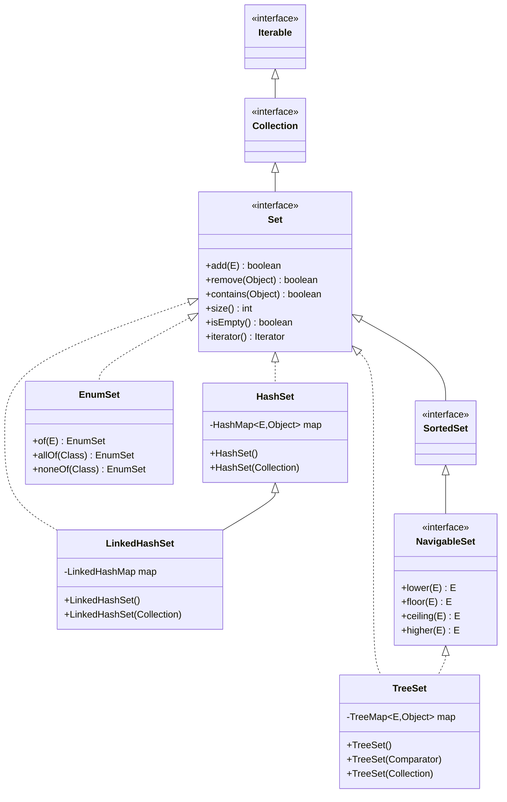
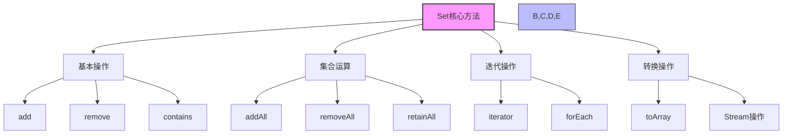
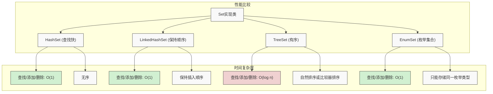
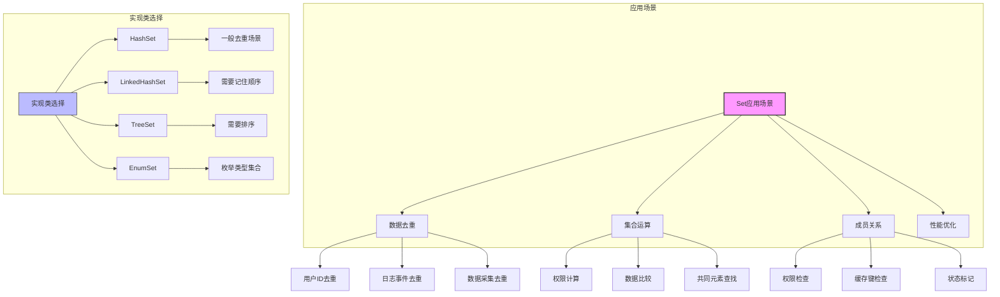

import Tabs from '@theme/Tabs';
import TabItem from '@theme/TabItem';

# Java Set 集合详解

Set是Java集合框架中用于存储不重复元素的核心接口，它继承自Collection接口，提供了元素唯一性的保证。在Java开发中，Set集合被广泛应用于去重、集合运算、缓存实现等各种场景，是数据处理和算法实现的重要基础。

:::tip 核心特性
**Set接口 = 元素唯一性 + 无序性 + 集合运算 + 高性能查找 + 去重能力**
- 🔍 **元素唯一性**：集合中每个元素只能出现一次，自动拒绝重复元素
- 🔀 **无序性**：大多数实现不保证元素的存储顺序（LinkedHashSet例外）
- 🔢 **集合运算**：支持并集(∪)、交集(∩)、差集(-)等数学集合操作
- ⚡ **高性能查找**：多数实现提供O(1)查找性能，适合频繁检索
- 🧹 **天然去重**：添加重复元素时自动去重，不抛异常而是返回false
:::

## 1. Set接口基础概念

### 1.1 什么是Set接口？

Set接口是Java集合框架中的核心接口，它继承自Collection接口，为不重复元素的集合提供了完整的抽象。



Set集合具有以下核心特征：

- **元素唯一性**：不允许存储重复的元素，每个元素在集合中只能出现一次
- **无序性**：大多数实现类不保证元素的存储顺序
- **继承Collection**：具有Collection接口的所有基本方法
- **无索引访问**：不支持通过索引直接访问元素
- **集合运算**：支持并集、交集、差集等集合运算

### 1.2 Set接口的重要性

| 重要性 | 具体体现 | 业务价值 |
|--------|----------|----------|
| **数据去重** | 自动去除重复元素 | 保证数据的一致性和准确性 |
| **快速查找** | 基于哈希的O(1)查找 | 提高数据检索效率 |
| **集合运算** | 支持复杂的集合操作 | 简化数据处理逻辑 |
| **缓存实现** | 天然适合缓存数据结构 | 支持高效的缓存管理 |

### 1.3 Set接口设计原则

Set接口的设计遵循以下几个核心原则：

#### 唯一性原则
保证集合中每个元素的唯一性，避免重复数据

#### 无序性原则  
大多数实现类不保证元素的存储顺序，提高性能

#### 集合运算原则
支持完整的集合运算，满足数学集合论的需求

#### 高性能原则
提供高效的查找、插入、删除操作

```java title="Set接口核心方法示例"
public interface Set<E> extends Collection<E> {
    
    // ========== 基本操作 ==========
    boolean add(E e);                          // 添加元素，重复时返回false
    boolean remove(Object o);                  // 删除指定元素
    boolean contains(Object o);                // 检查是否包含指定元素
    
    // ========== 集合运算 ==========
    boolean addAll(Collection<? extends E> c); // 添加集合（并集）
    boolean removeAll(Collection<?> c);        // 删除集合（差集）
    boolean retainAll(Collection<?> c);        // 保留集合（交集）
    void clear();                              // 清空集合
    
    // ========== 查询操作 ==========
    int size();                                // 获取元素个数
    boolean isEmpty();                         // 判断是否为空
    
    // ========== 迭代器 ==========
    Iterator<E> iterator();                    // 获取迭代器
}
```

### 1.4 Set接口方法分类详解

Set接口提供了丰富的方法来操作不重复元素的集合，这些方法可以分为几个主要类别：



<Tabs>
<TabItem value="basic" label="基本操作方法">

```java title="Set基本操作方法"
public interface Set<E> extends Collection<E> {
    
    // 添加和删除元素
    boolean add(E e);                          // 添加元素，重复时返回false
    boolean remove(Object o);                  // 删除指定元素
    boolean contains(Object o);                // 检查是否包含指定元素
    
    // 集合信息
    int size();                                // 获取集合大小
    boolean isEmpty();                         // 判断是否为空
    void clear();                              // 清空集合
}
```

| 方法 | 描述 | 返回值 | 特殊行为 |
|------|------|--------|----------|
| `add(E e)` | 添加元素到集合 | 成功添加返回true，元素已存在返回false | 添加重复元素不会抛异常 |
| `remove(Object o)` | 从集合移除元素 | 存在并移除返回true，不存在返回false | 性能因实现类而异 |
| `contains(Object o)` | 检查元素是否在集合中 | 存在返回true，不存在返回false | HashSet为O(1)，TreeSet为O(log n) |

</TabItem>
<TabItem value="collection-ops" label="集合运算方法">
```java title="Set集合运算方法"
public interface Set<E> extends Collection<E> {
    
    // 并集操作
    boolean addAll(Collection<? extends E> c); // 添加另一个集合的所有元素
    
    // 差集操作
    boolean removeAll(Collection<?> c);        // 删除另一个集合中的所有元素
    
    // 交集操作
    boolean retainAll(Collection<?> c);        // 只保留另一个集合中存在的元素
}
```

| 方法 | 描述 | 数学表示 | 应用场景 |
|------|------|----------|----------|
| `addAll(Collection<? extends E> c)` | 添加另一个集合的所有元素（并集） | A ∪ B | 合并两个分类集合 |
| `retainAll(Collection<?> c)` | 只保留也在指定集合中的元素（交集） | A ∩ B | 查找共同元素 |
| `removeAll(Collection<?> c)` | 移除指定集合中的所有元素（差集） | A - B | 从一个集合中剔除特定元素 |

```java title="集合运算示例"
public void setOperationsExample() {
    Set<String> set1 = new HashSet<>(Arrays.asList("A", "B", "C"));
    Set<String> set2 = new HashSet<>(Arrays.asList("B", "C", "D"));
    
    // 并集：set1 ← set1 ∪ set2 = {A, B, C, D}
    set1.addAll(set2);
    
    // 交集：set1 ← set1 ∩ set2 = {B, C}
    set1.retainAll(set2);
    
    // 差集：set1 ← set1 - set2 = {A}
    set1.removeAll(set2);
}
```

</TabItem>
<TabItem value="iterator" label="迭代器方法">
```java title="Set迭代器方法"
public interface Set<E> extends Collection<E> {
    
    // 获取迭代器
    Iterator<E> iterator();                    // 获取集合的迭代器
    
    // 继承自Collection的其他迭代方法
    // forEach(Consumer<? super E> action)     // Java 8+ 的forEach方法
    // spliterator()                           // Java 8+ 的并行迭代器
}
```

| 方法 | 描述 | 返回值 | 特性 |
|------|------|--------|------|
| `iterator()` | 获取迭代器 | Iterator对象 | 允许遍历并可选择性删除元素 |
| `forEach(Consumer)` | 对每个元素执行操作 | void | 简化迭代代码，Java 8+ |

:::info 迭代与遍历
遍历Set集合的4种方式：
1. **for-each循环**：`for (E element : set) { ... }`
2. **Iterator**：`Iterator<E> it = set.iterator(); while(it.hasNext()) { ... }`
3. **Lambda forEach**：`set.forEach(e -> System.out.println(e));`
4. **Stream API**：`set.stream().forEach(e -> System.out.println(e));`
:::

```java title="Set迭代示例"
public void iterationExample() {
    Set<String> set = new HashSet<>(Arrays.asList("A", "B", "C"));
    
    // 方式1：for-each循环
    for (String element : set) {
        System.out.println(element);
    }
    
    // 方式2：Iterator (支持删除)
    Iterator<String> it = set.iterator();
    while (it.hasNext()) {
        String element = it.next();
        if (element.equals("B")) {
            it.remove();  // 安全删除元素
        }
    }
    
    // 方式3：Lambda forEach (Java 8+)
    set.forEach(element -> System.out.println(element));
}
```

</TabItem>
</Tabs>

### 1.5 Set接口方法对比分析

| 操作类型 | 方法名 | 返回值 | 说明 | 使用场景 |
|----------|--------|--------|------|----------|
| **添加操作** | add(E) | boolean | 添加元素，重复时返回false | 基本元素添加 |
| **删除操作** | remove(Object) | boolean | 删除元素，不存在时返回false | 基本元素删除 |
| **查找操作** | contains(Object) | boolean | 检查元素是否存在 | 元素存在性检查 |
| **集合运算** | addAll(Collection) | boolean | 并集操作 | 合并两个集合 |
| **集合运算** | removeAll(Collection) | boolean | 差集操作 | 从集合中移除元素 |
| **集合运算** | retainAll(Collection) | boolean | 交集操作 | 保留共同元素 |

:::tip 方法使用建议
- **添加元素**：使用add()方法，注意处理重复元素的情况
- **删除元素**：使用remove()方法，注意处理元素不存在的情况
- **集合运算**：使用addAll()、removeAll()、retainAll()进行复杂操作
- **性能考虑**：contains()操作在HashSet中为O(1)，在TreeSet中为O(log n)
:::

## 2. Set 实现类详解



<Tabs>
<TabItem value="hashset" label="HashSet">

### 2.1 HashSet 概述

:::tip 核心特点
HashSet是Set接口最常用的实现类，基于HashMap实现，具有以下特点：
- 🔍 **基于HashMap**：底层使用HashMap存储元素
- 🔀 **无序性**：不保证元素的存储顺序
- ⚡ **高性能**：查找、插入、删除操作平均时间复杂度O(1)
- ⚪ **允许null**：支持null元素
- ⚠️ **线程不安全**：在多线程环境下需要外部同步
:::

#### 适用场景
- 需要快速查找、插入、删除的场景
- 数据去重处理
- 缓存实现
- 集合运算
- 对元素顺序没有要求的场景

### 2.2 HashSet 内部结构

HashSet基于HashMap实现，通过HashMap的键来存储Set的元素，值使用一个固定的虚拟对象。

#### 核心字段

```java title="HashSet核心字段"
public class HashSet<E> extends AbstractSet<E>
    implements Set<E>, Cloneable, java.io.Serializable {
    
    // 底层使用HashMap存储元素
    private transient HashMap<E,Object> map;
    
    // 虚拟值，用于HashMap的值部分
    private static final Object PRESENT = new Object();
}
```

#### 构造方法

```java title="HashSet构造方法"
public class HashSet<E> extends AbstractSet<E> {
    
    /**
     * 构造一个默认初始容量的空HashSet
     */
    public HashSet() {
        map = new HashMap<>();
    }
    
    /**
     * 构造一个指定初始容量的空HashSet
     */
    public HashSet(int initialCapacity) {
        map = new HashMap<>(initialCapacity);
    }
    
    /**
     * 构造一个指定初始容量和负载因子的空HashSet
     */
    public HashSet(int initialCapacity, float loadFactor) {
        map = new HashMap<>(initialCapacity, loadFactor);
    }
    
    /**
     * 构造一个包含指定集合元素的HashSet
     */
    public HashSet(Collection<? extends E> c) {
        map = new HashMap<>(Math.max((int) (c.size()/.75f) + 1, 16));
        addAll(c);
    }
}
```

#### 内存布局示意图

```
HashSet 实例
┌─────────────────────────────────────────┐
│ map: HashMap<E,Object>                  │
│ ├── "Java" → PRESENT                    │
│ ├── "Python" → PRESENT                  │
│ ├── "C++" → PRESENT                     │
│ └── null → PRESENT                      │
│                                         │
│ PRESENT: Object (虚拟值)                │
└─────────────────────────────────────────┘
```

### 2.3 HashSet 核心方法实现

#### 2.3.1 添加元素

```java title="HashSet添加元素实现"
public class HashSet<E> extends AbstractSet<E> {
    
    /**
     * 添加元素到HashSet
     * 时间复杂度：平均O(1)，最坏情况O(n)
     */
    public boolean add(E e) {
        // 使用HashMap的put方法，如果键不存在则返回null
        return map.put(e, PRESENT) == null;
    }
    
    /**
     * 批量添加元素
     * 时间复杂度：O(n)，n为要添加的元素个数
     */
    public boolean addAll(Collection<? extends E> c) {
        boolean modified = false;
        for (E e : c) {
            if (add(e)) {
                modified = true;
            }
        }
        return modified;
    }
}
```

#### 2.3.2 删除元素

```java title="HashSet删除元素实现"
public class HashSet<E> extends AbstractSet<E> {
    
    /**
     * 从HashSet中删除指定元素
     * 时间复杂度：平均O(1)，最坏情况O(n)
     */
    public boolean remove(Object o) {
        // 使用HashMap的remove方法，如果键存在则返回对应的值
        return map.remove(o) == PRESENT;
    }
    
    /**
     * 批量删除元素
     * 时间复杂度：O(n)，n为要删除的元素个数
     */
    public boolean removeAll(Collection<?> c) {
        boolean modified = false;
        for (Object o : c) {
            if (remove(o)) {
                modified = true;
            }
        }
        return modified;
    }
}
```

#### 2.3.3 查找元素

```java title="HashSet查找元素实现"
public class HashSet<E> extends AbstractSet<E> {
    
    /**
     * 检查HashSet是否包含指定元素
     * 时间复杂度：平均O(1)，最坏情况O(n)
     */
    public boolean contains(Object o) {
        // 使用HashMap的containsKey方法
        return map.containsKey(o);
    }
    
    /**
     * 检查HashSet是否包含指定集合的所有元素
     * 时间复杂度：O(n)，n为指定集合的大小
     */
    public boolean containsAll(Collection<?> c) {
        for (Object o : c) {
            if (!contains(o)) {
                return false;
            }
        }
        return true;
    }
}
```

#### 2.3.4 集合运算

```java title="HashSet集合运算实现"
public class HashSet<E> extends AbstractSet<E> {
    
    /**
     * 保留交集：只保留在指定集合中也存在的元素
     * 时间复杂度：O(n)，n为指定集合的大小
     */
    public boolean retainAll(Collection<?> c) {
        boolean modified = false;
        Iterator<E> it = iterator();
        while (it.hasNext()) {
            if (!c.contains(it.next())) {
                it.remove();
                modified = true;
            }
        }
        return modified;
    }
    
    /**
     * 清空HashSet
     * 时间复杂度：O(n)，n为集合大小
     */
    public void clear() {
        map.clear();
    }
}
```

### 2.4 HashSet 性能分析

#### 2.4.1 时间复杂度对比

| 操作 | 时间复杂度 | 说明 |
|------|------------|------|
| **添加元素** | 平均O(1) | 基于哈希值直接定位 |
| **删除元素** | 平均O(1) | 基于哈希值直接定位 |
| **查找元素** | 平均O(1) | 基于哈希值直接定位 |
| **遍历元素** | O(n) | 需要遍历所有元素 |
| **集合运算** | O(n) | 需要遍历集合元素 |

#### 2.4.2 空间复杂度

- **存储开销**：每个元素占用一个HashMap节点
- **哈希表开销**：需要额外的哈希表数组空间
- **负载因子**：影响空间使用效率，默认0.75

#### 2.4.3 性能优化建议

```java title="HashSet性能优化示例"
public class HashSetOptimization {
    
    /**
     * 预分配容量优化
     */
    public static void capacityOptimization() {
        // 知道大概元素数量时，预分配容量
        int expectedSize = 1000;
        Set<String> optimizedSet = new HashSet<>(expectedSize);
        
        // 避免频繁扩容
        for (int i = 0; i < expectedSize; i++) {
            optimizedSet.add("item" + i);
        }
    }
    
    /**
     * 批量操作优化
     */
    public static void batchOperationOptimization() {
        Set<String> set1 = new HashSet<>();
        Set<String> set2 = new HashSet<>();
        
        // 批量添加，比循环add效率高
        set1.addAll(set2);
        
        // 批量删除
        set1.removeAll(set2);
        
        // 保留交集
        set1.retainAll(set2);
    }
    
    /**
     * 元素类型优化
     */
    public static void elementTypeOptimization() {
        // 推荐：使用不可变对象
        Set<String> goodSet = new HashSet<>();
        
        // 不推荐：使用可变对象
        Set<StringBuilder> badSet = new HashSet<>();
    }
}
```

### 2.5 HashSet 使用示例

#### 2.5.1 基本操作示例

```java title="HashSet基本操作示例"
public class HashSetBasicExample {
    
    public static void main(String[] args) {
        // 创建HashSet
        Set<String> set = new HashSet<>();
        
        // 添加元素
        set.add("Java");
        set.add("Python");
        set.add("C++");
        set.add("JavaScript");
        
        // 尝试添加重复元素
        boolean added = set.add("Java");
        System.out.println("添加重复元素Java: " + added); // false
        
        System.out.println("Set大小: " + set.size()); // 4
        
        // 检查元素是否存在
        boolean contains = set.contains("Python");
        System.out.println("是否包含Python: " + contains); // true
        
        // 删除元素
        boolean removed = set.remove("C++");
        System.out.println("删除C++: " + removed); // true
        
        // 遍历元素
        System.out.println("Set中的元素:");
        for (String item : set) {
            System.out.println(item);
        }
        
        // 清空集合
        set.clear();
        System.out.println("清空后大小: " + set.size()); // 0
    }
}
```

#### 2.5.2 集合运算示例

```java title="HashSet集合运算示例"
public class HashSetSetOperationsExample {
    
    public static void main(String[] args) {
        // 创建两个Set
        Set<String> set1 = new HashSet<>();
        set1.add("Java");
        set1.add("Python");
        set1.add("C++");
        set1.add("JavaScript");
        
        Set<String> set2 = new HashSet<>();
        set2.add("Python");
        set2.add("C++");
        set2.add("Go");
        set2.add("Rust");
        
        System.out.println("Set1: " + set1);
        System.out.println("Set2: " + set2);
        
        // 并集操作
        Set<String> union = new HashSet<>(set1);
        union.addAll(set2);
        System.out.println("并集: " + union);
        
        // 交集操作
        Set<String> intersection = new HashSet<>(set1);
        intersection.retainAll(set2);
        System.out.println("交集: " + intersection);
        
        // 差集操作
        Set<String> difference = new HashSet<>(set1);
        difference.removeAll(set2);
        System.out.println("差集(Set1 - Set2): " + difference);
        
        // 对称差集
        Set<String> symmetricDifference = new HashSet<>(union);
        symmetricDifference.removeAll(intersection);
        System.out.println("对称差集: " + symmetricDifference);
    }
}
```

#### 2.5.3 去重示例

```java title="HashSet去重示例"
public class HashSetDeduplicationExample {
    
    public static void main(String[] args) {
        // 数组去重
        String[] array = {"Java", "Python", "Java", "C++", "Python", "JavaScript"};
        Set<String> uniqueSet = new HashSet<>(Arrays.asList(array));
        String[] uniqueArray = uniqueSet.toArray(new String[0]);
        
        System.out.println("原始数组: " + Arrays.toString(array));
        System.out.println("去重后: " + Arrays.toString(uniqueArray));
        
        // 列表去重
        List<Integer> list = Arrays.asList(1, 2, 3, 2, 4, 1, 5, 3, 6);
        Set<Integer> uniqueNumbers = new HashSet<>(list);
        List<Integer> uniqueList = new ArrayList<>(uniqueNumbers);
        
        System.out.println("原始列表: " + list);
        System.out.println("去重后: " + uniqueList);
        
        // 对象去重
        List<Person> people = Arrays.asList(
            new Person("Alice", 25),
            new Person("Bob", 30),
            new Person("Alice", 25), // 重复
            new Person("Charlie", 35)
        );
        
        Set<Person> uniquePeople = new HashSet<>(people);
        System.out.println("去重后的人数: " + uniquePeople.size());
        uniquePeople.forEach(System.out::println);
    }
    
    // Person类
    static class Person {
        private String name;
        private int age;
        
        public Person(String name, int age) {
            this.name = name;
            this.age = age;
        }
        
        @Override
        public boolean equals(Object o) {
            if (this == o) return true;
            if (o == null || getClass() != o.getClass()) return false;
            Person person = (Person) o;
            return age == person.age && Objects.equals(name, person.name);
        }
        
        @Override
        public int hashCode() {
            return Objects.hash(name, age);
        }
        
        @Override
        public String toString() {
            return "Person{name='" + name + "', age=" + age + "}";
        }
    }
}
```

</TabItem>
<TabItem value="linkedhashset" label="LinkedHashSet">

### 3.1 LinkedHashSet 概述

:::tip 核心特点
LinkedHashSet是HashSet的子类，在HashSet的基础上维护了插入顺序，具有以下特点：
- 🔄 **继承HashSet**：基于HashSet实现，具有HashSet的所有特性
- 📝 **维护顺序**：通过双向链表维护元素的插入顺序
- ⚖️ **性能平衡**：在HashSet高性能的基础上增加了顺序维护
- ⚪ **允许null**：支持null元素
- ⚠️ **线程不安全**：在多线程环境下需要外部同步
:::

#### 适用场景
- 需要保持元素插入顺序的场景
- 需要去重且保持顺序的场景
- LRU缓存实现
- 需要按插入顺序遍历的场景

### 3.2 LinkedHashSet 内部结构

LinkedHashSet继承自HashSet，通过重写HashSet的构造方法来实现顺序维护。

#### 核心字段

```java title="LinkedHashSet核心字段"
public class LinkedHashSet<E> extends HashSet<E>
    implements Set<E>, Cloneable, java.io.Serializable {
    
    // 继承自HashSet的字段
    // private transient HashMap<E,Object> map;
    // private static final Object PRESENT = new Object();
    
    // 通过调用HashSet的特定构造方法来维护顺序
    // 这个构造方法会创建LinkedHashMap而不是HashMap
}
```

#### 构造方法

```java title="LinkedHashSet构造方法"
public class LinkedHashSet<E> extends HashSet<E> {
    
    /**
     * 构造一个默认初始容量的空LinkedHashSet
     */
    public LinkedHashSet() {
        super(16, .75f, true);  // 调用HashSet的特定构造方法
    }
    
    /**
     * 构造一个指定初始容量的空LinkedHashSet
     */
    public LinkedHashSet(int initialCapacity) {
        super(initialCapacity, .75f, true);
    }
    
    /**
     * 构造一个指定初始容量和负载因子的空LinkedHashSet
     */
    public LinkedHashSet(int initialCapacity, float loadFactor) {
        super(initialCapacity, loadFactor, true);
    }
    
    /**
     * 构造一个包含指定集合元素的LinkedHashSet
     */
    public LinkedHashSet(Collection<? extends E> c) {
        super(Math.max(2*c.size(), 11), .75f, true);
        addAll(c);
    }
}
```

#### 内存布局示意图

```
LinkedHashSet 实例
┌─────────────────────────────────────────┐
│ map: LinkedHashMap<E,Object>            │
│ ├── "Java" → PRESENT                    │
│ ├── "Python" → PRESENT                  │
│ ├── "C++" → PRESENT                     │
│ └── "JavaScript" → PRESENT              │
│                                         │
│ 双向链表维护插入顺序:                   │
│ Java ←→ Python ←→ C++ ←→ JavaScript    │
│                                         │
│ PRESENT: Object (虚拟值)                │
└─────────────────────────────────────────┘
```

### 3.3 LinkedHashSet 核心特性

#### 3.3.1 顺序维护机制

```java title="LinkedHashSet顺序维护"
public class LinkedHashSet<E> extends HashSet<E> {
    
    /**
     * LinkedHashSet通过调用HashSet的特定构造方法来实现顺序维护
     * 该构造方法会创建LinkedHashMap而不是HashMap
     */
    
    // HashSet中的特定构造方法（包私有）
    HashSet(int initialCapacity, float loadFactor, boolean dummy) {
        map = new LinkedHashMap<>(initialCapacity, loadFactor);
    }
}
```

#### 3.3.2 性能特点

| 操作 | 时间复杂度 | 说明 |
|------|------------|------|
| **添加元素** | 平均O(1) | 基于哈希值定位 + 链表维护 |
| **删除元素** | 平均O(1) | 基于哈希值定位 + 链表维护 |
| **查找元素** | 平均O(1) | 基于哈希值直接定位 |
| **遍历元素** | O(n) | 按插入顺序遍历 |
| **顺序访问** | O(1) | 通过链表直接访问 |

### 3.4 LinkedHashSet 使用示例

#### 3.4.1 基本操作示例

```java title="LinkedHashSet基本操作示例"
public class LinkedHashSetBasicExample {
    
    public static void main(String[] args) {
        // 创建LinkedHashSet
        Set<String> linkedHashSet = new LinkedHashSet<>();
        
        // 添加元素
        linkedHashSet.add("Java");
        linkedHashSet.add("Python");
        linkedHashSet.add("C++");
        linkedHashSet.add("JavaScript");
        
        System.out.println("LinkedHashSet按插入顺序:");
        for (String item : linkedHashSet) {
            System.out.println(item);
        }
        
        // 与HashSet对比
        Set<String> hashSet = new HashSet<>();
        hashSet.add("Java");
        hashSet.add("Python");
        hashSet.add("C++");
        hashSet.add("JavaScript");
        
        System.out.println("\nHashSet顺序（可能不同）:");
        for (String item : hashSet) {
            System.out.println(item);
        }
        
        // 删除元素后顺序保持不变
        linkedHashSet.remove("Python");
        System.out.println("\n删除Python后:");
        for (String item : linkedHashSet) {
            System.out.println(item);
        }
    }
}
```

#### 3.4.2 去重保持顺序示例

```java title="LinkedHashSet去重保持顺序示例"
public class LinkedHashSetDeduplicationExample {
    
    public static void main(String[] args) {
        // 使用LinkedHashSet进行去重并保持顺序
        List<String> list = Arrays.asList("Java", "Python", "Java", "C++", "Python", "JavaScript");
        
        // 使用LinkedHashSet去重
        Set<String> uniqueSet = new LinkedHashSet<>(list);
        List<String> uniqueList = new ArrayList<>(uniqueSet);
        
        System.out.println("原始列表: " + list);
        System.out.println("去重后保持顺序: " + uniqueList);
        
        // 与HashSet对比
        Set<String> hashSet = new HashSet<>(list);
        List<String> hashSetList = new ArrayList<>(hashSet);
        
        System.out.println("HashSet去重（顺序可能不同）: " + hashSetList);
    }
}
```

#### 3.4.3 LRU缓存实现示例

```java title="LinkedHashSet实现LRU缓存示例"
public class LinkedHashSetLRUCacheExample {
    
    // 简单的LRU缓存实现
    static class LRUCache<K, V> {
        private final int capacity;
        private final LinkedHashMap<K, V> cache;
        
        public LRUCache(int capacity) {
            this.capacity = capacity;
            this.cache = new LinkedHashMap<K, V>(capacity, 0.75f, true) {
                @Override
                protected boolean removeEldestEntry(Map.Entry<K, V> eldest) {
                    return size() > capacity;
                }
            };
        }
        
        public V get(K key) {
            return cache.get(key);
        }
        
        public void put(K key, V value) {
            cache.put(key, value);
        }
        
        public void remove(K key) {
            cache.remove(key);
        }
        
        public int size() {
            return cache.size();
        }
        
        public Set<K> keySet() {
            return cache.keySet();
        }
    }
    
    public static void main(String[] args) {
        // 创建LRU缓存
        LRUCache<String, String> cache = new LRUCache<>(3);
        
        // 添加元素
        cache.put("key1", "value1");
        cache.put("key2", "value2");
        cache.put("key3", "value3");
        
        System.out.println("缓存键集合: " + cache.keySet());
        
        // 访问key1，使其成为最近使用的
        cache.get("key1");
        
        // 添加新元素，会淘汰最久未使用的
        cache.put("key4", "value4");
        
        System.out.println("添加key4后: " + cache.keySet());
    }
}
```

</TabItem>
<TabItem value="treeset" label="TreeSet">

### 4.1 TreeSet 概述

:::tip 核心特点
TreeSet是基于TreeMap实现的有序Set，具有以下特点：
- 🌳 **基于TreeMap**：底层使用TreeMap存储元素
- 📊 **有序性**：元素按照自然顺序或自定义比较器排序
- ⛔ **不允许null**：不支持null元素
- ⚠️ **线程不安全**：在多线程环境下需要外部同步
- 📉 **性能特点**：查找、插入、删除操作时间复杂度O(log n)
:::

#### 适用场景
- 需要元素有序的场景
- 需要范围查询的场景
- 需要获取最大最小元素的场景
- 需要按顺序遍历的场景

### 4.2 TreeSet 内部结构

TreeSet基于TreeMap实现，通过TreeMap的键来存储Set的元素，值使用一个固定的虚拟对象。

#### 核心字段

```java title="TreeSet核心字段"
public class TreeSet<E> extends AbstractSet<E>
    implements NavigableSet<E>, Cloneable, java.io.Serializable {
    
    // 底层使用NavigableMap存储元素
    private transient NavigableMap<E,Object> m;
    
    // 虚拟值，用于NavigableMap的值部分
    private static final Object PRESENT = new Object();
}
```

#### 构造方法

```java title="TreeSet构造方法"
public class TreeSet<E> extends AbstractSet<E> {
    
    /**
     * 构造一个使用自然顺序的空TreeSet
     */
    public TreeSet() {
        this(new TreeMap<E,Object>());
    }
    
    /**
     * 构造一个使用指定比较器的空TreeSet
     */
    public TreeSet(Comparator<? super E> comparator) {
        this(new TreeMap<>(comparator));
    }
    
    /**
     * 构造一个包含指定集合元素的TreeSet
     */
    public TreeSet(Collection<? extends E> c) {
        this();
        addAll(c);
    }
    
    /**
     * 构造一个包含指定SortedSet元素的TreeSet
     */
    public TreeSet(SortedSet<E> s) {
        this(s.comparator());
        addAll(s);
    }
    
    /**
     * 包私有构造方法，用于内部实现
     */
    TreeSet(NavigableMap<E,Object> m) {
        this.m = m;
    }
}
```

#### 内存布局示意图

```
TreeSet 实例 (红黑树)
┌─────────────────────────────────────────┐
│ m: TreeMap<E,Object>                    │
│                                         │
│ 红黑树结构:                             │
│        C++                              │
│       /   \                             │
│    Java   Python                        │
│           /                             │
│      JavaScript                         │
│                                         │
│ 每个节点: key → PRESENT                 │
│ PRESENT: Object (虚拟值)                │
└─────────────────────────────────────────┘
```

### 4.3 TreeSet 核心方法实现

#### 4.3.1 添加元素

```java title="TreeSet添加元素实现"
public class TreeSet<E> extends AbstractSet<E> {
    
    /**
     * 添加元素到TreeSet
     * 时间复杂度：O(log n)
     */
    public boolean add(E e) {
        // 使用TreeMap的put方法，如果键不存在则返回null
        return m.put(e, PRESENT) == null;
    }
    
    /**
     * 批量添加元素
     * 时间复杂度：O(n log n)，n为要添加的元素个数
     */
    public boolean addAll(Collection<? extends E> c) {
        boolean modified = false;
        for (E e : c) {
            if (add(e)) {
                modified = true;
            }
        }
        return modified;
    }
}
```

#### 4.3.2 删除元素

```java title="TreeSet删除元素实现"
public class TreeSet<E> extends AbstractSet<E> {
    
    /**
     * 从TreeSet中删除指定元素
     * 时间复杂度：O(log n)
     */
    public boolean remove(Object o) {
        // 使用TreeMap的remove方法，如果键存在则返回对应的值
        return m.remove(o) == PRESENT;
    }
    
    /**
     * 清空TreeSet
     * 时间复杂度：O(n)，n为集合大小
     */
    public void clear() {
        m.clear();
    }
}
```

#### 4.3.3 查找元素

```java title="TreeSet查找元素实现"
public class TreeSet<E> extends AbstractSet<E> {
    
    /**
     * 检查TreeSet是否包含指定元素
     * 时间复杂度：O(log n)
     */
    public boolean contains(Object o) {
        // 使用TreeMap的containsKey方法
        return m.containsKey(o);
    }
    
    /**
     * 获取第一个元素（最小元素）
     * 时间复杂度：O(log n)
     */
    public E first() {
        return m.firstKey();
    }
    
    /**
     * 获取最后一个元素（最大元素）
     * 时间复杂度：O(log n)
     */
    public E last() {
        return m.lastKey();
    }
}
```

#### 4.3.4 导航方法

```java title="TreeSet导航方法实现"
public class TreeSet<E> extends AbstractSet<E> {
    
    /**
     * 获取小于指定元素的最大元素
     * 时间复杂度：O(log n)
     */
    public E lower(E e) {
        return m.lowerKey(e);
    }
    
    /**
     * 获取小于等于指定元素的最大元素
     * 时间复杂度：O(log n)
     */
    public E floor(E e) {
        return m.floorKey(e);
    }
    
    /**
     * 获取大于等于指定元素的最小元素
     * 时间复杂度：O(log n)
     */
    public E ceiling(E e) {
        return m.ceilingKey(e);
    }
    
    /**
     * 获取大于指定元素的最小元素
     * 时间复杂度：O(log n)
     */
    public E higher(E e) {
        return m.higherKey(e);
    }
}
```

### 4.4 TreeSet 性能分析

#### 4.4.1 时间复杂度对比

| 操作 | 时间复杂度 | 说明 |
|------|------------|------|
| **添加元素** | O(log n) | 需要维护红黑树平衡 |
| **删除元素** | O(log n) | 需要维护红黑树平衡 |
| **查找元素** | O(log n) | 基于红黑树查找 |
| **获取最大最小** | O(log n) | 基于红黑树查找 |
| **遍历元素** | O(n) | 中序遍历红黑树 |
| **范围查询** | O(log n + k) | k为结果集大小 |

#### 4.4.2 空间复杂度

- **存储开销**：每个元素占用一个红黑树节点
- **树结构开销**：需要额外的树节点引用
- **平衡开销**：维护红黑树平衡的额外开销

### 4.5 TreeSet 使用示例

#### 4.5.1 基本操作示例

```java title="TreeSet基本操作示例"
public class TreeSetBasicExample {
    
    public static void main(String[] args) {
        // 自然顺序排序
        Set<String> naturalOrderSet = new TreeSet<>();
        naturalOrderSet.add("Java");
        naturalOrderSet.add("Python");
        naturalOrderSet.add("C++");
        naturalOrderSet.add("JavaScript");
        
        System.out.println("自然顺序:");
        for (String item : naturalOrderSet) {
            System.out.println(item);
        }
        
        // 自定义比较器（逆序）
        Set<String> customOrderSet = new TreeSet<>((s1, s2) -> s2.compareTo(s1));
        customOrderSet.add("Java");
        customOrderSet.add("Python");
        customOrderSet.add("C++");
        customOrderSet.add("JavaScript");
        
        System.out.println("\n自定义顺序（逆序）:");
        for (String item : customOrderSet) {
            System.out.println(item);
        }
        
        // 数字排序
        Set<Integer> numberSet = new TreeSet<>();
        numberSet.add(5);
        numberSet.add(2);
        numberSet.add(8);
        numberSet.add(1);
        numberSet.add(3);
        
        System.out.println("\n数字排序:");
        for (Integer num : numberSet) {
            System.out.println(num);
        }
    }
}
```

#### 4.5.2 导航方法示例

```java title="TreeSet导航方法示例"
public class TreeSetNavigationExample {
    
    public static void main(String[] args) {
        // 创建TreeSet
        TreeSet<String> treeSet = new TreeSet<>();
        treeSet.add("Alice");
        treeSet.add("Bob");
        treeSet.add("Charlie");
        treeSet.add("David");
        treeSet.add("Eve");
        treeSet.add("Frank");
        
        System.out.println("TreeSet: " + treeSet);
        
        // 获取第一个和最后一个元素
        String first = treeSet.first();
        String last = treeSet.last();
        System.out.println("第一个元素: " + first);
        System.out.println("最后一个元素: " + last);
        
        // 导航方法
        String target = "Charlie";
        String lower = treeSet.lower(target);
        String floor = treeSet.floor(target);
        String ceiling = treeSet.ceiling(target);
        String higher = treeSet.higher(target);
        
        System.out.println("\n导航方法示例（目标: " + target + "）:");
        System.out.println("lower: " + lower);      // 小于Charlie的最大元素
        System.out.println("floor: " + floor);      // 小于等于Charlie的最大元素
        System.out.println("ceiling: " + ceiling);  // 大于等于Charlie的最小元素
        System.out.println("higher: " + higher);    // 大于Charlie的最小元素
        
        // 子集操作
        SortedSet<String> subSet = treeSet.subSet("Bob", "Eve");
        System.out.println("\n子集 [Bob, Eve): " + subSet);
        
        SortedSet<String> headSet = treeSet.headSet("David");
        System.out.println("头集 [开始, David): " + headSet);
        
        SortedSet<String> tailSet = treeSet.tailSet("David");
        System.out.println("尾集 [David, 结束): " + tailSet);
    }
}
```

#### 4.5.3 自定义对象排序示例

```java title="TreeSet自定义对象排序示例"
public class TreeSetCustomObjectExample {
    
    // 学生类
    static class Student implements Comparable<Student> {
        private String name;
        private int age;
        private double score;
        
        public Student(String name, int age, double score) {
            this.name = name;
            this.age = age;
            this.score = score;
        }
        
        @Override
        public int compareTo(Student other) {
            // 首先按分数排序（降序），分数相同时按年龄排序（升序）
            int scoreCompare = Double.compare(other.score, this.score);
            if (scoreCompare != 0) {
                return scoreCompare;
            }
            return Integer.compare(this.age, other.age);
        }
        
        @Override
        public String toString() {
            return "Student{name='" + name + "', age=" + age + ", score=" + score + "}";
        }
    }
    
    public static void main(String[] args) {
        // 使用自然顺序的TreeSet
        Set<Student> studentSet = new TreeSet<>();
        studentSet.add(new Student("Alice", 20, 85.5));
        studentSet.add(new Student("Bob", 22, 90.0));
        studentSet.add(new Student("Charlie", 21, 85.5));
        studentSet.add(new Student("David", 23, 88.0));
        
        System.out.println("按分数降序、年龄升序排列:");
        for (Student student : studentSet) {
            System.out.println(student);
        }
        
        // 使用自定义比较器的TreeSet
        Set<Student> ageSet = new TreeSet<>((s1, s2) -> Integer.compare(s1.age, s2.age));
        ageSet.addAll(studentSet);
        
        System.out.println("\n按年龄升序排列:");
        for (Student student : ageSet) {
            System.out.println(student);
        }
    }
}
``` 

## 5. 其他Set实现类详解

### 5.1 CopyOnWriteArraySet 实现类详解

#### 5.1.1 CopyOnWriteArraySet 概述

:::tip 核心特点
CopyOnWriteArraySet是基于CopyOnWriteArrayList实现的线程安全Set，具有以下特点：
- **基于CopyOnWriteArrayList**：底层使用CopyOnWriteArrayList存储元素
- **线程安全**：所有操作都是线程安全的
- **写时复制**：修改操作会创建新的数组副本
- **读多写少**：适合读多写少的场景
- **性能特点**：读操作性能好，写操作性能较差
:::

#### 5.1.2 CopyOnWriteArraySet 使用示例

```java title="CopyOnWriteArraySet使用示例"
public class CopyOnWriteArraySetExample {
    
    public static void main(String[] args) {
        // 创建线程安全的Set
        Set<String> set = new CopyOnWriteArraySet<>();
        
        // 多线程安全操作
        Thread t1 = new Thread(() -> {
            for (int i = 0; i < 1000; i++) {
                set.add("Thread1-" + i);
            }
        });
        
        Thread t2 = new Thread(() -> {
            for (int i = 0; i < 1000; i++) {
                set.add("Thread2-" + i);
            }
        });
        
        t1.start();
        t2.start();
        
        try {
            t1.join();
            t2.join();
        } catch (InterruptedException e) {
            e.printStackTrace();
        }
        
        System.out.println("最终大小: " + set.size());
        
        // 遍历操作（线程安全）
        for (String item : set) {
            // 遍历过程中可以安全地修改集合
            set.add("new-item");
        }
    }
}
```

</TabItem>
<TabItem value="enumset" label="EnumSet">

#### 5.2.1 EnumSet 概述

:::tip 核心特点
EnumSet是专门为枚举类型设计的高效Set实现，具有以下特点：
- 🔠 **专门为枚举设计**：只能存储枚举类型的元素
- ⚡ **高性能**：基于位向量实现，性能极高
- 📊 **内存效率**：使用位运算，内存占用极小
- ⚠️ **线程不安全**：在多线程环境下需要外部同步
- ⛔ **不允许null**：不支持null元素
:::

</TabItem>
</Tabs>

#### 5.2.2 EnumSet 使用示例

```java title="EnumSet使用示例"
public class EnumSetExample {
    
    // 颜色枚举
    enum Color {
        RED, GREEN, BLUE, YELLOW, BLACK, WHITE
    }
    
    // 权限枚举
    enum Permission {
        READ, WRITE, EXECUTE, DELETE
    }
    
    public static void main(String[] args) {
        // 创建包含所有元素的EnumSet
        EnumSet<Color> allColors = EnumSet.allOf(Color.class);
        System.out.println("所有颜色: " + allColors);
        
        // 创建空的EnumSet
        EnumSet<Color> emptyColors = EnumSet.noneOf(Color.class);
        emptyColors.add(Color.RED);
        emptyColors.add(Color.GREEN);
        System.out.println("部分颜色: " + emptyColors);
        
        // 创建指定范围的EnumSet
        EnumSet<Color> rangeColors = EnumSet.range(Color.RED, Color.BLUE);
        System.out.println("范围颜色: " + rangeColors);
        
        // 创建指定元素的EnumSet
        EnumSet<Color> specificColors = EnumSet.of(Color.RED, Color.BLUE, Color.WHITE);
        System.out.println("指定颜色: " + specificColors);
        
        // 权限管理示例
        EnumSet<Permission> userPermissions = EnumSet.of(Permission.READ, Permission.WRITE);
        System.out.println("用户权限: " + userPermissions);
        
        // 检查权限
        boolean canRead = userPermissions.contains(Permission.READ);
        boolean canExecute = userPermissions.contains(Permission.EXECUTE);
        System.out.println("可以读取: " + canRead);
        System.out.println("可以执行: " + canExecute);
        
        // 添加权限
        userPermissions.add(Permission.EXECUTE);
        System.out.println("添加执行权限后: " + userPermissions);
        
        // 移除权限
        userPermissions.remove(Permission.WRITE);
        System.out.println("移除写权限后: " + userPermissions);
    }
}
```

### 5.3 ConcurrentSkipListSet 实现类详解

#### 5.3.1 ConcurrentSkipListSet 概述

:::tip 核心特点
ConcurrentSkipListSet是基于ConcurrentSkipListMap实现的线程安全有序Set，具有以下特点：
- **基于跳表**：底层使用跳表数据结构
- **线程安全**：所有操作都是线程安全的
- **有序性**：元素按照自然顺序或自定义比较器排序
- **高性能**：查找、插入、删除操作时间复杂度O(log n)
- **不允许null**：不支持null元素
:::

#### 5.3.2 ConcurrentSkipListSet 使用示例

```java title="ConcurrentSkipListSet使用示例"
public class ConcurrentSkipListSetExample {
    
    public static void main(String[] args) {
        // 创建线程安全的有序Set
        Set<String> set = new ConcurrentSkipListSet<>();
        
        // 多线程并发添加元素
        Thread t1 = new Thread(() -> {
            for (int i = 0; i < 100; i++) {
                set.add("Thread1-" + i);
            }
        });
        
        Thread t2 = new Thread(() -> {
            for (int i = 0; i < 100; i++) {
                set.add("Thread2-" + i);
            }
        });
        
        t1.start();
        t2.start();
        
        try {
            t1.join();
            t2.join();
        } catch (InterruptedException e) {
            e.printStackTrace();
        }
        
        System.out.println("最终大小: " + set.size());
        
        // 有序遍历
        System.out.println("前10个元素:");
        int count = 0;
        for (String item : set) {
            if (count++ < 10) {
                System.out.println(item);
            } else {
                break;
            }
        }
        
        // 数字排序示例
        Set<Integer> numberSet = new ConcurrentSkipListSet<>();
        numberSet.add(5);
        numberSet.add(2);
        numberSet.add(8);
        numberSet.add(1);
        numberSet.add(3);
        
        System.out.println("有序数字: " + numberSet);
    }
}
```

## 6. 实际应用场景



### 6.1 数据去重处理

```java title="数据去重处理示例"
public class DataDeduplicationExample {
    
    public static void main(String[] args) {
        // 用户ID去重
        List<String> userIds = Arrays.asList("user1", "user2", "user1", "user3", "user2", "user4");
        Set<String> uniqueUserIds = new HashSet<>(userIds);
        System.out.println("去重后的用户ID: " + uniqueUserIds);
        
        // 保持插入顺序的去重
        List<String> orderedIds = Arrays.asList("user1", "user2", "user1", "user3", "user2", "user4");
        Set<String> orderedUniqueIds = new LinkedHashSet<>(orderedIds);
        System.out.println("保持顺序的去重: " + orderedUniqueIds);
        
        // 对象去重
        List<Employee> employees = Arrays.asList(
            new Employee("Alice", "IT"),
            new Employee("Bob", "HR"),
            new Employee("Alice", "IT"), // 重复
            new Employee("Charlie", "Finance")
        );
        
        Set<Employee> uniqueEmployees = new HashSet<>(employees);
        System.out.println("去重后的员工: " + uniqueEmployees);
    }
    
    static class Employee {
        private String name;
        private String department;
        
        public Employee(String name, String department) {
            this.name = name;
            this.department = department;
        }
        
        @Override
        public boolean equals(Object o) {
            if (this == o) return true;
            if (o == null || getClass() != o.getClass()) return false;
            Employee employee = (Employee) o;
            return Objects.equals(name, employee.name) && 
                   Objects.equals(department, employee.department);
        }
        
        @Override
        public int hashCode() {
            return Objects.hash(name, department);
        }
        
        @Override
        public String toString() {
            return "Employee{name='" + name + "', department='" + department + "'}";
        }
    }
}
```

### 6.2 集合运算应用

```java title="集合运算应用示例"
public class SetOperationsApplicationExample {

    public static void main(String[] args) {
        // 用户权限管理
        Set<String> adminPermissions = new HashSet<>(Arrays.asList("read", "write", "delete", "admin"));
        Set<String> userPermissions = new HashSet<>(Arrays.asList("read", "write"));
        Set<String> guestPermissions = new HashSet<>(Arrays.asList("read"));
        
        // 计算权限差异
        Set<String> adminOnlyPermissions = new HashSet<>(adminPermissions);
        adminOnlyPermissions.removeAll(userPermissions);
        System.out.println("管理员独有权限: " + adminOnlyPermissions);
        
        // 计算共同权限
        Set<String> commonPermissions = new HashSet<>(userPermissions);
        commonPermissions.retainAll(guestPermissions);
        System.out.println("用户和访客共同权限: " + commonPermissions);
        
        // 权限升级
        Set<String> upgradedPermissions = new HashSet<>(userPermissions);
        upgradedPermissions.addAll(Arrays.asList("delete"));
        System.out.println("升级后的用户权限: " + upgradedPermissions);
        
        // 标签系统
        Set<String> user1Tags = new HashSet<>(Arrays.asList("java", "spring", "database"));
        Set<String> user2Tags = new HashSet<>(Arrays.asList("python", "spring", "machine-learning"));
        
        // 共同兴趣
        Set<String> commonInterests = new HashSet<>(user1Tags);
        commonInterests.retainAll(user2Tags);
        System.out.println("共同兴趣: " + commonInterests);
        
        // 推荐标签
        Set<String> recommendedTags = new HashSet<>(user2Tags);
        recommendedTags.removeAll(user1Tags);
        System.out.println("推荐给用户1的标签: " + recommendedTags);
    }
}
```

### 6.3 缓存实现

```java title="缓存实现示例"
public class CacheImplementationExample {
    
    // 简单缓存实现
    static class SimpleCache<K, V> {
        private final Map<K, V> cache = new HashMap<>();
        private final Set<K> accessedKeys = new LinkedHashSet<>();
        private final int maxSize;
        
        public SimpleCache(int maxSize) {
            this.maxSize = maxSize;
        }
        
        public V get(K key) {
            V value = cache.get(key);
            if (value != null) {
                // 记录访问顺序
                accessedKeys.remove(key);
                accessedKeys.add(key);
            }
            return value;
        }
        
        public void put(K key, V value) {
            if (cache.size() >= maxSize && !cache.containsKey(key)) {
                // 移除最久未访问的元素
                K oldestKey = accessedKeys.iterator().next();
                accessedKeys.remove(oldestKey);
                cache.remove(oldestKey);
            }
            
            cache.put(key, value);
            accessedKeys.remove(key);
            accessedKeys.add(key);
        }
        
        public void remove(K key) {
            cache.remove(key);
            accessedKeys.remove(key);
        }
        
        public int size() {
            return cache.size();
        }
        
        public Set<K> keySet() {
            return new HashSet<>(cache.keySet());
        }
    }
    
    public static void main(String[] args) {
        // 创建缓存
        SimpleCache<String, String> cache = new SimpleCache<>(3);
        
        // 添加元素
        cache.put("key1", "value1");
        cache.put("key2", "value2");
        cache.put("key3", "value3");
        
        System.out.println("缓存大小: " + cache.size());
        System.out.println("缓存键: " + cache.keySet());
        
        // 访问元素
        cache.get("key1");
        
        // 添加新元素，会淘汰最久未访问的
        cache.put("key4", "value4");
        
        System.out.println("添加key4后: " + cache.keySet());
        
        // 使用TreeSet实现有序缓存
        Set<String> sortedCache = new TreeSet<>();
        sortedCache.add("item3");
        sortedCache.add("item1");
        sortedCache.add("item2");
        
        System.out.println("有序缓存: " + sortedCache);
    }
}
```

### 6.4 黑名单/白名单系统

```java title="黑名单白名单系统示例"
public class BlacklistWhitelistExample {
    
    // 黑名单系统
    static class BlacklistSystem {
        private final Set<String> blacklist = new HashSet<>();
        private final Set<String> whitelist = new HashSet<>();
        
        public void addToBlacklist(String item) {
            blacklist.add(item);
            whitelist.remove(item); // 从白名单中移除
        }
        
        public void addToWhitelist(String item) {
            whitelist.add(item);
            blacklist.remove(item); // 从黑名单中移除
        }
        
        public boolean isAllowed(String item) {
            // 如果在黑名单中，则不允许
            if (blacklist.contains(item)) {
                return false;
            }
            // 如果白名单为空，则允许所有非黑名单项目
            if (whitelist.isEmpty()) {
                return true;
            }
            // 否则只允许白名单中的项目
            return whitelist.contains(item);
        }
        
        public void removeFromBlacklist(String item) {
            blacklist.remove(item);
        }
        
        public void removeFromWhitelist(String item) {
            whitelist.remove(item);
        }
        
        public Set<String> getBlacklist() {
            return new HashSet<>(blacklist);
        }
        
        public Set<String> getWhitelist() {
            return new HashSet<>(whitelist);
        }
    }
    
    public static void main(String[] args) {
        BlacklistSystem system = new BlacklistSystem();
        
        // 添加黑名单
        system.addToBlacklist("spam@example.com");
        system.addToBlacklist("malware.com");
        
        // 添加白名单
        system.addToWhitelist("trusted@company.com");
        system.addToWhitelist("partner.com");
        
        // 测试访问控制
        System.out.println("spam@example.com 允许: " + system.isAllowed("spam@example.com"));
        System.out.println("trusted@company.com 允许: " + system.isAllowed("trusted@company.com"));
        System.out.println("unknown@example.com 允许: " + system.isAllowed("unknown@example.com"));
        
        // 移除黑名单项目
        system.removeFromBlacklist("spam@example.com");
        System.out.println("移除黑名单后 spam@example.com 允许: " + system.isAllowed("spam@example.com"));
    }
}
```

## 7. 最佳实践总结

### 7.1 Set实现类选择策略

:::tip 选择建议
选择合适的Set实现类需要考虑以下因素：
- **性能要求**：查找、插入、删除的性能需求
- **顺序要求**：是否需要保持元素顺序
- **线程安全**：是否在多线程环境下使用
- **内存约束**：内存使用限制
- **功能需求**：是否需要特殊功能（如导航方法）
:::

| 实现类 | 适用场景 | 优势 | 劣势 |
|--------|----------|------|------|
| **HashSet** | 一般用途、去重 | 性能最好、内存效率高 | 无序、线程不安全 |
| **LinkedHashSet** | 需要保持插入顺序 | 保持顺序、性能好 | 内存开销稍大 |
| **TreeSet** | 需要有序、范围查询 | 有序、支持导航方法 | 性能较差、内存开销大 |
| **CopyOnWriteArraySet** | 读多写少、线程安全 | 线程安全、读性能好 | 写性能差、内存开销大 |
| **EnumSet** | 枚举类型 | 性能极高、内存效率最高 | 只能存储枚举 |
| **ConcurrentSkipListSet** | 并发有序Set | 线程安全、有序 | 性能中等 |

### 7.2 性能优化策略

```java title="Set性能优化示例"
public class SetPerformanceOptimization {
    
    /**
     * 预分配容量优化
     */
    public static void capacityOptimization() {
        // 知道大概元素数量时，预分配容量
        int expectedSize = 1000;
        Set<String> optimizedSet = new HashSet<>(expectedSize);
        
        // 避免频繁扩容
        for (int i = 0; i < expectedSize; i++) {
            optimizedSet.add("item" + i);
        }
    }
    
    /**
     * 批量操作优化
     */
    public static void batchOperationOptimization() {
        Set<String> set1 = new HashSet<>();
        Set<String> set2 = new HashSet<>();
        
        // 批量添加，比循环add效率高
        set1.addAll(set2);
        
        // 批量删除
        set1.removeAll(set2);
        
        // 保留交集
        set1.retainAll(set2);
    }
    
    /**
     * 元素类型优化
     */
    public static void elementTypeOptimization() {
        // 推荐：使用不可变对象
        Set<String> goodSet = new HashSet<>();
        
        // 不推荐：使用可变对象
        Set<StringBuilder> badSet = new HashSet<>();
    }
    
    /**
     * 遍历优化
     */
    public static void iterationOptimization() {
        Set<String> set = new HashSet<>();
        
        // 推荐：使用增强for循环
for (String item : set) {
    System.out.println(item);
}

        // 推荐：使用forEach方法
        set.forEach(System.out::println);
        
        // 不推荐：使用迭代器（除非需要删除元素）
Iterator<String> iterator = set.iterator();
while (iterator.hasNext()) {
            String item = iterator.next();
            System.out.println(item);
        }
    }
}
```

### 7.3 常见陷阱和解决方案

:::caution 注意事项
1. **equals和hashCode一致性**：自定义对象必须正确实现equals和hashCode方法
2. **可变对象问题**：避免使用可变对象作为Set元素
3. **线程安全问题**：在多线程环境下选择合适的线程安全实现
4. **null值处理**：某些Set实现不支持null值
5. **性能考虑**：根据使用场景选择合适的实现类
:::

```java title="常见陷阱示例"
public class SetCommonTraps {
    
    /**
     * equals和hashCode不一致陷阱
     */
    public static void equalsHashCodeTrap() {
        // 错误：equals和hashCode不一致
        Set<BadPerson> badSet = new HashSet<>();
        BadPerson p1 = new BadPerson("Alice", 25);
        BadPerson p2 = new BadPerson("Alice", 25);
        
        badSet.add(p1);
        badSet.add(p2); // 可能添加成功，因为hashCode不同
        
        System.out.println("BadSet大小: " + badSet.size()); // 可能是2
        
        // 正确：equals和hashCode一致
        Set<GoodPerson> goodSet = new HashSet<>();
        GoodPerson p3 = new GoodPerson("Alice", 25);
        GoodPerson p4 = new GoodPerson("Alice", 25);
        
        goodSet.add(p3);
        goodSet.add(p4); // 不会添加，因为equals返回true
        
        System.out.println("GoodSet大小: " + goodSet.size()); // 1
    }
    
    /**
     * 可变对象陷阱
     */
    public static void mutableObjectTrap() {
        Set<StringBuilder> set = new HashSet<>();
        StringBuilder sb = new StringBuilder("Hello");
        set.add(sb);
        
        System.out.println("添加前: " + set.contains(sb)); // true
        
        // 修改对象内容
        sb.append(" World");
        
        System.out.println("修改后: " + set.contains(sb)); // false
        System.out.println("Set内容: " + set);
    }
    
    /**
     * 线程安全陷阱
     */
    public static void threadSafetyTrap() {
        Set<String> set = new HashSet<>(); // 线程不安全
        
        // 错误：多线程访问
        Thread t1 = new Thread(() -> {
            for (int i = 0; i < 1000; i++) {
                set.add("Thread1-" + i);
            }
        });
        
        Thread t2 = new Thread(() -> {
            for (int i = 0; i < 1000; i++) {
                set.add("Thread2-" + i);
            }
        });
        
        // 正确：使用线程安全的Set
        Set<String> safeSet = new CopyOnWriteArraySet<>();
        // 或者使用 Collections.synchronizedSet(new HashSet<>())
    }
    
    static class BadPerson {
        private String name;
        private int age;
        
        public BadPerson(String name, int age) {
            this.name = name;
            this.age = age;
        }
        
        @Override
        public boolean equals(Object o) {
            if (this == o) return true;
            if (o == null || getClass() != o.getClass()) return false;
            BadPerson that = (BadPerson) o;
            return age == that.age && Objects.equals(name, that.name);
        }
        
        // 错误：hashCode与equals不一致
        @Override
        public int hashCode() {
            return Objects.hash(name); // 只使用name
        }
    }
    
    static class GoodPerson {
        private String name;
        private int age;
        
        public GoodPerson(String name, int age) {
            this.name = name;
            this.age = age;
        }
        
        @Override
        public boolean equals(Object o) {
            if (this == o) return true;
            if (o == null || getClass() != o.getClass()) return false;
            GoodPerson that = (GoodPerson) o;
            return age == that.age && Objects.equals(name, that.name);
        }
        
        // 正确：hashCode与equals一致
        @Override
        public int hashCode() {
            return Objects.hash(name, age); // 使用所有字段
        }
    }
}
```

### 7.4 测试和调试建议

```java title="Set测试调试示例"
public class SetTestingDebugging {
    
    /**
     * 单元测试示例
     */
    public static void unitTestExample() {
        Set<String> set = new HashSet<>();
        
        // 测试添加操作
        assert set.isEmpty();
        set.add("test");
        assert set.size() == 1;
        assert set.contains("test");
        
        // 测试删除操作
        set.remove("test");
        assert set.isEmpty();
        
        System.out.println("所有测试通过");
    }
    
    /**
     * 性能测试示例
     */
    public static void performanceTestExample() {
        int size = 100000;
        
        // HashSet性能测试
        long start = System.currentTimeMillis();
        Set<Integer> hashSet = new HashSet<>();
        for (int i = 0; i < size; i++) {
            hashSet.add(i);
        }
        long hashSetTime = System.currentTimeMillis() - start;
        
        // TreeSet性能测试
        start = System.currentTimeMillis();
        Set<Integer> treeSet = new TreeSet<>();
        for (int i = 0; i < size; i++) {
            treeSet.add(i);
        }
        long treeSetTime = System.currentTimeMillis() - start;
        
        System.out.println("HashSet添加" + size + "个元素耗时: " + hashSetTime + "ms");
        System.out.println("TreeSet添加" + size + "个元素耗时: " + treeSetTime + "ms");
    }
    
    /**
     * 并发测试示例
     */
    public static void concurrentTestExample() {
        Set<String> set = new CopyOnWriteArraySet<>();
        int threadCount = 10;
        int operationsPerThread = 1000;
        
        // 创建多个线程并发操作
        Thread[] threads = new Thread[threadCount];
        for (int i = 0; i < threadCount; i++) {
            final int threadId = i;
            threads[i] = new Thread(() -> {
                for (int j = 0; j < operationsPerThread; j++) {
                    set.add("Thread" + threadId + "-Item" + j);
                }
            });
        }
        
        // 启动所有线程
        for (Thread thread : threads) {
            thread.start();
        }
        
        // 等待所有线程完成
        for (Thread thread : threads) {
            try {
                thread.join();
            } catch (InterruptedException e) {
                e.printStackTrace();
            }
        }
        
        System.out.println("最终Set大小: " + set.size());
        System.out.println("期望大小: " + (threadCount * operationsPerThread));
    }
}
```

## 8. 总结

Set接口作为Java集合框架的重要组成部分，提供了丰富多样的不重复元素集合实现，满足了不同场景下的需求。通过深入理解各种Set实现类的特性和使用场景，我们可以构建出高效、可靠的数据处理应用程序。

在实际开发中，需要综合考虑以下几个方面：
- **功能需求**：根据业务需求选择合适的Set类型
- **性能要求**：考虑查找、插入、删除性能
- **内存约束**：考虑内存使用效率
- **线程安全**：在多线程环境下选择合适的实现
- **顺序要求**：是否需要保持元素顺序

通过合理使用Set集合，我们可以构建出高效、可靠的Java应用程序。

## 9. 面试题精选

### 9.1 基础概念题

**Q: HashSet和TreeSet的区别是什么？**

A: 主要区别包括：
- **底层实现**：HashSet基于HashMap，TreeSet基于TreeMap
- **元素顺序**：HashSet无序，TreeSet有序
- **性能特点**：HashSet O(1)，TreeSet O(log n)
- **null值支持**：HashSet允许null，TreeSet不允许null
- **使用场景**：HashSet适合一般用途，TreeSet适合需要排序的场景

**Q: HashSet如何保证元素唯一性？**

A: HashSet保证元素唯一性的机制：
- **哈希算法**：计算元素的哈希值确定存储位置
- **equals比较**：哈希值相同时使用equals方法比较
- **不添加重复**：如果元素已存在则不添加
- **依赖实现**：要求元素正确实现equals和hashCode方法

### 9.2 性能优化题

**Q: 如何优化Set的性能？**

A: 主要优化策略：
- **预分配容量**：使用带初始容量的构造函数
- **批量操作**：使用addAll()而非循环add()
- **选择合适的实现类**：根据使用场景选择最合适的Set
- **避免频繁扩容**：合理设置初始容量
- **使用不可变对象**：避免使用可变对象作为元素

**Q: 什么场景下选择TreeSet？**

A: TreeSet适用场景：
- 需要元素有序的场景
- 需要范围查询的场景
- 需要获取最大最小元素的场景
- 需要按顺序遍历的场景
- 需要导航方法的场景

### 9.3 实践应用题

**Q: 如何实现线程安全的Set操作？**

A: 线程安全方案：
- **使用CopyOnWriteArraySet**：读多写少场景
- **使用ConcurrentSkipListSet**：需要有序的并发场景
- **Collections.synchronizedSet()**：包装现有Set
- **外部同步**：使用synchronized或Lock
- **并发集合**：考虑使用ConcurrentHashMap.keySet()

**Q: 如何处理Set中的自定义对象？**

A: 处理方案：
- **正确实现equals和hashCode**：保证一致性
- **使用不可变对象**：避免可变对象问题
- **实现Comparable接口**：用于TreeSet排序
- **提供Comparator**：自定义排序规则
- **考虑性能影响**：复杂对象的比较开销

**Q: Set的遍历方式有哪些？**

A: 遍历方式：
- **增强for循环**：`for (E item : set)`
- **迭代器**：`Iterator<E> iterator = set.iterator()`
- **forEach方法**：`set.forEach(System.out::println)`
- **Stream API**：`set.stream().forEach(System.out::println)`
- **并行流**：`set.parallelStream().forEach(System.out::println)`

### 9.4 高级应用题

**Q: 如何实现一个自定义的Set？**

A: 实现步骤：
- **继承AbstractSet**：实现基本的Set操作
- **实现核心方法**：add、remove、contains、size等
- **保证元素唯一性**：实现去重逻辑
- **考虑性能优化**：选择合适的底层数据结构
- **实现迭代器**：支持遍历操作

**Q: EnumSet的优势和应用场景？**

A: 优势和场景：
- **性能极高**：基于位向量实现
- **内存效率**：使用位运算，内存占用极小
- **类型安全**：只能存储枚举类型
- **应用场景**：权限管理、状态标记、配置选项
- **创建方式**：allOf、noneOf、range、of等方法

**Q: LinkedHashSet的实现原理？**

A: 实现原理：
- **继承HashSet**：复用HashSet的所有功能
- **LinkedHashMap**：底层使用LinkedHashMap而非HashMap
- **双向链表**：维护元素的插入顺序
- **性能平衡**：在HashSet高性能基础上增加顺序维护
- **构造方法**：调用HashSet的特定构造方法

:::tip 面试要点
1. **理解底层实现**：掌握各种Set的内部结构和工作原理
2. **性能分析**：能够分析不同操作的时间复杂度
3. **场景选择**：根据具体需求选择合适的Set实现
4. **线程安全**：理解线程安全和并发控制机制
5. **最佳实践**：了解常见陷阱和优化策略
:::

---

通过本章的学习，你应该已经掌握了Java Set集合的核心概念、实现原理和最佳实践。Set是Java数据处理和算法实现的重要基础，深入理解其特性和使用场景，对于编写高效、可靠的Java程序至关重要。 