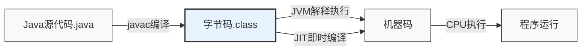
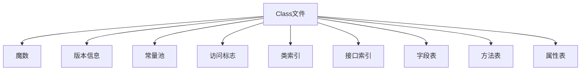
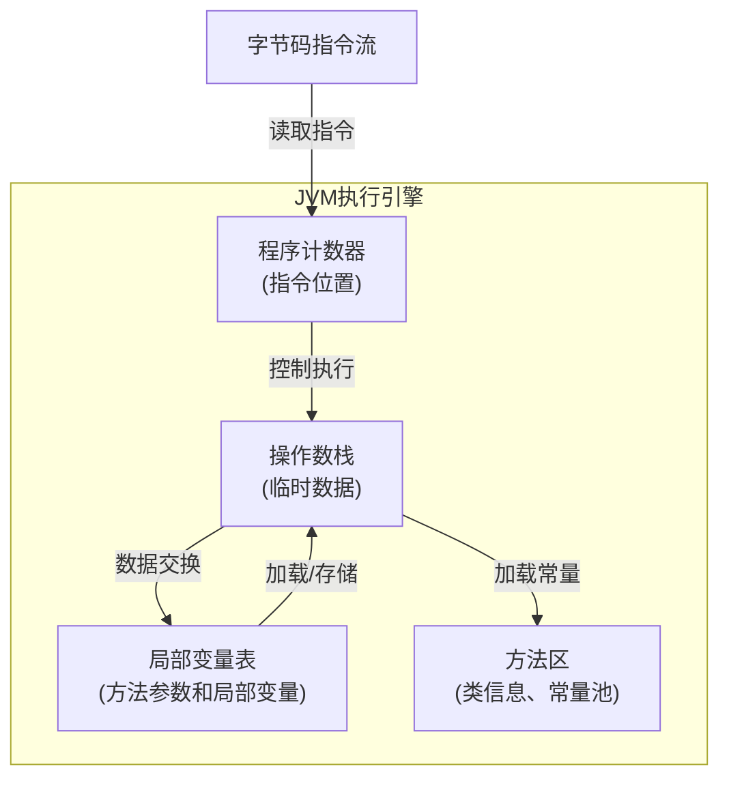
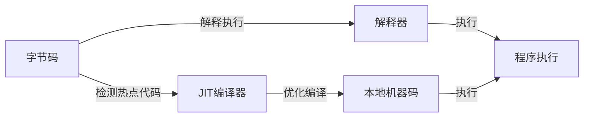

import Tabs from '@theme/Tabs';
import TabItem from '@theme/TabItem';
import CodeBlock from '@theme/CodeBlock';

# Java字节码详解

Java字节码是JVM执行的中间代码，介于Java源码和机器码之间。深入理解字节码有助于我们分析程序行为、排查性能问题、理解JVM优化策略，是Java高级开发者必备的技能。

:::tip 核心要点
**字节码 = Java程序的灵魂 + JVM的语言**
- 🔍 **字节码本质**：JVM执行的指令集，保证了Java的"一次编译，到处运行"
- 📦 **类文件结构**：规范的二进制格式，包含完整的类信息
- 🛠️ **指令集分类**：堆栈操作、运算、控制转移、方法调用等核心指令
- 🔄 **执行模型**：基于操作数栈和局部变量表的执行模式
- 💡 **优化技术**：JIT即时编译、方法内联、逃逸分析等提升性能的技术
:::

## 1. 字节码基础

### 1.1 什么是字节码

字节码(Bytecode)是Java源代码编译后的中间表示形式，它由JVM执行。字节码不同于机器码，它是平台无关的二进制格式，需要通过JVM解释或编译后才能在具体平台上运行。



### 1.2 字节码的作用

<Tabs>
<TabItem value="platform-independence" label="平台无关性">

字节码是Java"一次编写，到处运行"的关键。同一份字节码可以在任何安装了JVM的平台上运行，无需重新编译源代码。

```java title="示例：平台无关的HelloWorld"
// HelloWorld.java - 在任何平台编译后得到相同的字节码
public class HelloWorld {
    public static void main(String[] args) {
        System.out.println("Hello, World!");
    }
}

// 编译后的字节码可以在Windows、Linux、macOS等任何平台的JVM上运行
// 无需修改源码或重新编译
```

</TabItem>
<TabItem value="optimization" label="性能优化">

字节码设计允许JVM进行运行时优化，如即时编译(JIT)、方法内联、逃逸分析等，大大提升程序性能。

```java title="优化示例"
// 原始Java代码
for (int i = 0; i < 1000000; i++) {
    sum += i;
}

// JVM可能会将热点代码的字节码优化为等效的机器码：
// mov eax, 0       ; sum = 0
// mov ecx, 1000000 ; 循环次数
// imul eax, ecx    ; sum = 1000000 * 999999 / 2
// shr eax, 1       ; 除以2
```

</TabItem>
<TabItem value="security" label="安全性">

字节码验证是JVM安全模型的核心部分，在执行前会进行多重检查以确保代码不会危害系统。

```
字节码验证四个阶段:
1. 文件格式验证：魔数检查、版本兼容性、常量池合法性等
2. 元数据验证：类继承关系、抽象方法实现等
3. 字节码验证：控制流分析、类型推断、栈操作合法性等
4. 符号引用验证：符号引用转为直接引用时的检查
```

</TabItem>
</Tabs>

## 2. 类文件结构

Java类文件(.class)是一种精心设计的二进制格式，包含所有必要的信息以供JVM加载和执行。

### 2.1 Class文件格式



<Tabs>
<TabItem value="structure" label="结构组成">

| 组成部分 | 说明 | 作用 |
|---------|------|-----|
| **魔数** | 0xCAFEBABE | 标识class文件格式 |
| **版本号** | Major.minor | JVM版本兼容性检查 |
| **常量池** | 字符串、类引用等常量 | 存储程序中的各种常量和符号引用 |
| **访问标志** | public, final等修饰符 | 描述类或接口的访问权限及属性 |
| **类索引** | this_class, super_class | 确定类的继承关系 |
| **接口索引集合** | 实现的接口列表 | 描述类实现的所有接口 |
| **字段表** | 成员变量信息 | 描述类的所有字段 |
| **方法表** | 方法信息 | 描述类的所有方法 |
| **属性表** | 附加信息 | 存储类、字段、方法的额外信息 |

</TabItem>
<TabItem value="bytecode-example" label="真实示例">

```java title="简单类的源码"
public class SimpleClass {
    private int field;
    
    public void method() {
        field = 100;
    }
}
```

```bash title="使用javap查看字节码"
$ javap -c -v SimpleClass.class

// 输出精简版
Classfile /path/to/SimpleClass.class
  Last modified xxxx; size xxxx bytes
  MD5 checksum xxxxxxxxxxxxxxxxxxxxxxxxxxxx
  Compiled from "SimpleClass.java"
public class SimpleClass
  minor version: 0
  major version: 55
  flags: (0x0021) ACC_PUBLIC, ACC_SUPER
  this_class: #2                          // SimpleClass
  super_class: #4                         // java/lang/Object

Constant pool:
   #1 = Methodref          #4.#17         // java/lang/Object."<init>":()V
   #2 = Class              #18            // SimpleClass
   ...

{
  private int field;
    descriptor: I
    flags: (0x0002) ACC_PRIVATE

  public SimpleClass();
    descriptor: ()V
    flags: (0x0001) ACC_PUBLIC
    Code:
      stack=1, locals=1, args_size=1
         0: aload_0
         1: invokespecial #1                  // Method java/lang/Object."<init>":()V
         4: return

  public void method();
    descriptor: ()V
    flags: (0x0001) ACC_PUBLIC
    Code:
      stack=2, locals=1, args_size=1
         0: aload_0
         1: bipush        100
         3: putfield      #3                  // Field field:I
         6: return
}
```

</TabItem>
</Tabs>

### 2.2 常量池详解

常量池是class文件中最为复杂的数据结构，存储了各种字面量和符号引用。

```java title="常量池示例"
// 源代码
public class ConstantPoolDemo {
    private static final String MESSAGE = "Hello";
    
    public void printMessage() {
        System.out.println(MESSAGE + " World!");
    }
}
```

编译后，常量池将包含：
- 字符串常量："Hello"、"World!"
- 类引用：java/lang/System、java/io/PrintStream
- 方法引用：println、printMessage等
- 字段引用：MESSAGE、out等

:::info 常量池的作用
常量池类似于程序的"资源仓库"，存储了类中引用的所有字符串、类、方法等信息。通过常量池，字节码指令可以通过索引间接引用这些资源，使得指令紧凑高效。
:::

## 3. 字节码指令集

Java字节码指令集是一组面向JVM的操作指令，由单字节操作码(opcode)和可选的操作数组成。

### 3.1 指令分类

<Tabs>
<TabItem value="stack" label="堆栈操作">

```
加载指令：xload, xconst, ldc, bipush等
- aload_0: 将局部变量表中第0个变量(this)压入操作数栈
- iconst_1: 将整数常量1压入操作数栈
- ldc: 从常量池加载常量并压入操作数栈

存储指令：xstore, pop, dup等
- istore_1: 将栈顶整数存入局部变量表索引1位置
- pop: 弹出栈顶元素
- dup: 复制栈顶元素并压入栈顶
```

</TabItem>
<TabItem value="arithmetic" label="运算指令">

```
整数运算：iadd, isub, imul, idiv等
- iadd: 整数加法，栈顶两个元素相加
- isub: 整数减法
- imul: 整数乘法
- idiv: 整数除法

浮点运算：fadd, fsub, fmul, fdiv等
- fadd: 浮点数加法
- fsub: 浮点数减法
- fmul: 浮点数乘法
- fdiv: 浮点数除法

比较操作：lcmp, fcmpl, dcmpl等
- lcmp: 比较两个long值
- fcmpl: 比较两个float值(小于时返回-1)
```

</TabItem>
<TabItem value="control" label="控制指令">

```
条件跳转：ifeq, ifne, iflt, ifgt, ifle, ifge等
- ifeq: 若栈顶元素为0，则跳转
- ifne: 若栈顶元素不为0，则跳转

无条件跳转：goto, jsr, ret等
- goto: 无条件跳转到指定位置
- jsr: 跳转到子程序(已废弃)

表分支：tableswitch, lookupswitch
- tableswitch: 密集型switch-case语句(连续case值)
- lookupswitch: 稀疏型switch-case语句(不连续case值)
```

</TabItem>
<TabItem value="objects" label="对象操作">

```
对象创建：new, newarray, anewarray, multianewarray
- new: 创建对象实例
- newarray: 创建基本类型数组
- anewarray: 创建引用类型数组

字段访问：getfield, putfield, getstatic, putstatic
- getfield: 获取对象的实例字段
- putfield: 设置对象的实例字段
- getstatic: 获取类的静态字段
- putstatic: 设置类的静态字段

方法调用：invokespecial, invokevirtual, invokestatic, invokeinterface, invokedynamic
- invokevirtual: 调用实例方法(支持多态)
- invokespecial: 调用特殊方法(构造函数、私有方法、super方法)
- invokestatic: 调用静态方法
- invokeinterface: 调用接口方法
- invokedynamic: 调用动态方法(Lambda表达式和方法引用)
```

</TabItem>
</Tabs>

### 3.2 典型字节码示例解析

<Tabs>
<TabItem value="loops" label="循环结构">

```java title="Java循环代码"
// for循环
public void forLoop() {
    for (int i = 0; i < 10; i++) {
        System.out.println(i);
    }
}
```

```
// 对应字节码
public void forLoop();
  Code:
     0: iconst_0       // 将常量0压入栈(i=0)
     1: istore_1       // 存入局部变量1(i)
     2: iload_1        // 加载局部变量1(i)
     3: bipush        10 // 将常量10压入栈
     5: if_icmpge     22 // 如果i>=10则跳转到22
     8: getstatic     #2  // 获取System.out
    11: iload_1        // 加载局部变量1(i)
    12: invokevirtual #3  // 调用println
    15: iinc          1, 1 // i增加1
    18: goto          2    // 跳回到2继续循环
    22: return          // 返回
```

</TabItem>
<TabItem value="conditionals" label="条件分支">

```java title="Java条件语句"
// if-else语句
public int max(int a, int b) {
    if (a > b) {
        return a;
    } else {
        return b;
    }
}
```

```
// 对应字节码
public int max(int, int);
  Code:
     0: iload_1        // 加载参数a
     1: iload_2        // 加载参数b
     2: if_icmple     9  // 如果a<=b则跳转到9
     5: iload_1        // 加载参数a
     6: ireturn        // 返回a
     7: goto          12 // 不会执行到此，但编译器会生成
     9: iload_2        // 加载参数b
    10: ireturn        // 返回b
```

</TabItem>
<TabItem value="exceptions" label="异常处理">

```java title="Java异常处理"
// try-catch块
public void exceptionHandling() {
    try {
        int result = 10 / 0;
    } catch (ArithmeticException e) {
        System.out.println("除零错误");
    }
}
```

```
// 对应字节码(简化版)
public void exceptionHandling();
  Code:
    // try块
     0: bipush        10    // 将10压入栈
     2: iconst_0           // 将0压入栈
     3: idiv               // 执行除法(会抛出异常)
     4: istore_1           // 存储结果
     5: goto          19    // 正常执行跳转到19
    // catch块
     8: astore_1           // 存储异常到局部变量1
     9: getstatic     #2    // 获取System.out
    12: ldc           "除零错误" // 加载字符串
    14: invokevirtual #3    // 调用println
    17: goto          19    // 跳转到19
    19: return              // 返回
  Exception table:
     from    to  target type
        0     5     8   java/lang/ArithmeticException
```

</TabItem>
<TabItem value="lambdas" label="Lambda表达式">

```java title="Java Lambda表达式"
// Lambda表达式
public void lambdaExample() {
    Runnable r = () -> System.out.println("Hello Lambda");
    r.run();
}
```

```
// 对应字节码(简化版)
public void lambdaExample();
  Code:
     // Lambda表达式创建
     0: invokedynamic #2, 0  // 创建Runnable实例
     5: astore_1            // 存储到局部变量
     6: aload_1             // 加载Runnable实例
     7: invokeinterface #3, 1 // 调用run()方法
    12: return

  // 编译器生成的Lambda方法
  private static void lambda$lambdaExample$0();
    Code:
      0: getstatic     #4   // 获取System.out
      3: ldc           "Hello Lambda"
      5: invokevirtual #5   // 调用println
      8: return
```

</TabItem>
</Tabs>

## 4. 字节码执行模型

JVM执行字节码的模型基于栈的架构，通过操作数栈和局部变量表进行计算和存储。

### 4.1 基于栈的执行引擎



JVM是基于栈的虚拟机，不同于基于寄存器的架构(如x86)，它的优势在于：
- 指令集更小，更易于实现
- 平台无关性更好
- 更适合解释执行

### 4.2 执行过程图解

<Tabs>
<TabItem value="simple-calculation" label="简单计算">

```java
// 计算 3 + 4
public int add() {
    int a = 3;
    int b = 4;
    return a + b;
}
```

```
字节码及执行过程:
 0: iconst_3       // 压入常量3        [栈:3]
 1: istore_1       // 存入变量a        [栈:] [局部变量:a=3]
 2: iconst_4       // 压入常量4        [栈:4]
 3: istore_2       // 存入变量b        [栈:] [局部变量:a=3,b=4]
 4: iload_1        // 加载变量a        [栈:3]
 5: iload_2        // 加载变量b        [栈:3,4]
 6: iadd           // 执行加法         [栈:7]
 7: ireturn        // 返回结果         [返回:7]
```

</TabItem>
<TabItem value="method-call" label="方法调用">

```java
// 方法调用
public void caller() {
    int result = add(5, 3);
    System.out.println(result);
}

private int add(int a, int b) {
    return a + b;
}
```

```
caller方法的字节码执行过程:
 0: aload_0        // 加载this            [栈:this]
 1: iconst_5       // 压入常量5           [栈:this,5]
 2: iconst_3       // 压入常量3           [栈:this,5,3]
 3: invokespecial  // 调用add方法         [栈:]
   - 创建新栈帧
   - 参数a=5, b=3
   - 执行add方法
   - 返回值8
 6: istore_1       // 存储返回值到result   [栈:] [局部变量:result=8]
 7: getstatic      // 加载System.out      [栈:PrintStream]
10: iload_1        // 加载result          [栈:PrintStream,8]
11: invokevirtual  // 调用println         [栈:]
14: return         // 方法返回
```

</TabItem>
</Tabs>

### 4.3 字节码和性能

JVM执行字节码有两种主要方式：
1. **解释执行**：直接解释执行字节码，速度较慢
2. **即时编译(JIT)**：将热点字节码编译为本地机器码执行，速度大幅提升



:::tip JIT编译的优化技术
1. **方法内联**：将调用的方法代码直接插入调用点，减少方法调用开销
2. **逃逸分析**：分析对象的使用范围，优化堆内存分配
3. **循环优化**：展开循环、消除循环不变量等
4. **死代码消除**：移除永不执行的代码
5. **锁消除**：移除不必要的同步
:::

## 5. 字节码工具与实践

### 5.1 常用字节码工具

<Tabs>
<TabItem value="javap" label="javap">

JDK自带的反汇编工具，可以查看class文件的字节码指令。

```bash
# 基本使用
javap -c MyClass.class

# 详细信息(常量池、局部变量表等)
javap -v MyClass.class

# 只显示公共成员
javap -public MyClass.class

# 显示行号表
javap -l MyClass.class
```

</TabItem>
<TabItem value="asm" label="ASM">

底层字节码操作框架，用于生成、分析和转换字节码。

```java
// 使用ASM生成一个简单类
public class ASMExample {
    public static void main(String[] args) {
        ClassWriter cw = new ClassWriter(0);
        cw.visit(V1_8, ACC_PUBLIC, "GeneratedClass", null, "java/lang/Object", null);
        
        // 添加默认构造函数
        MethodVisitor mv = cw.visitMethod(ACC_PUBLIC, "<init>", "()V", null, null);
        mv.visitCode();
        mv.visitVarInsn(ALOAD, 0);
        mv.visitMethodInsn(INVOKESPECIAL, "java/lang/Object", "<init>", "()V", false);
        mv.visitInsn(RETURN);
        mv.visitMaxs(1, 1);
        mv.visitEnd();
        
        // 生成字节码
        byte[] bytecode = cw.toByteArray();
        
        // 定义类
        MyClassLoader loader = new MyClassLoader();
        Class<?> generatedClass = loader.defineClass("GeneratedClass", bytecode);
    }
}
```

</TabItem>
<TabItem value="bytecode-viewer" label="Bytecode Viewer">

图形化字节码分析工具，集成了多种反编译器。

```
功能特点:
- 多种反编译器支持(Procyon, CFR, Fernflower等)
- 字节码编辑
- 插件系统
- 代码搜索和比较
- 调试支持
```

</TabItem>
</Tabs>

### 5.2 字节码增强技术

字节码增强是在不修改源代码的情况下，通过修改或生成字节码来改变程序行为的技术。

<Tabs>
<TabItem value="agent" label="Java Agent">

```java
// 简单的Java Agent示例
public class SimpleAgent {
    public static void premain(String args, Instrumentation inst) {
        inst.addTransformer(new SimpleTransformer());
    }
    
    static class SimpleTransformer implements ClassFileTransformer {
        @Override
        public byte[] transform(ClassLoader loader, String className, 
                               Class<?> classBeingRedefined, 
                               ProtectionDomain protectionDomain, 
                               byte[] classfileBuffer) {
            // 这里修改字节码
            if (className.equals("com/example/Target")) {
                // 返回修改后的字节码
                return modifyByteCode(classfileBuffer);
            }
            return null; // 不修改返回null
        }
    }
}

// 使用方式: java -javaagent:agent.jar -jar app.jar
```

</TabItem>
<TabItem value="aspectj" label="AspectJ">

```java
// AspectJ切面示例
@Aspect
public class PerformanceAspect {
    
    @Around("execution(* com.example.service.*.*(..))")
    public Object measureMethodExecutionTime(ProceedingJoinPoint pjp) throws Throwable {
        long start = System.currentTimeMillis();
        Object result = pjp.proceed();
        long end = System.currentTimeMillis();
        System.out.println(pjp.getSignature() + " took " + (end - start) + " ms");
        return result;
    }
}
```

</TabItem>
<TabItem value="byte-buddy" label="Byte Buddy">

```java
// Byte Buddy示例 - 方法性能监控
Interceptor interceptor = new PerformanceInterceptor();

Class<?> dynamicType = new ByteBuddy()
    .subclass(Service.class)
    .method(ElementMatchers.named("doSomething"))
    .intercept(InvocationHandlerAdapter.of(interceptor))
    .make()
    .load(getClass().getClassLoader())
    .getLoaded();

Service service = (Service) dynamicType.getDeclaredConstructor().newInstance();
service.doSomething(); // 被拦截的调用
```

</TabItem>
</Tabs>

### 5.3 实战：性能分析与优化

<Tabs>
<TabItem value="bottleneck" label="定位性能瓶颈">

```java
// 使用字节码分析定位性能问题

// 问题代码
public int slowMethod(List<String> items) {
    int count = 0;
    for (int i = 0; i < items.size(); i++) {
        if (items.get(i).startsWith("A")) {
            count++;
        }
    }
    return count;
}

// 字节码分析发现的问题:
// 1. 每次循环都调用items.size()
// 2. 每次迭代都调用items.get(i)创建临时对象
// 3. startsWith方法调用开销大

// 优化后的代码
public int fastMethod(List<String> items) {
    int count = 0;
    int size = items.size(); // 提取循环不变量
    for (String item : items) { // 使用增强for循环避免重复get调用
        if (item.startsWith("A")) {
            count++;
        }
    }
    return count;
}
```

</TabItem>
<TabItem value="memory" label="内存占用优化">

```java
// 使用字节码分析优化内存占用

// 问题代码 - 使用大量字符串拼接
public String buildReport(List<Data> dataPoints) {
    String result = "";
    for (Data point : dataPoints) {
        result += point.getName() + ": " + point.getValue() + "\n";
    }
    return result;
}

// 字节码分析显示:
// - 每次+=操作都创建了新的String对象
// - 大量StringBuilder隐式创建和复制操作

// 优化后的代码
public String buildReportOptimized(List<Data> dataPoints) {
    StringBuilder result = new StringBuilder(dataPoints.size() * 30); // 预分配合适大小
    for (Data point : dataPoints) {
        result.append(point.getName())
              .append(": ")
              .append(point.getValue())
              .append("\n");
    }
    return result.toString();
}
```

</TabItem>
<TabItem value="synchronization" label="同步优化">

```java
// 使用字节码分析优化同步

// 问题代码 - 过度同步
public synchronized void processData(int value) {
    if (value <= 0) {
        return;  // 早期返回，但仍持有锁
    }
    
    // 实际需要同步的代码
    updateSharedState(value);
}

// 字节码分析:
// - 整个方法加了ACC_SYNCHRONIZED标志
// - 即使提前返回也会执行monitorexit指令

// 优化后的代码
public void processDataOptimized(int value) {
    if (value <= 0) {
        return;  // 无锁检查
    }
    
    // 只同步需要的部分
    synchronized (this) {
        updateSharedState(value);
    }
}
```

</TabItem>
</Tabs>

## 6. 高级主题

### 6.1 字节码与JIT编译优化

JIT编译器分析字节码执行情况，将热点代码即时编译为本地代码，并进行各种优化。

```java
// 考虑以下代码
public int sum(int[] array) {
    int sum = 0;
    for (int i = 0; i < array.length; i++) {
        sum += array[i];
    }
    return sum;
}

// JIT可能的优化:
// 1. 内存边界检查消除 - 确认i总是在合法范围内，消除数组访问边界检查
// 2. 循环展开 - 将循环展开为多次迭代，减少循环控制开销
// 3. SIMD向量化 - 使用CPU的SIMD指令并行处理多个元素
// 4. 自动并行化 - 根据硬件情况将操作分散到多核心
```

:::info JIT优化观察
使用JVM参数可以观察JIT的行为:
- `-XX:+PrintCompilation`: 打印JIT编译信息
- `-XX:+UnlockDiagnosticVMOptions -XX:+PrintInlining`: 打印内联决策
- `-XX:CompileCommand=print,*ClassName.methodName`: 打印特定方法的编译结果
:::

### 6.2 动态语言支持(invokedynamic)

Java 7引入了`invokedynamic`指令，为支持动态类型语言和Java 8中的Lambda表达式提供基础。

```java
// Lambda表达式
Runnable r = () -> System.out.println("Hello");

// 底层使用invokedynamic实现:
// 1. 编译期生成引导方法(bootstrap method)
// 2. 运行时首次执行invokedynamic指令时，调用引导方法创建调用点(CallSite)
// 3. CallSite链接到实际的目标方法
// 4. 后续调用直接使用已链接的目标，无需重新解析
```

### 6.3 字节码与安全

JVM的字节码验证是Java平台安全性的重要组成部分，可以防止恶意代码破坏系统。

<Tabs>
<TabItem value="verification" label="字节码验证">

```
字节码验证器会检查以下内容:

1. 结构检查
   - 魔数和版本号合法性
   - 类文件格式正确性
   - 常量池项合法性

2. 类型检查
   - 确保操作数类型与指令兼容
   - 方法调用参数类型匹配
   - 字段访问类型兼容性

3. 控制流检查
   - 跳转目标在方法体内
   - 不会跳转到指令中间
   - 异常表条目有效

4. 访问控制检查
   - 私有方法/字段不被外部访问
   - final类不被继承
   - 抽象方法必须实现
```

</TabItem>
<TabItem value="attack-defense" label="攻击与防御">

```java
// 潜在字节码注入攻击场景:

// 1. 类加载攻击 - 注入恶意类
// 防御: SecurityManager, 自定义ClassLoader权限控制

// 2. 反射攻击 - 绕过访问限制
Class<?> cls = Class.forName("com.target.SecretClass");
Field field = cls.getDeclaredField("secretField");
field.setAccessible(true); // 尝试访问private字段
// 防御: 权限控制, SecurityManager限制反射

// 3. 序列化攻击 - 通过readObject注入
// 防御: 实现readObject时验证数据完整性
// 使用validateObject()或自定义ObjectInputFilter

// 4. 字节码注入 - 动态修改字节码
// 防御: 代码签名, 限制agent加载
```

</TabItem>
</Tabs>

## 7. 字节码未来发展

随着Java平台的发展，字节码技术也在不断演进，以下是一些发展趋势：

1. **更高效的字节码指令**：为新的语言特性和硬件优化提供支持
2. **增强的类文件格式**：支持更多元数据和优化提示
3. **GraalVM与Ahead-of-Time编译**：将字节码提前编译为本地代码
4. **更智能的JIT优化**：利用机器学习提升优化决策
5. **多语言互操作性增强**：更好地支持JVM上的其他语言

:::tip 学习建议
1. 掌握常用字节码指令和类文件结构
2. 学会使用字节码工具分析问题
3. 理解JVM执行模型和优化原理
4. 通过字节码理解Java语言特性
5. 实践字节码增强以解决实际问题
:::

---

本章深入讲解了Java字节码的基础知识、类文件结构、指令集、执行模型、工具使用和性能优化技术。掌握字节码对于深入理解JVM运行机制、排查性能问题、进行底层优化都具有重要意义。作为Java高级开发者，字节码知识将帮助你更好地掌控应用程序的行为和性能。
