import Tabs from '@theme/Tabs';
import TabItem from '@theme/TabItem';
import CodeBlock from '@theme/CodeBlock';

# Java垃圾回收详解

Java垃圾回收（Garbage Collection，GC）是Java虚拟机自动内存管理的核心机制，它负责自动回收不再使用的对象占用的内存空间。垃圾回收机制使得Java程序员无需手动管理内存，大大降低了内存泄漏和内存溢出的风险，提高了开发效率和程序稳定性。

:::tip 核心特性
Java垃圾回收 = 自动内存管理 + 多种回收算法 + 分代收集策略 + 并发回收机制 + 性能优化
:::

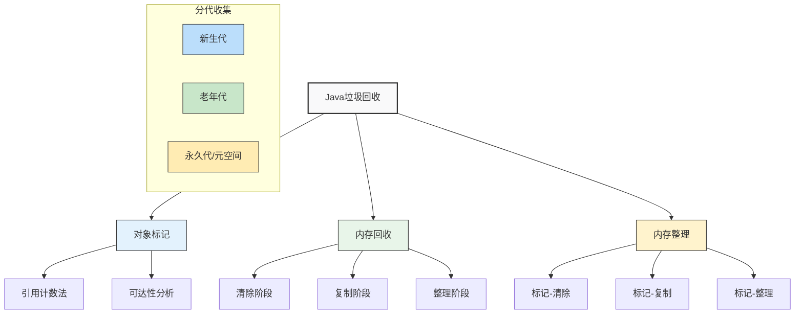

## 1. 垃圾回收基础概念

### 1.1 什么是垃圾回收？

垃圾回收是Java虚拟机自动内存管理的核心机制，它通过自动识别和回收不再使用的对象来管理堆内存。

<Tabs>
<TabItem value="overview" label="基本概念">

**垃圾回收定义**：
自动识别并清除不再使用的内存区域，使该内存可被重新使用的过程。

**主要目标**：
1. **内存管理自动化**：无需程序员手动释放内存
2. **提高内存利用率**：回收不再使用的对象占用的内存
3. **减少内存碎片**：通过内存整理提高内存利用效率
4. **降低开发难度**：简化内存管理，减少内存泄露和溢出风险

**工作原理**：
1. **标记阶段**：识别哪些对象是"垃圾"（不再被使用的对象）
2. **回收阶段**：回收垃圾对象占用的内存空间
3. **整理阶段**：（可选）重新排列存活对象，减少内存碎片

</TabItem>
<TabItem value="vs-manual" label="对比手动内存管理">

| 特性 | 垃圾回收 | 手动内存管理 |
|-----|---------|------------|
| **开发效率** | 高 - 无需考虑内存释放 | 低 - 需要手动分配和释放 |
| **错误风险** | 低 - 自动管理减少错误 | 高 - 容易导致内存泄漏或悬空指针 |
| **性能控制** | 弱 - 回收时机不完全可控 | 强 - 精确控制内存释放时机 |
| **内存使用** | 较高 - GC需要额外内存 | 较低 - 无额外开销 |
| **暂停时间** | 存在STW暂停 | 无系统级暂停 |
| **代码复杂度** | 低 - 内存管理透明 | 高 - 需手动跟踪内存 |
| **适用场景** | 大多数业务应用 | 系统底层、实时系统 |

**典型的手动内存管理语言**: C、C++
**典型的垃圾回收语言**: Java、C#、Python、JavaScript

```java title="Java vs C++ 内存管理"
// Java - 自动垃圾回收
public class AutomaticMemory {
    public void createObjects() {
        for (int i = 0; i < 1000; i++) {
            Object obj = new Object(); // 不再引用时自动回收
        }
    } // 方法结束时，局部变量obj自动失去引用，对象可被回收
}

// C++ - 手动内存管理
class ManualMemory {
public:
    void createObjects() {
        for (int i = 0; i < 1000; i++) {
            Object* obj = new Object(); // 必须手动释放
            delete obj; // 不释放会造成内存泄漏
        }
    }
};
```

</TabItem>
<TabItem value="history" label="发展历史">

**垃圾回收技术发展时间线**:

- **1959**: Lisp首次引入垃圾回收概念
- **1960年代**: 引用计数法被广泛使用
- **1970年代**: 标记-清除和标记-整理算法出现
- **1980年代**: 分代收集理论形成
- **1995**: Java诞生，采用自动垃圾回收
- **2000年代初**: CMS并发收集器推出
- **2000年代中**: G1收集器研发
- **2010年代**: ZGC、Shenandoah等低延迟收集器问世

**JVM垃圾回收器发展**:

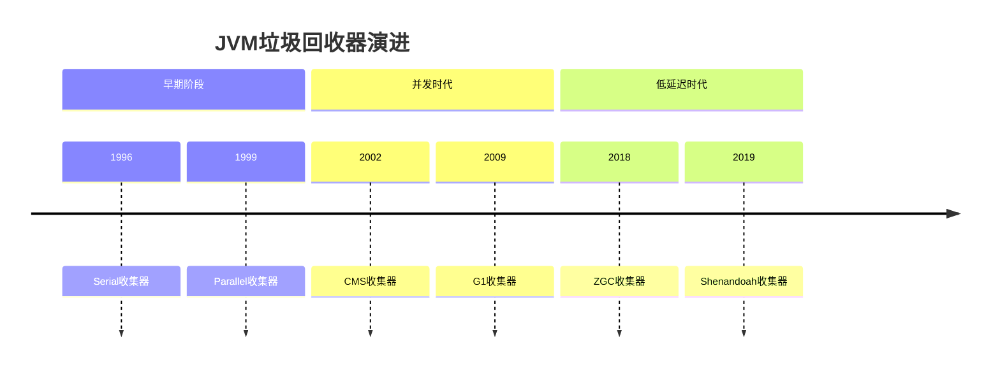

**主要技术突破**:
- 从单线程到多线程并行收集
- 从STW暂停到并发收集
- 从全堆扫描到增量式收集
- 从固定分代到区域化内存布局

</TabItem>
</Tabs>

#### 垃圾回收的核心要素

```java title="垃圾回收核心要素"
public class GarbageCollectionCore {
    
    // ========== 垃圾回收的基本原理 ==========
    // 1. 自动识别：自动识别哪些对象不再被使用
    // 2. 自动回收：自动回收不再使用对象占用的内存
    // 3. 内存整理：整理内存碎片，提高内存利用率
    // 4. 性能优化：在回收效率和停顿时间间找到平衡
    
    // ========== 垃圾回收的优势 ==========
    // 1. 自动管理：程序员无需手动释放内存
    // 2. 防止泄漏：自动处理内存泄漏问题
    // 3. 提高效率：减少内存管理相关的bug
    // 4. 简化开发：专注于业务逻辑开发
}
```

### 1.2 垃圾回收的重要性

| 重要性 | 具体体现 | 业务价值 |
|--------|----------|----------|
| **自动内存管理** | 无需手动释放内存 | 降低开发复杂度，提高开发效率 |
| **防止内存泄漏** | 自动回收无用对象 | 提高程序稳定性，减少系统故障 |
| **内存碎片整理** | 整理内存碎片 | 提高内存利用率，优化性能 |
| **性能优化** | 多种回收算法和策略 | 根据应用特点选择最优方案 |

### 1.3 垃圾回收的设计原则

垃圾回收机制的设计遵循以下几个核心原则：

#### 自动化原则
完全自动的内存管理，无需程序员干预

#### 高效性原则  
在保证回收效果的前提下，尽量减少对程序执行的影响

#### 可预测性原则
垃圾回收的行为应该是可预测的，便于性能调优

#### 适应性原则
能够根据应用特点自动调整回收策略

```java title="垃圾回收设计原则示例"
public class GCDesignPrinciples {
    
    /**
     * 自动化示例
     */
    public static void automationExample() {
        // 程序员无需手动管理内存
        List<String> list = new ArrayList<>();
        for (int i = 0; i < 1000000; i++) {
            list.add("item" + i);
        }
        
        // 当list不再被引用时，垃圾回收器会自动回收
        list = null;
        
        // 无需手动调用类似free()的方法
        // 垃圾回收器会在合适的时机自动回收
    }
    
    /**
     * 高效性示例
     */
    public static void efficiencyExample() {
        // 垃圾回收器会选择合适的时机进行回收
        // 1. 内存不足时
        // 2. 系统空闲时
        // 3. 可预测的停顿时间
        
        // 现代垃圾回收器都支持并发回收
        // 减少对程序执行的影响
    }
    
    /**
     * 可预测性示例
     */
    public static void predictabilityExample() {
        // 垃圾回收器提供可预测的停顿时间
        // 例如G1收集器的MaxGCPauseMillis参数
        // -XX:MaxGCPauseMillis=200
        
        // 可以通过参数调整回收行为
        // 使垃圾回收更符合应用需求
    }
    
    /**
     * 适应性示例
     */
    public static void adaptabilityExample() {
        // 垃圾回收器会根据应用特点调整策略
        // 1. 对象生命周期
        // 2. 内存分配模式
        // 3. 系统负载情况
        
        // 分代收集就是适应性的体现
        // 不同代使用不同的回收策略
    }
}
```

## 2. 对象存活判断

### 2.1 引用计数法

引用计数法是最简单的对象存活判断算法，为每个对象维护一个引用计数器。

#### 引用计数法原理

```java title="引用计数法示例"
public class ReferenceCountingExample {
    
    /**
     * 引用计数法实现
     */
    public static void referenceCountingDemo() {
        // 创建对象，引用计数为1
        Object obj1 = new Object();
        
        // 增加引用，引用计数为2
        Object obj2 = obj1;
        
        // 减少引用，引用计数为1
        obj2 = null;
        
        // 减少引用，引用计数为0，对象可以被回收
        obj1 = null;
    }
    
    /**
     * 引用计数法的优缺点
     */
    public static void referenceCountingAnalysis() {
        // 优点：
        // 1. 实现简单
        // 2. 回收及时
        // 3. 没有停顿时间
        
        // 缺点：
        // 1. 无法解决循环引用问题
        // 2. 计数器更新开销大
        // 3. 空间开销
        
        // 循环引用示例
        Node node1 = new Node();
        Node node2 = new Node();
        
        // 形成循环引用
        node1.next = node2;
        node2.next = node1;
        
        // 即使外部引用被清除，引用计数也不为0
        node1 = null;
        node2 = null;
        // 此时两个对象都无法被回收
    }
}

// 节点类，用于演示循环引用
class Node {
    Node next;
}
```

#### 引用计数法的局限性

| 局限性 | 具体表现 | 影响 |
|--------|----------|------|
| **循环引用** | 对象间相互引用形成环 | 无法回收循环引用的对象 |
| **性能开销** | 每次引用赋值都要更新计数器 | 影响程序执行效率 |
| **空间开销** | 每个对象都需要计数器字段 | 增加内存使用 |

### 2.2 可达性分析

可达性分析是Java虚拟机采用的垃圾回收算法，通过GC Roots作为起始点进行搜索。

#### 可达性分析原理

```java title="可达性分析示例"
public class ReachabilityAnalysisExample {
    
    /**
     * GC Roots示例
     */
    public static void gcRootsExample() {
        // 1. 虚拟机栈中的局部变量
        Object localVar = new Object();
        
        // 2. 方法区中静态变量
        static Object staticVar = new Object();
        
        // 3. 方法区中常量
        final Object finalVar = new Object();
        
        // 4. 本地方法栈中的变量
        // native方法中的变量
        
        // 5. 活跃线程中的对象
        Thread.currentThread();
    }
    
    /**
     * 可达性分析过程
     */
    public static void reachabilityAnalysisProcess() {
        // 可达性分析过程：
        // 1. 从GC Roots开始搜索
        // 2. 搜索过程中经过的对象标记为可达
        // 3. 搜索结束后，未被标记的对象为垃圾
        
        // 示例：对象引用关系
        Object root = new Object();           // GC Root
        Object obj1 = new Object();           // 可达对象
        Object obj2 = new Object();           // 可达对象
        Object obj3 = new Object();           // 不可达对象
        
        // 建立引用关系
        root.ref = obj1;
        obj1.ref = obj2;
        // obj3没有引用指向它，不可达
        
        // 可达性分析结果：
        // root -> obj1 -> obj2 (可达)
        // obj3 (不可达，将被回收)
    }
    
    /**
     * 可达性分析的优势
     */
    public static void reachabilityAnalysisAdvantages() {
        // 优势：
        // 1. 可以解决循环引用问题
        // 2. 准确性高
        // 3. 实现相对简单
        
        // 循环引用示例
        Node node1 = new Node();
        Node node2 = new Node();
        
        // 形成循环引用
        node1.next = node2;
        node2.next = node1;
        
        // 如果没有GC Root指向这个循环，整个循环都会被回收
        node1 = null;
        node2 = null;
        // 可达性分析可以正确识别这种情况
    }
}
```

#### GC Roots的类型

| GC Roots类型 | 具体内容 | 说明 |
|-------------|----------|------|
| **虚拟机栈中的局部变量** | 方法中的局部变量 | 正在执行的方法中的对象引用 |
| **方法区中的静态变量** | 类的静态字段 | 全局静态对象引用 |
| **方法区中的常量** | final修饰的常量 | 常量池中的对象引用 |
| **本地方法栈中的变量** | native方法中的变量 | JNI调用中的对象引用 |
| **活跃线程中的对象** | Thread对象 | 当前活跃的线程对象 |

### 2.3 引用类型详解

Java提供了四种引用类型，用于灵活控制对象的生命周期。

#### 强引用（Strong Reference）

```java title="强引用示例"
public class StrongReferenceExample {
    
    /**
     * 强引用特点
     */
    public static void strongReferenceCharacteristics() {
        // 强引用是最常见的引用类型
        Object obj = new Object();  // 强引用
        
        // 只要强引用存在，对象就不会被回收
        System.gc();  // 手动触发GC
        System.out.println("Object still exists: " + (obj != null));
        
        // 将引用设为null，对象可以被回收
        obj = null;
        System.gc();
        // 此时对象可以被垃圾收集器回收
    }
    
    /**
     * 强引用的应用场景
     */
    public static void strongReferenceUsage() {
        // 1. 普通对象引用
        String str = "Hello World";
        
        // 2. 集合中的对象
        List<String> list = new ArrayList<>();
        list.add("item");
        
        // 3. 静态变量
        static Object staticObj = new Object();
        
        // 4. 方法参数
        processObject(new Object());
    }
    
    private static void processObject(Object obj) {
        // obj是强引用，方法执行期间不会被回收
        System.out.println("Processing: " + obj);
    }
}
```

#### 软引用（Soft Reference）

```java title="软引用示例"
public class SoftReferenceExample {
    
    /**
     * 软引用特点
     */
    public static void softReferenceCharacteristics() {
        // 创建软引用
        SoftReference<byte[]> softRef = new SoftReference<>(new byte[1024 * 1024]);
        
        // 获取软引用指向的对象
        byte[] data = softRef.get();
        if (data != null) {
            System.out.println("Data available: " + data.length);
        }
        
        // 模拟内存不足
        List<byte[]> list = new ArrayList<>();
        try {
            while (true) {
                list.add(new byte[1024 * 1024]);  // 分配大量内存
            }
        } catch (OutOfMemoryError e) {
            System.out.println("OutOfMemoryError occurred");
        }
        
        // 检查软引用是否被回收
        data = softRef.get();
        if (data == null) {
            System.out.println("Soft reference was cleared");
        }
    }
    
    /**
     * 软引用的应用场景
     */
    public static void softReferenceUsage() {
        // 1. 内存敏感的缓存
        Map<String, SoftReference<byte[]>> cache = new HashMap<>();
        
        // 2. 图片缓存
        Map<String, SoftReference<BufferedImage>> imageCache = new HashMap<>();
        
        // 3. 网页缓存
        Map<String, SoftReference<String>> pageCache = new HashMap<>();
    }
}
```

#### 弱引用（Weak Reference）

```java title="弱引用示例"
public class WeakReferenceExample {
    
    /**
     * 弱引用特点
     */
    public static void weakReferenceCharacteristics() {
        // 创建弱引用
        WeakReference<Object> weakRef = new WeakReference<>(new Object());
        
        // 获取弱引用指向的对象
        Object obj = weakRef.get();
        System.out.println("Object before GC: " + (obj != null));
        
        // 触发垃圾回收
        System.gc();
        
        // 检查弱引用是否被回收
        obj = weakRef.get();
        System.out.println("Object after GC: " + (obj != null));
    }
    
    /**
     * 弱引用的应用场景
     */
    public static void weakReferenceUsage() {
        // 1. WeakHashMap
        WeakHashMap<Object, String> weakMap = new WeakHashMap<>();
        
        // 2. ThreadLocal中的Entry
        ThreadLocal<String> threadLocal = new ThreadLocal<>();
        
        // 3. 监听器模式
        WeakReference<EventListener> listenerRef = new WeakReference<>(new EventListener());
    }
}
```

#### 虚引用（Phantom Reference）

```java title="虚引用示例"
public class PhantomReferenceExample {
    
    /**
     * 虚引用特点
     */
    public static void phantomReferenceCharacteristics() {
        // 创建引用队列
        ReferenceQueue<Object> queue = new ReferenceQueue<>();
        
        // 创建虚引用
        PhantomReference<Object> phantomRef = new PhantomReference<>(new Object(), queue);
        
        // 虚引用无法获取对象实例
        Object obj = phantomRef.get();
        System.out.println("Phantom reference get: " + obj);  // null
        
        // 启动监控线程
        Thread monitorThread = new Thread(() -> {
            try {
                Reference<?> ref = queue.remove();
                System.out.println("Object was garbage collected");
            } catch (InterruptedException e) {
                e.printStackTrace();
            }
        });
        monitorThread.start();
        
        // 触发垃圾回收
        System.gc();
    }
    
    /**
     * 虚引用的应用场景
     */
    public static void phantomReferenceUsage() {
        // 1. DirectByteBuffer回收监控
        // 2. 对象回收状态跟踪
        // 3. 资源清理
    }
}
```

## 3. 垃圾回收算法详解

:::info 垃圾回收算法演进
垃圾回收算法是JVM内存管理的核心，各种算法都有其特定优缺点和适用场景。随着技术发展，垃圾回收算法从简单的标记-清除，到复制、标记-整理，再到分代收集，不断演进，以适应不同应用场景的需求。
:::

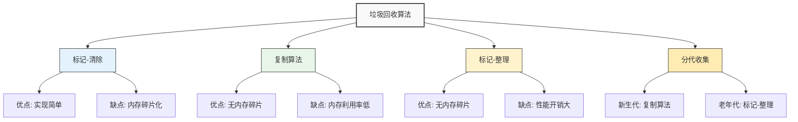

<Tabs>
<TabItem value="mark-sweep" label="标记-清除">

### 标记-清除算法（Mark-Sweep）

标记-清除算法是最基础的垃圾回收算法，分为标记和清除两个阶段。

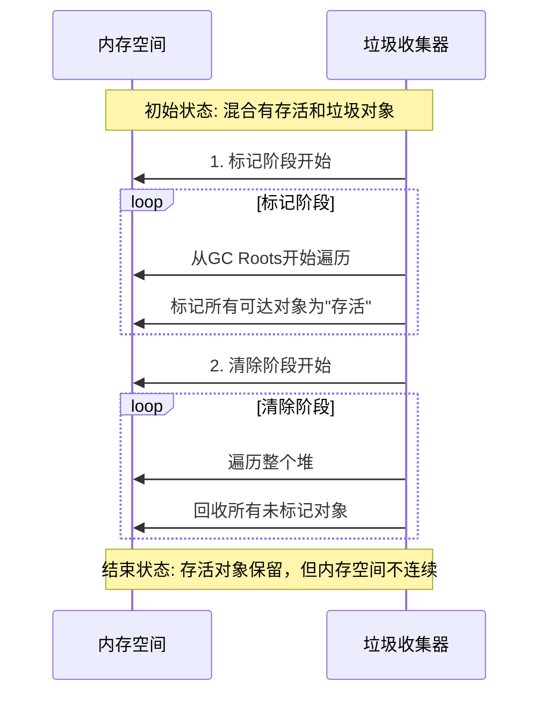

**算法原理**:
1. **标记阶段**: 从GC Roots开始遍历，标记所有可达对象
2. **清除阶段**: 遍历整个堆，回收所有未被标记的对象

**优缺点分析**:
| 优点 | 缺点 |
|------|------|
| 实现简单，易于理解 | 效率不高，需要扫描两次堆 |
| 不需要额外内存空间 | 产生大量内存碎片 |
| 不需要移动对象 | 碎片化导致大对象分配困难 |

**适用场景**:
- 老年代中对象存活率高的情况
- 内存碎片不敏感的场景
- 适合作为其他算法的基础

```java title="标记-清除算法伪代码"
void markSweep() {
    // 标记阶段
    for (Object root : GC_ROOTS) {
        mark(root);
    }
    
    // 清除阶段
    for (MemoryBlock block : HEAP) {
        if (!block.isMarked()) {
            free(block);
        } else {
            block.unmark();
        }
    }
}

void mark(Object obj) {
    if (obj == null || obj.isMarked()) return;
    
    obj.setMarked(true);
    for (Object ref : obj.getReferences()) {
        mark(ref);
    }
}
```

</TabItem>
<TabItem value="copying" label="复制算法">

### 复制算法（Copying）

复制算法将内存分为两块相等的区域（From空间和To空间），每次只使用其中一块，回收时将存活对象复制到另一块区域。

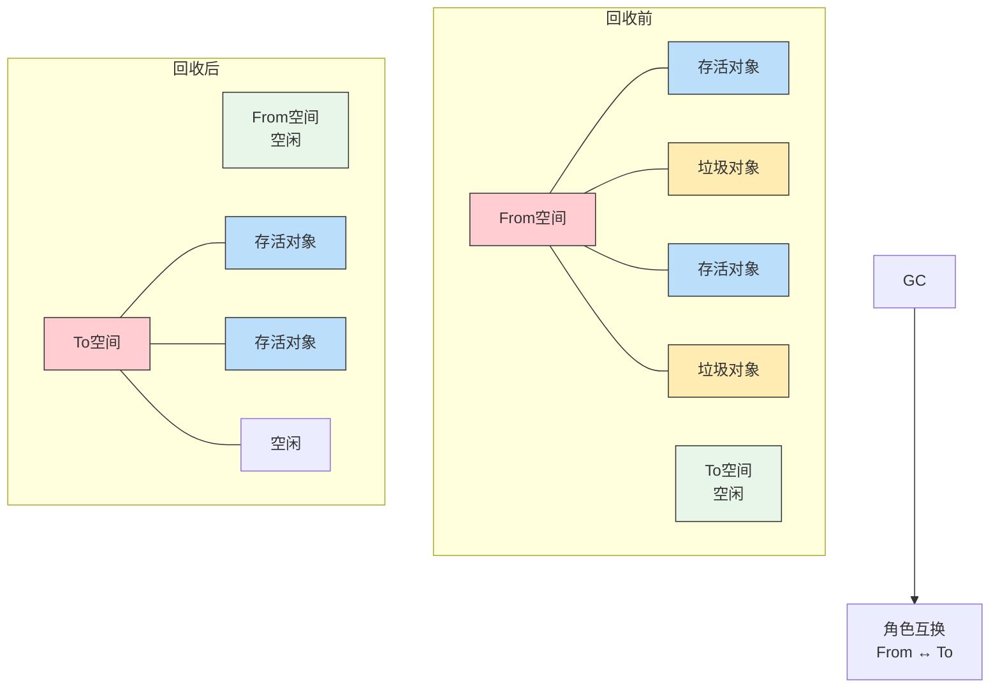

**算法原理**:
1. **内存划分**: 将可用内存划分为两块等大的区域
2. **对象分配**: 只在其中一个区域（From空间）分配对象
3. **复制转移**: 当From空间用尽时，将存活对象复制到To空间
4. **角色互换**: 两个空间角色互换，To空间变为新的From空间

**优缺点分析**:
| 优点 | 缺点 |
|------|------|
| 高效，只需扫描一次存活对象 | 内存利用率只有50% |
| 无内存碎片，分配高效 | 需要额外空间进行复制 |
| 复制后内存连续 | 对象存活率高时复制开销大 |

**适用场景**:
- 新生代垃圾回收（对象存活率低）
- Eden区和Survivor区的设计基于此算法
- 存活对象较少的内存区域

```java title="复制算法伪代码"
void copying() {
    Address toSpace = TO_SPACE_START;
    
    // 标记并复制存活对象
    for (Object root : GC_ROOTS) {
        toSpace = copy(root, toSpace);
    }
    
    // 清空From空间
    clear(FROM_SPACE_START, FROM_SPACE_END);
    
    // 交换From和To空间
    swap(FROM_SPACE, TO_SPACE);
}

Address copy(Object obj, Address dest) {
    if (obj == null || obj.isCopied()) 
        return dest;
    
    // 复制对象到To空间
    Address newAddress = dest;
    memcpy(dest, obj, obj.size());
    dest += obj.size();
    
    // 设置转发指针
    obj.setForwardingAddress(newAddress);
    
    // 递归复制引用对象
    for (Object ref : getReferences(newAddress)) {
        dest = copy(ref, dest);
    }
    
    return dest;
}
```

</TabItem>
<TabItem value="mark-compact" label="标记-整理">

### 标记-整理算法（Mark-Compact）

标记-整理算法结合了标记-清除和复制算法的优点，不会产生内存碎片，也不需要额外的内存空间。

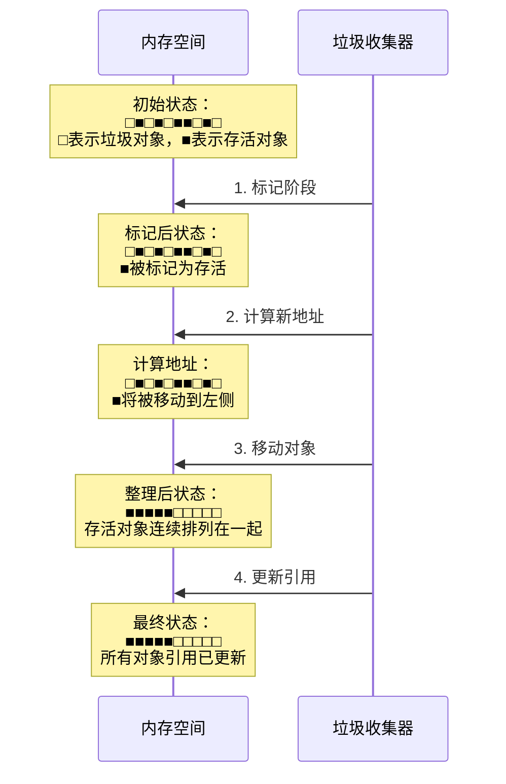

**算法原理**:
1. **标记阶段**: 与标记-清除算法相同，标记所有可达对象
2. **计算地址**: 计算所有存活对象的新位置
3. **整理阶段**: 移动存活对象到新位置，使它们紧凑排列
4. **更新引用**: 更新所有对象引用为新地址

**优缺点分析**:
| 优点 | 缺点 |
|------|------|
| 无内存碎片 | 效率较低，需要移动对象 |
| 内存利用率高 | 需要更新所有对象引用 |
| 适合对象存活率高的场景 | 停顿时间较长 |

**适用场景**:
- 老年代垃圾回收
- 对象存活率高的区域
- 对内存碎片敏感的应用

```java title="标记-整理算法伪代码"
void markCompact() {
    // 标记阶段
    for (Object root : GC_ROOTS) {
        mark(root);
    }
    
    // 计算新地址
    Address freePointer = HEAP_START;
    for (Object obj : HEAP) {
        if (obj.isMarked()) {
            obj.setForwardAddress(freePointer);
            freePointer += obj.size();
        }
    }
    
    // 移动对象并更新引用
    for (Object obj : HEAP) {
        if (obj.isMarked()) {
            moveObject(obj, obj.getForwardAddress());
            updateReferences(obj);
            obj.unmark();
        }
    }
}
```

</TabItem>
<TabItem value="generational" label="分代收集">

### 分代收集算法

分代收集算法根据对象存活周期的不同，将内存分为几个代，对不同的代采用不同的收集策略。

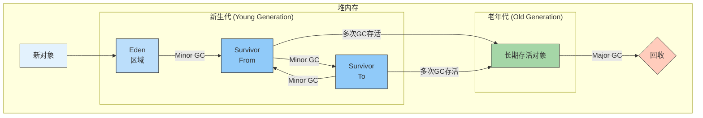

**算法原理**:
1. **分代假设**: 
   - 大部分对象很快就会死亡（朝生夕死）
   - 存活时间长的对象很可能继续存活
   
2. **内存划分**: 
   - 新生代：存放新创建的对象，使用复制算法
   - 老年代：存放长期存活的对象，使用标记-整理算法
   - 永久代/元空间：存放类信息等，使用标记-清除算法

3. **回收策略**: 
   - Minor GC：只回收新生代
   - Major GC：只回收老年代
   - Full GC：回收整个堆内存

**分代内存占比**:
| 区域 | 占比 | 存放对象 | 回收频率 | 回收算法 |
|------|------|---------|---------|---------|
| **Eden** | 新生代的80% | 新创建对象 | 高 | 复制算法 |
| **Survivor** | 新生代的20% | 存活时间短的对象 | 高 | 复制算法 |
| **老年代** | 堆的60-80% | 长期存活对象 | 低 | 标记-整理 |

**适用场景**:
- 几乎所有的商业JVM都采用分代收集
- 综合了各种算法的优点
- 适用于大多数Java应用程序

```java title="分代收集伪代码"
void generationalCollection() {
    // 判断是否需要Minor GC
    if (youngGenerationFull()) {
        minorGC();
    }
    
    // 判断是否需要Major GC
    if (oldGenerationFull() || tooManyPromotions()) {
        majorGC();
    }
}

void minorGC() {
    // 使用复制算法回收新生代
    evacuateEden();
    evacuateSurvivorSpace();
    swapSurvivorSpaces();
}

void majorGC() {
    // 使用标记-整理算法回收老年代
    markOldGeneration();
    compactOldGeneration();
}
```

</TabItem>
</Tabs>

### 3.5 算法对比与选择

不同的垃圾回收算法有各自的优缺点，如何选择取决于应用场景和性能需求。

| 算法 | 空间效率 | 时间效率 | 内存碎片 | 移动对象 | 适用场景 |
|------|---------|---------|---------|---------|----------|
| **标记-清除** | 高 | 中 | 有 | 否 | 老年代，存活率高 |
| **复制** | 低 | 高 | 无 | 是 | 新生代，存活率低 |
| **标记-整理** | 高 | 低 | 无 | 是 | 老年代，内存碎片敏感 |
| **分代收集** | 高 | 高 | 低 | 部分 | 综合场景，大多数应用 |

## 4. 垃圾收集器详解

:::info Java虚拟机垃圾收集器家族
垃圾收集器是垃圾回收算法的具体实现，不同的垃圾收集器适用于不同的场景。随着JVM的发展，垃圾收集器也在不断演进，从Serial到Parallel，再到CMS，最后到G1、ZGC、Shenandoah，性能不断提升，暂停时间不断缩短。
:::

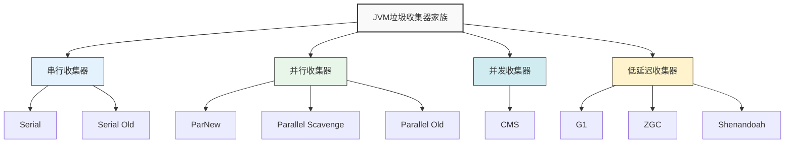

<Tabs>
<TabItem value="serial" label="Serial/Serial Old">

### Serial/Serial Old收集器

Serial收集器是最古老、最基础的垃圾收集器，它是一个单线程的收集器。Serial Old是其老年代版本。

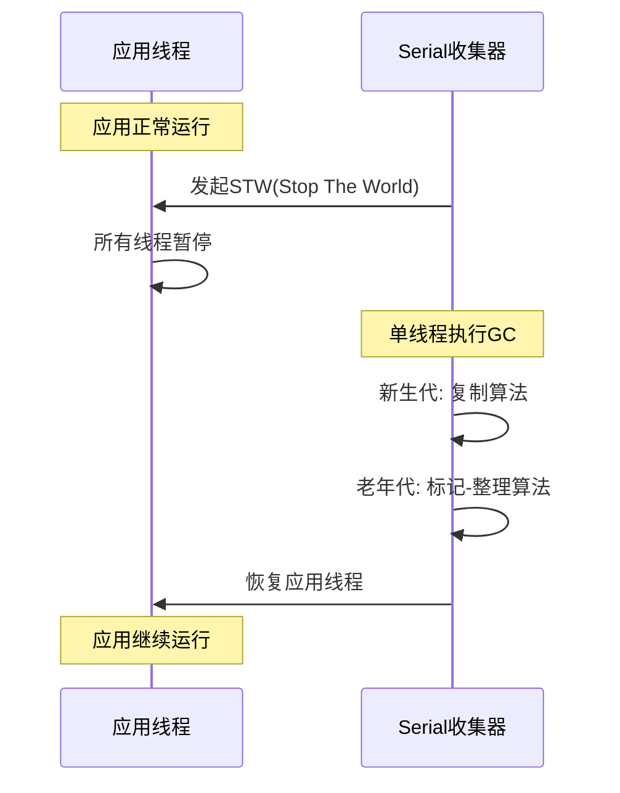

**Serial收集器特点**:
1. **单线程执行**：只使用一个线程进行垃圾收集
2. **Stop-The-World**：收集过程中必须暂停所有用户线程
3. **高效简洁**：没有线程切换开销，单CPU环境下效率最高
4. **内存占用小**：对资源要求最低的收集器

**适用场景**:
- **客户端应用**：如桌面应用程序
- **单核CPU环境**
- **内存较小（100MB左右）的嵌入式设备**
- **对暂停时间不敏感的批处理任务**

**启用参数**: `-XX:+UseSerialGC`

**工作流程**:
```java title="Serial收集器工作过程"
void serialGC() {
    // 1. 暂停所有用户线程
    stopAllThreads();
    
    // 2. 执行垃圾收集
    if (needYoungGC()) {
        // 新生代收集 - 复制算法
        evacuateEden();         // 复制Eden区存活对象到Survivor
        evacuateFromSurvivor(); // 复制From Survivor存活对象到To Survivor
        swapSurvivorSpaces();   // 交换From和To Survivor
    }
    
    if (needOldGC()) {
        // 老年代收集 - 标记-整理算法
        markOldObjects();       // 标记存活对象
        compactOldHeap();       // 整理老年代空间
    }
    
    // 3. 恢复所有用户线程
    resumeAllThreads();
}
```

</TabItem>
<TabItem value="parallel" label="Parallel收集器族">

### Parallel Scavenge/Parallel Old收集器

Parallel收集器族包括新生代的Parallel Scavenge和老年代的Parallel Old，它们都是多线程并行的收集器，注重高吞吐量。

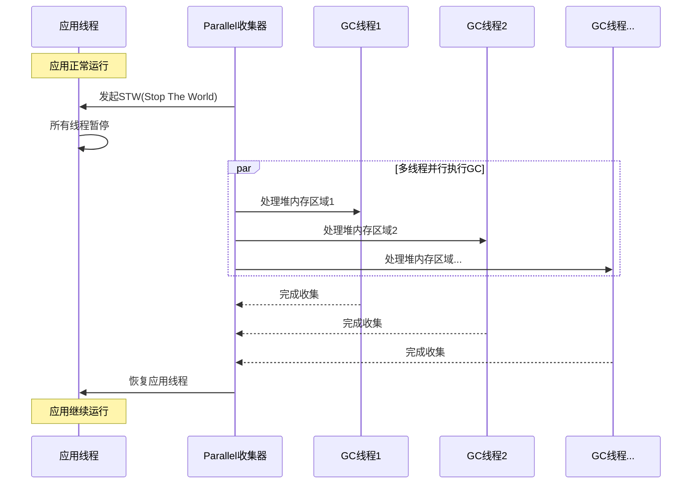

**Parallel收集器特点**:
1. **多线程并行**：利用多核CPU提高收集效率
2. **高吞吐量**：关注CPU利用率，适合后台运算
3. **可控制暂停时间**：通过参数调整暂停时间目标
4. **自适应调节**：根据系统运行情况自动调整参数

**适用场景**:
- **多核服务器环境**
- **对吞吐量要求较高的后台应用**
- **批处理系统、科学计算应用**
- **不太关心停顿时间的场景**

**关键参数**:
- `-XX:+UseParallelGC`：使用Parallel Scavenge + Serial Old
- `-XX:+UseParallelOldGC`：使用Parallel Scavenge + Parallel Old
- `-XX:ParallelGCThreads=n`：设置并行收集线程数
- `-XX:MaxGCPauseMillis=n`：设置最大GC停顿时间
- `-XX:GCTimeRatio=n`：设置吞吐量大小

```java title="自适应调节示例"
void parallelGCWithAdaptive() {
    // 目标最大停顿时间
    int targetPauseTime = getMaxGCPauseMillis(); // -XX:MaxGCPauseMillis
    
    // 目标吞吐量
    int throughputGoal = getGCTimeRatio();       // -XX:GCTimeRatio
    
    // 根据历史GC数据调整新生代大小
    if (actualPauseTime > targetPauseTime) {
        // 减小新生代大小以减少停顿时间
        decreaseYoungGenSize();
    } else if (actualThroughput < throughputGoal) {
        // 增加新生代大小以提高吞吐量
        increaseYoungGenSize();
    }
}
```

</TabItem>
<TabItem value="cms" label="CMS收集器">

### CMS收集器 (Concurrent Mark Sweep)

CMS是一种以获取最短回收停顿时间为目标的收集器，适合对响应时间有要求的应用。

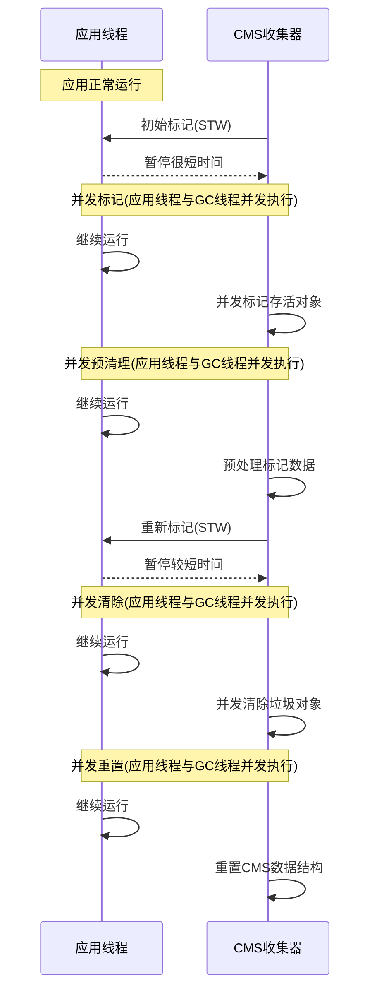

**CMS收集器特点**:
1. **低延迟**：关注停顿时间，多数工作与用户线程并发执行
2. **并发收集**：标记和清除阶段与用户线程并发执行
3. **标记-清除算法**：会产生空间碎片
4. **CPU敏感**：占用部分CPU资源，总吞吐量会下降
5. **无法处理浮动垃圾**：并发清理阶段产生的新垃圾

**CMS执行过程**:
1. **初始标记**：STW，仅标记GC Roots能直接关联的对象
2. **并发标记**：与用户线程同时执行，遍历对象图
3. **并发预清理**：与用户线程同时执行，处理并发标记阶段引用变化的对象
4. **重新标记**：STW，修正并发标记期间因用户程序运行导致的标记变动
5. **并发清除**：与用户线程同时执行，清除没有标记的对象
6. **并发重置**：与用户线程同时执行，重置CMS内部数据结构

**适用场景**:
- **Web应用、接口服务等交互系统**
- **对停顿时间敏感的场景**
- **中等规模堆内存的应用**
- **具有多CPU资源的应用服务器**

**关键参数**:
- `-XX:+UseConcMarkSweepGC`：使用CMS收集器
- `-XX:CMSInitiatingOccupancyFraction=n`：设置老年代使用率触发CMS的阈值
- `-XX:+UseCMSCompactAtFullCollection`：Full GC时进行碎片整理
- `-XX:+CMSClassUnloadingEnabled`：允许类卸载

```java title="CMS问题与解决方案"
class CMSChallenges {
    /**
     * 内存碎片问题
     */
    void fragmentationIssue() {
        // CMS使用标记-清除算法，会产生内存碎片
        // 解决方案：
        // 1. -XX:+UseCMSCompactAtFullCollection
        //    在Full GC时进行碎片整理
        // 2. -XX:CMSFullGCsBeforeCompaction=n
        //    每隔n次Full GC后进行一次碎片整理
    }
    
    /**
     * 并发模式失败
     */
    void concurrentModeFailure() {
        // 当CMS正在进行时，老年代空间不足，会触发并发模式失败
        // 切换到Serial Old进行Full GC，STW时间长
        
        // 解决方案：
        // 1. 增大老年代空间
        // 2. 调低CMSInitiatingOccupancyFraction，提前启动CMS
        // 3. 增加并发线程数(-XX:ConcGCThreads)
    }
    
    /**
     * 浮动垃圾问题
     */
    void floatingGarbageIssue() {
        // 并发清理阶段用户线程产生的垃圾无法清理
        // 需要预留空间应对浮动垃圾
        
        // 解决方案：
        // 保守设置CMSInitiatingOccupancyFraction值
        // 默认为92%，一般建议70%-80%
    }
}
```

</TabItem>
<TabItem value="g1" label="G1收集器">

### G1收集器 (Garbage First)

G1是面向服务端的垃圾收集器，JDK 9开始成为默认收集器，设计目标是替代CMS。

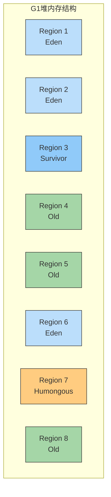

**G1收集器特点**:
1. **区域化内存布局**：将堆分为多个大小相等的Region
2. **并行与并发**：充分利用多核CPU
3. **分代收集**：保留分代概念，但不再物理隔离
4. **可预测的停顿时间**：建立可预测的停顿时间模型
5. **增量式收集**：逐步收集整个堆，而不是一次性收集

**G1收集过程**:
1. **年轻代收集**：收集所有Eden和Survivor区域
2. **并发标记**：标记整个堆中存活的对象
3. **混合收集**：收集所有Eden、Survivor以及部分Old区域
4. **必要时Full GC**：如果并发收集失败，回退到Full GC

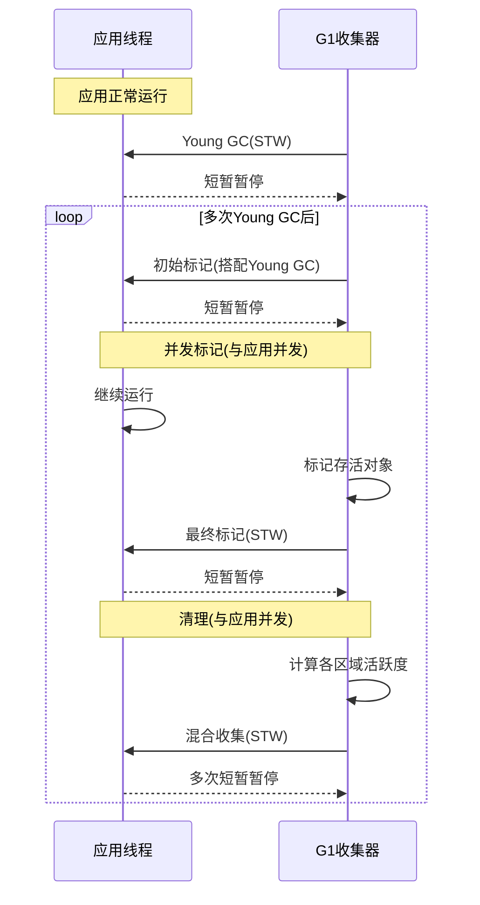

**适用场景**:
- **大内存多核服务器应用**
- **需要低停顿时间的应用**
- **需要大内存（超过4GB）的应用**
- **对响应时间有较高要求的应用**

**关键参数**:
- `-XX:+UseG1GC`：使用G1收集器
- `-XX:MaxGCPauseMillis=n`：设置最大暂停时间目标
- `-XX:G1HeapRegionSize=n`：设置Region大小(1MB到32MB，必须是2的幂)
- `-XX:InitiatingHeapOccupancyPercent=n`：设置触发并发标记的堆占用率阈值

```java title="G1垃圾回收策略"
class G1CollectionStrategy {
    /**
     * 回收集选择策略
     */
    void collectionSetSelection() {
        // G1会计算每个Region的回收价值：
        // 回收价值 = 回收所获得的空间 / 回收所需时间
        
        List<Region> regions = getAllRegions();
        
        // 根据回收价值对Region排序
        regions.sort(byEvacuationEfficiency());
        
        // 从高到低选择Region，直到达到停顿时间目标
        List<Region> collectionSet = new ArrayList<>();
        long estimatedTime = 0;
        
        for (Region region : regions) {
            if (estimatedTime + region.getEstimatedEvacTime() > maxPauseTime) {
                break;
            }
            collectionSet.add(region);
            estimatedTime += region.getEstimatedEvacTime();
        }
        
        // 回收选定的Region
        evacuateRegions(collectionSet);
    }
    
    /**
     * Remember Set (RSet)
     */
    void rememberSetUsage() {
        // G1中每个Region都维护了RSet
        // RSet记录了哪些外部Region引用了本Region中的对象
        // 这样在收集某个Region时，只需扫描其RSet，而不用扫描整个堆
    }
}
```

</TabItem>
</Tabs>

### 4.6 垃圾收集器对比与选择

不同的垃圾收集器有各自的优缺点，适合不同的应用场景。选择合适的垃圾收集器对应用性能至关重要。

| 收集器 | 收集范围 | 线程数 | 算法 | 特点 | 适用场景 |
|-------|---------|-------|------|------|---------|
| **Serial** | 新生代 | 单线程 | 复制 | 简单高效，内存占用小 | 客户端应用，单CPU环境 |
| **Serial Old** | 老年代 | 单线程 | 标记-整理 | 与Serial配合使用 | 客户端应用，单CPU环境 |
| **ParNew** | 新生代 | 多线程 | 复制 | Serial的多线程版本 | 与CMS配合使用 |
| **Parallel Scavenge** | 新生代 | 多线程 | 复制 | 高吞吐量 | 后台运算，批处理 |
| **Parallel Old** | 老年代 | 多线程 | 标记-整理 | 高吞吐量 | 与Parallel Scavenge配合使用 |
| **CMS** | 老年代 | 多线程 | 标记-清除 | 低延迟，并发收集 | Web应用，交互系统 |
| **G1** | 全堆 | 多线程 | 整体标记-整理<br/>局部复制 | 低延迟，可预测停顿 | 大内存服务器应用 |
| **ZGC** | 全堆 | 多线程 | 标记-整理 | 超低延迟(< 10ms) | 大内存，延迟敏感应用 |
| **Shenandoah** | 全堆 | 多线程 | 标记-整理 | 超低延迟 | 大内存，延迟敏感应用 |

:::tip 如何选择垃圾收集器
1. **响应时间优先**: G1、ZGC、Shenandoah
2. **吞吐量优先**: Parallel Scavenge + Parallel Old
3. **内存较小**: Serial + Serial Old
4. **大内存且对延迟敏感**: G1、ZGC
5. **通用场景**: G1 (JDK 9+默认)
:::

## 5. 实际应用场景

### 5.1 垃圾收集器选择策略

```java title="垃圾收集器选择示例"
public class GarbageCollectorSelection {
    
    /**
     * 根据应用特点选择收集器
     */
    public static void selectCollectorByApplication() {
        // 1. 客户端应用
        //    推荐：Serial收集器
        //    原因：内存小，停顿时间要求不高
        
        // 2. 后台计算应用
        //    推荐：Parallel Scavenge + Parallel Old
        //    原因：关注吞吐量，停顿时间要求不高
        
        // 3. Web应用
        //    推荐：ParNew + CMS 或 G1
        //    原因：对响应时间有要求，多CPU环境
        
        // 4. 实时应用
        //    推荐：G1 或 ZGC
        //    原因：对停顿时间要求极高
        
        // 5. 大数据应用
        //    推荐：G1
        //    原因：大堆内存，对停顿时间有要求
    }
    
    /**
     * 根据硬件环境选择收集器
     */
    public static void selectCollectorByHardware() {
        // 1. 单CPU环境
        //    推荐：Serial收集器
        //    原因：多线程收集器无法发挥优势
        
        // 2. 多CPU环境
        //    推荐：并行收集器
        //    原因：可以充分利用多核优势
        
        // 3. 大内存环境（> 4GB）
        //    推荐：G1 或 ZGC
        //    原因：适合大堆内存
        
        // 4. 小内存环境（< 1GB）
        //    推荐：Serial 或 Parallel收集器
        //    原因：简单高效
    }
    
    /**
     * 根据性能要求选择收集器
     */
    public static void selectCollectorByPerformance() {
        // 1. 高吞吐量要求
        //    推荐：Parallel Scavenge + Parallel Old
        //    参数：-XX:GCTimeRatio=99
        
        // 2. 低停顿时间要求
        //    推荐：G1 或 ZGC
        //    参数：-XX:MaxGCPauseMillis=200
        
        // 3. 平衡要求
        //    推荐：G1收集器
        //    原因：吞吐量和停顿时间都较好
    }
}
```

### 5.2 垃圾回收性能优化

```java title="垃圾回收性能优化示例"
public class GarbageCollectionOptimization {
    
    /**
     * 内存分配优化
     */
    public static void memoryAllocationOptimization() {
        // 1. 对象池模式
        ObjectPool pool = new ObjectPool();
        Object obj = pool.borrow();
        try {
            // 使用对象
        } finally {
            pool.returnObject(obj);
        }
        
        // 2. 预分配容量
        List<String> list = new ArrayList<>(1000);
        
        // 3. 避免大对象创建
        // 使用分块处理大数组
        processLargeArrayInChunks();
        
        // 4. 及时释放引用
        obj = null;  // 帮助垃圾回收
    }
    
    /**
     * GC参数优化
     */
    public static void gcParameterOptimization() {
        // 1. 堆内存大小优化
        // -Xms4g -Xmx4g  // 避免动态调整
        
        // 2. 新生代大小优化
        // -Xmn1g  // 根据对象生命周期调整
        
        // 3. Survivor比例优化
        // -XX:SurvivorRatio=8  // 根据对象存活率调整
        
        // 4. 对象年龄阈值优化
        // -XX:MaxTenuringThreshold=15  // 根据对象存活时间调整
    }
    
    /**
     * 监控和分析
     */
    public static void monitoringAndAnalysis() {
        // 1. GC日志分析
        // -XX:+PrintGCDetails
        // -XX:+PrintGCTimeStamps
        // -Xloggc:gc.log
        
        // 2. 性能监控
        // 使用JVisualVM、JProfiler等工具
        
        // 3. 关键指标
        // - GC频率
        // - GC停顿时间
        // - 内存使用率
        // - 对象分配速率
    }
}

// 简单的对象池实现
class ObjectPool {
    private Queue<Object> pool = new LinkedList<>();
    
    public Object borrow() {
        return pool.poll() != null ? pool.poll() : new Object();
    }
    
    public void returnObject(Object obj) {
        pool.offer(obj);
    }
}
```

## 6. 最佳实践总结

### 6.1 垃圾回收调优原则

:::tip 调优原则
1. **先分析，后调优**：使用监控工具分析性能瓶颈
2. **逐步调优**：每次只调整一个参数，观察效果
3. **监控验证**：调优后要持续监控，验证效果
4. **回归测试**：确保调优不影响功能
:::

```java title="调优原则示例"
public class GCTuningPrinciples {
    
    /**
     * 调优流程
     */
    public static void tuningProcess() {
        // 1. 性能测试
        PerformanceBaseline baseline = establishBaseline();
        
        // 2. 监控分析
        PerformanceBottleneck bottleneck = analyzeBottleneck();
        
        // 3. 参数调优
        TuningPlan plan = createTuningPlan(bottleneck);
        applyTuningPlan(plan);
        
        // 4. 验证测试
        PerformanceResult result = validateTuning();
        
        // 5. 持续监控
        setupContinuousMonitoring();
    }
    
    /**
     * 常见调优误区
     */
    public static void commonTuningMistakes() {
        // 1. 盲目增加堆内存
        //    问题：可能导致GC停顿时间过长
        //    解决：根据应用特点合理设置
        
        // 2. 过度优化
        //    问题：可能影响系统稳定性
        //    解决：在性能和稳定性间找到平衡
        
        // 3. 忽略监控
        //    问题：调优后不持续监控
        //    解决：建立完善的监控体系
        
        // 4. 参数照搬
        //    问题：不同应用场景需要不同参数
        //    解决：根据应用特点调整参数
    }
}
```

### 6.2 常见问题解决

```java title="常见问题解决示例"
public class CommonProblemSolutions {
    
    /**
     * 频繁GC问题
     */
    public static void frequentGCProblem() {
        // 问题表现：
        // 1. GC频率过高
        // 2. 应用响应时间波动
        // 3. 系统负载高
        
        // 解决方案：
        // 1. 增加堆内存大小
        // 2. 优化对象分配
        // 3. 调整新生代比例
        // 4. 选择合适的收集器
    }
    
    /**
     * 长时间停顿问题
     */
    public static void longPauseProblem() {
        // 问题表现：
        // 1. GC停顿时间过长
        // 2. 应用响应时间不稳定
        // 3. 用户体验差
        
        // 解决方案：
        // 1. 使用低停顿时间收集器（G1、ZGC）
        // 2. 调整停顿时间目标
        // 3. 优化对象分配
        // 4. 减少大对象创建
    }
    
    /**
     * 内存泄漏问题
     */
    public static void memoryLeakProblem() {
        // 问题表现：
        // 1. 内存使用率持续上升
        // 2. 频繁Full GC
        // 3. 最终OOM
        
        // 解决方案：
        // 1. 使用MAT分析堆转储
        // 2. 检查静态集合
        // 3. 检查监听器注册
        // 4. 检查ThreadLocal使用
    }
}
```

## 7. 总结

Java垃圾回收是Java虚拟机自动内存管理的核心机制，它通过自动识别和回收不再使用的对象来管理堆内存。垃圾回收机制使得Java程序员无需手动管理内存，大大降低了内存泄漏和内存溢出的风险，提高了开发效率和程序稳定性。

在实际应用中，需要根据应用特点、硬件环境和性能要求选择合适的垃圾收集器，并通过合理的参数配置和持续监控来优化垃圾回收性能。

通过深入理解垃圾回收的原理和机制，我们可以：
- **选择合适的收集器**：根据应用特点选择最合适的垃圾收集器
- **优化性能参数**：通过合理的参数配置提高垃圾回收效率
- **解决性能问题**：快速定位和解决垃圾回收相关的性能问题
- **提高系统稳定性**：避免内存泄漏和内存溢出问题

## 8. 面试题精选

### 8.1 基础概念题

**Q: 什么是垃圾回收？**

A: 垃圾回收是Java虚拟机自动内存管理的核心机制，它负责自动识别和回收不再使用的对象占用的内存空间。垃圾回收的主要目的是：

1. **自动内存管理**：程序员无需手动释放内存
2. **防止内存泄漏**：自动回收无用对象
3. **内存碎片整理**：整理内存碎片，提高内存利用率
4. **性能优化**：在回收效率和停顿时间间找到平衡

**Q: 如何判断对象是否存活？**

A: Java虚拟机使用可达性分析算法来判断对象是否存活：

1. **可达性分析**：
   - 从GC Roots开始搜索
   - 搜索不到的对象标记为垃圾
   - GC Roots包括：栈中局部变量、静态变量、常量、本地方法栈等

2. **引用计数法**（Java不使用）：
   - 为每个对象添加引用计数器
   - 引用时计数器+1，引用失效时-1
   - 计数器为0时回收
   - 缺点：无法解决循环引用问题

### 8.2 算法原理题

**Q: 常见的垃圾回收算法有哪些？**

A: 常见的垃圾回收算法包括：

1. **标记-清除算法**：
   - 分为标记和清除两个阶段
   - 优点：实现简单，不需要额外空间
   - 缺点：效率不高，会产生内存碎片

2. **复制算法**：
   - 将内存分为两块，每次只使用其中一块
   - 优点：效率高，没有内存碎片
   - 缺点：内存利用率只有50%

3. **标记-整理算法**：
   - 结合了标记-清除和复制算法的优点
   - 优点：没有内存碎片，内存利用率高
   - 缺点：效率相对较低

4. **分代收集算法**：
   - 根据对象存活周期分代处理
   - 新生代使用复制算法
   - 老年代使用标记-整理算法

**Q: 分代收集算法的原理是什么？**

A: 分代收集算法基于以下假设：

1. **分代假设**：
   - 大部分对象都是朝生夕死的
   - 经过多次垃圾回收的对象更可能继续存活
   - 不同代的对象有不同的特点

2. **内存分代**：
   - 新生代：存放新创建的对象，使用复制算法
   - 老年代：存放存活时间长的对象，使用标记-整理算法
   - 元空间：存放类信息、常量等

3. **对象晋升**：
   - 对象年龄：每经过一次Minor GC，对象年龄+1
   - 晋升条件：年龄达到阈值或Survivor空间不足
   - 晋升过程：从新生代晋升到老年代

### 8.3 收集器选择题

**Q: 如何选择合适的垃圾收集器？**

A: 垃圾收集器的选择需要考虑以下因素：

1. **应用特点**：
   - 客户端应用：Serial收集器
   - 后台计算应用：Parallel Scavenge + Parallel Old
   - Web应用：ParNew + CMS 或 G1
   - 实时应用：G1 或 ZGC

2. **硬件环境**：
   - 单CPU环境：Serial收集器
   - 多CPU环境：并行收集器
   - 大内存环境：G1 或 ZGC
   - 小内存环境：Serial 或 Parallel收集器

3. **性能要求**：
   - 高吞吐量：Parallel Scavenge + Parallel Old
   - 低停顿时间：G1 或 ZGC
   - 平衡要求：G1收集器

**Q: G1收集器的特点是什么？**

A: G1收集器的主要特点包括：

1. **并发收集**：大部分工作与用户线程并发执行
2. **可预测的停顿时间**：可以设置停顿时间目标
3. **Region布局**：将堆空间分为多个大小相等的Region
4. **优先回收**：优先回收垃圾最多的Region
5. **标记-整理算法**：使用标记-整理算法避免内存碎片

### 8.4 性能调优题

**Q: 如何优化垃圾回收性能？**

A: 垃圾回收性能优化的方法包括：

1. **内存分配优化**：
   - 使用对象池减少对象创建
   - 预分配集合容量
   - 避免大对象创建
   - 及时释放对象引用

2. **GC参数优化**：
   - 合理设置堆内存大小
   - 优化新生代大小
   - 调整Survivor比例
   - 设置对象年龄阈值

3. **收集器选择**：
   - 根据应用特点选择合适的收集器
   - 调整收集器参数
   - 监控收集器性能

4. **监控和分析**：
   - 分析GC日志
   - 监控关键指标
   - 识别性能瓶颈

**Q: 如何分析GC日志？**

A: GC日志分析的主要步骤包括：

1. **查看GC类型和频率**：
   - Young GC频率是否过高
   - Full GC频率是否过高
   - 混合GC的使用情况

2. **分析停顿时间**：
   - 平均停顿时间
   - 最大停顿时间
   - 停顿时间分布

3. **检查内存使用情况**：
   - 堆内存使用率
   - 老年代使用率
   - 新生代使用率

4. **观察对象分配情况**：
   - 对象分配速率
   - 对象存活时间
   - 对象年龄分布

### 8.5 实践应用题

**Q: 如何排查内存泄漏？**

A: 内存泄漏排查的主要步骤包括：

1. **监控内存使用趋势**：
   - 观察内存使用是否持续增长
   - 分析GC日志中的内存回收情况
   - 监控堆内存使用率

2. **生成堆转储文件**：
   - 使用`jmap -dump:format=b,file=heap.hprof <pid>`
   - 在OOM时自动生成堆转储
   - 选择合适的时间点生成堆转储

3. **分析堆转储文件**：
   - 使用MAT等工具分析
   - 查看大对象和对象引用关系
   - 识别内存泄漏点

4. **常见内存泄漏原因**：
   - 静态集合持有对象引用
   - 监听器未正确移除
   - 数据库连接未关闭
   - 内部类持有外部类引用
   - ThreadLocal使用不当

**Q: 在高并发场景下如何优化垃圾回收？**

A: 高并发场景下的垃圾回收优化策略：

1. **收集器选择**：
   - 使用G1GC或ZGC
   - 设置合适的停顿时间目标
   - 优化Region大小

2. **内存配置优化**：
   - 合理设置堆内存大小
   - 优化新生代比例
   - 使用TLAB优化对象分配

3. **对象分配优化**：
   - 使用对象池减少对象创建
   - 优化字符串操作
   - 减少临时对象创建

4. **监控和调优**：
   - 持续监控GC性能
   - 分析性能瓶颈
   - 及时调整参数

:::tip 面试要点
1. **理解垃圾回收原理**：掌握可达性分析、分代收集等核心概念
2. **熟悉各种算法**：了解标记-清除、复制、标记-整理等算法
3. **掌握收集器特点**：熟悉各种垃圾收集器的适用场景和特点
4. **具备调优能力**：能够根据应用特点选择合适的收集器和参数
5. **问题诊断能力**：能够分析GC日志、排查内存泄漏等常见问题
6. **实践经验**：具备实际的垃圾回收调优经验
:::

---

通过本章的学习，你应该已经掌握了Java垃圾回收的核心概念、算法原理和最佳实践。垃圾回收是Java开发中的重要知识，深入理解其原理和机制，对于编写高效、稳定的Java程序至关重要。在实际工作中，需要根据具体的应用场景和性能要求，选择合适的垃圾收集器，并通过合理的调优来保证系统的性能表现。 