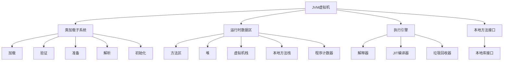
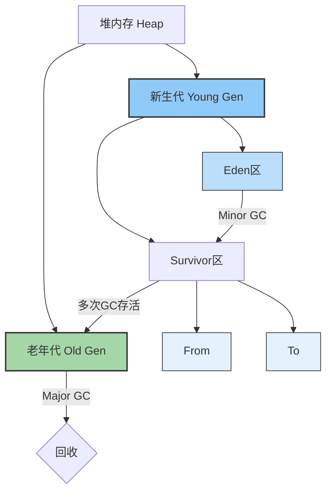
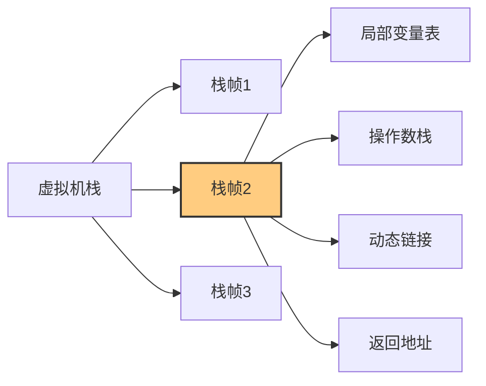
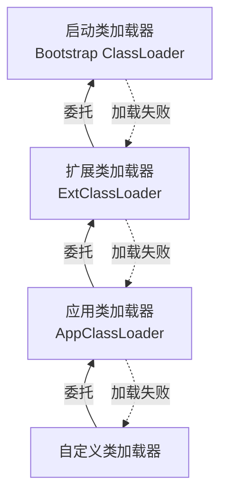
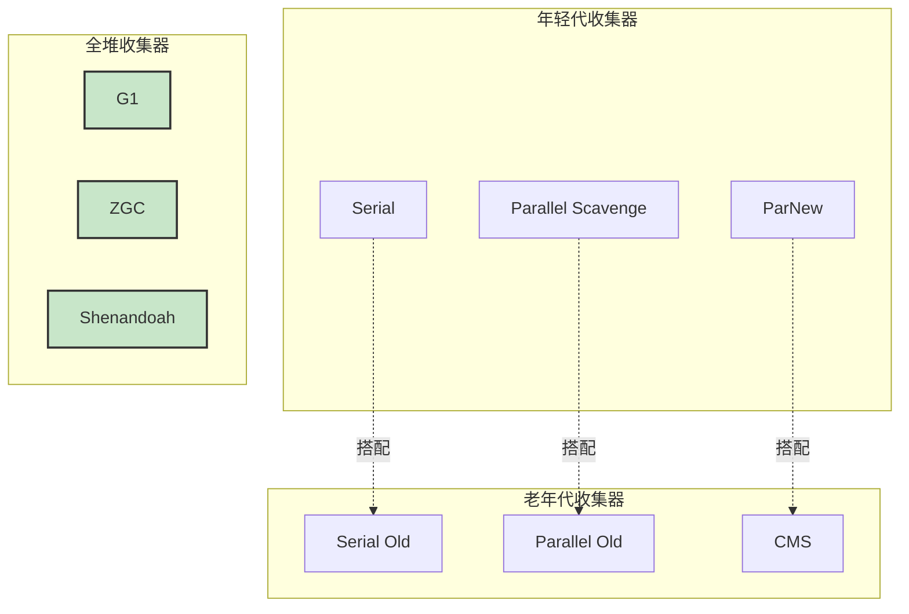

import Tabs from '@theme/Tabs';
import TabItem from '@theme/TabItem';
import CodeBlock from '@theme/CodeBlock';

# JVM虚拟机总结

Java虚拟机(JVM)是Java程序运行的核心，理解JVM的工作原理对于性能调优和问题排查至关重要。本文档总结了JVM的核心概念和面试重点。

:::tip 核心要点
**JVM = Java程序的运行环境 + 优化引擎**
- 🏗️ **跨平台能力**：一次编写，到处运行的关键
- 🧠 **内存管理**：自动内存分配与垃圾回收
- 🚀 **运行时优化**：即时编译与代码优化
- 🔍 **安全沙箱**：类型安全检查与字节码验证
- 🛠️ **可调节性**：丰富的调优参数和监控工具
:::

## JVM核心架构

### 整体架构



### 内存模型

<Tabs>
<TabItem value="overview" label="内存区域概览">

| 内存区域 | 用途 | 特点 | 异常情况 |
|---------|------|------|---------|
| **堆（Heap）** | 存放对象实例 | 线程共享，GC管理 | OutOfMemoryError |
| **方法区（Method Area）** | 存储类信息、常量、静态变量 | 线程共享 | OutOfMemoryError |
| **虚拟机栈（VM Stack）** | 存储栈帧，方法调用和执行 | 线程私有 | StackOverflowError、OutOfMemoryError |
| **本地方法栈（Native Method Stack）** | 执行Native方法 | 线程私有 | StackOverflowError、OutOfMemoryError |
| **程序计数器（PC Register）** | 当前线程执行字节码的行号指示器 | 线程私有，无GC | 不会OOM |

</TabItem>
<TabItem value="heap" label="堆内存结构">



**分代比例**:
- Eden : Survivor = 8 : 2 (Survivor = From + To)
- Young : Old = 1 : 2 (默认)

</TabItem>
<TabItem value="stack" label="栈内存结构">



**栈帧（Stack Frame）**:
- 每个方法调用时创建
- 包含：局部变量表、操作数栈、动态链接、方法返回地址
- 方法调用结束，栈帧出栈

</TabItem>
</Tabs>

## 核心面试重点

### 1. 类加载机制

<Tabs>
<TabItem value="classloader" label="类加载器层次">



**双亲委派模型**:
1. 收到类加载请求时，先委托父加载器加载
2. 父加载器无法加载时，子加载器才尝试加载
3. 确保核心类库的安全性，防止被篡改

**打破双亲委派的例子**:
- SPI机制（Service Provider Interface）
- OSGi模块系统
- Tomcat类加载机制

</TabItem>
<TabItem value="classloading" label="类加载过程">


**初始化触发时机**:
1. 使用new、getstatic、putstatic、invokestatic指令
2. 反射调用类
3. 初始化子类时，先初始化父类
4. 虚拟机启动时，先初始化主类
5. 调用MethodHandle实例，且该实例对应的类没有初始化

</TabItem>
</Tabs>

:::info 面试高频点
面试经常会问到：
- 什么是双亲委派模型？如何打破？
- 一个类加载的过程具体做了什么？
- 类的初始化触发条件有哪些？
- 如何自定义类加载器？需要注意什么？
:::

### 2. 垃圾回收机制

<Tabs>
<TabItem value="gc-algo" label="垃圾回收算法">

| 算法 | 原理 | 优点 | 缺点 | 适用区域 |
|-----|-----|------|------|---------|
| **标记-清除** | 标记存活对象，清除其余部分 | 实现简单 | 效率低，产生碎片 | 老年代 |
| **复制** | 将存活对象复制到另一块区域 | 高效，无碎片 | 内存利用率低 | 新生代 |
| **标记-整理** | 标记后将存活对象向一端移动 | 无碎片 | 效率较低 | 老年代 |
| **分代收集** | 根据对象生命周期特点，使用不同算法 | 针对性优化 | 实现复杂 | 整个堆 |

</TabItem>
<TabItem value="gc-collectors" label="垃圾回收器">



**垃圾回收器特点**:
- **Serial/Serial Old**: 单线程收集，简单高效，适合客户端
- **ParNew**: Serial的多线程版本，配合CMS使用
- **Parallel Scavenge/Old**: 注重吞吐量的多线程收集器
- **CMS**: 低延迟，并发收集，老年代
- **G1**: 区域化分代，可预测停顿时间
- **ZGC/Shenandoah**: 超低延迟，大堆内存收集器

</TabItem>
<TabItem value="gc-tuning" label="GC调优参数">

```bash
# 堆大小设置
-Xms<size>         # 初始堆大小
-Xmx<size>         # 最大堆大小
-Xmn<size>         # 新生代大小

# 比例设置
-XX:SurvivorRatio=8     # Eden:Survivor比例，默认8:1
-XX:NewRatio=2          # Old:Young比例，默认2:1

# 垃圾回收器选择
-XX:+UseSerialGC        # 使用Serial+Serial Old收集器
-XX:+UseParallelGC      # 使用Parallel Scavenge+Parallel Old收集器
-XX:+UseConcMarkSweepGC # 使用ParNew+CMS+Serial Old收集器
-XX:+UseG1GC            # 使用G1收集器
-XX:+UseZGC             # 使用ZGC收集器(Java 11+)

# G1相关参数
-XX:MaxGCPauseMillis=200 # 期望的最大暂停时间，默认200ms
-XX:G1HeapRegionSize=n   # G1区域大小，1-32MB，必须是2的幂
```

</TabItem>
</Tabs>

:::tip 如何选择垃圾回收器
- **内存 < 4GB**: 使用Serial或Parallel收集器
- **4-8GB内存**: 使用Parallel或CMS收集器
- **8GB以上内存**: 使用G1收集器
- **超大内存(> 32GB)**: 考虑使用ZGC或Shenandoah收集器
- **注重吞吐量**: Parallel收集器
- **注重低延迟**: CMS, G1, ZGC
:::

### 3. JVM调优实战

<Tabs>
<TabItem value="memory" label="内存问题">

**内存泄漏常见场景**:
```java
// 1. 静态集合类引起的内存泄漏
public class StaticLeakExample {
    // 静态集合，生命周期与应用相同
    private static final List<Object> CACHE = new ArrayList<>();
    
    public void addToCache(Object obj) {
        CACHE.add(obj);
        // 未提供从缓存中删除的方法
    }
}

// 2. 未关闭资源导致的内存泄漏
public void processFile(String path) throws IOException {
    FileInputStream fis = new FileInputStream(path);
    // 使用资源但忘记关闭
    // 应使用try-with-resources或finally确保关闭
}
```

**排查工具**:
- **jmap**: `jmap -dump:format=b,file=heap.bin <pid>`
- **MAT**: 分析堆转储文件，找出内存占用大户
- **VisualVM**: 实时监控内存使用情况

</TabItem>
<TabItem value="cpu" label="CPU问题">

**高CPU常见场景**:
```java
// 1. 死循环
public void infiniteLoop() {
    while(true) {
        // 某些条件判断错误，导致一直循环
        doSomething();
    }
}

// 2. 线程阻塞或竞争
public void threadDeadlock() {
    final Object resource1 = new Object();
    final Object resource2 = new Object();
    
    // 线程1
    new Thread(() -> {
        synchronized(resource1) {
            sleep(100);
            synchronized(resource2) {
                // 永远无法获取resource2
            }
        }
    }).start();
    
    // 线程2
    new Thread(() -> {
        synchronized(resource2) {
            sleep(100);
            synchronized(resource1) {
                // 永远无法获取resource1
            }
        }
    }).start();
}
```

**排查工具**:
- **jstack**: `jstack -l <pid> > thread.log`
- **top -Hp `<pid>`**: 查看进程内各线程CPU使用情况
- **Arthas**: `thread -n 3` 查看CPU使用率前3的线程

</TabItem>
<TabItem value="gc" label="GC问题">

**频繁GC常见场景**:
```
1. 内存分配过快（大量临时对象）
2. 内存泄漏导致可用空间不足
3. 堆内存过小，无法承载业务负载
4. 老年代内存碎片化严重
```

**GC日志分析示例**:
```
[GC (Allocation Failure) [PSYoungGen: 76800K->7657K(89600K)] 76800K->7665K(294400K), 0.0101168 secs]
```
分析：
- 类型：Minor GC
- 原因：Allocation Failure（分配失败）
- 新生代：76800K->7657K（回收前->回收后），总大小89600K
- 整个堆：76800K->7665K（回收前->回收后），总大小294400K
- 耗时：0.0101168秒（约10毫秒）

**排查工具**:
- **jstat**: `jstat -gcutil <pid> 1000` 每秒查看GC情况
- **GCViewer**: 分析GC日志，图形化展示
- **GCEasy**: 在线GC日志分析工具

</TabItem>
</Tabs>

## 性能监控与工具

### JDK内置工具

```bash
# 监控工具
jps     # 查看Java进程
jstat   # 监控JVM统计信息
jinfo   # 查看和修改JVM参数
jmap    # 生成堆转储快照
jhat    # 分析堆转储快照
jstack  # 生成线程转储快照

# 示例命令
jps -l                          # 查看Java进程及其主类名
jstat -gcutil <pid> 1000 10     # 每秒查看1次GC情况，共10次
jmap -dump:format=b,file=heap.bin <pid>  # 导出堆快照
jstack -l <pid> > thread.dump   # 导出线程快照
```

### 常用第三方工具

<Tabs>
<TabItem value="visualvm" label="VisualVM">


**功能**:
- 实时监控内存、CPU、线程
- 堆转储分析
- 性能分析（CPU、内存）
- 线程分析
- 支持插件扩展

</TabItem>
<TabItem value="arthas" label="Arthas">


**功能**:
- 在线排查生产环境问题
- Java方法执行监控
- JVM状态监控
- 类加载情况查看
- 代码热更新

**常用命令**:
```bash
dashboard  # 系统概览面板
thread     # 线程信息
jvm        # JVM信息
heapdump   # 堆转储
monitor    # 方法执行监控
watch      # 方法参数、返回值、异常监控
trace      # 方法内部调用路径
```

</TabItem>
<TabItem value="mat" label="Memory Analyzer (MAT)">


**功能**:
- 分析大型堆转储文件
- 检测内存泄漏
- 分析内存占用
- 对象依赖分析
- 自定义查询和报告

**分析维度**:
- Histogram：列出所有对象及占用空间
- Dominator Tree：对象之间的支配关系
- Leak Suspects：自动检测可能的内存泄漏
- Top Consumers：内存占用大户

</TabItem>
</Tabs>

## JVM调优最佳实践

### 调优步骤


1. **收集数据**：监控GC、内存、线程、CPU使用情况
2. **分析问题**：定位瓶颈，确定问题根本原因
3. **制定方案**：根据问题类型选择合适的调优参数
4. **修改参数**：应用调整后的JVM参数
5. **验证效果**：对比调优前后的指标，确认效果

### 场景化调优方案

<Tabs>
<TabItem value="web-app" label="Web应用">

**特点**：
- 请求高并发
- 对延迟敏感
- 内存需求中等
- 需要快速响应用户请求

**推荐配置**:
```bash
# 8GB内存服务器示例
-Xms4g -Xmx4g -Xmn1.5g
-XX:+UseG1GC
-XX:MaxGCPauseMillis=100
-XX:+ParallelRefProcEnabled
-XX:+DisableExplicitGC
```

**关注指标**：
- 请求响应时间
- GC暂停时间
- 吞吐量
- 内存使用曲线

</TabItem>
<TabItem value="big-data" label="大数据处理">

**特点**：
- 内存消耗大
- 批处理任务
- 注重吞吐量
- 对延迟不太敏感

**推荐配置**:
```bash
# 32GB内存服务器示例
-Xms24g -Xmx24g 
-XX:+UseG1GC
-XX:G1HeapRegionSize=16m
-XX:+UnlockExperimentalVMOptions
-XX:MaxGCPauseMillis=500
```

**关注指标**：
- 处理任务总时间
- 内存利用率
- Full GC频率
- 大对象分配情况

</TabItem>
<TabItem value="microservice" label="微服务">

**特点**：
- 大量小型服务
- 快速启动重要
- 资源高效利用
- 弹性扩缩容

**推荐配置**:
```bash
# 容器环境示例
-XX:InitialRAMPercentage=70.0
-XX:MaxRAMPercentage=75.0
-XX:+UseG1GC
-XX:MaxGCPauseMillis=200
-XX:+ExitOnOutOfMemoryError
```

**关注指标**：
- 启动时间
- 资源利用率
- 弹性伸缩性能
- 容器内存限制适配

</TabItem>
</Tabs>

### 调优常用套路

:::info 内存相关

1. **设置堆内存大小**
   - 初始堆 = 最大堆，避免运行时扩容
   - 堆大小通常设为可用物理内存的50%-70%

2. **新生代调优**
   - 如果对象朝生夕死，增大新生代
   - 如果对象存活率高，减小新生代
   - 新生代通常占堆的1/3到1/4

3. **老年代调优**
   - 观察Full GC频率，太频繁考虑增大老年代
   - 避免对象直接进入老年代（大对象）
:::

:::info GC相关

1. **选择合适的垃圾回收器**
   - 低延迟需求：CMS, G1, ZGC
   - 高吞吐量需求：Parallel GC
   
2. **G1调优**
   - `-XX:MaxGCPauseMillis=200`：设置期望最大停顿时间
   - `-XX:G1HeapRegionSize=n`：设置Region大小
   - `-XX:ConcGCThreads=n`：并发GC线程数

3. **调优指标**
   - Minor GC频率小于10秒一次为宜
   - GC暂停时间小于应用可接受的延迟
   - 避免Full GC
:::

## 面试常见问题汇总

<Tabs>
<TabItem value="basics" label="基础概念">

**1. Java内存区域如何划分？各自的作用是什么？**
- 程序计数器：线程私有，记录当前线程执行位置
- 虚拟机栈：线程私有，存储栈帧
- 本地方法栈：线程私有，为Native方法服务
- 堆：线程共享，存储对象实例
- 方法区：线程共享，存储类信息、常量、静态变量

**2. 介绍下双亲委派模型，有哪些好处？**
- 从下到上检查类是否已加载，从上到下尝试加载类
- 好处：避免类重复加载，保证核心类库安全性

**3. 什么情况下会发生栈溢出？堆溢出？**
- 栈溢出：递归调用过深、方法内变量过多
- 堆溢出：创建大量对象无法回收、内存泄漏

**4. 对象创建的过程？**
- 类加载检查 → 分配内存 → 初始化零值 → 设置对象头 → 执行构造方法

</TabItem>
<TabItem value="gc" label="垃圾回收">

**1. 判断对象死亡的方法有哪些？**
- 引用计数法：计数为0表示可回收，无法解决循环引用
- 可达性分析：从GC Roots出发，不可达为可回收

**2. GC Roots包括哪些？**
- 虚拟机栈中引用的对象
- 方法区中静态属性引用的对象
- 方法区中常量引用的对象
- 本地方法栈中引用的对象

**3. 垃圾回收算法有哪些？**
- 标记-清除：效率低，容易碎片化
- 复制算法：空间利用率低，适合新生代
- 标记-整理：效率适中，无碎片，适合老年代
- 分代收集：新生代用复制，老年代用标记-整理

**4. CMS和G1的区别？**
- CMS：并发标记清除，低延迟，会产生碎片
- G1：区域化分代，可预测停顿，整体性能更好

</TabItem>
<TabItem value="tuning" label="调优实战">

**1. 如何分析dump文件？**
- 使用MAT等工具加载dump文件
- 查看Histogram、Dominator Tree等视图
- 检查大对象、可疑对象的引用链

**2. 如何处理线上OOM问题？**
- 添加JVM参数自动dump：`-XX:+HeapDumpOnOutOfMemoryError`
- 分析dump文件找出内存占用大的对象
- 检查对象的引用链，定位代码问题

**3. 生产环境如何调优JVM？**
- 收集性能数据，确定问题（GC、内存、CPU）
- 分析问题根因，制定调优策略
- 小范围测试调优效果
- 灰度发布到生产环境
- 持续监控，验证效果

**4. 如何避免Full GC？**
- 增大年轻代，减少对象晋升
- 预估内存使用，避免大对象直接进入老年代
- 及时处理内存泄漏问题
- 使用并发收集器如G1、ZGC

</TabItem>
<TabItem value="advanced" label="高级话题">

**1. 谈谈JIT编译器的优化策略**
- 方法内联：减少方法调用开销
- 逃逸分析：栈上分配、标量替换
- 循环优化：循环展开、循环不变量外提
- 分支预测：根据执行频率优化分支

**2. Java内存模型（JMM）的作用是什么？**
- 定义线程和主内存的交互方式
- 规范了volatile、synchronized、final的语义
- 保证原子性、可见性、有序性
- 解决了并发环境下的内存可见性问题

**3. ZGC相比G1有哪些优势？**
- 停顿时间不随堆增大而增大，始终在10ms以内
- 支持TB级别的超大堆
- 着色指针技术，不使用内存屏障
- 并发处理所有GC阶段

**4. JVM如何处理大内存和多核CPU环境？**
- NUMA架构支持：提高内存访问局部性
- 并行GC线程：根据CPU核心数动态调整
- 大页内存：减少TLB miss，提高内存访问效率
- 资源隔离：CPU绑定、内存分区

</TabItem>
</Tabs>

## 学习路径与资源

### 入门阶段

1. **基础概念学习**
   - 《深入理解Java虚拟机》第一、二部分
   - Oracle官方JVM文档
   - 了解JVM架构和内存模型

2. **实践工具掌握**
   - 学会使用JDK自带工具：jps, jstat, jmap, jstack
   - 尝试使用VisualVM监控应用
   - 分析简单的GC日志

### 进阶阶段

1. **深入原理学习**
   - 《深入理解Java虚拟机》完整阅读
   - 《Java Performance》深入性能调优
   - 理解垃圾回收算法和收集器工作原理

2. **调优实践**
   - 学习使用MAT分析内存问题
   - 尝试解决实际项目中的性能问题
   - 学习GC日志分析和调优参数

### 高级阶段

1. **源码研究**
   - 研究OpenJDK源码，了解JVM实现细节
   - 深入了解JIT编译器优化
   - 研究垃圾收集器实现原理

2. **前沿技术**
   - GraalVM和Native Image技术
   - ZGC、Shenandoah等新一代垃圾收集器
   - 容器环境下的JVM优化

### 推荐资源

- **书籍**：《深入理解Java虚拟机》、《Java Performance》、《实战Java高并发程序设计》
- **博客**：R大的知乎文章、美团技术博客JVM相关文章
- **工具**：Arthas、MAT、GCViewer、JMC(Java Mission Control)
- **源码**：OpenJDK源码阅读

---

通过系统学习JVM，你将能够：
- 理解Java程序的运行机制
- 进行JVM性能调优
- 排查内存和性能问题
- 优化应用程序性能 
- 在面试中自信回答JVM相关问题 