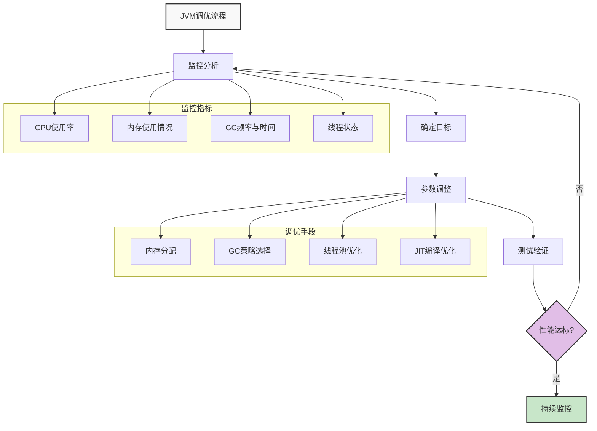
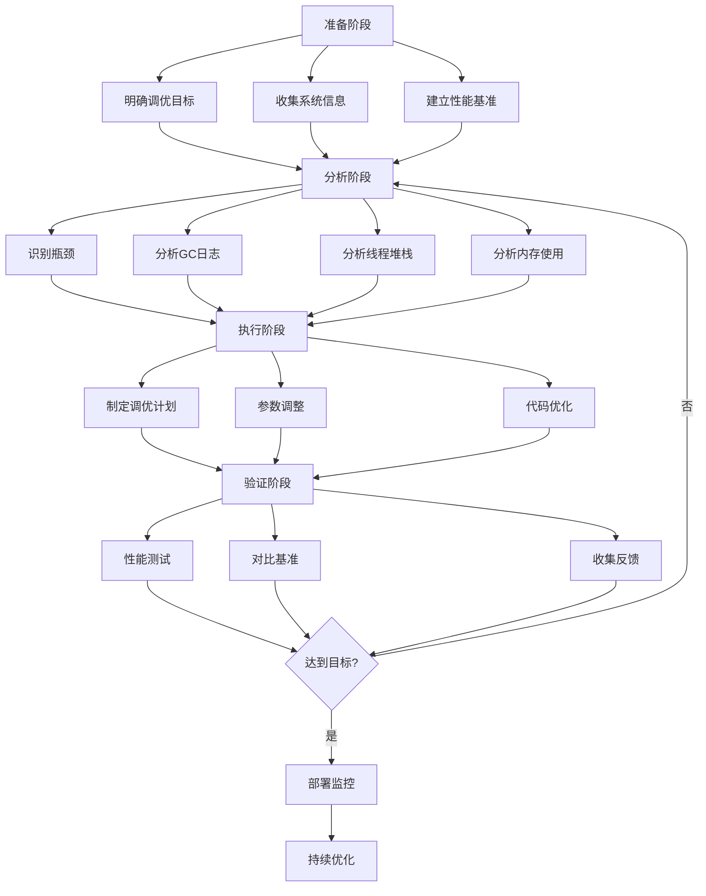
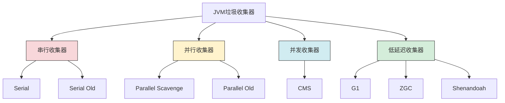
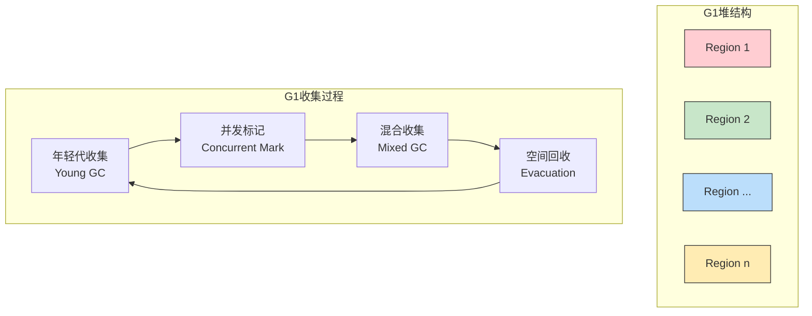
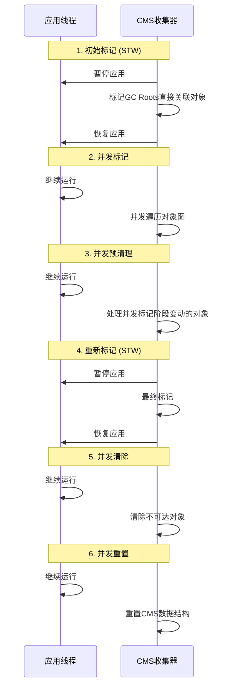
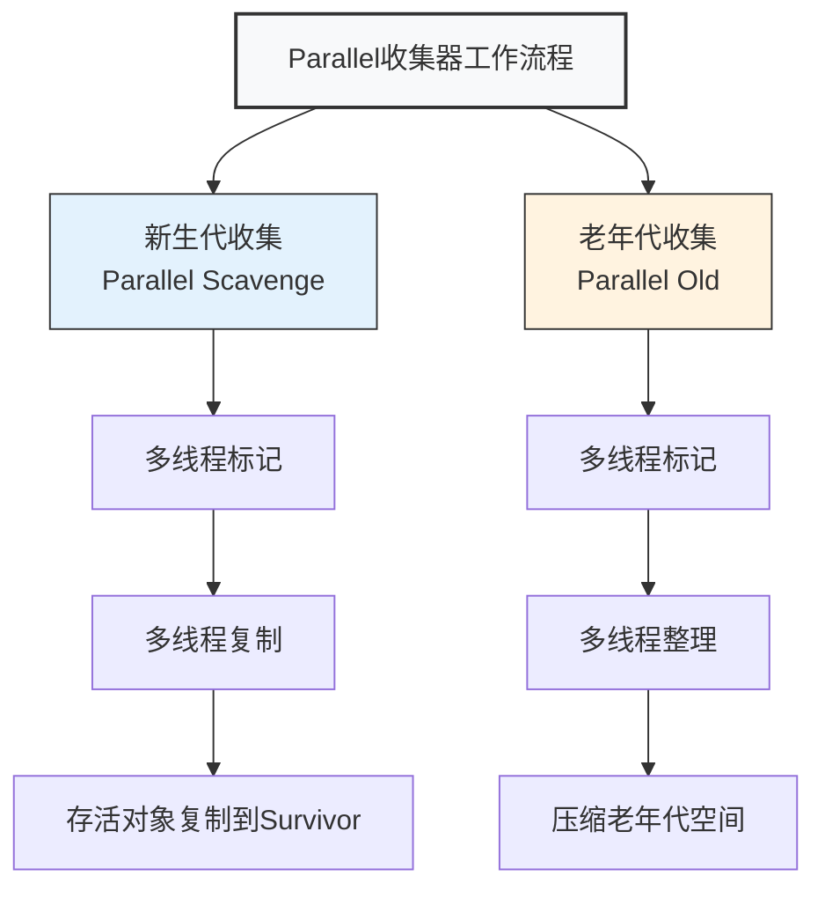
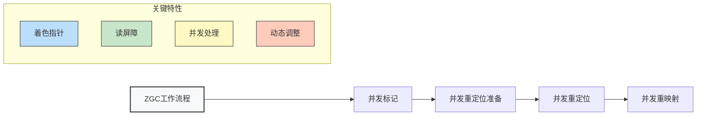

import Tabs from '@theme/Tabs';
import TabItem from '@theme/TabItem';
import CodeBlock from '@theme/CodeBlock';

# JVM调优详解

JVM调优是Java应用程序性能优化的重要组成部分，它通过调整JVM参数、选择合适的垃圾收集器、优化内存分配策略等手段，来提升应用程序的性能表现。合理的JVM调优能够显著改善应用程序的吞吐量、响应时间和稳定性。

:::tip 核心特性
JVM调优 = 性能指标优化 + 垃圾收集器选择 + 内存参数调优 + 监控诊断 + 最佳实践应用
:::



## 1. JVM调优基础概念

### 1.1 什么是JVM调优？

JVM调优是指通过调整Java虚拟机的各种参数和配置，来优化Java应用程序的性能表现。调优的目标是在保证应用程序稳定运行的前提下，最大化性能指标，如吞吐量、响应时间等。

<Tabs>
<TabItem value="goals" label="调优目标">

**性能指标**:
- **吞吐量(Throughput)**: 单位时间内处理的请求数量
- **响应时间(Response Time)**: 请求从发出到收到响应的时间
- **延迟(Latency)**: 请求在系统中的处理时间
- **资源利用率(Resource Utilization)**: CPU、内存等资源的使用效率

**调优维度**:
| 维度 | 目标 | 常见问题 | 相关参数 |
|-----|------|---------|--------|
| **内存** | 减少GC频率，提高内存利用率 | 内存泄漏，OOM | -Xms, -Xmx, -Xmn |
| **GC** | 减少停顿时间，提高回收效率 | STW时间过长，吞吐量低 | -XX:+Use[GC类型] |
| **线程** | 合理配置线程池，避免资源竞争 | 线程死锁，线程溢出 | -Xss |
| **编译** | 优化代码执行效率 | 解释执行慢，编译优化不足 | -XX:CompileThreshold |

</TabItem>
<TabItem value="principles" label="调优原则">

**科学调优五大原则**:

1. **数据驱动原则**
   - 基于监控数据和性能指标进行调优
   - 避免凭经验或"感觉"调优
   - 建立基准测试和性能对比

2. **渐进式调优原则**
   - 一次只调整一个参数
   - 每次调整后观察效果
   - 保留调优记录，便于回滚

3. **场景适配原则**
   - 针对特定场景选择合适的调优策略
   - Web应用、批处理、微服务等场景调优策略不同
   - 考虑业务特点和性能瓶颈

4. **成本效益原则**
   - 评估调优带来的收益和成本
   - 避免过度调优和资源浪费
   - 找到性能和资源的最佳平衡点

5. **持续优化原则**
   - 调优是持续过程，不是一次性工作
   - 随业务变化持续调整
   - 定期回顾和验证调优效果

</TabItem>
<TabItem value="workflow" label="调优流程">



**标准调优流程**:

1. **准备阶段**
   - 明确性能目标和指标
   - 了解应用特点和架构
   - 收集系统配置信息

2. **监控阶段**
   - 收集性能数据
   - 分析GC日志
   - 检查内存使用情况
   - 分析线程状态

3. **分析阶段**
   - 识别性能瓶颈
   - 确定优化方向
   - 制定调优计划

4. **调优阶段**
   - 调整JVM参数
   - 更改GC策略
   - 优化内存配置
   - 调整线程设置

5. **验证阶段**
   - 测试调优效果
   - 对比性能指标
   - 确认稳定性

6. **监控阶段**
   - 持续监控系统
   - 分析长期表现
   - 根据需要继续优化

</TabItem>
</Tabs>

#### 调优的核心要素

```java title="JVM调优核心要素"
public class JVMTuningCoreElements {
    
    // ========== 调优目标 ==========
    // 1. 性能优化：提升吞吐量和响应时间
    // 2. 资源利用：合理使用CPU和内存资源
    // 3. 稳定性保证：避免OOM和频繁GC
    // 4. 成本控制：在性能和资源成本间平衡
    
    // ========== 调优手段 ==========
    // 1. 参数调整：JVM启动参数优化
    // 2. 收集器选择：根据场景选择合适的GC
    // 3. 内存配置：堆内存、新生代、老年代配置
    // 4. 监控诊断：使用工具分析性能瓶颈
}
```

## 2. 调优目标与性能指标

### 2.1 核心性能指标

JVM调优主要关注以下几个核心性能指标：

#### 吞吐量（Throughput）

吞吐量是指单位时间内应用程序能够处理的请求数量，是衡量系统处理能力的重要指标。

```java title="吞吐量计算示例"
public class ThroughputExample {
    
    /**
     * 计算系统吞吐量
     */
    public static double calculateThroughput(long requestCount, long timeInSeconds) {
        return (double) requestCount / timeInSeconds;
    }
    
    /**
     * 吞吐量测试示例
     */
    public static void throughputTest() {
        long startTime = System.currentTimeMillis();
        int requestCount = 0;
        
        // 模拟处理请求
        for (int i = 0; i < 10000; i++) {
            processRequest();
            requestCount++;
        }
        
        long endTime = System.currentTimeMillis();
        long duration = (endTime - startTime) / 1000; // 转换为秒
        
        double throughput = calculateThroughput(requestCount, duration);
        System.out.println("Throughput: " + throughput + " requests/second");
    }
    
    private static void processRequest() {
        // 模拟请求处理逻辑
        try {
            Thread.sleep(1); // 模拟处理时间
        } catch (InterruptedException e) {
            Thread.currentThread().interrupt();
        }
    }
}
```

#### 响应时间（Response Time）

响应时间是指从请求发出到收到响应的时间间隔，包括处理时间和等待时间。

```java title="响应时间监控示例"
public class ResponseTimeExample {
    
    /**
     * 响应时间监控
     */
    public static void monitorResponseTime() {
        long startTime = System.nanoTime();
        
        // 执行业务逻辑
        executeBusinessLogic();
        
        long endTime = System.nanoTime();
        long responseTime = (endTime - startTime) / 1_000_000; // 转换为毫秒
        
        System.out.println("Response time: " + responseTime + "ms");
        
        // 记录响应时间统计
        recordResponseTime(responseTime);
    }
    
    private static void executeBusinessLogic() {
        // 模拟业务逻辑执行
        try {
            Thread.sleep(10);
        } catch (InterruptedException e) {
            Thread.currentThread().interrupt();
        }
    }
    
    private static void recordResponseTime(long responseTime) {
        // 记录响应时间到监控系统
        // 可以用于计算平均响应时间、P95、P99等指标
    }
}
```

#### 停顿时间（Pause Time）

停顿时间是指垃圾收集过程中应用程序暂停的时间，直接影响用户体验。

```java title="停顿时间监控示例"
public class PauseTimeExample {
    
    /**
     * GC停顿时间监控
     */
    public static void monitorGCPauseTime() {
        // 注册GC监听器
        MemoryMXBean memoryBean = ManagementFactory.getMemoryMXBean();
        memoryBean.addNotificationListener(new NotificationListener() {
            @Override
            public void handleNotification(Notification notification, Object handback) {
                if (notification.getType().equals(GarbageCollectionNotificationInfo.GARBAGE_COLLECTION_NOTIFICATION)) {
                    GarbageCollectionNotificationInfo info = GarbageCollectionNotificationInfo.from((CompositeData) notification.getUserData());
                    
                    long pauseTime = info.getGcInfo().getDuration();
                    System.out.println("GC: " + info.getGcName() + 
                                     ", Pause Time: " + pauseTime + "ms");
                    
                    // 记录停顿时间统计
                    recordPauseTime(pauseTime);
                }
            }
        }, null, null);
    }
    
    private static void recordPauseTime(long pauseTime) {
        // 记录停顿时间到监控系统
        // 可以用于计算平均停顿时间、最大停顿时间等指标
    }
}
```

#### 内存使用率（Memory Usage）

内存使用率反映了应用程序对内存资源的利用情况，过高或过低都可能影响性能。

```java title="内存使用率监控示例"
public class MemoryUsageExample {
    
    /**
     * 内存使用率监控
     */
    public static void monitorMemoryUsage() {
        Runtime runtime = Runtime.getRuntime();
        
        long totalMemory = runtime.totalMemory();
        long freeMemory = runtime.freeMemory();
        long usedMemory = totalMemory - freeMemory;
        long maxMemory = runtime.maxMemory();
        
        double usagePercent = (double) usedMemory / totalMemory * 100;
        
        System.out.println("Memory Usage: " + String.format("%.2f%%", usagePercent));
        System.out.println("Used Memory: " + formatSize(usedMemory));
        System.out.println("Total Memory: " + formatSize(totalMemory));
        System.out.println("Max Memory: " + formatSize(maxMemory));
        
        // 内存使用率告警
        if (usagePercent > 80) {
            System.out.println("WARNING: High memory usage detected!");
        }
    }
    
    private static String formatSize(long bytes) {
        if (bytes < 1024) return bytes + " B";
        if (bytes < 1024 * 1024) return String.format("%.2f KB", bytes / 1024.0);
        if (bytes < 1024 * 1024 * 1024) return String.format("%.2f MB", bytes / (1024.0 * 1024.0));
        return String.format("%.2f GB", bytes / (1024.0 * 1024.0 * 1024.0));
    }
}
```

### 2.2 性能指标关系

| 指标 | 定义 | 影响因素 | 优化方向 |
|------|------|----------|----------|
| **吞吐量** | 单位时间处理请求数 | GC频率、CPU使用率、内存分配 | 减少GC频率、提高CPU利用率 |
| **响应时间** | 请求处理时间 | GC停顿、线程阻塞、I/O等待 | 减少停顿时间、优化算法 |
| **停顿时间** | GC暂停时间 | 垃圾收集器、堆大小、对象分配 | 选择合适的GC、调整堆大小 |
| **内存使用率** | 堆内存使用比例 | 对象生命周期、内存泄漏 | 优化对象创建、及时释放 |

### 2.3 调优目标设定

```java title="调优目标设定示例"
public class TuningGoalsExample {
    
    /**
     * 高吞吐量场景调优目标
     */
    public static void highThroughputGoals() {
        TuningGoals goals = new TuningGoals();
        goals.setThroughput(10000); // 目标：10000 req/s
        goals.setResponseTime(100);  // 目标：100ms以内
        goals.setPauseTime(200);     // 目标：200ms以内
        goals.setMemoryUsage(70);    // 目标：70%以内
        
        // 调优策略：优先考虑吞吐量
        // 1. 使用ParallelGC
        // 2. 增大堆内存
        // 3. 调整新生代比例
    }
    
    /**
     * 低延迟场景调优目标
     */
    public static void lowLatencyGoals() {
        TuningGoals goals = new TuningGoals();
        goals.setThroughput(5000);   // 目标：5000 req/s
        goals.setResponseTime(50);   // 目标：50ms以内
        goals.setPauseTime(10);      // 目标：10ms以内
        goals.setMemoryUsage(60);    // 目标：60%以内
        
        // 调优策略：优先考虑响应时间
        // 1. 使用G1GC或ZGC
        // 2. 减小堆内存
        // 3. 优化对象分配
    }
    
    /**
     * 内存敏感场景调优目标
     */
    public static void memorySensitiveGoals() {
        TuningGoals goals = new TuningGoals();
        goals.setThroughput(3000);   // 目标：3000 req/s
        goals.setResponseTime(150);  // 目标：150ms以内
        goals.setPauseTime(100);     // 目标：100ms以内
        goals.setMemoryUsage(50);    // 目标：50%以内
        
        // 调优策略：优先考虑内存使用
        // 1. 使用CMS或G1GC
        // 2. 优化对象生命周期
        // 3. 及时释放内存
    }
}

// 调优目标类
class TuningGoals {
    private double throughput;    // 吞吐量目标
    private double responseTime;  // 响应时间目标
    private double pauseTime;     // 停顿时间目标
    private double memoryUsage;   // 内存使用率目标
    
    // getter和setter方法
    public double getThroughput() { return throughput; }
    public void setThroughput(double throughput) { this.throughput = throughput; }
    
    public double getResponseTime() { return responseTime; }
    public void setResponseTime(double responseTime) { this.responseTime = responseTime; }
    
    public double getPauseTime() { return pauseTime; }
    public void setPauseTime(double pauseTime) { this.pauseTime = pauseTime; }
    
    public double getMemoryUsage() { return memoryUsage; }
    public void setMemoryUsage(double memoryUsage) { this.memoryUsage = memoryUsage; }
}
```

## 3. 调优参数详解

### 3.1 堆内存参数

堆内存是JVM调优的核心参数，合理配置堆内存大小对性能影响巨大。

#### 堆内存大小参数

```java title="堆内存参数示例"
public class HeapMemoryParameters {
    
    /**
     * 堆内存大小配置示例
     */
    public static void heapSizeConfiguration() {
        // 1. 初始堆大小 (-Xms)
        // 建议设置为与最大堆大小相同，避免动态调整
        // -Xms4g -Xmx4g
        
        // 2. 最大堆大小 (-Xmx)
        // 根据应用需求和服务器资源设置
        // 建议不超过物理内存的70-80%
        
        // 3. 新生代大小 (-Xmn)
        // 通常设置为堆大小的1/4到1/3
        // -Xmn1g
        
        // 4. 老年代与新生代比例 (-XX:NewRatio)
        // 默认值为2，表示老年代是新生代的2倍
        // -XX:NewRatio=3
    }
    
    /**
     * 堆内存配置建议
     */
    public static void heapSizeRecommendations() {
        // 小内存应用（< 2GB）
        // -Xms512m -Xmx512m -Xmn128m
        
        // 中等内存应用（2-8GB）
        // -Xms2g -Xmx2g -Xmn512m
        
        // 大内存应用（> 8GB）
        // -Xms8g -Xmx8g -Xmn2g
        
        // 超大内存应用（> 16GB）
        // -Xms16g -Xmx16g -Xmn4g
    }
}
```

#### Eden与Survivor比例参数

```java title="Eden与Survivor比例示例"
public class EdenSurvivorRatioExample {
    
    /**
     * Eden与Survivor比例配置
     */
    public static void edenSurvivorConfiguration() {
        // -XX:SurvivorRatio=8
        // 表示Eden区与一个Survivor区的比例为8:1
        // 新生代总大小 = Eden + From Survivor + To Survivor
        // 如果新生代为1GB，SurvivorRatio=8，则：
        // Eden = 800MB, From Survivor = 100MB, To Survivor = 100MB
        
        // 不同场景的配置建议：
        
        // 1. 对象生命周期短（大部分对象很快死亡）
        // -XX:SurvivorRatio=8 或更高
        
        // 2. 对象生命周期中等
        // -XX:SurvivorRatio=6
        
        // 3. 对象生命周期长（大部分对象会存活较长时间）
        // -XX:SurvivorRatio=4 或更低
    }
    
    /**
     * 对象年龄阈值配置
     */
    public static void objectAgeConfiguration() {
        // -XX:MaxTenuringThreshold=15
        // 对象在Survivor区经过多少次Minor GC后晋升到老年代
        // 默认值为15
        
        // 动态年龄判定
        // 如果Survivor空间中相同年龄所有对象大小总和大于Survivor空间的一半，
        // 年龄大于或等于该年龄的对象可以直接进入老年代
    }
}
```

#### 大对象阈值参数

```java title="大对象阈值示例"
public class LargeObjectThresholdExample {
    
    /**
     * 大对象阈值配置
     */
    public static void largeObjectConfiguration() {
        // -XX:PretenureSizeThreshold=1m
        // 大于此值的对象直接进入老年代
        // 默认值为0，表示所有对象都优先在Eden区分配
        
        // 适用场景：
        // 1. 大数组分配
        // 2. 大字符串创建
        // 3. 大对象频繁创建
        
        // 配置建议：
        // 1. 如果应用中有大量大对象，可以设置此参数
        // 2. 避免大对象在Eden和Survivor区之间频繁复制
        // 3. 但要注意，大对象直接进入老年代会增加老年代压力
    }
    
    /**
     * 大对象检测示例
     */
    public static void detectLargeObjects() {
        // 检测应用中的大对象
        List<Object> objects = new ArrayList<>();
        
        // 创建不同大小的对象
        objects.add(new byte[1024]);           // 1KB
        objects.add(new byte[1024 * 1024]);    // 1MB
        objects.add(new byte[10 * 1024 * 1024]); // 10MB
        
        // 如果发现大量大对象，考虑设置PretenureSizeThreshold
        System.out.println("Large objects detected: " + objects.size());
    }
}
```

### 3.2 垃圾收集器参数

不同的垃圾收集器有不同的参数配置，选择合适的收集器对性能影响巨大。

:::info 选择合适的垃圾收集器
垃圾收集器的选择应该基于应用程序的特点和业务需求，主要考虑以下因素：
1. 延迟要求：对响应时间敏感的应用应选择低延迟收集器
2. 吞吐量要求：批处理任务应选择高吞吐量收集器
3. 内存大小：大内存应用应选择可扩展的收集器
4. CPU资源：多核环境能更好地支持并行/并发收集器
:::



<Tabs>
<TabItem value="g1gc" label="G1收集器">

**G1 (Garbage-First)** 收集器是面向大内存、低延迟的垃圾收集器，适合需要较低暂停时间的应用。



| 参数 | 说明 | 建议值 | 适用场景 |
|------|------|--------|---------|
| `-XX:+UseG1GC` | 启用G1收集器 | - | 大内存应用，需要低延迟 |
| `-XX:MaxGCPauseMillis` | 最大暂停时间目标 | 100-200ms | 根据应用延迟敏感度设置 |
| `-XX:G1HeapRegionSize` | Region大小 | 1-32MB | 根据堆大小调整，一般16MB |
| `-XX:ConcGCThreads` | 并发GC线程数 | CPU核心数/4 | 调整并发标记阶段的线程数 |
| `-XX:G1NewSizePercent` | 新生代最小比例 | 5-30% | 根据对象存活率调整 |
| `-XX:G1MaxNewSizePercent` | 新生代最大比例 | 30-60% | 根据对象存活率调整 |

**典型应用场景**:
- 需要低GC暂停时间的Web服务
- 大内存应用（4GB以上）
- 多核CPU环境
- 响应时间敏感的交互式应用

</TabItem>
<TabItem value="cmsgc" label="CMS收集器">

**CMS (Concurrent Mark Sweep)** 收集器是一种以获取最短回收停顿时间为目标的收集器，适合对响应时间有要求的应用。



| 参数 | 说明 | 建议值 | 适用场景 |
|------|------|--------|---------|
| `-XX:+UseConcMarkSweepGC` | 启用CMS收集器 | - | 低延迟应用 |
| `-XX:CMSInitiatingOccupancyFraction` | 触发CMS的阈值 | 60-70% | 根据老年代增长速度调整 |
| `-XX:+UseCMSInitiatingOccupancyOnly` | 仅使用阈值触发 | 开启 | 避免CMS过早触发 |
| `-XX:+CMSScavengeBeforeRemark` | 重标记前执行Young GC | 开启 | 减少重标记停顿 |
| `-XX:ParallelCMSThreads` | CMS线程数 | CPU核心数/4 | 调整并发标记和清除线程数 |

**典型应用场景**:
- 响应时间敏感的应用
- 中小型堆内存应用（8GB以下）
- 互联网站点、API服务
- 老年代对象相对稳定的应用

**注意事项**:
- 会产生内存碎片，可能导致Full GC
- 占用更多CPU资源
- Java 9已弃用，Java 14彻底移除

</TabItem>
<TabItem value="parallel" label="并行收集器">

**Parallel收集器** 专注于提高吞吐量，适合后台运算和批处理任务。包括Parallel Scavenge（新生代）和Parallel Old（老年代）。



| 参数 | 说明 | 建议值 | 适用场景 |
|------|------|--------|---------|
| `-XX:+UseParallelGC` | 启用Parallel收集器 | - | 吞吐量优先应用 |
| `-XX:ParallelGCThreads` | 并行GC线程数 | CPU核心数 | 调整并行收集线程数 |
| `-XX:MaxGCPauseMillis` | 最大暂停时间目标 | 500-1000ms | 比G1高，因为注重吞吐量 |
| `-XX:GCTimeRatio` | GC时间占比 | 99 | 控制GC时间比例(1/(1+n)) |

**典型应用场景**:
- 批处理系统
- 大数据处理
- 科学计算
- 不需要快速响应的后台任务

</TabItem>
<TabItem value="zgc" label="ZGC收集器">

**ZGC (Z Garbage Collector)** 是一款低延迟垃圾收集器，适用于需要极低暂停时间（< 10ms）的大内存应用。



| 参数 | 说明 | 建议值 | 适用场景 |
|------|------|--------|---------|
| `-XX:+UseZGC` | 启用ZGC收集器 | - | 超低延迟应用 |
| `-XX:ZAllocationSpikeTolerance` | 分配峰值容忍度 | 2 | 控制ZGC触发阈值 |
| `-XX:ConcGCThreads` | 并发GC线程数 | 核心数/4 | 调整并发收集线程数 |
| `-XX:+UnlockExperimentalVMOptions` | 解锁实验性选项 | - | 在某些JDK版本中需要 |

**典型应用场景**:
- 实时交易系统
- 在线游戏服务器
- 金融系统
- 要求极低GC停顿的大内存应用（16GB以上）
- JDK 11+环境（生产环境推荐JDK 17+）

**限制条件**:
- 需要较新的JDK版本
- 占用更多CPU资源
- 与某些JVM功能可能不兼容

</TabItem>
</Tabs>

#### G1收集器参数

```java title="G1收集器参数示例"
public class G1CollectorParameters {
    
    /**
     * G1收集器基本配置
     */
    public static void g1BasicConfiguration() {
        // 启用G1收集器
        // -XX:+UseG1GC
        
        // 最大停顿时间目标
        // -XX:MaxGCPauseMillis=200
        // G1会尽力达到这个目标，但不保证
        
        // Region大小
        // -XX:G1HeapRegionSize=16m
        // 必须是2的幂次方，范围1MB到32MB
        // 建议设置为堆大小的1/2000
        
        // 新生代比例
        // -XX:G1NewSizePercent=30    // 新生代最小比例
        // -XX:G1MaxNewSizePercent=60 // 新生代最大比例
    }
    
    /**
     * G1收集器高级配置
     */
    public static void g1AdvancedConfiguration() {
        // 并发GC线程数
        // -XX:ConcGCThreads=4
        // 默认值为(ParallelGCThreads + 2) / 4
        
        // 并行GC线程数
        // -XX:ParallelGCThreads=8
        // 默认值为CPU核心数
        
        // 混合收集的CSet选择策略
        // -XX:G1MixedGCCountTarget=8
        // 一次混合收集中最多包含多少个Region
        
        // 混合收集的存活对象阈值
        // -XX:G1MixedGCLiveThresholdPercent=85
        // Region中存活对象比例超过此值时，该Region会被包含在混合收集中
    }
    
    /**
     * G1收集器调优建议
     */
    public static void g1TuningRecommendations() {
        // 1. 响应时间敏感应用
        // -XX:+UseG1GC
        // -XX:MaxGCPauseMillis=100
        // -XX:G1HeapRegionSize=16m
        
        // 2. 吞吐量优先应用
        // -XX:+UseG1GC
        // -XX:MaxGCPauseMillis=200
        // -XX:G1NewSizePercent=40
        // -XX:G1MaxNewSizePercent=70
        
        // 3. 内存敏感应用
        // -XX:+UseG1GC
        // -XX:MaxGCPauseMillis=150
        // -XX:G1MixedGCLiveThresholdPercent=90
    }
}
```

#### CMS收集器参数

```java title="CMS收集器参数示例"
public class CMSCollectorParameters {
    
    /**
     * CMS收集器基本配置
     */
    public static void cmsBasicConfiguration() {
        // 启用CMS收集器
        // -XX:+UseConcMarkSweepGC
        
        // 触发CMS的阈值
        // -XX:CMSInitiatingOccupancyFraction=70
        // 老年代使用率达到70%时触发CMS
        
        // 仅使用阈值触发
        // -XX:+UseCMSInitiatingOccupancyOnly
        // 防止CMS过早触发
        
        // 重新标记前进行Young GC
        // -XX:+CMSScavengeBeforeRemark
        // 减少重新标记阶段的停顿时间
    }
    
    /**
     * CMS收集器高级配置
     */
    public static void cmsAdvancedConfiguration() {
        // 并发标记线程数
        // -XX:ConcGCThreads=4
        // 默认值为(ParallelGCThreads + 3) / 4
        
        // 并行标记线程数
        // -XX:ParallelGCThreads=8
        // 默认值为CPU核心数
        
        // 并发预清理
        // -XX:+CMSPrecleaningEnabled
        // 默认启用，可以在重新标记前减少一些工作
        
        // 并发可中止预清理
        // -XX:+CMSScheduleRemarkEdenSizeThreshold
        // 控制可中止预清理的持续时间
    }
    
    /**
     * CMS收集器调优建议
     */
    public static void cmsTuningRecommendations() {
        // 1. 低延迟应用
        // -XX:+UseConcMarkSweepGC
        // -XX:CMSInitiatingOccupancyFraction=60
        // -XX:+CMSScavengeBeforeRemark
        
        // 2. 内存敏感应用
        // -XX:+UseConcMarkSweepGC
        // -XX:CMSInitiatingOccupancyFraction=80
        // -XX:+UseCMSInitiatingOccupancyOnly
        
        // 3. 高吞吐量应用
        // -XX:+UseConcMarkSweepGC
        // -XX:CMSInitiatingOccupancyFraction=75
        // -XX:ConcGCThreads=2
    }
}
```

#### Parallel收集器参数

```java title="Parallel收集器参数示例"
public class ParallelCollectorParameters {
    
    /**
     * Parallel收集器基本配置
     */
    public static void parallelBasicConfiguration() {
        // 启用Parallel收集器
        // -XX:+UseParallelGC
        
        // 并行GC线程数
        // -XX:ParallelGCThreads=8
        // 默认值为CPU核心数
        
        // 最大停顿时间目标
        // -XX:MaxGCPauseMillis=200
        // Parallel收集器会尽力达到这个目标
        
        // GC时间比例
        // -XX:GCTimeRatio=99
        // GC时间与应用程序时间的比例，默认值为99
        // 表示GC时间不超过总时间的1%
    }
    
    /**
     * Parallel收集器高级配置
     */
    public static void parallelAdvancedConfiguration() {
        // 自适应大小策略
        // -XX:+UseAdaptiveSizePolicy
        // 默认启用，JVM会根据运行情况自动调整堆大小
        
        // 目标吞吐量
        // -XX:GCTimeRatio=99
        // 目标GC时间比例，值越大，GC时间越少
        
        // 目标停顿时间
        // -XX:MaxGCPauseMillis=200
        // 目标最大停顿时间，毫秒为单位
    }
    
    /**
     * Parallel收集器调优建议
     */
    public static void parallelTuningRecommendations() {
        // 1. 高吞吐量应用
        // -XX:+UseParallelGC
        // -XX:ParallelGCThreads=8
        // -XX:GCTimeRatio=99
        
        // 2. 平衡型应用
        // -XX:+UseParallelGC
        // -XX:MaxGCPauseMillis=200
        // -XX:GCTimeRatio=95
        
        // 3. 批处理应用
        // -XX:+UseParallelGC
        // -XX:ParallelGCThreads=16
        // -XX:GCTimeRatio=99
    }
}
```

### 3.3 GC日志参数

GC日志是JVM调优的重要工具，通过分析GC日志可以了解垃圾收集的详细情况。

#### GC日志配置

```java title="GC日志配置示例"
public class GCLogConfiguration {
    
    /**
     * 传统GC日志配置（Java 8及之前）
     */
    public static void traditionalGCLogConfiguration() {
        // 开启详细GC日志
        // -XX:+PrintGCDetails
        
        // 打印GC时间戳
        // -XX:+PrintGCTimeStamps
        
        // 打印GC日期戳
        // -XX:+PrintGCDateStamps
        
        // 指定GC日志文件
        // -Xloggc:gc.log
        
        // GC日志文件轮转
        // -XX:+UseGCLogFileRotation
        // -XX:NumberOfGCLogFiles=5
        // -XX:GCLogFileSize=100M
    }
    
    /**
     * 统一日志配置（Java 9+）
     */
    public static void unifiedLogConfiguration() {
        // 统一日志格式
        // -Xlog:gc*:file=gc.log:time,uptime:filecount=5,filesize=100M
        
        // 详细GC日志
        // -Xlog:gc*=debug:file=gc.log:time,uptime
        
        // 仅记录GC事件
        // -Xlog:gc:file=gc.log:time,uptime
        
        // 记录GC和内存分配
        // -Xlog:gc*,heap*=info:file=gc.log:time,uptime
    }
    
    /**
     * GC日志分析参数
     */
    public static void gcLogAnalysisParameters() {
        // 打印对象年龄分布
        // -XX:+PrintTenuringDistribution
        
        // 打印应用停顿时间
        // -XX:+PrintGCApplicationStoppedTime
        
        // 打印GC原因
        // -XX:+PrintGCCause
        
        // 打印GC前后内存使用情况
        // -XX:+PrintGCApplicationConcurrentTime
    }
}
```

#### GC日志分析

```java title="GC日志分析示例"
public class GCLogAnalysis {
    
    /**
     * GC日志解析示例
     */
    public static void parseGCLog() {
        // GC日志示例：
        // [GC (Allocation Failure) [PSYoungGen: 33280K->5088K(38400K)] 33280K->5096K(125952K), 0.0091233 secs] [Times: user=0.03 sys=0.00, real=0.01 secs]
        
        // 解析要点：
        // 1. GC类型：Young GC、Full GC、Mixed GC
        // 2. 触发原因：Allocation Failure、System.gc()等
        // 3. 内存变化：收集前后各区域内存使用情况
        // 4. 时间信息：用户时间、系统时间、实际时间
    }
    
    /**
     * GC性能指标计算
     */
    public static void calculateGCMetrics() {
        // 1. GC频率
        // GC频率 = GC次数 / 运行时间
        
        // 2. GC停顿时间
        // 平均停顿时间 = 总停顿时间 / GC次数
        // 最大停顿时间 = 单次GC最大停顿时间
        
        // 3. GC效率
        // 内存回收率 = 回收内存 / 总内存
        // GC吞吐量 = (总时间 - GC时间) / 总时间
    }
    
    /**
     * GC日志监控
     */
    public static void monitorGCLog() {
        // 实时监控GC日志
        // 1. 使用工具如GCViewer、GCPlot
        // 2. 编写脚本解析GC日志
        // 3. 集成到监控系统
        
        // 关键指标告警：
        // 1. GC频率过高
        // 2. 停顿时间过长
        // 3. 内存使用率过高
        // 4. Full GC频率过高
    }
}
```

### 3.4 其他调优参数

除了堆内存和垃圾收集器参数，还有其他重要的调优参数。

#### 线程相关参数

```java title="线程参数示例"
public class ThreadParameters {
    
    /**
     * 线程栈大小配置
     */
    public static void threadStackConfiguration() {
        // 线程栈大小
        // -XX:ThreadStackSize=256k
        // 默认值：Linux 64位为1024k，Windows 64位为1024k
        
        // 配置建议：
        // 1. 线程数量多时，可以减小栈大小
        // 2. 递归深度大时，需要增大栈大小
        // 3. 栈大小影响内存使用，需要平衡
        
        // 计算线程内存使用：
        // 线程内存 = 线程数量 * 栈大小 + 其他开销
    }
    
    /**
     * 线程池配置
     */
    public static void threadPoolConfiguration() {
        // 线程池大小建议：
        // CPU密集型任务：线程数 = CPU核心数 + 1
        // I/O密集型任务：线程数 = CPU核心数 * 2
        
        // 线程池监控：
        // 1. 活跃线程数
        // 2. 队列长度
        // 3. 任务执行时间
        // 4. 线程池使用率
    }
}
```

#### 直接内存参数

```java title="直接内存参数示例"
public class DirectMemoryParameters {
    
    /**
     * 直接内存配置
     */
    public static void directMemoryConfiguration() {
        // 最大直接内存大小
        // -XX:MaxDirectMemorySize=1g
        // 默认值为堆内存大小
        
        // 直接内存使用场景：
        // 1. NIO操作
        // 2. 网络编程
        // 3. 文件操作
        // 4. 大数据处理
        
        // 配置建议：
        // 1. 根据实际使用情况设置
        // 2. 避免设置过大导致系统内存不足
        // 3. 监控直接内存使用情况
    }
    
    /**
     * 直接内存监控
     */
    public static void monitorDirectMemory() {
        // 获取直接内存使用情况
        try {
            Class<?> c = Class.forName("java.nio.Bits");
            Field maxMemory = c.getDeclaredField("maxMemory");
            Field reservedMemory = c.getDeclaredField("reservedMemory");
            Field usedMemory = c.getDeclaredField("usedMemory");
            
            maxMemory.setAccessible(true);
            reservedMemory.setAccessible(true);
            usedMemory.setAccessible(true);
            
            long max = (Long) maxMemory.get(null);
            long reserved = (Long) reservedMemory.get(null);
            long used = (Long) usedMemory.get(null);
            
            System.out.println("Direct Memory - Max: " + max + ", Reserved: " + reserved + ", Used: " + used);
        } catch (Exception e) {
            e.printStackTrace();
        }
    }
}
```

#### 元空间参数

```java title="元空间参数示例"
public class MetaspaceParameters {
    
    /**
     * 元空间配置
     */
    public static void metaspaceConfiguration() {
        // 初始元空间大小
        // -XX:MetaspaceSize=256m
        // 默认值为20.8MB
        
        // 最大元空间大小
        // -XX:MaxMetaspaceSize=512m
        // 默认不限制，使用系统内存
        
        // 元空间使用场景：
        // 1. 类加载
        // 2. 方法区存储
        // 3. 常量池
        // 4. 静态变量
        
        // 配置建议：
        // 1. 根据类数量设置
        // 2. 动态类生成多的应用需要更大空间
        // 3. 避免设置过小导致频繁GC
    }
    
    /**
     * 元空间监控
     */
    public static void monitorMetaspace() {
        // 获取元空间使用情况
        MemoryMXBean memoryBean = ManagementFactory.getMemoryMXBean();
        MemoryUsage nonHeapUsage = memoryBean.getNonHeapMemoryUsage();
        
        System.out.println("Metaspace Usage:");
        System.out.println("  Used: " + formatSize(nonHeapUsage.getUsed()));
        System.out.println("  Committed: " + formatSize(nonHeapUsage.getCommitted()));
        System.out.println("  Max: " + formatSize(nonHeapUsage.getMax()));
    }
    
    private static String formatSize(long bytes) {
        if (bytes < 1024) return bytes + " B";
        if (bytes < 1024 * 1024) return String.format("%.2f KB", bytes / 1024.0);
        return String.format("%.2f MB", bytes / (1024.0 * 1024.0));
    }
}
``` 

## 4. 监控工具详解

### 4.1 JVM自带工具

JVM提供了丰富的命令行工具用于监控和诊断。

#### jps - 进程查看工具

```java title="jps工具使用示例"
public class JpsToolExample {
    
    /**
     * jps命令使用
     */
    public static void jpsUsage() {
        // 基本用法：
        // jps                    # 显示所有Java进程
        // jps -l                 # 显示完整类名
        // jps -v                 # 显示JVM参数
        // jps -m                 # 显示传递给main方法的参数
        // jps -q                 # 只显示进程ID
        
        // 示例输出：
        // 1234 MyApplication
        // 5678 com.example.MainClass -Xms1g -Xmx2g
    }
    
    /**
     * 通过jps查找特定进程
     */
    public static void findSpecificProcess() {
        // 查找包含特定名称的进程
        // jps | grep MyApplication
        
        // 查找特定端口的进程
        // netstat -tlnp | grep 8080
        // jps | grep <pid>
    }
}
```

#### jstat - 统计信息工具

```java title="jstat工具使用示例"
public class JstatToolExample {
    
    /**
     * jstat基本用法
     */
    public static void jstatBasicUsage() {
        // 语法：jstat [option] <pid> [interval] [count]
        
        // 常用选项：
        // -gc：GC统计信息
        // -gcutil：GC使用情况统计
        // -gccapacity：GC内存容量统计
        // -gcnew：新生代GC统计
        // -gcold：老年代GC统计
        // -gcmetacapacity：元空间容量统计
        
        // 示例：
        // jstat -gc 1234 1000 10    # 每秒输出一次GC统计，共10次
        // jstat -gcutil 1234 1000  # 每秒输出一次GC使用情况
    }
    
    /**
     * jstat输出解析
     */
    public static void parseJstatOutput() {
        // -gc输出示例：
        // S0C    S1C    S0U    S1U      EC       EU        OC         OU       MC     MU    CCSC   CCSU   YGC     YGCT    FGC    FGCT     GCT
        // 5120.0 5120.0  0.0    0.0   32768.0  16384.0   87552.0    43776.0   10752.0 10035.3 1280.0 1176.6     15    0.050    2    0.020    0.070
        
        // 字段说明：
        // S0C, S1C: Survivor 0/1区容量
        // S0U, S1U: Survivor 0/1区使用量
        // EC: Eden区容量
        // EU: Eden区使用量
        // OC: 老年代容量
        // OU: 老年代使用量
        // MC: 元空间容量
        // MU: 元空间使用量
        // YGC: Young GC次数
        // YGCT: Young GC总时间
        // FGC: Full GC次数
        // FGCT: Full GC总时间
        // GCT: GC总时间
    }
}
```

#### jmap - 内存映射工具

```java title="jmap工具使用示例"
public class JmapToolExample {
    
    /**
     * jmap基本用法
     */
    public static void jmapBasicUsage() {
        // 生成堆转储文件
        // jmap -dump:format=b,file=heap.hprof <pid>
        
        // 查看堆内存对象统计
        // jmap -histo <pid>
        
        // 查看堆内存详细信息
        // jmap -heap <pid>
        
        // 查看类加载器统计
        // jmap -clstats <pid>
    }
    
    /**
     * 堆转储文件生成
     */
    public static void generateHeapDump() {
        // 手动生成堆转储
        // jmap -dump:format=b,file=heap.hprof <pid>
        
        // 自动生成堆转储（OOM时）
        // -XX:+HeapDumpOnOutOfMemoryError
        // -XX:HeapDumpPath=./heapdump.hprof
        
        // 堆转储文件分析工具：
        // 1. MAT (Memory Analyzer Tool)
        // 2. JProfiler
        // 3. VisualVM
        // 4. YourKit
    }
    
    /**
     * 对象统计信息分析
     */
    public static void analyzeObjectStatistics() {
        // jmap -histo输出示例：
        // num     #instances         #bytes  class name
        // ----------------------------------------------
        // 1:         12345        1234567  java.lang.String
        // 2:          6789         890123  java.lang.Object[]
        // 3:          3456         567890  java.util.HashMap$Node
        
        // 分析要点：
        // 1. 对象数量最多的类
        // 2. 占用内存最多的类
        // 3. 异常的对象数量
        // 4. 内存泄漏的迹象
    }
}
```

#### jstack - 线程转储工具

```java title="jstack工具使用示例"
public class JstackToolExample {
    
    /**
     * jstack基本用法
     */
    public static void jstackBasicUsage() {
        // 生成线程转储
        // jstack <pid> > thread.txt
        
        // 强制生成线程转储
        // jstack -F <pid>
        
        // 生成线程转储并显示锁信息
        // jstack -l <pid>
        
        // 生成线程转储并显示本地方法栈
        // jstack -m <pid>
    }
    
    /**
     * 线程转储分析
     */
    public static void analyzeThreadDump() {
        // 线程转储内容：
        // 1. 线程基本信息
        // 2. 线程状态
        // 3. 调用栈信息
        // 4. 锁信息
        
        // 常见线程状态：
        // RUNNABLE：运行中
        // BLOCKED：阻塞
        // WAITING：等待
        // TIMED_WAITING：超时等待
        // TERMINATED：已终止
        
        // 分析要点：
        // 1. 线程数量是否合理
        // 2. 是否有死锁
        // 3. 是否有线程饥饿
        // 4. 是否有异常线程
    }
    
    /**
     * 死锁检测
     */
    public static void detectDeadlock() {
        // 使用jstack检测死锁
        // jstack <pid> | grep -A 10 "Found deadlock"
        
        // 死锁特征：
        // 1. 多个线程相互等待
        // 2. 形成循环等待
        // 3. 线程状态为BLOCKED
        
        // 预防死锁：
        // 1. 按固定顺序获取锁
        // 2. 使用超时机制
        // 3. 避免嵌套锁
        // 4. 使用并发工具类
    }
}
```

#### jinfo - 配置信息工具

```java title="jinfo工具使用示例"
public class JinfoToolExample {
    
    /**
     * jinfo基本用法
     */
    public static void jinfoBasicUsage() {
        // 查看所有JVM参数
        // jinfo <pid>
        
        // 查看特定参数
        // jinfo -flag MaxHeapSize <pid>
        
        // 动态修改参数（部分参数支持）
        // jinfo -flag +PrintGCDetails <pid>
        // jinfo -flag -PrintGCDetails <pid>
        
        // 设置参数值
        // jinfo -flag MaxHeapSize=2g <pid>
    }
    
    /**
     * 常用参数查看
     */
    public static void viewCommonFlags() {
        // 堆内存参数
        // jinfo -flag MaxHeapSize <pid>
        // jinfo -flag InitialHeapSize <pid>
        
        // GC参数
        // jinfo -flag UseG1GC <pid>
        // jinfo -flag MaxGCPauseMillis <pid>
        
        // 其他参数
        // jinfo -flag ThreadStackSize <pid>
        // jinfo -flag MaxDirectMemorySize <pid>
    }
}
```

### 4.2 可视化工具

#### JVisualVM

```java title="JVisualVM使用示例"
public class JVisualVMExample {
    
    /**
     * JVisualVM功能
     */
    public static void jvisualvmFeatures() {
        // 主要功能：
        // 1. 内存分析
        //    - 堆内存使用情况
        //    - 对象分配情况
        //    - 内存泄漏检测
        
        // 2. 线程分析
        //    - 线程状态监控
        //    - 线程转储分析
        //    - 死锁检测
        
        // 3. CPU分析
        //    - CPU使用率
        //    - 方法执行时间
        //    - 热点方法识别
        
        // 4. GC分析
        //    - GC活动监控
        //    - GC日志分析
        //    - GC性能统计
    }
    
    /**
     * JVisualVM使用步骤
     */
    public static void jvisualvmUsage() {
        // 1. 启动JVisualVM
        // jvisualvm
        
        // 2. 连接目标应用
        // - 本地应用：自动发现
        // - 远程应用：JMX连接
        
        // 3. 选择监控模块
        // - Overview：概览信息
        // - Monitor：实时监控
        // - Threads：线程分析
        // - Sampler：采样分析
        // - Profiler：性能分析
    }
}
```

#### JConsole

```java title="JConsole使用示例"
public class JConsoleExample {
    
    /**
     * JConsole功能
     */
    public static void jconsoleFeatures() {
        // 主要功能：
        // 1. JMX监控
        //    - 内存使用情况
        //    - 线程状态
        //    - 类加载情况
        
        // 2. MBean管理
        //    - 查看MBean属性
        //    - 执行MBean操作
        //    - 监控MBean通知
        
        // 3. 远程监控
        //    - 支持远程连接
        //    - 安全认证
        //    - 多应用监控
    }
    
    /**
     * JConsole连接配置
     */
    public static void jconsoleConnection() {
        // 本地连接：
        // jconsole
        
        // 远程连接：
        // 1. 启动应用时添加JMX参数
        // -Dcom.sun.management.jmxremote
        // -Dcom.sun.management.jmxremote.port=9999
        // -Dcom.sun.management.jmxremote.authenticate=false
        // -Dcom.sun.management.jmxremote.ssl=false
        
        // 2. 使用JConsole连接
        // jconsole host:port
    }
}
```

### 4.3 第三方工具

#### MAT (Memory Analyzer Tool)

```java title="MAT使用示例"
public class MATExample {
    
    /**
     * MAT功能特点
     */
    public static void matFeatures() {
        // 主要功能：
        // 1. 堆转储文件分析
        //    - 大对象识别
        //    - 内存泄漏检测
        //    - 对象引用分析
        
        // 2. 内存泄漏检测
        //    - 泄漏检测报告
        //    - 泄漏路径分析
        //    - 泄漏对象统计
        
        // 3. 对象分析
        //    - 对象大小分析
        //    - 对象数量统计
        //    - 对象引用关系
    }
    
    /**
     * MAT使用步骤
     */
    public static void matUsage() {
        // 1. 下载并安装MAT
        // https://www.eclipse.org/mat/
        
        // 2. 导入堆转储文件
        // File -> Open Heap Dump
        
        // 3. 分析内存问题
        // - 查看Overview报告
        // - 分析Leak Suspects
        // - 查看Histogram
        // - 分析Dominator Tree
    }
}
```

#### GCViewer

```java title="GCViewer使用示例"
public class GCViewerExample {
    
    /**
     * GCViewer功能
     */
    public static void gcviewerFeatures() {
        // 主要功能：
        // 1. GC日志可视化
        //    - GC事件图表
        //    - 内存使用趋势
        //    - 停顿时间统计
        
        // 2. GC性能分析
        //    - GC频率分析
        //    - GC效率分析
        //    - GC影响评估
        
        // 3. 报告生成
        //    - 性能报告
        //    - 图表导出
        //    - 数据统计
    }
}
```

## 5. 调优案例详解

### 5.1 高并发Web应用调优

#### 应用场景分析

```java title="高并发Web应用场景"
public class HighConcurrencyWebApp {
    
    /**
     * 应用特点分析
     */
    public static void applicationCharacteristics() {
        // 应用特点：
        // 1. 高并发请求
        // 2. 响应时间要求高
        // 3. 对象生命周期短
        // 4. 内存使用相对稳定
        
        // 性能要求：
        // 1. 响应时间 < 100ms
        // 2. 吞吐量 > 10000 req/s
        // 3. GC停顿时间 < 50ms
        // 4. 内存使用率 < 70%
    }
    
    /**
     * 调优策略
     */
    public static void tuningStrategy() {
        // 1. 垃圾收集器选择：G1GC
        //    - 低停顿时间
        //    - 可预测的停顿时间
        //    - 适合大堆内存
        
        // 2. 内存配置
        //    - 堆内存：4GB
        //    - 新生代：1GB
        //    - 老年代：3GB
        
        // 3. GC参数优化
        //    - 最大停顿时间：100ms
        //    - Region大小：16MB
        //    - 新生代比例：30-60%
    }
}
```

#### JVM参数配置

```java title="高并发Web应用JVM配置"
public class HighConcurrencyJVMConfig {
    
    /**
     * 推荐的JVM参数配置
     */
    public static void recommendedJVMConfig() {
        // 基础配置
        // -server
        // -Xms4g -Xmx4g
        // -Xmn1g
        
        // G1收集器配置
        // -XX:+UseG1GC
        // -XX:MaxGCPauseMillis=100
        // -XX:G1HeapRegionSize=16m
        // -XX:G1NewSizePercent=30
        // -XX:G1MaxNewSizePercent=60
        
        // GC日志配置
        // -XX:+PrintGCDetails
        // -XX:+PrintGCTimeStamps
        // -XX:+PrintGCDateStamps
        // -Xloggc:gc.log
        // -XX:+UseGCLogFileRotation
        // -XX:NumberOfGCLogFiles=5
        // -XX:GCLogFileSize=100M
        
        // 其他优化参数
        // -XX:+OptimizeStringConcat
        // -XX:+UseStringDeduplication
        // -XX:+DoEscapeAnalysis
        // -XX:+EliminateAllocations
    }
    
    /**
     * 调优效果验证
     */
    public static void validateTuningEffect() {
        // 1. 性能测试
        //    - 压力测试
        //    - 响应时间测试
        //    - 吞吐量测试
        
        // 2. 监控验证
        //    - GC日志分析
        //    - 内存使用监控
        //    - 线程状态监控
        
        // 3. 稳定性测试
        //    - 长时间运行测试
        //    - 故障恢复测试
        //    - 资源使用测试
    }
}
```

### 5.2 大数据处理应用调优

#### 应用场景分析

```java title="大数据处理应用场景"
public class BigDataProcessingApp {
    
    /**
     * 应用特点分析
     */
    public static void applicationCharacteristics() {
        // 应用特点：
        // 1. 大量数据处理
        // 2. 内存使用量大
        // 3. 对象生命周期长
        // 4. 批处理模式
        
        // 性能要求：
        // 1. 高吞吐量
        // 2. 内存使用效率
        // 3. 可接受的停顿时间
        // 4. 稳定性优先
    }
    
    /**
     * 调优策略
     */
    public static void tuningStrategy() {
        // 1. 垃圾收集器选择：ParallelGC
        //    - 高吞吐量
        //    - 适合批处理
        //    - 可接受较长停顿时间
        
        // 2. 内存配置
        //    - 堆内存：8GB
        //    - 新生代：2GB
        //    - 老年代：6GB
        
        // 3. GC参数优化
        //    - 最大停顿时间：500ms
        //    - GC时间比例：99%
        //    - 并行GC线程数：8
    }
}
```

#### JVM参数配置

```java title="大数据处理JVM配置"
public class BigDataJVMConfig {
    
    /**
     * 推荐的JVM参数配置
     */
    public static void recommendedJVMConfig() {
        // 基础配置
        // -server
        // -Xms8g -Xmx8g
        // -Xmn2g
        
        // Parallel收集器配置
        // -XX:+UseParallelGC
        // -XX:ParallelGCThreads=8
        // -XX:MaxGCPauseMillis=500
        // -XX:GCTimeRatio=99
        
        // GC日志配置
        // -XX:+PrintGCDetails
        // -XX:+PrintGCTimeStamps
        // -Xloggc:gc.log
        
        // 其他优化参数
        // -XX:+UseLargePages
        // -XX:+UseCompressedOops
        // -XX:+UseCompressedClassPointers
    }
}
```

### 5.3 内存密集型应用调优

#### 应用场景分析

```java title="内存密集型应用场景"
public class MemoryIntensiveApp {
    
    /**
     * 应用特点分析
     */
    public static void applicationCharacteristics() {
        // 应用特点：
        // 1. 大量对象创建
        // 2. 内存使用率高
        // 3. 容易发生OOM
        // 4. 需要内存优化
        
        // 性能要求：
        // 1. 避免OOM
        // 2. 合理内存使用
        // 3. 及时内存回收
        // 4. 稳定性优先
    }
    
    /**
     * 调优策略
     */
    public static void tuningStrategy() {
        // 1. 垃圾收集器选择：G1GC
        //    - 内存碎片整理
        //    - 可预测停顿时间
        //    - 适合大堆内存
        
        // 2. 内存配置
        //    - 堆内存：16GB
        //    - 新生代：4GB
        //    - 老年代：12GB
        
        // 3. GC参数优化
        //    - 最大停顿时间：200ms
        //    - Region大小：32MB
        //    - 混合收集优化
    }
}
```

#### JVM参数配置

```java title="内存密集型JVM配置"
public class MemoryIntensiveJVMConfig {
    
    /**
     * 推荐的JVM参数配置
     */
    public static void recommendedJVMConfig() {
        // 基础配置
        // -server
        // -Xms16g -Xmx16g
        // -Xmn4g
        
        // G1收集器配置
        // -XX:+UseG1GC
        // -XX:MaxGCPauseMillis=200
        // -XX:G1HeapRegionSize=32m
        
        // GC日志配置
        // -XX:+PrintGCDetails
        // -XX:+PrintTenuringDistribution
        // -XX:+PrintGCApplicationStoppedTime
        // -Xloggc:gc.log
        
        // OOM处理
        // -XX:+HeapDumpOnOutOfMemoryError
        // -XX:HeapDumpPath=./heapdump.hprof
        
        // 其他优化参数
        // -XX:+UseStringDeduplication
        // -XX:+UseCompressedOops
        // -XX:+UseCompressedClassPointers
    }
}
```

## 6. 最佳实践总结

### 6.1 调优流程

:::tip 标准调优流程
1. **性能测试**：确定基准性能，识别性能瓶颈
2. **监控分析**：使用监控工具收集数据，分析性能瓶颈原因
3. **参数调优**：根据分析结果调整参数，逐步优化
4. **验证测试**：验证调优效果，回归测试确保功能正常
5. **持续监控**：生产环境持续监控，及时发现性能问题
:::

```java title="调优流程示例"
public class TuningProcessExample {
    
    /**
     * 标准调优流程
     */
    public static void standardTuningProcess() {
        // 第一步：性能测试
        PerformanceBaseline baseline = establishBaseline();
        
        // 第二步：监控分析
        PerformanceBottleneck bottleneck = analyzeBottleneck();
        
        // 第三步：参数调优
        TuningPlan plan = createTuningPlan(bottleneck);
        applyTuningPlan(plan);
        
        // 第四步：验证测试
        PerformanceResult result = validateTuning();
        
        // 第五步：持续监控
        setupContinuousMonitoring();
    }
    
    /**
     * 建立性能基线
     */
    public static PerformanceBaseline establishBaseline() {
        // 1. 确定测试场景
        // 2. 执行压力测试
        // 3. 收集性能数据
        // 4. 建立性能基线
        
        return new PerformanceBaseline();
    }
    
    /**
     * 分析性能瓶颈
     */
    public static PerformanceBottleneck analyzeBottleneck() {
        // 1. 收集监控数据
        // 2. 分析GC日志
        // 3. 分析线程转储
        // 4. 识别瓶颈点
        
        return new PerformanceBottleneck();
    }
    
    /**
     * 创建调优计划
     */
    public static TuningPlan createTuningPlan(PerformanceBottleneck bottleneck) {
        // 1. 确定调优目标
        // 2. 制定调优策略
        // 3. 选择调优参数
        // 4. 制定验证方案
        
        return new TuningPlan();
    }
    
    /**
     * 应用调优计划
     */
    public static void applyTuningPlan(TuningPlan plan) {
        // 1. 逐步调整参数
        // 2. 观察调优效果
        // 3. 记录调优过程
        // 4. 验证调优结果
    }
    
    /**
     * 验证调优效果
     */
    public static PerformanceResult validateTuning() {
        // 1. 执行性能测试
        // 2. 对比调优前后
        // 3. 分析调优效果
        // 4. 生成调优报告
        
        return new PerformanceResult();
    }
    
    /**
     * 设置持续监控
     */
    public static void setupContinuousMonitoring() {
        // 1. 配置监控工具
        // 2. 设置告警阈值
        // 3. 建立监控面板
        // 4. 制定监控流程
    }
}

// 性能基线类
class PerformanceBaseline {
    private double throughput;
    private double responseTime;
    private double pauseTime;
    private double memoryUsage;
    
    // getter和setter方法
}

// 性能瓶颈类
class PerformanceBottleneck {
    private String type;
    private String description;
    private double impact;
    private List<String> solutions;
    
    // getter和setter方法
}

// 调优计划类
class TuningPlan {
    private List<String> parameters;
    private String strategy;
    private double expectedImprovement;
    private List<String> validationSteps;
    
    // getter和setter方法
}

// 性能结果类
class PerformanceResult {
    private double throughputImprovement;
    private double responseTimeImprovement;
    private double pauseTimeImprovement;
    private double memoryUsageImprovement;
    
    // getter和setter方法
}
```

### 6.2 常见问题解决

:::caution 常见问题及解决方案
1. **频繁Young GC**：增加新生代大小或优化对象分配
2. **频繁Full GC**：增加老年代大小或排查内存泄漏
3. **GC停顿时间过长**：选择合适的垃圾收集器或调整堆大小
4. **内存使用率过高**：排查内存泄漏或增加堆内存
:::

```java title="常见问题解决示例"
public class CommonProblemSolutions {
    
    /**
     * 频繁Young GC问题
     */
    public static void frequentYoungGC() {
        // 问题表现：
        // 1. Young GC频率过高
        // 2. 新生代使用率快速上升
        // 3. 对象分配速率高
        
        // 解决方案：
        // 1. 增加新生代大小
        //    -Xmn1g -> -Xmn2g
        
        // 2. 优化对象分配
        //    - 使用对象池
        //    - 减少临时对象创建
        //    - 优化字符串操作
        
        // 3. 调整Eden与Survivor比例
        //    -XX:SurvivorRatio=8 -> -XX:SurvivorRatio=6
    }
    
    /**
     * 频繁Full GC问题
     */
    public static void frequentFullGC() {
        // 问题表现：
        // 1. Full GC频率过高
        // 2. 老年代使用率快速上升
        // 3. 内存回收效果差
        
        // 解决方案：
        // 1. 增加老年代大小
        //    -XX:NewRatio=2 -> -XX:NewRatio=3
        
        // 2. 排查内存泄漏
        //    - 使用MAT分析堆转储
        //    - 检查静态集合
        //    - 检查监听器注册
        
        // 3. 优化对象生命周期
        //    - 及时释放对象引用
        //    - 使用弱引用
        //    - 优化缓存策略
    }
    
    /**
     * GC停顿时间过长问题
     */
    public static void longGCPauseTime() {
        // 问题表现：
        // 1. GC停顿时间超过预期
        // 2. 应用响应时间波动
        // 3. 用户体验差
        
        // 解决方案：
        // 1. 选择合适的垃圾收集器
        //    -XX:+UseG1GC
        //    -XX:MaxGCPauseMillis=100
        
        // 2. 调整堆大小
        //    - 减小堆大小减少停顿时间
        //    - 但要注意内存使用率
        
        // 3. 优化对象分配
        //    - 减少大对象创建
        //    - 优化对象布局
        //    - 使用TLAB优化
    }
    
    /**
     * 内存使用率过高问题
     */
    public static void highMemoryUsage() {
        // 问题表现：
        // 1. 内存使用率持续上升
        // 2. 频繁触发GC
        // 3. 可能出现OOM
        
        // 解决方案：
        // 1. 排查内存泄漏
        //    - 使用jmap生成堆转储
        //    - 使用MAT分析内存使用
        //    - 检查对象引用关系
        
        // 2. 优化内存使用
        //    - 及时释放对象引用
        //    - 使用对象池
        //    - 优化数据结构
        
        // 3. 增加堆内存
        //    -Xmx4g -> -Xmx8g
        //    - 但要注意GC停顿时间
    }
}
```

### 6.3 调优最佳实践

```java title="调优最佳实践示例"
public class TuningBestPractices {
    
    /**
     * 参数调优原则
     */
    public static void parameterTuningPrinciples() {
        // 1. 一次只调整一个参数
        //    - 便于观察效果
        //    - 避免参数冲突
        //    - 便于回滚
        
        // 2. 记录调优过程
        //    - 记录参数变化
        //    - 记录性能变化
        //    - 记录问题现象
        
        // 3. 验证调优效果
        //    - 性能测试验证
        //    - 稳定性测试
        //    - 回归测试
        
        // 4. 持续监控
        //    - 生产环境监控
        //    - 性能指标跟踪
        //    - 异常情况告警
    }
    
    /**
     * 垃圾收集器选择
     */
    public static void garbageCollectorSelection() {
        // 1. 响应时间敏感应用
        //    推荐：G1GC、ZGC
        //    特点：低停顿时间，可预测停顿
        
        // 2. 吞吐量优先应用
        //    推荐：ParallelGC
        //    特点：高吞吐量，可接受较长停顿
        
        // 3. 内存敏感应用
        //    推荐：CMS、G1GC
        //    特点：内存使用效率高
        
        // 4. 大内存应用
        //    推荐：G1GC、ZGC
        //    特点：适合大堆内存
    }
    
    /**
     * 内存配置建议
     */
    public static void memoryConfigurationAdvice() {
        // 1. 堆内存大小
        //    - 初始堆大小 = 最大堆大小
        //    - 堆大小不超过物理内存的70-80%
        //    - 考虑其他进程的内存需求
        
        // 2. 新生代大小
        //    - 通常为堆大小的1/4到1/3
        //    - 根据对象生命周期调整
        //    - 考虑Young GC频率
        
        // 3. 老年代大小
        //    - 根据对象存活时间调整
        //    - 考虑Full GC频率
        //    - 预留足够空间
        
        // 4. 元空间大小
        //    - 根据类数量调整
        //    - 考虑动态类生成
        //    - 避免频繁GC
    }
    
    /**
     * 监控和诊断
     */
    public static void monitoringAndDiagnosis() {
        // 1. 关键指标监控
        //    - GC频率和停顿时间
        //    - 内存使用率
        //    - 线程状态
        //    - CPU使用率
        
        // 2. 告警设置
        //    - GC停顿时间告警
        //    - 内存使用率告警
        //    - 线程数量告警
        //    - 异常情况告警
        
        // 3. 日志分析
        //    - GC日志分析
        //    - 应用日志分析
        //    - 错误日志分析
        
        // 4. 工具使用
        //    - JVisualVM
        //    - JProfiler
        //    - MAT
        //    - 自定义监控工具
    }
}
```

## 7. 总结

JVM调优是Java应用程序性能优化的重要组成部分，通过合理的参数配置、垃圾收集器选择和监控诊断，可以显著提升应用程序的性能表现。调优过程需要遵循科学的方法，基于数据驱动，逐步优化，持续监控。

在实际调优中，需要综合考虑以下几个方面：
- **应用特点**：根据应用类型选择合适的调优策略
- **性能要求**：明确调优目标，平衡各项性能指标
- **资源约束**：在性能和资源成本间找到平衡
- **稳定性保证**：确保调优不影响系统稳定性

通过合理的JVM调优，我们可以构建出高效、稳定、可靠的Java应用程序。

## 8. 面试题精选

### 8.1 基础概念题

**Q: JVM调优的目标是什么？**

A: JVM调优的主要目标包括：

1. **吞吐量**：单位时间内处理请求的数量，目标是在保证其他指标的前提下最大化吞吐量
2. **响应时间**：请求从发出到响应的时间，目标是减少响应时间波动，提高用户体验
3. **停顿时间**：GC导致的程序暂停时间，目标是减少停顿时间，提高系统响应性
4. **内存使用率**：合理使用内存资源，避免内存泄漏，目标是在保证性能的前提下优化内存使用

**Q: 如何选择垃圾收集器？**

A: 垃圾收集器的选择需要考虑以下因素：

1. **响应时间要求**：
   - 高要求：G1GC、ZGC（低停顿时间）
   - 一般要求：CMS、ParallelGC

2. **吞吐量要求**：
   - 高要求：ParallelGC（高吞吐量）
   - 一般要求：G1GC、CMS

3. **内存大小**：
   - 小内存（< 4GB）：SerialGC、ParallelGC
   - 大内存（> 4GB）：G1GC、ZGC

4. **应用场景**：
   - Web应用：G1GC
   - 批处理：ParallelGC
   - 实时应用：ZGC

### 8.2 参数调优题

**Q: 如何设置堆内存大小？**

A: 堆内存大小的设置需要考虑以下因素：

1. **物理内存大小**：
   - 堆内存不应超过物理内存的70-80%
   - 需要为操作系统和其他进程预留内存

2. **应用特点**：
   - 内存密集型应用：需要更大的堆内存
   - CPU密集型应用：可以适当减小堆内存

3. **GC停顿时间要求**：
   - 低停顿时间要求：堆内存不宜过大
   - 可接受较长停顿：可以使用更大的堆内存

4. **具体配置**：
   - 初始堆大小（-Xms）建议与最大堆大小（-Xmx）相同
   - 新生代大小（-Xmn）通常为堆大小的1/4到1/3

**Q: G1收集器的调优参数有哪些？**

A: G1收集器的主要调优参数包括：

1. **基本参数**：
   - `-XX:+UseG1GC`：启用G1收集器
   - `-XX:MaxGCPauseMillis=200`：最大停顿时间目标

2. **Region相关**：
   - `-XX:G1HeapRegionSize=16m`：Region大小
   - `-XX:G1NewSizePercent=30`：新生代最小比例
   - `-XX:G1MaxNewSizePercent=60`：新生代最大比例

3. **并发参数**：
   - `-XX:ConcGCThreads=4`：并发GC线程数
   - `-XX:ParallelGCThreads=8`：并行GC线程数

4. **混合收集参数**：
   - `-XX:G1MixedGCCountTarget=8`：混合收集次数
   - `-XX:G1MixedGCLiveThresholdPercent=85`：存活对象阈值

### 8.3 监控诊断题

**Q: 如何分析GC日志？**

A: GC日志分析的主要步骤包括：

1. **查看GC类型和频率**：
   - Young GC频率是否过高
   - Full GC频率是否过高
   - 混合GC的使用情况

2. **分析停顿时间**：
   - 平均停顿时间
   - 最大停顿时间
   - 停顿时间分布

3. **检查内存使用情况**：
   - 堆内存使用率
   - 老年代使用率
   - 新生代使用率

4. **观察对象分配情况**：
   - 对象分配速率
   - 对象存活时间
   - 对象年龄分布

5. **识别性能问题**：
   - 内存泄漏迹象
   - GC效率问题
   - 参数配置问题

**Q: 如何排查内存泄漏？**

A: 内存泄漏排查的主要步骤包括：

1. **监控内存使用趋势**：
   - 观察内存使用是否持续增长
   - 分析GC日志中的内存回收情况
   - 监控堆内存使用率

2. **生成堆转储文件**：
   - 使用`jmap -dump:format=b,file=heap.hprof <pid>`
   - 在OOM时自动生成堆转储
   - 选择合适的时间点生成堆转储

3. **分析堆转储文件**：
   - 使用MAT等工具分析
   - 查看大对象和对象引用关系
   - 识别内存泄漏点

4. **常见内存泄漏原因**：
   - 静态集合持有对象引用
   - 监听器未正确移除
   - 数据库连接未关闭
   - 内部类持有外部类引用
   - ThreadLocal使用不当

### 8.4 实践应用题

**Q: 在高并发场景下如何优化JVM性能？**

A: 高并发场景下的JVM优化策略：

1. **垃圾收集器选择**：
   - 使用G1GC或ZGC
   - 设置合适的停顿时间目标
   - 优化Region大小

2. **内存配置优化**：
   - 合理设置堆内存大小
   - 优化新生代比例
   - 使用TLAB优化对象分配

3. **对象分配优化**：
   - 使用对象池减少对象创建
   - 优化字符串操作
   - 减少临时对象创建

4. **线程优化**：
   - 合理设置线程池大小
   - 优化线程栈大小
   - 避免线程泄漏

5. **监控和调优**：
   - 持续监控GC性能
   - 分析性能瓶颈
   - 及时调整参数

**Q: 如何评估调优效果？**

A: 调优效果评估的方法包括：

1. **性能指标对比**：
   - 对比调优前后的吞吐量
   - 对比调优前后的响应时间
   - 对比调优前后的停顿时间
   - 对比调优前后的内存使用率

2. **压力测试验证**：
   - 执行相同的压力测试
   - 对比测试结果
   - 验证调优效果

3. **稳定性测试**：
   - 长时间运行测试
   - 故障恢复测试
   - 资源使用测试

4. **监控验证**：
   - 持续监控系统运行状态
   - 观察性能指标变化
   - 及时发现性能问题

5. **回归测试**：
   - 确保功能正常
   - 验证系统稳定性
   - 检查是否有副作用

### 8.5 高级调优题

**Q: 如何优化GC性能？**

A: GC性能优化的方法包括：

1. **选择合适的垃圾收集器**：
   - 根据应用特点选择
   - 考虑停顿时间要求
   - 考虑吞吐量要求

2. **优化内存配置**：
   - 合理设置堆大小
   - 优化新生代比例
   - 调整Eden与Survivor比例

3. **减少对象创建**：
   - 使用对象池
   - 优化字符串操作
   - 减少临时对象

4. **优化对象生命周期**：
   - 及时释放对象引用
   - 使用弱引用
   - 优化缓存策略

5. **监控和调优**：
   - 分析GC日志
   - 识别性能瓶颈
   - 持续优化参数

**Q: 生产环境调优的注意事项有哪些？**

A: 生产环境调优的注意事项：

1. **逐步调优**：
   - 每次只调整一个参数
   - 观察调优效果
   - 避免大幅调整

2. **备份配置**：
   - 保留原始配置
   - 记录调优过程
   - 准备回滚方案

3. **监控告警**：
   - 设置性能监控告警
   - 监控关键指标
   - 及时发现异常

4. **测试验证**：
   - 在测试环境验证
   - 进行压力测试
   - 验证功能正常

5. **文档记录**：
   - 记录调优过程
   - 记录调优效果
   - 记录经验教训

:::tip 面试要点
1. **理解调优目标**：掌握吞吐量、响应时间、停顿时间、内存使用率等指标
2. **掌握调优工具**：熟悉jstat、jmap、jstack、JVisualVM等工具的使用
3. **了解垃圾收集器**：掌握各种垃圾收集器的特点和适用场景
4. **参数调优能力**：能够根据应用特点合理配置JVM参数
5. **问题诊断能力**：能够分析GC日志、排查内存泄漏等常见问题
6. **实践经验**：具备实际的JVM调优经验和最佳实践
:::

---

通过本章的学习，你应该已经掌握了JVM调优的核心概念、调优方法和最佳实践。JVM调优是Java开发中的重要技能，通过合理的调优可以显著提升应用程序的性能表现。在实际工作中，需要根据具体的应用场景和性能要求，选择合适的调优策略，并通过持续监控和优化来保证系统的稳定性和性能。 