import Tabs from '@theme/Tabs';
import TabItem from '@theme/TabItem';
import CodeBlock from '@theme/CodeBlock';

# JVM内存模型详解

Java虚拟机(JVM)内存模型是Java程序运行的基础架构，它定义了Java程序如何与计算机内存交互，并在并发环境下保证内存操作的可见性、原子性和有序性。深入理解JVM内存模型对于编写高效、安全的Java应用程序至关重要。

:::tip 核心特性
JVM内存模型 = 运行时数据区 + 对象生命周期 + 内存分配策略 + 垃圾回收机制 + 并发内存访问
:::

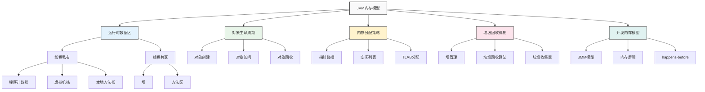

## 1. JVM内存模型基础概念

### 1.1 什么是JVM内存模型？

JVM内存模型是Java虚拟机在运行时管理内存的抽象概念，它定义了Java程序在运行时的内存组织方式和操作规则。JVM内存模型主要包括以下几个核心组成部分：

<Tabs>
<TabItem value="structure" label="内存结构">

**JVM内存结构** 是JVM运行时管理的各个内存区域，包括:

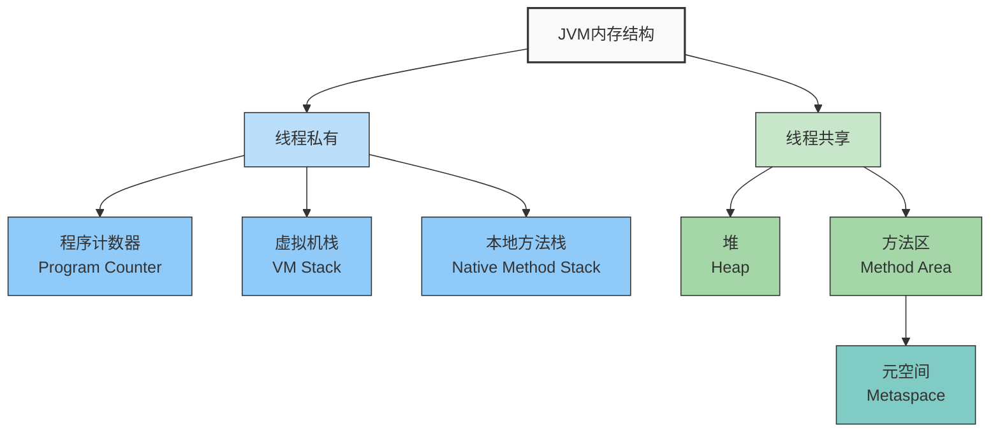

**各区域主要特点**:

| 内存区域 | 线程私有/共享 | 内存溢出异常 | 主要用途 | 垃圾回收 |
|--------|------------|----------|--------|---------|
| **程序计数器** | 线程私有 | 不会 | 字节码指令地址 | 不涉及 |
| **虚拟机栈** | 线程私有 | 会 | 存储栈帧 | 不涉及 |
| **本地方法栈** | 线程私有 | 会 | Native方法 | 不涉及 |
| **堆** | 线程共享 | 会 | 存储对象实例 | 主要区域 |
| **方法区** | 线程共享 | 会 | 类信息、常量池等 | 很少 |

</TabItem>
<TabItem value="jmm" label="并发内存模型">

**JMM (Java Memory Model)** 是Java的并发内存模型，是一种抽象概念，定义了线程如何与内存交互:

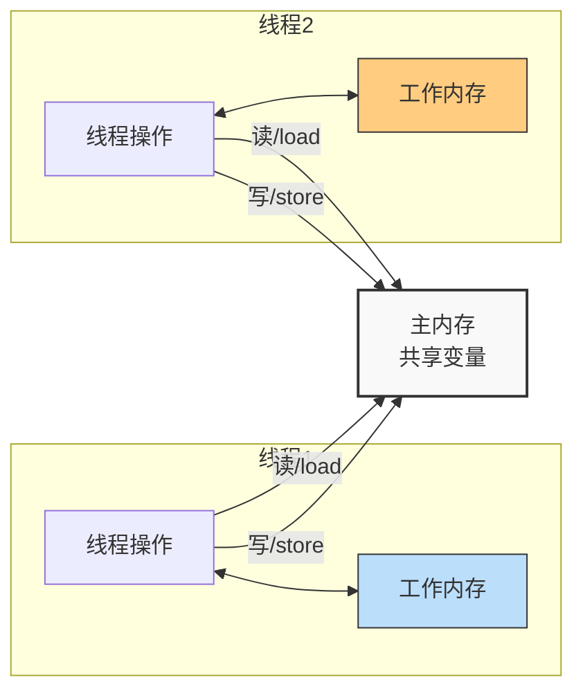

**JMM三大特性**:

1. **原子性 (Atomicity)**
   - 操作不可中断，要么全部执行，要么全不执行
   - 通过synchronized和Lock保证

2. **可见性 (Visibility)**
   - 一个线程修改共享变量，其他线程能立即看到
   - 通过volatile、synchronized和final保证

3. **有序性 (Ordering)**
   - 程序执行顺序按代码顺序执行
   - Java存在指令重排
   - 通过volatile和synchronized禁止指令重排

**happens-before原则**: 
定义了操作间的内存可见性，如果A happens-before B，则A的结果对B可见。

</TabItem>
<TabItem value="lifecycle" label="对象生命周期">

**Java对象的生命周期** 从创建到回收的完整过程:

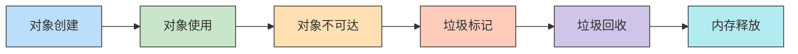

**对象创建过程**:
1. **类加载检查**: 检查类是否已加载
2. **内存分配**: 在堆上分配对象所需内存
3. **内存初始化**: 将分配的内存空间初始化为零值
4. **对象头设置**: 设置对象的元数据信息
5. **执行构造方法**: 执行`<init>`方法

**对象的内存布局**:
- **对象头 (Header)**: 包含Mark Word和类型指针
- **实例数据 (Instance Data)**: 对象的实际数据
- **对齐填充 (Padding)**: 保证对象大小是8字节的倍数

</TabItem>
</Tabs>

- **运行时数据区**：程序运行时使用的内存区域
- **对象生命周期**：从对象创建到垃圾回收的完整过程
- **内存分配策略**：对象在内存中的分配规则和算法
- **垃圾回收机制**：自动内存管理和回收策略
- **并发内存访问**：多线程环境下的内存操作规则

### 1.2 JVM内存模型的重要性

| 重要性 | 具体体现 | 业务价值 |
|--------|----------|----------|
| **性能优化** | 理解内存分配和回收机制 | 提高应用程序性能 |
| **问题诊断** | 快速定位内存相关问题 | 减少系统故障时间 |
| **并发安全** | 保证多线程环境下的数据一致性 | 提高系统稳定性 |
| **资源管理** | 合理配置内存参数 | 优化资源利用率 |

### 1.3 JVM内存模型设计原则

JVM内存模型的设计遵循以下几个核心原则：

#### 自动内存管理原则
提供自动的内存分配和垃圾回收机制，减少程序员的内存管理负担

#### 线程安全原则  
保证多线程环境下的内存操作安全性和数据一致性

#### 性能优化原则
通过合理的内存布局和分配策略提高程序运行效率

#### 平台无关原则
在不同操作系统和硬件平台上提供一致的内存模型

```java title="JVM内存模型核心概念示例"
public class JVMMemoryModelExample {
    
    public static void main(String[] args) {
        // 1. 对象在堆中分配
        Object obj = new Object();  // 在堆中分配内存
        
        // 2. 局部变量在栈中分配
        int localVar = 42;          // 在虚拟机栈中分配
        
        // 3. 静态变量在方法区中分配
        static String staticVar = "static";  // 在方法区中分配
        
        // 4. 数组在堆中分配
        int[] array = new int[1000];  // 在堆中分配连续内存
        
        // 5. 字符串常量在常量池中分配
        String str = "Hello World";   // 在运行时常量池中分配
    }
}
```

## 2. 运行时数据区详解

:::info JVM运行时数据区
JVM运行时数据区是Java程序执行过程中的工作内存空间，由线程私有的部分和线程共享的部分组成。每个区域都有特定的用途和内存管理机制。
:::

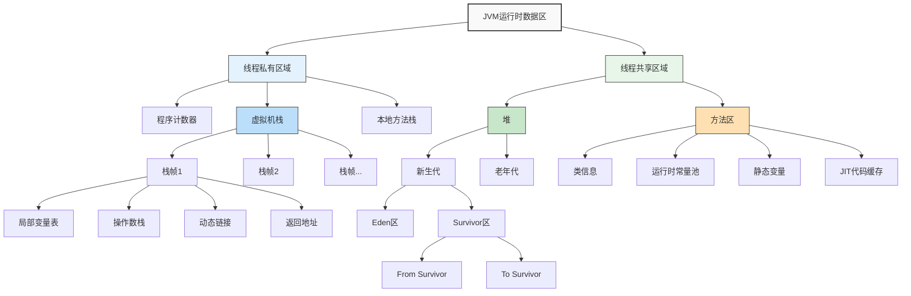

### 2.1 运行时数据区概述

JVM运行时数据区是Java程序运行时的内存空间，分为五个主要部分：程序计数器、Java虚拟机栈、本地方法栈、堆和方法区。其中堆和方法区是所有线程共享的，而程序计数器、虚拟机栈和本地方法栈则是线程私有的。

<Tabs>
<TabItem value="overview" label="区域概览">

| 区域 | 用途 | 创建时间 | 线程私有/共享 | 是否会OOM |
|-----|------|---------|------------|----------|
| **程序计数器** | 记录当前线程执行位置 | 线程创建时 | 线程私有 | 否 |
| **虚拟机栈** | 存储Java方法执行信息 | 线程创建时 | 线程私有 | 是(StackOverflowError/OOM) |
| **本地方法栈** | 存储Native方法信息 | 线程创建时 | 线程私有 | 是(同上) |
| **堆** | 存储对象实例和数组 | JVM启动时 | 线程共享 | 是(OOM) |
| **方法区** | 存储类信息、常量、静态变量等 | JVM启动时 | 线程共享 | 是(OOM) |

```java title="JVM内存模型初始化"
public class JVMMemoryInit {
    static {
        // 方法区初始化（类加载时）
        // 加载类信息、静态变量、常量池等
    }
    
    public static void main(String[] args) {
        // 主线程启动
        // - 程序计数器初始化
        // - 虚拟机栈创建
        // - 本地方法栈创建
        
        // 堆内存中分配对象
        Object obj = new Object();
        
        // 创建新线程，会为该线程创建私有内存区域
        Thread t = new Thread(() -> {
            // 新线程有自己的程序计数器
            // 新线程有自己的虚拟机栈
            // 新线程有自己的本地方法栈
            
            // 共享主线程创建的对象（堆中的对象）
            System.out.println(obj);
        });
        t.start();
    }
}
```

</TabItem>
<TabItem value="stack-structure" label="栈帧结构">

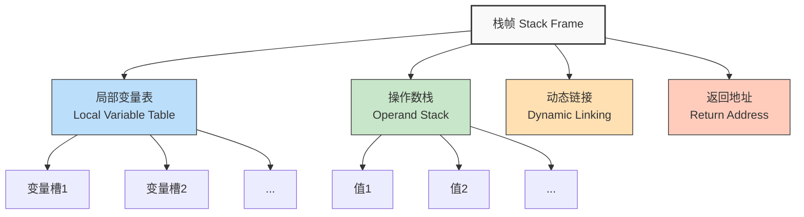

**栈帧执行过程示例**:

```java
public int calculate(int a, int b) {
    int c = a + b;
    return c * 2;
}
```

**执行过程**:

1. **方法调用**:
   - 创建新栈帧并压入虚拟机栈
   - 局部变量表槽0存储this，槽1存储a，槽2存储b

2. **执行a + b**:
   - 将a、b从局部变量表加载到操作数栈
   - 执行加法操作，结果压入操作数栈
   - 将结果存入局部变量表槽3(c)

3. **执行c * 2**:
   - 加载c到操作数栈
   - 将常量2压入操作数栈
   - 执行乘法，结果压入操作数栈

4. **方法返回**:
   - 返回值从操作数栈顶获取
   - 栈帧弹出，方法调用者栈帧成为当前栈帧
   - 程序计数器恢复为方法调用指令的下一条指令

</TabItem>
<TabItem value="heap-structure" label="堆内存结构">

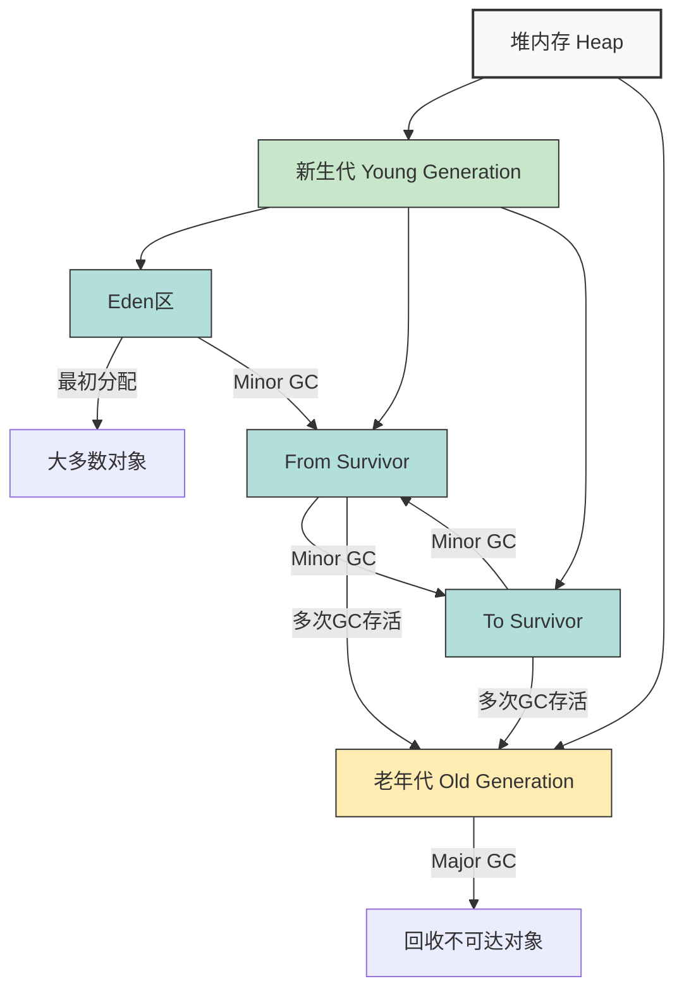

**堆内存特点**:

1. **新生代 (Young Generation)**:
   - **Eden区**: 新对象分配的地方
   - **Survivor区**: 两个相同大小的区域(From和To)，存放经过垃圾回收后存活的对象
   - 大小比例默认为8:1:1 (Eden:From:To)
   - 采用复制算法进行垃圾回收

2. **老年代 (Old Generation)**:
   - 存放长期存活的对象
   - 通常经过多次Minor GC后，对象会从新生代提升到老年代
   - 采用标记-整理或标记-清除算法进行垃圾回收

**特殊情况**:
- **大对象直接进入老年代**: 避免在新生代频繁复制
- **长期存活对象进入老年代**: 默认经过15次Minor GC
- **动态对象年龄判定**: 如果Survivor空间中相同年龄对象总和大于Survivor的一半，则年龄大于等于该年龄的对象进入老年代

</TabItem>
<TabItem value="metaspace" label="元空间">

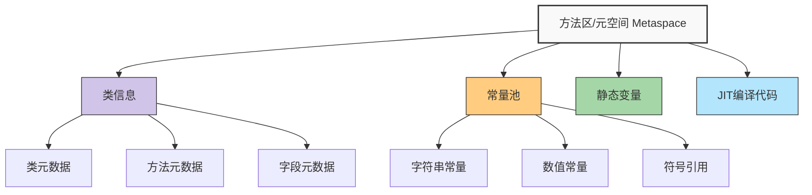

**元空间特点**:

1. **JDK 8之前叫永久代**:
   - JDK 8之前，方法区实现为永久代(PermGen)
   - 永久代有固定大小限制，容易出现OOM
   - 使用JVM堆内存

2. **JDK 8及之后叫元空间**:
   - 元空间使用本地内存，不再有固定大小限制
   - 默认情况下会根据需要动态调整
   - 可通过参数限制大小: `-XX:MetaspaceSize` 和 `-XX:MaxMetaspaceSize`

3. **存储内容**:
   - 类的元数据信息
   - 方法的元数据信息
   - 运行时常量池
   - 静态变量(JDK 7后转移至堆中)
   - JIT编译后的本地代码

**与永久代的比较**:

| 特性 | 永久代 (PermGen) | 元空间 (Metaspace) |
|------|-----------------|-------------------|
| **内存位置** | JVM堆内存 | 本地内存(Native Memory) |
| **内存大小** | 固定大小，受JVM参数限制 | 默认无限制，受系统可用内存限制 |
| **GC行为** | Full GC时会进行回收 | 类卸载时会回收 |
| **OOM风险** | 较高，尤其是动态类生成时 | 较低，但仍可能发生 |
| **字符串常量** | JDK 7之前存储在永久代 | 移至堆内存中的字符串池 |

</TabItem>
</Tabs>

#### 内存区域分类

```java title="运行时数据区分类"
public class RuntimeDataAreas {
    
    // ========== 线程私有区域 ==========
    // 程序计数器：记录当前线程执行的字节码指令地址
    // Java虚拟机栈：存储局部变量、操作数栈、动态链接、方法出口
    // 本地方法栈：为Native方法服务
    
    // ========== 线程共享区域 ==========
    // 堆：存放对象实例和数组，垃圾收集器管理的主要区域
    // 方法区：存储类信息、常量、静态变量、即时编译后的代码
}
```

## 3. 对象创建过程详解

:::info Java对象创建
Java对象的创建是一个复杂的过程，涉及类加载、内存分配、对象初始化等多个步骤。深入理解对象创建过程有助于优化内存使用和提高应用程序性能。
:::

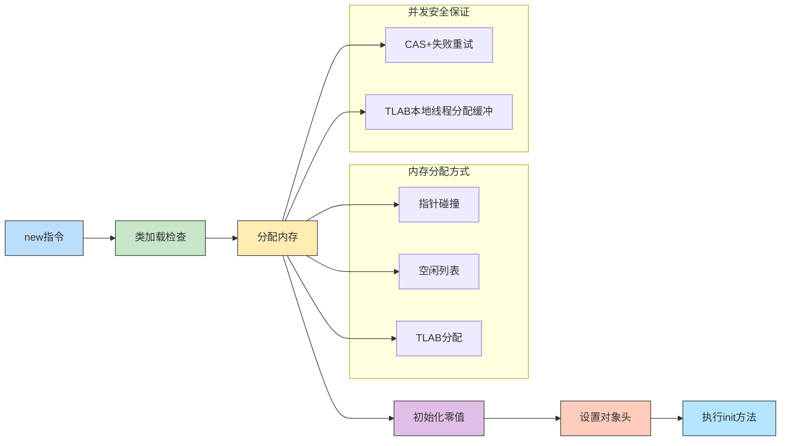

### 3.1 对象创建概述

Java对象的创建过程涉及多个步骤，从类加载到对象初始化，每个步骤都有其特定的作用和意义。

<Tabs>
<TabItem value="creation" label="创建流程">

**完整对象创建流程**:

1. **类加载检查**: 检查类是否已加载，如未加载则触发类加载过程
2. **分配内存**: 在堆上为对象分配所需内存空间
3. **初始化零值**: 将分配的内存空间初始化为零值
4. **设置对象头**: 设置对象的元数据信息，包括类型指针、哈希码、GC分代年龄等
5. **执行初始化**: 执行构造方法`<init>`，初始化对象的字段

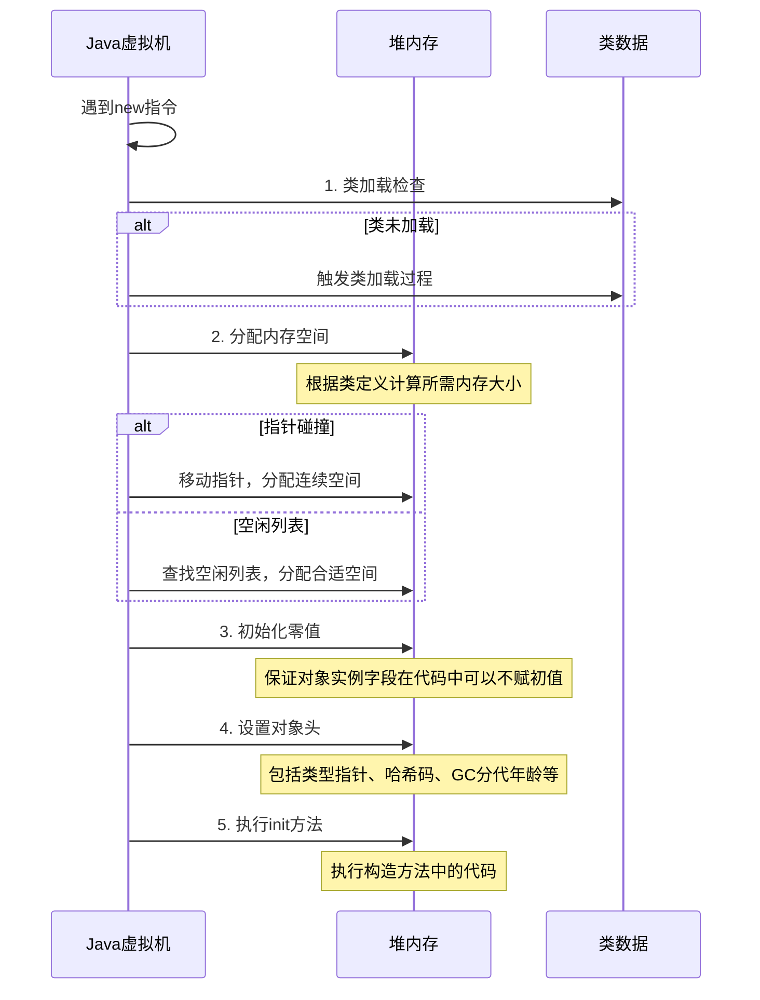

</TabItem>
<TabItem value="memory-allocation" label="内存分配方式">

JVM有三种主要的内存分配方式，选择哪种方式取决于堆内存的具体实现和运行时环境：

**1. 指针碰撞 (Bump the Pointer)**

适用于内存规整的场景，例如使用标记-整理或复制算法的垃圾回收器。

```mermaid
graph LR
    A[已分配区域] --> P((分界指针))
    P --> B[空闲区域]
    P -- 分配对象 --> P2((新指针位置))
    
    style A fill:#f8cecc,stroke:#333,stroke-width:1px
    style B fill:#d5e8d4,stroke:#333,stroke-width:1px
    style P fill:#000000,stroke:#333,stroke-width:2px
    style P2 fill:#000000,stroke:#333,stroke-width:2px
```

**2. 空闲列表 (Free List)**

适用于内存不规整的场景，例如使用标记-清除算法的垃圾回收器。

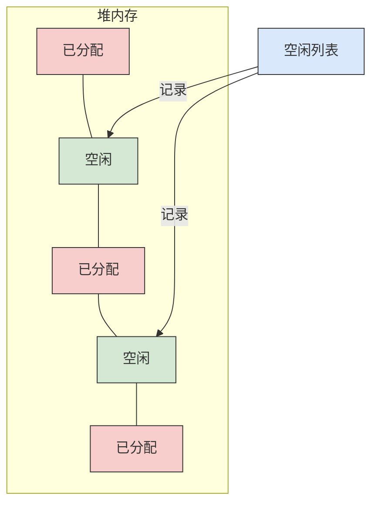

**3. TLAB (Thread Local Allocation Buffer)**

在多线程环境下提高分配效率，为每个线程在Eden区预先分配一小块内存。

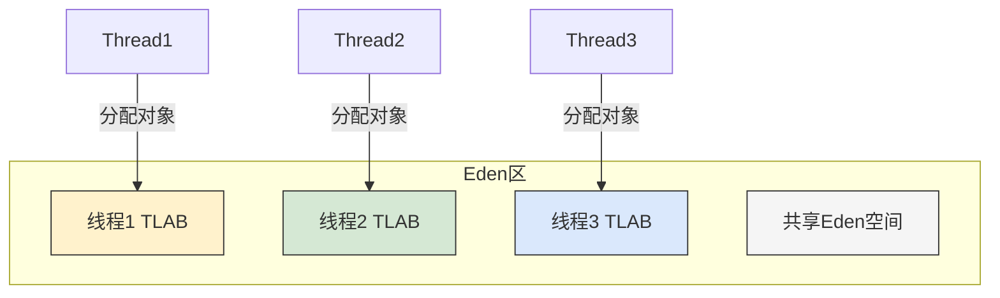

</TabItem>
<TabItem value="object-layout" label="对象内存布局">

Java对象在内存中的布局由三部分组成：**对象头**、**实例数据**和**对齐填充**。

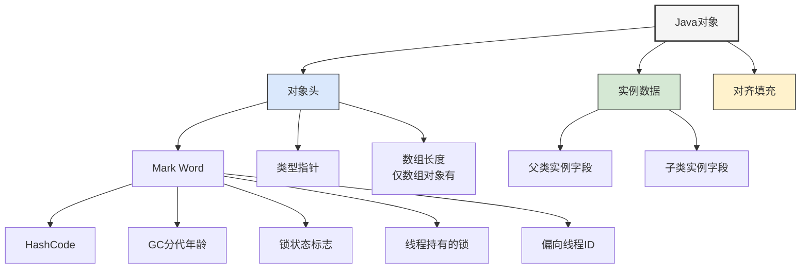

**1. 对象头 (Header)**

- **Mark Word**: 存储对象运行时数据，如哈希码、GC分代年龄、锁状态标志等
- **类型指针**: 指向对象的类元数据，用于确定对象的类型
- **数组长度**: 只有数组对象才有，用于存储数组长度

**Mark Word在不同状态下的内容**:

| 状态 | 存储内容 |
|------|---------|
| 无锁状态 | 对象HashCode、GC分代年龄、是否偏向锁 |
| 偏向锁状态 | 偏向线程ID、偏向时间戳、GC分代年龄、偏向标志 |
| 轻量级锁状态 | 指向栈中锁记录的指针 |
| 重量级锁状态 | 指向互斥量(Monitor)的指针 |
| GC标记状态 | 空，只记录GC信息 |

**2. 实例数据 (Instance Data)**

存储对象的实际数据，包括父类继承下来的和本类定义的字段。

**3. 对齐填充 (Padding)**

仅起占位作用，保证对象大小是8字节的整数倍。

</TabItem>
</Tabs>

### 3.2 类加载检查

当JVM遇到一条`new`指令时，首先检查这个指令的参数是否能在常量池中定位到一个类的符号引用。

```java title="类加载检查示例"
public class ClassLoadingCheckExample {
    
    public static void main(String[] args) {
        // 当执行new指令时，JVM会进行类加载检查
        MyClass obj = new MyClass();
        
        // 如果MyClass类还没有被加载，JVM会：
        // 1. 加载：将类的字节码加载到内存
        // 2. 验证：确保字节码的正确性
        // 3. 准备：为静态变量分配内存并设置初始值
        // 4. 解析：将符号引用转换为直接引用
        // 5. 初始化：执行静态代码块和静态变量赋值
    }
}
```

## 4. 对象引用类型详解

:::info Java引用类型
JDK 1.2后，Java引入了四种引用类型，构成了一种比强引用更加灵活的对象生命周期管理方式，为垃圾回收提供了更多的可控性。
:::

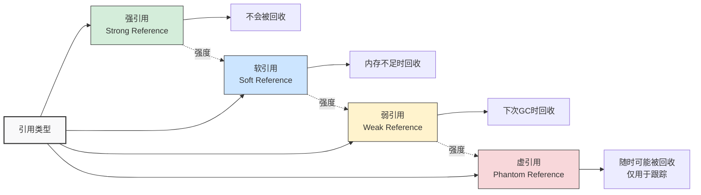

### 4.1 引用类型概述

<Tabs>
<TabItem value="overview" label="引用类型比较">

Java提供了四种引用类型，用于灵活控制对象的生命周期，从强到弱分别是：强引用、软引用、弱引用和虚引用。

| 引用类型 | 回收时机 | 用途 | 需要引用队列 | 典型应用场景 |
|---------|---------|-----|------------|------------|
| **强引用** | 永不回收 | 正常对象引用 | 否 | 常规业务对象 |
| **软引用** | 内存不足时 | 缓存敏感数据 | 可选 | 图片缓存、网页缓存 |
| **弱引用** | 下次GC时 | 缓存临时数据 | 可选 | ThreadLocal、WeakHashMap |
| **虚引用** | 随时可能回收 | 跟踪对象回收 | 必需 | 堆外内存管理、DirectByteBuffer |

```java title="引用类型使用示例"
// 强引用 - 最常见的引用
Object strongRef = new Object();  // 只要强引用存在，对象不会被回收

// 软引用 - 内存不足时回收
SoftReference<Object> softRef = new SoftReference<>(new Object());
Object obj1 = softRef.get();  // 获取引用的对象，可能为null

// 弱引用 - 下次GC时回收
WeakReference<Object> weakRef = new WeakReference<>(new Object());
Object obj2 = weakRef.get();  // 获取引用的对象，可能为null

// 虚引用 - 随时可能回收，必须配合引用队列
ReferenceQueue<Object> queue = new ReferenceQueue<>();
PhantomReference<Object> phantomRef = new PhantomReference<>(new Object(), queue);
// 无法通过phantomRef.get()获取对象，总是返回null
```

</TabItem>
<TabItem value="gc-behavior" label="GC行为">

不同引用类型影响对象的垃圾回收行为：

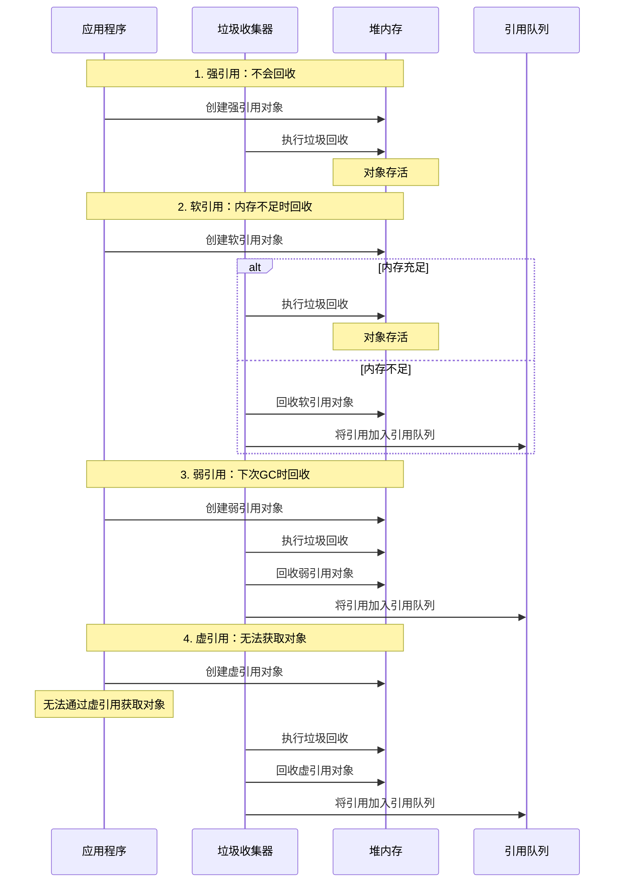

**引用队列(ReferenceQueue)的使用**:

```java
// 创建引用队列
ReferenceQueue<Object> refQueue = new ReferenceQueue<>();

// 创建带引用队列的弱引用
Object obj = new Object();
WeakReference<Object> weakRef = new WeakReference<>(obj, refQueue);

// 使原对象不可达
obj = null;
System.gc(); // 触发垃圾回收

// 弱引用对象进入引用队列
Reference<?> refFromQueue = refQueue.poll();
if (refFromQueue != null) {
    System.out.println("弱引用对象已被GC回收，并进入引用队列");
    System.out.println("引用队列中的对象 == 弱引用? " + (refFromQueue == weakRef));
}
```

</TabItem>
<TabItem value="use-cases" label="应用场景">

**各种引用类型的典型应用场景**:

1. **强引用**:
   - 常规业务对象
   - 不能被垃圾回收器回收的对象

```java
// 典型的强引用
Object obj = new Object();
String str = "Hello";
List<String> list = new ArrayList<>();
```

2. **软引用**:
   - 缓存实现
   - 内存敏感的缓存

```java
// 图片缓存示例
public class ImageCache {
    private final Map<String, SoftReference<Bitmap>> imageCache = new HashMap<>();
    
    public void putImage(String key, Bitmap image) {
        imageCache.put(key, new SoftReference<>(image));
    }
    
    public Bitmap getImage(String key) {
        SoftReference<Bitmap> reference = imageCache.get(key);
        if (reference != null) {
            return reference.get(); // 可能为null，如果已被回收
        }
        return null;
    }
}
```

3. **弱引用**:
   - WeakHashMap
   - ThreadLocal

```java
// WeakHashMap示例 - 键不再被引用时会被自动移除
WeakHashMap<Key, Value> weakMap = new WeakHashMap<>();
Key key = new Key("unique");
weakMap.put(key, new Value("data"));

// 当key不再被引用时
key = null;
System.gc();
// weakMap中对应的条目会被自动移除
```

4. **虚引用**:
   - 跟踪对象被回收的状态
   - 管理堆外内存资源

```java
// DirectByteBuffer使用虚引用来管理堆外内存
public class DirectMemoryTracker {
    private final ReferenceQueue<Object> queue = new ReferenceQueue<>();
    
    public void allocateDirect(int capacity) {
        Object obj = new Object();
        // 创建虚引用，包含清理信息
        PhantomReference<Object> ref = new PhantomReference<>(obj, queue);
        // 分配直接内存
        ByteBuffer buffer = ByteBuffer.allocateDirect(capacity);
    }
    
    public void checkForFreedReferences() {
        Reference<?> ref;
        while ((ref = queue.poll()) != null) {
            // 释放关联的直接内存资源
            // 这里仅作为示例，实际实现更复杂
            System.out.println("清理直接内存");
        }
    }
}
```

</TabItem>
</Tabs>

### 4.2 强引用（Strong Reference）

最常见的引用类型，只要强引用存在，垃圾收集器永远不会回收被引用的对象。

```java title="强引用示例"
public class StrongReferenceExample {
    
    public static void main(String[] args) {
        // 强引用示例
        Object obj = new Object();  // 强引用
        
        // 只要强引用存在，对象就不会被回收
        System.gc();  // 手动触发GC
        System.out.println("Object still exists: " + (obj != null));
        
        // 将引用设为null，对象可以被回收
        obj = null;
        System.gc();
        // 此时对象可以被垃圾收集器回收
    }
}
```

## 5. 内存分配策略详解

### 5.1 内存分配策略概述

JVM在对象内存分配过程中使用了多种策略，以提高分配效率和垃圾收集效率。

#### 分配策略分类

```java title="内存分配策略分类"
public class AllocationStrategyExample {
    
    public static void main(String[] args) {
        // 1. 对象优先在Eden分配
        Object edenObject = new Object();
        
        // 2. 大对象直接进入老年代
        byte[] largeObject = new byte[4 * 1024 * 1024];  // 4MB
        
        // 3. 长期存活的对象进入老年代
        // 通过多次Minor GC实现
        
        // 4. 动态对象年龄判定
        // 由JVM自动判断
        
        // 5. 空间分配担保
        // 由JVM自动处理
    }
}
```

### 5.2 对象优先在Eden分配

大多数情况下，对象优先在新生代的Eden区分配。当Eden区没有足够空间时，JVM将发起一次Minor GC。

```java title="Eden分配示例"
public class EdenAllocationExample {
    
    public static void main(String[] args) {
        // 模拟Eden区分配
        List<Object> objects = new ArrayList<>();
        
        try {
            while (true) {
                // 持续在Eden区分配对象
                objects.add(new Object());
            }
        } catch (OutOfMemoryError e) {
            System.out.println("Eden区已满，触发Minor GC");
        }
    }
    
    // Eden区分配的特点
    public void edenAllocationCharacteristics() {
        // 1. 大多数对象都是朝生夕死的
        for (int i = 0; i < 1000; i++) {
            Object obj = new Object();  // 在Eden区分配
            // 对象很快就不再使用
        }
        
        // 2. 只有少数对象会存活到Survivor区
        Object longLivedObject = new Object();
        // 这个对象可能会存活较长时间
    }
}
```

### 5.3 大对象直接进入老年代

大对象是指需要大量连续内存空间的对象，如长字符串或数组。

```java title="大对象分配示例"
public class LargeObjectAllocationExample {
    
    public static void main(String[] args) {
        // 大对象直接进入老年代
        byte[] largeArray1 = new byte[4 * 1024 * 1024];  // 4MB
        byte[] largeArray2 = new byte[8 * 1024 * 1024];  // 8MB
        
        // 长字符串也是大对象
        StringBuilder sb = new StringBuilder();
        for (int i = 0; i < 100000; i++) {
            sb.append("very long string ");
        }
        String largeString = sb.toString();
        
        // 避免大对象分配的策略
        avoidLargeObjectAllocation();
    }
    
    public static void avoidLargeObjectAllocation() {
        // 1. 使用对象池
        ObjectPool pool = new ObjectPool();
        Object obj1 = pool.borrow();
        // 使用对象
        pool.returnObject(obj1);
        
        // 2. 分块处理大数组
        int[] largeArray = new int[1000000];
        processArrayInChunks(largeArray, 10000);
    }
    
    private static void processArrayInChunks(int[] array, int chunkSize) {
        for (int i = 0; i < array.length; i += chunkSize) {
            int end = Math.min(i + chunkSize, array.length);
            // 处理数组块
            processChunk(array, i, end);
        }
    }
    
    private static void processChunk(int[] array, int start, int end) {
        // 处理数组块的具体逻辑
    }
    
    // 简单的对象池实现
    static class ObjectPool {
        private Queue<Object> pool = new LinkedList<>();
        
        public Object borrow() {
            return pool.poll() != null ? pool.poll() : new Object();
        }
        
        public void returnObject(Object obj) {
            pool.offer(obj);
        }
    }
}
```

### 5.4 长期存活的对象进入老年代

JVM给每个对象定义了一个对象年龄（Age）计数器。

```java title="对象年龄示例"
public class ObjectAgeExample {
    
    public static void main(String[] args) {
        // 创建长期存活的对象
        List<Object> longLivedObjects = new ArrayList<>();
        
        // 模拟多次Minor GC
        for (int i = 0; i < 20; i++) {
            // 创建大量临时对象，触发Minor GC
            createTemporaryObjects();
            
            // 保留一些对象，让它们存活
            if (i % 5 == 0) {
                longLivedObjects.add(new Object());
            }
            
            // 手动触发GC（仅用于演示）
            if (i % 10 == 0) {
                System.gc();
            }
        }
        
        // 此时longLivedObjects中的对象可能已经进入老年代
        System.out.println("Long-lived objects count: " + longLivedObjects.size());
    }
    
    private static void createTemporaryObjects() {
        // 创建大量临时对象
        for (int i = 0; i < 10000; i++) {
            new Object();  // 这些对象很快就会被回收
        }
    }
    
    // 对象年龄的监控
    public static void monitorObjectAge() {
        // 可以通过JVM参数调整对象年龄阈值
        // -XX:MaxTenuringThreshold=15
        
        // 对象年龄的判定
        // 1. 默认阈值：15
        // 2. 动态年龄判定：如果Survivor空间中相同年龄所有对象大小总和大于Survivor空间的一半，
        //    年龄大于或等于该年龄的对象可以直接进入老年代
    }
}
```

### 5.5 动态对象年龄判定

JVM不会永远等到对象年龄达到阈值才晋升老年代。

```java title="动态年龄判定示例"
public class DynamicAgeExample {
    
    public static void main(String[] args) {
        // 创建不同年龄的对象
        List<Object> ageGroups = new ArrayList<>();
        
        // 模拟动态年龄判定
        for (int age = 1; age <= 15; age++) {
            List<Object> objects = new ArrayList<>();
            
            // 为每个年龄创建对象
            for (int i = 0; i < 1000; i++) {
                objects.add(new Object());
            }
            
            // 让对象存活到指定年龄
            surviveToAge(objects, age);
            
            ageGroups.addAll(objects);
        }
        
        // 此时可能会触发动态年龄判定
        System.out.println("Total objects: " + ageGroups.size());
    }
    
    private static void surviveToAge(List<Object> objects, int targetAge) {
        // 模拟对象存活到指定年龄
        // 在实际情况下，这需要通过多次Minor GC实现
        for (int i = 0; i < targetAge; i++) {
            // 创建临时对象触发Minor GC
            createTemporaryObjects();
            
            // 保留指定对象
            objects.retainAll(objects);
        }
    }
    
    private static void createTemporaryObjects() {
        for (int i = 0; i < 5000; i++) {
            new Object();
        }
    }
}
```

### 5.6 空间分配担保

在发生Minor GC之前，JVM会先检查老年代最大可用的连续空间。

```java title="空间分配担保示例"
public class SpaceAllocationGuaranteeExample {
    
    public static void main(String[] args) {
        // 模拟空间分配担保
        try {
            // 创建大量对象，可能导致空间分配担保
            List<Object> objects = new ArrayList<>();
            
            while (true) {
                // 创建大对象，直接进入老年代
                objects.add(new byte[1024 * 1024]);  // 1MB
                
                // 同时创建小对象，在Eden区分配
                for (int i = 0; i < 1000; i++) {
                    new Object();
                }
            }
        } catch (OutOfMemoryError e) {
            System.out.println("空间分配担保失败，触发Full GC");
        }
    }
    
    // 空间分配担保的配置
    public static void configureSpaceAllocationGuarantee() {
        // JVM参数配置
        // -XX:+HandlePromotionFailure：允许担保失败（JDK 6 Update 24后默认开启）
        // -XX:MaxTenuringThreshold：对象年龄阈值
        // -XX:SurvivorRatio：Eden与Survivor的比例
        
        // 担保失败的处理
        // 1. 如果老年代最大可用连续空间大于新生代所有对象总空间，担保成功
        // 2. 如果小于，检查HandlePromotionFailure设置
        // 3. 如果允许担保失败，检查是否大于历次晋升的平均大小
        // 4. 如果仍然失败，改为Full GC
    }
}
``` 

## 6. 实际应用场景

### 6.1 内存优化实践

```java title="内存优化场景示例"
public class MemoryOptimizationExample {
    
    /**
     * 对象池模式应用
     */
    public static void objectPoolApplication() {
        // 使用对象池减少对象创建和GC压力
        ConnectionPool pool = new ConnectionPool(10);
        
        // 获取连接
        Connection conn = pool.getConnection();
        try {
            // 使用连接
            conn.execute("SELECT * FROM users");
        } finally {
            // 归还连接到池中
            pool.returnConnection(conn);
        }
    }
    
    /**
     * 软引用缓存实现
     */
    public static void softReferenceCache() {
        // 使用软引用实现内存敏感的缓存
        SoftReferenceCache<String, byte[]> cache = new SoftReferenceCache<>();
        
        // 缓存大文件数据
        cache.put("large-file-1", loadLargeFile("file1.dat"));
        cache.put("large-file-2", loadLargeFile("file2.dat"));
        
        // 当内存不足时，缓存会自动释放
        byte[] data = cache.get("large-file-1");
        if (data != null) {
            processData(data);
        }
    }
    
    /**
     * 弱引用防止内存泄漏
     */
    public static void weakReferenceMemoryLeak() {
        // 使用WeakHashMap防止内存泄漏
        WeakHashMap<Object, String> weakMap = new WeakHashMap<>();
        
        Object key = new Object();
        weakMap.put(key, "value");
        
        // 当key不再被强引用时，会自动从map中移除
        key = null;
        System.gc();
        
        System.out.println("Map size after GC: " + weakMap.size()); // 0
    }
}

// 连接池实现
class ConnectionPool {
    private final Queue<Connection> pool;
    private final int maxSize;
    
    public ConnectionPool(int maxSize) {
        this.maxSize = maxSize;
        this.pool = new LinkedList<>();
    }
    
    public synchronized Connection getConnection() {
        if (pool.isEmpty()) {
            return new Connection();
        }
        return pool.poll();
    }
    
    public synchronized void returnConnection(Connection conn) {
        if (pool.size() < maxSize) {
            pool.offer(conn);
        }
    }
}

class Connection {
    public void execute(String sql) {
        // 模拟数据库操作
        System.out.println("Executing: " + sql);
    }
}

// 软引用缓存实现
class SoftReferenceCache<K, V> {
    private final Map<K, SoftReference<V>> cache = new HashMap<>();
    
    public void put(K key, V value) {
        cache.put(key, new SoftReference<>(value));
    }
    
    public V get(K key) {
        SoftReference<V> ref = cache.get(key);
        if (ref != null) {
            V value = ref.get();
            if (value == null) {
                cache.remove(key); // 清理已被回收的引用
            }
            return value;
        }
        return null;
    }
}

// 辅助方法
private static byte[] loadLargeFile(String filename) {
    // 模拟加载大文件
    return new byte[1024 * 1024]; // 1MB
}

private static void processData(byte[] data) {
    // 处理数据
    System.out.println("Processing " + data.length + " bytes");
}
```

### 6.2 性能监控和诊断

```java title="性能监控场景示例"
public class PerformanceMonitoringExample {
    
    /**
     * 内存使用监控
     */
    public static void memoryUsageMonitoring() {
        Runtime runtime = Runtime.getRuntime();
        
        // 获取内存信息
        long totalMemory = runtime.totalMemory();
        long freeMemory = runtime.freeMemory();
        long usedMemory = totalMemory - freeMemory;
        long maxMemory = runtime.maxMemory();
        
        System.out.println("Total Memory: " + formatSize(totalMemory));
        System.out.println("Used Memory: " + formatSize(usedMemory));
        System.out.println("Free Memory: " + formatSize(freeMemory));
        System.out.println("Max Memory: " + formatSize(maxMemory));
        
        // 计算内存使用率
        double usagePercent = (double) usedMemory / totalMemory * 100;
        System.out.println("Memory Usage: " + String.format("%.2f%%", usagePercent));
    }
    
    /**
     * GC监控
     */
    public static void gcMonitoring() {
        // 注册GC监听器
        MemoryMXBean memoryBean = ManagementFactory.getMemoryMXBean();
        memoryBean.addNotificationListener(new NotificationListener() {
            @Override
            public void handleNotification(Notification notification, Object handback) {
                if (notification.getType().equals(GarbageCollectionNotificationInfo.GARBAGE_COLLECTION_NOTIFICATION)) {
                    GarbageCollectionNotificationInfo info = GarbageCollectionNotificationInfo.from((CompositeData) notification.getUserData());
                    System.out.println("GC: " + info.getGcName() + 
                                     ", Duration: " + info.getGcInfo().getDuration() + "ms");
                }
            }
        }, null, null);
    }
    
    /**
     * 内存泄漏检测
     */
    public static void memoryLeakDetection() {
        // 使用WeakReference检测内存泄漏
        List<WeakReference<Object>> references = new ArrayList<>();
        
        // 创建对象并保存弱引用
        for (int i = 0; i < 1000; i++) {
            Object obj = new Object();
            references.add(new WeakReference<>(obj));
        }
        
        // 触发GC
        System.gc();
        
        // 检查有多少对象被回收
        int collectedCount = 0;
        for (WeakReference<Object> ref : references) {
            if (ref.get() == null) {
                collectedCount++;
            }
        }
        
        System.out.println("Objects collected: " + collectedCount + "/" + references.size());
    }
    
    private static String formatSize(long bytes) {
        if (bytes < 1024) return bytes + " B";
        if (bytes < 1024 * 1024) return String.format("%.2f KB", bytes / 1024.0);
        if (bytes < 1024 * 1024 * 1024) return String.format("%.2f MB", bytes / (1024.0 * 1024.0));
        return String.format("%.2f GB", bytes / (1024.0 * 1024.0 * 1024.0));
    }
}
```

### 6.3 高并发场景优化

```java title="高并发优化场景示例"
public class HighConcurrencyOptimizationExample {
    
    /**
     * 线程本地分配缓冲区优化
     */
    public static void tlabOptimization() {
        // TLAB优化在高并发场景下的应用
        ExecutorService executor = Executors.newFixedThreadPool(10);
        
        for (int i = 0; i < 100; i++) {
            executor.submit(() -> {
                // 每个线程在自己的TLAB中分配对象
                List<Object> objects = new ArrayList<>();
                for (int j = 0; j < 1000; j++) {
                    objects.add(new Object());
                }
                return objects.size();
            });
        }
        
        executor.shutdown();
    }
    
    /**
     * 对象复用优化
     */
    public static void objectReuseOptimization() {
        // 使用对象复用减少GC压力
        ObjectReusePool<DataObject> pool = new ObjectReusePool<>(100);
        
        ExecutorService executor = Executors.newFixedThreadPool(5);
        for (int i = 0; i < 50; i++) {
            executor.submit(() -> {
                DataObject obj = pool.borrow();
                try {
                    obj.process();
                } finally {
                    pool.returnObject(obj);
                }
            });
        }
        
        executor.shutdown();
    }
    
    /**
     * 内存预分配优化
     */
    public static void memoryPreallocation() {
        // 预分配内存减少动态扩容
        List<String> optimizedList = new ArrayList<>(10000); // 预分配容量
        
        for (int i = 0; i < 10000; i++) {
            optimizedList.add("item" + i);
        }
        
        // 避免频繁扩容
        System.out.println("List size: " + optimizedList.size());
    }
}

// 对象复用池
class ObjectReusePool<T> {
    private final Queue<T> pool;
    private final Supplier<T> factory;
    private final Consumer<T> resetter;
    
    public ObjectReusePool(int size, Supplier<T> factory, Consumer<T> resetter) {
        this.pool = new ConcurrentLinkedQueue<>();
        this.factory = factory;
        this.resetter = resetter;
        
        // 预创建对象
        for (int i = 0; i < size; i++) {
            pool.offer(factory.get());
        }
    }
    
    public T borrow() {
        T obj = pool.poll();
        return obj != null ? obj : factory.get();
    }
    
    public void returnObject(T obj) {
        if (obj != null) {
            resetter.accept(obj);
            pool.offer(obj);
        }
    }
}

// 数据对象
class DataObject {
    private String data;
    
    public void process() {
        // 处理数据
        System.out.println("Processing data: " + data);
    }
    
    public void reset() {
        this.data = null;
    }
}
```

## 7. 最佳实践总结

### 7.1 内存配置优化

:::tip 配置建议
合理配置JVM内存参数是性能优化的基础：
- **堆内存大小**：根据应用特点和硬件资源合理设置
- **新生代比例**：根据对象生命周期特点调整
- **GC算法选择**：根据应用场景选择合适的垃圾收集器
- **监控参数**：开启必要的监控和诊断参数
:::

| 参数类型 | 参数名 | 说明 | 建议值 |
|----------|--------|------|--------|
| **堆内存** | -Xms | 初始堆大小 | 与-Xmx相同 |
| **堆内存** | -Xmx | 最大堆大小 | 物理内存的70-80% |
| **新生代** | -Xmn | 新生代大小 | 堆大小的1/3到1/2 |
| **Survivor** | -XX:SurvivorRatio | Eden与Survivor比例 | 8（Eden:Survivor=8:1） |
| **对象年龄** | -XX:MaxTenuringThreshold | 对象年龄阈值 | 15 |
| **元空间** | -XX:MetaspaceSize | 初始元空间大小 | 256MB |
| **元空间** | -XX:MaxMetaspaceSize | 最大元空间大小 | 根据类数量调整 |

### 7.2 代码层面优化

```java title="代码优化示例"
public class CodeOptimizationExample {
    
    /**
     * 避免内存泄漏
     */
    public static void avoidMemoryLeaks() {
        // 1. 及时释放资源
        try (InputStream is = new FileInputStream("file.txt")) {
            // 使用流
        } catch (IOException e) {
            e.printStackTrace();
        }
        
        // 2. 使用WeakReference避免循环引用
        WeakReference<Object> weakRef = new WeakReference<>(new Object());
        
        // 3. 及时清理集合
        List<Object> list = new ArrayList<>();
        // 使用完毕后清理
        list.clear();
        list = null;
    }
    
    /**
     * 对象创建优化
     */
    public static void objectCreationOptimization() {
        // 1. 使用对象池
        ObjectPool pool = new ObjectPool();
        Object obj = pool.borrow();
        try {
            // 使用对象
        } finally {
            pool.returnObject(obj);
        }
        
        // 2. 预分配容量
        List<String> list = new ArrayList<>(1000);
        
        // 3. 使用基本类型而非包装类型
        int primitive = 42;  // 推荐
        Integer wrapper = 42; // 不推荐（除非需要null值）
    }
    
    /**
     * 字符串优化
     */
    public static void stringOptimization() {
        // 1. 使用StringBuilder进行字符串拼接
        StringBuilder sb = new StringBuilder();
        for (int i = 0; i < 1000; i++) {
            sb.append("item").append(i);
        }
        String result = sb.toString();
        
        // 2. 使用字符串常量池
        String s1 = "hello";  // 使用常量池
        String s2 = new String("hello");  // 创建新对象
        
        // 3. 使用intern()方法
        String s3 = new String("world").intern();
    }
}

// 简单对象池
class ObjectPool {
    private final Queue<Object> pool = new LinkedList<>();
    
    public Object borrow() {
        return pool.poll() != null ? pool.poll() : new Object();
    }
    
    public void returnObject(Object obj) {
        pool.offer(obj);
    }
}
```

### 7.3 常见陷阱和解决方案

:::caution 注意事项
1. **内存泄漏**：未及时释放资源或存在循环引用
2. **过度优化**：过早优化可能导致代码复杂化
3. **参数配置不当**：不合理的JVM参数可能导致性能下降
4. **监控不足**：缺乏必要的监控和诊断工具
:::

```java title="常见陷阱示例"
public class CommonTrapsExample {
    
    /**
     * 内存泄漏陷阱
     */
    public static void memoryLeakTraps() {
        // 陷阱1：静态集合导致的内存泄漏
        static List<Object> staticList = new ArrayList<>();
        
        // 陷阱2：监听器未正确移除
        EventSource source = new EventSource();
        EventListener listener = new EventListener();
        source.addListener(listener);
        // 忘记移除监听器
        
        // 陷阱3：ThreadLocal使用不当
        ThreadLocal<Object> threadLocal = new ThreadLocal<>();
        threadLocal.set(new Object());
        // 忘记调用threadLocal.remove()
    }
    
    /**
     * 性能陷阱
     */
    public static void performanceTraps() {
        // 陷阱1：频繁创建大对象
        for (int i = 0; i < 10000; i++) {
            byte[] largeArray = new byte[1024 * 1024];  // 1MB
        }
        
        // 陷阱2：字符串拼接效率低
        String result = "";
        for (int i = 0; i < 1000; i++) {
            result += "item" + i;  // 每次都会创建新对象
        }
        
        // 陷阱3：集合使用不当
        List<String> list = new LinkedList<>();
        for (int i = 0; i < 10000; i++) {
            list.get(i);  // LinkedList的随机访问很慢
        }
    }
    
    /**
     * 解决方案
     */
    public static void solutions() {
        // 解决方案1：使用WeakReference
        WeakReference<Object> weakRef = new WeakReference<>(new Object());
        
        // 解决方案2：正确使用ThreadLocal
        ThreadLocal<Object> threadLocal = new ThreadLocal<>();
        try {
            threadLocal.set(new Object());
            // 使用ThreadLocal
        } finally {
            threadLocal.remove();  // 确保清理
        }
        
        // 解决方案3：使用StringBuilder
        StringBuilder sb = new StringBuilder();
        for (int i = 0; i < 1000; i++) {
            sb.append("item").append(i);
        }
        String result = sb.toString();
        
        // 解决方案4：选择合适的集合
        List<String> list = new ArrayList<>();  // 随机访问快
        for (int i = 0; i < 10000; i++) {
            list.get(i);  // ArrayList的随机访问很快
        }
    }
}

// 事件源和监听器示例
class EventSource {
    private List<EventListener> listeners = new ArrayList<>();
    
    public void addListener(EventListener listener) {
        listeners.add(listener);
    }
    
    public void removeListener(EventListener listener) {
        listeners.remove(listener);
    }
}

class EventListener {
    // 监听器实现
}
```

### 7.4 监控和诊断建议

```java title="监控诊断示例"
public class MonitoringDiagnosticExample {
    
    /**
     * JVM监控
     */
    public static void jvmMonitoring() {
        // 获取内存使用情况
        MemoryMXBean memoryBean = ManagementFactory.getMemoryMXBean();
        MemoryUsage heapUsage = memoryBean.getHeapMemoryUsage();
        
        System.out.println("Heap Memory Usage:");
        System.out.println("  Used: " + formatSize(heapUsage.getUsed()));
        System.out.println("  Committed: " + formatSize(heapUsage.getCommitted()));
        System.out.println("  Max: " + formatSize(heapUsage.getMax()));
        
        // 获取GC信息
        List<GarbageCollectorMXBean> gcBeans = ManagementFactory.getGarbageCollectorMXBeans();
        for (GarbageCollectorMXBean gcBean : gcBeans) {
            System.out.println("GC: " + gcBean.getName() + 
                             ", Count: " + gcBean.getCollectionCount() +
                             ", Time: " + gcBean.getCollectionTime() + "ms");
        }
    }
    
    /**
     * 内存泄漏检测
     */
    public static void memoryLeakDetection() {
        // 使用JProfiler或MAT等工具进行内存分析
        // 这里提供一些基本的检测方法
        
        // 1. 监控对象数量
        long objectCount = getObjectCount();
        System.out.println("Current object count: " + objectCount);
        
        // 2. 监控内存使用趋势
        long usedMemory = Runtime.getRuntime().totalMemory() - Runtime.getRuntime().freeMemory();
        System.out.println("Used memory: " + formatSize(usedMemory));
        
        // 3. 强制GC后检查内存
        System.gc();
        long afterGcMemory = Runtime.getRuntime().totalMemory() - Runtime.getRuntime().freeMemory();
        System.out.println("Memory after GC: " + formatSize(afterGcMemory));
    }
    
    private static long getObjectCount() {
        // 这里应该使用JMX或其他方式获取实际的对象数量
        // 简化实现
        return 0;
    }
    
    private static String formatSize(long bytes) {
        if (bytes < 1024) return bytes + " B";
        if (bytes < 1024 * 1024) return String.format("%.2f KB", bytes / 1024.0);
        return String.format("%.2f MB", bytes / (1024.0 * 1024.0));
    }
}
```

## 8. 总结

JVM内存模型是Java程序运行的基础架构，它定义了Java程序如何与计算机内存交互，并在并发环境下保证内存操作的可见性、原子性和有序性。通过深入理解JVM内存模型的各个组成部分，我们可以：

- **优化程序性能**：合理使用内存分配策略和垃圾回收机制
- **诊断内存问题**：快速定位内存泄漏、栈溢出等问题
- **提高系统稳定性**：在多线程环境下正确处理共享数据
- **优化资源利用**：合理配置JVM参数，提高资源利用率

在实际开发中，需要综合考虑以下几个方面：
- **内存配置**：根据应用特点合理配置JVM参数
- **代码优化**：遵循最佳实践，避免常见陷阱
- **监控诊断**：建立完善的监控和诊断体系
- **性能测试**：通过压力测试验证系统性能

通过合理使用JVM内存模型，我们可以构建出高效、稳定、可靠的Java应用程序。

## 9. 面试题精选

### 9.1 基础概念题

**Q: JVM内存区域是如何划分的？每个区域的作用是什么？**

A: JVM内存区域主要分为以下几个部分：

1. **程序计数器**：线程私有，记录当前线程执行的字节码指令地址，是唯一不会发生OutOfMemoryError的区域
2. **Java虚拟机栈**：线程私有，存储局部变量表、操作数栈、动态链接和方法出口等信息，可能发生StackOverflowError和OutOfMemoryError
3. **本地方法栈**：线程私有，为Native方法服务，具体实现由JVM厂商决定
4. **堆**：线程共享，存放对象实例和数组，是垃圾收集器管理的主要区域，可能发生OutOfMemoryError
5. **方法区**：线程共享，存储已加载的类信息、常量、静态变量等，在JDK8之前称为永久代，JDK8后称为元空间并使用本地内存

**Q: Java对象的创建过程是怎样的？**

A: Java对象的创建过程包括以下步骤：

1. **类加载检查**：检查类是否已加载、解析和初始化
2. **分配内存**：根据对象大小在堆中分配内存，方式有指针碰撞和空闲列表两种
3. **解决并发安全问题**：通过CAS+失败重试或TLAB（线程本地分配缓冲区）保证线程安全
4. **初始化零值**：将分配的内存空间初始化为零值
5. **设置对象头**：包括存储对象的类型指针、哈希码、GC分代年龄等信息
6. **执行init方法**：调用对象的构造方法，完成对象的初始化

### 9.2 内存分配题

**Q: 什么是TLAB？它解决了什么问题？**

A: TLAB（Thread Local Allocation Buffer，线程本地分配缓冲区）是JVM在堆中为每个线程预先分配的一小块内存。

- **解决问题**：主要解决多线程环境下内存分配的线程安全问题。如果没有TLAB，多个线程同时分配内存时需要同步操作，会导致性能下降。
- **工作原理**：每个线程在堆中拥有自己的TLAB，线程首先尝试在自己的TLAB中分配对象，只有当TLAB空间不足时，才会通过加锁机制在堆的公共部分分配。
- **优势**：大多数对象分配都可以在TLAB中完成，避免了同步操作，提高了分配效率。

**Q: 对象在内存中的分配策略有哪些？**

A: 对象在内存中的分配策略：

1. **对象优先在Eden区分配**：新创建的对象首先分配在Eden区。当Eden区满时，触发Minor GC，将存活对象移到Survivor区。
2. **大对象直接进入老年代**：需要大量连续内存空间的对象（如长数组）会直接分配到老年代，避免在Eden和Survivor区频繁复制造成的效率问题。
3. **长期存活的对象进入老年代**：对象在Survivor区每熬过一次Minor GC，年龄加1，当达到阈值（默认15）时，晋升到老年代。
4. **动态对象年龄判定**：如果在Survivor空间中相同年龄所有对象大小总和大于Survivor空间一半，年龄大于或等于该年龄的对象可以直接进入老年代。
5. **空间分配担保**：Minor GC前，检查老年代最大可用连续空间是否大于新生代所有对象总空间或历次晋升的平均大小，以确定是否需要提前触发Full GC。

### 9.3 引用类型题

**Q: Java中的四种引用类型及其应用场景是什么？**

A: Java中的四种引用类型及其应用场景：

1. **强引用（Strong Reference）**：
   - 特点：只要强引用存在，对象就不会被回收
   - 应用场景：常规对象引用，大部分业务逻辑中使用

2. **软引用（Soft Reference）**：
   - 特点：内存不足时才会被回收
   - 应用场景：缓存实现，如图片缓存、网页缓存等，当内存不足时可以释放

3. **弱引用（Weak Reference）**：
   - 特点：下一次GC时无论内存是否充足都会回收
   - 应用场景：WeakHashMap实现，ThreadLocal中的Entry，避免内存泄漏

4. **虚引用（Phantom Reference）**：
   - 特点：不影响对象生命周期，必须与ReferenceQueue配合使用
   - 应用场景：跟踪对象被垃圾回收的状态，如NIO中的DirectByteBuffer对象回收

### 9.4 性能优化题

**Q: 如何优化JVM内存使用？**

A: JVM内存优化策略：

1. **合理配置JVM参数**：
   - 设置合适的堆大小（-Xms、-Xmx）
   - 调整新生代比例（-Xmn）
   - 配置Survivor比例（-XX:SurvivorRatio）

2. **代码层面优化**：
   - 使用对象池减少对象创建
   - 及时释放资源，避免内存泄漏
   - 使用StringBuilder进行字符串拼接
   - 预分配集合容量

3. **选择合适的垃圾收集器**：
   - 根据应用特点选择Serial、Parallel、CMS、G1等收集器
   - 调整收集器参数优化性能

4. **监控和诊断**：
   - 使用JProfiler、MAT等工具分析内存使用
   - 监控GC日志，分析GC性能
   - 定期进行内存泄漏检测

**Q: 什么情况下会发生内存溢出？如何避免？**

A: 内存溢出的情况及避免方法：

**堆内存溢出（OutOfMemoryError: Java heap space）**：
- **发生原因**：
  1. 创建了大量对象且无法被GC回收
  2. 内存泄漏（对象不再使用但仍被引用）
  3. 单个对象过大
- **避免方法**：
  1. 增加堆内存大小（使用-Xmx参数）
  2. 检查并修复内存泄漏（使用工具如JProfiler, MAT）
  3. 优化对象使用，及时释放不用的对象引用
  4. 使用内存池复用对象，减少对象创建

**栈溢出（StackOverflowError）**：
- **发生原因**：
  1. 方法递归调用层次过深
  2. 方法内部大量创建局部变量
- **避免方法**：
  1. 优化递归算法，使用迭代替代递归
  2. 增加栈内存大小（使用-Xss参数）
  3. 控制递归深度，在可能发生溢出前返回

### 9.5 实践应用题

**Q: 如何诊断和解决内存泄漏问题？**

A: 内存泄漏的诊断和解决方法：

**诊断方法**：
1. **监控内存使用趋势**：观察内存使用是否持续增长
2. **分析GC日志**：查看GC频率和内存回收情况
3. **使用内存分析工具**：JProfiler、MAT、VisualVM等
4. **堆转储分析**：生成堆转储文件，分析对象引用关系

**常见内存泄漏原因**：
1. **静态集合**：静态集合持有对象引用，导致对象无法被回收
2. **监听器未移除**：注册了监听器但忘记移除
3. **ThreadLocal使用不当**：没有调用remove()方法
4. **数据库连接未关闭**：数据库连接池配置不当
5. **内部类持有外部类引用**：匿名内部类持有外部类引用

**解决方法**：
1. **及时释放资源**：使用try-with-resources语句
2. **使用弱引用**：WeakHashMap、WeakReference等
3. **正确使用ThreadLocal**：在finally块中调用remove()
4. **避免循环引用**：使用弱引用或及时置null
5. **定期清理缓存**：使用软引用或设置过期时间

**Q: 在高并发场景下如何优化JVM内存使用？**

A: 高并发场景下的JVM内存优化：

1. **TLAB优化**：
   - 确保TLAB大小合适（-XX:TLABSize）
   - 监控TLAB分配效率

2. **对象池模式**：
   - 复用频繁创建的对象
   - 减少GC压力和内存分配开销

3. **内存预分配**：
   - 预分配集合容量，避免动态扩容
   - 使用对象数组而非集合（如果可能）

4. **选择合适的垃圾收集器**：
   - 低延迟场景：G1、ZGC、Shenandoah
   - 高吞吐量场景：ParallelGC
   - 混合场景：CMS

5. **监控和调优**：
   - 监控GC停顿时间
   - 分析内存分配热点
   - 优化对象生命周期

:::tip 面试要点
1. **理解内存模型**：掌握JVM内存区域的划分和作用
2. **对象生命周期**：理解对象创建、使用、回收的完整过程
3. **内存分配策略**：掌握各种分配策略的适用场景
4. **引用类型**：理解四种引用类型的特点和应用
5. **性能优化**：掌握内存优化的方法和工具
6. **问题诊断**：能够诊断和解决常见的内存问题
:::

---

通过本章的学习，你应该已经掌握了JVM内存模型的核心概念、实现原理和最佳实践。JVM内存模型是Java程序运行的基础，深入理解其特性和使用场景，对于编写高效、稳定的Java程序至关重要。特别是在处理高并发、大数据量的应用时，对内存模型的深入理解能够帮助我们避免内存泄漏、栈溢出和内存不足等常见问题。 