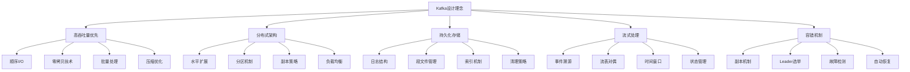
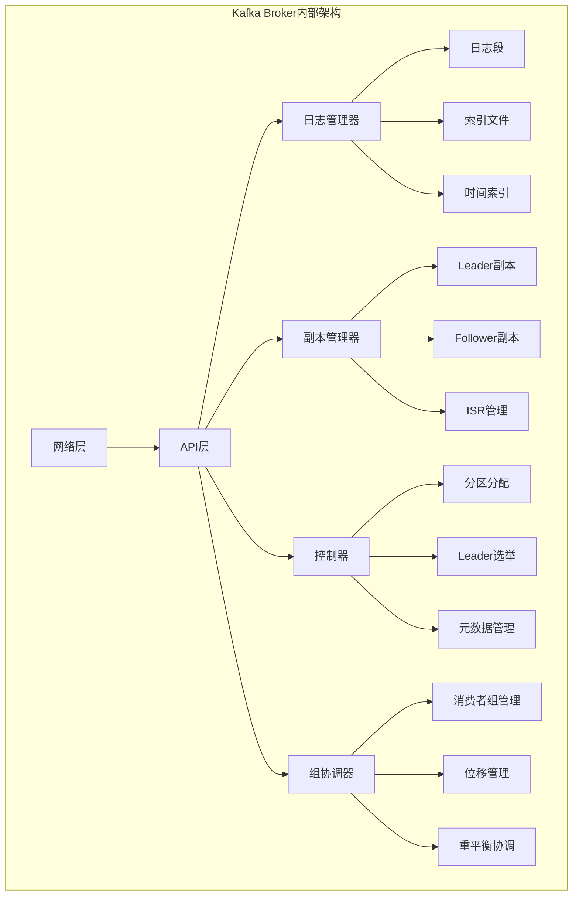
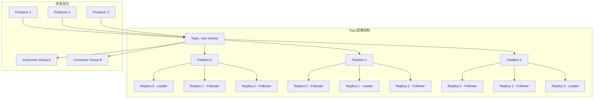
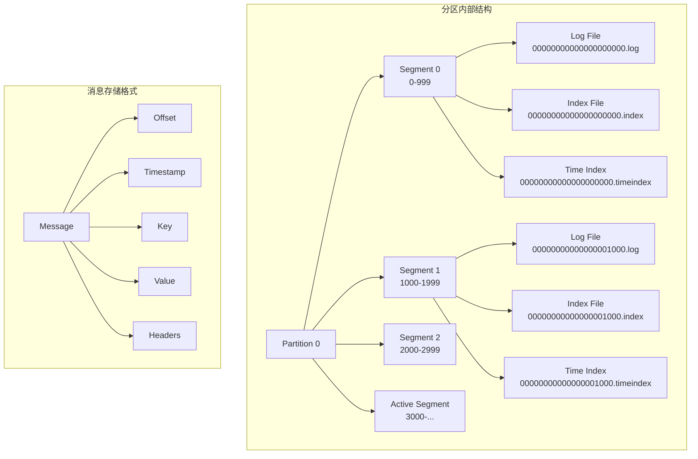
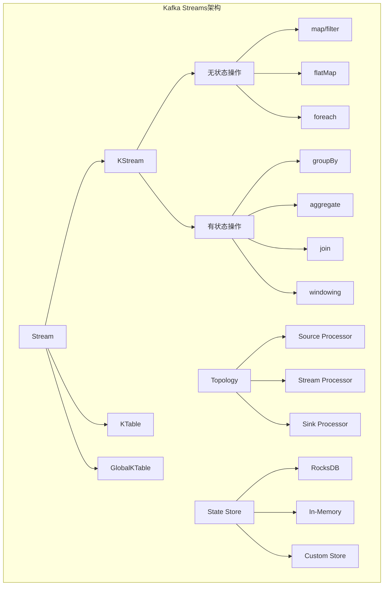
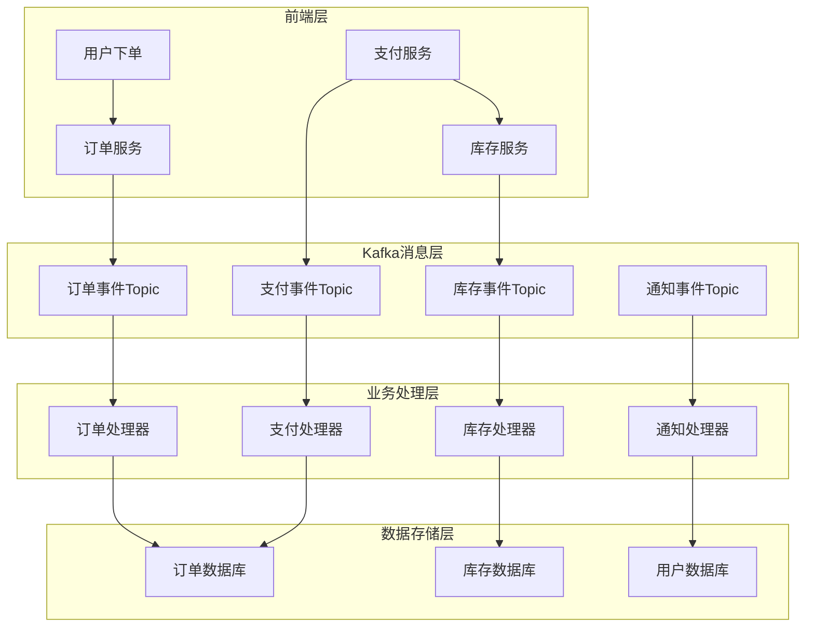

import Tabs from '@theme/Tabs';
import TabItem from '@theme/TabItem';
import CodeBlock from '@theme/CodeBlock';

# Apache Kafka分布式流处理平台详解

Apache Kafka是一个开源的分布式事件流处理平台，由LinkedIn开发并贡献给Apache软件基金会。Kafka以其高吞吐量、低延迟、高可靠性和水平扩展能力著称，已成为现代数据架构中不可或缺的核心组件，广泛应用于实时数据管道、流处理应用、事件驱动架构等场景。

:::tip 核心价值
**Kafka = 高吞吐量流处理 + 分布式持久化 + 实时数据管道 + 事件驱动架构**
- 🚀 **极致性能**：单机百万级TPS，集群可达千万级消息处理能力
- 📊 **流式架构**：统一的流处理和批处理平台，支持实时和历史数据分析
- � **持持久化存储**：消息持久化到磁盘，支持数据回溯和重放
- 🌐 **分布式设计**：天然支持水平扩展和高可用架构
- � **生态完整***：丰富的连接器、流处理框架和监控工具
:::

## 1. Kafka基础架构与设计理念

### 1.1 Kafka核心设计哲学

Kafka的设计遵循以下核心理念，这些理念决定了其在大数据和实时处理领域的独特地位：



#### 设计原则详解

**1. 高性能优先原则**
- **顺序I/O**：利用磁盘顺序读写的高性能特性
- **零拷贝**：减少数据在内核态和用户态之间的拷贝
- **批量操作**：通过批处理提高吞吐量
- **页缓存**：充分利用操作系统的页缓存机制

**2. 分布式架构原则**
- **无状态设计**：Broker节点无状态，便于扩展
- **分区并行**：通过分区实现并行处理
- **副本冗余**：多副本保证数据安全
- **弹性扩展**：支持动态添加节点

**3. 持久化存储原则**
- **日志结构**：采用只追加的日志结构
- **分段存储**：将日志分段存储，便于管理
- **压缩存储**：支持多种压缩算法
- **清理策略**：支持基于时间和大小的清理

### 1.2 Kafka应用场景全景图

| 应用场景 | 传统解决方案 | Kafka解决方案 | 核心优势 | 适用规模 |
|---------|-------------|---------------|----------|---------|
| **实时数据管道** | ETL工具 + 数据库 | Kafka Connect + Streams | 实时性、可扩展性 | 大规模数据流 |
| **事件驱动架构** | 消息队列 + 事件总线 | Kafka + Schema Registry | 解耦、可追溯 | 微服务架构 |
| **日志聚合** | 文件系统 + 日志收集器 | Kafka + ELK Stack | 统一收集、实时分析 | 分布式系统 |
| **流处理** | Storm/Spark Streaming | Kafka Streams | 简化架构、低延迟 | 实时计算场景 |
| **指标监控** | 时序数据库 | Kafka + InfluxDB | 高吞吐、实时告警 | 监控系统 |
| **CQRS/事件溯源** | 数据库 + 事件表 | Kafka + 快照存储 | 高性能、易扩展 | 复杂业务系统 |
## 
2. Kafka核心组件深度解析

### 2.1 Broker（代理服务器）- 集群的基石

Broker是Kafka集群中的核心服务节点，每个Broker都是一个独立的Kafka服务器实例，负责存储数据、处理客户端请求和参与集群协调。

<Tabs>
<TabItem value="architecture" label="Broker架构">



</TabItem>
<TabItem value="config" label="Broker配置详解">

```bash title="server.properties - Broker核心配置"
############################# 基础配置 #############################
# Broker在集群中的唯一标识，必须为正整数且集群内唯一
broker.id=0

# Broker监听的网络接口和端口配置
# PLAINTEXT: 明文传输协议
# SSL: 加密传输协议  
# SASL_PLAINTEXT: SASL认证 + 明文传输
# SASL_SSL: SASL认证 + 加密传输
listeners=PLAINTEXT://localhost:9092

# 外部客户端连接的地址，用于客户端发现
advertised.listeners=PLAINTEXT://localhost:9092

# 网络线程数，处理网络请求
# 建议设置为CPU核数，高并发场景可适当增加
num.network.threads=8

# I/O线程数，处理磁盘读写
# 建议设置为磁盘数量的2-3倍
num.io.threads=16

# Socket发送缓冲区大小（字节）
socket.send.buffer.bytes=102400

# Socket接收缓冲区大小（字节）
socket.receive.buffer.bytes=102400

# 单个请求的最大大小（字节）
socket.request.max.bytes=104857600

############################# 日志配置 #############################
# 日志文件存储目录，支持多个目录以逗号分隔
# 多目录可以分散I/O负载，提高性能
log.dirs=/var/kafka-logs-1,/var/kafka-logs-2,/var/kafka-logs-3

# 每个Topic的默认分区数
num.partitions=3

# 日志保留时间（小时），默认7天
log.retention.hours=168

# 日志段文件大小（字节），默认1GB
log.segment.bytes=1073741824

# 日志段滚动时间间隔（毫秒），默认7天
log.roll.hours=168

# 日志清理检查间隔（毫秒）
log.retention.check.interval.ms=300000

############################# 副本配置 #############################
# 默认副本因子，建议设置为3
default.replication.factor=3

# 最小同步副本数，建议设置为副本因子-1
min.insync.replicas=2

# 副本拉取等待时间（毫秒）
replica.fetch.wait.max.ms=500

# 副本拉取最大字节数
replica.fetch.max.bytes=1048576

############################# ZooKeeper配置 #############################
# ZooKeeper连接字符串
zookeeper.connect=localhost:2181

# ZooKeeper连接超时时间（毫秒）
zookeeper.connection.timeout.ms=18000

# ZooKeeper会话超时时间（毫秒）
zookeeper.session.timeout.ms=18000

############################# 性能优化配置 #############################
# 消息最大大小（字节）
message.max.bytes=1000000

# 副本拉取消息最大大小（字节）
replica.fetch.max.bytes=1048576

# 生产者请求队列最大大小
queued.max.requests=500

# 自动创建Topic开关，生产环境建议关闭
auto.create.topics.enable=false

# 删除Topic开关
delete.topic.enable=true

# 压缩类型：none, gzip, snappy, lz4, zstd
compression.type=lz4

# 日志刷盘策略
log.flush.interval.messages=10000
log.flush.interval.ms=1000

# 后台线程数
background.threads=10
```

</TabItem>
<TabItem value="monitoring" label="Broker监控">

```java title="Broker状态监控实现"
import org.apache.kafka.clients.admin.*;
import org.apache.kafka.common.Node;
import java.util.*;
import java.util.concurrent.ExecutionException;

/**
 * Kafka Broker监控工具类
 * 提供集群状态、节点信息、性能指标等监控功能
 */
public class KafkaBrokerMonitor {
    
    private final AdminClient adminClient;
    
    public KafkaBrokerMonitor(String bootstrapServers) {
        Properties props = new Properties();
        props.put(AdminClientConfig.BOOTSTRAP_SERVERS_CONFIG, bootstrapServers);
        props.put(AdminClientConfig.REQUEST_TIMEOUT_MS_CONFIG, 30000);
        props.put(AdminClientConfig.DEFAULT_API_TIMEOUT_MS_CONFIG, 60000);
        this.adminClient = AdminClient.create(props);
    }
    
    /**
     * 获取集群基本信息
     */
    public ClusterInfo getClusterInfo() {
        try {
            DescribeClusterResult clusterResult = adminClient.describeCluster();
            
            // 获取集群ID
            String clusterId = clusterResult.clusterId().get();
            
            // 获取Controller节点
            Node controller = clusterResult.controller().get();
            
            // 获取所有节点
            Collection<Node> nodes = clusterResult.nodes().get();
            
            return new ClusterInfo(clusterId, controller, nodes);
            
        } catch (InterruptedException | ExecutionException e) {
            throw new RuntimeException("获取集群信息失败", e);
        }
    }
    
    /**
     * 检查Broker健康状态
     */
    public Map<Integer, BrokerHealth> checkBrokerHealth() {
        Map<Integer, BrokerHealth> healthMap = new HashMap<>();
        
        try {
            ClusterInfo clusterInfo = getClusterInfo();
            
            for (Node node : clusterInfo.getNodes()) {
                BrokerHealth health = new BrokerHealth();
                health.setBrokerId(node.id());
                health.setHost(node.host());
                health.setPort(node.port());
                health.setIsController(node.id() == clusterInfo.getController().id());
                
                // 检查节点是否在线
                health.setOnline(isNodeOnline(node));
                
                // 获取节点负载信息
                health.setPartitionCount(getPartitionCount(node.id()));
                health.setLeaderCount(getLeaderCount(node.id()));
                
                healthMap.put(node.id(), health);
            }
            
        } catch (Exception e) {
            System.err.println("检查Broker健康状态失败: " + e.getMessage());
        }
        
        return healthMap;
    }
    
    /**
     * 检查节点是否在线
     */
    private boolean isNodeOnline(Node node) {
        try {
            // 通过描述集群来检查节点是否响应
            DescribeClusterOptions options = new DescribeClusterOptions()
                .timeoutMs(5000);
            adminClient.describeCluster(options).nodes().get();
            return true;
        } catch (Exception e) {
            return false;
        }
    }
    
    /**
     * 获取指定Broker的分区数量
     */
    private int getPartitionCount(int brokerId) {
        try {
            ListTopicsResult topicsResult = adminClient.listTopics();
            Set<String> topicNames = topicsResult.names().get();
            
            DescribeTopicsResult describeResult = adminClient.describeTopics(topicNames);
            Map<String, TopicDescription> topicDescriptions = describeResult.all().get();
            
            int partitionCount = 0;
            for (TopicDescription description : topicDescriptions.values()) {
                for (TopicPartitionInfo partition : description.partitions()) {
                    // 检查该分区的副本是否在指定Broker上
                    for (Node replica : partition.replicas()) {
                        if (replica.id() == brokerId) {
                            partitionCount++;
                            break;
                        }
                    }
                }
            }
            
            return partitionCount;
        } catch (Exception e) {
            return -1;
        }
    }
    
    /**
     * 获取指定Broker作为Leader的分区数量
     */
    private int getLeaderCount(int brokerId) {
        try {
            ListTopicsResult topicsResult = adminClient.listTopics();
            Set<String> topicNames = topicsResult.names().get();
            
            DescribeTopicsResult describeResult = adminClient.describeTopics(topicNames);
            Map<String, TopicDescription> topicDescriptions = describeResult.all().get();
            
            int leaderCount = 0;
            for (TopicDescription description : topicDescriptions.values()) {
                for (TopicPartitionInfo partition : description.partitions()) {
                    if (partition.leader() != null && partition.leader().id() == brokerId) {
                        leaderCount++;
                    }
                }
            }
            
            return leaderCount;
        } catch (Exception e) {
            return -1;
        }
    }
    
    /**
     * 打印集群状态报告
     */
    public void printClusterReport() {
        System.out.println("=== Kafka集群状态报告 ===");
        
        ClusterInfo clusterInfo = getClusterInfo();
        System.out.println("集群ID: " + clusterInfo.getClusterId());
        System.out.println("Controller: Broker-" + clusterInfo.getController().id() + 
                         " (" + clusterInfo.getController().host() + ":" + 
                         clusterInfo.getController().port() + ")");
        System.out.println("节点总数: " + clusterInfo.getNodes().size());
        
        System.out.println("\n=== Broker健康状态 ===");
        Map<Integer, BrokerHealth> healthMap = checkBrokerHealth();
        
        for (BrokerHealth health : healthMap.values()) {
            System.out.printf("Broker-%d [%s:%d] - %s%s - 分区数: %d, Leader数: %d%n",
                health.getBrokerId(),
                health.getHost(),
                health.getPort(),
                health.isOnline() ? "在线" : "离线",
                health.isController() ? " (Controller)" : "",
                health.getPartitionCount(),
                health.getLeaderCount()
            );
        }
    }
    
    public void close() {
        adminClient.close();
    }
    
    // 内部类定义
    public static class ClusterInfo {
        private String clusterId;
        private Node controller;
        private Collection<Node> nodes;
        
        public ClusterInfo(String clusterId, Node controller, Collection<Node> nodes) {
            this.clusterId = clusterId;
            this.controller = controller;
            this.nodes = nodes;
        }
        
        // Getters
        public String getClusterId() { return clusterId; }
        public Node getController() { return controller; }
        public Collection<Node> getNodes() { return nodes; }
    }
    
    public static class BrokerHealth {
        private int brokerId;
        private String host;
        private int port;
        private boolean online;
        private boolean isController;
        private int partitionCount;
        private int leaderCount;
        
        // Getters and Setters
        public int getBrokerId() { return brokerId; }
        public void setBrokerId(int brokerId) { this.brokerId = brokerId; }
        
        public String getHost() { return host; }
        public void setHost(String host) { this.host = host; }
        
        public int getPort() { return port; }
        public void setPort(int port) { this.port = port; }
        
        public boolean isOnline() { return online; }
        public void setOnline(boolean online) { this.online = online; }
        
        public boolean isController() { return isController; }
        public void setIsController(boolean isController) { this.isController = isController; }
        
        public int getPartitionCount() { return partitionCount; }
        public void setPartitionCount(int partitionCount) { this.partitionCount = partitionCount; }
        
        public int getLeaderCount() { return leaderCount; }
        public void setLeaderCount(int leaderCount) { this.leaderCount = leaderCount; }
    }
}

// 使用示例
public class BrokerMonitorExample {
    public static void main(String[] args) {
        KafkaBrokerMonitor monitor = new KafkaBrokerMonitor("localhost:9092");
        
        try {
            // 打印集群状态报告
            monitor.printClusterReport();
            
            // 定期监控（每30秒检查一次）
            Timer timer = new Timer();
            timer.scheduleAtFixedRate(new TimerTask() {
                @Override
                public void run() {
                    System.out.println("\n" + new Date() + " - 集群健康检查");
                    monitor.printClusterReport();
                }
            }, 0, 30000);
            
        } finally {
            // 程序退出时关闭监控
            Runtime.getRuntime().addShutdownHook(new Thread(() -> {
                monitor.close();
            }));
        }
    }
}
```

</TabItem>
</Tabs>

**Broker核心职责**：
- **数据存储**：管理Topic分区的日志文件和索引
- **请求处理**：处理生产者和消费者的读写请求
- **副本管理**：维护分区副本的同步状态
- **集群协调**：参与Leader选举和元数据同步
- **客户端服务**：提供元数据信息和路由服务#
## 2.2 Topic（主题）- 消息分类的逻辑容器

Topic是Kafka中消息的逻辑分类单元，类似于数据库中的表或文件系统中的文件夹。每个Topic可以有多个生产者写入数据，多个消费者读取数据，是Kafka消息系统的核心抽象。

<Tabs>
<TabItem value="concept" label="Topic概念模型">



</TabItem>
<TabItem value="management" label="Topic管理">

```java title="Topic管理完整实现"
import org.apache.kafka.clients.admin.*;
import org.apache.kafka.common.config.ConfigResource;
import java.util.*;
import java.util.concurrent.ExecutionException;

/**
 * Kafka Topic管理工具类
 * 提供Topic的创建、删除、配置、监控等完整功能
 */
public class KafkaTopicManager {
    
    private final AdminClient adminClient;
    
    public KafkaTopicManager(String bootstrapServers) {
        Properties props = new Properties();
        props.put(AdminClientConfig.BOOTSTRAP_SERVERS_CONFIG, bootstrapServers);
        props.put(AdminClientConfig.REQUEST_TIMEOUT_MS_CONFIG, 30000);
        this.adminClient = AdminClient.create(props);
    }
    
    /**
     * 创建Topic（带完整配置）
     */
    public void createTopic(String topicName, int partitions, short replicationFactor, 
                           Map<String, String> configs) {
        try {
            // 检查Topic是否已存在
            if (topicExists(topicName)) {
                System.out.println("Topic '" + topicName + "' 已存在");
                return;
            }
            
            // 创建NewTopic对象
            NewTopic newTopic = new NewTopic(topicName, partitions, replicationFactor);
            
            // 设置Topic配置
            if (configs != null && !configs.isEmpty()) {
                newTopic.configs(configs);
            }
            
            // 执行创建操作
            CreateTopicsResult result = adminClient.createTopics(Arrays.asList(newTopic));
            result.all().get(); // 等待创建完成
            
            System.out.println("Topic '" + topicName + "' 创建成功");
            System.out.println("  分区数: " + partitions);
            System.out.println("  副本因子: " + replicationFactor);
            if (configs != null) {
                System.out.println("  配置项: " + configs);
            }
            
        } catch (InterruptedException | ExecutionException e) {
            throw new RuntimeException("创建Topic失败: " + topicName, e);
        }
    }
    
    /**
     * 创建业务Topic的便捷方法
     */
    public void createBusinessTopic(String topicName, TopicType type) {
        Map<String, String> configs = new HashMap<>();
        int partitions;
        short replicationFactor = 3;
        
        switch (type) {
            case HIGH_THROUGHPUT:
                // 高吞吐量Topic配置
                partitions = 12;
                configs.put("compression.type", "lz4");
                configs.put("min.insync.replicas", "2");
                configs.put("retention.ms", "604800000"); // 7天
                configs.put("segment.ms", "86400000");    // 1天
                break;
                
            case LOW_LATENCY:
                // 低延迟Topic配置
                partitions = 6;
                configs.put("compression.type", "none");
                configs.put("min.insync.replicas", "2");
                configs.put("retention.ms", "259200000"); // 3天
                configs.put("segment.ms", "3600000");     // 1小时
                break;
                
            case LONG_RETENTION:
                // 长期保留Topic配置
                partitions = 6;
                configs.put("compression.type", "gzip");
                configs.put("min.insync.replicas", "2");
                configs.put("retention.ms", "2592000000"); // 30天
                configs.put("segment.ms", "604800000");     // 7天
                configs.put("cleanup.policy", "delete");
                break;
                
            case COMPACTED:
                // 压缩Topic配置（适用于状态存储）
                partitions = 6;
                configs.put("cleanup.policy", "compact");
                configs.put("compression.type", "snappy");
                configs.put("min.cleanable.dirty.ratio", "0.1");
                configs.put("segment.ms", "86400000"); // 1天
                break;
                
            default:
                // 默认配置
                partitions = 3;
                configs.put("retention.ms", "604800000"); // 7天
        }
        
        createTopic(topicName, partitions, replicationFactor, configs);
    }
    
    /**
     * 检查Topic是否存在
     */
    public boolean topicExists(String topicName) {
        try {
            ListTopicsResult result = adminClient.listTopics();
            Set<String> topicNames = result.names().get();
            return topicNames.contains(topicName);
        } catch (InterruptedException | ExecutionException e) {
            throw new RuntimeException("检查Topic存在性失败", e);
        }
    }
    
    /**
     * 获取Topic详细信息
     */
    public TopicInfo getTopicInfo(String topicName) {
        try {
            // 获取Topic描述信息
            DescribeTopicsResult describeResult = adminClient.describeTopics(Arrays.asList(topicName));
            TopicDescription description = describeResult.all().get().get(topicName);
            
            // 获取Topic配置信息
            ConfigResource configResource = new ConfigResource(ConfigResource.Type.TOPIC, topicName);
            DescribeConfigsResult configResult = adminClient.describeConfigs(Arrays.asList(configResource));
            Config config = configResult.all().get().get(configResource);
            
            return new TopicInfo(description, config);
            
        } catch (InterruptedException | ExecutionException e) {
            throw new RuntimeException("获取Topic信息失败: " + topicName, e);
        }
    }
    
    /**
     * 列出所有Topic
     */
    public List<String> listTopics() {
        try {
            ListTopicsResult result = adminClient.listTopics();
            return new ArrayList<>(result.names().get());
        } catch (InterruptedException | ExecutionException e) {
            throw new RuntimeException("列出Topic失败", e);
        }
    }
    
    /**
     * 删除Topic
     */
    public void deleteTopic(String topicName) {
        try {
            if (!topicExists(topicName)) {
                System.out.println("Topic '" + topicName + "' 不存在");
                return;
            }
            
            DeleteTopicsResult result = adminClient.deleteTopics(Arrays.asList(topicName));
            result.all().get(); // 等待删除完成
            
            System.out.println("Topic '" + topicName + "' 删除成功");
            
        } catch (InterruptedException | ExecutionException e) {
            throw new RuntimeException("删除Topic失败: " + topicName, e);
        }
    }
    
    /**
     * 修改Topic配置
     */
    public void updateTopicConfig(String topicName, Map<String, String> configUpdates) {
        try {
            ConfigResource resource = new ConfigResource(ConfigResource.Type.TOPIC, topicName);
            
            // 构建配置更新操作
            Map<ConfigResource, Collection<AlterConfigOp>> configs = new HashMap<>();
            Collection<AlterConfigOp> ops = new ArrayList<>();
            
            for (Map.Entry<String, String> entry : configUpdates.entrySet()) {
                ops.add(new AlterConfigOp(
                    new ConfigEntry(entry.getKey(), entry.getValue()),
                    AlterConfigOp.OpType.SET
                ));
            }
            
            configs.put(resource, ops);
            
            // 执行配置更新
            AlterConfigsResult result = adminClient.incrementalAlterConfigs(configs);
            result.all().get(); // 等待更新完成
            
            System.out.println("Topic '" + topicName + "' 配置更新成功: " + configUpdates);
            
        } catch (InterruptedException | ExecutionException e) {
            throw new RuntimeException("更新Topic配置失败: " + topicName, e);
        }
    }
    
    /**
     * 增加Topic分区数
     */
    public void increasePartitions(String topicName, int newPartitionCount) {
        try {
            // 获取当前分区数
            TopicInfo topicInfo = getTopicInfo(topicName);
            int currentPartitions = topicInfo.getPartitionCount();
            
            if (newPartitionCount <= currentPartitions) {
                System.out.println("新分区数必须大于当前分区数 " + currentPartitions);
                return;
            }
            
            // 创建分区增加请求
            Map<String, NewPartitions> partitionUpdates = new HashMap<>();
            partitionUpdates.put(topicName, NewPartitions.increaseTo(newPartitionCount));
            
            // 执行分区增加操作
            CreatePartitionsResult result = adminClient.createPartitions(partitionUpdates);
            result.all().get(); // 等待操作完成
            
            System.out.println("Topic '" + topicName + "' 分区数从 " + currentPartitions + 
                             " 增加到 " + newPartitionCount);
            
        } catch (InterruptedException | ExecutionException e) {
            throw new RuntimeException("增加Topic分区失败: " + topicName, e);
        }
    }
    
    /**
     * 打印Topic详细报告
     */
    public void printTopicReport(String topicName) {
        TopicInfo info = getTopicInfo(topicName);
        
        System.out.println("=== Topic详细信息: " + topicName + " ===");
        System.out.println("分区数: " + info.getPartitionCount());
        System.out.println("副本因子: " + info.getReplicationFactor());
        System.out.println("是否为内部Topic: " + info.isInternal());
        
        System.out.println("\n--- 分区分布 ---");
        for (TopicPartitionInfo partition : info.getPartitions()) {
            System.out.printf("分区 %d: Leader=%d, ISR=%s, Replicas=%s%n",
                partition.partition(),
                partition.leader().id(),
                partition.isr().stream().map(n -> String.valueOf(n.id())).collect(Collectors.joining(",")),
                partition.replicas().stream().map(n -> String.valueOf(n.id())).collect(Collectors.joining(","))
            );
        }
        
        System.out.println("\n--- 配置信息 ---");
        Map<String, String> configs = info.getConfigs();
        configs.entrySet().stream()
            .filter(entry -> !entry.getValue().isEmpty())
            .forEach(entry -> System.out.println(entry.getKey() + " = " + entry.getValue()));
    }
    
    public void close() {
        adminClient.close();
    }
    
    // Topic类型枚举
    public enum TopicType {
        HIGH_THROUGHPUT,    // 高吞吐量
        LOW_LATENCY,        // 低延迟
        LONG_RETENTION,     // 长期保留
        COMPACTED          // 压缩存储
    }
    
    // Topic信息封装类
    public static class TopicInfo {
        private final TopicDescription description;
        private final Config config;
        
        public TopicInfo(TopicDescription description, Config config) {
            this.description = description;
            this.config = config;
        }
        
        public String getName() { return description.name(); }
        public int getPartitionCount() { return description.partitions().size(); }
        public boolean isInternal() { return description.isInternal(); }
        public List<TopicPartitionInfo> getPartitions() { return description.partitions(); }
        
        public short getReplicationFactor() {
            return description.partitions().isEmpty() ? 0 : 
                   (short) description.partitions().get(0).replicas().size();
        }
        
        public Map<String, String> getConfigs() {
            Map<String, String> configMap = new HashMap<>();
            for (ConfigEntry entry : config.entries()) {
                configMap.put(entry.name(), entry.value());
            }
            return configMap;
        }
    }
}

// 使用示例
public class TopicManagerExample {
    public static void main(String[] args) {
        KafkaTopicManager manager = new KafkaTopicManager("localhost:9092");
        
        try {
            // 创建不同类型的业务Topic
            manager.createBusinessTopic("user-events", KafkaTopicManager.TopicType.HIGH_THROUGHPUT);
            manager.createBusinessTopic("user-profiles", KafkaTopicManager.TopicType.COMPACTED);
            manager.createBusinessTopic("audit-logs", KafkaTopicManager.TopicType.LONG_RETENTION);
            
            // 列出所有Topic
            System.out.println("当前Topic列表: " + manager.listTopics());
            
            // 查看Topic详细信息
            manager.printTopicReport("user-events");
            
            // 增加分区数
            manager.increasePartitions("user-events", 18);
            
            // 更新Topic配置
            Map<String, String> configUpdates = new HashMap<>();
            configUpdates.put("retention.ms", "1209600000"); // 14天
            manager.updateTopicConfig("user-events", configUpdates);
            
        } finally {
            manager.close();
        }
    }
}
```

</TabItem>
<TabItem value="naming" label="命名规范">

**Topic命名最佳实践**：

```bash title="Topic命名规范示例"
# 1. 基础命名规范
# 格式：<业务域>.<数据类型>.<版本>
user.events.v1              # 用户事件流
order.transactions.v2       # 订单交易流
inventory.updates.v1        # 库存更新流

# 2. 按环境区分
# 格式：<环境>.<业务域>.<数据类型>
dev.user.events            # 开发环境用户事件
staging.order.transactions # 测试环境订单交易
prod.inventory.updates     # 生产环境库存更新

# 3. 按数据流向区分
# 格式：<源系统>-to-<目标系统>.<数据类型>
mysql-to-elasticsearch.users    # MySQL到ES的用户数据
app-to-analytics.clickstream    # 应用到分析系统的点击流
crm-to-warehouse.customers      # CRM到数仓的客户数据

# 4. 按业务功能区分
user-registration-events        # 用户注册事件
payment-processing-commands     # 支付处理命令
notification-delivery-status    # 通知投递状态

# 5. 内部系统Topic
_consumer_offsets              # Kafka内部位移Topic
_transaction_state             # 事务状态Topic
__schema_registry_schemas      # Schema Registry内部Topic
```

**命名规范要点**：
- 使用小写字母和连字符
- 避免使用下划线开头（系统保留）
- 名称要有业务含义，便于理解
- 考虑版本管理和环境隔离
- 长度适中，避免过长或过短

</TabItem>
</Tabs>

### 2.3 Partition（分区）- 并行处理的基础

分区是Topic的物理分割单元，每个分区是一个有序、不可变的消息序列。分区机制是Kafka实现高并发、高吞吐量的核心设计。

<Tabs>
<TabItem value="structure" label="分区结构">



</TabItem>
<TabItem value="partitioner" label="分区策略">

```java title="自定义分区器实现"
import org.apache.kafka.clients.producer.Partitioner;
import org.apache.kafka.common.Cluster;
import org.apache.kafka.common.PartitionInfo;
import org.apache.kafka.common.utils.Utils;
import java.util.*;
import java.util.concurrent.ConcurrentHashMap;
import java.util.concurrent.ThreadLocalRandom;

/**
 * 自定义分区器实现
 * 支持多种分区策略，可根据业务需求灵活选择
 */
public class CustomPartitioner implements Partitioner {
    
    private final Map<String, Integer> stickyPartitionCache = new ConcurrentHashMap<>();
    
    @Override
    public int partition(String topic, Object key, byte[] keyBytes, 
                        Object value, byte[] valueBytes, Cluster cluster) {
        
        List<PartitionInfo> partitions = cluster.partitionsForTopic(topic);
        int numPartitions = partitions.size();
        
        if (keyBytes == null) {
            // 无key时使用粘性分区策略
            return getStickyPartition(topic, cluster);
        }
        
        // 有key时根据key类型选择分区策略
        if (key instanceof String) {
            return partitionByString((String) key, numPartitions);
        } else if (key instanceof Integer) {
            return partitionByInteger((Integer) key, numPartitions);
        } else if (key instanceof Long) {
            return partitionByLong((Long) key, numPartitions);
        } else {
            // 默认使用hash分区
            return Utils.toPositive(Utils.murmur2(keyBytes)) % numPartitions;
        }
    }
    
    /**
     * 字符串key分区策略
     * 支持业务规则分区
     */
    private int partitionByString(String key, int numPartitions) {
        // 用户ID分区：user:123 -> 根据用户ID分区
        if (key.startsWith("user:")) {
            String userId = key.substring(5);
            return Math.abs(userId.hashCode()) % numPartitions;
        }
        
        // 地区分区：region:beijing -> 根据地区分区
        if (key.startsWith("region:")) {
            String region = key.substring(7);
            return getRegionPartition(region, numPartitions);
        }
        
        // 时间分区：date:2025-01-01 -> 根据日期分区
        if (key.startsWith("date:")) {
            String date = key.substring(5);
            return Math.abs(date.hashCode()) % numPartitions;
        }
        
        // 默认hash分区
        return Math.abs(key.hashCode()) % numPartitions;
    }
    
    /**
     * 整数key分区策略
     */
    private int partitionByInteger(Integer key, int numPartitions) {
        // 偶数分区策略：偶数key分配到前半部分分区
        if (key % 2 == 0) {
            return key % (numPartitions / 2);
        } else {
            return (numPartitions / 2) + (key % (numPartitions - numPartitions / 2));
        }
    }
    
    /**
     * 长整数key分区策略
     */
    private int partitionByLong(Long key, int numPartitions) {
        // 时间戳分区：根据时间戳的小时部分分区
        if (key > 1000000000000L) { // 假设是时间戳
            long hour = (key / 1000 / 3600) % 24;
            return (int) (hour % numPartitions);
        }
        
        return (int) (Math.abs(key) % numPartitions);
    }
    
    /**
     * 地区分区映射
     */
    private int getRegionPartition(String region, int numPartitions) {
        Map<String, Integer> regionMap = new HashMap<>();
        regionMap.put("beijing", 0);
        regionMap.put("shanghai", 1);
        regionMap.put("guangzhou", 2);
        regionMap.put("shenzhen", 3);
        
        return regionMap.getOrDefault(region.toLowerCase(), 
                                    Math.abs(region.hashCode()) % numPartitions);
    }
    
    /**
     * 粘性分区策略（无key时使用）
     * 减少分区切换，提高批处理效率
     */
    private int getStickyPartition(String topic, Cluster cluster) {
        Integer partition = stickyPartitionCache.get(topic);
        if (partition == null) {
            List<PartitionInfo> partitions = cluster.partitionsForTopic(topic);
            partition = ThreadLocalRandom.current().nextInt(partitions.size());
            stickyPartitionCache.put(topic, partition);
        }
        return partition;
    }
    
    @Override
    public void close() {
        stickyPartitionCache.clear();
    }
    
    @Override
    public void configure(Map<String, ?> configs) {
        // 可以从配置中读取分区策略参数
    }
}

/**
 * 分区策略测试和分析工具
 */
public class PartitionAnalyzer {
    
    /**
     * 分析分区分布均匀性
     */
    public static void analyzePartitionDistribution(String topic, List<String> keys, 
                                                   Partitioner partitioner, int numPartitions) {
        Map<Integer, Integer> partitionCounts = new HashMap<>();
        
        // 模拟集群信息
        Cluster cluster = createMockCluster(topic, numPartitions);
        
        // 统计每个分区的消息数量
        for (String key : keys) {
            byte[] keyBytes = key != null ? key.getBytes() : null;
            int partition = partitioner.partition(topic, key, keyBytes, null, null, cluster);
            partitionCounts.put(partition, partitionCounts.getOrDefault(partition, 0) + 1);
        }
        
        // 打印分布统计
        System.out.println("=== 分区分布分析 ===");
        System.out.println("总消息数: " + keys.size());
        System.out.println("分区数: " + numPartitions);
        System.out.println("平均每分区: " + (keys.size() / numPartitions));
        
        for (int i = 0; i < numPartitions; i++) {
            int count = partitionCounts.getOrDefault(i, 0);
            double percentage = (double) count / keys.size() * 100;
            System.out.printf("分区 %d: %d 条消息 (%.2f%%)%n", i, count, percentage);
        }
        
        // 计算分布均匀性
        double variance = calculateVariance(partitionCounts, numPartitions, keys.size());
        System.out.printf("分布方差: %.2f (越小越均匀)%n", variance);
    }
    
    private static double calculateVariance(Map<Integer, Integer> counts, int numPartitions, int totalMessages) {
        double mean = (double) totalMessages / numPartitions;
        double sumSquaredDiff = 0;
        
        for (int i = 0; i < numPartitions; i++) {
            int count = counts.getOrDefault(i, 0);
            sumSquaredDiff += Math.pow(count - mean, 2);
        }
        
        return sumSquaredDiff / numPartitions;
    }
    
    private static Cluster createMockCluster(String topic, int numPartitions) {
        List<PartitionInfo> partitions = new ArrayList<>();
        for (int i = 0; i < numPartitions; i++) {
            partitions.add(new PartitionInfo(topic, i, null, null, null));
        }
        return new Cluster("test-cluster", Collections.emptyList(), partitions, 
                          Collections.emptySet(), Collections.emptySet());
    }
    
    public static void main(String[] args) {
        // 生成测试数据
        List<String> testKeys = new ArrayList<>();
        
        // 用户ID测试数据
        for (int i = 1; i <= 1000; i++) {
            testKeys.add("user:" + i);
        }
        
        // 地区测试数据
        String[] regions = {"beijing", "shanghai", "guangzhou", "shenzhen", "hangzhou"};
        for (int i = 0; i < 500; i++) {
            testKeys.add("region:" + regions[i % regions.length]);
        }
        
        // 日期测试数据
        for (int i = 1; i <= 31; i++) {
            testKeys.add("date:2025-01-" + String.format("%02d", i));
        }
        
        // 分析自定义分区器的分布
        CustomPartitioner partitioner = new CustomPartitioner();
        analyzePartitionDistribution("test-topic", testKeys, partitioner, 6);
    }
}
```

</TabItem>
<TabItem value="optimization" label="分区优化">

**分区数量选择指南**：

| 考虑因素 | 建议 | 说明 |
|---------|------|------|
| **吞吐量需求** | 单分区10-30MB/s | 根据业务峰值流量计算所需分区数 |
| **消费者数量** | 分区数 ≥ 消费者数 | 保证每个消费者都有分区可消费 |
| **存储容量** | 考虑单分区大小 | 避免单分区过大影响性能 |
| **网络开销** | 避免分区过多 | 分区过多会增加网络和内存开销 |
| **故障恢复** | 平衡可用性和性能 | 分区多恢复快，但资源消耗大 |

```java title="分区数量计算工具"
/**
 * 分区数量计算和优化建议工具
 */
public class PartitionCalculator {
    
    /**
     * 根据吞吐量需求计算分区数
     */
    public static int calculatePartitionsByThroughput(
            long targetThroughputMBps,      // 目标吞吐量 MB/s
            long singlePartitionThroughput, // 单分区吞吐量 MB/s
            double safetyFactor             // 安全系数
    ) {
        int basePartitions = (int) Math.ceil((double) targetThroughputMBps / singlePartitionThroughput);
        return (int) Math.ceil(basePartitions * safetyFactor);
    }
    
    /**
     * 根据消费者数量计算分区数
     */
    public static int calculatePartitionsByConsumers(
            int maxConsumers,               // 最大消费者数量
            double parallelismFactor        // 并行度系数
    ) {
        return (int) Math.ceil(maxConsumers * parallelismFactor);
    }
    
    /**
     * 根据数据量计算分区数
     */
    public static int calculatePartitionsByDataSize(
            long dailyDataSizeGB,           // 每日数据量 GB
            int retentionDays,              // 保留天数
            long maxPartitionSizeGB         // 单分区最大大小 GB
    ) {
        long totalDataSize = dailyDataSizeGB * retentionDays;
        return (int) Math.ceil((double) totalDataSize / maxPartitionSizeGB);
    }
    
    /**
     * 综合计算推荐分区数
     */
    public static PartitionRecommendation recommendPartitions(
            long targetThroughputMBps,
            int maxConsumers,
            long dailyDataSizeGB,
            int retentionDays
    ) {
        // 基于不同因素计算分区数
        int throughputPartitions = calculatePartitionsByThroughput(targetThroughputMBps, 20, 1.5);
        int consumerPartitions = calculatePartitionsByConsumers(maxConsumers, 1.2);
        int dataSizePartitions = calculatePartitionsByDataSize(dailyDataSizeGB, retentionDays, 50);
        
        // 取最大值作为推荐值
        int recommendedPartitions = Math.max(Math.max(throughputPartitions, consumerPartitions), dataSizePartitions);
        
        // 调整为2的幂次方（可选，便于负载均衡）
        int powerOfTwoPartitions = nextPowerOfTwo(recommendedPartitions);
        
        return new PartitionRecommendation(
            recommendedPartitions,
            powerOfTwoPartitions,
            throughputPartitions,
            consumerPartitions,
            dataSizePartitions
        );
    }
    
    private static int nextPowerOfTwo(int n) {
        if (n <= 1) return 1;
        return Integer.highestOneBit(n - 1) << 1;
    }
    
    /**
     * 分区推荐结果
     */
    public static class PartitionRecommendation {
        private final int recommended;
        private final int powerOfTwo;
        private final int byThroughput;
        private final int byConsumers;
        private final int byDataSize;
        
        public PartitionRecommendation(int recommended, int powerOfTwo, 
                                     int byThroughput, int byConsumers, int byDataSize) {
            this.recommended = recommended;
            this.powerOfTwo = powerOfTwo;
            this.byThroughput = byThroughput;
            this.byConsumers = byConsumers;
            this.byDataSize = byDataSize;
        }
        
        public void printReport() {
            System.out.println("=== 分区数量推荐报告 ===");
            System.out.println("基于吞吐量: " + byThroughput + " 个分区");
            System.out.println("基于消费者数量: " + byConsumers + " 个分区");
            System.out.println("基于数据大小: " + byDataSize + " 个分区");
            System.out.println("推荐分区数: " + recommended + " 个分区");
            System.out.println("2的幂次方: " + powerOfTwo + " 个分区");
            System.out.println("\n建议使用 " + Math.max(recommended, powerOfTwo) + " 个分区");
        }
        
        // Getters
        public int getRecommended() { return recommended; }
        public int getPowerOfTwo() { return powerOfTwo; }
        public int getByThroughput() { return byThroughput; }
        public int getByConsumers() { return byConsumers; }
        public int getByDataSize() { return byDataSize; }
    }
    
    public static void main(String[] args) {
        // 示例：计算电商订单Topic的分区数
        PartitionRecommendation recommendation = recommendPartitions(
            100,    // 目标吞吐量 100MB/s
            20,     // 最大20个消费者
            10,     // 每日10GB数据
            30      // 保留30天
        );
        
        recommendation.printReport();
    }
}
```

</TabItem>
</Tabs>

# 3. Kafka生产者与消费者深度实战

### 3.1 Producer（生产者）- 高性能消息发送

生产者是向Kafka集群发送消息的客户端应用程序。Kafka生产者具有高度的可配置性，支持同步/异步发送、批处理、压缩、事务等多种特性。

<Tabs>
<TabItem value="basic" label="基础生产者">

```java title="Kafka生产者基础实现"
import org.apache.kafka.clients.producer.*;
import org.apache.kafka.common.serialization.StringSerializer;
import java.util.Properties;
import java.util.concurrent.Future;

/**
 * Kafka生产者基础实现
 * 展示同步和异步发送的完整用法
 */
public class KafkaProducerBasic {
    
    private final KafkaProducer<String, String> producer;
    private final String topicName;
    
    public KafkaProducerBasic(String bootstrapServers, String topicName) {
        this.topicName = topicName;
        this.producer = createProducer(bootstrapServers);
    }
    
    /**
     * 创建生产者实例
     */
    private KafkaProducer<String, String> createProducer(String bootstrapServers) {
        Properties props = new Properties();
        
        // 基础连接配置
        props.put(ProducerConfig.BOOTSTRAP_SERVERS_CONFIG, bootstrapServers);
        props.put(ProducerConfig.KEY_SERIALIZER_CLASS_CONFIG, StringSerializer.class.getName());
        props.put(ProducerConfig.VALUE_SERIALIZER_CLASS_CONFIG, StringSerializer.class.getName());
        
        // 可靠性配置
        props.put(ProducerConfig.ACKS_CONFIG, "all");                    // 等待所有副本确认
        props.put(ProducerConfig.RETRIES_CONFIG, 3);                     // 重试3次
        props.put(ProducerConfig.RETRY_BACKOFF_MS_CONFIG, 1000);         // 重试间隔1秒
        props.put(ProducerConfig.ENABLE_IDEMPOTENCE_CONFIG, true);       // 启用幂等性
        
        // 性能优化配置
        props.put(ProducerConfig.BATCH_SIZE_CONFIG, 16384);              // 批次大小16KB
        props.put(ProducerConfig.LINGER_MS_CONFIG, 10);                  // 等待10ms收集更多消息
        props.put(ProducerConfig.BUFFER_MEMORY_CONFIG, 33554432);        // 缓冲区32MB
        props.put(ProducerConfig.COMPRESSION_TYPE_CONFIG, "lz4");        // LZ4压缩
        
        // 网络配置
        props.put(ProducerConfig.MAX_IN_FLIGHT_REQUESTS_PER_CONNECTION, 5);
        props.put(ProducerConfig.REQUEST_TIMEOUT_MS_CONFIG, 30000);      // 请求超时30秒
        props.put(ProducerConfig.DELIVERY_TIMEOUT_MS_CONFIG, 120000);    // 投递超时2分钟
        
        return new KafkaProducer<>(props);
    }
    
    /**
     * 同步发送消息
     */
    public RecordMetadata sendSync(String key, String value) {
        ProducerRecord<String, String> record = new ProducerRecord<>(topicName, key, value);
        
        try {
            // 同步发送，会阻塞直到收到响应
            RecordMetadata metadata = producer.send(record).get();
            
            System.out.printf("同步发送成功: topic=%s, partition=%d, offset=%d, timestamp=%d%n",
                metadata.topic(), metadata.partition(), metadata.offset(), metadata.timestamp());
            
            return metadata;
            
        } catch (Exception e) {
            System.err.println("同步发送失败: " + e.getMessage());
            throw new RuntimeException("发送消息失败", e);
        }
    }
    
    /**
     * 异步发送消息
     */
    public Future<RecordMetadata> sendAsync(String key, String value) {
        ProducerRecord<String, String> record = new ProducerRecord<>(topicName, key, value);
        
        // 异步发送，立即返回Future
        return producer.send(record, new Callback() {
            @Override
            public void onCompletion(RecordMetadata metadata, Exception exception) {
                if (exception == null) {
                    System.out.printf("异步发送成功: topic=%s, partition=%d, offset=%d%n",
                        metadata.topic(), metadata.partition(), metadata.offset());
                } else {
                    System.err.println("异步发送失败: " + exception.getMessage());
                }
            }
        });
    }
    
    /**
     * 发送带头部信息的消息
     */
    public void sendWithHeaders(String key, String value, Map<String, String> headers) {
        ProducerRecord<String, String> record = new ProducerRecord<>(topicName, key, value);
        
        // 添加头部信息
        if (headers != null) {
            for (Map.Entry<String, String> entry : headers.entrySet()) {
                record.headers().add(entry.getKey(), entry.getValue().getBytes());
            }
        }
        
        producer.send(record, (metadata, exception) -> {
            if (exception == null) {
                System.out.println("带头部消息发送成功: " + metadata.offset());
            } else {
                System.err.println("带头部消息发送失败: " + exception.getMessage());
            }
        });
    }
    
    /**
     * 批量发送消息
     */
    public void sendBatch(List<MessageData> messages) {
        List<Future<RecordMetadata>> futures = new ArrayList<>();
        
        // 批量提交消息
        for (MessageData msg : messages) {
            ProducerRecord<String, String> record = 
                new ProducerRecord<>(topicName, msg.getKey(), msg.getValue());
            
            Future<RecordMetadata> future = producer.send(record);
            futures.add(future);
        }
        
        // 等待所有消息发送完成
        for (int i = 0; i < futures.size(); i++) {
            try {
                RecordMetadata metadata = futures.get(i).get();
                System.out.println("批量消息 " + i + " 发送成功: " + metadata.offset());
            } catch (Exception e) {
                System.err.println("批量消息 " + i + " 发送失败: " + e.getMessage());
            }
        }
    }
    
    /**
     * 刷新缓冲区，确保所有消息都发送
     */
    public void flush() {
        producer.flush();
        System.out.println("生产者缓冲区已刷新");
    }
    
    /**
     * 关闭生产者
     */
    public void close() {
        producer.close();
        System.out.println("生产者已关闭");
    }
    
    // 消息数据封装类
    public static class MessageData {
        private String key;
        private String value;
        
        public MessageData(String key, String value) {
            this.key = key;
            this.value = value;
        }
        
        public String getKey() { return key; }
        public String getValue() { return value; }
    }
}

// 生产者使用示例
public class ProducerExample {
    public static void main(String[] args) {
        KafkaProducerBasic producer = new KafkaProducerBasic("localhost:9092", "user-events");
        
        try {
            // 同步发送
            producer.sendSync("user-123", "login");
            
            // 异步发送
            producer.sendAsync("user-456", "logout");
            
            // 带头部信息发送
            Map<String, String> headers = new HashMap<>();
            headers.put("source", "mobile-app");
            headers.put("version", "1.0");
            producer.sendWithHeaders("user-789", "purchase", headers);
            
            // 批量发送
            List<KafkaProducerBasic.MessageData> batch = Arrays.asList(
                new KafkaProducerBasic.MessageData("user-001", "view_product"),
                new KafkaProducerBasic.MessageData("user-002", "add_to_cart"),
                new KafkaProducerBasic.MessageData("user-003", "checkout")
            );
            producer.sendBatch(batch);
            
            // 确保所有消息发送完成
            producer.flush();
            
        } finally {
            producer.close();
        }
    }
}
```

</TabItem>
<TabItem value="advanced" label="高级生产者">

```java title="高级生产者实现 - 支持事务和监控"
import org.apache.kafka.clients.producer.*;
import org.apache.kafka.common.errors.ProducerFencedException;
import org.apache.kafka.common.errors.OutOfOrderSequenceException;
import org.apache.kafka.common.errors.AuthorizationException;
import java.util.concurrent.atomic.AtomicLong;
import java.util.concurrent.Executors;
import java.util.concurrent.ScheduledExecutorService;
import java.util.concurrent.TimeUnit;

/**
 * 高级Kafka生产者实现
 * 支持事务、监控、重试策略、故障处理等高级特性
 */
public class KafkaProducerAdvanced {
    
    private final KafkaProducer<String, String> producer;
    private final String topicName;
    private final boolean transactionalEnabled;
    private final ProducerMetrics metrics;
    private final ScheduledExecutorService scheduler;
    
    // 性能指标
    private final AtomicLong totalSent = new AtomicLong(0);
    private final AtomicLong totalFailed = new AtomicLong(0);
    private final AtomicLong totalBytes = new AtomicLong(0);
    
    public KafkaProducerAdvanced(String bootstrapServers, String topicName, boolean enableTransactions) {
        this.topicName = topicName;
        this.transactionalEnabled = enableTransactions;
        this.producer = createAdvancedProducer(bootstrapServers, enableTransactions);
        this.metrics = new ProducerMetrics();
        this.scheduler = Executors.newScheduledThreadPool(1);
        
        // 启动事务（如果启用）
        if (transactionalEnabled) {
            producer.initTransactions();
        }
        
        // 启动指标监控
        startMetricsReporting();
    }
    
    /**
     * 创建高级生产者配置
     */
    private KafkaProducer<String, String> createAdvancedProducer(String bootstrapServers, boolean enableTransactions) {
        Properties props = new Properties();
        
        // 基础配置
        props.put(ProducerConfig.BOOTSTRAP_SERVERS_CONFIG, bootstrapServers);
        props.put(ProducerConfig.KEY_SERIALIZER_CLASS_CONFIG, StringSerializer.class.getName());
        props.put(ProducerConfig.VALUE_SERIALIZER_CLASS_CONFIG, StringSerializer.class.getName());
        
        // 高可靠性配置
        props.put(ProducerConfig.ACKS_CONFIG, "all");
        props.put(ProducerConfig.RETRIES_CONFIG, Integer.MAX_VALUE);     // 无限重试
        props.put(ProducerConfig.RETRY_BACKOFF_MS_CONFIG, 1000);
        props.put(ProducerConfig.ENABLE_IDEMPOTENCE_CONFIG, true);
        props.put(ProducerConfig.MAX_IN_FLIGHT_REQUESTS_PER_CONNECTION, 1); // 保证顺序
        
        // 事务配置
        if (enableTransactions) {
            props.put(ProducerConfig.TRANSACTIONAL_ID_CONFIG, "producer-" + System.currentTimeMillis());
        }
        
        // 高性能配置
        props.put(ProducerConfig.BATCH_SIZE_CONFIG, 32768);              // 32KB批次
        props.put(ProducerConfig.LINGER_MS_CONFIG, 20);                  // 等待20ms
        props.put(ProducerConfig.BUFFER_MEMORY_CONFIG, 67108864);        // 64MB缓冲区
        props.put(ProducerConfig.COMPRESSION_TYPE_CONFIG, "lz4");
        
        // 超时配置
        props.put(ProducerConfig.REQUEST_TIMEOUT_MS_CONFIG, 30000);
        props.put(ProducerConfig.DELIVERY_TIMEOUT_MS_CONFIG, 300000);    // 5分钟投递超时
        
        // 监控配置
        props.put(ProducerConfig.METRIC_REPORTERS_CONFIG, "");
        props.put(ProducerConfig.METRICS_SAMPLE_WINDOW_MS_CONFIG, 30000);
        props.put(ProducerConfig.METRICS_NUM_SAMPLES_CONFIG, 2);
        
        return new KafkaProducer<>(props);
    }
    
    /**
     * 事务性发送消息
     */
    public void sendTransactional(List<MessageData> messages) {
        if (!transactionalEnabled) {
            throw new IllegalStateException("事务未启用");
        }
        
        try {
            // 开始事务
            producer.beginTransaction();
            
            // 发送消息
            for (MessageData msg : messages) {
                ProducerRecord<String, String> record = 
                    new ProducerRecord<>(topicName, msg.getKey(), msg.getValue());
                producer.send(record);
            }
            
            // 提交事务
            producer.commitTransaction();
            
            totalSent.addAndGet(messages.size());
            System.out.println("事务提交成功，发送 " + messages.size() + " 条消息");
            
        } catch (ProducerFencedException | OutOfOrderSequenceException | AuthorizationException e) {
            // 不可恢复的异常，关闭生产者
            System.err.println("不可恢复的事务异常: " + e.getMessage());
            close();
            throw e;
        } catch (Exception e) {
            // 可恢复的异常，中止事务
            System.err.println("事务异常，正在中止: " + e.getMessage());
            producer.abortTransaction();
            totalFailed.addAndGet(messages.size());
            throw e;
        }
    }
    
    /**
     * 带重试策略的发送
     */
    public void sendWithRetry(String key, String value, int maxRetries) {
        ProducerRecord<String, String> record = new ProducerRecord<>(topicName, key, value);
        
        sendWithRetry(record, maxRetries, 0);
    }
    
    private void sendWithRetry(ProducerRecord<String, String> record, int maxRetries, int attempt) {
        producer.send(record, (metadata, exception) -> {
            if (exception == null) {
                // 发送成功
                totalSent.incrementAndGet();
                totalBytes.addAndGet(record.value().getBytes().length);
                metrics.recordSuccess(System.currentTimeMillis() - record.timestamp());
                
                System.out.printf("消息发送成功 (尝试 %d): offset=%d%n", attempt + 1, metadata.offset());
                
            } else {
                // 发送失败
                totalFailed.incrementAndGet();
                metrics.recordFailure();
                
                if (attempt < maxRetries) {
                    // 重试
                    System.out.printf("消息发送失败，正在重试 (%d/%d): %s%n", 
                        attempt + 1, maxRetries, exception.getMessage());
                    
                    // 延迟重试
                    scheduler.schedule(() -> {
                        sendWithRetry(record, maxRetries, attempt + 1);
                    }, (attempt + 1) * 1000, TimeUnit.MILLISECONDS);
                    
                } else {
                    // 重试次数用尽
                    System.err.printf("消息发送最终失败 (%d 次尝试): %s%n", 
                        maxRetries + 1, exception.getMessage());
                }
            }
        });
    }
    
    /**
     * 异步发送带回调
     */
    public void sendAsyncWithCallback(String key, String value, MessageCallback callback) {
        ProducerRecord<String, String> record = new ProducerRecord<>(topicName, key, value);
        
        producer.send(record, (metadata, exception) -> {
            if (exception == null) {
                totalSent.incrementAndGet();
                totalBytes.addAndGet(record.value().getBytes().length);
                
                if (callback != null) {
                    callback.onSuccess(metadata);
                }
            } else {
                totalFailed.incrementAndGet();
                
                if (callback != null) {
                    callback.onFailure(exception);
                }
            }
        });
    }
    
    /**
     * 获取生产者指标
     */
    public ProducerStats getStats() {
        return new ProducerStats(
            totalSent.get(),
            totalFailed.get(),
            totalBytes.get(),
            metrics.getAverageLatency(),
            metrics.getSuccessRate()
        );
    }
    
    /**
     * 启动指标监控
     */
    private void startMetricsReporting() {
        scheduler.scheduleAtFixedRate(() -> {
            ProducerStats stats = getStats();
            System.out.printf("生产者指标 - 成功: %d, 失败: %d, 字节数: %d, 平均延迟: %.2fms, 成功率: %.2f%%%n",
                stats.getTotalSent(), stats.getTotalFailed(), stats.getTotalBytes(),
                stats.getAverageLatency(), stats.getSuccessRate() * 100);
        }, 30, 30, TimeUnit.SECONDS);
    }
    
    /**
     * 优雅关闭
     */
    public void close() {
        try {
            // 刷新缓冲区
            producer.flush();
            
            // 关闭生产者
            producer.close(Duration.ofSeconds(10));
            
            // 关闭调度器
            scheduler.shutdown();
            
            System.out.println("生产者已优雅关闭");
            
        } catch (Exception e) {
            System.err.println("关闭生产者时发生异常: " + e.getMessage());
        }
    }
    
    // 消息回调接口
    public interface MessageCallback {
        void onSuccess(RecordMetadata metadata);
        void onFailure(Exception exception);
    }
    
    // 生产者指标类
    private static class ProducerMetrics {
        private final AtomicLong totalLatency = new AtomicLong(0);
        private final AtomicLong successCount = new AtomicLong(0);
        private final AtomicLong failureCount = new AtomicLong(0);
        
        public void recordSuccess(long latency) {
            totalLatency.addAndGet(latency);
            successCount.incrementAndGet();
        }
        
        public void recordFailure() {
            failureCount.incrementAndGet();
        }
        
        public double getAverageLatency() {
            long count = successCount.get();
            return count > 0 ? (double) totalLatency.get() / count : 0.0;
        }
        
        public double getSuccessRate() {
            long total = successCount.get() + failureCount.get();
            return total > 0 ? (double) successCount.get() / total : 0.0;
        }
    }
    
    // 生产者统计信息
    public static class ProducerStats {
        private final long totalSent;
        private final long totalFailed;
        private final long totalBytes;
        private final double averageLatency;
        private final double successRate;
        
        public ProducerStats(long totalSent, long totalFailed, long totalBytes, 
                           double averageLatency, double successRate) {
            this.totalSent = totalSent;
            this.totalFailed = totalFailed;
            this.totalBytes = totalBytes;
            this.averageLatency = averageLatency;
            this.successRate = successRate;
        }
        
        // Getters
        public long getTotalSent() { return totalSent; }
        public long getTotalFailed() { return totalFailed; }
        public long getTotalBytes() { return totalBytes; }
        public double getAverageLatency() { return averageLatency; }
        public double getSuccessRate() { return successRate; }
    }
    
    // 消息数据类
    public static class MessageData {
        private String key;
        private String value;
        
        public MessageData(String key, String value) {
            this.key = key;
            this.value = value;
        }
        
        public String getKey() { return key; }
        public String getValue() { return value; }
    }
}

// 高级生产者使用示例
public class AdvancedProducerExample {
    public static void main(String[] args) {
        KafkaProducerAdvanced producer = new KafkaProducerAdvanced(
            "localhost:9092", "user-events", true);
        
        try {
            // 事务性发送
            List<KafkaProducerAdvanced.MessageData> transactionalMessages = Arrays.asList(
                new KafkaProducerAdvanced.MessageData("user-001", "login"),
                new KafkaProducerAdvanced.MessageData("user-001", "view_product"),
                new KafkaProducerAdvanced.MessageData("user-001", "purchase")
            );
            producer.sendTransactional(transactionalMessages);
            
            // 带重试的发送
            producer.sendWithRetry("user-002", "important_event", 3);
            
            // 异步发送带回调
            producer.sendAsyncWithCallback("user-003", "callback_event", 
                new KafkaProducerAdvanced.MessageCallback() {
                    @Override
                    public void onSuccess(RecordMetadata metadata) {
                        System.out.println("回调成功: " + metadata.offset());
                    }
                    
                    @Override
                    public void onFailure(Exception exception) {
                        System.err.println("回调失败: " + exception.getMessage());
                    }
                });
            
            // 等待一段时间查看指标
            Thread.sleep(60000);
            
            // 打印最终统计
            KafkaProducerAdvanced.ProducerStats stats = producer.getStats();
            System.out.println("最终统计: " + stats.getTotalSent() + " 成功, " + 
                             stats.getTotalFailed() + " 失败");
            
        } catch (Exception e) {
            e.printStackTrace();
        } finally {
            producer.close();
        }
    }
}
```

</TabItem>
<TabItem value="performance" label="性能优化">

**生产者性能优化配置对比**：

| 配置项 | 高吞吐量配置 | 低延迟配置 | 高可靠性配置 | 说明 |
|--------|-------------|-----------|-------------|------|
| **acks** | 1 | 1 | all | 确认级别 |
| **batch.size** | 65536 (64KB) | 0 | 16384 (16KB) | 批次大小 |
| **linger.ms** | 100 | 0 | 10 | 等待时间 |
| **compression.type** | lz4 | none | gzip | 压缩算法 |
| **buffer.memory** | 134217728 (128MB) | 33554432 (32MB) | 67108864 (64MB) | 缓冲区大小 |
| **retries** | 5 | 0 | Integer.MAX_VALUE | 重试次数 |
| **max.in.flight.requests** | 5 | 1 | 1 | 并发请求数 |

```java title="生产者性能测试工具"
/**
 * Kafka生产者性能测试工具
 * 用于测试不同配置下的生产者性能
 */
public class ProducerPerformanceTest {
    
    /**
     * 性能测试配置
     */
    public enum PerformanceProfile {
        HIGH_THROUGHPUT,    // 高吞吐量
        LOW_LATENCY,        // 低延迟
        HIGH_RELIABILITY    // 高可靠性
    }
    
    /**
     * 创建性能测试生产者
     */
    public static KafkaProducer<String, String> createPerformanceProducer(
            String bootstrapServers, PerformanceProfile profile) {
        
        Properties props = new Properties();
        props.put(ProducerConfig.BOOTSTRAP_SERVERS_CONFIG, bootstrapServers);
        props.put(ProducerConfig.KEY_SERIALIZER_CLASS_CONFIG, StringSerializer.class.getName());
        props.put(ProducerConfig.VALUE_SERIALIZER_CLASS_CONFIG, StringSerializer.class.getName());
        
        switch (profile) {
            case HIGH_THROUGHPUT:
                // 高吞吐量配置
                props.put(ProducerConfig.ACKS_CONFIG, "1");
                props.put(ProducerConfig.BATCH_SIZE_CONFIG, 65536);
                props.put(ProducerConfig.LINGER_MS_CONFIG, 100);
                props.put(ProducerConfig.COMPRESSION_TYPE_CONFIG, "lz4");
                props.put(ProducerConfig.BUFFER_MEMORY_CONFIG, 134217728);
                props.put(ProducerConfig.MAX_IN_FLIGHT_REQUESTS_PER_CONNECTION, 5);
                break;
                
            case LOW_LATENCY:
                // 低延迟配置
                props.put(ProducerConfig.ACKS_CONFIG, "1");
                props.put(ProducerConfig.BATCH_SIZE_CONFIG, 0);
                props.put(ProducerConfig.LINGER_MS_CONFIG, 0);
                props.put(ProducerConfig.COMPRESSION_TYPE_CONFIG, "none");
                props.put(ProducerConfig.BUFFER_MEMORY_CONFIG, 33554432);
                props.put(ProducerConfig.MAX_IN_FLIGHT_REQUESTS_PER_CONNECTION, 1);
                break;
                
            case HIGH_RELIABILITY:
                // 高可靠性配置
                props.put(ProducerConfig.ACKS_CONFIG, "all");
                props.put(ProducerConfig.BATCH_SIZE_CONFIG, 16384);
                props.put(ProducerConfig.LINGER_MS_CONFIG, 10);
                props.put(ProducerConfig.COMPRESSION_TYPE_CONFIG, "gzip");
                props.put(ProducerConfig.BUFFER_MEMORY_CONFIG, 67108864);
                props.put(ProducerConfig.RETRIES_CONFIG, Integer.MAX_VALUE);
                props.put(ProducerConfig.ENABLE_IDEMPOTENCE_CONFIG, true);
                props.put(ProducerConfig.MAX_IN_FLIGHT_REQUESTS_PER_CONNECTION, 1);
                break;
        }
        
        return new KafkaProducer<>(props);
    }
    
    /**
     * 执行性能测试
     */
    public static TestResult runPerformanceTest(String bootstrapServers, String topic,
                                              PerformanceProfile profile, int messageCount, int messageSize) {
        
        KafkaProducer<String, String> producer = createPerformanceProducer(bootstrapServers, profile);
        
        // 生成测试消息
        String messageValue = generateMessage(messageSize);
        
        long startTime = System.currentTimeMillis();
        AtomicLong successCount = new AtomicLong(0);
        AtomicLong failureCount = new AtomicLong(0);
        List<Long> latencies = Collections.synchronizedList(new ArrayList<>());
        
        CountDownLatch latch = new CountDownLatch(messageCount);
        
        // 发送消息
        for (int i = 0; i < messageCount; i++) {
            String key = "key-" + i;
            ProducerRecord<String, String> record = new ProducerRecord<>(topic, key, messageValue);
            
            long sendTime = System.nanoTime();
            producer.send(record, (metadata, exception) -> {
                long latency = (System.nanoTime() - sendTime) / 1_000_000; // 转换为毫秒
                
                if (exception == null) {
                    successCount.incrementAndGet();
                    latencies.add(latency);
                } else {
                    failureCount.incrementAndGet();
                }
                
                latch.countDown();
            });
        }
        
        try {
            // 等待所有消息发送完成
            latch.await(5, TimeUnit.MINUTES);
        } catch (InterruptedException e) {
            Thread.currentThread().interrupt();
        }
        
        long endTime = System.currentTimeMillis();
        producer.close();
        
        // 计算统计信息
        long totalTime = endTime - startTime;
        double throughput = (double) successCount.get() / totalTime * 1000; // 消息/秒
        double avgLatency = latencies.stream().mapToLong(Long::longValue).average().orElse(0.0);
        double p95Latency = calculatePercentile(latencies, 0.95);
        double p99Latency = calculatePercentile(latencies, 0.99);
        
        return new TestResult(profile, messageCount, messageSize, totalTime,
                            successCount.get(), failureCount.get(), throughput,
                            avgLatency, p95Latency, p99Latency);
    }
    
    private static String generateMessage(int size) {
        StringBuilder sb = new StringBuilder(size);
        for (int i = 0; i < size; i++) {
            sb.append('a');
        }
        return sb.toString();
    }
    
    private static double calculatePercentile(List<Long> values, double percentile) {
        if (values.isEmpty()) return 0.0;
        
        List<Long> sorted = new ArrayList<>(values);
        Collections.sort(sorted);
        
        int index = (int) Math.ceil(percentile * sorted.size()) - 1;
        return sorted.get(Math.max(0, index));
    }
    
    // 测试结果类
    public static class TestResult {
        private final PerformanceProfile profile;
        private final int messageCount;
        private final int messageSize;
        private final long totalTime;
        private final long successCount;
        private final long failureCount;
        private final double throughput;
        private final double avgLatency;
        private final double p95Latency;
        private final double p99Latency;
        
        public TestResult(PerformanceProfile profile, int messageCount, int messageSize,
                         long totalTime, long successCount, long failureCount,
                         double throughput, double avgLatency, double p95Latency, double p99Latency) {
            this.profile = profile;
            this.messageCount = messageCount;
            this.messageSize = messageSize;
            this.totalTime = totalTime;
            this.successCount = successCount;
            this.failureCount = failureCount;
            this.throughput = throughput;
            this.avgLatency = avgLatency;
            this.p95Latency = p95Latency;
            this.p99Latency = p99Latency;
        }
        
        public void printReport() {
            System.out.println("=== 性能测试报告 ===");
            System.out.println("配置类型: " + profile);
            System.out.println("消息数量: " + messageCount);
            System.out.println("消息大小: " + messageSize + " 字节");
            System.out.println("总耗时: " + totalTime + " ms");
            System.out.println("成功数量: " + successCount);
            System.out.println("失败数量: " + failureCount);
            System.out.printf("吞吐量: %.2f 消息/秒%n", throughput);
            System.out.printf("平均延迟: %.2f ms%n", avgLatency);
            System.out.printf("P95延迟: %.2f ms%n", p95Latency);
            System.out.printf("P99延迟: %.2f ms%n", p99Latency);
            System.out.println();
        }
        
        // Getters
        public PerformanceProfile getProfile() { return profile; }
        public double getThroughput() { return throughput; }
        public double getAvgLatency() { return avgLatency; }
        public double getP95Latency() { return p95Latency; }
        public double getP99Latency() { return p99Latency; }
    }
    
    public static void main(String[] args) {
        String bootstrapServers = "localhost:9092";
        String topic = "performance-test";
        int messageCount = 10000;
        int messageSize = 1024; // 1KB
        
        // 测试不同配置的性能
        for (PerformanceProfile profile : PerformanceProfile.values()) {
            System.out.println("开始测试配置: " + profile);
            TestResult result = runPerformanceTest(bootstrapServers, topic, profile, messageCount, messageSize);
            result.printReport();
        }
    }
}
```

</TabItem>
</Tabs>

### 3.2 Consumer（消费者）- 高效消息消费

Kafka消费者负责从Topic中读取消息。消费者可以单独工作，也可以作为消费者组的一部分协同工作，实现负载均衡和故障转移。

<Tabs>
<TabItem value="basic" label="基础消费者">

```java title="Kafka消费者基础实现"
import org.apache.kafka.clients.consumer.*;
import org.apache.kafka.common.TopicPartition;
import org.apache.kafka.common.serialization.StringDeserializer;
import java.time.Duration;
import java.util.*;

/**
 * Kafka消费者基础实现
 * 展示自动提交、手动提交、指定分区消费等功能
 */
public class KafkaConsumerBasic {
    
    private final KafkaConsumer<String, String> consumer;
    private final List<String> topics;
    private volatile boolean running = false;
    
    public KafkaConsumerBasic(String bootstrapServers, String groupId, List<String> topics) {
        this.topics = topics;
        this.consumer = createConsumer(bootstrapServers, groupId);
    }
    
    /**
     * 创建消费者实例
     */
    private KafkaConsumer<String, String> createConsumer(String bootstrapServers, String groupId) {
        Properties props = new Properties();
        
        // 基础连接配置
        props.put(ConsumerConfig.BOOTSTRAP_SERVERS_CONFIG, bootstrapServers);
        props.put(ConsumerConfig.GROUP_ID_CONFIG, groupId);
        props.put(ConsumerConfig.KEY_DESERIALIZER_CLASS_CONFIG, StringDeserializer.class.getName());
        props.put(ConsumerConfig.VALUE_DESERIALIZER_CLASS_CONFIG, StringDeserializer.class.getName());
        
        // 位移管理配置
        props.put(ConsumerConfig.ENABLE_AUTO_COMMIT_CONFIG, false);      // 禁用自动提交
        props.put(ConsumerConfig.AUTO_OFFSET_RESET_CONFIG, "earliest");  // 从最早位移开始
        
        // 拉取配置
        props.put(ConsumerConfig.FETCH_MIN_BYTES_CONFIG, 1024);          // 最小拉取1KB
        props.put(ConsumerConfig.FETCH_MAX_WAIT_MS_CONFIG, 500);         // 最大等待500ms
        props.put(ConsumerConfig.MAX_POLL_RECORDS_CONFIG, 500);          // 每次最多拉取500条
        props.put(ConsumerConfig.MAX_PARTITION_FETCH_BYTES_CONFIG, 1048576); // 每分区最大1MB
        
        // 会话配置
        props.put(ConsumerConfig.SESSION_TIMEOUT_MS_CONFIG, 30000);      // 会话超时30秒
        props.put(ConsumerConfig.HEARTBEAT_INTERVAL_MS_CONFIG, 10000);   // 心跳间隔10秒
        props.put(ConsumerConfig.MAX_POLL_INTERVAL_MS_CONFIG, 300000);   // 最大poll间隔5分钟
        
        return new KafkaConsumer<>(props);
    }
    
    /**
     * 自动提交模式消费
     */
    public void consumeWithAutoCommit() {
        // 重新配置为自动提交
        consumer.close();
        Properties props = new Properties();
        props.put(ConsumerConfig.BOOTSTRAP_SERVERS_CONFIG, "localhost:9092");
        props.put(ConsumerConfig.GROUP_ID_CONFIG, "auto-commit-group");
        props.put(ConsumerConfig.KEY_DESERIALIZER_CLASS_CONFIG, StringDeserializer.class.getName());
        props.put(ConsumerConfig.VALUE_DESERIALIZER_CLASS_CONFIG, StringDeserializer.class.getName());
        props.put(ConsumerConfig.ENABLE_AUTO_COMMIT_CONFIG, true);       // 启用自动提交
        props.put(ConsumerConfig.AUTO_COMMIT_INTERVAL_MS_CONFIG, 5000);  // 5秒自动提交一次
        
        KafkaConsumer<String, String> autoCommitConsumer = new KafkaConsumer<>(props);
        autoCommitConsumer.subscribe(topics);
        
        System.out.println("开始自动提交模式消费...");
        
        try {
            while (running) {
                ConsumerRecords<String, String> records = autoCommitConsumer.poll(Duration.ofMillis(100));
                
                for (ConsumerRecord<String, String> record : records) {
                    System.out.printf("自动提交消费: topic=%s, partition=%d, offset=%d, key=%s, value=%s%n",
                        record.topic(), record.partition(), record.offset(), record.key(), record.value());
                    
                    // 处理消息
                    processMessage(record);
                }
                
                // 自动提交会在后台定期执行
            }
        } finally {
            autoCommitConsumer.close();
        }
    }
    
    /**
     * 手动同步提交模式消费
     */
    public void consumeWithSyncCommit() {
        consumer.subscribe(topics);
        running = true;
        
        System.out.println("开始手动同步提交模式消费...");
        
        try {
            while (running) {
                ConsumerRecords<String, String> records = consumer.poll(Duration.ofMillis(100));
                
                for (ConsumerRecord<String, String> record : records) {
                    System.out.printf("同步提交消费: topic=%s, partition=%d, offset=%d, key=%s, value=%s%n",
                        record.topic(), record.partition(), record.offset(), record.key(), record.value());
                    
                    // 处理消息
                    processMessage(record);
                }
                
                if (!records.isEmpty()) {
                    try {
                        // 同步提交位移，会阻塞直到提交成功或失败
                        consumer.commitSync();
                        System.out.println("位移同步提交成功");
                    } catch (CommitFailedException e) {
                        System.err.println("位移提交失败: " + e.getMessage());
                    }
                }
            }
        } finally {
            consumer.close();
        }
    }
    
    /**
     * 手动异步提交模式消费
     */
    public void consumeWithAsyncCommit() {
        consumer.subscribe(topics);
        running = true;
        
        System.out.println("开始手动异步提交模式消费...");
        
        try {
            while (running) {
                ConsumerRecords<String, String> records = consumer.poll(Duration.ofMillis(100));
                
                for (ConsumerRecord<String, String> record : records) {
                    System.out.printf("异步提交消费: topic=%s, partition=%d, offset=%d, key=%s, value=%s%n",
                        record.topic(), record.partition(), record.offset(), record.key(), record.value());
                    
                    // 处理消息
                    processMessage(record);
                }
                
                if (!records.isEmpty()) {
                    // 异步提交位移，不会阻塞
                    consumer.commitAsync(new OffsetCommitCallback() {
                        @Override
                        public void onComplete(Map<TopicPartition, OffsetAndMetadata> offsets, Exception exception) {
                            if (exception == null) {
                                System.out.println("位移异步提交成功: " + offsets);
                            } else {
                                System.err.println("位移异步提交失败: " + exception.getMessage());
                            }
                        }
                    });
                }
            }
        } finally {
            // 关闭前进行最后一次同步提交
            try {
                consumer.commitSync();
            } catch (Exception e) {
                System.err.println("最终同步提交失败: " + e.getMessage());
            }
            consumer.close();
        }
    }
    
    /**
     * 指定分区消费
     */
    public void consumeSpecificPartitions(String topic, List<Integer> partitions) {
        // 构建TopicPartition列表
        List<TopicPartition> topicPartitions = new ArrayList<>();
        for (Integer partition : partitions) {
            topicPartitions.add(new TopicPartition(topic, partition));
        }
        
        // 分配指定分区（不使用subscribe）
        consumer.assign(topicPartitions);
        
        // 可选：指定起始位移
        consumer.seekToBeginning(topicPartitions); // 从头开始
        // consumer.seekToEnd(topicPartitions);    // 从末尾开始
        
        running = true;
        System.out.println("开始指定分区消费: " + topicPartitions);
        
        try {
            while (running) {
                ConsumerRecords<String, String> records = consumer.poll(Duration.ofMillis(100));
                
                for (ConsumerRecord<String, String> record : records) {
                    System.out.printf("指定分区消费: topic=%s, partition=%d, offset=%d, key=%s, value=%s%n",
                        record.topic(), record.partition(), record.offset(), record.key(), record.value());
                    
                    // 处理消息
                    processMessage(record);
                }
                
                // 手动提交位移
                if (!records.isEmpty()) {
                    consumer.commitSync();
                }
            }
        } finally {
            consumer.close();
        }
    }
    
    /**
     * 按时间戳消费
     */
    public void consumeFromTimestamp(String topic, long timestamp) {
        // 获取Topic的所有分区
        List<PartitionInfo> partitionInfos = consumer.partitionsFor(topic);
        List<TopicPartition> topicPartitions = new ArrayList<>();
        
        for (PartitionInfo partitionInfo : partitionInfos) {
            topicPartitions.add(new TopicPartition(topic, partitionInfo.partition()));
        }
        
        // 分配分区
        consumer.assign(topicPartitions);
        
        // 构建时间戳查询映射
        Map<TopicPartition, Long> timestampsToSearch = new HashMap<>();
        for (TopicPartition tp : topicPartitions) {
            timestampsToSearch.put(tp, timestamp);
        }
        
        // 根据时间戳查找位移
        Map<TopicPartition, OffsetAndTimestamp> offsetsForTimes = consumer.offsetsForTimes(timestampsToSearch);
        
        // 设置起始位移
        for (TopicPartition tp : topicPartitions) {
            OffsetAndTimestamp offsetAndTimestamp = offsetsForTimes.get(tp);
            if (offsetAndTimestamp != null) {
                consumer.seek(tp, offsetAndTimestamp.offset());
                System.out.println("分区 " + tp.partition() + " 从位移 " + offsetAndTimestamp.offset() + " 开始消费");
            } else {
                // 如果没有找到对应时间戳的位移，从末尾开始
                consumer.seekToEnd(Arrays.asList(tp));
                System.out.println("分区 " + tp.partition() + " 没有找到对应时间戳的位移，从末尾开始");
            }
        }
        
        running = true;
        System.out.println("开始从时间戳 " + new Date(timestamp) + " 消费");
        
        try {
            while (running) {
                ConsumerRecords<String, String> records = consumer.poll(Duration.ofMillis(100));
                
                for (ConsumerRecord<String, String> record : records) {
                    System.out.printf("时间戳消费: topic=%s, partition=%d, offset=%d, timestamp=%s, key=%s, value=%s%n",
                        record.topic(), record.partition(), record.offset(), 
                        new Date(record.timestamp()), record.key(), record.value());
                    
                    // 处理消息
                    processMessage(record);
                }
                
                if (!records.isEmpty()) {
                    consumer.commitSync();
                }
            }
        } finally {
            consumer.close();
        }
    }
    
    /**
     * 批量处理消息
     */
    public void consumeInBatches(int batchSize) {
        consumer.subscribe(topics);
        running = true;
        
        List<ConsumerRecord<String, String>> batch = new ArrayList<>();
        
        System.out.println("开始批量消费，批次大小: " + batchSize);
        
        try {
            while (running) {
                ConsumerRecords<String, String> records = consumer.poll(Duration.ofMillis(100));
                
                for (ConsumerRecord<String, String> record : records) {
                    batch.add(record);
                    
                    // 当批次达到指定大小时处理
                    if (batch.size() >= batchSize) {
                        processBatch(batch);
                        batch.clear();
                        
                        // 提交位移
                        consumer.commitSync();
                    }
                }
            }
            
            // 处理剩余的消息
            if (!batch.isEmpty()) {
                processBatch(batch);
                consumer.commitSync();
            }
            
        } finally {
            consumer.close();
        }
    }
    
    /**
     * 处理单条消息
     */
    private void processMessage(ConsumerRecord<String, String> record) {
        try {
            // 模拟消息处理
            Thread.sleep(10);
            
            // 这里可以添加具体的业务逻辑
            // 例如：保存到数据库、发送到其他系统等
            
        } catch (InterruptedException e) {
            Thread.currentThread().interrupt();
            System.err.println("消息处理被中断");
        } catch (Exception e) {
            System.err.println("处理消息失败: " + e.getMessage());
            // 可以选择重试、记录错误日志或发送到死信队列
        }
    }
    
    /**
     * 批量处理消息
     */
    private void processBatch(List<ConsumerRecord<String, String>> batch) {
        System.out.println("处理批次，包含 " + batch.size() + " 条消息");
        
        try {
            // 批量处理逻辑
            for (ConsumerRecord<String, String> record : batch) {
                // 处理单条消息
                processMessage(record);
            }
            
            System.out.println("批次处理完成");
            
        } catch (Exception e) {
            System.err.println("批次处理失败: " + e.getMessage());
            // 可以选择重试整个批次或单独处理失败的消息
        }
    }
    
    /**
     * 停止消费
     */
    public void stop() {
        running = false;
        System.out.println("正在停止消费者...");
    }
    
    /**
     * 获取消费者指标
     */
    public void printConsumerMetrics() {
        Map<MetricName, ? extends Metric> metrics = consumer.metrics();
        
        System.out.println("=== 消费者指标 ===");
        for (Map.Entry<MetricName, ? extends Metric> entry : metrics.entrySet()) {
            MetricName name = entry.getKey();
            Metric metric = entry.getValue();
            
            // 只打印重要指标
            if (name.name().contains("records-consumed") || 
                name.name().contains("bytes-consumed") ||
                name.name().contains("fetch-latency")) {
                System.out.printf("%s.%s: %.2f%n", name.group(), name.name(), metric.metricValue());
            }
        }
    }
}

// 消费者使用示例
public class ConsumerExample {
    public static void main(String[] args) {
        List<String> topics = Arrays.asList("user-events", "order-events");
        KafkaConsumerBasic consumer = new KafkaConsumerBasic("localhost:9092", "example-group", topics);
        
        // 创建消费线程
        Thread consumerThread = new Thread(() -> {
            // 选择不同的消费模式
            // consumer.consumeWithAutoCommit();
            // consumer.consumeWithSyncCommit();
            consumer.consumeWithAsyncCommit();
            // consumer.consumeSpecificPartitions("user-events", Arrays.asList(0, 1));
            // consumer.consumeFromTimestamp("user-events", System.currentTimeMillis() - 3600000); // 1小时前
            // consumer.consumeInBatches(10);
        });
        
        consumerThread.start();
        
        // 运行一段时间后停止
        try {
            Thread.sleep(60000); // 运行1分钟
        } catch (InterruptedException e) {
            Thread.currentThread().interrupt();
        }
        
        consumer.stop();
        
        try {
            consumerThread.join();
        } catch (InterruptedException e) {
            Thread.currentThread().interrupt();
        }
        
        // 打印消费者指标
        consumer.printConsumerMetrics();
    }
}
```

</TabItem>
<TabItem value="consumer-group" label="消费者组">

```java title="消费者组管理和监控"
import org.apache.kafka.clients.admin.*;
import org.apache.kafka.clients.consumer.*;
import org.apache.kafka.common.TopicPartition;
import java.util.*;
import java.util.concurrent.ExecutionException;

/**
 * Kafka消费者组管理工具
 * 提供消费者组的创建、监控、重平衡等功能
 */
public class ConsumerGroupManager {
    
    private final AdminClient adminClient;
    
    public ConsumerGroupManager(String bootstrapServers) {
        Properties props = new Properties();
        props.put(AdminClientConfig.BOOTSTRAP_SERVERS_CONFIG, bootstrapServers);
        this.adminClient = AdminClient.create(props);
    }
    
    /**
     * 列出所有消费者组
     */
    public List<String> listConsumerGroups() {
        try {
            ListConsumerGroupsResult result = adminClient.listConsumerGroups();
            return result.all().get().stream()
                .map(ConsumerGroupListing::groupId)
                .collect(Collectors.toList());
        } catch (InterruptedException | ExecutionException e) {
            throw new RuntimeException("列出消费者组失败", e);
        }
    }
    
    /**
     * 获取消费者组详细信息
     */
    public ConsumerGroupInfo getConsumerGroupInfo(String groupId) {
        try {
            // 获取消费者组描述
            DescribeConsumerGroupsResult describeResult = 
                adminClient.describeConsumerGroups(Arrays.asList(groupId));
            ConsumerGroupDescription description = describeResult.all().get().get(groupId);
            
            // 获取消费者组位移信息
            ListConsumerGroupOffsetsResult offsetsResult = 
                adminClient.listConsumerGroupOffsets(groupId);
            Map<TopicPartition, OffsetAndMetadata> offsets = offsetsResult.partitionsToOffsetAndMetadata().get();
            
            return new ConsumerGroupInfo(description, offsets);
            
        } catch (InterruptedException | ExecutionException e) {
            throw new RuntimeException("获取消费者组信息失败: " + groupId, e);
        }
    }
    
    /**
     * 重置消费者组位移
     */
    public void resetConsumerGroupOffsets(String groupId, String topic, OffsetResetStrategy strategy) {
        try {
            // 首先检查消费者组状态
            ConsumerGroupInfo groupInfo = getConsumerGroupInfo(groupId);
            if (groupInfo.getState() != ConsumerGroupState.Empty) {
                throw new IllegalStateException("消费者组必须为空状态才能重置位移，当前状态: " + groupInfo.getState());
            }
            
            // 获取Topic分区信息
            DescribeTopicsResult topicsResult = adminClient.describeTopics(Arrays.asList(topic));
            TopicDescription topicDescription = topicsResult.all().get().get(topic);
            
            Map<TopicPartition, OffsetAndMetadata> offsetsToReset = new HashMap<>();
            
            for (TopicPartitionInfo partitionInfo : topicDescription.partitions()) {
                TopicPartition tp = new TopicPartition(topic, partitionInfo.partition());
                
                long newOffset;
                switch (strategy) {
                    case EARLIEST:
                        // 重置到最早位移
                        newOffset = getEarliestOffset(tp);
                        break;
                    case LATEST:
                        // 重置到最新位移
                        newOffset = getLatestOffset(tp);
                        break;
                    default:
                        throw new IllegalArgumentException("不支持的重置策略: " + strategy);
                }
                
                offsetsToReset.put(tp, new OffsetAndMetadata(newOffset));
            }
            
            // 执行位移重置
            AlterConsumerGroupOffsetsResult alterResult = 
                adminClient.alterConsumerGroupOffsets(groupId, offsetsToReset);
            alterResult.all().get();
            
            System.out.println("消费者组 " + groupId + " 的位移重置成功，策略: " + strategy);
            
        } catch (InterruptedException | ExecutionException e) {
            throw new RuntimeException("重置消费者组位移失败: " + groupId, e);
        }
    }
    
    /**
     * 删除消费者组
     */
    public void deleteConsumerGroup(String groupId) {
        try {
            // 检查消费者组状态
            ConsumerGroupInfo groupInfo = getConsumerGroupInfo(groupId);
            if (groupInfo.getState() != ConsumerGroupState.Empty) {
                throw new IllegalStateException("只能删除空的消费者组，当前状态: " + groupInfo.getState());
            }
            
            DeleteConsumerGroupsResult result = adminClient.deleteConsumerGroups(Arrays.asList(groupId));
            result.all().get();
            
            System.out.println("消费者组 " + groupId + " 删除成功");
            
        } catch (InterruptedException | ExecutionException e) {
            throw new RuntimeException("删除消费者组失败: " + groupId, e);
        }
    }
    
    /**
     * 监控消费者组延迟
     */
    public ConsumerGroupLag getConsumerGroupLag(String groupId) {
        try {
            ConsumerGroupInfo groupInfo = getConsumerGroupInfo(groupId);
            Map<TopicPartition, OffsetAndMetadata> currentOffsets = groupInfo.getOffsets();
            
            // 获取每个分区的最新位移
            Map<TopicPartition, Long> endOffsets = getEndOffsets(currentOffsets.keySet());
            
            Map<TopicPartition, Long> lagMap = new HashMap<>();
            long totalLag = 0;
            
            for (Map.Entry<TopicPartition, OffsetAndMetadata> entry : currentOffsets.entrySet()) {
                TopicPartition tp = entry.getKey();
                long currentOffset = entry.getValue().offset();
                long endOffset = endOffsets.getOrDefault(tp, currentOffset);
                
                long lag = Math.max(0, endOffset - currentOffset);
                lagMap.put(tp, lag);
                totalLag += lag;
            }
            
            return new ConsumerGroupLag(groupId, lagMap, totalLag);
            
        } catch (Exception e) {
            throw new RuntimeException("获取消费者组延迟失败: " + groupId, e);
        }
    }
    
    /**
     * 打印消费者组详细报告
     */
    public void printConsumerGroupReport(String groupId) {
        ConsumerGroupInfo info = getConsumerGroupInfo(groupId);
        ConsumerGroupLag lag = getConsumerGroupLag(groupId);
        
        System.out.println("=== 消费者组详细报告: " + groupId + " ===");
        System.out.println("状态: " + info.getState());
        System.out.println("协调器: " + info.getCoordinator().host() + ":" + info.getCoordinator().port());
        System.out.println("分区分配策略: " + info.getPartitionAssignor());
        System.out.println("成员数量: " + info.getMembers().size());
        System.out.println("总延迟: " + lag.getTotalLag() + " 条消息");
        
        System.out.println("\n--- 成员信息 ---");
        for (MemberDescription member : info.getMembers()) {
            System.out.printf("成员ID: %s, 客户端ID: %s, 主机: %s%n",
                member.consumerId(), member.clientId(), member.host());
            System.out.println("  分配的分区: " + member.assignment().topicPartitions());
        }
        
        System.out.println("\n--- 分区位移和延迟 ---");
        for (Map.Entry<TopicPartition, Long> entry : lag.getPartitionLags().entrySet()) {
            TopicPartition tp = entry.getKey();
            long partitionLag = entry.getValue();
            long currentOffset = info.getOffsets().get(tp).offset();
            
            System.out.printf("%s-%d: 当前位移=%d, 延迟=%d%n",
                tp.topic(), tp.partition(), currentOffset, partitionLag);
        }
    }
    
    private long getEarliestOffset(TopicPartition tp) {
        // 简化实现，实际应该使用Consumer.beginningOffsets()
        return 0L;
    }
    
    private long getLatestOffset(TopicPartition tp) {
        // 简化实现，实际应该使用Consumer.endOffsets()
        return Long.MAX_VALUE;
    }
    
    private Map<TopicPartition, Long> getEndOffsets(Set<TopicPartition> partitions) {
        // 简化实现，实际应该使用Consumer.endOffsets()
        Map<TopicPartition, Long> endOffsets = new HashMap<>();
        for (TopicPartition tp : partitions) {
            endOffsets.put(tp, 1000L); // 模拟值
        }
        return endOffsets;
    }
    
    public void close() {
        adminClient.close();
    }
    
    // 位移重置策略枚举
    public enum OffsetResetStrategy {
        EARLIEST,   // 重置到最早
        LATEST      // 重置到最新
    }
    
    // 消费者组信息封装类
    public static class ConsumerGroupInfo {
        private final ConsumerGroupDescription description;
        private final Map<TopicPartition, OffsetAndMetadata> offsets;
        
        public ConsumerGroupInfo(ConsumerGroupDescription description, 
                               Map<TopicPartition, OffsetAndMetadata> offsets) {
            this.description = description;
            this.offsets = offsets;
        }
        
        public String getGroupId() { return description.groupId(); }
        public ConsumerGroupState getState() { return description.state(); }
        public Node getCoordinator() { return description.coordinator(); }
        public String getPartitionAssignor() { return description.partitionAssignor(); }
        public Collection<MemberDescription> getMembers() { return description.members(); }
        public Map<TopicPartition, OffsetAndMetadata> getOffsets() { return offsets; }
    }
    
    // 消费者组延迟信息
    public static class ConsumerGroupLag {
        private final String groupId;
        private final Map<TopicPartition, Long> partitionLags;
        private final long totalLag;
        
        public ConsumerGroupLag(String groupId, Map<TopicPartition, Long> partitionLags, long totalLag) {
            this.groupId = groupId;
            this.partitionLags = partitionLags;
            this.totalLag = totalLag;
        }
        
        public String getGroupId() { return groupId; }
        public Map<TopicPartition, Long> getPartitionLags() { return partitionLags; }
        public long getTotalLag() { return totalLag; }
    }
}

/**
 * 多线程消费者组实现
 * 演示如何在一个应用中启动多个消费者实例
 */
public class MultiThreadConsumerGroup {
    
    private final String bootstrapServers;
    private final String groupId;
    private final List<String> topics;
    private final int consumerCount;
    private final List<Thread> consumerThreads;
    private volatile boolean running = false;
    
    public MultiThreadConsumerGroup(String bootstrapServers, String groupId, 
                                  List<String> topics, int consumerCount) {
        this.bootstrapServers = bootstrapServers;
        this.groupId = groupId;
        this.topics = topics;
        this.consumerCount = consumerCount;
        this.consumerThreads = new ArrayList<>();
    }
    
    /**
     * 启动多个消费者线程
     */
    public void start() {
        running = true;
        
        for (int i = 0; i < consumerCount; i++) {
            final int consumerId = i;
            Thread consumerThread = new Thread(() -> {
                runConsumer(consumerId);
            }, "Consumer-" + i);
            
            consumerThreads.add(consumerThread);
            consumerThread.start();
        }
        
        System.out.println("启动了 " + consumerCount + " 个消费者线程");
    }
    
    /**
     * 运行单个消费者
     */
    private void runConsumer(int consumerId) {
        Properties props = new Properties();
        props.put(ConsumerConfig.BOOTSTRAP_SERVERS_CONFIG, bootstrapServers);
        props.put(ConsumerConfig.GROUP_ID_CONFIG, groupId);
        props.put(ConsumerConfig.KEY_DESERIALIZER_CLASS_CONFIG, StringDeserializer.class.getName());
        props.put(ConsumerConfig.VALUE_DESERIALIZER_CLASS_CONFIG, StringDeserializer.class.getName());
        props.put(ConsumerConfig.ENABLE_AUTO_COMMIT_CONFIG, false);
        props.put(ConsumerConfig.AUTO_OFFSET_RESET_CONFIG, "earliest");
        
        // 为每个消费者设置唯一的客户端ID
        props.put(ConsumerConfig.CLIENT_ID_CONFIG, "consumer-" + consumerId);
        
        KafkaConsumer<String, String> consumer = new KafkaConsumer<>(props);
        
        try {
            consumer.subscribe(topics, new ConsumerRebalanceListener() {
                @Override
                public void onPartitionsRevoked(Collection<TopicPartition> partitions) {
                    System.out.println("Consumer-" + consumerId + " 分区被撤销: " + partitions);
                    // 在分区被撤销前提交位移
                    consumer.commitSync();
                }
                
                @Override
                public void onPartitionsAssigned(Collection<TopicPartition> partitions) {
                    System.out.println("Consumer-" + consumerId + " 分区被分配: " + partitions);
                }
            });
            
            while (running) {
                ConsumerRecords<String, String> records = consumer.poll(Duration.ofMillis(100));
                
                for (ConsumerRecord<String, String> record : records) {
                    System.out.printf("Consumer-%d 处理消息: topic=%s, partition=%d, offset=%d, key=%s%n",
                        consumerId, record.topic(), record.partition(), record.offset(), record.key());
                    
                    // 模拟消息处理
                    try {
                        Thread.sleep(100);
                    } catch (InterruptedException e) {
                        Thread.currentThread().interrupt();
                        break;
                    }
                }
                
                if (!records.isEmpty()) {
                    consumer.commitSync();
                }
            }
            
        } catch (Exception e) {
            System.err.println("Consumer-" + consumerId + " 发生异常: " + e.getMessage());
        } finally {
            consumer.close();
            System.out.println("Consumer-" + consumerId + " 已关闭");
        }
    }
    
    /**
     * 停止所有消费者
     */
    public void stop() {
        running = false;
        
        // 等待所有消费者线程结束
        for (Thread thread : consumerThreads) {
            try {
                thread.join(5000); // 最多等待5秒
            } catch (InterruptedException e) {
                Thread.currentThread().interrupt();
            }
        }
        
        System.out.println("所有消费者已停止");
    }
    
    public static void main(String[] args) {
        MultiThreadConsumerGroup consumerGroup = new MultiThreadConsumerGroup(
            "localhost:9092",
            "multi-thread-group",
            Arrays.asList("user-events"),
            3 // 启动3个消费者
        );
        
        // 启动消费者组
        consumerGroup.start();
        
        // 运行一段时间
        try {
            Thread.sleep(60000); // 运行1分钟
        } catch (InterruptedException e) {
            Thread.currentThread().interrupt();
        }
        
        // 停止消费者组
        consumerGroup.stop();
    }
}
```

</TabItem>
<TabItem value="rebalance" label="重平衡机制">

```java title="消费者重平衡监听和处理"
import org.apache.kafka.clients.consumer.*;
import org.apache.kafka.common.TopicPartition;
import java.util.*;
import java.util.concurrent.ConcurrentHashMap;

/**
 * 消费者重平衡监听器实现
 * 处理分区分配变化，实现优雅的重平衡
 */
public class RebalanceAwareConsumer {
    
    private final KafkaConsumer<String, String> consumer;
    private final Map<TopicPartition, OffsetAndMetadata> currentOffsets = new ConcurrentHashMap<>();
    private volatile boolean running = false;
    
    public RebalanceAwareConsumer(String bootstrapServers, String groupId, List<String> topics) {
        Properties props = new Properties();
        props.put(ConsumerConfig.BOOTSTRAP_SERVERS_CONFIG, bootstrapServers);
        props.put(ConsumerConfig.GROUP_ID_CONFIG, groupId);
        props.put(ConsumerConfig.KEY_DESERIALIZER_CLASS_CONFIG, StringDeserializer.class.getName());
        props.put(ConsumerConfig.VALUE_DESERIALIZER_CLASS_CONFIG, StringDeserializer.class.getName());
        
        // 重平衡相关配置
        props.put(ConsumerConfig.ENABLE_AUTO_COMMIT_CONFIG, false);          // 禁用自动提交
        props.put(ConsumerConfig.SESSION_TIMEOUT_MS_CONFIG, 30000);          // 会话超时30秒
        props.put(ConsumerConfig.HEARTBEAT_INTERVAL_MS_CONFIG, 10000);       // 心跳间隔10秒
        props.put(ConsumerConfig.MAX_POLL_INTERVAL_MS_CONFIG, 300000);       // 最大poll间隔5分钟
        
        // 使用协作式重平衡策略（Kafka 2.4+）
        props.put(ConsumerConfig.PARTITION_ASSIGNMENT_STRATEGY_CONFIG, 
                 "org.apache.kafka.clients.consumer.CooperativeStickyAssignor");
        
        this.consumer = new KafkaConsumer<>(props);
        
        // 订阅Topic并设置重平衡监听器
        consumer.subscribe(topics, new RebalanceListener());
    }
    
    /**
     * 开始消费
     */
    public void startConsuming() {
        running = true;
        
        try {
            while (running) {
                ConsumerRecords<String, String> records = consumer.poll(Duration.ofMillis(100));
                
                for (ConsumerRecord<String, String> record : records) {
                    // 处理消息
                    processRecord(record);
                    
                    // 跟踪当前位移
                    currentOffsets.put(
                        new TopicPartition(record.topic(), record.partition()),
                        new OffsetAndMetadata(record.offset() + 1)
                    );
                }
                
                // 定期提交位移
                if (!records.isEmpty()) {
                    commitOffsets();
                }
            }
        } catch (Exception e) {
            System.err.println("消费过程中发生异常: " + e.getMessage());
        } finally {
            try {
                consumer.commitSync(currentOffsets);
            } catch (Exception e) {
                System.err.println("最终提交位移失败: " + e.getMessage());
            }
            consumer.close();
        }
    }
    
    /**
     * 处理单条消息
     */
    private void processRecord(ConsumerRecord<String, String> record) {
        try {
            System.out.printf("处理消息: topic=%s, partition=%d, offset=%d, key=%s, value=%s%n",
                record.topic(), record.partition(), record.offset(), record.key(), record.value());
            
            // 模拟消息处理时间
            Thread.sleep(50);
            
        } catch (InterruptedException e) {
            Thread.currentThread().interrupt();
        } catch (Exception e) {
            System.err.println("处理消息失败: " + e.getMessage());
        }
    }
    
    /**
     * 提交位移
     */
    private void commitOffsets() {
        try {
            consumer.commitAsync(currentOffsets, (offsets, exception) -> {
                if (exception != null) {
                    System.err.println("异步提交位移失败: " + exception.getMessage());
                }
            });
        } catch (Exception e) {
            System.err.println("提交位移异常: " + e.getMessage());
        }
    }
    
    /**
     * 停止消费
     */
    public void stop() {
        running = false;
    }
    
    /**
     * 重平衡监听器实现
     */
    private class RebalanceListener implements ConsumerRebalanceListener {
        
        @Override
        public void onPartitionsRevoked(Collection<TopicPartition> partitions) {
            System.out.println("=== 分区撤销开始 ===");
            System.out.println("被撤销的分区: " + partitions);
            
            // 在分区被撤销前，同步提交当前位移
            try {
                Map<TopicPartition, OffsetAndMetadata> offsetsToCommit = new HashMap<>();
                for (TopicPartition partition : partitions) {
                    OffsetAndMetadata offset = currentOffsets.get(partition);
                    if (offset != null) {
                        offsetsToCommit.put(partition, offset);
                    }
                }
                
                if (!offsetsToCommit.isEmpty()) {
                    consumer.commitSync(offsetsToCommit);
                    System.out.println("撤销前位移提交成功: " + offsetsToCommit);
                }
                
                // 清理被撤销分区的位移记录
                for (TopicPartition partition : partitions) {
                    currentOffsets.remove(partition);
                }
                
            } catch (Exception e) {
                System.err.println("撤销前提交位移失败: " + e.getMessage());
            }
            
            System.out.println("=== 分区撤销完成 ===");
        }
        
        @Override
        public void onPartitionsAssigned(Collection<TopicPartition> partitions) {
            System.out.println("=== 分区分配开始 ===");
            System.out.println("新分配的分区: " + partitions);
            
            // 可以在这里进行一些初始化工作
            for (TopicPartition partition : partitions) {
                // 获取当前分区的位移
                OffsetAndMetadata committed = consumer.committed(partition);
                if (committed != null) {
                    System.out.println("分区 " + partition + " 的已提交位移: " + committed.offset());
                } else {
                    System.out.println("分区 " + partition + " 没有已提交的位移");
                }
            }
            
            System.out.println("=== 分区分配完成 ===");
        }
        
        @Override
        public void onPartitionsLost(Collection<TopicPartition> partitions) {
            System.out.println("=== 分区丢失 ===");
            System.out.println("丢失的分区: " + partitions);
            
            // 清理丢失分区的位移记录
            for (TopicPartition partition : partitions) {
                currentOffsets.remove(partition);
            }
            
            // 注意：分区丢失时不应该提交位移，因为可能已经被其他消费者接管
            System.out.println("=== 分区丢失处理完成 ===");
        }
    }
    
    public static void main(String[] args) {
        // 创建多个消费者实例来演示重平衡
        List<RebalanceAwareConsumer> consumers = new ArrayList<>();
        List<Thread> threads = new ArrayList<>();
        
        // 启动第一个消费者
        RebalanceAwareConsumer consumer1 = new RebalanceAwareConsumer(
            "localhost:9092", "rebalance-demo-group", Arrays.asList("user-events"));
        Thread thread1 = new Thread(consumer1::startConsuming, "Consumer-1");
        consumers.add(consumer1);
        threads.add(thread1);
        thread1.start();
        
        try {
            // 等待5秒后启动第二个消费者（触发重平衡）
            Thread.sleep(5000);
            System.out.println("\n启动第二个消费者...\n");
            
            RebalanceAwareConsumer consumer2 = new RebalanceAwareConsumer(
                "localhost:9092", "rebalance-demo-group", Arrays.asList("user-events"));
            Thread thread2 = new Thread(consumer2::startConsuming, "Consumer-2");
            consumers.add(consumer2);
            threads.add(thread2);
            thread2.start();
            
            // 再等待5秒后启动第三个消费者（再次触发重平衡）
            Thread.sleep(5000);
            System.out.println("\n启动第三个消费者...\n");
            
            RebalanceAwareConsumer consumer3 = new RebalanceAwareConsumer(
                "localhost:9092", "rebalance-demo-group", Arrays.asList("user-events"));
            Thread thread3 = new Thread(consumer3::startConsuming, "Consumer-3");
            consumers.add(consumer3);
            threads.add(thread3);
            thread3.start();
            
            // 运行一段时间
            Thread.sleep(10000);
            
            // 停止第二个消费者（触发重平衡）
            System.out.println("\n停止第二个消费者...\n");
            consumer2.stop();
            thread2.join();
            
            // 再运行一段时间
            Thread.sleep(10000);
            
        } catch (InterruptedException e) {
            Thread.currentThread().interrupt();
        } finally {
            // 停止所有消费者
            for (RebalanceAwareConsumer consumer : consumers) {
                consumer.stop();
            }
            
            for (Thread thread : threads) {
                try {
                    thread.join();
                } catch (InterruptedException e) {
                    Thread.currentThread().interrupt();
                }
            }
        }
    }
}

/**
 * 重平衡策略对比演示
 */
public class PartitionAssignmentStrategyDemo {
    
    /**
     * 演示不同分区分配策略的效果
     */
    public static void demonstrateAssignmentStrategies() {
        System.out.println("=== 分区分配策略对比 ===");
        
        // 模拟场景：3个消费者，6个分区
        int consumerCount = 3;
        int partitionCount = 6;
        
        System.out.println("场景: " + consumerCount + " 个消费者, " + partitionCount + " 个分区");
        
        // Range策略
        System.out.println("\n1. Range策略 (默认):");
        demonstrateRangeAssignment(consumerCount, partitionCount);
        
        // RoundRobin策略
        System.out.println("\n2. RoundRobin策略:");
        demonstrateRoundRobinAssignment(consumerCount, partitionCount);
        
        // Sticky策略
        System.out.println("\n3. Sticky策略:");
        demonstrateStickyAssignment(consumerCount, partitionCount);
        
        // CooperativeSticky策略
        System.out.println("\n4. CooperativeSticky策略:");
        demonstrateCooperativeStickyAssignment(consumerCount, partitionCount);
    }
    
    private static void demonstrateRangeAssignment(int consumers, int partitions) {
        // Range策略：按分区范围分配
        int partitionsPerConsumer = partitions / consumers;
        int remainder = partitions % consumers;
        
        for (int i = 0; i < consumers; i++) {
            int start = i * partitionsPerConsumer + Math.min(i, remainder);
            int count = partitionsPerConsumer + (i < remainder ? 1 : 0);
            int end = start + count - 1;
            
            System.out.printf("Consumer-%d: 分区 %d-%d (%d个分区)%n", i, start, end, count);
        }
    }
    
    private static void demonstrateRoundRobinAssignment(int consumers, int partitions) {
        // RoundRobin策略：轮询分配
        Map<Integer, List<Integer>> assignment = new HashMap<>();
        for (int i = 0; i < consumers; i++) {
            assignment.put(i, new ArrayList<>());
        }
        
        for (int partition = 0; partition < partitions; partition++) {
            int consumer = partition % consumers;
            assignment.get(consumer).add(partition);
        }
        
        for (int i = 0; i < consumers; i++) {
            System.out.printf("Consumer-%d: 分区 %s (%d个分区)%n", 
                i, assignment.get(i), assignment.get(i).size());
        }
    }
    
    private static void demonstrateStickyAssignment(int consumers, int partitions) {
        // Sticky策略：尽可能保持原有分配
        System.out.println("初始分配（类似RoundRobin）:");
        demonstrateRoundRobinAssignment(consumers, partitions);
        
        System.out.println("Consumer-1 离开后的重新分配:");
        // 模拟Consumer-1离开，其分区被其他消费者接管
        System.out.println("Consumer-0: 分区 [0, 3, 1] (3个分区) - 接管了分区1");
        System.out.println("Consumer-2: 分区 [2, 5, 4] (3个分区) - 接管了分区4");
    }
    
    private static void demonstrateCooperativeStickyAssignment(int consumers, int partitions) {
        // CooperativeSticky策略：增量重平衡
        System.out.println("支持增量重平衡，减少停顿时间");
        System.out.println("只移动必要的分区，其他分区继续处理消息");
        demonstrateStickyAssignment(consumers, partitions);
    }
    
    public static void main(String[] args) {
        demonstrateAssignmentStrategies();
    }
}
```

</TabItem>
</Tabs>

## 4. Kafka Streams流处理框架

### 4.1 Kafka Streams核心概念

Kafka Streams是一个用于构建实时流处理应用程序的Java库，它将Kafka作为流处理的基础设施，提供了高级的流处理抽象和丰富的操作符。

<Tabs>
<TabItem value="concepts" label="核心概念">



**核心抽象**：
- **KStream**：记录流，每条记录代表一个事件
- **KTable**：变更流，每条记录代表一个状态更新
- **GlobalKTable**：全局表，所有实例都有完整副本
- **Topology**：流处理拓扑，定义数据流转换逻辑

</TabItem>
<TabItem value="basic-example" label="基础示例">

```java title="Kafka Streams基础示例"
import org.apache.kafka.common.serialization.Serdes;
import org.apache.kafka.streams.*;
import org.apache.kafka.streams.kstream.*;
import java.util.Properties;
import java.util.concurrent.CountDownLatch;

/**
 * Kafka Streams基础示例
 * 实现词频统计的经典流处理应用
 */
public class WordCountExample {
    
    public static void main(String[] args) {
        // 配置Streams应用
        Properties props = new Properties();
        props.put(StreamsConfig.APPLICATION_ID_CONFIG, "wordcount-application");
        props.put(StreamsConfig.BOOTSTRAP_SERVERS_CONFIG, "localhost:9092");
        props.put(StreamsConfig.DEFAULT_KEY_SERDE_CLASS_CONFIG, Serdes.String().getClass());
        props.put(StreamsConfig.DEFAULT_VALUE_SERDE_CLASS_CONFIG, Serdes.String().getClass());
        
        // 构建流处理拓扑
        StreamsBuilder builder = new StreamsBuilder();
        
        // 1. 从输入Topic读取数据
        KStream<String, String> textLines = builder.stream("text-input");
        
        // 2. 流处理逻辑
        KTable<String, Long> wordCounts = textLines
            // 将每行文本转换为小写
            .mapValues(textLine -> textLine.toLowerCase())
            // 按空格分割单词
            .flatMapValues(textLine -> Arrays.asList(textLine.split("\\W+")))
            // 过滤空字符串
            .filter((key, word) -> !word.isEmpty())
            // 重新设置key为单词
            .selectKey((key, word) -> word)
            // 按单词分组
            .groupByKey()
            // 计数聚合
            .count(Materialized.as("counts-store"));
        
        // 3. 输出结果到Topic
        wordCounts.toStream().to("wordcount-output", Produced.with(Serdes.String(), Serdes.Long()));
        
        // 构建并启动Streams应用
        Topology topology = builder.build();
        KafkaStreams streams = new KafkaStreams(topology, props);
        
        // 优雅关闭处理
        CountDownLatch latch = new CountDownLatch(1);
        Runtime.getRuntime().addShutdownHook(new Thread("streams-shutdown-hook") {
            @Override
            public void run() {
                streams.close();
                latch.countDown();
            }
        });
        
        try {
            streams.start();
            System.out.println("WordCount应用已启动");
            System.out.println("拓扑结构:\n" + topology.describe());
            latch.await();
        } catch (Throwable e) {
            System.err.println("应用异常退出: " + e.getMessage());
            System.exit(1);
        }
        System.exit(0);
    }
}

/**
 * 更复杂的流处理示例 - 用户行为分析
 */
public class UserBehaviorAnalysis {
    
    public static void main(String[] args) {
        Properties props = new Properties();
        props.put(StreamsConfig.APPLICATION_ID_CONFIG, "user-behavior-analysis");
        props.put(StreamsConfig.BOOTSTRAP_SERVERS_CONFIG, "localhost:9092");
        props.put(StreamsConfig.DEFAULT_KEY_SERDE_CLASS_CONFIG, Serdes.String().getClass());
        props.put(StreamsConfig.DEFAULT_VALUE_SERDE_CLASS_CONFIG, Serdes.String().getClass());
        
        StreamsBuilder builder = new StreamsBuilder();
        
        // 用户事件流
        KStream<String, String> userEvents = builder.stream("user-events");
        
        // 解析JSON并转换为UserEvent对象
        KStream<String, UserEvent> parsedEvents = userEvents
            .mapValues(json -> parseUserEvent(json))
            .filter((key, event) -> event != null);
        
        // 1. 实时用户活跃度统计
        KTable<String, Long> userActivityCount = parsedEvents
            .selectKey((key, event) -> event.getUserId())
            .groupByKey()
            .windowedBy(TimeWindows.of(Duration.ofMinutes(5)))
            .count(Materialized.as("user-activity-store"))
            .suppress(Suppressed.untilWindowCloses(Suppressed.BufferConfig.unbounded()))
            .toStream()
            .map((windowedKey, count) -> KeyValue.pair(windowedKey.key(), count))
            .groupByKey()
            .reduce((oldValue, newValue) -> newValue);
        
        // 2. 页面访问热度统计
        KTable<String, Long> pageViewCount = parsedEvents
            .filter((key, event) -> "page_view".equals(event.getEventType()))
            .selectKey((key, event) -> event.getPageId())
            .groupByKey()
            .count(Materialized.as("page-view-store"));
        
        // 3. 用户转化漏斗分析
        KStream<String, String> conversionFunnel = parsedEvents
            .selectKey((key, event) -> event.getUserId())
            .groupByKey()
            .aggregate(
                () -> new ConversionState(),
                (key, event, state) -> updateConversionState(state, event),
                Materialized.<String, ConversionState, KeyValueStore<Bytes, byte[]>>as("conversion-store")
                    .withValueSerde(new ConversionStateSerde())
            )
            .toStream()
            .filter((userId, state) -> state.isConverted())
            .mapValues(state -> "用户 " + state.getUserId() + " 完成转化");
        
        // 输出结果
        userActivityCount.toStream().to("user-activity-output", 
            Produced.with(Serdes.String(), Serdes.Long()));
        pageViewCount.toStream().to("page-view-output", 
            Produced.with(Serdes.String(), Serdes.Long()));
        conversionFunnel.to("conversion-output");
        
        // 启动应用
        Topology topology = builder.build();
        KafkaStreams streams = new KafkaStreams(topology, props);
        
        streams.setStateListener((newState, oldState) -> {
            System.out.println("状态变更: " + oldState + " -> " + newState);
        });
        
        streams.setUncaughtExceptionHandler((thread, exception) -> {
            System.err.println("未捕获异常: " + exception.getMessage());
            return StreamsUncaughtExceptionHandler.StreamThreadExceptionResponse.SHUTDOWN_CLIENT;
        });
        
        streams.start();
        
        // 添加关闭钩子
        Runtime.getRuntime().addShutdownHook(new Thread(streams::close));
    }
    
    private static UserEvent parseUserEvent(String json) {
        try {
            // 简化的JSON解析，实际应使用Jackson等库
            // 假设JSON格式: {"userId":"user1","eventType":"page_view","pageId":"home","timestamp":1640995200000}
            return new UserEvent("user1", "page_view", "home", System.currentTimeMillis());
        } catch (Exception e) {
            System.err.println("解析用户事件失败: " + e.getMessage());
            return null;
        }
    }
    
    private static ConversionState updateConversionState(ConversionState state, UserEvent event) {
        // 简化的转化状态更新逻辑
        switch (event.getEventType()) {
            case "page_view":
                state.setViewedPage(true);
                break;
            case "add_to_cart":
                state.setAddedToCart(true);
                break;
            case "purchase":
                state.setPurchased(true);
                break;
        }
        state.setLastEventTime(event.getTimestamp());
        return state;
    }
    
    // 用户事件数据类
    public static class UserEvent {
        private String userId;
        private String eventType;
        private String pageId;
        private long timestamp;
        
        public UserEvent(String userId, String eventType, String pageId, long timestamp) {
            this.userId = userId;
            this.eventType = eventType;
            this.pageId = pageId;
            this.timestamp = timestamp;
        }
        
        // Getters
        public String getUserId() { return userId; }
        public String getEventType() { return eventType; }
        public String getPageId() { return pageId; }
        public long getTimestamp() { return timestamp; }
    }
    
    // 转化状态类
    public static class ConversionState {
        private String userId;
        private boolean viewedPage = false;
        private boolean addedToCart = false;
        private boolean purchased = false;
        private long lastEventTime;
        
        public boolean isConverted() {
            return viewedPage && addedToCart && purchased;
        }
        
        // Getters and Setters
        public String getUserId() { return userId; }
        public void setUserId(String userId) { this.userId = userId; }
        public boolean isViewedPage() { return viewedPage; }
        public void setViewedPage(boolean viewedPage) { this.viewedPage = viewedPage; }
        public boolean isAddedToCart() { return addedToCart; }
        public void setAddedToCart(boolean addedToCart) { this.addedToCart = addedToCart; }
        public boolean isPurchased() { return purchased; }
        public void setPurchased(boolean purchased) { this.purchased = purchased; }
        public long getLastEventTime() { return lastEventTime; }
        public void setLastEventTime(long lastEventTime) { this.lastEventTime = lastEventTime; }
    }
    
    // 自定义Serde
    public static class ConversionStateSerde implements Serde<ConversionState> {
        @Override
        public Serializer<ConversionState> serializer() {
            return new ConversionStateSerializer();
        }
        
        @Override
        public Deserializer<ConversionState> deserializer() {
            return new ConversionStateDeserializer();
        }
    }
    
    public static class ConversionStateSerializer implements Serializer<ConversionState> {
        @Override
        public byte[] serialize(String topic, ConversionState data) {
            // 简化的序列化实现
            return data.toString().getBytes();
        }
    }
    
    public static class ConversionStateDeserializer implements Deserializer<ConversionState> {
        @Override
        public ConversionState deserialize(String topic, byte[] data) {
            // 简化的反序列化实现
            return new ConversionState();
        }
    }
}
```

</TabItem>
<TabItem value="windowing" label="窗口操作">

```java title="Kafka Streams窗口操作详解"
import org.apache.kafka.streams.kstream.*;
import java.time.Duration;

/**
 * Kafka Streams窗口操作示例
 * 展示不同类型的时间窗口和窗口操作
 */
public class WindowingExample {
    
    /**
     * 时间窗口类型演示
     */
    public static void demonstrateWindowTypes(StreamsBuilder builder) {
        KStream<String, String> events = builder.stream("events");
        
        // 1. 滚动窗口 (Tumbling Window)
        // 固定大小，不重叠的时间窗口
        KTable<Windowed<String>, Long> tumblingWindowCount = events
            .selectKey((key, value) -> extractUserId(value))
            .groupByKey()
            .windowedBy(TimeWindows.of(Duration.ofMinutes(5))) // 5分钟滚动窗口
            .count(Materialized.as("tumbling-window-store"));
        
        // 2. 跳跃窗口 (Hopping Window)
        // 固定大小，有重叠的时间窗口
        KTable<Windowed<String>, Long> hoppingWindowCount = events
            .selectKey((key, value) -> extractUserId(value))
            .groupByKey()
            .windowedBy(TimeWindows.of(Duration.ofMinutes(5))
                       .advanceBy(Duration.ofMinutes(1))) // 5分钟窗口，每1分钟滑动
            .count(Materialized.as("hopping-window-store"));
        
        // 3. 会话窗口 (Session Window)
        // 基于活动的动态窗口
        KTable<Windowed<String>, Long> sessionWindowCount = events
            .selectKey((key, value) -> extractUserId(value))
            .groupByKey()
            .windowedBy(SessionWindows.with(Duration.ofMinutes(30))) // 30分钟不活跃则关闭会话
            .count(Materialized.as("session-window-store"));
        
        // 4. 滑动窗口聚合示例
        KTable<Windowed<String>, Double> slidingAverage = events
            .selectKey((key, value) -> extractUserId(value))
            .mapValues(value -> extractValue(value))
            .groupByKey()
            .windowedBy(TimeWindows.of(Duration.ofMinutes(10)))
            .aggregate(
                () -> new AggregateValue(0.0, 0),
                (key, value, aggregate) -> new AggregateValue(
                    aggregate.getSum() + value,
                    aggregate.getCount() + 1
                ),
                Materialized.<String, AggregateValue, WindowStore<Bytes, byte[]>>as("sliding-avg-store")
                    .withValueSerde(new AggregateValueSerde())
            )
            .mapValues(aggregate -> aggregate.getCount() > 0 ? 
                      aggregate.getSum() / aggregate.getCount() : 0.0);
        
        // 输出窗口结果
        tumblingWindowCount.toStream()
            .map((windowedKey, count) -> KeyValue.pair(
                windowedKey.key() + "@" + windowedKey.window().start() + "-" + windowedKey.window().end(),
                count
            ))
            .to("tumbling-window-output", Produced.with(Serdes.String(), Serdes.Long()));
        
        hoppingWindowCount.toStream()
            .map((windowedKey, count) -> KeyValue.pair(
                windowedKey.key() + "@" + windowedKey.window().start() + "-" + windowedKey.window().end(),
                count
            ))
            .to("hopping-window-output", Produced.with(Serdes.String(), Serdes.Long()));
        
        sessionWindowCount.toStream()
            .map((windowedKey, count) -> KeyValue.pair(
                windowedKey.key() + "@" + windowedKey.window().start() + "-" + windowedKey.window().end(),
                count
            ))
            .to("session-window-output", Produced.with(Serdes.String(), Serdes.Long()));
    }
    
    /**
     * 窗口抑制和触发策略
     */
    public static void demonstrateWindowSuppression(StreamsBuilder builder) {
        KStream<String, String> events = builder.stream("events");
        
        // 1. 窗口关闭时触发 (默认行为)
        KTable<Windowed<String>, Long> windowClosedTrigger = events
            .selectKey((key, value) -> extractUserId(value))
            .groupByKey()
            .windowedBy(TimeWindows.of(Duration.ofMinutes(5)))
            .count()
            .suppress(Suppressed.untilWindowCloses(Suppressed.BufferConfig.unbounded()));
        
        // 2. 时间间隔触发
        KTable<Windowed<String>, Long> timeIntervalTrigger = events
            .selectKey((key, value) -> extractUserId(value))
            .groupByKey()
            .windowedBy(TimeWindows.of(Duration.ofMinutes(5)))
            .count()
            .suppress(Suppressed.untilTimeLimit(Duration.ofSeconds(30), 
                     Suppressed.BufferConfig.maxRecords(1000)));
        
        // 3. 记录数量触发
        KTable<Windowed<String>, Long> recordCountTrigger = events
            .selectKey((key, value) -> extractUserId(value))
            .groupByKey()
            .windowedBy(TimeWindows.of(Duration.ofMinutes(5)))
            .count()
            .suppress(Suppressed.untilTimeLimit(Duration.ofMinutes(1),
                     Suppressed.BufferConfig.maxRecords(100)));
        
        // 输出结果
        windowClosedTrigger.toStream().to("window-closed-output");
        timeIntervalTrigger.toStream().to("time-interval-output");
        recordCountTrigger.toStream().to("record-count-output");
    }
    
    /**
     * 复杂窗口聚合 - 实时指标计算
     */
    public static void realTimeMetricsCalculation(StreamsBuilder builder) {
        KStream<String, String> metrics = builder.stream("metrics");
        
        // 解析指标数据
        KStream<String, MetricData> parsedMetrics = metrics
            .mapValues(json -> parseMetricData(json))
            .filter((key, metric) -> metric != null);
        
        // 1. 实时QPS计算 (每分钟请求数)
        KTable<Windowed<String>, Long> qpsMetrics = parsedMetrics
            .filter((key, metric) -> "request".equals(metric.getType()))
            .selectKey((key, metric) -> metric.getServiceName())
            .groupByKey()
            .windowedBy(TimeWindows.of(Duration.ofMinutes(1)))
            .count(Materialized.as("qps-store"));
        
        // 2. 实时响应时间统计
        KTable<Windowed<String>, ResponseTimeStats> responseTimeStats = parsedMetrics
            .filter((key, metric) -> "response_time".equals(metric.getType()))
            .selectKey((key, metric) -> metric.getServiceName())
            .groupByKey()
            .windowedBy(TimeWindows.of(Duration.ofMinutes(5)))
            .aggregate(
                ResponseTimeStats::new,
                (key, metric, stats) -> stats.update(metric.getValue()),
                Materialized.<String, ResponseTimeStats, WindowStore<Bytes, byte[]>>as("response-time-store")
                    .withValueSerde(new ResponseTimeStatsSerde())
            );
        
        // 3. 错误率计算
        KTable<Windowed<String>, Double> errorRateMetrics = parsedMetrics
            .filter((key, metric) -> "request".equals(metric.getType()))
            .selectKey((key, metric) -> metric.getServiceName())
            .groupByKey()
            .windowedBy(TimeWindows.of(Duration.ofMinutes(5)))
            .aggregate(
                () -> new ErrorRateData(0, 0),
                (key, metric, data) -> {
                    data.incrementTotal();
                    if (metric.getValue() >= 400) { // HTTP错误状态码
                        data.incrementError();
                    }
                    return data;
                },
                Materialized.<String, ErrorRateData, WindowStore<Bytes, byte[]>>as("error-rate-store")
                    .withValueSerde(new ErrorRateDataSerde())
            )
            .mapValues(data -> data.getTotal() > 0 ? 
                      (double) data.getError() / data.getTotal() * 100 : 0.0);
        
        // 输出实时指标
        qpsMetrics.toStream()
            .map((windowedKey, qps) -> KeyValue.pair(
                "QPS:" + windowedKey.key() + "@" + windowedKey.window().start(),
                qps
            ))
            .to("realtime-qps", Produced.with(Serdes.String(), Serdes.Long()));
        
        responseTimeStats.toStream()
            .map((windowedKey, stats) -> KeyValue.pair(
                "RT:" + windowedKey.key() + "@" + windowedKey.window().start(),
                String.format("avg:%.2f,p95:%.2f,p99:%.2f", 
                             stats.getAverage(), stats.getP95(), stats.getP99())
            ))
            .to("realtime-response-time", Produced.with(Serdes.String(), Serdes.String()));
        
        errorRateMetrics.toStream()
            .map((windowedKey, errorRate) -> KeyValue.pair(
                "ErrorRate:" + windowedKey.key() + "@" + windowedKey.window().start(),
                errorRate
            ))
            .to("realtime-error-rate", Produced.with(Serdes.String(), Serdes.Double()));
    }
    
    // 辅助方法
    private static String extractUserId(String value) {
        // 简化实现，实际应解析JSON
        return "user1";
    }
    
    private static Double extractValue(String value) {
        // 简化实现，实际应解析JSON
        return 1.0;
    }
    
    private static MetricData parseMetricData(String json) {
        // 简化实现，实际应使用JSON库
        return new MetricData("request", "user-service", 200.0, System.currentTimeMillis());
    }
    
    // 数据类定义
    public static class AggregateValue {
        private double sum;
        private int count;
        
        public AggregateValue(double sum, int count) {
            this.sum = sum;
            this.count = count;
        }
        
        public double getSum() { return sum; }
        public int getCount() { return count; }
    }
    
    public static class MetricData {
        private String type;
        private String serviceName;
        private double value;
        private long timestamp;
        
        public MetricData(String type, String serviceName, double value, long timestamp) {
            this.type = type;
            this.serviceName = serviceName;
            this.value = value;
            this.timestamp = timestamp;
        }
        
        public String getType() { return type; }
        public String getServiceName() { return serviceName; }
        public double getValue() { return value; }
        public long getTimestamp() { return timestamp; }
    }
    
    public static class ResponseTimeStats {
        private List<Double> values = new ArrayList<>();
        
        public ResponseTimeStats update(double value) {
            values.add(value);
            return this;
        }
        
        public double getAverage() {
            return values.stream().mapToDouble(Double::doubleValue).average().orElse(0.0);
        }
        
        public double getP95() {
            if (values.isEmpty()) return 0.0;
            List<Double> sorted = new ArrayList<>(values);
            Collections.sort(sorted);
            int index = (int) Math.ceil(0.95 * sorted.size()) - 1;
            return sorted.get(Math.max(0, index));
        }
        
        public double getP99() {
            if (values.isEmpty()) return 0.0;
            List<Double> sorted = new ArrayList<>(values);
            Collections.sort(sorted);
            int index = (int) Math.ceil(0.99 * sorted.size()) - 1;
            return sorted.get(Math.max(0, index));
        }
    }
    
    public static class ErrorRateData {
        private int total;
        private int error;
        
        public ErrorRateData(int total, int error) {
            this.total = total;
            this.error = error;
        }
        
        public void incrementTotal() { total++; }
        public void incrementError() { error++; }
        public int getTotal() { return total; }
        public int getError() { return error; }
    }
    
    // Serde实现（简化）
    public static class AggregateValueSerde implements Serde<AggregateValue> {
        @Override
        public Serializer<AggregateValue> serializer() { return null; }
        @Override
        public Deserializer<AggregateValue> deserializer() { return null; }
    }
    
    public static class ResponseTimeStatsSerde implements Serde<ResponseTimeStats> {
        @Override
        public Serializer<ResponseTimeStats> serializer() { return null; }
        @Override
        public Deserializer<ResponseTimeStats> deserializer() { return null; }
    }
    
    public static class ErrorRateDataSerde implements Serde<ErrorRateData> {
        @Override
        public Serializer<ErrorRateData> serializer() { return null; }
        @Override
        public Deserializer<ErrorRateData> deserializer() { return null; }
    }
}
```

</TabItem>
</Tabs>

### 4.2 状态存储与容错机制

Kafka Streams提供了强大的状态管理能力，支持本地状态存储和分布式容错机制。

<Tabs>
<TabItem value="state-stores" label="状态存储">

```java title="Kafka Streams状态存储详解"
import org.apache.kafka.streams.processor.api.*;
import org.apache.kafka.streams.state.*;
import org.apache.kafka.common.serialization.Serdes;

/**
 * Kafka Streams状态存储示例
 * 展示不同类型的状态存储和自定义处理器
 */
public class StateStoreExample {
    
    /**
     * 自定义处理器使用状态存储
     */
    public static class UserSessionProcessor implements Processor<String, String, String, String> {
        
        private ProcessorContext<String, String> context;
        private KeyValueStore<String, UserSession> sessionStore;
        
        @Override
        public void init(ProcessorContext<String, String> context) {
            this.context = context;
            this.sessionStore = context.getStateStore("user-session-store");
            
            // 定期清理过期会话
            context.schedule(Duration.ofMinutes(1), PunctuationType.WALL_CLOCK_TIME, this::cleanupExpiredSessions);
        }
        
        @Override
        public void process(Record<String, String> record) {
            String userId = record.key();
            String eventData = record.value();
            
            // 获取或创建用户会话
            UserSession session = sessionStore.get(userId);
            if (session == null) {
                session = new UserSession(userId, System.currentTimeMillis());
            }
            
            // 更新会话信息
            session.updateActivity(eventData, System.currentTimeMillis());
            
            // 保存会话状态
            sessionStore.put(userId, session);
            
            // 输出会话更新事件
            context.forward(record.withValue("会话更新: " + session.toString()));
        }
        
        /**
         * 清理过期会话
         */
        private void cleanupExpiredSessions(long timestamp) {
            long expireTime = timestamp - Duration.ofHours(1).toMillis(); // 1小时过期
            
            try (KeyValueIterator<String, UserSession> iterator = sessionStore.all()) {
                while (iterator.hasNext()) {
                    KeyValue<String, UserSession> entry = iterator.next();
                    if (entry.value.getLastActivityTime() < expireTime) {
                        sessionStore.delete(entry.key);
                        System.out.println("清理过期会话: " + entry.key);
                    }
                }
            }
        }
        
        @Override
        public void close() {
            // 清理资源
        }
    }
    
    /**
     * 构建使用状态存储的拓扑
     */
    public static Topology buildTopologyWithStateStore() {
        StreamsBuilder builder = new StreamsBuilder();
        
        // 1. 创建状态存储
        StoreBuilder<KeyValueStore<String, UserSession>> sessionStoreBuilder = 
            Stores.keyValueStoreBuilder(
                Stores.persistentKeyValueStore("user-session-store"),
                Serdes.String(),
                new UserSessionSerde()
            )
            .withLoggingEnabled(Collections.singletonMap("cleanup.policy", "compact"))
            .withCachingEnabled();
        
        // 2. 添加状态存储到拓扑
        Topology topology = builder.build();
        topology.addStateStore(sessionStoreBuilder);
        
        // 3. 添加处理器并连接状态存储
        topology.addSource("source", "user-events")
                .addProcessor("session-processor", UserSessionProcessor::new, "source")
                .connectProcessorAndStateStores("session-processor", "user-session-store")
                .addSink("sink", "user-sessions-output", "session-processor");
        
        return topology;
    }
    
    /**
     * 窗口状态存储示例
     */
    public static void windowStateStoreExample(StreamsBuilder builder) {
        // 创建窗口状态存储
        StoreBuilder<WindowStore<String, Long>> windowStoreBuilder = 
            Stores.windowStoreBuilder(
                Stores.persistentWindowStore("page-view-window-store", 
                                            Duration.ofDays(1), // 保留1天
                                            Duration.ofMinutes(5), // 5分钟窗口
                                            false), // 不保留重复
                Serdes.String(),
                Serdes.Long()
            )
            .withLoggingEnabled(Collections.emptyMap())
            .withCachingEnabled();
        
        // 使用窗口状态存储的处理器
        class PageViewWindowProcessor implements Processor<String, String, String, Long> {
            private ProcessorContext<String, Long> context;
            private WindowStore<String, Long> windowStore;
            
            @Override
            public void init(ProcessorContext<String, Long> context) {
                this.context = context;
                this.windowStore = context.getStateStore("page-view-window-store");
            }
            
            @Override
            public void process(Record<String, String> record) {
                String pageId = record.key();
                long timestamp = record.timestamp();
                
                // 获取当前窗口的访问量
                Long currentCount = windowStore.fetch(pageId, timestamp);
                if (currentCount == null) {
                    currentCount = 0L;
                }
                
                // 更新访问量
                windowStore.put(pageId, currentCount + 1, timestamp);
                
                // 输出更新后的访问量
                context.forward(record.withKey(pageId).withValue(currentCount + 1));
            }
        }
        
        // 添加到拓扑
        Topology topology = builder.build();
        topology.addStateStore(windowStoreBuilder)
                .addSource("page-view-source", "page-views")
                .addProcessor("page-view-window-processor", PageViewWindowProcessor::new, "page-view-source")
                .connectProcessorAndStateStores("page-view-window-processor", "page-view-window-store")
                .addSink("page-view-sink", "page-view-counts", "page-view-window-processor");
    }
    
    /**
     * 会话状态存储示例
     */
    public static void sessionStateStoreExample(StreamsBuilder builder) {
        // 创建会话状态存储
        StoreBuilder<SessionStore<String, String>> sessionStoreBuilder = 
            Stores.sessionStoreBuilder(
                Stores.persistentSessionStore("user-session-events-store", 
                                             Duration.ofMinutes(30)), // 30分钟会话超时
                Serdes.String(),
                Serdes.String()
            )
            .withLoggingEnabled(Collections.emptyMap());
        
        // 使用会话状态存储的处理器
        class UserSessionEventProcessor implements Processor<String, String, String, String> {
            private ProcessorContext<String, String> context;
            private SessionStore<String, String> sessionStore;
            
            @Override
            public void init(ProcessorContext<String, String> context) {
                this.context = context;
                this.sessionStore = context.getStateStore("user-session-events-store");
            }
            
            @Override
            public void process(Record<String, String> record) {
                String userId = record.key();
                String event = record.value();
                long timestamp = record.timestamp();
                
                // 查找活跃会话
                try (KeyValueIterator<Windowed<String>, String> sessions = 
                     sessionStore.findSessions(userId, timestamp - Duration.ofMinutes(30).toMillis(), timestamp)) {
                    
                    if (sessions.hasNext()) {
                        // 更新现有会话
                        KeyValue<Windowed<String>, String> session = sessions.next();
                        String updatedEvents = session.value + "," + event;
                        sessionStore.put(new Windowed<>(userId, new SessionWindow(session.key.window().start(), timestamp)), 
                                       updatedEvents);
                    } else {
                        // 创建新会话
                        sessionStore.put(new Windowed<>(userId, new SessionWindow(timestamp, timestamp)), event);
                    }
                }
                
                context.forward(record.withValue("会话事件已记录: " + event));
            }
        }
        
        // 添加到拓扑
        Topology topology = builder.build();
        topology.addStateStore(sessionStoreBuilder)
                .addSource("session-event-source", "user-session-events")
                .addProcessor("session-event-processor", UserSessionEventProcessor::new, "session-event-source")
                .connectProcessorAndStateStores("session-event-processor", "user-session-events-store")
                .addSink("session-event-sink", "processed-session-events", "session-event-processor");
    }
    
    /**
     * 状态存储查询示例
     */
    public static class StateStoreQueryService {
        private final KafkaStreams streams;
        
        public StateStoreQueryService(KafkaStreams streams) {
            this.streams = streams;
        }
        
        /**
         * 查询键值状态存储
         */
        public UserSession getUserSession(String userId) {
            ReadOnlyKeyValueStore<String, UserSession> store = 
                streams.store(StoreQueryParameters.fromNameAndType("user-session-store", QueryableStoreTypes.keyValueStore()));
            
            return store.get(userId);
        }
        
        /**
         * 查询所有用户会话
         */
        public Map<String, UserSession> getAllUserSessions() {
            ReadOnlyKeyValueStore<String, UserSession> store = 
                streams.store(StoreQueryParameters.fromNameAndType("user-session-store", QueryableStoreTypes.keyValueStore()));
            
            Map<String, UserSession> sessions = new HashMap<>();
            try (KeyValueIterator<String, UserSession> iterator = store.all()) {
                while (iterator.hasNext()) {
                    KeyValue<String, UserSession> entry = iterator.next();
                    sessions.put(entry.key, entry.value);
                }
            }
            return sessions;
        }
        
        /**
         * 查询窗口状态存储
         */
        public Long getPageViewCount(String pageId, long timestamp) {
            ReadOnlyWindowStore<String, Long> store = 
                streams.store(StoreQueryParameters.fromNameAndType("page-view-window-store", QueryableStoreTypes.windowStore()));
            
            return store.fetch(pageId, timestamp);
        }
        
        /**
         * 查询时间范围内的页面访问量
         */
        public Map<Long, Long> getPageViewCounts(String pageId, long startTime, long endTime) {
            ReadOnlyWindowStore<String, Long> store = 
                streams.store(StoreQueryParameters.fromNameAndType("page-view-window-store", QueryableStoreTypes.windowStore()));
            
            Map<Long, Long> counts = new HashMap<>();
            try (WindowStoreIterator<Long> iterator = store.fetch(pageId, startTime, endTime)) {
                while (iterator.hasNext()) {
                    KeyValue<Long, Long> entry = iterator.next();
                    counts.put(entry.key, entry.value);
                }
            }
            return counts;
        }
    }
    
    // 用户会话数据类
    public static class UserSession {
        private String userId;
        private long startTime;
        private long lastActivityTime;
        private int eventCount;
        private List<String> events;
        
        public UserSession(String userId, long startTime) {
            this.userId = userId;
            this.startTime = startTime;
            this.lastActivityTime = startTime;
            this.eventCount = 0;
            this.events = new ArrayList<>();
        }
        
        public void updateActivity(String event, long timestamp) {
            this.lastActivityTime = timestamp;
            this.eventCount++;
            this.events.add(event);
            
            // 限制事件列表大小
            if (events.size() > 100) {
                events.remove(0);
            }
        }
        
        @Override
        public String toString() {
            return String.format("UserSession{userId='%s', startTime=%d, lastActivityTime=%d, eventCount=%d}",
                               userId, startTime, lastActivityTime, eventCount);
        }
        
        // Getters
        public String getUserId() { return userId; }
        public long getStartTime() { return startTime; }
        public long getLastActivityTime() { return lastActivityTime; }
        public int getEventCount() { return eventCount; }
        public List<String> getEvents() { return events; }
    }
    
    // 用户会话序列化器
    public static class UserSessionSerde implements Serde<UserSession> {
        @Override
        public Serializer<UserSession> serializer() {
            return new UserSessionSerializer();
        }
        
        @Override
        public Deserializer<UserSession> deserializer() {
            return new UserSessionDeserializer();
        }
    }
    
    public static class UserSessionSerializer implements Serializer<UserSession> {
        @Override
        public byte[] serialize(String topic, UserSession data) {
            // 简化实现，实际应使用更高效的序列化方式
            return data.toString().getBytes();
        }
    }
    
    public static class UserSessionDeserializer implements Deserializer<UserSession> {
        @Override
        public UserSession deserialize(String topic, byte[] data) {
            // 简化实现，实际应实现完整的反序列化逻辑
            return new UserSession("default", System.currentTimeMillis());
        }
    }
}
```

</TabItem>
<TabItem value="fault-tolerance" label="容错机制">

```java title="Kafka Streams容错和恢复机制"
import org.apache.kafka.streams.*;
import org.apache.kafka.streams.errors.*;

/**
 * Kafka Streams容错机制示例
 * 展示异常处理、状态恢复、重试策略等容错特性
 */
public class FaultToleranceExample {
    
    /**
     * 配置容错相关参数
     */
    public static Properties createFaultTolerantConfig() {
        Properties props = new Properties();
        
        // 基础配置
        props.put(StreamsConfig.APPLICATION_ID_CONFIG, "fault-tolerant-app");
        props.put(StreamsConfig.BOOTSTRAP_SERVERS_CONFIG, "localhost:9092");
        props.put(StreamsConfig.DEFAULT_KEY_SERDE_CLASS_CONFIG, Serdes.String().getClass());
        props.put(StreamsConfig.DEFAULT_VALUE_SERDE_CLASS_CONFIG, Serdes.String().getClass());
        
        // 容错配置
        props.put(StreamsConfig.NUM_STREAM_THREADS_CONFIG, 2);              // 2个流处理线程
        props.put(StreamsConfig.REPLICATION_FACTOR_CONFIG, 3);              // 状态存储副本因子
        props.put(StreamsConfig.NUM_STANDBY_REPLICAS_CONFIG, 1);            // 1个备用副本
        
        // 状态存储配置
        props.put(StreamsConfig.STATE_DIR_CONFIG, "/tmp/kafka-streams");    // 状态存储目录
        props.put(StreamsConfig.COMMIT_INTERVAL_MS_CONFIG, 1000);           // 1秒提交一次
        
        // 重试配置
        props.put(StreamsConfig.RETRY_BACKOFF_MS_CONFIG, 1000);             // 重试间隔1秒
        props.put(StreamsConfig.RECONNECT_BACKOFF_MS_CONFIG, 1000);         // 重连间隔1秒
        props.put(StreamsConfig.RECONNECT_BACKOFF_MAX_MS_CONFIG, 10000);    // 最大重连间隔10秒
        
        // 缓存配置
        props.put(StreamsConfig.CACHE_MAX_BYTES_BUFFERING_CONFIG, 10 * 1024 * 1024); // 10MB缓存
        
        return props;
    }
    
    /**
     * 创建具有异常处理的Streams应用
     */
    public static KafkaStreams createFaultTolerantStreamsApp() {
        StreamsBuilder builder = new StreamsBuilder();
        
        // 构建处理拓扑
        KStream<String, String> input = builder.stream("input-topic");
        
        KStream<String, String> processed = input
            .mapValues(value -> {
                try {
                    // 模拟可能失败的处理逻辑
                    if (value.contains("error")) {
                        throw new RuntimeException("处理失败: " + value);
                    }
                    return "processed: " + value.toUpperCase();
                } catch (Exception e) {
                    // 记录错误但不中断流处理
                    System.err.println("处理消息时发生错误: " + e.getMessage());
                    return "error: " + value;
                }
            })
            .filter((key, value) -> !value.startsWith("error"));
        
        processed.to("output-topic");
        
        // 创建Streams实例
        Properties props = createFaultTolerantConfig();
        KafkaStreams streams = new KafkaStreams(builder.build(), props);
        
        // 设置异常处理器
        streams.setUncaughtExceptionHandler(new CustomUncaughtExceptionHandler());
        
        // 设置状态监听器
        streams.setStateListener(new CustomStateListener());
        
        // 设置全局异常处理器
        streams.setGlobalStateRestoreListener(new CustomGlobalStateRestoreListener());
        
        return streams;
    }
    
    /**
     * 自定义未捕获异常处理器
     */
    public static class CustomUncaughtExceptionHandler implements StreamsUncaughtExceptionHandler {
        
        @Override
        public StreamThreadExceptionResponse handle(Throwable exception) {
            System.err.println("流处理线程发生未捕获异常: " + exception.getMessage());
            exception.printStackTrace();
            
            // 根据异常类型决定处理策略
            if (exception instanceof StreamsException) {
                StreamsException streamsException = (StreamsException) exception;
                
                if (streamsException.getCause() instanceof org.apache.kafka.common.errors.SerializationException) {
                    // 序列化异常，跳过有问题的记录
                    System.err.println("序列化异常，跳过记录并继续处理");
                    return StreamThreadExceptionResponse.REPLACE_THREAD;
                }
                
                if (streamsException.getCause() instanceof org.apache.kafka.common.errors.TimeoutException) {
                    // 超时异常，替换线程
                    System.err.println("超时异常，替换处理线程");
                    return StreamThreadExceptionResponse.REPLACE_THREAD;
                }
            }
            
            // 其他异常，关闭客户端
            System.err.println("严重异常，关闭Streams客户端");
            return StreamThreadExceptionResponse.SHUTDOWN_CLIENT;
        }
    }
    
    /**
     * 自定义状态监听器
     */
    public static class CustomStateListener implements KafkaStreams.StateListener {
        
        @Override
        public void onChange(KafkaStreams.State newState, KafkaStreams.State oldState) {
            System.out.println("Streams状态变更: " + oldState + " -> " + newState);
            
            switch (newState) {
                case RUNNING:
                    System.out.println("Streams应用正在运行");
                    break;
                case REBALANCING:
                    System.out.println("Streams应用正在重平衡");
                    break;
                case ERROR:
                    System.err.println("Streams应用进入错误状态");
                    // 可以在这里实现告警逻辑
                    break;
                case NOT_RUNNING:
                    System.out.println("Streams应用已停止");
                    break;
                case PENDING_SHUTDOWN:
                    System.out.println("Streams应用正在关闭");
                    break;
            }
        }
    }
    
    /**
     * 自定义全局状态恢复监听器
     */
    public static class CustomGlobalStateRestoreListener implements StateRestoreListener {
        
        @Override
        public void onRestoreStart(TopicPartition topicPartition, String storeName, long startingOffset, long endingOffset) {
            System.out.printf("开始恢复状态存储: %s, 分区: %s, 起始位移: %d, 结束位移: %d%n",
                             storeName, topicPartition, startingOffset, endingOffset);
        }
        
        @Override
        public void onBatchRestored(TopicPartition topicPartition, String storeName, long batchEndOffset, long numRestored) {
            System.out.printf("批量恢复完成: %s, 分区: %s, 批次结束位移: %d, 恢复记录数: %d%n",
                             storeName, topicPartition, batchEndOffset, numRestored);
        }
        
        @Override
        public void onRestoreEnd(TopicPartition topicPartition, String storeName, long totalRestored) {
            System.out.printf("状态恢复完成: %s, 分区: %s, 总恢复记录数: %d%n",
                             storeName, topicPartition, totalRestored);
        }
    }
    
    /**
     * 自定义反序列化异常处理器
     */
    public static class CustomDeserializationExceptionHandler implements DeserializationExceptionHandler {
        
        @Override
        public DeserializationHandlerResponse handle(ProcessorContext context, ConsumerRecord<byte[], byte[]> record, Exception exception) {
            System.err.printf("反序列化异常: topic=%s, partition=%d, offset=%d, 异常=%s%n",
                             record.topic(), record.partition(), record.offset(), exception.getMessage());
            
            // 记录有问题的消息到死信队列
            logToDeadLetterQueue(record, exception);
            
            // 跳过有问题的记录，继续处理
            return DeserializationHandlerResponse.CONTINUE;
        }
        
        private void logToDeadLetterQueue(ConsumerRecord<byte[], byte[]> record, Exception exception) {
            // 实现死信队列逻辑
            System.out.println("将有问题的消息发送到死信队列: " + record.offset());
        }
        
        @Override
        public void configure(Map<String, ?> configs) {
            // 配置初始化
        }
    }
    
    /**
     * 自定义生产异常处理器
     */
    public static class CustomProductionExceptionHandler implements ProductionExceptionHandler {
        
        @Override
        public ProductionExceptionHandlerResponse handle(ProducerRecord<byte[], byte[]> record, Exception exception) {
            System.err.printf("生产消息异常: topic=%s, 异常=%s%n", record.topic(), exception.getMessage());
            
            // 根据异常类型决定处理策略
            if (exception instanceof org.apache.kafka.common.errors.RetriableException) {
                // 可重试异常，继续重试
                System.out.println("可重试异常，继续重试");
                return ProductionExceptionHandlerResponse.CONTINUE;
            } else {
                // 不可重试异常，失败处理
                System.err.println("不可重试异常，失败处理");
                return ProductionExceptionHandlerResponse.FAIL;
            }
        }
        
        @Override
        public void configure(Map<String, ?> configs) {
            // 配置初始化
        }
    }
    
    /**
     * 带有完整容错机制的Streams应用
     */
    public static void runFaultTolerantApplication() {
        Properties props = createFaultTolerantConfig();
        
        // 设置异常处理器
        props.put(StreamsConfig.DEFAULT_DESERIALIZATION_EXCEPTION_HANDLER_CLASS_CONFIG, 
                 CustomDeserializationExceptionHandler.class);
        props.put(StreamsConfig.DEFAULT_PRODUCTION_EXCEPTION_HANDLER_CLASS_CONFIG, 
                 CustomProductionExceptionHandler.class);
        
        StreamsBuilder builder = new StreamsBuilder();
        
        // 构建容错的处理拓扑
        KStream<String, String> input = builder.stream("fault-tolerant-input");
        
        KStream<String, String> processed = input
            .mapValues(value -> {
                try {
                    // 模拟业务处理逻辑
                    return processBusinessLogic(value);
                } catch (Exception e) {
                    // 业务异常处理
                    System.err.println("业务处理异常: " + e.getMessage());
                    return "FAILED:" + value;
                }
            })
            .filter((key, value) -> !value.startsWith("FAILED:"));
        
        processed.to("fault-tolerant-output");
        
        // 创建并配置Streams实例
        KafkaStreams streams = new KafkaStreams(builder.build(), props);
        
        // 设置各种监听器和异常处理器
        streams.setUncaughtExceptionHandler(new CustomUncaughtExceptionHandler());
        streams.setStateListener(new CustomStateListener());
        streams.setGlobalStateRestoreListener(new CustomGlobalStateRestoreListener());
        
        // 启动应用
        streams.start();
        
        // 添加关闭钩子
        Runtime.getRuntime().addShutdownHook(new Thread(() -> {
            System.out.println("正在优雅关闭Streams应用...");
            streams.close(Duration.ofSeconds(10));
            System.out.println("Streams应用已关闭");
        }));
        
        // 监控应用状态
        monitorApplicationHealth(streams);
    }
    
    /**
     * 模拟业务处理逻辑
     */
    private static String processBusinessLogic(String value) throws Exception {
        // 模拟可能失败的业务逻辑
        if (value.contains("exception")) {
            throw new RuntimeException("业务处理失败");
        }
        
        // 模拟处理时间
        Thread.sleep(10);
        
        return "PROCESSED:" + value.toUpperCase();
    }
    
    /**
     * 监控应用健康状态
     */
    private static void monitorApplicationHealth(KafkaStreams streams) {
        Timer timer = new Timer();
        timer.scheduleAtFixedRate(new TimerTask() {
            @Override
            public void run() {
                KafkaStreams.State state = streams.state();
                System.out.println("当前应用状态: " + state);
                
                if (state == KafkaStreams.State.ERROR) {
                    System.err.println("应用处于错误状态，可能需要重启");
                    // 可以在这里实现自动重启逻辑
                }
                
                // 打印线程信息
                StreamsMetadata metadata = streams.localThreadsMetadata().iterator().next();
                System.out.println("活跃任务数: " + metadata.activeTasks().size());
                System.out.println("备用任务数: " + metadata.standbyTasks().size());
            }
        }, 0, 30000); // 每30秒检查一次
    }
    
    public static void main(String[] args) {
        runFaultTolerantApplication();
    }
}
```

</TabItem>
</Tabs>

## 5. Kafka性能优化与监控

### 5.1 性能优化策略

Kafka性能优化是一个系统工程，需要从硬件、操作系统、Kafka配置、应用程序等多个层面进行综合优化。

<Tabs>
<TabItem value="hardware-os" label="硬件与操作系统优化">

```bash title="硬件和操作系统优化配置"
# ==================== 硬件选择建议 ====================
# CPU: 
# - 生产者密集型：高频率CPU，8-16核心
# - 消费者密集型：多核心CPU，16-32核心
# - 混合负载：平衡型CPU，16-24核心

# 内存:
# - 最小8GB，推荐32GB以上
# - 为页缓存预留足够内存：总内存的50-75%
# - JVM堆内存：6-8GB（不超过32GB）

# 存储:
# - 使用SSD存储提高I/O性能
# - 多磁盘RAID配置：RAID 10（性能）或RAID 6（容量）
# - 分离日志和索引文件到不同磁盘

# 网络:
# - 万兆网卡（10Gbps）
# - 低延迟网络交换机
# - 优化网络缓冲区大小

# ==================== 操作系统优化 ====================

# 1. 文件系统优化
# 使用ext4或xfs文件系统，推荐xfs
mkfs.xfs -f /dev/sdb1

# 挂载选项优化
mount -t xfs -o noatime,nodiratime,nobarrier /dev/sdb1 /var/kafka-logs

# /etc/fstab 配置
echo "/dev/sdb1 /var/kafka-logs xfs noatime,nodiratime,nobarrier 0 0" >> /etc/fstab

# 2. 内核参数优化
cat >> /etc/sysctl.conf << EOF
# 网络优化
net.core.rmem_default = 262144
net.core.rmem_max = 16777216
net.core.wmem_default = 262144
net.core.wmem_max = 16777216
net.core.netdev_max_backlog = 5000
net.ipv4.tcp_rmem = 4096 65536 16777216
net.ipv4.tcp_wmem = 4096 65536 16777216
net.ipv4.tcp_congestion_control = bbr

# 文件系统优化
vm.swappiness = 1
vm.dirty_ratio = 80
vm.dirty_background_ratio = 5
vm.dirty_expire_centisecs = 12000
vm.dirty_writeback_centisecs = 1500

# 文件描述符限制
fs.file-max = 2097152
fs.nr_open = 2097152

# 进程限制
kernel.pid_max = 4194304
kernel.threads-max = 4194304
EOF

# 应用内核参数
sysctl -p

# 3. 用户限制优化
cat >> /etc/security/limits.conf << EOF
kafka soft nofile 1048576
kafka hard nofile 1048576
kafka soft nproc 1048576
kafka hard nproc 1048576
kafka soft memlock unlimited
kafka hard memlock unlimited
EOF

# 4. 磁盘调度器优化
# 对于SSD使用noop或deadline调度器
echo noop > /sys/block/sdb/queue/scheduler

# 对于机械硬盘使用cfq调度器
echo cfq > /sys/block/sda/queue/scheduler

# 5. CPU频率调节器
# 设置为performance模式
cpupower frequency-set -g performance

# 6. 透明大页优化
# 禁用透明大页（可能影响性能）
echo never > /sys/kernel/mm/transparent_hugepage/enabled
echo never > /sys/kernel/mm/transparent_hugepage/defrag

# 7. NUMA优化
# 查看NUMA拓扑
numactl --hardware

# 绑定Kafka进程到特定NUMA节点
numactl --cpunodebind=0 --membind=0 /opt/kafka/bin/kafka-server-start.sh /opt/kafka/config/server.properties

# ==================== JVM优化 ====================

# Kafka JVM启动参数优化
cat > /opt/kafka/bin/kafka-server-start-optimized.sh << 'EOF'
#!/bin/bash

# JVM堆内存设置（根据实际内存调整）
export KAFKA_HEAP_OPTS="-Xmx6g -Xms6g"

# GC优化配置
export KAFKA_JVM_PERFORMANCE_OPTS="-server \
-XX:+UseG1GC \
-XX:MaxGCPauseMillis=20 \
-XX:InitiatingHeapOccupancyPercent=35 \
-XX:+ExplicitGCInvokesConcurrent \
-XX:MaxInlineLevel=15 \
-Djava.awt.headless=true"

# JVM监控和调试参数
export KAFKA_JVM_PERFORMANCE_OPTS="$KAFKA_JVM_PERFORMANCE_OPTS \
-XX:+UnlockCommercialFeatures \
-XX:+FlightRecorder \
-XX:+UnlockDiagnosticVMOptions \
-XX:+DebugNonSafepoints \
-XX:+PrintGC \
-XX:+PrintGCDetails \
-XX:+PrintGCTimeStamps \
-XX:+PrintGCApplicationStoppedTime \
-Xloggc:/var/log/kafka/kafka-gc.log \
-XX:+UseGCLogFileRotation \
-XX:NumberOfGCLogFiles=10 \
-XX:GCLogFileSize=100M"

# 启动Kafka
exec /opt/kafka/bin/kafka-server-start.sh "$@"
EOF

chmod +x /opt/kafka/bin/kafka-server-start-optimized.sh

# ==================== 监控脚本 ====================

# 系统性能监控脚本
cat > /opt/kafka/bin/system-monitor.sh << 'EOF'
#!/bin/bash

LOG_FILE="/var/log/kafka/system-monitor.log"

while true; do
    echo "=== $(date) ===" >> $LOG_FILE
    
    # CPU使用率
    echo "CPU使用率:" >> $LOG_FILE
    top -bn1 | grep "Cpu(s)" >> $LOG_FILE
    
    # 内存使用情况
    echo "内存使用情况:" >> $LOG_FILE
    free -h >> $LOG_FILE
    
    # 磁盘I/O
    echo "磁盘I/O:" >> $LOG_FILE
    iostat -x 1 1 >> $LOG_FILE
    
    # 网络流量
    echo "网络流量:" >> $LOG_FILE
    sar -n DEV 1 1 >> $LOG_FILE
    
    # Kafka进程状态
    echo "Kafka进程:" >> $LOG_FILE
    ps aux | grep kafka >> $LOG_FILE
    
    echo "" >> $LOG_FILE
    sleep 60
done
EOF

chmod +x /opt/kafka/bin/system-monitor.sh

# 启动系统监控
nohup /opt/kafka/bin/system-monitor.sh &
```

</TabItem>
<TabItem value="broker-optimization" label="Broker配置优化">

```bash title="Broker性能优化配置"
# server.properties - 生产环境优化配置

############################# 基础配置 #############################
# Broker ID（集群中唯一）
broker.id=1

# 监听配置
listeners=PLAINTEXT://0.0.0.0:9092
advertised.listeners=PLAINTEXT://kafka-broker-1:9092

############################# 网络和线程配置 #############################
# 网络线程数 - 处理网络请求
# 建议：CPU核数，高并发场景可设置为CPU核数的1.5-2倍
num.network.threads=16

# I/O线程数 - 处理磁盘读写
# 建议：磁盘数量的2-3倍，或CPU核数
num.io.threads=32

# Socket缓冲区大小
socket.send.buffer.bytes=102400
socket.receive.buffer.bytes=102400
socket.request.max.bytes=104857600

# 请求队列大小
queued.max.requests=500

############################# 日志配置 #############################
# 日志目录 - 使用多个目录分散I/O负载
log.dirs=/var/kafka-logs-1,/var/kafka-logs-2,/var/kafka-logs-3,/var/kafka-logs-4

# 分区数配置
num.partitions=6
default.replication.factor=3
min.insync.replicas=2

# 日志段配置
log.segment.bytes=1073741824          # 1GB段大小
log.roll.hours=168                    # 7天滚动
log.retention.hours=168               # 7天保留
log.retention.bytes=1073741824000     # 1TB保留大小

# 日志清理配置
log.cleanup.policy=delete
log.retention.check.interval.ms=300000
log.cleaner.enable=true
log.cleaner.threads=2
log.cleaner.io.max.bytes.per.second=104857600

############################# 副本配置 #############################
# 副本拉取配置
replica.fetch.max.bytes=1048576
replica.fetch.wait.max.ms=500
replica.high.watermark.checkpoint.interval.ms=5000
replica.lag.time.max.ms=30000

# Leader选举配置
unclean.leader.election.enable=false
leader.imbalance.per.broker.percentage=10
leader.imbalance.check.interval.seconds=300

############################# 压缩配置 #############################
# 启用压缩
compression.type=lz4

# 日志压缩配置（针对compacted topics）
log.cleaner.min.cleanable.ratio=0.5
log.cleaner.min.compaction.lag.ms=0
log.cleaner.max.compaction.lag.ms=9223372036854775807

############################# 内存和缓存配置 #############################
# 页缓存刷盘配置
log.flush.interval.messages=10000
log.flush.interval.ms=1000

# 索引配置
log.index.size.max.bytes=10485760
log.index.interval.bytes=4096

############################# 连接和超时配置 #############################
# 连接配置
connections.max.idle.ms=600000
request.timeout.ms=30000

# ZooKeeper配置
zookeeper.connect=zk1:2181,zk2:2181,zk3:2181/kafka
zookeeper.connection.timeout.ms=18000
zookeeper.session.timeout.ms=18000

############################# 监控配置 #############################
# JMX配置
jmx.port=9999

# 指标报告配置
metric.reporters=
metrics.num.samples=2
metrics.sample.window.ms=30000

############################# 安全配置 #############################
# 自动创建Topic（生产环境建议关闭）
auto.create.topics.enable=false
delete.topic.enable=true

# 事务配置
transaction.state.log.replication.factor=3
transaction.state.log.min.isr=2
transaction.state.log.num.partitions=50

############################# 高级配置 #############################
# 组协调器配置
group.initial.rebalance.delay.ms=3000
group.max.session.timeout.ms=1800000
group.min.session.timeout.ms=6000

# 生产者配置
producer.purgatory.purge.interval.requests=1000
fetch.purgatory.purge.interval.requests=1000

# 配置动态更新
config.providers=file
config.providers.file.class=org.apache.kafka.common.config.provider.FileConfigProvider
```

```java title="Broker性能监控工具"
import org.apache.kafka.clients.admin.*;
import javax.management.*;
import javax.management.remote.*;
import java.util.*;
import java.util.concurrent.Executors;
import java.util.concurrent.ScheduledExecutorService;
import java.util.concurrent.TimeUnit;

/**
 * Kafka Broker性能监控工具
 * 通过JMX监控Broker的关键性能指标
 */
public class BrokerPerformanceMonitor {
    
    private final MBeanServerConnection mbeanConnection;
    private final ScheduledExecutorService scheduler;
    private final Map<String, Double> previousValues = new HashMap<>();
    
    public BrokerPerformanceMonitor(String jmxUrl) throws Exception {
        JMXServiceURL serviceURL = new JMXServiceURL(jmxUrl);
        JMXConnector connector = JMXConnectorFactory.connect(serviceURL);
        this.mbeanConnection = connector.getMBeanServerConnection();
        this.scheduler = Executors.newScheduledThreadPool(1);
    }
    
    /**
     * 启动性能监控
     */
    public void startMonitoring() {
        scheduler.scheduleAtFixedRate(this::collectAndReportMetrics, 0, 30, TimeUnit.SECONDS);
    }
    
    /**
     * 收集并报告性能指标
     */
    private void collectAndReportMetrics() {
        try {
            System.out.println("=== Kafka Broker性能指标 (" + new Date() + ") ===");
            
            // 1. 消息吞吐量指标
            collectThroughputMetrics();
            
            // 2. 网络指标
            collectNetworkMetrics();
            
            // 3. 磁盘I/O指标
            collectDiskIOMetrics();
            
            // 4. JVM指标
            collectJVMMetrics();
            
            // 5. 副本指标
            collectReplicationMetrics();
            
            // 6. 请求处理指标
            collectRequestMetrics();
            
            System.out.println();
            
        } catch (Exception e) {
            System.err.println("收集性能指标失败: " + e.getMessage());
        }
    }
    
    /**
     * 收集吞吐量指标
     */
    private void collectThroughputMetrics() throws Exception {
        // 消息输入速率
        ObjectName messagesInPerSec = new ObjectName("kafka.server:type=BrokerTopicMetrics,name=MessagesInPerSec");
        Double messagesInRate = (Double) mbeanConnection.getAttribute(messagesInPerSec, "OneMinuteRate");
        
        // 字节输入速率
        ObjectName bytesInPerSec = new ObjectName("kafka.server:type=BrokerTopicMetrics,name=BytesInPerSec");
        Double bytesInRate = (Double) mbeanConnection.getAttribute(bytesInPerSec, "OneMinuteRate");
        
        // 字节输出速率
        ObjectName bytesOutPerSec = new ObjectName("kafka.server:type=BrokerTopicMetrics,name=BytesOutPerSec");
        Double bytesOutRate = (Double) mbeanConnection.getAttribute(bytesOutPerSec, "OneMinuteRate");
        
        System.out.printf("吞吐量指标 - 消息输入: %.2f msg/s, 字节输入: %.2f MB/s, 字节输出: %.2f MB/s%n",
                         messagesInRate, bytesInRate / 1024 / 1024, bytesOutRate / 1024 / 1024);
    }
    
    /**
     * 收集网络指标
     */
    private void collectNetworkMetrics() throws Exception {
        // 网络处理器平均空闲率
        ObjectName networkProcessorAvgIdlePercent = new ObjectName("kafka.network:type=SocketServer,name=NetworkProcessorAvgIdlePercent");
        Double networkIdlePercent = (Double) mbeanConnection.getAttribute(networkProcessorAvgIdlePercent, "Value");
        
        // 请求队列大小
        ObjectName requestQueueSize = new ObjectName("kafka.network:type=RequestChannel,name=RequestQueueSize");
        Double queueSize = (Double) mbeanConnection.getAttribute(requestQueueSize, "Value");
        
        System.out.printf("网络指标 - 网络处理器空闲率: %.2f%%, 请求队列大小: %.0f%n",
                         networkIdlePercent * 100, queueSize);
    }
    
    /**
     * 收集磁盘I/O指标
     */
    private void collectDiskIOMetrics() throws Exception {
        // 日志刷盘速率
        ObjectName logFlushRateAndTimeMs = new ObjectName("kafka.log:type=LogFlushStats,name=LogFlushRateAndTimeMs");
        Double logFlushRate = (Double) mbeanConnection.getAttribute(logFlushRateAndTimeMs, "OneMinuteRate");
        Double logFlushTime = (Double) mbeanConnection.getAttribute(logFlushRateAndTimeMs, "Mean");
        
        System.out.printf("磁盘I/O指标 - 日志刷盘速率: %.2f/s, 平均刷盘时间: %.2f ms%n",
                         logFlushRate, logFlushTime);
    }
    
    /**
     * 收集JVM指标
     */
    private void collectJVMMetrics() throws Exception {
        // 堆内存使用
        ObjectName heapMemoryUsage = new ObjectName("java.lang:type=Memory");
        CompositeData heapMemory = (CompositeData) mbeanConnection.getAttribute(heapMemoryUsage, "HeapMemoryUsage");
        Long heapUsed = (Long) heapMemory.get("used");
        Long heapMax = (Long) heapMemory.get("max");
        
        // GC信息
        ObjectName gcInfo = new ObjectName("java.lang:type=GarbageCollector,name=G1 Young Generation");
        Long gcCount = (Long) mbeanConnection.getAttribute(gcInfo, "CollectionCount");
        Long gcTime = (Long) mbeanConnection.getAttribute(gcInfo, "CollectionTime");
        
        System.out.printf("JVM指标 - 堆内存使用: %.2f%% (%d MB / %d MB), GC次数: %d, GC时间: %d ms%n",
                         (double) heapUsed / heapMax * 100, heapUsed / 1024 / 1024, heapMax / 1024 / 1024,
                         gcCount, gcTime);
    }
    
    /**
     * 收集副本指标
     */
    private void collectReplicationMetrics() throws Exception {
        // 未同步副本数量
        ObjectName underReplicatedPartitions = new ObjectName("kafka.server:type=ReplicaManager,name=UnderReplicatedPartitions");
        Double underReplicated = (Double) mbeanConnection.getAttribute(underReplicatedPartitions, "Value");
        
        // 离线分区数量
        ObjectName offlinePartitionsCount = new ObjectName("kafka.controller:type=KafkaController,name=OfflinePartitionsCount");
        Double offlinePartitions = (Double) mbeanConnection.getAttribute(offlinePartitionsCount, "Value");
        
        System.out.printf("副本指标 - 未同步副本: %.0f, 离线分区: %.0f%n",
                         underReplicated, offlinePartitions);
    }
    
    /**
     * 收集请求处理指标
     */
    private void collectRequestMetrics() throws Exception {
        // 生产请求处理时间
        ObjectName produceRequestTime = new ObjectName("kafka.network:type=RequestMetrics,name=TotalTimeMs,request=Produce");
        Double produceTime = (Double) mbeanConnection.getAttribute(produceRequestTime, "Mean");
        
        // 拉取请求处理时间
        ObjectName fetchRequestTime = new ObjectName("kafka.network:type=RequestMetrics,name=TotalTimeMs,request=FetchConsumer");
        Double fetchTime = (Double) mbeanConnection.getAttribute(fetchRequestTime, "Mean");
        
        System.out.printf("请求处理指标 - 生产请求平均时间: %.2f ms, 拉取请求平均时间: %.2f ms%n",
                         produceTime, fetchTime);
    }
    
    /**
     * 生成性能报告
     */
    public void generatePerformanceReport() {
        try {
            System.out.println("=== Kafka Broker性能报告 ===");
            
            // 收集详细指标
            Map<String, Object> metrics = new HashMap<>();
            
            // 吞吐量指标
            ObjectName messagesInPerSec = new ObjectName("kafka.server:type=BrokerTopicMetrics,name=MessagesInPerSec");
            metrics.put("messagesInPerSec", mbeanConnection.getAttribute(messagesInPerSec, "OneMinuteRate"));
            
            ObjectName bytesInPerSec = new ObjectName("kafka.server:type=BrokerTopicMetrics,name=BytesInPerSec");
            metrics.put("bytesInPerSec", mbeanConnection.getAttribute(bytesInPerSec, "OneMinuteRate"));
            
            ObjectName bytesOutPerSec = new ObjectName("kafka.server:type=BrokerTopicMetrics,name=BytesOutPerSec");
            metrics.put("bytesOutPerSec", mbeanConnection.getAttribute(bytesOutPerSec, "OneMinuteRate"));
            
            // 延迟指标
            ObjectName produceRequestTime = new ObjectName("kafka.network:type=RequestMetrics,name=TotalTimeMs,request=Produce");
            metrics.put("produceLatency", mbeanConnection.getAttribute(produceRequestTime, "Mean"));
            
            ObjectName fetchRequestTime = new ObjectName("kafka.network:type=RequestMetrics,name=TotalTimeMs,request=FetchConsumer");
            metrics.put("fetchLatency", mbeanConnection.getAttribute(fetchRequestTime, "Mean"));
            
            // 资源使用指标
            ObjectName heapMemoryUsage = new ObjectName("java.lang:type=Memory");
            CompositeData heapMemory = (CompositeData) mbeanConnection.getAttribute(heapMemoryUsage, "HeapMemoryUsage");
            metrics.put("heapUsedPercent", (double) ((Long) heapMemory.get("used")) / ((Long) heapMemory.get("max")) * 100);
            
            // 打印报告
            System.out.println("性能指标摘要:");
            System.out.printf("  消息吞吐量: %.2f msg/s%n", (Double) metrics.get("messagesInPerSec"));
            System.out.printf("  数据输入速率: %.2f MB/s%n", (Double) metrics.get("bytesInPerSec") / 1024 / 1024);
            System.out.printf("  数据输出速率: %.2f MB/s%n", (Double) metrics.get("bytesOutPerSec") / 1024 / 1024);
            System.out.printf("  生产延迟: %.2f ms%n", (Double) metrics.get("produceLatency"));
            System.out.printf("  拉取延迟: %.2f ms%n", (Double) metrics.get("fetchLatency"));
            System.out.printf("  堆内存使用率: %.2f%%%n", (Double) metrics.get("heapUsedPercent"));
            
            // 性能评估
            evaluatePerformance(metrics);
            
        } catch (Exception e) {
            System.err.println("生成性能报告失败: " + e.getMessage());
        }
    }
    
    /**
     * 性能评估和建议
     */
    private void evaluatePerformance(Map<String, Object> metrics) {
        System.out.println("\n性能评估和建议:");
        
        Double messagesInPerSec = (Double) metrics.get("messagesInPerSec");
        Double produceLatency = (Double) metrics.get("produceLatency");
        Double fetchLatency = (Double) metrics.get("fetchLatency");
        Double heapUsedPercent = (Double) metrics.get("heapUsedPercent");
        
        // 吞吐量评估
        if (messagesInPerSec < 1000) {
            System.out.println("  ⚠️  消息吞吐量较低，建议检查生产者配置和网络状况");
        } else if (messagesInPerSec > 50000) {
            System.out.println("  ✅ 消息吞吐量良好");
        }
        
        // 延迟评估
        if (produceLatency > 100) {
            System.out.println("  ⚠️  生产延迟较高，建议优化磁盘I/O和网络配置");
        } else {
            System.out.println("  ✅ 生产延迟正常");
        }
        
        if (fetchLatency > 50) {
            System.out.println("  ⚠️  拉取延迟较高，建议检查消费者配置");
        } else {
            System.out.println("  ✅ 拉取延迟正常");
        }
        
        // 内存评估
        if (heapUsedPercent > 80) {
            System.out.println("  ⚠️  堆内存使用率过高，建议增加堆内存或优化应用");
        } else {
            System.out.println("  ✅ 堆内存使用率正常");
        }
    }
    
    public void shutdown() {
        scheduler.shutdown();
    }
    
    public static void main(String[] args) {
        try {
            // JMX连接URL，根据实际配置调整
            String jmxUrl = "service:jmx:rmi:///jndi/rmi://localhost:9999/jmxrmi";
            
            BrokerPerformanceMonitor monitor = new BrokerPerformanceMonitor(jmxUrl);
            
            // 启动监控
            monitor.startMonitoring();
            
            // 生成性能报告
            Thread.sleep(60000); // 等待1分钟收集数据
            monitor.generatePerformanceReport();
            
            // 添加关闭钩子
            Runtime.getRuntime().addShutdownHook(new Thread(monitor::shutdown));
            
        } catch (Exception e) {
            System.err.println("启动性能监控失败: " + e.getMessage());
            e.printStackTrace();
        }
    }
}
```

</TabItem>
<TabItem value="client-optimization" label="客户端优化">

```java title="生产者和消费者性能优化"
import org.apache.kafka.clients.producer.*;
import org.apache.kafka.clients.consumer.*;
import org.apache.kafka.common.serialization.*;
import java.util.*;
import java.util.concurrent.*;

/**
 * Kafka客户端性能优化示例
 * 展示生产者和消费者的最佳配置实践
 */
public class ClientOptimizationExample {
    
    /**
     * 高性能生产者配置
     */
    public static Properties createOptimizedProducerConfig(String bootstrapServers) {
        Properties props = new Properties();
        
        // 基础连接配置
        props.put(ProducerConfig.BOOTSTRAP_SERVERS_CONFIG, bootstrapServers);
        props.put(ProducerConfig.KEY_SERIALIZER_CLASS_CONFIG, StringSerializer.class.getName());
        props.put(ProducerConfig.VALUE_SERIALIZER_CLASS_CONFIG, StringSerializer.class.getName());
        
        // 可靠性配置
        props.put(ProducerConfig.ACKS_CONFIG, "1");                     // 平衡性能和可靠性
        props.put(ProducerConfig.RETRIES_CONFIG, 3);                    // 重试3次
        props.put(ProducerConfig.RETRY_BACKOFF_MS_CONFIG, 100);         // 重试间隔100ms
        props.put(ProducerConfig.ENABLE_IDEMPOTENCE_CONFIG, true);      // 启用幂等性
        
        // 批处理优化
        props.put(ProducerConfig.BATCH_SIZE_CONFIG, 65536);             // 64KB批次大小
        props.put(ProducerConfig.LINGER_MS_CONFIG, 20);                 // 等待20ms收集更多消息
        props.put(ProducerConfig.BUFFER_MEMORY_CONFIG, 134217728);      // 128MB缓冲区
        
        // 压缩配置
        props.put(ProducerConfig.COMPRESSION_TYPE_CONFIG, "lz4");       // LZ4压缩，平衡压缩率和CPU
        
        // 网络优化
        props.put(ProducerConfig.MAX_IN_FLIGHT_REQUESTS_PER_CONNECTION, 5);
        props.put(ProducerConfig.REQUEST_TIMEOUT_MS_CONFIG, 30000);     // 请求超时30秒
        props.put(ProducerConfig.DELIVERY_TIMEOUT_MS_CONFIG, 120000);   // 投递超时2分钟
        
        // 分区器配置
        props.put(ProducerConfig.PARTITIONER_CLASS_CONFIG, "org.apache.kafka.clients.producer.RoundRobinPartitioner");
        
        return props;
    }
    
    /**
     * 高性能消费者配置
     */
    public static Properties createOptimizedConsumerConfig(String bootstrapServers, String groupId) {
        Properties props = new Properties();
        
        // 基础连接配置
        props.put(ConsumerConfig.BOOTSTRAP_SERVERS_CONFIG, bootstrapServers);
        props.put(ConsumerConfig.GROUP_ID_CONFIG, groupId);
        props.put(ConsumerConfig.KEY_DESERIALIZER_CLASS_CONFIG, StringDeserializer.class.getName());
        props.put(ConsumerConfig.VALUE_DESERIALIZER_CLASS_CONFIG, StringDeserializer.class.getName());
        
        // 位移管理配置
        props.put(ConsumerConfig.ENABLE_AUTO_COMMIT_CONFIG, false);     // 手动提交位移
        props.put(ConsumerConfig.AUTO_OFFSET_RESET_CONFIG, "earliest"); // 从最早位移开始
        
        // 拉取优化配置
        props.put(ConsumerConfig.FETCH_MIN_BYTES_CONFIG, 50000);        // 最小拉取50KB
        props.put(ConsumerConfig.FETCH_MAX_WAIT_MS_CONFIG, 500);        // 最大等待500ms
        props.put(ConsumerConfig.MAX_POLL_RECORDS_CONFIG, 1000);        // 每次最多拉取1000条
        props.put(ConsumerConfig.MAX_PARTITION_FETCH_BYTES_CONFIG, 2097152); // 每分区最大2MB
        
        // 会话和心跳配置
        props.put(ConsumerConfig.SESSION_TIMEOUT_MS_CONFIG, 30000);     // 会话超时30秒
        props.put(ConsumerConfig.HEARTBEAT_INTERVAL_MS_CONFIG, 10000);  // 心跳间隔10秒
        props.put(ConsumerConfig.MAX_POLL_INTERVAL_MS_CONFIG, 300000);  // 最大poll间隔5分钟
        
        // 分区分配策略
        props.put(ConsumerConfig.PARTITION_ASSIGNMENT_STRATEGY_CONFIG, 
                 "org.apache.kafka.clients.consumer.CooperativeStickyAssignor");
        
        return props;
    }
    
    /**
     * 高性能生产者实现
     */
    public static class HighPerformanceProducer {
        private final KafkaProducer<String, String> producer;
        private final String topicName;
        private final AtomicLong messageCount = new AtomicLong(0);
        private final AtomicLong byteCount = new AtomicLong(0);
        
        public HighPerformanceProducer(String bootstrapServers, String topicName) {
            this.topicName = topicName;
            this.producer = new KafkaProducer<>(createOptimizedProducerConfig(bootstrapServers));
        }
        
        /**
         * 异步批量发送
         */
        public void sendBatchAsync(List<String> messages) {
            CountDownLatch latch = new CountDownLatch(messages.size());
            
            for (String message : messages) {
                ProducerRecord<String, String> record = new ProducerRecord<>(topicName, message);
                
                producer.send(record, (metadata, exception) -> {
                    if (exception == null) {
                        messageCount.incrementAndGet();
                        byteCount.addAndGet(message.getBytes().length);
                    } else {
                        System.err.println("发送失败: " + exception.getMessage());
                    }
                    latch.countDown();
                });
            }
            
            try {
                latch.await(30, TimeUnit.SECONDS);
            } catch (InterruptedException e) {
                Thread.currentThread().interrupt();
            }
        }
        
        /**
         * 获取性能统计
         */
        public void printStats() {
            System.out.printf("生产者统计 - 消息数: %d, 字节数: %d%n", 
                             messageCount.get(), byteCount.get());
        }
        
        public void close() {
            producer.close();
        }
    }
    
    /**
     * 高性能消费者实现
     */
    public static class HighPerformanceConsumer {
        private final KafkaConsumer<String, String> consumer;
        private final ExecutorService executorService;
        private final AtomicLong messageCount = new AtomicLong(0);
        private final AtomicLong byteCount = new AtomicLong(0);
        private volatile boolean running = false;
        
        public HighPerformanceConsumer(String bootstrapServers, String groupId, List<String> topics) {
            this.consumer = new KafkaConsumer<>(createOptimizedConsumerConfig(bootstrapServers, groupId));
            this.executorService = Executors.newFixedThreadPool(4); // 4个处理线程
            consumer.subscribe(topics);
        }
        
        /**
         * 开始高性能消费
         */
        public void startConsuming() {
            running = true;
            
            while (running) {
                ConsumerRecords<String, String> records = consumer.poll(Duration.ofMillis(100));
                
                if (!records.isEmpty()) {
                    // 按分区并行处理
                    Map<TopicPartition, List<ConsumerRecord<String, String>>> partitionRecords = new HashMap<>();
                    
                    for (ConsumerRecord<String, String> record : records) {
                        TopicPartition partition = new TopicPartition(record.topic(), record.partition());
                        partitionRecords.computeIfAbsent(partition, k -> new ArrayList<>()).add(record);
                    }
                    
                    // 提交处理任务
                    List<Future<?>> futures = new ArrayList<>();
                    for (List<ConsumerRecord<String, String>> partitionBatch : partitionRecords.values()) {
                        Future<?> future = executorService.submit(() -> processBatch(partitionBatch));
                        futures.add(future);
                    }
                    
                    // 等待所有批次处理完成
                    for (Future<?> future : futures) {
                        try {
                            future.get(30, TimeUnit.SECONDS);
                        } catch (Exception e) {
                            System.err.println("批次处理失败: " + e.getMessage());
                        }
                    }
                    
                    // 提交位移
                    try {
                        consumer.commitSync();
                    } catch (Exception e) {
                        System.err.println("位移提交失败: " + e.getMessage());
                    }
                }
            }
        }
        
        /**
         * 批量处理消息
         */
        private void processBatch(List<ConsumerRecord<String, String>> batch) {
            for (ConsumerRecord<String, String> record : batch) {
                try {
                    // 模拟消息处理
                    processMessage(record);
                    
                    messageCount.incrementAndGet();
                    byteCount.addAndGet(record.value().getBytes().length);
                    
                } catch (Exception e) {
                    System.err.println("处理消息失败: " + e.getMessage());
                }
            }
        }
        
        private void processMessage(ConsumerRecord<String, String> record) {
            // 实际的消息处理逻辑
            // 这里只是模拟处理时间
            try {
                Thread.sleep(1);
            } catch (InterruptedException e) {
                Thread.currentThread().interrupt();
            }
        }
        
        /**
         * 获取性能统计
         */
        public void printStats() {
            System.out.printf("消费者统计 - 消息数: %d, 字节数: %d%n", 
                             messageCount.get(), byteCount.get());
        }
        
        public void stop() {
            running = false;
            executorService.shutdown();
            consumer.close();
        }
    }
    
    /**
     * 性能测试工具
     */
    public static class PerformanceTest {
        
        /**
         * 生产者性能测试
         */
        public static void testProducerPerformance(String bootstrapServers, String topic, 
                                                 int messageCount, int messageSize) {
            System.out.println("开始生产者性能测试...");
            
            HighPerformanceProducer producer = new HighPerformanceProducer(bootstrapServers, topic);
            
            // 生成测试消息
            List<String> messages = new ArrayList<>();
            String messageTemplate = "A".repeat(messageSize);
            
            for (int i = 0; i < messageCount; i++) {
                messages.add(messageTemplate + "-" + i);
            }
            
            // 性能测试
            long startTime = System.currentTimeMillis();
            
            // 分批发送
            int batchSize = 1000;
            for (int i = 0; i < messages.size(); i += batchSize) {
                int endIndex = Math.min(i + batchSize, messages.size());
                List<String> batch = messages.subList(i, endIndex);
                producer.sendBatchAsync(batch);
            }
            
            long endTime = System.currentTimeMillis();
            
            // 打印结果
            long duration = endTime - startTime;
            double throughput = (double) messageCount / duration * 1000; // 消息/秒
            double mbps = (double) messageCount * messageSize / duration / 1024; // MB/秒
            
            System.out.printf("生产者性能测试结果:%n");
            System.out.printf("  消息数量: %d%n", messageCount);
            System.out.printf("  消息大小: %d 字节%n", messageSize);
            System.out.printf("  总耗时: %d ms%n", duration);
            System.out.printf("  吞吐量: %.2f 消息/秒%n", throughput);
            System.out.printf("  数据速率: %.2f MB/秒%n", mbps);
            
            producer.close();
        }
        
        /**
         * 消费者性能测试
         */
        public static void testConsumerPerformance(String bootstrapServers, String groupId, 
                                                 List<String> topics, int durationSeconds) {
            System.out.println("开始消费者性能测试...");
            
            HighPerformanceConsumer consumer = new HighPerformanceConsumer(bootstrapServers, groupId, topics);
            
            // 启动消费线程
            Thread consumerThread = new Thread(consumer::startConsuming);
            consumerThread.start();
            
            // 运行指定时间
            try {
                Thread.sleep(durationSeconds * 1000);
            } catch (InterruptedException e) {
                Thread.currentThread().interrupt();
            }
            
            // 停止消费者
            consumer.stop();
            
            try {
                consumerThread.join();
            } catch (InterruptedException e) {
                Thread.currentThread().interrupt();
            }
            
            // 打印结果
            consumer.printStats();
        }
    }
    
    public static void main(String[] args) {
        String bootstrapServers = "localhost:9092";
        String topic = "performance-test";
        
        // 生产者性能测试
        PerformanceTest.testProducerPerformance(bootstrapServers, topic, 10000, 1024);
        
        // 等待一段时间
        try {
            Thread.sleep(5000);
        } catch (InterruptedException e) {
            Thread.currentThread().interrupt();
        }
        
        // 消费者性能测试
        PerformanceTest.testConsumerPerformance(bootstrapServers, "perf-test-group", 
                                              Arrays.asList(topic), 30);
    }
}
```

</TabItem>
</Tabs>

## 6. Kafka面试题精选与深度解析

### 6.1 基础概念与架构题

**Q1: 详细解释Kafka的核心组件及其作用？**

**A:** Kafka的核心组件包括：

**Broker（代理服务器）**：
- 作用：Kafka集群中的服务器节点，负责存储和处理消息
- 职责：管理Topic分区、处理生产者和消费者请求、参与Leader选举
- 特点：无状态设计，支持水平扩展

**Topic（主题）**：
- 作用：消息的逻辑分类，类似数据库中的表
- 特点：支持多分区、多副本，提供并行处理能力
- 命名：建议使用业务域.数据类型.版本的格式

**Partition（分区）**：
- 作用：Topic的物理分割，提供并行处理和负载分散
- 特点：有序、不可变的消息序列，支持水平扩展
- 分配：通过分区器决定消息分配到哪个分区

**Producer（生产者）**：
- 作用：向Kafka发送消息的客户端
- 特点：支持同步/异步发送、批处理、压缩
- 配置：可配置可靠性、性能、分区策略等参数

**Consumer（消费者）**：
- 作用：从Kafka读取消息的客户端
- 特点：支持消费者组、位移管理、重平衡
- 模式：推模式（实际是拉模式）、支持批量消费

**Q2: Kafka如何保证消息的顺序性？在什么情况下会出现乱序？**

**A:** Kafka的消息顺序性保证机制：

**分区级别有序**：
- Kafka只在单个分区内保证消息顺序
- 同一分区内的消息按照发送顺序存储和消费
- 跨分区无法保证全局顺序

**生产者端顺序保证**：
```java
// 确保顺序的配置
props.put(ProducerConfig.MAX_IN_FLIGHT_REQUESTS_PER_CONNECTION, 1);
props.put(ProducerConfig.ENABLE_IDEMPOTENCE_CONFIG, true);
props.put(ProducerConfig.RETRIES_CONFIG, Integer.MAX_VALUE);
```

**消费者端顺序保证**：
- 单线程消费同一分区
- 按位移顺序处理消息
- 避免并行处理同一分区的消息

**可能出现乱序的情况**：
1. **生产者重试**：网络异常导致重试时可能乱序
2. **多分区**：不同分区间无法保证顺序
3. **并行消费**：多线程并行处理同一分区消息
4. **异步处理**：消费者异步处理消息时可能乱序

**Q3: 详细说明Kafka的副本机制和ISR的作用？**

**A:** Kafka副本机制详解：

**副本类型**：
- **Leader副本**：处理所有读写请求，维护消息顺序
- **Follower副本**：被动复制Leader数据，不处理客户端请求
- **ISR副本**：In-Sync Replicas，与Leader保持同步的副本集合

**ISR机制**：
```java
// ISR相关配置
replica.lag.time.max.ms=30000          // 副本最大滞后时间
min.insync.replicas=2                  // 最小同步副本数
unclean.leader.election.enable=false   // 禁用不安全Leader选举
```

**副本同步过程**：
1. Follower向Leader发送拉取请求
2. Leader返回消息数据
3. Follower写入本地日志
4. Follower发送确认给Leader
5. Leader更新高水位标记

**ISR管理**：
- 副本滞后超过`replica.lag.time.max.ms`会被移出ISR
- 副本追上进度后会重新加入ISR
- 只有ISR中的副本才能被选为新Leader

### 6.2 性能优化与调优题

**Q4: 如何优化Kafka的吞吐量？从哪些方面入手？**

**A:** Kafka吞吐量优化策略：

**生产者优化**：
```java
// 高吞吐量生产者配置
props.put(ProducerConfig.BATCH_SIZE_CONFIG, 65536);        // 增大批次
props.put(ProducerConfig.LINGER_MS_CONFIG, 100);           // 增加等待时间
props.put(ProducerConfig.COMPRESSION_TYPE_CONFIG, "lz4");  // 启用压缩
props.put(ProducerConfig.ACKS_CONFIG, "1");                // 降低确认级别
props.put(ProducerConfig.BUFFER_MEMORY_CONFIG, 134217728); // 增大缓冲区
```

**消费者优化**：
```java
// 高吞吐量消费者配置
props.put(ConsumerConfig.FETCH_MIN_BYTES_CONFIG, 100000);     // 增大拉取大小
props.put(ConsumerConfig.MAX_POLL_RECORDS_CONFIG, 2000);      // 增加拉取记录数
props.put(ConsumerConfig.FETCH_MAX_WAIT_MS_CONFIG, 500);      // 适当等待时间
```

**Broker优化**：
```bash
# 增加网络和I/O线程
num.network.threads=16
num.io.threads=32

# 优化日志配置
log.segment.bytes=1073741824
log.flush.interval.messages=10000
```

**硬件优化**：
- 使用SSD存储提高I/O性能
- 增加网络带宽（万兆网卡）
- 优化JVM参数和GC策略
- 使用多磁盘分散I/O负载

**Q5: Kafka消息丢失的场景有哪些？如何避免？**

**A:** Kafka消息丢失场景及解决方案：

**生产者端丢失**：
```java
// 场景：网络异常、Broker故障、缓冲区满
// 解决方案：
props.put(ProducerConfig.ACKS_CONFIG, "all");              // 等待所有副本确认
props.put(ProducerConfig.RETRIES_CONFIG, Integer.MAX_VALUE); // 无限重试
props.put(ProducerConfig.ENABLE_IDEMPOTENCE_CONFIG, true);   // 启用幂等性
props.put(ProducerConfig.MAX_IN_FLIGHT_REQUESTS_PER_CONNECTION, 1); // 保证顺序

// 同步发送确保消息送达
RecordMetadata metadata = producer.send(record).get();
```

**Broker端丢失**：
```bash
# 场景：磁盘故障、副本不足、不安全Leader选举
# 解决方案：
default.replication.factor=3           # 增加副本因子
min.insync.replicas=2                  # 设置最小同步副本
unclean.leader.election.enable=false   # 禁用不安全选举
log.flush.interval.messages=1          # 强制刷盘
```

**消费者端丢失**：
```java
// 场景：自动提交位移、处理异常未处理
// 解决方案：
props.put(ConsumerConfig.ENABLE_AUTO_COMMIT_CONFIG, false); // 禁用自动提交

// 手动提交位移
while (true) {
    ConsumerRecords<String, String> records = consumer.poll(Duration.ofMillis(100));
    for (ConsumerRecord<String, String> record : records) {
        try {
            processMessage(record); // 处理消息
        } catch (Exception e) {
            // 处理异常，决定是否跳过或重试
            handleException(record, e);
        }
    }
    consumer.commitSync(); // 处理完成后提交位移
}
```

### 6.3 架构设计与实战题

**Q6: 设计一个高可用的Kafka集群架构，需要考虑哪些因素？**

**A:** 高可用Kafka集群设计要点：

**集群规划**：
```bash
# 最小3节点集群（奇数节点）
Broker-1: 192.168.1.101:9092
Broker-2: 192.168.1.102:9092  
Broker-3: 192.168.1.103:9092

# ZooKeeper集群（3或5节点）
ZK-1: 192.168.1.201:2181
ZK-2: 192.168.1.202:2181
ZK-3: 192.168.1.203:2181
```

**副本配置**：
```bash
# 副本因子和ISR配置
default.replication.factor=3
min.insync.replicas=2
unclean.leader.election.enable=false
```

**网络和存储**：
- 跨机架部署，避免单点故障
- 使用专用网络，保证网络稳定性
- 多磁盘RAID配置，提高存储可靠性
- 定期备份重要数据

**监控告警**：
```java
// 关键指标监控
- Broker存活状态
- 分区Leader分布
- ISR副本状态
- 消息积压情况
- 磁盘使用率
- 网络延迟
```

**故障恢复**：
- 制定故障恢复流程
- 定期演练故障切换
- 准备备用硬件资源
- 建立运维文档

**Q7: 如何设计一个支持百万级TPS的Kafka消息系统？**

**A:** 百万级TPS Kafka系统设计：

**硬件配置**：
```bash
# 服务器配置（每台）
CPU: 32核心 2.4GHz
内存: 128GB
存储: 8块2TB NVMe SSD RAID10
网络: 双万兆网卡绑定
```

**集群规模**：
```bash
# 集群配置
Broker数量: 12台
ZooKeeper: 5台
分区总数: 1000+
副本因子: 3
```

**Topic设计**：
```java
// 高并发Topic配置
分区数: 100个分区（支持100个并发消费者）
副本因子: 3
压缩类型: lz4
清理策略: delete
保留时间: 3天
```

**生产者优化**：
```java
// 高性能生产者配置
props.put(ProducerConfig.BATCH_SIZE_CONFIG, 131072);       // 128KB批次
props.put(ProducerConfig.LINGER_MS_CONFIG, 50);            // 50ms等待
props.put(ProducerConfig.BUFFER_MEMORY_CONFIG, 268435456); // 256MB缓冲区
props.put(ProducerConfig.COMPRESSION_TYPE_CONFIG, "lz4");
props.put(ProducerConfig.ACKS_CONFIG, "1");                // 平衡性能和可靠性
```

**消费者优化**：
```java
// 高性能消费者配置
props.put(ConsumerConfig.FETCH_MIN_BYTES_CONFIG, 1048576);    // 1MB最小拉取
props.put(ConsumerConfig.MAX_POLL_RECORDS_CONFIG, 5000);      // 5000条记录
props.put(ConsumerConfig.MAX_PARTITION_FETCH_BYTES_CONFIG, 10485760); // 10MB分区拉取
```

**系统优化**：
```bash
# 操作系统优化
vm.swappiness=1
vm.dirty_ratio=80
net.core.rmem_max=134217728
net.core.wmem_max=134217728

# JVM优化
-Xmx12g -Xms12g
-XX:+UseG1GC
-XX:MaxGCPauseMillis=20
```

### 6.4 故障排查与运维题

**Q8: Kafka集群出现消息积压，如何排查和解决？**

**A:** 消息积压排查和解决方案：

**排查步骤**：
```bash
# 1. 检查消费者组状态
kafka-consumer-groups.sh --bootstrap-server localhost:9092 \
  --group my-group --describe

# 2. 查看Topic分区状态
kafka-topics.sh --bootstrap-server localhost:9092 \
  --topic my-topic --describe

# 3. 检查Broker性能指标
# 通过JMX监控或Kafka Manager查看
```

**常见原因及解决方案**：

**消费者性能不足**：
```java
// 解决方案：
1. 增加消费者实例数量
2. 优化消费者配置
props.put(ConsumerConfig.MAX_POLL_RECORDS_CONFIG, 1000);
props.put(ConsumerConfig.FETCH_MIN_BYTES_CONFIG, 50000);

3. 并行处理消息
ExecutorService executor = Executors.newFixedThreadPool(10);
for (ConsumerRecord<String, String> record : records) {
    executor.submit(() -> processMessage(record));
}
```

**分区数量不足**：
```bash
# 增加分区数量
kafka-topics.sh --bootstrap-server localhost:9092 \
  --topic my-topic --alter --partitions 20
```

**消费者处理逻辑慢**：
```java
// 优化处理逻辑
1. 异步处理非关键逻辑
2. 批量处理数据库操作
3. 使用缓存减少外部调用
4. 优化算法和数据结构
```

**网络或磁盘I/O瓶颈**：
```bash
# 检查系统资源
iostat -x 1
sar -n DEV 1
top -p $(pgrep java)

# 优化建议
1. 升级硬件配置
2. 优化网络配置
3. 使用SSD存储
4. 调整JVM参数
```

**Q9: 如何监控Kafka集群的健康状态？**

**A:** Kafka集群监控体系：

**关键指标监控**：
```java
// JMX指标监控
1. 吞吐量指标
   - MessagesInPerSec: 消息输入速率
   - BytesInPerSec: 字节输入速率
   - BytesOutPerSec: 字节输出速率

2. 延迟指标
   - ProduceRequestTime: 生产请求时间
   - FetchRequestTime: 拉取请求时间
   - NetworkProcessorAvgIdlePercent: 网络处理器空闲率

3. 可用性指标
   - UnderReplicatedPartitions: 未充分复制的分区
   - OfflinePartitionsCount: 离线分区数量
   - ActiveControllerCount: 活跃控制器数量

4. 资源指标
   - JVM堆内存使用率
   - GC频率和时间
   - 磁盘使用率
   - 网络I/O
```

**监控工具选择**：
```bash
# 开源监控方案
1. Kafka Manager (CMAK)
2. Kafka Eagle
3. Prometheus + Grafana
4. ELK Stack

# 商业监控方案
1. Confluent Control Center
2. DataDog
3. New Relic
4. AppDynamics
```

**告警配置**：
```yaml
# Prometheus告警规则示例
groups:
- name: kafka.rules
  rules:
  - alert: KafkaBrokerDown
    expr: up{job="kafka"} == 0
    for: 1m
    labels:
      severity: critical
    annotations:
      summary: "Kafka broker is down"
      
  - alert: KafkaUnderReplicatedPartitions
    expr: kafka_server_replicamanager_underreplicatedpartitions > 0
    for: 5m
    labels:
      severity: warning
    annotations:
      summary: "Kafka has under-replicated partitions"
```

## 7. Kafka实战项目案例

### 7.1 电商订单处理系统

这是一个基于 Kafka 的完整电商订单处理系统，展示了 Kafka 在实际业务场景中的应用。

#### 7.1.1 系统架构设计



#### 7.1.2 项目结构

```
ecommerce-kafka-system/
├── pom.xml
├── src/main/java/com/ecommerce/
│   ├── config/
│   │   ├── KafkaConfig.java
│   │   └── DatabaseConfig.java
│   ├── model/
│   │   ├── Order.java
│   │   ├── Payment.java
│   │   └── Inventory.java
│   ├── producer/
│   │   ├── OrderEventProducer.java
│   │   └── PaymentEventProducer.java
│   ├── consumer/
│   │   ├── OrderEventConsumer.java
│   │   └── PaymentEventConsumer.java
│   ├── service/
│   │   ├── OrderService.java
│   │   └── PaymentService.java
│   └── controller/
│       └── OrderController.java
├── src/main/resources/
│   ├── application.yml
│   └── logback-spring.xml
└── docker-compose.yml
```

#### 7.1.3 核心代码实现

**订单事件模型**：

```java
@Data
@Builder
@NoArgsConstructor
@AllArgsConstructor
public class OrderEvent {
    private String orderId;
    private String userId;
    private String productId;
    private Integer quantity;
    private BigDecimal amount;
    private OrderStatus status;
    private LocalDateTime timestamp;
    private String correlationId; // 用于追踪消息链路
    
    public enum OrderStatus {
        CREATED, PAID, SHIPPED, DELIVERED, CANCELLED
    }
}
```

**订单事件生产者**：

```java
@Component
@Slf4j
public class OrderEventProducer {
    
    @Autowired
    private KafkaTemplate<String, OrderEvent> kafkaTemplate;
    
    @Value("${kafka.topic.order}")
    private String orderTopic;
    
    public void sendOrderEvent(OrderEvent orderEvent) {
        try {
            // 设置消息头
            ProducerRecord<String, OrderEvent> record = new ProducerRecord<>(
                orderTopic, 
                orderEvent.getOrderId(), 
                orderEvent
            );
            
            // 添加消息头用于追踪
            record.headers().add("correlation-id", 
                orderEvent.getCorrelationId().getBytes());
            record.headers().add("event-type", 
                "ORDER_CREATED".getBytes());
            
            // 异步发送
            kafkaTemplate.send(record).addCallback(
                result -> {
                    if (result != null) {
                        log.info("订单事件发送成功: orderId={}, partition={}, offset={}", 
                            orderEvent.getOrderId(),
                            result.getRecordMetadata().partition(),
                            result.getRecordMetadata().offset());
                    }
                },
                failure -> {
                    log.error("订单事件发送失败: orderId={}, error={}", 
                        orderEvent.getOrderId(), failure.getMessage());
                    // 实现重试机制
                    retrySendOrderEvent(orderEvent);
                }
            );
            
        } catch (Exception e) {
            log.error("发送订单事件异常: {}", e.getMessage(), e);
            throw new RuntimeException("发送订单事件失败", e);
        }
    }
    
    private void retrySendOrderEvent(OrderEvent orderEvent) {
        // 实现指数退避重试
        CompletableFuture.delayedExecutor(1, TimeUnit.SECONDS)
            .execute(() -> sendOrderEvent(orderEvent));
    }
}
```

**订单事件消费者**：

```java
@Component
@Slf4j
public class OrderEventConsumer {
    
    @Autowired
    private OrderService orderService;
    
    @Autowired
    private PaymentEventProducer paymentEventProducer;
    
    @KafkaListener(
        topics = "${kafka.topic.order}",
        groupId = "order-processing-group",
        containerFactory = "kafkaListenerContainerFactory"
    )
    public void handleOrderEvent(
            @Payload OrderEvent orderEvent,
            @Header(KafkaHeaders.RECEIVED_TOPIC) String topic,
            @Header(KafkaHeaders.RECEIVED_PARTITION_ID) int partition,
            @Header(KafkaHeaders.OFFSET) long offset,
            @Header("correlation-id") String correlationId) {
        
        try {
            log.info("接收到订单事件: orderId={}, partition={}, offset={}", 
                orderEvent.getOrderId(), partition, offset);
            
            // 幂等性检查
            if (orderService.isOrderProcessed(orderEvent.getOrderId())) {
                log.warn("订单已处理，跳过: orderId={}", orderEvent.getOrderId());
                return;
            }
            
            // 业务处理
            processOrderEvent(orderEvent);
            
            // 手动提交偏移量
            // 注意：这里需要根据实际配置决定是否手动提交
            
        } catch (Exception e) {
            log.error("处理订单事件失败: orderId={}, error={}", 
                orderEvent.getOrderId(), e.getMessage(), e);
            
            // 实现死信队列处理
            handleFailedOrderEvent(orderEvent, e);
        }
    }
    
    private void processOrderEvent(OrderEvent orderEvent) {
        // 1. 验证订单
        validateOrder(orderEvent);
        
        // 2. 检查库存
        checkInventory(orderEvent);
        
        // 3. 创建支付事件
        PaymentEvent paymentEvent = PaymentEvent.builder()
            .orderId(orderEvent.getOrderId())
            .amount(orderEvent.getAmount())
            .userId(orderEvent.getUserId())
            .correlationId(orderEvent.getCorrelationId())
            .build();
        
        // 4. 发送支付事件
        paymentEventProducer.sendPaymentEvent(paymentEvent);
        
        // 5. 更新订单状态
        orderService.updateOrderStatus(orderEvent.getOrderId(), 
            OrderEvent.OrderStatus.PENDING_PAYMENT);
    }
    
    private void handleFailedOrderEvent(OrderEvent orderEvent, Exception e) {
        // 发送到死信队列或错误处理Topic
        log.error("订单处理失败，发送到错误处理队列: orderId={}", 
            orderEvent.getOrderId());
    }
}
```

#### 7.1.4 配置管理

**application.yml**：

```yaml
spring:
  kafka:
    bootstrap-servers: localhost:9092
    producer:
      key-serializer: org.apache.kafka.common.serialization.StringSerializer
      value-serializer: org.springframework.kafka.support.serializer.JsonSerializer
      acks: all
      retries: 3
      batch-size: 16384
      linger-ms: 5
      buffer-memory: 33554432
      properties:
        enable.idempotence: true
        max.in.flight.requests.per.connection: 5
    consumer:
      group-id: ecommerce-group
      key-deserializer: org.apache.kafka.common.serialization.StringDeserializer
      value-deserializer: org.springframework.kafka.support.serializer.JsonDeserializer
      auto-offset-reset: earliest
      enable-auto-commit: false
      properties:
        spring.json.trusted.packages: "com.ecommerce.model"
        max.poll.records: 500
        session.timeout.ms: 30000
        heartbeat.interval.ms: 10000
    listener:
      ack-mode: manual_immediate
      concurrency: 3
      missing-topics-fatal: false

kafka:
  topic:
    order: order-events
    payment: payment-events
    inventory: inventory-events
    notification: notification-events
    dlq: dead-letter-queue
```

#### 7.1.5 Docker部署配置

**docker-compose.yml**：

```yaml
version: '3.8'

services:
  zookeeper:
    image: confluentinc/cp-zookeeper:7.4.0
    hostname: zookeeper
    container_name: zookeeper
    ports:
      - "2181:2181"
    environment:
      ZOOKEEPER_CLIENT_PORT: 2181
      ZOOKEEPER_TICK_TIME: 2000

  kafka:
    image: confluentinc/cp-kafka:7.4.0
    hostname: kafka
    container_name: kafka
    depends_on:
      - zookeeper
    ports:
      - "9092:9092"
      - "9101:9101"
    environment:
      KAFKA_BROKER_ID: 1
      KAFKA_ZOOKEEPER_CONNECT: 'zookeeper:2181'
      KAFKA_LISTENER_SECURITY_PROTOCOL_MAP: PLAINTEXT:PLAINTEXT,PLAINTEXT_HOST:PLAINTEXT
      KAFKA_ADVERTISED_LISTENERS: PLAINTEXT://kafka:29092,PLAINTEXT_HOST://localhost:9092
      KAFKA_OFFSETS_TOPIC_REPLICATION_FACTOR: 1
      KAFKA_TRANSACTION_STATE_LOG_MIN_ISR: 1
      KAFKA_TRANSACTION_STATE_LOG_REPLICATION_FACTOR: 1
      KAFKA_GROUP_INITIAL_REBALANCE_DELAY_MS: 0
      KAFKA_JMX_PORT: 9101
      KAFKA_JMX_HOSTNAME: localhost

  kafka-ui:
    image: provectuslabs/kafka-ui:latest
    container_name: kafka-ui
    depends_on:
      - kafka
    ports:
      - "8080:8080"
    environment:
      KAFKA_CLUSTERS_0_NAME: local
      KAFKA_CLUSTERS_0_BOOTSTRAPSERVERS: kafka:29092

  mysql:
    image: mysql:8.0
    container_name: mysql
    environment:
      MYSQL_ROOT_PASSWORD: root
      MYSQL_DATABASE: ecommerce
    ports:
      - "3306:3306"
    volumes:
      - mysql_data:/var/lib/mysql

volumes:
  mysql_data:
```

#### 7.1.6 监控和告警

**Prometheus配置**：

```yaml
# prometheus.yml
global:
  scrape_interval: 15s

scrape_configs:
  - job_name: 'kafka'
    static_configs:
      - targets: ['kafka:9092']
    metrics_path: /metrics
    scrape_interval: 5s

  - job_name: 'kafka-jmx'
    static_configs:
      - targets: ['kafka:9101']
    scrape_interval: 5s
```

**Grafana仪表板**：

```json
{
  "dashboard": {
    "title": "Kafka电商系统监控",
    "panels": [
      {
        "title": "消息生产速率",
        "type": "graph",
        "targets": [
          {
            "expr": "rate(kafka_server_brokertopicmetrics_messagesin_total[5m])",
            "legendFormat": "{{topic}}"
          }
        ]
      },
      {
        "title": "消费者延迟",
        "type": "graph", 
        "targets": [
          {
            "expr": "kafka_consumer_lag_sum",
            "legendFormat": "{{consumer_group}}"
          }
        ]
      }
    ]
  }
}
```

### 7.2 性能测试实践

#### 7.2.1 压力测试脚本

```bash
#!/bin/bash
# kafka-performance-test.sh

# 测试生产者性能
kafka-producer-perf-test.sh \
  --topic order-events \
  --num-records 1000000 \
  --record-size 1024 \
  --throughput 10000 \
  --producer-props bootstrap.servers=localhost:9092 \
  --producer-props acks=all \
  --producer-props retries=3

# 测试消费者性能  
kafka-consumer-perf-test.sh \
  --topic order-events \
  --bootstrap-server localhost:9092 \
  --messages 1000000 \
  --threads 4
```

#### 7.2.2 JMeter测试计划

```xml
<?xml version="1.0" encoding="UTF-8"?>
<jmeterTestPlan version="1.2">
  <hashTree>
    <TestPlan testname="Kafka性能测试">
      <elementProp name="TestPlan.arguments" elementType="Arguments" guiclass="ArgumentsPanel">
        <collectionProp name="Arguments.arguments"/>
      </elementProp>
      <stringProp name="TestPlan.user_define_classpath"></stringProp>
      <boolProp name="TestPlan.functional_mode">false</boolProp>
      <boolProp name="TestPlan.tearDown_on_shutdown">true</boolProp>
      <boolProp name="TestPlan.serialize_threadgroups">false</boolProp>
    </TestPlan>
  </hashTree>
</jmeterTestPlan>
```

### 7.3 生产环境部署指南

#### 7.3.1 集群规划

**硬件配置建议**：

| 组件 | CPU | 内存 | 磁盘 | 网络 | 说明 |
|------|-----|------|------|------|------|
| **Kafka Broker** | 8核+ | 32GB+ | SSD 1TB+ | 万兆 | 高性能存储和网络 |
| **Zookeeper** | 4核+ | 8GB+ | SSD 100GB+ | 千兆 | 元数据存储 |
| **监控节点** | 4核+ | 16GB+ | SSD 500GB+ | 千兆 | Prometheus/Grafana |

**集群规模规划**：

```yaml
# 生产环境集群配置
production-cluster:
  brokers: 3-5个节点
  zookeeper: 3个节点（奇数）
  partitions: 根据业务量计算
  replication-factor: 3
  min-insync-replicas: 2
```

#### 7.3.2 配置文件优化

**server.properties 生产配置**：

```properties
# 基础配置
broker.id=1
listeners=PLAINTEXT://0.0.0.0:9092
advertised.listeners=PLAINTEXT://kafka-1.example.com:9092

# 日志配置
log.dirs=/data/kafka-logs
num.partitions=3
default.replication.factor=3
min.insync.replicas=2

# 性能优化
num.network.threads=8
num.io.threads=16
socket.send.buffer.bytes=102400
socket.receive.buffer.bytes=102400
socket.request.max.bytes=104857600

# 日志段配置
log.segment.bytes=1073741824
log.retention.hours=168
log.retention.bytes=107374182400
log.cleanup.policy=delete

# 压缩配置
compression.type=snappy
message.max.bytes=1000000
replica.fetch.max.bytes=1048576

# 副本配置
replica.lag.time.max.ms=10000
replica.fetch.wait.max.ms=500
replica.socket.timeout.ms=30000

# 控制器配置
controller.socket.timeout.ms=30000
```

#### 7.3.3 安全配置

**SSL/TLS 加密配置**：

```properties
# SSL配置
listeners=SSL://0.0.0.0:9093
security.inter.broker.protocol=SSL
ssl.keystore.location=/opt/kafka/ssl/kafka.server.keystore.jks
ssl.keystore.password=keystore_password
ssl.key.password=key_password
ssl.truststore.location=/opt/kafka/ssl/kafka.server.truststore.jks
ssl.truststore.password=truststore_password
ssl.client.auth=required
```

**SASL认证配置**：

```properties
# SASL配置
listeners=SASL_SSL://0.0.0.0:9094
security.inter.broker.protocol=SASL_SSL
sasl.mechanism.inter.broker.protocol=PLAIN
sasl.enabled.mechanisms=PLAIN
sasl.jaas.config=org.apache.kafka.common.security.plain.PlainLoginModule required \
  username="admin" \
  password="admin-secret" \
  user_admin="admin-secret" \
  user_alice="alice-secret";
```

#### 7.3.4 监控配置

**JMX监控配置**：

```properties
# JMX配置
jmx.port=9999
kafka.jmx.port=9999
```

**Prometheus JMX Exporter配置**：

```yaml
# jmx_prometheus_javaagent.yml
startDelaySeconds: 0
ssl: false
lowercaseOutputName: false
lowercaseOutputLabelNames: false
rules:
  - pattern: kafka.server<type=BrokerTopicMetrics, name=MessagesInPerSec, topic=(.+)><>Count
    name: kafka_server_brokertopicmetrics_messagesin_total
    labels:
      topic: "$1"
    type: COUNTER
  - pattern: kafka.server<type=BrokerTopicMetrics, name=BytesInPerSec, topic=(.+)><>Count
    name: kafka_server_brokertopicmetrics_bytesin_total
    labels:
      topic: "$1"
    type: COUNTER
```

### 7.4 运维管理实践

#### 7.4.1 日常运维脚本

**集群健康检查脚本**：

```bash
#!/bin/bash
# kafka-health-check.sh

KAFKA_HOME="/opt/kafka"
BROKER_LIST="localhost:9092"

echo "=== Kafka集群健康检查 ==="

# 检查Broker状态
echo "1. 检查Broker状态..."
$KAFKA_HOME/bin/kafka-broker-api-versions.sh --bootstrap-server $BROKER_LIST

# 检查Topic列表
echo "2. 检查Topic列表..."
$KAFKA_HOME/bin/kafka-topics.sh --bootstrap-server $BROKER_LIST --list

# 检查消费者组
echo "3. 检查消费者组..."
$KAFKA_HOME/bin/kafka-consumer-groups.sh --bootstrap-server $BROKER_LIST --list

# 检查分区状态
echo "4. 检查分区状态..."
$KAFKA_HOME/bin/kafka-topics.sh --bootstrap-server $BROKER_LIST --describe

# 检查日志大小
echo "5. 检查日志大小..."
du -sh /data/kafka-logs/*

# 检查磁盘使用率
echo "6. 检查磁盘使用率..."
df -h /data

echo "=== 健康检查完成 ==="
```

**自动备份脚本**：

```bash
#!/bin/bash
# kafka-backup.sh

BACKUP_DIR="/backup/kafka"
DATE=$(date +%Y%m%d_%H%M%S)
KAFKA_HOME="/opt/kafka"

# 创建备份目录
mkdir -p $BACKUP_DIR/$DATE

# 备份配置文件
cp -r $KAFKA_HOME/config $BACKUP_DIR/$DATE/

# 备份Topic元数据
$KAFKA_HOME/bin/kafka-topics.sh --bootstrap-server localhost:9092 --list > $BACKUP_DIR/$DATE/topics.txt

# 备份消费者组信息
$KAFKA_HOME/bin/kafka-consumer-groups.sh --bootstrap-server localhost:9092 --list > $BACKUP_DIR/$DATE/consumer-groups.txt

# 压缩备份
tar -czf $BACKUP_DIR/kafka-backup-$DATE.tar.gz -C $BACKUP_DIR $DATE

# 清理旧备份（保留7天）
find $BACKUP_DIR -name "kafka-backup-*.tar.gz" -mtime +7 -delete

echo "备份完成: kafka-backup-$DATE.tar.gz"
```

#### 7.4.2 故障排查指南

**常见问题及解决方案**：

| 问题 | 症状 | 原因 | 解决方案 |
|------|------|------|----------|
| **Leader不可用** | 分区无Leader | Broker宕机 | 重启Broker或重新分配分区 |
| **消息丢失** | 消费者收不到消息 | 副本不足 | 增加副本因子 |
| **性能下降** | 吞吐量降低 | 磁盘IO瓶颈 | 优化磁盘配置 |
| **内存溢出** | Broker崩溃 | 内存不足 | 调整JVM参数 |

**故障排查脚本**：

```bash
#!/bin/bash
# kafka-troubleshoot.sh

echo "=== Kafka故障排查 ==="

# 1. 检查Broker状态
echo "1. 检查Broker状态..."
$KAFKA_HOME/bin/kafka-broker-api-versions.sh --bootstrap-server localhost:9092

# 2. 检查分区状态
echo "2. 检查分区状态..."
$KAFKA_HOME/bin/kafka-topics.sh --bootstrap-server localhost:9092 --describe --unavailable-partitions

# 3. 检查副本状态
echo "3. 检查副本状态..."
$KAFKA_HOME/bin/kafka-topics.sh --bootstrap-server localhost:9092 --describe --under-replicated-partitions

# 4. 检查消费者延迟
echo "4. 检查消费者延迟..."
$KAFKA_HOME/bin/kafka-consumer-groups.sh --bootstrap-server localhost:9092 --describe --all-groups

# 5. 检查日志文件
echo "5. 检查日志文件..."
tail -n 100 $KAFKA_HOME/logs/server.log | grep ERROR

# 6. 检查系统资源
echo "6. 检查系统资源..."
echo "CPU使用率:"
top -bn1 | grep "Cpu(s)"
echo "内存使用率:"
free -h
echo "磁盘使用率:"
df -h

echo "=== 故障排查完成 ==="
```

#### 7.4.3 性能调优实践

**JVM参数优化**：

```bash
# kafka-server-start.sh
export KAFKA_HEAP_OPTS="-Xmx8g -Xms8g"
export KAFKA_JVM_PERFORMANCE_OPTS="-server -XX:+UseG1GC -XX:MaxGCPauseMillis=20 -XX:InitiatingHeapOccupancyPercent=35 -XX:+ExplicitGCInvokesConcurrent -XX:MaxInlineLevel=15 -Djava.awt.headless=true"
```

**系统参数优化**：

```bash
# /etc/sysctl.conf
# 网络参数
net.core.rmem_max = 134217728
net.core.wmem_max = 134217728
net.ipv4.tcp_rmem = 4096 65536 134217728
net.ipv4.tcp_wmem = 4096 65536 134217728

# 文件描述符
fs.file-max = 1000000

# 虚拟内存
vm.swappiness = 1
vm.dirty_ratio = 15
vm.dirty_background_ratio = 5
```

### 7.5 与其他技术栈集成

#### 7.5.1 Spring Boot集成

**Maven依赖**：

```xml
<dependencies>
    <dependency>
        <groupId>org.springframework.kafka</groupId>
        <artifactId>spring-kafka</artifactId>
        <version>2.9.0</version>
    </dependency>
    <dependency>
        <groupId>org.apache.kafka</groupId>
        <artifactId>kafka-streams</artifactId>
        <version>3.4.0</version>
    </dependency>
</dependencies>
```

**配置类**：

```java
@Configuration
@EnableKafka
public class KafkaConfig {
    
    @Bean
    public ProducerFactory<String, Object> producerFactory() {
        Map<String, Object> configProps = new HashMap<>();
        configProps.put(ProducerConfig.BOOTSTRAP_SERVERS_CONFIG, "localhost:9092");
        configProps.put(ProducerConfig.KEY_SERIALIZER_CLASS_CONFIG, StringSerializer.class);
        configProps.put(ProducerConfig.VALUE_SERIALIZER_CLASS_CONFIG, JsonSerializer.class);
        configProps.put(ProducerConfig.ACKS_CONFIG, "all");
        configProps.put(ProducerConfig.RETRIES_CONFIG, 3);
        configProps.put(ProducerConfig.ENABLE_IDEMPOTENCE_CONFIG, true);
        return new DefaultKafkaProducerFactory<>(configProps);
    }
    
    @Bean
    public KafkaTemplate<String, Object> kafkaTemplate() {
        return new KafkaTemplate<>(producerFactory());
    }
}
```

#### 7.5.2 与数据库集成

**Kafka Connect配置**：

```json
{
  "name": "mysql-source-connector",
  "config": {
    "connector.class": "io.confluent.connect.jdbc.JdbcSourceConnector",
    "connection.url": "jdbc:mysql://localhost:3306/ecommerce",
    "connection.user": "root",
    "connection.password": "password",
    "table.whitelist": "orders",
    "mode": "incrementing",
    "incrementing.column.name": "id",
    "topic.prefix": "mysql-",
    "poll.interval.ms": 1000
  }
}
```

#### 7.5.3 与Elasticsearch集成

**Logstash配置**：

```ruby
input {
  kafka {
    bootstrap_servers => "localhost:9092"
    topics => ["order-events"]
    group_id => "logstash"
    consumer_threads => 4
  }
}

filter {
  json {
    source => "message"
  }
  
  date {
    match => ["timestamp", "ISO8601"]
  }
}

output {
  elasticsearch {
    hosts => ["localhost:9200"]
    index => "kafka-events-%{+YYYY.MM.dd}"
  }
}
```

### 7.6 高级错误处理与容错机制

#### 7.6.1 生产者错误处理

**重试机制实现**：

```java
@Component
@Slf4j
public class RobustKafkaProducer {
    
    private final KafkaTemplate<String, Object> kafkaTemplate;
    private final RetryTemplate retryTemplate;
    
    public RobustKafkaProducer(KafkaTemplate<String, Object> kafkaTemplate) {
        this.kafkaTemplate = kafkaTemplate;
        this.retryTemplate = createRetryTemplate();
    }
    
    private RetryTemplate createRetryTemplate() {
        RetryTemplate template = new RetryTemplate();
        
        // 重试策略：指数退避
        ExponentialBackOffPolicy backOffPolicy = new ExponentialBackOffPolicy();
        backOffPolicy.setInitialInterval(1000);
        backOffPolicy.setMultiplier(2.0);
        backOffPolicy.setMaxInterval(10000);
        template.setBackOffPolicy(backOffPolicy);
        
        // 重试条件：可重试的异常
        SimpleRetryPolicy retryPolicy = new SimpleRetryPolicy(3, 
            Map.of(
                RetriableException.class, true,
                TimeoutException.class, true,
                NetworkException.class, true
            ));
        template.setRetryPolicy(retryPolicy);
        
        return template;
    }
    
    public void sendMessageWithRetry(String topic, String key, Object message) {
        try {
            retryTemplate.execute(context -> {
                try {
                    ListenableFuture<SendResult<String, Object>> future = 
                        kafkaTemplate.send(topic, key, message);
                    
                    return future.get(5, TimeUnit.SECONDS);
                } catch (Exception e) {
                    log.warn("发送消息失败，重试第{}次: {}", 
                        context.getRetryCount() + 1, e.getMessage());
                    throw new RetriableException("消息发送失败", e);
                }
            });
        } catch (Exception e) {
            log.error("消息发送最终失败: topic={}, key={}, error={}", 
                topic, key, e.getMessage());
            // 发送到死信队列
            sendToDeadLetterQueue(topic, key, message, e);
        }
    }
    
    private void sendToDeadLetterQueue(String topic, String key, 
                                     Object message, Exception error) {
        DeadLetterMessage dlqMessage = DeadLetterMessage.builder()
            .originalTopic(topic)
            .originalKey(key)
            .originalMessage(message)
            .errorMessage(error.getMessage())
            .timestamp(Instant.now())
            .build();
        
        kafkaTemplate.send("dlq-topic", key, dlqMessage);
    }
}
```

**死信队列处理**：

```java
@Component
@Slf4j
public class DeadLetterQueueHandler {
    
    @KafkaListener(topics = "dlq-topic", groupId = "dlq-handler")
    public void handleDeadLetterMessage(@Payload DeadLetterMessage dlqMessage) {
        log.error("处理死信消息: topic={}, key={}, error={}", 
            dlqMessage.getOriginalTopic(),
            dlqMessage.getOriginalKey(),
            dlqMessage.getErrorMessage());
        
        // 1. 记录到数据库
        saveDeadLetterRecord(dlqMessage);
        
        // 2. 发送告警
        sendAlert(dlqMessage);
        
        // 3. 尝试修复或人工处理
        attemptRecovery(dlqMessage);
    }
    
    private void saveDeadLetterRecord(DeadLetterMessage dlqMessage) {
        // 保存到数据库用于后续分析
        DeadLetterRecord record = DeadLetterRecord.builder()
            .originalTopic(dlqMessage.getOriginalTopic())
            .originalKey(dlqMessage.getOriginalKey())
            .errorMessage(dlqMessage.getErrorMessage())
            .timestamp(dlqMessage.getTimestamp())
            .status(DeadLetterStatus.PENDING)
            .build();
        
        deadLetterRepository.save(record);
    }
    
    private void sendAlert(DeadLetterMessage dlqMessage) {
        AlertMessage alert = AlertMessage.builder()
            .level(AlertLevel.ERROR)
            .title("Kafka消息发送失败")
            .content(String.format("Topic: %s, Key: %s, Error: %s", 
                dlqMessage.getOriginalTopic(),
                dlqMessage.getOriginalKey(),
                dlqMessage.getErrorMessage()))
            .timestamp(Instant.now())
            .build();
        
        alertService.sendAlert(alert);
    }
}
```

#### 7.6.2 消费者错误处理

**消费者容错机制**：

```java
@Component
@Slf4j
public class FaultTolerantConsumer {
    
    private final OrderService orderService;
    private final CircuitBreaker circuitBreaker;
    
    public FaultTolerantConsumer(OrderService orderService) {
        this.orderService = orderService;
        this.circuitBreaker = createCircuitBreaker();
    }
    
    private CircuitBreaker createCircuitBreaker() {
        return CircuitBreaker.ofDefaults("order-processing")
            .toBuilder()
            .failureRateThreshold(50)
            .waitDurationInOpenState(Duration.ofSeconds(30))
            .slidingWindowSize(10)
            .build();
    }
    
    @KafkaListener(topics = "order-events", groupId = "order-processor")
    public void handleOrderEvent(@Payload OrderEvent orderEvent,
                               Acknowledgment acknowledgment) {
        try {
            // 使用断路器保护
            circuitBreaker.executeSupplier(() -> {
                processOrderEvent(orderEvent);
                return null;
            });
            
            // 处理成功，提交偏移量
            acknowledgment.acknowledge();
            
        } catch (Exception e) {
            log.error("处理订单事件失败: orderId={}, error={}", 
                orderEvent.getOrderId(), e.getMessage(), e);
            
            // 根据异常类型决定处理策略
            handleConsumerError(orderEvent, e, acknowledgment);
        }
    }
    
    private void handleConsumerError(OrderEvent orderEvent, Exception error, 
                                   Acknowledgment acknowledgment) {
        if (isRetryableError(error)) {
            // 可重试错误：延迟重试
            scheduleRetry(orderEvent, error);
            // 不提交偏移量，等待重试
        } else if (isBusinessError(error)) {
            // 业务错误：记录并跳过
            logBusinessError(orderEvent, error);
            acknowledgment.acknowledge();
        } else {
            // 系统错误：发送到死信队列
            sendToDeadLetterQueue(orderEvent, error);
            acknowledgment.acknowledge();
        }
    }
    
    private boolean isRetryableError(Exception error) {
        return error instanceof TimeoutException ||
               error instanceof ConnectException ||
               error instanceof SocketTimeoutException;
    }
    
    private boolean isBusinessError(Exception error) {
        return error instanceof ValidationException ||
               error instanceof BusinessLogicException;
    }
    
    private void scheduleRetry(OrderEvent orderEvent, Exception error) {
        // 使用延迟队列实现重试
        RetryMessage retryMessage = RetryMessage.builder()
            .originalMessage(orderEvent)
            .retryCount(0)
            .maxRetries(3)
            .nextRetryTime(Instant.now().plusSeconds(30))
            .build();
        
        kafkaTemplate.send("retry-topic", orderEvent.getOrderId(), retryMessage);
    }
}
```

#### 7.6.3 消息去重与幂等性

**幂等性保证**：

```java
@Component
@Slf4j
public class IdempotentMessageProcessor {
    
    private final RedisTemplate<String, String> redisTemplate;
    private final OrderService orderService;
    
    @KafkaListener(topics = "order-events", groupId = "idempotent-processor")
    public void processOrderEvent(@Payload OrderEvent orderEvent,
                                @Header("message-id") String messageId) {
        
        // 1. 检查消息是否已处理
        if (isMessageProcessed(messageId)) {
            log.info("消息已处理，跳过: messageId={}", messageId);
            return;
        }
        
        // 2. 标记消息为处理中
        markMessageAsProcessing(messageId);
        
        try {
            // 3. 业务处理
            orderService.processOrder(orderEvent);
            
            // 4. 标记消息为已处理
            markMessageAsProcessed(messageId);
            
        } catch (Exception e) {
            // 5. 处理失败，清除处理标记
            clearProcessingMark(messageId);
            throw e;
        }
    }
    
    private boolean isMessageProcessed(String messageId) {
        String key = "processed:" + messageId;
        return redisTemplate.hasKey(key);
    }
    
    private void markMessageAsProcessing(String messageId) {
        String key = "processing:" + messageId;
        String processingKey = "processed:" + messageId;
        
        // 使用Redis原子操作保证并发安全
        Boolean success = redisTemplate.opsForValue()
            .setIfAbsent(key, "processing", Duration.ofMinutes(5));
        
        if (!success) {
            throw new DuplicateMessageException("消息正在处理中: " + messageId);
        }
    }
    
    private void markMessageAsProcessed(String messageId) {
        String processingKey = "processing:" + messageId;
        String processedKey = "processed:" + messageId;
        
        // 原子操作：删除处理标记，添加已处理标记
        redisTemplate.execute(new SessionCallback<Object>() {
            @Override
            public Object execute(RedisOperations operations) {
                operations.multi();
                operations.delete(processingKey);
                operations.opsForValue().set(processedKey, "processed", 
                    Duration.ofHours(24));
                return operations.exec();
            }
        });
    }
}
```

#### 7.6.4 消息顺序保证

**分区内顺序处理**：

```java
@Component
@Slf4j
public class OrderedMessageProcessor {
    
    private final Map<String, BlockingQueue<OrderEvent>> partitionQueues = new ConcurrentHashMap<>();
    private final ExecutorService executorService = Executors.newFixedThreadPool(10);
    
    @KafkaListener(topics = "order-events", groupId = "ordered-processor")
    public void handleOrderEvent(@Payload OrderEvent orderEvent,
                               @Header(KafkaHeaders.RECEIVED_PARTITION_ID) int partition) {
        
        String partitionKey = "partition-" + partition;
        
        // 将消息放入对应分区的队列
        partitionQueues.computeIfAbsent(partitionKey, 
            k -> new LinkedBlockingQueue<>()).offer(orderEvent);
        
        // 异步处理该分区的消息
        executorService.submit(() -> processPartitionMessages(partitionKey));
    }
    
    private void processPartitionMessages(String partitionKey) {
        BlockingQueue<OrderEvent> queue = partitionQueues.get(partitionKey);
        
        while (!queue.isEmpty()) {
            try {
                OrderEvent orderEvent = queue.take();
                processOrderEvent(orderEvent);
            } catch (InterruptedException e) {
                Thread.currentThread().interrupt();
                break;
            } catch (Exception e) {
                log.error("处理分区消息失败: partition={}, error={}", 
                    partitionKey, e.getMessage(), e);
                // 错误处理逻辑
                handleProcessingError(partitionKey, e);
            }
        }
    }
    
    private void processOrderEvent(OrderEvent orderEvent) {
        // 确保同一分区的消息按顺序处理
        log.info("处理订单事件: orderId={}, partition={}", 
            orderEvent.getOrderId(), orderEvent.getPartition());
        
        // 业务处理逻辑
        orderService.processOrder(orderEvent);
    }
}
```

#### 7.6.5 监控与告警

**自定义监控指标**：

```java
@Component
@Slf4j
public class KafkaMetricsCollector {
    
    private final MeterRegistry meterRegistry;
    private final Counter messageProcessedCounter;
    private final Counter messageFailedCounter;
    private final Timer messageProcessingTimer;
    private final Gauge consumerLagGauge;
    
    public KafkaMetricsCollector(MeterRegistry meterRegistry) {
        this.meterRegistry = meterRegistry;
        
        // 消息处理计数器
        this.messageProcessedCounter = Counter.builder("kafka.messages.processed")
            .description("已处理的消息数量")
            .register(meterRegistry);
        
        // 消息失败计数器
        this.messageFailedCounter = Counter.builder("kafka.messages.failed")
            .description("处理失败的消息数量")
            .register(meterRegistry);
        
        // 消息处理时间
        this.messageProcessingTimer = Timer.builder("kafka.message.processing.time")
            .description("消息处理时间")
            .register(meterRegistry);
        
        // 消费者延迟
        this.consumerLagGauge = Gauge.builder("kafka.consumer.lag")
            .description("消费者延迟")
            .register(meterRegistry, this, KafkaMetricsCollector::getConsumerLag);
    }
    
    public void recordMessageProcessed(String topic, String consumerGroup) {
        messageProcessedCounter.increment(
            Tags.of("topic", topic, "consumer_group", consumerGroup));
    }
    
    public void recordMessageFailed(String topic, String consumerGroup, String errorType) {
        messageFailedCounter.increment(
            Tags.of("topic", topic, "consumer_group", consumerGroup, "error_type", errorType));
    }
    
    public void recordProcessingTime(String topic, Duration duration) {
        messageProcessingTimer.record(duration);
    }
    
    private double getConsumerLag() {
        // 实现获取消费者延迟的逻辑
        return calculateConsumerLag();
    }
    
    private double calculateConsumerLag() {
        // 实际实现中需要查询Kafka获取延迟信息
        return 0.0;
    }
}
```

**健康检查端点**：

```java
@RestController
@RequestMapping("/health")
public class KafkaHealthController {
    
    private final KafkaAdmin kafkaAdmin;
    private final KafkaMetricsCollector metricsCollector;
    
    @GetMapping("/kafka")
    public ResponseEntity<Map<String, Object>> checkKafkaHealth() {
        Map<String, Object> health = new HashMap<>();
        
        try {
            // 检查Kafka连接
            boolean isConnected = checkKafkaConnection();
            health.put("status", isConnected ? "UP" : "DOWN");
            health.put("kafka_connection", isConnected);
            
            // 检查消费者延迟
            double consumerLag = metricsCollector.getConsumerLag();
            health.put("consumer_lag", consumerLag);
            health.put("lag_status", consumerLag < 1000 ? "NORMAL" : "HIGH");
            
            // 检查处理速率
            double processingRate = getProcessingRate();
            health.put("processing_rate", processingRate);
            
            return ResponseEntity.ok(health);
            
        } catch (Exception e) {
            health.put("status", "DOWN");
            health.put("error", e.getMessage());
            return ResponseEntity.status(503).body(health);
        }
    }
    
    private boolean checkKafkaConnection() {
        try {
            kafkaAdmin.describeTopics("test-topic");
            return true;
        } catch (Exception e) {
            return false;
        }
    }
    
    private double getProcessingRate() {
        // 实现获取处理速率的逻辑
        return 0.0;
    }
}
```

### 7.7 性能测试与调优实践

#### 7.7.1 性能基准测试

**Kafka性能测试工具**：

```bash
#!/bin/bash
# kafka-benchmark.sh

KAFKA_HOME="/opt/kafka"
BROKER_LIST="localhost:9092"
TOPIC_NAME="benchmark-topic"

echo "=== Kafka性能基准测试 ==="

# 1. 生产者性能测试
echo "1. 测试生产者性能..."
kafka-producer-perf-test.sh \
  --topic $TOPIC_NAME \
  --num-records 1000000 \
  --record-size 1024 \
  --throughput 10000 \
  --producer-props bootstrap.servers=$BROKER_LIST \
  --producer-props acks=all \
  --producer-props retries=3 \
  --producer-props batch.size=16384 \
  --producer-props linger.ms=5

# 2. 消费者性能测试
echo "2. 测试消费者性能..."
kafka-consumer-perf-test.sh \
  --topic $TOPIC_NAME \
  --bootstrap-server $BROKER_LIST \
  --messages 1000000 \
  --threads 4 \
  --group test-group

# 3. 端到端延迟测试
echo "3. 测试端到端延迟..."
kafka-producer-perf-test.sh \
  --topic $TOPIC_NAME \
  --num-records 10000 \
  --record-size 1024 \
  --throughput -1 \
  --producer-props bootstrap.servers=$BROKER_LIST \
  --producer-props acks=1 &

sleep 5

kafka-consumer-perf-test.sh \
  --topic $TOPIC_NAME \
  --bootstrap-server $BROKER_LIST \
  --messages 10000 \
  --threads 1 \
  --group latency-test-group

echo "=== 性能测试完成 ==="
```

**自定义性能测试工具**：

```java
@Component
@Slf4j
public class KafkaPerformanceTester {
    
    private final KafkaTemplate<String, Object> kafkaTemplate;
    private final MeterRegistry meterRegistry;
    
    public void runProducerBenchmark(String topic, int messageCount, int messageSize) {
        log.info("开始生产者性能测试: topic={}, count={}, size={}", 
            topic, messageCount, messageSize);
        
        Timer.Sample sample = Timer.start(meterRegistry);
        
        for (int i = 0; i < messageCount; i++) {
            String message = generateMessage(messageSize);
            kafkaTemplate.send(topic, String.valueOf(i), message);
        }
        
        sample.stop(Timer.builder("kafka.producer.benchmark")
            .register(meterRegistry));
        
        log.info("生产者性能测试完成");
    }
    
    public void runConsumerBenchmark(String topic, String groupId, int expectedMessages) {
        log.info("开始消费者性能测试: topic={}, group={}, expected={}", 
            topic, groupId, expectedMessages);
        
        AtomicInteger messageCount = new AtomicInteger(0);
        Timer.Sample sample = Timer.start(meterRegistry);
        
        // 使用KafkaListener进行测试
        // 实际实现中需要配置测试专用的消费者
        
        log.info("消费者性能测试完成: processed={}", messageCount.get());
    }
    
    private String generateMessage(int size) {
        StringBuilder sb = new StringBuilder();
        for (int i = 0; i < size; i++) {
            sb.append('A');
        }
        return sb.toString();
    }
}
```

#### 7.7.2 性能调优策略

**生产者调优**：

```java
@Configuration
public class OptimizedKafkaConfig {
    
    @Bean
    public ProducerFactory<String, Object> optimizedProducerFactory() {
        Map<String, Object> configProps = new HashMap<>();
        
        // 基础配置
        configProps.put(ProducerConfig.BOOTSTRAP_SERVERS_CONFIG, "localhost:9092");
        configProps.put(ProducerConfig.KEY_SERIALIZER_CLASS_CONFIG, StringSerializer.class);
        configProps.put(ProducerConfig.VALUE_SERIALIZER_CLASS_CONFIG, JsonSerializer.class);
        
        // 性能优化配置
        configProps.put(ProducerConfig.ACKS_CONFIG, "1"); // 降低延迟
        configProps.put(ProducerConfig.RETRIES_CONFIG, 3);
        configProps.put(ProducerConfig.BATCH_SIZE_CONFIG, 32768); // 增加批次大小
        configProps.put(ProducerConfig.LINGER_MS_CONFIG, 10); // 增加等待时间
        configProps.put(ProducerConfig.BUFFER_MEMORY_CONFIG, 67108864); // 增加缓冲区
        configProps.put(ProducerConfig.COMPRESSION_TYPE_CONFIG, "snappy"); // 启用压缩
        configProps.put(ProducerConfig.MAX_IN_FLIGHT_REQUESTS_PER_CONNECTION, 5);
        configProps.put(ProducerConfig.ENABLE_IDEMPOTENCE_CONFIG, true);
        
        // 网络优化
        configProps.put(ProducerConfig.SEND_BUFFER_CONFIG, 131072);
        configProps.put(ProducerConfig.RECEIVE_BUFFER_CONFIG, 131072);
        
        return new DefaultKafkaProducerFactory<>(configProps);
    }
    
    @Bean
    public ConsumerFactory<String, Object> optimizedConsumerFactory() {
        Map<String, Object> configProps = new HashMap<>();
        
        // 基础配置
        configProps.put(ConsumerConfig.BOOTSTRAP_SERVERS_CONFIG, "localhost:9092");
        configProps.put(ConsumerConfig.GROUP_ID_CONFIG, "optimized-group");
        configProps.put(ConsumerConfig.KEY_DESERIALIZER_CLASS_CONFIG, StringDeserializer.class);
        configProps.put(ConsumerConfig.VALUE_DESERIALIZER_CLASS_CONFIG, JsonDeserializer.class);
        
        // 性能优化配置
        configProps.put(ConsumerConfig.FETCH_MIN_BYTES_CONFIG, 1048576); // 增加最小拉取大小
        configProps.put(ConsumerConfig.FETCH_MAX_WAIT_MS_CONFIG, 500); // 减少等待时间
        configProps.put(ConsumerConfig.MAX_PARTITION_FETCH_BYTES_CONFIG, 1048576); // 增加分区拉取大小
        configProps.put(ConsumerConfig.SESSION_TIMEOUT_MS_CONFIG, 30000);
        configProps.put(ConsumerConfig.HEARTBEAT_INTERVAL_MS_CONFIG, 10000);
        configProps.put(ConsumerConfig.AUTO_OFFSET_RESET_CONFIG, "latest");
        configProps.put(ConsumerConfig.ENABLE_AUTO_COMMIT_CONFIG, false); // 手动提交
        
        return new DefaultKafkaConsumerFactory<>(configProps);
    }
}
```

**JVM调优配置**：

```bash
#!/bin/bash
# kafka-jvm-tuning.sh

# 设置JVM参数
export KAFKA_HEAP_OPTS="-Xmx8g -Xms8g"

# G1GC优化参数
export KAFKA_JVM_PERFORMANCE_OPTS="
-server
-XX:+UseG1GC
-XX:MaxGCPauseMillis=20
-XX:InitiatingHeapOccupancyPercent=35
-XX:+ExplicitGCInvokesConcurrent
-XX:MaxInlineLevel=15
-XX:+UseStringDeduplication
-XX:+OptimizeStringConcat
-XX:+UseCompressedOops
-XX:+UseCompressedClassPointers
-Djava.awt.headless=true
"

# 网络优化参数
export KAFKA_OPTS="
-Djava.net.preferIPv4Stack=true
-Dcom.sun.management.jmxremote
-Dcom.sun.management.jmxremote.authenticate=false
-Dcom.sun.management.jmxremote.ssl=false
-Dcom.sun.management.jmxremote.port=9999
"

echo "JVM调优参数已设置"
```

#### 7.7.3 系统级优化

**Linux系统优化**：

```bash
#!/bin/bash
# kafka-system-tuning.sh

echo "=== Kafka系统级优化 ==="

# 1. 网络参数优化
echo "1. 优化网络参数..."
cat >> /etc/sysctl.conf << EOF
# 网络缓冲区
net.core.rmem_max = 134217728
net.core.wmem_max = 134217728
net.ipv4.tcp_rmem = 4096 65536 134217728
net.ipv4.tcp_wmem = 4096 65536 134217728

# 网络连接优化
net.core.netdev_max_backlog = 5000
net.ipv4.tcp_max_syn_backlog = 4096
net.ipv4.tcp_keepalive_time = 600
net.ipv4.tcp_keepalive_intvl = 60
net.ipv4.tcp_keepalive_probes = 3

# 文件描述符
fs.file-max = 1000000
fs.nr_open = 1000000
EOF

# 2. 磁盘I/O优化
echo "2. 优化磁盘I/O..."
cat >> /etc/sysctl.conf << EOF
# 虚拟内存优化
vm.swappiness = 1
vm.dirty_ratio = 15
vm.dirty_background_ratio = 5
vm.dirty_expire_centisecs = 3000
vm.dirty_writeback_centisecs = 500
EOF

# 3. 应用系统参数
sysctl -p

# 4. 设置文件描述符限制
echo "3. 设置文件描述符限制..."
cat >> /etc/security/limits.conf << EOF
kafka soft nofile 1000000
kafka hard nofile 1000000
kafka soft nproc 1000000
kafka hard nproc 1000000
EOF

# 5. 磁盘挂载优化
echo "4. 优化磁盘挂载..."
# 为Kafka数据目录添加noatime选项
mount -o remount,noatime /data

echo "=== 系统优化完成 ==="
```

#### 7.7.4 监控指标分析

**关键性能指标**：

```java
@Component
@Slf4j
public class KafkaPerformanceAnalyzer {
    
    private final MeterRegistry meterRegistry;
    private final KafkaAdmin kafkaAdmin;
    
    public PerformanceReport analyzePerformance() {
        PerformanceReport report = new PerformanceReport();
        
        // 1. 吞吐量分析
        double producerThroughput = calculateProducerThroughput();
        double consumerThroughput = calculateConsumerThroughput();
        report.setProducerThroughput(producerThroughput);
        report.setConsumerThroughput(consumerThroughput);
        
        // 2. 延迟分析
        double p99Latency = calculateP99Latency();
        double avgLatency = calculateAverageLatency();
        report.setP99Latency(p99Latency);
        report.setAverageLatency(avgLatency);
        
        // 3. 资源使用率
        double cpuUsage = getCpuUsage();
        double memoryUsage = getMemoryUsage();
        double diskUsage = getDiskUsage();
        report.setCpuUsage(cpuUsage);
        report.setMemoryUsage(memoryUsage);
        report.setDiskUsage(diskUsage);
        
        // 4. 消费者延迟
        double consumerLag = getConsumerLag();
        report.setConsumerLag(consumerLag);
        
        // 5. 生成性能报告
        generatePerformanceReport(report);
        
        return report;
    }
    
    private void generatePerformanceReport(PerformanceReport report) {
        log.info("=== Kafka性能分析报告 ===");
        log.info("生产者吞吐量: {} msg/s", report.getProducerThroughput());
        log.info("消费者吞吐量: {} msg/s", report.getConsumerThroughput());
        log.info("P99延迟: {} ms", report.getP99Latency());
        log.info("平均延迟: {} ms", report.getAverageLatency());
        log.info("CPU使用率: {}%", report.getCpuUsage());
        log.info("内存使用率: {}%", report.getMemoryUsage());
        log.info("磁盘使用率: {}%", report.getDiskUsage());
        log.info("消费者延迟: {} ms", report.getConsumerLag());
        
        // 性能建议
        providePerformanceRecommendations(report);
    }
    
    private void providePerformanceRecommendations(PerformanceReport report) {
        log.info("=== 性能优化建议 ===");
        
        if (report.getProducerThroughput() < 10000) {
            log.warn("生产者吞吐量较低，建议：");
            log.warn("- 增加batch.size");
            log.warn("- 启用压缩");
            log.warn("- 调整linger.ms");
        }
        
        if (report.getP99Latency() > 100) {
            log.warn("延迟较高，建议：");
            log.warn("- 减少acks配置");
            log.warn("- 优化网络参数");
            log.warn("- 检查磁盘I/O");
        }
        
        if (report.getConsumerLag() > 1000) {
            log.warn("消费者延迟较高，建议：");
            log.warn("- 增加消费者实例");
            log.warn("- 优化fetch配置");
            log.warn("- 检查处理逻辑性能");
        }
    }
}
```

#### 7.7.5 压力测试场景

**多场景压力测试**：

```java
@Component
@Slf4j
public class KafkaStressTester {
    
    private final KafkaTemplate<String, Object> kafkaTemplate;
    private final ExecutorService executorService = Executors.newFixedThreadPool(20);
    
    public void runStressTest() {
        log.info("开始Kafka压力测试...");
        
        // 场景1：高并发写入
        runHighConcurrencyWriteTest();
        
        // 场景2：大消息处理
        runLargeMessageTest();
        
        // 场景3：长时间运行
        runLongRunningTest();
        
        // 场景4：故障恢复
        runFailureRecoveryTest();
        
        log.info("压力测试完成");
    }
    
    private void runHighConcurrencyWriteTest() {
        log.info("场景1：高并发写入测试");
        
        int threadCount = 20;
        int messagesPerThread = 10000;
        
        CountDownLatch latch = new CountDownLatch(threadCount);
        
        for (int i = 0; i < threadCount; i++) {
            final int threadId = i;
            executorService.submit(() -> {
                try {
                    for (int j = 0; j < messagesPerThread; j++) {
                        String message = String.format("Thread-%d-Message-%d", threadId, j);
                        kafkaTemplate.send("stress-test-topic", String.valueOf(j), message);
                    }
                } finally {
                    latch.countDown();
                }
            });
        }
        
        try {
            latch.await(5, TimeUnit.MINUTES);
            log.info("高并发写入测试完成");
        } catch (InterruptedException e) {
            Thread.currentThread().interrupt();
        }
    }
    
    private void runLargeMessageTest() {
        log.info("场景2：大消息处理测试");
        
        int[] messageSizes = {1024, 10240, 102400, 1048576}; // 1KB, 10KB, 100KB, 1MB
        
        for (int size : messageSizes) {
            String largeMessage = generateLargeMessage(size);
            long startTime = System.currentTimeMillis();
            
            kafkaTemplate.send("large-message-topic", "large-message", largeMessage);
            
            long endTime = System.currentTimeMillis();
            log.info("大消息测试完成: size={} bytes, time={} ms", 
                size, endTime - startTime);
        }
    }
    
    private void runLongRunningTest() {
        log.info("场景3：长时间运行测试");
        
        long startTime = System.currentTimeMillis();
        long endTime = startTime + TimeUnit.HOURS.toMillis(1); // 运行1小时
        
        int messageCount = 0;
        while (System.currentTimeMillis() < endTime) {
            String message = String.format("LongRunning-Message-%d", messageCount++);
            kafkaTemplate.send("long-running-topic", String.valueOf(messageCount), message);
            
            if (messageCount % 1000 == 0) {
                log.info("长时间运行测试: 已发送 {} 条消息", messageCount);
            }
            
            try {
                Thread.sleep(10); // 10ms间隔
            } catch (InterruptedException e) {
                Thread.currentThread().interrupt();
                break;
            }
        }
        
        log.info("长时间运行测试完成: 总共发送 {} 条消息", messageCount);
    }
    
    private void runFailureRecoveryTest() {
        log.info("场景4：故障恢复测试");
        
        // 模拟网络中断
        simulateNetworkFailure();
        
        // 模拟Broker重启
        simulateBrokerRestart();
        
        // 模拟消费者重启
        simulateConsumerRestart();
        
        log.info("故障恢复测试完成");
    }
    
    private String generateLargeMessage(int size) {
        StringBuilder sb = new StringBuilder();
        for (int i = 0; i < size; i++) {
            sb.append('A');
        }
        return sb.toString();
    }
    
    private void simulateNetworkFailure() {
        // 实际实现中需要模拟网络故障
        log.info("模拟网络故障...");
    }
    
    private void simulateBrokerRestart() {
        // 实际实现中需要重启Broker
        log.info("模拟Broker重启...");
    }
    
    private void simulateConsumerRestart() {
        // 实际实现中需要重启消费者
        log.info("模拟消费者重启...");
    }
}
```

## 8. Kafka最佳实践与总结

### 8.1 设计原则与最佳实践

**架构设计原则**：
1. **合理规划分区数**：根据并发需求和数据量设置分区数
2. **选择合适副本因子**：平衡可靠性和存储成本
3. **设计合理的Topic结构**：按业务域和数据类型划分
4. **考虑数据保留策略**：根据业务需求设置保留时间和大小

**性能优化原则**：
1. **批量处理优先**：使用批量发送和消费提高吞吐量
2. **异步操作优先**：优先使用异步API减少延迟
3. **合理使用压缩**：选择合适的压缩算法平衡CPU和网络
4. **监控驱动优化**：基于监控数据进行针对性优化

**可靠性保证原则**：
1. **多副本冗余**：使用多副本保证数据安全
2. **优雅降级**：设计降级策略应对异常情况
3. **完善监控**：建立完整的监控和告警体系
4. **定期演练**：定期进行故障演练和恢复测试

### 7.2 技术选型建议

**Kafka适用场景**：
- 高吞吐量的实时数据管道
- 事件驱动架构的消息中间件
- 大数据平台的数据收集
- 微服务间的异步通信
- 日志聚合和监控数据收集

**与其他消息队列对比**：

| 特性 | Kafka | RabbitMQ | RocketMQ | ActiveMQ |
|------|-------|----------|----------|----------|
| **吞吐量** | 极高 | 中等 | 高 | 中等 |
| **延迟** | 低 | 低 | 低 | 中等 |
| **可靠性** | 高 | 高 | 高 | 中等 |
| **扩展性** | 优秀 | 良好 | 优秀 | 一般 |
| **运维复杂度** | 中等 | 低 | 高 | 低 |
| **生态系统** | 丰富 | 丰富 | 中等 | 丰富 |

### 7.3 学习路径建议

**基础阶段**：
1. 理解Kafka核心概念和架构
2. 掌握基本的生产者和消费者API
3. 学习Topic和分区的设计原则
4. 了解副本机制和一致性保证

**进阶阶段**：
1. 深入学习Kafka Streams流处理
2. 掌握性能优化和调优技巧
3. 学习集群部署和运维管理
4. 了解监控和故障排查方法

**高级阶段**：
1. 研究Kafka源码和实现原理
2. 设计大规模分布式消息系统
3. 参与开源社区贡献代码
4. 分享经验和最佳实践

:::tip Kafka学习建议
1. **理论与实践结合**：在理解概念的基础上多做实际项目
2. **关注性能优化**：学会分析和优化Kafka性能
3. **掌握运维技能**：能够部署和管理生产环境的Kafka集群
4. **跟进技术发展**：关注Kafka新版本特性和社区动态
5. **积累实战经验**：通过实际项目积累故障排查和优化经验
:::

---

通过本章的深入学习，你应该已经全面掌握了Apache Kafka的核心概念、架构设计、性能优化和实战应用。Kafka作为现代大数据和实时处理架构中的核心组件，在构建高性能、高可靠的数据管道和事件驱动系统中发挥着关键作用。

在实际项目中，合理使用Kafka不仅能够处理大规模的实时数据流，还能简化系统架构，提高开发效率。希望这份详细的Kafka指南能够帮助你在技术面试和实际工作中游刃有余，成为Kafka技术专家！