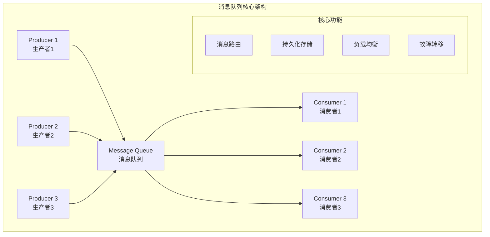

import Tabs from '@theme/Tabs';
import TabItem from '@theme/TabItem';
import CodeBlock from '@theme/CodeBlock';

# 消息队列综合详解

消息队列（Message Queue）是分布式系统中的核心组件，通过异步消息传递实现系统解耦、削峰填谷和可靠通信。它是构建高可用、高性能、可扩展分布式架构的基础设施，广泛应用于微服务、大数据、物联网等领域。

:::tip 核心价值
**消息队列 = 异步通信 + 系统解耦 + 削峰填谷 + 可靠传递**
- 🚀 **异步处理**：提升系统响应速度，改善用户体验
- 🔗 **系统解耦**：降低组件间耦合度，提高系统灵活性
- 📊 **削峰填谷**：缓冲流量峰值，保护系统稳定性
- 🛡️ **可靠传递**：保证消息不丢失，支持事务一致性
- 🌐 **水平扩展**：支持分布式部署，满足大规模场景需求
:::

## 1. 消息队列基础理论

### 1.1 核心概念与架构模式

消息队列系统通常包含生产者、消息代理、消费者三个核心角色，通过不同的架构模式实现各种业务需求。

#### 消息队列核心作用

| 核心作用 | 描述 | 业务价值 | 典型场景 |
|---------|------|----------|----------|
| **异步处理** | 将耗时操作异步化执行 | 提升响应速度，改善用户体验 | 邮件发送、图片处理、数据分析 |
| **系统解耦** | 降低系统间直接依赖 | 提高系统灵活性和可维护性 | 微服务通信、事件驱动架构 |
| **削峰填谷** | 缓冲突发流量峰值 | 保护系统稳定性，合理利用资源 | 秒杀活动、日志收集、数据同步 |
| **可靠传递** | 保证消息不丢失 | 确保业务数据一致性 | 支付通知、订单处理、库存更新 |
| **负载均衡** | 分散处理压力 | 提高系统处理能力 | 任务分发、并行计算、批处理 |