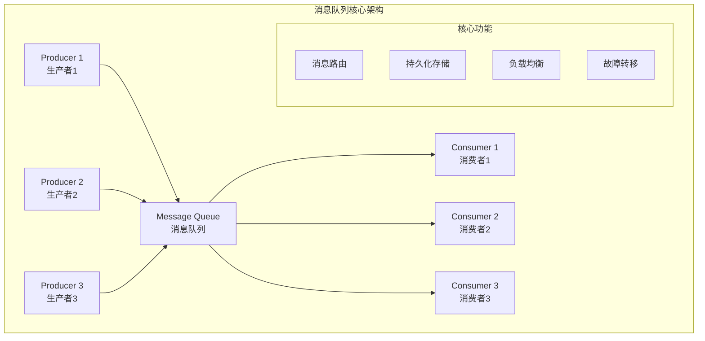
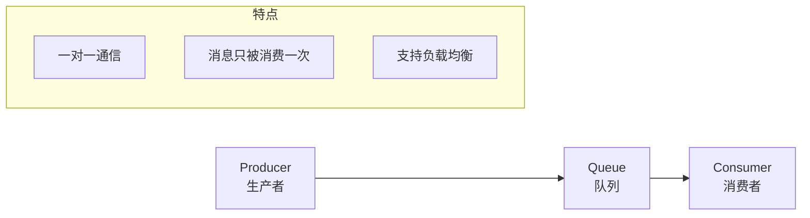
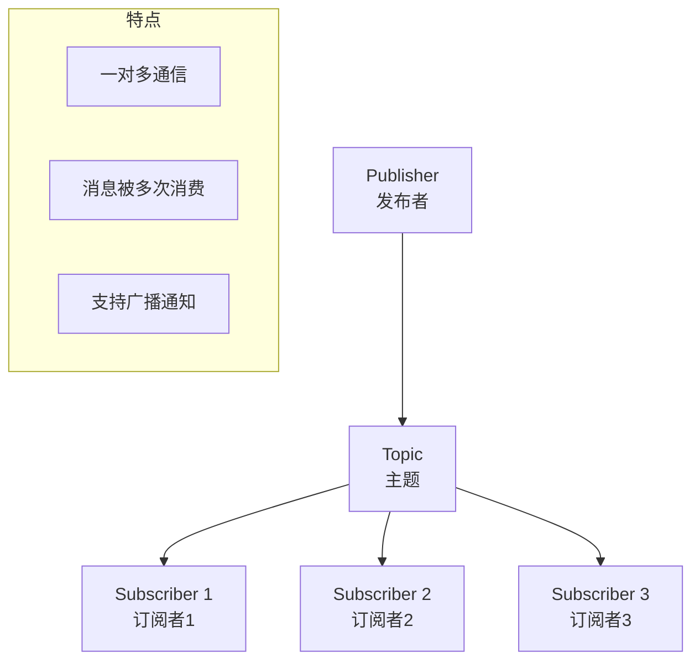
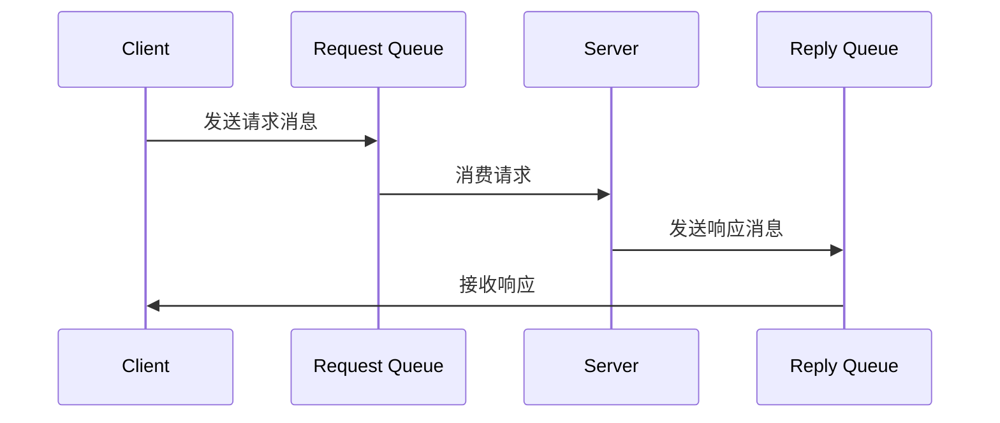
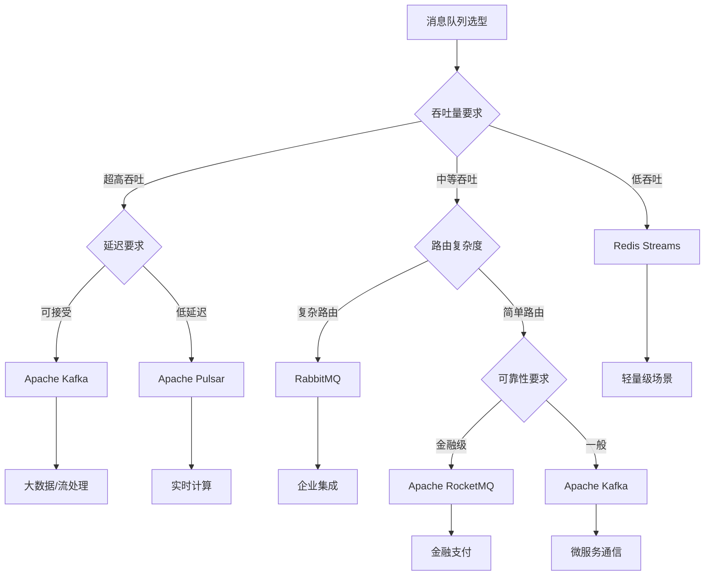
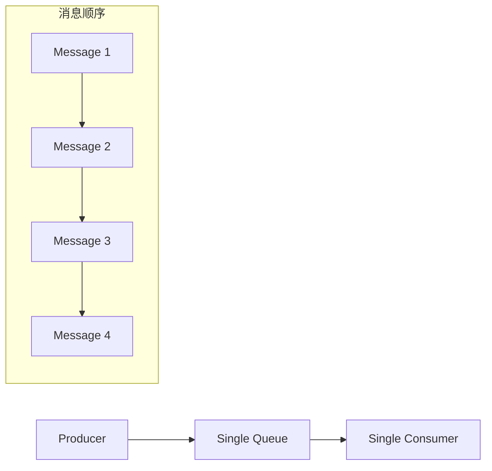
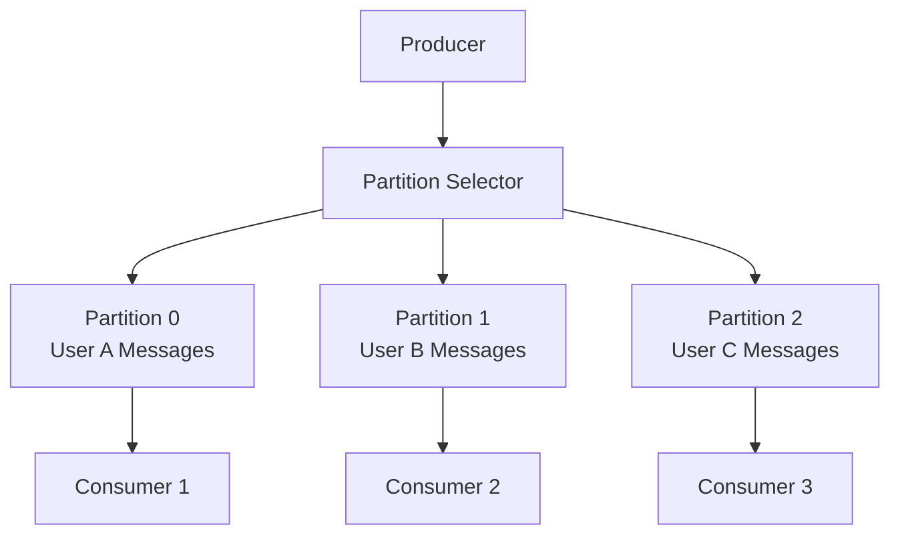
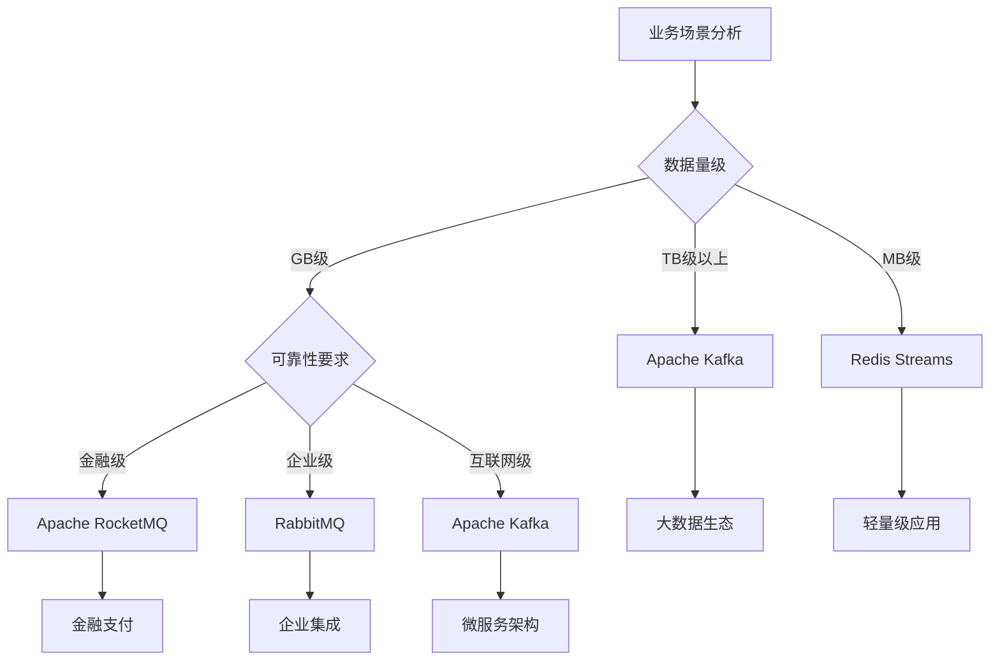

import Tabs from '@theme/Tabs';
import TabItem from '@theme/TabItem';
import CodeBlock from '@theme/CodeBlock';

# 消息队列综合详解

消息队列（Message Queue）是分布式系统中的核心组件，通过异步消息传递实现系统解耦、削峰填谷和可靠通信。它是构建高可用、高性能、可扩展分布式架构的基础设施，广泛应用于微服务、大数据、物联网等领域。

:::tip 核心价值
**消息队列 = 异步通信 + 系统解耦 + 削峰填谷 + 可靠传递**
- 🚀 **异步处理**：提升系统响应速度，改善用户体验
- 🔗 **系统解耦**：降低组件间耦合度，提高系统灵活性
- 📊 **削峰填谷**：缓冲流量峰值，保护系统稳定性
- 🛡️ **可靠传递**：保证消息不丢失，支持事务一致性
- 🌐 **水平扩展**：支持分布式部署，满足大规模场景需求
:::

## 1. 消息队列基础理论

### 1.1 核心概念与架构模式

消息队列系统通常包含生产者、消息代理、消费者三个核心角色，通过不同的架构模式实现各种业务需求。



#### 消息队列核心作用

| 核心作用 | 描述 | 业务价值 | 典型场景 |
|---------|------|----------|----------|
| **异步处理** | 将耗时操作异步化执行 | 提升响应速度，改善用户体验 | 邮件发送、图片处理、数据分析 |
| **系统解耦** | 降低系统间直接依赖 | 提高系统灵活性和可维护性 | 微服务通信、事件驱动架构 |
| **削峰填谷** | 缓冲突发流量峰值 | 保护系统稳定性，合理利用资源 | 秒杀活动、日志收集、数据同步 |
| **可靠传递** | 保证消息不丢失 | 确保业务数据一致性 | 支付通知、订单处理、库存更新 |
| **负载均衡** | 分散处理压力 | 提高系统处理能力 | 任务分发、并行计算、批处理 |

### 1.2 消息传递模式

<Tabs>
<TabItem value="point-to-point" label="点对点模式">



**点对点模式特点**：
- 每个消息只有一个消费者
- 消费者之间竞争消费消息
- 支持消息持久化和事务
- 适用于任务分发、负载均衡场景

</TabItem>
<TabItem value="publish-subscribe" label="发布订阅模式">



**发布订阅模式特点**：
- 一个消息可以被多个消费者消费
- 发布者和订阅者解耦
- 支持主题分类和过滤
- 适用于事件通知、数据同步场景

</TabItem>
<TabItem value="request-reply" label="请求响应模式">



**请求响应模式特点**：
- 支持同步和异步调用
- 需要关联请求和响应
- 支持超时和重试机制
- 适用于RPC调用、服务通信场景

</TabItem>
</Tabs>
## 2
. 主流消息队列技术对比

### 2.1 技术选型对比矩阵

| 特性对比 | Apache Kafka | RabbitMQ | Apache RocketMQ | Apache Pulsar | Redis Streams |
|---------|-------------|----------|----------------|---------------|---------------|
| **吞吐量** | ⭐⭐⭐⭐⭐ | ⭐⭐⭐ | ⭐⭐⭐⭐ | ⭐⭐⭐⭐⭐ | ⭐⭐⭐⭐ |
| **延迟** | ⭐⭐⭐ | ⭐⭐⭐⭐ | ⭐⭐⭐⭐ | ⭐⭐⭐ | ⭐⭐⭐⭐⭐ |
| **可靠性** | ⭐⭐⭐⭐ | ⭐⭐⭐⭐⭐ | ⭐⭐⭐⭐⭐ | ⭐⭐⭐⭐ | ⭐⭐⭐ |
| **扩展性** | ⭐⭐⭐⭐⭐ | ⭐⭐⭐ | ⭐⭐⭐⭐ | ⭐⭐⭐⭐⭐ | ⭐⭐⭐ |
| **运维复杂度** | ⭐⭐ | ⭐⭐⭐⭐ | ⭐⭐⭐ | ⭐⭐ | ⭐⭐⭐⭐⭐ |
| **生态成熟度** | ⭐⭐⭐⭐⭐ | ⭐⭐⭐⭐⭐ | ⭐⭐⭐⭐ | ⭐⭐⭐ | ⭐⭐⭐⭐ |

<Tabs>
<TabItem value="kafka" label="Apache Kafka">

**核心优势**：
- 超高吞吐量，单机可达百万TPS
- 分布式架构，支持水平扩展
- 持久化存储，支持数据回溯
- 丰富的生态系统和工具链

**适用场景**：
- 大数据实时处理
- 日志收集和分析
- 事件流处理
- 微服务间通信

**技术特点**：
```bash
# Kafka核心概念
Topic: 消息主题分类
Partition: 分区并行处理
Consumer Group: 消费者组负载均衡
Offset: 消息位移管理
```

</TabItem>
<TabItem value="rabbitmq" label="RabbitMQ">

**核心优势**：
- 灵活的路由机制（4种交换机类型）
- 完善的消息确认和持久化
- 易于使用的管理界面
- 强大的集群和高可用支持

**适用场景**：
- 企业级应用集成
- 复杂的消息路由
- 可靠性要求高的场景
- 传统企业架构

**技术特点**：
```bash
# RabbitMQ核心概念
Exchange: 消息交换机路由
Queue: 消息队列存储
Binding: 绑定关系定义
Virtual Host: 虚拟主机隔离
```

</TabItem>
<TabItem value="rocketmq" label="Apache RocketMQ">

**核心优势**：
- 金融级可靠性保障
- 支持事务消息
- 顺序消息和延迟消息
- 万亿级消息堆积能力

**适用场景**：
- 金融支付系统
- 电商交易平台
- 分布式事务场景
- 高可靠性要求

**技术特点**：
```bash
# RocketMQ核心概念
NameServer: 路由注册中心
Broker: 消息存储服务
Producer: 消息生产者
Consumer: 消息消费者
```

</TabItem>
</Tabs>

### 2.2 选型决策树



## 3. 消息队列核心机制

### 3.1 消息可靠性保障

<Tabs>
<TabItem value="producer-reliability" label="生产者可靠性">

**生产者端保障机制**：

1. **消息确认机制**
```java
// Kafka生产者确认
Properties props = new Properties();
props.put("acks", "all"); // 等待所有副本确认
props.put("retries", 3);  // 重试次数
props.put("enable.idempotence", true); // 幂等性

// RabbitMQ生产者确认
rabbitTemplate.setConfirmCallback((correlationData, ack, cause) -> {
    if (ack) {
        log.info("消息发送成功");
    } else {
        log.error("消息发送失败: {}", cause);
    }
});
```

2. **事务支持**
```java
// RocketMQ事务消息
TransactionMQProducer producer = new TransactionMQProducer();
producer.setTransactionListener(new TransactionListener() {
    @Override
    public LocalTransactionState executeLocalTransaction(Message msg, Object arg) {
        // 执行本地事务
        return LocalTransactionState.COMMIT_MESSAGE;
    }
    
    @Override
    public LocalTransactionState checkLocalTransaction(MessageExt msg) {
        // 事务状态回查
        return LocalTransactionState.COMMIT_MESSAGE;
    }
});
```

</TabItem>
<TabItem value="broker-reliability" label="代理可靠性">

**消息代理保障机制**：

1. **持久化存储**
```bash
# Kafka持久化配置
log.retention.hours=168        # 保留7天
log.segment.bytes=1073741824   # 1GB分段
log.flush.interval.messages=10000

# RabbitMQ持久化配置
durable=true                   # 队列持久化
delivery_mode=2                # 消息持久化
```

2. **副本机制**
```bash
# Kafka副本配置
default.replication.factor=3   # 3个副本
min.insync.replicas=2         # 最少2个同步副本

# RocketMQ主从配置
brokerRole=SYNC_MASTER        # 同步主节点
flushDiskType=SYNC_FLUSH      # 同步刷盘
```

</TabItem>
<TabItem value="consumer-reliability" label="消费者可靠性">

**消费者端保障机制**：

1. **消息确认**
```java
// Kafka手动提交
@KafkaListener(topics = "test-topic")
public void listen(ConsumerRecord<String, String> record, 
                   Acknowledgment ack) {
    try {
        // 处理消息
        processMessage(record.value());
        // 手动确认
        ack.acknowledge();
    } catch (Exception e) {
        // 处理失败，不确认
        log.error("消息处理失败", e);
    }
}

// RabbitMQ手动确认
@RabbitListener(queues = "test.queue", ackMode = "MANUAL")
public void handleMessage(String message, Channel channel, 
                         @Header(AmqpHeaders.DELIVERY_TAG) long tag) {
    try {
        processMessage(message);
        channel.basicAck(tag, false);
    } catch (Exception e) {
        channel.basicNack(tag, false, true); // 重新入队
    }
}
```

2. **重试机制**
```java
// Spring Retry配置
@Retryable(value = {Exception.class}, maxAttempts = 3, 
           backoff = @Backoff(delay = 1000, multiplier = 2))
public void processMessage(String message) {
    // 消息处理逻辑
}

@Recover
public void recover(Exception ex, String message) {
    // 重试失败后的处理
    log.error("消息处理最终失败: {}", message, ex);
}
```

</TabItem>
</Tabs>

### 3.2 消息顺序性保障

<Tabs>
<TabItem value="global-order" label="全局顺序">

**全局顺序消息**：
- 所有消息严格按照发送顺序消费
- 性能较低，适用于对顺序要求极高的场景
- 实现方式：单分区、单消费者



</TabItem>
<TabItem value="partition-order" label="分区顺序">

**分区顺序消息**：
- 同一分区内消息有序
- 不同分区间消息可并行处理
- 平衡了性能和顺序性要求



**分区选择策略**：
```java
// Kafka分区选择
public class OrderPartitioner implements Partitioner {
    @Override
    public int partition(String topic, Object key, byte[] keyBytes,
                        Object value, byte[] valueBytes, Cluster cluster) {
        // 根据订单ID选择分区
        String orderId = (String) key;
        return Math.abs(orderId.hashCode()) % cluster.partitionCountForTopic(topic);
    }
}

// RocketMQ队列选择
MessageQueueSelector selector = new MessageQueueSelector() {
    @Override
    public MessageQueue select(List<MessageQueue> mqs, Message msg, Object arg) {
        String orderId = (String) arg;
        int index = Math.abs(orderId.hashCode()) % mqs.size();
        return mqs.get(index);
    }
};
```

</TabItem>
</Tabs>

## 4. 企业级最佳实践

### 4.1 架构设计原则

:::tip 设计原则
1. **业务隔离**：不同业务使用不同的Topic/Queue
2. **容量规划**：合理评估消息量和存储需求
3. **监控告警**：完善的监控体系和告警机制
4. **容灾备份**：跨机房部署和数据备份策略
5. **性能优化**：批量处理和连接池优化
:::

<Tabs>
<TabItem value="topic-design" label="主题设计">

**主题命名规范**：
```bash
# 环境.业务域.数据类型.版本
prod.order.events.v1
prod.payment.notifications.v1
prod.user.activities.v2

# 按数据流向命名
mysql-to-es.user-profiles
app-to-analytics.click-events
crm-to-warehouse.customer-data
```

**分区策略**：
```java
// 基于业务键分区
public class BusinessKeyPartitioner implements Partitioner {
    @Override
    public int partition(String topic, Object key, byte[] keyBytes,
                        Object value, byte[] valueBytes, Cluster cluster) {
        if (key == null) {
            return 0; // 默认分区
        }
        
        // 根据业务键计算分区
        String businessKey = extractBusinessKey((String) key);
        return Math.abs(businessKey.hashCode()) % cluster.partitionCountForTopic(topic);
    }
    
    private String extractBusinessKey(String key) {
        // 提取业务键逻辑，如用户ID、订单ID等
        return key.split(":")[0];
    }
}
```

</TabItem>
<TabItem value="error-handling" label="异常处理">

**死信队列机制**：
```java
@Component
public class MessageErrorHandler {
    
    private static final int MAX_RETRY_COUNT = 3;
    
    @RabbitListener(queues = "business.queue")
    public void handleMessage(String message, 
                             @Header Map<String, Object> headers,
                             Channel channel,
                             @Header(AmqpHeaders.DELIVERY_TAG) long deliveryTag) {
        try {
            processMessage(message);
            channel.basicAck(deliveryTag, false);
        } catch (BusinessException e) {
            // 业务异常，发送到死信队列
            sendToDeadLetterQueue(message, e.getMessage());
            channel.basicAck(deliveryTag, false);
        } catch (Exception e) {
            // 系统异常，重试处理
            handleRetry(message, headers, channel, deliveryTag, e);
        }
    }
    
    private void handleRetry(String message, Map<String, Object> headers,
                           Channel channel, long deliveryTag, Exception e) {
        Integer retryCount = (Integer) headers.getOrDefault("x-retry-count", 0);
        
        if (retryCount < MAX_RETRY_COUNT) {
            // 增加重试次数并重新发送
            retryCount++;
            sendWithRetryCount(message, retryCount);
            channel.basicAck(deliveryTag, false);
        } else {
            // 超过最大重试次数，发送到死信队列
            sendToDeadLetterQueue(message, "超过最大重试次数");
            channel.basicAck(deliveryTag, false);
        }
    }
}
```

**熔断降级**：
```java
@Component
public class MessageCircuitBreaker {
    
    private final CircuitBreaker circuitBreaker;
    
    public MessageCircuitBreaker() {
        this.circuitBreaker = CircuitBreaker.ofDefaults("messageProcessor");
        circuitBreaker.getEventPublisher()
            .onStateTransition(event -> 
                log.info("熔断器状态变更: {}", event));
    }
    
    @EventListener
    public void handleMessage(MessageEvent event) {
        Supplier<Void> decoratedSupplier = CircuitBreaker
            .decorateSupplier(circuitBreaker, () -> {
                processMessage(event.getMessage());
                return null;
            });
        
        Try.ofSupplier(decoratedSupplier)
            .recover(throwable -> {
                log.error("消息处理失败，熔断器开启", throwable);
                handleFallback(event.getMessage());
                return null;
            });
    }
    
    private void handleFallback(String message) {
        // 降级处理逻辑
        log.info("执行降级处理: {}", message);
    }
}
```

</TabItem>
<TabItem value="monitoring" label="监控告警">

**关键监控指标**：
```java
@Component
public class MessageQueueMonitor {
    
    private final MeterRegistry meterRegistry;
    private final Counter messageProducedCounter;
    private final Counter messageConsumedCounter;
    private final Timer messageProcessingTimer;
    private final Gauge queueSizeGauge;
    
    public MessageQueueMonitor(MeterRegistry meterRegistry) {
        this.meterRegistry = meterRegistry;
        this.messageProducedCounter = Counter.builder("mq.message.produced")
            .description("生产消息数量")
            .register(meterRegistry);
        this.messageConsumedCounter = Counter.builder("mq.message.consumed")
            .description("消费消息数量")
            .register(meterRegistry);
        this.messageProcessingTimer = Timer.builder("mq.message.processing.time")
            .description("消息处理时间")
            .register(meterRegistry);
    }
    
    public void recordMessageProduced(String topic) {
        messageProducedCounter.increment(Tags.of("topic", topic));
    }
    
    public void recordMessageConsumed(String topic, long processingTime) {
        messageConsumedCounter.increment(Tags.of("topic", topic));
        messageProcessingTimer.record(processingTime, TimeUnit.MILLISECONDS);
    }
    
    @Scheduled(fixedRate = 60000) // 每分钟检查一次
    public void checkQueueHealth() {
        // 检查队列堆积情况
        Map<String, Long> queueSizes = getQueueSizes();
        
        for (Map.Entry<String, Long> entry : queueSizes.entrySet()) {
            String queueName = entry.getKey();
            Long queueSize = entry.getValue();
            
            // 更新队列大小指标
            Gauge.builder("mq.queue.size")
                .description("队列消息数量")
                .tags("queue", queueName)
                .register(meterRegistry, queueSize);
            
            // 告警检查
            if (queueSize > 10000) {
                sendAlert("队列堆积告警", 
                    String.format("队列 %s 消息堆积: %d", queueName, queueSize));
            }
        }
    }
    
    private Map<String, Long> getQueueSizes() {
        // 实现获取队列大小的逻辑
        return new HashMap<>();
    }
    
    private void sendAlert(String title, String message) {
        log.error("告警: {} - {}", title, message);
        // 发送告警通知
    }
}
```

**告警规则配置**：
```yaml
# Prometheus告警规则
groups:
  - name: message_queue_alerts
    rules:
      - alert: MessageQueueLag
        expr: mq_queue_size > 10000
        for: 5m
        labels:
          severity: warning
        annotations:
          summary: "消息队列堆积告警"
          description: "队列 {{ $labels.queue }} 消息堆积超过10000条"
      
      - alert: MessageProcessingError
        expr: rate(mq_message_error_total[5m]) > 0.1
        for: 2m
        labels:
          severity: critical
        annotations:
          summary: "消息处理错误率过高"
          description: "消息处理错误率超过10%"
```

</TabItem>
</Tabs>

## 5. 总结与展望

### 5.1 技术选型建议



### 5.2 发展趋势

**云原生消息队列**：
- Kubernetes原生支持
- 自动扩缩容能力
- 多云部署支持
- Serverless消息服务

**智能化运维**：
- AI驱动的性能优化
- 自动故障检测和恢复
- 智能容量规划
- 预测性维护

**边缘计算支持**：
- 边缘节点消息处理
- 边云协同消息传递
- 低延迟消息路由
- 离线消息同步

:::tip 学习建议
1. **理论基础**：深入理解消息队列的基本原理和设计模式
2. **技术实践**：动手实践不同消息队列的部署和使用
3. **场景应用**：结合具体业务场景选择合适的技术方案
4. **性能优化**：掌握性能调优和故障排查技能
5. **架构设计**：学习大规模分布式消息系统的架构设计
:::

---

消息队列作为分布式系统的核心基础设施，在现代软件架构中发挥着越来越重要的作用。通过合理的技术选型、架构设计和运维管理，可以构建高可用、高性能、可扩展的消息系统，为业务发展提供强有力的技术支撑。