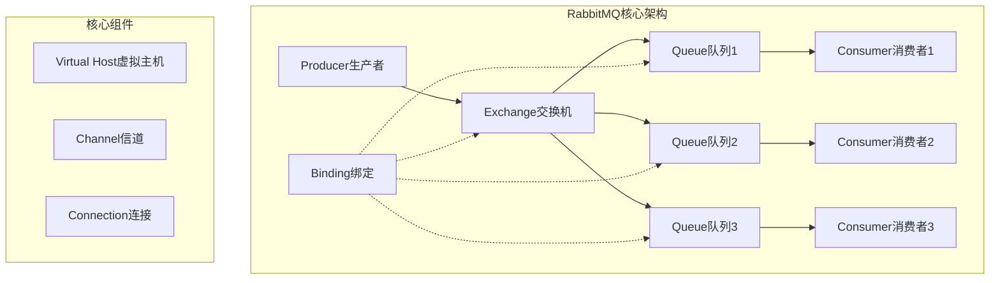
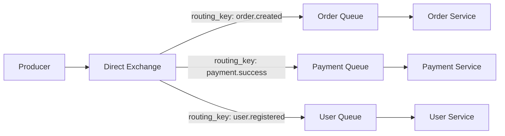
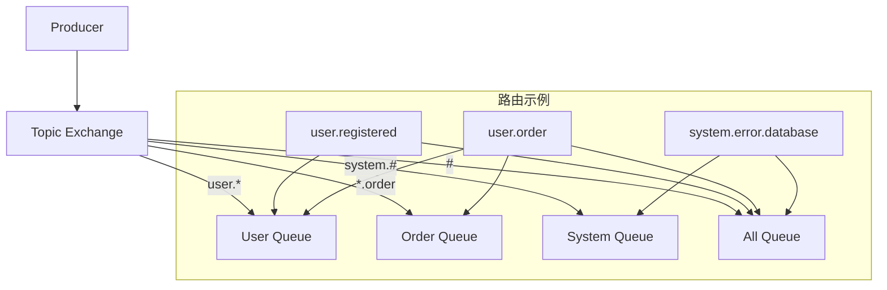
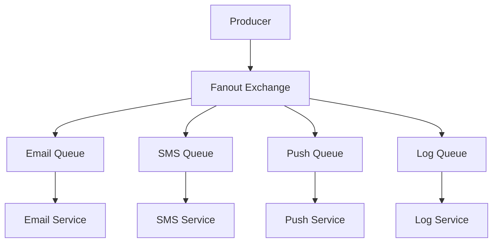
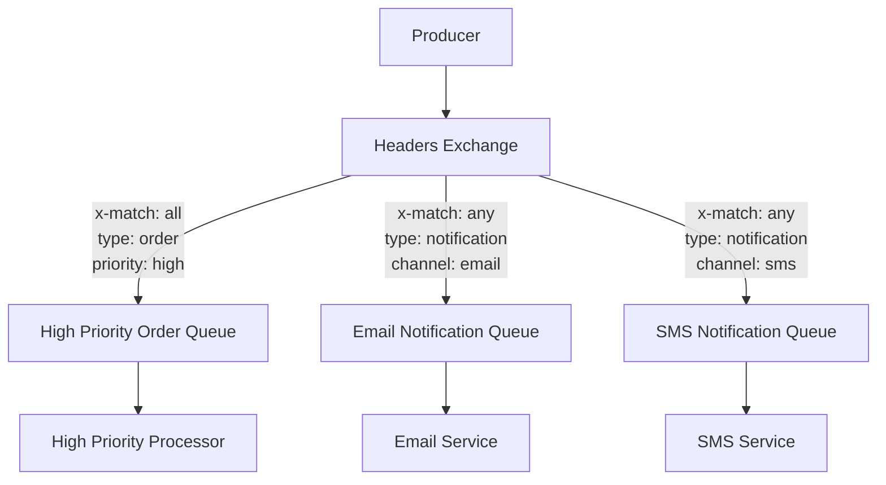

import Tabs from '@theme/Tabs';
import TabItem from '@theme/TabItem';
import CodeBlock from '@theme/CodeBlock';

# RabbitMQ企业级消息队列详解

RabbitMQ是一个开源的消息代理（Message Broker），实现了高级消息队列协议（AMQP）。它以其灵活的路由机制、可靠的消息传递、丰富的管理功能和强大的集群支持，成为企业级微服务架构中的核心消息中间件。

:::tip 核心价值
**RabbitMQ = 灵活路由 + 可靠传递 + 集群管理 + 丰富生态**
- 🎯 **灵活路由**：四种交换机类型支持复杂路由策略
- 🛡️ **可靠传递**：完善的消息确认、持久化和事务机制
- 🔧 **易于管理**：直观的Web管理界面和丰富的监控指标
- 🌐 **高可用性**：支持集群部署、镜像队列和故障转移
- 🚀 **生态丰富**：多语言客户端、插件系统和Spring集成
:::

## 1. RabbitMQ核心架构与设计理念

### 1.1 AMQP协议与架构模型

RabbitMQ基于AMQP（Advanced Message Queuing Protocol）协议，采用生产者-交换机-队列-消费者的经典架构模式。



#### 核心组件详解

| 组件 | 作用 | 特点 | 应用场景 |
|------|------|------|----------|
| **Producer** | 消息生产者 | 发送消息到交换机 | 业务系统、定时任务 |
| **Exchange** | 消息交换机 | 路由消息到队列 | 消息分发、路由控制 |
| **Queue** | 消息队列 | 存储消息 | 消息缓存、负载均衡 |
| **Consumer** | 消息消费者 | 处理消息 | 业务处理、数据同步 |
| **Binding** | 绑定关系 | 连接交换机和队列 | 路由规则定义 |
| **Virtual Host** | 虚拟主机 | 逻辑隔离 | 多租户、环境隔离 |
| **Channel** | 信道 | 轻量级连接 | 并发处理、资源复用 |

### 1.2 RabbitMQ应用场景对比

| 应用场景 | 传统方案 | RabbitMQ方案 | 核心优势 | 适用规模 |
|---------|---------|-------------|----------|---------|
| **异步处理** | 同步调用 | 消息队列 | 解耦、提升响应速度 | 高并发系统 |
| **服务解耦** | 直接调用 | 事件驱动 | 降低耦合度 | 微服务架构 |
| **流量削峰** | 限流熔断 | 队列缓冲 | 平滑处理突发流量 | 电商秒杀 |
| **数据分发** | 点对点推送 | 发布订阅 | 一对多广播 | 消息通知 |
| **任务调度** | 定时任务 | 延迟队列 | 灵活的任务调度 | 业务流程 |## 2
. 交换机类型深度解析

### 2.1 Direct Exchange - 精确路由

Direct Exchange通过完全匹配路由键实现点对点消息传递，是最简单高效的路由方式。

<Tabs>
<TabItem value="concept" label="工作原理">



**路由规则**：
- 消息的routing_key必须与队列绑定的binding_key完全匹配
- 一个交换机可以绑定多个队列，每个队列可以有不同的binding_key
- 适用于需要精确路由的场景

</TabItem>
<TabItem value="java-impl" label="Java实现">

```java title="Direct Exchange完整实现"
@Component
public class DirectExchangeService {
    
    private static final String EXCHANGE_NAME = "business.direct";
    
    @Autowired
    private RabbitTemplate rabbitTemplate;
    
    /**
     * 配置Direct Exchange和队列
     */
    @Configuration
    public static class DirectExchangeConfig {
        
        // 声明Direct Exchange
        @Bean
        public DirectExchange businessDirectExchange() {
            return ExchangeBuilder.directExchange(EXCHANGE_NAME)
                .durable(true)  // 持久化
                .build();
        }
        
        // 声明队列
        @Bean
        public Queue orderQueue() {
            return QueueBuilder.durable("order.queue")
                .withArgument("x-message-ttl", 60000)  // 消息TTL 60秒
                .build();
        }
        
        @Bean
        public Queue paymentQueue() {
            return QueueBuilder.durable("payment.queue")
                .withArgument("x-max-length", 10000)   // 队列最大长度
                .build();
        }
        
        // 绑定队列到交换机
        @Bean
        public Binding orderBinding() {
            return BindingBuilder
                .bind(orderQueue())
                .to(businessDirectExchange())
                .with("order.created");  // routing key
        }
        
        @Bean
        public Binding paymentBinding() {
            return BindingBuilder
                .bind(paymentQueue())
                .to(businessDirectExchange())
                .with("payment.success");
        }
    }
    
    /**
     * 发送订单创建消息
     */
    public void sendOrderCreated(OrderCreatedEvent event) {
        rabbitTemplate.convertAndSend(EXCHANGE_NAME, "order.created", event);
        log.info("订单创建消息发送成功: {}", event.getOrderId());
    }
    
    /**
     * 发送支付成功消息
     */
    public void sendPaymentSuccess(PaymentSuccessEvent event) {
        rabbitTemplate.convertAndSend(EXCHANGE_NAME, "payment.success", event);
        log.info("支付成功消息发送: {}", event.getPaymentId());
    }
}

/**
 * 消息消费者
 */
@Component
public class DirectExchangeConsumer {
    
    /**
     * 处理订单创建消息
     */
    @RabbitListener(queues = "order.queue")
    public void handleOrderCreated(OrderCreatedEvent event) {
        log.info("处理订单创建事件: {}", event.getOrderId());
        // 业务处理逻辑
        processOrderCreated(event);
    }
    
    /**
     * 处理支付成功消息
     */
    @RabbitListener(queues = "payment.queue")
    public void handlePaymentSuccess(PaymentSuccessEvent event) {
        log.info("处理支付成功事件: {}", event.getPaymentId());
        // 业务处理逻辑
        processPaymentSuccess(event);
    }
    
    private void processOrderCreated(OrderCreatedEvent event) {
        // 订单处理逻辑：库存检查、风控验证、发送确认邮件
    }
    
    private void processPaymentSuccess(PaymentSuccessEvent event) {
        // 支付处理逻辑：更新订单状态、发送发货指令、积分奖励
    }
}
```

</TabItem>
<TabItem value="use-cases" label="应用场景">

**Direct Exchange典型应用场景**：

1. **订单处理系统**：不同订单状态路由到不同处理队列
2. **用户行为分析**：不同用户行为路由到对应分析队列
3. **系统通知**：不同通知类型路由到对应发送队列
4. **任务分发**：不同任务类型路由到专门的处理队列

```java title="应用场景示例"
// 订单状态变更
public void sendOrderStatusChange(String orderId, OrderStatus status) {
    String routingKey = "order.status." + status.name().toLowerCase();
    rabbitTemplate.convertAndSend("order.direct", routingKey, 
        new OrderStatusEvent(orderId, status));
}

// 用户行为追踪
public void trackUserAction(String userId, String action) {
    String routingKey = "user.action." + action;
    UserActionEvent event = new UserActionEvent(userId, action, System.currentTimeMillis());
    rabbitTemplate.convertAndSend("user.direct", routingKey, event);
}
```

</TabItem>
</Tabs>

### 2.2 Topic Exchange - 模式匹配路由

Topic Exchange使用通配符进行模式匹配，支持灵活的路由规则，是最强大的路由方式。

<Tabs>
<TabItem value="concept" label="工作原理">



**通配符规则**：
- `*`：匹配一个单词（word）
- `#`：匹配零个或多个单词
- `.`：单词分隔符
- 路由键和绑定键都是由`.`分隔的单词列表

</TabItem>
<TabItem value="java-impl" label="Java实现">

```java title="Topic Exchange完整实现"
@Component
public class TopicExchangeService {
    
    private static final String EXCHANGE_NAME = "events.topic";
    
    @Configuration
    public static class TopicExchangeConfig {
        
        @Bean
        public TopicExchange eventsTopicExchange() {
            return ExchangeBuilder.topicExchange(EXCHANGE_NAME)
                .durable(true)
                .build();
        }
        
        // 用户相关队列 - 匹配 user.*
        @Bean
        public Queue userEventsQueue() {
            return QueueBuilder.durable("user.events.queue").build();
        }
        
        // 订单相关队列 - 匹配 *.order
        @Bean  
        public Queue orderEventsQueue() {
            return QueueBuilder.durable("order.events.queue").build();
        }
        
        // 系统日志队列 - 匹配 system.#
        @Bean
        public Queue systemLogsQueue() {
            return QueueBuilder.durable("system.logs.queue").build();
        }
        
        // 绑定关系
        @Bean
        public Binding userEventsBinding() {
            return BindingBuilder.bind(userEventsQueue())
                .to(eventsTopicExchange()).with("user.*");
        }
        
        @Bean
        public Binding orderEventsBinding() {
            return BindingBuilder.bind(orderEventsQueue())
                .to(eventsTopicExchange()).with("*.order");
        }
        
        @Bean
        public Binding systemLogsBinding() {
            return BindingBuilder.bind(systemLogsQueue())
                .to(eventsTopicExchange()).with("system.#");
        }
    }
    
    /**
     * 发送用户事件
     */
    public void sendUserEvent(String eventType, Object eventData) {
        String routingKey = "user." + eventType;
        rabbitTemplate.convertAndSend(EXCHANGE_NAME, routingKey, eventData);
        log.info("用户事件发送: {} -> {}", routingKey, eventData);
    }
    
    /**
     * 发送订单事件  
     */
    public void sendOrderEvent(String source, Object eventData) {
        String routingKey = source + ".order";
        rabbitTemplate.convertAndSend(EXCHANGE_NAME, routingKey, eventData);
        log.info("订单事件发送: {} -> {}", routingKey, eventData);
    }
}
```

</TabItem>
<TabItem value="patterns" label="路由模式">

```bash title="Topic Exchange路由模式示例"
# 1. 基础模式匹配
user.registered     -> user.*     ✓ 匹配
user.login         -> user.*     ✓ 匹配  
user.profile.update -> user.*     ✗ 不匹配

# 2. 后缀模式匹配
web.order          -> *.order    ✓ 匹配
mobile.order       -> *.order    ✓ 匹配
api.order.cancel   -> *.order    ✗ 不匹配

# 3. 多级模式匹配
system.error       -> system.#   ✓ 匹配
system.error.db    -> system.#   ✓ 匹配
system.warn.cache  -> system.#   ✓ 匹配
user.error         -> system.#   ✗ 不匹配

# 4. 全匹配模式
任何消息            -> #          ✓ 全部匹配
```

</TabItem>
</Tabs>

### 2.3 Fanout Exchange - 广播路由

Fanout Exchange将消息广播到所有绑定的队列，实现发布-订阅模式。

<Tabs>
<TabItem value="concept" label="工作原理">



**特点**：
- 忽略路由键，消息广播到所有绑定队列
- 性能最高，路由逻辑最简单
- 适用于发布-订阅场景

</TabItem>
<TabItem value="java-impl" label="Java实现">

```java title="Fanout Exchange实现"
@Component
public class FanoutExchangeService {
    
    private static final String EXCHANGE_NAME = "notifications.fanout";
    
    @Configuration
    public static class FanoutExchangeConfig {
        
        @Bean
        public FanoutExchange notificationsFanoutExchange() {
            return ExchangeBuilder.fanoutExchange(EXCHANGE_NAME)
                .durable(true)
                .build();
        }
        
        @Bean
        public Queue emailNotificationQueue() {
            return QueueBuilder.durable("email.notification.queue").build();
        }
        
        @Bean
        public Queue smsNotificationQueue() {
            return QueueBuilder.durable("sms.notification.queue").build();
        }
        
        @Bean
        public Queue pushNotificationQueue() {
            return QueueBuilder.durable("push.notification.queue").build();
        }
        
        // 绑定所有队列到Fanout Exchange（无需路由键）
        @Bean
        public Binding emailNotificationBinding() {
            return BindingBuilder.bind(emailNotificationQueue())
                .to(notificationsFanoutExchange());
        }
        
        @Bean
        public Binding smsNotificationBinding() {
            return BindingBuilder.bind(smsNotificationQueue())
                .to(notificationsFanoutExchange());
        }
        
        @Bean
        public Binding pushNotificationBinding() {
            return BindingBuilder.bind(pushNotificationQueue())
                .to(notificationsFanoutExchange());
        }
    }
    
    /**
     * 广播通知消息
     */
    public void broadcastNotification(NotificationEvent event) {
        // 路由键被忽略，可以传空字符串
        rabbitTemplate.convertAndSend(EXCHANGE_NAME, "", event);
        log.info("广播通知消息: {}", event.getMessage());
    }
}
```

</TabItem>
</Tabs>

### 2.4 Headers Exchange - 属性路由

Headers Exchange根据消息头部属性进行路由，提供最灵活的路由机制。

<Tabs>
<TabItem value="concept" label="工作原理">



**匹配规则**：
- `x-match: all`：所有指定的头部属性都必须匹配
- `x-match: any`：任意一个指定的头部属性匹配即可
- 支持复杂的属性组合匹配

</TabItem>
<TabItem value="java-impl" label="Java实现">

```java title="Headers Exchange实现"
@Component
public class HeadersExchangeService {
    
    private static final String EXCHANGE_NAME = "headers.exchange";
    
    @Configuration
    public static class HeadersExchangeConfig {
        
        @Bean
        public HeadersExchange headersExchange() {
            return ExchangeBuilder.headersExchange(EXCHANGE_NAME)
                .durable(true)
                .build();
        }
        
        @Bean
        public Queue highPriorityQueue() {
            return QueueBuilder.durable("high.priority.queue").build();
        }
        
        @Bean
        public Queue emailQueue() {
            return QueueBuilder.durable("email.queue").build();
        }
        
        // 绑定高优先级队列 - 需要同时匹配type=order和priority=high
        @Bean
        public Binding highPriorityBinding() {
            Map<String, Object> headers = new HashMap<>();
            headers.put("x-match", "all");
            headers.put("type", "order");
            headers.put("priority", "high");
            
            return BindingBuilder.bind(highPriorityQueue())
                .to(headersExchange()).whereAll(headers).match();
        }
        
        // 绑定邮件队列 - 匹配type=notification或channel=email
        @Bean
        public Binding emailBinding() {
            Map<String, Object> headers = new HashMap<>();
            headers.put("x-match", "any");
            headers.put("type", "notification");
            headers.put("channel", "email");
            
            return BindingBuilder.bind(emailQueue())
                .to(headersExchange()).whereAny(headers).match();
        }
    }
    
    /**
     * 发送带头部属性的消息
     */
    public void sendMessageWithHeaders(Object message, Map<String, Object> headers) {
        MessageProperties properties = new MessageProperties();
        
        // 设置头部属性
        for (Map.Entry<String, Object> entry : headers.entrySet()) {
            properties.setHeader(entry.getKey(), entry.getValue());
        }
        
        Message rabbitMessage = new Message(
            rabbitTemplate.getMessageConverter().toMessage(message, properties).getBody(),
            properties
        );
        
        rabbitTemplate.send(EXCHANGE_NAME, "", rabbitMessage);
        log.info("Headers消息发送成功，头部: {}", headers);
    }
    
    /**
     * 发送高优先级订单消息
     */
    public void sendHighPriorityOrder(OrderEvent event) {
        Map<String, Object> headers = new HashMap<>();
        headers.put("type", "order");
        headers.put("priority", "high");
        headers.put("source", "web");
        
        sendMessageWithHeaders(event, headers);
    }
    
    /**
     * 发送邮件通知消息
     */
    public void sendEmailNotification(NotificationEvent event) {
        Map<String, Object> headers = new HashMap<>();
        headers.put("type", "notification");
        headers.put("channel", "email");
        headers.put("urgent", false);
        
        sendMessageWithHeaders(event, headers);
    }
}
```

</TabItem>
</Tabs>