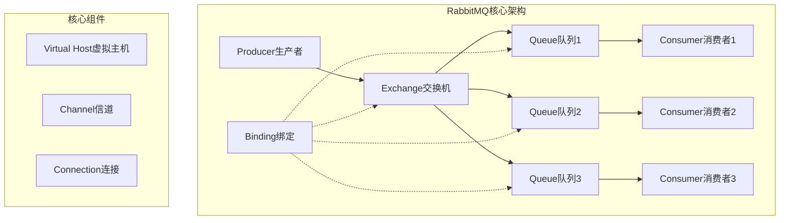
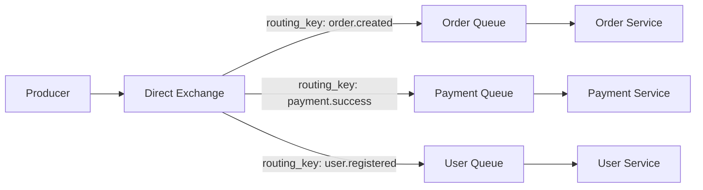
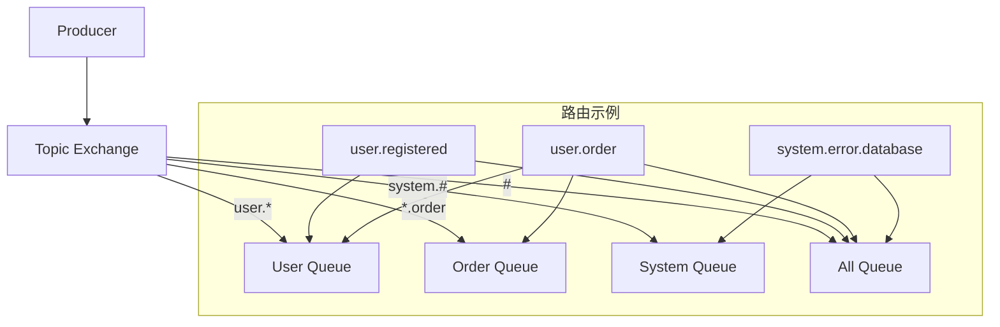
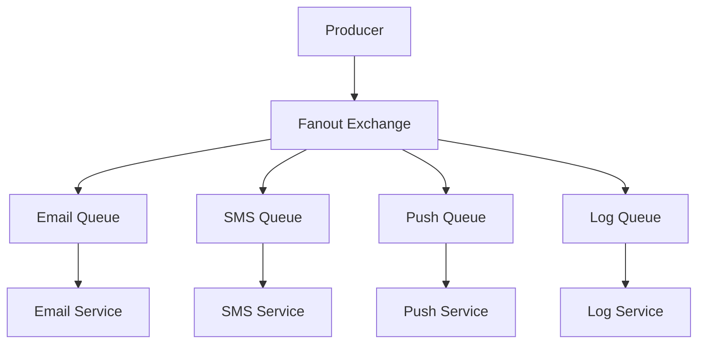

import Tabs from '@theme/Tabs';
import TabItem from '@theme/TabItem';
import CodeBlock from '@theme/CodeBlock';

# RabbitMQ企业级消息队列详解

RabbitMQ是一个开源的消息代理（Message Broker），实现了高级消息队列协议（AMQP）。它以其灵活的路由机制、可靠的消息传递、丰富的管理功能和强大的集群支持，成为企业级微服务架构中的核心消息中间件。

:::tip 核心价值
**RabbitMQ = 灵活路由 + 可靠传递 + 集群管理 + 丰富生态**
- 🎯 **灵活路由**：四种交换机类型支持复杂路由策略
- 🛡️ **可靠传递**：完善的消息确认、持久化和事务机制
- 🔧 **易于管理**：直观的Web管理界面和丰富的监控指标
- 🌐 **高可用性**：支持集群部署、镜像队列和故障转移
- 🚀 **生态丰富**：多语言客户端、插件系统和Spring集成
:::

## 1. RabbitMQ核心架构与设计理念

### 1.1 AMQP协议与架构模型

RabbitMQ基于AMQP（Advanced Message Queuing Protocol）协议，采用生产者-交换机-队列-消费者的经典架构模式。



#### 核心组件详解

| 组件 | 作用 | 特点 | 应用场景 |
|------|------|------|----------|
| **Producer** | 消息生产者 | 发送消息到交换机 | 业务系统、定时任务 |
| **Exchange** | 消息交换机 | 路由消息到队列 | 消息分发、路由控制 |
| **Queue** | 消息队列 | 存储消息 | 消息缓存、负载均衡 |
| **Consumer** | 消息消费者 | 处理消息 | 业务处理、数据同步 |
| **Binding** | 绑定关系 | 连接交换机和队列 | 路由规则定义 |
| **Virtual Host** | 虚拟主机 | 逻辑隔离 | 多租户、环境隔离 |
| **Channel** | 信道 | 轻量级连接 | 并发处理、资源复用 |
#
## 1.2 RabbitMQ应用场景对比

| 应用场景 | 传统方案 | RabbitMQ方案 | 核心优势 | 适用规模 |
|---------|---------|-------------|----------|---------|
| **异步处理** | 同步调用 | 消息队列 | 解耦、提升响应速度 | 高并发系统 |
| **服务解耦** | 直接调用 | 事件驱动 | 降低耦合度 | 微服务架构 |
| **流量削峰** | 限流熔断 | 队列缓冲 | 平滑处理突发流量 | 电商秒杀 |
| **数据分发** | 点对点推送 | 发布订阅 | 一对多广播 | 消息通知 |
| **任务调度** | 定时任务 | 延迟队列 | 灵活的任务调度 | 业务流程 |

## 2. 交换机类型深度解析

### 2.1 Direct Exchange - 精确路由

Direct Exchange通过完全匹配路由键实现点对点消息传递，是最简单高效的路由方式。

<Tabs>
<TabItem value="concept" label="工作原理">



**路由规则**：
- 消息的routing_key必须与队列绑定的binding_key完全匹配
- 一个交换机可以绑定多个队列，每个队列可以有不同的binding_key
- 适用于需要精确路由的场景

</TabItem>
<TabItem value="java-impl" label="Java实现">

```java title="Direct Exchange完整实现"
@Component
public class DirectExchangeService {
    
    private static final String EXCHANGE_NAME = "business.direct";
    
    @Autowired
    private RabbitTemplate rabbitTemplate;
    
    /**
     * 配置Direct Exchange和队列
     */
    @Configuration
    public static class DirectExchangeConfig {
        
        // 声明Direct Exchange
        @Bean
        public DirectExchange businessDirectExchange() {
            return ExchangeBuilder.directExchange(EXCHANGE_NAME)
                .durable(true)  // 持久化
                .build();
        }
        
        // 声明队列
        @Bean
        public Queue orderQueue() {
            return QueueBuilder.durable("order.queue")
                .withArgument("x-message-ttl", 60000)  // 消息TTL 60秒
                .build();
        }
        
        @Bean
        public Queue paymentQueue() {
            return QueueBuilder.durable("payment.queue")
                .withArgument("x-max-length", 10000)   // 队列最大长度
                .build();
        }
        
        // 绑定队列到交换机
        @Bean
        public Binding orderBinding() {
            return BindingBuilder
                .bind(orderQueue())
                .to(businessDirectExchange())
                .with("order.created");  // routing key
        }
        
        @Bean
        public Binding paymentBinding() {
            return BindingBuilder
                .bind(paymentQueue())
                .to(businessDirectExchange())
                .with("payment.success");
        }
    }
    
    /**
     * 发送订单创建消息
     */
    public void sendOrderCreated(OrderCreatedEvent event) {
        rabbitTemplate.convertAndSend(EXCHANGE_NAME, "order.created", event);
        log.info("订单创建消息发送成功: {}", event.getOrderId());
    }
    
    /**
     * 发送支付成功消息
     */
    public void sendPaymentSuccess(PaymentSuccessEvent event) {
        rabbitTemplate.convertAndSend(EXCHANGE_NAME, "payment.success", event);
        log.info("支付成功消息发送: {}", event.getPaymentId());
    }
}

/**
 * 消息消费者
 */
@Component
public class DirectExchangeConsumer {
    
    /**
     * 处理订单创建消息
     */
    @RabbitListener(queues = "order.queue")
    public void handleOrderCreated(OrderCreatedEvent event) {
        log.info("处理订单创建事件: {}", event.getOrderId());
        // 业务处理逻辑
        processOrderCreated(event);
    }
    
    /**
     * 处理支付成功消息
     */
    @RabbitListener(queues = "payment.queue")
    public void handlePaymentSuccess(PaymentSuccessEvent event) {
        log.info("处理支付成功事件: {}", event.getPaymentId());
        // 业务处理逻辑
        processPaymentSuccess(event);
    }
    
    private void processOrderCreated(OrderCreatedEvent event) {
        // 订单处理逻辑：库存检查、风控验证、发送确认邮件
    }
    
    private void processPaymentSuccess(PaymentSuccessEvent event) {
        // 支付处理逻辑：更新订单状态、发送发货指令、积分奖励
    }
}
```

</TabItem>
<TabItem value="use-cases" label="应用场景">

**Direct Exchange典型应用场景**：

1. **订单处理系统**：不同订单状态路由到不同处理队列
2. **用户行为分析**：不同用户行为路由到对应分析队列
3. **系统通知**：不同通知类型路由到对应发送队列
4. **任务分发**：不同任务类型路由到专门的处理队列

```java title="应用场景示例"
// 订单状态变更
public void sendOrderStatusChange(String orderId, OrderStatus status) {
    String routingKey = "order.status." + status.name().toLowerCase();
    rabbitTemplate.convertAndSend("order.direct", routingKey, 
        new OrderStatusEvent(orderId, status));
}

// 用户行为追踪
public void trackUserAction(String userId, String action) {
    String routingKey = "user.action." + action;
    UserActionEvent event = new UserActionEvent(userId, action, System.currentTimeMillis());
    rabbitTemplate.convertAndSend("user.direct", routingKey, event);
}
```

</TabItem>
</Tabs>

### 2.2 Topic Exchange - 模式匹配路由

Topic Exchange使用通配符进行模式匹配，支持灵活的路由规则，是最强大的路由方式。

<Tabs>
<TabItem value="concept" label="工作原理">



**通配符规则**：
- `*`：匹配一个单词（word）
- `#`：匹配零个或多个单词
- `.`：单词分隔符
- 路由键和绑定键都是由`.`分隔的单词列表

</TabItem>
<TabItem value="java-impl" label="Java实现">

```java title="Topic Exchange完整实现"
@Component
public class TopicExchangeService {
    
    private static final String EXCHANGE_NAME = "events.topic";
    
    @Configuration
    public static class TopicExchangeConfig {
        
        @Bean
        public TopicExchange eventsTopicExchange() {
            return ExchangeBuilder.topicExchange(EXCHANGE_NAME)
                .durable(true)
                .build();
        }
        
        // 用户相关队列 - 匹配 user.*
        @Bean
        public Queue userEventsQueue() {
            return QueueBuilder.durable("user.events.queue").build();
        }
        
        // 订单相关队列 - 匹配 *.order
        @Bean  
        public Queue orderEventsQueue() {
            return QueueBuilder.durable("order.events.queue").build();
        }
        
        // 系统日志队列 - 匹配 system.#
        @Bean
        public Queue systemLogsQueue() {
            return QueueBuilder.durable("system.logs.queue").build();
        }
        
        // 绑定关系
        @Bean
        public Binding userEventsBinding() {
            return BindingBuilder.bind(userEventsQueue())
                .to(eventsTopicExchange()).with("user.*");
        }
        
        @Bean
        public Binding orderEventsBinding() {
            return BindingBuilder.bind(orderEventsQueue())
                .to(eventsTopicExchange()).with("*.order");
        }
        
        @Bean
        public Binding systemLogsBinding() {
            return BindingBuilder.bind(systemLogsQueue())
                .to(eventsTopicExchange()).with("system.#");
        }
    }
    
    /**
     * 发送用户事件
     */
    public void sendUserEvent(String eventType, Object eventData) {
        String routingKey = "user." + eventType;
        rabbitTemplate.convertAndSend(EXCHANGE_NAME, routingKey, eventData);
        log.info("用户事件发送: {} -> {}", routingKey, eventData);
    }
    
    /**
     * 发送订单事件  
     */
    public void sendOrderEvent(String source, Object eventData) {
        String routingKey = source + ".order";
        rabbitTemplate.convertAndSend(EXCHANGE_NAME, routingKey, eventData);
        log.info("订单事件发送: {} -> {}", routingKey, eventData);
    }
}
```

</TabItem>
<TabItem value="patterns" label="路由模式">

```bash title="Topic Exchange路由模式示例"
# 1. 基础模式匹配
user.registered     -> user.*     ✓ 匹配
user.login         -> user.*     ✓ 匹配  
user.profile.update -> user.*     ✗ 不匹配

# 2. 后缀模式匹配
web.order          -> *.order    ✓ 匹配
mobile.order       -> *.order    ✓ 匹配
api.order.cancel   -> *.order    ✗ 不匹配

# 3. 多级模式匹配
system.error       -> system.#   ✓ 匹配
system.error.db    -> system.#   ✓ 匹配
system.warn.cache  -> system.#   ✓ 匹配
user.error         -> system.#   ✗ 不匹配

# 4. 全匹配模式
任何消息            -> #          ✓ 全部匹配
```

</TabItem>
</Tabs>

### 2.3 Fanout Exchange - 广播路由

Fanout Exchange将消息广播到所有绑定的队列，实现发布-订阅模式。

<Tabs>
<TabItem value="concept" label="工作原理">



**特点**：
- 忽略路由键，消息广播到所有绑定队列
- 性能最高，路由逻辑最简单
- 适用于发布-订阅场景

</TabItem>
<TabItem value="java-impl" label="Java实现">

```java title="Fanout Exchange实现"
@Component
public class FanoutExchangeService {
    
    private static final String EXCHANGE_NAME = "notifications.fanout";
    
    @Configuration
    public static class FanoutExchangeConfig {
        
        @Bean
        public FanoutExchange notificationsFanoutExchange() {
            return ExchangeBuilder.fanoutExchange(EXCHANGE_NAME)
                .durable(true)
                .build();
        }
        
        @Bean
        public Queue emailNotificationQueue() {
            return QueueBuilder.durable("email.notification.queue").build();
        }
        
        @Bean
        public Queue smsNotificationQueue() {
            return QueueBuilder.durable("sms.notification.queue").build();
        }
        
        @Bean
        public Queue pushNotificationQueue() {
            return QueueBuilder.durable("push.notification.queue").build();
        }
        
        // 绑定所有队列到Fanout Exchange（无需路由键）
        @Bean
        public Binding emailNotificationBinding() {
            return BindingBuilder.bind(emailNotificationQueue())
                .to(notificationsFanoutExchange());
        }
        
        @Bean
        public Binding smsNotificationBinding() {
            return BindingBuilder.bind(smsNotificationQueue())
                .to(notificationsFanoutExchange());
        }
        
        @Bean
        public Binding pushNotificationBinding() {
            return BindingBuilder.bind(pushNotificationQueue())
                .to(notificationsFanoutExchange());
        }
    }
    
    /**
     * 广播通知消息
     */
    public void broadcastNotification(NotificationEvent event) {
        // 路由键被忽略，可以传空字符串
        rabbitTemplate.convertAndSend(EXCHANGE_NAME, "", event);
        log.info("广播通知消息: {}", event.getMessage());
    }
}
```

</TabItem>
</Tabs>

## 3. 消息可靠性保障机制

### 3.1 消息确认机制

RabbitMQ提供了完善的消息确认机制，确保消息的可靠传递。

<Tabs>
<TabItem value="producer-confirm" label="生产者确认">

```java title="生产者确认机制"
@Configuration
public class ProducerConfirmConfig {
    
    @Bean
    public RabbitTemplate rabbitTemplate(ConnectionFactory connectionFactory) {
        RabbitTemplate template = new RabbitTemplate(connectionFactory);
        
        // 开启生产者确认
        template.setConfirmCallback((correlationData, ack, cause) -> {
            if (ack) {
                log.info("消息发送成功: {}", correlationData);
            } else {
                log.error("消息发送失败: {}, 原因: {}", correlationData, cause);
                // 重试或记录失败消息
            }
        });
        
        // 开启消息返回
        template.setReturnsCallback(returned -> {
            log.error("消息被退回: {}, 退回原因: {}", 
                returned.getMessage(), returned.getReplyText());
            // 处理被退回的消息
        });
        
        return template;
    }
}
```

</TabItem>
<TabItem value="consumer-ack" label="消费者确认">

```java title="消费者确认机制"
@Component
public class ReliableConsumer {
    
    /**
     * 手动确认消费
     */
    @RabbitListener(
        queues = "reliable.queue",
        ackMode = "MANUAL"  // 手动确认模式
    )
    public void handleMessage(
        @Payload String message,
        Channel channel,
        @Header(AmqpHeaders.DELIVERY_TAG) long deliveryTag
    ) {
        try {
            // 业务处理
            processMessage(message);
            
            // 手动确认消息
            channel.basicAck(deliveryTag, false);
            log.info("消息处理成功: {}", message);
            
        } catch (BusinessException e) {
            // 业务异常，拒绝消息但不重新入队
            try {
                channel.basicNack(deliveryTag, false, false);
                log.error("业务处理失败，消息被拒绝: {}", message, e);
            } catch (IOException ioException) {
                log.error("消息确认失败", ioException);
            }
            
        } catch (Exception e) {
            // 系统异常，拒绝消息并重新入队
            try {
                channel.basicNack(deliveryTag, false, true);
                log.error("系统异常，消息重新入队: {}", message, e);
            } catch (IOException ioException) {
                log.error("消息确认失败", ioException);
            }
        }
    }
    
    private void processMessage(String message) {
        // 模拟业务处理
        if (message.contains("error")) {
            throw new BusinessException("业务处理失败");
        }
        // 正常业务逻辑
    }
}
```

</TabItem>
</Tabs>

## 4. 高可用集群架构

### 4.1 集群部署模式

<Tabs>
<TabItem value="cluster-types" label="集群类型">

| 集群类型 | 数据复制 | 可用性 | 性能 | 适用场景 |
|---------|---------|--------|------|----------|
| **普通集群** | 元数据复制 | 中等 | 高 | 开发测试环境 |
| **镜像队列** | 完整数据复制 | 高 | 中等 | 生产环境 |
| **仲裁队列** | Raft协议复制 | 最高 | 中等 | 关键业务 |

</TabItem>
<TabItem value="cluster-setup" label="集群搭建">

```bash title="RabbitMQ集群搭建"
# 1. 节点配置 (rabbitmq.conf)
cluster_formation.peer_discovery_backend = rabbit_peer_discovery_classic_config
cluster_formation.classic_config.nodes.1 = rabbit@node1
cluster_formation.classic_config.nodes.2 = rabbit@node2  
cluster_formation.classic_config.nodes.3 = rabbit@node3

# 2. 启动集群
sudo systemctl start rabbitmq-server

# 3. 加入集群 (在node2和node3上执行)
sudo rabbitmqctl stop_app
sudo rabbitmqctl reset
sudo rabbitmqctl join_cluster rabbit@node1
sudo rabbitmqctl start_app

# 4. 查看集群状态
sudo rabbitmqctl cluster_status

# 5. 设置镜像队列策略
sudo rabbitmqctl set_policy ha-all "^ha\." \
  '{"ha-mode":"all","ha-sync-mode":"automatic"}'
```

</TabItem>
<TabItem value="ha-config" label="高可用配置">

```java title="高可用配置"
@Configuration
public class HighAvailabilityConfig {
    
    /**
     * 镜像队列配置
     */
    @Bean
    public Queue haQueue() {
        return QueueBuilder.durable("ha.queue")
            .withArgument("x-ha-policy", "all")  // 镜像到所有节点
            .withArgument("x-ha-sync-mode", "automatic")  // 自动同步
            .build();
    }
    
    /**
     * 仲裁队列配置 (RabbitMQ 3.8+)
     */
    @Bean
    public Queue quorumQueue() {
        return QueueBuilder.durable("quorum.queue")
            .quorum()  // 启用仲裁队列
            .build();
    }
    
    /**
     * 连接工厂高可用配置
     */
    @Bean
    public ConnectionFactory connectionFactory() {
        CachingConnectionFactory factory = new CachingConnectionFactory();
        
        // 配置多个节点地址
        factory.setAddresses("node1:5672,node2:5672,node3:5672");
        factory.setUsername("admin");
        factory.setPassword("password");
        factory.setVirtualHost("/");
        
        // 连接池配置
        factory.setConnectionCacheSize(10);
        factory.setChannelCacheSize(50);
        
        // 自动恢复配置
        factory.getRabbitConnectionFactory().setAutomaticRecoveryEnabled(true);
        factory.getRabbitConnectionFactory().setNetworkRecoveryInterval(5000);
        
        return factory;
    }
}
```

</TabItem>
</Tabs>

## 5. 性能优化与监控

### 5.1 性能优化策略

<Tabs>
<TabItem value="optimization" label="优化配置">

```java title="性能优化配置"
@Configuration
public class PerformanceConfig {
    
    /**
     * 连接池优化
     */
    @Bean
    public ConnectionFactory optimizedConnectionFactory() {
        CachingConnectionFactory factory = new CachingConnectionFactory("localhost");
        
        // 连接池大小
        factory.setConnectionCacheSize(25);
        factory.setChannelCacheSize(250);
        
        // 发布者确认
        factory.setPublisherConfirmType(CachingConnectionFactory.ConfirmType.CORRELATED);
        factory.setPublisherReturns(true);
        
        return factory;
    }
    
    /**
     * 消费者并发配置
     */
    @Bean
    public SimpleRabbitListenerContainerFactory rabbitListenerContainerFactory(
            ConnectionFactory connectionFactory) {
        
        SimpleRabbitListenerContainerFactory factory = new SimpleRabbitListenerContainerFactory();
        factory.setConnectionFactory(connectionFactory);
        
        // 并发消费者数量
        factory.setConcurrentConsumers(5);
        factory.setMaxConcurrentConsumers(20);
        
        // 预取数量
        factory.setPrefetchCount(10);
        
        // 确认模式
        factory.setAcknowledgeMode(AcknowledgeMode.MANUAL);
        
        return factory;
    }
}
```

</TabItem>
<TabItem value="monitoring" label="监控指标">

```java title="监控指标收集"
@Component
public class RabbitMQMonitor {
    
    @Autowired
    private RabbitAdmin rabbitAdmin;
    
    /**
     * 队列监控指标
     */
    @Scheduled(fixedRate = 30000)  // 每30秒执行一次
    public void collectQueueMetrics() {
        Properties queueProperties = rabbitAdmin.getQueueProperties("important.queue");
        
        if (queueProperties != null) {
            int messageCount = (Integer) queueProperties.get("QUEUE_MESSAGE_COUNT");
            int consumerCount = (Integer) queueProperties.get("QUEUE_CONSUMER_COUNT");
            
            // 发送监控指标到监控系统
            sendMetric("rabbitmq.queue.message_count", messageCount);
            sendMetric("rabbitmq.queue.consumer_count", consumerCount);
            
            // 告警检查
            if (messageCount > 1000) {
                sendAlert("队列消息堆积告警", "队列消息数量: " + messageCount);
            }
        }
    }
    
    private void sendMetric(String metricName, Object value) {
        // 发送指标到监控系统 (如Prometheus、InfluxDB等)
        log.info("监控指标: {} = {}", metricName, value);
    }
    
    private void sendAlert(String title, String message) {
        // 发送告警通知
        log.error("告警: {} - {}", title, message);
    }
}
```

</TabItem>
</Tabs>

## 6. 最佳实践与总结

### 6.1 架构设计最佳实践

**消息设计原则**：
1. **消息幂等性**：确保重复消费不会产生副作用
2. **消息版本化**：支持消息格式的向后兼容
3. **合理的消息大小**：避免过大的消息影响性能
4. **消息过期时间**：设置合理的TTL避免消息堆积

**队列设计原则**：
1. **按业务域划分**：不同业务使用不同的队列
2. **合理的队列长度**：设置最大长度防止内存溢出
3. **死信队列**：处理失败消息的兜底方案
4. **优先级队列**：重要消息优先处理

**性能优化建议**：
1. **连接复用**：使用连接池减少连接开销
2. **批量操作**：批量发送和消费提高吞吐量
3. **合理的预取**：平衡内存使用和处理效率
4. **监控告警**：及时发现和处理性能问题

### 6.2 RabbitMQ vs 其他消息队列

| 特性对比 | RabbitMQ | Kafka | RocketMQ | 适用场景 |
|---------|----------|-------|----------|----------|
| **路由灵活性** | ⭐⭐⭐⭐⭐ | ⭐⭐ | ⭐⭐⭐ | 复杂路由需求 |
| **吞吐量** | ⭐⭐⭐ | ⭐⭐⭐⭐⭐ | ⭐⭐⭐⭐ | 高并发场景 |
| **延迟** | ⭐⭐⭐⭐ | ⭐⭐⭐ | ⭐⭐⭐⭐ | 低延迟要求 |
| **可靠性** | ⭐⭐⭐⭐⭐ | ⭐⭐⭐⭐ | ⭐⭐⭐⭐⭐ | 金融交易 |
| **运维复杂度** | ⭐⭐⭐ | ⭐⭐ | ⭐⭐⭐ | 团队技术水平 |
| **生态成熟度** | ⭐⭐⭐⭐⭐ | ⭐⭐⭐⭐ | ⭐⭐⭐ | 技术选型 |

:::tip RabbitMQ学习建议
1. **掌握核心概念**：深入理解AMQP协议和RabbitMQ架构
2. **实践不同场景**：尝试各种交换机类型和路由模式
3. **关注可靠性**：重点学习消息确认和持久化机制
4. **性能调优**：了解性能瓶颈和优化方法
5. **运维监控**：掌握集群部署和监控告警
:::

---

RabbitMQ作为成熟的企业级消息中间件，在微服务架构中扮演着重要角色。通过合理的架构设计和配置优化，可以构建高可用、高性能的消息系统，为业务提供可靠的异步通信能力。