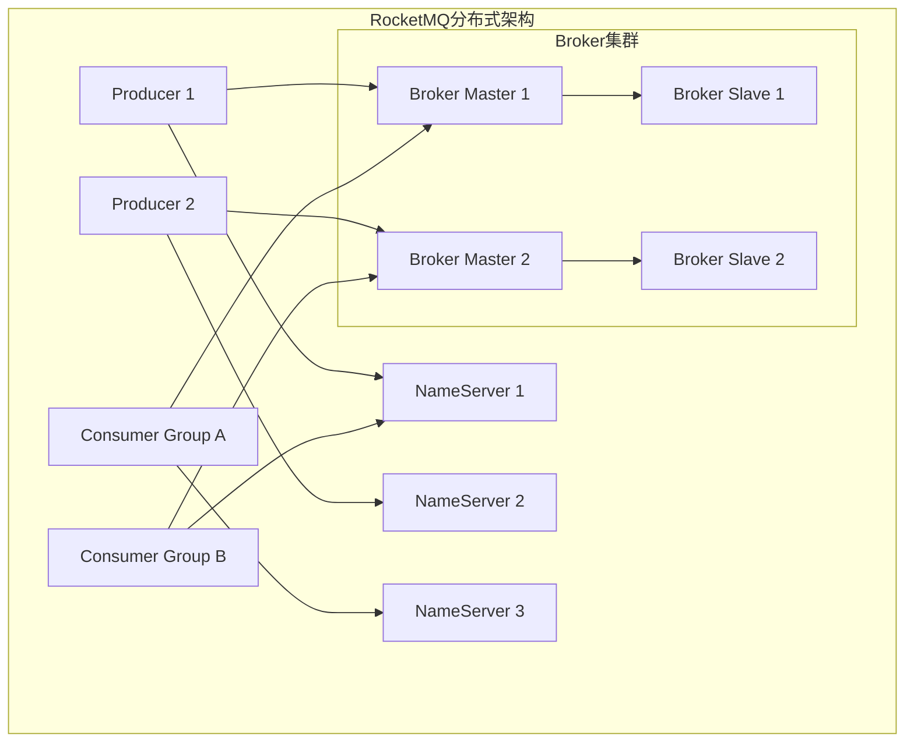
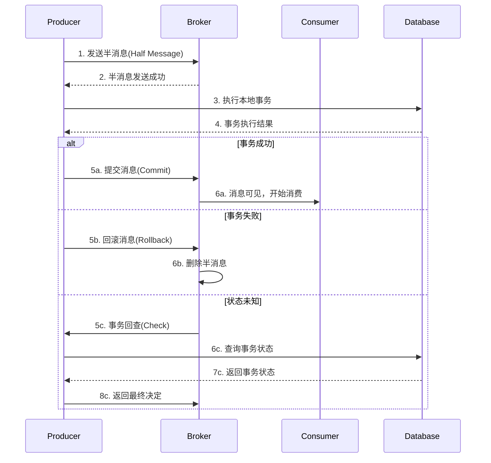
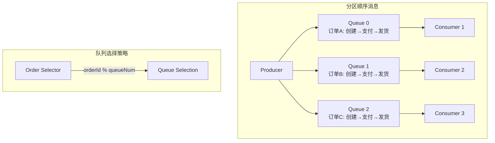
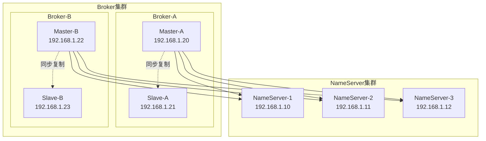

import Tabs from '@theme/Tabs';
import TabItem from '@theme/TabItem';
import CodeBlock from '@theme/CodeBlock';

# RocketMQ分布式消息系统详解

Apache RocketMQ是阿里巴巴开源的分布式消息中间件，经过双11等大规模场景验证，具有高性能、高可靠性、高实时性的分布式特性。RocketMQ在事务消息、顺序消息、延迟消息等方面有着独特优势，是金融级分布式消息解决方案的首选。

:::tip 核心价值
**RocketMQ = 金融级可靠性 + 万亿级消息堆积 + 毫秒级延迟 + 分布式事务**
- 💰 **金融级可靠性**：99.996%超高可用性，支持分布式事务
- 📈 **万亿级堆积**：支持万亿级消息堆积，不影响性能
- ⚡ **毫秒级延迟**：端到端延迟在毫秒级别
- 🔄 **分布式事务**：完整的事务消息解决方案
- 📊 **顺序消息**：支持全局和分区顺序消息
- ⏰ **延迟消息**：支持18个延迟等级的定时消息
:::

## 1. RocketMQ核心架构与设计理念

### 1.1 分布式架构模型

RocketMQ采用分布式集群架构，通过多个组件协同工作，提供高性能、高可靠的消息服务。



#### 核心组件详解

| 组件 | 作用 | 特点 | 部署建议 |
|------|------|------|----------|
| **NameServer** | 路由注册中心 | 无状态、轻量级 | 集群部署，奇数个节点 |
| **Broker** | 消息存储转发 | 支持主从、高可用 | 主从部署，数据同步 |
| **Producer** | 消息生产者 | 负载均衡、故障转移 | 集成到业务应用 |
| **Consumer** | 消息消费者 | 推拉模式、集群消费 | 独立部署或集成 |### 1.2 
RocketMQ应用场景对比

| 应用场景 | 传统方案 | RocketMQ方案 | 核心优势 | 适用规模 |
|---------|---------|-------------|----------|---------|
| **分布式事务** | 2PC/3PC | 事务消息 | 最终一致性、高性能 | 金融支付 |
| **顺序处理** | 单线程处理 | 顺序消息 | 高并发、保序 | 订单状态流转 |
| **延迟任务** | 定时任务 | 延迟消息 | 精确延迟、高可靠 | 定时提醒 |
| **消息堆积** | 数据库存储 | 磁盘存储 | 万亿级堆积能力 | 大数据场景 |
| **广播通知** | 推送服务 | 广播消费 | 一对多、实时性 | 配置更新 |

## 2. 事务消息深度解析

### 2.1 分布式事务原理

RocketMQ的事务消息基于两阶段提交协议，通过半消息机制确保本地事务与消息发送的最终一致性。

<Tabs>
<TabItem value="transaction-flow" label="事务流程">



**事务消息特点**：
- **两阶段提交**：先发送半消息，再根据本地事务结果决定提交或回滚
- **事务回查**：支持事务状态回查机制，确保最终一致性
- **高可靠性**：即使在网络异常情况下也能保证事务的最终一致性

</TabItem>
<TabItem value="java-impl" label="Java实现">

```java title="事务消息完整实现"
@Component
public class TransactionMessageService {
    
    private TransactionMQProducer transactionProducer;
    
    @PostConstruct
    public void init() throws MQClientException {
        // 创建事务生产者
        transactionProducer = new TransactionMQProducer("transaction_producer_group");
        transactionProducer.setNamesrvAddr("localhost:9876");
        
        // 设置事务监听器
        transactionProducer.setTransactionListener(new OrderTransactionListener());
        
        // 设置线程池
        ExecutorService executorService = new ThreadPoolExecutor(
            2, 5, 100, TimeUnit.SECONDS,
            new ArrayBlockingQueue<>(2000),
            r -> {
                Thread thread = new Thread(r);
                thread.setName("client-transaction-msg-check-thread");
                return thread;
            }
        );
        transactionProducer.setExecutorService(executorService);
        
        transactionProducer.start();
        log.info("事务生产者启动成功");
    }
    
    /**
     * 发送事务消息
     */
    public void sendTransactionMessage(OrderCreateEvent event) {
        try {
            Message message = new Message(
                "order_transaction_topic",
                "order_create",
                event.getOrderId(),
                JSON.toJSONBytes(event)
            );
            
            // 发送事务消息，传递本地事务参数
            TransactionSendResult result = transactionProducer.sendMessageInTransaction(
                message, event
            );
            
            log.info("事务消息发送结果: {}, 事务状态: {}", 
                result.getSendStatus(), result.getLocalTransactionState());
                
        } catch (MQClientException e) {
            log.error("发送事务消息失败", e);
            throw new BusinessException("事务消息发送失败", e);
        }
    }
    
    /**
     * 事务监听器实现
     */
    @Component
    public static class OrderTransactionListener implements TransactionListener {
        
        @Autowired
        private OrderService orderService;
        
        @Autowired
        private PaymentService paymentService;
        
        /**
         * 执行本地事务
         */
        @Override
        public LocalTransactionState executeLocalTransaction(Message msg, Object arg) {
            OrderCreateEvent event = (OrderCreateEvent) arg;
            String orderId = event.getOrderId();
            
            log.info("开始执行本地事务，订单ID: {}", orderId);
            
            try {
                // 1. 创建订单
                Order order = orderService.createOrder(event);
                
                // 2. 扣减库存
                boolean stockReduced = orderService.reduceStock(
                    event.getProductId(), event.getQuantity()
                );
                
                if (!stockReduced) {
                    log.warn("库存不足，订单创建失败: {}", orderId);
                    return LocalTransactionState.ROLLBACK_MESSAGE;
                }
                
                // 3. 预扣费用
                boolean paymentReserved = paymentService.reservePayment(
                    event.getUserId(), event.getAmount()
                );
                
                if (!paymentReserved) {
                    log.warn("余额不足，订单创建失败: {}", orderId);
                    // 回滚库存
                    orderService.rollbackStock(event.getProductId(), event.getQuantity());
                    return LocalTransactionState.ROLLBACK_MESSAGE;
                }
                
                log.info("本地事务执行成功，订单ID: {}", orderId);
                return LocalTransactionState.COMMIT_MESSAGE;
                
            } catch (Exception e) {
                log.error("本地事务执行异常，订单ID: {}", orderId, e);
                return LocalTransactionState.UNKNOW;
            }
        }
        
        /**
         * 事务状态回查
         */
        @Override
        public LocalTransactionState checkLocalTransaction(MessageExt msg) {
            String orderId = msg.getKeys();
            log.info("回查本地事务状态，订单ID: {}", orderId);
            
            try {
                // 查询订单状态
                Order order = orderService.getOrderById(orderId);
                
                if (order == null) {
                    log.info("订单不存在，回滚消息: {}", orderId);
                    return LocalTransactionState.ROLLBACK_MESSAGE;
                }
                
                switch (order.getStatus()) {
                    case CREATED:
                    case PAID:
                        log.info("订单状态正常，提交消息: {}", orderId);
                        return LocalTransactionState.COMMIT_MESSAGE;
                        
                    case CANCELLED:
                    case FAILED:
                        log.info("订单已取消或失败，回滚消息: {}", orderId);
                        return LocalTransactionState.ROLLBACK_MESSAGE;
                        
                    default:
                        log.info("订单状态未知，等待下次回查: {}", orderId);
                        return LocalTransactionState.UNKNOW;
                }
                
            } catch (Exception e) {
                log.error("回查事务状态异常，订单ID: {}", orderId, e);
                return LocalTransactionState.UNKNOW;
            }
        }
    }
    
    @PreDestroy
    public void destroy() {
        if (transactionProducer != null) {
            transactionProducer.shutdown();
            log.info("事务生产者关闭成功");
        }
    }
}

/**
 * 事务消息消费者
 */
@Component
@RocketMQMessageListener(
    topic = "order_transaction_topic",
    consumerGroup = "order_transaction_consumer_group",
    messageModel = MessageModel.CLUSTERING
)
public class TransactionMessageConsumer implements RocketMQListener<OrderCreateEvent> {
    
    @Autowired
    private NotificationService notificationService;
    
    @Autowired
    private LogisticsService logisticsService;
    
    @Override
    public void onMessage(OrderCreateEvent event) {
        String orderId = event.getOrderId();
        log.info("接收到订单创建事务消息: {}", orderId);
        
        try {
            // 1. 发送订单确认通知
            notificationService.sendOrderConfirmation(event);
            
            // 2. 创建物流订单
            logisticsService.createShippingOrder(event);
            
            // 3. 更新订单状态
            orderService.updateOrderStatus(orderId, OrderStatus.CONFIRMED);
            
            log.info("订单创建事务消息处理完成: {}", orderId);
            
        } catch (Exception e) {
            log.error("处理订单创建事务消息失败: {}", orderId, e);
            throw new RuntimeException("消息处理失败", e);
        }
    }
}
```

</TabItem>
<TabItem value="use-cases" label="应用场景">

**事务消息典型应用场景**：

1. **电商订单系统**：订单创建与库存扣减的一致性
2. **支付系统**：支付成功与账户变更的一致性  
3. **积分系统**：消费行为与积分增加的一致性
4. **物流系统**：订单确认与物流创建的一致性

```java title="事务消息应用场景"
/**
 * 1. 电商下单场景
 */
public class EcommerceOrderScenario {
    
    public void processOrder(OrderRequest request) {
        // 发送事务消息
        OrderCreateEvent event = new OrderCreateEvent(
            request.getOrderId(),
            request.getUserId(), 
            request.getProductId(),
            request.getQuantity(),
            request.getAmount()
        );
        
        transactionMessageService.sendTransactionMessage(event);
        
        // 本地事务将在TransactionListener中执行：
        // 1. 创建订单记录
        // 2. 扣减商品库存
        // 3. 预扣用户余额
        // 4. 根据执行结果决定消息的提交或回滚
    }
}

/**
 * 2. 支付成功场景
 */
public class PaymentSuccessScenario {
    
    public void handlePaymentSuccess(PaymentEvent event) {
        // 发送事务消息
        PaymentSuccessEvent successEvent = new PaymentSuccessEvent(
            event.getPaymentId(),
            event.getOrderId(),
            event.getAmount(),
            event.getPaymentMethod()
        );
        
        transactionMessageService.sendTransactionMessage(successEvent);
        
        // 本地事务：
        // 1. 更新支付状态
        // 2. 更新订单状态
        // 3. 增加用户积分
        // 4. 创建发票记录
    }
}
```

</TabItem>
</Tabs>

### 2.2 事务消息最佳实践

<Tabs>
<TabItem value="best-practices" label="最佳实践">

**事务消息设计原则**：

1. **幂等性设计**：确保消息处理和本地事务都是幂等的
2. **状态可查询**：本地事务状态必须可以通过业务主键查询
3. **超时处理**：设置合理的事务超时时间
4. **异常处理**：区分业务异常和系统异常

```java title="事务消息最佳实践"
@Component
public class TransactionBestPractices {
    
    /**
     * 1. 幂等性设计
     */
    @Transactional
    public boolean createOrderIdempotent(OrderCreateEvent event) {
        String orderId = event.getOrderId();
        
        // 检查订单是否已存在（幂等性检查）
        Order existingOrder = orderRepository.findByOrderId(orderId);
        if (existingOrder != null) {
            log.info("订单已存在，跳过创建: {}", orderId);
            return true;
        }
        
        // 创建订单
        Order order = new Order();
        order.setOrderId(orderId);
        order.setUserId(event.getUserId());
        order.setAmount(event.getAmount());
        order.setStatus(OrderStatus.CREATED);
        order.setCreateTime(new Date());
        
        orderRepository.save(order);
        log.info("订单创建成功: {}", orderId);
        return true;
    }
    
    /**
     * 2. 状态可查询设计
     */
    public LocalTransactionState checkTransactionState(String orderId) {
        try {
            Order order = orderRepository.findByOrderId(orderId);
            
            if (order == null) {
                // 订单不存在，可能是创建失败
                return LocalTransactionState.ROLLBACK_MESSAGE;
            }
            
            // 根据订单状态判断事务状态
            switch (order.getStatus()) {
                case CREATED:
                case CONFIRMED:
                    return LocalTransactionState.COMMIT_MESSAGE;
                case CANCELLED:
                case FAILED:
                    return LocalTransactionState.ROLLBACK_MESSAGE;
                default:
                    return LocalTransactionState.UNKNOW;
            }
            
        } catch (Exception e) {
            log.error("查询事务状态异常: {}", orderId, e);
            return LocalTransactionState.UNKNOW;
        }
    }
    
    /**
     * 3. 超时和重试配置
     */
    @Bean
    public TransactionMQProducer transactionProducer() {
        TransactionMQProducer producer = new TransactionMQProducer("tx_producer_group");
        producer.setNamesrvAddr("localhost:9876");
        
        // 设置事务超时时间（默认6秒）
        producer.setTransactionTimeOut(10000);
        
        // 设置回查间隔（默认60秒）
        producer.setCheckThreadPoolMinSize(2);
        producer.setCheckThreadPoolMaxSize(5);
        producer.setCheckRequestHoldMax(2000);
        
        return producer;
    }
}
```

</TabItem>
<TabItem value="monitoring" label="监控告警">

```java title="事务消息监控"
@Component
public class TransactionMessageMonitor {
    
    private final MeterRegistry meterRegistry;
    private final Counter transactionSuccessCounter;
    private final Counter transactionFailureCounter;
    private final Timer transactionTimer;
    
    public TransactionMessageMonitor(MeterRegistry meterRegistry) {
        this.meterRegistry = meterRegistry;
        this.transactionSuccessCounter = Counter.builder("transaction.message.success")
            .description("事务消息成功数量")
            .register(meterRegistry);
        this.transactionFailureCounter = Counter.builder("transaction.message.failure")
            .description("事务消息失败数量")
            .register(meterRegistry);
        this.transactionTimer = Timer.builder("transaction.message.duration")
            .description("事务消息处理时长")
            .register(meterRegistry);
    }
    
    /**
     * 记录事务消息指标
     */
    public void recordTransactionMetrics(String orderId, boolean success, long duration) {
        if (success) {
            transactionSuccessCounter.increment();
        } else {
            transactionFailureCounter.increment();
        }
        
        transactionTimer.record(duration, TimeUnit.MILLISECONDS);
        
        log.info("事务消息指标记录 - 订单: {}, 成功: {}, 耗时: {}ms", 
            orderId, success, duration);
    }
    
    /**
     * 检查事务消息健康状态
     */
    @Scheduled(fixedRate = 60000) // 每分钟检查一次
    public void checkTransactionHealth() {
        double successRate = calculateSuccessRate();
        
        if (successRate < 0.95) { // 成功率低于95%告警
            sendAlert("事务消息成功率告警", 
                String.format("当前成功率: %.2f%%", successRate * 100));
        }
        
        // 检查长时间未回查的事务
        checkLongPendingTransactions();
    }
    
    private double calculateSuccessRate() {
        double successCount = transactionSuccessCounter.count();
        double failureCount = transactionFailureCounter.count();
        double totalCount = successCount + failureCount;
        
        return totalCount > 0 ? successCount / totalCount : 1.0;
    }
    
    private void checkLongPendingTransactions() {
        // 查询长时间未确认的事务消息
        // 实现具体的检查逻辑
    }
    
    private void sendAlert(String title, String message) {
        log.error("告警: {} - {}", title, message);
        // 发送告警通知到监控系统
    }
}
```

</TabItem>
</Tabs>

## 3. 顺序消息与延迟消息

### 3.1 顺序消息实现

RocketMQ支持两种顺序消息：全局顺序和分区顺序，通过队列选择器确保消息的有序性。

<Tabs>
<TabItem value="order-concept" label="顺序原理">



**顺序消息特点**：
- **分区顺序**：同一分区内消息严格有序
- **全局顺序**：所有消息全局有序（性能较低）
- **队列选择**：通过MessageQueueSelector选择队列

</TabItem>
<TabItem value="order-impl" label="Java实现">

```java title="顺序消息完整实现"
@Component
public class OrderedMessageService {
    
    private DefaultMQProducer orderedProducer;
    
    @PostConstruct
    public void init() throws MQClientException {
        orderedProducer = new DefaultMQProducer("ordered_producer_group");
        orderedProducer.setNamesrvAddr("localhost:9876");
        orderedProducer.start();
        log.info("顺序消息生产者启动成功");
    }
    
    /**
     * 发送顺序消息
     */
    public void sendOrderedMessage(OrderStatusEvent event) {
        try {
            Message message = new Message(
                "order_status_topic",
                event.getEventType(),
                event.getOrderId(), // 使用orderId作为key
                JSON.toJSONBytes(event)
            );
            
            // 发送顺序消息，使用订单ID作为队列选择因子
            SendResult result = orderedProducer.send(
                message,
                new MessageQueueSelector() {
                    @Override
                    public MessageQueue select(List<MessageQueue> mqs, Message msg, Object arg) {
                        String orderId = (String) arg;
                        // 根据订单ID选择队列，确保同一订单的消息发送到同一队列
                        int index = Math.abs(orderId.hashCode()) % mqs.size();
                        return mqs.get(index);
                    }
                },
                event.getOrderId() // 队列选择参数
            );
            
            log.info("顺序消息发送成功 - 订单: {}, 事件: {}, 队列: {}", 
                event.getOrderId(), event.getEventType(), result.getMessageQueue().getQueueId());
                
        } catch (Exception e) {
            log.error("发送顺序消息失败", e);
            throw new BusinessException("顺序消息发送失败", e);
        }
    }
    
    /**
     * 批量发送订单状态变更消息
     */
    public void sendOrderStatusFlow(String orderId) {
        // 模拟订单状态流转：创建 -> 支付 -> 发货 -> 完成
        List<OrderStatusEvent> events = Arrays.asList(
            new OrderStatusEvent(orderId, "ORDER_CREATED", "订单创建"),
            new OrderStatusEvent(orderId, "ORDER_PAID", "订单支付"),
            new OrderStatusEvent(orderId, "ORDER_SHIPPED", "订单发货"),
            new OrderStatusEvent(orderId, "ORDER_COMPLETED", "订单完成")
        );
        
        // 按顺序发送消息
        for (OrderStatusEvent event : events) {
            sendOrderedMessage(event);
            
            // 模拟业务处理间隔
            try {
                Thread.sleep(100);
            } catch (InterruptedException e) {
                Thread.currentThread().interrupt();
            }
        }
    }
    
    @PreDestroy
    public void destroy() {
        if (orderedProducer != null) {
            orderedProducer.shutdown();
            log.info("顺序消息生产者关闭成功");
        }
    }
}

/**
 * 顺序消息消费者
 */
@Component
@RocketMQMessageListener(
    topic = "order_status_topic",
    consumerGroup = "order_status_consumer_group",
    messageModel = MessageModel.CLUSTERING,
    consumeMode = ConsumeMode.ORDERLY // 顺序消费
)
public class OrderedMessageConsumer implements RocketMQListener<OrderStatusEvent> {
    
    @Autowired
    private OrderService orderService;
    
    @Override
    public void onMessage(OrderStatusEvent event) {
        String orderId = event.getOrderId();
        String eventType = event.getEventType();
        
        log.info("接收到顺序消息 - 订单: {}, 事件: {}", orderId, eventType);
        
        try {
            // 根据事件类型处理业务逻辑
            switch (eventType) {
                case "ORDER_CREATED":
                    handleOrderCreated(event);
                    break;
                case "ORDER_PAID":
                    handleOrderPaid(event);
                    break;
                case "ORDER_SHIPPED":
                    handleOrderShipped(event);
                    break;
                case "ORDER_COMPLETED":
                    handleOrderCompleted(event);
                    break;
                default:
                    log.warn("未知的订单事件类型: {}", eventType);
            }
            
            log.info("顺序消息处理完成 - 订单: {}, 事件: {}", orderId, eventType);
            
        } catch (Exception e) {
            log.error("处理顺序消息失败 - 订单: {}, 事件: {}", orderId, eventType, e);
            throw new RuntimeException("顺序消息处理失败", e);
        }
    }
    
    private void handleOrderCreated(OrderStatusEvent event) {
        orderService.updateOrderStatus(event.getOrderId(), OrderStatus.CREATED);
        log.info("订单创建处理完成: {}", event.getOrderId());
    }
    
    private void handleOrderPaid(OrderStatusEvent event) {
        orderService.updateOrderStatus(event.getOrderId(), OrderStatus.PAID);
        log.info("订单支付处理完成: {}", event.getOrderId());
    }
    
    private void handleOrderShipped(OrderStatusEvent event) {
        orderService.updateOrderStatus(event.getOrderId(), OrderStatus.SHIPPED);
        log.info("订单发货处理完成: {}", event.getOrderId());
    }
    
    private void handleOrderCompleted(OrderStatusEvent event) {
        orderService.updateOrderStatus(event.getOrderId(), OrderStatus.COMPLETED);
        log.info("订单完成处理完成: {}", event.getOrderId());
    }
}
```

</TabItem>
</Tabs>

### 3.2 延迟消息实现

RocketMQ支持18个延迟等级的定时消息，适用于延迟处理场景。

<Tabs>
<TabItem value="delay-levels" label="延迟等级">

```java title="RocketMQ延迟等级"
public class DelayLevels {
    
    /**
     * RocketMQ支持的18个延迟等级
     * 1s 5s 10s 30s 1m 2m 3m 4m 5m 6m 7m 8m 9m 10m 20m 30m 1h 2h
     */
    public static final Map<Integer, String> DELAY_LEVELS = Map.of(
        1, "1s",    2, "5s",    3, "10s",   4, "30s",
        5, "1m",    6, "2m",    7, "3m",    8, "4m",
        9, "5m",    10, "6m",   11, "7m",   12, "8m",
        13, "9m",   14, "10m",  15, "20m",  16, "30m",
        17, "1h",   18, "2h"
    );
    
    /**
     * 常用延迟场景映射
     */
    public static class DelayScenarios {
        public static final int ORDER_TIMEOUT_CHECK = 16;    // 30分钟后检查订单超时
        public static final int PAYMENT_REMINDER = 14;       // 10分钟后支付提醒
        public static final int COUPON_EXPIRE_NOTICE = 17;   // 1小时后优惠券过期提醒
        public static final int RETRY_AFTER_FAILURE = 6;     // 2分钟后重试
    }
}
```

</TabItem>
<TabItem value="delay-impl" label="Java实现">

```java title="延迟消息完整实现"
@Component
public class DelayMessageService {
    
    private DefaultMQProducer delayProducer;
    
    @PostConstruct
    public void init() throws MQClientException {
        delayProducer = new DefaultMQProducer("delay_producer_group");
        delayProducer.setNamesrvAddr("localhost:9876");
        delayProducer.start();
        log.info("延迟消息生产者启动成功");
    }
    
    /**
     * 发送延迟消息
     */
    public void sendDelayMessage(String topic, String tag, Object messageBody, int delayLevel) {
        try {
            Message message = new Message(topic, tag, JSON.toJSONBytes(messageBody));
            
            // 设置延迟等级
            message.setDelayTimeLevel(delayLevel);
            
            SendResult result = delayProducer.send(message);
            
            log.info("延迟消息发送成功 - Topic: {}, 延迟等级: {}, 消息ID: {}", 
                topic, delayLevel, result.getMsgId());
                
        } catch (Exception e) {
            log.error("发送延迟消息失败", e);
            throw new BusinessException("延迟消息发送失败", e);
        }
    }
    
    /**
     * 订单超时检查
     */
    public void scheduleOrderTimeoutCheck(String orderId) {
        OrderTimeoutCheckEvent event = new OrderTimeoutCheckEvent(
            orderId, System.currentTimeMillis()
        );
        
        // 30分钟后检查订单是否超时
        sendDelayMessage(
            "order_timeout_topic",
            "timeout_check",
            event,
            DelayLevels.DelayScenarios.ORDER_TIMEOUT_CHECK
        );
        
        log.info("订单超时检查任务已调度: {}", orderId);
    }
    
    /**
     * 支付提醒
     */
    public void schedulePaymentReminder(String orderId, String userId) {
        PaymentReminderEvent event = new PaymentReminderEvent(
            orderId, userId, System.currentTimeMillis()
        );
        
        // 10分钟后发送支付提醒
        sendDelayMessage(
            "payment_reminder_topic",
            "payment_reminder",
            event,
            DelayLevels.DelayScenarios.PAYMENT_REMINDER
        );
        
        log.info("支付提醒任务已调度 - 订单: {}, 用户: {}", orderId, userId);
    }
    
    /**
     * 失败重试
     */
    public void scheduleRetryTask(RetryTaskEvent event) {
        // 2分钟后重试
        sendDelayMessage(
            "retry_task_topic",
            "retry",
            event,
            DelayLevels.DelayScenarios.RETRY_AFTER_FAILURE
        );
        
        log.info("重试任务已调度 - 任务ID: {}, 重试次数: {}", 
            event.getTaskId(), event.getRetryCount());
    }
    
    @PreDestroy
    public void destroy() {
        if (delayProducer != null) {
            delayProducer.shutdown();
            log.info("延迟消息生产者关闭成功");
        }
    }
}

/**
 * 订单超时检查消费者
 */
@Component
@RocketMQMessageListener(
    topic = "order_timeout_topic",
    consumerGroup = "order_timeout_consumer_group"
)
public class OrderTimeoutConsumer implements RocketMQListener<OrderTimeoutCheckEvent> {
    
    @Autowired
    private OrderService orderService;
    
    @Override
    public void onMessage(OrderTimeoutCheckEvent event) {
        String orderId = event.getOrderId();
        log.info("执行订单超时检查: {}", orderId);
        
        try {
            Order order = orderService.getOrderById(orderId);
            
            if (order == null) {
                log.warn("订单不存在: {}", orderId);
                return;
            }
            
            // 检查订单是否已支付
            if (order.getStatus() == OrderStatus.CREATED) {
                // 订单未支付，执行超时处理
                orderService.handleOrderTimeout(orderId);
                log.info("订单超时处理完成: {}", orderId);
            } else {
                log.info("订单已支付，无需超时处理: {}", orderId);
            }
            
        } catch (Exception e) {
            log.error("订单超时检查失败: {}", orderId, e);
            throw new RuntimeException("订单超时检查失败", e);
        }
    }
}

/**
 * 支付提醒消费者
 */
@Component
@RocketMQMessageListener(
    topic = "payment_reminder_topic",
    consumerGroup = "payment_reminder_consumer_group"
)
public class PaymentReminderConsumer implements RocketMQListener<PaymentReminderEvent> {
    
    @Autowired
    private NotificationService notificationService;
    
    @Override
    public void onMessage(PaymentReminderEvent event) {
        String orderId = event.getOrderId();
        String userId = event.getUserId();
        
        log.info("执行支付提醒 - 订单: {}, 用户: {}", orderId, userId);
        
        try {
            // 检查订单是否仍需要支付
            Order order = orderService.getOrderById(orderId);
            
            if (order != null && order.getStatus() == OrderStatus.CREATED) {
                // 发送支付提醒通知
                notificationService.sendPaymentReminder(userId, orderId);
                log.info("支付提醒发送成功 - 订单: {}", orderId);
            } else {
                log.info("订单已支付或不存在，跳过提醒 - 订单: {}", orderId);
            }
            
        } catch (Exception e) {
            log.error("支付提醒处理失败 - 订单: {}", orderId, e);
            throw new RuntimeException("支付提醒处理失败", e);
        }
    }
}
```

</TabItem>
</Tabs>

## 4. 高可用集群架构

### 4.1 集群部署模式

<Tabs>
<TabItem value="cluster-arch" label="集群架构">



**集群特点**：
- **NameServer集群**：无状态，任意节点宕机不影响服务
- **Broker主从**：支持同步/异步复制，主节点宕机从节点可读
- **多Master模式**：支持多Master部署，提高并发能力

</TabItem>
<TabItem value="cluster-config" label="集群配置">

```bash title="RocketMQ集群配置"
# NameServer配置 (namesrv.conf)
# 无需特殊配置，启动多个实例即可
rocketmqHome=/opt/rocketmq
kvConfigPath=/opt/rocketmq/namesrv/kvConfig.json
configStorePath=/opt/rocketmq/namesrv/namesrv.properties
listenPort=9876

# Broker Master配置 (broker-a.conf)
brokerClusterName=DefaultCluster
brokerName=broker-a
brokerId=0
deleteWhen=04
fileReservedTime=48
brokerRole=SYNC_MASTER
flushDiskType=ASYNC_FLUSH

# 网络配置
namesrvAddr=192.168.1.10:9876;192.168.1.11:9876;192.168.1.12:9876
listenPort=10911
brokerIP1=192.168.1.20

# 存储配置
storePathRootDir=/opt/rocketmq/store
storePathCommitLog=/opt/rocketmq/store/commitlog
storePathConsumeQueue=/opt/rocketmq/store/consumequeue
storePathIndex=/opt/rocketmq/store/index

# 性能配置
sendMessageThreadPoolNums=128
pullMessageThreadPoolNums=128
queryMessageThreadPoolNums=8
adminBrokerThreadPoolNums=16
clientManagerThreadPoolNums=32

# Broker Slave配置 (broker-a-s.conf)
brokerClusterName=DefaultCluster
brokerName=broker-a
brokerId=1
deleteWhen=04
fileReservedTime=48
brokerRole=SLAVE
flushDiskType=ASYNC_FLUSH

namesrvAddr=192.168.1.10:9876;192.168.1.11:9876;192.168.1.12:9876
listenPort=10921
brokerIP1=192.168.1.21

# 启动脚本
#!/bin/bash
# 启动NameServer集群
nohup sh mqnamesrv > /dev/null 2>&1 &

# 启动Broker Master
nohup sh mqbroker -c broker-a.conf > /dev/null 2>&1 &

# 启动Broker Slave  
nohup sh mqbroker -c broker-a-s.conf > /dev/null 2>&1 &
```

</TabItem>
<TabItem value="ha-config" label="高可用配置">

```java title="高可用客户端配置"
@Configuration
public class RocketMQHighAvailabilityConfig {
    
    /**
     * 高可用生产者配置
     */
    @Bean
    public DefaultMQProducer haProducer() throws MQClientException {
        DefaultMQProducer producer = new DefaultMQProducer("ha_producer_group");
        
        // 配置多个NameServer地址
        producer.setNamesrvAddr("192.168.1.10:9876;192.168.1.11:9876;192.168.1.12:9876");
        
        // 发送超时时间
        producer.setSendMsgTimeout(10000);
        
        // 发送失败重试次数
        producer.setRetryTimesWhenSendFailed(3);
        producer.setRetryTimesWhenSendAsyncFailed(3);
        
        // 压缩消息体阈值
        producer.setCompressMsgBodyOverHowmuch(4096);
        
        // 最大消息大小
        producer.setMaxMessageSize(4 * 1024 * 1024);
        
        producer.start();
        return producer;
    }
    
    /**
     * 高可用消费者配置
     */
    @Bean
    public DefaultMQPushConsumer haConsumer() throws MQClientException {
        DefaultMQPushConsumer consumer = new DefaultMQPushConsumer("ha_consumer_group");
        
        // 配置多个NameServer地址
        consumer.setNamesrvAddr("192.168.1.10:9876;192.168.1.11:9876;192.168.1.12:9876");
        
        // 消费模式
        consumer.setMessageModel(MessageModel.CLUSTERING);
        
        // 消费线程数
        consumer.setConsumeThreadMin(10);
        consumer.setConsumeThreadMax(20);
        
        // 批量消费数量
        consumer.setConsumeMessageBatchMaxSize(10);
        
        // 消息拉取间隔
        consumer.setPullInterval(1000);
        
        // 消息拉取批次大小
        consumer.setPullBatchSize(32);
        
        consumer.start();
        return consumer;
    }
    
    /**
     * 连接监控和故障转移
     */
    @Component
    public static class ConnectionMonitor {
        
        @EventListener
        public void handleConnectionEvent(ConnectionEvent event) {
            if (event.getType() == ConnectionEventType.DISCONNECT) {
                log.warn("RocketMQ连接断开: {}", event.getRemoteAddr());
                // 触发重连逻辑
                handleReconnection(event);
            } else if (event.getType() == ConnectionEventType.CONNECT) {
                log.info("RocketMQ连接恢复: {}", event.getRemoteAddr());
            }
        }
        
        private void handleReconnection(ConnectionEvent event) {
            // 实现重连逻辑
            // 1. 记录连接失败信息
            // 2. 尝试连接其他NameServer
            // 3. 发送告警通知
        }
    }
}
```

</TabItem>
</Tabs>

## 5. 性能优化与监控

### 5.1 性能优化策略

<Tabs>
<TabItem value="performance-tuning" label="性能调优">

```java title="RocketMQ性能优化配置"
@Configuration
public class RocketMQPerformanceConfig {
    
    /**
     * 高性能生产者配置
     */
    @Bean
    public DefaultMQProducer highPerformanceProducer() throws MQClientException {
        DefaultMQProducer producer = new DefaultMQProducer("high_perf_producer");
        producer.setNamesrvAddr("localhost:9876");
        
        // 异步发送配置
        producer.setRetryTimesWhenSendAsyncFailed(0);
        producer.setSendMsgTimeout(3000);
        
        // 批量发送配置
        producer.setMaxMessageSize(4 * 1024 * 1024);
        producer.setCompressMsgBodyOverHowmuch(4096);
        
        // 客户端配置
        producer.setClientCallbackExecutorThreads(Runtime.getRuntime().availableProcessors());
        
        producer.start();
        return producer;
    }
    
    /**
     * 批量消息发送
     */
    @Service
    public static class BatchMessageService {
        
        @Autowired
        private DefaultMQProducer producer;
        
        /**
         * 批量发送消息
         */
        public void sendBatchMessages(List<MessageEvent> events) {
            if (events.isEmpty()) {
                return;
            }
            
            try {
                List<Message> messages = events.stream()
                    .map(event -> new Message(
                        event.getTopic(),
                        event.getTag(),
                        event.getKey(),
                        JSON.toJSONBytes(event)
                    ))
                    .collect(Collectors.toList());
                
                // 批量发送
                SendResult result = producer.send(messages);
                log.info("批量消息发送成功，数量: {}, 消息ID: {}", 
                    messages.size(), result.getMsgId());
                    
            } catch (Exception e) {
                log.error("批量消息发送失败", e);
                throw new BusinessException("批量消息发送失败", e);
            }
        }
        
        /**
         * 异步批量发送
         */
        public void sendBatchMessagesAsync(List<MessageEvent> events) {
            if (events.isEmpty()) {
                return;
            }
            
            try {
                List<Message> messages = events.stream()
                    .map(event -> new Message(
                        event.getTopic(),
                        event.getTag(), 
                        event.getKey(),
                        JSON.toJSONBytes(event)
                    ))
                    .collect(Collectors.toList());
                
                // 异步批量发送
                producer.send(messages, new SendCallback() {
                    @Override
                    public void onSuccess(SendResult sendResult) {
                        log.info("异步批量消息发送成功，数量: {}, 消息ID: {}", 
                            messages.size(), sendResult.getMsgId());
                    }
                    
                    @Override
                    public void onException(Throwable e) {
                        log.error("异步批量消息发送失败，数量: {}", messages.size(), e);
                    }
                });
                
            } catch (Exception e) {
                log.error("异步批量消息发送失败", e);
                throw new BusinessException("异步批量消息发送失败", e);
            }
        }
    }
}
```

</TabItem>
<TabItem value="monitoring" label="监控指标">

```java title="RocketMQ监控指标"
@Component
public class RocketMQMonitor {
    
    private final MeterRegistry meterRegistry;
    private final Counter messagesSentCounter;
    private final Counter messagesConsumedCounter;
    private final Timer sendLatencyTimer;
    private final Gauge queueDepthGauge;
    
    public RocketMQMonitor(MeterRegistry meterRegistry) {
        this.meterRegistry = meterRegistry;
        
        this.messagesSentCounter = Counter.builder("rocketmq.messages.sent")
            .description("发送消息总数")
            .register(meterRegistry);
            
        this.messagesConsumedCounter = Counter.builder("rocketmq.messages.consumed")
            .description("消费消息总数")
            .register(meterRegistry);
            
        this.sendLatencyTimer = Timer.builder("rocketmq.send.latency")
            .description("消息发送延迟")
            .register(meterRegistry);
            
        this.queueDepthGauge = Gauge.builder("rocketmq.queue.depth")
            .description("队列深度")
            .register(meterRegistry, this, RocketMQMonitor::getQueueDepth);
    }
    
    /**
     * 记录消息发送指标
     */
    public void recordMessageSent(String topic, long latency) {
        messagesSentCounter.increment(Tags.of("topic", topic));
        sendLatencyTimer.record(latency, TimeUnit.MILLISECONDS);
    }
    
    /**
     * 记录消息消费指标
     */
    public void recordMessageConsumed(String topic, String consumerGroup) {
        messagesConsumedCounter.increment(
            Tags.of("topic", topic, "consumer_group", consumerGroup)
        );
    }
    
    /**
     * 获取队列深度
     */
    private double getQueueDepth() {
        // 实现队列深度查询逻辑
        // 可以通过RocketMQ Admin工具查询
        return 0.0;
    }
    
    /**
     * 健康检查
     */
    @Scheduled(fixedRate = 60000)
    public void healthCheck() {
        try {
            // 检查生产者状态
            checkProducerHealth();
            
            // 检查消费者状态
            checkConsumerHealth();
            
            // 检查Broker连接状态
            checkBrokerConnection();
            
        } catch (Exception e) {
            log.error("RocketMQ健康检查失败", e);
        }
    }
    
    private void checkProducerHealth() {
        // 实现生产者健康检查
    }
    
    private void checkConsumerHealth() {
        // 实现消费者健康检查
    }
    
    private void checkBrokerConnection() {
        // 实现Broker连接检查
    }
    
    /**
     * 性能报告
     */
    @Scheduled(fixedRate = 300000) // 每5分钟生成一次报告
    public void generatePerformanceReport() {
        double sendTps = messagesSentCounter.count() / 300.0; // 5分钟内的TPS
        double consumeTps = messagesConsumedCounter.count() / 300.0;
        double avgLatency = sendLatencyTimer.mean(TimeUnit.MILLISECONDS);
        
        log.info("RocketMQ性能报告 - 发送TPS: {}, 消费TPS: {}, 平均延迟: {}ms", 
            String.format("%.2f", sendTps),
            String.format("%.2f", consumeTps),
            String.format("%.2f", avgLatency)
        );
        
        // 重置计数器
        meterRegistry.remove(messagesSentCounter);
        meterRegistry.remove(messagesConsumedCounter);
    }
}
```

</TabItem>
</Tabs>

## 6. 最佳实践与总结

### 6.1 架构设计最佳实践

**消息设计原则**：
1. **Topic规划**：按业务域划分Topic，避免过多细分
2. **消息幂等**：确保消息处理的幂等性
3. **消息大小**：单条消息不超过4MB，批量消息不超过1MB
4. **消息Key**：设置有意义的消息Key，便于问题排查

**性能优化建议**：
1. **异步发送**：优先使用异步发送提高吞吐量
2. **批量操作**：使用批量发送和消费
3. **合理配置**：根据业务特点调整线程池和缓冲区大小
4. **监控告警**：建立完善的监控体系

**高可用设计**：
1. **集群部署**：NameServer和Broker都要集群部署
2. **主从复制**：配置Broker主从同步复制
3. **故障转移**：客户端支持自动故障转移
4. **数据备份**：定期备份重要的消息数据

### 6.2 RocketMQ vs 其他消息队列

| 特性对比 | RocketMQ | Kafka | RabbitMQ | 适用场景 |
|---------|----------|-------|----------|----------|
| **事务消息** | ⭐⭐⭐⭐⭐ | ⭐⭐⭐ | ⭐⭐ | 金融支付 |
| **顺序消息** | ⭐⭐⭐⭐⭐ | ⭐⭐⭐⭐ | ⭐⭐⭐ | 状态流转 |
| **延迟消息** | ⭐⭐⭐⭐⭐ | ⭐⭐ | ⭐⭐⭐ | 定时任务 |
| **消息堆积** | ⭐⭐⭐⭐⭐ | ⭐⭐⭐⭐⭐ | ⭐⭐⭐ | 大数据场景 |
| **运维复杂度** | ⭐⭐⭐ | ⭐⭐ | ⭐⭐⭐⭐ | 团队技术水平 |
| **社区生态** | ⭐⭐⭐⭐ | ⭐⭐⭐⭐⭐ | ⭐⭐⭐⭐⭐ | 技术选型 |

:::tip RocketMQ学习建议
1. **掌握核心特性**：深入理解事务消息、顺序消息、延迟消息
2. **实践业务场景**：在实际项目中应用RocketMQ解决业务问题
3. **性能调优**：学会分析和优化RocketMQ性能
4. **运维监控**：掌握集群部署和监控告警
5. **源码学习**：有条件的话可以学习RocketMQ源码实现
:::

---

RocketMQ作为阿里巴巴开源的分布式消息中间件，在金融级应用场景中表现出色。通过合理的架构设计和性能优化，可以构建高可用、高性能的消息系统，特别适合对可靠性要求极高的业务场景。