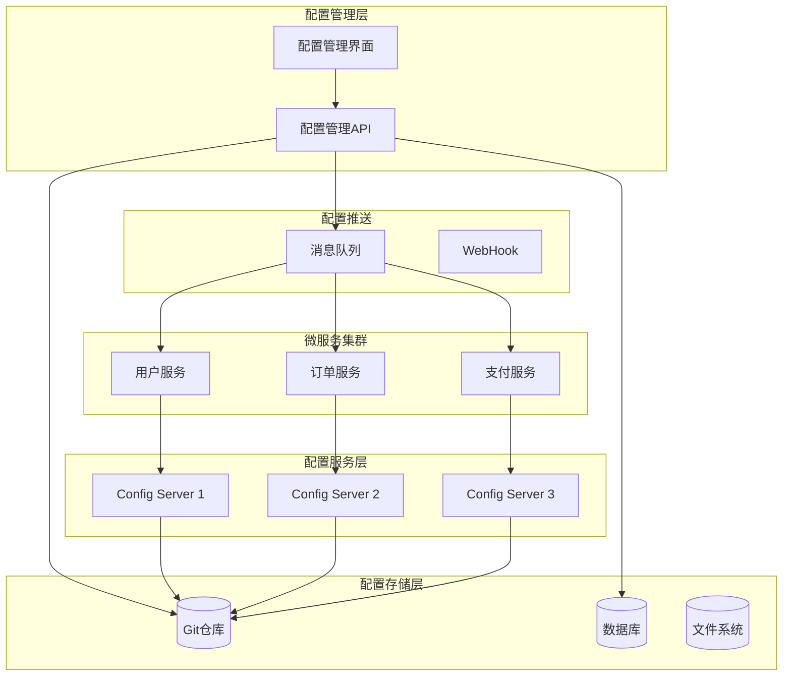

import Tabs from '@theme/Tabs';
import TabItem from '@theme/TabItem';
import CodeBlock from '@theme/CodeBlock';

# 配置中心详解

在微服务架构中，配置管理是一个重要的挑战。配置中心提供了集中化的配置管理能力，支持配置的动态刷新、多环境隔离、灰度发布等功能，是微服务架构的重要组成部分。

:::tip 核心价值
配置中心 = 集中管理 + 动态刷新 + 多环境隔离 + 灰度发布 + 安全审计
:::

## 配置中心架构



## 配置中心方案对比

<Tabs>
<TabItem value="spring-cloud-config" label="Spring Cloud Config">

```yaml
# Config Server配置
spring:
  application:
    name: config-server
  cloud:
    config:
      server:
        git:
          uri: https://github.com/your-org/config-repo
          username: your-username
          password: your-password
          search-paths: config
          default-label: main
          clone-on-start: true
```

**特点**：
- ✅ Spring生态集成度高
- ✅ 支持Git、SVN等多种存储
- ✅ 支持配置加密
- ❌ 功能相对简单
- ❌ 界面管理能力弱

</TabItem>
<TabItem value="nacos" label="Nacos">

```yaml
# Nacos配置
spring:
  cloud:
    nacos:
      config:
        server-addr: localhost:8848
        file-extension: yaml
        group: DEFAULT_GROUP
        namespace: public
        refresh-enabled: true
```

**特点**：
- ✅ 功能全面，支持配置和服务发现
- ✅ 界面友好，操作简单
- ✅ 支持多环境、多租户
- ✅ 中文文档丰富
- ❌ 相对较新，生态不如Spring

</TabItem>
<TabItem value="apollo" label="Apollo">

```properties
# Apollo配置
app.id=user-service
apollo.meta=http://localhost:8080
apollo.bootstrap.enabled=true
apollo.bootstrap.namespaces=application,user-service
```

**特点**：
- ✅ 功能强大，企业级特性丰富
- ✅ 支持灰度发布
- ✅ 权限管理完善
- ✅ 监控和审计功能强
- ❌ 部署复杂，学习成本高

</TabItem>
</Tabs>

## 1. 配置中心基础概念

### 1.1 什么是配置中心？

配置中心是微服务架构中的一个重要组件，它负责管理所有服务的配置信息，提供配置的统一存储、分发、更新和版本管理功能。

#### 配置中心的核心功能
```java title="配置中心核心功能示例"
public class ConfigCenterFeatures {
    /*
     * 配置中心的核心功能
     * 1. 配置存储：集中存储所有服务的配置信息
     * 2. 配置分发：将配置信息分发给各个服务
     * 3. 动态刷新：支持配置的动态更新和实时生效
     * 4. 版本管理：管理配置的版本历史和回滚
     * 5. 环境隔离：支持多环境配置隔离
     * 6. 安全控制：提供配置的访问控制和加密
     */
    
    // 配置项定义
    public class ConfigItem {
        private String key;           // 配置键
        private String value;         // 配置值
        private String description;   // 配置描述
        private String type;          // 配置类型
        private boolean encrypted;    // 是否加密
        private String environment;   // 环境
        private String application;   // 应用名称
        private long version;         // 版本号
        private long createTime;      // 创建时间
        private long updateTime;      // 更新时间
        private String createdBy;     // 创建人
        private String updatedBy;     // 更新人
        
        // 构造函数、getter、setter方法
    }
    
    // 配置存储接口
    public interface ConfigStorage {
        // 存储配置
        void store(String application, String environment, String key, String value);
        
        // 获取配置
        String get(String application, String environment, String key);
        
        // 删除配置
        void delete(String application, String environment, String key);
        
        // 获取所有配置
        Map<String, String> getAll(String application, String environment);
        
        // 检查配置是否存在
        boolean exists(String application, String environment, String key);
    }
    
    // 配置分发接口
    public interface ConfigDistribution {
        // 分发配置到指定应用
        void distribute(String application, String environment, Map<String, String> configs);
        
        // 广播配置变更
        void broadcast(String application, String environment, String key, String value);
        
        // 订阅配置变更
        void subscribe(String application, String environment, ConfigChangeListener listener);
        
        // 取消订阅
        void unsubscribe(String application, String environment, ConfigChangeListener listener);
    }
    
    // 配置变更监听器
    public interface ConfigChangeListener {
        // 配置变更回调
        void onChange(String key, String oldValue, String newValue);
        
        // 批量配置变更回调
        void onBatchChange(Map<String, ConfigChange> changes);
    }
    
    // 配置变更事件
    public class ConfigChange {
        private String key;
        private String oldValue;
        private String newValue;
        private ChangeType changeType;
        
        public enum ChangeType {
            ADD, UPDATE, DELETE
        }
        
        // 构造函数、getter、setter方法
    }
}
```

### 1.2 配置中心架构模式

#### 推拉结合模式
```java title="推拉结合模式示例"
public class PushPullArchitecture {
    /*
     * 推拉结合模式
     * 1. 启动时拉取：服务启动时从配置中心拉取配置
     * 2. 运行时推送：配置变更时主动推送给服务
     * 3. 定时拉取：定期拉取配置确保一致性
     * 4. 长轮询：使用长轮询实现实时推送
     */
    
    // 配置客户端
    public class ConfigClient {
        private final ConfigStorage configStorage;
        private final ConfigDistribution configDistribution;
        private final Map<String, String> localConfig = new ConcurrentHashMap<>();
        private final ScheduledExecutorService scheduler = Executors.newScheduledThreadPool(1);
        
        public ConfigClient(ConfigStorage configStorage, ConfigDistribution configDistribution) {
            this.configStorage = configStorage;
            this.configDistribution = configDistribution;
            
            // 启动时拉取配置
            pullConfigOnStartup();
            
            // 订阅配置变更
            subscribeConfigChanges();
            
            // 定时拉取配置
            schedulePeriodicPull();
        }
        
        // 启动时拉取配置
        private void pullConfigOnStartup() {
            Map<String, String> configs = configStorage.getAll(getApplicationName(), getEnvironment());
            localConfig.putAll(configs);
        }
        
        // 订阅配置变更
        private void subscribeConfigChanges() {
            configDistribution.subscribe(getApplicationName(), getEnvironment(), new ConfigChangeListener() {
                @Override
                public void onChange(String key, String oldValue, String newValue) {
                    localConfig.put(key, newValue);
                    notifyConfigChange(key, oldValue, newValue);
                }
                
                @Override
                public void onBatchChange(Map<String, ConfigChange> changes) {
                    for (Map.Entry<String, ConfigChange> entry : changes.entrySet()) {
                        ConfigChange change = entry.getValue();
                        localConfig.put(change.getKey(), change.getNewValue());
                    }
                    notifyBatchConfigChange(changes);
                }
            });
        }
        
        // 定时拉取配置
        private void schedulePeriodicPull() {
            scheduler.scheduleAtFixedRate(() -> {
                try {
                    Map<String, String> remoteConfigs = configStorage.getAll(getApplicationName(), getEnvironment());
                    Map<String, String> changes = new HashMap<>();
                    
                    for (Map.Entry<String, String> entry : remoteConfigs.entrySet()) {
                        String key = entry.getKey();
                        String newValue = entry.getValue();
                        String oldValue = localConfig.get(key);
                        
                        if (!Objects.equals(oldValue, newValue)) {
                            changes.put(key, newValue);
                            localConfig.put(key, newValue);
                        }
                    }
                    
                    if (!changes.isEmpty()) {
                        notifyBatchConfigChange(changes);
                    }
                } catch (Exception e) {
                    log.error("Failed to pull config", e);
                }
            }, 30, 30, TimeUnit.SECONDS);
        }
        
        // 获取配置
        public String getConfig(String key) {
            return localConfig.get(key);
        }
        
        // 获取配置（带默认值）
        public String getConfig(String key, String defaultValue) {
            return localConfig.getOrDefault(key, defaultValue);
        }
        
        // 获取所有配置
        public Map<String, String> getAllConfig() {
            return new HashMap<>(localConfig);
        }
        
        // 通知配置变更
        private void notifyConfigChange(String key, String oldValue, String newValue) {
            // 通知应用配置变更
            ApplicationContext context = getApplicationContext();
            if (context != null) {
                context.publishEvent(new ConfigChangeEvent(key, oldValue, newValue));
            }
        }
        
        // 通知批量配置变更
        private void notifyBatchConfigChange(Map<String, String> changes) {
            // 通知应用批量配置变更
            ApplicationContext context = getApplicationContext();
            if (context != null) {
                context.publishEvent(new BatchConfigChangeEvent(changes));
            }
        }
    }
    
    // 长轮询实现
    public class LongPollingClient {
        private final String configServerUrl;
        private final HttpClient httpClient;
        private final ScheduledExecutorService scheduler = Executors.newScheduledThreadPool(1);
        
        public LongPollingClient(String configServerUrl) {
            this.configServerUrl = configServerUrl;
            this.httpClient = HttpClient.create();
        }
        
        // 开始长轮询
        public void startLongPolling() {
            scheduler.submit(this::doLongPolling);
        }
        
        // 执行长轮询
        private void doLongPolling() {
            while (!Thread.currentThread().isInterrupted()) {
                try {
                    // 发送长轮询请求
                    String response = httpClient.get()
                        .uri(configServerUrl + "/config/long-polling")
                        .retrieve()
                        .bodyToMono(String.class)
                        .timeout(Duration.ofSeconds(30))
                        .block();
                    
                    // 处理响应
                    if (response != null) {
                        handleConfigChange(response);
                    }
                } catch (Exception e) {
                    log.error("Long polling failed", e);
                    // 等待一段时间后重试
                    Thread.sleep(5000);
                }
            }
        }
        
        // 处理配置变更
        private void handleConfigChange(String response) {
            // 解析响应并处理配置变更
            ConfigChangeEvent event = parseConfigChange(response);
            if (event != null) {
                notifyConfigChange(event);
            }
        }
        
        // 解析配置变更
        private ConfigChangeEvent parseConfigChange(String response) {
            // 解析响应JSON
            try {
                ObjectMapper mapper = new ObjectMapper();
                return mapper.readValue(response, ConfigChangeEvent.class);
            } catch (Exception e) {
                log.error("Failed to parse config change", e);
                return null;
            }
        }
    }
}
```

### 1.3 配置中心优势与挑战

#### 核心优势
```java title="配置中心优势示例"
public class ConfigCenterAdvantages {
    /*
     * 配置中心的核心优势
     * 1. 集中管理：所有配置集中存储，便于管理
     * 2. 动态刷新：支持配置的动态更新，无需重启服务
     * 3. 环境隔离：支持多环境配置隔离
     * 4. 版本管理：支持配置的版本历史和回滚
     * 5. 安全控制：提供配置的访问控制和加密
     * 6. 审计追踪：记录配置的变更历史
     */
    
    // 集中管理示例
    public class CentralizedManagement {
        private final ConfigStorage configStorage;
        
        public void manageConfigs() {
            // 统一管理所有应用的配置
            String[] applications = {"user-service", "order-service", "payment-service"};
            String[] environments = {"dev", "test", "prod"};
            
            for (String app : applications) {
                for (String env : environments) {
                    // 批量更新配置
                    updateConfigs(app, env);
                    // 批量验证配置
                    validateConfigs(app, env);
                    // 批量发布配置
                    publishConfigs(app, env);
                }
            }
        }
        
        private void updateConfigs(String application, String environment) {
            // 更新配置逻辑
            Map<String, String> configs = new HashMap<>();
            configs.put("database.url", "jdbc:mysql://localhost:3306/" + application);
            configs.put("redis.host", "localhost");
            configs.put("redis.port", "6379");
            
            for (Map.Entry<String, String> entry : configs.entrySet()) {
                configStorage.store(application, environment, entry.getKey(), entry.getValue());
            }
        }
    }
    
    // 动态刷新示例
    public class DynamicRefresh {
        private final ConfigClient configClient;
        private final ApplicationContext applicationContext;
        
        public void refreshConfig(String key, String newValue) {
            // 更新配置
            configClient.updateConfig(key, newValue);
            
            // 通知应用刷新
            applicationContext.publishEvent(new RefreshEvent());
            
            // 记录刷新日志
            log.info("Config refreshed: {} = {}", key, newValue);
        }
        
        // 批量刷新
        public void batchRefresh(Map<String, String> configs) {
            for (Map.Entry<String, String> entry : configs.entrySet()) {
                refreshConfig(entry.getKey(), entry.getValue());
            }
        }
    }
    
    // 环境隔离示例
    public class EnvironmentIsolation {
        private final ConfigStorage configStorage;
        
        public void isolateEnvironments() {
            // 开发环境配置
            Map<String, String> devConfigs = new HashMap<>();
            devConfigs.put("database.url", "jdbc:mysql://dev-db:3306/app");
            devConfigs.put("log.level", "DEBUG");
            devConfigs.put("feature.enabled", "true");
            
            // 测试环境配置
            Map<String, String> testConfigs = new HashMap<>();
            testConfigs.put("database.url", "jdbc:mysql://test-db:3306/app");
            testConfigs.put("log.level", "INFO");
            testConfigs.put("feature.enabled", "true");
            
            // 生产环境配置
            Map<String, String> prodConfigs = new HashMap<>();
            prodConfigs.put("database.url", "jdbc:mysql://prod-db:3306/app");
            prodConfigs.put("log.level", "WARN");
            prodConfigs.put("feature.enabled", "false");
            
            // 存储不同环境的配置
            storeConfigs("user-service", "dev", devConfigs);
            storeConfigs("user-service", "test", testConfigs);
            storeConfigs("user-service", "prod", prodConfigs);
        }
        
        private void storeConfigs(String application, String environment, Map<String, String> configs) {
            for (Map.Entry<String, String> entry : configs.entrySet()) {
                configStorage.store(application, environment, entry.getKey(), entry.getValue());
            }
        }
    }
}
```

#### 主要挑战
```java title="配置中心挑战示例"
public class ConfigCenterChallenges {
    /*
     * 配置中心面临的主要挑战
     * 1. 配置一致性：确保所有服务实例的配置一致
     * 2. 配置安全性：保护敏感配置信息
     * 3. 配置性能：快速响应配置查询和更新
     * 4. 配置依赖：处理配置项之间的依赖关系
     * 5. 配置冲突：解决配置冲突和优先级问题
     * 6. 配置回滚：支持配置的快速回滚
     */
    
    // 配置一致性
    public class ConfigConsistency {
        private final ConfigStorage configStorage;
        private final ConfigDistribution configDistribution;
        
        public void ensureConsistency(String application, String environment) {
            // 获取所有服务实例
            List<String> instances = getServiceInstances(application);
            
            // 获取当前配置
            Map<String, String> currentConfig = configStorage.getAll(application, environment);
            
            // 向所有实例推送配置
            for (String instance : instances) {
                try {
                    configDistribution.distribute(instance, environment, currentConfig);
                } catch (Exception e) {
                    log.error("Failed to distribute config to instance: {}", instance, e);
                    // 记录不一致的实例
                    recordInconsistentInstance(instance);
                }
            }
            
            // 验证配置一致性
            validateConsistency(application, environment);
        }
        
        private void validateConsistency(String application, String environment) {
            List<String> instances = getServiceInstances(application);
            Map<String, String> expectedConfig = configStorage.getAll(application, environment);
            
            for (String instance : instances) {
                Map<String, String> actualConfig = getInstanceConfig(instance, environment);
                if (!Objects.equals(expectedConfig, actualConfig)) {
                    log.warn("Config inconsistency detected for instance: {}", instance);
                    // 触发配置同步
                    syncConfig(instance, environment, expectedConfig);
                }
            }
        }
    }
    
    // 配置安全性
    public class ConfigSecurity {
        private final EncryptionService encryptionService;
        private final AccessControlService accessControlService;
        
        public void secureConfig(String key, String value) {
            // 检查是否需要加密
            if (isSensitiveConfig(key)) {
                value = encryptionService.encrypt(value);
            }
            
            // 检查访问权限
            if (!accessControlService.hasPermission(getCurrentUser(), key)) {
                throw new AccessDeniedException("No permission to access config: " + key);
            }
            
            // 记录访问日志
            logAccess(key, "READ");
        }
        
        public String getSecureConfig(String key) {
            // 检查访问权限
            if (!accessControlService.hasPermission(getCurrentUser(), key)) {
                throw new AccessDeniedException("No permission to access config: " + key);
            }
            
            // 获取配置值
            String value = configStorage.get(getApplicationName(), getEnvironment(), key);
            
            // 解密敏感配置
            if (isSensitiveConfig(key)) {
                value = encryptionService.decrypt(value);
            }
            
            // 记录访问日志
            logAccess(key, "READ");
            
            return value;
        }
        
        private boolean isSensitiveConfig(String key) {
            return key.contains("password") || 
                   key.contains("secret") || 
                   key.contains("token") || 
                   key.contains("key");
        }
    }
}
```

:::info 配置中心设计原则
1. **集中管理**：所有配置集中存储和管理
2. **动态刷新**：支持配置的动态更新和实时生效
3. **环境隔离**：支持多环境配置隔离
4. **安全控制**：提供配置的访问控制和加密
5. **版本管理**：支持配置的版本历史和回滚
6. **性能优化**：确保配置查询和更新的高性能
:::

## 2. Spring Cloud Config 详解

### 2.1 Spring Cloud Config 架构

Spring Cloud Config是Spring Cloud生态中的配置中心解决方案，支持配置的集中管理、动态刷新和环境隔离。

#### Config Server 架构
```java title="Config Server架构示例"
public class ConfigServerArchitecture {
    /*
     * Config Server核心组件
     * 1. 配置存储：支持Git、SVN、文件系统等存储方式
     * 2. 配置加密：支持对称和非对称加密
     * 3. 配置刷新：支持配置的动态刷新
     * 4. 健康检查：提供健康检查端点
     * 5. 安全控制：支持认证和授权
     */
    
    // Config Server配置
    public class ConfigServerConfig {
        private final String gitUri;              // Git仓库地址
        private final String gitUsername;         // Git用户名
        private final String gitPassword;         // Git密码
        private final String searchPaths;         // 搜索路径
        private final String defaultLabel;        // 默认分支
        private final boolean cloneOnStart;       // 启动时克隆
        private final int timeout;                // 超时时间
        private final boolean forcePull;          // 强制拉取
        
        public ConfigServerConfig(String gitUri, String gitUsername, String gitPassword) {
            this.gitUri = gitUri;
            this.gitUsername = gitUsername;
            this.gitPassword = gitPassword;
            this.searchPaths = "config";
            this.defaultLabel = "main";
            this.cloneOnStart = true;
            this.timeout = 5000;
            this.forcePull = false;
        }
    }
    
    // 配置存储实现
    public class GitConfigStorage implements ConfigStorage {
        private final GitRepository gitRepository;
        private final Map<String, Map<String, String>> configCache = new ConcurrentHashMap<>();
        
        public GitConfigStorage(String gitUri, String username, String password) {
            this.gitRepository = new GitRepository(gitUri, username, password);
        }
        
        @Override
        public String get(String application, String environment, String key) {
            String cacheKey = application + "-" + environment;
            Map<String, String> configs = configCache.get(cacheKey);
            
            if (configs == null) {
                configs = loadConfigsFromGit(application, environment);
                configCache.put(cacheKey, configs);
            }
            
            return configs.get(key);
        }
        
        @Override
        public Map<String, String> getAll(String application, String environment) {
            String cacheKey = application + "-" + environment;
            Map<String, String> configs = configCache.get(cacheKey);
            
            if (configs == null) {
                configs = loadConfigsFromGit(application, environment);
                configCache.put(cacheKey, configs);
            }
            
            return new HashMap<>(configs);
        }
        
        private Map<String, String> loadConfigsFromGit(String application, String environment) {
            // 从Git加载配置
            String configPath = String.format("%s/%s-%s.yml", searchPaths, application, environment);
            return gitRepository.readFile(configPath);
        }
        
        public void refreshCache(String application, String environment) {
            String cacheKey = application + "-" + environment;
            configCache.remove(cacheKey);
        }
    }
}
```

### 2.2 Config Server 配置与部署

#### 基础配置
```yaml title="application.yml"
spring:
  application:
    name: config-server
  cloud:
    config:
      server:
        git:
          uri: https://github.com/your-org/config-repo
          username: your-username
          password: your-password
          search-paths: config
          default-label: main
          clone-on-start: true
          timeout: 5000
          force-pull: false
          # 支持多个Git仓库
          repos:
            user-service:
              uri: https://github.com/your-org/user-service-config
              search-paths: config
            order-service:
              uri: https://github.com/your-org/order-service-config
              search-paths: config
        # 文件系统存储
        native:
          search-locations: classpath:/config
        # 加密配置
        encrypt:
          enabled: true
          key: your-encryption-key
        # 健康检查
        health:
          repositories:
            user-service:
              label: main
              name: user-service
              profiles: dev
server:
  port: 8888

# 安全配置
security:
  basic:
    enabled: true
  user:
    name: admin
    password: admin123

# 监控配置
management:
  endpoints:
    web:
      exposure:
        include: health,info,metrics,refresh
  endpoint:
    health:
      show-details: always
```

#### 启动类
```java title="Config Server启动类"
@EnableConfigServer
@SpringBootApplication
public class ConfigServerApplication {
    
    public static void main(String[] args) {
        SpringApplication.run(ConfigServerApplication.class, args);
    }
    
    @Bean
    public ConfigServerProperties configServerProperties() {
        ConfigServerProperties properties = new ConfigServerProperties();
        properties.setDefaultLabel("main");
        properties.setCloneOnStart(true);
        return properties;
    }
    
    @Bean
    public GitConfigRepository gitConfigRepository() {
        GitConfigRepository repository = new GitConfigRepository();
        repository.setUri("https://github.com/your-org/config-repo");
        repository.setSearchPaths("config");
        return repository;
    }
    
    @Bean
    public EncryptionController encryptionController() {
        return new EncryptionController();
    }
    
    @Bean
    public DecryptionController decryptionController() {
        return new DecryptionController();
    }
}
```

### 2.3 Config Client 配置与使用

#### 客户端配置
```yaml title="bootstrap.yml"
spring:
  application:
    name: user-service
  cloud:
    config:
      uri: http://localhost:8888
      profile: dev
      label: main
      # 失败快速返回
      fail-fast: true
      # 重试配置
      retry:
        initial-interval: 1000
        max-interval: 2000
        max-attempts: 6
        multiplier: 1.1
      # 请求超时
      request-read-timeout: 5000
      # 连接超时
      connect-timeout: 3000
      # 用户名密码
      username: admin
      password: admin123
      # 配置刷新
      refresh-enabled: true
      # 配置优先级
      override-system-properties: false
      # 配置覆盖
      override-none: false
      # 配置前缀
      name: ${spring.application.name}
      # 配置后缀
      profile: ${spring.profiles.active:default}
      # 配置标签
      label: ${spring.cloud.config.label:main}
```

#### 客户端启动类
```java title="Config Client启动类"
@EnableDiscoveryClient
@SpringBootApplication
public class UserServiceApplication {
    
    public static void main(String[] args) {
        SpringApplication.run(UserServiceApplication.class, args);
    }
    
    @Bean
    @LoadBalanced
    public RestTemplate restTemplate() {
        return new RestTemplate();
    }
    
    @Bean
    public ConfigClientProperties configClientProperties() {
        ConfigClientProperties properties = new ConfigClientProperties();
        properties.setUri("http://localhost:8888");
        properties.setFailFast(true);
        properties.setRequestReadTimeout(5000);
        properties.setConnectTimeout(3000);
        return properties;
    }
}
```

#### 配置使用示例
```java title="配置使用示例"
@RestController
@RefreshScope
public class ConfigController {
    
    @Value("${feature.enabled:false}")
    private boolean featureEnabled;
    
    @Value("${database.url}")
    private String databaseUrl;
    
    @Value("${redis.host:localhost}")
    private String redisHost;
    
    @Value("${redis.port:6379}")
    private int redisPort;
    
    @Autowired
    private Environment environment;
    
    @Autowired
    private ConfigurationProperties configProperties;
    
    @GetMapping("/config/feature")
    public String getFeatureConfig() {
        return "Feature enabled: " + featureEnabled;
    }
    
    @GetMapping("/config/database")
    public String getDatabaseConfig() {
        return "Database URL: " + databaseUrl;
    }
    
    @GetMapping("/config/redis")
    public String getRedisConfig() {
        return String.format("Redis: %s:%d", redisHost, redisPort);
    }
    
    @GetMapping("/config/all")
    public Map<String, Object> getAllConfig() {
        Map<String, Object> configs = new HashMap<>();
        configs.put("feature.enabled", featureEnabled);
        configs.put("database.url", databaseUrl);
        configs.put("redis.host", redisHost);
        configs.put("redis.port", redisPort);
        return configs;
    }
    
    @GetMapping("/config/env/{key}")
    public String getConfigByKey(@PathVariable String key) {
        return environment.getProperty(key, "Not found");
    }
    
    @PostMapping("/config/refresh")
    public String refreshConfig() {
        // 手动刷新配置
        return "Config refreshed successfully";
    }
}

// 配置属性类
@ConfigurationProperties(prefix = "app")
@Data
public class AppConfigProperties {
    private String name;
    private String version;
    private DatabaseConfig database;
    private RedisConfig redis;
    private FeatureConfig feature;
    
    @Data
    public static class DatabaseConfig {
        private String url;
        private String username;
        private String password;
        private int maxConnections;
    }
    
    @Data
    public static class RedisConfig {
        private String host;
        private int port;
        private String password;
        private int database;
    }
    
    @Data
    public static class FeatureConfig {
        private boolean enabled;
        private String description;
    }
}
```

### 2.4 配置加密与安全

#### 加密配置
```java title="加密配置示例"
public class EncryptionConfiguration {
    
    // 对称加密
    public class SymmetricEncryption {
        private final String key;
        private final Cipher cipher;
        
        public SymmetricEncryption(String key) throws Exception {
            this.key = key;
            this.cipher = Cipher.getInstance("AES");
        }
        
        public String encrypt(String value) throws Exception {
            SecretKeySpec secretKey = new SecretKeySpec(key.getBytes(), "AES");
            cipher.init(Cipher.ENCRYPT_MODE, secretKey);
            byte[] encryptedBytes = cipher.doFinal(value.getBytes());
            return Base64.getEncoder().encodeToString(encryptedBytes);
        }
        
        public String decrypt(String encryptedValue) throws Exception {
            SecretKeySpec secretKey = new SecretKeySpec(key.getBytes(), "AES");
            cipher.init(Cipher.DECRYPT_MODE, secretKey);
            byte[] decryptedBytes = cipher.doFinal(Base64.getDecoder().decode(encryptedValue));
            return new String(decryptedBytes);
        }
    }
    
    // 非对称加密
    public class AsymmetricEncryption {
        private final PrivateKey privateKey;
        private final PublicKey publicKey;
        
        public AsymmetricEncryption() throws Exception {
            KeyPairGenerator keyGen = KeyPairGenerator.getInstance("RSA");
            keyGen.initialize(2048);
            KeyPair pair = keyGen.generateKeyPair();
            this.privateKey = pair.getPrivate();
            this.publicKey = pair.getPublic();
        }
        
        public String encrypt(String value) throws Exception {
            Cipher cipher = Cipher.getInstance("RSA");
            cipher.init(Cipher.ENCRYPT_MODE, publicKey);
            byte[] encryptedBytes = cipher.doFinal(value.getBytes());
            return Base64.getEncoder().encodeToString(encryptedBytes);
        }
        
        public String decrypt(String encryptedValue) throws Exception {
            Cipher cipher = Cipher.getInstance("RSA");
            cipher.init(Cipher.DECRYPT_MODE, privateKey);
            byte[] decryptedBytes = cipher.doFinal(Base64.getDecoder().decode(encryptedValue));
            return new String(decryptedBytes);
        }
    }
    
    // 配置加密控制器
    @RestController
    public class EncryptionController {
        
        @Autowired
        private TextEncryptor textEncryptor;
        
        @PostMapping("/encrypt")
        public String encrypt(@RequestBody String value) {
            return textEncryptor.encrypt(value);
        }
        
        @PostMapping("/decrypt")
        public String decrypt(@RequestBody String encryptedValue) {
            return textEncryptor.decrypt(encryptedValue);
        }
    }
}
```

:::tip Spring Cloud Config最佳实践
1. **配置分离**：将不同环境的配置分离到不同的分支或目录
2. **配置加密**：对敏感配置进行加密
3. **配置刷新**：合理使用配置刷新机制
4. **监控告警**：监控配置中心的健康状况
5. **备份恢复**：定期备份配置数据
:::

## 3. 其他配置中心方案

### 3.1 Apollo 配置中心

Apollo是携程开源的配置中心，支持配置的实时推送、灰度发布、权限管理等功能。

#### Apollo 特点
```java title="Apollo特点"
public class ApolloFeatures {
    /*
     * Apollo核心特点
     * 1. 实时推送：支持配置的实时推送
     * 2. 灰度发布：支持配置的灰度发布
     * 3. 权限管理：支持细粒度的权限控制
     * 4. 审计日志：记录配置的变更历史
     * 5. 多环境：支持多环境配置管理
     * 6. 客户端缓存：支持客户端本地缓存
     */
}
```

#### Apollo 配置
```properties title="apollo.properties"
# Apollo配置
app.id=user-service
apollo.meta=http://localhost:8080
apollo.bootstrap.enabled=true
apollo.bootstrap.eagerLoad.enabled=true
apollo.bootstrap.namespaces=application,user-service
apollo.cache.enabled=true
apollo.cache.dir=/opt/data/apollo-cache
apollo.refreshInterval=3000
apollo.longPollingInitialDelayInMills=1000
apollo.longPollingTimeoutInSeconds=90
apollo.autoUpdateInjectedSpringProperties=true
apollo.property.order.enabled=true
apollo.property.order.enabled=true
```

### 3.2 Nacos Config

Nacos是阿里巴巴开源的配置中心，支持配置的动态更新、多环境隔离、灰度发布等功能。

#### Nacos Config 配置
```yaml title="nacos-config.yml"
spring:
  application:
    name: order-service
  cloud:
    nacos:
      config:
        server-addr: localhost:8848
        file-extension: yaml
        group: DEFAULT_GROUP
        namespace: public
        # 配置刷新
        refresh-enabled: true
        # 配置优先级
        shared-configs:
          - data-id: common-config.yaml
            group: DEFAULT_GROUP
            refresh: true
          - data-id: database-config.yaml
            group: DEFAULT_GROUP
            refresh: true
        # 扩展配置
        extension-configs:
          - data-id: extension-config.yaml
            group: DEFAULT_GROUP
            refresh: true
        # 配置监听
        config-long-poll-timeout: 460
        config-retry-time: 3000
        max-retry: 3
        enable-remote-sync-config: true
```

## 4. 配置优先级与隔离

### 4.1 配置优先级

#### 优先级规则
```java title="配置优先级示例"
public class ConfigPriority {
    /*
     * 配置优先级（从高到低）
     * 1. 命令行参数：--spring.profiles.active=prod
     * 2. 系统属性：-Dspring.profiles.active=prod
     * 3. 环境变量：SPRING_PROFILES_ACTIVE=prod
     * 4. 配置文件：application-prod.yml
     * 5. 默认配置：application.yml
     */
    
    // 配置加载顺序
    public class ConfigLoadingOrder {
        private final List<ConfigSource> configSources = Arrays.asList(
            new CommandLineConfigSource(),      // 命令行参数
            new SystemPropertyConfigSource(),   // 系统属性
            new EnvironmentConfigSource(),      // 环境变量
            new RemoteConfigSource(),           // 远程配置
            new LocalConfigSource()             // 本地配置
        );
        
        public Map<String, String> loadConfig() {
            Map<String, String> finalConfig = new HashMap<>();
            
            // 按优先级加载配置
            for (ConfigSource source : configSources) {
                Map<String, String> config = source.loadConfig();
                // 高优先级配置覆盖低优先级配置
                finalConfig.putAll(config);
            }
            
            return finalConfig;
        }
    }
    
    // 配置源接口
    public interface ConfigSource {
        Map<String, String> loadConfig();
        int getPriority(); // 优先级，数字越大优先级越高
    }
    
    // 命令行配置源
    public class CommandLineConfigSource implements ConfigSource {
        @Override
        public Map<String, String> loadConfig() {
            Map<String, String> config = new HashMap<>();
            // 解析命令行参数
            String[] args = System.getProperty("sun.java.command").split(" ");
            for (String arg : args) {
                if (arg.startsWith("--")) {
                    String[] parts = arg.substring(2).split("=");
                    if (parts.length == 2) {
                        config.put(parts[0], parts[1]);
                    }
                }
            }
            return config;
        }
        
        @Override
        public int getPriority() {
            return 100; // 最高优先级
        }
    }
    
    // 系统属性配置源
    public class SystemPropertyConfigSource implements ConfigSource {
        @Override
        public Map<String, String> loadConfig() {
            Map<String, String> config = new HashMap<>();
            Properties props = System.getProperties();
            for (String key : props.stringPropertyNames()) {
                if (key.startsWith("spring.")) {
                    config.put(key, props.getProperty(key));
                }
            }
            return config;
        }
        
        @Override
        public int getPriority() {
            return 90;
        }
    }
}
```

### 4.2 环境隔离

#### 多环境配置
```yaml title="多环境配置示例"
# application.yml (默认配置)
spring:
  profiles:
    active: dev
  application:
    name: user-service

# application-dev.yml (开发环境)
server:
  port: 8081
database:
  url: jdbc:mysql://localhost:3306/user_dev
  username: dev_user
  password: dev_pass
logging:
  level: DEBUG

# application-test.yml (测试环境)
server:
  port: 8082
database:
  url: jdbc:mysql://test-db:3306/user_test
  username: test_user
  password: test_pass
logging:
  level: INFO

# application-prod.yml (生产环境)
server:
  port: 8083
database:
  url: jdbc:mysql://prod-db:3306/user_prod
  username: prod_user
  password: prod_pass
logging:
  level: WARN
```

## 5. 面试题精选

### 5.1 基础概念题

#### Q1: 什么是配置中心？它的作用是什么？

**答**: 配置中心是微服务架构中的一个重要组件，负责管理所有服务的配置信息。

**主要作用**：
1. **集中管理**：所有配置集中存储，便于管理
2. **动态刷新**：支持配置的动态更新，无需重启服务
3. **环境隔离**：支持多环境配置隔离
4. **版本管理**：支持配置的版本历史和回滚
5. **安全控制**：提供配置的访问控制和加密
6. **审计追踪**：记录配置的变更历史

#### Q2: Spring Cloud Config的工作原理是什么？

**答**: Spring Cloud Config的工作原理如下：

1. **启动时加载**：服务启动时从Config Server拉取配置
2. **配置存储**：Config Server从Git、SVN等存储中读取配置
3. **配置分发**：Config Server将配置分发给各个客户端
4. **动态刷新**：通过/actuator/refresh端点或Spring Cloud Bus实现配置刷新
5. **配置缓存**：客户端缓存配置，减少网络请求

### 5.2 实践题

#### Q3: 如何实现配置的动态刷新？

**答**: 配置动态刷新可以通过以下方式实现：

1. **手动刷新**：
```java
@RestController
@RefreshScope
public class ConfigController {
    
    @Value("${feature.enabled:false}")
    private boolean featureEnabled;
    
    @PostMapping("/refresh")
    public String refresh() {
        // 手动刷新配置
        return "Config refreshed";
    }
}
```

2. **自动刷新**：
```java
@Component
public class ConfigChangeListener {
    
    @EventListener
    public void onRefreshEvent(RefreshEvent event) {
        // 配置刷新事件处理
        log.info("Config refreshed");
    }
}
```

3. **Spring Cloud Bus**：
```yaml
# 配置Bus
spring:
  cloud:
    bus:
      enabled: true
      refresh:
        enabled: true
```

#### Q4: 如何实现配置的加密？

**答**: 配置加密可以通过以下方式实现：

1. **对称加密**：
```yaml
# 配置加密密钥
encrypt:
  key: your-encryption-key

# 加密配置
database:
  password: '{cipher}AQA...'
```

2. **非对称加密**：
```bash
# 生成密钥对
keytool -genkeypair -alias config-server -keyalg RSA -dname "CN=Config Server" -keypass configpass -keystore config-server.jks -storepass configpass
```

3. **加密端点**：
```java
@RestController
public class EncryptionController {
    
    @PostMapping("/encrypt")
    public String encrypt(@RequestBody String value) {
        return textEncryptor.encrypt(value);
    }
    
    @PostMapping("/decrypt")
    public String decrypt(@RequestBody String encryptedValue) {
        return textEncryptor.decrypt(encryptedValue);
    }
}
```

### 5.3 架构设计题

#### Q5: 如何设计一个高可用的配置中心？

**答**: 高可用配置中心设计包括以下几个方面：

1. **多实例部署**：
```yaml
# Config Server集群配置
spring:
  cloud:
    config:
      server:
        git:
          uri: https://github.com/your-org/config-repo
          repos:
            user-service:
              uri: https://github.com/your-org/user-service-config
            order-service:
              uri: https://github.com/your-org/order-service-config
```

2. **客户端缓存**：
```java
@Component
public class ConfigCache {
    
    private final Map<String, String> configCache = new ConcurrentHashMap<>();
    
    public String getConfig(String key) {
        return configCache.computeIfAbsent(key, this::loadFromServer);
    }
    
    public void refreshCache() {
        configCache.clear();
    }
}
```

3. **配置备份**：
```java
@Component
public class ConfigBackup {
    
    @Scheduled(fixedRate = 3600000) // 每小时备份一次
    public void backupConfig() {
        // 备份配置到本地文件
        Map<String, String> configs = configStorage.getAll();
        writeToFile(configs, "config-backup-" + System.currentTimeMillis() + ".json");
    }
}
```

#### Q6: 配置中心与配置文件的区别是什么？

**答**: 主要区别如下：

**配置文件**：
- 配置分散在各个服务中
- 修改配置需要重启服务
- 难以管理大量配置
- 不支持动态更新
- 配置版本管理困难

**配置中心**：
- 配置集中管理
- 支持动态刷新
- 易于管理大量配置
- 支持配置版本管理
- 提供配置审计功能

:::info 配置中心学习要点
1. **理解原理**：掌握配置中心的核心概念和工作原理
2. **掌握配置**：熟悉各种配置中心的配置方法
3. **实践应用**：通过实际项目练习配置中心的使用
4. **安全控制**：学会配置的加密和权限控制
5. **监控运维**：了解配置中心的监控和运维管理
:::

---

通过本章的学习，你应该已经深入理解了配置中心的核心概念、实现方案和最佳实践。配置中心是微服务架构的重要基础设施，合理使用配置中心可以显著提高系统的可维护性和灵活性。在实际项目中，要根据业务需求选择合适的配置中心方案，并注重安全控制和监控运维。
