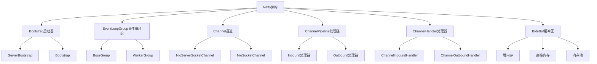
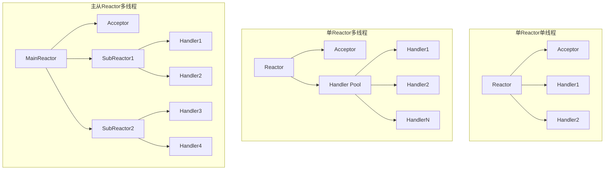
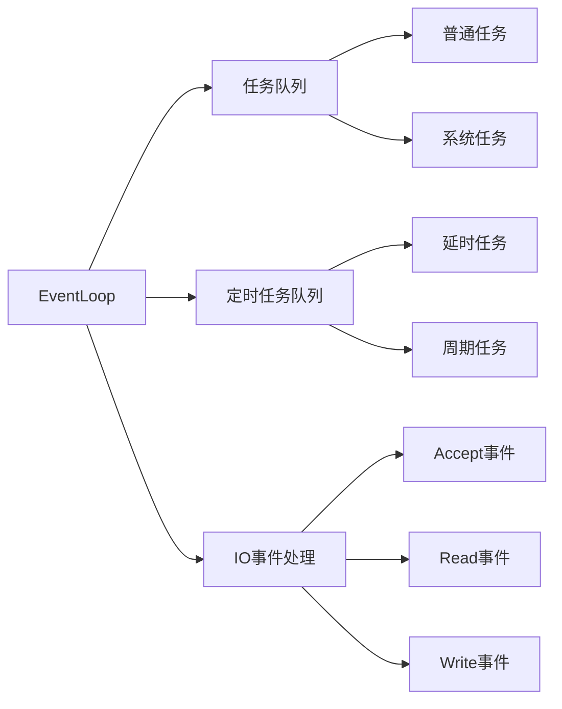
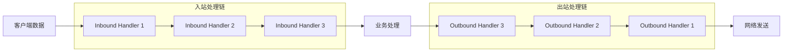
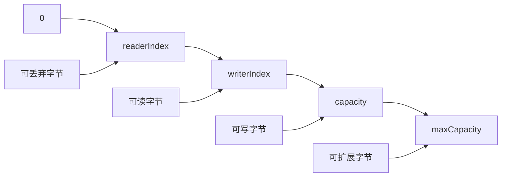

import Tabs from '@theme/Tabs';
import TabItem from '@theme/TabItem';

# Netty网络编程框架详解

Netty是一个高性能、异步事件驱动的网络应用框架，用于快速开发可维护的高性能协议服务器和客户端。它简化了网络编程的复杂性，是构建分布式系统的重要基础设施。

:::tip 核心价值
**Netty = 高性能网络框架 + 异步事件驱动 + 丰富的编解码器 + 生产级特性**
- 🚀 **高性能**：基于NIO的Reactor模式，支持百万级并发连接
- 🎯 **易用性**：简化网络编程复杂性，提供丰富的开箱即用组件
- 🔧 **可扩展**：灵活的Pipeline设计，支持自定义协议和编解码器
- 🛡️ **生产级**：内存管理、流量控制、心跳检测等企业级特性
- 🌐 **广泛应用**：Dubbo、Spring Cloud Gateway、Elasticsearch等知名项目的网络层基础
:::

## 1. Netty架构设计

### 1.1 核心组件架构



### 1.2 Reactor线程模型

<Tabs>
<TabItem value="reactor-model" label="Reactor模型">

**Netty线程模型演进**



**Netty线程模型特点**
- **BossGroup**：处理客户端连接请求
- **WorkerGroup**：处理IO读写操作
- **EventLoop**：单线程执行器，处理Channel的所有IO事件
- **线程安全**：同一个Channel的所有操作都在同一个EventLoop中执行

</TabItem>
<TabItem value="eventloop" label="EventLoop详解">

**EventLoop工作原理**



**EventLoop核心特性**
```java title="EventLoop特性示例"
// 1. 线程安全：同一个Channel的操作都在同一个EventLoop中
Channel channel = ...;
EventLoop eventLoop = channel.eventLoop();

// 2. 任务提交：可以提交任务到EventLoop执行
eventLoop.execute(() -> {
    // 在EventLoop线程中执行
    System.out.println("Task executed in EventLoop");
});

// 3. 定时任务：支持延时和周期性任务
eventLoop.schedule(() -> {
    System.out.println("Scheduled task");
}, 5, TimeUnit.SECONDS);

// 4. 判断是否在EventLoop线程中
if (eventLoop.inEventLoop()) {
    // 直接执行
    doSomething();
} else {
    // 提交到EventLoop执行
    eventLoop.execute(() -> doSomething());
}
```

</TabItem>
<TabItem value="thread-model-comparison" label="线程模型对比">

| 模型 | 优点 | 缺点 | 适用场景 | Netty实现 |
|------|------|------|----------|-----------|
| 单Reactor单线程 | 简单，无线程竞争 | 性能有限，单点故障 | 连接数少，处理简单 | EventLoopGroup(1) |
| 单Reactor多线程 | 充分利用多核CPU | Reactor成为瓶颈 | 中等并发，CPU密集 | EventLoopGroup(1) + 业务线程池 |
| 主从Reactor多线程 | 高并发，职责分离 | 实现复杂 | 高并发场景 | BossGroup + WorkerGroup |
| 多Reactor多线程 | 最高性能 | 最复杂 | 超高并发 | 多个EventLoopGroup |

**Netty推荐配置**
```java title="线程模型最佳实践"
// 推荐配置：CPU核心数的1-2倍
int bossThreads = 1; // 通常1个线程足够处理连接
int workerThreads = Runtime.getRuntime().availableProcessors() * 2;

EventLoopGroup bossGroup = new NioEventLoopGroup(bossThreads);
EventLoopGroup workerGroup = new NioEventLoopGroup(workerThreads);

// 业务处理线程池（避免阻塞EventLoop）
ExecutorService businessExecutor = Executors.newFixedThreadPool(
    Runtime.getRuntime().availableProcessors() * 4);
```

</TabItem>
</Tabs>

## 2. Netty核心组件详解

### 2.1 Bootstrap启动器

<Tabs>
<TabItem value="server-bootstrap" label="服务端启动">

```java title="Netty服务端完整示例"
import io.netty.bootstrap.ServerBootstrap;
import io.netty.channel.*;
import io.netty.channel.nio.NioEventLoopGroup;
import io.netty.channel.socket.SocketChannel;
import io.netty.channel.socket.nio.NioServerSocketChannel;
import io.netty.handler.codec.string.StringDecoder;
import io.netty.handler.codec.string.StringEncoder;
import io.netty.handler.codec.DelimiterBasedFrameDecoder;
import io.netty.handler.codec.Delimiters;
import io.netty.handler.logging.LogLevel;
import io.netty.handler.logging.LoggingHandler;

public class NettyServer {
    private final int port;
    
    public NettyServer(int port) {
        this.port = port;
    }
    
    public void start() throws InterruptedException {
        // 创建EventLoopGroup
        EventLoopGroup bossGroup = new NioEventLoopGroup(1);
        EventLoopGroup workerGroup = new NioEventLoopGroup();
        
        try {
            ServerBootstrap bootstrap = new ServerBootstrap();
            bootstrap.group(bossGroup, workerGroup)
                    .channel(NioServerSocketChannel.class)
                    .option(ChannelOption.SO_BACKLOG, 1024)
                    .option(ChannelOption.SO_REUSEADDR, true)
                    .childOption(ChannelOption.SO_KEEPALIVE, true)
                    .childOption(ChannelOption.TCP_NODELAY, true)
                    .handler(new LoggingHandler(LogLevel.INFO))
                    .childHandler(new ChannelInitializer<SocketChannel>() {
                        @Override
                        protected void initChannel(SocketChannel ch) {
                            ChannelPipeline pipeline = ch.pipeline();
                            
                            // 添加编解码器
                            pipeline.addLast(new DelimiterBasedFrameDecoder(
                                8192, Delimiters.lineDelimiter()));
                            pipeline.addLast(new StringDecoder());
                            pipeline.addLast(new StringEncoder());
                            
                            // 添加业务处理器
                            pipeline.addLast(new ServerHandler());
                        }
                    });
            
            // 绑定端口并启动服务器
            ChannelFuture future = bootstrap.bind(port).sync();
            System.out.println("Netty服务器启动成功，监听端口: " + port);
            
            // 等待服务器关闭
            future.channel().closeFuture().sync();
            
        } finally {
            // 优雅关闭
            bossGroup.shutdownGracefully();
            workerGroup.shutdownGracefully();
        }
    }
    
    public static void main(String[] args) throws InterruptedException {
        new NettyServer(8080).start();
    }
}

/**
 * 服务端业务处理器
 */
class ServerHandler extends ChannelInboundHandlerAdapter {
    
    @Override
    public void channelActive(ChannelHandlerContext ctx) {
        System.out.println("客户端连接: " + ctx.channel().remoteAddress());
    }
    
    @Override
    public void channelRead(ChannelHandlerContext ctx, Object msg) {
        String message = (String) msg;
        System.out.println("收到消息: " + message);
        
        // 回显消息
        ctx.writeAndFlush("Echo: " + message + "\n");
    }
    
    @Override
    public void channelInactive(ChannelHandlerContext ctx) {
        System.out.println("客户端断开: " + ctx.channel().remoteAddress());
    }
    
    @Override
    public void exceptionCaught(ChannelHandlerContext ctx, Throwable cause) {
        System.err.println("处理异常: " + cause.getMessage());
        ctx.close();
    }
}
```

</TabItem>
<TabItem value="client-bootstrap" label="客户端启动">

```java title="Netty客户端完整示例"
import io.netty.bootstrap.Bootstrap;
import io.netty.channel.*;
import io.netty.channel.nio.NioEventLoopGroup;
import io.netty.channel.socket.SocketChannel;
import io.netty.channel.socket.nio.NioSocketChannel;
import io.netty.handler.codec.string.StringDecoder;
import io.netty.handler.codec.string.StringEncoder;
import io.netty.handler.codec.DelimiterBasedFrameDecoder;
import io.netty.handler.codec.Delimiters;

import java.util.Scanner;

public class NettyClient {
    private final String host;
    private final int port;
    
    public NettyClient(String host, int port) {
        this.host = host;
        this.port = port;
    }
    
    public void start() throws InterruptedException {
        EventLoopGroup group = new NioEventLoopGroup();
        
        try {
            Bootstrap bootstrap = new Bootstrap();
            bootstrap.group(group)
                    .channel(NioSocketChannel.class)
                    .option(ChannelOption.SO_KEEPALIVE, true)
                    .option(ChannelOption.TCP_NODELAY, true)
                    .handler(new ChannelInitializer<SocketChannel>() {
                        @Override
                        protected void initChannel(SocketChannel ch) {
                            ChannelPipeline pipeline = ch.pipeline();
                            
                            // 添加编解码器
                            pipeline.addLast(new DelimiterBasedFrameDecoder(
                                8192, Delimiters.lineDelimiter()));
                            pipeline.addLast(new StringDecoder());
                            pipeline.addLast(new StringEncoder());
                            
                            // 添加业务处理器
                            pipeline.addLast(new ClientHandler());
                        }
                    });
            
            // 连接服务器
            ChannelFuture future = bootstrap.connect(host, port).sync();
            System.out.println("连接服务器成功: " + host + ":" + port);
            
            Channel channel = future.channel();
            
            // 用户输入处理
            Scanner scanner = new Scanner(System.in);
            System.out.println("输入消息（输入'quit'退出）:");
            
            String input;
            while ((input = scanner.nextLine()) != null) {
                if ("quit".equalsIgnoreCase(input)) {
                    break;
                }
                
                channel.writeAndFlush(input + "\n");
            }
            
        } finally {
            group.shutdownGracefully();
        }
    }
    
    public static void main(String[] args) throws InterruptedException {
        new NettyClient("localhost", 8080).start();
    }
}

/**
 * 客户端业务处理器
 */
class ClientHandler extends ChannelInboundHandlerAdapter {
    
    @Override
    public void channelActive(ChannelHandlerContext ctx) {
        System.out.println("连接建立成功");
    }
    
    @Override
    public void channelRead(ChannelHandlerContext ctx, Object msg) {
        String response = (String) msg;
        System.out.println("服务器响应: " + response);
    }
    
    @Override
    public void channelInactive(ChannelHandlerContext ctx) {
        System.out.println("连接断开");
    }
    
    @Override
    public void exceptionCaught(ChannelHandlerContext ctx, Throwable cause) {
        System.err.println("客户端异常: " + cause.getMessage());
        ctx.close();
    }
}
```

</TabItem>
<TabItem value="bootstrap-options" label="启动参数配置">

**重要的Channel选项**

```java title="Channel选项详解"
// 服务端选项
ServerBootstrap bootstrap = new ServerBootstrap();
bootstrap
    // TCP连接队列大小
    .option(ChannelOption.SO_BACKLOG, 1024)
    
    // 地址重用
    .option(ChannelOption.SO_REUSEADDR, true)
    
    // 接收缓冲区大小
    .option(ChannelOption.SO_RCVBUF, 32 * 1024)
    
    // 子Channel选项
    .childOption(ChannelOption.SO_KEEPALIVE, true)    // 保活机制
    .childOption(ChannelOption.TCP_NODELAY, true)     // 禁用Nagle算法
    .childOption(ChannelOption.SO_SNDBUF, 32 * 1024) // 发送缓冲区
    .childOption(ChannelOption.SO_RCVBUF, 32 * 1024) // 接收缓冲区
    
    // Netty特有选项
    .childOption(ChannelOption.WRITE_BUFFER_WATER_MARK, 
        new WriteBufferWaterMark(8 * 1024, 32 * 1024)) // 写缓冲区水位线
    .childOption(ChannelOption.ALLOCATOR, PooledByteBufAllocator.DEFAULT); // 内存分配器
```

**客户端选项**
```java title="客户端选项配置"
Bootstrap bootstrap = new Bootstrap();
bootstrap
    .option(ChannelOption.SO_KEEPALIVE, true)
    .option(ChannelOption.TCP_NODELAY, true)
    .option(ChannelOption.CONNECT_TIMEOUT_MILLIS, 5000) // 连接超时
    .option(ChannelOption.SO_TIMEOUT, 10000);           // 读取超时
```

**性能调优参数**
```java title="性能调优配置"
// 1. 内存分配器
.option(ChannelOption.ALLOCATOR, PooledByteBufAllocator.DEFAULT)

// 2. 写缓冲区水位线
.option(ChannelOption.WRITE_BUFFER_WATER_MARK, 
    new WriteBufferWaterMark(32 * 1024, 64 * 1024))

// 3. 接收字节缓冲区分配器
.option(ChannelOption.RCVBUF_ALLOCATOR, 
    new AdaptiveRecvByteBufAllocator(64, 1024, 65536))

// 4. 消息大小估算器
.option(ChannelOption.MESSAGE_SIZE_ESTIMATOR, 
    DefaultMessageSizeEstimator.DEFAULT)
```

</TabItem>
</Tabs>

### 2.2 ChannelPipeline处理链

<Tabs>
<TabItem value="pipeline-concept" label="Pipeline概念">

**Pipeline处理流程**



**Pipeline核心特性**
- **双向链表**：Handler按顺序组织成双向链表
- **入站处理**：数据从网络到应用的处理链
- **出站处理**：数据从应用到网络的处理链
- **动态修改**：运行时可以动态添加、删除Handler

</TabItem>
<TabItem value="handler-types" label="Handler类型">

**Handler分类**

```java title="不同类型的Handler"
// 1. 入站处理器
public class MyInboundHandler extends ChannelInboundHandlerAdapter {
    @Override
    public void channelRead(ChannelHandlerContext ctx, Object msg) {
        // 处理入站数据
        System.out.println("Inbound: " + msg);
        
        // 传递给下一个Handler
        ctx.fireChannelRead(msg);
    }
}

// 2. 出站处理器
public class MyOutboundHandler extends ChannelOutboundHandlerAdapter {
    @Override
    public void write(ChannelHandlerContext ctx, Object msg, ChannelPromise promise) {
        // 处理出站数据
        System.out.println("Outbound: " + msg);
        
        // 传递给下一个Handler
        ctx.write(msg, promise);
    }
}

// 3. 双向处理器
public class MyDuplexHandler extends ChannelDuplexHandler {
    @Override
    public void channelRead(ChannelHandlerContext ctx, Object msg) {
        // 入站处理
        ctx.fireChannelRead(msg);
    }
    
    @Override
    public void write(ChannelHandlerContext ctx, Object msg, ChannelPromise promise) {
        // 出站处理
        ctx.write(msg, promise);
    }
}

// 4. 简化的入站处理器
public class MySimpleHandler extends SimpleChannelInboundHandler<String> {
    @Override
    protected void channelRead0(ChannelHandlerContext ctx, String msg) {
        // 自动类型转换和资源释放
        System.out.println("Message: " + msg);
    }
}
```

**Handler生命周期**
```java title="Handler生命周期方法"
public class LifecycleHandler extends ChannelInboundHandlerAdapter {
    
    @Override
    public void handlerAdded(ChannelHandlerContext ctx) {
        System.out.println("Handler添加到Pipeline");
    }
    
    @Override
    public void channelRegistered(ChannelHandlerContext ctx) {
        System.out.println("Channel注册到EventLoop");
    }
    
    @Override
    public void channelActive(ChannelHandlerContext ctx) {
        System.out.println("Channel激活");
    }
    
    @Override
    public void channelRead(ChannelHandlerContext ctx, Object msg) {
        System.out.println("读取数据: " + msg);
        ctx.fireChannelRead(msg);
    }
    
    @Override
    public void channelReadComplete(ChannelHandlerContext ctx) {
        System.out.println("读取完成");
        ctx.fireChannelReadComplete();
    }
    
    @Override
    public void channelInactive(ChannelHandlerContext ctx) {
        System.out.println("Channel非激活");
    }
    
    @Override
    public void channelUnregistered(ChannelHandlerContext ctx) {
        System.out.println("Channel从EventLoop注销");
    }
    
    @Override
    public void handlerRemoved(ChannelHandlerContext ctx) {
        System.out.println("Handler从Pipeline移除");
    }
    
    @Override
    public void exceptionCaught(ChannelHandlerContext ctx, Throwable cause) {
        System.err.println("异常处理: " + cause.getMessage());
        ctx.close();
    }
}
```

</TabItem>
<TabItem value="pipeline-operations" label="Pipeline操作">

**动态修改Pipeline**

```java title="Pipeline动态操作"
public class DynamicPipelineHandler extends ChannelInboundHandlerAdapter {
    
    @Override
    public void channelActive(ChannelHandlerContext ctx) {
        ChannelPipeline pipeline = ctx.pipeline();
        
        // 1. 添加Handler
        pipeline.addFirst("first", new FirstHandler());
        pipeline.addLast("last", new LastHandler());
        pipeline.addBefore("existing", "new", new NewHandler());
        pipeline.addAfter("existing", "another", new AnotherHandler());
        
        // 2. 替换Handler
        pipeline.replace("old", "new", new NewHandler());
        
        // 3. 移除Handler
        pipeline.remove("unwanted");
        pipeline.remove(UnwantedHandler.class);
        
        // 4. 获取Handler
        ChannelHandler handler = pipeline.get("handlerName");
        FirstHandler first = pipeline.get(FirstHandler.class);
        
        // 5. 检查Handler是否存在
        if (pipeline.names().contains("handlerName")) {
            // Handler存在
        }
        
        ctx.fireChannelActive();
    }
}
```

**条件化Pipeline配置**
```java title="条件化配置示例"
public class ConditionalPipelineInitializer extends ChannelInitializer<SocketChannel> {
    
    private final boolean enableSsl;
    private final boolean enableCompression;
    
    public ConditionalPipelineInitializer(boolean enableSsl, boolean enableCompression) {
        this.enableSsl = enableSsl;
        this.enableCompression = enableCompression;
    }
    
    @Override
    protected void initChannel(SocketChannel ch) {
        ChannelPipeline pipeline = ch.pipeline();
        
        // SSL支持
        if (enableSsl) {
            SslContext sslContext = createSslContext();
            pipeline.addLast("ssl", sslContext.newHandler(ch.alloc()));
        }
        
        // 压缩支持
        if (enableCompression) {
            pipeline.addLast("deflater", ZlibCodecFactory.newZlibEncoder(ZlibWrapper.GZIP));
            pipeline.addLast("inflater", ZlibCodecFactory.newZlibDecoder(ZlibWrapper.GZIP));
        }
        
        // 基础编解码器
        pipeline.addLast("frameDecoder", new LengthFieldBasedFrameDecoder(1024, 0, 4, 0, 4));
        pipeline.addLast("frameEncoder", new LengthFieldPrepender(4));
        pipeline.addLast("stringDecoder", new StringDecoder());
        pipeline.addLast("stringEncoder", new StringEncoder());
        
        // 业务处理器
        pipeline.addLast("businessHandler", new BusinessHandler());
    }
    
    private SslContext createSslContext() {
        // SSL上下文创建逻辑
        return null;
    }
}
```

</TabItem>
</Tabs>

### 2.3 ByteBuf缓冲区

<Tabs>
<TabItem value="bytebuf-concept" label="ByteBuf概念">

**ByteBuf vs ByteBuffer**

| 特性 | ByteBuf | ByteBuffer | 优势 |
|------|---------|------------|------|
| 读写指针 | 独立的读写指针 | 单一position指针 | ByteBuf更灵活，无需flip操作 |
| 容量扩展 | 支持动态扩容 | 固定容量 | ByteBuf可以根据需要自动扩容 |
| 内存管理 | 引用计数 | 依赖GC | ByteBuf可以精确控制内存释放 |
| 内存类型 | 堆内存/直接内存 | 堆内存/直接内存 | 两者都支持多种内存类型 |
| 内存池 | 支持内存池 | 不支持 | ByteBuf可以复用内存，减少GC压力 |
| 零拷贝 | 支持 | 有限支持 | ByteBuf提供更好的零拷贝支持 |
| API设计 | 链式调用 | 传统API | ByteBuf API更加友好 |
| 性能 | 更高 | 较低 | ByteBuf在各方面性能都更优 |

**ByteBuf结构**


</TabItem>
<TabItem value="bytebuf-usage" label="ByteBuf使用">

```java title="ByteBuf基本操作"
import io.netty.buffer.*;

public class ByteBufExample {
    
    public static void main(String[] args) {
        // 1. 创建ByteBuf
        ByteBuf buffer = Unpooled.buffer(10); // 初始容量10
        ByteBuf directBuffer = Unpooled.directBuffer(10); // 直接内存
        ByteBuf pooledBuffer = PooledByteBufAllocator.DEFAULT.buffer(10); // 池化
        
        // 2. 写入数据
        buffer.writeInt(100);
        buffer.writeBytes("Hello".getBytes());
        buffer.writeBoolean(true);
        
        System.out.println("写入后 - 可读字节数: " + buffer.readableBytes());
        System.out.println("写入后 - 可写字节数: " + buffer.writableBytes());
        
        // 3. 读取数据
        int intValue = buffer.readInt();
        byte[] bytes = new byte[5];
        buffer.readBytes(bytes);
        boolean boolValue = buffer.readBoolean();
        
        System.out.println("读取的int: " + intValue);
        System.out.println("读取的字符串: " + new String(bytes));
        System.out.println("读取的boolean: " + boolValue);
        
        // 4. 标记和重置
        buffer.markReaderIndex();
        buffer.readInt(); // 读取一些数据
        buffer.resetReaderIndex(); // 重置到标记位置
        
        // 5. 切片操作（零拷贝）
        ByteBuf slice = buffer.slice(0, 5); // 创建切片
        ByteBuf duplicate = buffer.duplicate(); // 创建副本
        
        // 6. 引用计数
        System.out.println("引用计数: " + buffer.refCnt());
        buffer.retain(); // 增加引用计数
        System.out.println("增加后引用计数: " + buffer.refCnt());
        
        // 7. 释放内存
        buffer.release(); // 减少引用计数
        buffer.release(); // 当引用计数为0时，释放内存
    }
}
```

**ByteBuf高级操作**
```java title="ByteBuf高级特性"
public class AdvancedByteBufExample {
    
    public static void compositeByteBuf() {
        // 组合ByteBuf - 零拷贝合并多个ByteBuf
        CompositeByteBuf composite = Unpooled.compositeBuffer();
        
        ByteBuf header = Unpooled.copiedBuffer("Header", CharsetUtil.UTF_8);
        ByteBuf body = Unpooled.copiedBuffer("Body Content", CharsetUtil.UTF_8);
        
        composite.addComponents(true, header, body);
        
        // 可以像单个ByteBuf一样使用
        System.out.println("组合后内容: " + composite.toString(CharsetUtil.UTF_8));
        
        composite.release();
    }
    
    public static void derivedByteBuf() {
        ByteBuf original = Unpooled.copiedBuffer("Hello World", CharsetUtil.UTF_8);
        
        // 切片 - 共享内容，独立索引
        ByteBuf slice = original.slice(0, 5);
        System.out.println("切片内容: " + slice.toString(CharsetUtil.UTF_8));
        
        // 副本 - 共享内容，共享索引
        ByteBuf duplicate = original.duplicate();
        
        // 拷贝 - 独立内容和索引
        ByteBuf copy = original.copy();
        
        original.release();
    }
    
    public static void byteBufAllocator() {
        // 不同的分配器
        ByteBufAllocator allocator = PooledByteBufAllocator.DEFAULT;
        
        // 堆内存
        ByteBuf heapBuffer = allocator.heapBuffer(1024);
        
        // 直接内存
        ByteBuf directBuffer = allocator.directBuffer(1024);
        
        // 组合缓冲区
        CompositeByteBuf composite = allocator.compositeBuffer();
        
        // 根据平台选择最优类型
        ByteBuf buffer = allocator.buffer(1024);
        
        // 释放资源
        heapBuffer.release();
        directBuffer.release();
        composite.release();
        buffer.release();
    }
}
```

</TabItem>
<TabItem value="memory-management" label="内存管理">

**引用计数机制**
```java title="引用计数最佳实践"
public class ReferenceCountingExample {
    
    public void correctUsage(ChannelHandlerContext ctx, ByteBuf msg) {
        try {
            // 处理消息
            processMessage(msg);
            
            // 传递给下一个Handler
            ctx.fireChannelRead(msg.retain()); // 增加引用计数
            
        } finally {
            // 确保释放
            msg.release();
        }
    }
    
    public void simpleHandlerUsage() {
        // 使用SimpleChannelInboundHandler自动管理引用计数
        class AutoReleaseHandler extends SimpleChannelInboundHandler<ByteBuf> {
            @Override
            protected void channelRead0(ChannelHandlerContext ctx, ByteBuf msg) {
                // 方法结束后自动调用msg.release()
                processMessage(msg);
            }
        }
    }
    
    public void manualManagement() {
        ByteBuf buffer = Unpooled.buffer(1024);
        
        try {
            // 使用buffer
            buffer.writeInt(42);
            
            // 如果需要传递给其他地方使用
            ByteBuf retained = buffer.retain();
            someAsyncMethod(retained); // 异步方法负责释放
            
        } finally {
            // 释放当前引用
            buffer.release();
        }
    }
    
    private void processMessage(ByteBuf msg) {
        // 处理消息逻辑
    }
    
    private void someAsyncMethod(ByteBuf buffer) {
        // 异步处理，完成后需要调用buffer.release()
    }
}
```

**内存泄漏检测**
```java title="内存泄漏检测配置"
// JVM启动参数
// -Dio.netty.leakDetection.level=ADVANCED
// -Dio.netty.leakDetectionTargetRecords=10

public class LeakDetectionExample {
    
    static {
        // 代码中设置检测级别
        ResourceLeakDetector.setLevel(ResourceLeakDetector.Level.PARANOID);
    }
    
    public void detectLeak() {
        ByteBuf buffer = Unpooled.buffer(1024);
        
        // 模拟内存泄漏 - 忘记调用release()
        buffer.writeInt(42);
        
        // 正确做法：
        // buffer.release();
    }
}
```

**内存池配置**
```java title="内存池优化配置"
// 系统属性配置
System.setProperty("io.netty.allocator.type", "pooled"); // 使用池化分配器
System.setProperty("io.netty.allocator.directMemoryCacheAlignment", "64"); // 直接内存对齐
System.setProperty("io.netty.allocator.pageSize", "8192"); // 页大小
System.setProperty("io.netty.allocator.maxOrder", "11"); // 最大块大小

// 代码配置
PooledByteBufAllocator allocator = new PooledByteBufAllocator(
    true,  // preferDirect - 优先使用直接内存
    2,     // nHeapArena - 堆内存区域数量
    2,     // nDirectArena - 直接内存区域数量
    8192,  // pageSize - 页大小
    11     // maxOrder - 最大块大小
);
```

</TabItem>
</Tabs>

## 3. 编解码器详解

### 3.1 内置编解码器

<Tabs>
<TabItem value="frame-decoders" label="帧解码器">

**解决粘包拆包问题的解码器**

```java title="常用帧解码器"
// 1. 固定长度帧解码器
FixedLengthFrameDecoder fixedDecoder = new FixedLengthFrameDecoder(10);

// 2. 分隔符帧解码器
DelimiterBasedFrameDecoder delimiterDecoder = new DelimiterBasedFrameDecoder(
    1024, // 最大帧长度
    Delimiters.lineDelimiter() // 使用换行符作为分隔符
);

// 3. 长度字段帧解码器
LengthFieldBasedFrameDecoder lengthDecoder = new LengthFieldBasedFrameDecoder(
    1024,  // 最大帧长度
    0,     // 长度字段偏移量
    4,     // 长度字段长度
    0,     // 长度调整值
    4      // 跳过的字节数
);

// 4. 行解码器
LineBasedFrameDecoder lineDecoder = new LineBasedFrameDecoder(1024);
```

**自定义协议解码器**
```java title="自定义协议解码器"
public class CustomProtocolDecoder extends ByteToMessageDecoder {
    
    private static final int HEADER_LENGTH = 8;
    private static final int MAGIC_NUMBER = 0xCAFEBABE;
    
    @Override
    protected void decode(ChannelHandlerContext ctx, ByteBuf in, List<Object> out) {
        // 检查是否有足够的字节读取头部
        if (in.readableBytes() < HEADER_LENGTH) {
            return;
        }
        
        // 标记读取位置
        in.markReaderIndex();
        
        // 读取魔数
        int magic = in.readInt();
        if (magic != MAGIC_NUMBER) {
            // 魔数不匹配，关闭连接
            ctx.close();
            return;
        }
        
        // 读取消息长度
        int length = in.readInt();
        
        // 检查是否有足够的字节读取完整消息
        if (in.readableBytes() < length) {
            // 重置读取位置，等待更多数据
            in.resetReaderIndex();
            return;
        }
        
        // 读取消息体
        ByteBuf messageBody = in.readBytes(length);
        
        // 创建自定义消息对象
        CustomMessage message = new CustomMessage(magic, length, messageBody);
        out.add(message);
    }
}

// 自定义消息类
class CustomMessage {
    private final int magic;
    private final int length;
    private final ByteBuf body;
    
    public CustomMessage(int magic, int length, ByteBuf body) {
        this.magic = magic;
        this.length = length;
        this.body = body;
    }
    
    // getter方法...
}
```

</TabItem>
<TabItem value="codec-examples" label="编解码器示例">

**字符串编解码器**
```java title="字符串编解码器使用"
public class StringCodecExample {
    
    public void setupPipeline(ChannelPipeline pipeline) {
        // 字符串编解码器
        pipeline.addLast("stringDecoder", new StringDecoder(CharsetUtil.UTF_8));
        pipeline.addLast("stringEncoder", new StringEncoder(CharsetUtil.UTF_8));
        
        // 业务处理器
        pipeline.addLast("stringHandler", new SimpleChannelInboundHandler<String>() {
            @Override
            protected void channelRead0(ChannelHandlerContext ctx, String msg) {
                System.out.println("收到字符串: " + msg);
                ctx.writeAndFlush("Echo: " + msg);
            }
        });
    }
}
```

**JSON编解码器**
```java title="JSON编解码器实现"
public class JsonEncoder extends MessageToByteEncoder<Object> {
    
    private final ObjectMapper objectMapper = new ObjectMapper();
    
    @Override
    protected void encode(ChannelHandlerContext ctx, Object msg, ByteBuf out) throws Exception {
        byte[] jsonBytes = objectMapper.writeValueAsBytes(msg);
        out.writeInt(jsonBytes.length); // 写入长度
        out.writeBytes(jsonBytes);      // 写入JSON数据
    }
}

public class JsonDecoder extends LengthFieldBasedFrameDecoder {
    
    private final ObjectMapper objectMapper = new ObjectMapper();
    private final Class<?> targetClass;
    
    public JsonDecoder(Class<?> targetClass) {
        super(1024, 0, 4, 0, 4); // 长度字段解码
        this.targetClass = targetClass;
    }
    
    @Override
    protected Object decode(ChannelHandlerContext ctx, ByteBuf in) throws Exception {
        ByteBuf frame = (ByteBuf) super.decode(ctx, in);
        if (frame == null) {
            return null;
        }
        
        try {
            byte[] jsonBytes = new byte[frame.readableBytes()];
            frame.readBytes(jsonBytes);
            return objectMapper.readValue(jsonBytes, targetClass);
        } finally {
            frame.release();
        }
    }
}
```

**Protobuf编解码器**
```java title="Protobuf编解码器使用"
public class ProtobufCodecExample {
    
    public void setupPipeline(ChannelPipeline pipeline) {
        // Protobuf编解码器
        pipeline.addLast("frameDecoder", new ProtobufVarint32FrameDecoder());
        pipeline.addLast("protobufDecoder", new ProtobufDecoder(MessageProto.Message.getDefaultInstance()));
        
        pipeline.addLast("frameEncoder", new ProtobufVarint32LengthFieldPrepender());
        pipeline.addLast("protobufEncoder", new ProtobufEncoder());
        
        // 业务处理器
        pipeline.addLast("protobufHandler", new SimpleChannelInboundHandler<MessageProto.Message>() {
            @Override
            protected void channelRead0(ChannelHandlerContext ctx, MessageProto.Message msg) {
                System.out.println("收到Protobuf消息: " + msg.getContent());
                
                MessageProto.Message response = MessageProto.Message.newBuilder()
                    .setContent("Echo: " + msg.getContent())
                    .build();
                
                ctx.writeAndFlush(response);
            }
        });
    }
}
```

</TabItem>
<TabItem value="custom-codec" label="自定义编解码器">

**完整的自定义协议实现**
```java title="自定义协议完整实现"
// 协议格式：魔数(4) + 版本(1) + 类型(1) + 长度(4) + 数据(N)
public class CustomProtocol {
    public static final int MAGIC_NUMBER = 0xABCDEF00;
    public static final byte VERSION = 1;
    
    public static class Message {
        private byte version;
        private byte type;
        private byte[] data;
        
        // 构造函数和getter/setter...
    }
}

// 编码器
public class CustomProtocolEncoder extends MessageToByteEncoder<CustomProtocol.Message> {
    
    @Override
    protected void encode(ChannelHandlerContext ctx, CustomProtocol.Message msg, ByteBuf out) {
        out.writeInt(CustomProtocol.MAGIC_NUMBER);  // 魔数
        out.writeByte(msg.getVersion());            // 版本
        out.writeByte(msg.getType());               // 类型
        out.writeInt(msg.getData().length);         // 数据长度
        out.writeBytes(msg.getData());              // 数据
    }
}

// 解码器
public class CustomProtocolDecoder extends ByteToMessageDecoder {
    
    private static final int HEADER_LENGTH = 10; // 4 + 1 + 1 + 4
    
    @Override
    protected void decode(ChannelHandlerContext ctx, ByteBuf in, List<Object> out) {
        if (in.readableBytes() < HEADER_LENGTH) {
            return;
        }
        
        in.markReaderIndex();
        
        // 验证魔数
        int magic = in.readInt();
        if (magic != CustomProtocol.MAGIC_NUMBER) {
            in.resetReaderIndex();
            ctx.close();
            return;
        }
        
        byte version = in.readByte();
        byte type = in.readByte();
        int dataLength = in.readInt();
        
        // 检查数据是否完整
        if (in.readableBytes() < dataLength) {
            in.resetReaderIndex();
            return;
        }
        
        // 读取数据
        byte[] data = new byte[dataLength];
        in.readBytes(data);
        
        // 创建消息对象
        CustomProtocol.Message message = new CustomProtocol.Message();
        message.setVersion(version);
        message.setType(type);
        message.setData(data);
        
        out.add(message);
    }
}

// 使用示例
public class CustomProtocolServer {
    
    public void start() throws InterruptedException {
        EventLoopGroup bossGroup = new NioEventLoopGroup(1);
        EventLoopGroup workerGroup = new NioEventLoopGroup();
        
        try {
            ServerBootstrap bootstrap = new ServerBootstrap();
            bootstrap.group(bossGroup, workerGroup)
                    .channel(NioServerSocketChannel.class)
                    .childHandler(new ChannelInitializer<SocketChannel>() {
                        @Override
                        protected void initChannel(SocketChannel ch) {
                            ChannelPipeline pipeline = ch.pipeline();
                            
                            // 添加自定义编解码器
                            pipeline.addLast("decoder", new CustomProtocolDecoder());
                            pipeline.addLast("encoder", new CustomProtocolEncoder());
                            
                            // 添加业务处理器
                            pipeline.addLast("handler", new CustomProtocolHandler());
                        }
                    });
            
            ChannelFuture future = bootstrap.bind(8080).sync();
            future.channel().closeFuture().sync();
            
        } finally {
            bossGroup.shutdownGracefully();
            workerGroup.shutdownGracefully();
        }
    }
}
```

</TabItem>
</Tabs>

## 4. 常见面试问题与解答

### 4.1 基础概念问题

<Tabs>
<TabItem value="basic-qa" label="基础问答">

**Q1: Netty的核心组件有哪些？它们的作用是什么？**

A: Netty的核心组件包括：
- **Bootstrap/ServerBootstrap**：启动器，用于配置和启动客户端/服务端
- **EventLoopGroup**：事件循环组，管理EventLoop的生命周期
- **EventLoop**：事件循环，处理IO事件和任务
- **Channel**：网络通道，代表一个网络连接
- **ChannelPipeline**：处理链，管理ChannelHandler的执行顺序
- **ChannelHandler**：处理器，处理IO事件和业务逻辑
- **ByteBuf**：缓冲区，Netty的数据容器

**Q2: Netty的线程模型是怎样的？**

A: Netty采用Reactor线程模型：
- **BossGroup**：负责接受客户端连接，通常只需要1个线程
- **WorkerGroup**：负责处理IO读写，线程数通常为CPU核心数的1-2倍
- **EventLoop**：单线程执行器，一个EventLoop可以处理多个Channel
- **线程安全**：同一个Channel的所有操作都在同一个EventLoop中执行

**Q3: ByteBuf相比ByteBuffer有什么优势？**

A: ByteBuf的主要优势：
- **独立的读写指针**：无需flip操作，使用更简单
- **动态扩容**：可以根据需要自动扩展容量
- **引用计数**：精确控制内存释放，避免内存泄漏
- **内存池**：支持内存池化，减少GC压力
- **零拷贝**：提供更好的零拷贝支持
- **链式API**：更友好的API设计

</TabItem>
<TabItem value="advanced-qa" label="深入问答">

**Q4: Netty是如何解决粘包拆包问题的？**

A: Netty提供了多种解决方案：
1. **固定长度**：FixedLengthFrameDecoder
2. **分隔符**：DelimiterBasedFrameDecoder
3. **长度字段**：LengthFieldBasedFrameDecoder
4. **自定义协议**：继承ByteToMessageDecoder实现

**Q5: Netty的零拷贝是如何实现的？**

A: Netty的零拷贝实现：
- **DirectByteBuffer**：使用直接内存，避免用户态和内核态的数据拷贝
- **CompositeByteBuf**：组合多个ByteBuf，避免内存拷贝
- **slice()和duplicate()**：创建视图，共享底层数据
- **FileRegion**：文件传输时使用sendfile系统调用

**Q6: 如何处理Netty中的内存泄漏？**

A: 内存泄漏处理策略：
- **引用计数**：正确使用retain()和release()
- **SimpleChannelInboundHandler**：自动管理引用计数
- **内存泄漏检测**：启用ResourceLeakDetector
- **最佳实践**：在finally块中释放资源

</TabItem>
</Tabs>

### 4.2 实际应用问题

**Netty生产环境最佳实践**

1. **线程配置**
   - BossGroup线程数：1个即可
   - WorkerGroup线程数：CPU核心数的1-2倍
   - 业务处理使用独立线程池

2. **内存管理**
   - 启用内存池：PooledByteBufAllocator
   - 设置合理的水位线
   - 监控内存使用情况

3. **性能优化**
   - 使用直接内存
   - 合理设置Channel选项
   - 启用TCP_NODELAY
   - 设置合适的缓冲区大小

4. **监控和调试**
   - 启用内存泄漏检测
   - 监控连接数和吞吐量
   - 记录关键事件日志

通过深入理解Netty框架，你将能够：
- 构建高性能的网络应用
- 解决复杂的网络编程问题
- 优化网络应用的性能和稳定性
- 设计可扩展的分布式系统架构
