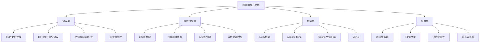
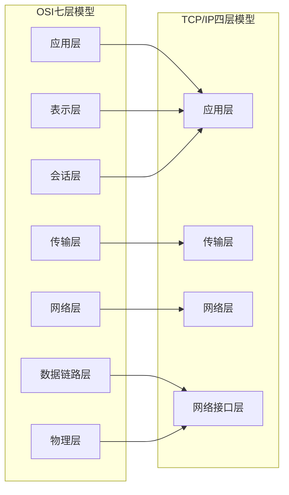
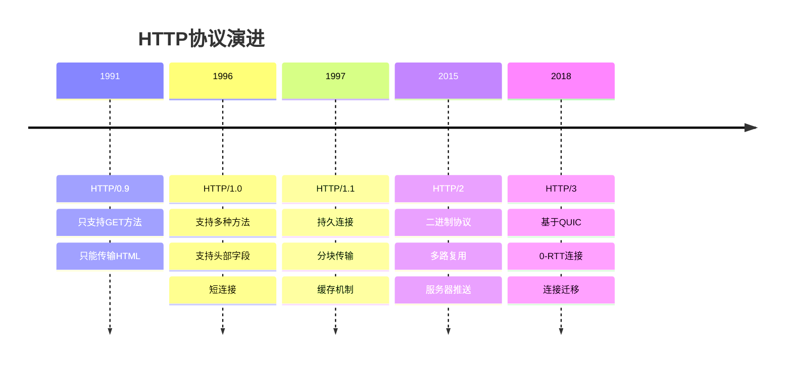
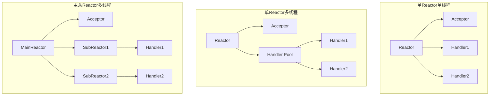
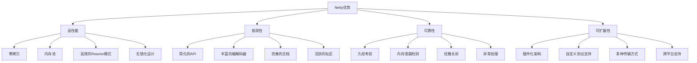
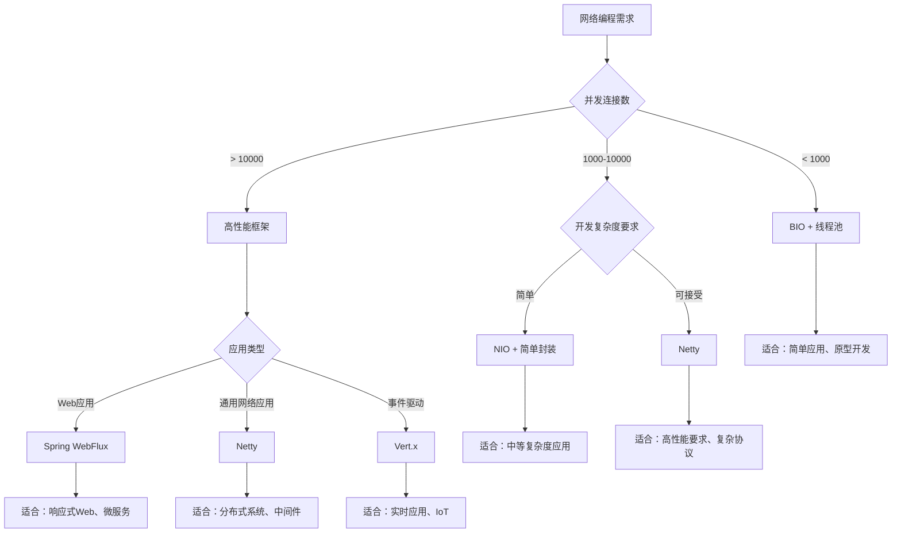
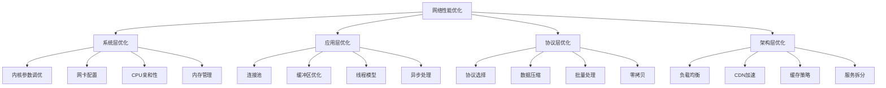
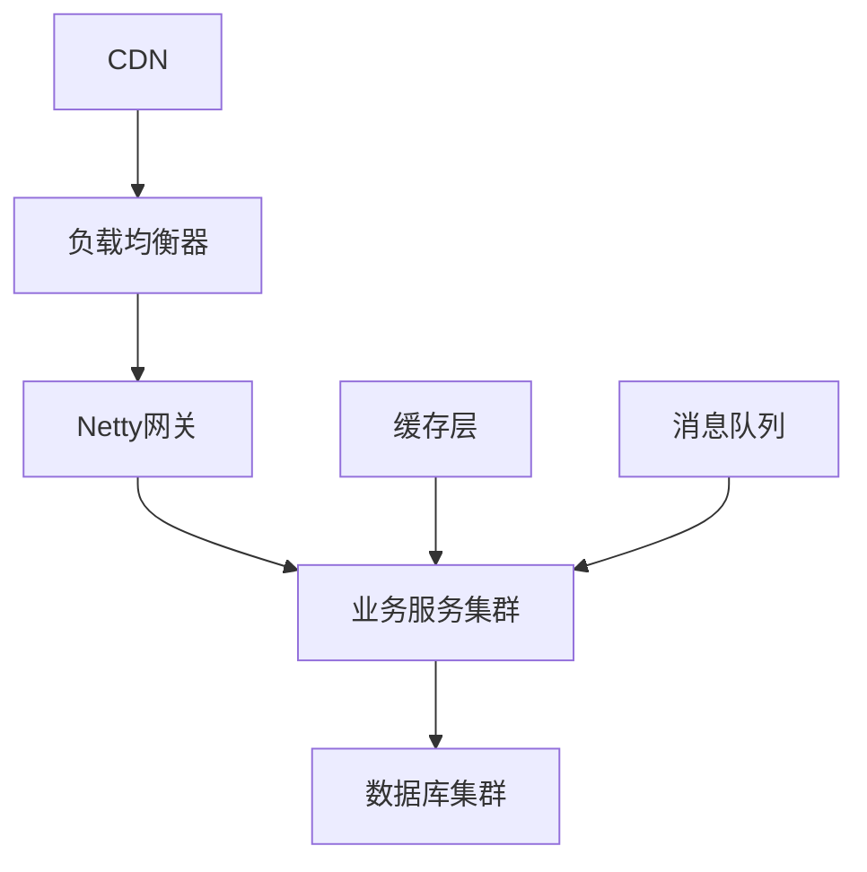
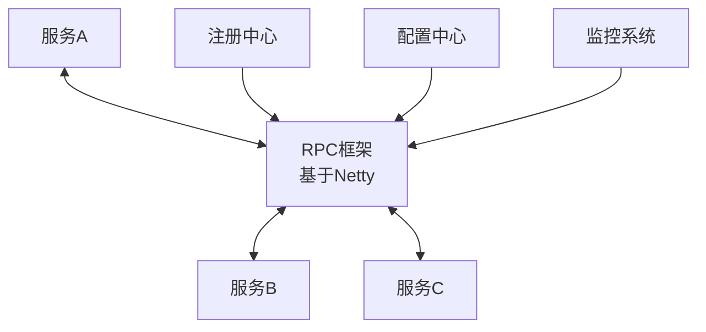

import Tabs from '@theme/Tabs';
import TabItem from '@theme/TabItem';

# 网络编程核心技术总结

网络编程是后端开发的基础技能，掌握网络编程对于构建分布式系统和高性能应用至关重要。本文档全面总结了网络编程的核心概念、技术选型和面试重点。

:::tip 学习路径
**网络编程学习路径：基础协议 → IO模型 → 框架应用 → 性能优化**
- 📚 **理论基础**：TCP/IP协议栈、HTTP/HTTPS协议原理
- 🔧 **编程实践**：Socket编程、BIO/NIO/AIO模型
- 🚀 **框架应用**：Netty高性能网络框架
- ⚡ **性能优化**：零拷贝、内存管理、并发模型
- 🎯 **实战应用**：分布式系统、微服务通信
:::

## 1. 网络编程技术栈全景

### 1.1 技术栈层次结构



### 1.2 核心技术对比

| 技术 | 适用场景 | 性能 | 复杂度 | 学习成本 | 生态成熟度 |
|------|----------|------|--------|----------|------------|
| 原生Socket | 底层网络编程 | 高 | 高 | 高 | 成熟 |
| Java NIO | 中高并发应用 | 高 | 中高 | 中高 | 成熟 |
| Netty | 高性能网络应用 | 极高 | 中 | 中 | 非常成熟 |
| Spring WebFlux | 响应式Web应用 | 高 | 中 | 中 | 成熟 |
| Vert.x | 事件驱动应用 | 高 | 中 | 中 | 较成熟 |
| Apache Mina | 网络服务器 | 高 | 中 | 中 | 成熟 |

## 2. 网络协议基础

### 2.1 协议层次对比

<Tabs>
<TabItem value="protocol-layers" label="协议层次">

**OSI七层模型 vs TCP/IP四层模型**



| OSI层次 | TCP/IP层次 | 主要协议 | 功能描述 | 典型设备 |
|---------|------------|----------|----------|----------|
| 应用层 | 应用层 | HTTP、FTP、SMTP、DNS | 为应用程序提供网络服务 | 网关、代理 |
| 表示层 | 应用层 | SSL/TLS、JPEG、MPEG | 数据格式转换、加密解密 | 加密设备 |
| 会话层 | 应用层 | NetBIOS、RPC、SQL | 建立、管理、终止会话 | 会话管理器 |
| 传输层 | 传输层 | TCP、UDP | 端到端可靠数据传输 | 网关 |
| 网络层 | 网络层 | IP、ICMP、ARP | 路由选择和逻辑寻址 | 路由器 |
| 数据链路层 | 网络接口层 | Ethernet、PPP、WiFi | 帧同步、错误检测 | 交换机、网桥 |
| 物理层 | 网络接口层 | 电缆、光纤、无线 | 比特流传输 | 集线器、中继器 |

</TabItem>
<TabItem value="tcp-udp" label="TCP vs UDP">

**传输层协议详细对比**

| 特性 | TCP | UDP | 应用场景 | 性能影响 |
|------|-----|-----|----------|----------|
| 连接性 | 面向连接 | 无连接 | TCP适合可靠传输，UDP适合实时传输 | TCP建立连接有开销 |
| 可靠性 | 可靠传输 | 不可靠传输 | TCP保证数据完整性 | TCP有重传机制 |
| 速度 | 较慢 | 快速 | UDP延迟更低 | UDP无流量控制开销 |
| 头部开销 | 20-60字节 | 8字节 | UDP开销更小 | TCP头部信息丰富 |
| 流量控制 | 支持滑动窗口 | 不支持 | TCP防止接收方过载 | TCP自适应调节 |
| 拥塞控制 | 支持多种算法 | 不支持 | TCP适应网络状况 | TCP避免网络拥塞 |
| 数据边界 | 字节流 | 数据报 | UDP保持消息边界 | TCP需要应用层处理 |
| 多播支持 | 不支持 | 支持 | UDP支持一对多通信 | UDP适合广播场景 |

**典型应用场景**
- **TCP应用**：Web浏览(HTTP)、文件传输(FTP)、邮件(SMTP)、远程登录(SSH)
- **UDP应用**：DNS查询、视频直播、在线游戏、语音通话、DHCP

</TabItem>
<TabItem value="http-evolution" label="HTTP协议演进">

**HTTP版本演进历程**



| 版本 | 发布年份 | 主要特性 | 性能提升 | 兼容性 | 采用率 |
|------|----------|----------|----------|--------|--------|
| HTTP/0.9 | 1991 | 基础GET请求 | 基准 | 已废弃 | 0% |
| HTTP/1.0 | 1996 | 多方法支持 | 功能完善 | 已废弃 | \<1% |
| HTTP/1.1 | 1997 | 持久连接、缓存 | 连接复用 | 广泛支持 | 60% |
| HTTP/2 | 2015 | 多路复用、推送 | 性能大幅提升 | 现代浏览器 | 35% |
| HTTP/3 | 2018 | QUIC、0-RTT | 延迟最低 | 逐步支持 | 5% |

</TabItem>
</Tabs>

### 3.1 Java IO模型演进

<Tabs>
<TabItem value="io-models" label="IO模型对比">

**Java IO模型发展历程**

| IO模型 | 阻塞性 | 同步性 | 线程模型 | 适用场景 | 性能特点 |
|--------|--------|--------|----------|----------|----------|
| BIO | 阻塞 | 同步 | 一连接一线程 | 连接数少(\<1000) | 简单但资源消耗大 |
| NIO | 非阻塞 | 同步 | 一线程多连接 | 中高并发(1000-10000) | 复杂但高效 |
| AIO | 非阻塞 | 异步 | 回调处理 | 高并发(\>10000) | 最高性能但复杂 |
| Netty | 非阻塞 | 异步 | Reactor模式 | 超高并发 | 生产级高性能框架 |

</TabItem>
<TabItem value="reactor-pattern" label="Reactor模式">

**Reactor模式演进**



**Reactor模式特点**
- **事件驱动**：基于事件的异步处理
- **单线程事件循环**：避免线程竞争
- **非阻塞IO**：提高系统吞吐量
- **可扩展性**：支持大量并发连接

</TabItem>
<TabItem value="performance-comparison" label="性能对比">

**不同IO模型性能对比**

| 并发连接数 | BIO内存占用 | NIO内存占用 | AIO内存占用 | BIO吞吐量 | NIO吞吐量 | AIO吞吐量 |
|------------|-------------|------------|------------|-----------|-----------|-----------|
| 100 | 100MB | 10MB | 8MB | 1000 req/s | 5000 req/s | 6000 req/s |
| 1000 | 1GB | 50MB | 40MB | 500 req/s | 15000 req/s | 18000 req/s |
| 10000 | 10GB | 200MB | 150MB | 不可用 | 50000 req/s | 60000 req/s |
| 100000 | 不可用 | 1GB | 800MB | 不可用 | 200000 req/s | 250000 req/s |

**性能优化建议**
- **连接数 < 1000**：使用BIO + 线程池
- **连接数 1000-10000**：使用NIO + Reactor
- **连接数 > 10000**：使用AIO或Netty
- **超高并发**：使用Netty + 优化配置

</TabItem>
</Tabs>

## 4. 网络框架技术选型

### 4.1 主流网络框架对比

<Tabs>
<TabItem value="framework-comparison" label="框架对比">

| 框架 | 基础技术 | 学习成本 | 性能 | 生态 | 适用场景 | 知名应用 |
|------|----------|----------|------|------|----------|----------|
| Netty | NIO + Reactor | 中等 | 极高 | 丰富 | 高性能网络应用 | Dubbo、Elasticsearch、Cassandra |
| Apache Mina | NIO | 中等 | 高 | 成熟 | 网络服务器 | Apache Directory、Red5 |
| Spring WebFlux | Reactor + NIO | 中等 | 高 | 丰富 | 响应式Web应用 | Spring Cloud Gateway |
| Vert.x | Event Loop | 中等 | 高 | 较好 | 事件驱动应用 | Eclipse Vert.x生态 |
| Undertow | NIO | 低 | 高 | 一般 | Web服务器 | WildFly、Quarkus |
| Grizzly | NIO | 中等 | 高 | 一般 | HTTP服务器 | GlassFish |

</TabItem>
<TabItem value="netty-advantages" label="Netty优势">

**Netty核心优势**



**Netty在企业中的应用**
- **RPC框架**：Dubbo、gRPC、Thrift
- **消息中间件**：RocketMQ、Kafka
- **分布式存储**：Elasticsearch、Cassandra
- **API网关**：Spring Cloud Gateway、Zuul
- **游戏服务器**：实时对战、聊天系统

</TabItem>
<TabItem value="selection-guide" label="选型指南">

**技术选型决策树**



**选型考虑因素**
1. **性能要求**：QPS、延迟、并发连接数
2. **开发成本**：学习曲线、开发效率、维护成本
3. **团队技能**：现有技术栈、团队经验
4. **生态支持**：社区活跃度、文档完善度、第三方库
5. **长期维护**：技术发展趋势、厂商支持

</TabItem>
</Tabs>

## 5. 性能优化与最佳实践

### 5.1 网络性能优化策略

<Tabs>
<TabItem value="optimization-layers" label="优化层次">

**网络性能优化层次**



</TabItem>
<TabItem value="system-tuning" label="系统调优">

**Linux网络参数调优**

```bash title="系统级网络优化配置"
# TCP连接优化
net.core.somaxconn = 65535                    # 监听队列最大长度
net.core.netdev_max_backlog = 5000            # 网卡接收队列长度
net.ipv4.tcp_max_syn_backlog = 65535          # SYN队列长度
net.ipv4.tcp_syncookies = 1                   # 启用SYN Cookies

# TCP缓冲区优化
net.core.rmem_default = 262144                # 默认接收缓冲区
net.core.rmem_max = 16777216                  # 最大接收缓冲区
net.core.wmem_default = 262144                # 默认发送缓冲区
net.core.wmem_max = 16777216                  # 最大发送缓冲区

# TCP连接回收优化
net.ipv4.tcp_tw_reuse = 1                     # TIME_WAIT重用
net.ipv4.tcp_fin_timeout = 30                 # FIN_WAIT_2超时时间
net.ipv4.tcp_keepalive_time = 1200            # 保活时间
net.ipv4.tcp_keepalive_probes = 3             # 保活探测次数

# 文件描述符限制
fs.file-max = 1000000                         # 系统最大文件描述符
# ulimit -n 65535                             # 进程最大文件描述符
```

**JVM网络优化参数**
```bash title="JVM网络相关参数"
# 网络相关JVM参数
-Djava.net.preferIPv4Stack=true              # 优先使用IPv4
-Dio.netty.leakDetection.level=SIMPLE        # Netty内存泄漏检测
-Dio.netty.allocator.type=pooled              # 使用池化内存分配器
-Dio.netty.eventLoopThreads=16                # EventLoop线程数

# 垃圾回收优化
-XX:+UseG1GC                                  # 使用G1垃圾回收器
-XX:MaxGCPauseMillis=200                      # 最大GC暂停时间
-XX:+UnlockExperimentalVMOptions              # 启用实验性选项
-XX:+UseCGroupMemoryLimitForHeap              # 容器内存限制
```

</TabItem>
<TabItem value="application-optimization" label="应用优化">

**应用层性能优化**

```java title="连接池优化示例"
// HTTP连接池配置
@Configuration
public class HttpClientConfig {
    
    @Bean
    public CloseableHttpClient httpClient() {
        PoolingHttpClientConnectionManager connectionManager = 
            new PoolingHttpClientConnectionManager();
        
        // 连接池配置
        connectionManager.setMaxTotal(200);              // 最大连接数
        connectionManager.setDefaultMaxPerRoute(50);     // 每个路由最大连接数
        connectionManager.setValidateAfterInactivity(30000); // 连接验证间隔
        
        return HttpClients.custom()
            .setConnectionManager(connectionManager)
            .setConnectionTimeToLive(60, TimeUnit.SECONDS)  // 连接生存时间
            .setDefaultRequestConfig(RequestConfig.custom()
                .setConnectTimeout(5000)                     // 连接超时
                .setSocketTimeout(10000)                     // 读取超时
                .setConnectionRequestTimeout(3000)           // 从连接池获取连接超时
                .build())
            .build();
    }
}
```

**Netty性能优化配置**
```java title="Netty性能优化"
public class OptimizedNettyServer {
    
    public void start() throws InterruptedException {
        // 线程组配置
        EventLoopGroup bossGroup = new NioEventLoopGroup(1);
        EventLoopGroup workerGroup = new NioEventLoopGroup(
            Runtime.getRuntime().availableProcessors() * 2);
        
        try {
            ServerBootstrap bootstrap = new ServerBootstrap();
            bootstrap.group(bossGroup, workerGroup)
                    .channel(NioServerSocketChannel.class)
                    
                    // 性能优化选项
                    .option(ChannelOption.SO_BACKLOG, 1024)
                    .option(ChannelOption.SO_REUSEADDR, true)
                    .childOption(ChannelOption.SO_KEEPALIVE, true)
                    .childOption(ChannelOption.TCP_NODELAY, true)
                    .childOption(ChannelOption.SO_SNDBUF, 32 * 1024)
                    .childOption(ChannelOption.SO_RCVBUF, 32 * 1024)
                    
                    // 内存优化
                    .childOption(ChannelOption.ALLOCATOR, 
                        PooledByteBufAllocator.DEFAULT)
                    .childOption(ChannelOption.WRITE_BUFFER_WATER_MARK,
                        new WriteBufferWaterMark(8 * 1024, 32 * 1024))
                    
                    .childHandler(new ChannelInitializer<SocketChannel>() {
                        @Override
                        protected void initChannel(SocketChannel ch) {
                            // Pipeline配置
                            ch.pipeline().addLast(new OptimizedHandler());
                        }
                    });
            
            ChannelFuture future = bootstrap.bind(8080).sync();
            future.channel().closeFuture().sync();
            
        } finally {
            bossGroup.shutdownGracefully();
            workerGroup.shutdownGracefully();
        }
    }
}
```

</TabItem>
</Tabs>

## 6. 常见面试问题精选

### 6.1 核心概念问题

<Tabs>
<TabItem value="protocol-qa" label="协议相关">

**Q1: TCP三次握手的详细过程是什么？为什么不是两次或四次？**

A: **三次握手过程**：
1. 客户端发送SYN包，进入SYN_SENT状态
2. 服务器回复SYN+ACK包，进入SYN_RCVD状态
3. 客户端发送ACK包，双方进入ESTABLISHED状态

**为什么是三次**：
- 两次握手无法确认客户端接收能力
- 四次握手是多余的，三次已足够确认双方收发能力
- 防止旧连接请求导致的错误连接

**Q2: HTTP/2相比HTTP/1.1有哪些重要改进？**

A: **主要改进**：
- **多路复用**：单连接并发处理多个请求，解决队头阻塞
- **二进制协议**：更高效的数据传输和解析
- **头部压缩**：HPACK算法减少头部冗余
- **服务器推送**：主动推送资源，减少往返时间
- **流优先级**：合理分配带宽资源

**Q3: HTTPS的握手过程是怎样的？**

A: **TLS握手过程**：
1. **Client Hello**：客户端发送支持的加密套件
2. **Server Hello**：服务器选择加密套件，发送证书
3. **证书验证**：客户端验证服务器证书
4. **密钥交换**：生成会话密钥
5. **握手完成**：开始加密通信

</TabItem>
<TabItem value="programming-qa" label="编程相关">

**Q4: BIO、NIO、AIO的区别和适用场景？**

A: **主要区别**：
- **BIO**：同步阻塞，一连接一线程，适合连接数少的场景
- **NIO**：同步非阻塞，多路复用，适合中高并发场景
- **AIO**：异步非阻塞，回调机制，适合高并发场景

**适用场景**：
- **BIO**：简单应用、连接数 < 1000
- **NIO**：Web服务器、连接数 1000-10000
- **AIO**：高并发服务、连接数 > 10000

**Q5: Netty的核心组件及其作用？**

A: **核心组件**：
- **Bootstrap**：启动器，配置和启动服务
- **EventLoopGroup**：事件循环组，管理线程
- **Channel**：网络通道，代表连接
- **Pipeline**：处理链，管理Handler执行顺序
- **Handler**：处理器，处理业务逻辑
- **ByteBuf**：缓冲区，高效的数据容器

**Q6: 如何解决TCP粘包拆包问题？**

A: **解决方案**：
1. **固定长度**：每个消息固定字节数
2. **分隔符**：使用特殊字符分隔消息
3. **长度字段**：消息头包含长度信息
4. **自定义协议**：设计完整的应用层协议

</TabItem>
<TabItem value="performance-qa" label="性能相关">

**Q7: 什么是零拷贝？Netty如何实现零拷贝？**

A: **零拷贝概念**：
数据传输过程中避免用户空间和内核空间的数据拷贝

**Netty实现方式**：
- **DirectByteBuffer**：使用直接内存
- **CompositeByteBuf**：组合多个ByteBuf
- **FileRegion**：文件传输使用sendfile
- **slice()和duplicate()**：创建视图共享数据

**Q8: 如何进行网络性能优化？**

A: **优化策略**：
- **系统层**：调整内核参数、网卡配置
- **应用层**：连接池、异步处理、缓冲区优化
- **协议层**：选择合适协议、数据压缩
- **架构层**：负载均衡、CDN、缓存

**Q9: 高并发网络编程的最佳实践？**

A: **最佳实践**：
- **选择合适的IO模型**：根据并发量选择
- **合理的线程配置**：避免过多线程切换
- **内存管理**：使用内存池，避免频繁GC
- **连接管理**：连接池复用，优雅关闭
- **监控和调试**：性能监控，问题定位

</TabItem>
</Tabs>

## 7. 实战应用场景

### 7.1 典型应用架构

**高性能Web服务器架构**


**分布式系统通信架构**


### 7.2 学习路径建议

**初级阶段（1-2个月）**
1. 掌握TCP/IP基础协议
2. 学习HTTP/HTTPS协议
3. 理解Socket编程基础
4. 实践BIO编程模型

**中级阶段（2-3个月）**
1. 深入学习NIO编程
2. 理解Reactor模式
3. 学习Netty框架基础
4. 实现简单的网络应用

**高级阶段（3-6个月）**
1. 掌握Netty高级特性
2. 学习性能优化技巧
3. 理解分布式网络通信
4. 参与开源项目实践

**专家阶段（持续学习）**
1. 深入研究网络协议实现
2. 贡献开源网络框架
3. 设计高性能网络架构
4. 分享技术经验和最佳实践

通过系统学习网络编程技术栈，你将能够：
- 深入理解网络通信原理和协议
- 熟练使用各种网络编程模型和框架
- 设计和实现高性能网络应用
- 解决复杂的网络编程问题
- 在分布式系统中应用网络编程技术

### TCP连接管理
```
TCP连接
├── 三次握手
│   ├── 客户端发送SYN
│   ├── 服务端回复SYN+ACK
│   ├── 客户端发送ACK
│   └── 连接建立
├── 四次挥手
│   ├── 客户端发送FIN
│   ├── 服务端回复ACK
│   ├── 服务端发送FIN
│   ├── 客户端回复ACK
│   └── 连接断开
├── 状态转换
│   ├── CLOSED
│   ├── LISTEN
│   ├── SYN_SENT
│   ├── SYN_RECEIVED
│   ├── ESTABLISHED
│   ├── FIN_WAIT_1
│   ├── FIN_WAIT_2
│   ├── CLOSE_WAIT
│   ├── CLOSING
│   ├── TIME_WAIT
│   └── LAST_ACK
└── 连接超时
    ├── 保活机制
    ├── 超时重传
    └── 连接重置
```

### HTTP协议详解
```
HTTP协议
├── 请求格式
│   ├── 请求行
│   │   ├── 方法
│   │   ├── URL
│   │   └── 版本
│   ├── 请求头
│   │   ├── Host
│   │   ├── User-Agent
│   │   ├── Content-Type
│   │   └── Authorization
│   └── 请求体
│       ├── 表单数据
│       ├── JSON数据
│       └── 文件上传
├── 响应格式
│   ├── 状态行
│   │   ├── 版本
│   │   ├── 状态码
│   │   └── 状态消息
│   ├── 响应头
│   │   ├── Content-Type
│   │   ├── Content-Length
│   │   ├── Set-Cookie
│   │   └── Cache-Control
│   └── 响应体
│       ├── HTML
│       ├── JSON
│       └── 二进制数据
├── 状态码
│   ├── 1xx (信息性)
│   ├── 2xx (成功)
│   ├── 3xx (重定向)
│   ├── 4xx (客户端错误)
│   └── 5xx (服务器错误)
└── 版本演进
    ├── HTTP/1.0
    │   ├── 短连接
    │   └── 无状态
    ├── HTTP/1.1
    │   ├── 长连接
    │   ├── 分块传输
    │   └── 缓存机制
    ├── HTTP/2
    │   ├── 二进制协议
    │   ├── 多路复用
    │   ├── 头部压缩
    │   └── 服务器推送
    └── HTTP/3
        ├── 基于UDP
        ├── QUIC协议
        ├── 0-RTT连接
        └── 连接迁移
```

### Socket编程模型
```
Socket编程
├── 阻塞模型
│   ├── 同步阻塞
│   ├── 简单易用
│   ├── 性能较低
│   └── 适合低并发
├── 非阻塞模型
│   ├── 异步非阻塞
│   ├── 轮询机制
│   ├── CPU占用高
│   └── 适合中等并发
├── 多路复用
│   ├── select
│   │   ├── 跨平台
│   │   ├── 文件描述符限制
│   │   └── 性能一般
│   ├── poll
│   │   ├── 无文件描述符限制
│   │   ├── 性能一般
│   │   └── 跨平台
│   └── epoll
│       ├── Linux特有
│       ├── 高性能
│       ├── 事件驱动
│       └── 适合高并发
└── 异步IO
    ├── AIO
    ├── 回调机制
    ├── 零拷贝
    └── 最高性能
```

## 网络框架

### Netty框架
```
Netty框架
├── 核心组件
│   ├── Bootstrap
│   ├── EventLoop
│   ├── Channel
│   ├── ChannelPipeline
│   ├── ChannelHandler
│   └── ByteBuf
├── 线程模型
│   ├── Boss线程组
│   ├── Worker线程组
│   ├── 事件循环
│   └── 线程安全
├── 编解码器
│   ├── 编码器 (Encoder)
│   ├── 解码器 (Decoder)
│   ├── 编解码器 (Codec)
│   └── 自定义协议
└── 高级特性
    ├── 零拷贝
    ├── 内存池
    ├── 对象池
    └── 连接池
```

### 其他框架
```
网络框架
├── Apache Mina
│   ├── 事件驱动
│   ├── 异步IO
│   ├── 过滤器链
│   └── 协议无关
├── Grizzly
│   ├── NIO框架
│   ├── 高性能
│   ├── 模块化
│   └── 可扩展
├── Spring WebFlux
│   ├── 响应式编程
│   ├── 非阻塞IO
│   ├── 事件循环
│   └── 背压控制
└── Vert.x
    ├── 多语言支持
    ├── 事件驱动
    ├── 非阻塞
    └── 轻量级
```

## 性能优化

### 网络优化
- **连接池**：复用TCP连接，减少握手开销
- **压缩传输**：gzip、deflate等压缩算法
- **缓存机制**：HTTP缓存、DNS缓存
- **CDN加速**：内容分发网络

### 应用优化
- **异步处理**：非阻塞IO、异步回调
- **多线程**：线程池、工作线程
- **内存优化**：零拷贝、内存池
- **协议优化**：HTTP/2、WebSocket

## 安全考虑

### 网络安全
- **加密传输**：TLS/SSL、HTTPS
- **身份认证**：证书验证、Token认证
- **访问控制**：防火墙、ACL
- **数据保护**：数据加密、签名验证

### 应用安全
- **输入验证**：参数校验、SQL注入防护
- **会话管理**：Session管理、CSRF防护
- **权限控制**：RBAC、权限验证
- **日志审计**：访问日志、安全日志

## 常见面试问题

### 基础概念
1. **TCP和UDP的区别**
2. **HTTP协议的版本演进**
3. **Socket编程的基本流程**
4. **网络编程的IO模型**

### 深入原理
1. **TCP三次握手和四次挥手**
2. **HTTP/2的多路复用原理**
3. **Netty的线程模型**
4. **网络性能优化策略**

### 实际应用
1. **如何实现高并发网络服务**
2. **如何处理网络异常**
3. **如何设计网络协议**
4. **如何进行网络调试**

### 性能优化
1. **如何优化网络传输性能**
2. **如何处理网络延迟**
3. **如何实现负载均衡**
4. **如何进行网络监控**

## 学习建议

### 理论基础
1. **理解网络协议的基本原理**
2. **掌握TCP/IP协议栈**
3. **学习网络编程模型**
4. **了解网络安全知识**

### 实践能力
1. **编写Socket程序**
2. **使用网络框架开发**
3. **进行网络性能测试**
4. **处理网络问题**

### 扩展知识
1. **微服务网络通信**
2. **云原生网络**
3. **网络虚拟化**
4. **SDN和NFV**

通过系统学习网络编程，你将能够：
- 理解网络通信的基本原理
- 开发高性能的网络应用
- 解决网络相关的问题
- 设计分布式系统的网络架构 