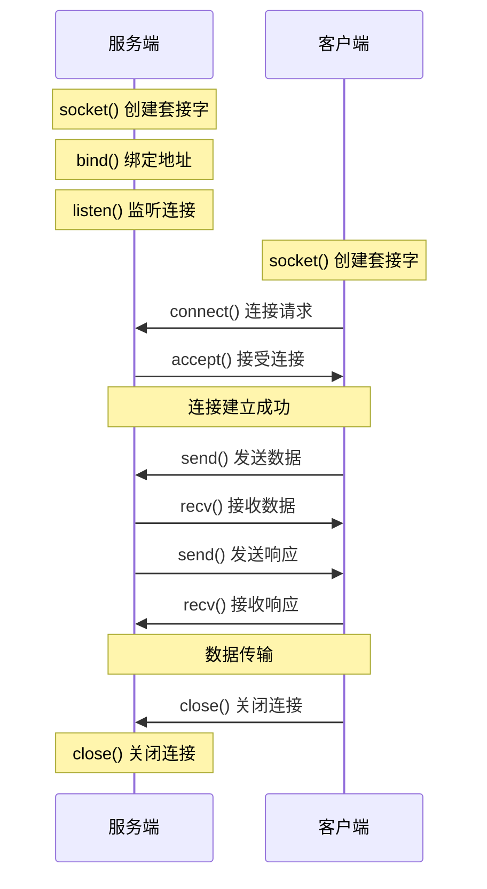
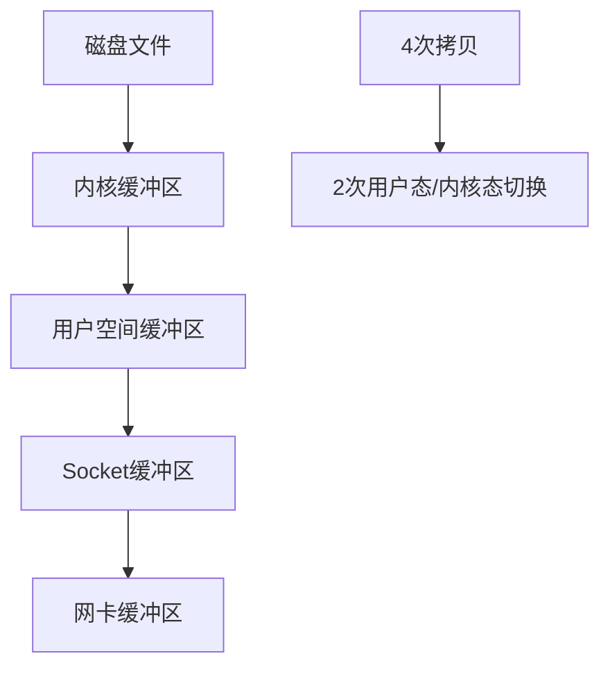
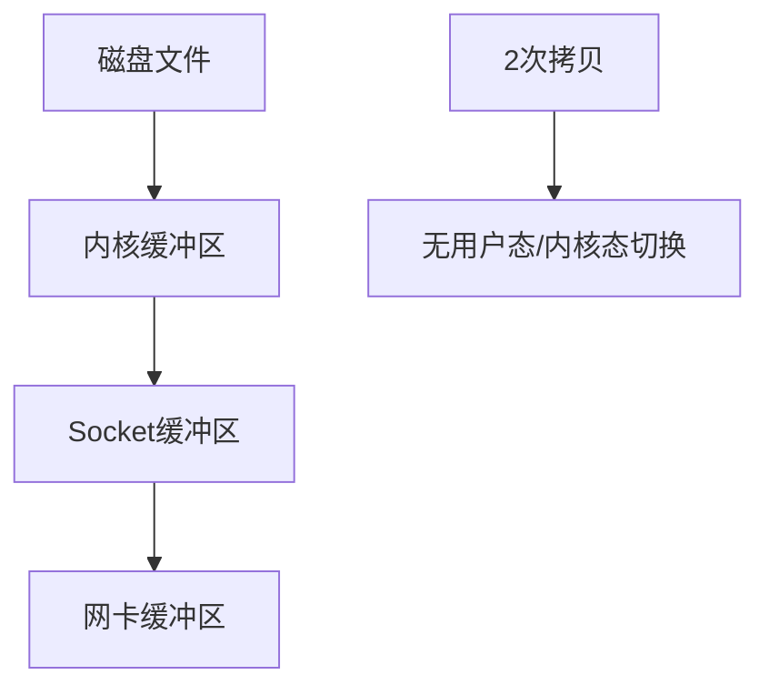

import Tabs from '@theme/Tabs';
import TabItem from '@theme/TabItem';

# Socket网络编程详解

Socket是网络编程的基础，提供了进程间网络通信的接口。理解不同的IO模型对于构建高性能网络应用至关重要。

:::tip 核心价值
**Socket编程 = 网络通信基础 + IO模型选择 + 性能优化 + 并发处理**
- 🔌 **通信基础**：TCP/UDP Socket提供网络通信能力
- ⚡ **IO模型**：BIO、NIO、AIO适应不同并发需求
- 🚀 **高性能**：多路复用、零拷贝、直接内存优化
- 🎯 **并发处理**：线程模型、事件驱动、异步回调
- 🛠️ **实用技巧**：粘包拆包、连接管理、异常处理
:::

## 1. Socket编程基础

### 1.1 Socket概念与分类

```mermaid
graph TB
    A[Socket套接字] --> B[TCP Socket]
    A --> C[UDP Socket]
    
    B --> B1[面向连接]
    B --> B2[可靠传输]
    B --> B3[流式数据]
    
    C --> C1[无连接]
    C --> C2[不可靠传输]
    C --> C3[数据报]
    
    D[Socket API] --> E[服务端API]
    D --> F[客户端API]
    
    E --> E1[socket()]
    E --> E2[bind()]
    E --> E3[listen()]
    E --> E4[accept()]
    
    F --> F1[socket()]
    F --> F2[connect()]
    F --> F3[send()/recv()]
    F --> F4[close()]
```

### 1.2 TCP Socket通信流程



## 2. Java IO模型详解

### 2.1 IO模型对比

| 特性 | BIO | NIO | AIO | 适用场景 |
|------|-----|-----|-----|----------|
| 阻塞性 | 阻塞 | 非阻塞 | 异步 | BIO适合连接数少，NIO适合高并发，AIO适合异步处理 |
| 线程模型 | 一连接一线程 | 一线程多连接 | 回调处理 | BIO简单但资源消耗大 |
| 内存拷贝 | 多次拷贝 | 零拷贝 | 零拷贝 | NIO/AIO性能更好 |
| 编程复杂度 | 简单 | 复杂 | 中等 | BIO最简单，NIO最复杂 |
| 吞吐量 | 低 | 高 | 高 | NIO/AIO适合高吞吐场景 |
| 延迟 | 高 | 低 | 低 | NIO/AIO延迟更低 |

### 2.2 BIO（阻塞IO）编程

<Tabs>
<TabItem value="bio-server" label="BIO服务端">

```java title="BIO服务端实现"
import java.io.*;
import java.net.*;
import java.util.concurrent.*;

public class BIOServer {
    private final int port;
    private final ExecutorService threadPool;
    
    public BIOServer(int port) {
        this.port = port;
        // 使用线程池避免无限创建线程
        this.threadPool = Executors.newFixedThreadPool(100);
    }
    
    public void start() throws IOException {
        ServerSocket serverSocket = new ServerSocket(port);
        System.out.println("BIO服务器启动，监听端口: " + port);
        
        try {
            while (!Thread.currentThread().isInterrupted()) {
                // accept()方法阻塞等待客户端连接
                Socket clientSocket = serverSocket.accept();
                
                // 为每个连接分配线程处理
                threadPool.submit(new ClientHandler(clientSocket));
            }
        } finally {
            serverSocket.close();
            threadPool.shutdown();
        }
    }
    
    /**
     * 客户端连接处理器
     */
    private static class ClientHandler implements Runnable {
        private final Socket socket;
        
        public ClientHandler(Socket socket) {
            this.socket = socket;
        }
        
        @Override
        public void run() {
            try (BufferedReader reader = new BufferedReader(
                    new InputStreamReader(socket.getInputStream()));
                 PrintWriter writer = new PrintWriter(
                    socket.getOutputStream(), true)) {
                
                String inputLine;
                // 读取客户端数据（阻塞操作）
                while ((inputLine = reader.readLine()) != null) {
                    System.out.println("收到消息: " + inputLine);
                    
                    // 回显消息
                    writer.println("Echo: " + inputLine);
                    
                    // 如果收到"bye"则断开连接
                    if ("bye".equalsIgnoreCase(inputLine)) {
                        break;
                    }
                }
            } catch (IOException e) {
                System.err.println("处理客户端连接异常: " + e.getMessage());
            } finally {
                try {
                    socket.close();
                } catch (IOException e) {
                    System.err.println("关闭连接异常: " + e.getMessage());
                }
            }
        }
    }
    
    public static void main(String[] args) throws IOException {
        new BIOServer(8080).start();
    }
}
```

**BIO客户端实现**
```java title="BIO客户端实现"
public class BIOClient {
    public static void main(String[] args) {
        try (Socket socket = new Socket("localhost", 8080);
             BufferedReader reader = new BufferedReader(
                new InputStreamReader(socket.getInputStream()));
             PrintWriter writer = new PrintWriter(
                socket.getOutputStream(), true);
             Scanner scanner = new Scanner(System.in)) {
            
            System.out.println("连接到服务器成功！输入消息（输入'bye'退出）:");
            
            String userInput;
            while ((userInput = scanner.nextLine()) != null) {
                // 发送消息到服务器
                writer.println(userInput);
                
                // 读取服务器响应
                String response = reader.readLine();
                System.out.println("服务器响应: " + response);
                
                if ("bye".equalsIgnoreCase(userInput)) {
                    break;
                }
            }
        } catch (IOException e) {
            System.err.println("客户端异常: " + e.getMessage());
        }
    }
}
```

</TabItem>
<TabItem value="bio-analysis" label="BIO特点分析">

**BIO优点**
- **编程简单**：同步阻塞模型，逻辑清晰
- **易于理解**：一个连接一个线程，概念直观
- **调试方便**：线性执行流程，便于调试

**BIO缺点**
- **资源消耗大**：每个连接需要一个线程
- **扩展性差**：线程数量限制了并发连接数
- **上下文切换开销**：大量线程导致频繁切换

**BIO适用场景**
- 连接数较少（< 1000）
- 连接时间较长
- 对实时性要求不高
- 简单的请求-响应模式

**性能瓶颈分析**
```java
// 线程资源计算
int maxConnections = 1000;           // 最大连接数
int threadStackSize = 1024 * 1024;  // 每个线程栈大小 1MB
long totalMemory = maxConnections * threadStackSize; // 总内存消耗

System.out.println("1000个连接需要内存: " + totalMemory / 1024 / 1024 + "MB");
// 输出: 1000个连接需要内存: 1000MB
```

</TabItem>
</Tabs>

### 2.3 NIO（非阻塞IO）编程

<Tabs>
<TabItem value="nio-server" label="NIO服务端">

```java title="NIO服务端实现"
import java.io.IOException;
import java.net.InetSocketAddress;
import java.nio.ByteBuffer;
import java.nio.channels.*;
import java.util.Iterator;
import java.util.Set;

public class NIOServer {
    private final int port;
    private Selector selector;
    private ServerSocketChannel serverChannel;
    
    public NIOServer(int port) {
        this.port = port;
    }
    
    public void start() throws IOException {
        // 创建选择器
        selector = Selector.open();
        
        // 创建服务端通道
        serverChannel = ServerSocketChannel.open();
        serverChannel.configureBlocking(false); // 设置非阻塞
        serverChannel.bind(new InetSocketAddress(port));
        
        // 注册接受连接事件
        serverChannel.register(selector, SelectionKey.OP_ACCEPT);
        
        System.out.println("NIO服务器启动，监听端口: " + port);
        
        // 事件循环
        while (true) {
            // 阻塞等待事件发生
            int readyChannels = selector.select();
            
            if (readyChannels == 0) {
                continue;
            }
            
            // 获取就绪的事件集合
            Set<SelectionKey> selectedKeys = selector.selectedKeys();
            Iterator<SelectionKey> keyIterator = selectedKeys.iterator();
            
            while (keyIterator.hasNext()) {
                SelectionKey key = keyIterator.next();
                keyIterator.remove(); // 必须手动移除
                
                try {
                    handleKey(key);
                } catch (IOException e) {
                    System.err.println("处理事件异常: " + e.getMessage());
                    closeChannel(key);
                }
            }
        }
    }
    
    /**
     * 处理选择键事件
     */
    private void handleKey(SelectionKey key) throws IOException {
        if (key.isAcceptable()) {
            // 处理连接事件
            handleAccept(key);
        } else if (key.isReadable()) {
            // 处理读事件
            handleRead(key);
        } else if (key.isWritable()) {
            // 处理写事件
            handleWrite(key);
        }
    }
    
    /**
     * 处理客户端连接
     */
    private void handleAccept(SelectionKey key) throws IOException {
        ServerSocketChannel serverChannel = (ServerSocketChannel) key.channel();
        SocketChannel clientChannel = serverChannel.accept();
        
        if (clientChannel != null) {
            clientChannel.configureBlocking(false);
            
            // 注册读事件
            SelectionKey clientKey = clientChannel.register(
                selector, SelectionKey.OP_READ);
            
            // 为每个客户端分配缓冲区
            clientKey.attach(ByteBuffer.allocate(1024));
            
            System.out.println("新客户端连接: " + 
                clientChannel.getRemoteAddress());
        }
    }
    
    /**
     * 处理读事件
     */
    private void handleRead(SelectionKey key) throws IOException {
        SocketChannel clientChannel = (SocketChannel) key.channel();
        ByteBuffer buffer = (ByteBuffer) key.attachment();
        
        int bytesRead = clientChannel.read(buffer);
        
        if (bytesRead > 0) {
            buffer.flip(); // 切换到读模式
            
            byte[] data = new byte[buffer.remaining()];
            buffer.get(data);
            String message = new String(data, "UTF-8");
            
            System.out.println("收到消息: " + message);
            
            // 准备回写数据
            String response = "Echo: " + message;
            ByteBuffer writeBuffer = ByteBuffer.wrap(response.getBytes("UTF-8"));
            key.attach(writeBuffer);
            
            // 注册写事件
            key.interestOps(SelectionKey.OP_WRITE);
            
        } else if (bytesRead < 0) {
            // 客户端断开连接
            System.out.println("客户端断开连接: " + 
                clientChannel.getRemoteAddress());
            closeChannel(key);
        }
    }
    
    /**
     * 处理写事件
     */
    private void handleWrite(SelectionKey key) throws IOException {
        SocketChannel clientChannel = (SocketChannel) key.channel();
        ByteBuffer buffer = (ByteBuffer) key.attachment();
        
        clientChannel.write(buffer);
        
        if (!buffer.hasRemaining()) {
            // 写完成，重新注册读事件
            key.attach(ByteBuffer.allocate(1024));
            key.interestOps(SelectionKey.OP_READ);
        }
    }
    
    /**
     * 关闭通道
     */
    private void closeChannel(SelectionKey key) {
        try {
            key.channel().close();
        } catch (IOException e) {
            System.err.println("关闭通道异常: " + e.getMessage());
        }
        key.cancel();
    }
    
    public static void main(String[] args) throws IOException {
        new NIOServer(8080).start();
    }
}
```

</TabItem>
<TabItem value="nio-client" label="NIO客户端">

```java title="NIO客户端实现"
import java.io.IOException;
import java.net.InetSocketAddress;
import java.nio.ByteBuffer;
import java.nio.channels.SocketChannel;
import java.util.Scanner;

public class NIOClient {
    private SocketChannel socketChannel;
    private ByteBuffer buffer = ByteBuffer.allocate(1024);
    
    public void connect(String host, int port) throws IOException {
        socketChannel = SocketChannel.open();
        socketChannel.connect(new InetSocketAddress(host, port));
        
        System.out.println("连接到服务器: " + host + ":" + port);
    }
    
    public void sendMessage(String message) throws IOException {
        buffer.clear();
        buffer.put(message.getBytes("UTF-8"));
        buffer.flip();
        
        while (buffer.hasRemaining()) {
            socketChannel.write(buffer);
        }
    }
    
    public String receiveMessage() throws IOException {
        buffer.clear();
        int bytesRead = socketChannel.read(buffer);
        
        if (bytesRead > 0) {
            buffer.flip();
            byte[] data = new byte[buffer.remaining()];
            buffer.get(data);
            return new String(data, "UTF-8");
        }
        
        return null;
    }
    
    public void close() throws IOException {
        if (socketChannel != null) {
            socketChannel.close();
        }
    }
    
    public static void main(String[] args) {
        NIOClient client = new NIOClient();
        
        try {
            client.connect("localhost", 8080);
            
            Scanner scanner = new Scanner(System.in);
            System.out.println("输入消息（输入'bye'退出）:");
            
            String userInput;
            while ((userInput = scanner.nextLine()) != null) {
                client.sendMessage(userInput);
                
                String response = client.receiveMessage();
                System.out.println("服务器响应: " + response);
                
                if ("bye".equalsIgnoreCase(userInput)) {
                    break;
                }
            }
        } catch (IOException e) {
            System.err.println("客户端异常: " + e.getMessage());
        } finally {
            try {
                client.close();
            } catch (IOException e) {
                System.err.println("关闭连接异常: " + e.getMessage());
            }
        }
    }
}
```

</TabItem>
<TabItem value="selector-principle" label="Selector原理">

**Selector工作原理**

```mermaid
graph TB
    A[Selector选择器] --> B[Channel1]
    A --> C[Channel2]
    A --> D[Channel3]
    A --> E[ChannelN]
    
    B --> B1[OP_READ]
    B --> B2[OP_WRITE]
    C --> C1[OP_ACCEPT]
    D --> D1[OP_CONNECT]
    E --> E1[OP_READ]
    
    F[select()方法] --> G[阻塞等待事件]
    G --> H[返回就绪通道数]
    H --> I[处理就绪事件]
```

**Selector核心概念**
- **Channel（通道）**：数据传输的管道
- **Buffer（缓冲区）**：数据读写的容器
- **Selector（选择器）**：监控多个通道的事件
- **SelectionKey（选择键）**：通道和选择器的关系

**事件类型**
```java
// 四种基本事件类型
SelectionKey.OP_READ     // 读事件：通道有数据可读
SelectionKey.OP_WRITE    // 写事件：通道可以写入数据
SelectionKey.OP_ACCEPT   // 接受事件：服务端接受客户端连接
SelectionKey.OP_CONNECT  // 连接事件：客户端连接完成

// 组合事件
int interestSet = SelectionKey.OP_READ | SelectionKey.OP_WRITE;
```

**NIO优势**
- **单线程处理多连接**：一个线程可以处理数千个连接
- **内存效率高**：避免为每个连接创建线程
- **零拷贝**：DirectByteBuffer减少内存拷贝
- **事件驱动**：只处理就绪的通道

</TabItem>
</Tabs>

### 2.4 AIO（异步IO）编程

<Tabs>
<TabItem value="aio-server" label="AIO服务端">

```java title="AIO服务端实现"
import java.io.IOException;
import java.net.InetSocketAddress;
import java.nio.ByteBuffer;
import java.nio.channels.AsynchronousServerSocketChannel;
import java.nio.channels.AsynchronousSocketChannel;
import java.nio.channels.CompletionHandler;
import java.util.concurrent.CountDownLatch;

public class AIOServer {
    private final int port;
    private AsynchronousServerSocketChannel serverChannel;
    
    public AIOServer(int port) {
        this.port = port;
    }
    
    public void start() throws IOException, InterruptedException {
        // 创建异步服务端通道
        serverChannel = AsynchronousServerSocketChannel.open();
        serverChannel.bind(new InetSocketAddress(port));
        
        System.out.println("AIO服务器启动，监听端口: " + port);
        
        // 开始接受连接
        serverChannel.accept(null, new AcceptHandler());
        
        // 保持主线程运行
        CountDownLatch latch = new CountDownLatch(1);
        latch.await();
    }
    
    /**
     * 连接接受处理器
     */
    private class AcceptHandler implements 
            CompletionHandler<AsynchronousSocketChannel, Void> {
        
        @Override
        public void completed(AsynchronousSocketChannel clientChannel, Void attachment) {
            // 继续接受下一个连接
            serverChannel.accept(null, this);
            
            try {
                System.out.println("新客户端连接: " + 
                    clientChannel.getRemoteAddress());
                
                // 开始读取客户端数据
                ByteBuffer buffer = ByteBuffer.allocate(1024);
                clientChannel.read(buffer, buffer, new ReadHandler(clientChannel));
                
            } catch (IOException e) {
                System.err.println("处理客户端连接异常: " + e.getMessage());
            }
        }
        
        @Override
        public void failed(Throwable exc, Void attachment) {
            System.err.println("接受连接失败: " + exc.getMessage());
        }
    }
    
    /**
     * 读取数据处理器
     */
    private class ReadHandler implements 
            CompletionHandler<Integer, ByteBuffer> {
        
        private final AsynchronousSocketChannel clientChannel;
        
        public ReadHandler(AsynchronousSocketChannel clientChannel) {
            this.clientChannel = clientChannel;
        }
        
        @Override
        public void completed(Integer bytesRead, ByteBuffer buffer) {
            if (bytesRead > 0) {
                buffer.flip();
                
                byte[] data = new byte[buffer.remaining()];
                buffer.get(data);
                String message = new String(data);
                
                System.out.println("收到消息: " + message);
                
                // 回写数据
                String response = "Echo: " + message;
                ByteBuffer writeBuffer = ByteBuffer.wrap(response.getBytes());
                
                clientChannel.write(writeBuffer, writeBuffer, 
                    new WriteHandler(clientChannel));
                
            } else if (bytesRead < 0) {
                // 客户端断开连接
                try {
                    System.out.println("客户端断开连接: " + 
                        clientChannel.getRemoteAddress());
                    clientChannel.close();
                } catch (IOException e) {
                    System.err.println("关闭连接异常: " + e.getMessage());
                }
            }
        }
        
        @Override
        public void failed(Throwable exc, ByteBuffer buffer) {
            System.err.println("读取数据失败: " + exc.getMessage());
            try {
                clientChannel.close();
            } catch (IOException e) {
                System.err.println("关闭连接异常: " + e.getMessage());
            }
        }
    }
    
    /**
     * 写入数据处理器
     */
    private class WriteHandler implements 
            CompletionHandler<Integer, ByteBuffer> {
        
        private final AsynchronousSocketChannel clientChannel;
        
        public WriteHandler(AsynchronousSocketChannel clientChannel) {
            this.clientChannel = clientChannel;
        }
        
        @Override
        public void completed(Integer bytesWritten, ByteBuffer buffer) {
            if (buffer.hasRemaining()) {
                // 继续写入剩余数据
                clientChannel.write(buffer, buffer, this);
            } else {
                // 写入完成，继续读取
                ByteBuffer readBuffer = ByteBuffer.allocate(1024);
                clientChannel.read(readBuffer, readBuffer, 
                    new ReadHandler(clientChannel));
            }
        }
        
        @Override
        public void failed(Throwable exc, ByteBuffer buffer) {
            System.err.println("写入数据失败: " + exc.getMessage());
            try {
                clientChannel.close();
            } catch (IOException e) {
                System.err.println("关闭连接异常: " + e.getMessage());
            }
        }
    }
    
    public static void main(String[] args) throws IOException, InterruptedException {
        new AIOServer(8080).start();
    }
}
```

</TabItem>
<TabItem value="aio-client" label="AIO客户端">

```java title="AIO客户端实现"
import java.io.IOException;
import java.net.InetSocketAddress;
import java.nio.ByteBuffer;
import java.nio.channels.AsynchronousSocketChannel;
import java.nio.channels.CompletionHandler;
import java.util.Scanner;
import java.util.concurrent.CountDownLatch;

public class AIOClient {
    private AsynchronousSocketChannel clientChannel;
    private CountDownLatch latch;
    
    public void connect(String host, int port) throws IOException, InterruptedException {
        clientChannel = AsynchronousSocketChannel.open();
        latch = new CountDownLatch(1);
        
        clientChannel.connect(new InetSocketAddress(host, port), 
            null, new ConnectHandler());
        
        latch.await(); // 等待连接完成
    }
    
    /**
     * 连接处理器
     */
    private class ConnectHandler implements CompletionHandler<Void, Void> {
        @Override
        public void completed(Void result, Void attachment) {
            System.out.println("连接服务器成功！");
            latch.countDown();
        }
        
        @Override
        public void failed(Throwable exc, Void attachment) {
            System.err.println("连接服务器失败: " + exc.getMessage());
            latch.countDown();
        }
    }
    
    public void sendMessage(String message) {
        ByteBuffer buffer = ByteBuffer.wrap(message.getBytes());
        clientChannel.write(buffer, buffer, new WriteHandler());
    }
    
    /**
     * 写入处理器
     */
    private class WriteHandler implements CompletionHandler<Integer, ByteBuffer> {
        @Override
        public void completed(Integer bytesWritten, ByteBuffer buffer) {
            if (buffer.hasRemaining()) {
                clientChannel.write(buffer, buffer, this);
            } else {
                // 写入完成，开始读取响应
                ByteBuffer readBuffer = ByteBuffer.allocate(1024);
                clientChannel.read(readBuffer, readBuffer, new ReadHandler());
            }
        }
        
        @Override
        public void failed(Throwable exc, ByteBuffer buffer) {
            System.err.println("发送消息失败: " + exc.getMessage());
        }
    }
    
    /**
     * 读取处理器
     */
    private class ReadHandler implements CompletionHandler<Integer, ByteBuffer> {
        @Override
        public void completed(Integer bytesRead, ByteBuffer buffer) {
            if (bytesRead > 0) {
                buffer.flip();
                byte[] data = new byte[buffer.remaining()];
                buffer.get(data);
                String response = new String(data);
                System.out.println("服务器响应: " + response);
            }
        }
        
        @Override
        public void failed(Throwable exc, ByteBuffer buffer) {
            System.err.println("读取响应失败: " + exc.getMessage());
        }
    }
    
    public void close() throws IOException {
        if (clientChannel != null) {
            clientChannel.close();
        }
    }
    
    public static void main(String[] args) {
        AIOClient client = new AIOClient();
        
        try {
            client.connect("localhost", 8080);
            
            Scanner scanner = new Scanner(System.in);
            System.out.println("输入消息（输入'bye'退出）:");
            
            String userInput;
            while ((userInput = scanner.nextLine()) != null) {
                client.sendMessage(userInput);
                
                // 给异步操作一些时间
                Thread.sleep(1000);
                
                if ("bye".equalsIgnoreCase(userInput)) {
                    break;
                }
            }
        } catch (IOException | InterruptedException e) {
            System.err.println("客户端异常: " + e.getMessage());
        } finally {
            try {
                client.close();
            } catch (IOException e) {
                System.err.println("关闭连接异常: " + e.getMessage());
            }
        }
    }
}
```

</TabItem>
<TabItem value="aio-features" label="AIO特性分析">

**AIO核心特性**
- **真正异步**：操作立即返回，通过回调处理结果
- **事件驱动**：基于Proactor模式
- **高并发**：适合处理大量并发连接
- **零拷贝**：支持DirectByteBuffer

**AIO vs NIO**
```java
// NIO - 同步非阻塞
int bytesRead = channel.read(buffer);  // 立即返回
if (bytesRead > 0) {
    // 处理数据
}

// AIO - 异步非阻塞
channel.read(buffer, attachment, new CompletionHandler<Integer, Object>() {
    @Override
    public void completed(Integer result, Object attachment) {
        // 异步回调处理结果
    }
    
    @Override
    public void failed(Throwable exc, Object attachment) {
        // 处理异常
    }
});
```

**AIO适用场景**
- 高并发长连接
- 大量异步IO操作
- 对响应时间要求高
- 复杂的异步处理逻辑

**AIO注意事项**
- 回调地狱问题
- 异常处理复杂
- 调试困难
- 需要合理的线程池配置

</TabItem>
</Tabs>

## 3. 高级网络编程技术

### 3.1 零拷贝技术

<Tabs>
<TabItem value="zero-copy-concept" label="零拷贝概念">

**传统IO数据拷贝过程**


**零拷贝优化过程**


**Java零拷贝实现**
```java title="零拷贝文件传输"
import java.io.FileInputStream;
import java.io.IOException;
import java.net.InetSocketAddress;
import java.nio.channels.FileChannel;
import java.nio.channels.ServerSocketChannel;
import java.nio.channels.SocketChannel;

public class ZeroCopyServer {
    public static void main(String[] args) throws IOException {
        ServerSocketChannel serverChannel = ServerSocketChannel.open();
        serverChannel.bind(new InetSocketAddress(8080));
        
        while (true) {
            SocketChannel clientChannel = serverChannel.accept();
            
            // 使用transferTo实现零拷贝
            FileInputStream fis = new FileInputStream("large-file.dat");
            FileChannel fileChannel = fis.getChannel();
            
            // 零拷贝传输文件
            long transferred = fileChannel.transferTo(
                0, fileChannel.size(), clientChannel);
            
            System.out.println("传输字节数: " + transferred);
            
            fileChannel.close();
            fis.close();
            clientChannel.close();
        }
    }
}
```

</TabItem>
<TabItem value="direct-buffer" label="直接内存">

**DirectByteBuffer优势**
```java title="直接内存使用"
import java.nio.ByteBuffer;

public class DirectBufferExample {
    public static void main(String[] args) {
        // 堆内存缓冲区
        ByteBuffer heapBuffer = ByteBuffer.allocate(1024);
        
        // 直接内存缓冲区（零拷贝）
        ByteBuffer directBuffer = ByteBuffer.allocateDirect(1024);
        
        // 性能测试
        long startTime = System.nanoTime();
        
        // 直接内存操作更快，避免JVM堆内存拷贝
        for (int i = 0; i < 1000000; i++) {
            directBuffer.putInt(i);
        }
        
        long endTime = System.nanoTime();
        System.out.println("直接内存操作耗时: " + (endTime - startTime) + "ns");
        
        // 注意：直接内存需要手动释放
        // ((DirectBuffer) directBuffer).cleaner().clean();
    }
}
```

**内存映射文件**
```java title="内存映射文件"
import java.io.RandomAccessFile;
import java.nio.MappedByteBuffer;
import java.nio.channels.FileChannel;

public class MemoryMappedFileExample {
    public static void main(String[] args) throws Exception {
        RandomAccessFile file = new RandomAccessFile("data.txt", "rw");
        FileChannel channel = file.getChannel();
        
        // 内存映射文件
        MappedByteBuffer buffer = channel.map(
            FileChannel.MapMode.READ_WRITE, 0, file.length());
        
        // 直接操作内存映射区域
        buffer.put("Hello Memory Mapped File".getBytes());
        
        channel.close();
        file.close();
    }
}
```

</TabItem>
</Tabs>

### 3.2 粘包拆包处理

<Tabs>
<TabItem value="packet-problem" label="粘包拆包问题">

**粘包拆包现象**
```mermaid
graph TB
    A[发送端] --> B[TCP缓冲区]
    B --> C[网络传输]
    C --> D[接收端缓冲区]
    D --> E[应用程序]
    
    F[正常情况] --> F1[包1|包2|包3]
    G[粘包情况] --> G1[包1包2|包3]
    H[拆包情况] --> H1[包1的一部分|包1的剩余部分包2]
```

**产生原因**
- **Nagle算法**：为提高网络效率，合并小包发送
- **TCP缓冲区**：发送和接收缓冲区大小限制
- **网络MTU**：最大传输单元限制
- **应用层读取**：读取数据的时机和大小

</TabItem>
<TabItem value="solution-methods" label="解决方案">

**1. 固定长度方案**
```java title="固定长度消息处理"
public class FixedLengthDecoder {
    private static final int MESSAGE_LENGTH = 100;
    private ByteBuffer buffer = ByteBuffer.allocate(MESSAGE_LENGTH * 10);
    
    public List<String> decode(ByteBuffer input) {
        List<String> messages = new ArrayList<>();
        
        // 将新数据追加到缓冲区
        buffer.put(input);
        buffer.flip();
        
        // 按固定长度解析消息
        while (buffer.remaining() >= MESSAGE_LENGTH) {
            byte[] messageBytes = new byte[MESSAGE_LENGTH];
            buffer.get(messageBytes);
            
            String message = new String(messageBytes).trim();
            messages.add(message);
        }
        
        // 保留未完整的数据
        buffer.compact();
        
        return messages;
    }
}
```

**2. 分隔符方案**
```java title="分隔符消息处理"
public class DelimiterDecoder {
    private static final byte DELIMITER = '\n';
    private ByteBuffer buffer = ByteBuffer.allocate(8192);
    
    public List<String> decode(ByteBuffer input) {
        List<String> messages = new ArrayList<>();
        
        buffer.put(input);
        buffer.flip();
        
        int start = 0;
        for (int i = 0; i < buffer.limit(); i++) {
            if (buffer.get(i) == DELIMITER) {
                // 找到完整消息
                byte[] messageBytes = new byte[i - start];
                buffer.position(start);
                buffer.get(messageBytes);
                
                String message = new String(messageBytes);
                messages.add(message);
                
                start = i + 1;
            }
        }
        
        // 保留未完整的数据
        if (start < buffer.limit()) {
            buffer.position(start);
            buffer.compact();
        } else {
            buffer.clear();
        }
        
        return messages;
    }
}
```

**3. 长度字段方案**
```java title="长度字段消息处理"
public class LengthFieldDecoder {
    private ByteBuffer buffer = ByteBuffer.allocate(8192);
    
    public List<String> decode(ByteBuffer input) {
        List<String> messages = new ArrayList<>();
        
        buffer.put(input);
        buffer.flip();
        
        while (buffer.remaining() >= 4) { // 至少有长度字段
            buffer.mark(); // 标记当前位置
            
            int messageLength = buffer.getInt(); // 读取消息长度
            
            if (buffer.remaining() >= messageLength) {
                // 有完整消息
                byte[] messageBytes = new byte[messageLength];
                buffer.get(messageBytes);
                
                String message = new String(messageBytes);
                messages.add(message);
            } else {
                // 消息不完整，回退到标记位置
                buffer.reset();
                break;
            }
        }
        
        buffer.compact();
        return messages;
    }
}
```

**4. 自定义协议方案**
```java title="自定义协议消息"
public class CustomProtocolMessage {
    private static final int MAGIC_NUMBER = 0xCAFEBABE;
    private static final int HEADER_LENGTH = 16;
    
    private int magicNumber;    // 4字节魔数
    private int version;        // 4字节版本
    private int messageType;    // 4字节消息类型
    private int bodyLength;     // 4字节消息体长度
    private byte[] body;        // 变长消息体
    
    public static CustomProtocolMessage decode(ByteBuffer buffer) {
        if (buffer.remaining() < HEADER_LENGTH) {
            return null; // 头部不完整
        }
        
        buffer.mark();
        
        int magic = buffer.getInt();
        if (magic != MAGIC_NUMBER) {
            throw new IllegalArgumentException("Invalid magic number");
        }
        
        int version = buffer.getInt();
        int messageType = buffer.getInt();
        int bodyLength = buffer.getInt();
        
        if (buffer.remaining() < bodyLength) {
            buffer.reset(); // 消息体不完整，回退
            return null;
        }
        
        byte[] body = new byte[bodyLength];
        buffer.get(body);
        
        CustomProtocolMessage message = new CustomProtocolMessage();
        message.magicNumber = magic;
        message.version = version;
        message.messageType = messageType;
        message.bodyLength = bodyLength;
        message.body = body;
        
        return message;
    }
}
```

</TabItem>
</Tabs>

## 4. 常见面试问题与解答

### 4.1 基础概念问题

<Tabs>
<TabItem value="basic-qa" label="基础问答">

**Q1: BIO、NIO、AIO的区别是什么？**

A: 三种IO模型的主要区别：
- **BIO（阻塞IO）**：同步阻塞，一个连接一个线程，适合连接数少的场景
- **NIO（非阻塞IO）**：同步非阻塞，一个线程处理多个连接，使用Selector多路复用
- **AIO（异步IO）**：异步非阻塞，基于事件和回调机制，适合高并发场景

**Q2: Selector的工作原理是什么？**

A: Selector工作原理：
1. 将Channel注册到Selector上，指定感兴趣的事件
2. 调用select()方法阻塞等待事件发生
3. 当有事件就绪时，select()返回就绪通道数量
4. 通过selectedKeys()获取就绪的SelectionKey集合
5. 遍历处理每个就绪的事件

**Q3: 什么是零拷贝？有什么优势？**

A: 零拷贝是指数据在传输过程中避免在用户空间和内核空间之间的拷贝：
- **传统方式**：磁盘→内核缓冲区→用户缓冲区→Socket缓冲区→网卡
- **零拷贝**：磁盘→内核缓冲区→Socket缓冲区→网卡
- **优势**：减少CPU开销、减少内存拷贝、提高传输效率

</TabItem>
<TabItem value="advanced-qa" label="深入问答">

**Q4: 如何处理TCP粘包拆包问题？**

A: 常见解决方案：
1. **固定长度**：每个消息固定字节数，简单但浪费空间
2. **分隔符**：使用特殊字符分隔消息，灵活但需要转义
3. **长度字段**：消息头包含长度信息，最常用的方案
4. **自定义协议**：设计完整的应用层协议，最灵活但复杂

**Q5: 高并发网络编程的线程模型有哪些？**

A: 常见线程模型：
- **单线程模型**：一个线程处理所有IO事件，简单但性能有限
- **多线程模型**：为每个连接分配线程，资源消耗大
- **线程池模型**：使用固定大小线程池，控制资源消耗
- **Reactor模型**：事件驱动，单线程或多线程Reactor
- **Proactor模型**：异步IO，基于完成事件的处理

**Q6: 如何优化网络编程性能？**

A: 性能优化策略：
- **选择合适的IO模型**：根据并发量选择BIO/NIO/AIO
- **使用零拷贝技术**：DirectByteBuffer、transferTo等
- **合理设置缓冲区大小**：避免频繁的系统调用
- **连接池复用**：减少连接建立和销毁开销
- **批量处理**：合并小的IO操作
- **异步处理**：避免阻塞主线程

</TabItem>
</Tabs>

### 4.2 实际应用问题

**网络编程最佳实践**

1. **选择合适的IO模型**
   - 连接数 < 1000：BIO + 线程池
   - 连接数 1000-10000：NIO + Reactor
   - 连接数 > 10000：AIO + Proactor

2. **异常处理**
   - 网络中断处理
   - 超时机制设置
   - 资源清理保证

3. **性能监控**
   - 连接数监控
   - 吞吐量统计
   - 延迟分析

4. **安全考虑**
   - 输入验证
   - 连接数限制
   - DDoS防护

通过深入理解Socket编程和IO模型，你将能够：
- 选择合适的IO模型构建高性能网络应用
- 解决网络编程中的常见问题
- 优化网络应用的性能和可扩展性
- 处理复杂的并发和异步编程场景 