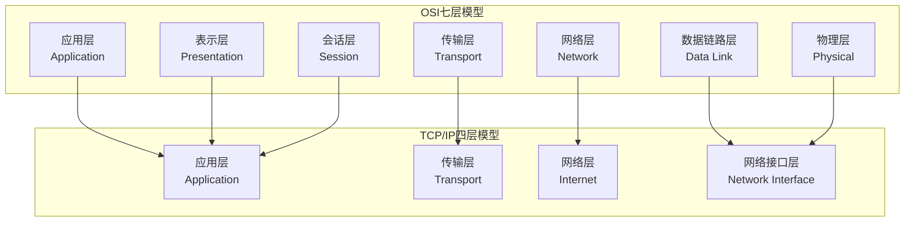
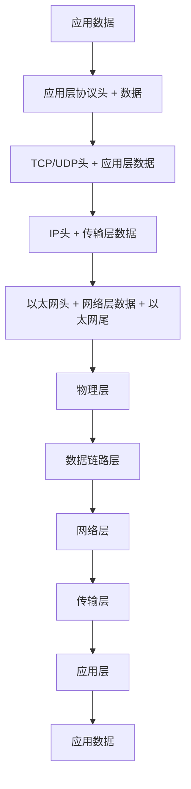
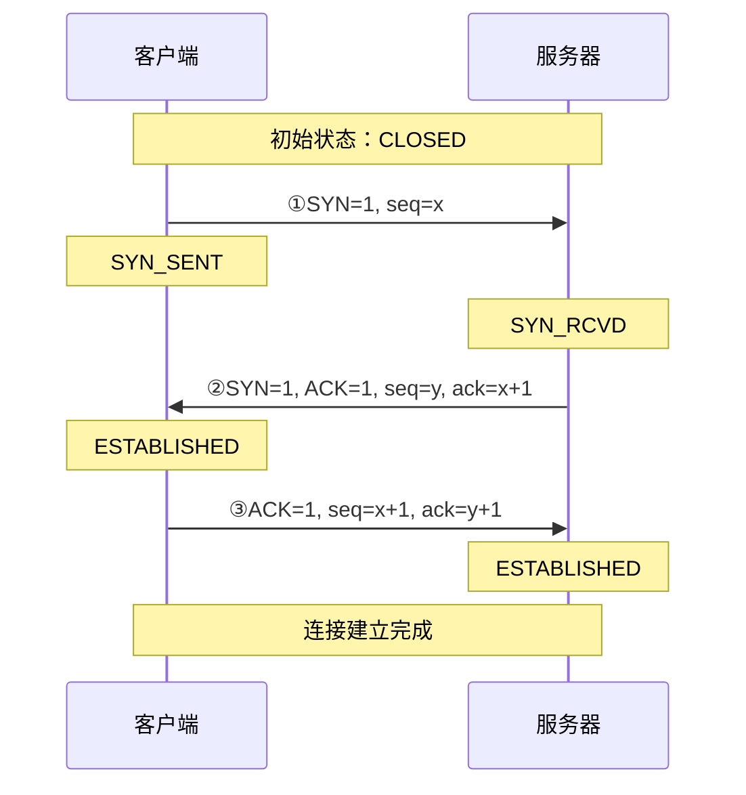
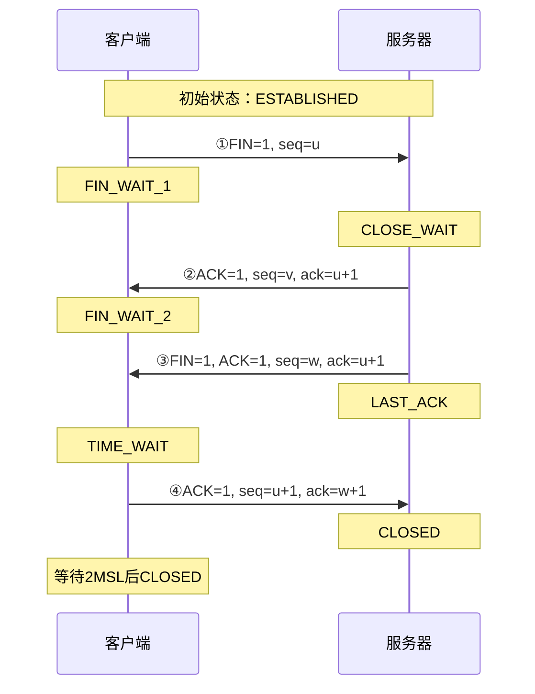
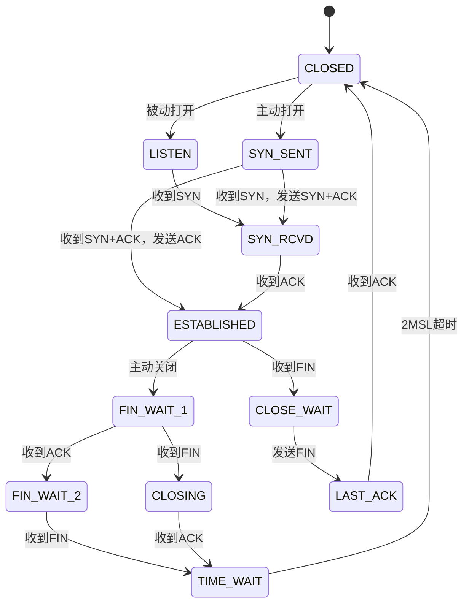
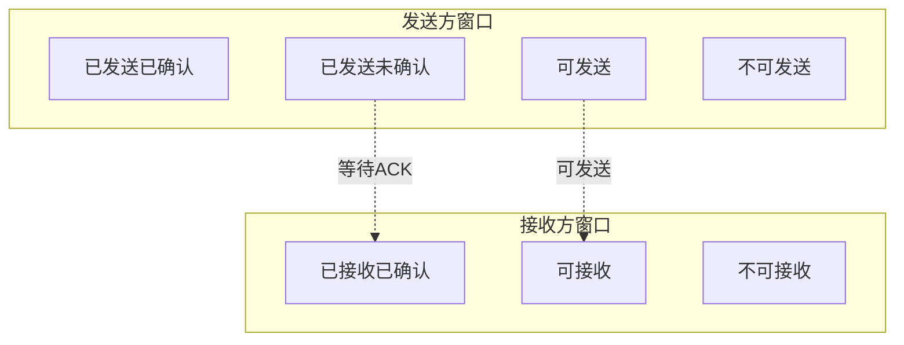
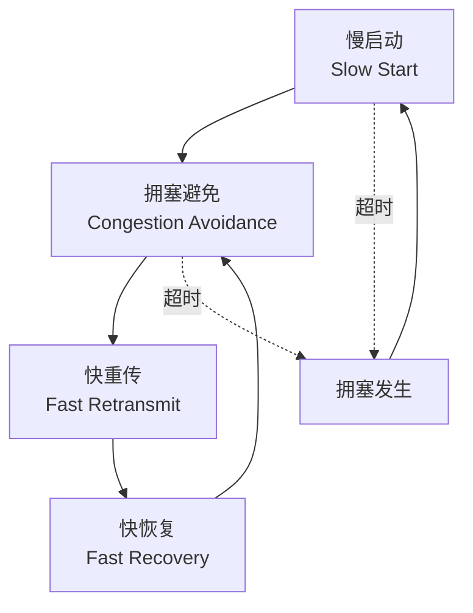

import Tabs from '@theme/Tabs';
import TabItem from '@theme/TabItem';

# TCP/IP协议栈详解

TCP/IP协议栈是互联网的基础，定义了数据在网络中传输的标准。理解TCP/IP协议对于网络编程和系统设计至关重要。

:::tip 核心价值
**TCP/IP = 可靠传输 + 端到端通信 + 分层架构 + 全球互联**
- 🌐 **分层设计**：应用层、传输层、网络层、链路层清晰分工
- 🔒 **可靠传输**：TCP提供面向连接的可靠数据传输
- ⚡ **高效通信**：UDP提供无连接的高效数据传输
- 🎯 **端到端**：从源主机到目标主机的完整通信路径
- 🔄 **自适应**：流量控制和拥塞控制保证网络稳定
:::

## 1. 网络模型对比

### 1.1 OSI七层模型 vs TCP/IP四层模型



<Tabs>
<TabItem value="osi" label="OSI七层模型">

| 层次 | 名称 | 功能 | 协议示例 | 设备示例 |
|------|------|------|----------|----------|
| **第7层** | 应用层 | 为应用程序提供网络服务 | HTTP、FTP、SMTP、DNS | 网关、代理服务器 |
| **第6层** | 表示层 | 数据格式转换、加密解密 | SSL/TLS、JPEG、MPEG | 加密设备 |
| **第5层** | 会话层 | 建立、管理、终止会话 | NetBIOS、RPC、SQL | 会话管理器 |
| **第4层** | 传输层 | 端到端可靠数据传输 | TCP、UDP | 网关 |
| **第3层** | 网络层 | 路由选择和逻辑寻址 | IP、ICMP、ARP | 路由器 |
| **第2层** | 数据链路层 | 帧同步、错误检测 | Ethernet、PPP、WiFi | 交换机、网桥 |
| **第1层** | 物理层 | 比特流传输 | 电缆、光纤、无线 | 集线器、中继器 |

</TabItem>
<TabItem value="tcpip" label="TCP/IP四层模型">

| 层次 | 名称 | 功能 | 主要协议 | 数据单位 |
|------|------|------|----------|----------|
| **第4层** | 应用层 | 应用程序间的通信 | HTTP、HTTPS、FTP、SMTP、DNS、DHCP | 数据 |
| **第3层** | 传输层 | 进程间的端到端通信 | TCP、UDP | 段(Segment) |
| **第2层** | 网络层 | 主机间的路由和寻址 | IP、ICMP、ARP、RARP | 包(Packet) |
| **第1层** | 网络接口层 | 物理网络访问 | Ethernet、WiFi、PPP | 帧(Frame) |

</TabItem>
</Tabs>

### 1.2 协议栈数据封装过程



## 2. TCP协议详解

### 2.1 TCP协议特性

TCP（Transmission Control Protocol）是面向连接的可靠传输协议，提供以下特性：

:::info TCP核心特性
- **面向连接**：通信前需要建立连接
- **可靠传输**：保证数据完整性和顺序
- **流量控制**：防止发送方发送过快
- **拥塞控制**：防止网络拥塞
- **全双工通信**：双向同时传输数据
- **字节流服务**：面向字节流而非报文
:::

### 2.2 TCP三次握手

TCP连接建立需要三次握手，确保双方都能收发数据。



<Tabs>
<TabItem value="handshake-process" label="握手过程详解">

**第一次握手（SYN）**
- 客户端发送SYN包（SYN=1），选择初始序列号seq=x
- 客户端进入SYN_SENT状态
- 表示客户端请求建立连接

**第二次握手（SYN+ACK）**
- 服务器收到SYN包，发送SYN+ACK包
- SYN=1表示同意建立连接，选择初始序列号seq=y
- ACK=1表示确认，ack=x+1确认收到客户端的SYN
- 服务器进入SYN_RCVD状态

**第三次握手（ACK）**
- 客户端收到SYN+ACK包，发送ACK包确认
- ACK=1，ack=y+1确认收到服务器的SYN
- 客户端进入ESTABLISHED状态
- 服务器收到ACK后也进入ESTABLISHED状态

</TabItem>
<TabItem value="why-three" label="为什么是三次握手">

**为什么不是两次握手？**

两次握手存在以下问题：
1. **无法确认客户端接收能力**：服务器不知道客户端是否收到了SYN+ACK
2. **旧连接请求问题**：网络延迟可能导致旧的SYN包到达，建立错误连接
3. **资源浪费**：服务器可能为无效连接分配资源

**为什么不是四次握手？**

三次握手已经足够：
1. 客户端发送能力 ✓（第一次握手服务器收到）
2. 服务器收发能力 ✓（第二次握手客户端收到）
3. 客户端接收能力 ✓（第三次握手服务器收到）

</TabItem>
<TabItem value="syn-attack" label="SYN洪泛攻击">

**SYN洪泛攻击原理**
- 攻击者发送大量SYN包但不回应SYN+ACK
- 服务器维护大量半连接状态
- 消耗服务器资源，导致拒绝服务

**防护措施**
```bash
# Linux内核参数调优
net.ipv4.tcp_syncookies = 1          # 启用SYN Cookies
net.ipv4.tcp_max_syn_backlog = 2048  # 增加SYN队列长度
net.ipv4.tcp_synack_retries = 1      # 减少SYN+ACK重传次数
net.core.netdev_max_backlog = 2000   # 增加网络设备队列长度
```

</TabItem>
</Tabs>

### 2.3 TCP四次挥手

TCP连接断开需要四次挥手，因为TCP是全双工通信。



<Tabs>
<TabItem value="close-process" label="挥手过程详解">

**第一次挥手（FIN）**
- 客户端发送FIN包，表示不再发送数据
- 客户端进入FIN_WAIT_1状态
- 但仍可以接收数据

**第二次挥手（ACK）**
- 服务器收到FIN包，发送ACK确认
- 服务器进入CLOSE_WAIT状态
- 客户端收到ACK后进入FIN_WAIT_2状态

**第三次挥手（FIN）**
- 服务器发送完剩余数据后，发送FIN包
- 服务器进入LAST_ACK状态
- 客户端收到FIN后进入TIME_WAIT状态

**第四次挥手（ACK）**
- 客户端发送ACK确认服务器的FIN
- 服务器收到ACK后进入CLOSED状态
- 客户端等待2MSL后进入CLOSED状态

</TabItem>
<TabItem value="time-wait" label="TIME_WAIT状态">

**TIME_WAIT存在的意义**

1. **确保最后的ACK到达**
   - 如果最后的ACK丢失，服务器会重传FIN
   - TIME_WAIT状态可以处理重传的FIN

2. **避免旧连接数据干扰**
   - 等待网络中旧的数据包消失
   - 防止旧连接的数据影响新连接

**TIME_WAIT时间**
- 等待时间为2MSL（Maximum Segment Lifetime）
- MSL通常为30秒到2分钟
- Linux默认为60秒

**TIME_WAIT过多的问题**
```bash
# 查看TIME_WAIT连接数
netstat -an | grep TIME_WAIT | wc -l

# 优化参数
net.ipv4.tcp_tw_reuse = 1        # 允许重用TIME_WAIT连接
net.ipv4.tcp_tw_recycle = 1      # 快速回收TIME_WAIT连接（已废弃）
net.ipv4.tcp_fin_timeout = 30    # 减少FIN_WAIT_2超时时间
```

</TabItem>
</Tabs>

### 2.4 TCP状态转换图



## 3. TCP流量控制与拥塞控制

### 3.1 滑动窗口机制

TCP使用滑动窗口实现流量控制，防止发送方发送过快导致接收方缓冲区溢出。



<Tabs>
<TabItem value="window-control" label="窗口控制机制">

**发送窗口**
- **已发送已确认**：已经发送并收到ACK的数据
- **已发送未确认**：已发送但未收到ACK的数据
- **可发送**：可以发送的数据（受窗口大小限制）
- **不可发送**：超出窗口大小，暂时不能发送

**接收窗口**
- **已接收**：已经接收并发送ACK的数据
- **可接收**：可以接收的数据范围
- **不可接收**：超出接收缓冲区的数据

**窗口大小调整**
```c
// TCP头部窗口字段（16位）
struct tcphdr {
    uint16_t window;  // 窗口大小（字节）
    // ... 其他字段
};

// 实际窗口大小 = window << window_scale
// window_scale在TCP选项中协商（0-14）
```

</TabItem>
<TabItem value="zero-window" label="零窗口问题">

**零窗口产生原因**
- 接收方处理速度慢，缓冲区满
- 发送方收到窗口大小为0的ACK
- 发送方停止发送数据

**零窗口探测**
```bash
# 发送方定期发送窗口探测包
# 探测间隔：1s, 2s, 4s, 8s, 16s, 32s, 64s
# 最多探测次数由tcp_retries2控制

net.ipv4.tcp_retries2 = 15  # 默认15次
```

**Silly Window Syndrome（愚蠢窗口综合症）**
- 接收方频繁通告小窗口
- 发送方发送小数据包
- 网络效率低下

**解决方案**
- **Nagle算法**：延迟发送小包
- **Clark算法**：接收方延迟通告窗口更新

</TabItem>
</Tabs>

### 3.2 拥塞控制算法

TCP拥塞控制防止网络拥塞，包括慢启动、拥塞避免、快重传、快恢复四个阶段。



<Tabs>
<TabItem value="slow-start" label="慢启动">

**慢启动算法**
- 初始拥塞窗口cwnd = 1 MSS
- 每收到一个ACK，cwnd += 1
- 指数增长：1 → 2 → 4 → 8 → 16...

```python
# 慢启动伪代码
def slow_start():
    cwnd = 1  # 初始拥塞窗口
    ssthresh = 65535  # 慢启动阈值
    
    while cwnd < ssthresh:
        send_data(cwnd)  # 发送cwnd个MSS
        ack_count = wait_for_acks()
        cwnd += ack_count  # 每个ACK增加1
        
        if timeout_occurred():
            ssthresh = cwnd // 2
            cwnd = 1
            break
```

**慢启动阈值（ssthresh）**
- 初始值通常为65535字节
- 发生拥塞时：ssthresh = cwnd / 2
- cwnd >= ssthresh时进入拥塞避免

</TabItem>
<TabItem value="congestion-avoidance" label="拥塞避免">

**拥塞避免算法**
- cwnd >= ssthresh时启动
- 每个RTT增加1个MSS
- 线性增长，避免网络拥塞

```python
# 拥塞避免伪代码
def congestion_avoidance():
    while True:
        send_data(cwnd)
        ack_count = wait_for_acks()
        
        # 每个RTT增加1个MSS
        cwnd += (1.0 / cwnd) * ack_count
        
        if timeout_occurred():
            ssthresh = cwnd // 2
            cwnd = 1
            slow_start()
            break
```

**AIMD算法**
- **Additive Increase**：线性增加
- **Multiplicative Decrease**：乘性减少
- 保证网络公平性和稳定性

</TabItem>
<TabItem value="fast-retransmit" label="快重传与快恢复">

**快重传算法**
- 收到3个重复ACK立即重传
- 不等待超时定时器
- 快速检测和恢复丢包

```python
# 快重传伪代码
def fast_retransmit():
    duplicate_ack_count = 0
    
    for ack in received_acks:
        if ack == last_ack:
            duplicate_ack_count += 1
            if duplicate_ack_count == 3:
                retransmit_segment(ack + 1)
                fast_recovery()
                break
        else:
            duplicate_ack_count = 0
            last_ack = ack
```

**快恢复算法**
- 收到重复ACK时不进入慢启动
- ssthresh = cwnd / 2
- cwnd = ssthresh + 3
- 直接进入拥塞避免阶段

</TabItem>
</Tabs>

## 4. UDP协议详解

### 4.1 UDP协议特性

UDP（User Datagram Protocol）是无连接的传输协议，提供简单高效的数据传输。

```markdown
| 特性 | TCP | UDP | 适用场景 |
|------|-----|-----|----------|
| 连接性 | 面向连接 | 无连接 | TCP适合可靠传输，UDP适合实时传输 |
| 可靠性 | 可靠传输 | 不可靠传输 | TCP保证数据完整性，UDP需要应用层处理 |
| 速度 | 较慢 | 快速 | UDP延迟更低，适合实时应用 |
| 头部开销 | 20-60字节 | 8字节 | UDP开销更小，效率更高 |
| 流量控制 | 支持 | 不支持 | TCP防止接收方过载 |
| 拥塞控制 | 支持 | 不支持 | TCP适应网络状况 |
| 数据边界 | 字节流 | 数据报 | UDP保持消息边界 |
| 多播支持 | 不支持 | 支持 | UDP支持一对多通信 |
```

### 4.2 UDP应用场景

<Tabs>
<TabItem value="real-time" label="实时应用">

**视频直播**
```java
// UDP视频流发送示例
public class VideoStreamer {
    private DatagramSocket socket;
    
    public void streamVideo(byte[] videoData, InetAddress clientAddr, int port) {
        try {
            // 分片发送视频数据
            int chunkSize = 1400; // 避免IP分片
            for (int i = 0; i < videoData.length; i += chunkSize) {
                int length = Math.min(chunkSize, videoData.length - i);
                byte[] chunk = Arrays.copyOfRange(videoData, i, i + length);
                
                DatagramPacket packet = new DatagramPacket(
                    chunk, length, clientAddr, port);
                socket.send(packet);
            }
        } catch (IOException e) {
            // 处理异常，但不重传
            logger.warn("Video packet lost: " + e.getMessage());
        }
    }
}
```

**在线游戏**
- 玩家位置更新
- 游戏状态同步
- 实时交互数据

</TabItem>
<TabItem value="dns" label="DNS查询">

**DNS查询示例**
```java
// UDP DNS查询
public class DNSResolver {
    public InetAddress resolve(String hostname) throws IOException {
        DatagramSocket socket = new DatagramSocket();
        
        // 构造DNS查询包
        byte[] query = buildDNSQuery(hostname);
        DatagramPacket queryPacket = new DatagramPacket(
            query, query.length, 
            InetAddress.getByName("8.8.8.8"), 53);
        
        // 发送查询
        socket.send(queryPacket);
        
        // 接收响应
        byte[] buffer = new byte[512];
        DatagramPacket responsePacket = new DatagramPacket(buffer, buffer.length);
        socket.receive(responsePacket);
        
        // 解析DNS响应
        return parseDNSResponse(responsePacket.getData());
    }
}
```

</TabItem>
<TabItem value="multicast" label="组播通信">

**UDP组播示例**
```java
// UDP组播发送者
public class MulticastSender {
    public void sendMulticast(String message) throws IOException {
        MulticastSocket socket = new MulticastSocket();
        InetAddress group = InetAddress.getByName("224.0.0.1");
        
        byte[] data = message.getBytes();
        DatagramPacket packet = new DatagramPacket(
            data, data.length, group, 8888);
        
        socket.send(packet);
        socket.close();
    }
}

// UDP组播接收者
public class MulticastReceiver {
    public void receiveMulticast() throws IOException {
        MulticastSocket socket = new MulticastSocket(8888);
        InetAddress group = InetAddress.getByName("224.0.0.1");
        socket.joinGroup(group);
        
        byte[] buffer = new byte[1024];
        DatagramPacket packet = new DatagramPacket(buffer, buffer.length);
        
        while (true) {
            socket.receive(packet);
            String message = new String(packet.getData(), 0, packet.getLength());
            System.out.println("Received: " + message);
        }
    }
}
```

</TabItem>
</Tabs>

## 5. 常见面试问题

### 5.1 基础概念问题

<Tabs>
<TabItem value="basic-qa" label="基础问答">

**Q1: 为什么TCP需要三次握手，而不是两次或四次？**

A: 三次握手的目的是确认双方的收发能力：
- 第一次握手：确认客户端发送能力、服务器接收能力
- 第二次握手：确认服务器发送能力、客户端接收能力  
- 第三次握手：确认客户端接收能力

两次握手无法确认客户端接收能力，四次握手则是多余的。

**Q2: TIME_WAIT状态的作用是什么？**

A: TIME_WAIT状态有两个作用：
1. 确保最后的ACK能够到达对方
2. 等待网络中延迟的数据包消失，避免影响新连接

**Q3: TCP如何保证可靠传输？**

A: TCP通过以下机制保证可靠传输：
- 序列号和确认号
- 超时重传机制
- 流量控制（滑动窗口）
- 拥塞控制
- 校验和验证

</TabItem>
<TabItem value="advanced-qa" label="深入问答">

**Q4: 什么是TCP粘包和拆包？如何解决？**

A: 
- **粘包**：多个小包被合并成一个大包
- **拆包**：一个大包被分割成多个小包

解决方案：
1. 固定长度：每个消息固定字节数
2. 分隔符：使用特殊字符分隔消息
3. 长度字段：消息头包含消息长度
4. 自定义协议：设计应用层协议

**Q5: TCP的Nagle算法是什么？**

A: Nagle算法用于减少小包传输：
- 如果有未确认数据，缓存小包直到收到ACK
- 减少网络中小包数量，提高效率
- 可能增加延迟，实时应用需要禁用

**Q6: 如何优化TCP性能？**

A: TCP性能优化策略：
- 调整缓冲区大小
- 启用TCP窗口缩放
- 使用TCP_NODELAY禁用Nagle算法
- 调整拥塞控制算法
- 使用连接池复用连接

</TabItem>
</Tabs>

### 5.2 实际应用问题

**网络编程最佳实践**

1. **选择合适的协议**
   - 可靠性要求高：选择TCP
   - 实时性要求高：选择UDP
   - 考虑网络环境和应用特点

2. **处理网络异常**
   - 设置合理的超时时间
   - 实现重连机制
   - 优雅处理连接断开

3. **性能优化**
   - 使用连接池
   - 批量处理数据
   - 异步非阻塞IO
   - 合理设置缓冲区大小

通过深入理解TCP/IP协议栈，你将能够：
- 设计高效的网络通信方案
- 解决网络编程中的常见问题
- 优化网络应用的性能
- 处理复杂的网络环境挑战 