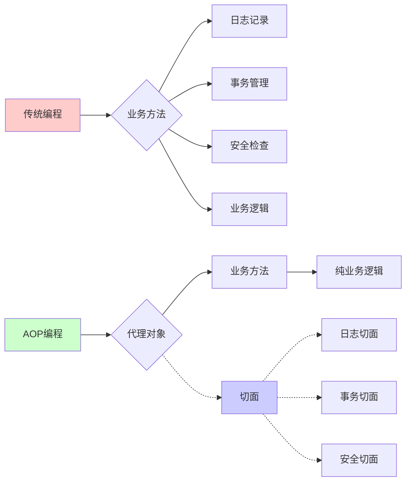
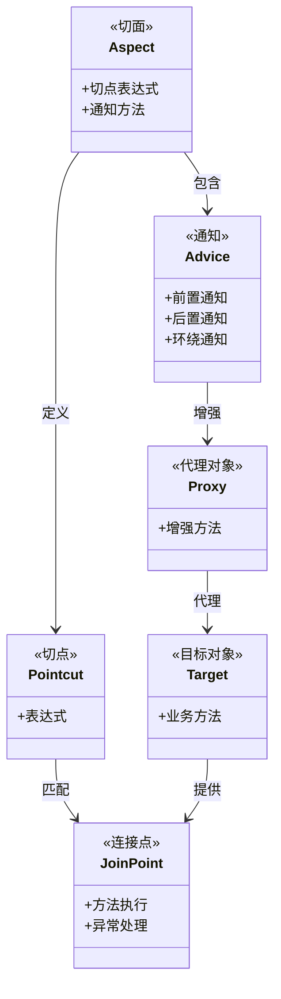
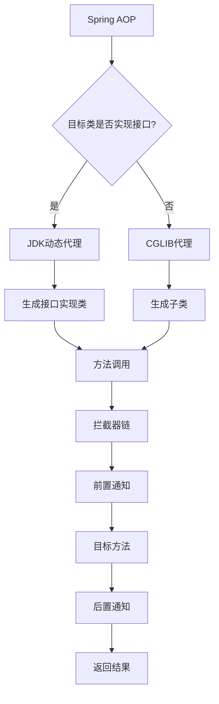
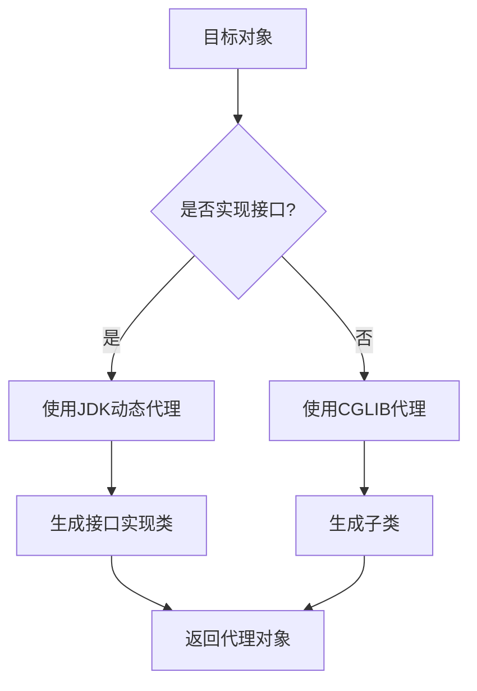
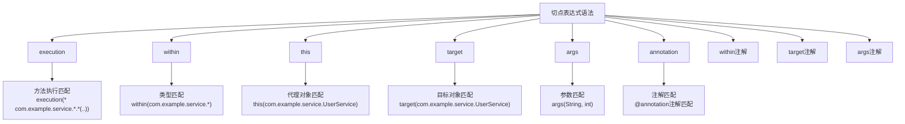
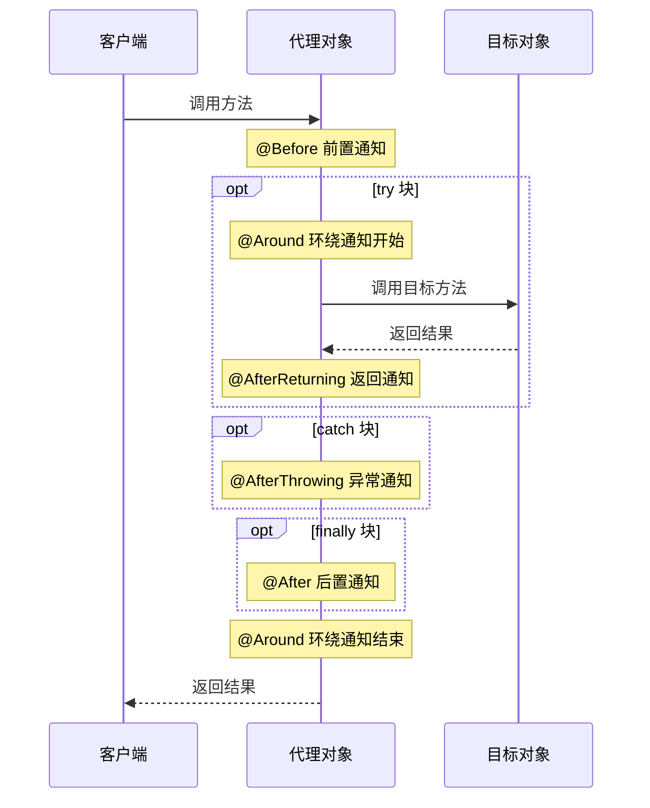
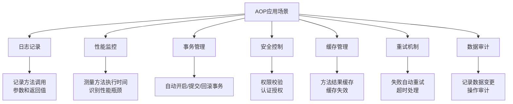
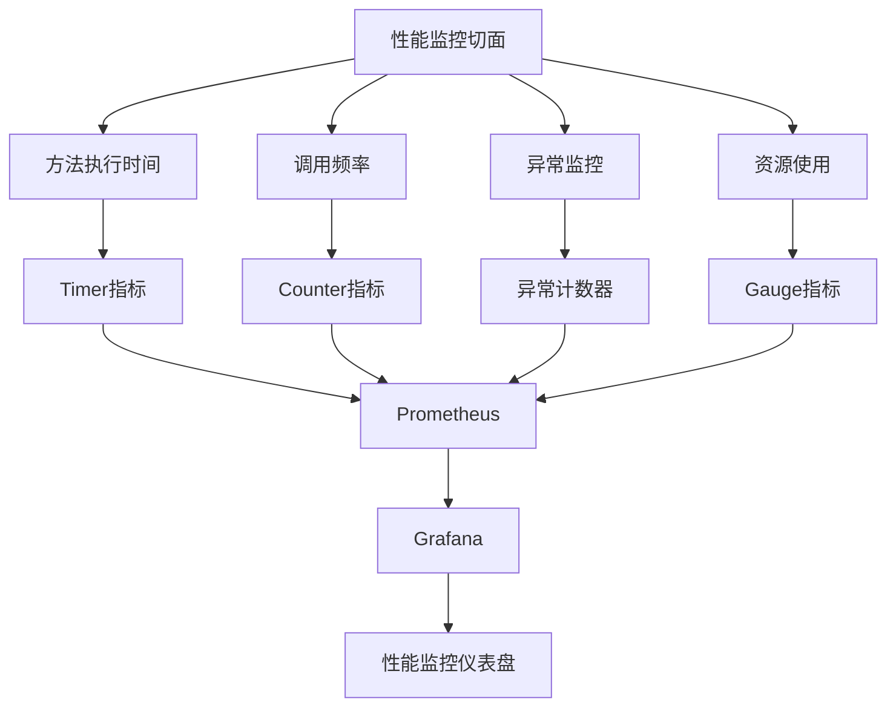
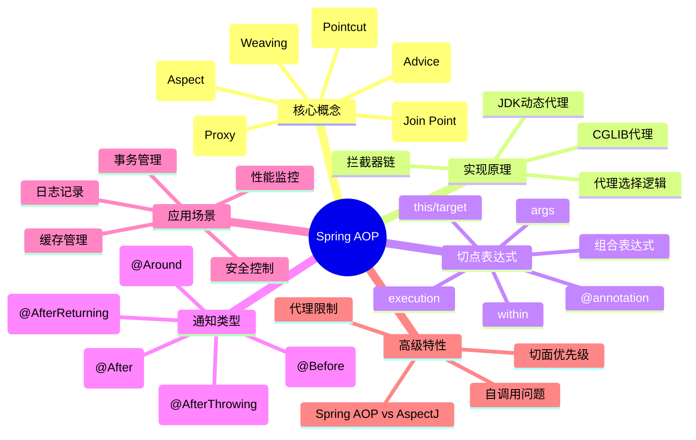

import Tabs from '@theme/Tabs';
import TabItem from '@theme/TabItem';
import TOCInline from '@theme/TOCInline';

# Spring AOP 详解

AOP（Aspect-Oriented Programming，面向切面编程）是Spring框架的重要特性，它允许开发者将横切关注点（如日志、事务、安全等）从业务逻辑中分离出来，实现关注点的模块化。

:::info 本文内容概览
<TOCInline toc={toc} />
:::

:::tip 核心价值
**Spring AOP = 关注点分离 + 代码复用 + 模块化设计 + 动态代理**
- 🔍 **关注点分离**：将横切关注点与业务逻辑解耦
- 🔄 **代码复用**：消除重复代码，提高可维护性
- 📦 **模块化设计**：独立管理通用功能，易于扩展
- 🔧 **动态代理**：运行时动态增强，无侵入性
:::

## 1. AOP基础概念

### 1.1 什么是AOP？

AOP是一种编程范式，它通过预编译方式和运行期动态代理实现程序功能的统一维护。AOP的核心思想是将横切关注点从主业务逻辑中分离出来。



#### 传统编程 vs AOP编程

<Tabs>
  <TabItem value="traditional" label="传统编程方式" default>
  ```java title="传统编程方式"
  // 传统方式 - 业务逻辑和横切关注点混合
  public class UserService {
      public void createUser(User user) {
          // 日志记录
          System.out.println("开始创建用户: " + user.getName());
          
          // 业务逻辑
          userRepository.save(user);
          
          // 日志记录
          System.out.println("用户创建完成: " + user.getName());
      }
      
      public void updateUser(User user) {
          // 日志记录
          System.out.println("开始更新用户: " + user.getName());
          
          // 业务逻辑
          userRepository.update(user);
          
          // 日志记录
          System.out.println("用户更新完成: " + user.getName());
      }
  }
  ```
  
  <div className="card">
  <div className="card__header">
  <h4>传统方式的缺点</h4>
  </div>
  <div className="card__body">
  <ul>
  <li>横切关注点代码与业务逻辑混合</li>
  <li>代码重复，难以维护</li>
  <li>职责不明确，违反单一职责原则</li>
  <li>修改横切逻辑需要修改多处代码</li>
  </ul>
  </div>
  </div>
  </TabItem>
  
  <TabItem value="aop" label="AOP编程方式">
  ```java title="AOP编程方式"
  // AOP方式 - 分离关注点
  @Service
  public class UserService {
      public void createUser(User user) {
          // 纯业务逻辑
          userRepository.save(user);
      }
      
      public void updateUser(User user) {
          // 纯业务逻辑
          userRepository.update(user);
      }
  }
  
  @Aspect
  @Component
  public class LoggingAspect {
      @Around("execution(* com.example.service.*.*(..))")
      public Object logAround(ProceedingJoinPoint joinPoint) throws Throwable {
          System.out.println("开始执行: " + joinPoint.getSignature().getName());
          Object result = joinPoint.proceed();
          System.out.println("执行完成: " + joinPoint.getSignature().getName());
          return result;
      }
  }
  ```
  
  <div className="card">
  <div className="card__header">
  <h4>AOP方式的优点</h4>
  </div>
  <div className="card__body">
  <ul>
  <li>关注点分离，业务逻辑更纯粹</li>
  <li>避免代码重复，提高可维护性</li>
  <li>集中管理横切关注点</li>
  <li>非侵入式，不修改原有业务代码</li>
  </ul>
  </div>
  </div>
  </TabItem>
</Tabs>

### 1.2 AOP核心概念



<div className="card">
<div className="card__header">
<h4>AOP核心概念</h4>
</div>
<div className="card__body">

| 概念 | 说明 | 示例 |
|------|------|------|
| **Aspect（切面）** | 横切关注点的模块化 | `@Aspect`注解的类 |
| **Join Point（连接点）** | 程序执行过程中的某个特定点 | 方法调用、异常抛出 |
| **Pointcut（切点）** | 匹配连接点的表达式 | `execution(* com.example.service.*.*(..))` |
| **Advice（通知）** | 在切点处要执行的代码 | `@Before`、`@After`、`@Around` |
| **Target Object（目标对象）** | 被代理的对象 | 业务服务类 |
| **Proxy（代理）** | AOP框架创建的对象 | Spring自动创建 |
| **Weaving（织入）** | 将切面应用到目标对象的过程 | 编译时、类加载时、运行时 |

</div>
</div>

<details>
<summary>AOP概念示例代码</summary>

```java title="AOP概念示例"
// 1. Aspect（切面）
@Aspect
@Component
public class LoggingAspect {
    // 切面实现
}

// 2. Pointcut（切点）
@Pointcut("execution(* com.example.service.*.*(..))")
public void serviceMethods() {}

// 3. Advice（通知）
@Before("serviceMethods()")
public void beforeAdvice() {
    System.out.println("方法执行前");
}

// 4. Target Object（目标对象）
@Service
public class UserService {
    // 目标对象
}
```
</details>

## 2. AOP实现原理

### 2.1 动态代理机制

Spring AOP基于动态代理实现，支持JDK动态代理和CGLIB代理：



<Tabs>
  <TabItem value="jdk" label="JDK动态代理" default>
  ```java title="JDK动态代理示例"
  public class JdkDynamicProxyExample {
      
      public static void main(String[] args) {
          UserService userService = new UserService();
          
          // 创建代理对象
          UserService proxy = (UserService) Proxy.newProxyInstance(
              UserService.class.getClassLoader(),
              new Class<?>[]{UserService.class},
              new LoggingInvocationHandler(userService)
          );
          
          // 调用代理方法
          proxy.createUser(new User("张三"));
      }
  }
  
  class LoggingInvocationHandler implements InvocationHandler {
      private final Object target;
      
      public LoggingInvocationHandler(Object target) {
          this.target = target;
      }
      
      @Override
      public Object invoke(Object proxy, Method method, Object[] args) throws Throwable {
          System.out.println("方法执行前: " + method.getName());
          Object result = method.invoke(target, args);
          System.out.println("方法执行后: " + method.getName());
          return result;
      }
  }
  ```
  
  <div className="card">
  <div className="card__header">
  <h4>JDK动态代理特点</h4>
  </div>
  <div className="card__body">
  <ul>
  <li>要求目标类必须实现接口</li>
  <li>基于Java反射机制</li>
  <li>生成的代理类实现了相同的接口</li>
  <li>通过InvocationHandler拦截方法调用</li>
  </ul>
  </div>
  </div>
  </TabItem>
  
  <TabItem value="cglib" label="CGLIB代理">
  ```java title="CGLIB代理示例"
  public class CglibProxyExample {
      
      public static void main(String[] args) {
          Enhancer enhancer = new Enhancer();
          enhancer.setSuperclass(UserService.class);
          enhancer.setCallback(new LoggingMethodInterceptor());
          
          UserService proxy = (UserService) enhancer.create();
          proxy.createUser(new User("李四"));
      }
  }
  
  class LoggingMethodInterceptor implements MethodInterceptor {
      
      @Override
      public Object intercept(Object obj, Method method, Object[] args, MethodProxy proxy) throws Throwable {
          System.out.println("方法执行前: " + method.getName());
          Object result = proxy.invokeSuper(obj, args);
          System.out.println("方法执行后: " + method.getName());
          return result;
      }
  }
  ```
  
  <div className="card">
  <div className="card__header">
  <h4>CGLIB代理特点</h4>
  </div>
  <div className="card__body">
  <ul>
  <li>不要求目标类实现接口</li>
  <li>基于ASM字节码操作框架</li>
  <li>生成目标类的子类作为代理</li>
  <li>通过覆盖父类方法实现代理</li>
  <li>无法代理final类和final方法</li>
  </ul>
  </div>
  </div>
  </TabItem>
</Tabs>

### 2.2 代理选择机制

Spring AOP根据目标对象类型自动选择代理方式：



<div className="card">
<div className="card__body">

```java title="代理选择逻辑"
public class ProxySelectionLogic {
    
    public static Object createProxy(Object target) {
        // 如果目标对象实现了接口，使用JDK动态代理
        if (target.getClass().getInterfaces().length > 0) {
            return createJdkProxy(target);
        } else {
            // 否则使用CGLIB代理
            return createCglibProxy(target);
        }
    }
    
    private static Object createJdkProxy(Object target) {
        // JDK动态代理实现
        return Proxy.newProxyInstance(
            target.getClass().getClassLoader(),
            target.getClass().getInterfaces(),
            new LoggingInvocationHandler(target)
        );
    }
    
    private static Object createCglibProxy(Object target) {
        // CGLIB代理实现
        Enhancer enhancer = new Enhancer();
        enhancer.setSuperclass(target.getClass());
        enhancer.setCallback(new LoggingMethodInterceptor());
        return enhancer.create();
    }
}
```

</div>
</div>

## 3. 切点表达式

### 3.1 切点表达式语法

Spring AOP使用AspectJ切点表达式语言：



<Tabs>
  <TabItem value="basic" label="基础表达式" default>
  ```java title="基础切点表达式示例"
  @Aspect
  @Component
  public class BasicPointcutExamples {
      
      // 1. 方法执行切点 - 匹配service包下所有类的所有方法
      @Pointcut("execution(* com.example.service.*.*(..))")
      public void serviceMethods() {}
      
      // 2. 方法参数切点 - 匹配有两个参数(String和int)的方法
      @Pointcut("execution(* *.*(String, int))")
      public void methodsWithStringAndInt() {}
      
      // 3. 返回类型切点 - 匹配返回类型为void的方法
      @Pointcut("execution(void *.*(..))")
      public void voidMethods() {}
      
      // 4. 包切点 - 匹配service包及子包中的所有方法
      @Pointcut("execution(* com.example.service..*.*(..))")
      public void servicePackageAndSubpackages() {}
  }
  ```
  
  <div className="card">
  <div className="card__header">
  <h4>执行表达式格式</h4>
  </div>
  <div className="card__body">
  <code>execution(modifiers-pattern? return-type-pattern declaring-type-pattern? method-name-pattern(parameter-pattern) throws-pattern?)</code>
  
  - **modifiers-pattern**：访问修饰符模式，如public、protected（可选）
  - **return-type-pattern**：返回类型模式，如void、String、*（必选）
  - **declaring-type-pattern**：声明类型模式，如com.example.service.*（可选）
  - **method-name-pattern**：方法名模式，如get*、save、*（必选）
  - **parameter-pattern**：参数模式，如(..)表示任意参数、(String)表示一个String参数（必选）
  - **throws-pattern**：异常模式（可选）
  
  </div>
  </div>
  </TabItem>
  
  <TabItem value="annotation" label="注解表达式">
  ```java title="注解切点表达式示例"
  @Aspect
  @Component
  public class AnnotationPointcutExamples {
      
      // 1. 注解切点 - 匹配带有@Transactional注解的方法
      @Pointcut("@annotation(org.springframework.transaction.annotation.Transactional)")
      public void transactionalMethods() {}
      
      // 2. 类型注解切点 - 匹配带有@Service注解的类中的所有方法
      @Pointcut("@within(org.springframework.stereotype.Service)")
      public void serviceClassMethods() {}
      
      // 3. 参数注解切点 - 匹配至少有一个参数带有@Valid注解的方法
      @Pointcut("@args(javax.validation.Valid)")
      public void methodsWithValidatedParams() {}
      
      // 4. 自定义注解示例
      @Pointcut("@annotation(com.example.annotation.LogExecutionTime)")
      public void logExecutionTimeMethods() {}
  }
  ```
  </TabItem>
  
  <TabItem value="combined" label="组合表达式">
  ```java title="组合切点表达式示例"
  @Aspect
  @Component
  public class CombinedPointcutExamples {
      
      // 1. AND组合 - 匹配service包下且有@Transactional注解的方法
      @Pointcut("execution(* com.example.service.*.*(..)) && @annotation(org.springframework.transaction.annotation.Transactional)")
      public void serviceTransactionalMethods() {}
      
      // 2. OR组合 - 匹配任何控制器或服务方法
      @Pointcut("within(com.example.controller.*) || within(com.example.service.*)")
      public void controllerOrServiceMethods() {}
      
      // 3. NOT组合 - 匹配service包下非私有方法
      @Pointcut("execution(* com.example.service.*.*(..)) && !execution(private * *.*(..))")
      public void nonPrivateServiceMethods() {}
      
      // 4. 复杂组合 - 匹配有@Transactional注解的非getter、setter方法
      @Pointcut("@annotation(org.springframework.transaction.annotation.Transactional) && !execution(* get*()) && !execution(* set*(*))")
      public void transactionalNonAccessorMethods() {}
  }
  ```
  </TabItem>
</Tabs>

### 3.2 常用切点表达式

<div className="card">
<div className="card__body">

| 表达式 | 说明 | 示例 |
|--------|------|------|
| `execution(* *.*(..))` | 所有方法执行 | 匹配所有方法 |
| `execution(* com.example.service.*.*(..))` | 指定包下的方法 | 匹配service包下所有方法 |
| `execution(* *.*(String, int))` | 指定参数的方法 | 匹配有两个参数的方法 |
| `@annotation(Transactional)` | 注解方法 | 匹配有@Transactional注解的方法 |
| `within(com.example.service.*)` | 指定包内的连接点 | 匹配service包内的所有连接点 |
| `this(com.example.service.UserService)` | 代理对象类型 | 匹配代理对象为UserService的连接点 |
| `target(com.example.service.UserService)` | 目标对象类型 | 匹配目标对象为UserService的连接点 |
| `args(String, ..)` | 参数类型匹配 | 匹配第一个参数为String的方法 |

</div>
</div>

## 4. 通知类型



<Tabs>
  <TabItem value="before" label="前置通知(@Before)" default>
  ```java title="前置通知示例"
  @Aspect
  @Component
  public class BeforeAdviceExample {
      
      @Before("execution(* com.example.service.*.*(..))")
      public void beforeAdvice(JoinPoint joinPoint) {
          String methodName = joinPoint.getSignature().getName();
          Object[] args = joinPoint.getArgs();
          
          System.out.println("方法执行前: " + methodName);
          System.out.println("参数: " + Arrays.toString(args));
      }
      
      @Before("@annotation(org.springframework.transaction.annotation.Transactional)")
      public void beforeTransactional(JoinPoint joinPoint) {
          System.out.println("事务方法执行前: " + joinPoint.getSignature().getName());
      }
  }
  ```
  
  <div className="card">
  <div className="card__header">
  <h4>前置通知特点</h4>
  </div>
  <div className="card__body">
  <ul>
  <li>在目标方法执行前执行</li>
  <li>无法阻止方法执行（除非抛出异常）</li>
  <li>可以访问方法参数，但不能修改返回值</li>
  <li>适用场景：参数校验、权限检查、日志记录</li>
  </ul>
  </div>
  </div>
  </TabItem>
  
  <TabItem value="after" label="后置通知(@After)">
  ```java title="后置通知示例"
  @Aspect
  @Component
  public class AfterAdviceExample {
      
      @After("execution(* com.example.service.*.*(..))")
      public void afterAdvice(JoinPoint joinPoint) {
          String methodName = joinPoint.getSignature().getName();
          System.out.println("方法执行后: " + methodName);
      }
      
      @After("execution(* com.example.repository.*.*(..))")
      public void afterRepositoryMethod(JoinPoint joinPoint) {
          String methodName = joinPoint.getSignature().getName();
          System.out.println("数据操作完成: " + methodName);
      }
  }
  ```
  
  <div className="card">
  <div className="card__header">
  <h4>后置通知特点</h4>
  </div>
  <div className="card__body">
  <ul>
  <li>在目标方法执行后执行（无论是否抛出异常）</li>
  <li>类似于finally块</li>
  <li>无法访问方法返回值</li>
  <li>适用场景：资源清理、释放连接、记录方法执行时间</li>
  </ul>
  </div>
  </div>
  </TabItem>
  
  <TabItem value="around" label="环绕通知(@Around)">
  ```java title="环绕通知示例"
  @Aspect
  @Component
  public class AroundAdviceExample {
      
      @Around("execution(* com.example.service.*.*(..))")
      public Object aroundAdvice(ProceedingJoinPoint joinPoint) throws Throwable {
          String methodName = joinPoint.getSignature().getName();
          long startTime = System.currentTimeMillis();
          
          try {
              // 执行目标方法
              Object result = joinPoint.proceed();
              
              long endTime = System.currentTimeMillis();
              System.out.println("方法 " + methodName + " 执行时间: " + (endTime - startTime) + "ms");
              
              return result;
          } catch (Exception e) {
              System.out.println("方法 " + methodName + " 执行异常: " + e.getMessage());
              throw e;
          }
      }
      
      @Around("@annotation(com.example.annotation.LogExecutionTime)")
      public Object logExecutionTime(ProceedingJoinPoint joinPoint) throws Throwable {
          long start = System.currentTimeMillis();
          Object result = joinPoint.proceed();
          long executionTime = System.currentTimeMillis() - start;
          
          System.out.println(joinPoint.getSignature() + " executed in " + executionTime + "ms");
          return result;
      }
  }
  ```
  
  <div className="card">
  <div className="card__header">
  <h4>环绕通知特点</h4>
  </div>
  <div className="card__body">
  <ul>
  <li>可以在方法执行前后添加自定义行为</li>
  <li>完全控制目标方法的执行（决定是否执行、何时执行）</li>
  <li>可以修改方法的返回值或抛出的异常</li>
  <li>需要手动调用joinPoint.proceed()执行目标方法</li>
  <li>最强大但也最复杂的通知类型</li>
  <li>适用场景：事务管理、性能监控、缓存、重试逻辑</li>
  </ul>
  </div>
  </div>
  </TabItem>
  
  <TabItem value="afterReturning" label="返回通知(@AfterReturning)">
  ```java title="返回通知示例"
  @Aspect
  @Component
  public class AfterReturningAdviceExample {
      
      @AfterReturning(
          pointcut = "execution(* com.example.service.*.*(..))",
          returning = "result"
      )
      public void afterReturningAdvice(JoinPoint joinPoint, Object result) {
          String methodName = joinPoint.getSignature().getName();
          System.out.println("方法 " + methodName + " 正常返回: " + result);
      }
      
      @AfterReturning(
          pointcut = "execution(java.util.List com.example.service.*.*(..))",
          returning = "resultList"
      )
      public void afterReturningList(JoinPoint joinPoint, List<?> resultList) {
          System.out.println("返回列表大小: " + resultList.size());
      }
  }
  ```
  
  <div className="card">
  <div className="card__header">
  <h4>返回通知特点</h4>
  </div>
  <div className="card__body">
  <ul>
  <li>在目标方法成功执行后执行</li>
  <li>可以访问方法的返回值，但不能修改</li>
  <li>仅在方法正常返回时执行（没有抛出异常）</li>
  <li>适用场景：日志记录、统计分析、返回值处理</li>
  </ul>
  </div>
  </div>
  </TabItem>
  
  <TabItem value="afterThrowing" label="异常通知(@AfterThrowing)">
  ```java title="异常通知示例"
  @Aspect
  @Component
  public class AfterThrowingAdviceExample {
      
      @AfterThrowing(
          pointcut = "execution(* com.example.service.*.*(..))",
          throwing = "ex"
      )
      public void afterThrowingAdvice(JoinPoint joinPoint, Exception ex) {
          String methodName = joinPoint.getSignature().getName();
          System.out.println("方法 " + methodName + " 抛出异常: " + ex.getMessage());
          
          // 记录异常日志
          // 发送异常通知
          // 清理资源
      }
      
      @AfterThrowing(
          pointcut = "execution(* com.example.repository.*.*(..))",
          throwing = "dataEx"
      )
      public void afterThrowingDataException(JoinPoint joinPoint, DataAccessException dataEx) {
          // 处理数据访问异常
          System.out.println("数据访问异常: " + dataEx.getMessage());
      }
  }
  ```
  
  <div className="card">
  <div className="card__header">
  <h4>异常通知特点</h4>
  </div>
  <div className="card__body">
  <ul>
  <li>在目标方法抛出异常时执行</li>
  <li>可以访问抛出的异常对象</li>
  <li>不能阻止异常传播（除非使用环绕通知）</li>
  <li>适用场景：异常日志、错误通知、资源清理</li>
  </ul>
  </div>
  </div>
  </TabItem>
</Tabs>

### 4.1 通知类型对比

<div className="card">
<div className="card__body">

| 通知类型 | 注解 | 执行时机 | 能否控制方法执行 | 能否访问返回值 | 能否访问异常 | 适用场景 |
|---------|------|----------|--------------|------------|-----------|----------|
| **前置通知** | @Before | 方法执行前 | ❌ | ❌ | ❌ | 参数校验、权限检查 |
| **后置通知** | @After | 方法执行后(finally) | ❌ | ❌ | ❌ | 资源清理、日志记录 |
| **返回通知** | @AfterReturning | 方法正常返回后 | ❌ | ✅(只读) | ❌ | 结果处理、日志记录 |
| **异常通知** | @AfterThrowing | 方法抛出异常时 | ❌ | ❌ | ✅ | 异常处理、错误通知 |
| **环绕通知** | @Around | 方法前后都可 | ✅ | ✅(可修改) | ✅(可处理) | 事务管理、性能监控 |

</div>
</div>

## 5. 实际应用场景



### 5.1 日志切面

<Tabs>
  <TabItem value="log" label="日志切面" default>
  ```java title="日志切面"
  @Aspect
  @Component
  @Slf4j
  public class LoggingAspect {
      
      @Around("@annotation(com.example.annotation.LogExecutionTime)")
      public Object logExecutionTime(ProceedingJoinPoint joinPoint) throws Throwable {
          String methodName = joinPoint.getSignature().getName();
          String className = joinPoint.getTarget().getClass().getSimpleName();
          
          log.info("开始执行方法: {}.{}", className, methodName);
          long startTime = System.currentTimeMillis();
          
          try {
              Object result = joinPoint.proceed();
              long endTime = System.currentTimeMillis();
              log.info("方法 {}.{} 执行完成，耗时: {}ms", className, methodName, endTime - startTime);
              return result;
          } catch (Exception e) {
              log.error("方法 {}.{} 执行异常: {}", className, methodName, e.getMessage());
              throw e;
          }
      }
      
      @Before("@annotation(com.example.annotation.LogParameters)")
      public void logParameters(JoinPoint joinPoint) {
          String methodName = joinPoint.getSignature().getName();
          Object[] args = joinPoint.getArgs();
          
          log.info("方法 {} 的参数: {}", methodName, Arrays.toString(args));
      }
  }
  ```
  </TabItem>
  
  <TabItem value="log-annotation" label="自定义日志注解">
  <details>
  <summary>自定义日志注解示例</summary>
  
  ```java title="LogExecutionTime注解"
  @Target({ElementType.METHOD})
  @Retention(RetentionPolicy.RUNTIME)
  public @interface LogExecutionTime {
      String value() default "";
  }
  
  @Target({ElementType.METHOD})
  @Retention(RetentionPolicy.RUNTIME)
  public @interface LogParameters {
      String value() default "";
  }
  ```
  </details>
  
  <div className="card">
  <div className="card__header">
  <h4>日志切面功能</h4>
  </div>
  <div className="card__body">
  <ul>
  <li>方法调用记录：记录方法的调用信息，包括方法名、参数等</li>
  <li>执行时间统计：记录方法的执行时长，用于性能分析</li>
  <li>异常捕获：记录方法执行过程中的异常信息</li>
  <li>结果跟踪：记录方法的返回值</li>
  <li>调用链跟踪：跟踪完整的方法调用链</li>
  </ul>
  </div>
  </div>
  </TabItem>
</Tabs>

### 5.2 缓存切面

<Tabs>
  <TabItem value="cache" label="缓存切面" default>
  ```java title="缓存切面"
  @Aspect
  @Component
  public class CacheAspect {
      
      @Autowired
      private RedisTemplate<String, Object> redisTemplate;
      
      @Around("@annotation(com.example.annotation.Cacheable)")
      public Object cache(ProceedingJoinPoint joinPoint) throws Throwable {
          String key = generateCacheKey(joinPoint);
          
          // 尝试从缓存获取
          Object cachedValue = redisTemplate.opsForValue().get(key);
          if (cachedValue != null) {
              return cachedValue;
          }
          
          // 执行方法并缓存结果
          Object result = joinPoint.proceed();
          redisTemplate.opsForValue().set(key, result, Duration.ofMinutes(30));
          
          return result;
      }
      
      @AfterReturning("@annotation(com.example.annotation.CacheEvict)")
      public void evictCache(JoinPoint joinPoint) {
          String key = generateCacheKey(joinPoint);
          redisTemplate.delete(key);
      }
      
      private String generateCacheKey(JoinPoint joinPoint) {
          String methodName = joinPoint.getSignature().getName();
          Object[] args = joinPoint.getArgs();
          return methodName + ":" + Arrays.toString(args);
      }
  }
  ```
  </TabItem>
  
  <TabItem value="cache-usage" label="缓存使用示例">
  ```java title="缓存使用示例"
  @Service
  public class UserService {
      
      @Autowired
      private UserRepository userRepository;
      
      @Cacheable
      public User getUserById(Long id) {
          // 这个方法的结果会被缓存
          return userRepository.findById(id).orElse(null);
      }
      
      @CacheEvict
      public void updateUser(User user) {
          // 更新用户后，相关缓存会被清除
          userRepository.save(user);
      }
  }
  ```
  
  <div className="card">
  <div className="card__header">
  <h4>缓存切面优势</h4>
  </div>
  <div className="card__body">
  <ul>
  <li>减少数据库负载：避免重复查询相同数据</li>
  <li>提高响应速度：直接从缓存返回结果</li>
  <li>透明实现：业务代码无感知缓存操作</li>
  <li>集中管理：缓存策略集中配置</li>
  </ul>
  </div>
  </div>
  </TabItem>
</Tabs>

### 5.3 事务切面

<Tabs>
  <TabItem value="transaction" label="事务切面" default>
  ```java title="事务切面"
  @Aspect
  @Component
  public class TransactionAspect {
      
      @Autowired
      private PlatformTransactionManager transactionManager;
      
      @Around("@annotation(com.example.annotation.Transactional)")
      public Object handleTransaction(ProceedingJoinPoint joinPoint) throws Throwable {
          TransactionStatus status = null;
          
          try {
              // 开启事务
              DefaultTransactionDefinition def = new DefaultTransactionDefinition();
              status = transactionManager.getTransaction(def);
              
              // 执行目标方法
              Object result = joinPoint.proceed();
              
              // 提交事务
              transactionManager.commit(status);
              
              return result;
          } catch (Exception e) {
              // 回滚事务
              if (status != null) {
                  transactionManager.rollback(status);
              }
              throw e;
          }
      }
  }
  ```
  
  <div className="card">
  <div className="card__header">
  <h4>事务切面功能</h4>
  </div>
  <div className="card__body">
  <ul>
  <li>自动事务管理：无需手动开启/提交/回滚事务</li>
  <li>声明式事务：使用注解即可启用事务</li>
  <li>事务传播：支持不同的事务传播行为</li>
  <li>事务隔离：支持不同的事务隔离级别</li>
  <li>异常处理：自动根据异常类型回滚事务</li>
  </ul>
  </div>
  </div>
  </TabItem>
  
  <TabItem value="transaction-usage" label="事务使用示例">
  ```java title="事务使用示例"
  @Service
  public class OrderService {
      
      @Autowired
      private OrderRepository orderRepository;
      
      @Autowired
      private PaymentService paymentService;
      
      @Transactional
      public Order createOrder(Order order) {
          // 保存订单
          Order savedOrder = orderRepository.save(order);
          
          // 处理支付，如果支付失败，整个事务会回滚
          paymentService.processPayment(order.getPayment());
          
          return savedOrder;
      }
  }
  ```
  </TabItem>
</Tabs>

### 5.4 权限切面

<Tabs>
  <TabItem value="security" label="权限切面" default>
  ```java title="权限切面"
  @Aspect
  @Component
  public class SecurityAspect {
      
      @Autowired
      private SecurityService securityService;
      
      @Before("@annotation(com.example.annotation.RequiresPermission)")
      public void checkPermission(JoinPoint joinPoint) {
          MethodSignature signature = (MethodSignature) joinPoint.getSignature();
          RequiresPermission annotation = signature.getMethod().getAnnotation(RequiresPermission.class);
          String permission = annotation.value();
          
          if (!securityService.hasPermission(permission)) {
              throw new AccessDeniedException("权限不足: " + permission);
          }
      }
      
      @Before("@annotation(com.example.annotation.RequiresRole)")
      public void checkRole(JoinPoint joinPoint) {
          MethodSignature signature = (MethodSignature) joinPoint.getSignature();
          RequiresRole annotation = signature.getMethod().getAnnotation(RequiresRole.class);
          String role = annotation.value();
          
          if (!securityService.hasRole(role)) {
              throw new AccessDeniedException("角色不足: " + role);
          }
      }
  }
  ```
  </TabItem>
  
  <TabItem value="security-usage" label="权限使用示例">
  ```java title="权限使用示例"
  @RestController
  @RequestMapping("/api/admin")
  public class AdminController {
      
      @RequiresRole("ADMIN")
      @GetMapping("/users")
      public List<User> getAllUsers() {
          // 只有ADMIN角色才能访问
          return userService.findAll();
      }
      
      @RequiresPermission("user:delete")
      @DeleteMapping("/users/{id}")
      public void deleteUser(@PathVariable Long id) {
          // 只有拥有user:delete权限才能删除用户
          userService.deleteById(id);
      }
  }
  ```
  
  <div className="card">
  <div className="card__header">
  <h4>权限切面优势</h4>
  </div>
  <div className="card__body">
  <ul>
  <li>声明式安全控制：通过注解声明权限需求</li>
  <li>细粒度权限控制：精确到方法级别</li>
  <li>集中管理：安全逻辑与业务逻辑分离</li>
  <li>可扩展性：易于添加新的权限类型</li>
  <li>一致性：统一的权限控制机制</li>
  </ul>
  </div>
  </div>
  </TabItem>
</Tabs>

## 6. 性能监控切面

### 6.1 方法执行时间监控

<div className="card">
<div className="card__body">

```java title="性能监控切面"
@Aspect
@Component
public class PerformanceMonitorAspect {
    
    private final MeterRegistry meterRegistry;
    
    public PerformanceMonitorAspect(MeterRegistry meterRegistry) {
        this.meterRegistry = meterRegistry;
    }
    
    @Around("execution(* com.example.service.*.*(..))")
    public Object monitorPerformance(ProceedingJoinPoint joinPoint) throws Throwable {
        String methodName = joinPoint.getSignature().getName();
        String className = joinPoint.getTarget().getClass().getSimpleName();
        String metricName = className + "." + methodName;
        
        Timer.Sample sample = Timer.start(meterRegistry);
        
        try {
            Object result = joinPoint.proceed();
            sample.stop(Timer.builder("method.execution.time")
                .tag("class", className)
                .tag("method", methodName)
                .tag("status", "success")
                .register(meterRegistry));
            return result;
        } catch (Exception e) {
            sample.stop(Timer.builder("method.execution.time")
                .tag("class", className)
                .tag("method", methodName)
                .tag("status", "error")
                .register(meterRegistry));
            
            // 记录异常计数
            meterRegistry.counter("method.execution.errors",
                "class", className,
                "method", methodName,
                "exception", e.getClass().getSimpleName()).increment();
            
            throw e;
        }
    }
}
```

</div>
</div>



## 7. 面试题精选

### 7.1 基础概念题

<Tabs>
  <TabItem value="q1" label="什么是AOP" default>
  <div className="card">
  <div className="card__header">
  <h4>Q: 什么是AOP？它的核心概念有哪些？</h4>
  </div>
  <div className="card__body">
  <p><strong>A:</strong> AOP（面向切面编程）是一种编程范式，用于将横切关注点从主业务逻辑中分离出来。核心概念包括：</p>
  <ul>
  <li><strong>Aspect（切面）</strong>：横切关注点的模块化</li>
  <li><strong>Join Point（连接点）</strong>：程序执行过程中的某个特定点</li>
  <li><strong>Pointcut（切点）</strong>：匹配连接点的表达式</li>
  <li><strong>Advice（通知）</strong>：在切点处要执行的代码</li>
  <li><strong>Target Object（目标对象）</strong>：被代理的对象</li>
  <li><strong>Proxy（代理）</strong>：AOP框架创建的对象</li>
  <li><strong>Weaving（织入）</strong>：将切面应用到目标对象的过程</li>
  </ul>
  </div>
  </div>
  </TabItem>
  
  <TabItem value="q2" label="AOP实现原理">
  <div className="card">
  <div className="card__header">
  <h4>Q: Spring AOP的实现原理是什么？</h4>
  </div>
  <div className="card__body">
  <p><strong>A:</strong> Spring AOP基于动态代理实现：</p>
  <ul>
  <li><strong>JDK动态代理</strong>：适用于实现了接口的目标对象</li>
  <li><strong>CGLIB代理</strong>：适用于没有实现接口的目标对象</li>
  <li>Spring根据目标对象类型自动选择代理方式</li>
  <li>通过代理对象拦截方法调用，在方法执行前后插入横切逻辑</li>
  </ul>
  <p>实现流程：</p>
  <ol>
  <li>解析切面及切点表达式</li>
  <li>创建目标对象的代理</li>
  <li>调用代理对象的方法时，通过拦截器链执行通知和目标方法</li>
  </ol>
  </div>
  </div>
  </TabItem>
  
  <TabItem value="q3" label="切点表达式">
  <div className="card">
  <div className="card__header">
  <h4>Q: 常用的切点表达式有哪些？</h4>
  </div>
  <div className="card__body">
  <p><strong>A:</strong> 常用的切点表达式包括：</p>
  <ul>
  <li><code>execution(* com.example.service.*.*(..))</code>：匹配service包中的所有方法</li>
  <li><code>@annotation(org.springframework.transaction.annotation.Transactional)</code>：匹配带有@Transactional注解的方法</li>
  <li><code>within(com.example.service.*)</code>：匹配service包中所有类的所有方法</li>
  <li><code>this(com.example.service.UserService)</code>：匹配代理对象为UserService的连接点</li>
  <li><code>target(com.example.service.UserService)</code>：匹配目标对象为UserService的连接点</li>
  <li><code>args(String, int)</code>：匹配接受String和int参数的方法</li>
  </ul>
  <p>这些表达式可以通过&&（and）、||（or）、!（not）组合使用，形成更复杂的匹配规则。</p>
  </div>
  </div>
  </TabItem>
</Tabs>

### 7.2 实践题

<Tabs>
  <TabItem value="q4" label="日志切面" default>
  <div className="card">
  <div className="card__header">
  <h4>Q: 如何实现一个日志切面？</h4>
  </div>
  <div className="card__body">
  <p><strong>A:</strong> 实现日志切面的步骤：</p>
  <ol>
  <li>创建切面类并使用<code>@Aspect</code>注解</li>
  <li>定义切点表达式</li>
  <li>使用通知注解（如<code>@Around</code>）实现日志逻辑</li>
  <li>在切面中记录方法执行时间、参数、返回值等信息</li>
  </ol>
  <p><strong>核心代码示例：</strong></p>
  ```java
@Aspect
@Component
public class LoggingAspect {
    @Around("execution(* com.example.service.*.*(..))")
    public Object logMethod(ProceedingJoinPoint joinPoint) throws Throwable {
        String methodName = joinPoint.getSignature().getName();
        log.info("开始执行: {}", methodName);
        long start = System.currentTimeMillis();
        try {
            Object result = joinPoint.proceed();
            log.info("执行完成: {}, 耗时: {}ms", methodName, System.currentTimeMillis() - start);
            return result;
        } catch (Exception e) {
            log.error("执行异常: {}, 异常: {}", methodName, e.getMessage());
            throw e;
        }
    }
}
  ```
  </div>
  </div>
  </TabItem>
  
  <TabItem value="q5" label="AOP通知类型">
  <div className="card">
  <div className="card__header">
  <h4>Q: AOP有哪些通知类型？</h4>
  </div>
  <div className="card__body">
  <p><strong>A:</strong> Spring AOP提供五种通知类型：</p>
  <ul>
  <li><strong>@Before</strong>：前置通知，在方法执行前执行</li>
  <li><strong>@After</strong>：后置通知，在方法执行后执行</li>
  <li><strong>@Around</strong>：环绕通知，可以控制方法执行</li>
  <li><strong>@AfterReturning</strong>：返回通知，在方法正常返回后执行</li>
  <li><strong>@AfterThrowing</strong>：异常通知，在方法抛出异常后执行</li>
  </ul>
  <p><strong>通知类型选择原则：</strong></p>
  <ul>
  <li>需要在方法执行前后都添加逻辑，选择环绕通知</li>
  <li>只需要在方法执行前添加逻辑，选择前置通知</li>
  <li>只需要在方法执行后添加逻辑，选择后置通知或返回通知</li>
  <li>需要处理方法执行异常，选择异常通知或环绕通知</li>
  <li>优先使用最简单的通知类型，避免使用过于复杂的环绕通知</li>
  </ul>
  </div>
  </div>
  </TabItem>
</Tabs>

### 7.3 高级题

<Tabs>
  <TabItem value="q6" label="Spring AOP vs AspectJ" default>
  <div className="card">
  <div className="card__header">
  <h4>Q: Spring AOP和AspectJ有什么区别？</h4>
  </div>
  <div className="card__body">
  <p><strong>A:</strong> 主要区别包括：</p>
  <table>
  <thead>
  <tr>
  <th>比较项</th>
  <th>Spring AOP</th>
  <th>AspectJ</th>
  </tr>
  </thead>
  <tbody>
  <tr>
  <td>实现方式</td>
  <td>基于动态代理</td>
  <td>基于字节码增强</td>
  </tr>
  <tr>
  <td>织入时机</td>
  <td>运行时织入</td>
  <td>编译时、编译后、加载时织入</td>
  </tr>
  <tr>
  <td>性能</td>
  <td>较慢</td>
  <td>更好</td>
  </tr>
  <tr>
  <td>功能</td>
  <td>有限</td>
  <td>更强大</td>
  </tr>
  <tr>
  <td>切点表达式</td>
  <td>支持部分AspectJ表达式</td>
  <td>支持完整的切点表达式语言</td>
  </tr>
  <tr>
  <td>连接点类型</td>
  <td>仅方法执行</td>
  <td>方法调用、字段访问、构造器调用等</td>
  </tr>
  <tr>
  <td>易用性</td>
  <td>简单易用</td>
  <td>更复杂但功能强大</td>
  </tr>
  <tr>
  <td>应用场景</td>
  <td>简单应用</td>
  <td>复杂应用</td>
  </tr>
  </tbody>
  </table>
  </div>
  </div>
  </TabItem>
  
  <TabItem value="q7" label="AOP自调用问题">
  <div className="card">
  <div className="card__header">
  <h4>Q: 如何解决AOP中的自调用问题？</h4>
  </div>
  <div className="card__body">
  <p><strong>A:</strong> 自调用问题是指同一个类中的方法调用不会经过代理。解决方案：</p>
  
  <p><strong>1. 使用AopContext</strong></p>
  
  ```java
@Service
public class UserService {
    public void createUser(User user) {
        userRepository.save(user);
        // 使用AopContext获取代理对象
        ((UserService) AopContext.currentProxy()).sendEmail(user);
    }
    
    @Transactional
    public void sendEmail(User user) {
        // 发送邮件的事务方法
    }
}
  ```
  
  <p>注意：需要在配置中启用<code>@EnableAspectJAutoProxy(exposeProxy = true)</code></p>
  
  <p><strong>2. 注入自身代理</strong></p>
  
  ```java
@Service
public class UserService {
    @Autowired
    private UserService self; // 注入的是代理对象
    
    public void createUser(User user) {
        userRepository.save(user);
        self.sendEmail(user); // 通过代理调用
    }
    
    @Transactional
    public void sendEmail(User user) {
        // 发送邮件的事务方法
    }
}
  ```
  
  <p><strong>3. 方法抽取</strong>：将方法移到另一个类中</p>
  <p><strong>4. 使用AspectJ</strong>：使用AspectJ的编译时或加载时织入，可以解决自调用问题</p>
  
  </div>
  </div>
  </TabItem>
</Tabs>

:::tip AOP学习要点
1. **理解核心概念**：掌握Aspect、Pointcut、Advice等概念
2. **熟悉切点表达式**：学会编写各种切点表达式
3. **掌握通知类型**：了解五种通知的使用场景
4. **学会实际应用**：掌握日志、缓存、事务等切面实现
5. **了解性能优化**：学会性能监控和优化技巧
:::



---

通过本章的学习，你应该已经掌握了Spring AOP的核心概念、实现原理和实际应用。AOP是Spring框架的重要特性，掌握AOP可以帮助你编写更加模块化、可维护的代码。在实际项目中，合理使用AOP可以大大减少重复代码，提高开发效率。

## 8. 实用示例

### 8.1 性能日志记录器

```java title="性能日志记录器"
@Aspect
@Component
@Slf4j
public class LoggingAspect {
    @Around("execution(* com.example.service.*.*(..))")
    public Object logMethod(ProceedingJoinPoint joinPoint) throws Throwable {
        String methodName = joinPoint.getSignature().getName();
        log.info("开始执行: {}", methodName);
        long start = System.currentTimeMillis();
        try {
            Object result = joinPoint.proceed();
            log.info("执行完成: {}, 耗时: {}ms", methodName, System.currentTimeMillis() - start);
            return result;
        } catch (Exception e) {
            log.error("执行异常: {}, 异常: {}", methodName, e.getMessage());
            throw e;
        }
    }
}
```
