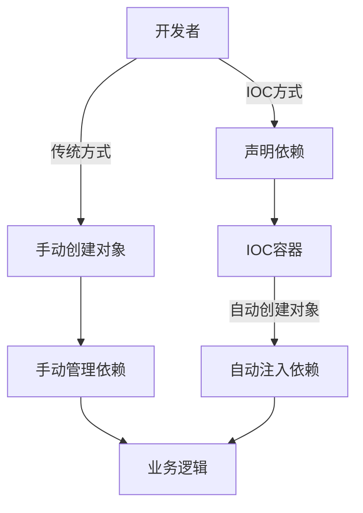
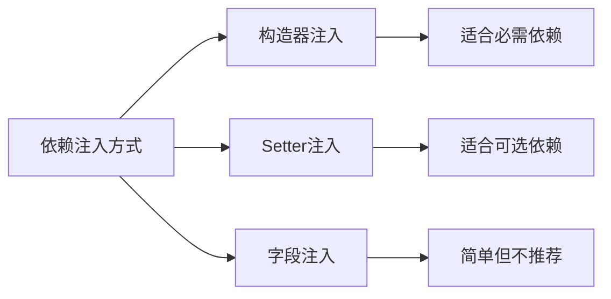
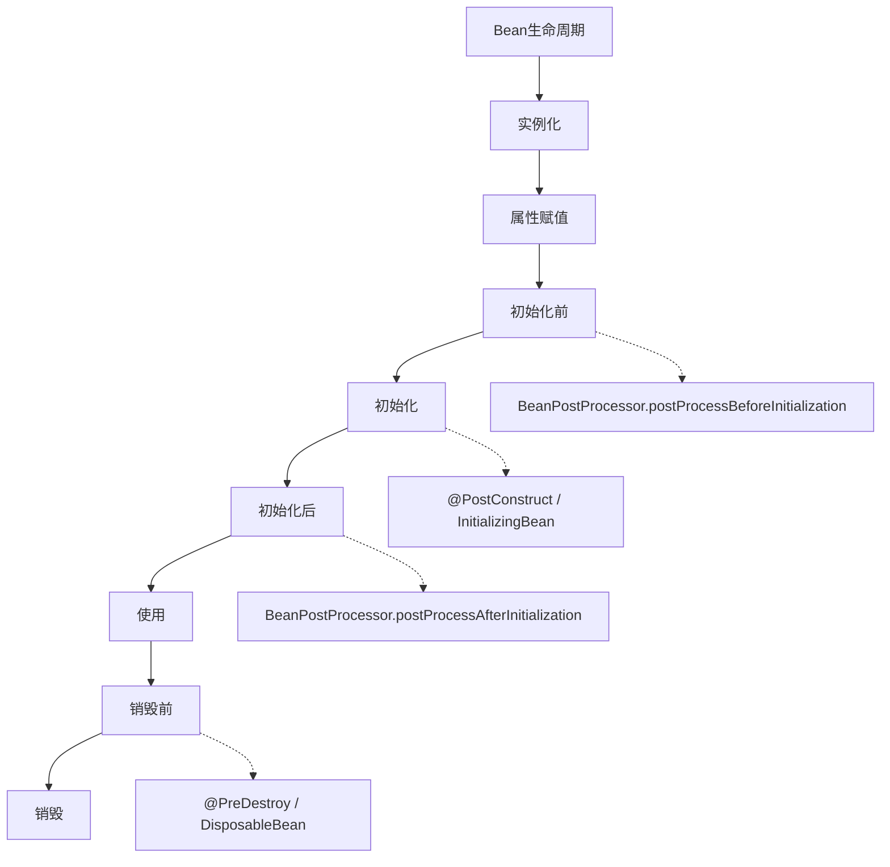
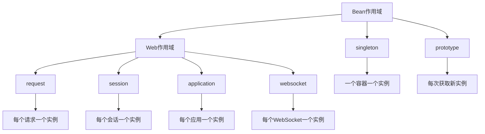
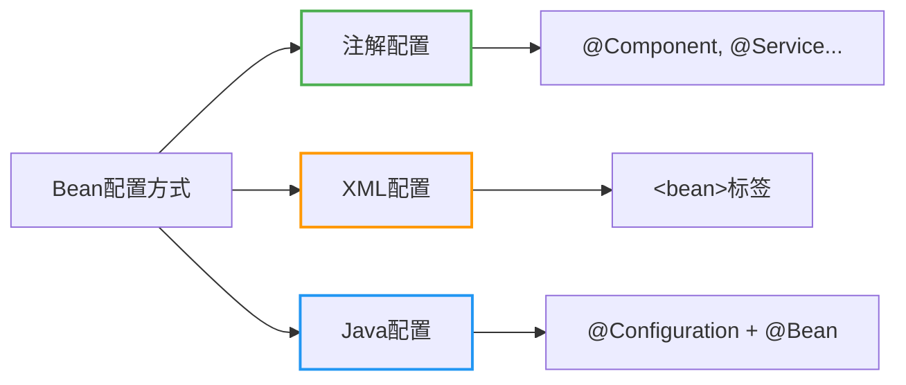
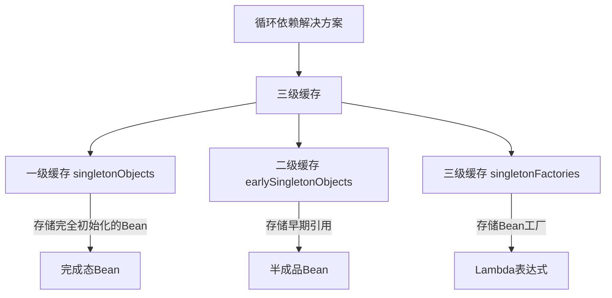
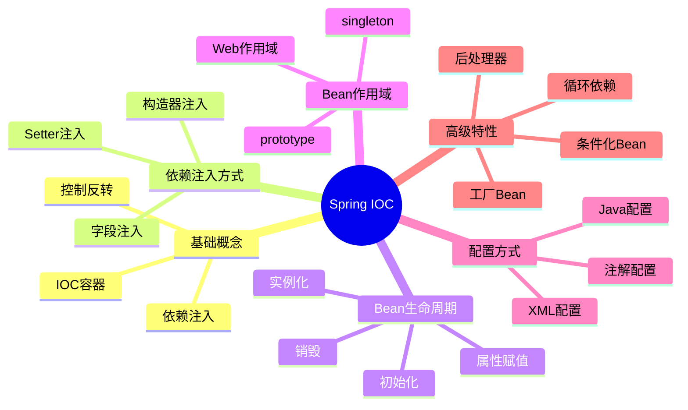

import Tabs from '@theme/Tabs';
import TabItem from '@theme/TabItem';
import TOCInline from '@theme/TOCInline';

# Spring IOC 详解

IOC（Inversion of Control，控制反转）是Spring框架的核心概念，它通过依赖注入（DI）实现了对象创建和依赖关系的管理，让开发者专注于业务逻辑的实现。

:::info 本文内容概览
<TOCInline toc={toc} />
:::

:::tip 核心价值
**IOC = 控制反转 + 依赖注入 + 对象管理 + 松耦合设计**
- 🔄 **控制反转**：将对象的创建和管理权交给容器
- 💉 **依赖注入**：通过构造函数、setter或字段自动注入依赖
- 🧩 **对象管理**：统一管理Bean的生命周期和作用域
- 🔗 **松耦合设计**：降低组件间的耦合度，提高可维护性
:::

## 1. IOC基础概念

### 1.1 什么是IOC？

IOC是一种设计模式，它将对象的创建和依赖关系的管理从代码中分离出来，交给容器来处理。这样可以降低代码的耦合度，提高代码的可维护性和可测试性。



#### 传统方式 vs IOC方式

<Tabs>
  <TabItem value="traditional" label="传统方式" default>
  ```java
  // 传统方式 - 紧耦合
  public class UserService {
      private UserRepository userRepository;
      
      public UserService() {
          // 直接创建依赖对象
          this.userRepository = new UserRepositoryImpl();
      }
      
      public void createUser(User user) {
          userRepository.save(user);
      }
  }
  ```
  </TabItem>
  <TabItem value="ioc" label="IOC方式">
  ```java
  // IOC方式 - 松耦合
  @Service
  public class UserService {
      @Autowired
      private UserRepository userRepository;
      
      public void createUser(User user) {
          userRepository.save(user);
      }
  }
  
  @Repository
  public class UserRepositoryImpl implements UserRepository {
      public void save(User user) {
          // 保存用户逻辑
      }
  }
  ```
  </TabItem>
</Tabs>

### 1.2 IOC容器

Spring IOC容器负责管理对象的生命周期和依赖关系。Spring提供了两种容器类型：BeanFactory和ApplicationContext。

<div className="card">
<div className="card__body">
<table>
  <thead>
    <tr>
      <th>特性</th>
      <th>BeanFactory</th>
      <th>ApplicationContext</th>
    </tr>
  </thead>
  <tbody>
    <tr>
      <td>加载方式</td>
      <td>懒加载</td>
      <td>预加载</td>
    </tr>
    <tr>
      <td>国际化</td>
      <td>不支持</td>
      <td>支持</td>
    </tr>
    <tr>
      <td>事件发布</td>
      <td>不支持</td>
      <td>支持</td>
    </tr>
    <tr>
      <td>资源访问</td>
      <td>有限支持</td>
      <td>完全支持</td>
    </tr>
    <tr>
      <td>适用场景</td>
      <td>资源受限环境</td>
      <td>大多数应用</td>
    </tr>
  </tbody>
</table>
</div>
</div>

```java title="IOC容器示例"
// 创建IOC容器
ApplicationContext context = new AnnotationConfigApplicationContext(AppConfig.class);

// 从容器获取Bean
UserService userService = context.getBean(UserService.class);

// 使用Bean
userService.createUser(new User("张三"));
```

## 2. 依赖注入方式

Spring提供多种依赖注入方式，每种方式都有其适用场景。



### 2.1 构造器注入

<Tabs>
  <TabItem value="code" label="代码实现" default>
  ```java title="构造器注入"
  @Service
  public class UserService {
      private final UserRepository userRepository;
      private final EmailService emailService;
      
      // 构造器注入
      public UserService(UserRepository userRepository, EmailService emailService) {
          this.userRepository = userRepository;
          this.emailService = emailService;
      }
      
      public void createUser(User user) {
          userRepository.save(user);
          emailService.sendWelcomeEmail(user.getEmail());
      }
  }
  ```
  </TabItem>
  <TabItem value="advantages" label="优缺点">
  <div className="card">
  <div className="card__header">
  <h4>构造器注入优缺点</h4>
  </div>
  <div className="card__body">
  <h5>优点：</h5>
  <ul>
  <li>保证依赖不可变</li>
  <li>确保必需的依赖在对象创建时可用</li>
  <li>支持final字段，避免后续修改</li>
  <li>便于单元测试</li>
  </ul>
  <h5>缺点：</h5>
  <ul>
  <li>当依赖过多时，构造函数参数列表可能过长</li>
  <li>可能导致循环依赖问题</li>
  </ul>
  </div>
  </div>
  </TabItem>
</Tabs>

### 2.2 Setter注入

<Tabs>
  <TabItem value="code" label="代码实现" default>
  ```java title="Setter注入"
  @Service
  public class UserService {
      private UserRepository userRepository;
      private EmailService emailService;
      
      // Setter注入
      @Autowired
      public void setUserRepository(UserRepository userRepository) {
          this.userRepository = userRepository;
      }
      
      @Autowired
      public void setEmailService(EmailService emailService) {
          this.emailService = emailService;
      }
  }
  ```
  </TabItem>
  <TabItem value="advantages" label="优缺点">
  <div className="card">
  <div className="card__header">
  <h4>Setter注入优缺点</h4>
  </div>
  <div className="card__body">
  <h5>优点：</h5>
  <ul>
  <li>适用于可选依赖</li>
  <li>可以在运行时更改依赖</li>
  <li>避免循环依赖问题</li>
  </ul>
  <h5>缺点：</h5>
  <ul>
  <li>不能确保依赖不为null</li>
  <li>不能使用final字段</li>
  <li>需要更多的代码</li>
  </ul>
  </div>
  </div>
  </TabItem>
</Tabs>

### 2.3 字段注入

<Tabs>
  <TabItem value="code" label="代码实现" default>
  ```java title="字段注入"
  @Service
  public class UserService {
      @Autowired
      private UserRepository userRepository;
      
      @Autowired
      private EmailService emailService;
      
      public void createUser(User user) {
          userRepository.save(user);
          emailService.sendWelcomeEmail(user.getEmail());
      }
  }
  ```
  </TabItem>
  <TabItem value="advantages" label="优缺点">
  <div className="card">
  <div className="card__header">
  <h4>字段注入优缺点</h4>
  </div>
  <div className="card__body">
  <h5>优点：</h5>
  <ul>
  <li>代码简洁</li>
  <li>减少样板代码</li>
  </ul>
  <h5>缺点：</h5>
  <ul>
  <li>不利于单元测试</li>
  <li>不能使用final字段</li>
  <li>容易导致过度依赖</li>
  <li>隐藏依赖关系</li>
  </ul>
  </div>
  </div>
  </TabItem>
</Tabs>

:::caution 注入方式选择
- **构造器注入**：推荐使用，可以确保依赖不为null，支持不可变对象
- **Setter注入**：适用于可选依赖，当依赖有合理默认值时
- **字段注入**：简单但不推荐，不利于测试和不可变性，隐藏依赖关系
:::

## 3. Bean生命周期

### 3.1 Bean生命周期阶段

Spring Bean的生命周期包含多个阶段，从实例化到销毁，容器会在各个阶段提供回调机制。



<details>
<summary>完整生命周期示例代码</summary>

```java title="Bean生命周期示例"
@Component
public class UserService implements InitializingBean, DisposableBean {
    
    public UserService() {
        System.out.println("1. 构造函数 - 实例化");
    }
    
    @Autowired
    public void setUserRepository(UserRepository userRepository) {
        System.out.println("2. 设置属性 - 依赖注入");
    }
    
    @PostConstruct
    public void init() {
        System.out.println("3. @PostConstruct - 初始化");
    }
    
    @Override
    public void afterPropertiesSet() throws Exception {
        System.out.println("4. InitializingBean.afterPropertiesSet()");
    }
    
    public void customInit() {
        System.out.println("5. 自定义初始化方法");
    }
    
    public void businessMethod() {
        System.out.println("6. 业务方法 - 使用Bean");
    }
    
    @PreDestroy
    public void preDestroy() {
        System.out.println("7. @PreDestroy - 销毁前");
    }
    
    @Override
    public void destroy() throws Exception {
        System.out.println("8. DisposableBean.destroy()");
    }
    
    public void customDestroy() {
        System.out.println("9. 自定义销毁方法");
    }
}
```

</details>

### 3.2 生命周期回调

<div className="card">
<div className="card__body">

| 阶段 | 回调方法 | 说明 |
|------|----------|------|
| **实例化** | 构造器 | 创建Bean实例 |
| **属性注入** | setter方法 | 注入依赖属性 |
| **初始化前** | BeanPostProcessor | 前置处理器 |
| **初始化** | @PostConstruct | 注解方式初始化 |
| **初始化** | InitializingBean | 接口方式初始化 |
| **初始化** | 自定义init方法 | XML或注解配置 |
| **初始化后** | BeanPostProcessor | 后置处理器 |
| **使用** | 业务方法 | Bean正常使用 |
| **销毁前** | @PreDestroy | 注解方式销毁前 |
| **销毁** | DisposableBean | 接口方式销毁 |
| **销毁** | 自定义destroy方法 | XML或注解配置 |

</div>
</div>

## 4. Bean作用域

### 4.1 作用域类型

Spring提供了多种Bean作用域，用于控制Bean实例的生命周期和可见性。

<Tabs>
  <TabItem value="singleton" label="单例" default>
  ```java title="单例作用域"
  @Component
  @Scope("singleton") // 默认作用域，可以省略
  public class SingletonService {
      // 整个容器只有一个实例
      
      public SingletonService() {
          System.out.println("创建SingletonService");
      }
      
      public void doSomething() {
          System.out.println("SingletonService doing something");
      }
  }
  ```
  </TabItem>
  <TabItem value="prototype" label="原型">
  ```java title="原型作用域"
  @Component
  @Scope("prototype")
  public class PrototypeService {
      // 每次获取都创建新实例
      
      public PrototypeService() {
          System.out.println("创建PrototypeService");
      }
      
      public void doSomething() {
          System.out.println("PrototypeService doing something");
      }
  }
  ```
  </TabItem>
  <TabItem value="web" label="Web作用域">
  ```java title="Web作用域"
  @Component
  @Scope(value = WebApplicationContext.SCOPE_SESSION, proxyMode = ScopedProxyMode.TARGET_CLASS)
  public class SessionService {
      // 每个会话一个实例
      
      public SessionService() {
          System.out.println("创建SessionService");
      }
  }
  
  @Component
  @Scope(value = WebApplicationContext.SCOPE_REQUEST, proxyMode = ScopedProxyMode.TARGET_CLASS)
  public class RequestService {
      // 每个请求一个实例
      
      public RequestService() {
          System.out.println("创建RequestService");
      }
  }
  ```
  </TabItem>
</Tabs>

### 4.2 作用域特点



<div className="card">
<div className="card__body">

| 作用域 | 说明 | 特点 | 使用场景 |
|--------|------|------|----------|
| **singleton** | 单例 | 整个容器只有一个实例 | 无状态服务、配置类 |
| **prototype** | 原型 | 每次获取都创建新实例 | 有状态对象、线程安全 |
| **request** | 请求 | 每个HTTP请求一个实例 | Web请求处理器 |
| **session** | 会话 | 每个HTTP会话一个实例 | 用户会话状态 |
| **application** | 应用 | 每个ServletContext一个实例 | 全局Web资源 |
| **websocket** | 连接 | 每个WebSocket连接一个实例 | WebSocket处理器 |

</div>
</div>

:::warning 作用域注意事项
当单例Bean依赖非单例Bean时，需要使用代理模式，否则非单例Bean将失去其作用域特性。使用`proxyMode = ScopedProxyMode.TARGET_CLASS`来解决此问题。
:::

## 5. 配置方式

Spring提供了三种主要的Bean配置方式，可以根据需求选择合适的方式。



### 5.1 注解配置

<Tabs>
  <TabItem value="component" label="组件扫描" default>
  ```java title="组件扫描"
  @Configuration
  @ComponentScan("com.example")
  public class AppConfig {
      // 配置类
  }
  
  @Service
  public class UserService {
      @Autowired
      private UserRepository userRepository;
  }
  
  @Repository
  public class UserRepositoryImpl implements UserRepository {
      // 实现
  }
  ```
  </TabItem>
  <TabItem value="bean" label="@Bean方法">
  ```java title="@Bean方法"
  @Configuration
  public class AppConfig {
      
      @Bean
      public UserRepository userRepository() {
          return new UserRepositoryImpl();
      }
      
      @Bean
      public EmailService emailService() {
          return new EmailServiceImpl();
      }
      
      @Bean
      public UserService userService() {
          return new UserService(userRepository(), emailService());
      }
  }
  ```
  </TabItem>
</Tabs>

### 5.2 XML配置

<details>
<summary>XML配置示例</summary>

```xml title="XML配置"
<?xml version="1.0" encoding="UTF-8"?>
<beans xmlns="http://www.springframework.org/schema/beans"
       xmlns:xsi="http://www.w3.org/2001/XMLSchema-instance"
       xsi:schemaLocation="http://www.springframework.org/schema/beans
       http://www.springframework.org/schema/beans/spring-beans.xsd">
    
    <bean id="userRepository" class="com.example.repository.UserRepositoryImpl"/>
    
    <bean id="emailService" class="com.example.service.EmailServiceImpl"/>
    
    <bean id="userService" class="com.example.service.UserService">
        <constructor-arg ref="userRepository"/>
        <constructor-arg ref="emailService"/>
    </bean>
    
</beans>
```

</details>

### 5.3 Java配置

```java title="Java配置"
@Configuration
public class AppConfig {
    
    @Bean
    public UserRepository userRepository() {
        return new UserRepositoryImpl();
    }
    
    @Bean
    public EmailService emailService() {
        return new EmailServiceImpl();
    }
    
    @Bean
    public UserService userService(UserRepository userRepository, EmailService emailService) {
        return new UserService(userRepository, emailService);
    }
}
```

## 6. 高级特性

### 6.1 条件化Bean

Spring提供了条件化配置机制，允许根据特定条件创建Bean。

<details>
<summary>条件化Bean示例</summary>

```java title="条件化Bean"
@Configuration
public class AppConfig {
    
    @Bean
    @ConditionalOnProperty(name = "database.type", havingValue = "mysql")
    public DataSource mysqlDataSource() {
        return new MysqlDataSource();
    }
    
    @Bean
    @ConditionalOnProperty(name = "database.type", havingValue = "postgresql")
    public DataSource postgresqlDataSource() {
        return new PostgresqlDataSource();
    }
    
    @Bean
    @ConditionalOnClass(name = "com.mysql.jdbc.Driver")
    public JdbcTemplate jdbcTemplate(DataSource dataSource) {
        return new JdbcTemplate(dataSource);
    }
}
```

</details>

<div className="card">
<div className="card__header">
<h4>常用条件注解</h4>
</div>
<div className="card__body">

| 条件注解 | 说明 | 用途 |
|----------|------|------|
| `@ConditionalOnBean` | 当存在指定Bean时 | 依赖其他Bean |
| `@ConditionalOnMissingBean` | 当不存在指定Bean时 | 默认配置 |
| `@ConditionalOnClass` | 当存在指定类时 | 依赖外部库 |
| `@ConditionalOnMissingClass` | 当不存在指定类时 | 兼容性配置 |
| `@ConditionalOnProperty` | 当存在指定属性时 | 配置驱动 |
| `@ConditionalOnExpression` | 当表达式为true时 | 复杂条件判断 |

</div>
</div>

### 6.2 Bean后处理器

Bean后处理器允许在Bean初始化前后进行自定义处理。

```java title="Bean后处理器"
@Component
public class CustomBeanPostProcessor implements BeanPostProcessor {
    
    @Override
    public Object postProcessBeforeInitialization(Object bean, String beanName) throws BeansException {
        System.out.println("Bean初始化前: " + beanName);
        return bean;
    }
    
    @Override
    public Object postProcessAfterInitialization(Object bean, String beanName) throws BeansException {
        System.out.println("Bean初始化后: " + beanName);
        return bean;
    }
}
```

### 6.3 工厂Bean

工厂Bean用于创建复杂的Bean实例，隐藏实例化细节。

```java title="工厂Bean"
@Component
public class UserServiceFactoryBean implements FactoryBean<UserService> {
    
    @Override
    public UserService getObject() throws Exception {
        // 创建复杂的UserService实例
        UserService userService = new UserService();
        // 进行一些复杂的初始化
        return userService;
    }
    
    @Override
    public Class<?> getObjectType() {
        return UserService.class;
    }
    
    @Override
    public boolean isSingleton() {
        return true;
    }
}
```

### 6.4 循环依赖

Spring通过三级缓存解决单例Bean的循环依赖问题。



<details>
<summary>循环依赖示例与解决过程</summary>

```java title="循环依赖示例"
@Service
public class ServiceA {
    @Autowired
    private ServiceB serviceB;
    
    public void methodA() {
        serviceB.methodB();
    }
}

@Service
public class ServiceB {
    @Autowired
    private ServiceA serviceA;
    
    public void methodB() {
        serviceA.methodA();
    }
}
```

解决过程：
1. 创建ServiceA实例
2. 发现依赖ServiceB，将ServiceA放入三级缓存
3. 创建ServiceB实例
4. 发现依赖ServiceA，尝试从缓存获取
5. 从三级缓存获取ServiceA的早期引用
6. 完成ServiceB的依赖注入
7. 完成ServiceA的依赖注入

</details>

## 7. 面试题精选

### 7.1 基础概念题

<Tabs>
  <TabItem value="q1" label="IOC概念" default>
  <div className="card">
  <div className="card__header">
  <h4>Q: 什么是IOC？它的优势是什么？</h4>
  </div>
  <div className="card__body">
  <p><strong>A:</strong> IOC（控制反转）是一种设计模式，它将对象的创建和依赖关系的管理从代码中分离出来。优势包括：</p>
  <ul>
  <li><strong>降低耦合度</strong>：对象之间的依赖关系由容器管理</li>
  <li><strong>提高可维护性</strong>：修改依赖关系不需要修改业务代码</li>
  <li><strong>提高可测试性</strong>：可以轻松替换依赖进行测试</li>
  <li><strong>简化代码</strong>：专注于业务逻辑实现</li>
  </ul>
  </div>
  </div>
  </TabItem>
  <TabItem value="q2" label="IOC容器">
  <div className="card">
  <div className="card__header">
  <h4>Q: Spring IOC容器的核心接口有哪些？</h4>
  </div>
  <div className="card__body">
  <p><strong>A:</strong> Spring IOC容器的核心接口包括：</p>
  <ul>
  <li><strong>BeanFactory</strong>：基础容器接口，提供基本的IOC功能</li>
  <li><strong>ApplicationContext</strong>：BeanFactory的子接口，提供更多企业级功能</li>
  <li><strong>ConfigurableApplicationContext</strong>：可配置的应用上下文</li>
  <li><strong>WebApplicationContext</strong>：Web应用的应用上下文</li>
  <li><strong>AnnotationConfigApplicationContext</strong>：基于注解的配置上下文</li>
  </ul>
  </div>
  </div>
  </TabItem>
</Tabs>

### 7.2 实践题

<Tabs>
  <TabItem value="q3" label="依赖注入" default>
  <div className="card">
  <div className="card__header">
  <h4>Q: Spring中有哪些依赖注入方式？</h4>
  </div>
  <div className="card__body">
  <p><strong>A:</strong> Spring提供三种依赖注入方式：</p>
  <ul>
  <li><strong>构造器注入</strong>：通过构造器注入依赖，推荐使用</li>
  <li><strong>Setter注入</strong>：通过setter方法注入依赖</li>
  <li><strong>字段注入</strong>：直接在字段上使用@Autowired注解</li>
  </ul>
  </div>
  </div>
  </TabItem>
  <TabItem value="q4" label="Bean作用域">
  <div className="card">
  <div className="card__header">
  <h4>Q: Bean的作用域有哪些？</h4>
  </div>
  <div className="card__body">
  <p><strong>A:</strong> Spring Bean的作用域包括：</p>
  <ul>
  <li><strong>singleton</strong>：单例（默认），整个容器只有一个实例</li>
  <li><strong>prototype</strong>：原型，每次获取都创建新实例</li>
  <li><strong>request</strong>：请求作用域，每个HTTP请求一个实例</li>
  <li><strong>session</strong>：会话作用域，每个HTTP会话一个实例</li>
  <li><strong>application</strong>：应用作用域，每个ServletContext一个实例</li>
  <li><strong>websocket</strong>：WebSocket作用域，每个WebSocket连接一个实例</li>
  </ul>
  </div>
  </div>
  </TabItem>
</Tabs>

### 7.3 高级题

<Tabs>
  <TabItem value="q5" label="生命周期" default>
  <div className="card">
  <div className="card__header">
  <h4>Q: Spring Bean的生命周期是怎样的？</h4>
  </div>
  <div className="card__body">
  <p><strong>A:</strong> Spring Bean的生命周期包括：</p>
  <ol>
  <li><strong>实例化</strong>：创建Bean实例</li>
  <li><strong>属性注入</strong>：注入依赖属性</li>
  <li><strong>BeanPostProcessor前置处理</strong>：在初始化前进行处理</li>
  <li><strong>初始化回调</strong>：执行初始化回调方法（@PostConstruct、InitializingBean等）</li>
  <li><strong>BeanPostProcessor后置处理</strong>：在初始化后进行处理</li>
  <li><strong>使用</strong>：Bean正常使用</li>
  <li><strong>销毁回调</strong>：执行销毁回调方法（@PreDestroy、DisposableBean等）</li>
  </ol>
  </div>
  </div>
  </TabItem>
  <TabItem value="q6" label="循环依赖">
  <div className="card">
  <div className="card__header">
  <h4>Q: 如何解决循环依赖问题？</h4>
  </div>
  <div className="card__body">
  <p><strong>A:</strong> Spring通过三级缓存解决循环依赖：</p>
  <ul>
  <li><strong>一级缓存</strong>：singletonObjects，存放完全初始化好的Bean</li>
  <li><strong>二级缓存</strong>：earlySingletonObjects，存放早期暴露的Bean（未完全初始化）</li>
  <li><strong>三级缓存</strong>：singletonFactories，存放Bean的工厂对象</li>
  </ul>
  <p>通过提前暴露Bean的引用解决循环依赖。注意，这种机制只能解决单例Bean的setter注入循环依赖，不能解决构造器注入的循环依赖和原型Bean的循环依赖。</p>
  </div>
  </div>
  </TabItem>
</Tabs>

:::tip IOC学习要点
1. **理解核心概念**：掌握IOC、DI、Bean等基本概念
2. **熟悉注入方式**：学会构造器、Setter、字段注入
3. **掌握生命周期**：了解Bean的创建、初始化、销毁过程
4. **学会配置方式**：掌握注解、XML、Java配置
5. **了解高级特性**：学会条件化Bean、后处理器等
:::



---

通过本章的学习，你应该已经掌握了Spring IOC的核心概念、依赖注入方式和Bean生命周期管理。IOC是Spring框架的基础，掌握IOC对于理解整个Spring生态系统至关重要。在实际项目中，合理使用IOC可以构建出松耦合、易维护的应用程序。 