import Tabs from '@theme/Tabs';
import TabItem from '@theme/TabItem';
import TOCInline from '@theme/TOCInline';

# Spring Boot 详解

Spring Boot是一个基于Spring框架的快速开发平台，它通过约定优于配置的理念，简化了Spring应用的配置和部署。Spring Boot提供了自动配置、内嵌服务器、生产就绪特性等，大大提高了开发效率。

:::info 本文内容概览
<TOCInline toc={toc} />
:::

## 1. Spring Boot基础概念

### 1.1 什么是Spring Boot？

Spring Boot是Spring框架的扩展，它简化了Spring应用的初始搭建和开发过程。通过自动配置、起步依赖、内嵌服务器等特性，让开发者能够快速构建生产就绪的Spring应用。

### 1.2 Spring Boot的核心特性

- **自动配置**：根据依赖自动配置应用
- **起步依赖**：简化Maven/Gradle依赖管理
- **内嵌服务器**：内置Tomcat、Jetty等服务器
- **生产就绪**：监控、健康检查等

## 2. 自动配置原理

Spring Boot的自动配置基于条件注解和Spring Factories机制，是其核心功能之一。

:::tip 核心概念
🚀 **自动配置**：Spring Boot会根据添加的jar依赖自动配置Spring应用上下文，减少开发者手动配置的工作量。
:::

### 2.1 自动配置流程

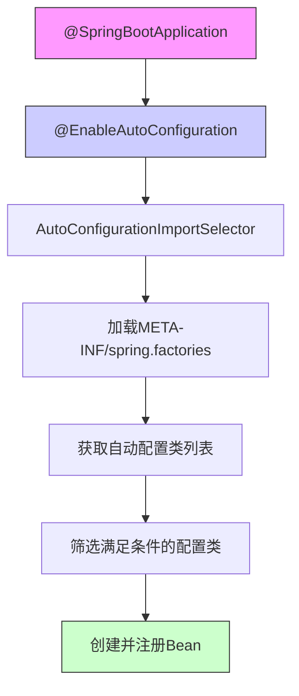

自动配置的基本流程如下：

1. 应用启动时，通过`@SpringBootApplication`注解上的`@EnableAutoConfiguration`启用自动配置功能
2. `AutoConfigurationImportSelector`读取所有依赖中的`META-INF/spring.factories`文件
3. 收集所有`org.springframework.boot.autoconfigure.EnableAutoConfiguration`项下的配置类
4. 根据条件注解(`@ConditionalOnXXX`)筛选出符合条件的配置类
5. 创建并注册这些配置类中定义的Bean

<Tabs>
  <TabItem value="application" label="Spring Boot应用" default>
  ```java title="Spring Boot主类"
  @SpringBootApplication // 包含@EnableAutoConfiguration
  public class MyApplication {
    public static void main(String[] args) {
          SpringApplication.run(MyApplication.class, args);
      }
  }
  ```
  </TabItem>
  
  <TabItem value="factories" label="spring.factories文件">
  ```properties title="META-INF/spring.factories"
  # Auto Configure
  org.springframework.boot.autoconfigure.EnableAutoConfiguration=\
  com.example.autoconfigure.DataSourceAutoConfiguration,\
  com.example.autoconfigure.JpaRepositoriesAutoConfiguration,\
  com.example.autoconfigure.WebMvcAutoConfiguration
  ```
  </TabItem>
</Tabs>

### 2.2 条件注解详解

条件注解是自动配置的核心机制，决定了配置是否应该被应用。

<div className="card">
<div className="card__header">
<h4>主要条件注解</h4>
</div>
<div className="card__body">

| 条件注解 | 描述 | 示例 |
|---------|------|------|
| `@ConditionalOnClass` | 当指定类存在于类路径时 | `@ConditionalOnClass(DataSource.class)` |
| `@ConditionalOnMissingClass` | 当指定类不存在于类路径时 | `@ConditionalOnMissingClass("org.hibernate.Session")` |
| `@ConditionalOnBean` | 当指定Bean存在于容器中时 | `@ConditionalOnBean(name = "dataSource")` |
| `@ConditionalOnMissingBean` | 当指定Bean不存在于容器中时 | `@ConditionalOnMissingBean(DataSource.class)` |
| `@ConditionalOnProperty` | 当配置属性满足条件时 | `@ConditionalOnProperty(prefix = "app", name = "cache", havingValue = "true")` |
| `@ConditionalOnResource` | 当指定资源存在时 | `@ConditionalOnResource(resources = "classpath:config.properties")` |
| `@ConditionalOnWebApplication` | 当应用是Web应用时 | `@ConditionalOnWebApplication(type = Type.SERVLET)` |
| `@ConditionalOnNotWebApplication` | 当应用不是Web应用时 | `@ConditionalOnNotWebApplication` |
| `@ConditionalOnExpression` | 当SpEL表达式为true时 | `@ConditionalOnExpression("'${spring.profiles.active}' == 'dev'")` |

</div>
</div>

```java title="条件注解使用示例"
@Configuration
@ConditionalOnClass(DataSource.class)  // 当类路径下有DataSource类时
@ConditionalOnProperty(prefix = "spring.datasource", name = "url")  // 当配置了spring.datasource.url属性时
public class DataSourceAutoConfiguration {
    
    @Bean
    @ConditionalOnMissingBean  // 当容器中不存在DataSource类型的Bean时
    public DataSource dataSource() {
        // 创建默认数据源
        return DataSourceBuilder.create().build();
    }
    
    @Bean
    @ConditionalOnProperty(prefix = "spring.datasource", name = "initialize", havingValue = "true", matchIfMissing = true)
    public DataSourceInitializer dataSourceInitializer(DataSource dataSource) {
        // 初始化数据源
        return new DataSourceInitializer(dataSource);
    }
}
```

### 2.3 自动配置的实现原理

Spring Boot自动配置的核心实现基于`@EnableAutoConfiguration`注解和`AutoConfigurationImportSelector`选择器。

<Tabs>
  <TabItem value="enableAutoConfig" label="EnableAutoConfiguration">
  
  ```java title="EnableAutoConfiguration源码"
  @Target(ElementType.TYPE)
  @Retention(RetentionPolicy.RUNTIME)
  @Documented
  @Inherited
  @AutoConfigurationPackage
  @Import(AutoConfigurationImportSelector.class)
  public @interface EnableAutoConfiguration {
      
      String ENABLED_OVERRIDE_PROPERTY = "spring.boot.enableautoconfiguration";
      
      // 排除特定的自动配置类
      Class<?>[] exclude() default {};
      
      // 按名称排除自动配置类
      String[] excludeName() default {};
  }
  ```
  
  `@EnableAutoConfiguration`注解通过`@Import`导入`AutoConfigurationImportSelector`，这个选择器负责加载和筛选自动配置类。
  </TabItem>
  
  <TabItem value="importSelector" label="ImportSelector">
  
  ```java title="AutoConfigurationImportSelector关键方法"
  public class AutoConfigurationImportSelector implements DeferredImportSelector {
      
      @Override
      public String[] selectImports(AnnotationMetadata annotationMetadata) {
          // 判断是否启用自动配置
          if (!isEnabled(annotationMetadata)) {
              return NO_IMPORTS;
          }
          
          // 加载自动配置元数据
          AutoConfigurationMetadata autoConfigurationMetadata = 
              AutoConfigurationMetadataLoader.loadMetadata(this.beanClassLoader);
          
          // 获取自动配置条目
          AutoConfigurationEntry autoConfigurationEntry = getAutoConfigurationEntry(
              autoConfigurationMetadata, annotationMetadata);
          
          return StringUtils.toStringArray(autoConfigurationEntry.getConfigurations());
      }
      
      protected AutoConfigurationEntry getAutoConfigurationEntry(
          AutoConfigurationMetadata autoConfigurationMetadata,
          AnnotationMetadata annotationMetadata) {
          // 从spring.factories加载自动配置类
          List<String> configurations = getCandidateConfigurations(
              annotationMetadata, attributes);
          
          // 去重
          configurations = removeDuplicates(configurations);
          
          // 获取排除项
          Set<String> exclusions = getExclusions(annotationMetadata, attributes);
          
          // 从候选配置中排除指定的配置类
          configurations.removeAll(exclusions);
          
          // 根据条件注解过滤配置类
          configurations = filter(configurations, autoConfigurationMetadata);
          
          // 触发自动配置导入事件
          fireAutoConfigurationImportEvents(configurations, exclusions);
          
          return new AutoConfigurationEntry(configurations, exclusions);
      }
  }
  ```
  
  `AutoConfigurationImportSelector`通过读取各个JAR包中的`META-INF/spring.factories`文件，收集所有声明的自动配置类，然后根据条件注解进行筛选。
  </TabItem>
</Tabs>

### 2.4 自定义自动配置

你可以创建自己的自动配置类，实现特定功能的自动配置。

```java title="自定义自动配置类示例"
// 步骤1：创建配置属性类
@ConfigurationProperties(prefix = "acme")
public class AcmeProperties {

    private boolean enabled = false;
    private String apiKey;
    private List<String> allowedOrigins = new ArrayList<>();
    
    // getter和setter
}

// 步骤2：创建自动配置类
@Configuration
@ConditionalOnClass(AcmeClient.class)
@EnableConfigurationProperties(AcmeProperties.class)
public class AcmeAutoConfiguration {

    private final AcmeProperties properties;
    
    public AcmeAutoConfiguration(AcmeProperties properties) {
        this.properties = properties;
    }
    
    @Bean
    @ConditionalOnMissingBean
    @ConditionalOnProperty(prefix = "acme", name = "enabled", havingValue = "true")
    public AcmeClient acmeClient() {
        return new AcmeClient(properties.getApiKey(), properties.getAllowedOrigins());
    }
}

// 步骤3：注册自动配置类（在META-INF/spring.factories文件中）
// org.springframework.boot.autoconfigure.EnableAutoConfiguration=\
// com.example.AcmeAutoConfiguration
```

:::caution 注意事项
创建自定义自动配置时，需要遵循以下原则：
1. 尽量使用条件注解，避免强制用户使用你的配置
2. 提供合理的默认值，但允许用户自定义
3. 使用spring-boot-configuration-processor生成元数据，提供IDE支持
4. 遵循命名约定：XxxAutoConfiguration作为配置类名，XxxProperties作为属性类名
:::

## 3. 配置管理

Spring Boot提供了灵活且强大的配置机制，支持多种配置方式和配置优先级。

:::tip 核心概念
🔧 **配置管理**：Spring Boot允许通过属性文件、YAML文件、环境变量、命令行参数等多种方式配置应用，并提供了灵活的属性绑定功能。
:::

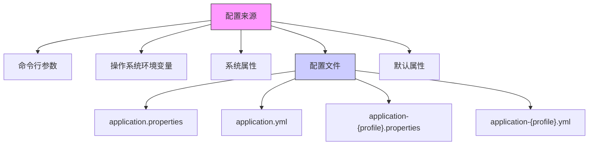

### 3.1 配置文件格式

Spring Boot支持Properties和YAML两种主要的配置文件格式。

<Tabs>
  <TabItem value="properties" label="Properties格式" default>
  
  Properties是传统的Java配置文件格式，使用键值对方式：
  
  ```properties title="application.properties"
  # 服务器配置
  server.port=8080
  server.servlet.context-path=/api
  
  # 数据源配置
  spring.datasource.url=jdbc:mysql://localhost:3306/mydb
  spring.datasource.username=user
  spring.datasource.password=password
  spring.datasource.driver-class-name=com.mysql.cj.jdbc.Driver
  
  # JPA配置
  spring.jpa.hibernate.ddl-auto=update
  spring.jpa.show-sql=true
  spring.jpa.properties.hibernate.format_sql=true
  
  # 自定义属性
  app.name=My Spring Boot App
  app.description=A sample Spring Boot application
  app.version=1.0.0
  ```
  
  <div className="card">
  <div className="card__header">
  <h4>Properties格式特点</h4>
  </div>
  <div className="card__body">
  
  **优点**：
  - 传统格式，兼容性好
  - 工具支持广泛
  - 语法简单直观
  
  **缺点**：
  - 层次结构不直观
  - 不支持复杂数据类型
  - 配置项多时不易维护
  
  </div>
  </div>
  </TabItem>
  
  <TabItem value="yaml" label="YAML格式">
  
  YAML格式更现代化，支持层次结构，更易于阅读和维护：

```yaml title="application.yml"
  # 服务器配置
server:
  port: 8080
  servlet:
    context-path: /api

  # 数据源配置
spring:
  datasource:
      url: jdbc:mysql://localhost:3306/mydb
      username: user
    password: password
      driver-class-name: com.mysql.cj.jdbc.Driver
  
    # JPA配置
  jpa:
    hibernate:
      ddl-auto: update
    show-sql: true
    properties:
      hibernate:
          format_sql: true
  
  # 自定义属性
  app:
    name: My Spring Boot App
    description: A sample Spring Boot application
    version: 1.0.0
    
    # 复杂类型示例
    security:
      enabled: true
      roles:
        - USER
        - ADMIN
      rate-limits:
        basic: 10
        premium: 100
  ```
  
  <div className="card">
  <div className="card__header">
  <h4>YAML格式特点</h4>
  </div>
  <div className="card__body">
  
  **优点**：
  - 层次结构清晰
  - 支持复杂数据类型（列表、映射等）
  - 支持文档分隔符（可在同一文件中定义多环境配置）
  - 减少重复前缀
  - 支持引用和锚点
  
  **缺点**：
  - 对缩进敏感
  - 语法相对复杂
  
  </div>
  </div>
  </TabItem>
</Tabs>

### 3.2 多环境配置

Spring Boot通过profiles机制支持多环境配置，可以根据不同的环境（如开发、测试、生产）加载不同的配置。

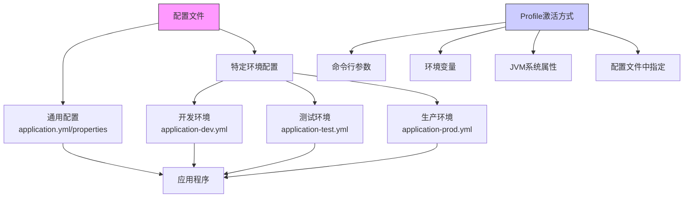

<Tabs>
  <TabItem value="multi-profile" label="多Profile配置" default>
  
  使用不同文件配置不同环境：
  
  ```yaml title="application.yml（通用配置）"
  spring:
    application:
      name: my-application

logging:
  level:
    root: INFO
  ```
  
  ```yaml title="application-dev.yml（开发环境）"
  spring:
    datasource:
      url: jdbc:h2:mem:devdb
      username: sa
      password: 
    
  logging:
    level:
      com.example: DEBUG
  ```
  
  ```yaml title="application-prod.yml（生产环境）"
  spring:
    datasource:
      url: jdbc:mysql://prod-server:3306/proddb
      username: produser
      password: prodpass
      
  logging:
    level:
      root: WARN
      com.example: INFO
  ```
  </TabItem>
  
  <TabItem value="single-file" label="单文件多Profile">
  
  在同一个YAML文件中使用文档分隔符(`---`)配置不同环境：
  
  ```yaml title="application.yml"
  # 默认配置
spring:
    application:
      name: my-application
      
  logging:
    level:
      root: INFO
      
  ---
  # 开发环境配置
spring:
    config:
      activate:
        on-profile: dev
  datasource:
      url: jdbc:h2:mem:devdb
      username: sa
      password: 

logging:
  level:
    com.example: DEBUG

---
  # 生产环境配置
spring:
    config:
      activate:
        on-profile: prod
  datasource:
      url: jdbc:mysql://prod-server:3306/proddb
      username: produser
      password: prodpass

logging:
  level:
      root: WARN
      com.example: INFO
  ```
  </TabItem>
  
  <TabItem value="activation" label="Profile激活方式">
  
  有多种方式可以激活特定的profile：
  
  ```yaml title="在配置文件中指定"
  spring:
    profiles:
      active: dev
  ```
  
  ```shell title="命令行参数"
  # 使用--spring.profiles.active激活指定的profile
  java -jar myapp.jar --spring.profiles.active=dev
  ```
  
  ```shell title="环境变量"
  # 使用SPRING_PROFILES_ACTIVE环境变量
  export SPRING_PROFILES_ACTIVE=dev
  java -jar myapp.jar
  ```
  
  ```java title="代码中指定"
  public static void main(String[] args) {
      SpringApplication application = new SpringApplication(MyApplication.class);
      application.setAdditionalProfiles("dev");
      application.run(args);
  }
  ```
  
  <div className="card">
  <div className="card__header">
  <h4>Profile激活优先级</h4>
  </div>
  <div className="card__body">
  
  激活Profile的优先级（从高到低）：
  1. 命令行参数：`--spring.profiles.active=dev`
  2. 测试中通过`@ActiveProfiles`注解激活
  3. JVM系统属性：`-Dspring.profiles.active=dev`
  4. 环境变量：`SPRING_PROFILES_ACTIVE=dev`
  5. `application.properties`或`application.yml`文件中的`spring.profiles.active`属性
  
  </div>
  </div>
  </TabItem>
</Tabs>

### 3.3 配置属性绑定

Spring Boot提供了强大的属性绑定机制，可以将配置文件中的属性绑定到Java对象。

<Tabs>
  <TabItem value="value" label="@Value注解" default>
  
  `@Value`注解是属性注入的基本方式，用于单个属性的注入：
  
  ```java title="@Value注解示例"
  @RestController
  public class AppController {
      
      @Value("${app.name}")
      private String appName;
      
      @Value("${app.description:Default description}")  // 提供默认值
      private String appDescription;
      
      @Value("${server.port}")
      private int serverPort;
      
      @Value("${app.enabled:false}")  // 默认为false
      private boolean appEnabled;
      
      @Value("${app.list-values}")
      private String[] listValues;
      
      @Value("#{${app.map-values}}")  // 注入Map需要SpEL表达式
      private Map<String, Integer> mapValues;
      
      @GetMapping("/config")
      public Map<String, Object> getConfig() {
          Map<String, Object> config = new HashMap<>();
          config.put("name", appName);
          config.put("description", appDescription);
          config.put("port", serverPort);
          config.put("enabled", appEnabled);
          config.put("listValues", listValues);
          config.put("mapValues", mapValues);
          return config;
      }
  }
  ```
  </TabItem>
  
  <TabItem value="config-properties" label="@ConfigurationProperties">
  
  `@ConfigurationProperties`注解用于绑定相关配置到一个Java Bean，适合批量属性绑定：
  
  ```java title="@ConfigurationProperties注解示例"
@Component
  @ConfigurationProperties(prefix = "app")
  public class AppProperties {
      
      private String name;
      private String description;
      private String version;
      private boolean enabled;
      private List<String> listValues = new ArrayList<>();
      private Map<String, Integer> mapValues = new HashMap<>();
      
      // 嵌套配置
      private Security security = new Security();
      
      // getter和setter方法...
      
      public static class Security {
          private boolean enabled;
          private List<String> roles = new ArrayList<>();
          private Map<String, Integer> rateLimits = new HashMap<>();
          
          // getter和setter方法...
      }
  }
  ```
  
  ```java title="使用配置属性类"
  @Service
  public class AppService {
      
      private final AppProperties appProperties;
      
      public AppService(AppProperties appProperties) {
          this.appProperties = appProperties;
      }
      
      public void doSomething() {
          if (appProperties.isEnabled()) {
              // 使用配置属性...
              System.out.println("App name: " + appProperties.getName());
              System.out.println("Security enabled: " + 
                  appProperties.getSecurity().isEnabled());
          }
      }
  }
  ```
  </TabItem>
  
  <TabItem value="enable-properties" label="@EnableConfigurationProperties">
  
  使用`@EnableConfigurationProperties`注解可以在不使用`@Component`的情况下创建配置属性类的Bean：
  
  ```java title="@EnableConfigurationProperties示例"
@Configuration
  @EnableConfigurationProperties(MyServiceProperties.class)
  public class MyServiceConfiguration {
    
    @Bean
      public MyService myService(MyServiceProperties properties) {
          return new MyService(properties.getApiUrl(), 
                             properties.getTimeout(), 
                             properties.isSecure());
      }
  }
  
  @ConfigurationProperties(prefix = "service")
  public class MyServiceProperties {
      
      /**
       * Service API URL.
       */
      private String apiUrl;
      
      /**
       * Connection timeout in milliseconds.
       */
      private int timeout = 1000;
      
      /**
       * Whether to use secure connection.
       */
      private boolean secure = false;
      
      // getter和setter方法...
  }
  ```
  </TabItem>
</Tabs>

<div className="card">
<div className="card__header">
<h4>@ConfigurationProperties vs @Value</h4>
</div>
<div className="card__body">

| 特性 | @ConfigurationProperties | @Value |
|------|-------------------------|--------|
| **松散绑定** | 支持（如my-service-url绑定到myServiceUrl） | 不支持 |
| **元数据支持** | 支持（可生成配置元数据） | 不支持 |
| **复杂类型** | 支持嵌套对象、列表、Map等 | 有限支持 |
| **默认值** | 在类中定义 | 在注解中定义 |
| **批量导入** | 一个类绑定多个属性 | 每个属性单独绑定 |
| **表达式语言** | 不支持 | 支持SpEL |
| **属性转换** | 自动类型转换 | 有限的类型转换 |
| **校验** | 支持JSR-303注解 | 不支持 |

</div>
</div>

:::caution 配置优先级
Spring Boot配置的优先级从高到低：
1. 命令行参数
2. Java系统属性(`System.getProperties()`)
3. 操作系统环境变量
4. `application-{profile}.properties`外部文件
5. `application.properties`外部文件
6. `application-{profile}.properties`内部文件
7. `application.properties`内部文件
8. `@PropertySource`注解引入的属性文件
9. 默认属性
:::

### 3.4 属性加密与敏感信息

在实际应用中，配置文件可能包含敏感信息（如数据库密码、API密钥等），Spring Boot提供了多种方式处理敏感配置：

```java title="使用Jasypt加密配置示例"
// 添加Jasypt依赖
// implementation 'com.github.ulisesbocchio:jasypt-spring-boot-starter:3.0.4'

@SpringBootApplication
@EnableEncryptableProperties
public class MyApplication {
    
    public static void main(String[] args) {
        SpringApplication.run(MyApplication.class, args);
    }
}
```

```yaml title="加密属性示例"
spring:
  datasource:
    url: jdbc:mysql://localhost:3306/mydb
    username: dbuser
    # 加密的密码
    password: ENC(G5n+K5LQum+dFiNbgd+F5kAm0FyYpaIP)
```

```shell title="加密命令"
# 加密密码
java -jar jasypt-1.9.3.jar encrypt.bat input=mypassword password=mysecretkey
```

## 4. Spring Boot启动流程

Spring Boot启动过程是一个复杂而精巧的流程，其中包含了多个关键步骤和事件。

:::tip 核心概念
🚀 **启动流程**：Spring Boot应用启动时会经历创建SpringApplication对象、准备环境、创建上下文、加载Bean定义和刷新上下文等一系列步骤，每个步骤都有特定的作用和事件通知机制。
:::

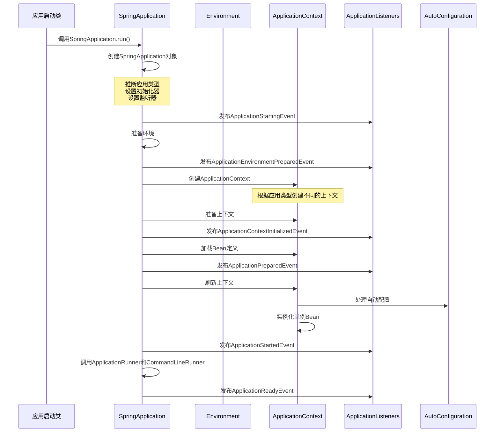

### 4.1 启动流程详解

Spring Boot的启动流程可以分为以下几个关键步骤：

<div className="card">
<div className="card__header">
<h4>Spring Boot启动流程步骤</h4>
</div>
<div className="card__body">

1. **创建SpringApplication对象**
   - 推断应用类型（SERVLET、REACTIVE、NONE）
   - 设置初始化器（ApplicationContextInitializer）
   - 设置监听器（ApplicationListener）
   - 推断主应用类

2. **运行SpringApplication**
   - 创建并启动StopWatch（用于记录启动时间）
   - 创建应用上下文环境（ConfigurableEnvironment）
   - 准备上下文（ApplicationContext）
   - 刷新上下文
   - 应用上下文后置处理
   - 发布应用启动完成事件

3. **准备Environment**
   - 创建和配置环境对象
   - 读取所有配置源的配置属性
   - 处理profiles

4. **创建ApplicationContext**
   - 根据应用类型创建对应的上下文
     - SERVLET类型：`AnnotationConfigServletWebServerApplicationContext`
     - REACTIVE类型：`AnnotationConfigReactiveWebServerApplicationContext`
     - 非Web应用：`AnnotationConfigApplicationContext`

5. **刷新ApplicationContext**
   - 处理Bean定义
   - 初始化非延迟加载的单例Bean
   - 启动嵌入式Web服务器（如果是Web应用）

6. **执行Runner**
   - 按顺序执行所有`CommandLineRunner`和`ApplicationRunner`

</div>
</div>

<details>
<summary>SpringApplication启动源码分析</summary>

```java title="SpringApplication核心方法"
    public ConfigurableApplicationContext run(String... args) {
        StopWatch stopWatch = new StopWatch();
        stopWatch.start();
        ConfigurableApplicationContext context = null;
        Collection<SpringBootExceptionReporter> exceptionReporters = new ArrayList<>();
        
    // 1. 配置headless属性
        configureHeadlessProperty();
    
    // 2. 获取并启动所有的SpringApplicationRunListener
        SpringApplicationRunListeners listeners = getRunListeners(args);
        listeners.starting();
        
        try {
        // 3. 创建ApplicationArguments对象
            ApplicationArguments applicationArguments = new DefaultApplicationArguments(args);
        
        // 4. 准备环境
            ConfigurableEnvironment environment = prepareEnvironment(listeners, applicationArguments);
            configureIgnoreBeanInfo(environment);
        
        // 5. 打印Banner
            Banner printedBanner = printBanner(environment);
        
        // 6. 创建ApplicationContext
            context = createApplicationContext();
        
        // 7. 获取异常报告器
        exceptionReporters = getSpringFactoriesInstances(
                SpringBootExceptionReporter.class,
                new Class[] { ConfigurableApplicationContext.class }, context);
        
        // 8. 准备上下文
            prepareContext(context, environment, listeners, applicationArguments, printedBanner);
        
        // 9. 刷新上下文
            refreshContext(context);
        
        // 10. 刷新上下文后的操作
            afterRefresh(context, applicationArguments);
        
        // 11. 停止计时器并输出启动日志
            stopWatch.stop();
            if (this.logStartupInfo) {
            new StartupInfoLogger(this.mainApplicationClass)
                    .logStarted(getApplicationLog(), stopWatch);
            }
        
        // 12. 发布应用已启动事件
            listeners.started(context);
        
        // 13. 调用所有Runner
            callRunners(context, applicationArguments);
    }
    catch (Throwable ex) {
            handleRunFailure(context, ex, exceptionReporters, listeners);
            throw new IllegalStateException(ex);
        }
        
        try {
        // 14. 发布应用就绪事件
            listeners.running(context);
    }
    catch (Throwable ex) {
            handleRunFailure(context, ex, exceptionReporters, null);
            throw new IllegalStateException(ex);
        }
    
    // 15. 返回上下文
        return context;
}
```

</details>

### 4.2 事件监听机制

Spring Boot启动过程中会发布一系列事件，应用可以通过监听这些事件来执行特定的操作。

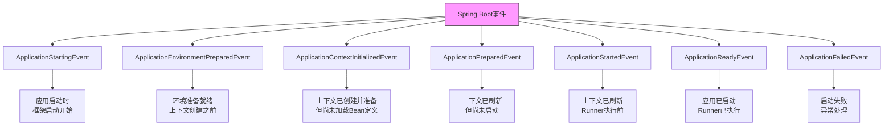

<Tabs>
  <TabItem value="listener" label="事件监听器" default>
  
  Spring Boot支持两种方式注册事件监听器：

  ```java title="ApplicationListener实现"
@Component
  public class MyApplicationStartingListener 
      implements ApplicationListener<ApplicationStartingEvent> {
      
      private static final Logger logger = LoggerFactory.getLogger(MyApplicationStartingListener.class);
    
    @Override
      public void onApplicationEvent(ApplicationStartingEvent event) {
          logger.info("应用正在启动...");
          // 在应用启动开始时执行一些操作
      }
  }
  ```
  
  ```java title="@EventListener注解"
  @Component
  public class MyEventListener {
      
      private static final Logger logger = LoggerFactory.getLogger(MyEventListener.class);
      
      @EventListener
      public void handleApplicationReady(ApplicationReadyEvent event) {
          logger.info("应用已准备就绪！");
          // 应用准备就绪时执行一些操作
      }
      
      @EventListener
      public void handleContextRefreshed(ContextRefreshedEvent event) {
          logger.info("上下文已刷新！");
          // 上下文刷新时执行一些操作
      }
  }
  ```
  
  :::caution 注意事项
  对于在Spring上下文创建之前触发的事件（如`ApplicationStartingEvent`），监听器不能通过`@Component`注册，必须通过`META-INF/spring.factories`文件或在`SpringApplication.addListeners()`方法中显式添加。
  :::
  
  ```properties title="META-INF/spring.factories"
  # 注册早期事件监听器
  org.springframework.context.ApplicationListener=\
  com.example.MyApplicationStartingListener,\
  com.example.MyEnvironmentPreparedListener
  ```
  </TabItem>
  
  <TabItem value="runners" label="运行器">
  
  Spring Boot提供了两种类型的运行器接口，用于在应用上下文刷新后、应用完全启动前执行代码：
  
  ```java title="CommandLineRunner示例"
@Component
  @Order(1)  // 较低的数值意味着更高的优先级
  public class MyCommandLineRunner implements CommandLineRunner {
      
      private final Logger logger = LoggerFactory.getLogger(getClass());
    
    @Override
      public void run(String... args) throws Exception {
          logger.info("在应用启动时执行，命令行参数：{}", Arrays.toString(args));
          // 初始化操作...
      }
  }
  ```
  
  ```java title="ApplicationRunner示例"
@Component
  @Order(2)
  public class MyApplicationRunner implements ApplicationRunner {
      
      private final Logger logger = LoggerFactory.getLogger(getClass());
    
    @Override
      public void run(ApplicationArguments args) throws Exception {
          logger.info("在应用启动时执行");
          logger.info("选项参数: {}", args.getOptionNames());
          logger.info("非选项参数: {}", args.getNonOptionArgs());
          // 初始化操作...
    }
}
```

  <div className="card">
  <div className="card__header">
  <h4>Runner对比</h4>
  </div>
  <div className="card__body">
  
  | 特性 | CommandLineRunner | ApplicationRunner |
  |------|------------------|-------------------|
  | **参数类型** | 原始字符串数组 | ApplicationArguments接口 |
  | **参数处理** | 需要手动解析 | 已经解析好的参数 |
  | **执行顺序** | @Order控制 | @Order控制 |
  | **适用场景** | 简单参数处理 | 复杂参数处理 |
  
  </div>
  </div>
  </TabItem>
</Tabs>

### 4.3 嵌入式容器启动

对于Web应用，Spring Boot会在启动过程中自动配置和启动嵌入式Web服务器。

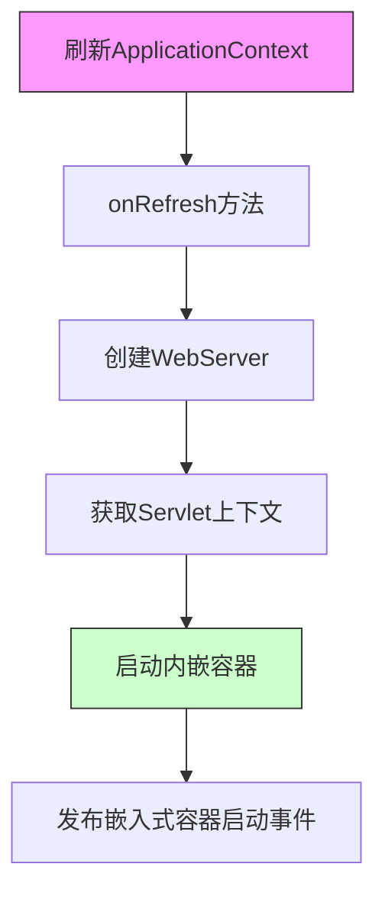

```java title="内嵌容器启动过程"
// ServletWebServerApplicationContext类中的createWebServer方法
private void createWebServer() {
    WebServer webServer = this.webServer;
    ServletContext servletContext = getServletContext();
    
    if (webServer == null && servletContext == null) {
        // 获取ServletWebServerFactory
        ServletWebServerFactory factory = getWebServerFactory();
        
        // 创建WebServer
        this.webServer = factory.getWebServer(getSelfInitializer());
        
        // 注册特殊的Bean
        getBeanFactory().registerSingleton("webServerGracefulShutdown",
                new WebServerGracefulShutdownLifecycle(this.webServer));
        getBeanFactory().registerSingleton("webServerStartStop",
                new WebServerStartStopLifecycle(this, this.webServer));
    }
    else if (servletContext != null) {
        try {
            getSelfInitializer().onStartup(servletContext);
        }
        catch (ServletException ex) {
            throw new ApplicationContextException("Cannot initialize servlet context", ex);
        }
    }
    
    // 初始化属性源
    initPropertySources();
}
```

### 4.4 自动配置的处理

在Spring Boot启动过程中，自动配置是一个重要的环节，它发生在ApplicationContext刷新阶段。

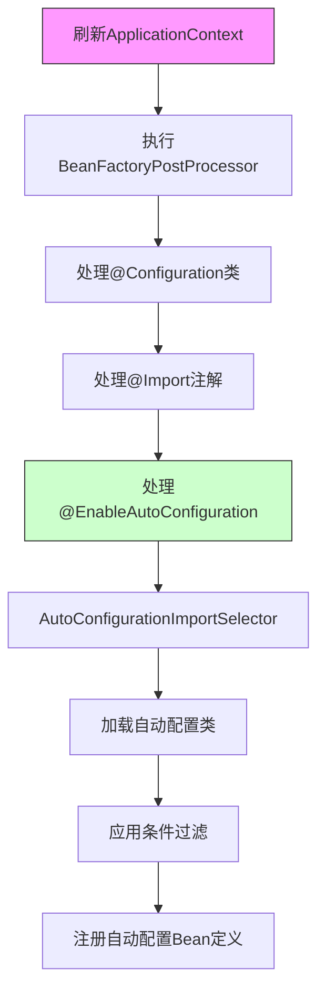

自动配置的核心过程：

1. 在应用上下文刷新阶段，处理配置类上的`@Import`注解
2. 检测到`@EnableAutoConfiguration`注解，调用`AutoConfigurationImportSelector`
3. `AutoConfigurationImportSelector`从`META-INF/spring.factories`中加载自动配置类
4. 对这些自动配置类应用条件过滤（`@ConditionalOnXXX`）
5. 将筛选后的自动配置类注册为Bean定义
6. 在Bean初始化阶段创建和配置这些Bean

## 5. 起步依赖

Spring Boot的起步依赖是一组精心设计的依赖描述符，用于简化依赖管理。

:::tip 核心概念
📦 **起步依赖**：Spring Boot的起步依赖是一种特殊的Maven依赖，它可以传递引入所有需要的依赖项，简化项目的依赖管理，保证依赖版本的兼容性。
:::

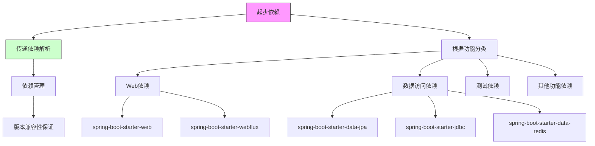

### 5.1 起步依赖原理

Spring Boot起步依赖的核心原理是通过Maven的依赖传递机制，将一组相关的依赖聚合在一起，形成针对特定功能的依赖集合。

<div className="card">
<div className="card__header">
<h4>起步依赖的工作原理</h4>
</div>
<div className="card__body">

1. **依赖聚合**：将一组相关的依赖项聚合在一个POM文件中
2. **依赖传递**：通过Maven的依赖传递机制，将所有必要的依赖项引入项目
3. **版本管理**：通过`spring-boot-dependencies`统一管理所有依赖项的版本
4. **自动配置**：与自动配置机制结合，根据依赖自动配置应用

</div>
</div>

```xml title="Spring Boot依赖管理示例"
<dependency>
    <groupId>org.springframework.boot</groupId>
    <artifactId>spring-boot-starter-parent</artifactId>
    <version>2.7.0</version>
    <type>pom</type>
    <scope>import</scope>
</dependency>
```

```xml title="spring-boot-starter-web依赖结构"
<dependency>
    <groupId>org.springframework.boot</groupId>
    <artifactId>spring-boot-starter-web</artifactId>
</dependency>

<!-- 这个依赖会传递性地引入以下依赖 -->
<!-- spring-boot-starter（核心启动器） -->
<!-- spring-boot-starter-json（JSON支持） -->
<!-- spring-boot-starter-tomcat（Tomcat服务器） -->
<!-- spring-web（Spring Web核心） -->
<!-- spring-webmvc（Spring MVC） -->
<!-- ... 以及其他传递性依赖 -->
```

### 5.2 常用起步依赖

Spring Boot提供了许多常用的起步依赖，涵盖了不同的应用场景和功能。

<Tabs>
  <TabItem value="web" label="Web应用" default>
  
  ```xml title="Web应用起步依赖"
  <!-- Spring MVC Web应用 -->
<dependency>
    <groupId>org.springframework.boot</groupId>
      <artifactId>spring-boot-starter-web</artifactId>
</dependency>

  <!-- 响应式Web应用 -->
  <dependency>
      <groupId>org.springframework.boot</groupId>
      <artifactId>spring-boot-starter-webflux</artifactId>
  </dependency>
  
  <!-- WebSocket支持 -->
  <dependency>
      <groupId>org.springframework.boot</groupId>
      <artifactId>spring-boot-starter-websocket</artifactId>
  </dependency>
  
  <!-- 安全支持 -->
<dependency>
    <groupId>org.springframework.boot</groupId>
    <artifactId>spring-boot-starter-security</artifactId>
</dependency>
```

  <div className="card">
  <div className="card__header">
  <h4>Web起步依赖特点</h4>
  </div>
  <div className="card__body">
  
  **spring-boot-starter-web**包含：
  - Spring MVC
  - 内嵌Tomcat服务器
  - Jackson JSON处理
  - 验证框架
  - 日志和监控
  
  **spring-boot-starter-webflux**包含：
  - Spring WebFlux（响应式Web框架）
  - Netty或Undertow服务器
  - Reactive Streams支持
  
  **spring-boot-starter-security**包含：
  - Spring Security
  - 认证和授权支持
  - 安全过滤器链
  
  </div>
  </div>
  </TabItem>
  
  <TabItem value="data" label="数据访问">
  
  ```xml title="数据访问起步依赖"
  <!-- JPA数据访问 -->
        <dependency>
            <groupId>org.springframework.boot</groupId>
      <artifactId>spring-boot-starter-data-jpa</artifactId>
        </dependency>

  <!-- JDBC数据访问 -->
    <dependency>
        <groupId>org.springframework.boot</groupId>
      <artifactId>spring-boot-starter-jdbc</artifactId>
    </dependency>
    
  <!-- MongoDB数据访问 -->
  <dependency>
      <groupId>org.springframework.boot</groupId>
      <artifactId>spring-boot-starter-data-mongodb</artifactId>
  </dependency>
  
  <!-- Redis数据访问 -->
  <dependency>
      <groupId>org.springframework.boot</groupId>
      <artifactId>spring-boot-starter-data-redis</artifactId>
  </dependency>
  
  <!-- ElasticSearch数据访问 -->
  <dependency>
      <groupId>org.springframework.boot</groupId>
      <artifactId>spring-boot-starter-data-elasticsearch</artifactId>
  </dependency>
  ```
  
  <div className="card">
  <div className="card__header">
  <h4>数据访问依赖特点</h4>
  </div>
  <div className="card__body">
  
  **spring-boot-starter-data-jpa**包含：
  - Hibernate
  - Spring Data JPA
  - 事务管理
  - 连接池（默认HikariCP）
  
  **spring-boot-starter-jdbc**包含：
  - 基本JDBC支持
  - 事务管理
  - 连接池
  
  **spring-boot-starter-data-redis**包含：
  - Lettuce或Jedis客户端
  - Spring Data Redis
  - 连接池管理
  
  </div>
  </div>
  </TabItem>
  
  <TabItem value="test" label="测试支持">
  
  ```xml title="测试起步依赖"
  <dependency>
      <groupId>org.springframework.boot</groupId>
      <artifactId>spring-boot-starter-test</artifactId>
      <scope>test</scope>
  </dependency>
  ```
  
  <div className="card">
  <div className="card__header">
  <h4>测试起步依赖内容</h4>
  </div>
  <div className="card__body">
  
  **spring-boot-starter-test**包含：
  - JUnit 5
  - Spring Test
  - AssertJ
  - Hamcrest
  - Mockito
  - JSONassert
  - JsonPath
  
  提供全面的测试支持，包括：
  - 单元测试
  - 集成测试
  - Spring MVC测试
  - JSON测试
  - 模拟对象
  
  </div>
  </div>
  </TabItem>
  
  <TabItem value="others" label="其他起步依赖">
  
  ```xml title="其他常用起步依赖"
  <!-- 监控和管理 -->
  <dependency>
      <groupId>org.springframework.boot</groupId>
      <artifactId>spring-boot-starter-actuator</artifactId>
  </dependency>
  
  <!-- AOP支持 -->
  <dependency>
      <groupId>org.springframework.boot</groupId>
      <artifactId>spring-boot-starter-aop</artifactId>
  </dependency>
  
  <!-- 缓存支持 -->
  <dependency>
      <groupId>org.springframework.boot</groupId>
      <artifactId>spring-boot-starter-cache</artifactId>
  </dependency>
  
  <!-- 邮件发送 -->
  <dependency>
      <groupId>org.springframework.boot</groupId>
      <artifactId>spring-boot-starter-mail</artifactId>
  </dependency>
  
  <!-- 消息队列 -->
  <dependency>
      <groupId>org.springframework.boot</groupId>
      <artifactId>spring-boot-starter-amqp</artifactId>
  </dependency>
  ```
  
  <div className="card">
  <div className="card__header">
  <h4>常用起步依赖表</h4>
  </div>
  <div className="card__body">
  
  | 起步依赖 | 主要功能 | 主要组件 |
  |---------|---------|---------|
  | spring-boot-starter | 核心依赖 | 自动配置、日志、YAML |
  | spring-boot-starter-web | Web应用 | Spring MVC、Tomcat |
  | spring-boot-starter-data-jpa | JPA数据访问 | Hibernate、Spring Data JPA |
  | spring-boot-starter-security | 安全框架 | Spring Security |
  | spring-boot-starter-test | 测试支持 | JUnit、Mockito、Spring Test |
  | spring-boot-starter-actuator | 监控管理 | Actuator端点、Micrometer |
  | spring-boot-starter-aop | 面向切面编程 | Spring AOP、AspectJ |
  | spring-boot-starter-webflux | 响应式编程 | Spring WebFlux、Reactor |
  
  </div>
  </div>
  </TabItem>
</Tabs>

### 5.3 自定义起步依赖

在实际项目中，你可能需要创建自己的起步依赖，以统一项目或团队的依赖管理。

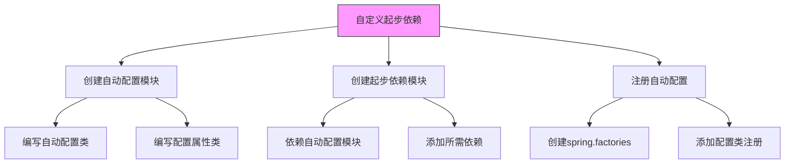

<Tabs>
  <TabItem value="autoconfigure" label="自动配置模块" default>
  
  ```xml title="自动配置模块POM"
  <project>
      <modelVersion>4.0.0</modelVersion>
      <groupId>com.example</groupId>
      <artifactId>example-spring-boot-autoconfigure</artifactId>
      <version>1.0.0</version>
      <name>Example Spring Boot Autoconfigure</name>
      
      <dependencies>
    <dependency>
        <groupId>org.springframework.boot</groupId>
        <artifactId>spring-boot-autoconfigure</artifactId>
    </dependency>
    
          <!-- 可选依赖，用于配置属性处理 -->
    <dependency>
        <groupId>org.springframework.boot</groupId>
        <artifactId>spring-boot-configuration-processor</artifactId>
        <optional>true</optional>
    </dependency>
          
          <!-- 核心功能依赖 -->
          <dependency>
              <groupId>com.example</groupId>
              <artifactId>example-library</artifactId>
              <version>1.0.0</version>
          </dependency>
</dependencies>
  </project>
  ```
  
  ```java title="配置属性类"
  @ConfigurationProperties(prefix = "example")
  public class ExampleProperties {
      
      /**
       * 是否启用该功能
       */
      private boolean enabled = true;
      
      /**
       * API基础URL
       */
      private String baseUrl = "https://api.example.com";
      
      /**
       * 连接超时时间（毫秒）
       */
      private int timeout = 3000;
      
      // getter和setter方法
  }
  ```
  
  ```java title="自动配置类"
  @Configuration
  @ConditionalOnClass(ExampleService.class)
  @EnableConfigurationProperties(ExampleProperties.class)
  public class ExampleAutoConfiguration {
      
      private final ExampleProperties properties;
      
      public ExampleAutoConfiguration(ExampleProperties properties) {
          this.properties = properties;
      }
      
      @Bean
      @ConditionalOnMissingBean
      @ConditionalOnProperty(prefix = "example", name = "enabled", havingValue = "true", matchIfMissing = true)
      public ExampleService exampleService() {
          ExampleService service = new ExampleService();
          service.setBaseUrl(properties.getBaseUrl());
          service.setTimeout(properties.getTimeout());
          return service;
      }
      
      @Bean
      @ConditionalOnMissingBean
      @ConditionalOnBean(ExampleService.class)
      public ExampleClient exampleClient(ExampleService service) {
          return new ExampleClient(service);
      }
  }
  ```
  </TabItem>
  
  <TabItem value="starter" label="起步依赖模块">
  
  ```xml title="起步依赖模块POM"
  <project>
      <modelVersion>4.0.0</modelVersion>
      <groupId>com.example</groupId>
      <artifactId>example-spring-boot-starter</artifactId>
      <version>1.0.0</version>
      <name>Example Spring Boot Starter</name>
      
      <dependencies>
          <!-- 依赖自动配置模块 -->
          <dependency>
              <groupId>com.example</groupId>
              <artifactId>example-spring-boot-autoconfigure</artifactId>
              <version>1.0.0</version>
          </dependency>
          
          <!-- 其他必要的依赖 -->
          <dependency>
              <groupId>com.example</groupId>
              <artifactId>example-library</artifactId>
              <version>1.0.0</version>
          </dependency>
          
          <!-- 可能需要的其他依赖 -->
          <dependency>
              <groupId>org.apache.commons</groupId>
              <artifactId>commons-lang3</artifactId>
          </dependency>
      </dependencies>
  </project>
  ```
  </TabItem>
  
  <TabItem value="register" label="注册自动配置">
  
  ```properties title="META-INF/spring.factories"
  # Auto Configure
  org.springframework.boot.autoconfigure.EnableAutoConfiguration=\
  com.example.ExampleAutoConfiguration
  ```
  
  ```properties title="META-INF/spring-configuration-metadata.json"
  {
    "groups": [
      {
        "name": "example",
        "type": "com.example.ExampleProperties",
        "sourceType": "com.example.ExampleProperties"
      }
    ],
    "properties": [
      {
        "name": "example.enabled",
        "type": "java.lang.Boolean",
        "description": "是否启用该功能",
        "sourceType": "com.example.ExampleProperties",
        "defaultValue": true
      },
      {
        "name": "example.base-url",
        "type": "java.lang.String",
        "description": "API基础URL",
        "sourceType": "com.example.ExampleProperties",
        "defaultValue": "https://api.example.com"
      },
      {
        "name": "example.timeout",
        "type": "java.lang.Integer",
        "description": "连接超时时间（毫秒）",
        "sourceType": "com.example.ExampleProperties",
        "defaultValue": 3000
      }
    ]
  }
  ```
  </TabItem>
  
  <TabItem value="usage" label="使用自定义起步依赖">
  
  ```xml title="在项目中使用自定义起步依赖"
  <dependencies>
      <!-- 引入自定义起步依赖 -->
      <dependency>
          <groupId>com.example</groupId>
          <artifactId>example-spring-boot-starter</artifactId>
          <version>1.0.0</version>
      </dependency>
  </dependencies>
  ```
  
  ```yaml title="配置自定义属性"
  # 在application.yml中配置
  example:
    enabled: true
    base-url: https://api.mycompany.com/v1
    timeout: 5000
  ```
  
  ```java title="使用自动配置的Bean"
  @Service
  public class MyService {
      
      private final ExampleClient exampleClient;
      
      public MyService(ExampleClient exampleClient) {
          this.exampleClient = exampleClient;
      }
      
      public void doSomething() {
          // 使用自动配置的客户端
          exampleClient.callApi();
      }
  }
  ```
  </TabItem>
</Tabs>

:::caution 自定义起步依赖最佳实践
创建自定义起步依赖时，应遵循以下最佳实践：
1. 分离自动配置模块和起步依赖模块，使得用户可以选择性使用自动配置
2. 使用条件注解避免强制配置，允许用户覆盖默认配置
3. 提供配置属性类，允许用户通过配置文件自定义行为
4. 生成元数据，提供良好的IDE支持
5. 遵循命名约定：`xxx-spring-boot-autoconfigure`和`xxx-spring-boot-starter`
6. 不要将`spring-boot-starter-*`作为依赖的名称（避免与官方起步依赖混淆）
:::

## 6. 监控与管理

Spring Boot Actuator是Spring Boot的一个子项目，提供了生产就绪特性，帮助你监控和管理应用。

:::tip 核心概念
📊 **Actuator**：Spring Boot Actuator提供了监控和管理Spring Boot应用程序的生产就绪功能，包括健康检查、指标收集、环境信息和HTTP跟踪等。
:::

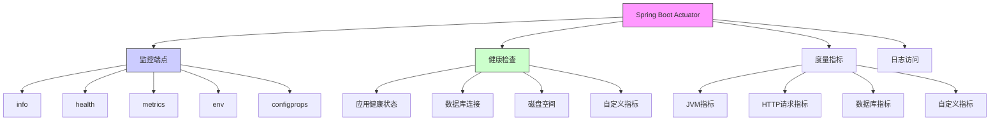

### 6.1 Actuator基础配置

Spring Boot Actuator提供了一系列的HTTP端点，可以用来监控和管理应用程序。

<Tabs>
  <TabItem value="dependency" label="基础配置" default>

```xml title="Actuator依赖"
<dependency>
    <groupId>org.springframework.boot</groupId>
    <artifactId>spring-boot-starter-actuator</artifactId>
</dependency>
```

  ```yaml title="基础配置"
management:
  endpoints:
    web:
      exposure:
          # 暴露所有端点
          include: "*"
          # 排除敏感端点
          exclude: "env,beans"
  endpoint:
    health:
      show-details: always
      shutdown:
      enabled: true
    info:
      env:
        enabled: true
```

  <div className="card">
  <div className="card__header">
  <h4>Actuator端点访问</h4>
  </div>
  <div className="card__body">
  
  默认情况下，所有端点都通过HTTP暴露在`/actuator`路径下：
  
  - `/actuator/health` - 应用健康状态
  - `/actuator/info` - 应用信息
  - `/actuator/metrics` - 应用指标
  - `/actuator/env` - 环境变量
  - `/actuator/mappings` - 请求映射
  - `/actuator/beans` - 应用中的所有Bean
  - `/actuator/configprops` - 配置属性
  - `/actuator/loggers` - 日志级别管理
  
  </div>
  </div>
  </TabItem>
  
  <TabItem value="security" label="安全配置">
  
  Actuator端点包含敏感信息，在生产环境中应该进行安全保护：
  
  ```xml title="添加安全依赖"
  <dependency>
      <groupId>org.springframework.boot</groupId>
      <artifactId>spring-boot-starter-security</artifactId>
  </dependency>
  ```
  
  ```java title="Actuator安全配置"
  @Configuration
  public class ActuatorSecurityConfig extends WebSecurityConfigurerAdapter {
      
      @Override
      protected void configure(HttpSecurity http) throws Exception {
          http
              .csrf().disable()
              .authorizeRequests()
                  // 允许所有人访问健康检查和信息
                  .antMatchers("/actuator/health", "/actuator/info").permitAll()
                  // 其他Actuator端点需要ADMIN角色
                  .antMatchers("/actuator/**").hasRole("ADMIN")
                  .anyRequest().authenticated()
              .and()
              .httpBasic();
      }
  }
  ```
  
  ```yaml title="安全配置"
  spring:
    security:
      user:
        name: admin
        password: secret
        roles: ADMIN
  ```
  </TabItem>
  
  <TabItem value="custom-info" label="自定义信息">
  
  你可以通过多种方式自定义应用信息：
  
  ```yaml title="应用信息配置"
  info:
    app:
      name: "My Spring Boot App"
      description: "A sample Spring Boot application"
      version: "1.0.0"
    java:
      version: "${java.version}"
    spring:
      framework:
        version: "${spring-framework.version}"
      boot:
        version: "${spring-boot.version}"
    build:
      artifact: "@project.artifactId@"
      name: "@project.name@"
      description: "@project.description@"
      version: "@project.version@"
  ```
  
  ```java title="自定义Info Contributor"
  @Component
  public class CustomInfoContributor implements InfoContributor {
      
      @Override
      public void contribute(Info.Builder builder) {
          Map<String, Object> details = new HashMap<>();
          details.put("serverTime", new Date());
          details.put("serverIp", getServerIp());
          details.put("activeProfiles", getActiveProfiles());
          
          builder.withDetail("serverInfo", details);
      }
      
      // 实现细节...
  }
  ```
  </TabItem>
</Tabs>

### 6.2 健康检查

健康检查是Actuator的核心功能，用于监控应用及其依赖的状态。

```java title="自定义健康检查"
@Component
public class CustomHealthIndicator implements HealthIndicator {
    
    @Override
    public Health health() {
        boolean isHealthy = checkHealth(); // 自定义健康检查逻辑
        
        if (isHealthy) {
            return Health.up()
                .withDetail("message", "服务运行正常")
                .withDetail("timestamp", System.currentTimeMillis())
                .build();
        } else {
            return Health.down()
                .withDetail("message", "服务异常")
                .withDetail("timestamp", System.currentTimeMillis())
                .withDetail("error", "具体错误信息")
                .build();
        }
    }
    
    private boolean checkHealth() {
        // 实现健康检查逻辑
        try {
            // 检查关键服务是否可用
            // 例如：数据库连接、缓存连接、外部服务调用等
            return true;
        } catch (Exception e) {
            return false;
        }
    }
}
```

### 6.3 度量指标

Spring Boot 2.x引入了Micrometer作为应用指标门面，支持多种监控系统，如Prometheus、InfluxDB、New Relic等。

<Tabs>
  <TabItem value="micrometer" label="Micrometer基础" default>
  
  ```xml title="添加Prometheus支持"
  <dependency>
      <groupId>io.micrometer</groupId>
      <artifactId>micrometer-registry-prometheus</artifactId>
  </dependency>
  ```
  
  ```yaml title="Prometheus配置"
  management:
    endpoints:
      web:
        exposure:
          include: prometheus
    metrics:
      export:
        prometheus:
          enabled: true
  ```
  
  ```yaml title="prometheus.yml配置"
  scrape_configs:
    - job_name: 'spring-boot-app'
      scrape_interval: 5s
      metrics_path: '/actuator/prometheus'
      static_configs:
        - targets: ['localhost:8080']
  ```
  </TabItem>
  
  <TabItem value="custom-metrics" label="自定义指标">
  
  ```java title="自定义计数器指标"
  @Service
  public class OrderService {
      
      private final Counter orderCounter;
      private final DistributionSummary orderSummary;
      
      public OrderService(MeterRegistry registry) {
          this.orderCounter = registry.counter("app.orders.created");
          this.orderSummary = registry.summary("app.orders.amount");
      }
      
      public void createOrder(Order order) {
          // 处理订单逻辑
          
          // 增加订单计数
          orderCounter.increment();
          
          // 记录订单金额
          orderSummary.record(order.getAmount());
      }
  }
  ```
  
  ```java title="自定义计时器指标"
  @Service
  public class ProductService {
      
      private final Timer searchTimer;
      
      public ProductService(MeterRegistry registry) {
          this.searchTimer = registry.timer("app.product.search");
      }
      
      public List<Product> searchProducts(String keyword) {
          // 使用计时器记录方法执行时间
          return searchTimer.record(() -> {
              // 执行产品搜索逻辑
              return findProductsByKeyword(keyword);
          });
      }
      
      // 也可以使用Timer.Sample手动控制
      public List<Product> listProducts() {
          Timer.Sample sample = Timer.start(registry);
          try {
              // 执行获取产品列表逻辑
              return getAllProducts();
          } finally {
              sample.stop(registry.timer("app.product.list"));
          }
    }
}
```
  </TabItem>

  <TabItem value="aspect-metrics" label="切面指标">

  ```java title="方法执行指标切面"
@Aspect
@Component
  public class TimedAspect {
      
      private final MeterRegistry registry;
      
      public TimedAspect(MeterRegistry registry) {
          this.registry = registry;
      }
      
      @Around("@annotation(timed)")
      public Object timeMethod(ProceedingJoinPoint joinPoint, Timed timed) throws Throwable {
          String metricName = timed.value().isEmpty() 
              ? joinPoint.getSignature().toShortString() 
              : timed.value();
              
          Timer.Sample sample = Timer.start(registry);
          try {
              return joinPoint.proceed();
          } finally {
              sample.stop(Timer.builder(metricName)
                  .description(timed.description())
                  .tags(timed.extraTags())
                  .register(registry));
          }
      }
  }
  
  @Target({ElementType.METHOD})
  @Retention(RetentionPolicy.RUNTIME)
  public @interface Timed {
      String value() default "";
      String description() default "";
      String[] extraTags() default {};
  }
  ```
  
  ```java title="使用自定义注解"
  @Service
  public class ReportService {
      
      @Timed(value = "app.report.generation", description = "Report generation time")
      public byte[] generateReport(ReportRequest request) {
          // 生成报表逻辑
          return reportData;
      }
  }
  ```
  </TabItem>
</Tabs>

### 6.4 自定义端点

你可以创建自己的Actuator端点来暴露特定于应用的信息或操作。

```java title="自定义Actuator端点"
@Component
@Endpoint(id = "application-status")
public class ApplicationStatusEndpoint {
    
    private final StatusService statusService;
    
    public ApplicationStatusEndpoint(StatusService statusService) {
        this.statusService = statusService;
    }
    
    @ReadOperation
    public Map<String, Object> status() {
        Map<String, Object> status = new HashMap<>();
        status.put("status", statusService.getStatus());
        status.put("uptime", statusService.getUptime());
        status.put("startTime", statusService.getStartTime());
        status.put("activeSessions", statusService.getActiveSessions());
        status.put("systemLoad", statusService.getSystemLoad());
        return status;
    }
    
    @WriteOperation
    public Map<String, String> updateStatus(@Selector String action) {
        Map<String, String> result = new HashMap<>();
        switch (action) {
            case "pause":
                statusService.pauseProcessing();
                result.put("result", "Processing paused");
                break;
            case "resume":
                statusService.resumeProcessing();
                result.put("result", "Processing resumed");
                break;
            default:
                result.put("error", "Unknown action: " + action);
        }
        return result;
    }
}
```

## 7. 部署与打包

Spring Boot提供了多种灵活的部署选项，从传统的WAR部署到现代的容器化部署。

:::tip 核心概念
📦 **Spring Boot打包**：Spring Boot应用可以打包成可执行的JAR或WAR文件，包含所有依赖和嵌入式服务器，实现"一次构建，到处运行"。
:::

### 7.1 打包选项

<Tabs>
  <TabItem value="jar" label="可执行JAR" default>
  
  ```xml title="Maven打包配置"
<build>
    <plugins>
        <plugin>
            <groupId>org.springframework.boot</groupId>
            <artifactId>spring-boot-maven-plugin</artifactId>
            <configuration>
                <executable>true</executable>
                  <excludes>
                      <exclude>
                          <groupId>org.projectlombok</groupId>
                          <artifactId>lombok</artifactId>
                      </exclude>
                  </excludes>
            </configuration>
        </plugin>
    </plugins>
</build>
```

  ```shell title="打包命令"
  # Maven打包
mvn clean package

  # 运行JAR
java -jar target/myapp-0.0.1-SNAPSHOT.jar
  ```
  
  <div className="card">
  <div className="card__header">
  <h4>可执行JAR特点</h4>
  </div>
  <div className="card__body">
  
  - 包含应用的所有代码和依赖
  - 内置嵌入式Web服务器
  - 无需额外安装Tomcat等容器
  - 可以直接通过`java -jar`命令运行
  - 支持命令行参数配置
  
  </div>
  </div>
  </TabItem>
  
  <TabItem value="war" label="传统WAR">
  
  ```xml title="WAR打包配置"
  <packaging>war</packaging>
  
  <dependencies>
      <!-- 将内嵌Tomcat标记为provided -->
      <dependency>
          <groupId>org.springframework.boot</groupId>
          <artifactId>spring-boot-starter-tomcat</artifactId>
          <scope>provided</scope>
      </dependency>
  </dependencies>
  
  <build>
      <plugins>
          <plugin>
              <groupId>org.springframework.boot</groupId>
              <artifactId>spring-boot-maven-plugin</artifactId>
          </plugin>
      </plugins>
  </build>
  ```
  
  ```java title="配置ServletInitializer"
  public class ServletInitializer extends SpringBootServletInitializer {
      
      @Override
      protected SpringApplicationBuilder configure(SpringApplicationBuilder application) {
          return application.sources(MyApplication.class);
    }
}
```

  <div className="card">
  <div className="card__header">
  <h4>WAR特点</h4>
  </div>
  <div className="card__body">
  
  - 可以部署到外部Servlet容器（如Tomcat、JBoss）
  - 适合传统Java EE环境
  - 可以与其他WAR应用共享同一个容器
  - 可以利用外部容器的高级功能
  
  </div>
  </div>
  </TabItem>
  
  <TabItem value="docker" label="Docker容器">
  
  ```dockerfile title="Dockerfile"
  FROM openjdk:11-jre-slim
  
  WORKDIR /app
  
  COPY target/*.jar app.jar
  
  # JVM调优参数
  ENV JAVA_OPTS="-Xmx512m -Xms256m"
  
  # 定义变量，方便运行时覆盖
  ENV SPRING_PROFILES_ACTIVE=prod
  ENV SERVER_PORT=8080
  
  EXPOSE $SERVER_PORT
  
  # 启动命令
  ENTRYPOINT ["sh", "-c", "java $JAVA_OPTS -jar app.jar --spring.profiles.active=$SPRING_PROFILES_ACTIVE --server.port=$SERVER_PORT"]
  ```
  
  ```shell title="Docker命令"
  # 构建镜像
  docker build -t myapp:latest .
  
  # 运行容器
  docker run -p 8080:8080 -e "SPRING_PROFILES_ACTIVE=prod" myapp:latest
  ```
  
  ```yaml title="docker-compose.yml"
  version: '3'
  services:
    app:
      image: myapp:latest
      ports:
        - "8080:8080"
      environment:
        - SPRING_PROFILES_ACTIVE=prod
        - SERVER_PORT=8080
      depends_on:
        - db
      networks:
        - app-network
    
    db:
      image: mysql:8.0
      ports:
        - "3306:3306"
      environment:
        - MYSQL_ROOT_PASSWORD=root
        - MYSQL_DATABASE=myapp
      volumes:
        - mysql-data:/var/lib/mysql
      networks:
        - app-network
  
  volumes:
    mysql-data:
  
  networks:
    app-network:
  ```
  </TabItem>
</Tabs>

### 7.2 部署方式

Spring Boot应用支持多种部署方式，从传统到云原生：

<div className="card">
<div className="card__header">
<h4>部署方式比较</h4>
</div>
<div className="card__body">

| 部署方式 | 优点 | 缺点 | 适用场景 |
|---------|------|------|----------|
| **独立JAR部署** | 简单、自包含 | 资源隔离弱 | 简单应用、开发环境 |
| **传统服务器部署** | 利用服务器高级特性 | 配置复杂 | 传统企业环境 |
| **Docker容器化** | 环境一致性、隔离性好 | 需要容器运行环境 | 微服务、DevOps环境 |
| **Kubernetes编排** | 高可用、自动伸缩 | 复杂度高 | 大规模微服务集群 |
| **云平台PaaS** | 低运维成本 | 供应商锁定 | 初创企业、中小规模应用 |

</div>
</div>

### 7.3 生产环境最佳实践

在将Spring Boot应用部署到生产环境时，应遵循以下最佳实践：

<Tabs>
  <TabItem value="config" label="配置管理" default>
  
  ```yaml title="环境特定配置"
  # 通过环境变量注入关键配置
  spring:
    datasource:
      url: jdbc:mysql://${DB_HOST:localhost}:${DB_PORT:3306}/${DB_NAME:myapp}
      username: ${DB_USER:root}
      password: ${DB_PASSWORD:secret}
  ```
  
  ```shell title="生产环境启动"
  # 使用外部配置文件
  java -jar app.jar --spring.config.location=file:///path/to/production.yml
  
  # 指定活动profile
  java -jar app.jar --spring.profiles.active=prod
  
  # 覆盖特定配置
  java -jar app.jar --server.port=9000 --logging.level.root=WARN
  ```
  
  :::tip 配置管理最佳实践
  - 使用环境变量注入敏感信息
  - 避免在代码中硬编码配置
  - 使用配置服务器集中管理配置
  - 使用多环境profile分离配置
  - 使用密文存储敏感信息
  :::
  </TabItem>
  
  <TabItem value="logging" label="日志管理">
  
  ```yaml title="日志配置"
  logging:
    file:
      name: /var/log/myapp.log
      max-size: 10MB
      max-history: 7
    level:
      root: WARN
      org.springframework: WARN
      com.example.myapp: INFO
    pattern:
      file: "%d{yyyy-MM-dd HH:mm:ss} [%thread] %-5level %logger{36} - %msg%n"
  ```
  
  :::tip 日志管理最佳实践
  - 配置适当的日志级别
  - 实施日志轮转
  - 使用结构化日志
  - 集中化日志收集（ELK、Graylog）
  - 包含足够的上下文信息
  - 避免敏感信息泄露
  :::
  </TabItem>
  
  <TabItem value="monitoring" label="监控与告警">
  
  ```yaml title="监控配置"
  # Actuator配置
  management:
    endpoints:
      web:
        exposure:
          include: health,info,metrics,prometheus
    endpoint:
      health:
        show-details: when-authorized
    metrics:
      export:
        prometheus:
          enabled: true
  ```
  
  :::tip 监控最佳实践
  - 实施健康检查
  - 收集关键业务指标
  - 设置适当的告警阈值
  - 监控系统资源（CPU、内存、磁盘）
  - 监控关键业务指标
  - 可视化监控数据（Grafana）
  - 配置通知渠道（邮件、短信、Slack）
  :::
  </TabItem>
</Tabs>

## 8. 总结

Spring Boot通过简化配置、提供默认实现，极大地提高了Spring应用的开发效率，成为现代Java应用开发的标准工具。

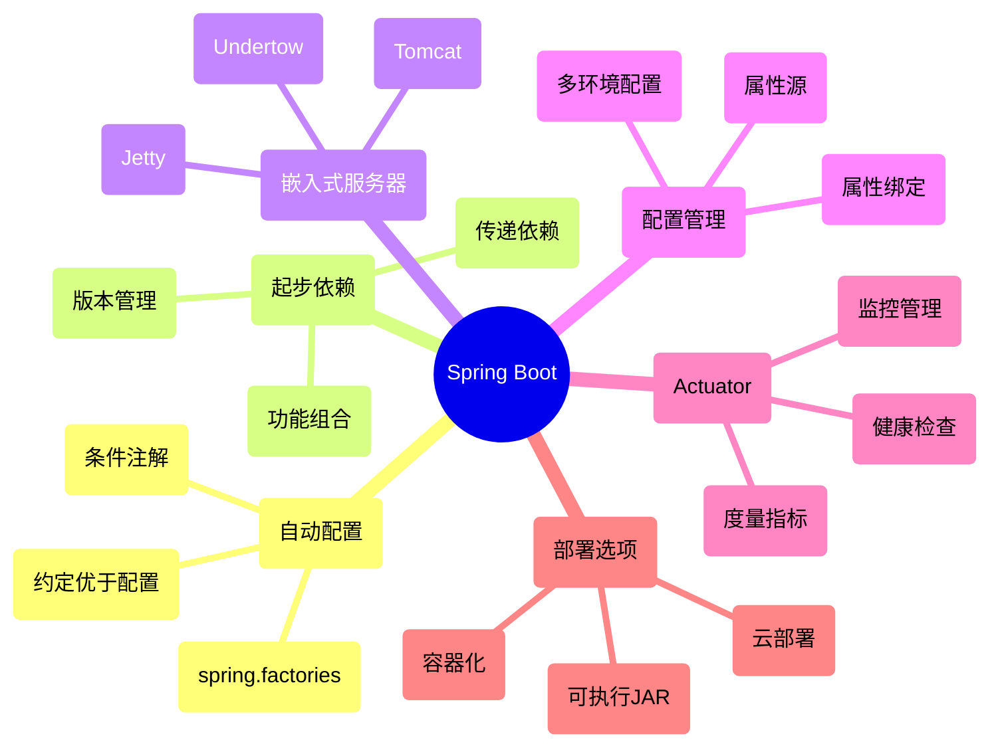

:::tip Spring Boot学习路径
🚀 **Spring Boot学习建议**：
1. 掌握Spring基础知识（IoC、AOP）
2. 理解自动配置和起步依赖的原理
3. 学习配置管理和属性绑定
4. 了解启动流程和生命周期事件
5. 熟悉Actuator监控和管理
6. 掌握不同的部署选项
7. 实践微服务和云原生开发
:::

Spring Boot让开发者能够专注于业务逻辑的开发，而不必过多关注底层框架的配置细节。它与Spring Cloud生态系统的完美结合，更是为微服务架构和云原生应用开发提供了强大的支持。

## 9. 面试题精选

### Q1: 什么是Spring Boot？它有什么优势？
**答:** Spring Boot是Spring框架的扩展，专注于简化Spring应用的初始搭建和开发过程。主要优势包括：
- **自动配置**：减少配置，自动配置大部分组件
- **起步依赖**：简化依赖管理，解决版本兼容性问题
- **内嵌服务器**：内置Tomcat等服务器，无需部署WAR文件
- **Actuator**：提供监控和管理功能
- **无代码生成和XML配置**：减少样板代码
- **独立运行**：可以像普通Java程序一样运行

### Q2: Spring Boot的自动配置原理是什么？
**答:** Spring Boot自动配置基于以下机制：
1. 通过`@EnableAutoConfiguration`注解启用自动配置
2. 该注解通过`@Import`导入`AutoConfigurationImportSelector`类
3. `AutoConfigurationImportSelector`会从所有JAR包中的`META-INF/spring.factories`文件加载`EnableAutoConfiguration`配置项
4. 根据条件注解（`@ConditionalOnClass`, `@ConditionalOnBean`等）判断哪些配置类生效
5. 匹配条件的配置类会被注册为Bean，创建需要的组件

### Q3: Spring Boot常用的核心注解有哪些？
**答:** Spring Boot常用的核心注解：
- `@SpringBootApplication`：包含三个注解（`@Configuration`, `@EnableAutoConfiguration`, `@ComponentScan`）
- `@EnableAutoConfiguration`：启用自动配置
- `@Configuration`：标记配置类
- `@ComponentScan`：组件扫描
- `@ConfigurationProperties`：绑定配置属性
- `@ConditionalOnXXX`：条件化配置（如`@ConditionalOnClass`, `@ConditionalOnBean`, `@ConditionalOnProperty`等）
- `@SpringBootConfiguration`：特定于Spring Boot的配置类
- `@EnableConfigurationProperties`：启用`@ConfigurationProperties`注解

### Q4: Spring Boot如何管理配置文件？配置文件的优先级如何？
**答:** Spring Boot支持多种配置方式，主要有：
- `application.properties`或`application.yml`文件
- 特定环境的配置文件（如`application-dev.yml`）
- 环境变量
- 命令行参数

配置优先级从高到低：
1. 命令行参数
2. Java系统属性（`System.getProperties()`）
3. 操作系统环境变量
4. `application-{profile}.properties`（外部配置）
5. `application.properties`（外部配置）
6. `application-{profile}.properties`（内部配置）
7. `application.properties`（内部配置）
8. `@PropertySource`注解引入的属性
9. 默认属性

### Q5: 如何理解Spring Boot的起步依赖（Starter）？
**答:** Spring Boot起步依赖是一种特殊的Maven或Gradle依赖，用于简化项目依赖管理：
- 一个起步依赖通常会引入一组功能相关的传递性依赖
- 通过`spring-boot-starter-*`命名，如`spring-boot-starter-web`
- 提供了版本管理，确保依赖组件间的兼容性
- 与自动配置协同工作，自动配置需要的组件
- 减少了手动添加依赖的工作量和版本冲突的风险

### Q6: Spring Boot的启动流程是怎样的？
**答:** Spring Boot启动流程主要包括：
1. 创建`SpringApplication`对象
   - 确定应用类型（SERVLET、REACTIVE、NONE）
   - 设置初始化器和监听器
   - 推断主应用类
2. 运行`SpringApplication`
   - 创建并启动计时器
   - 发布`ApplicationStartingEvent`事件
   - 准备环境并加载配置
   - 创建`ApplicationContext`
   - 准备上下文，加载Bean定义
   - 刷新上下文，实例化单例Bean
   - 发布`ApplicationStartedEvent`事件
   - 调用`ApplicationRunner`和`CommandLineRunner`
   - 发布`ApplicationReadyEvent`事件

### Q7: 如何在Spring Boot中集成自定义配置？
**答:** 在Spring Boot中集成自定义配置有多种方式：
1. 使用`@Value`注解直接注入单个属性
   ```java
   @Value("${custom.property}")
   private String customProperty;
   ```
2. 使用`@ConfigurationProperties`绑定配置到Java类
   ```java
   @Component
   @ConfigurationProperties(prefix = "custom")
   public class CustomProperties {
       private String property;
       // getters and setters
   }
   ```
3. 创建自定义的配置类：
   ```java
   @Configuration
   public class CustomConfiguration {
       @Bean
       public SomeBean someBean() {
           return new SomeBean();
       }
   }
   ```

### Q8: Spring Boot中如何实现安全认证？
**答:** Spring Boot中实现安全认证主要通过Spring Security：
1. 添加依赖：`spring-boot-starter-security`
2. 创建配置类：
   ```java
   @Configuration
   @EnableWebSecurity
   public class SecurityConfig extends WebSecurityConfigurerAdapter {
       
       @Override
       protected void configure(HttpSecurity http) throws Exception {
           http
               .authorizeRequests()
                   .antMatchers("/public/**").permitAll()
                   .anyRequest().authenticated()
                   .and()
               .formLogin()
                   .loginPage("/login")
                   .permitAll()
                   .and()
               .logout()
                   .permitAll();
       }
       
       @Override
       protected void configure(AuthenticationManagerBuilder auth) throws Exception {
           auth.inMemoryAuthentication()
               .withUser("user").password("{noop}password").roles("USER");
       }
   }
   ```
3. 对于生产环境，可以配置JDBC认证、OAuth2、LDAP等认证方式

### Q9: Spring Boot Actuator的作用是什么？有哪些常用端点？
**答:** Spring Boot Actuator提供生产就绪功能，用于监控和管理应用：

**作用：**
- 监控应用健康状态
- 收集应用指标
- 查看应用配置
- 查看环境信息
- 管理日志级别
- 查看线程信息

**常用端点：**
- `/actuator/health`：健康状态
- `/actuator/info`：应用信息
- `/actuator/metrics`：指标收集
- `/actuator/env`：环境变量
- `/actuator/configprops`：配置属性
- `/actuator/mappings`：请求映射
- `/actuator/beans`：应用中的Bean
- `/actuator/loggers`：日志配置

### Q10: 如何自定义Spring Boot的Banner？
**答:** 自定义Spring Boot启动Banner的方法：
1. 在`src/main/resources`目录下创建`banner.txt`文件
2. 使用文本/ASCII艺术设计Banner
3. 也可以通过代码方式设置：
   ```java
   SpringApplication app = new SpringApplication(MyApp.class);
   app.setBannerMode(Banner.Mode.OFF); // 关闭Banner
   // 或者设置自定义Banner
   app.setBanner(new ResourceBanner(new ClassPathResource("path/to/banner.txt")));
   app.run(args);
   ```
4. 可以在配置文件中设置：
   ```properties
   spring.main.banner-mode=off
   # 或者指定文件
   spring.banner.location=classpath:path/to/banner.txt
   ```
