import Tabs from '@theme/Tabs';
import TabItem from '@theme/TabItem';
import TOCInline from '@theme/TOCInline';

# Spring Cloud 详解

Spring Cloud是构建分布式系统和微服务架构的完整解决方案，它基于Spring Boot提供了服务注册发现、配置管理、负载均衡、熔断降级等微服务核心功能。

:::info 本文内容概览
<TOCInline toc={toc} />
:::

:::tip 核心价值
**Spring Cloud = 微服务架构 + 服务治理 + 配置管理 + 负载均衡 + 熔断降级**
- 🔍 **服务治理**：服务注册发现、API网关
- ⚖️ **负载均衡**：智能路由、客户端负载均衡
- 🛡️ **熔断降级**：服务容错、失败隔离
- ⚙️ **配置管理**：集中配置、动态刷新
- 📊 **链路追踪**：分布式系统监控、调用链分析
:::

## 1. Spring Cloud基础概念

### 1.1 什么是微服务？

微服务是一种软件架构风格，将应用程序拆分为一组小型、独立的服务，每个服务运行在自己的进程中，通过轻量级机制进行通信。

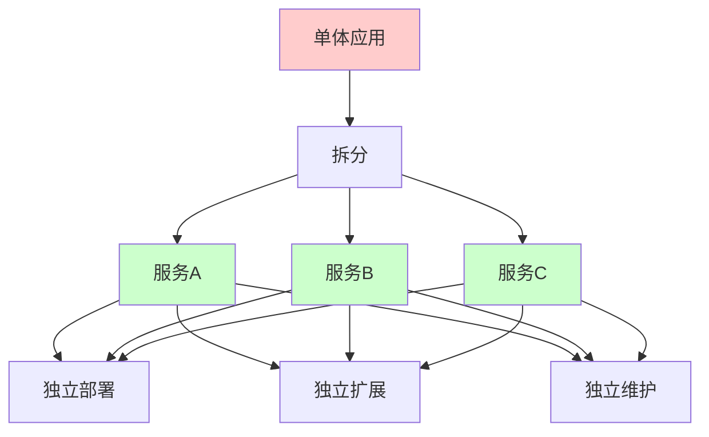

#### 微服务架构特点

<div className="card">
<div className="card__body">

| 特点 | 说明 | 优势 |
|------|------|------|
| **服务拆分** | 按业务功能拆分服务 | 职责单一，易于维护 |
| **独立部署** | 每个服务可独立部署 | 快速迭代，降低风险 |
| **技术异构** | 不同服务可使用不同技术栈 | 技术选型灵活 |
| **数据隔离** | 每个服务管理自己的数据 | 数据一致性可控 |
| **故障隔离** | 单个服务故障不影响整体 | 提高系统可用性 |

</div>
</div>

### 1.2 Spring Cloud组件

Spring Cloud提供了一套完整的微服务解决方案，包含多个组件共同构建分布式系统。

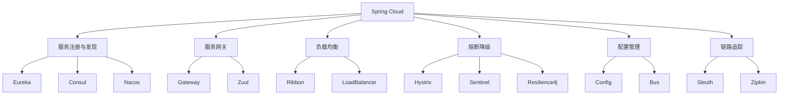

<details>
<summary>Spring Cloud依赖配置</summary>

```xml title="Spring Cloud依赖"
<dependencyManagement>
    <dependencies>
        <dependency>
            <groupId>org.springframework.cloud</groupId>
            <artifactId>spring-cloud-dependencies</artifactId>
            <version>2021.0.8</version>
            <type>pom</type>
            <scope>import</scope>
        </dependency>
    </dependencies>
</dependencyManagement>
```

</details>

## 2. 服务注册与发现

服务注册与发现是微服务架构的基础设施，用于管理和定位服务实例。

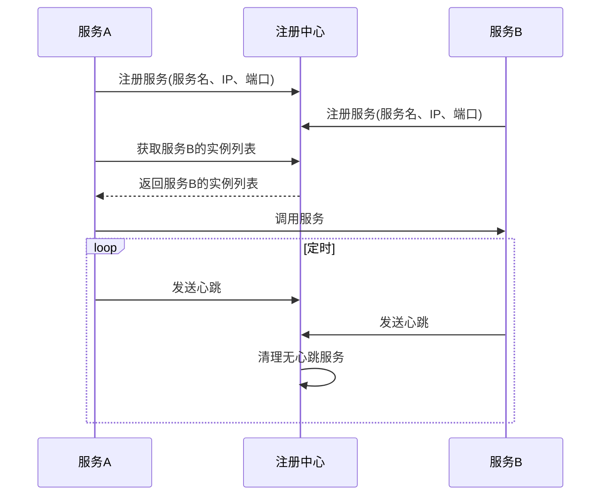

### 2.1 Eureka Server

<Tabs>
  <TabItem value="java" label="Java配置" default>
```java title="Eureka Server配置"
@SpringBootApplication
@EnableEurekaServer
public class EurekaServerApplication {
    public static void main(String[] args) {
        SpringApplication.run(EurekaServerApplication.class, args);
    }
}
```
  </TabItem>
  <TabItem value="yaml" label="YAML配置">
```yaml title="Eureka Server配置"
server:
  port: 8761

spring:
  application:
    name: eureka-server

eureka:
  instance:
    hostname: localhost
  client:
    register-with-eureka: false
    fetch-registry: false
    service-url:
      defaultZone: http://localhost:8761/eureka/
  server:
    enable-self-preservation: false
    eviction-interval-timer-in-ms: 1000
```
  </TabItem>
  <TabItem value="cluster" label="集群配置">
  ```yaml title="Eureka Server集群配置"
  # eureka-server-1 配置
  server:
    port: 8761
  
  spring:
    application:
      name: eureka-server
  
  eureka:
    instance:
      hostname: eureka1
    client:
      register-with-eureka: true
      fetch-registry: true
      service-url:
        defaultZone: http://eureka2:8762/eureka/,http://eureka3:8763/eureka/
        
  # eureka-server-2 配置
  server:
    port: 8762
  
  spring:
    application:
      name: eureka-server
  
  eureka:
    instance:
      hostname: eureka2
    client:
      register-with-eureka: true
      fetch-registry: true
      service-url:
        defaultZone: http://eureka1:8761/eureka/,http://eureka3:8763/eureka/
  ```
  </TabItem>
</Tabs>

### 2.2 Eureka Client

<Tabs>
  <TabItem value="java" label="Java配置" default>
```java title="Eureka Client配置"
@SpringBootApplication
@EnableEurekaClient
public class UserServiceApplication {
    public static void main(String[] args) {
        SpringApplication.run(UserServiceApplication.class, args);
    }
}
```
  </TabItem>
  <TabItem value="yaml" label="YAML配置">
```yaml title="Eureka Client配置"
spring:
  application:
    name: user-service

eureka:
  client:
    service-url:
      defaultZone: http://localhost:8761/eureka/
    register-with-eureka: true
    fetch-registry: true
  instance:
    prefer-ip-address: true
    instance-id: ${spring.application.name}:${server.port}
    lease-renewal-interval-in-seconds: 30
    lease-expiration-duration-in-seconds: 90
```
  </TabItem>
</Tabs>

<div className="card">
<div className="card__header">
<h4>Eureka Client核心配置说明</h4>
</div>
<div className="card__body">

| 配置项 | 说明 | 默认值 | 推荐设置 |
|------|------|--------|---------|
| **register-with-eureka** | 是否注册到Eureka | true | 生产环境保持true |
| **fetch-registry** | 是否从Eureka获取注册信息 | true | 生产环境保持true |
| **prefer-ip-address** | 是否使用IP地址注册 | false | 建议设为true |
| **lease-renewal-interval** | 心跳间隔时间(秒) | 30 | 根据负载调整 |
| **lease-expiration-duration** | 失效时间(秒) | 90 | 通常为心跳间隔的3倍 |

</div>
</div>

### 2.3 服务注册示例

<div className="card">
<div className="card__body">

```java title="服务注册示例"
@RestController
@RequestMapping("/users")
public class UserController {
    
    @Autowired
    private UserService userService;
    
    @GetMapping("/{id}")
    public ResponseEntity<User> getUser(@PathVariable Long id) {
        User user = userService.findById(id);
        return ResponseEntity.ok(user);
    }
    
    @PostMapping
    public ResponseEntity<User> createUser(@RequestBody User user) {
        User savedUser = userService.save(user);
        return ResponseEntity.status(HttpStatus.CREATED).body(savedUser);
    }
}
```

</div>
</div>

## 3. 服务网关

### 3.1 Gateway配置

Spring Cloud Gateway是API网关服务，提供了路由、过滤、限流等功能。

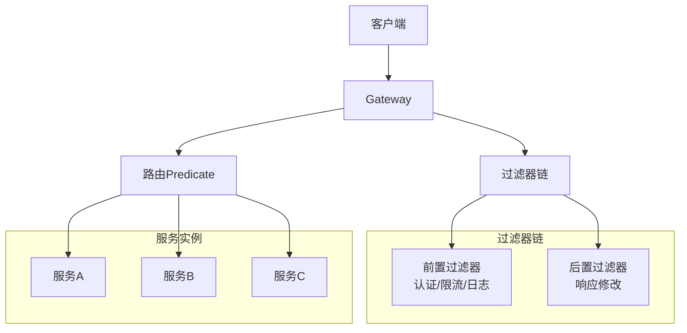

<Tabs>
  <TabItem value="java" label="Java配置" default>
```java title="Gateway配置"
@SpringBootApplication
@EnableDiscoveryClient
public class GatewayApplication {
    public static void main(String[] args) {
        SpringApplication.run(GatewayApplication.class, args);
    }
}
```
  </TabItem>
  <TabItem value="yaml" label="YAML配置">
```yaml title="Gateway路由配置"
spring:
  cloud:
    gateway:
      discovery:
        locator:
          enabled: true
          lower-case-service-id: true
      routes:
        - id: user-service
          uri: lb://user-service
          predicates:
            - Path=/api/users/**
          filters:
            - StripPrefix=1
            - name: RequestRateLimiter
              args:
                redis-rate-limiter.replenishRate: 10
                redis-rate-limiter.burstCapacity: 20
        
        - id: order-service
          uri: lb://order-service
          predicates:
            - Path=/api/orders/**
          filters:
            - StripPrefix=1
            - name: CircuitBreaker
              args:
                name: orderCircuitBreaker
                fallbackUri: forward:/fallback/order
```
  </TabItem>
</Tabs>

### 3.2 自定义过滤器

<div className="card">
<div className="card__body">

```java title="自定义过滤器"
@Component
public class AuthFilter implements GlobalFilter, Ordered {
    
    @Override
    public Mono<Void> filter(ServerWebExchange exchange, GatewayFilterChain chain) {
        ServerHttpRequest request = exchange.getRequest();
        String token = request.getHeaders().getFirst("Authorization");
        
        if (token == null || !isValidToken(token)) {
            ServerHttpResponse response = exchange.getResponse();
            response.setStatusCode(HttpStatus.UNAUTHORIZED);
            return response.setComplete();
        }
        
        return chain.filter(exchange);
    }
    
    @Override
    public int getOrder() {
        return -100;
    }
    
    private boolean isValidToken(String token) {
        // 验证token逻辑
        return token != null && token.startsWith("Bearer ");
    }
}
```

</div>
</div>

### 3.3 限流配置

<Tabs>
  <TabItem value="code" label="代码配置" default>
```java title="限流配置"
@Configuration
public class RateLimiterConfig {
    
    @Bean
    public KeyResolver userKeyResolver() {
        return exchange -> Mono.just(
            exchange.getRequest().getHeaders().getFirst("X-User-Id")
        );
    }
    
    @Bean
    public KeyResolver ipKeyResolver() {
        return exchange -> Mono.just(
            exchange.getRequest().getRemoteAddress().getAddress().getHostAddress()
        );
    }
}
```
  </TabItem>
  <TabItem value="redisrate" label="Redis限流器">
  ```yaml title="Redis限流配置"
  spring:
    cloud:
      gateway:
        routes:
          - id: user-service
            uri: lb://user-service
            predicates:
              - Path=/api/users/**
            filters:
              - name: RequestRateLimiter
                args:
                  redis-rate-limiter.replenishRate: 10  # 令牌桶每秒填充速率
                  redis-rate-limiter.burstCapacity: 20  # 令牌桶总容量
                  key-resolver: "#{@ipKeyResolver}"     # 限流键解析器
  ```
  </TabItem>
</Tabs>

## 4. 负载均衡

Spring Cloud提供了客户端负载均衡功能，主要通过Ribbon和LoadBalancer组件实现。

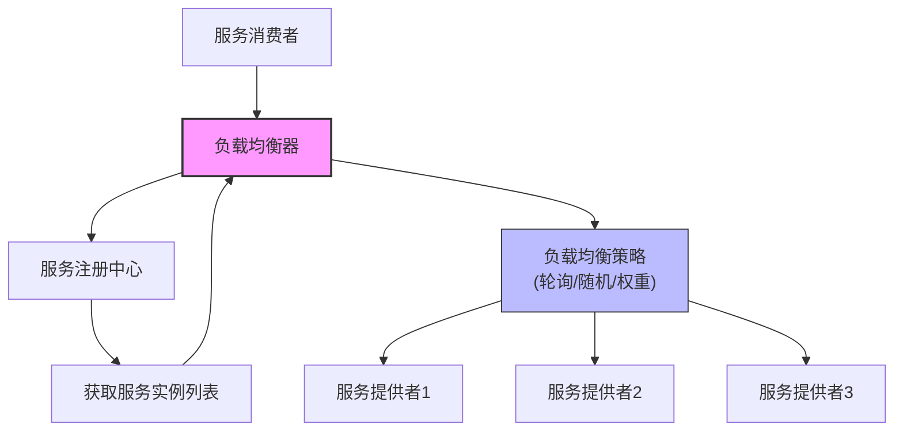

### 4.1 Ribbon配置

<Tabs>
  <TabItem value="config" label="基础配置" default>
```java title="Ribbon配置"
@Configuration
public class RibbonConfig {
    
    @Bean
    @LoadBalanced
    public RestTemplate restTemplate() {
        return new RestTemplate();
    }
    
    @Bean
    public IRule ribbonRule() {
        return new RoundRobinRule(); // 轮询策略
    }
    
    @Bean
    public IPing ribbonPing() {
        return new PingUrl();
    }
}
```
  </TabItem>
  <TabItem value="yaml" label="YAML配置">
  ```yaml title="Ribbon配置"
  ribbon:
    ReadTimeout: 5000
    ConnectTimeout: 2000
    MaxAutoRetries: 1
    MaxAutoRetriesNextServer: 2
    # 特定服务的配置
    user-service:
      ReadTimeout: 10000
      ConnectTimeout: 5000
  ```
  </TabItem>
</Tabs>

### 4.2 负载均衡策略

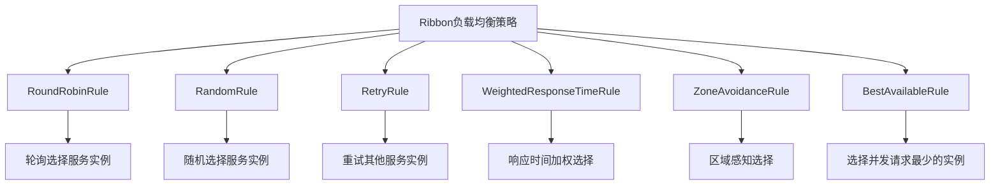

<div className="card">
<div className="card__body">

```java title="负载均衡策略"
@Service
public class UserService {
    
    @Autowired
    @LoadBalanced
    private RestTemplate restTemplate;
    
    public User getUserById(Long id) {
        // 使用服务名进行负载均衡调用
        return restTemplate.getForObject(
            "http://user-service/users/" + id, 
            User.class
        );
    }
    
    public List<User> getAllUsers() {
        return restTemplate.getForObject(
            "http://user-service/users", 
            List.class
        );
    }
}
```

</div>
</div>

### 4.3 自定义负载均衡

<Tabs>
  <TabItem value="custom-rule" label="自定义规则" default>
```java title="自定义负载均衡"
@Component
public class CustomLoadBalancerRule extends AbstractLoadBalancerRule {
    
    @Override
    public Server choose(Object key) {
        ILoadBalancer lb = getLoadBalancer();
        
        List<Server> reachableServers = lb.getReachableServers();
        List<Server> allServers = lb.getAllServers();
        
        if (reachableServers.isEmpty()) {
            return null;
        }
        
        // 自定义负载均衡逻辑
        return reachableServers.get(new Random().nextInt(reachableServers.size()));
    }
    
    @Override
    public void initWithNiwsConfig(IClientConfig clientConfig) {
        // 初始化配置
    }
}
```
  </TabItem>
  <TabItem value="config-rule" label="配置自定义规则">
  ```java title="配置自定义规则"
  @Configuration
  public class RibbonClientConfig {
      
      @Bean
      public IRule ribbonRule() {
          return new CustomLoadBalancerRule();
      }
  }
  
  // 针对特定服务的配置
  @Configuration
  @RibbonClient(name = "user-service", configuration = UserServiceRibbonConfig.class)
  public class UserServiceRibbonConfig {
      
      @Bean
      public IRule ribbonRule() {
          return new WeightedResponseTimeRule();
      }
      
      @Bean
      public IPing ribbonPing() {
          return new PingUrl();
      }
  }
  ```
  </TabItem>
</Tabs>

## 5. 熔断降级

熔断器设计模式用于保护系统免受级联故障影响，当服务调用失败达到阈值时，触发熔断，并提供后备响应。

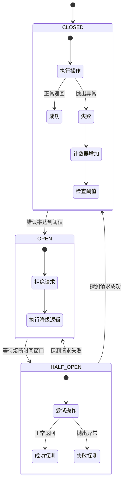

### 5.1 Hystrix配置

<Tabs>
  <TabItem value="app" label="应用配置" default>
```java title="Hystrix配置"
@SpringBootApplication
@EnableCircuitBreaker
public class UserServiceApplication {
    public static void main(String[] args) {
        SpringApplication.run(UserServiceApplication.class, args);
    }
}
```
  </TabItem>
  <TabItem value="service" label="服务配置">
```java title="Hystrix使用示例"
@Service
public class UserService {
    
    @Autowired
    private RestTemplate restTemplate;
    
    @HystrixCommand(
        fallbackMethod = "getUserFallback",
        commandProperties = {
            @HystrixProperty(name = "execution.isolation.thread.timeoutInMilliseconds", value = "2000"),
            @HystrixProperty(name = "circuitBreaker.requestVolumeThreshold", value = "10"),
            @HystrixProperty(name = "circuitBreaker.errorThresholdPercentage", value = "50"),
            @HystrixProperty(name = "circuitBreaker.sleepWindowInMilliseconds", value = "5000")
        }
    )
    public User getUserById(Long id) {
        return restTemplate.getForObject(
            "http://user-service/users/" + id, 
            User.class
        );
    }
    
    public User getUserFallback(Long id, Throwable e) {
        // 降级逻辑
        User fallbackUser = new User();
        fallbackUser.setId(id);
        fallbackUser.setName("默认用户");
        fallbackUser.setEmail("default@example.com");
        return fallbackUser;
    }
}
```
  </TabItem>
  <TabItem value="props" label="关键属性">
  <div className="card">
  <div className="card__header">
  <h4>Hystrix关键属性</h4>
  </div>
  <div className="card__body">
  
  | 属性 | 说明 | 默认值 | 推荐值 |
  |------|------|--------|--------|
  | **execution.isolation.thread.timeoutInMilliseconds** | 执行超时时间 | 1000ms | 根据接口调整 |
  | **circuitBreaker.requestVolumeThreshold** | 熔断触发最小请求数 | 20 | 生产环境调大 |
  | **circuitBreaker.errorThresholdPercentage** | 错误率阈值 | 50% | 根据容错率调整 |
  | **circuitBreaker.sleepWindowInMilliseconds** | 熔断恢复时间窗口 | 5000ms | 根据服务恢复时间调整 |
  
  </div>
  </div>
  </TabItem>
</Tabs>

### 5.2 Sentinel配置

Sentinel是阿里巴巴开源的流量控制组件，提供了熔断降级、系统负载保护、实时监控等功能。

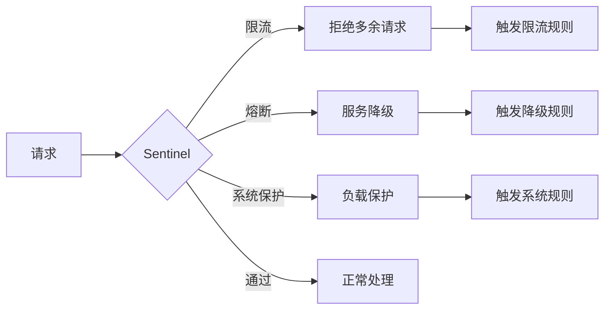

<div className="card">
<div className="card__body">

```java title="Sentinel配置"
@Configuration
public class SentinelConfig {
    
    @PostConstruct
    public void init() {
        // 配置限流规则
        List<FlowRule> rules = new ArrayList<>();
        FlowRule rule = new FlowRule();
        rule.setResource("getUser");
        rule.setGrade(RuleConstant.FLOW_GRADE_QPS);
        rule.setCount(10);
        rules.add(rule);
        FlowRuleManager.loadRules(rules);
    }
}
```

</div>
</div>

<Tabs>
  <TabItem value="sentinel-service" label="服务使用" default>
```java title="Sentinel使用示例"
@Service
public class UserService {
    
    @SentinelResource(
        value = "getUser",
        blockHandler = "getUserBlockHandler",
        fallback = "getUserFallback"
    )
    public User getUserById(Long id) {
        return userRepository.findById(id).orElse(null);
    }
    
    public User getUserBlockHandler(Long id, BlockException ex) {
        // 限流处理
        return new User();
    }
    
    public User getUserFallback(Long id, Throwable e) {
        // 降级处理
        return new User();
    }
}
```
  </TabItem>
  <TabItem value="sentinel-rules" label="规则配置">
  ```java title="Sentinel规则配置"
  // 流控规则
  private void initFlowRules() {
      List<FlowRule> rules = new ArrayList<>();
      FlowRule rule = new FlowRule();
      rule.setResource("getUser");
      rule.setGrade(RuleConstant.FLOW_GRADE_QPS);  // QPS模式
      rule.setCount(20);  // 每秒允许20次调用
      
      // 流控效果
      rule.setControlBehavior(RuleConstant.CONTROL_BEHAVIOR_WARM_UP); // 预热方式
      rule.setWarmUpPeriodSec(10); // 预热时间10秒
      
      rules.add(rule);
      FlowRuleManager.loadRules(rules);
  }
  
  // 降级规则
  private void initDegradeRules() {
      List<DegradeRule> rules = new ArrayList<>();
      DegradeRule rule = new DegradeRule();
      rule.setResource("getUser");
      rule.setGrade(RuleConstant.DEGRADE_GRADE_EXCEPTION_RATIO); // 异常比例
      rule.setCount(0.5); // 异常比例阈值50%
      rule.setTimeWindow(10); // 熔断时间10秒
      
      rules.add(rule);
      DegradeRuleManager.loadRules(rules);
  }
  ```
  </TabItem>
</Tabs>

## 6. 配置管理

Spring Cloud Config提供了集中化的配置管理，支持动态刷新和版本管理。

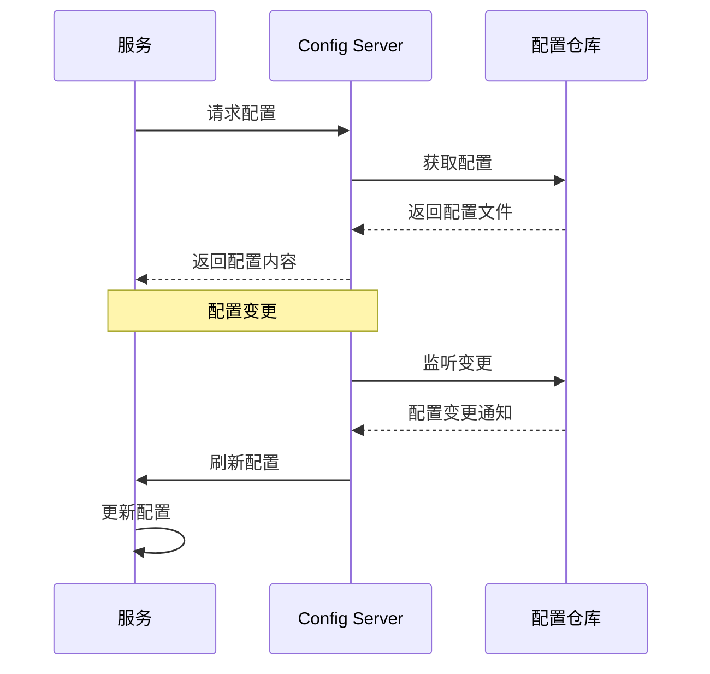

### 6.1 Config Server

<Tabs>
  <TabItem value="server-java" label="服务配置" default>
```java title="Config Server配置"
@SpringBootApplication
@EnableConfigServer
public class ConfigServerApplication {
    public static void main(String[] args) {
        SpringApplication.run(ConfigServerApplication.class, args);
    }
}
```
  </TabItem>
  <TabItem value="server-yaml" label="YAML配置">
```yaml title="Config Server配置"
server:
  port: 8888

spring:
  application:
    name: config-server
  cloud:
    config:
      server:
        git:
          uri: https://github.com/example/config-repo
          default-label: main
          search-paths: config
          username: ${GIT_USERNAME}
          password: ${GIT_PASSWORD}
```
  </TabItem>
  <TabItem value="native" label="本地配置">
  ```yaml title="本地配置模式"
  spring:
    cloud:
      config:
        server:
          native:
            search-locations: classpath:/config,file:./config
    profiles:
      active: native
  ```
  </TabItem>
</Tabs>

### 6.2 Config Client

<div className="card">
<div className="card__body">

```java title="Config Client配置"
@SpringBootApplication
@EnableDiscoveryClient
@RefreshScope
public class UserServiceApplication {
    public static void main(String[] args) {
        SpringApplication.run(UserServiceApplication.class, args);
    }
}
```

</div>
</div>

<Tabs>
  <TabItem value="client-yaml" label="YAML配置" default>
```yaml title="Config Client配置"
spring:
  application:
    name: user-service
  cloud:
    config:
      uri: http://localhost:8888
      fail-fast: true
      retry:
        initial-interval: 1000
        max-interval: 2000
        max-attempts: 6
```
  </TabItem>
  <TabItem value="bootstrap" label="Bootstrap配置">
  ```yaml title="bootstrap.yml"
  spring:
    application:
      name: user-service
    cloud:
      config:
        uri: http://localhost:8888
        fail-fast: true
    profiles:
      active: dev
  ```
  </TabItem>
  <TabItem value="config-use" label="配置使用">
```java title="配置使用示例"
@RestController
@RefreshScope
public class ConfigController {
    
    @Value("${app.feature.enabled:false}")
    private boolean featureEnabled;
    
    @Value("${app.max.users:100}")
    private int maxUsers;
    
    @GetMapping("/config")
    public Map<String, Object> getConfig() {
        Map<String, Object> config = new HashMap<>();
        config.put("featureEnabled", featureEnabled);
        config.put("maxUsers", maxUsers);
        return config;
    }
}
```
  </TabItem>
</Tabs>

### 6.3 动态刷新配置

<Tabs>
  <TabItem value="manual" label="手动刷新" default>
  ```shell
  # 单个服务手动刷新
  curl -X POST http://localhost:8080/actuator/refresh
  
  # 添加actuator依赖和配置
  # pom.xml
  <dependency>
      <groupId>org.springframework.boot</groupId>
      <artifactId>spring-boot-starter-actuator</artifactId>
  </dependency>
  
  # application.yml
  management:
    endpoints:
      web:
        exposure:
          include: refresh,health,info
  ```
  </TabItem>
  <TabItem value="bus" label="消息总线自动刷新">
  ```yaml
  # 添加依赖
  # pom.xml
  <dependency>
      <groupId>org.springframework.cloud</groupId>
      <artifactId>spring-cloud-starter-bus-amqp</artifactId>
  </dependency>
  
  # application.yml
  spring:
    rabbitmq:
      host: localhost
      port: 5672
      username: guest
      password: guest
    cloud:
      bus:
        enabled: true
        trace:
          enabled: true
          
  # 刷新所有服务配置
  curl -X POST http://localhost:8888/actuator/busrefresh
  
  # 刷新指定服务配置
  curl -X POST http://localhost:8888/actuator/busrefresh/user-service:8080
  ```
  </TabItem>
</Tabs>

## 7. 分布式链路追踪

分布式链路追踪用于跟踪和可视化微服务调用链路，帮助开发人员理解系统行为和排查问题。

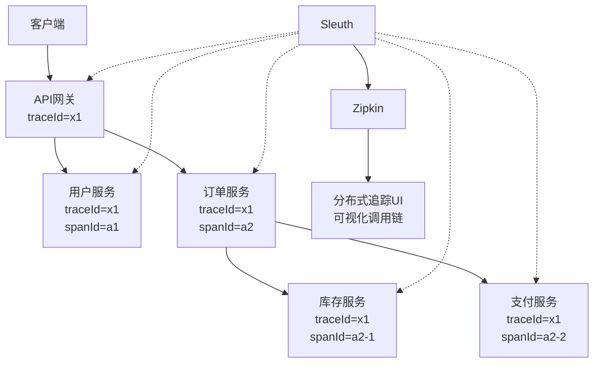

### 7.1 Sleuth配置

<Tabs>
  <TabItem value="dep" label="依赖配置" default>
```xml title="Sleuth依赖"
<dependency>
    <groupId>org.springframework.cloud</groupId>
    <artifactId>spring-cloud-starter-sleuth</artifactId>
</dependency>
```
  </TabItem>
  <TabItem value="yaml" label="YAML配置">
```yaml title="Sleuth配置"
spring:
  sleuth:
    sampler:
      probability: 1.0
    web:
      client:
        enabled: true
    messaging:
      enabled: true
```
  </TabItem>
  <TabItem value="example" label="使用示例">
```java title="Sleuth使用示例"
@Service
public class UserService {
    
    private static final Logger logger = LoggerFactory.getLogger(UserService.class);
    
    @Autowired
    private RestTemplate restTemplate;
    
    public User getUserById(Long id) {
        logger.info("开始获取用户信息，用户ID: {}", id);
        
        User user = restTemplate.getForObject(
            "http://user-service/users/" + id, 
            User.class
        );
        
        logger.info("获取用户信息成功，用户: {}", user);
        return user;
    }
}
```
  </TabItem>
</Tabs>

### 7.2 Zipkin配置

<div className="card">
<div className="card__body">

```yaml title="Zipkin配置"
spring:
  application:
    name: zipkin-server
  sleuth:
    zipkin:
      base-url: http://localhost:9411
```

</div>
</div>

<Tabs>
  <TabItem value="zipkin-dep" label="Zipkin依赖" default>
  ```xml
  <!-- Zipkin依赖 -->
  <dependency>
      <groupId>org.springframework.cloud</groupId>
      <artifactId>spring-cloud-starter-zipkin</artifactId>
  </dependency>
  ```
  </TabItem>
  <TabItem value="zipkin-server" label="Zipkin服务器">
  ```java title="Zipkin服务器启动"
  // 现代版本推荐使用Docker方式启动Zipkin服务器
  // docker run -d -p 9411:9411 openzipkin/zipkin
  
  // 或者使用Java命令
  // java -jar zipkin-server.jar
  
  // Spring Boot 2.0后不再推荐自建Zipkin服务器
  @SpringBootApplication
  @EnableZipkinServer // 已弃用
  public class ZipkinServerApplication {
      public static void main(String[] args) {
          SpringApplication.run(ZipkinServerApplication.class, args);
      }
  }
  ```
  </TabItem>
</Tabs>

## 8. 面试题精选

### 8.1 基础概念题

<Tabs>
  <TabItem value="q1" label="微服务架构" default>
  <div className="card">
  <div className="card__header">
  <h4>Q: 什么是微服务架构？它的优势和挑战是什么？</h4>
  </div>
  <div className="card__body">
  <p><strong>A:</strong> 微服务架构是一种将应用程序拆分为小型、独立服务的架构风格。</p>
  <p>优势包括：</p>
  <ul>
  <li><strong>服务拆分</strong>：按业务功能拆分，职责单一</li>
  <li><strong>独立部署</strong>：每个服务可独立部署和扩展</li>
  <li><strong>技术异构</strong>：不同服务可使用不同技术栈</li>
  <li><strong>故障隔离</strong>：单个服务故障不影响整体</li>
  </ul>
  
  <p>挑战包括：</p>
  <ul>
  <li><strong>分布式复杂性</strong>：网络通信、数据一致性等</li>
  <li><strong>服务治理</strong>：服务发现、负载均衡、熔断降级</li>
  <li><strong>数据管理</strong>：分布式事务、数据一致性</li>
  <li><strong>运维复杂度</strong>：监控、日志、部署等</li>
  </ul>
  </div>
  </div>
  </TabItem>
  <TabItem value="q2" label="核心组件">
  <div className="card">
  <div className="card__header">
  <h4>Q: Spring Cloud的核心组件有哪些？</h4>
  </div>
  <div className="card__body">
  <p><strong>A:</strong> Spring Cloud的核心组件包括：</p>
  <ul>
  <li><strong>Eureka/Nacos/Consul</strong>：服务注册与发现</li>
  <li><strong>Gateway/Zuul</strong>：API网关</li>
  <li><strong>Ribbon/LoadBalancer</strong>：客户端负载均衡</li>
  <li><strong>Hystrix/Sentinel/Resilience4j</strong>：熔断降级</li>
  <li><strong>Config</strong>：配置管理</li>
  <li><strong>Bus</strong>：消息总线</li>
  <li><strong>Sleuth</strong>：分布式链路追踪</li>
  <li><strong>Zipkin</strong>：调用链可视化</li>
  </ul>
  </div>
  </div>
  </TabItem>
</Tabs>

### 8.2 实践题

<Tabs>
  <TabItem value="q3" label="服务注册发现" default>
  <div className="card">
  <div className="card__header">
  <h4>Q: 如何实现服务注册与发现？</h4>
  </div>
  <div className="card__body">
  <p><strong>A:</strong> 实现服务注册与发现的步骤：</p>
  <ol>
  <li><strong>配置Eureka Server</strong>：</li>
  </ol>
  
  ```java
@SpringBootApplication
@EnableEurekaServer
public class EurekaServerApplication {
    public static void main(String[] args) {
        SpringApplication.run(EurekaServerApplication.class, args);
    }
}
  ```
  
  <ol start="2">
  <li><strong>配置Eureka Client</strong>：</li>
  </ol>
  
  ```java
@SpringBootApplication
@EnableEurekaClient
public class ServiceApplication {
    public static void main(String[] args) {
        SpringApplication.run(ServiceApplication.class, args);
    }
}
  ```
  
  <ol start="3">
  <li><strong>服务调用</strong>：使用@LoadBalanced注解的RestTemplate或Feign客户端</li>
  <li><strong>负载均衡</strong>：通过Ribbon实现，可自定义负载均衡策略</li>
  </ol>
  </div>
  </div>
  </TabItem>
  <TabItem value="q4" label="API网关">
  <div className="card">
  <div className="card__header">
  <h4>Q: 如何实现API网关？</h4>
  </div>
  <div className="card__body">
  <p><strong>A:</strong> 实现API网关的方法：</p>
  <ol>
  <li><strong>配置Gateway</strong>：</li>
  </ol>
  
  ```yaml
spring:
  cloud:
    gateway:
      routes:
        - id: user-service
          uri: lb://user-service
          predicates:
            - Path=/api/users/**
          filters:
            - StripPrefix=1
  ```
  
  <ol start="2">
  <li><strong>过滤器链</strong>：实现GlobalFilter接口，可处理认证、限流、日志等</li>
  <li><strong>服务发现</strong>：结合Eureka，实现动态路由</li>
  <li><strong>负载均衡</strong>：使用lb://前缀进行负载均衡</li>
  </ol>
  </div>
  </div>
  </TabItem>
</Tabs>

### 8.3 高级题

<Tabs>
  <TabItem value="q5" label="分布式事务" default>
  <div className="card">
  <div className="card__header">
  <h4>Q: 如何实现分布式事务？</h4>
  </div>
  <div className="card__body">
  <p><strong>A:</strong> 实现分布式事务的方法：</p>
  <ul>
  <li><strong>2PC/3PC</strong>：两阶段/三阶段提交协议，强一致性但性能较差</li>
  <li><strong>TCC模式</strong>：Try-Confirm-Cancel模式，补偿事务</li>
  </ul>
  
  ```java
// Try阶段
@Transactional
public void tryCreate(Order order) {
    orderMapper.insert(order);  // 创建订单
    accountService.tryDeduct(order.getUserId(), order.getAmount());  // 尝试扣减余额
}

// Confirm阶段
@Transactional
public void confirmCreate(Order order) {
    order.setStatus("CONFIRMED");
    orderMapper.updateStatus(order);  // 确认订单
    accountService.confirmDeduct(order.getUserId(), order.getAmount());  // 确认扣减
}

// Cancel阶段
@Transactional
public void cancelCreate(Order order) {
    order.setStatus("CANCELED");
    orderMapper.updateStatus(order);  // 取消订单
    accountService.cancelDeduct(order.getUserId(), order.getAmount());  // 取消扣减
}
  ```
  
  <ul start="3">
  <li><strong>Saga模式</strong>：长事务的补偿模式，每步都有对应的补偿操作</li>
  <li><strong>消息事务</strong>：基于消息的最终一致性，通过消息表+定时任务实现</li>
  <li><strong>Seata</strong>：阿里开源的分布式事务框架，支持AT、TCC、Saga和XA模式</li>
  </ul>
  </div>
  </div>
  </TabItem>
  <TabItem value="q6" label="熔断降级">
  <div className="card">
  <div className="card__header">
  <h4>Q: 如何实现服务熔断降级？</h4>
  </div>
  <div className="card__body">
  <p><strong>A:</strong> 实现服务熔断降级的方法：</p>
  <ul>
  <li><strong>Hystrix</strong>：</li>
  </ul>
  
  ```java
@HystrixCommand(
    fallbackMethod = "fallbackMethod",
    commandProperties = {
        @HystrixProperty(name = "circuitBreaker.requestVolumeThreshold", value = "10"),
        @HystrixProperty(name = "circuitBreaker.errorThresholdPercentage", value = "50"),
        @HystrixProperty(name = "circuitBreaker.sleepWindowInMilliseconds", value = "5000")
    }
)
public String serviceMethod() {
    // 业务逻辑
}

public String fallbackMethod() {
    return "降级响应";
}
  ```
  
  <ul start="2">
  <li><strong>Sentinel</strong>：</li>
  </ul>
  
  ```java
@SentinelResource(
    value = "resourceName",
    blockHandler = "blockHandler",
    fallback = "fallbackMethod"
)
public String serviceMethod() {
    // 业务逻辑
}

public String blockHandler(BlockException ex) {
    return "限流响应";
}

public String fallbackMethod(Throwable t) {
    return "降级响应";
}
  ```
  
  <ul start="3">
  <li><strong>Resilience4j</strong>：新一代熔断器，可替代Hystrix</li>
  </ul>
  </div>
  </div>
  </TabItem>
</Tabs>

:::tip Spring Cloud学习要点
1. **理解微服务架构**：掌握微服务的设计原则和最佳实践
2. **熟悉核心组件**：了解Eureka、Gateway、Ribbon等组件
3. **掌握服务治理**：学会服务注册发现、负载均衡、熔断降级
4. **学会配置管理**：掌握分布式配置和配置中心
5. **了解监控追踪**：学会分布式链路追踪和监控
:::

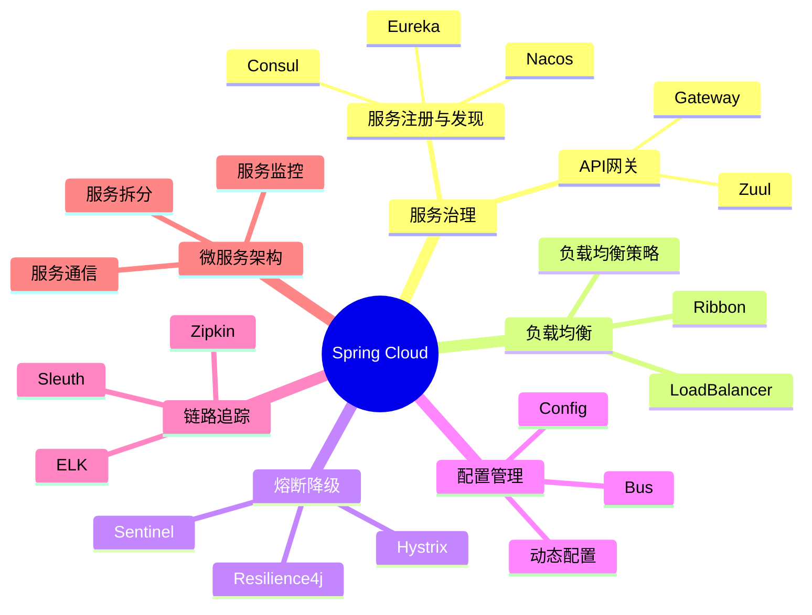

---

通过本章的学习，你应该已经掌握了Spring Cloud的核心概念、组件使用和微服务架构设计。Spring Cloud是构建分布式系统的重要框架，掌握Spring Cloud对于构建高可用、可扩展的微服务应用至关重要。 