import Tabs from '@theme/Tabs';
import TabItem from '@theme/TabItem';
import TOCInline from '@theme/TOCInline';

# Spring Cloud 详解

Spring Cloud是构建分布式系统和微服务架构的完整解决方案，它基于Spring Boot提供了服务注册发现、配置管理、负载均衡、熔断降级等微服务核心功能。

:::info 本文内容概览
<TOCInline toc={toc} />
:::

:::tip 核心价值
**Spring Cloud = 微服务架构 + 服务治理 + 配置管理 + 负载均衡 + 熔断降级**
- 🔍 **服务治理**：服务注册发现、API网关
- ⚖️ **负载均衡**：智能路由、客户端负载均衡
- 🛡️ **熔断降级**：服务容错、失败隔离
- ⚙️ **配置管理**：集中配置、动态刷新
- 📊 **链路追踪**：分布式系统监控、调用链分析
:::

## 1. Spring Cloud基础概念

### 1.1 什么是微服务？

微服务是一种软件架构风格，将应用程序拆分为一组小型、独立的服务，每个服务运行在自己的进程中，通过轻量级机制进行通信。

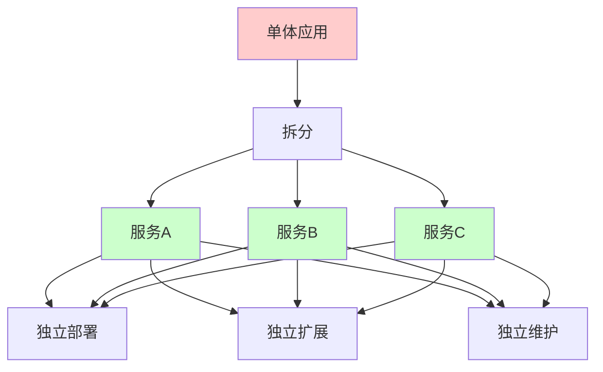

#### 微服务架构特点

<div className="card">
<div className="card__body">

| 特点 | 说明 | 优势 |
|------|------|------|
| **服务拆分** | 按业务功能拆分服务 | 职责单一，易于维护 |
| **独立部署** | 每个服务可独立部署 | 快速迭代，降低风险 |
| **技术异构** | 不同服务可使用不同技术栈 | 技术选型灵活 |
| **数据隔离** | 每个服务管理自己的数据 | 数据一致性可控 |
| **故障隔离** | 单个服务故障不影响整体 | 提高系统可用性 |

</div>
</div>

### 1.2 Spring Cloud组件

Spring Cloud提供了一套完整的微服务解决方案，包含多个组件共同构建分布式系统。

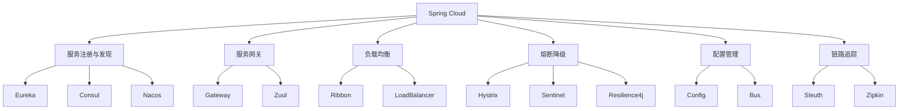

<details>
<summary>Spring Cloud依赖配置</summary>

```xml title="Spring Cloud依赖"
<dependencyManagement>
    <dependencies>
        <dependency>
            <groupId>org.springframework.cloud</groupId>
            <artifactId>spring-cloud-dependencies</artifactId>
            <version>2021.0.8</version>
            <type>pom</type>
            <scope>import</scope>
        </dependency>
    </dependencies>
</dependencyManagement>
```

</details>

## 2. 服务注册与发现

服务注册与发现是微服务架构的基础设施，用于管理和定位服务实例。

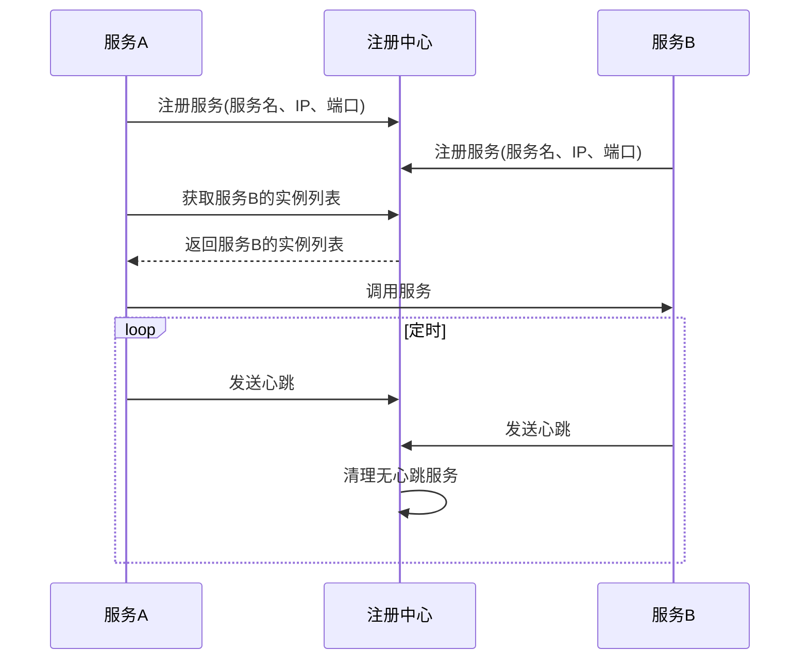

### 2.1 Eureka Server

<Tabs>
  <TabItem value="java" label="Java配置" default>
```java title="Eureka Server配置"
@SpringBootApplication
@EnableEurekaServer
public class EurekaServerApplication {
    public static void main(String[] args) {
        SpringApplication.run(EurekaServerApplication.class, args);
    }
}
```
  </TabItem>
  <TabItem value="yaml" label="YAML配置">
```yaml title="Eureka Server配置"
server:
  port: 8761

spring:
  application:
    name: eureka-server

eureka:
  instance:
    hostname: localhost
  client:
    register-with-eureka: false
    fetch-registry: false
    service-url:
      defaultZone: http://localhost:8761/eureka/
  server:
    enable-self-preservation: false
    eviction-interval-timer-in-ms: 1000
```
  </TabItem>
  <TabItem value="cluster" label="集群配置">
  ```yaml title="Eureka Server集群配置"
  # eureka-server-1 配置
  server:
    port: 8761
  
  spring:
    application:
      name: eureka-server
  
  eureka:
    instance:
      hostname: eureka1
    client:
      register-with-eureka: true
      fetch-registry: true
      service-url:
        defaultZone: http://eureka2:8762/eureka/,http://eureka3:8763/eureka/
        
  # eureka-server-2 配置
  server:
    port: 8762
  
  spring:
    application:
      name: eureka-server
  
  eureka:
    instance:
      hostname: eureka2
    client:
      register-with-eureka: true
      fetch-registry: true
      service-url:
        defaultZone: http://eureka1:8761/eureka/,http://eureka3:8763/eureka/
  ```
  </TabItem>
</Tabs>

### 2.2 Eureka Client

<Tabs>
  <TabItem value="java" label="Java配置" default>
```java title="Eureka Client配置"
@SpringBootApplication
@EnableEurekaClient
public class UserServiceApplication {
    public static void main(String[] args) {
        SpringApplication.run(UserServiceApplication.class, args);
    }
}
```
  </TabItem>
  <TabItem value="yaml" label="YAML配置">
```yaml title="Eureka Client配置"
spring:
  application:
    name: user-service

eureka:
  client:
    service-url:
      defaultZone: http://localhost:8761/eureka/
    register-with-eureka: true
    fetch-registry: true
  instance:
    prefer-ip-address: true
    instance-id: ${spring.application.name}:${server.port}
    lease-renewal-interval-in-seconds: 30
    lease-expiration-duration-in-seconds: 90
```
  </TabItem>
</Tabs>

<div className="card">
<div className="card__header">
<h4>Eureka Client核心配置说明</h4>
</div>
<div className="card__body">

| 配置项 | 说明 | 默认值 | 推荐设置 |
|------|------|--------|---------|
| **register-with-eureka** | 是否注册到Eureka | true | 生产环境保持true |
| **fetch-registry** | 是否从Eureka获取注册信息 | true | 生产环境保持true |
| **prefer-ip-address** | 是否使用IP地址注册 | false | 建议设为true |
| **lease-renewal-interval** | 心跳间隔时间(秒) | 30 | 根据负载调整 |
| **lease-expiration-duration** | 失效时间(秒) | 90 | 通常为心跳间隔的3倍 |

</div>
</div>

### 2.3 服务注册示例

<div className="card">
<div className="card__body">

```java title="服务注册示例"
@RestController
@RequestMapping("/users")
public class UserController {
    
    @Autowired
    private UserService userService;
    
    @GetMapping("/{id}")
    public ResponseEntity<User> getUser(@PathVariable Long id) {
        User user = userService.findById(id);
        return ResponseEntity.ok(user);
    }
    
    @PostMapping
    public ResponseEntity<User> createUser(@RequestBody User user) {
        User savedUser = userService.save(user);
        return ResponseEntity.status(HttpStatus.CREATED).body(savedUser);
    }
}
```

</div>
</div>

## 3. 服务网关

### 3.1 Gateway配置

Spring Cloud Gateway是API网关服务，提供了路由、过滤、限流等功能。

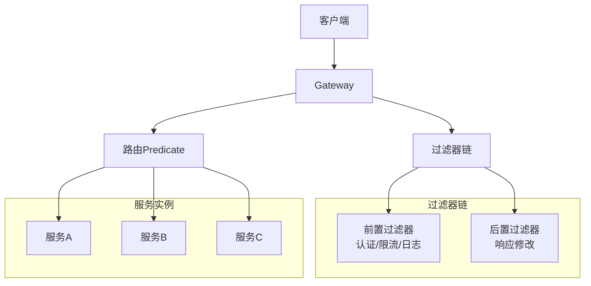

<Tabs>
  <TabItem value="java" label="Java配置" default>
```java title="Gateway配置"
@SpringBootApplication
@EnableDiscoveryClient
public class GatewayApplication {
    public static void main(String[] args) {
        SpringApplication.run(GatewayApplication.class, args);
    }
}
```
  </TabItem>
  <TabItem value="yaml" label="YAML配置">
```yaml title="Gateway路由配置"
spring:
  cloud:
    gateway:
      discovery:
        locator:
          enabled: true
          lower-case-service-id: true
      routes:
        - id: user-service
          uri: lb://user-service
          predicates:
            - Path=/api/users/**
          filters:
            - StripPrefix=1
            - name: RequestRateLimiter
              args:
                redis-rate-limiter.replenishRate: 10
                redis-rate-limiter.burstCapacity: 20
        
        - id: order-service
          uri: lb://order-service
          predicates:
            - Path=/api/orders/**
          filters:
            - StripPrefix=1
            - name: CircuitBreaker
              args:
                name: orderCircuitBreaker
                fallbackUri: forward:/fallback/order
```
  </TabItem>
</Tabs>

### 3.2 自定义过滤器

<div className="card">
<div className="card__body">

```java title="自定义过滤器"
@Component
public class AuthFilter implements GlobalFilter, Ordered {
    
    @Override
    public Mono<Void> filter(ServerWebExchange exchange, GatewayFilterChain chain) {
        ServerHttpRequest request = exchange.getRequest();
        String token = request.getHeaders().getFirst("Authorization");
        
        if (token == null || !isValidToken(token)) {
            ServerHttpResponse response = exchange.getResponse();
            response.setStatusCode(HttpStatus.UNAUTHORIZED);
            return response.setComplete();
        }
        
        return chain.filter(exchange);
    }
    
    @Override
    public int getOrder() {
        return -100;
    }
    
    private boolean isValidToken(String token) {
        // 验证token逻辑
        return token != null && token.startsWith("Bearer ");
    }
}
```

</div>
</div>

### 3.3 限流配置

<Tabs>
  <TabItem value="code" label="代码配置" default>
```java title="限流配置"
@Configuration
public class RateLimiterConfig {
    
    @Bean
    public KeyResolver userKeyResolver() {
        return exchange -> Mono.just(
            exchange.getRequest().getHeaders().getFirst("X-User-Id")
        );
    }
    
    @Bean
    public KeyResolver ipKeyResolver() {
        return exchange -> Mono.just(
            exchange.getRequest().getRemoteAddress().getAddress().getHostAddress()
        );
    }
}
```
  </TabItem>
  <TabItem value="redisrate" label="Redis限流器">
  ```yaml title="Redis限流配置"
  spring:
    cloud:
      gateway:
        routes:
          - id: user-service
            uri: lb://user-service
            predicates:
              - Path=/api/users/**
            filters:
              - name: RequestRateLimiter
                args:
                  redis-rate-limiter.replenishRate: 10  # 令牌桶每秒填充速率
                  redis-rate-limiter.burstCapacity: 20  # 令牌桶总容量
                  key-resolver: "#{@ipKeyResolver}"     # 限流键解析器
  ```
  </TabItem>
</Tabs>

## 4. 负载均衡

Spring Cloud提供了客户端负载均衡功能，主要通过Ribbon和LoadBalancer组件实现。

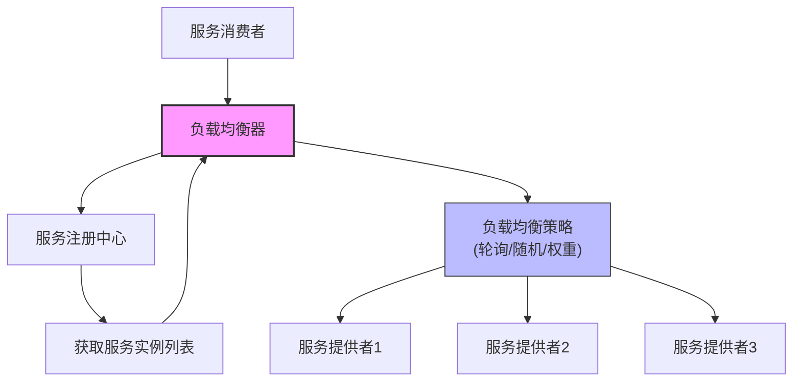

### 4.1 Ribbon配置

<Tabs>
  <TabItem value="config" label="基础配置" default>
```java title="Ribbon配置"
@Configuration
public class RibbonConfig {
    
    @Bean
    @LoadBalanced
    public RestTemplate restTemplate() {
        return new RestTemplate();
    }
    
    @Bean
    public IRule ribbonRule() {
        return new RoundRobinRule(); // 轮询策略
    }
    
    @Bean
    public IPing ribbonPing() {
        return new PingUrl();
    }
}
```
  </TabItem>
  <TabItem value="yaml" label="YAML配置">
  ```yaml title="Ribbon配置"
  ribbon:
    ReadTimeout: 5000
    ConnectTimeout: 2000
    MaxAutoRetries: 1
    MaxAutoRetriesNextServer: 2
    # 特定服务的配置
    user-service:
      ReadTimeout: 10000
      ConnectTimeout: 5000
  ```
  </TabItem>
</Tabs>

### 4.2 负载均衡策略

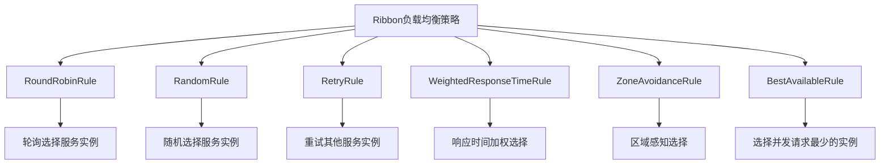

<div className="card">
<div className="card__body">

```java title="负载均衡策略"
@Service
public class UserService {
    
    @Autowired
    @LoadBalanced
    private RestTemplate restTemplate;
    
    public User getUserById(Long id) {
        // 使用服务名进行负载均衡调用
        return restTemplate.getForObject(
            "http://user-service/users/" + id, 
            User.class
        );
    }
    
    public List<User> getAllUsers() {
        return restTemplate.getForObject(
            "http://user-service/users", 
            List.class
        );
    }
}
```

</div>
</div>

### 4.3 自定义负载均衡

<Tabs>
  <TabItem value="custom-rule" label="自定义规则" default>
```java title="自定义负载均衡"
@Component
public class CustomLoadBalancerRule extends AbstractLoadBalancerRule {
    
    @Override
    public Server choose(Object key) {
        ILoadBalancer lb = getLoadBalancer();
        
        List<Server> reachableServers = lb.getReachableServers();
        List<Server> allServers = lb.getAllServers();
        
        if (reachableServers.isEmpty()) {
            return null;
        }
        
        // 自定义负载均衡逻辑
        return reachableServers.get(new Random().nextInt(reachableServers.size()));
    }
    
    @Override
    public void initWithNiwsConfig(IClientConfig clientConfig) {
        // 初始化配置
    }
}
```
  </TabItem>
  <TabItem value="config-rule" label="配置自定义规则">
  ```java title="配置自定义规则"
  @Configuration
  public class RibbonClientConfig {
      
      @Bean
      public IRule ribbonRule() {
          return new CustomLoadBalancerRule();
      }
  }
  
  // 针对特定服务的配置
  @Configuration
  @RibbonClient(name = "user-service", configuration = UserServiceRibbonConfig.class)
  public class UserServiceRibbonConfig {
      
      @Bean
      public IRule ribbonRule() {
          return new WeightedResponseTimeRule();
      }
      
      @Bean
      public IPing ribbonPing() {
          return new PingUrl();
      }
  }
  ```
  </TabItem>
</Tabs>

## 5. 熔断降级

熔断器设计模式用于保护系统免受级联故障影响，当服务调用失败达到阈值时，触发熔断，并提供后备响应。

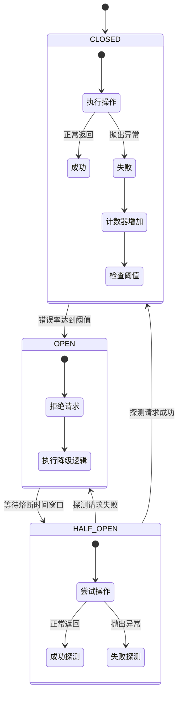

### 5.1 Hystrix配置

<Tabs>
  <TabItem value="app" label="应用配置" default>
```java title="Hystrix配置"
@SpringBootApplication
@EnableCircuitBreaker
public class UserServiceApplication {
    public static void main(String[] args) {
        SpringApplication.run(UserServiceApplication.class, args);
    }
}
```
  </TabItem>
  <TabItem value="service" label="服务配置">
```java title="Hystrix使用示例"
@Service
public class UserService {
    
    @Autowired
    private RestTemplate restTemplate;
    
    @HystrixCommand(
        fallbackMethod = "getUserFallback",
        commandProperties = {
            @HystrixProperty(name = "execution.isolation.thread.timeoutInMilliseconds", value = "2000"),
            @HystrixProperty(name = "circuitBreaker.requestVolumeThreshold", value = "10"),
            @HystrixProperty(name = "circuitBreaker.errorThresholdPercentage", value = "50"),
            @HystrixProperty(name = "circuitBreaker.sleepWindowInMilliseconds", value = "5000")
        }
    )
    public User getUserById(Long id) {
        return restTemplate.getForObject(
            "http://user-service/users/" + id, 
            User.class
        );
    }
    
    public User getUserFallback(Long id, Throwable e) {
        // 降级逻辑
        User fallbackUser = new User();
        fallbackUser.setId(id);
        fallbackUser.setName("默认用户");
        fallbackUser.setEmail("default@example.com");
        return fallbackUser;
    }
}
```
  </TabItem>
  <TabItem value="props" label="关键属性">
  <div className="card">
  <div className="card__header">
  <h4>Hystrix关键属性</h4>
  </div>
  <div className="card__body">
  
  | 属性 | 说明 | 默认值 | 推荐值 |
  |------|------|--------|--------|
  | **execution.isolation.thread.timeoutInMilliseconds** | 执行超时时间 | 1000ms | 根据接口调整 |
  | **circuitBreaker.requestVolumeThreshold** | 熔断触发最小请求数 | 20 | 生产环境调大 |
  | **circuitBreaker.errorThresholdPercentage** | 错误率阈值 | 50% | 根据容错率调整 |
  | **circuitBreaker.sleepWindowInMilliseconds** | 熔断恢复时间窗口 | 5000ms | 根据服务恢复时间调整 |
  
  </div>
  </div>
  </TabItem>
</Tabs>

### 5.2 Sentinel配置

Sentinel是阿里巴巴开源的流量控制组件，提供了熔断降级、系统负载保护、实时监控等功能。

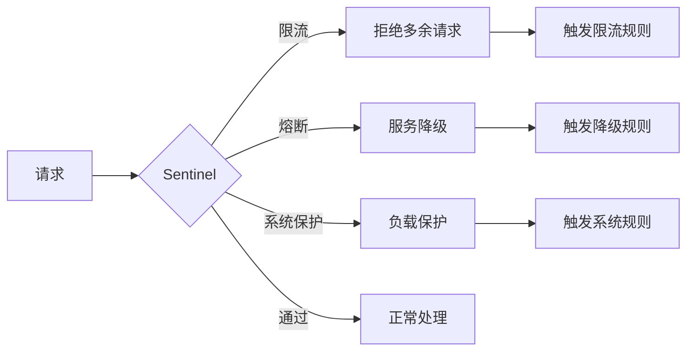

<div className="card">
<div className="card__body">

```java title="Sentinel配置"
@Configuration
public class SentinelConfig {
    
    @PostConstruct
    public void init() {
        // 配置限流规则
        List<FlowRule> rules = new ArrayList<>();
        FlowRule rule = new FlowRule();
        rule.setResource("getUser");
        rule.setGrade(RuleConstant.FLOW_GRADE_QPS);
        rule.setCount(10);
        rules.add(rule);
        FlowRuleManager.loadRules(rules);
    }
}
```

</div>
</div>

<Tabs>
  <TabItem value="sentinel-service" label="服务使用" default>
```java title="Sentinel使用示例"
@Service
public class UserService {
    
    @SentinelResource(
        value = "getUser",
        blockHandler = "getUserBlockHandler",
        fallback = "getUserFallback"
    )
    public User getUserById(Long id) {
        return userRepository.findById(id).orElse(null);
    }
    
    public User getUserBlockHandler(Long id, BlockException ex) {
        // 限流处理
        return new User();
    }
    
    public User getUserFallback(Long id, Throwable e) {
        // 降级处理
        return new User();
    }
}
```
  </TabItem>
  <TabItem value="sentinel-rules" label="规则配置">
  ```java title="Sentinel规则配置"
  // 流控规则
  private void initFlowRules() {
      List<FlowRule> rules = new ArrayList<>();
      FlowRule rule = new FlowRule();
      rule.setResource("getUser");
      rule.setGrade(RuleConstant.FLOW_GRADE_QPS);  // QPS模式
      rule.setCount(20);  // 每秒允许20次调用
      
      // 流控效果
      rule.setControlBehavior(RuleConstant.CONTROL_BEHAVIOR_WARM_UP); // 预热方式
      rule.setWarmUpPeriodSec(10); // 预热时间10秒
      
      rules.add(rule);
      FlowRuleManager.loadRules(rules);
  }
  
  // 降级规则
  private void initDegradeRules() {
      List<DegradeRule> rules = new ArrayList<>();
      DegradeRule rule = new DegradeRule();
      rule.setResource("getUser");
      rule.setGrade(RuleConstant.DEGRADE_GRADE_EXCEPTION_RATIO); // 异常比例
      rule.setCount(0.5); // 异常比例阈值50%
      rule.setTimeWindow(10); // 熔断时间10秒
      
      rules.add(rule);
      DegradeRuleManager.loadRules(rules);
  }
  ```
  </TabItem>
</Tabs>

## 6. 配置管理

Spring Cloud Config提供了集中化的配置管理，支持动态刷新和版本管理。

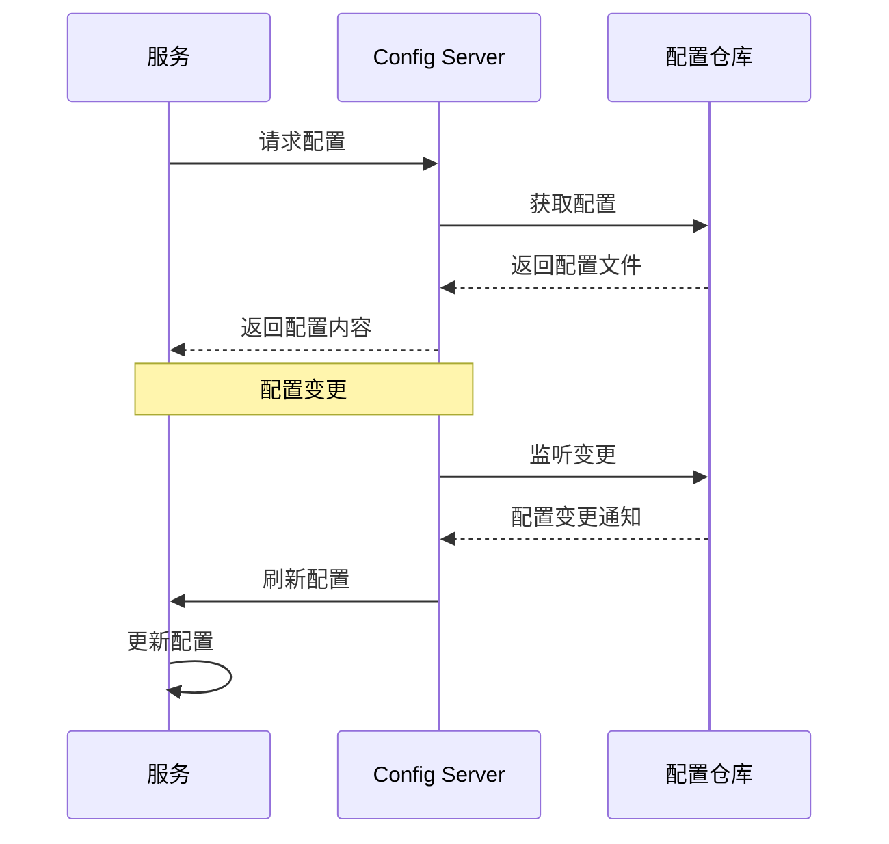

### 6.1 Config Server

<Tabs>
  <TabItem value="server-java" label="服务配置" default>
```java title="Config Server配置"
@SpringBootApplication
@EnableConfigServer
public class ConfigServerApplication {
    public static void main(String[] args) {
        SpringApplication.run(ConfigServerApplication.class, args);
    }
}
```
  </TabItem>
  <TabItem value="server-yaml" label="YAML配置">
```yaml title="Config Server配置"
server:
  port: 8888

spring:
  application:
    name: config-server
  cloud:
    config:
      server:
        git:
          uri: https://github.com/example/config-repo
          default-label: main
          search-paths: config
          username: ${GIT_USERNAME}
          password: ${GIT_PASSWORD}
```
  </TabItem>
  <TabItem value="native" label="本地配置">
  ```yaml title="本地配置模式"
  spring:
    cloud:
      config:
        server:
          native:
            search-locations: classpath:/config,file:./config
    profiles:
      active: native
  ```
  </TabItem>
</Tabs>

### 6.2 Config Client

<div className="card">
<div className="card__body">

```java title="Config Client配置"
@SpringBootApplication
@EnableDiscoveryClient
@RefreshScope
public class UserServiceApplication {
    public static void main(String[] args) {
        SpringApplication.run(UserServiceApplication.class, args);
    }
}
```

</div>
</div>

<Tabs>
  <TabItem value="client-yaml" label="YAML配置" default>
```yaml title="Config Client配置"
spring:
  application:
    name: user-service
  cloud:
    config:
      uri: http://localhost:8888
      fail-fast: true
      retry:
        initial-interval: 1000
        max-interval: 2000
        max-attempts: 6
```
  </TabItem>
  <TabItem value="bootstrap" label="Bootstrap配置">
  ```yaml title="bootstrap.yml"
  spring:
    application:
      name: user-service
    cloud:
      config:
        uri: http://localhost:8888
        fail-fast: true
    profiles:
      active: dev
  ```
  </TabItem>
  <TabItem value="config-use" label="配置使用">
```java title="配置使用示例"
@RestController
@RefreshScope
public class ConfigController {
    
    @Value("${app.feature.enabled:false}")
    private boolean featureEnabled;
    
    @Value("${app.max.users:100}")
    private int maxUsers;
    
    @GetMapping("/config")
    public Map<String, Object> getConfig() {
        Map<String, Object> config = new HashMap<>();
        config.put("featureEnabled", featureEnabled);
        config.put("maxUsers", maxUsers);
        return config;
    }
}
```
  </TabItem>
</Tabs>

### 6.3 动态刷新配置

<Tabs>
  <TabItem value="manual" label="手动刷新" default>
  ```shell
  # 单个服务手动刷新
  curl -X POST http://localhost:8080/actuator/refresh
  
  # 添加actuator依赖和配置
  # pom.xml
  <dependency>
      <groupId>org.springframework.boot</groupId>
      <artifactId>spring-boot-starter-actuator</artifactId>
  </dependency>
  
  # application.yml
  management:
    endpoints:
      web:
        exposure:
          include: refresh,health,info
  ```
  </TabItem>
  <TabItem value="bus" label="消息总线自动刷新">
  ```yaml
  # 添加依赖
  # pom.xml
  <dependency>
      <groupId>org.springframework.cloud</groupId>
      <artifactId>spring-cloud-starter-bus-amqp</artifactId>
  </dependency>
  
  # application.yml
  spring:
    rabbitmq:
      host: localhost
      port: 5672
      username: guest
      password: guest
    cloud:
      bus:
        enabled: true
        trace:
          enabled: true
          
  # 刷新所有服务配置
  curl -X POST http://localhost:8888/actuator/busrefresh
  
  # 刷新指定服务配置
  curl -X POST http://localhost:8888/actuator/busrefresh/user-service:8080
  ```
  </TabItem>
</Tabs>

## 7. 分布式链路追踪

分布式链路追踪用于跟踪和可视化微服务调用链路，帮助开发人员理解系统行为和排查问题。

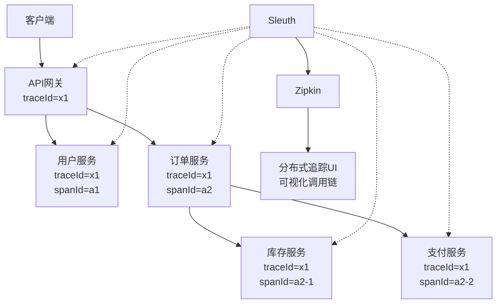

### 7.1 Sleuth配置

<Tabs>
  <TabItem value="dep" label="依赖配置" default>
```xml title="Sleuth依赖"
<dependency>
    <groupId>org.springframework.cloud</groupId>
    <artifactId>spring-cloud-starter-sleuth</artifactId>
</dependency>
```
  </TabItem>
  <TabItem value="yaml" label="YAML配置">
```yaml title="Sleuth配置"
spring:
  sleuth:
    sampler:
      probability: 1.0
    web:
      client:
        enabled: true
    messaging:
      enabled: true
```
  </TabItem>
  <TabItem value="example" label="使用示例">
```java title="Sleuth使用示例"
@Service
public class UserService {
    
    private static final Logger logger = LoggerFactory.getLogger(UserService.class);
    
    @Autowired
    private RestTemplate restTemplate;
    
    public User getUserById(Long id) {
        logger.info("开始获取用户信息，用户ID: {}", id);
        
        User user = restTemplate.getForObject(
            "http://user-service/users/" + id, 
            User.class
        );
        
        logger.info("获取用户信息成功，用户: {}", user);
        return user;
    }
}
```
  </TabItem>
</Tabs>

### 7.2 Zipkin配置

<div className="card">
<div className="card__body">

```yaml title="Zipkin配置"
spring:
  application:
    name: zipkin-server
  sleuth:
    zipkin:
      base-url: http://localhost:9411
```

</div>
</div>

<Tabs>
  <TabItem value="zipkin-dep" label="Zipkin依赖" default>
  ```xml
  <!-- Zipkin依赖 -->
  <dependency>
      <groupId>org.springframework.cloud</groupId>
      <artifactId>spring-cloud-starter-zipkin</artifactId>
  </dependency>
  ```
  </TabItem>
  <TabItem value="zipkin-server" label="Zipkin服务器">
  ```java title="Zipkin服务器启动"
  // 现代版本推荐使用Docker方式启动Zipkin服务器
  // docker run -d -p 9411:9411 openzipkin/zipkin
  
  // 或者使用Java命令
  // java -jar zipkin-server.jar
  
  // Spring Boot 2.0后不再推荐自建Zipkin服务器
  @SpringBootApplication
  @EnableZipkinServer // 已弃用
  public class ZipkinServerApplication {
      public static void main(String[] args) {
          SpringApplication.run(ZipkinServerApplication.class, args);
      }
  }
  ```
  </TabItem>
</Tabs>

## 8. 面试题精选

### 8.1 基础概念题

<Tabs>
  <TabItem value="q1" label="微服务架构" default>
  <div className="card">
  <div className="card__header">
  <h4>Q: 什么是微服务架构？它的优势和挑战是什么？</h4>
  </div>
  <div className="card__body">
  <p><strong>A:</strong> 微服务架构是一种将应用程序拆分为小型、独立服务的架构风格。</p>
  <p>优势包括：</p>
  <ul>
  <li><strong>服务拆分</strong>：按业务功能拆分，职责单一</li>
  <li><strong>独立部署</strong>：每个服务可独立部署和扩展</li>
  <li><strong>技术异构</strong>：不同服务可使用不同技术栈</li>
  <li><strong>故障隔离</strong>：单个服务故障不影响整体</li>
  </ul>
  
  <p>挑战包括：</p>
  <ul>
  <li><strong>分布式复杂性</strong>：网络通信、数据一致性等</li>
  <li><strong>服务治理</strong>：服务发现、负载均衡、熔断降级</li>
  <li><strong>数据管理</strong>：分布式事务、数据一致性</li>
  <li><strong>运维复杂度</strong>：监控、日志、部署等</li>
  </ul>
  </div>
  </div>
  </TabItem>
  <TabItem value="q2" label="核心组件">
  <div className="card">
  <div className="card__header">
  <h4>Q: Spring Cloud的核心组件有哪些？</h4>
  </div>
  <div className="card__body">
  <p><strong>A:</strong> Spring Cloud的核心组件包括：</p>
  <ul>
  <li><strong>Eureka/Nacos/Consul</strong>：服务注册与发现</li>
  <li><strong>Gateway/Zuul</strong>：API网关</li>
  <li><strong>Ribbon/LoadBalancer</strong>：客户端负载均衡</li>
  <li><strong>Hystrix/Sentinel/Resilience4j</strong>：熔断降级</li>
  <li><strong>Config</strong>：配置管理</li>
  <li><strong>Bus</strong>：消息总线</li>
  <li><strong>Sleuth</strong>：分布式链路追踪</li>
  <li><strong>Zipkin</strong>：调用链可视化</li>
  </ul>
  </div>
  </div>
  </TabItem>
</Tabs>

### 8.2 实践题

<Tabs>
  <TabItem value="q3" label="服务注册发现" default>
  <div className="card">
  <div className="card__header">
  <h4>Q: 如何实现服务注册与发现？</h4>
  </div>
  <div className="card__body">
  <p><strong>A:</strong> 实现服务注册与发现的步骤：</p>
  <ol>
  <li><strong>配置Eureka Server</strong>：</li>
  </ol>
  
  ```java
@SpringBootApplication
@EnableEurekaServer
public class EurekaServerApplication {
    public static void main(String[] args) {
        SpringApplication.run(EurekaServerApplication.class, args);
    }
}
  ```
  
  <ol start="2">
  <li><strong>配置Eureka Client</strong>：</li>
  </ol>
  
  ```java
@SpringBootApplication
@EnableEurekaClient
public class ServiceApplication {
    public static void main(String[] args) {
        SpringApplication.run(ServiceApplication.class, args);
    }
}
  ```
  
  <ol start="3">
  <li><strong>服务调用</strong>：使用@LoadBalanced注解的RestTemplate或Feign客户端</li>
  <li><strong>负载均衡</strong>：通过Ribbon实现，可自定义负载均衡策略</li>
  </ol>
  </div>
  </div>
  </TabItem>
  <TabItem value="q4" label="API网关">
  <div className="card">
  <div className="card__header">
  <h4>Q: 如何实现API网关？</h4>
  </div>
  <div className="card__body">
  <p><strong>A:</strong> 实现API网关的方法：</p>
  <ol>
  <li><strong>配置Gateway</strong>：</li>
  </ol>
  
  ```yaml
spring:
  cloud:
    gateway:
      routes:
        - id: user-service
          uri: lb://user-service
          predicates:
            - Path=/api/users/**
          filters:
            - StripPrefix=1
  ```
  
  <ol start="2">
  <li><strong>过滤器链</strong>：实现GlobalFilter接口，可处理认证、限流、日志等</li>
  <li><strong>服务发现</strong>：结合Eureka，实现动态路由</li>
  <li><strong>负载均衡</strong>：使用lb://前缀进行负载均衡</li>
  </ol>
  </div>
  </div>
  </TabItem>
</Tabs>

### 8.3 高级题

<Tabs>
  <TabItem value="q5" label="分布式事务" default>
  <div className="card">
  <div className="card__header">
  <h4>Q: 如何实现分布式事务？</h4>
  </div>
  <div className="card__body">
  <p><strong>A:</strong> 实现分布式事务的方法：</p>
  <ul>
  <li><strong>2PC/3PC</strong>：两阶段/三阶段提交协议，强一致性但性能较差</li>
  <li><strong>TCC模式</strong>：Try-Confirm-Cancel模式，补偿事务</li>
  </ul>
  
  ```java
// Try阶段
@Transactional
public void tryCreate(Order order) {
    orderMapper.insert(order);  // 创建订单
    accountService.tryDeduct(order.getUserId(), order.getAmount());  // 尝试扣减余额
}

// Confirm阶段
@Transactional
public void confirmCreate(Order order) {
    order.setStatus("CONFIRMED");
    orderMapper.updateStatus(order);  // 确认订单
    accountService.confirmDeduct(order.getUserId(), order.getAmount());  // 确认扣减
}

// Cancel阶段
@Transactional
public void cancelCreate(Order order) {
    order.setStatus("CANCELED");
    orderMapper.updateStatus(order);  // 取消订单
    accountService.cancelDeduct(order.getUserId(), order.getAmount());  // 取消扣减
}
  ```
  
  <ul start="3">
  <li><strong>Saga模式</strong>：长事务的补偿模式，每步都有对应的补偿操作</li>
  <li><strong>消息事务</strong>：基于消息的最终一致性，通过消息表+定时任务实现</li>
  <li><strong>Seata</strong>：阿里开源的分布式事务框架，支持AT、TCC、Saga和XA模式</li>
  </ul>
  </div>
  </div>
  </TabItem>
  <TabItem value="q6" label="熔断降级">
  <div className="card">
  <div className="card__header">
  <h4>Q: 如何实现服务熔断降级？</h4>
  </div>
  <div className="card__body">
  <p><strong>A:</strong> 实现服务熔断降级的方法：</p>
  <ul>
  <li><strong>Hystrix</strong>：</li>
  </ul>
  
  ```java
@HystrixCommand(
    fallbackMethod = "fallbackMethod",
    commandProperties = {
        @HystrixProperty(name = "circuitBreaker.requestVolumeThreshold", value = "10"),
        @HystrixProperty(name = "circuitBreaker.errorThresholdPercentage", value = "50"),
        @HystrixProperty(name = "circuitBreaker.sleepWindowInMilliseconds", value = "5000")
    }
)
public String serviceMethod() {
    // 业务逻辑
}

public String fallbackMethod() {
    return "降级响应";
}
  ```
  
  <ul start="2">
  <li><strong>Sentinel</strong>：</li>
  </ul>
  
  ```java
@SentinelResource(
    value = "resourceName",
    blockHandler = "blockHandler",
    fallback = "fallbackMethod"
)
public String serviceMethod() {
    // 业务逻辑
}

public String blockHandler(BlockException ex) {
    return "限流响应";
}

public String fallbackMethod(Throwable t) {
    return "降级响应";
}
  ```
  
  <ul start="3">
  <li><strong>Resilience4j</strong>：新一代熔断器，可替代Hystrix</li>
  </ul>
  </div>
  </div>
  </TabItem>
</Tabs>

:::tip Spring Cloud学习要点
1. **理解微服务架构**：掌握微服务的设计原则和最佳实践
2. **熟悉核心组件**：了解Eureka、Gateway、Ribbon等组件
3. **掌握服务治理**：学会服务注册发现、负载均衡、熔断降级
4. **学会配置管理**：掌握分布式配置和配置中心
5. **了解监控追踪**：学会分布式链路追踪和监控
:::

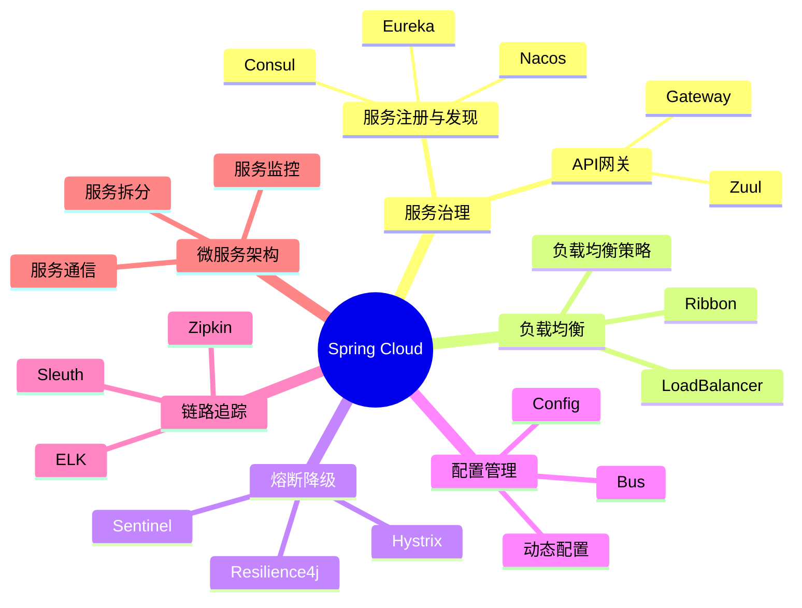

---

通过本章的学习，你应该已经掌握了Spring Cloud的核心概念、组件使用和微服务架构设计。Spring Cloud是构建分布式系统的重要框架，掌握Spring Cloud对于构建高可用、可扩展的微服务应用至关重要。

## 9. Spring Cloud Alibaba

Spring Cloud Alibaba是阿里巴巴开源的微服务框架，提供了丰富的微服务组件，与Spring Cloud生态完美集成。

### 9.1 Nacos服务注册与发现

Nacos是阿里巴巴开源的服务注册与发现组件，支持服务注册、配置管理、服务发现等功能。

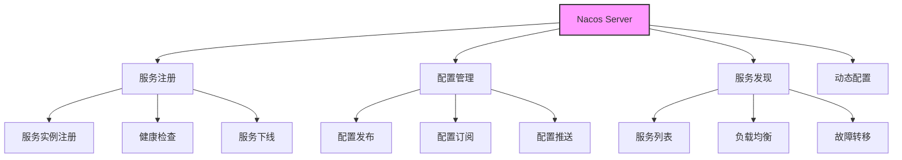

<Tabs>
  <TabItem value="nacos-server" label="Nacos Server配置" default>
```yaml title="Nacos Server配置"
spring:
  application:
    name: nacos-server
  cloud:
    nacos:
      discovery:
        server-addr: localhost:8848
        namespace: public
        group: DEFAULT_GROUP
      config:
        server-addr: localhost:8848
        namespace: public
        group: DEFAULT_GROUP
        file-extension: yaml
```
  </TabItem>
  <TabItem value="nacos-client" label="Nacos Client配置">
```yaml title="Nacos Client配置"
spring:
  application:
    name: user-service
  cloud:
    nacos:
      discovery:
        server-addr: localhost:8848
        namespace: public
        group: DEFAULT_GROUP
        cluster-name: DEFAULT
        metadata:
          version: 1.0.0
          zone: zone-a
      config:
        server-addr: localhost:8848
        namespace: public
        group: DEFAULT_GROUP
        file-extension: yaml
        refresh-enabled: true
```
  </TabItem>
</Tabs>

### 9.2 Sentinel流量控制

Sentinel是阿里巴巴开源的流量控制组件，提供了丰富的流量控制、熔断降级、系统负载保护等功能。

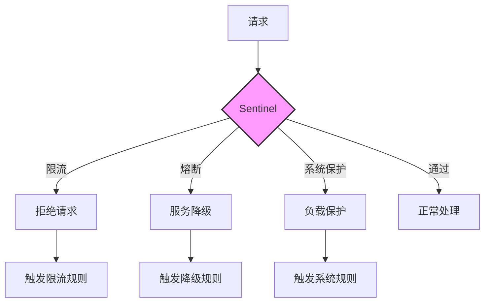

<Tabs>
  <TabItem value="sentinel-config" label="Sentinel配置" default>
```yaml title="Sentinel配置"
spring:
  cloud:
    sentinel:
      transport:
        dashboard: localhost:8080
        port: 8719
      datasource:
        ds:
          nacos:
            server-addr: localhost:8848
            dataId: sentinel-rules
            groupId: DEFAULT_GROUP
            rule-type: flow
```
  </TabItem>
  <TabItem value="sentinel-rules" label="Sentinel规则配置">
```java title="Sentinel规则配置"
@Configuration
public class SentinelConfig {
    
    @PostConstruct
    public void init() {
        // 流控规则
        initFlowRules();
        // 降级规则
        initDegradeRules();
        // 系统规则
        initSystemRules();
    }
    
    private void initFlowRules() {
        List<FlowRule> rules = new ArrayList<>();
        FlowRule rule = new FlowRule();
        rule.setResource("getUser");
        rule.setGrade(RuleConstant.FLOW_GRADE_QPS);
        rule.setCount(20);
        rule.setControlBehavior(RuleConstant.CONTROL_BEHAVIOR_WARM_UP);
        rule.setWarmUpPeriodSec(10);
        rules.add(rule);
        FlowRuleManager.loadRules(rules);
    }
    
    private void initDegradeRules() {
        List<DegradeRule> rules = new ArrayList<>();
        DegradeRule rule = new DegradeRule();
        rule.setResource("getUser");
        rule.setGrade(RuleConstant.DEGRADE_GRADE_EXCEPTION_RATIO);
        rule.setCount(0.5);
        rule.setTimeWindow(10);
        rules.add(rule);
        DegradeRuleManager.loadRules(rules);
    }
    
    private void initSystemRules() {
        List<SystemRule> rules = new ArrayList<>();
        SystemRule rule = new SystemRule();
        rule.setHighestSystemLoad(0.8);
        rule.setMaxThread(1000);
        rule.setQps(100);
        rules.add(rule);
        SystemRuleManager.loadRules(rules);
    }
}
```
  </TabItem>
</Tabs>

### 9.3 Seata分布式事务

Seata是阿里巴巴开源的分布式事务框架，支持AT、TCC、Saga和XA四种事务模式。

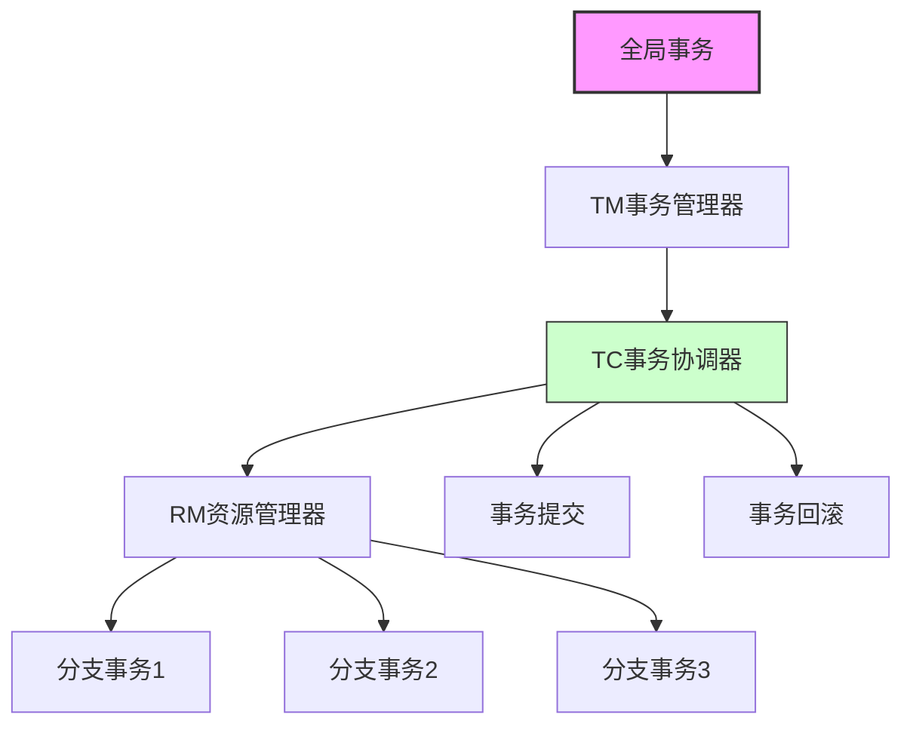

<Tabs>
  <TabItem value="seata-config" label="Seata配置" default>
```yaml title="Seata配置"
seata:
  tx-service-group: my_test_tx_group
  service:
    vgroup-mapping:
      my_test_tx_group: default
  registry:
    type: nacos
    nacos:
      server-addr: localhost:8848
      namespace: public
      group: SEATA_GROUP
  config:
    type: nacos
    nacos:
      server-addr: localhost:8848
      namespace: public
      group: SEATA_GROUP
      data-id: seataServer.properties
```
  </TabItem>
  <TabItem value="seata-usage" label="Seata使用示例">
```java title="Seata使用示例"
@Service
public class OrderService {
    
    @Autowired
    private OrderMapper orderMapper;
    
    @Autowired
    private AccountService accountService;
    
    @GlobalTransactional
    public void createOrder(Order order) {
        // 创建订单
        orderMapper.insert(order);
        
        // 扣减账户余额
        accountService.deduct(order.getUserId(), order.getAmount());
        
        // 如果这里抛出异常，整个事务会回滚
        if (order.getAmount() > 1000) {
            throw new RuntimeException("订单金额过大");
        }
    }
}
```
  </TabItem>
</Tabs>

### 9.4 RocketMQ消息队列

RocketMQ是阿里巴巴开源的消息队列，支持分布式事务消息、顺序消息、延时消息等特性。

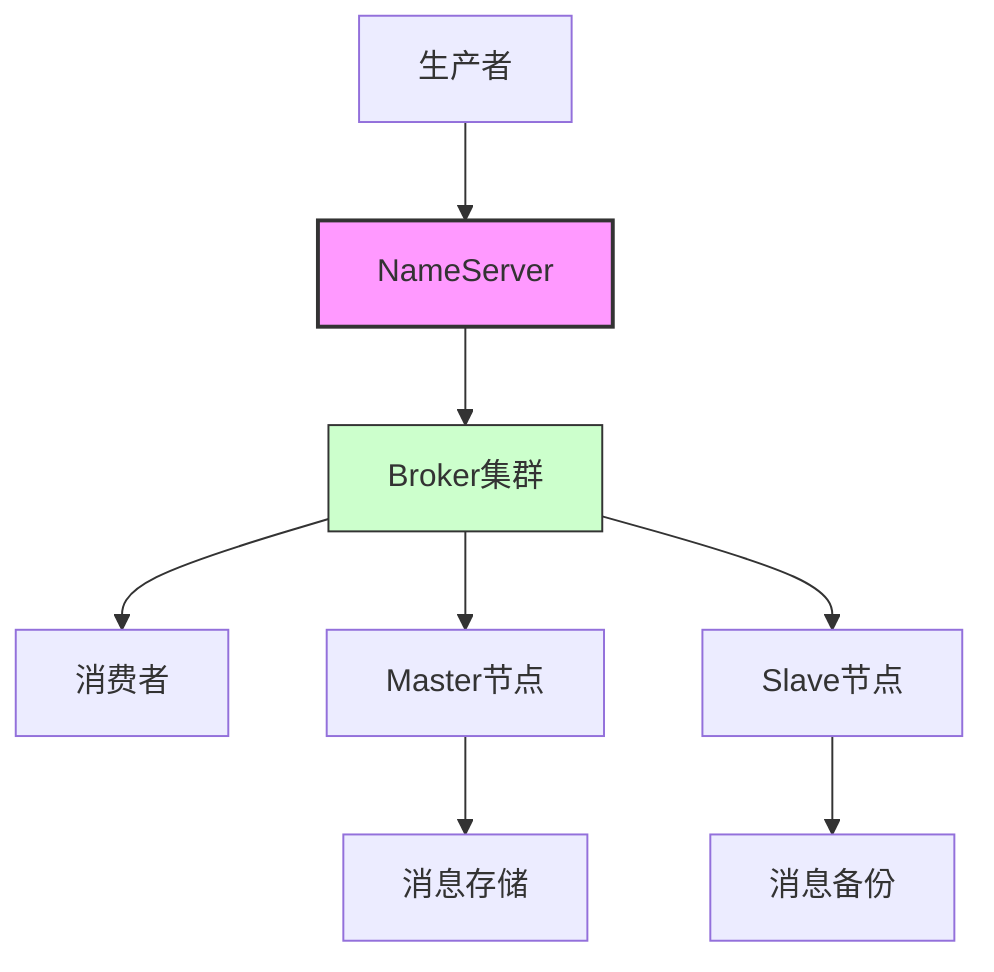

<Tabs>
  <TabItem value="rocketmq-config" label="RocketMQ配置" default>
```yaml title="RocketMQ配置"
rocketmq:
  name-server: localhost:9876
  producer:
    group: my-producer-group
    send-message-timeout: 3000
    retry-times-when-send-failed: 2
  consumer:
    group: my-consumer-group
    consume-timeout: 15
    max-reconsume-times: 3
```
  </TabItem>
  <TabItem value="rocketmq-usage" label="RocketMQ使用示例">
```java title="RocketMQ使用示例"
@Service
public class MessageService {
    
    @Autowired
    private RocketMQTemplate rocketMQTemplate;
    
    public void sendMessage(String topic, String message) {
        rocketMQTemplate.convertAndSend(topic, message);
    }
    
    public void sendOrderedMessage(String topic, String message, String hashKey) {
        rocketMQTemplate.syncSendOrderly(topic, message, hashKey);
    }
    
    @RocketMQMessageListener(
        topic = "order-topic",
        consumerGroup = "order-consumer-group"
    )
    public class OrderMessageListener implements RocketMQListener<String> {
        
        @Override
        public void onMessage(String message) {
            // 处理订单消息
            System.out.println("收到订单消息: " + message);
        }
    }
}
```
  </TabItem>
</Tabs>

## 10. 微服务架构设计模式

### 10.1 服务拆分模式

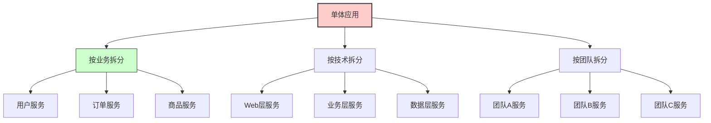

### 10.2 服务通信模式

<Tabs>
  <TabItem value="sync" label="同步通信" default>
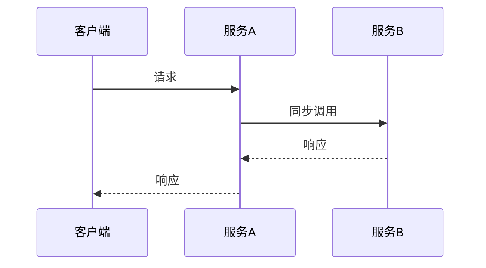
  </TabItem>
  <TabItem value="async" label="异步通信">
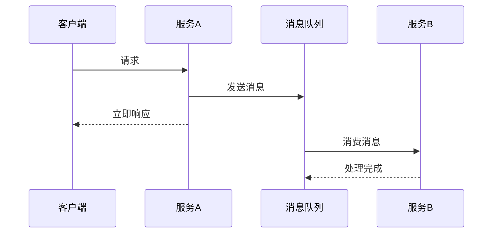
  </TabItem>
</Tabs>

### 10.3 数据一致性模式

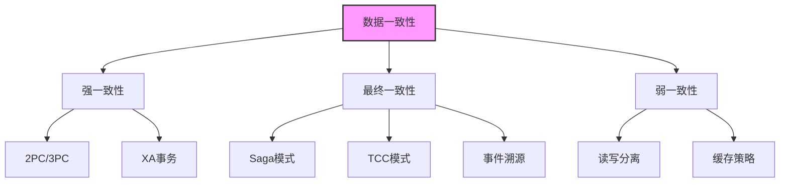

## 11. 微服务监控与运维

### 11.1 监控体系

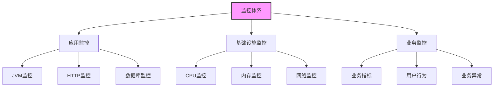

### 11.2 日志管理

<Tabs>
  <TabItem value="elk" label="ELK架构" default>
```mermaid
graph LR
    A[应用] --> B[Logstash]
    B --> C[Elasticsearch]
    C --> D[Kibana]
    
    A --> E[Filebeat]
    E --> B
    
    style B fill:#ffcccc,stroke:#333,stroke-width:1px
    style C fill:#ccffcc,stroke:#333,stroke-width:1px
    style D fill:#ccccff,stroke:#333,stroke-width:1px
```
  </TabItem>
  <TabItem value="logback" label="Logback配置">
```xml title="Logback配置"
<configuration>
    <appender name="STDOUT" class="ch.qos.logback.core.ConsoleAppender">
        <encoder>
            <pattern>%d{yyyy-MM-dd HH:mm:ss.SSS} [%thread] %-5level %logger{36} - %msg%n</pattern>
        </encoder>
    </appender>
    
    <appender name="FILE" class="ch.qos.logback.core.rolling.RollingFileAppender">
        <file>logs/application.log</file>
        <rollingPolicy class="ch.qos.logback.core.rolling.TimeBasedRollingPolicy">
            <fileNamePattern>logs/application.%d{yyyy-MM-dd}.log</fileNamePattern>
            <maxHistory>30</maxHistory>
        </rollingPolicy>
        <encoder>
            <pattern>%d{yyyy-MM-dd HH:mm:ss.SSS} [%thread] %-5level %logger{36} - %msg%n</pattern>
        </encoder>
    </appender>
    
    <root level="INFO">
        <appender-ref ref="STDOUT" />
        <appender-ref ref="FILE" />
    </root>
</configuration>
```
  </TabItem>
</Tabs>

## 12. 面试题精选（全面版）

### 12.1 Spring Cloud基础题

<Tabs>
  <TabItem value="q1" label="微服务架构" default>
  <div className="card">
  <div className="card__header">
  <h4>Q: 什么是微服务架构？它的优势和挑战是什么？</h4>
  </div>
  <div className="card__body">
  <p><strong>A:</strong> 微服务架构是一种将应用程序拆分为小型、独立服务的架构风格。</p>
  <p>优势包括：</p>
  <ul>
  <li><strong>服务拆分</strong>：按业务功能拆分，职责单一</li>
  <li><strong>独立部署</strong>：每个服务可独立部署和扩展</li>
  <li><strong>技术异构</strong>：不同服务可使用不同技术栈</li>
  <li><strong>故障隔离</strong>：单个服务故障不影响整体</li>
  <li><strong>团队自治</strong>：不同团队可独立开发维护</li>
  </ul>
  
  <p>挑战包括：</p>
  <ul>
  <li><strong>分布式复杂性</strong>：网络通信、数据一致性等</li>
  <li><strong>服务治理</strong>：服务发现、负载均衡、熔断降级</li>
  <li><strong>数据管理</strong>：分布式事务、数据一致性</li>
  <li><strong>运维复杂度</strong>：监控、日志、部署等</li>
  <li><strong>测试复杂性</strong>：集成测试、端到端测试</li>
  </ul>
  </div>
  </div>
  </TabItem>
  <TabItem value="q2" label="核心组件">
  <div className="card">
  <div className="card__header">
  <h4>Q: Spring Cloud的核心组件有哪些？</h4>
  </div>
  <div className="card__body">
  <p><strong>A:</strong> Spring Cloud的核心组件包括：</p>
  <ul>
  <li><strong>Eureka/Nacos/Consul</strong>：服务注册与发现</li>
  <li><strong>Gateway/Zuul</strong>：API网关</li>
  <li><strong>Ribbon/LoadBalancer</strong>：客户端负载均衡</li>
  <li><strong>Hystrix/Sentinel/Resilience4j</strong>：熔断降级</li>
  <li><strong>Config</strong>：配置管理</li>
  <li><strong>Bus</strong>：消息总线</li>
  <li><strong>Sleuth</strong>：分布式链路追踪</li>
  <li><strong>Zipkin</strong>：调用链可视化</li>
  <li><strong>Feign</strong>：声明式HTTP客户端</li>
  <li><strong>Stream</strong>：消息驱动</li>
  </ul>
  </div>
  </div>
  </TabItem>
</Tabs>

### 12.2 Spring Cloud Alibaba题

<Tabs>
  <TabItem value="q3" label="Nacos" default>
  <div className="card">
  <div className="card__header">
  <h4>Q: Nacos相比Eureka有什么优势？</h4>
  </div>
  <div className="card__body">
  <p><strong>A:</strong> Nacos相比Eureka的优势：</p>
  <ul>
  <li><strong>功能更全面</strong>：不仅支持服务注册发现，还支持配置管理</li>
  <li><strong>支持多数据中心</strong>：支持多环境、多命名空间</li>
  <li><strong>配置动态刷新</strong>：支持配置的实时推送和动态刷新</li>
  <li><strong>支持多种协议</strong>：支持HTTP、gRPC等多种协议</li>
  <li><strong>更好的可用性</strong>：支持集群部署，提供更好的高可用性</li>
  <li><strong>支持服务标签</strong>：支持服务分组、标签等高级功能</li>
  <li><strong>支持权重路由</strong>：支持基于权重的负载均衡</li>
  </ul>
  </div>
  </div>
  </TabItem>
  <TabItem value="q4" label="Sentinel">
  <div className="card">
  <div className="card__header">
  <h4>Q: Sentinel的流量控制策略有哪些？</h4>
  </div>
  <div className="card__body">
  <p><strong>A:</strong> Sentinel的流量控制策略：</p>
  <ul>
  <li><strong>QPS限流</strong>：基于每秒查询数的限流</li>
  <li><strong>并发线程数限流</strong>：基于并发线程数的限流</li>
  <li><strong>基于调用关系的限流</strong>：基于调用方、调用链路等</li>
  <li><strong>基于资源的限流</strong>：基于特定资源的限流</li>
  <li><strong>预热限流</strong>：系统预热期间逐步增加限流阈值</li>
  <li><strong>排队等待</strong>：超过阈值时排队等待而不是直接拒绝</li>
  <li><strong>热点参数限流</strong>：基于热点参数的限流</li>
  </ul>
  </div>
  </div>
  </TabItem>
</Tabs>

### 12.3 分布式系统题

<Tabs>
  <TabItem value="q5" label="分布式事务" default>
  <div className="card">
  <div className="card__header">
  <h4>Q: 如何实现分布式事务？</h4>
  </div>
  <div className="card__body">
  <p><strong>A:</strong> 实现分布式事务的方法：</p>
  <ul>
  <li><strong>2PC/3PC</strong>：两阶段/三阶段提交协议，强一致性但性能较差</li>
  <li><strong>TCC模式</strong>：Try-Confirm-Cancel模式，补偿事务</li>
  <li><strong>Saga模式</strong>：长事务的补偿模式，每步都有对应的补偿操作</li>
  <li><strong>消息事务</strong>：基于消息的最终一致性，通过消息表+定时任务实现</li>
  <li><strong>Seata</strong>：阿里开源的分布式事务框架，支持AT、TCC、Saga和XA模式</li>
  <li><strong>本地消息表</strong>：本地事务+消息表的方式</li>
  <li><strong>事务消息</strong>：基于消息队列的事务消息</li>
  </ul>
  </div>
  </div>
  </TabItem>
  <TabItem value="q6" label="服务治理">
  <div className="card">
  <div className="card__header">
  <h4>Q: 微服务治理包括哪些方面？</h4>
  </div>
  <div className="card__body">
  <p><strong>A:</strong> 微服务治理包括：</p>
  <ul>
  <li><strong>服务注册与发现</strong>：服务的注册、发现、健康检查</li>
  <li><strong>负载均衡</strong>：客户端负载均衡、服务端负载均衡</li>
  <li><strong>熔断降级</strong>：服务熔断、降级、限流</li>
  <li><strong>配置管理</strong>：集中配置、动态配置、配置版本管理</li>
  <li><strong>服务监控</strong>：性能监控、健康监控、业务监控</li>
  <li><strong>链路追踪</strong>：分布式调用链追踪、性能分析</li>
  <li><strong>服务安全</strong>：认证、授权、加密、审计</li>
  <li><strong>服务容错</strong>：重试、超时、降级策略</li>
  </ul>
  </div>
  </div>
  </TabItem>
</Tabs>

### 12.4 高级架构题

<Tabs>
  <TabItem value="q7" label="高可用设计" default>
  <div className="card">
  <div className="card__header">
  <h4>Q: 如何设计高可用的微服务架构？</h4>
  </div>
  <div className="card__body">
  <p><strong>A:</strong> 高可用微服务架构设计要点：</p>
  <ul>
  <li><strong>服务冗余</strong>：关键服务部署多个实例，避免单点故障</li>
  <li><strong>负载均衡</strong>：使用负载均衡器分发请求</li>
  <li><strong>熔断降级</strong>：实现熔断器模式，快速失败</li>
  <li><strong>超时重试</strong>：设置合理的超时时间和重试策略</li>
  <li><strong>异步处理</strong>：使用消息队列异步处理，提高响应速度</li>
  <li><strong>缓存策略</strong>：使用多级缓存提高性能</li>
  <li><strong>监控告警</strong>：实时监控系统状态，及时发现问题</li>
  <li><strong>灾备方案</strong>：多机房部署，数据备份</li>
  </ul>
  </div>
  </div>
  </TabItem>
  <TabItem value="q8" label="性能优化">
  <div className="card">
  <div className="card__header">
  <h4>Q: 微服务架构如何做性能优化？</h4>
  </div>
  <div className="card__body">
  <p><strong>A:</strong> 微服务架构性能优化策略：</p>
  <ul>
  <li><strong>服务拆分优化</strong>：合理拆分服务，避免过度拆分</li>
  <li><strong>缓存优化</strong>：使用Redis等缓存减少数据库访问</li>
  <li><strong>数据库优化</strong>：读写分离、分库分表、索引优化</li>
  <li><strong>异步处理</strong>：使用消息队列异步处理耗时操作</li>
  <li><strong>连接池优化</strong>：合理配置数据库连接池、HTTP连接池</li>
  <li><strong>负载均衡优化</strong>：选择合适的负载均衡算法</li>
  <li><strong>监控优化</strong>：使用APM工具分析性能瓶颈</li>
  <li><strong>JVM优化</strong>：合理配置JVM参数</li>
  </ul>
  </div>
  </div>
  </TabItem>
</Tabs>

### 12.5 实战应用题

<Tabs>
  <TabItem value="q9" label="架构设计" default>
  <div className="card">
  <div className="card__header">
  <h4>Q: 设计一个电商微服务架构，需要考虑哪些方面？</h4>
  </div>
  <div className="card__body">
  <p><strong>A:</strong> 电商微服务架构设计要点：</p>
  <ul>
  <li><strong>服务拆分</strong>：用户服务、商品服务、订单服务、库存服务、支付服务、物流服务</li>
  <li><strong>数据一致性</strong>：订单创建涉及库存扣减、支付等，需要分布式事务</li>
  <li><strong>高并发处理</strong>：秒杀场景需要限流、缓存、异步处理</li>
  <li><strong>服务治理</strong>：服务注册发现、负载均衡、熔断降级</li>
  <li><strong>监控告警</strong>：业务监控、性能监控、异常监控</li>
  <li><strong>安全防护</strong>：用户认证、权限控制、防刷</li>
  <li><strong>缓存策略</strong>：商品信息缓存、用户信息缓存</li>
  <li><strong>消息队列</strong>：订单异步处理、库存异步更新</li>
  </ul>
  </div>
  </div>
  </TabItem>
  <TabItem value="q10" label="问题排查">
  <div className="card">
  <div className="card__header">
  <h4>Q: 微服务架构中常见的问题如何排查？</h4>
  </div>
  <div className="card__body">
  <p><strong>A:</strong> 微服务架构问题排查方法：</p>
  <ul>
  <li><strong>服务调用失败</strong>：检查服务注册状态、网络连通性、服务健康状态</li>
  <li><strong>性能问题</strong>：使用APM工具分析调用链、数据库性能、JVM性能</li>
  <li><strong>数据不一致</strong>：检查分布式事务、消息队列、缓存一致性</li>
  <li><strong>服务熔断</strong>：检查熔断器配置、服务依赖、超时设置</li>
  <li><strong>配置问题</strong>：检查配置中心、配置刷新、配置版本</li>
  <li><strong>网络问题</strong>：检查网络延迟、丢包、防火墙设置</li>
  <li><strong>资源不足</strong>：检查CPU、内存、磁盘、网络带宽</li>
  <li><strong>日志分析</strong>：分析应用日志、系统日志、错误日志</li>
  </ul>
  </div>
  </div>
  </TabItem>
</Tabs>

:::tip Spring Cloud学习路径
🚀 **Spring Cloud学习建议**：
1. **基础阶段**：掌握Spring Boot、微服务架构概念
2. **组件学习**：学习Eureka、Gateway、Ribbon等核心组件
3. **高级特性**：深入理解熔断降级、配置管理、链路追踪
4. **Alibaba生态**：学习Nacos、Sentinel、Seata等组件
5. **架构设计**：掌握微服务拆分、服务治理、高可用设计
6. **实战应用**：通过项目实践巩固理论知识
7. **运维监控**：学习监控、日志、部署等运维知识
:::

```mermaid
mindmap
  root((Spring Cloud))
    基础组件
      服务注册发现
        Eureka
        Nacos
        Consul
      API网关
        Gateway
        Zuul
      负载均衡
        Ribbon
        LoadBalancer
    高级特性
      熔断降级
        Hystrix
        Sentinel
        Resilience4j
      配置管理
        Config
        Bus
        Nacos Config
      链路追踪
        Sleuth
        Zipkin
        ELK
    Alibaba生态
      Nacos
        服务注册
        配置管理
      Sentinel
        流量控制
        熔断降级
      Seata
        分布式事务
        AT模式
        TCC模式
      RocketMQ
        消息队列
        事务消息
    架构设计
      服务拆分
        按业务拆分
        按技术拆分
      服务治理
        服务监控
        服务安全
      高可用设计
        服务冗余
        负载均衡
        熔断降级
```

---

通过本章的全面学习，你应该已经掌握了Spring Cloud和Spring Cloud Alibaba的核心概念、组件使用、架构设计和最佳实践。这些知识将帮助你构建高可用、可扩展、易维护的微服务应用。记住，微服务架构不仅仅是技术选型，更是一种架构思维和设计理念。 