import Tabs from '@theme/Tabs';
import TabItem from '@theme/TabItem';
import TOCInline from '@theme/TOCInline';

# Spring MVC 详解

Spring MVC是Spring框架的核心Web模块，基于MVC（Model-View-Controller）设计模式构建，提供了灵活、强大的Web应用开发解决方案。它是构建企业级Web应用的标准选择。

:::info 本文内容概览
<TOCInline toc={toc} />
:::

:::tip 核心价值
**Spring MVC = 松耦合架构 + 灵活配置 + 强大扩展 + 企业级支持**
- 🏗️ **松耦合架构**：基于MVC设计模式，实现各层分离
- ⚙️ **灵活配置**：多种配置方式，适应不同需求
- 🔌 **强大扩展**：丰富的拦截器和视图技术
- 🔒 **企业级支持**：认证、安全、性能优化等特性
:::

## 1. Spring MVC基础概念

### 1.1 什么是Spring MVC？

Spring MVC是一个基于Java的Web框架，实现了MVC设计模式，用于构建Web应用程序。它提供了完整的Web开发解决方案，包括请求处理、视图渲染、数据绑定等功能。

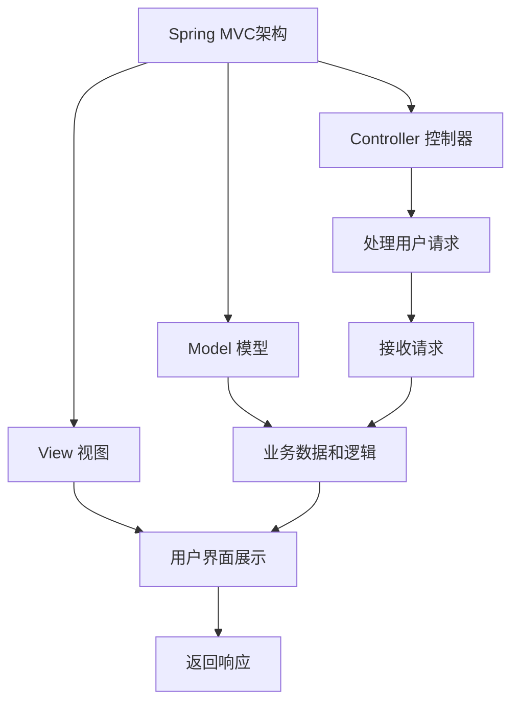

#### MVC架构模式

<Tabs>
  <TabItem value="model" label="Model（模型）" default>
  ```java
// Model（模型）- 数据和业务逻辑
@Entity
public class User {
    @Id
    @GeneratedValue(strategy = GenerationType.IDENTITY)
    private Long id;
    private String name;
    private String email;
    
    // getter和setter方法
    public Long getId() { return id; }
    public void setId(Long id) { this.id = id; }
    public String getName() { return name; }
    public void setName(String name) { this.name = name; }
    public String getEmail() { return email; }
    public void setEmail(String email) { this.email = email; }
}
  ```
  </TabItem>
  <TabItem value="view" label="View（视图）">
  ```html
  <!-- View（视图）- 用户界面 -->
  <!DOCTYPE html>
  <html>
  <head>
      <title>用户列表</title>
  </head>
  <body>
      <h1>用户列表</h1>
      <table>
          <tr>
              <th>ID</th>
              <th>姓名</th>
              <th>邮箱</th>
          </tr>
          <tr th:each="user : ${users}">
              <td th:text="${user.id}"></td>
              <td th:text="${user.name}"></td>
              <td th:text="${user.email}"></td>
          </tr>
      </table>
  </body>
  </html>
  ```
  </TabItem>
  <TabItem value="controller" label="Controller（控制器）">
  ```java
// Controller（控制器）- 处理请求和响应
@Controller
@RequestMapping("/users")
public class UserController {
    @Autowired
    private UserService userService;
    
    @GetMapping
    public String listUsers(Model model) {
        List<User> users = userService.findAll();
        model.addAttribute("users", users);
        return "user/list";
    }
}
```
  </TabItem>
</Tabs>

### 1.2 Spring MVC核心组件

Spring MVC框架由多个核心组件组成，它们协同工作处理web请求并生成响应。

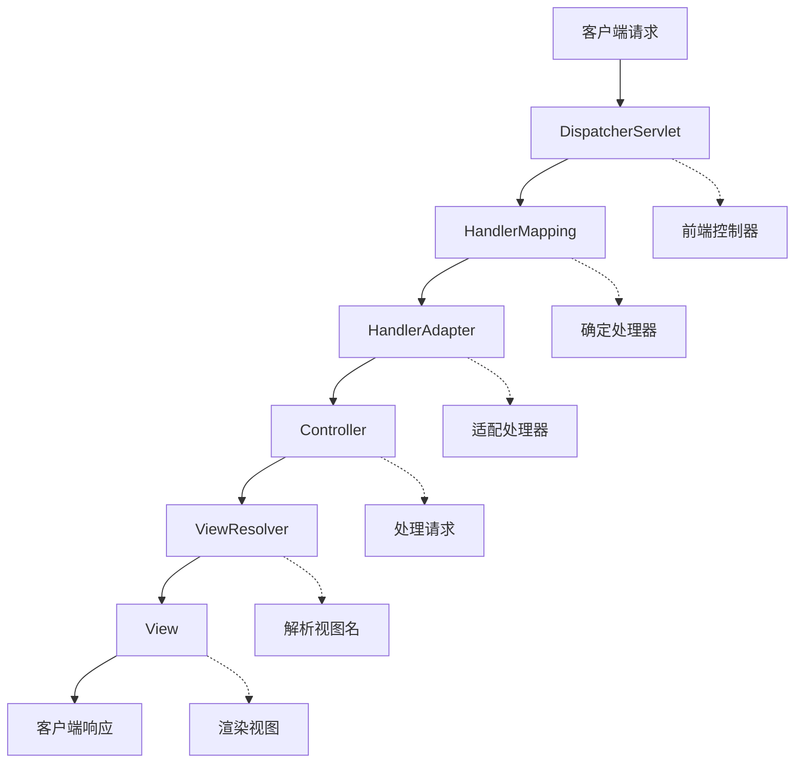

<div className="card">
<div className="card__body">

| 组件 | 作用 | 实现类 |
|------|------|--------|
| **DispatcherServlet** | 前端控制器，统一处理请求 | `org.springframework.web.servlet.DispatcherServlet` |
| **HandlerMapping** | 处理器映射，根据URL找到Handler | `RequestMappingHandlerMapping` |
| **HandlerAdapter** | 处理器适配器，执行Handler | `RequestMappingHandlerAdapter` |
| **ViewResolver** | 视图解析器，解析视图名称 | `InternalResourceViewResolver` |
| **Handler** | 处理器，执行业务逻辑 | `@Controller`注解的类 |
| **View** | 视图，渲染响应 | JSP、Thymeleaf等 |

</div>
</div>

:::info 组件协作
Spring MVC通过这些核心组件的协作，实现了请求的统一处理和响应的统一返回，提供了松耦合的Web开发架构。
:::

## 2. Spring MVC请求处理流程

### 2.1 请求处理流程详解

Spring MVC的请求处理流程是一个完整的责任链模式实现：

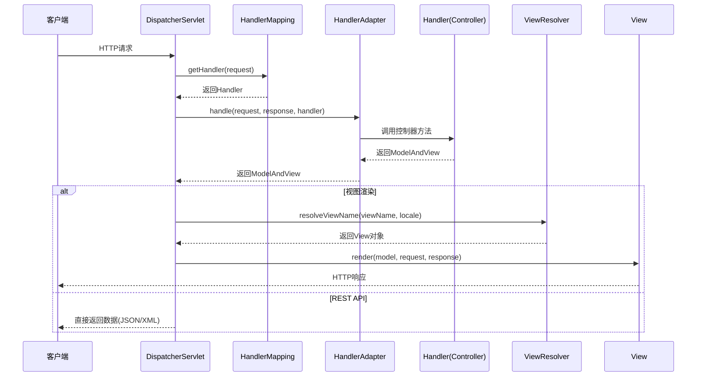

<details>
<summary>请求处理流程示例代码</summary>

```java title="请求处理流程"
public class RequestProcessingFlow {
    
    public void processRequest(HttpServletRequest request, HttpServletResponse response) {
        try {
            // 1. 请求进入DispatcherServlet
            DispatcherServlet dispatcher = new DispatcherServlet();
            
            // 2. 获取HandlerMapping
            HandlerMapping handlerMapping = getHandlerMapping();
            
            // 3. 根据请求URL找到对应的Handler
            Object handler = handlerMapping.getHandler(request);
            
            // 4. 获取HandlerAdapter
            HandlerAdapter handlerAdapter = getHandlerAdapter(handler);
            
            // 5. 执行Handler方法
            ModelAndView mv = handlerAdapter.handle(request, response, handler);
            
            // 6. 处理视图
            if (mv != null) {
                processView(request, response, mv);
            }
            
        } catch (Exception e) {
            // 异常处理
            handleException(request, response, e);
        }
    }
    
    private HandlerMapping getHandlerMapping() {
        return new RequestMappingHandlerMapping();
    }
    
    private HandlerAdapter getHandlerAdapter(Object handler) {
        return new RequestMappingHandlerAdapter();
    }
    
    private void processView(HttpServletRequest request, HttpServletResponse response, ModelAndView mv) {
        ViewResolver viewResolver = new InternalResourceViewResolver();
        View view = viewResolver.resolveViewName(mv.getViewName(), Locale.getDefault());
        view.render(mv.getModel(), request, response);
    }
}
```

</details>

#### 详细流程说明
<div className="card">
<div className="card__body">

1. **请求接收**：客户端发送HTTP请求到DispatcherServlet
2. **Handler映射**：通过HandlerMapping找到对应的Handler
3. **Handler适配**：通过HandlerAdapter适配并执行Handler
4. **业务处理**：Handler执行业务逻辑，返回ModelAndView
5. **视图解析**：通过ViewResolver解析视图名称
6. **视图渲染**：渲染视图并返回响应

</div>
</div>

### 2.2 核心接口详解

<Tabs>
  <TabItem value="handlerMapping" label="HandlerMapping" default>
  ```java
// HandlerMapping接口
public interface HandlerMapping {
    Object getHandler(HttpServletRequest request) throws Exception;
}

  // 实现类
  public class RequestMappingHandlerMapping implements HandlerMapping {
      @Override
      public Object getHandler(HttpServletRequest request) throws Exception {
          // 根据请求URL找到对应的Handler
          String uri = request.getRequestURI();
          // 查找映射关系
          return findHandler(uri);
      }
  }
  ```
  </TabItem>
  <TabItem value="handlerAdapter" label="HandlerAdapter">
  ```java
// HandlerAdapter接口
public interface HandlerAdapter {
    boolean supports(Object handler);
    ModelAndView handle(HttpServletRequest request, HttpServletResponse response, Object handler) throws Exception;
}

  // 实现类
  public class RequestMappingHandlerAdapter implements HandlerAdapter {
      @Override
      public boolean supports(Object handler) {
          return handler instanceof HandlerMethod;
      }
      
      @Override
      public ModelAndView handle(HttpServletRequest request, HttpServletResponse response, Object handler) throws Exception {
          // 调用控制器方法
          return invokeHandlerMethod(request, response, (HandlerMethod) handler);
      }
  }
  ```
  </TabItem>
  <TabItem value="viewResolver" label="ViewResolver">
  ```java
// ViewResolver接口
public interface ViewResolver {
    View resolveViewName(String viewName, Locale locale) throws Exception;
}

// View接口
public interface View {
    void render(Map<String, ?> model, HttpServletRequest request, HttpServletResponse response) throws Exception;
}
  
  // 实现类
  public class InternalResourceViewResolver implements ViewResolver {
      private String prefix;
      private String suffix;
      
      @Override
      public View resolveViewName(String viewName, Locale locale) throws Exception {
          // 解析视图名称，如"user/list" -> "/WEB-INF/views/user/list.jsp"
          String viewPath = prefix + viewName + suffix;
          return new JstlView(viewPath);
      }
  }
  ```
  </TabItem>
</Tabs>

## 3. 控制器开发

### 3.1 控制器基础

控制器是Spring MVC的核心组件，负责处理HTTP请求并返回响应。

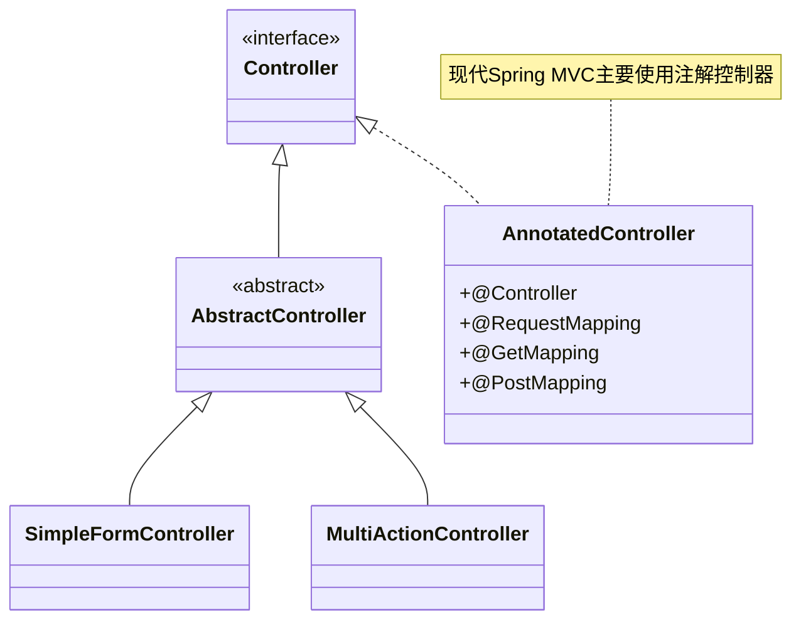

<div className="card">
<div className="card__body">

```java title="基础控制器"
@Controller
@RequestMapping("/api/users")
public class UserController {
    
    @Autowired
    private UserService userService;
    
    // GET请求 - 获取用户列表
    @GetMapping
    public ResponseEntity<List<User>> getUsers() {
        List<User> users = userService.findAll();
        return ResponseEntity.ok(users);
    }
    
    // GET请求 - 获取单个用户
    @GetMapping("/{id}")
    public ResponseEntity<User> getUser(@PathVariable Long id) {
        User user = userService.findById(id);
        if (user != null) {
            return ResponseEntity.ok(user);
        }
        return ResponseEntity.notFound().build();
    }
    
    // POST请求 - 创建用户
    @PostMapping
    public ResponseEntity<User> createUser(@RequestBody User user) {
        User savedUser = userService.save(user);
        return ResponseEntity.status(HttpStatus.CREATED).body(savedUser);
    }
    
    // PUT请求 - 更新用户
    @PutMapping("/{id}")
    public ResponseEntity<User> updateUser(@PathVariable Long id, @RequestBody User user) {
        user.setId(id);
        User updatedUser = userService.update(user);
        return ResponseEntity.ok(updatedUser);
    }
    
    // DELETE请求 - 删除用户
    @DeleteMapping("/{id}")
    public ResponseEntity<Void> deleteUser(@PathVariable Long id) {
        userService.deleteById(id);
        return ResponseEntity.noContent().build();
    }
}
```

</div>
</div>

### 3.2 请求映射注解

Spring MVC提供了丰富的请求映射注解，支持各种HTTP方法和参数绑定：

<Tabs>
  <TabItem value="requestMapping" label="@RequestMapping" default>
  ```java
  // @RequestMapping - 通用映射
    @RequestMapping(value = "/users", method = RequestMethod.GET)
    public String getUsers() {
        return "user/list";
    }
    
  // 可以在类级别使用
  @Controller
  @RequestMapping("/users")
  public class UserController {
      // 方法映射会相对于类映射
      @RequestMapping("/{id}")  // 实际路径为/users/{id}
      public String getUser(@PathVariable Long id) {
          return "user/detail";
      }
  }
  ```
  </TabItem>
  <TabItem value="httpMethods" label="HTTP方法注解">
  ```java
  // @GetMapping - GET请求映射
    @GetMapping("/users/{id}")
    public String getUser(@PathVariable Long id) {
        return "user/detail";
    }
    
  // @PostMapping - POST请求映射
    @PostMapping("/users")
    public String createUser(@ModelAttribute User user) {
        return "redirect:/users";
    }
    
  // @PutMapping - PUT请求映射
    @PutMapping("/users/{id}")
    public String updateUser(@PathVariable Long id, @RequestBody User user) {
        return "user/updated";
    }
    
  // @DeleteMapping - DELETE请求映射
    @DeleteMapping("/users/{id}")
    public String deleteUser(@PathVariable Long id) {
        return "user/deleted";
    }
    
  // @PatchMapping - PATCH请求映射
    @PatchMapping("/users/{id}")
    public String patchUser(@PathVariable Long id, @RequestBody User user) {
        return "user/patched";
}
```
  </TabItem>
</Tabs>

:::tip 注解选择
- 使用具体的HTTP方法注解（@GetMapping、@PostMapping等）比@RequestMapping更清晰
- 对于RESTful API，推荐使用@RestController注解
- 对于传统Web应用，使用@Controller注解
:::

### 3.3 参数绑定注解

Spring MVC提供了多种参数绑定注解，支持各种参数类型的自动绑定：

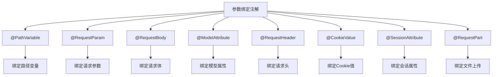

<Tabs>
  <TabItem value="path" label="@PathVariable" default>
  ```java
  // @PathVariable - 路径变量
    @GetMapping("/users/{id}/orders/{orderId}")
    public String getUserOrder(@PathVariable Long id, @PathVariable Long orderId) {
        return "user/order";
    }
  ```
  </TabItem>
  <TabItem value="param" label="@RequestParam">
  ```java
  // @RequestParam - 请求参数
    @GetMapping("/search")
    public String search(@RequestParam String keyword, 
                        @RequestParam(defaultValue = "1") int page,
                        @RequestParam(required = false) String sort) {
        return "search/result";
    }
  ```
  </TabItem>
  <TabItem value="body" label="@RequestBody">
  ```java
  // @RequestBody - 请求体
    @PostMapping("/api/users")
    public ResponseEntity<User> createUser(@RequestBody User user) {
        User savedUser = userService.save(user);
        return ResponseEntity.ok(savedUser);
    }
  ```
  </TabItem>
  <TabItem value="other" label="其他参数注解">
  ```java
  // @ModelAttribute - 模型属性
    @PostMapping("/users")
    public String createUser(@ModelAttribute User user, Model model) {
        userService.save(user);
        model.addAttribute("message", "用户创建成功");
        return "user/success";
    }
    
  // @RequestHeader - 请求头
    @GetMapping("/api/data")
    public ResponseEntity<String> getData(@RequestHeader("Authorization") String auth) {
        return ResponseEntity.ok("数据");
    }
    
  // @CookieValue - Cookie值
    @GetMapping("/preferences")
    public String getPreferences(@CookieValue("theme") String theme) {
        return "preferences";
    }
    
  // @SessionAttribute - 会话属性
    @GetMapping("/profile")
    public String getProfile(@SessionAttribute("user") User user) {
        return "user/profile";
    }
    
  // @RequestPart - 文件上传
    @PostMapping("/upload")
    public String uploadFile(@RequestPart("file") MultipartFile file) {
        return "upload/success";
}
```
  </TabItem>
</Tabs>

## 4. 拦截器机制

### 4.1 拦截器基础

拦截器是Spring MVC的重要特性，允许在请求处理的不同阶段进行拦截和处理。

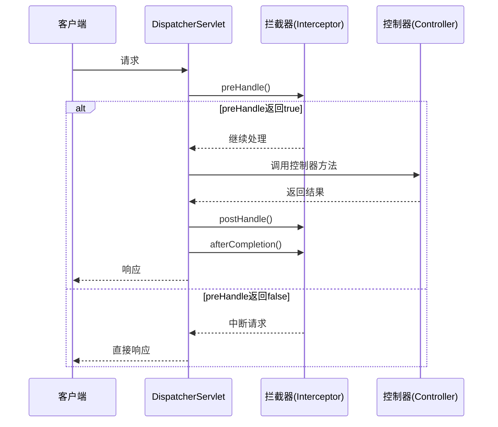

<div className="card">
<div className="card__body">

```java title="拦截器实现"
// 实现HandlerInterceptor接口
public class LoggingInterceptor implements HandlerInterceptor {
    
    private static final Logger logger = LoggerFactory.getLogger(LoggingInterceptor.class);
    
    @Override
    public boolean preHandle(HttpServletRequest request, HttpServletResponse response, Object handler) throws Exception {
        logger.info("请求开始: {} {}", request.getMethod(), request.getRequestURI());
        request.setAttribute("startTime", System.currentTimeMillis());
        return true; // 返回true继续执行，返回false中断请求
    }
    
    @Override
    public void postHandle(HttpServletRequest request, HttpServletResponse response, Object handler, ModelAndView modelAndView) throws Exception {
        logger.info("请求处理完成: {} {}", request.getMethod(), request.getRequestURI());
    }
    
    @Override
    public void afterCompletion(HttpServletRequest request, HttpServletResponse response, Object handler, Exception ex) throws Exception {
        long startTime = (Long) request.getAttribute("startTime");
        long endTime = System.currentTimeMillis();
        logger.info("请求完成: {} {} 耗时: {}ms", request.getMethod(), request.getRequestURI(), endTime - startTime);
    }
}
```

</div>
</div>

<div className="card">
<div className="card__header">
<h4>拦截器方法说明</h4>
</div>
<div className="card__body">

| 方法 | 执行时机 | 用途 | 能否中断请求 |
|------|---------|------|------------|
| **preHandle** | 控制器方法执行前 | 前置检查、认证授权 | 可以 |
| **postHandle** | 控制器方法执行后，视图渲染前 | 模型数据修改、视图选择 | 不可以 |
| **afterCompletion** | 视图渲染完成后 | 清理资源、日志记录 | 不可以 |

</div>
</div>

### 4.2 拦截器应用

<Tabs>
  <TabItem value="auth" label="认证拦截器" default>
```java title="认证拦截器"
public class AuthenticationInterceptor implements HandlerInterceptor {
    
    @Override
    public boolean preHandle(HttpServletRequest request, HttpServletResponse response, Object handler) throws Exception {
        String token = request.getHeader("Authorization");
        
        if (token == null || !isValidToken(token)) {
            response.setStatus(HttpServletResponse.SC_UNAUTHORIZED);
            return false;
        }
        
        // 设置用户信息到请求属性
        User user = getUserFromToken(token);
        request.setAttribute("currentUser", user);
        
        return true;
    }
    
    private boolean isValidToken(String token) {
        return token != null && token.startsWith("Bearer ");
    }
    
    private User getUserFromToken(String token) {
        // 从token中获取用户信息
        return new User();
    }
}
```
  </TabItem>
  <TabItem value="perm" label="权限拦截器">
```java title="权限拦截器"
public class AuthorizationInterceptor implements HandlerInterceptor {
    
    @Override
    public boolean preHandle(HttpServletRequest request, HttpServletResponse response, Object handler) throws Exception {
        User user = (User) request.getAttribute("currentUser");
        
        if (user == null) {
            response.setStatus(HttpServletResponse.SC_UNAUTHORIZED);
            return false;
        }
        
        // 检查用户权限
        if (!hasPermission(user, request.getRequestURI())) {
            response.setStatus(HttpServletResponse.SC_FORBIDDEN);
            return false;
        }
        
        return true;
    }
    
    private boolean hasPermission(User user, String uri) {
        return user.getPermissions().contains(uri);
    }
}
```
  </TabItem>
  <TabItem value="config" label="拦截器配置">
```java title="拦截器配置"
@Configuration
public class WebMvcConfig implements WebMvcConfigurer {
    
    @Override
    public void addInterceptors(InterceptorRegistry registry) {
        // 添加日志拦截器
        registry.addInterceptor(new LoggingInterceptor())
                .addPathPatterns("/**")
                .excludePathPatterns("/static/**", "/error");
        
        // 添加认证拦截器
        registry.addInterceptor(new AuthenticationInterceptor())
                .addPathPatterns("/api/**")
                  .excludePathPatterns("/api/login", "/api/register");
        
        // 添加权限拦截器
        registry.addInterceptor(new AuthorizationInterceptor())
                  .addPathPatterns("/api/**")
                  .excludePathPatterns("/api/login", "/api/register", "/api/public/**");
    }
}
```
  </TabItem>
</Tabs>

## 5. 异常处理

### 5.1 全局异常处理

Spring MVC提供了全局异常处理机制，可以统一处理应用中的异常：

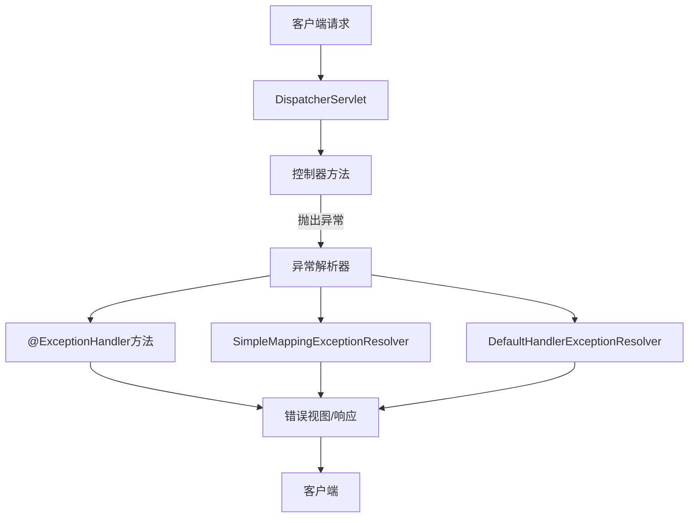

<Tabs>
  <TabItem value="handler" label="@ExceptionHandler" default>
  ```java title="方法级异常处理"
  @Controller
  public class UserController {
      
      // 控制器内的异常处理
      @ExceptionHandler(UserNotFoundException.class)
      public ResponseEntity<ErrorResponse> handleUserNotFoundException(UserNotFoundException ex) {
        ErrorResponse error = new ErrorResponse();
          error.setMessage(ex.getMessage());
          error.setStatus(HttpStatus.NOT_FOUND.value());
          
          return ResponseEntity.status(HttpStatus.NOT_FOUND).body(error);
      }
      
      @GetMapping("/users/{id}")
      public ResponseEntity<User> getUser(@PathVariable Long id) {
          User user = userService.findById(id);
          if (user == null) {
              throw new UserNotFoundException("用户不存在: " + id);
          }
          return ResponseEntity.ok(user);
      }
  }
  ```
  </TabItem>
  <TabItem value="advice" label="@ControllerAdvice">
  ```java title="全局异常处理"
  @ControllerAdvice
  public class GlobalExceptionHandler {
      
      @ExceptionHandler(UserNotFoundException.class)
      public ResponseEntity<ErrorResponse> handleUserNotFoundException(UserNotFoundException ex) {
        ErrorResponse error = new ErrorResponse();
          error.setMessage(ex.getMessage());
          error.setStatus(HttpStatus.NOT_FOUND.value());
          
          return ResponseEntity.status(HttpStatus.NOT_FOUND).body(error);
      }
      
      @ExceptionHandler(ValidationException.class)
      public ResponseEntity<ErrorResponse> handleValidationException(ValidationException ex) {
        ErrorResponse error = new ErrorResponse();
          error.setMessage("参数验证失败");
          error.setStatus(HttpStatus.BAD_REQUEST.value());
          error.setErrors(ex.getErrors());
          
          return ResponseEntity.status(HttpStatus.BAD_REQUEST).body(error);
      }
      
    @ExceptionHandler(Exception.class)
      public ResponseEntity<ErrorResponse> handleGenericException(Exception ex) {
        ErrorResponse error = new ErrorResponse();
          error.setMessage("服务器内部错误");
          error.setStatus(HttpStatus.INTERNAL_SERVER_ERROR.value());
        
        return ResponseEntity.status(HttpStatus.INTERNAL_SERVER_ERROR).body(error);
    }
}
```
  </TabItem>
  <TabItem value="resolver" label="异常解析器">
  ```java title="自定义异常解析器"
  @Configuration
  public class WebMvcConfig implements WebMvcConfigurer {
      
      @Override
      public void configureHandlerExceptionResolvers(List<HandlerExceptionResolver> resolvers) {
          SimpleMappingExceptionResolver exceptionResolver = new SimpleMappingExceptionResolver();
          
          // 配置异常映射
          Properties mappings = new Properties();
          mappings.setProperty("UserNotFoundException", "error/not-found");
          mappings.setProperty("AccessDeniedException", "error/access-denied");
          exceptionResolver.setExceptionMappings(mappings);
          
          // 设置默认错误页
          exceptionResolver.setDefaultErrorView("error/generic");
          exceptionResolver.setExceptionAttribute("exception");
          
          resolvers.add(exceptionResolver);
      }
  }
  ```
  </TabItem>
</Tabs>

### 5.2 自定义异常

```java title="自定义异常类"
// 用户不存在异常
public class UserNotFoundException extends RuntimeException {
    public UserNotFoundException(String message) {
        super(message);
    }
}

// 验证异常
public class ValidationException extends RuntimeException {
    private List<String> errors;
    
    public ValidationException(String message, List<String> errors) {
        super(message);
        this.errors = errors;
    }
    
    public List<String> getErrors() {
        return errors;
    }
}
```

## 6. 数据验证

### 6.1 Bean校验

Spring MVC集成了Bean Validation API，支持声明式数据验证：

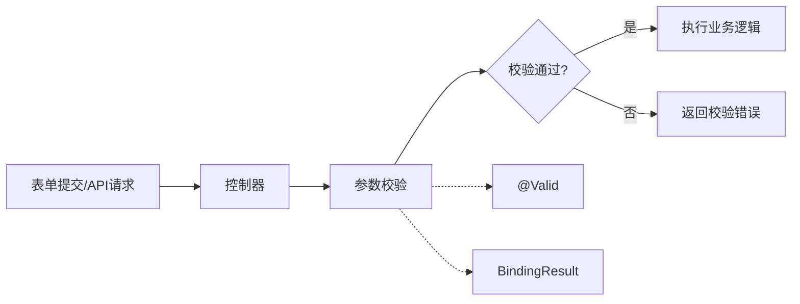

<div className="card">
<div className="card__body">

```java title="Bean验证示例"
// 验证模型
public class UserDTO {
    @NotBlank(message = "用户名不能为空")
    @Size(min = 4, max = 50, message = "用户名长度必须在4-50之间")
    private String username;
    
    @NotBlank(message = "密码不能为空")
    @Pattern(regexp = "^(?=.*[A-Za-z])(?=.*\\d)[A-Za-z\\d]{8,}$", message = "密码至少8位，包含字母和数字")
    private String password;
    
    @NotBlank(message = "电子邮件不能为空")
    @Email(message = "电子邮件格式不正确")
    private String email;
    
    @Min(value = 18, message = "年龄必须大于等于18")
    private int age;
    
    // getter和setter方法
}

// 控制器中使用
@RestController
@RequestMapping("/api/users")
public class UserController {
    
    @PostMapping("/register")
    public ResponseEntity<?> register(@Valid @RequestBody UserDTO userDTO, BindingResult result) {
        if (result.hasErrors()) {
            Map<String, String> errors = new HashMap<>();
            result.getFieldErrors().forEach(err -> 
                errors.put(err.getField(), err.getDefaultMessage())
            );
            return ResponseEntity.badRequest().body(errors);
        }
        
        // 业务处理
        return ResponseEntity.ok("用户注册成功");
    }
}
```

</div>
</div>

### 6.2 常用校验注解

<div className="card">
<div className="card__body">

| 注解 | 说明 | 示例 |
|------|------|------|
| **@NotNull** | 不能为null | `@NotNull(message = "不能为空")` |
| **@NotEmpty** | 不能为空字符串或集合 | `@NotEmpty(message = "不能为空")` |
| **@NotBlank** | 不能为空白字符串 | `@NotBlank(message = "不能为空白")` |
| **@Size** | 长度或大小限制 | `@Size(min = 2, max = 10)` |
| **@Min/@Max** | 最小/最大值 | `@Min(value = 18)` |
| **@Pattern** | 正则表达式校验 | `@Pattern(regexp = "\\d+")` |
| **@Email** | 电子邮件格式 | `@Email(message = "邮箱格式不正确")` |
| **@Future/@Past** | 日期在当前时间之后/之前 | `@Future(message = "必须是将来时间")` |
| **@AssertTrue** | 必须为true | `@AssertTrue(message = "必须接受协议")` |

</div>
</div>

### 6.3 分组校验

```java title="分组校验示例"
// 定义验证组
public interface Create {}
public interface Update {}

// 模型使用分组
public class UserDTO {
    @NotNull(groups = {Update.class})
    private Long id;
    
    @NotBlank(groups = {Create.class, Update.class})
    private String username;
    
    @NotBlank(groups = {Create.class})
    @Null(groups = {Update.class})
    private String password;
    
    // getter和setter方法
}

// 控制器使用分组
@RestController
@RequestMapping("/api/users")
public class UserController {
    
    @PostMapping
    public ResponseEntity<?> create(@Validated(Create.class) @RequestBody UserDTO user, BindingResult result) {
        if (result.hasErrors()) {
            return ResponseEntity.badRequest().body(getErrors(result));
        }
        return ResponseEntity.ok("用户创建成功");
    }
    
    @PutMapping("/{id}")
    public ResponseEntity<?> update(@Validated(Update.class) @RequestBody UserDTO user, BindingResult result) {
        if (result.hasErrors()) {
            return ResponseEntity.badRequest().body(getErrors(result));
        }
        return ResponseEntity.ok("用户更新成功");
    }
    
    private Map<String, String> getErrors(BindingResult result) {
        Map<String, String> errors = new HashMap<>();
        result.getFieldErrors().forEach(err -> 
            errors.put(err.getField(), err.getDefaultMessage())
        );
        return errors;
    }
}
```

## 7. 文件上传

### 7.1 文件上传配置

Spring MVC提供了内置的文件上传支持，可以轻松处理文件上传请求：

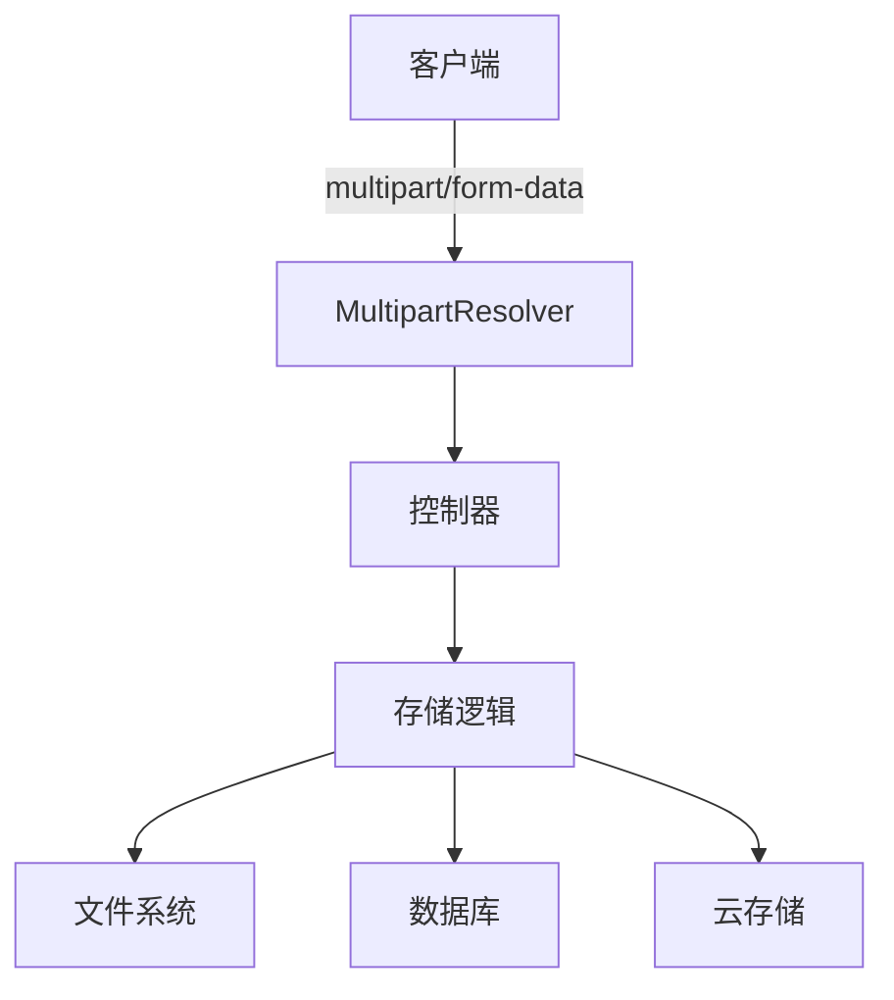

<Tabs>
  <TabItem value="config" label="上传配置" default>
  ```java title="上传配置"
@Configuration
public class FileUploadConfig {
    
    @Bean
    public MultipartResolver multipartResolver() {
        CommonsMultipartResolver resolver = new CommonsMultipartResolver();
        resolver.setMaxUploadSize(10 * 1024 * 1024); // 10MB
        resolver.setMaxUploadSizePerFile(5 * 1024 * 1024); // 5MB
        resolver.setDefaultEncoding("UTF-8");
        return resolver;
    }
}
  
  // 或使用SpringBoot中的配置
  @SpringBootApplication
  public class Application {
      
      public static void main(String[] args) {
          SpringApplication.run(Application.class, args);
      }
  }
  
  // application.yml
  /*
  spring:
    servlet:
      multipart:
        max-file-size: 5MB
        max-request-size: 10MB
        enabled: true
  */
  ```
  </TabItem>
  <TabItem value="controller" label="控制器实现">
```java title="文件上传控制器"
@Controller
public class FileUploadController {
      
      @Value("${file.upload-dir}")
      private String uploadDir;
    
    @PostMapping("/upload")
    public String uploadFile(@RequestParam("file") MultipartFile file, Model model) {
        if (file.isEmpty()) {
              model.addAttribute("message", "请选择文件");
            return "upload/form";
        }
        
        try {
              // 生成文件名
              String fileName = UUID.randomUUID().toString() + 
                  "_" + file.getOriginalFilename();
              
              // 确保目录存在
              Path uploadPath = Paths.get(uploadDir);
              if (!Files.exists(uploadPath)) {
                  Files.createDirectories(uploadPath);
              }
              
            // 保存文件
              Path filePath = uploadPath.resolve(fileName);
              Files.copy(file.getInputStream(), filePath, StandardCopyOption.REPLACE_EXISTING);
              
            model.addAttribute("message", "文件上传成功: " + fileName);
              return "upload/success";
          } catch (IOException e) {
              model.addAttribute("message", "文件上传失败: " + e.getMessage());
              return "upload/form";
          }
      }
      
      @GetMapping("/upload")
      public String showUploadForm() {
          return "upload/form";
      }
  }
  ```
  </TabItem>
  <TabItem value="multifiles" label="多文件上传">
  ```java title="多文件上传"
  @Controller
  public class MultiFileUploadController {
      
      @PostMapping("/upload/multi")
      public String uploadMultipleFiles(@RequestParam("files") MultipartFile[] files, Model model) {
          List<String> uploadedFiles = new ArrayList<>();
          
          for (MultipartFile file : files) {
              if (!file.isEmpty()) {
        try {
            String fileName = saveFile(file);
                      uploadedFiles.add(fileName);
                  } catch (IOException e) {
                      model.addAttribute("message", "文件上传失败: " + e.getMessage());
                      return "upload/form";
                  }
              }
          }
          
          model.addAttribute("message", "上传了 " + uploadedFiles.size() + " 个文件");
          model.addAttribute("files", uploadedFiles);
          return "upload/success";
    }
    
    private String saveFile(MultipartFile file) throws IOException {
          // 文件保存逻辑
          return "savedFileName.ext";
      }
  }
  ```
  </TabItem>
</Tabs>

### 7.2 文件上传视图

<div className="card">
<div className="card__body">

```html title="文件上传表单"
<!-- upload/form.html -->
<!DOCTYPE html>
<html xmlns:th="http://www.thymeleaf.org">
<head>
    <title>文件上传</title>
</head>
<body>
    <h1>文件上传</h1>
    
    <div th:if="${message}">
        <p th:text="${message}"></p>
    </div>
    
    <form method="POST" action="/upload" enctype="multipart/form-data">
        <div>
            <label for="file">选择文件:</label>
            <input type="file" id="file" name="file" />
        </div>
        <div>
            <button type="submit">上传</button>
        </div>
    </form>
    
    <h2>多文件上传</h2>
    <form method="POST" action="/upload/multi" enctype="multipart/form-data">
        <div>
            <label for="files">选择文件:</label>
            <input type="file" id="files" name="files" multiple />
        </div>
        <div>
            <button type="submit">上传</button>
        </div>
    </form>
</body>
</html>
```

</div>
</div>

## 8. 视图技术

### 8.1 视图解析器

Spring MVC支持多种视图技术，通过视图解析器将逻辑视图名解析为实际的视图对象：

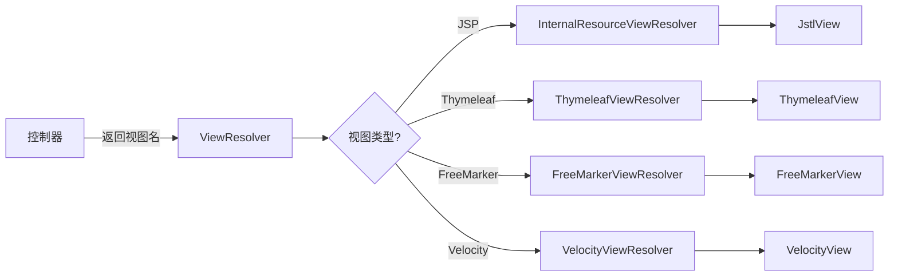

<Tabs>
  <TabItem value="jsp" label="JSP视图" default>
  ```java title="JSP视图解析器"
  @Configuration
  public class WebConfig implements WebMvcConfigurer {
      
      @Bean
      public ViewResolver jspViewResolver() {
          InternalResourceViewResolver resolver = new InternalResourceViewResolver();
          resolver.setPrefix("/WEB-INF/views/");
          resolver.setSuffix(".jsp");
          resolver.setViewClass(JstlView.class);
          return resolver;
      }
  }
  
  // 控制器
  @Controller
  public class UserController {
      
      @GetMapping("/users")
      public String listUsers(Model model) {
          // 逻辑视图名 "user/list" 解析为 "/WEB-INF/views/user/list.jsp"
          return "user/list";
    }
}
```
  </TabItem>
  <TabItem value="thymeleaf" label="Thymeleaf视图">
  ```java title="Thymeleaf视图解析器"
  @Configuration
  public class ThymeleafConfig {
      
      @Bean
      public SpringTemplateEngine templateEngine() {
          SpringTemplateEngine engine = new SpringTemplateEngine();
          engine.setTemplateResolver(templateResolver());
          return engine;
      }
      
      @Bean
      public ThymeleafViewResolver thymeleafViewResolver() {
          ThymeleafViewResolver resolver = new ThymeleafViewResolver();
          resolver.setTemplateEngine(templateEngine());
          resolver.setCharacterEncoding("UTF-8");
          return resolver;
      }
      
      @Bean
      public SpringResourceTemplateResolver templateResolver() {
          SpringResourceTemplateResolver resolver = new SpringResourceTemplateResolver();
          resolver.setPrefix("classpath:/templates/");
          resolver.setSuffix(".html");
          resolver.setTemplateMode(TemplateMode.HTML);
          resolver.setCharacterEncoding("UTF-8");
          return resolver;
      }
  }
  ```
  </TabItem>
  <TabItem value="multiple" label="多视图解析器">
  ```java title="多视图解析器"
  @Configuration
  public class MultipleViewResolversConfig implements WebMvcConfigurer {
      
      @Bean
      public ViewResolver thymeleafViewResolver() {
          ThymeleafViewResolver resolver = new ThymeleafViewResolver();
          resolver.setTemplateEngine(templateEngine());
          resolver.setCharacterEncoding("UTF-8");
          resolver.setOrder(1);
          resolver.setViewNames(new String[] {"*.html"});
          return resolver;
      }
      
      @Bean
      public ViewResolver jspViewResolver() {
          InternalResourceViewResolver resolver = new InternalResourceViewResolver();
          resolver.setPrefix("/WEB-INF/views/");
          resolver.setSuffix(".jsp");
          resolver.setViewClass(JstlView.class);
          resolver.setOrder(2);
          return resolver;
      }
  }
  ```
  </TabItem>
</Tabs>

### 8.2 视图内容协商

Spring MVC支持内容协商，可以根据请求的Accept头或URL参数返回不同格式的响应：

<div className="card">
<div className="card__body">

```java title="内容协商配置"
@Configuration
public class ContentNegotiationConfig implements WebMvcConfigurer {
    
    @Override
    public void configureContentNegotiation(ContentNegotiationConfigurer configurer) {
        // 通过URL参数进行内容协商
        configurer
            .favorParameter(true)
            .parameterName("format")
            .ignoreAcceptHeader(false)
            .defaultContentType(MediaType.APPLICATION_JSON)
            .mediaType("json", MediaType.APPLICATION_JSON)
            .mediaType("xml", MediaType.APPLICATION_XML);
    }
    
    @Override
    public void configureViewResolvers(ViewResolverRegistry registry) {
        registry.enableContentNegotiation(
                new MappingJackson2JsonView(),
                new MarshallingView(jaxb2Marshaller()),
                pdfView()
        );
    }
    
    @Bean
    public Jaxb2Marshaller jaxb2Marshaller() {
        Jaxb2Marshaller marshaller = new Jaxb2Marshaller();
        marshaller.setPackagesToScan("com.example.model");
        return marshaller;
    }
    
    @Bean
    public View pdfView() {
        return new PdfView();
    }
}

// 控制器
@Controller
public class UserController {
    
    @GetMapping("/users/{id}")
    public User getUser(@PathVariable Long id) {
        // 根据内容协商返回JSON或XML
        return userService.findById(id);
    }
}
```

</div>
</div>

## 9. RESTful API

### 9.1 RESTful API设计

RESTful API设计是构建现代Web服务的重要范式，Spring MVC提供了全面的支持：

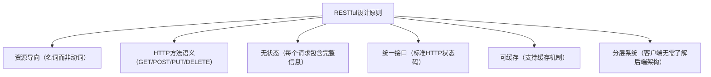

<div className="card">
<div className="card__body">

| 原则 | 说明 | 示例 |
|------|------|------|
| **资源导向** | 使用名词而非动词 | `/users` 而不是 `/getUsers` |
| **HTTP方法语义** | 使用正确的HTTP方法 | GET、POST、PUT、DELETE |
| **无状态** | 每个请求包含完整信息 | 不依赖会话状态 |
| **统一接口** | 使用标准HTTP状态码 | 200、201、400、404等 |
| **可缓存** | 支持缓存机制 | 使用ETag、Cache-Control |

</div>
</div>

### 9.2 RESTful API实现

<Tabs>
  <TabItem value="basic" label="基础实现" default>
```java title="RESTful API控制器"
@RestController
@RequestMapping("/api/users")
public class UserRestController {
    
    @Autowired
    private UserService userService;
    
    // GET /api/users - 获取用户列表
    @GetMapping
    public ResponseEntity<List<User>> getUsers(
            @RequestParam(defaultValue = "0") int page,
            @RequestParam(defaultValue = "10") int size) {
        
        List<User> users = userService.findAll(page, size);
        return ResponseEntity.ok(users);
    }
    
    // GET /api/users/{id} - 获取单个用户
    @GetMapping("/{id}")
    public ResponseEntity<User> getUser(@PathVariable Long id) {
        User user = userService.findById(id);
        if (user == null) {
            return ResponseEntity.notFound().build();
        }
        return ResponseEntity.ok(user);
    }
    
    // POST /api/users - 创建用户
    @PostMapping
    public ResponseEntity<User> createUser(@Valid @RequestBody User user) {
        User savedUser = userService.save(user);
        return ResponseEntity.status(HttpStatus.CREATED)
                .header("Location", "/api/users/" + savedUser.getId())
                .body(savedUser);
    }
    
    // PUT /api/users/{id} - 更新用户
    @PutMapping("/{id}")
    public ResponseEntity<User> updateUser(@PathVariable Long id, @Valid @RequestBody User user) {
        user.setId(id);
        User updatedUser = userService.update(user);
        return ResponseEntity.ok(updatedUser);
    }
    
    // DELETE /api/users/{id} - 删除用户
    @DeleteMapping("/{id}")
    public ResponseEntity<Void> deleteUser(@PathVariable Long id) {
        userService.deleteById(id);
        return ResponseEntity.noContent().build();
    }
  }
  ```
  </TabItem>
  <TabItem value="hateoas" label="HATEOAS支持">
  ```java title="HATEOAS实现"
  @RestController
  @RequestMapping("/api/users")
  public class UserHateoasController {
      
      @Autowired
      private UserService userService;
      
      @GetMapping("/{id}")
      public EntityModel<User> getUser(@PathVariable Long id) {
          User user = userService.findById(id);
          if (user == null) {
              throw new UserNotFoundException(id);
          }
          
          // 创建超链接
          EntityModel<User> resource = EntityModel.of(user);
          
          // 添加自引用链接
          resource.add(linkTo(methodOn(UserHateoasController.class)
              .getUser(id)).withSelfRel());
              
          // 添加用户集合链接
          resource.add(linkTo(methodOn(UserHateoasController.class)
              .getUsers(0, 10)).withRel("users"));
              
          // 添加用户订单链接
          resource.add(linkTo(methodOn(OrderController.class)
              .getUserOrders(id)).withRel("orders"));
              
          return resource;
      }
      
      @GetMapping
      public CollectionModel<EntityModel<User>> getUsers(
              @RequestParam(defaultValue = "0") int page,
              @RequestParam(defaultValue = "10") int size) {
              
          List<User> users = userService.findAll(page, size);
          
          List<EntityModel<User>> resources = users.stream()
              .map(user -> EntityModel.of(user, 
                  linkTo(methodOn(UserHateoasController.class)
                      .getUser(user.getId())).withSelfRel(),
                  linkTo(methodOn(UserHateoasController.class)
                      .getUsers(page, size)).withRel("users")))
              .collect(Collectors.toList());
              
          return CollectionModel.of(resources, 
              linkTo(methodOn(UserHateoasController.class)
                  .getUsers(page, size)).withSelfRel());
      }
  }
  ```
  </TabItem>
</Tabs>

### 9.3 API版本控制

<div className="card">
<div className="card__body">

```java title="API版本控制"
// 1. URL路径版本控制
@RestController
@RequestMapping("/api/v1/users")
public class UserApiV1Controller {
    // V1版本的API
}

@RestController
@RequestMapping("/api/v2/users")
public class UserApiV2Controller {
    // V2版本的API
}

// 2. 请求参数版本控制
@RestController
@RequestMapping("/api/users")
public class UserApiVersionController {
    
    @GetMapping(params = "version=1")
    public ResponseEntity<UserV1> getUserV1(@RequestParam Long id) {
        // V1版本的处理逻辑
    }
    
    @GetMapping(params = "version=2")
    public ResponseEntity<UserV2> getUserV2(@RequestParam Long id) {
        // V2版本的处理逻辑
    }
}

// 3. 请求头版本控制
@RestController
@RequestMapping("/api/users")
public class UserApiHeaderVersionController {
    
    @GetMapping(headers = "X-API-Version=1")
    public ResponseEntity<UserV1> getUserV1(@RequestParam Long id) {
        // V1版本的处理逻辑
    }
    
    @GetMapping(headers = "X-API-Version=2")
    public ResponseEntity<UserV2> getUserV2(@RequestParam Long id) {
        // V2版本的处理逻辑
    }
}

// 4. Accept头版本控制
@RestController
@RequestMapping("/api/users")
public class UserApiAcceptVersionController {
    
    @GetMapping(produces = "application/vnd.company.app-v1+json")
    public ResponseEntity<UserV1> getUserV1(@RequestParam Long id) {
        // V1版本的处理逻辑
    }
    
    @GetMapping(produces = "application/vnd.company.app-v2+json")
    public ResponseEntity<UserV2> getUserV2(@RequestParam Long id) {
        // V2版本的处理逻辑
    }
}
```

</div>
</div>

## 10. 面试题精选

### 10.1 基础概念题

<Tabs>
  <TabItem value="q1" label="MVC流程" default>
  <div className="card">
  <div className="card__header">
  <h4>Q: Spring MVC的请求处理流程是怎样的？</h4>
  </div>
  <div className="card__body">
  <p><strong>A:</strong> Spring MVC的请求处理流程如下：</p>
  <ol>
  <li><strong>请求接收</strong>：客户端发送HTTP请求到DispatcherServlet</li>
  <li><strong>Handler映射</strong>：通过HandlerMapping找到对应的Handler</li>
  <li><strong>Handler适配</strong>：通过HandlerAdapter适配并执行Handler</li>
  <li><strong>业务处理</strong>：Handler执行业务逻辑，返回ModelAndView</li>
  <li><strong>视图解析</strong>：通过ViewResolver解析视图名称</li>
  <li><strong>视图渲染</strong>：渲染视图并返回响应</li>
  </ol>
  <p>整个过程由DispatcherServlet统一调度，实现了前端控制器模式，使各组件解耦并协同工作。</p>
  </div>
  </div>
  </TabItem>
  <TabItem value="q2" label="注解区别">
  <div className="card">
  <div className="card__header">
  <h4>Q: @RequestMapping和@GetMapping有什么区别？</h4>
  </div>
  <div className="card__body">
  <p><strong>A:</strong></p>
  <ul>
  <li><strong>@RequestMapping</strong>是通用注解，可以指定method属性</li>
  <li><strong>@GetMapping</strong>是<code>@RequestMapping(method = RequestMethod.GET)</code>的简写</li>
  <li><strong>@GetMapping</strong>更简洁，专门用于GET请求</li>
  <li><strong>@RequestMapping</strong>更灵活，可以处理多种HTTP方法</li>
  <li>类似的还有<strong>@PostMapping</strong>、<strong>@PutMapping</strong>、<strong>@DeleteMapping</strong>、<strong>@PatchMapping</strong>，都是对应HTTP方法的简写形式</li>
  </ul>
  </div>
  </div>
  </TabItem>
</Tabs>

### 10.2 实践题

<Tabs>
  <TabItem value="q3" label="RESTful API" default>
  <div className="card">
  <div className="card__header">
  <h4>Q: 如何实现RESTful API？</h4>
  </div>
  <div className="card__body">
  <p><strong>A:</strong> 实现RESTful API需要：</p>
  <ul>
  <li>使用<code>@RestController</code>注解</li>
  <li>使用<code>@GetMapping</code>、<code>@PostMapping</code>等注解匹配HTTP方法</li>
  <li>返回<code>ResponseEntity</code>对象控制HTTP状态码和响应头</li>
  <li>使用<code>@PathVariable</code>处理路径参数</li>
  <li>使用<code>@RequestBody</code>处理请求体</li>
  <li>遵循REST设计原则：资源命名、HTTP方法语义、无状态、统一接口等</li>
  <li>使用适当的HTTP状态码：200(OK)、201(Created)、204(No Content)、400(Bad Request)、404(Not Found)等</li>
  </ul>
  <p>对于更高级的RESTful API，还可以考虑使用HATEOAS添加超链接，使API更具自描述性。</p>
  </div>
  </div>
  </TabItem>
  <TabItem value="q4" label="拦截器作用">
  <div className="card">
  <div className="card__header">
  <h4>Q: Spring MVC的拦截器有什么作用？</h4>
  </div>
  <div className="card__body">
  <p><strong>A:</strong> Spring MVC的拦截器可以在请求处理的不同阶段进行拦截和处理，主要作用包括：</p>
  <ol>
  <li><strong>身份验证</strong>：验证用户是否登录</li>
  <li><strong>授权检查</strong>：检查用户是否有权限访问资源</li>
  <li><strong>日志记录</strong>：记录请求日志，如IP、请求参数、执行时间等</li>
  <li><strong>性能监控</strong>：监控请求执行时间</li>
  <li><strong>数据转换</strong>：在请求前后对数据进行转换</li>
  <li><strong>国际化</strong>：根据请求设置语言环境</li>
  <li><strong>主题设置</strong>：根据用户设置主题</li>
  </ol>
  <p>拦截器通过实现<code>HandlerInterceptor</code>接口，可以在请求处理的preHandle（前）、postHandle（后）和afterCompletion（完成）三个阶段执行自定义逻辑。</p>
  </div>
  </div>
  </TabItem>
</Tabs>

### 10.3 高级题

<Tabs>
  <TabItem value="q5" label="异步处理" default>
  <div className="card">
  <div className="card__header">
  <h4>Q: Spring MVC如何实现异步请求处理？</h4>
  </div>
  <div className="card__body">
  <p><strong>A:</strong> Spring MVC支持三种异步请求处理方式：</p>
  <ol>
  <li><strong>返回Callable对象</strong>：</li>
  </ol>
  
  ```java
@GetMapping("/async")
public Callable<String> asyncTask() {
    return () -> {
        // 异步任务
        Thread.sleep(5000);
        return "Async result";
    };
}
  ```
  
  <ol start="2">
  <li><strong>返回DeferredResult对象</strong>：</li>
  </ol>
  
  ```java
@GetMapping("/async-deferred")
public DeferredResult<String> asyncDeferredResult() {
    DeferredResult<String> result = new DeferredResult<>();
    taskExecutor.execute(() -> {
        try {
            Thread.sleep(5000);
            result.setResult("Deferred result");
        } catch (Exception e) {
            result.setErrorResult(e);
        }
    });
    return result;
}
  ```
  
  <ol start="3">
  <li><strong>返回CompletableFuture对象</strong>：</li>
  </ol>
  
  ```java
@GetMapping("/async-future")
public CompletableFuture<String> asyncFuture() {
    return CompletableFuture.supplyAsync(() -> {
        try {
            Thread.sleep(5000);
            return "Future result";
        } catch (Exception e) {
            throw new RuntimeException(e);
        }
    });
}
  ```
  
  <p>异步请求处理的好处是可以释放Web容器线程，提高系统吞吐量，特别是对于长时间运行的任务。</p>
  </div>
  </div>
  </TabItem>
  <TabItem value="q6" label="内容协商">
  <div className="card">
  <div className="card__header">
  <h4>Q: Spring MVC的内容协商是什么？如何实现？</h4>
  </div>
  <div className="card__body">
  <p><strong>A:</strong> 内容协商(Content Negotiation)是指根据客户端的请求，返回不同格式(如JSON、XML、PDF等)的响应数据。</p>
  <p>实现方式：</p>
  <ol>
  <li><strong>基于请求头Accept</strong>：根据客户端发送的Accept头选择合适的响应格式</li>
  <li><strong>基于URL参数</strong>：通过URL参数指定响应格式，如<code>?format=json</code></li>
  <li><strong>基于文件扩展名</strong>：通过URL路径扩展名指定格式，如<code>/users.json</code></li>
  </ol>
  <p>Spring MVC实现内容协商的方法：</p>
  
  ```java
@Configuration
public class WebConfig implements WebMvcConfigurer {
    
    @Override
    public void configureContentNegotiation(ContentNegotiationConfigurer configurer) {
        configurer
            .favorParameter(true)
            .parameterName("format")
            .ignoreAcceptHeader(false)
            .defaultContentType(MediaType.APPLICATION_JSON)
            .mediaType("json", MediaType.APPLICATION_JSON)
            .mediaType("xml", MediaType.APPLICATION_XML);
    }
}

@GetMapping("/users/{id}")
public User getUser(@PathVariable Long id) {
    // 根据内容协商返回JSON或XML
    return userService.findById(id);
}
  ```
  </div>
  </div>
  </TabItem>
</Tabs>

:::tip Spring MVC学习要点
1. **理解核心组件**：掌握DispatcherServlet、HandlerMapping、HandlerAdapter等核心组件
2. **熟悉请求流程**：理解从请求到响应的完整处理流程
3. **掌握控制器开发**：学会使用@Controller、@RestController等注解开发控制器
4. **了解视图技术**：熟悉JSP、Thymeleaf等视图技术
5. **学会RESTful API**：掌握RESTful API设计和实现
6. **熟悉数据验证**：学会使用Bean Validation进行数据验证
7. **掌握拦截器机制**：学会自定义拦截器处理横切关注点
:::

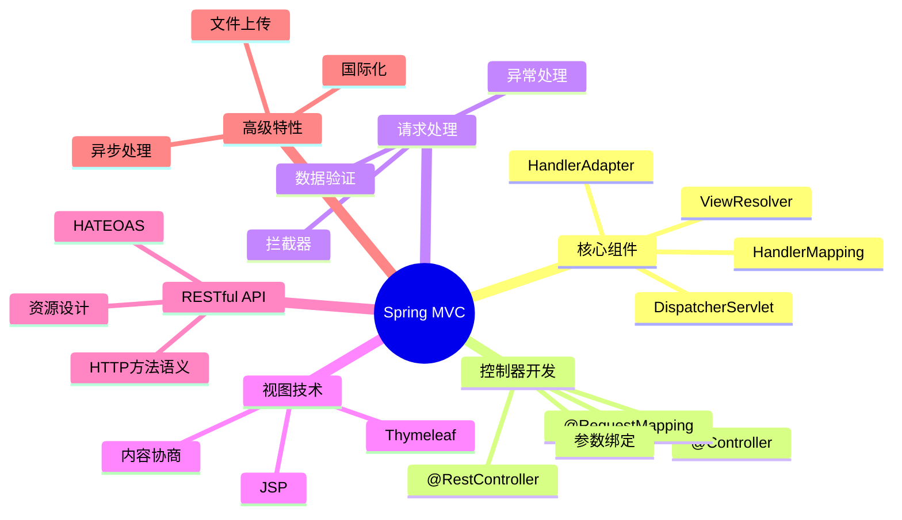

---

通过本章的学习，你应该已经掌握了Spring MVC的核心概念、请求处理流程和实际应用。Spring MVC是构建Java Web应用的重要框架，掌握其原理和使用方法对于开发高质量的Web应用至关重要。无论是传统Web应用还是现代RESTful API，Spring MVC都能提供强大而灵活的支持。 