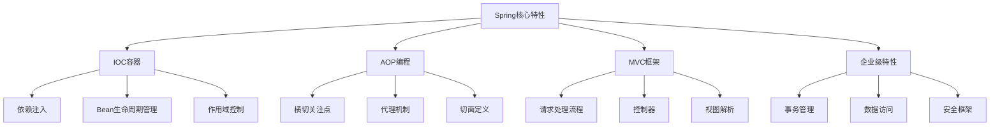
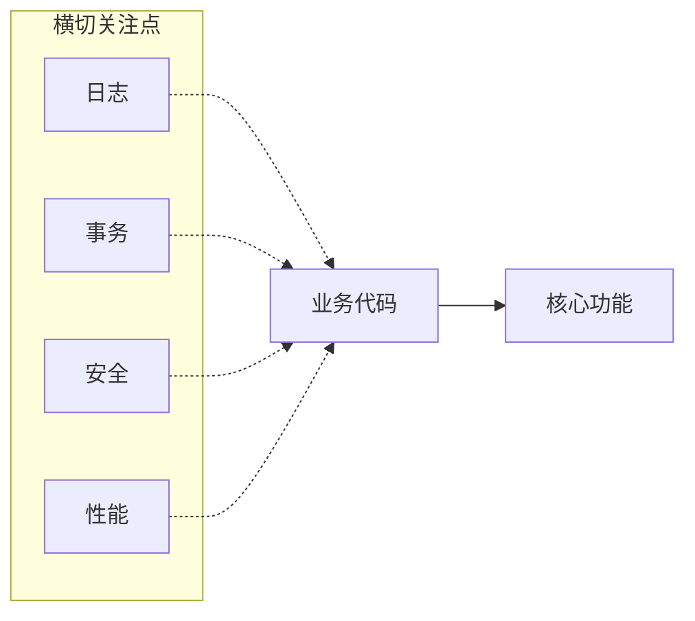
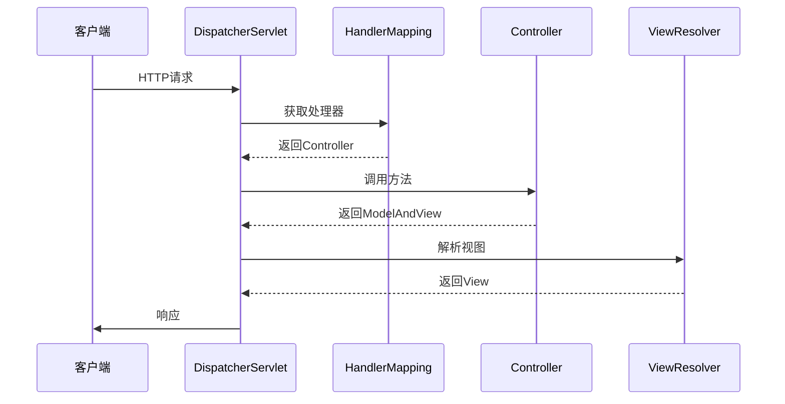
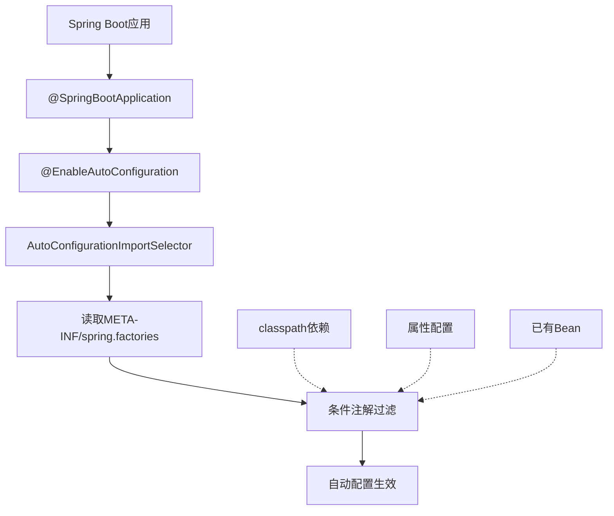
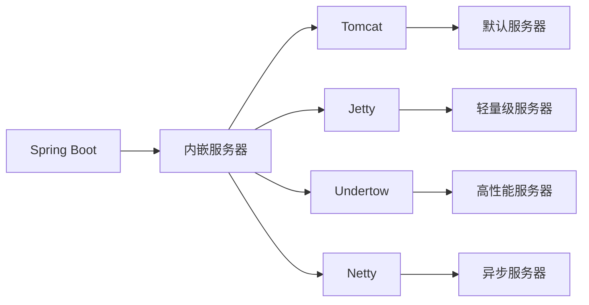
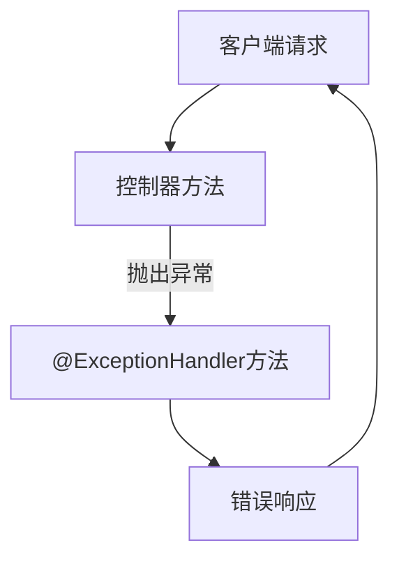
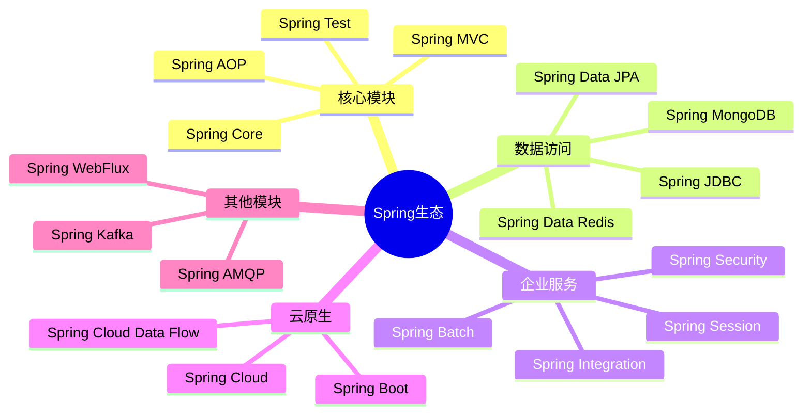
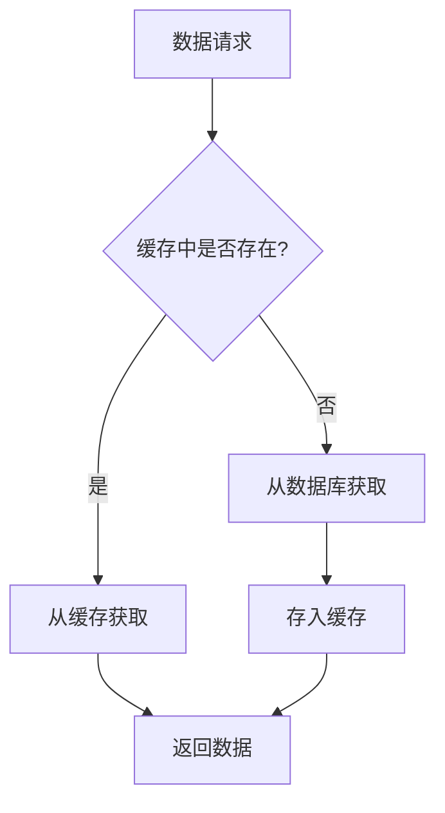
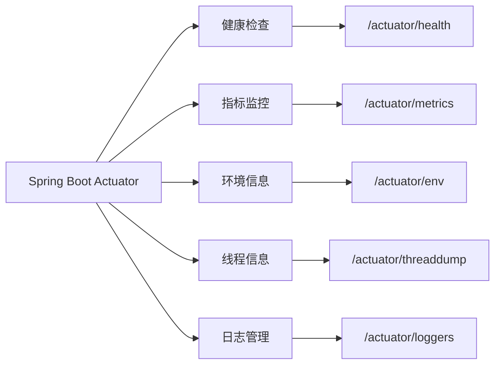
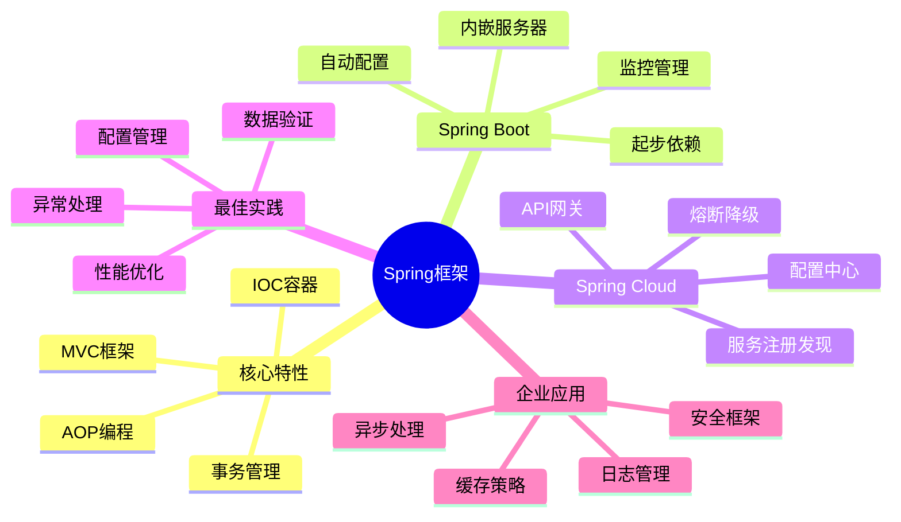

import Tabs from '@theme/Tabs';
import TabItem from '@theme/TabItem';
import TOCInline from '@theme/TOCInline';

# Spring 框架总结

Spring框架是Java企业级应用开发的事实标准，它通过IOC、AOP、MVC等核心特性，为开发者提供了完整的应用开发解决方案。

:::info 本文内容概览
<TOCInline toc={toc} />
:::

:::tip 核心价值
**Spring = IOC容器 + AOP编程 + MVC框架 + 企业级特性**
- 🔄 **IOC容器**：控制反转和依赖注入
- ✂️ **AOP编程**：面向切面编程
- 🖥️ **MVC框架**：Web应用开发框架
- 🛠️ **企业级特性**：事务管理、安全框架、数据访问等
:::

## 1. Spring核心特性



### 1.1 控制反转（IOC）

IOC是Spring框架的基础，通过依赖注入实现对象创建和依赖关系的管理。

<div className="card">
<div className="card__body">

```java title="IOC示例"
@Service
public class UserService {
    @Autowired
    private UserRepository userRepository;
    
    public void createUser(User user) {
        userRepository.save(user);
    }
}
```

</div>
</div>

<div className="card">
<div className="card__header">
<h4>IOC核心优势</h4>
</div>
<div className="card__body">

- 降低代码耦合度
- 提高代码可测试性
- 简化对象管理
- 支持配置化开发

</div>
</div>

### 1.2 面向切面编程（AOP）

AOP通过横切关注点的模块化，实现日志、事务、安全等功能的统一管理。



<div className="card">
<div className="card__body">

```java title="AOP示例"
@Aspect
@Component
public class LoggingAspect {
    @Around("execution(* com.example.service.*.*(..))")
    public Object logAround(ProceedingJoinPoint joinPoint) throws Throwable {
        System.out.println("方法执行前: " + joinPoint.getSignature().getName());
        Object result = joinPoint.proceed();
        System.out.println("方法执行后: " + joinPoint.getSignature().getName());
        return result;
    }
}
```

</div>
</div>

<Tabs>
  <TabItem value="logging" label="日志记录" default>
  ```java
  @Aspect
  @Component
  public class LoggingAspect {
      @Before("execution(* com.example.service.*.*(..))")
      public void logBefore(JoinPoint joinPoint) {
          System.out.println("执行方法: " + joinPoint.getSignature().getName());
      }
  }
  ```
  </TabItem>
  <TabItem value="transaction" label="事务管理">
  ```java
  @Aspect
  @Component
  public class TransactionAspect {
      @Around("@annotation(org.springframework.transaction.annotation.Transactional)")
      public Object transactional(ProceedingJoinPoint joinPoint) throws Throwable {
          try {
              // 开启事务
              Object result = joinPoint.proceed();
              // 提交事务
              return result;
          } catch (Exception e) {
              // 回滚事务
              throw e;
          }
      }
  }
  ```
  </TabItem>
  <TabItem value="security" label="安全控制">
  ```java
  @Aspect
  @Component
  public class SecurityAspect {
      @Before("@annotation(com.example.security.RequiresPermission)")
      public void checkPermission(JoinPoint joinPoint) {
          // 权限检查逻辑
          MethodSignature signature = (MethodSignature) joinPoint.getSignature();
          RequiresPermission annotation = signature.getMethod().getAnnotation(RequiresPermission.class);
          String permission = annotation.value();
          
          if (!hasPermission(permission)) {
              throw new AccessDeniedException("No permission: " + permission);
          }
      }
      
      private boolean hasPermission(String permission) {
          // 权限验证逻辑
          return true; // 示例
      }
  }
  ```
  </TabItem>
</Tabs>

### 1.3 Spring MVC

Spring MVC提供了完整的Web应用开发框架，支持RESTful API和传统Web应用开发。



<div className="card">
<div className="card__body">

```java title="Spring MVC示例"
@RestController
@RequestMapping("/api/users")
public class UserController {
    
    @Autowired
    private UserService userService;
    
    @GetMapping("/{id}")
    public ResponseEntity<User> getUser(@PathVariable Long id) {
        User user = userService.findById(id);
        return ResponseEntity.ok(user);
    }
    
    @PostMapping
    public ResponseEntity<User> createUser(@RequestBody User user) {
        User savedUser = userService.save(user);
        return ResponseEntity.status(HttpStatus.CREATED).body(savedUser);
    }
}
```

</div>
</div>

## 2. Spring Boot特性

### 2.1 自动配置

Spring Boot通过约定优于配置的理念，自动配置Spring应用。



<div className="card">
<div className="card__body">

```java title="自动配置示例"
@SpringBootApplication
public class Application {
    public static void main(String[] args) {
        SpringApplication.run(Application.class, args);
    }
}
```

</div>
</div>

<div className="card">
<div className="card__header">
<h4>自动配置原理</h4>
</div>
<div className="card__body">

- 基于classpath中的依赖
- 使用条件注解控制配置
- 通过spring.factories注册配置类
- 允许通过配置属性覆盖默认行为

</div>
</div>

### 2.2 起步依赖

起步依赖简化了Maven/Gradle的依赖管理。

<Tabs>
  <TabItem value="web" label="Web应用" default>
  ```xml
  <dependency>
      <groupId>org.springframework.boot</groupId>
      <artifactId>spring-boot-starter-web</artifactId>
  </dependency>
  ```
  </TabItem>
  <TabItem value="data" label="数据访问">
  ```xml
  <dependency>
      <groupId>org.springframework.boot</groupId>
      <artifactId>spring-boot-starter-data-jpa</artifactId>
  </dependency>
  ```
  </TabItem>
  <TabItem value="security" label="安全框架">
  ```xml
  <dependency>
      <groupId>org.springframework.boot</groupId>
      <artifactId>spring-boot-starter-security</artifactId>
  </dependency>
  ```
  </TabItem>
</Tabs>

### 2.3 内嵌服务器

Spring Boot支持内嵌Tomcat、Jetty、Undertow等服务器。



<div className="card">
<div className="card__body">

```java title="内嵌服务器配置"
@Configuration
public class ServerConfig {
    
    @Bean
    public TomcatServletWebServerFactory tomcatFactory() {
        return new TomcatServletWebServerFactory(8080);
    }
}
```

</div>
</div>

## 3. Spring最佳实践

### 3.1 配置管理

<Tabs>
  <TabItem value="yaml" label="YAML配置" default>
  ```yaml title="配置管理示例"
  spring:
    profiles:
      active: dev
    
    datasource:
      url: ${DATABASE_URL:jdbc:mysql://localhost:3306/test}
      username: ${DATABASE_USERNAME:root}
      password: ${DATABASE_PASSWORD:password}
  
  logging:
    level:
      com.example: DEBUG
    pattern:
      console: "%d{yyyy-MM-dd HH:mm:ss} [%thread] %-5level %logger{36} - %msg%n"
  ```
  </TabItem>
  <TabItem value="profile" label="多环境配置">
  ```yaml title="多环境配置"
  # application-dev.yml
  spring:
    datasource:
      url: jdbc:mysql://localhost:3306/dev_db
      username: dev_user
      password: dev_pass
  
  logging:
    level:
      com.example: DEBUG
  
  # application-prod.yml
  spring:
    datasource:
      url: jdbc:mysql://prod-server:3306/prod_db
      username: prod_user
      password: prod_pass
  
  logging:
    level:
      com.example: INFO
  ```
  </TabItem>
</Tabs>

### 3.2 异常处理

Spring提供了全局异常处理机制，可以统一处理应用中的异常：



<div className="card">
<div className="card__body">

```java title="全局异常处理"
@ControllerAdvice
public class GlobalExceptionHandler {
    
    @ExceptionHandler(Exception.class)
    public ResponseEntity<ErrorResponse> handleException(Exception e) {
        ErrorResponse error = new ErrorResponse();
        error.setMessage(e.getMessage());
        error.setTimestamp(System.currentTimeMillis());
        
        return ResponseEntity.status(HttpStatus.INTERNAL_SERVER_ERROR).body(error);
    }
}
```

</div>
</div>

### 3.3 数据验证

<Tabs>
  <TabItem value="validation" label="Bean验证" default>
  ```java title="数据验证示例"
  @RestController
  public class UserController {
      
      @PostMapping("/users")
      public ResponseEntity<User> createUser(@Valid @RequestBody User user, BindingResult result) {
          if (result.hasErrors()) {
              return ResponseEntity.badRequest().build();
          }
          
          User savedUser = userService.save(user);
          return ResponseEntity.ok(savedUser);
      }
  }
  
  public class User {
      @NotNull(message = "用户名不能为空")
      @Size(min = 2, max = 20, message = "用户名长度必须在2-20之间")
      private String name;
      
      @Email(message = "邮箱格式不正确")
      private String email;
  }
  ```
  </TabItem>
  <TabItem value="custom" label="自定义验证">
  ```java title="自定义验证注解"
  @Documented
  @Constraint(validatedBy = PhoneValidator.class)
  @Target({ElementType.FIELD})
  @Retention(RetentionPolicy.RUNTIME)
  public @interface Phone {
      String message() default "手机号格式不正确";
      Class<?>[] groups() default {};
      Class<? extends Payload>[] payload() default {};
  }
  
  public class PhoneValidator implements ConstraintValidator<Phone, String> {
      @Override
      public boolean isValid(String value, ConstraintValidatorContext context) {
          if (value == null) {
              return true;
          }
          return value.matches("^1[3-9]\\d{9}$");
      }
  }
  
  public class User {
      @Phone
      private String phoneNumber;
  }
  ```
  </TabItem>
</Tabs>

## 4. Spring生态系统



### 4.1 核心模块

<div className="card">
<div className="card__body">

| 模块 | 功能 | 说明 |
|------|------|------|
| **Spring Core** | IOC容器 | 提供依赖注入和Bean管理 |
| **Spring AOP** | 面向切面编程 | 提供AOP功能支持 |
| **Spring MVC** | Web框架 | 提供MVC架构支持 |
| **Spring Data** | 数据访问 | 简化数据访问层开发 |
| **Spring Security** | 安全框架 | 提供认证和授权功能 |
| **Spring Boot** | 快速开发 | 简化Spring应用开发 |

</div>
</div>

### 4.2 集成技术

<Tabs>
  <TabItem value="jpa" label="Spring Data JPA" default>
  ```java title="Spring Data JPA"
  @Repository
  public interface UserRepository extends JpaRepository<User, Long> {
      List<User> findByName(String name);
      Optional<User> findByEmail(String email);
  }
  ```
  </TabItem>
  <TabItem value="security" label="Spring Security">
  ```java title="Spring Security"
  @Configuration
  @EnableWebSecurity
  public class SecurityConfig extends WebSecurityConfigurerAdapter {
      
      @Override
      protected void configure(HttpSecurity http) throws Exception {
          http.authorizeRequests()
              .antMatchers("/public/**").permitAll()
              .anyRequest().authenticated()
              .and()
              .formLogin();
      }
  }
  ```
  </TabItem>
  <TabItem value="cache" label="Spring Cache">
  ```java title="Spring Cache"
  @Service
  public class UserService {
      
      @Cacheable("users")
      public User findById(Long id) {
          return userRepository.findById(id).orElse(null);
      }
      
      @CacheEvict("users")
      public void deleteUser(Long id) {
          userRepository.deleteById(id);
      }
  }
  ```
  </TabItem>
</Tabs>

## 5. 性能优化

### 5.1 缓存策略



<div className="card">
<div className="card__body">

```java title="缓存配置"
@Configuration
@EnableCaching
public class CacheConfig {
    
    @Bean
    public CacheManager cacheManager() {
        RedisCacheManager cacheManager = RedisCacheManager.builder(redisConnectionFactory())
            .cacheDefaults(defaultConfig())
            .build();
        return cacheManager;
    }
    
    private RedisCacheConfiguration defaultConfig() {
        return RedisCacheConfiguration.defaultCacheConfig()
            .entryTtl(Duration.ofMinutes(30))
            .serializeKeysWith(RedisSerializationContext.SerializationPair.fromSerializer(new StringRedisSerializer()))
            .serializeValuesWith(RedisSerializationContext.SerializationPair.fromSerializer(new GenericJackson2JsonRedisSerializer()));
    }
}
```

</div>
</div>

### 5.2 异步处理

<Tabs>
  <TabItem value="config" label="异步配置" default>
  ```java title="异步配置"
  @Configuration
  @EnableAsync
  public class AsyncConfig implements AsyncConfigurer {
      
      @Override
      public Executor getAsyncExecutor() {
          ThreadPoolTaskExecutor executor = new ThreadPoolTaskExecutor();
          executor.setCorePoolSize(10);
          executor.setMaxPoolSize(50);
          executor.setQueueCapacity(100);
          executor.setThreadNamePrefix("Async-");
          executor.initialize();
          return executor;
      }
  }
  ```
  </TabItem>
  <TabItem value="service" label="异步服务">
  ```java title="异步服务"
  @Service
  public class EmailService {
      
      @Async
      public CompletableFuture<String> sendEmail(String to, String subject, String content) {
          // 发送邮件逻辑
          return CompletableFuture.completedFuture("邮件发送成功");
      }
  }
  
  @Service
  public class NotificationService {
      
      @Autowired
      private EmailService emailService;
      
      public void notifyUsers(List<User> users, String message) {
          List<CompletableFuture<String>> futures = new ArrayList<>();
          
          for (User user : users) {
              futures.add(emailService.sendEmail(user.getEmail(), "通知", message));
          }
          
          // 等待所有邮件发送完成
          CompletableFuture.allOf(futures.toArray(new CompletableFuture[0])).join();
      }
  }
  ```
  </TabItem>
</Tabs>

## 6. 监控与管理

### 6.1 Spring Boot Actuator

Actuator提供了监控和管理Spring应用的功能，包括健康检查、指标收集等。



<Tabs>
  <TabItem value="config" label="Actuator配置" default>
  ```yaml title="Actuator配置"
  management:
    endpoints:
      web:
        exposure:
          include: health,info,metrics,env
        base-path: /actuator
    endpoint:
      health:
        show-details: always
  ```
  </TabItem>
  <TabItem value="health" label="自定义健康检查">
  ```java title="自定义健康检查"
  @Component
  public class CustomHealthIndicator implements HealthIndicator {
      
      @Override
      public Health health() {
          try {
              // 检查外部服务
              checkExternalService();
              return Health.up().withDetail("external-service", "UP").build();
          } catch (Exception e) {
              return Health.down().withDetail("error", e.getMessage()).build();
          }
      }
  }
  ```
  </TabItem>
</Tabs>

### 6.2 性能监控

<div className="card">
<div className="card__body">

```java title="性能监控切面"
@Aspect
@Component
public class PerformanceMonitorAspect {
    
    private final MeterRegistry meterRegistry;
    
    public PerformanceMonitorAspect(MeterRegistry meterRegistry) {
        this.meterRegistry = meterRegistry;
    }
    
    @Around("execution(* com.example.service.*.*(..))")
    public Object monitorPerformance(ProceedingJoinPoint joinPoint) throws Throwable {
        Timer.Sample sample = Timer.start(meterRegistry);
        
        try {
            Object result = joinPoint.proceed();
            sample.stop(Timer.builder("method.execution.time")
                .tag("method", joinPoint.getSignature().getName())
                .register(meterRegistry));
            return result;
        } catch (Exception e) {
            sample.stop(Timer.builder("method.execution.time")
                .tag("method", joinPoint.getSignature().getName())
                .tag("status", "error")
                .register(meterRegistry));
            throw e;
        }
    }
}
```

</div>
</div>

## 7. 面试题总结

### 7.1 核心概念

<Tabs>
  <TabItem value="q1" label="Spring核心特性" default>
  <div className="card">
  <div className="card__header">
  <h4>Q: Spring框架的核心特性有哪些？</h4>
  </div>
  <div className="card__body">
  <p><strong>A:</strong> Spring框架的核心特性包括：</p>
  <ul>
  <li><strong>IOC（控制反转）</strong>：管理对象的创建和依赖关系</li>
  <li><strong>AOP（面向切面编程）</strong>：处理横切关注点</li>
  <li><strong>MVC（模型视图控制器）</strong>：Web应用开发框架</li>
  <li><strong>事务管理</strong>：声明式和编程式事务</li>
  <li><strong>数据访问</strong>：简化数据库操作</li>
  </ul>
  </div>
  </div>
  </TabItem>
  <TabItem value="q2" label="Spring Boot优势">
  <div className="card">
  <div className="card__header">
  <h4>Q: Spring Boot的优势是什么？</h4>
  </div>
  <div className="card__body">
  <p><strong>A:</strong> Spring Boot的优势包括：</p>
  <ul>
  <li><strong>自动配置</strong>：根据依赖自动配置Spring应用</li>
  <li><strong>起步依赖</strong>：简化Maven/Gradle配置</li>
  <li><strong>内嵌服务器</strong>：无需部署到外部服务器</li>
  <li><strong>生产就绪</strong>：提供监控、健康检查等特性</li>
  <li><strong>快速开发</strong>：减少样板代码</li>
  </ul>
  </div>
  </div>
  </TabItem>
</Tabs>

### 7.2 实践应用

<Tabs>
  <TabItem value="q3" label="设计Spring Boot应用" default>
  <div className="card">
  <div className="card__header">
  <h4>Q: 如何设计一个Spring Boot应用？</h4>
  </div>
  <div className="card__body">
  <p><strong>A:</strong> 设计Spring Boot应用的步骤：</p>
  <ol>
  <li><strong>确定技术栈</strong>：选择数据库、缓存、消息队列等</li>
  <li><strong>设计架构</strong>：分层架构、微服务架构等</li>
  <li><strong>配置管理</strong>：多环境配置、外部化配置</li>
  <li><strong>异常处理</strong>：全局异常处理、业务异常定义</li>
  <li><strong>监控管理</strong>：健康检查、性能监控、日志管理</li>
  </ol>
  </div>
  </div>
  </TabItem>
  <TabItem value="q4" label="性能优化">
  <div className="card">
  <div className="card__header">
  <h4>Q: Spring应用如何优化性能？</h4>
  </div>
  <div className="card__body">
  <p><strong>A:</strong> Spring应用性能优化策略：</p>
  <ul>
  <li><strong>缓存优化</strong>：使用Redis、Ehcache等缓存</li>
  <li><strong>异步处理</strong>：使用@Async处理耗时操作</li>
  <li><strong>连接池优化</strong>：数据库连接池、线程池配置</li>
  <li><strong>JVM调优</strong>：堆内存、GC参数优化</li>
  <li><strong>代码优化</strong>：避免循环依赖、合理使用AOP</li>
  </ul>
  </div>
  </div>
  </TabItem>
</Tabs>

### 7.3 高级特性

<Tabs>
  <TabItem value="q5" label="循环依赖" default>
  <div className="card">
  <div className="card__header">
  <h4>Q: Spring如何处理循环依赖？</h4>
  </div>
  <div className="card__body">
  <p><strong>A:</strong> Spring通过三级缓存解决循环依赖：</p>
  <ul>
  <li><strong>一级缓存</strong>：<code>singletonObjects</code> - 完全初始化好的Bean</li>
  <li><strong>二级缓存</strong>：<code>earlySingletonObjects</code> - 早期暴露的Bean</li>
  <li><strong>三级缓存</strong>：<code>singletonFactories</code> - Bean工厂对象</li>
  </ul>
  <p>解决过程：</p>
  <ol>
  <li>创建对象A，实例化但未属性注入</li>
  <li>将A放入三级缓存</li>
  <li>属性注入时发现依赖对象B</li>
  <li>创建对象B，同样放入三级缓存</li>
  <li>B属性注入时发现依赖A，从三级缓存获取A</li>
  <li>B完成初始化，放入一级缓存</li>
  <li>A获得B的引用，完成初始化，放入一级缓存</li>
  </ol>
  </div>
  </div>
  </TabItem>
  <TabItem value="q6" label="自动配置原理">
  <div className="card">
  <div className="card__header">
  <h4>Q: Spring Boot自动配置的原理是什么？</h4>
  </div>
  <div className="card__body">
  <p><strong>A:</strong> Spring Boot自动配置原理：</p>
  <ul>
  <li>通过<code>@EnableAutoConfiguration</code>注解开启自动配置</li>
  <li><code>AutoConfigurationImportSelector</code>加载<code>META-INF/spring.factories</code>中的配置类</li>
  <li>使用<code>@ConditionalOnClass</code>等条件注解判断是否需要加载配置</li>
  <li>使用<code>@ConditionalOnMissingBean</code>避免覆盖已有配置</li>
  <li>提供<code>spring.*.properties</code>方式外部化配置</li>
  </ul>
  
  ```java
@Configuration
@ConditionalOnClass(DataSource.class)
@EnableConfigurationProperties(DataSourceProperties.class)
public class DataSourceAutoConfiguration {
    
    @Bean
    @ConditionalOnMissingBean
    public DataSource dataSource(DataSourceProperties properties) {
        return properties.initializeDataSourceBuilder().build();
    }
}
  ```
  </div>
  </div>
  </TabItem>
</Tabs>

:::tip Spring学习要点
1. **掌握核心概念**：理解IOC、AOP、MVC等基本概念
2. **熟悉配置方式**：学会注解、XML、Java配置
3. **了解最佳实践**：掌握异常处理、数据验证等
4. **学会性能优化**：掌握缓存、异步、监控等技术
5. **关注生态系统**：了解Spring Data、Security等模块
:::



---

通过本章的学习，你应该已经全面了解了Spring框架的核心特性、最佳实践和应用场景。Spring是Java企业级开发的重要框架，掌握Spring对于提高开发效率和代码质量至关重要。在实际项目中，合理使用Spring的各种特性可以构建出高质量、可维护的企业级应用。 