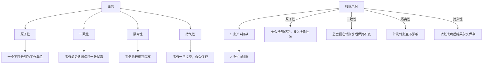
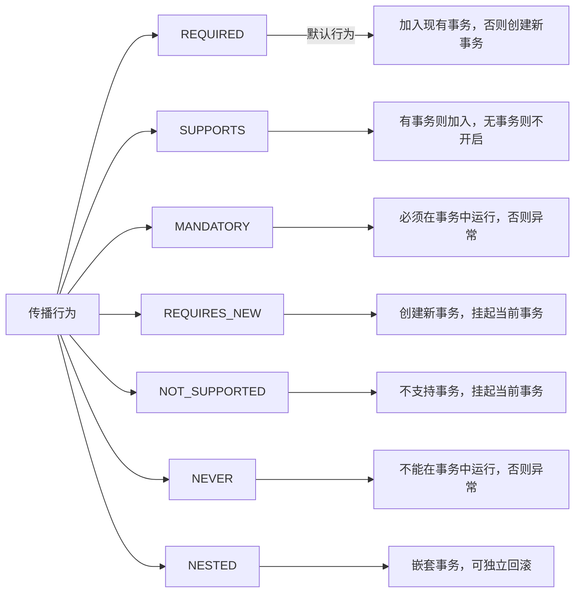
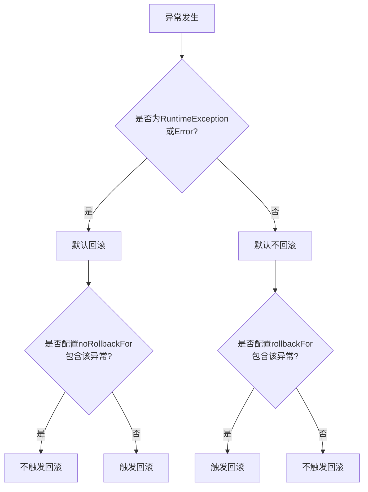
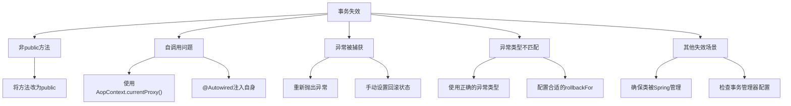
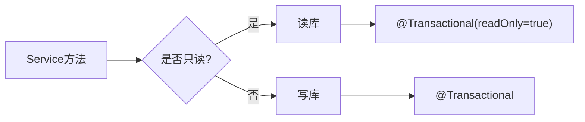

import Tabs from '@theme/Tabs';
import TabItem from '@theme/TabItem';
import TOCInline from '@theme/TOCInline';

# Spring 事务管理详解

Spring事务管理是Spring框架的重要特性，它提供了声明式和编程式两种事务管理方式，简化了数据库事务的处理，确保数据的一致性和完整性。

:::info 本文内容概览
<TOCInline toc={toc} />
:::

:::tip 核心价值
**Spring事务 = 声明式事务 + 编程式事务 + 传播行为 + 隔离级别 + 回滚机制**
- 📌 **声明式事务**：通过注解轻松管理事务，无需编写模板代码
- 🔄 **编程式事务**：灵活控制事务边界，满足复杂场景需求
- 🔀 **传播行为**：定义事务方法间的协作方式，优化事务边界
- 🛡️ **隔离级别**：解决并发事务问题，保障数据一致性
- ⏪ **回滚机制**：精确控制异常回滚策略，提升系统健壮性
:::

## 1. 事务基础概念

### 1.1 什么是事务？

事务是数据库操作的一个逻辑单元，它要么全部成功执行，要么全部回滚。事务确保数据的一致性和完整性。



#### ACID特性

<div className="card">
<div className="card__body">

| 特性 | 说明 | 示例 |
|------|------|------|
| **原子性（Atomicity）** | 事务是不可分割的工作单位 | 转账操作要么成功要么失败 |
| **一致性（Consistency）** | 事务执行前后数据状态一致 | 转账前后总金额不变 |
| **隔离性（Isolation）** | 并发事务之间相互隔离 | 事务A看不到事务B的未提交数据 |
| **持久性（Durability）** | 事务提交后数据永久保存 | 提交后数据不会丢失 |

</div>
</div>

### 1.2 Spring事务管理方式

Spring提供了两种事务管理方式：声明式事务和编程式事务。

<Tabs>
  <TabItem value="declarative" label="声明式事务" default>
  ```java title="声明式事务"
  @Service
  @Transactional
  public class UserService {
      
      @Autowired
      private UserRepository userRepository;
      
      @Autowired
      private AccountRepository accountRepository;
      
      @Transactional
      public void transferMoney(Long fromUserId, Long toUserId, BigDecimal amount) {
          // 扣款
          Account fromAccount = accountRepository.findByUserId(fromUserId);
          fromAccount.setBalance(fromAccount.getBalance().subtract(amount));
          accountRepository.save(fromAccount);
          
          // 加款
          Account toAccount = accountRepository.findByUserId(toUserId);
          toAccount.setBalance(toAccount.getBalance().add(amount));
          accountRepository.save(toAccount);
      }
  }
  ```
  </TabItem>
  <TabItem value="programmatic" label="编程式事务">
  ```java title="编程式事务"
  @Service
  public class UserService {
      
      @Autowired
      private TransactionTemplate transactionTemplate;
      
      @Autowired
      private UserRepository userRepository;
      
      public void createUser(User user) {
          transactionTemplate.execute(new TransactionCallbackWithoutResult() {
              @Override
              protected void doInTransactionWithoutResult(TransactionStatus status) {
                  try {
                      userRepository.save(user);
                      // 其他业务逻辑
                  } catch (Exception e) {
                      status.setRollbackOnly();
                      throw e;
                  }
              }
          });
      }
  }
  ```
  </TabItem>
  <TabItem value="comparison" label="对比分析">
  <div className="card">
  <div className="card__header">
  <h4>声明式事务 vs 编程式事务</h4>
  </div>
  <div className="card__body">
  
  | 特性 | 声明式事务 | 编程式事务 |
  |------|-----------|-----------|
  | **使用方式** | 注解配置 | 代码控制 |
  | **代码侵入性** | 低 | 高 |
  | **灵活性** | 较低 | 很高 |
  | **适用场景** | 大多数业务场景 | 复杂事务控制 |
  | **学习曲线** | 平缓 | 较陡 |
  | **维护成本** | 低 | 高 |

  </div>
  </div>
  </TabItem>
</Tabs>

## 2. 事务传播行为

### 2.1 传播行为类型

Spring定义了7种事务传播行为，用于控制事务方法之间的调用关系：



<div className="card">
<div className="card__body">

| 传播行为 | 说明 | 使用场景 |
|---------|------|---------|
| **REQUIRED** | 如果存在事务则加入，否则创建新事务 | 大多数业务方法 |
| **SUPPORTS** | 如果存在事务则加入，否则以非事务方式执行 | 查询方法 |
| **MANDATORY** | 必须在已存在事务中执行，否则抛出异常 | 业务方法必须在事务中执行 |
| **REQUIRES_NEW** | 创建新事务，挂起当前事务 | 日志记录、独立统计 |
| **NOT_SUPPORTED** | 以非事务方式执行，挂起当前事务 | 耗时查询 |
| **NEVER** | 以非事务方式执行，如果存在事务则抛出异常 | 确保方法在非事务环境执行 |
| **NESTED** | 嵌套事务，可独立回滚 | 批量操作中的单条保存 |

</div>
</div>

```java title="事务传播行为示例"
@Service
public class UserService {
    
    @Autowired
    private OrderService orderService;
    
    @Transactional
    public void createUserWithOrders(User user) {
        userRepository.save(user);
        
        // REQUIRED: 和当前事务在同一个事务中
        orderService.createOrder(user);
        
        // REQUIRES_NEW: 独立的新事务
        orderService.createUserLog(user);
    }
}

@Service
public class OrderService {
    
    @Autowired
    private OrderRepository orderRepository;
    
    @Autowired
    private LogService logService;
    
    @Transactional(propagation = Propagation.REQUIRED)
    public void createOrder(User user) {
        Order order = new Order();
        order.setUserId(user.getId());
        orderRepository.save(order);
    }
    
    @Transactional(propagation = Propagation.REQUIRES_NEW)
    public void createUserLog(User user) {
        UserLog log = new UserLog();
        log.setUserId(user.getId());
        log.setOperation("CREATE_USER");
        logService.save(log);
    }
}
```

## 3. 事务隔离级别

### 3.1 隔离级别类型

```java title="事务隔离级别示例"
@Service
public class UserService {
    
    // 1. READ_UNCOMMITTED - 读未提交
    @Transactional(isolation = Isolation.READ_UNCOMMITTED)
    public User getUserWithDirtyRead(Long id) {
        return userRepository.findById(id).orElse(null);
    }
    
    // 2. READ_COMMITTED - 读已提交（默认）
    @Transactional(isolation = Isolation.READ_COMMITTED)
    public User getUserWithReadCommitted(Long id) {
        return userRepository.findById(id).orElse(null);
    }
    
    // 3. REPEATABLE_READ - 可重复读
    @Transactional(isolation = Isolation.REPEATABLE_READ)
    public User getUserWithRepeatableRead(Long id) {
        return userRepository.findById(id).orElse(null);
    }
    
    // 4. SERIALIZABLE - 串行化
    @Transactional(isolation = Isolation.SERIALIZABLE)
    public User getUserWithSerializable(Long id) {
        return userRepository.findById(id).orElse(null);
    }
}
```

### 3.2 隔离级别详解

| 隔离级别 | 说明 | 问题 | 性能 |
|----------|------|------|------|
| **READ_UNCOMMITTED** | 读未提交 | 脏读、不可重复读、幻读 | 最高 |
| **READ_COMMITTED** | 读已提交 | 不可重复读、幻读 | 高 |
| **REPEATABLE_READ** | 可重复读 | 幻读 | 中等 |
| **SERIALIZABLE** | 串行化 | 无 | 最低 |

#### 并发问题示例

```java title="并发问题示例"
// 1. 脏读问题
@Service
public class DirtyReadExample {
    
    @Transactional(isolation = Isolation.READ_UNCOMMITTED)
    public void updateUserBalance(Long userId, BigDecimal amount) {
        // 事务A：更新余额但未提交
        Account account = accountRepository.findByUserId(userId);
        account.setBalance(account.getBalance().add(amount));
        accountRepository.save(account);
        // 此时事务B可以读到未提交的数据
    }
    
    @Transactional(isolation = Isolation.READ_UNCOMMITTED)
    public BigDecimal getUserBalance(Long userId) {
        // 事务B：可能读到事务A未提交的数据
        Account account = accountRepository.findByUserId(userId);
        return account.getBalance();
    }
}

// 2. 不可重复读问题
@Service
public class NonRepeatableReadExample {
    
    @Transactional(isolation = Isolation.READ_COMMITTED)
    public void updateUser(Long userId, String name) {
        // 事务A：更新用户名
        User user = userRepository.findById(userId).orElse(null);
        user.setName(name);
        userRepository.save(user);
    }
    
    @Transactional(isolation = Isolation.READ_COMMITTED)
    public void readUserTwice(Long userId) {
        // 事务B：两次读取可能得到不同结果
        User user1 = userRepository.findById(userId).orElse(null);
        // 事务A提交
        User user2 = userRepository.findById(userId).orElse(null);
        // user1.getName() != user2.getName()
    }
}
```

## 4. 事务回滚机制

### 4.1 自动回滚

```java title="自动回滚示例"
@Service
public class UserService {
    
    @Transactional
    public void createUser(User user) {
        try {
            userRepository.save(user);
            // 如果这里抛出异常，事务会自动回滚
            if (user.getAge() < 0) {
                throw new IllegalArgumentException("年龄不能为负数");
            }
        } catch (Exception e) {
            // 异常会被重新抛出，触发事务回滚
            throw e;
        }
    }
    
    // 指定回滚异常
    @Transactional(rollbackFor = {IllegalArgumentException.class, SQLException.class})
    public void createUserWithCustomRollback(User user) {
        userRepository.save(user);
        if (user.getAge() < 0) {
            throw new IllegalArgumentException("年龄不能为负数");
        }
    }
    
    // 指定不回滚异常
    @Transactional(noRollbackFor = {BusinessException.class})
    public void createUserWithNoRollback(User user) {
        userRepository.save(user);
        if (user.getName().isEmpty()) {
            throw new BusinessException("用户名不能为空");
        }
    }
}
```

### 4.2 手动回滚

<div className="card">
<div className="card__body">

```java title="手动回滚示例"
@Service
public class UserService {
    
    @Autowired
    private TransactionTemplate transactionTemplate;
    
    public void createUserWithManualRollback(User user) {
        transactionTemplate.execute(new TransactionCallbackWithoutResult() {
            @Override
            protected void doInTransactionWithoutResult(TransactionStatus status) {
                try {
                    userRepository.save(user);
                    
                    // 业务逻辑检查
                    if (user.getAge() < 0) {
                        // 手动设置回滚
                        status.setRollbackOnly();
                        return;
                    }
                    
                    // 其他业务逻辑
                } catch (Exception e) {
                    // 异常时自动回滚
                    status.setRollbackOnly();
                    throw e;
                }
            }
        });
    }
}
```

</div>
</div>

<details>
<summary>异常回滚规则总结</summary>

1. 默认情况下，Spring只对运行时异常（RuntimeException及其子类）和Error进行回滚
2. 受检异常（checked exception）不会触发回滚
3. 可以通过`rollbackFor`指定需要回滚的异常类型
4. 可以通过`noRollbackFor`指定不需要回滚的异常类型
5. 编程式事务中可以通过`status.setRollbackOnly()`手动标记事务回滚

</details>



## 5. 事务失效场景

### 5.1 常见失效场景

<Tabs>
  <TabItem value="case1" label="非public方法" default>
  ```java
  @Service
  public class TransactionFailureExample {
      // 1. 非public方法
      @Transactional
      private void privateMethod() {
          // 事务不会生效
          userRepository.save(new User());
      }
  }
  ```
  <div className="card">
  <div className="card__body">
  <p><strong>原因：</strong> Spring AOP代理只拦截public方法调用，非public方法不会创建代理</p>
  <p><strong>解决方法：</strong> 确保事务方法是public的</p>
  </div>
  </div>
  </TabItem>

  <TabItem value="case2" label="自调用问题">
  ```java
  @Service
  public class TransactionFailureExample {
      // 2. 自调用问题
      @Transactional
      public void methodA() {
          // 事务生效
          userRepository.save(new User());
          
          // 自调用，事务不会生效
          this.methodB();
      }
      
      @Transactional
      public void methodB() {
          // 这个方法的事务不会生效
          userRepository.save(new User());
      }
  }
  ```
  <div className="card">
  <div className="card__body">
  <p><strong>原因：</strong> Spring AOP代理基于代理模式，只有通过代理对象调用方法时才会创建事务</p>
  <p><strong>解决方法：</strong> 通过代理对象调用方法（使用AopContext或注入自身）</p>
  </div>
  </div>
  </TabItem>

  <TabItem value="case3" label="异常被捕获">
  ```java
  @Transactional
  public void methodWithCaughtException() {
      try {
          userRepository.save(new User());
          throw new RuntimeException("测试异常");
      } catch (Exception e) {
          // 异常被捕获，事务不会回滚
          log.error("异常被捕获", e);
      }
  }
  ```
  <div className="card">
  <div className="card__body">
  <p><strong>原因：</strong> Spring事务在方法返回时检查是否有未处理的异常，如果异常被捕获，事务不会回滚</p>
  <p><strong>解决方法：</strong> 捕获异常后重新抛出或设置事务状态为回滚</p>
  </div>
  </div>
  </TabItem>

  <TabItem value="case4" label="异常类型不匹配">
  ```java
  @Transactional(rollbackFor = SQLException.class)
  public void methodWithWrongException() {
      userRepository.save(new User());
      throw new RuntimeException("运行时异常"); // 此处抛出的是RuntimeException
  }
  ```
  <div className="card">
  <div className="card__body">
  <p><strong>原因：</strong> 指定了特定类型的异常才会回滚，但抛出了不同类型的异常</p>
  <p><strong>解决方法：</strong> 确保rollbackFor包含可能抛出的异常类型</p>
  </div>
  </div>
  </TabItem>
</Tabs>

### 5.2 解决方案



<div className="card">
<div className="card__body">

```java title="事务失效解决方案"
@Service
public class TransactionSolutionExample {
    
    @Autowired
    private ApplicationContext applicationContext;
    
    // 1. 解决自调用问题 - 使用AopContext
    @Transactional
    public void methodA() {
        userRepository.save(new User());
        
        // 获取代理对象
        UserService proxy = (UserService) AopContext.currentProxy();
        proxy.methodB(); // 事务生效
    }
    
    // 2. 解决自调用问题 - 注入自身
    @Autowired
    private UserService self;
    
    @Transactional
    public void methodAWithSelf() {
        userRepository.save(new User());
        self.methodB(); // 事务生效
    }
    
    // 3. 解决异常捕获问题
    @Transactional
    public void methodWithProperException() {
        try {
            userRepository.save(new User());
            throw new RuntimeException("测试异常");
        } catch (Exception e) {
            log.error("异常被捕获", e);
            // 重新抛出异常，触发回滚
            throw new RuntimeException("重新抛出异常", e);
        }
    }
}
```

</div>
</div>

:::caution 注意事项
使用AopContext需要在配置类上添加`@EnableAspectJAutoProxy(exposeProxy = true)`注解
:::

## 6. 事务最佳实践

### 6.1 事务设计原则

<div className="card">
<div className="card__header">
<h4>事务设计的五项原则</h4>
</div>
<div className="card__body">

1. **原子性原则**：事务方法应该尽可能小，只包含必要的数据库操作
2. **性能原则**：避免在事务中进行耗时操作，如远程调用、文件IO等
3. **隔离原则**：选择合适的隔离级别，避免并发问题
4. **传播原则**：合理使用事务传播行为，避免事务嵌套过深
5. **异常处理原则**：明确定义回滚规则，不捕获异常或重新抛出异常

</div>
</div>

<Tabs>
  <TabItem value="bp1" label="事务方法要小" default>
  ```java
  @Service
  public class TransactionBestPractice {
      // 1. 事务方法要尽可能小
      @Transactional
      public void createUser(User user) {
          // 只包含必要的数据库操作
          validateUser(user); // 验证逻辑应尽量放在事务外
          userRepository.save(user);
      }
      
      // 非事务方法
      private void validateUser(User user) {
          // 验证逻辑
      }
  }
  ```
  </TabItem>
  <TabItem value="bp2" label="避免耗时操作">
  ```java
  @Service
  public class TransactionBestPractice {
      // 2. 避免在事务中进行耗时操作
      @Transactional
      public void createUserWithAsyncOperation(User user) {
          userRepository.save(user);
          
          // 异步处理耗时操作
          CompletableFuture.runAsync(() -> {
              sendWelcomeEmail(user.getEmail());
              updateUserStatistics();
          });
      }
  }
  ```
  </TabItem>
  <TabItem value="bp3" label="合理使用传播行为">
  ```java
  @Service
  public class TransactionBestPractice {
      // 3. 合理使用事务传播行为
      @Transactional(propagation = Propagation.REQUIRED)
      public void createUserWithOrder(User user, Order order) {
          userRepository.save(user);
          
          // 订单创建使用独立事务
          orderService.createOrderWithNewTransaction(order);
      }
      
      // 订单服务
      @Service
      public class OrderService {
          @Transactional(propagation = Propagation.REQUIRES_NEW)
          public void createOrderWithNewTransaction(Order order) {
              // 独立事务，即使用户创建失败，订单也可以提交
              orderRepository.save(order);
          }
      }
  }
  ```
  </TabItem>
  <TabItem value="bp4" label="完整配置">
  ```java
  // 4. 使用@Transactional注解的完整配置
  @Transactional(
      propagation = Propagation.REQUIRED,
      isolation = Isolation.READ_COMMITTED,
      timeout = 30,
      rollbackFor = {Exception.class},
      readOnly = false
  )
  public void completeTransactionExample(User user) {
      // 完整的事务配置示例
      userRepository.save(user);
  }
  ```
  </TabItem>
</Tabs>

### 6.2 读写分离



<div className="card">
<div className="card__body">

```java title="读写分离示例"
@Service
public class UserReadWriteService {
    
    @Autowired
    private UserRepository userRepository;
    
    // 写操作
    @Transactional
    public User createUser(User user) {
        return userRepository.save(user);
    }
    
    // 读操作
    @Transactional(readOnly = true)
    public User findUserById(Long id) {
        return userRepository.findById(id).orElse(null);
    }
    
    // 批量读取操作
    @Transactional(readOnly = true)
    public List<User> findAllUsers() {
        return userRepository.findAll();
    }
}
```

</div>
</div>

## 7. 面试题精选

### 7.1 基础概念题

**Q: 什么是事务？Spring事务管理的优势是什么？**

A: 事务是数据库操作的一个逻辑单元，具有ACID特性。Spring事务管理的优势包括：
- **声明式事务**：通过注解简化事务配置
- **编程式事务**：提供灵活的事务控制
- **传播行为**：支持复杂的事务嵌套
- **隔离级别**：提供不同的事务隔离级别
- **自动回滚**：异常时自动回滚事务

**Q: Spring事务的传播行为有哪些？**

A: Spring定义了7种事务传播行为：
- **REQUIRED**：支持当前事务，不存在则创建新事务
- **REQUIRES_NEW**：创建新事务，挂起当前事务
- **SUPPORTS**：支持当前事务，不存在则以非事务执行
- **NOT_SUPPORTED**：以非事务执行，挂起当前事务
- **MANDATORY**：必须在事务中执行，否则抛出异常
- **NEVER**：不能在事务中执行，否则抛出异常
- **NESTED**：嵌套事务，可以独立回滚

### 7.2 实践题

**Q: 事务的隔离级别有哪些？各有什么特点？**

A: 事务隔离级别包括：
- **READ_UNCOMMITTED**：读未提交，性能最高但存在脏读问题
- **READ_COMMITTED**：读已提交，避免脏读但存在不可重复读
- **REPEATABLE_READ**：可重复读，避免不可重复读但存在幻读
- **SERIALIZABLE**：串行化，避免所有并发问题但性能最低

**Q: 什么情况下Spring事务会失效？**

A: Spring事务失效的常见情况：
- **非public方法**：@Transactional注解在非public方法上不生效
- **自调用问题**：同一个类中的方法调用不会经过代理
- **异常被捕获**：异常被catch捕获后不会触发回滚
- **异常类型不匹配**：抛出的异常类型不在rollbackFor中
- **数据库不支持**：使用的数据库不支持事务

### 7.3 高级题

**Q: 如何解决Spring事务的自调用问题？**

A: 解决自调用问题的方法：
- **使用AopContext**：通过AopContext.currentProxy()获取代理对象
- **注入自身**：使用@Autowired注入自身的代理对象
- **提取方法**：将需要事务的方法提取到另一个类中
- **使用AspectJ**：使用AspectJ编译时织入

**Q: 如何设计一个分布式事务？**

A: 分布式事务设计考虑：
- **2PC/3PC协议**：两阶段/三阶段提交协议
- **TCC模式**：Try-Confirm-Cancel模式
- **Saga模式**：长事务的补偿模式
- **消息事务**：基于消息的最终一致性
- **本地消息表**：结合本地事务和消息队列

:::tip 事务管理学习要点
1. **理解ACID特性**：掌握事务的原子性、一致性、隔离性、持久性
2. **熟悉传播行为**：了解7种事务传播行为的使用场景
3. **掌握隔离级别**：理解不同隔离级别的特点和适用场景
4. **学会异常处理**：掌握事务回滚和异常处理机制
5. **避免失效场景**：了解事务失效的原因和解决方案
:::

---

通过本章的学习，你应该已经掌握了Spring事务管理的核心概念、传播行为、隔离级别和最佳实践。事务管理是保证数据一致性的重要技术，在实际项目中合理使用Spring事务可以确保业务数据的完整性和可靠性。 