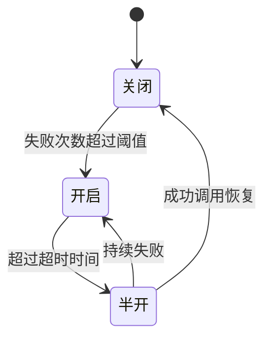
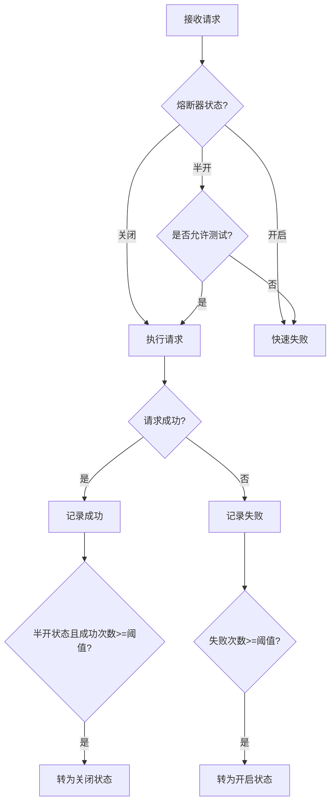

import Tabs from '@theme/Tabs';
import TabItem from '@theme/TabItem';
import TOCInline from '@theme/TOCInline';

# 熔断器模式设计

熔断器模式是分布式系统中重要的容错机制，通过监控服务调用状态，在服务出现故障时快速失败，防止故障扩散，提高系统稳定性。

:::info 本文内容概览
<TOCInline toc={toc} />
:::

:::tip 核心价值
**熔断器 = 故障隔离 + 快速失败 + 自动恢复 + 降级策略 + 系统保护**
- 🛡️ **故障隔离**：阻止故障扩散到其他服务
- ⚡ **快速失败**：迅速返回错误，避免资源耗尽
- 🔄 **自动恢复**：定期尝试恢复，无需人工干预
- ⬇️ **降级策略**：提供备选方案，保证基本功能可用
- 🔒 **系统保护**：防止过载，维护系统整体稳定
:::

## 1. 熔断器基础概念

### 1.1 熔断器状态

熔断器有三种状态：



| 状态 | 说明 | 行为 |
|------|------|------|
| **关闭 (Closed)** | 正常状态 | 允许请求通过，统计失败次数 |
| **开启 (Open)** | 熔断状态 | 快速失败，不调用目标服务 |
| **半开 (Half-Open)** | 恢复状态 | 允许少量请求测试服务恢复情况 |

<Tabs>
  <TabItem value="state" label="熔断器状态定义" default>
  ```java
public enum CircuitBreakerState {
    CLOSED("关闭", "正常状态，允许请求通过"),
    OPEN("开启", "熔断状态，快速失败"),
    HALF_OPEN("半开", "恢复状态，允许少量请求测试");
    
    private final String name;
    private final String description;
    
    CircuitBreakerState(String name, String description) {
        this.name = name;
        this.description = description;
    }
}
  ```
  </TabItem>
  <TabItem value="component" label="熔断器组件">
  ```java
@Component
public class CircuitBreaker {
    
    private final String name;
    private final AtomicReference<CircuitBreakerState> state = new AtomicReference<>(CircuitBreakerState.CLOSED);
    private final AtomicInteger failureCount = new AtomicInteger(0);
    private final AtomicLong lastFailureTime = new AtomicLong(0);
    private final AtomicInteger successCount = new AtomicInteger(0);
    
    private final int failureThreshold;
    private final long timeout;
    private final int successThreshold;
    
    public CircuitBreaker(String name, int failureThreshold, long timeout, int successThreshold) {
        this.name = name;
        this.failureThreshold = failureThreshold;
        this.timeout = timeout;
        this.successThreshold = successThreshold;
    }
    
    public boolean isClosed() {
        return state.get() == CircuitBreakerState.CLOSED;
    }
    
    public boolean isOpen() {
        return state.get() == CircuitBreakerState.OPEN;
    }
    
    public boolean isHalfOpen() {
        return state.get() == CircuitBreakerState.HALF_OPEN;
    }
}
```
  </TabItem>
</Tabs>

### 1.2 熔断器配置

熔断器的关键配置参数：

<div className="card">
<div className="card__body">

- **失败阈值（Failure Threshold）**：触发熔断的连续失败次数
- **超时时间（Timeout）**：熔断器保持打开状态的时间窗口
- **成功阈值（Success Threshold）**：半开状态转为关闭状态的成功次数要求
- **窗口大小（Window Size）**：统计失败率的请求数量样本
- **失败率阈值（Failure Rate Threshold）**：触发熔断的失败率百分比

</div>
</div>

```java title="熔断器配置"
@Configuration
public class CircuitBreakerConfig {
    
    @Value("${circuit.breaker.failure.threshold:5}")
    private int failureThreshold;
    
    @Value("${circuit.breaker.timeout:60000}")
    private long timeout;
    
    @Value("${circuit.breaker.success.threshold:3}")
    private int successThreshold;
    
    @Bean
    public CircuitBreakerProperties circuitBreakerProperties() {
        CircuitBreakerProperties properties = new CircuitBreakerProperties();
        properties.setFailureThreshold(failureThreshold);
        properties.setTimeout(timeout);
        properties.setSuccessThreshold(successThreshold);
        return properties;
    }
}
```

## 2. 熔断器实现原理

### 2.1 熔断判断逻辑



<Tabs>
  <TabItem value="allow" label="请求允许判断" default>
  ```java
  public boolean allowRequest() {
      CircuitBreakerState currentState = state.get();
      
      if (currentState == CircuitBreakerState.CLOSED) {
          return true;
      } else if (currentState == CircuitBreakerState.OPEN) {
          // 检查是否超过超时时间
          long now = System.currentTimeMillis();
          long lastFailure = lastFailureTime.get();
          
          if (now - lastFailure > timeout) {
              // 转为半开状态
              if (state.compareAndSet(CircuitBreakerState.OPEN, CircuitBreakerState.HALF_OPEN)) {
                  successCount.set(0);
                  return true;
              }
          }
          return false;
      } else { // HALF_OPEN
          // 半开状态下限制请求数量
          long currentCount = successCount.get();
          return currentCount < successThreshold;
      }
  }
  ```
  </TabItem>
  <TabItem value="record" label="结果记录逻辑">
  ```java
  public void recordSuccess() {
      CircuitBreakerState currentState = state.get();
      
      if (currentState == CircuitBreakerState.CLOSED) {
          // 关闭状态下重置失败计数
          failureCount.set(0);
      } else if (currentState == CircuitBreakerState.HALF_OPEN) {
          // 半开状态下计数成功次数
          int currentSuccesses = successCount.incrementAndGet();
          
          if (currentSuccesses >= successThreshold) {
              // 转为关闭状态
              state.compareAndSet(CircuitBreakerState.HALF_OPEN, CircuitBreakerState.CLOSED);
              failureCount.set(0);
              successCount.set(0);
          }
      }
  }
  
  public void recordFailure() {
      CircuitBreakerState currentState = state.get();
      lastFailureTime.set(System.currentTimeMillis());
      
      if (currentState == CircuitBreakerState.CLOSED) {
          // 关闭状态下计数失败
          int failures = failureCount.incrementAndGet();
          
          if (failures >= failureThreshold) {
              // 转为开启状态
              state.compareAndSet(CircuitBreakerState.CLOSED, CircuitBreakerState.OPEN);
          }
      } else if (currentState == CircuitBreakerState.HALF_OPEN) {
          // 半开状态下失败立即转为开启状态
          state.compareAndSet(CircuitBreakerState.HALF_OPEN, CircuitBreakerState.OPEN);
          successCount.set(0);
    }
}
```
  </TabItem>
</Tabs>

:::caution 注意事项
在高并发环境下，熔断状态的转换需要考虑原子性，避免竞态条件导致的状态不一致。使用AtomicReference和compareAndSet可以保证状态转换的线程安全。
:::

### 2.2 失败统计策略

熔断器可以采用不同的失败统计策略：

<details>
<summary>统计策略详解</summary>

1. **计数窗口（Count-based Window）**：
   - 统计最近N次请求的失败数
   - 优点：实现简单
   - 缺点：不考虑时间因素

2. **时间窗口（Time-based Window）**：
   - 统计最近N秒内的失败率
   - 优点：考虑时间因素
   - 缺点：实现复杂，需要维护滑动窗口

3. **混合窗口（Hybrid Window）**：
   - 综合计数和时间因素
   - 优点：更准确的故障检测
   - 缺点：实现最复杂

</details>

```java title="时间窗口失败统计"
public class TimeWindowFailureCounter {
    
    private final int windowSize; // 时间窗口大小（毫秒）
    private final double failureRateThreshold; // 失败率阈值
    private final Queue<RequestRecord> requestRecords = new ConcurrentLinkedQueue<>();
    
    public TimeWindowFailureCounter(int windowSize, double failureRateThreshold) {
        this.windowSize = windowSize;
        this.failureRateThreshold = failureRateThreshold;
    }
    
    public synchronized void recordRequest(boolean successful) {
            long now = System.currentTimeMillis();
        removeExpiredRecords(now);
        requestRecords.add(new RequestRecord(successful, now));
    }
    
    public synchronized boolean isFailureThresholdExceeded() {
        long now = System.currentTimeMillis();
        removeExpiredRecords(now);
        
        if (requestRecords.isEmpty()) {
        return false;
    }
    
        int total = requestRecords.size();
        int failures = countFailures();
        
        return (double) failures / total >= failureRateThreshold;
    }
    
    private void removeExpiredRecords(long now) {
        while (!requestRecords.isEmpty() && now - requestRecords.peek().timestamp > windowSize) {
            requestRecords.poll();
        }
    }
    
    private int countFailures() {
        return (int) requestRecords.stream()
            .filter(record -> !record.successful)
            .count();
    }
    
    private static class RequestRecord {
        final boolean successful;
        final long timestamp;
        
        RequestRecord(boolean successful, long timestamp) {
            this.successful = successful;
            this.timestamp = timestamp;
        }
    }
}
```

## 3. 熔断器实现方案

### 3.1 简单熔断器实现

```java title="简单熔断器实现"
@Component
public class SimpleCircuitBreaker {
    
    private final String name;
    private final AtomicReference<CircuitBreakerState> state = new AtomicReference<>(CircuitBreakerState.CLOSED);
    private final AtomicInteger failureCount = new AtomicInteger(0);
    private final AtomicLong lastFailureTime = new AtomicLong(0);
    private final int failureThreshold;
    private final long timeout;
    
    public SimpleCircuitBreaker(String name, int failureThreshold, long timeout) {
        this.name = name;
        this.failureThreshold = failureThreshold;
        this.timeout = timeout;
    }
    
    public <T> T execute(Supplier<T> supplier) throws CircuitBreakerOpenException {
        if (!allowRequest()) {
            throw new CircuitBreakerOpenException("Circuit breaker for [" + name + "] is open");
        }
        
        try {
            T result = supplier.get();
            recordSuccess();
            return result;
        } catch (Exception e) {
            recordFailure();
            throw e;
        }
    }
    
    public void executeRunnable(Runnable runnable) throws CircuitBreakerOpenException {
        if (!allowRequest()) {
            throw new CircuitBreakerOpenException("Circuit breaker for [" + name + "] is open");
        }
        
        try {
            runnable.run();
            recordSuccess();
        } catch (Exception e) {
            recordFailure();
            throw e;
        }
    }
    
    // allowRequest, recordSuccess, recordFailure 方法与前面相同
}
```

### 3.2 Resilience4j 熔断器

[Resilience4j](https://github.com/resilience4j/resilience4j) 是一个轻量级的容错库，提供了强大的熔断器实现：

```java title="Resilience4j熔断器示例"
@Configuration
public class Resilience4jConfig {
    
    @Bean
    public CircuitBreakerRegistry circuitBreakerRegistry() {
        CircuitBreakerConfig config = CircuitBreakerConfig.custom()
            .failureRateThreshold(50) // 失败率阈值
            .waitDurationInOpenState(Duration.ofMillis(1000)) // 开启状态等待时间
            .slidingWindowType(SlidingWindowType.COUNT_BASED) // 统计窗口类型
            .slidingWindowSize(10) // 统计窗口大小
            .minimumNumberOfCalls(5) // 最小调用次数
            .permittedNumberOfCallsInHalfOpenState(3) // 半开状态允许的调用次数
            .automaticTransitionFromOpenToHalfOpenEnabled(true) // 自动从开启转为半开
            .recordExceptions(IOException.class, TimeoutException.class) // 记录的异常类型
            .build();
            
        return CircuitBreakerRegistry.of(config);
    }
    
    @Bean
    public CircuitBreaker userServiceCircuitBreaker(CircuitBreakerRegistry registry) {
        return registry.circuitBreaker("userService");
    }
}
```

<Tabs>
  <TabItem value="usage" label="使用方式" default>
  ```java
  @Service
  public class UserService {
      
      private final RestTemplate restTemplate;
      private final CircuitBreaker circuitBreaker;
      private final Logger logger = LoggerFactory.getLogger(UserService.class);
      
      public UserService(RestTemplate restTemplate, CircuitBreaker circuitBreaker) {
          this.restTemplate = restTemplate;
          this.circuitBreaker = circuitBreaker;
      }
      
      public User getUserById(Long id) {
          return CircuitBreaker.decorateSupplier(circuitBreaker, 
              () -> restTemplate.getForObject("/users/" + id, User.class))
              .get();
      }
      
      // 带回退的熔断
      public User getUserByIdWithFallback(Long id) {
          Supplier<User> supplier = CircuitBreaker.decorateSupplier(circuitBreaker,
              () -> restTemplate.getForObject("/users/" + id, User.class));
              
          return Try.ofSupplier(supplier)
              .recover(e -> {
                  logger.error("Circuit breaker open for user service", e);
                  return getFallbackUser(id);
              }).get();
      }
      
      private User getFallbackUser(Long id) {
          User fallback = new User();
          fallback.setId(id);
          fallback.setName("用户_" + id);
          fallback.setEmail("user" + id + "@example.com");
          return fallback;
      }
  }
  ```
  </TabItem>
  <TabItem value="monitoring" label="监控集成">
  ```java
  @Configuration
  public class CircuitBreakerMonitoring {
      
      @Bean
      public CircuitBreakerEventConsumer circuitBreakerEventConsumer() {
          return new CircuitBreakerEventConsumer();
      }
      
      static class CircuitBreakerEventConsumer implements EventConsumer<CircuitBreakerEvent> {
          
          private final Logger logger = LoggerFactory.getLogger(CircuitBreakerEventConsumer.class);
          
          @Override
          public void consumeEvent(CircuitBreakerEvent event) {
              if (event.getEventType() == CircuitBreakerEvent.Type.STATE_TRANSITION) {
                  CircuitBreakerOnStateTransitionEvent transitionEvent = 
                      (CircuitBreakerOnStateTransitionEvent) event;
                  
                  logger.info("Circuit breaker '{}' changed state from {} to {}",
                      event.getCircuitBreakerName(),
                      transitionEvent.getStateTransition().getFromState(),
                      transitionEvent.getStateTransition().getToState());
              } else if (event.getEventType() == CircuitBreakerEvent.Type.FAILURE_RATE_EXCEEDED) {
                  logger.warn("Circuit breaker '{}' failure rate exceeded: {}",
                      event.getCircuitBreakerName(), event);
              }
          }
      }
      
      @PostConstruct
      public void registerEventConsumer(CircuitBreakerRegistry registry, 
                                        CircuitBreakerEventConsumer consumer) {
          registry.getAllCircuitBreakers().forEach(cb -> 
              cb.getEventPublisher().onEvent(consumer));
      }
  }
  ```
  </TabItem>
</Tabs>

## 4. Spring Cloud 中的熔断实现

### 4.1 Hystrix

:::info
Hystrix 已进入维护模式，Spring Cloud 推荐使用 Resilience4j 替代。这里介绍 Hystrix 主要是为了理解概念。
:::

```java title="Hystrix熔断器示例"
@HystrixCommand(fallbackMethod = "getDefaultUser",
    commandProperties = {
        @HystrixProperty(name = "circuitBreaker.requestVolumeThreshold", value = "4"),
        @HystrixProperty(name = "circuitBreaker.sleepWindowInMilliseconds", value = "10000"),
        @HystrixProperty(name = "circuitBreaker.errorThresholdPercentage", value = "50"),
        @HystrixProperty(name = "execution.isolation.thread.timeoutInMilliseconds", value = "1000")
    })
    public User getUserById(Long id) {
    return restTemplate.getForObject("/users/" + id, User.class);
}

public User getDefaultUser(Long id) {
        User fallback = new User();
        fallback.setId(id);
    fallback.setName("默认用户");
    fallback.setEmail("default@example.com");
        return fallback;
}
```

### 4.2 Spring Cloud Circuit Breaker

Spring Cloud Circuit Breaker 是 Spring Cloud 提供的熔断器抽象，可以集成不同的熔断器实现：

```java title="Spring Cloud Circuit Breaker示例"
@Service
public class UserService {
    
    private final ReactiveCircuitBreakerFactory circuitBreakerFactory;
    private final WebClient webClient;
    
    public UserService(ReactiveCircuitBreakerFactory circuitBreakerFactory, WebClient webClient) {
        this.circuitBreakerFactory = circuitBreakerFactory;
        this.webClient = webClient;
    }
    
    public Mono<User> getUserById(Long id) {
        return webClient.get()
            .uri("/users/{id}", id)
            .retrieve()
            .bodyToMono(User.class)
            .transform(it -> {
                ReactiveCircuitBreaker rcb = circuitBreakerFactory.create("userService");
                return rcb.run(it, throwable -> getDefaultUser(id));
            });
    }
    
    private Mono<User> getDefaultUser(Long id) {
        User fallback = new User();
        fallback.setId(id);
        fallback.setName("默认用户");
        fallback.setEmail("default@example.com");
        return Mono.just(fallback);
    }
}
```

## 5. 熔断器最佳实践

### 5.1 熔断器配置调优

<div className="card">
<div className="card__header">
<h4>熔断器配置参数调优建议</h4>
</div>
<div className="card__body">

| 参数 | 建议值 | 说明 |
|-----|-------|------|
| 失败阈值 | 5-10 | 连续失败次数或失败率，取决于服务特性 |
| 时间窗口大小 | 10-20 | 统计请求的样本大小 |
| 半开恢复时间 | 30s-5min | 熔断器从开启到半开的时间，根据故障恢复时间估计 |
| 半开请求数 | 3-5 | 半开状态允许的请求数量 |
| 成功阈值 | 2-5 | 从半开转为关闭的成功请求数 |

</div>
</div>

:::tip 调优建议
1. **小批量测试**：在生产环境中先选择少量非关键服务进行熔断器配置测试
2. **差异化配置**：不同服务可能需要不同的熔断策略，避免一刀切
3. **监控反馈**：根据监控数据持续调整熔断参数
4. **场景匹配**：根据服务特性选择合适的窗口类型（计数/时间）
:::

### 5.2 异常处理策略

<Tabs>
  <TabItem value="selective" label="选择性熔断" default>
  ```java
  @Component
  public class SelectiveCircuitBreaker extends SimpleCircuitBreaker {
      
      private final Set<Class<? extends Throwable>> recordedExceptions;
      private final Set<Class<? extends Throwable>> ignoredExceptions;
      
      public SelectiveCircuitBreaker(String name, int failureThreshold, long timeout,
                                    Set<Class<? extends Throwable>> recordedExceptions,
                                    Set<Class<? extends Throwable>> ignoredExceptions) {
          super(name, failureThreshold, timeout);
          this.recordedExceptions = recordedExceptions;
          this.ignoredExceptions = ignoredExceptions;
      }
      
      @Override
      public <T> T execute(Supplier<T> supplier) throws CircuitBreakerOpenException {
          if (!allowRequest()) {
              throw new CircuitBreakerOpenException("Circuit breaker for [" + getName() + "] is open");
          }
          
          try {
              T result = supplier.get();
              recordSuccess();
              return result;
        } catch (Exception e) {
              if (shouldRecordFailure(e)) {
                  recordFailure();
              }
              throw e;
          }
      }
      
      private boolean shouldRecordFailure(Throwable throwable) {
          // 检查是否属于忽略的异常
          for (Class<? extends Throwable> ignored : ignoredExceptions) {
              if (ignored.isInstance(throwable)) {
                  return false;
              }
          }
          
          // 检查是否属于记录的异常
          if (recordedExceptions.isEmpty()) {
              return true; // 如果没有指定，记录所有异常
          }
          
          for (Class<? extends Throwable> recorded : recordedExceptions) {
              if (recorded.isInstance(throwable)) {
                  return true;
              }
          }
          
          return false;
    }
}
```
  </TabItem>
  <TabItem value="bulkhead" label="隔板模式">
  ```java
@Component
  public class BulkheadCircuitBreaker extends SimpleCircuitBreaker {
      
      private final Semaphore semaphore;
      
      public BulkheadCircuitBreaker(String name, int failureThreshold, long timeout, int maxConcurrentCalls) {
          super(name, failureThreshold, timeout);
          this.semaphore = new Semaphore(maxConcurrentCalls, true);
      }
      
      @Override
      public <T> T execute(Supplier<T> supplier) throws CircuitBreakerOpenException, BulkheadFullException {
          if (!allowRequest()) {
              throw new CircuitBreakerOpenException("Circuit breaker for [" + getName() + "] is open");
          }
          
          boolean acquired = false;
          try {
              acquired = semaphore.tryAcquire(100, TimeUnit.MILLISECONDS);
              if (!acquired) {
                  throw new BulkheadFullException("Bulkhead for [" + getName() + "] is full");
              }
              
              T result = supplier.get();
              recordSuccess();
              return result;
          } catch (BulkheadFullException e) {
              throw e;
          } catch (InterruptedException e) {
              Thread.currentThread().interrupt();
              throw new RuntimeException("Interrupted while waiting for bulkhead", e);
          } catch (Exception e) {
              recordFailure();
              throw e;
          } finally {
              if (acquired) {
                  semaphore.release();
              }
          }
      }
  }
  
  class BulkheadFullException extends RuntimeException {
      public BulkheadFullException(String message) {
          super(message);
    }
}
```
  </TabItem>
</Tabs>

### 5.3 监控与告警

:::warning
熔断器状态的变化需要及时监控和告警，以便运维人员了解系统健康状况并及时处理问题。
:::

```java title="熔断器监控"
@Configuration
public class CircuitBreakerMonitoring {
    
    private final MeterRegistry meterRegistry;
    private final Map<String, CircuitBreaker> circuitBreakers;
    
    public CircuitBreakerMonitoring(MeterRegistry meterRegistry, 
                                    Map<String, CircuitBreaker> circuitBreakers) {
        this.meterRegistry = meterRegistry;
        this.circuitBreakers = circuitBreakers;
        
        registerMetrics();
    }
    
    private void registerMetrics() {
        circuitBreakers.forEach((name, circuitBreaker) -> {
            Gauge.builder("circuit.breaker.state", circuitBreaker, this::getStateValue)
                .tag("name", name)
                .description("Circuit breaker state (0:closed, 1:open, 2:half_open)")
                .register(meterRegistry);
            
            Counter.builder("circuit.breaker.calls")
                .tag("name", name)
                .tag("result", "success")
                .description("Circuit breaker successful calls")
                .register(meterRegistry);
            
            Counter.builder("circuit.breaker.calls")
                .tag("name", name)
                .tag("result", "failure")
                .description("Circuit breaker failed calls")
                .register(meterRegistry);
        });
    }
    
    private int getStateValue(CircuitBreaker circuitBreaker) {
        if (circuitBreaker.isClosed()) return 0;
        if (circuitBreaker.isOpen()) return 1;
        return 2; // Half-open
    }
}
```

## 6. 面试题精选

<details>
<summary>**Q: 什么是熔断器模式？熔断器的三种状态是什么？**</summary>

**A:** 熔断器模式是一种保护分布式系统的容错机制，当检测到目标服务出现故障时，可以快速失败并阻断请求，防止故障扩散，并在适当时机尝试恢复。

熔断器的三种状态：
1. **关闭状态(Closed)**：正常状态，允许请求通过，统计失败次数。
2. **开启状态(Open)**：熔断状态，快速失败所有请求，不调用目标服务。
3. **半开状态(Half-Open)**：恢复阶段，允许少量请求尝试调用目标服务，测试服务是否恢复。
</details>

<details>
<summary>**Q: 熔断器与降级的区别是什么？**</summary>

**A:** 
- **熔断器**：侧重于故障检测和阻断，是一种"开/关"机制，当服务出现问题时会中断所有请求，以保护系统和依赖方。
- **降级**：侧重于服务功能的退化处理，提供备选方案，确保在不理想条件下仍能提供基本服务。

熔断通常会触发降级，但降级不一定由熔断触发（也可能由负载过高、人工配置等触发）。
</details>

<details>
<summary>**Q: 如何设计熔断器的阈值参数？**</summary>

**A:** 设计熔断器阈值时需要考虑：

1. **失败阈值**：
   - 对关键服务设置较高阈值（如10次）
   - 对非关键服务可设置较低阈值（如5次）
   - 考虑使用百分比失败率而非绝对次数（如50%失败率）

2. **时间窗口**：
   - 根据服务响应时间设置窗口大小
   - 高流量服务使用较小窗口（如10秒）
   - 低流量服务使用较大窗口（如60秒）

3. **恢复策略**：
   - 半开状态持续时间应大于依赖服务的典型恢复时间
   - 半开状态允许的请求数不宜过多，通常3-5个
   - 测试请求成功阈值应考虑业务稳定性需求
</details>

<details>
<summary>**Q: Spring Cloud中如何实现熔断器？**</summary>

**A:** Spring Cloud提供多种熔断器实现：

1. **Spring Cloud Circuit Breaker**：
   - 提供统一的抽象API
   - 支持多种底层实现（Resilience4j、Sentinel等）
   - 可以通过配置文件或代码配置熔断规则

2. **Resilience4j（推荐）**：
   - 轻量级容错库，Netflix Hystrix的继任者
   - 提供熔断器、限流器、重试、隔板等功能
   - 与Spring Boot、Spring Cloud良好集成
   - 基于函数式编程，支持响应式编程

3. **Hystrix（已进入维护模式）**：
   - 通过@HystrixCommand注解实现
   - 提供熔断、降级、缓存、监控等功能
   - 有完善的仪表盘监控工具

4. **Sentinel（国产替代）**：
   - 阿里开源的流量控制组件
   - 提供熔断、流控、系统负载保护等功能
   - 有强大的控制台，支持动态规则调整
</details>

<details>
<summary>**Q: 熔断器如何处理瞬时故障和慢请求？**</summary>

**A:** 处理瞬时故障和慢请求的策略：

1. **瞬时故障处理**：
   - 使用滑动窗口统计故障率，避免单次故障触发熔断
   - 实现重试机制，自动重试临时性故障
   - 区分异常类型，对瞬时故障使用不同的熔断策略

2. **慢请求处理**：
   - 设置请求超时，超出时间视为失败
   - 实现请求缓存，减少重复慢请求
   - 使用隔板模式（Bulkhead）限制并发请求数
   - 对慢速端点单独设置熔断器，避免影响其他请求
</details>

:::tip 熔断器学习要点
1. **掌握三种状态**：理解关闭、开启、半开三种状态的转换逻辑
2. **参数调优**：学会根据实际场景调整失败阈值、窗口大小等参数
3. **异常处理**：区分不同类型的异常，选择性记录故障
4. **降级策略**：设计合理的降级策略，保证基本功能可用
5. **监控告警**：实施有效的监控，及时发现并处理熔断事件
:::

---

通过本章的学习，你应该已经掌握了熔断器模式的原理、实现方法和最佳实践。熔断器是构建弹性分布式系统的关键组件，能够有效防止故障扩散，提高系统整体稳定性。在实际项目中，合理应用熔断器模式可以大大提升系统的可用性和用户体验。 