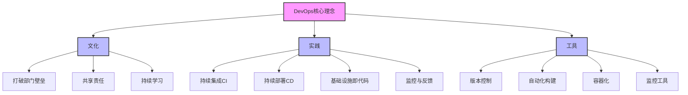
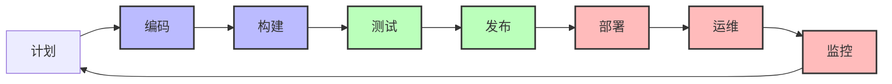

import Tabs from '@theme/Tabs';
import TabItem from '@theme/TabItem';
import TOCInline from '@theme/TOCInline';

# DevOps实践指南

DevOps是一种将开发(Development)、运维(Operations)和质量保证(QA)整合在一起的文化、实践和工具集合，旨在提高软件交付的速度、质量和可靠性。

:::info 本文内容概览
<TOCInline toc={toc} />
:::

:::tip 核心价值
**DevOps = 持续集成 + 持续部署 + 自动化运维 + 监控告警 + 团队协作**
- 🔄 **持续集成**：频繁将代码集成到主干，自动执行构建和测试
- 🚀 **持续部署**：自动将已验证的代码部署到生产环境
- 🤖 **自动化运维**：自动化配置、部署和管理基础设施
- 📊 **监控告警**：实时监控系统状态，及时发现和响应问题
- 👥 **团队协作**：打破开发与运维之间的壁垒，共享责任
:::

## 1. DevOps基础概念

### 1.1 DevOps理念



DevOps的核心理念：

| 理念 | 说明 | 实践方式 |
|------|------|----------|
| **持续集成 (CI)** | 频繁集成代码到主干 | 自动化构建、测试 |
| **持续部署 (CD)** | 自动化部署到生产环境 | 流水线部署、蓝绿部署 |
| **自动化运维** | 减少人工干预 | 配置管理、容器化 |
| **监控告警** | 实时监控系统状态 | 日志分析、性能监控 |
| **团队协作** | 打破部门壁垒 | 跨职能团队、共享责任 |

<details>
<summary>DevOps与传统开发模式的对比</summary>

| 方面 | 传统开发模式 | DevOps模式 |
|------|------------|-----------|
| **团队结构** | 开发团队和运维团队分离 | 跨职能团队，共同负责 |
| **发布周期** | 长周期发布（月/季度） | 短周期发布（天/周） |
| **变更风险** | 大批量变更，风险高 | 小批量变更，风险低 |
| **故障处理** | 责任推诿，解决慢 | 共同责任，快速解决 |
| **自动化程度** | 低，大量人工操作 | 高，自动化流水线 |
| **反馈周期** | 长，用户反馈滞后 | 短，快速获取反馈 |
| **工作重点** | 功能开发 | 交付价值和稳定性 |

</details>

<Tabs>
  <TabItem value="config" label="DevOps配置" default>
  ```java
  @Configuration
  public class DevOpsConfig {
      
      @Value("${devops.ci.enabled:true}")
      private boolean ciEnabled;
      
      @Value("${devops.cd.enabled:true}")
      private boolean cdEnabled;
      
      @Value("${devops.monitoring.enabled:true}")
      private boolean monitoringEnabled;
      
      @Bean
      public DevOpsProperties devOpsProperties() {
          DevOpsProperties properties = new DevOpsProperties();
          properties.setCiEnabled(ciEnabled);
          properties.setCdEnabled(cdEnabled);
          properties.setMonitoringEnabled(monitoringEnabled);
          return properties;
      }
      
      @Bean
      public PipelineManager pipelineManager() {
          return new PipelineManager(devOpsProperties());
      }
  }
  ```
  </TabItem>
  <TabItem value="properties" label="配置属性">
  ```java
  @Component
  public class DevOpsProperties {
      private boolean ciEnabled = true;
      private boolean cdEnabled = true;
      private boolean monitoringEnabled = true;
      private String buildTool = "maven";
      private String containerPlatform = "docker";
      private String orchestrationPlatform = "kubernetes";
      private Map<String, String> toolConfigs = new HashMap<>();
      
      // getter和setter方法
      public boolean isCiEnabled() {
          return ciEnabled;
      }
      
      public void setCiEnabled(boolean ciEnabled) {
          this.ciEnabled = ciEnabled;
      }
      
      public boolean isCdEnabled() {
          return cdEnabled;
      }
      
      public void setCdEnabled(boolean cdEnabled) {
          this.cdEnabled = cdEnabled;
      }
      
      public boolean isMonitoringEnabled() {
          return monitoringEnabled;
      }
      
      public void setMonitoringEnabled(boolean monitoringEnabled) {
          this.monitoringEnabled = monitoringEnabled;
      }
      
      // 其他getter和setter
  }
  ```
  </TabItem>
</Tabs>

### 1.2 DevOps生命周期

DevOps生命周期是一个闭环的过程，包括计划、编码、构建、测试、发布、部署、运维和监控阶段。



<div className="card">
<div className="card__header">
<h4>DevOps生命周期阶段</h4>
</div>
<div className="card__body">

1. **计划**：定义需求、规划迭代内容、制定开发计划
2. **编码**：开发功能、代码审查、版本控制
3. **构建**：编译代码、静态代码分析、构建容器镜像
4. **测试**：单元测试、集成测试、自动化测试
5. **发布**：打包、版本标记、发布到制品库
6. **部署**：环境配置、应用部署、基础设施更新
7. **运维**：系统配置、资源管理、扩缩容
8. **监控**：性能监控、日志收集、告警处理

</div>
</div>

<Tabs>
  <TabItem value="lifecycle" label="生命周期管理" default>
  ```java
  @Component
  public class DevOpsLifecycle {
      
      @Autowired
      private PipelineManager pipelineManager;
      
      @Autowired
      private MonitoringService monitoringService;
      
      public void executeDevOpsPipeline(String projectName, String branch) {
          try {
              // 1. 代码提交阶段
              log.info("开始处理项目: {} 分支: {}", projectName, branch);
              
              // 2. 持续集成阶段
              boolean ciSuccess = executeCI(projectName, branch);
              if (!ciSuccess) {
                  throw new DevOpsException("CI阶段失败");
              }
              
              // 3. 持续部署阶段
              boolean cdSuccess = executeCD(projectName, branch);
              if (!cdSuccess) {
                  throw new DevOpsException("CD阶段失败");
              }
              
              // 4. 监控验证阶段
              boolean monitoringSuccess = executeMonitoring(projectName);
              if (!monitoringSuccess) {
                  log.warn("监控验证失败，需要人工检查");
              }
              
              log.info("DevOps流水线执行完成: {}", projectName);
              
          } catch (Exception e) {
              log.error("DevOps流水线执行失败: {}", projectName, e);
              handlePipelineFailure(projectName, e);
          }
      }
      
      private boolean executeCI(String projectName, String branch) {
          log.info("执行CI阶段: {}", projectName);
          
          // 代码检查
          boolean codeCheck = pipelineManager.runCodeCheck(projectName, branch);
          if (!codeCheck) {
              log.error("代码检查失败: {}", projectName);
              return false;
          }
          
          // 单元测试
          boolean unitTest = pipelineManager.runUnitTests(projectName, branch);
          if (!unitTest) {
              log.error("单元测试失败: {}", projectName);
              return false;
          }
          
          // 集成测试
          boolean integrationTest = pipelineManager.runIntegrationTests(projectName, branch);
          if (!integrationTest) {
              log.error("集成测试失败: {}", projectName);
              return false;
          }
          
          // 构建打包
          boolean build = pipelineManager.buildProject(projectName, branch);
          if (!build) {
              log.error("构建失败: {}", projectName);
              return false;
          }
          
          return true;
      }
  }
  ```
  </TabItem>
  <TabItem value="ci" label="持续集成阶段">
  ```java
  @Component
  public class ContinuousIntegration {
      
      @Autowired
      private GitService gitService;
      
      @Autowired
      private BuildService buildService;
      
      @Autowired
      private TestService testService;
      
      @Autowired
      private NotificationService notificationService;
      
      public BuildResult executeCIPipeline(String projectName, String branch) {
          log.info("开始执行持续集成流程 - 项目: {}, 分支: {}", projectName, branch);
          BuildResult result = new BuildResult();
          
          try {
              // 1. 拉取代码
              gitService.checkout(projectName, branch);
              
              // 2. 静态代码分析
              CodeAnalysisResult analysisResult = runCodeAnalysis(projectName);
              result.setCodeAnalysisResult(analysisResult);
              
              if (!analysisResult.isSuccess() && analysisResult.isCritical()) {
                  result.setSuccess(false);
                  result.setFailureStage("静态代码分析");
                  return result;
              }
              
              // 3. 编译代码
              boolean compileSuccess = buildService.compile(projectName);
              if (!compileSuccess) {
                  result.setSuccess(false);
                  result.setFailureStage("编译");
                  return result;
              }
              
              // 4. 运行单元测试
              TestResult testResult = testService.runUnitTests(projectName);
              result.setTestResult(testResult);
              
              if (!testResult.isSuccess()) {
                  result.setSuccess(false);
                  result.setFailureStage("单元测试");
                  return result;
              }
              
              // 5. 构建项目
              String artifactId = buildService.buildArtifact(projectName, branch);
              result.setArtifactId(artifactId);
              
              result.setSuccess(true);
              log.info("持续集成流程成功完成");
              
          } catch (Exception e) {
              log.error("持续集成流程失败", e);
              result.setSuccess(false);
              result.setFailureStage("未知错误");
              result.setFailureMessage(e.getMessage());
          }
          
          // 发送通知
          notificationService.sendBuildNotification(result);
          
          return result;
      }
  }
  ```
  </TabItem>
  <TabItem value="cd" label="持续部署阶段">
  ```java
  @Component
  public class ContinuousDeployment {
      
      @Autowired
      private ArtifactRepository artifactRepository;
      
      @Autowired
      private KubernetesService kubernetesService;
      
      @Autowired
      private MonitoringService monitoringService;
      
      public DeploymentResult executeDeployment(String projectName, String artifactId, String environment) {
          log.info("开始执行持续部署流程 - 项目: {}, 制品: {}, 环境: {}", 
              projectName, artifactId, environment);
          
          DeploymentResult result = new DeploymentResult();
          
          try {
              // 1. 获取制品
              String artifactUrl = artifactRepository.getArtifactUrl(artifactId);
              
              // 2. 检查目标环境
              EnvironmentStatus envStatus = kubernetesService.checkEnvironment(environment);
              if (!envStatus.isReady()) {
                  result.setSuccess(false);
                  result.setFailureStage("环境检查");
                  result.setFailureMessage("目标环境不可用: " + envStatus.getMessage());
                  return result;
              }
              
              // 3. 执行部署
              String deploymentId = kubernetesService.deploy(projectName, artifactUrl, environment);
              result.setDeploymentId(deploymentId);
              
              // 4. 验证部署
              DeploymentStatus deployStatus = kubernetesService.waitForDeployment(deploymentId, 300);
              if (!deployStatus.isSuccess()) {
                  result.setSuccess(false);
                  result.setFailureStage("部署验证");
                  result.setFailureMessage("部署未成功完成: " + deployStatus.getMessage());
                  return result;
              }
              
              // 5. 健康检查
              HealthCheckResult healthCheck = monitoringService.performHealthCheck(
                  projectName, environment, 60);
              
              result.setHealthCheckResult(healthCheck);
              result.setSuccess(healthCheck.isSuccess());
              
              if (!healthCheck.isSuccess()) {
                  result.setFailureStage("健康检查");
                  return result;
              }
              
              log.info("持续部署流程成功完成");
              
          } catch (Exception e) {
              log.error("持续部署流程失败", e);
              result.setSuccess(false);
              result.setFailureStage("未知错误");
              result.setFailureMessage(e.getMessage());
          }
          
          return result;
      }
  }
  ```
  </TabItem>
</Tabs>

:::caution DevOps实践注意事项
1. **自动化优先**：尽可能自动化所有重复性任务，减少手动操作
2. **小批量变更**：频繁发布小的变更，而不是一次性大批量变更
3. **快速反馈**：建立快速反馈机制，尽早发现和解决问题
4. **共享责任**：开发和运维共同负责产品质量和稳定性
5. **持续改进**：定期回顾和改进DevOps流程和工具链
:::

## 2. 持续集成与持续部署

### 2.1 持续集成实践

持续集成(CI)是一种软件开发实践，团队成员频繁地将代码集成到共享仓库，通常每天多次。每次集成都通过自动化构建和测试来验证。 