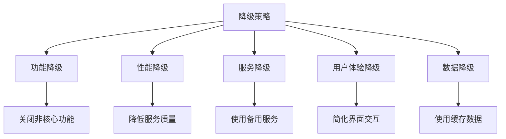
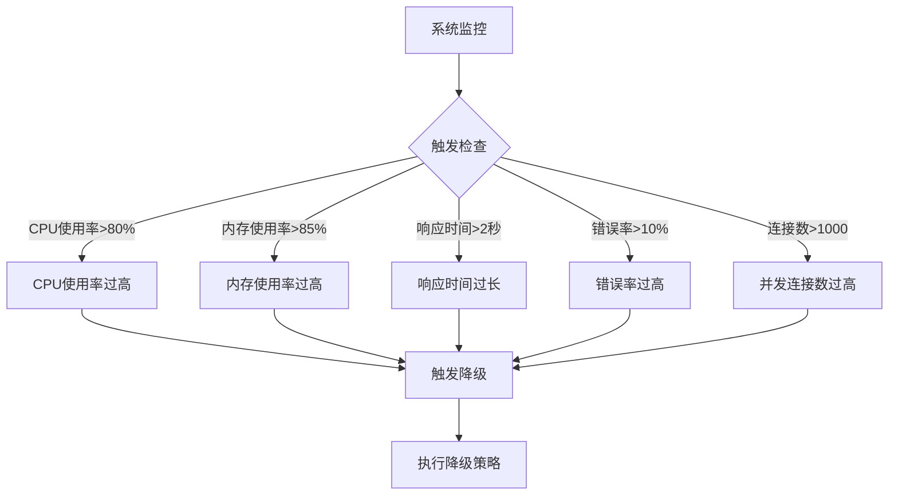
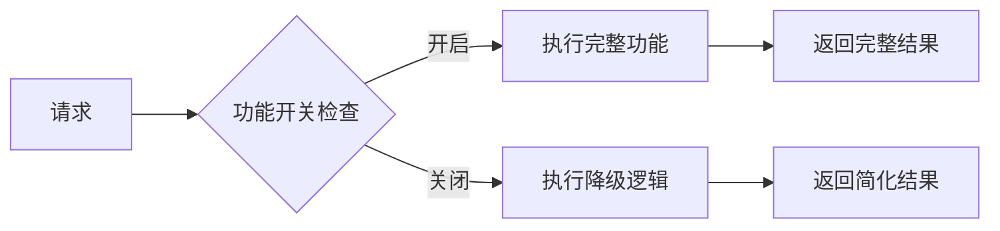
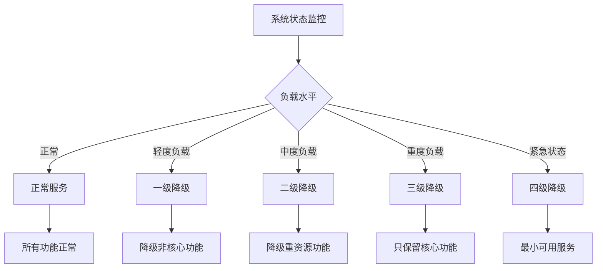
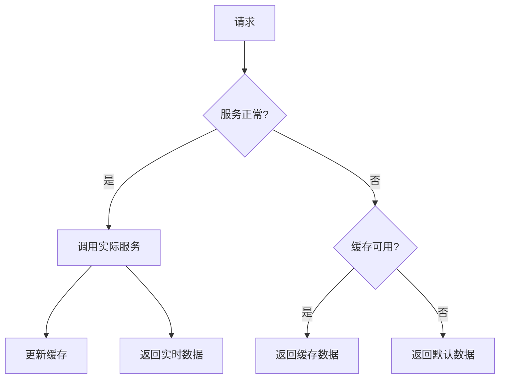
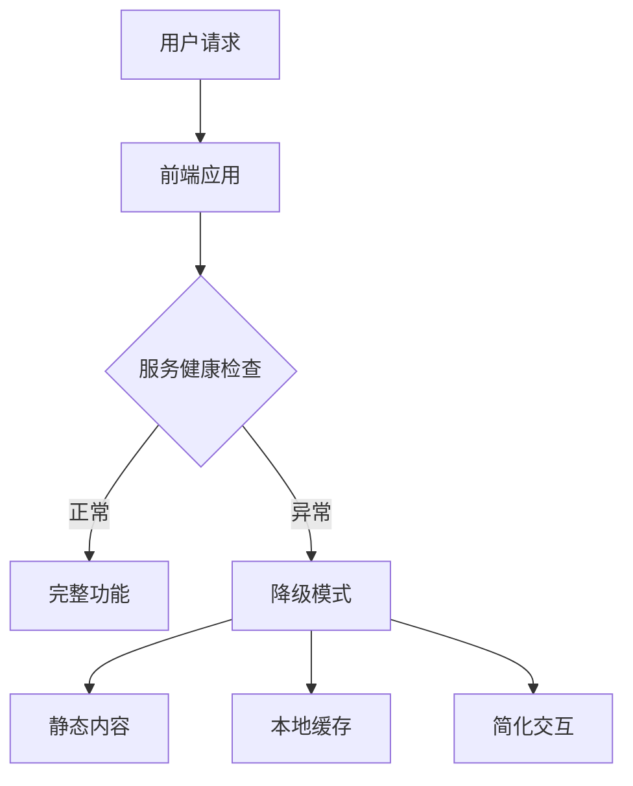

import Tabs from '@theme/Tabs';
import TabItem from '@theme/TabItem';
import TOCInline from '@theme/TOCInline';

# 降级策略设计

降级策略是分布式系统中重要的容错机制，当系统出现故障或负载过高时，通过降级非核心功能来保证核心功能的可用性，提高系统的整体稳定性。

:::info 本文内容概览
<TOCInline toc={toc} />
:::

:::tip 核心价值
**降级策略 = 功能保护 + 资源管理 + 用户体验 + 系统稳定 + 故障恢复**
- 🛡️ **功能保护**：保证核心功能可用，降级非核心功能
- 📊 **资源管理**：合理分配系统资源，避免资源耗尽
- 👤 **用户体验**：在系统压力大时，提供基本服务保障
- 🔄 **系统稳定**：防止雪崩效应，确保系统整体稳定
- ⚕️ **故障恢复**：在问题解决后能够平滑恢复正常服务
:::

## 1. 降级策略基础

### 1.1 降级概念



降级策略的核心概念：

| 概念 | 说明 | 实现方式 |
|------|------|----------|
| **功能降级** | 关闭非核心功能 | 功能开关、配置控制 |
| **性能降级** | 降低服务性能 | 减少处理逻辑、简化响应 |
| **服务降级** | 使用备用服务 | 服务切换、缓存降级 |
| **用户体验降级** | 简化用户界面 | 静态页面、简化交互 |
| **数据降级** | 使用缓存数据 | 本地缓存、历史数据 |

<details>
<summary>降级策略与熔断器的区别</summary>

**降级策略**:
- 主动控制：通常是主动决定采取的措施
- 功能维度：针对特定功能或服务进行降级
- 多种形式：可以是功能关闭、简化、备用方案等
- 业务视角：更多考虑业务优先级和用户体验
- 应用范围：可以针对单个服务、API或整个系统

**熔断器**:
- 被动保护：自动检测并断开故障服务
- 服务维度：针对整个服务调用链路进行保护
- 三态转换：关闭、开启、半开状态
- 技术视角：关注失败率、响应时间等技术指标
- 针对性：主要针对服务间调用

</details>

<Tabs>
  <TabItem value="config" label="降级配置" default>
  ```java
@Configuration
public class FallbackConfig {
    
    @Value("${fallback.enabled:true}")
    private boolean fallbackEnabled;
    
    @Value("${fallback.strategy:GRADUAL}")
    private FallbackStrategy strategy;
    
    @Bean
    public FallbackProperties fallbackProperties() {
        FallbackProperties properties = new FallbackProperties();
        properties.setEnabled(fallbackEnabled);
        properties.setStrategy(strategy);
        properties.setCacheEnabled(true);
        properties.setDefaultResponseEnabled(true);
        return properties;
    }
    
    @Bean
    public FallbackManager fallbackManager() {
        return new FallbackManager(fallbackProperties());
    }
}
  ```
  </TabItem>
  <TabItem value="properties" label="属性定义">
  ```java
@Component
public class FallbackProperties {
    private boolean enabled = true;
    private FallbackStrategy strategy = FallbackStrategy.GRADUAL;
    private boolean cacheEnabled = true;
    private boolean defaultResponseEnabled = true;
    private Map<String, FallbackConfig> serviceConfigs = new HashMap<>();
    
    // getter和setter方法
}
  ```
  </TabItem>
  <TabItem value="strategy" label="策略定义">
  ```java
public enum FallbackStrategy {
    IMMEDIATE("立即降级", "故障时立即降级"),
    GRADUAL("渐进降级", "根据故障程度逐步降级"),
    SELECTIVE("选择性降级", "只降级特定功能"),
    GLOBAL("全局降级", "整个系统降级");
    
    private final String name;
    private final String description;
    
    FallbackStrategy(String name, String description) {
        this.name = name;
        this.description = description;
    }
}
```
  </TabItem>
</Tabs>

### 1.2 降级触发条件

降级可以由多种条件触发，系统需要监控这些指标并及时响应。



<div className="card">
<div className="card__body">

常见的降级触发条件包括：

- **系统负载指标**：CPU使用率、内存占用、磁盘I/O等
- **性能指标**：响应时间、吞吐量、并发量等
- **错误指标**：错误率、超时率、拒绝率等
- **业务指标**：队列积压、处理延迟、业务失败率等
- **外部依赖**：第三方服务不可用、网络故障等

</div>
</div>

<Tabs>
  <TabItem value="trigger" label="降级触发器" default>
  ```java
@Component
public class FallbackTrigger {
    
    @Autowired
    private SystemMonitor systemMonitor;
    
    @Autowired
    private FallbackManager fallbackManager;
    
    @Scheduled(fixedRate = 5000) // 每5秒检查一次
    public void checkFallbackConditions() {
        SystemMetrics metrics = systemMonitor.getSystemMetrics();
        
        // CPU使用率过高
        if (metrics.getCpuUsage() > 80) {
            fallbackManager.triggerFallback(FallbackReason.HIGH_CPU_USAGE);
        }
        
        // 内存使用率过高
        if (metrics.getMemoryUsage() > 85) {
            fallbackManager.triggerFallback(FallbackReason.HIGH_MEMORY_USAGE);
        }
        
        // 响应时间过长
        if (metrics.getAverageResponseTime() > 2000) {
            fallbackManager.triggerFallback(FallbackReason.HIGH_RESPONSE_TIME);
        }
        
        // 错误率过高
        if (metrics.getErrorRate() > 10) {
            fallbackManager.triggerFallback(FallbackReason.HIGH_ERROR_RATE);
        }
        
        // 并发连接数过高
        if (metrics.getActiveConnections() > 1000) {
            fallbackManager.triggerFallback(FallbackReason.HIGH_CONCURRENCY);
        }
    }
}
  ```
  </TabItem>
  <TabItem value="reason" label="降级原因枚举">
  ```java
public enum FallbackReason {
    HIGH_CPU_USAGE("CPU使用率过高"),
    HIGH_MEMORY_USAGE("内存使用率过高"),
    HIGH_RESPONSE_TIME("响应时间过长"),
    HIGH_ERROR_RATE("错误率过高"),
    HIGH_CONCURRENCY("并发连接数过高"),
    SERVICE_UNAVAILABLE("服务不可用"),
    NETWORK_TIMEOUT("网络超时"),
    DATABASE_ERROR("数据库错误");
    
    private final String description;
    
    FallbackReason(String description) {
        this.description = description;
    }
}
  ```
  </TabItem>
  <TabItem value="metrics" label="系统指标类">
  ```java
class SystemMetrics {
    private double cpuUsage;
    private double memoryUsage;
    private long averageResponseTime;
    private double errorRate;
    private int activeConnections;
    
    // getter和setter方法
}
```
  </TabItem>
</Tabs>

## 2. 降级策略实现

### 2.1 功能开关降级

功能开关是一种简单有效的降级方式，通过开启或关闭特定功能来控制系统资源分配。



<Tabs>
  <TabItem value="toggle" label="功能开关实现" default>
  ```java
@Component
public class FeatureToggle {
    
    private final Map<String, Boolean> featureFlags = new ConcurrentHashMap<>();
    private final Map<String, FeatureConfig> featureConfigs = new ConcurrentHashMap<>();
    
    public FeatureToggle() {
        // 初始化功能开关
        featureFlags.put("user.detail", true);
        featureFlags.put("product.recommendation", true);
        featureFlags.put("order.notification", true);
        featureFlags.put("payment.advanced", true);
        
        // 配置功能降级策略
        featureConfigs.put("user.detail", new FeatureConfig(true, "cache", "default"));
        featureConfigs.put("product.recommendation", new FeatureConfig(true, "cache", "popular"));
        featureConfigs.put("order.notification", new FeatureConfig(false, "async", "email"));
        featureConfigs.put("payment.advanced", new FeatureConfig(true, "basic", "cash"));
    }
    
    public boolean isEnabled(String feature) {
        return featureFlags.getOrDefault(feature, false);
    }
    
    public void enableFeature(String feature) {
        featureFlags.put(feature, true);
        log.info("功能 {} 已启用", feature);
    }
    
    public void disableFeature(String feature) {
        featureFlags.put(feature, false);
        log.info("功能 {} 已禁用", feature);
    }
    
    public FeatureConfig getFeatureConfig(String feature) {
        return featureConfigs.get(feature);
    }
    
    public void updateFeatureConfig(String feature, FeatureConfig config) {
        featureConfigs.put(feature, config);
        log.info("功能 {} 配置已更新", feature);
    }
}
  ```
  </TabItem>
  <TabItem value="usage" label="使用示例">
  ```java
@Service
  public class ProductService {
    
    @Autowired
      private ProductRepository repository;
    
    @Autowired
      private RecommendationService recommendationService;
    
    @Autowired
      private FeatureToggle featureToggle;
      
      public ProductDetail getProductDetail(Long productId) {
          ProductDetail detail = new ProductDetail();
          
          // 基本信息始终获取
          Product product = repository.findById(productId).orElse(null);
          if (product == null) {
              return null;
          }
          
          detail.setProduct(product);
          
          // 推荐功能可降级
          if (featureToggle.isEnabled("product.recommendation")) {
              // 完整推荐逻辑
              List<Product> recommendations = recommendationService.getRecommendations(productId);
              detail.setRecommendations(recommendations);
        } else {
              // 降级推荐逻辑
              FeatureConfig config = featureToggle.getFeatureConfig("product.recommendation");
              if ("cache".equals(config.getFallbackMode())) {
                  // 使用缓存推荐
                  List<Product> cachedRecommendations = getCachedRecommendations(config.getFallbackValue());
                  detail.setRecommendations(cachedRecommendations);
              } else {
                  // 不提供推荐
                  detail.setRecommendations(Collections.emptyList());
              }
          }
          
        return detail;
    }
      
      private List<Product> getCachedRecommendations(String type) {
          if ("popular".equals(type)) {
              // 返回热门商品列表
              return repository.findTopByOrderBySalesDesc(5);
          }
          
          return Collections.emptyList();
      }
  }
  ```
  </TabItem>
</Tabs>

### 2.2 多级降级策略

多级降级策略允许系统根据负载程度逐步降级，而不是一次性关闭所有非核心功能。



<div className="card">
<div className="card__header">
<h4>多级降级示例</h4>
</div>
<div className="card__body">

| 级别 | 触发条件 | 降级措施 |
|-----|---------|---------|
| **正常** | CPU < 60%, 内存 < 70% | 所有功能正常 |
| **一级降级** | CPU > 60% 或 内存 > 70% | 降级个性化推荐、高级搜索功能 |
| **二级降级** | CPU > 70% 或 内存 > 80% | 降级统计分析、实时通知功能 |
| **三级降级** | CPU > 80% 或 内存 > 90% | 只保留核心交易、查询功能 |
| **四级降级** | CPU > 90% 或 内存 > 95% | 只提供只读服务和必要接口 |

</div>
</div>

<Tabs>
  <TabItem value="strategy" label="多级降级实现" default>
  ```java
@Component
  public class GradualFallbackStrategy {
    
      private final AtomicInteger currentLevel = new AtomicInteger(0);
      private final Map<Integer, Set<String>> levelFeatures = new HashMap<>();
    
    @Autowired
      private FeatureToggle featureToggle;
      
      public GradualFallbackStrategy() {
          // 初始化各级别需要降级的功能
          levelFeatures.put(1, new HashSet<>(Arrays.asList(
              "product.recommendation", "search.advanced")));
          
          levelFeatures.put(2, new HashSet<>(Arrays.asList(
              "product.recommendation", "search.advanced", 
              "stats.realtime", "notification.realtime")));
          
          levelFeatures.put(3, new HashSet<>(Arrays.asList(
              "product.recommendation", "search.advanced", 
              "stats.realtime", "notification.realtime",
              "user.profile", "content.dynamic")));
          
          levelFeatures.put(4, new HashSet<>(Arrays.asList(
              "product.recommendation", "search.advanced", 
              "stats.realtime", "notification.realtime",
              "user.profile", "content.dynamic",
              "order.create", "payment.process")));
      }
      
      public void setDegradationLevel(int level) {
          if (level < 0 || level > 4) {
              throw new IllegalArgumentException("Invalid degradation level: " + level);
          }
          
          int oldLevel = currentLevel.getAndSet(level);
          
          if (oldLevel != level) {
              applyDegradation(level);
              log.info("系统降级级别从 {} 调整为 {}", oldLevel, level);
          }
      }
      
      public int getCurrentLevel() {
          return currentLevel.get();
      }
      
      private void applyDegradation(int level) {
          if (level == 0) {
              // 恢复所有功能
              Set<String> allFeatures = getAllFeatures();
              for (String feature : allFeatures) {
                  featureToggle.enableFeature(feature);
              }
              return;
          }
          
          // 获取当前级别需要降级的功能
          Set<String> features = levelFeatures.get(level);
          
          if (features == null || features.isEmpty()) {
              return;
          }
          
          // 禁用对应功能
          for (String feature : features) {
              featureToggle.disableFeature(feature);
          }
          
          // 启用不在当前级别的功能
          Set<String> allFeatures = getAllFeatures();
          allFeatures.removeAll(features);
          
          for (String feature : allFeatures) {
              featureToggle.enableFeature(feature);
          }
      }
      
      private Set<String> getAllFeatures() {
          Set<String> allFeatures = new HashSet<>();
          for (Set<String> features : levelFeatures.values()) {
              allFeatures.addAll(features);
          }
          return allFeatures;
      }
  }
  ```
  </TabItem>
  <TabItem value="controller" label="降级控制器">
  ```java
  @Component
  public class DegradationController {
    
    @Autowired
      private SystemMonitor monitor;
    
    @Autowired
      private GradualFallbackStrategy fallbackStrategy;
      
      @Scheduled(fixedRate = 10000) // 每10秒检查一次
      public void checkSystemLoad() {
          SystemMetrics metrics = monitor.getSystemMetrics();
          int level = determineDegradationLevel(metrics);
          
          fallbackStrategy.setDegradationLevel(level);
      }
      
      private int determineDegradationLevel(SystemMetrics metrics) {
          double cpu = metrics.getCpuUsage();
          double memory = metrics.getMemoryUsage();
          
          if (cpu > 90 || memory > 95) {
              return 4; // 四级降级
          } else if (cpu > 80 || memory > 90) {
              return 3; // 三级降级
          } else if (cpu > 70 || memory > 80) {
              return 2; // 二级降级
          } else if (cpu > 60 || memory > 70) {
              return 1; // 一级降级
          } else {
              return 0; // 正常服务
          }
    }
}
```
  </TabItem>
</Tabs>

### 2.3 缓存降级策略

缓存降级策略是一种常见的降级方式，当后端服务不可用时，使用缓存数据作为替代。



<details>
<summary>缓存降级的不同级别</summary>

1. **过期缓存降级**：使用已过期的缓存数据
2. **旧版本降级**：使用较旧的数据版本
3. **全局缓存降级**：使用全局通用数据
4. **静态数据降级**：使用预先准备的静态数据
5. **空值降级**：返回空值或默认值

各级别的缓存降级策略应根据业务重要性和数据实时性要求选择。
</details>

<Tabs>
  <TabItem value="service" label="缓存降级实现" default>
  ```java
  @Service
  public class ProductServiceWithCache {
    
    @Autowired
      private ProductRepository repository;
    
    @Autowired
      private Cache<Long, Product> productCache;
      
      @Autowired
      private FallbackManager fallbackManager;
      
      // 产品查询，带缓存降级
      public Product getProductById(Long id) {
          try {
              // 尝试从服务获取
              Product product = repository.findById(id).orElse(null);
              
              // 更新缓存
              if (product != null) {
                  productCache.put(id, product);
              }
              
              return product;
        } catch (Exception e) {
              log.warn("获取产品信息失败，使用缓存降级", e);
              return getProductFromCache(id);
          }
      }
      
      // 缓存降级方法
      private Product getProductFromCache(Long id) {
          try {
              // 查询缓存
              Product product = productCache.getIfPresent(id);
              
              if (product != null) {
                  // 标记数据来源
                  product.setFromCache(true);
                  return product;
              }
        } catch (Exception e) {
              log.error("缓存访问失败", e);
          }
          
          // 缓存也失败，返回默认值
          return createDefaultProduct(id);
      }
      
      // 创建默认产品对象
      private Product createDefaultProduct(Long id) {
          Product product = new Product();
          product.setId(id);
          product.setName("商品-" + id);
          product.setPrice(0.0);
          product.setFromCache(false);
          product.setDefaultValue(true);
          
          return product;
      }
  }
  ```
  </TabItem>
  <TabItem value="redis" label="Redis缓存实现">
  ```java
  @Configuration
  public class RedisCacheConfig {
      
      @Bean
      public Cache<Long, Product> productCache(RedisTemplate<String, Object> redisTemplate) {
          return new RedisCache<>("products", redisTemplate, 3600); // 1小时缓存
      }
  }
  
  public class RedisCache<K, V> implements Cache<K, V> {
      
      private final String prefix;
      private final RedisTemplate<String, Object> redisTemplate;
      private final long expireSeconds;
      
      public RedisCache(String prefix, RedisTemplate<String, Object> redisTemplate, long expireSeconds) {
          this.prefix = prefix;
          this.redisTemplate = redisTemplate;
          this.expireSeconds = expireSeconds;
      }
      
      @Override
      public V getIfPresent(K key) {
          String redisKey = getRedisKey(key);
          return (V) redisTemplate.opsForValue().get(redisKey);
      }
      
      @Override
      public void put(K key, V value) {
          String redisKey = getRedisKey(key);
          redisTemplate.opsForValue().set(redisKey, value, expireSeconds, TimeUnit.SECONDS);
      }
      
      private String getRedisKey(K key) {
          return prefix + ":" + key.toString();
      }
  }
  ```
  </TabItem>
</Tabs>

## 3. 降级策略场景应用

### 3.1 前端降级

前端降级策略可以在客户端检测到问题时，主动降低功能复杂度，提供基本体验。



<div className="card">
<div className="card__body">

前端降级策略包括：

1. **静态页面降级**：使用预先缓存的静态页面
2. **功能简化**：隐藏或禁用复杂功能
3. **本地数据**：使用本地存储的数据
4. **离线模式**：提供基本的离线功能
5. **加载优先级**：优先加载核心内容

</div>
</div>

```javascript title="前端降级示例"
// 前端降级管理器
class FrontendDegradationManager {
    constructor() {
        this.degradationLevel = 0; // 0: 正常, 1: 轻度降级, 2: 重度降级
        this.featureStatus = new Map();
        
        // 初始化功能状态
        this.featureStatus.set('realtime-updates', true);
        this.featureStatus.set('advanced-search', true);
        this.featureStatus.set('recommendations', true);
        this.featureStatus.set('analytics', true);
        
        // 启动健康检查
        this.startHealthCheck();
    }
    
    // 设置降级级别
    setDegradationLevel(level) {
        if (this.degradationLevel === level) return;
        
        this.degradationLevel = level;
        console.log(`前端降级级别: ${level}`);
        
        switch(level) {
            case 0: // 正常模式
                this.resetAllFeatures();
                break;
            case 1: // 轻度降级
                this.disableFeatures(['analytics', 'recommendations']);
                break;
            case 2: // 重度降级
                this.disableFeatures(['analytics', 'recommendations', 'advanced-search', 'realtime-updates']);
                break;
        }
        
        // 触发UI更新
        this.updateUI();
    }
    
    // 禁用指定功能
    disableFeatures(features) {
        features.forEach(feature => {
            this.featureStatus.set(feature, false);
        });
    }
    
    // 重置所有功能
    resetAllFeatures() {
        for (let feature of this.featureStatus.keys()) {
            this.featureStatus.set(feature, true);
        }
    }
    
    // 判断功能是否可用
    isFeatureEnabled(feature) {
        return this.featureStatus.get(feature) || false;
    }
    
    // 启动健康检查
    startHealthCheck() {
        setInterval(() => this.checkServerHealth(), 30000);
    }
    
    // 检查服务健康状态
    checkServerHealth() {
        fetch('/api/health')
            .then(response => {
                if (!response.ok) throw new Error('Health check failed');
                return response.json();
            })
            .then(data => {
                // 根据健康状况设置降级级别
                if (data.status === 'healthy') {
                    this.setDegradationLevel(0);
                } else if (data.status === 'degraded') {
                    this.setDegradationLevel(1);
                } else if (data.status === 'critical') {
                    this.setDegradationLevel(2);
                }
            })
            .catch(error => {
                console.error('Health check error:', error);
                // 健康检查失败，假设最坏情况
                this.setDegradationLevel(2);
            });
    }
    
    // 更新UI以反映当前状态
    updateUI() {
        // 更新推荐区域
        const recommendationsElement = document.getElementById('recommendations');
        if (recommendationsElement) {
            if (this.isFeatureEnabled('recommendations')) {
                recommendationsElement.style.display = 'block';
                this.loadRecommendations();
            } else {
                recommendationsElement.style.display = 'none';
            }
        }
        
        // 更新搜索功能
        const searchElement = document.getElementById('advanced-search');
        if (searchElement) {
            if (this.isFeatureEnabled('advanced-search')) {
                searchElement.classList.remove('simple-mode');
            } else {
                searchElement.classList.add('simple-mode');
            }
        }
        
        // 其他UI更新...
    }
    
    // 加载推荐内容
    loadRecommendations() {
        // 实现推荐内容加载逻辑
    }
}

// 使用降级管理器
const degradationManager = new FrontendDegradationManager();

// 组件中使用
function renderFeature(featureName) {
    if (degradationManager.isFeatureEnabled(featureName)) {
        // 渲染完整功能
        return fullFeatureComponent();
    } else {
        // 渲染降级版本
        return degradedFeatureComponent();
    }
}
```

### 3.2 API降级

API降级策略主要针对API网关或微服务API层面的降级处理。

<Tabs>
  <TabItem value="controller" label="API控制层降级" default>
  ```java
  @RestController
  @RequestMapping("/api/products")
  public class ProductController {
      
      @Autowired
      private ProductService productService;
      
      @Autowired
      private FallbackManager fallbackManager;
      
      @GetMapping("/{id}")
      public ResponseEntity<Product> getProduct(@PathVariable Long id) {
          try {
              // 检查API是否被降级
              if (fallbackManager.isApiFallbackEnabled("product.get")) {
                  return ResponseEntity.ok(getFallbackProduct(id));
              }
              
              Product product = productService.getProductById(id);
              
              if (product == null) {
                  return ResponseEntity.notFound().build();
              }
              
              return ResponseEntity.ok(product);
          } catch (Exception e) {
              log.error("获取产品信息失败", e);
              return ResponseEntity.ok(getFallbackProduct(id));
          }
      }
      
      @GetMapping
      public ResponseEntity<Page<Product>> listProducts(
              @RequestParam(defaultValue = "0") int page, 
              @RequestParam(defaultValue = "20") int size,
              @RequestParam(required = false) String category) {
              
          try {
              // 检查是否降级
              if (fallbackManager.isApiFallbackEnabled("product.list")) {
                  return ResponseEntity.ok(getFallbackProducts(page, size));
              }
              
              // 检查是否启用高级功能
              boolean fullFeatures = !fallbackManager.isApiFallbackEnabled("product.advanced");
              
              Page<Product> products;
              if (fullFeatures && category != null) {
                  // 完整功能 - 带类别过滤
                  products = productService.findByCategory(category, PageRequest.of(page, size));
              } else {
                  // 基本功能 - 只分页不过滤
                  products = productService.findAll(PageRequest.of(page, size));
              }
              
              return ResponseEntity.ok(products);
          } catch (Exception e) {
              log.error("获取产品列表失败", e);
              return ResponseEntity.ok(getFallbackProducts(page, size));
          }
      }
      
      private Product getFallbackProduct(Long id) {
          // 创建默认产品对象
          Product product = new Product();
          product.setId(id);
          product.setName("产品 " + id);
          product.setPrice(0.0);
          product.setFallback(true);
          
          return product;
      }
      
      private Page<Product> getFallbackProducts(int page, int size) {
          // 创建空结果或者默认产品列表
          List<Product> emptyList = Collections.emptyList();
          return new PageImpl<>(emptyList, PageRequest.of(page, size), 0);
      }
  }
  ```
  </TabItem>
  <TabItem value="gateway" label="API网关降级">
  ```java
@Component
  public class ApiGatewayFallback {
    
    @Autowired
      private FallbackManager fallbackManager;
      
      @Bean
      public RouteLocator routes(RouteLocatorBuilder builder) {
          return builder.routes()
              .route("product-service", r -> r.path("/api/products/**")
                  .filters(f -> f.filter(this::applyFallback))
                  .uri("lb://product-service"))
              .route("order-service", r -> r.path("/api/orders/**")
                  .filters(f -> f.filter(this::applyFallback))
                  .uri("lb://order-service"))
              .build();
      }
      
      private Mono<Void> applyFallback(ServerWebExchange exchange, GatewayFilterChain chain) {
          String path = exchange.getRequest().getPath().toString();
          
          // 检查API是否需要降级
          if (shouldFallback(path)) {
              // 返回降级响应
              return createFallbackResponse(exchange, path);
          }
          
          // 继续正常流程
          return chain.filter(exchange);
      }
      
      private boolean shouldFallback(String path) {
          // 检查API是否被降级
          if (path.startsWith("/api/products")) {
              return fallbackManager.isApiFallbackEnabled("product-service");
          } else if (path.startsWith("/api/orders")) {
              return fallbackManager.isApiFallbackEnabled("order-service");
          }
          
          return false;
      }
      
      private Mono<Void> createFallbackResponse(ServerWebExchange exchange, String path) {
          ServerHttpResponse response = exchange.getResponse();
          
          // 设置内容类型
          response.getHeaders().setContentType(MediaType.APPLICATION_JSON);
          
          // 创建降级响应
          String responseBody;
          if (path.matches("/api/products/\\d+")) {
              // 单个产品查询
              responseBody = createProductFallbackResponse(extractProductId(path));
          } else if (path.startsWith("/api/products")) {
              // 产品列表查询
              responseBody = createProductListFallbackResponse();
          } else {
              // 通用降级响应
              responseBody = "{\"message\":\"Service temporarily unavailable\",\"status\":\"DEGRADED\"}";
          }
          
          // 写入响应
          DataBuffer buffer = response.bufferFactory().wrap(responseBody.getBytes(StandardCharsets.UTF_8));
          return response.writeWith(Mono.just(buffer));
      }
      
      private String extractProductId(String path) {
          // 从路径中提取产品ID
          Pattern pattern = Pattern.compile("/api/products/(\\d+)");
          Matcher matcher = pattern.matcher(path);
          
          if (matcher.find()) {
              return matcher.group(1);
          }
          
          return "0";
      }
      
      private String createProductFallbackResponse(String productId) {
          return String.format(
              "{\"id\":%s,\"name\":\"Product %s\",\"price\":0.0,\"available\":false,\"fallback\":true}",
              productId, productId);
      }
      
      private String createProductListFallbackResponse() {
          return "{\"content\":[],\"totalElements\":0,\"totalPages\":0,\"size\":20,\"number\":0}";
    }
}
```
  </TabItem>
</Tabs>

## 4. 面试题精选

<details>
<summary>**Q: 什么是降级策略？为什么需要降级策略？**</summary>

**A:** 降级策略是一种系统容错机制，当系统面临故障或高负载时，主动关闭或简化非核心功能，以保证核心功能的可用性和系统整体的稳定性。

降级策略的必要性：
1. **保护核心功能**：确保关键业务不受影响
2. **系统稳定性**：防止雪崩效应，维持系统整体可用
3. **资源优化**：在高负载时优化资源分配
4. **用户体验**：提供基本服务而非完全不可用
5. **故障隔离**：隔离故障点，防止故障扩散
</details>

<details>
<summary>**Q: 降级策略和熔断器的区别是什么？**</summary>

**A:** 降级策略和熔断器都是系统容错机制，但有明显区别：

**降级策略**：
- 主动控制：通常是主动采取的措施
- 功能维度：针对特定功能或服务进行降级
- 多种形式：功能关闭、简化、备用方案等
- 业务视角：考虑业务优先级和用户体验
- 应用范围：可针对单个服务、API或整个系统

**熔断器**：
- 被动保护：自动检测并断开故障服务
- 服务维度：针对整个服务调用链路进行保护
- 三态转换：关闭、开启、半开状态
- 技术视角：关注失败率、响应时间等指标
- 针对性：主要针对服务间调用

两者结合使用可以提供全面的系统容错保护。
</details>

<details>
<summary>**Q: 设计降级策略时应该考虑哪些因素？**</summary>

**A:** 设计降级策略时应考虑以下因素：

1. **业务优先级**：
   - 识别核心业务与非核心业务
   - 确定功能的重要性排序
   - 评估功能间的依赖关系

2. **资源消耗**：
   - 分析各功能的资源消耗情况
   - 识别高资源消耗的功能
   - 测量不同负载下的性能表现

3. **用户体验**：
   - 降级对用户体验的影响
   - 提供必要的反馈机制
   - 维持基本功能的可用性

4. **技术实现**：
   - 选择合适的降级策略（缓存、开关、简化）
   - 设计多级降级方案
   - 实现平滑降级和恢复机制

5. **监控与告警**：
   - 降级触发条件的监控
   - 降级状态的及时告警
   - 降级效果的数据收集与分析
</details>

<details>
<summary>**Q: 如何实现多级降级策略？**</summary>

**A:** 实现多级降级策略的方法：

1. **定义降级级别**：
   - 根据系统负载或故障程度定义3-5个降级级别
   - 为每个级别设置明确的触发条件（如CPU使用率、响应时间）
   - 为每个级别确定需要降级的功能列表

2. **监控系统指标**：
   - 实时监控系统指标（CPU、内存、响应时间等）
   - 周期性评估系统状态，确定当前应处于哪个降级级别
   - 实现阈值自动调整机制，避免频繁降级和恢复

3. **功能降级管理**：
   - 使用配置中心集中管理功能开关
   - 实现功能动态开关的机制
   - 对应每个级别设置自动降级脚本

4. **平滑过渡**：
   - 在级别变化时实现平滑过渡
   - 避免降级和恢复时的系统震荡
   - 考虑引入冷却期，防止频繁切换

5. **恢复策略**：
   - 定义明确的恢复条件
   - 实现自动或手动恢复机制
   - 确保恢复过程的稳定性和安全性
</details>

<details>
<summary>**Q: 如何评估降级策略的有效性？**</summary>

**A:** 评估降级策略有效性的方法：

1. **性能指标**：
   - 降级前后的系统负载变化
   - 资源利用率的改善情况
   - 响应时间和吞吐量的变化

2. **稳定性指标**：
   - 系统错误率的变化
   - 成功请求比例的提升
   - 异常事件数量的减少

3. **用户体验指标**：
   - 用户投诉或反馈情况
   - 关键业务完成率
   - 会话持续时间和跳出率

4. **业务指标**：
   - 核心交易的完成率
   - 业务关键指标的表现
   - 转化率和收入影响

5. **压力测试**：
   - 模拟高负载场景下的降级效果
   - 测试不同级别降级的切换稳定性
   - 评估恢复过程的平滑度

理想的降级策略应当在保证系统稳定性的同时，最小化对用户体验和业务指标的负面影响。
</details>

:::tip 降级策略设计要点
1. **业务优先级**：清晰划分核心功能和非核心功能
2. **多级降级**：实现渐进式降级，而非一刀切
3. **自动化**：系统能够自动检测并执行降级
4. **可观测性**：降级过程和效果可监控可观察
5. **用户体验**：在降级时仍提供基本功能和友好提示
:::

---

通过本章的学习，你应该已经掌握了降级策略的基本概念、实现方法和应用场景。降级策略是构建高可用系统的重要组成部分，能够在系统面临压力时，保证核心功能的稳定运行。在实际项目中，应根据业务特点和系统架构，设计合适的降级策略，提高系统的整体稳定性和用户体验。 