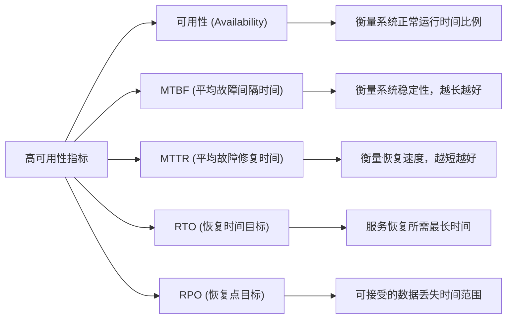
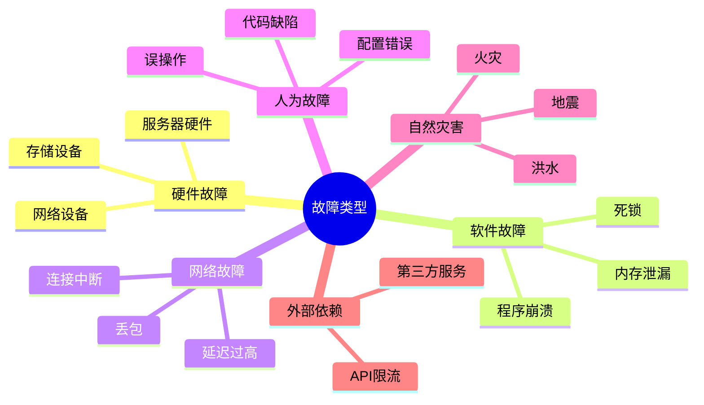
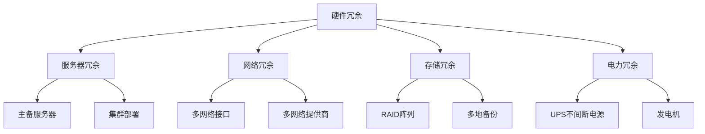
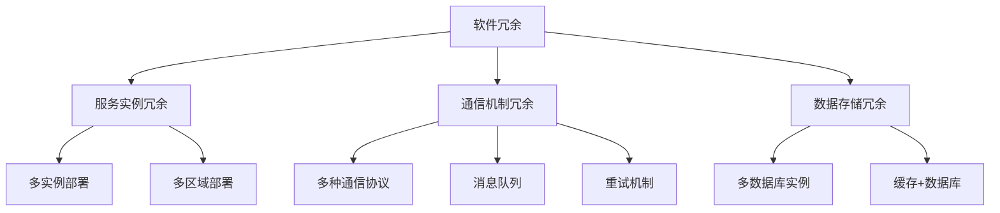
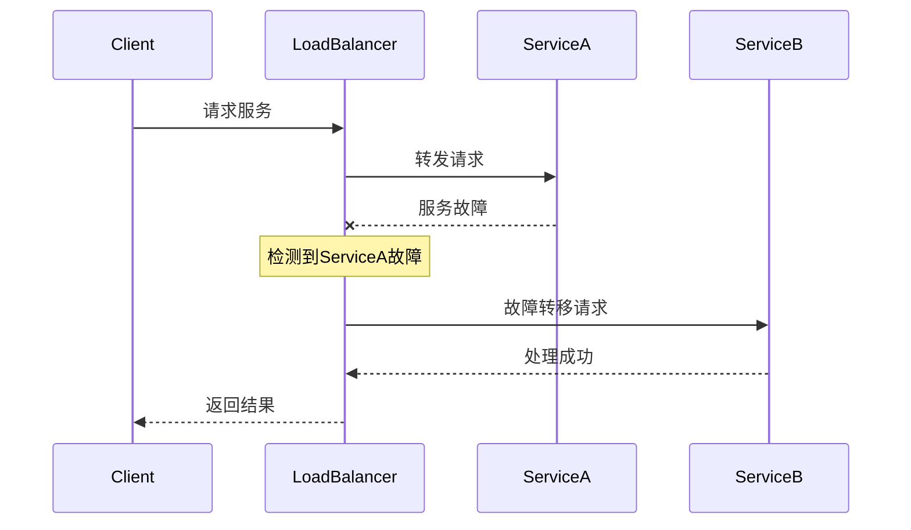
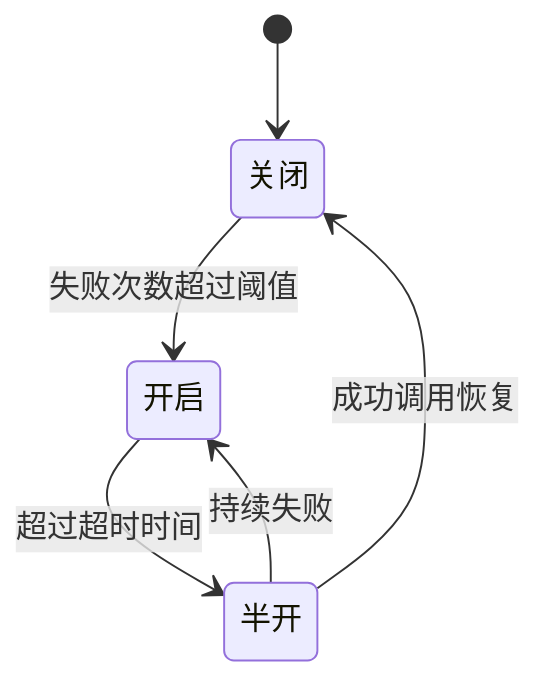
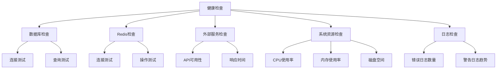

import Tabs from '@theme/Tabs';
import TabItem from '@theme/TabItem';
import TOCInline from '@theme/TOCInline';

# 高可用性系统设计

高可用性系统设计是构建稳定可靠、持续提供服务系统的核心技术。通过冗余设计、故障转移、监控告警等机制，可以构建出高可用的系统。

:::info 本文内容概览
<TOCInline toc={toc} />
:::

:::tip 核心价值
**高可用性 = 冗余设计 + 故障转移 + 容错机制 + 监控告警 + 自动恢复**
- 🔄 **冗余设计**：避免单点故障，确保系统持续运行
- 🔀 **故障转移**：在故障发生时自动切换到备用资源
- 🛡️ **容错机制**：隔离故障，防止故障扩散
- 🔔 **监控告警**：实时发现问题，快速响应处理
- 🔁 **自动恢复**：系统能够自我修复，减少人工干预
:::

## 1. 高可用性基础

### 1.1 可用性指标

高可用性系统的核心指标：



| 指标 | 说明 | 目标值 | 计算方式 |
|------|------|--------|---------|
| **可用性 (Availability)** | 系统正常运行时间比例 | 99.9%+ | `(总时间 - 故障时间) / 总时间` |
| **MTBF (Mean Time Between Failures)** | 平均故障间隔时间 | 越长越好 | `总运行时间 / 故障次数` |
| **MTTR (Mean Time To Repair)** | 平均故障修复时间 | 越短越好 | `总修复时间 / 故障次数` |
| **RTO (Recovery Time Objective)** | 恢复时间目标 | < 5分钟 | 业务可接受的最长恢复时间 |
| **RPO (Recovery Point Objective)** | 恢复点目标 | < 1分钟 | 业务可接受的数据丢失时间 |

<details>
<summary>可用性等级参考</summary>

| 可用性级别 | 年度停机时间 | 描述 |
|-----------|-------------|------|
| 99% | 87.6小时 | 基本可用 |
| 99.9% | 8.76小时 | 高可用 |
| 99.99% | 52.56分钟 | 很高可用 |
| 99.999% | 5.26分钟 | 极高可用 |
| 99.9999% | 31.5秒 | 接近完全可用 |

</details>

<Tabs>
  <TabItem value="calculation" label="可用性计算" default>
  ```java
  public double calculateAvailability() {
      long total = totalRequests.get();
      long failed = failedRequests.get();
      
      if (total == 0) {
          return 100.0;
      }
      
      return ((double) (total - failed) / total) * 100;
  }
  ```
  </TabItem>
  <TabItem value="metrics" label="指标监控">
  ```java
  public void recordRequest(boolean success) {
      totalRequests.incrementAndGet();
      if (!success) {
          failedRequests.incrementAndGet();
      }
      
      // 计算可用性
      double availability = calculateAvailability();
      
      // 记录到监控系统
      Gauge.builder("system.availability")
          .register(meterRegistry, this, AvailabilityMonitor::calculateAvailability);
  }
  ```
  </TabItem>
  <TabItem value="mtbf" label="MTBF计算">
  ```java
  public double getMTBF() {
      // 计算平均故障间隔时间
      long totalTime = getUptime();
      long failureCount = failedRequests.get();
      
      if (failureCount == 0) {
          return Double.MAX_VALUE;
      }
      
      return (double) totalTime / failureCount;
  }
  ```
  </TabItem>
</Tabs>

### 1.2 故障类型分析

<div className="card">
<div className="card__body">

故障类型可以分为以下几类：

1. **硬件故障**：服务器、网络设备、存储设备故障
2. **软件故障**：程序崩溃、内存泄漏、死锁
3. **网络故障**：网络中断、延迟过高、丢包
4. **人为故障**：配置错误、误操作、代码缺陷
5. **自然灾害**：地震、火灾、洪水
6. **外部依赖故障**：第三方服务故障、API限流

</div>
</div>



<Tabs>
  <TabItem value="code" label="故障处理策略" default>
  ```java
  @Component
  public class FailureHandler {
      
      private final Map<FailureType, FailureStrategy> strategies = new HashMap<>();
      
      public FailureHandler() {
          strategies.put(FailureType.HARDWARE_FAILURE, new HardwareFailureStrategy());
          strategies.put(FailureType.SOFTWARE_FAILURE, new SoftwareFailureStrategy());
          strategies.put(FailureType.NETWORK_FAILURE, new NetworkFailureStrategy());
          strategies.put(FailureType.EXTERNAL_DEPENDENCY, new ExternalDependencyStrategy());
      }
      
      public void handleFailure(FailureType type, String details) {
          FailureStrategy strategy = strategies.get(type);
          if (strategy != null) {
              strategy.handle(details);
          } else {
              log.error("未知故障类型: {}", type);
          }
      }
  }
  ```
  </TabItem>
  <TabItem value="strategies" label="具体策略实现">
  ```java
  class HardwareFailureStrategy implements FailureStrategy {
      @Override
      public void handle(String details) {
          // 硬件故障处理：切换到备用服务器
          log.info("处理硬件故障: {}", details);
          // 执行故障转移逻辑
      }
  }
  
  class NetworkFailureStrategy implements FailureStrategy {
      @Override
      public void handle(String details) {
          // 网络故障处理：尝试重连或切换网络
          log.info("处理网络故障: {}", details);
          // 执行网络恢复逻辑
      }
  }
  ```
  </TabItem>
</Tabs>

## 2. 冗余设计

:::info
冗余设计是高可用系统的基础，通过部署多份相同的资源，在一份资源故障时可以由其他资源接管工作。
:::

### 2.1 硬件冗余

硬件冗余主要包括：服务器冗余、网络冗余、存储冗余和电力冗余。



<Tabs>
  <TabItem value="database" label="数据库冗余" default>
  ```java
  @Configuration
  public class HardwareRedundancyConfig {
      
      @Bean
      @Primary
      public DataSource primaryDataSource() {
          HikariConfig config = new HikariConfig();
          config.setJdbcUrl("jdbc:mysql://primary-db:3306/test");
          config.setUsername("root");
          config.setPassword("password");
          config.setMaximumPoolSize(20);
          return new HikariDataSource(config);
      }
      
      @Bean
      public DataSource secondaryDataSource() {
          HikariConfig config = new HikariConfig();
          config.setJdbcUrl("jdbc:mysql://secondary-db:3306/test");
          config.setUsername("root");
          config.setPassword("password");
          config.setMaximumPoolSize(20);
          return new HikariDataSource(config);
      }
      
      @Bean
      public DataSource routingDataSource() {
          RoutingDataSource routingDataSource = new RoutingDataSource();
          Map<Object, Object> targetDataSources = new HashMap<>();
          targetDataSources.put("primary", primaryDataSource());
          targetDataSources.put("secondary", secondaryDataSource());
          routingDataSource.setTargetDataSources(targetDataSources);
          routingDataSource.setDefaultTargetDataSource(primaryDataSource());
          return routingDataSource;
      }
  }
  ```
  </TabItem>
  <TabItem value="routing" label="数据源路由">
  ```java
  // 数据源路由
  public class RoutingDataSource extends AbstractRoutingDataSource {
      
      @Override
      protected Object determineCurrentLookupKey() {
          return DataSourceContextHolder.getDataSourceType();
      }
  }
  
  // 数据源上下文
  public class DataSourceContextHolder {
      
      private static final ThreadLocal<String> contextHolder = new ThreadLocal<>();
      
      public static void setDataSourceType(String dataSourceType) {
          contextHolder.set(dataSourceType);
      }
      
      public static String getDataSourceType() {
          return contextHolder.get();
      }
      
      public static void clearDataSourceType() {
          contextHolder.remove();
      }
  }
  ```
  </TabItem>
</Tabs>

:::caution 注意事项
硬件冗余虽然增加了系统可靠性，但也增加了成本和复杂度。在设计时，需要在可靠性和成本之间找到平衡点。
:::

### 2.2 软件冗余

软件冗余主要包括：服务实例冗余、通信机制冗余和数据存储冗余。



<Tabs>
  <TabItem value="service" label="服务冗余" default>
  ```java
  @Service
  public class ServiceRedundancy {
      
      @Autowired
      private List<EmailService> emailServices;
      
      @Autowired
      private CircuitBreaker circuitBreaker;
      
      public void sendEmail(String to, String subject, String content) {
          // 尝试所有可用的邮件服务
          for (EmailService emailService : emailServices) {
              try {
                  if (circuitBreaker.isHealthy(emailService.getClass().getSimpleName())) {
                      emailService.sendEmail(to, subject, content);
                      return; // 发送成功，退出
                  }
              } catch (Exception e) {
                  log.error("邮件服务 {} 发送失败", emailService.getClass().getSimpleName(), e);
                  circuitBreaker.recordFailure(emailService.getClass().getSimpleName());
              }
          }
          
          // 所有服务都失败，记录错误
          log.error("所有邮件服务都不可用");
          throw new ServiceUnavailableException("邮件服务不可用");
      }
  }
  ```
  </TabItem>
  <TabItem value="circuit" label="熔断器实现">
  ```java
  @Component
  public class CircuitBreaker {
      
      private Map<String, CircuitBreakerState> states = new ConcurrentHashMap<>();
      
      public boolean isHealthy(String serviceName) {
          CircuitBreakerState state = states.get(serviceName);
          if (state == null) {
              state = new CircuitBreakerState();
              states.put(serviceName, state);
          }
          return state.isHealthy();
      }
      
      public void recordFailure(String serviceName) {
          CircuitBreakerState state = states.get(serviceName);
          if (state != null) {
              state.recordFailure();
          }
      }
      
      public void recordSuccess(String serviceName) {
          CircuitBreakerState state = states.get(serviceName);
          if (state != null) {
              state.recordSuccess();
          }
      }
  }
  ```
  </TabItem>
</Tabs>

## 3. 故障转移机制

故障转移是高可用系统的核心机制，能够在出现故障时自动切换到备用资源，保证系统的持续可用。

### 3.1 自动故障转移

<details>
<summary>故障转移流程</summary>



</details>

```java title="自动故障转移实现"
@Component
public class AutoFailover {
    
    @Autowired
    private List<DataSource> dataSources;
    
    private AtomicInteger currentIndex = new AtomicInteger(0);
    private AtomicBoolean[] healthStatus;
    
    @PostConstruct
    public void init() {
        healthStatus = new AtomicBoolean[dataSources.size()];
        for (int i = 0; i < healthStatus.length; i++) {
            healthStatus[i] = new AtomicBoolean(true);
        }
        
        // 启动健康检查
        startHealthCheck();
    }
    
    public DataSource getHealthyDataSource() {
        for (int i = 0; i < dataSources.size(); i++) {
            int index = (currentIndex.get() + i) % dataSources.size();
            if (healthStatus[index].get()) {
                return dataSources.get(index);
            }
        }
        throw new ServiceUnavailableException("没有可用的数据源");
    }
    
    @Scheduled(fixedRate = 5000)
    public void healthCheck() {
        for (int i = 0; i < dataSources.size(); i++) {
            boolean healthy = checkDataSourceHealth(dataSources.get(i));
            healthStatus[i].set(healthy);
            
            if (!healthy) {
                log.warn("数据源 {} 不健康", i);
            }
        }
    }
}
```

### 3.2 负载均衡故障转移

:::tip
负载均衡不仅能够分散系统负载，还能实现故障转移，是高可用系统的重要组件。
:::

<Tabs>
  <TabItem value="loadbalancer" label="负载均衡器" default>
  ```java
  @Component
  public class LoadBalancerFailover {
      
      private List<Server> servers = new ArrayList<>();
      private AtomicInteger currentIndex = new AtomicInteger(0);
      
      public LoadBalancerFailover() {
          // 初始化服务器列表
          servers.add(new Server("server1:8080", true));
          servers.add(new Server("server2:8080", true));
          servers.add(new Server("server3:8080", true));
      }
      
      public String getNextHealthyServer() {
          for (int i = 0; i < servers.size(); i++) {
              int index = (currentIndex.get() + i) % servers.size();
              Server server = servers.get(index);
              
              if (server.isHealthy()) {
                  currentIndex.set(index);
                  return server.getAddress();
              }
          }
          
          throw new ServiceUnavailableException("没有可用的服务器");
      }
  }
  ```
  </TabItem>
  <TabItem value="health" label="健康检查">
  ```java
  @Scheduled(fixedRate = 10000)
  public void healthCheck() {
      for (Server server : servers) {
          boolean healthy = checkServerHealth(server.getAddress());
          server.setHealthy(healthy);
      }
  }
  
  private boolean checkServerHealth(String address) {
      try {
          RestTemplate restTemplate = new RestTemplate();
          restTemplate.getForObject("http://" + address + "/health", String.class);
          return true;
      } catch (Exception e) {
          return false;
      }
  }
  ```
  </TabItem>
  <TabItem value="mark" label="服务器状态标记">
  ```java
  public void markServerUnhealthy(String address) {
      for (Server server : servers) {
          if (server.getAddress().equals(address)) {
              server.setHealthy(false);
              log.warn("标记服务器 {} 为不健康状态", address);
              break;
          }
      }
  }
  
  public void markServerHealthy(String address) {
      for (Server server : servers) {
          if (server.getAddress().equals(address)) {
              server.setHealthy(true);
              log.info("标记服务器 {} 为健康状态", address);
              break;
          }
      }
  }
  ```
  </TabItem>
</Tabs>

```mermaid
flowchart LR
    Client([客户端]) --> LB[负载均衡器]
    LB -- 健康 --> S1[服务器1]
    LB -- 健康 --> S2[服务器2]
    LB -- 故障 -.- S3[服务器3]
    
    subgraph 健康检查
    HC[健康检查器] -.-> S1
    HC -.-> S2
    HC -.-> S3
    end
    
    HC -- "报告状态" --> LB
```

## 4. 容错机制

容错机制是高可用系统的关键部分，能够隔离故障，防止故障扩散，提高系统的稳定性。

### 4.1 熔断器模式

熔断器模式可以防止系统因调用失败的服务而出现级联故障。



<Tabs>
  <TabItem value="pattern" label="熔断器模式" default>
  ```java
  @Component
  public class CircuitBreakerPattern {
      
      private Map<String, CircuitBreaker> circuitBreakers = new ConcurrentHashMap<>();
      
      public <T> T execute(String serviceName, Supplier<T> supplier) {
          CircuitBreaker circuitBreaker = getOrCreateCircuitBreaker(serviceName);
          
          if (circuitBreaker.isOpen()) {
              throw new CircuitBreakerOpenException("熔断器已打开: " + serviceName);
          }
          
          try {
              T result = supplier.get();
              circuitBreaker.recordSuccess();
              return result;
          } catch (Exception e) {
              circuitBreaker.recordFailure();
              throw e;
          }
      }
      
      private CircuitBreaker getOrCreateCircuitBreaker(String serviceName) {
          return circuitBreakers.computeIfAbsent(serviceName, k -> new CircuitBreaker());
      }
  }
  ```
  </TabItem>
  <TabItem value="breaker" label="熔断器实现">
  ```java
  class CircuitBreaker {
      private AtomicInteger failureCount = new AtomicInteger(0);
      private AtomicLong lastFailureTime = new AtomicLong(0);
      private AtomicBoolean isOpen = new AtomicBoolean(false);
      
      private static final int FAILURE_THRESHOLD = 5;
      private static final long TIMEOUT = 60000; // 60秒
      
      public boolean isOpen() {
          if (isOpen.get()) {
              long now = System.currentTimeMillis();
              if (now - lastFailureTime.get() > TIMEOUT) {
                  // 尝试半开状态
                  isOpen.set(false);
                  failureCount.set(0);
                  return false;
              }
              return true;
          }
          return false;
      }
      
      public void recordSuccess() {
          failureCount.set(0);
          isOpen.set(false);
      }
      
      public void recordFailure() {
          failureCount.incrementAndGet();
          lastFailureTime.set(System.currentTimeMillis());
          
          if (failureCount.get() >= FAILURE_THRESHOLD) {
              isOpen.set(true);
          }
      }
  }
  ```
  </TabItem>
</Tabs>

:::caution
熔断器参数配置至关重要：故障阈值太低可能导致频繁熔断，阈值太高则无法及时熔断故障服务。
:::

### 4.2 降级策略

服务降级是在系统压力过大或部分服务不可用时，主动降低服务质量以保证核心功能可用的策略。

<div className="card">
<div className="card__body">

降级策略包括：

1. **功能降级**：关闭非核心功能
2. **服务降级**：返回缓存数据或默认值
3. **限流降级**：限制访问频率
4. **异步化降级**：将同步操作转为异步
5. **简化降级**：使用更简单的算法

</div>
</div>

```java title="服务降级实现"
@Service
public class ServiceDegradation {
    
    @Autowired
    private CircuitBreakerPattern circuitBreaker;
    
    public UserInfo getUserInfo(Long userId) {
        try {
            return circuitBreaker.execute("user-service", () -> {
                // 调用用户服务
                return callUserService(userId);
            });
        } catch (Exception e) {
            log.warn("用户服务调用失败，使用降级策略", e);
            return getFallbackUserInfo(userId);
        }
    }
    
    private UserInfo getFallbackUserInfo(Long userId) {
        // 降级策略：返回缓存数据或默认数据
        UserInfo fallback = new UserInfo();
        fallback.setId(userId);
        fallback.setName("用户" + userId);
        fallback.setEmail("user" + userId + "@example.com");
        return fallback;
    }
}
```

## 5. 监控告警

有效的监控告警系统能够及时发现并处理问题，是高可用系统的重要组成部分。

### 5.1 健康检查



<Tabs>
  <TabItem value="health" label="健康检查服务" default>
  ```java
  @Component
  public class HealthCheckService {
      
      @Autowired
      private DataSource dataSource;
      
      @Autowired
      private RedisTemplate<String, Object> redisTemplate;
      
      @Autowired
      private RestTemplate restTemplate;
      
      public HealthStatus checkSystemHealth() {
          HealthStatus status = new HealthStatus();
          
          // 检查数据库
          status.setDatabase(checkDatabaseHealth());
          
          // 检查Redis
          status.setRedis(checkRedisHealth());
          
          // 检查外部服务
          status.setExternalService(checkExternalServiceHealth());
          
          // 检查磁盘空间
          status.setDiskSpace(checkDiskSpace());
          
          // 检查内存使用
          status.setMemoryUsage(checkMemoryUsage());
          
          return status;
      }
  }
  ```
  </TabItem>
  <TabItem value="checks" label="具体检查实现">
  ```java
  private boolean checkDatabaseHealth() {
      try (Connection conn = dataSource.getConnection()) {
          conn.createStatement().execute("SELECT 1");
          return true;
      } catch (Exception e) {
          log.error("数据库健康检查失败", e);
          return false;
      }
  }
  
  private boolean checkRedisHealth() {
      try {
          redisTemplate.opsForValue().get("health_check");
          return true;
      } catch (Exception e) {
          log.error("Redis健康检查失败", e);
          return false;
      }
  }
  
  private boolean checkDiskSpace() {
      File root = new File("/");
      long freeSpace = root.getFreeSpace();
      long totalSpace = root.getTotalSpace();
      double usagePercent = (double) (totalSpace - freeSpace) / totalSpace * 100;
      
      return usagePercent < 90; // 磁盘使用率小于90%
  }
  ```
  </TabItem>
</Tabs>

### 5.2 告警机制

:::warning
告警机制应当避免告警风暴，实施分级告警，确保真正需要人工干预的问题能够及时得到处理。
:::

```java title="告警系统实现"
@Component
public class AlertSystem {
    
    @Autowired
    private HealthCheckService healthCheckService;
    
    @Autowired
    private EmailService emailService;
    
    @Autowired
    private SmsService smsService;
    
    @Scheduled(fixedRate = 30000) // 每30秒检查一次
    public void checkAndAlert() {
        HealthStatus status = healthCheckService.checkSystemHealth();
        
        if (!status.isDatabase()) {
            sendAlert("数据库服务异常", "数据库连接失败，请立即检查", AlertLevel.HIGH);
        }
        
        if (!status.isRedis()) {
            sendAlert("Redis服务异常", "Redis连接失败，请立即检查", AlertLevel.MEDIUM);
        }
        
        if (!status.isDiskSpace()) {
            sendAlert("磁盘空间不足", "磁盘使用率超过90%，请立即清理", AlertLevel.HIGH);
        }
    }
    
    private void sendAlert(String title, String message, AlertLevel level) {
        log.error("告警: {} - {} (级别: {})", title, message, level);
        
        // 根据告警级别选择通知方式
        switch (level) {
            case HIGH:
                // 高级别告警：邮件+短信
                emailService.sendAlertEmail(title, message);
                smsService.sendAlertSms(title, message);
                break;
            case MEDIUM:
                // 中级别告警：仅邮件
                emailService.sendAlertEmail(title, message);
                break;
            case LOW:
                // 低级别告警：仅日志记录
                break;
        }
    }
    
    public enum AlertLevel {
        LOW, MEDIUM, HIGH
    }
}
```

## 6. 面试题精选

### 6.1 基础概念题

<details>
<summary>**Q: 什么是高可用性？如何衡量系统可用性？**</summary>

**A:** 高可用性是指系统能够持续提供服务的能力。衡量指标包括：
- **可用性**：系统正常运行时间比例，通常以百分比表示
- **MTBF**：平均故障间隔时间，越长越好
- **MTTR**：平均故障修复时间，越短越好
- **RTO**：恢复时间目标，系统恢复的时间要求
- **RPO**：恢复点目标，数据丢失的时间窗口
</details>

<details>
<summary>**Q: 如何设计一个高可用系统？**</summary>

**A:** 设计高可用系统的方法：
- **冗余设计**：硬件冗余、软件冗余、地理冗余
- **故障转移**：自动故障检测和切换机制
- **负载均衡**：分散请求压力，提高系统容量
- **容错机制**：熔断器、降级策略、重试机制
- **监控告警**：实时监控系统状态，及时发现问题
</details>

### 6.2 架构设计题

<details>
<summary>**Q: 如何实现数据库的高可用？**</summary>

**A:** 数据库高可用实现方法：
- **主从复制**：读写分离、故障转移
- **集群部署**：多节点部署、数据同步
- **分库分表**：水平分片、垂直分片
- **备份恢复**：定期备份、快速恢复
- **监控告警**：性能监控、故障告警
</details>

<details>
<summary>**Q: 如何设计微服务的高可用架构？**</summary>

**A:** 微服务高可用架构设计：
- **服务注册发现**：Eureka、Consul、Zookeeper
- **负载均衡**：Ribbon、LoadBalancer
- **熔断降级**：Hystrix、Resilience4j
- **配置中心**：Spring Cloud Config、Apollo
- **链路追踪**：Sleuth、Zipkin
</details>

### 6.3 故障处理题

<details>
<summary>**Q: 如何处理系统故障？**</summary>

**A:** 系统故障处理方法：
- **故障检测**：健康检查、监控告警
- **故障隔离**：快速隔离故障节点
- **故障转移**：自动切换到备用节点
- **故障恢复**：修复故障、恢复服务
- **故障分析**：根因分析、预防措施
</details>

<details>
<summary>**Q: 如何设计容错机制？**</summary>

**A:** 容错机制设计方法：
- **熔断器模式**：防止故障扩散
- **降级策略**：提供基本服务
- **重试机制**：处理临时故障
- **超时控制**：避免长时间等待
- **限流保护**：防止系统过载
</details>

:::tip 高可用性学习要点
1. **理解可用性指标**：掌握MTBF、MTTR、RTO、RPO等概念
2. **掌握冗余设计**：学会硬件冗余、软件冗余、地理冗余
3. **熟悉故障处理**：了解故障检测、隔离、转移、恢复
4. **学会容错机制**：掌握熔断器、降级、重试等模式
5. **了解监控告警**：学会健康检查、性能监控、故障告警
:::

---

通过本章的学习，你应该已经掌握了高可用性系统设计的核心概念、架构模式和最佳实践。高可用性系统设计是构建稳定可靠系统的重要技能，掌握这些技术可以帮助你设计出高可用的系统。在实际项目中，合理运用这些技术可以大大提高系统的稳定性和可靠性。 