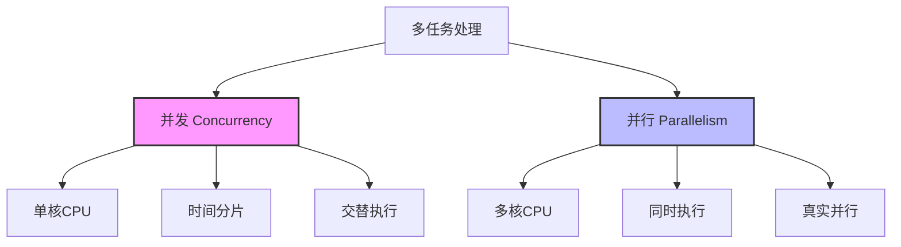
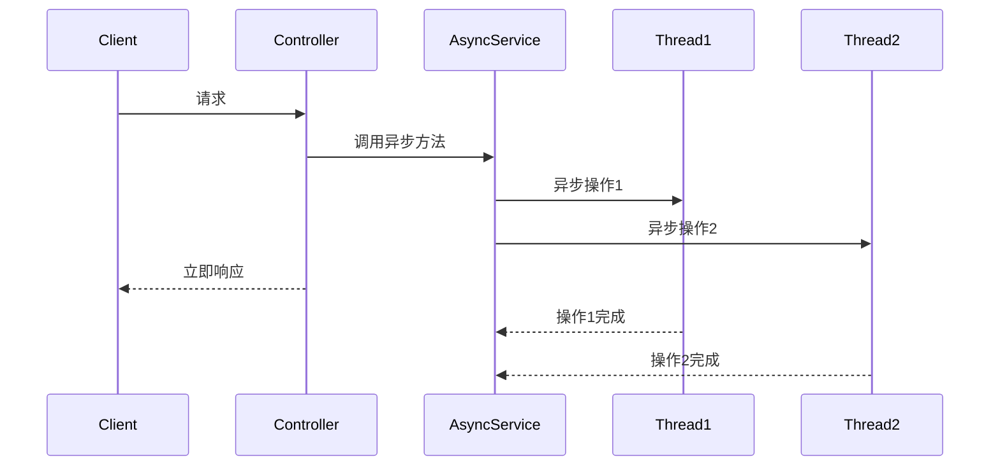
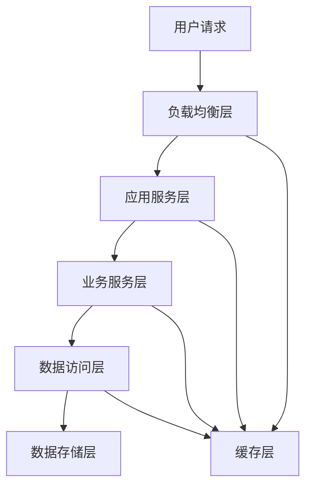
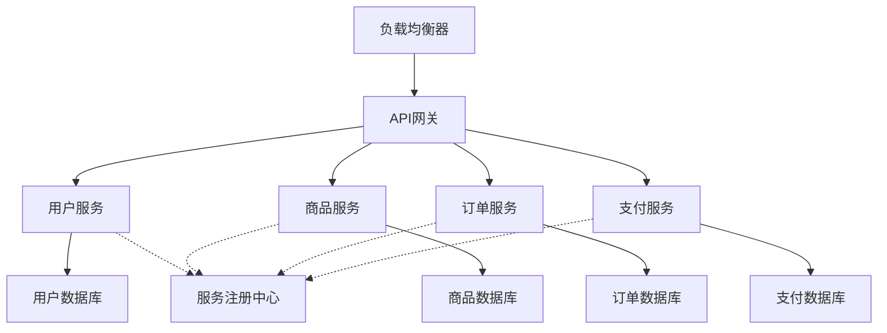
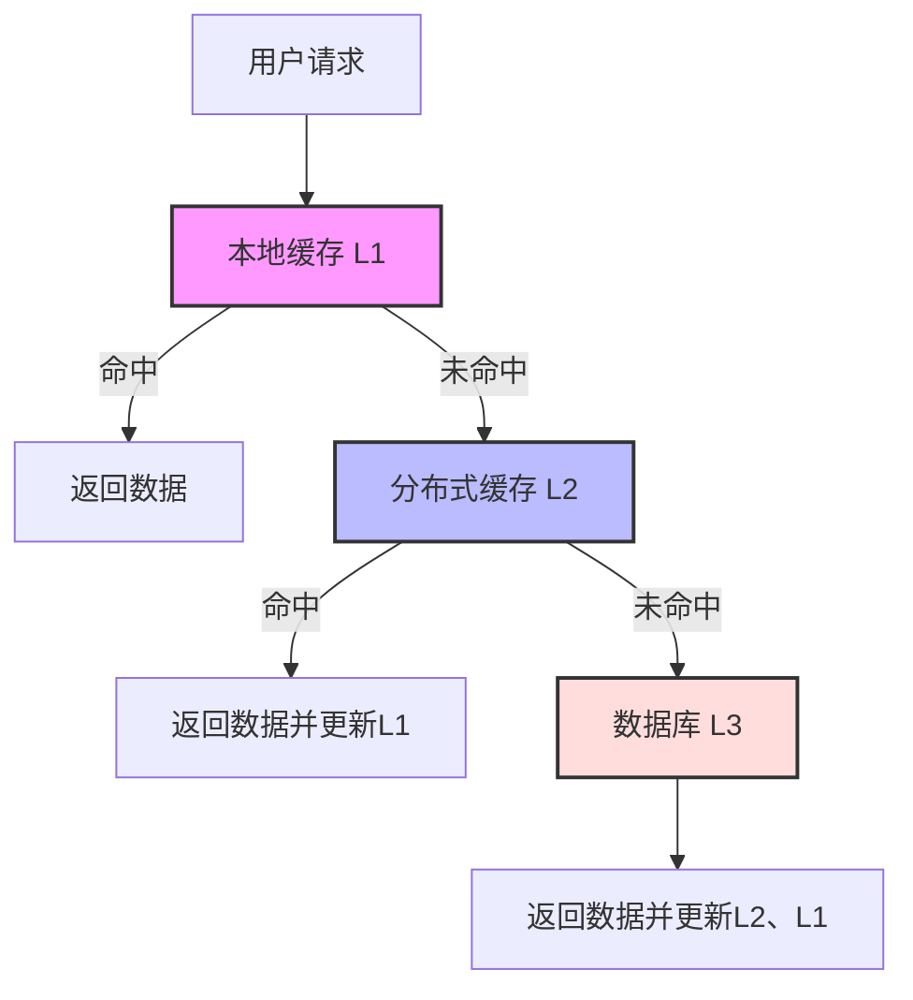
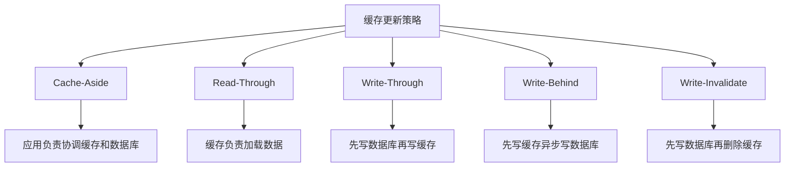
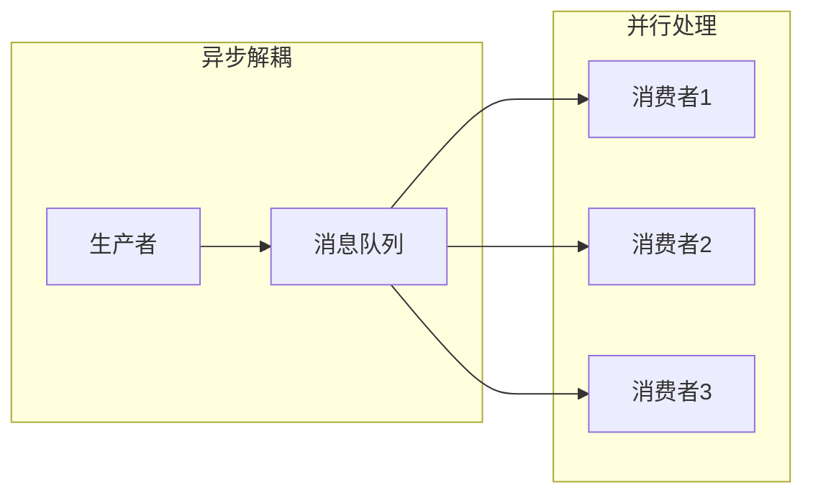
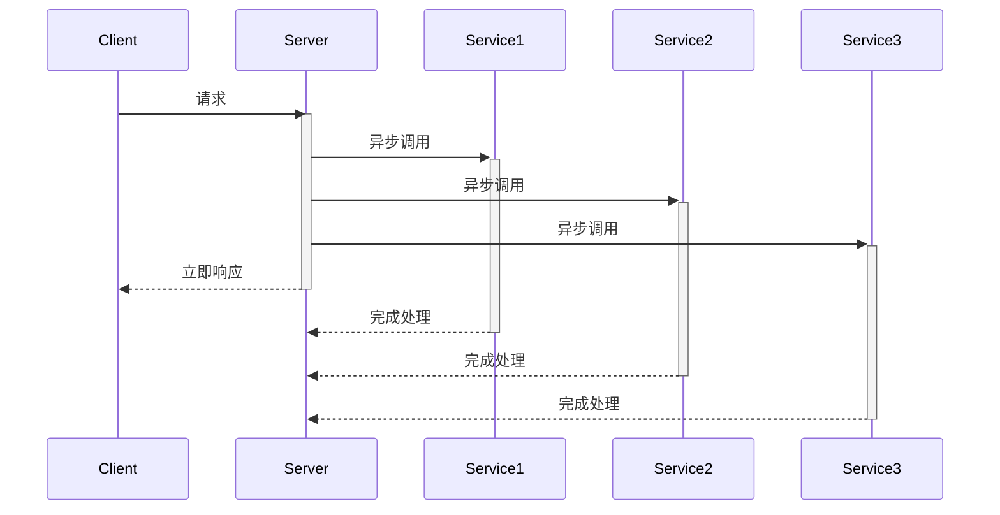
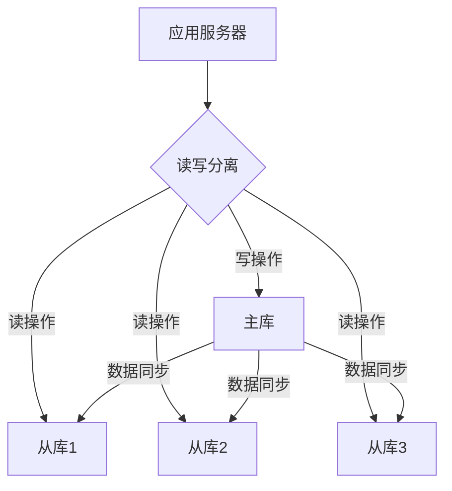
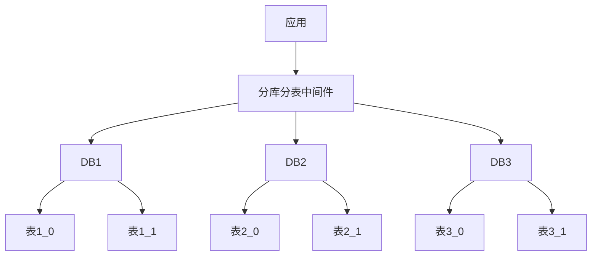

import Tabs from '@theme/Tabs';
import TabItem from '@theme/TabItem';
import TOCInline from '@theme/TOCInline';

# 高并发系统设计

高并发系统设计是构建高性能、高可用系统的核心技术。通过合理的架构设计、缓存策略、异步处理和数据库优化，可以构建出能够处理大量并发请求的系统。

:::info 本文内容概览
<TOCInline toc={toc} />
:::

:::tip 核心价值
**高并发 = 并发模型 + 缓存优化 + 异步处理 + 数据库优化 + 负载均衡**
- 🧵 **并发模型**：高效处理多任务的线程模型设计
- 🚀 **缓存优化**：减少访问延迟，提高数据读取速度
- ⚡ **异步处理**：避免阻塞，提高系统吞吐量
- 📊 **数据库优化**：分片、索引、读写分离等策略
- ⚖️ **负载均衡**：合理分配请求，避免单点过载
:::

## 1. 并发模型基础

### 1.1 并发与并行



并发和并行是处理多任务的不同方式：

| 概念 | 说明 | 特点 |
|------|------|------|
| **并发 (Concurrency)** | 多个任务交替执行 | 单核CPU上的多任务处理 |
| **并行 (Parallelism)** | 多个任务同时执行 | 多核CPU上的多任务处理 |

<details>
<summary>并发与并行的详细比较</summary>

**并发 (Concurrency)**:
- 是一种逻辑概念，指多个任务可以在重叠的时间段内启动、运行和完成
- 一个处理器通过时间片切换来处理多个任务
- 强调任务的调度与切换
- 适用于IO密集型任务

**并行 (Parallelism)**:
- 是一种物理概念，指多个任务在同一时刻同时运行
- 需要多个处理器或多核处理器
- 强调同时执行多个任务
- 适用于计算密集型任务

</details>

<Tabs>
  <TabItem value="concurrent" label="并发示例" default>
  ```java
@RestController
public class ConcurrentController {
    
    @Autowired
    private AsyncTaskExecutor taskExecutor;
    
    @GetMapping("/concurrent")
    public CompletableFuture<String> handleConcurrent() {
        return CompletableFuture.supplyAsync(() -> {
            // 模拟耗时操作
            try {
                Thread.sleep(1000);
            } catch (InterruptedException e) {
                Thread.currentThread().interrupt();
            }
            return "并发处理完成";
        }, taskExecutor);
    }
}
  ```
  </TabItem>
  <TabItem value="parallel" label="并行示例">
  ```java
@Service
public class ParallelService {
    
    @Autowired
    private ThreadPoolTaskExecutor executor;
    
    public List<String> processParallel(List<String> items) {
        return items.parallelStream()
            .map(item -> {
                // 并行处理每个项目
                return processItem(item);
            })
            .collect(Collectors.toList());
    }
    
    private String processItem(String item) {
        // 处理单个项目的逻辑
        return "processed_" + item;
    }
}
```
  </TabItem>
</Tabs>

### 1.2 线程模型

```mermaid
graph TD
    A[Java线程模型] --> B[线程池]
    A --> C[异步编程]
    A --> D[响应式编程]
    
    B --> B1[固定线程池]
    B --> B2[缓存线程池]
    B --> B3[定时线程池]
    B --> B4[工作窃取线程池]
    
    C --> C1[CompletableFuture]
    C --> C2[@Async注解]
    C --> C3[回调函数]
    
    D --> D1[Reactor]
    D --> D2[RxJava]
    D --> D3[WebFlux]
```

#### 线程池设计

线程池是管理线程生命周期、控制并发的重要工具。合理配置线程池参数对系统性能至关重要。

<div className="card">
<div className="card__header">
<h4>线程池参数配置指南</h4>
</div>
<div className="card__body">

| 参数 | 说明 | 配置建议 |
|------|------|----------|
| **核心线程数(corePoolSize)** | 线程池维护的最小线程数 | IO密集型：CPU核心数 * 2<br/>CPU密集型：CPU核心数 |
| **最大线程数(maxPoolSize)** | 线程池允许的最大线程数 | IO密集型：核心线程数 * 3<br/>CPU密集型：核心线程数 + 1 |
| **队列容量(queueCapacity)** | 任务队列大小 | 根据内存和任务特性评估，常见100~1000 |
| **拒绝策略(rejectedExecutionHandler)** | 队列满时的处理策略 | AbortPolicy：抛异常<br/>CallerRunsPolicy：由调用者线程执行<br/>DiscardPolicy：丢弃任务<br/>DiscardOldestPolicy：丢弃最旧任务 |

</div>
</div>

<Tabs>
  <TabItem value="config" label="线程池配置" default>
  ```java
@Configuration
public class ThreadPoolConfig {
    
    @Bean("ioThreadPool")
    public ThreadPoolTaskExecutor ioThreadPool() {
        ThreadPoolTaskExecutor executor = new ThreadPoolTaskExecutor();
        executor.setCorePoolSize(20);
        executor.setMaxPoolSize(100);
        executor.setQueueCapacity(500);
        executor.setThreadNamePrefix("IO-");
        executor.setRejectedExecutionHandler(new ThreadPoolExecutor.CallerRunsPolicy());
        executor.initialize();
        return executor;
    }
    
    @Bean("cpuThreadPool")
    public ThreadPoolTaskExecutor cpuThreadPool() {
        ThreadPoolTaskExecutor executor = new ThreadPoolTaskExecutor();
        executor.setCorePoolSize(Runtime.getRuntime().availableProcessors());
        executor.setMaxPoolSize(Runtime.getRuntime().availableProcessors() * 2);
        executor.setQueueCapacity(1000);
        executor.setThreadNamePrefix("CPU-");
        executor.setRejectedExecutionHandler(new ThreadPoolExecutor.AbortPolicy());
        executor.initialize();
        return executor;
    }
}
  ```
  </TabItem>
  <TabItem value="usage" label="线程池使用">
  ```java
@Service
public class ThreadPoolService {
    
    @Autowired
    @Qualifier("ioThreadPool")
    private ThreadPoolTaskExecutor ioExecutor;
    
    @Autowired
    @Qualifier("cpuThreadPool")
    private ThreadPoolTaskExecutor cpuExecutor;
    
    public CompletableFuture<String> handleIOBoundTask() {
        return CompletableFuture.supplyAsync(() -> {
            // IO密集型任务
            return performIOOperation();
        }, ioExecutor);
    }
    
    public CompletableFuture<String> handleCPUBoundTask() {
        return CompletableFuture.supplyAsync(() -> {
            // CPU密集型任务
            return performCPUOperation();
        }, cpuExecutor);
    }
}
```
  </TabItem>
  <TabItem value="monitor" label="线程池监控">
  ```java
  @Component
  public class ThreadPoolMonitor {
      
      @Autowired
      @Qualifier("ioThreadPool")
      private ThreadPoolTaskExecutor ioExecutor;
      
      @Autowired
      @Qualifier("cpuThreadPool")
      private ThreadPoolTaskExecutor cpuExecutor;
      
      @Scheduled(fixedRate = 30000) // 每30秒执行一次
      public void monitorThreadPools() {
          logThreadPoolStats("IO线程池", ioExecutor);
          logThreadPoolStats("CPU线程池", cpuExecutor);
      }
      
      private void logThreadPoolStats(String poolName, ThreadPoolTaskExecutor executor) {
          ThreadPoolExecutor threadPoolExecutor = executor.getThreadPoolExecutor();
          
          int corePoolSize = threadPoolExecutor.getCorePoolSize();
          int poolSize = threadPoolExecutor.getPoolSize();
          int activeCount = threadPoolExecutor.getActiveCount();
          long taskCount = threadPoolExecutor.getTaskCount();
          long completedTaskCount = threadPoolExecutor.getCompletedTaskCount();
          int queueSize = threadPoolExecutor.getQueue().size();
          
          log.info("{} 状态 - 核心线程数: {}, 当前线程数: {}, 活跃线程数: {}, " +
                  "任务总数: {}, 已完成任务: {}, 队列大小: {}",
                  poolName, corePoolSize, poolSize, activeCount,
                  taskCount, completedTaskCount, queueSize);
      }
  }
  ```
  </TabItem>
</Tabs>

:::caution 线程池配置注意事项
1. **避免无限增长**：设置合理的最大线程数，防止资源耗尽
2. **任务分类**：根据任务类型（IO密集/CPU密集）使用不同线程池
3. **动态调整**：根据系统负载动态调整线程池参数
4. **监控告警**：监控线程池状态，及时发现问题
5. **优雅关闭**：应用关闭时等待线程池任务完成
:::

#### 异步编程模型

异步编程是高并发系统的重要技术，可以有效提高系统吞吐量和资源利用率。



<Tabs>
  <TabItem value="async" label="@Async注解" default>
  ```java
@Service
public class AsyncService {
    
    @Async("ioThreadPool")
    public CompletableFuture<String> asyncOperation1() {
        // 异步操作1
        return CompletableFuture.completedFuture("操作1完成");
    }
    
    @Async("ioThreadPool")
    public CompletableFuture<String> asyncOperation2() {
        // 异步操作2
        return CompletableFuture.completedFuture("操作2完成");
    }
    
      public CompletableFuture<List<String>> performAsyncOperations() {
        CompletableFuture<String> future1 = asyncOperation1();
        CompletableFuture<String> future2 = asyncOperation2();
        
        return CompletableFuture.allOf(future1, future2)
            .thenApply(v -> {
                  List<String> results = new ArrayList<>();
                  results.add(future1.join());
                  results.add(future2.join());
                  return results;
            });
    }
}
```
  </TabItem>
  <TabItem value="completable" label="CompletableFuture">
  ```java
  @Service
  public class CompletableFutureService {
      
      @Autowired
      private ProductRepository productRepository;
      
      @Autowired
      private ReviewRepository reviewRepository;
      
      @Autowired
      private PriceRepository priceRepository;
      
      @Autowired
      private Executor executor;
      
      public CompletableFuture<ProductDetails> getProductDetails(Long productId) {
          CompletableFuture<Product> productFuture = CompletableFuture
              .supplyAsync(() -> productRepository.findById(productId)
                  .orElseThrow(() -> new ProductNotFoundException(productId)), executor);
              
          CompletableFuture<List<Review>> reviewsFuture = CompletableFuture
              .supplyAsync(() -> reviewRepository.findByProductId(productId), executor);
              
          CompletableFuture<Price> priceFuture = CompletableFuture
              .supplyAsync(() -> priceRepository.findByProductId(productId), executor);
              
          return CompletableFuture.allOf(productFuture, reviewsFuture, priceFuture)
              .thenApply(v -> {
                  Product product = productFuture.join();
                  List<Review> reviews = reviewsFuture.join();
                  Price price = priceFuture.join();
                  
                  return new ProductDetails(product, reviews, price);
              });
      }
  }
  ```
  </TabItem>
  <TabItem value="reactive" label="响应式编程">
  ```java
  @Service
  public class ReactiveService {
      
      @Autowired
      private ReactiveProductRepository productRepository;
      
      @Autowired
      private ReactiveReviewRepository reviewRepository;
      
      public Mono<ProductDetails> getProductDetails(Long productId) {
          Mono<Product> productMono = productRepository.findById(productId);
          Flux<Review> reviewsFlux = reviewRepository.findByProductId(productId);
          
          return productMono.zipWith(reviewsFlux.collectList())
              .map(tuple -> {
                  Product product = tuple.getT1();
                  List<Review> reviews = tuple.getT2();
                  return new ProductDetails(product, reviews);
              });
      }
  }
  ```
  </TabItem>
</Tabs>

## 2. 高并发架构设计

### 2.1 分层架构

分层架构是构建高并发系统的基础，通过将系统分为不同的层次，可以实现更好的扩展性和可维护性。



<div className="card">
<div className="card__body">

高并发系统常见的架构层次：

1. **负载均衡层**：分发请求，防止单点过载
2. **应用服务层**：处理HTTP请求，权限验证，参数校验
3. **业务服务层**：实现核心业务逻辑
4. **数据访问层**：提供统一的数据访问接口
5. **数据存储层**：实际的数据存储，如数据库、缓存等
6. **缓存层**：横切各层，提供数据缓存

</div>
</div>

### 2.2 微服务架构

微服务架构将系统拆分为多个小型服务，每个服务负责特定业务功能，服务之间通过API通信。这种架构可以实现更好的水平扩展，提高系统整体的并发处理能力。



<details>
<summary>微服务架构优势与挑战</summary>

**优势**：
- **独立扩展**：可以针对不同服务进行独立扩展
- **技术多样性**：不同服务可以使用不同的技术栈
- **故障隔离**：单个服务故障不会影响整个系统
- **团队自治**：小团队负责特定服务，提高开发效率
- **迭代速度**：小服务可以快速迭代更新

**挑战**：
- **分布式复杂性**：需要处理网络延迟、分布式事务等
- **服务治理**：需要管理服务发现、负载均衡等
- **一致性保证**：跨服务事务难以保证强一致性
- **运维复杂度**：需要管理多个服务实例
- **监控难度**：需要跨服务链路追踪和监控

</details>

## 3. 缓存优化策略

缓存是高并发系统中提升性能的关键技术，合理使用缓存可以大幅减少对后端服务的访问压力。

### 3.1 多级缓存架构



<div className="card">
<div className="card__header">
<h4>多级缓存特点</h4>
</div>
<div className="card__body">

| 缓存级别 | 说明 | 特点 | 适用场景 |
|----------|------|------|----------|
| **L1 本地缓存** | 应用内存中的缓存 | 访问最快、容量有限、与应用同生命周期 | 高频访问、变化少的数据 |
| **L2 分布式缓存** | Redis等分布式缓存系统 | 容量大、可靠性高、跨应用共享 | 需要跨实例共享的数据 |
| **L3 数据库** | 持久化存储 | 容量最大、访问最慢、最终数据源 | 所有需要持久化的数据 |

</div>
</div>

<Tabs>
  <TabItem value="multi" label="多级缓存实现" default>
  ```java
@Service
public class MultiLevelCacheService {
    
    // L1缓存：本地缓存
    private LoadingCache<String, Object> localCache = Caffeine.newBuilder()
        .maximumSize(1000)
        .expireAfterWrite(Duration.ofMinutes(5))
        .build(key -> getFromL2Cache(key));
    
    // L2缓存：Redis缓存
    @Autowired
    private RedisTemplate<String, Object> redisTemplate;
    
    // L3缓存：数据库
    @Autowired
    private UserRepository userRepository;
    
    public Object getData(String key) {
        try {
            // 从L1缓存获取
            return localCache.get(key);
        } catch (Exception e) {
            log.error("L1缓存获取失败", e);
            // 降级到L2缓存
            return getFromL2Cache(key);
        }
    }
    
    private Object getFromL2Cache(String key) {
        try {
            Object value = redisTemplate.opsForValue().get(key);
            if (value == null) {
                // L2缓存未命中，从L3获取
                value = getFromL3Cache(key);
                if (value != null) {
                    // 写入L2缓存
                    redisTemplate.opsForValue().set(key, value, Duration.ofMinutes(30));
                }
            }
            return value;
        } catch (Exception e) {
            log.error("L2缓存获取失败", e);
            // 降级到L3缓存
            return getFromL3Cache(key);
        }
    }
    
    private Object getFromL3Cache(String key) {
        // 从数据库获取数据
        if (key.startsWith("user:")) {
            Long userId = Long.parseLong(key.substring(5));
            return userRepository.findById(userId).orElse(null);
        }
        return null;
    }
}
```
  </TabItem>
  <TabItem value="metrics" label="缓存监控">
  ```java
  @Component
  public class CacheMetricsCollector {
      
      private final MeterRegistry registry;
      private final Map<String, Counter> hitCounters = new HashMap<>();
      private final Map<String, Counter> missCounters = new HashMap<>();
      private final Map<String, Timer> accessTimers = new HashMap<>();
      
      public CacheMetricsCollector(MeterRegistry registry) {
          this.registry = registry;
          
          // 初始化计数器
          initializeCounters("l1");
          initializeCounters("l2");
          initializeCounters("l3");
      }
      
      private void initializeCounters(String level) {
          hitCounters.put(level, Counter.builder("cache." + level + ".hits")
              .description(level + " cache hit count")
              .register(registry));
              
          missCounters.put(level, Counter.builder("cache." + level + ".misses")
              .description(level + " cache miss count")
              .register(registry));
              
          accessTimers.put(level, Timer.builder("cache." + level + ".access.time")
              .description(level + " cache access time")
              .register(registry));
      }
      
      public void recordHit(String level) {
          hitCounters.get(level).increment();
      }
      
      public void recordMiss(String level) {
          missCounters.get(level).increment();
      }
      
      public <T> T recordAccessTime(String level, Supplier<T> operation) {
          return accessTimers.get(level).record(operation);
      }
      
      // 获取命中率
      public double getHitRate(String level) {
          long hits = (long) hitCounters.get(level).count();
          long misses = (long) missCounters.get(level).count();
          long total = hits + misses;
          
          return total == 0 ? 0 : (double) hits / total;
      }
  }
  ```
  </TabItem>
</Tabs>

### 3.2 缓存更新策略

缓存更新策略关系到系统数据一致性和性能，不同的场景需要选择不同的策略。



<Tabs>
  <TabItem value="through" label="写穿策略" default>
  ```java
    @Transactional
    public void writeThrough(String key, Object value) {
        // 1. 更新数据库
        updateDatabase(key, value);
        
        // 2. 更新缓存
        redisTemplate.opsForValue().set(key, value, Duration.ofMinutes(30));
        localCache.invalidate(key);
    }
  ```
  </TabItem>
  <TabItem value="behind" label="写回策略">
  ```java
    public void writeBack(String key, Object value) {
        // 1. 更新缓存
        redisTemplate.opsForValue().set(key, value, Duration.ofMinutes(30));
        localCache.invalidate(key);
        
        // 2. 异步更新数据库
        CompletableFuture.runAsync(() -> {
            updateDatabase(key, value);
        });
    }
  ```
  </TabItem>
  <TabItem value="invalidate" label="失效策略">
  ```java
    @Transactional
    public void writeInvalidate(String key, Object value) {
        // 1. 更新数据库
        updateDatabase(key, value);
        
        // 2. 删除缓存
        redisTemplate.delete(key);
        localCache.invalidate(key);
    }
  ```
  </TabItem>
</Tabs>

:::caution 缓存更新注意事项
1. **一致性与性能平衡**：强一致性会影响性能，需要在一致性和性能之间找平衡
2. **数据特性考虑**：高频读取的数据适合Read-Through，频繁写入的数据可能适合Write-Invalidate
3. **失效风险**：先删除缓存再更新数据库可能导致脏读
4. **双写风险**：先更新数据库再更新缓存可能因为并发导致不一致
5. **延迟双删**：更新数据库后删除缓存，延迟一段时间后再次删除缓存
:::

### 3.3 缓存穿透防护

缓存穿透是指查询一个一定不存在的数据，导致每次请求都会穿透缓存到达数据库。

<details>
<summary>缓存穿透、击穿、雪崩的区别</summary>

**缓存穿透(Cache Penetration)**：
- 查询不存在的数据，缓存未命中直接查询数据库
- 可以通过空值缓存、布隆过滤器等方案解决

**缓存击穿(Cache Breakdown)**：
- 热点数据过期瞬间，大量请求直接查询数据库
- 可以通过互斥锁、热点数据永不过期等方案解决

**缓存雪崩(Cache Avalanche)**：
- 大量缓存同时过期，导致请求全部转发到数据库
- 可以通过随机过期时间、多级缓存等方案解决

</details>

<Tabs>
  <TabItem value="bloom" label="布隆过滤器" default>
  ```java
  @Component
  public class BloomFilter {
      
      private BitSet bitSet;
      private int size;
      private int hashFunctions;
      
      public BloomFilter(int size, int hashFunctions) {
          this.bitSet = new BitSet(size);
          this.size = size;
          this.hashFunctions = hashFunctions;
      }
      
      public void add(String key) {
          for (int i = 0; i < hashFunctions; i++) {
              int hash = hash(key, i);
              bitSet.set(hash % size);
          }
      }
      
      public boolean mightContain(String key) {
          for (int i = 0; i < hashFunctions; i++) {
              int hash = hash(key, i);
              if (!bitSet.get(hash % size)) {
                  return false;
              }
          }
          return true;
      }
      
      private int hash(String key, int seed) {
          int result = 0;
          for (int i = 0; i < key.length(); i++) {
              result = 31 * result + key.charAt(i) + seed;
          }
          return Math.abs(result);
      }
  }
  
  // 使用布隆过滤器防止缓存穿透
@Service
public class CachePenetrationProtection {
    
    @Autowired
    private RedisTemplate<String, Object> redisTemplate;
    
    @Autowired
    private BloomFilter bloomFilter;
    
    public Object getDataWithProtection(String key) {
        // 1. 布隆过滤器检查
        if (!bloomFilter.mightContain(key)) {
            return null;
        }
        
        // 2. 从缓存获取
        Object value = redisTemplate.opsForValue().get(key);
        if (value != null) {
            return value;
        }
        
        // 3. 缓存未命中，从数据库获取
        value = getFromDatabase(key);
        if (value != null) {
            // 写入缓存
            redisTemplate.opsForValue().set(key, value, Duration.ofMinutes(30));
        } else {
            // 空值缓存，防止缓存穿透
            redisTemplate.opsForValue().set(key, "NULL", Duration.ofMinutes(5));
        }
        
        return value;
    }
}
  ```
  </TabItem>
  <TabItem value="mutex" label="互斥锁防击穿">
  ```java
  @Service
  public class CacheBreakdownProtection {
      
      @Autowired
      private RedisTemplate<String, Object> redisTemplate;
      
      @Autowired
      private StringRedisTemplate stringRedisTemplate;
      
      public Object getDataWithLock(String key) {
          // 1. 从缓存获取
          Object value = redisTemplate.opsForValue().get(key);
          if (value != null) {
              return value;
          }
          
          // 2. 获取互斥锁
          String lockKey = "lock:" + key;
          boolean locked = false;
          try {
              locked = stringRedisTemplate.opsForValue()
                  .setIfAbsent(lockKey, "1", Duration.ofSeconds(10));
              
              if (locked) {
                  // 3. 双重检查
                  value = redisTemplate.opsForValue().get(key);
                  if (value != null) {
                      return value;
                  }
                  
                  // 4. 从数据库加载
                  value = getFromDatabase(key);
                  
                  // 5. 更新缓存
                  if (value != null) {
                      redisTemplate.opsForValue().set(key, value, Duration.ofMinutes(30));
                  } else {
                      redisTemplate.opsForValue().set(key, "NULL", Duration.ofMinutes(5));
                  }
              } else {
                  // 6. 等待一段时间后重试
                  Thread.sleep(50);
                  return getDataWithLock(key);
              }
              
              return value;
          } catch (Exception e) {
              log.error("获取数据失败", e);
              return null;
          } finally {
              // 7. 释放锁
              if (locked) {
                  stringRedisTemplate.delete(lockKey);
              }
          }
    }
}
```
  </TabItem>
</Tabs>

## 4. 异步处理机制

异步处理是高并发系统提升吞吐量的重要手段，通过将耗时操作异步化，可以快速响应用户请求。

### 4.1 消息队列

消息队列可以解耦系统组件，平滑流量峰值，提高系统可靠性。



<Tabs>
  <TabItem value="producer" label="消息生产者" default>
  ```java
@Service
public class MessageQueueService {
    
    @Autowired
    private RabbitTemplate rabbitTemplate;
    
    @Autowired
    private KafkaTemplate<String, String> kafkaTemplate;
    
    // 发送消息到RabbitMQ
    public void sendToRabbitMQ(String message) {
        rabbitTemplate.convertAndSend("exchange", "routing.key", message);
    }
    
    // 发送消息到Kafka
    public void sendToKafka(String topic, String message) {
        kafkaTemplate.send(topic, message);
    }
    
    // 异步处理订单
      public Long processOrderAsync(Order order) {
        // 1. 创建订单
        Order savedOrder = orderRepository.save(order);
        
        // 2. 发送异步消息
        OrderEvent event = new OrderEvent(savedOrder.getId(), "CREATED");
        rabbitTemplate.convertAndSend("order.exchange", "order.created", event);
        
        // 3. 立即返回订单ID
        return savedOrder.getId();
    }
}
  ```
  </TabItem>
  <TabItem value="consumer" label="消息消费者">
  ```java
@Component
public class OrderMessageConsumer {
    
    @RabbitListener(queues = "order.queue")
    public void handleOrderCreated(OrderEvent event) {
        // 异步处理订单创建后的业务逻辑
        switch (event.getType()) {
            case "CREATED":
                processOrderCreated(event.getOrderId());
                break;
            case "PAID":
                processOrderPaid(event.getOrderId());
                break;
            case "SHIPPED":
                processOrderShipped(event.getOrderId());
                break;
        }
    }
    
    private void processOrderCreated(Long orderId) {
        // 处理订单创建逻辑
        // 1. 发送确认邮件
        // 2. 更新库存
        // 3. 生成物流单
    }
}
```
  </TabItem>
</Tabs>

### 4.2 异步调用

异步调用可以避免请求线程被长时间阻塞，提高系统的吞吐量。



<Tabs>
  <TabItem value="asynccall" label="异步调用实现" default>
  ```java
@Service
public class AsyncCallService {
    
    @Autowired
    private ThreadPoolTaskExecutor executor;
    
    // 异步调用外部服务
    public CompletableFuture<ApiResponse> callExternalServiceAsync(String url) {
        return CompletableFuture.supplyAsync(() -> {
            try {
                // 调用外部API
                RestTemplate restTemplate = new RestTemplate();
                return restTemplate.getForObject(url, ApiResponse.class);
            } catch (Exception e) {
                log.error("外部服务调用失败", e);
                return new ApiResponse("ERROR", e.getMessage());
            }
        }, executor);
    }
    
    // 批量异步处理
    public List<ApiResponse> batchProcessAsync(List<String> urls) {
        List<CompletableFuture<ApiResponse>> futures = urls.stream()
            .map(this::callExternalServiceAsync)
            .collect(Collectors.toList());
        
          // 等待所有异步调用完成
          CompletableFuture.allOf(futures.toArray(new CompletableFuture[0])).join();
          
          // 收集结果
        return futures.stream()
            .map(CompletableFuture::join)
            .collect(Collectors.toList());
    }
  }
  ```
  </TabItem>
  <TabItem value="timeout" label="超时控制">
  ```java
    public ApiResponse callWithTimeout(String url, long timeout) {
        try {
            return callExternalServiceAsync(url)
              .orTimeout(timeout, TimeUnit.MILLISECONDS)
              .exceptionally(ex -> {
                  if (ex instanceof TimeoutException) {
                      log.error("调用超时", ex);
            return new ApiResponse("TIMEOUT", "请求超时");
                  } else {
                      log.error("调用失败", ex);
                      return new ApiResponse("ERROR", ex.getMessage());
                  }
              })
              .get();
        } catch (Exception e) {
          log.error("获取异步结果失败", e);
            return new ApiResponse("ERROR", e.getMessage());
        }
    }
  ```
  </TabItem>
  <TabItem value="fallback" label="降级处理">
  ```java
  public CompletableFuture<ApiResponse> callWithFallback(String url) {
      return callExternalServiceAsync(url)
          .thenApply(response -> {
              // 处理成功响应
              if ("SUCCESS".equals(response.getStatus())) {
                  return response;
              }
              // 对错误响应进行转换
              return enhanceErrorResponse(response);
          })
          .exceptionally(ex -> {
              log.error("调用失败，使用降级响应", ex);
              return getFallbackResponse(url);
          });
  }
  
  private ApiResponse getFallbackResponse(String url) {
      // 提供降级响应
      return new ApiResponse("FALLBACK", "使用降级响应");
  }
  ```
  </TabItem>
</Tabs>

## 5. 数据库优化

数据库往往是高并发系统的性能瓶颈，优化数据库访问对提升系统整体性能至关重要。

### 5.1 读写分离



<div className="card">
<div className="card__body">

读写分离的核心优势：

1. **负载分担**：写操作集中在主库，读操作分散到多个从库
2. **水平扩展**：可以通过增加从库提升读性能
3. **高可用性**：主库故障时可以提升从库为主库
4. **读写并行**：读写操作可以并行执行，提高吞吐量

</div>
</div>

<Tabs>
  <TabItem value="config" label="读写分离配置" default>
  ```java
@Configuration
public class DataSourceConfig {
    
    @Bean
    @Primary
    @ConfigurationProperties("spring.datasource.master")
    public DataSource masterDataSource() {
        return DataSourceBuilder.create().build();
    }
    
    @Bean
    @ConfigurationProperties("spring.datasource.slave")
    public DataSource slaveDataSource() {
        return DataSourceBuilder.create().build();
    }
    
    @Bean
    public DataSource routingDataSource() {
        RoutingDataSource routingDataSource = new RoutingDataSource();
        Map<Object, Object> targetDataSources = new HashMap<>();
        targetDataSources.put("master", masterDataSource());
        targetDataSources.put("slave", slaveDataSource());
        routingDataSource.setTargetDataSources(targetDataSources);
        routingDataSource.setDefaultTargetDataSource(masterDataSource());
        return routingDataSource;
    }
}
  ```
  </TabItem>
  <TabItem value="routing" label="数据源路由">
  ```java
// 数据源路由
public class RoutingDataSource extends AbstractRoutingDataSource {
    
    @Override
    protected Object determineCurrentLookupKey() {
        return DataSourceContextHolder.getDataSourceType();
    }
}

// 数据源上下文
public class DataSourceContextHolder {
    
    private static final ThreadLocal<String> contextHolder = new ThreadLocal<>();
    
    public static void setDataSourceType(String dataSourceType) {
        contextHolder.set(dataSourceType);
    }
    
    public static String getDataSourceType() {
        return contextHolder.get();
    }
    
    public static void clearDataSourceType() {
        contextHolder.remove();
    }
}
  ```
  </TabItem>
  <TabItem value="aspect" label="AOP切面">
  ```java
// AOP切面
@Aspect
@Component
public class DataSourceAspect {
    
    @Around("@annotation(readOnly)")
    public Object around(ProceedingJoinPoint point, ReadOnly readOnly) throws Throwable {
        DataSourceContextHolder.setDataSourceType("slave");
        try {
            return point.proceed();
        } finally {
            DataSourceContextHolder.clearDataSourceType();
        }
    }
}

// 只读注解
@Target(ElementType.METHOD)
@Retention(RetentionPolicy.RUNTIME)
public @interface ReadOnly {
}
```
  </TabItem>
</Tabs>

### 5.2 分库分表

分库分表是解决数据库单表数据量过大问题的有效方案，通过水平或垂直拆分，可以提升数据库的并发处理能力。



<Tabs>
  <TabItem value="strategy" label="分片策略" default>
  ```java
@Component
public class ShardingStrategy {
    
    private List<DataSource> dataSources = Arrays.asList(
        dataSource1, dataSource2, dataSource3, dataSource4
    );
    
    // 根据用户ID分库
    public DataSource getDataSourceByUserId(Long userId) {
        int dbIndex = (int) (userId % dataSources.size());
        return dataSources.get(dbIndex);
    }
    
    // 根据用户ID分表
    public String getTableNameByUserId(String baseTableName, Long userId) {
        int tableIndex = (int) (userId % 10);
        return baseTableName + "_" + tableIndex;
    }
    
    // 一致性哈希分片
    public DataSource getDataSourceByHash(String key) {
        int hash = Math.abs(key.hashCode());
        int index = hash % dataSources.size();
        return dataSources.get(index);
    }
}
  ```
  </TabItem>
  <TabItem value="service" label="分片服务">
  ```java
@Service
public class ShardingService {
    
    @Autowired
    private ShardingStrategy shardingStrategy;
    
    public User getUserById(Long userId) {
        DataSource dataSource = shardingStrategy.getDataSourceByUserId(userId);
        String tableName = shardingStrategy.getTableNameByUserId("users", userId);
        
        // 使用指定的数据源和表名查询
        return queryUserFromDataSource(dataSource, tableName, userId);
    }
    
    private User queryUserFromDataSource(DataSource dataSource, String tableName, Long userId) {
          try (Connection conn = dataSource.getConnection()) {
              PreparedStatement stmt = conn.prepareStatement(
                  "SELECT * FROM " + tableName + " WHERE id = ?"
              );
              stmt.setLong(1, userId);
              ResultSet rs = stmt.executeQuery();
              
              if (rs.next()) {
                  User user = new User();
                  user.setId(rs.getLong("id"));
                  user.setName(rs.getString("name"));
                  user.setEmail(rs.getString("email"));
                  return user;
              }
              
              return null;
          } catch (SQLException e) {
              log.error("查询用户失败", e);
              throw new RuntimeException("查询用户失败", e);
          }
    }
}
```
  </TabItem>
</Tabs>

:::caution 分库分表注意事项
1. **分片键选择**：选择合适的分片键对性能至关重要
2. **跨库查询**：跨库查询会带来性能问题，应尽量避免
3. **事务处理**：跨库事务需要使用分布式事务处理
4. **数据扩容**：随着数据增长，可能需要重新分片
5. **数据迁移**：历史数据迁移需要在业务低峰期进行
:::

## 6. 面试题精选

<details>
<summary>**Q: 什么是高并发？如何设计高并发系统？**</summary>

**A:** 高并发是指系统能够同时处理大量并发请求的能力。设计高并发系统的方法：
- **架构层面**：采用分布式架构、微服务架构
- **缓存层面**：多级缓存、缓存预热、缓存更新策略
- **异步处理**：消息队列、异步调用、事件驱动
- **数据库优化**：读写分离、分库分表、索引优化
- **负载均衡**：应用层负载均衡、数据库负载均衡
</details>

<details>
<summary>**Q: 如何解决缓存穿透问题？**</summary>

**A:** 解决缓存穿透的方法：
- **布隆过滤器**：快速判断key是否存在
- **空值缓存**：将空结果也缓存，设置较短的过期时间
- **参数校验**：对请求参数进行严格校验
- **限流保护**：对异常请求进行限流
</details>

<details>
<summary>**Q: 如何设计一个秒杀系统？**</summary>

**A:** 秒杀系统设计要点：
- **前端优化**：页面静态化、CDN加速、按钮控制
- **接口优化**：限流、异步处理、缓存预热
- **库存控制**：预扣库存、库存锁定、超时释放
- **订单处理**：异步创建订单、消息队列、数据库优化
- **防刷机制**：用户限购、IP限流、验证码
</details>

<details>
<summary>**Q: 如何处理高并发下的数据一致性问题？**</summary>

**A:** 数据一致性处理方法：
- **分布式事务**：2PC、3PC、TCC、Saga
- **最终一致性**：消息队列、补偿机制、幂等性
- **乐观锁**：版本号、时间戳、CAS操作
- **悲观锁**：数据库锁、分布式锁、Redis锁
</details>

:::tip 高并发学习要点
1. **理解并发模型**：掌握线程模型、异步编程、并发控制
2. **掌握缓存策略**：学会多级缓存、缓存更新、缓存穿透防护
3. **熟悉异步处理**：了解消息队列、异步调用、事件驱动
4. **学会数据库优化**：掌握读写分离、分库分表、索引优化
5. **了解负载均衡**：学会负载均衡算法、健康检查、故障转移
:::

---

通过本章的学习，你应该已经掌握了高并发系统设计的核心概念、架构模式和优化策略。高并发系统设计是构建高性能、高可用系统的重要技能，掌握这些技术可以帮助你设计出能够处理大量并发请求的系统。在实际项目中，合理运用这些技术可以大大提高系统的并发处理能力和用户体验。 