import Tabs from '@theme/Tabs';
import TabItem from '@theme/TabItem';
import TOCInline from '@theme/TOCInline';

# 高性能系统设计

高性能系统设计是构建快速响应、高吞吐量系统的核心技术。通过合理的架构设计、算法优化、缓存策略和资源管理，可以构建出高性能的系统。

:::info 本文内容概览
<TOCInline toc={toc} />
:::

:::tip 核心价值
**高性能 = 算法优化 + 缓存策略 + 并发处理 + 资源管理 + 监控调优**
- 🧮 **算法优化**：选择合适的算法和数据结构，降低时间复杂度
- 💾 **缓存策略**：减少重复计算和I/O操作，提高数据访问速度
- 🔄 **并发处理**：充分利用多核CPU，提高系统吞吐量
- 📊 **资源管理**：合理分配和使用CPU、内存、I/O等资源
- 📈 **监控调优**：持续监控系统性能，及时发现和解决问题
:::

## 1. 性能优化基础

### 1.1 性能指标

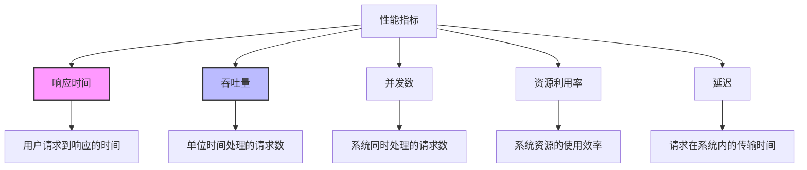

高性能系统的核心指标：

| 指标 | 说明 | 优化目标 | 衡量方式 |
|------|------|----------|---------|
| **响应时间 (Response Time)** | 请求处理时间 | 降低延迟 | 毫秒/秒级 |
| **吞吐量 (Throughput)** | 单位时间处理请求数 | 提高QPS | 请求/秒 |
| **并发数 (Concurrency)** | 同时处理的请求数 | 提高并发能力 | 用户数/连接数 |
| **资源利用率 (Resource Utilization)** | CPU、内存、网络使用率 | 提高效率 | 百分比 |
| **延迟 (Latency)** | 请求在系统内传输时间 | 减少延迟 | 毫秒级 |

<details>
<summary>不同场景下的性能优化重点</summary>

1. **Web应用**：
   - 响应时间：一般控制在200ms以内
   - 吞吐量：根据业务需求，中小型应用通常1000-5000 QPS
   - 并发数：中小型应用通常几百至几千并发连接

2. **API服务**：
   - 响应时间：一般控制在50ms以内
   - 吞吐量：通常要求更高，可达数万QPS
   - 低延迟：对时间敏感的API要求更低的延迟

3. **数据分析系统**：
   - 资源利用率：CPU和内存使用效率更为重要
   - 批处理能力：单批次处理数据量和速度
   - 可扩展性：随数据增长扩展能力

4. **实时处理系统**：
   - 延迟：毫秒甚至微秒级的延迟要求
   - 稳定性：避免延迟峰值和抖动
   - 吞吐量：在保证低延迟前提下的处理能力

</details>

<Tabs>
  <TabItem value="monitor" label="性能监控" default>
  ```java
  @Component
  public class PerformanceMonitor {
      
      private final MeterRegistry meterRegistry;
      
      public PerformanceMonitor(MeterRegistry meterRegistry) {
          this.meterRegistry = meterRegistry;
      }
      
      @Around("@annotation(org.springframework.web.bind.annotation.RequestMapping)")
      public Object monitorPerformance(ProceedingJoinPoint joinPoint) throws Throwable {
          Timer.Sample sample = Timer.start(meterRegistry);
          String methodName = joinPoint.getSignature().getName();
          
          try {
              Object result = joinPoint.proceed();
              
              // 记录成功请求
              sample.stop(Timer.builder("http.server.requests")
                  .tag("method", methodName)
                  .tag("status", "success")
                  .register(meterRegistry));
              
              return result;
          } catch (Exception e) {
              // 记录失败请求
              sample.stop(Timer.builder("http.server.requests")
                  .tag("method", methodName)
                  .tag("status", "error")
                  .register(meterRegistry));
              
              Counter.builder("error.count")
                  .tag("method", methodName)
                  .tag("exception", e.getClass().getSimpleName())
                  .register(meterRegistry)
                  .increment();
              
              throw e;
          }
      }
  }
  ```
  </TabItem>
  <TabItem value="metrics" label="指标收集">
  ```java
  @RestController
  @RequestMapping("/metrics")
  public class MetricsController {
      
      private final MeterRegistry meterRegistry;
      
      public MetricsController(MeterRegistry meterRegistry) {
          this.meterRegistry = meterRegistry;
          
          // 注册JVM指标
          new JvmMemoryMetrics().bindTo(meterRegistry);
          new JvmGcMetrics().bindTo(meterRegistry);
          new JvmThreadMetrics().bindTo(meterRegistry);
          new ClassLoaderMetrics().bindTo(meterRegistry);
          
          // 注册系统指标
          new ProcessorMetrics().bindTo(meterRegistry);
          new UptimeMetrics().bindTo(meterRegistry);
      }
      
      @GetMapping("/custom")
      public Map<String, Double> getCustomMetrics() {
          Map<String, Double> metrics = new HashMap<>();
          
          // 提取关键指标
          metrics.put("response.time.avg", getTimerMetric("response.time", "avg"));
          metrics.put("response.time.max", getTimerMetric("response.time", "max"));
          metrics.put("throughput", getCounterRate("http.server.requests"));
          metrics.put("error.rate", calculateErrorRate());
          
          return metrics;
      }
      
      private double getTimerMetric(String name, String type) {
          Timer timer = meterRegistry.find(name).timer();
          if (timer == null) return 0.0;
          
          return "avg".equals(type) ? timer.mean(TimeUnit.MILLISECONDS) : timer.max(TimeUnit.MILLISECONDS);
      }
      
      private double getCounterRate(String name) {
          return meterRegistry.find(name).counter().count() / getUptime();
      }
      
      private double calculateErrorRate() {
          double total = meterRegistry.find("http.server.requests").counters().stream()
              .mapToDouble(Counter::count).sum();
          
          double errors = meterRegistry.find("http.server.requests")
              .tag("status", "error").counter().count();
              
          return total == 0 ? 0 : (errors / total) * 100;
      }
      
      private double getUptime() {
          return ManagementFactory.getRuntimeMXBean().getUptime() / 1000.0;
      }
  }
  ```
  </TabItem>
</Tabs>

### 1.2 性能瓶颈分析

性能瓶颈分析是发现系统性能短板的重要步骤，可以通过监控工具和性能分析确定系统中的瓶颈点。

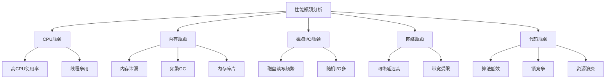

<div className="card">
<div className="card__header">
<h4>性能瓶颈识别方法</h4>
</div>
<div className="card__body">

| 瓶颈类型 | 症状 | 常见原因 | 分析工具 |
|---------|------|---------|---------|
| **CPU瓶颈** | CPU使用率高，线程排队 | 计算密集型操作，死循环，线程争用 | JVisualVM，top，jstack |
| **内存瓶颈** | GC频繁，OOM异常 | 内存泄漏，大对象创建，Eden区过小 | JProfiler，jmap，MAT |
| **磁盘I/O瓶颈** | 磁盘读写频繁，响应慢 | 日志频繁写入，数据库索引不当 | iostat，iotop |
| **网络瓶颈** | 网络延迟高，丢包 | 带宽不足，网络拥塞，连接过多 | netstat，ping，wireshark |
| **代码瓶颈** | 热点方法执行慢 | 算法低效，锁竞争，资源泄漏 | JProfiler，YourKit |

</div>
</div>

<Tabs>
  <TabItem value="analyzer" label="性能分析器" default>
  ```java
  @Component
  public class PerformanceAnalyzer {
      
      private final ThreadMXBean threadMXBean = ManagementFactory.getThreadMXBean();
      private final MemoryMXBean memoryMXBean = ManagementFactory.getMemoryMXBean();
      
      public PerformanceReport analyzePerformance() {
          PerformanceReport report = new PerformanceReport();
          
          // CPU使用率分析
          report.setCpuUsage(analyzeCpuUsage());
          
          // 内存使用情况
          report.setMemoryUsage(analyzeMemoryUsage());
          
          // 线程状态分析
          report.setThreadInfo(analyzeThreadInfo());
          
          // GC情况分析
          report.setGcInfo(analyzeGcInfo());
          
          return report;
      }
      
      private double analyzeCpuUsage() {
          OperatingSystemMXBean osBean = ManagementFactory.getOperatingSystemMXBean();
          if (osBean instanceof com.sun.management.OperatingSystemMXBean) {
              return ((com.sun.management.OperatingSystemMXBean) osBean).getCpuLoad() * 100;
          }
          return 0.0;
      }
      
      private MemoryUsage analyzeMemoryUsage() {
          return memoryMXBean.getHeapMemoryUsage();
      }
      
      private ThreadInfo[] analyzeThreadInfo() {
          return threadMXBean.dumpAllThreads(false, false);
      }
      
      private List<GarbageCollectorMXBean> analyzeGcInfo() {
          return ManagementFactory.getGarbageCollectorMXBeans();
      }
  }
  ```
  </TabItem>
  <TabItem value="hotspot" label="热点分析">
  ```java
  @Component
  public class HotspotAnalyzer {
      
      private final MeterRegistry meterRegistry;
      private final Map<String, Timer> methodTimers = new ConcurrentHashMap<>();
      
      public HotspotAnalyzer(MeterRegistry meterRegistry) {
          this.meterRegistry = meterRegistry;
      }
      
      @Around("execution(* com.example.service.*.*(..))")
      public Object analyzeMethodPerformance(ProceedingJoinPoint joinPoint) throws Throwable {
          String methodName = joinPoint.getSignature().toShortString();
          Timer timer = methodTimers.computeIfAbsent(methodName, 
              k -> Timer.builder("method.execution")
                  .tag("method", methodName)
                  .register(meterRegistry));
          
          return timer.recordCallable(() -> {
              try {
                  return joinPoint.proceed();
              } catch (Throwable t) {
                  if (t instanceof RuntimeException) {
                      throw (RuntimeException) t;
                  }
                  throw new RuntimeException(t);
              }
          });
      }
      
      public List<MethodPerformance> getTopSlowMethods(int limit) {
          return methodTimers.entrySet().stream()
              .map(entry -> new MethodPerformance(
                  entry.getKey(),
                  entry.getValue().count(),
                  entry.getValue().totalTime(TimeUnit.MILLISECONDS),
                  entry.getValue().mean(TimeUnit.MILLISECONDS),
                  entry.getValue().max(TimeUnit.MILLISECONDS)
              ))
              .sorted(Comparator.comparingDouble(MethodPerformance::getAvgTime).reversed())
              .limit(limit)
              .collect(Collectors.toList());
      }
      
      public static class MethodPerformance {
          private final String methodName;
          private final long invocationCount;
          private final double totalTime;
          private final double avgTime;
          private final double maxTime;
          
          // Constructor, getters
          // ...
      }
  }
  ```
  </TabItem>
</Tabs>

:::caution 性能分析注意事项
1. **生产环境影响**：性能分析工具会对系统性能产生影响，在生产环境中使用需谨慎
2. **采样频率**：高频采样会提供更精确的数据，但也会产生更大的性能开销
3. **全局视角**：关注全局性能指标，避免只优化局部性能
4. **系统状态**：在不同负载条件下进行性能分析，特别是峰值负载时
5. **持续监控**：建立持续性能监控机制，及时发现性能退化
:::

## 2. 算法优化

### 2.1 数据结构优化

选择合适的数据结构对系统性能有着至关重要的影响，特别是在高并发场景下。

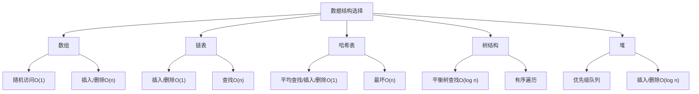

<Tabs>
  <TabItem value="data-structure" label="高效数据结构" default>
  ```java
  @Service
  public class DataStructureOptimization {
      
      // 使用HashMap优化查找
      private Map<String, User> userCache = new ConcurrentHashMap<>();
      
      public User getUserById(String id) {
          return userCache.get(id);
      }
      
      // 使用TreeSet优化排序
      private TreeSet<Integer> sortedNumbers = new TreeSet<>();
      
      public void addNumber(int number) {
          sortedNumbers.add(number);
      }
      
      public int findClosestNumber(int target) {
          Integer ceiling = sortedNumbers.ceiling(target);
          Integer floor = sortedNumbers.floor(target);
          
          if (ceiling == null) return floor;
          if (floor == null) return ceiling;
          
          return Math.abs(ceiling - target) < Math.abs(floor - target) ? ceiling : floor;
      }
      
      // 使用LinkedHashMap实现LRU缓存
      private Map<String, String> lruCache = new LinkedHashMap<String, String>(100, 0.75f, true) {
          @Override
          protected boolean removeEldestEntry(Map.Entry<String, String> eldest) {
              return size() > 100;
          }
      };
      
      public String getValue(String key) {
          return lruCache.get(key);
      }
      
      public void putValue(String key, String value) {
          lruCache.put(key, value);
      }
  }
  ```
  </TabItem>
  <TabItem value="comparision" label="数据结构对比">
  ```java
  @Service
  public class DataStructureBenchmark {
      
      public void compareListPerformance() {
          // 准备测试数据
          int dataSize = 100000;
          Random random = new Random();
          
          // ArrayList性能测试
          List<Integer> arrayList = new ArrayList<>(dataSize);
          long startTime = System.nanoTime();
          
          for (int i = 0; i < dataSize; i++) {
              arrayList.add(random.nextInt());
          }
          
          long arrayListInsertTime = System.nanoTime() - startTime;
          
          // LinkedList性能测试
          List<Integer> linkedList = new LinkedList<>();
          startTime = System.nanoTime();
          
          for (int i = 0; i < dataSize; i++) {
              linkedList.add(random.nextInt());
          }
          
          long linkedListInsertTime = System.nanoTime() - startTime;
          
          // 随机访问性能测试
          startTime = System.nanoTime();
          for (int i = 0; i < 10000; i++) {
              arrayList.get(random.nextInt(dataSize));
          }
          long arrayListAccessTime = System.nanoTime() - startTime;
          
          startTime = System.nanoTime();
          for (int i = 0; i < 10000; i++) {
              linkedList.get(random.nextInt(dataSize));
          }
          long linkedListAccessTime = System.nanoTime() - startTime;
          
          // 输出结果
          System.out.println("ArrayList插入时间: " + arrayListInsertTime + "ns");
          System.out.println("LinkedList插入时间: " + linkedListInsertTime + "ns");
          System.out.println("ArrayList随机访问时间: " + arrayListAccessTime + "ns");
          System.out.println("LinkedList随机访问时间: " + linkedListAccessTime + "ns");
      }
  }
  ```
  </TabItem>
</Tabs>

### 2.2 算法时间复杂度优化

优化算法时间复杂度是提高系统性能的关键手段，通过选择更高效的算法可以显著提升系统处理能力。

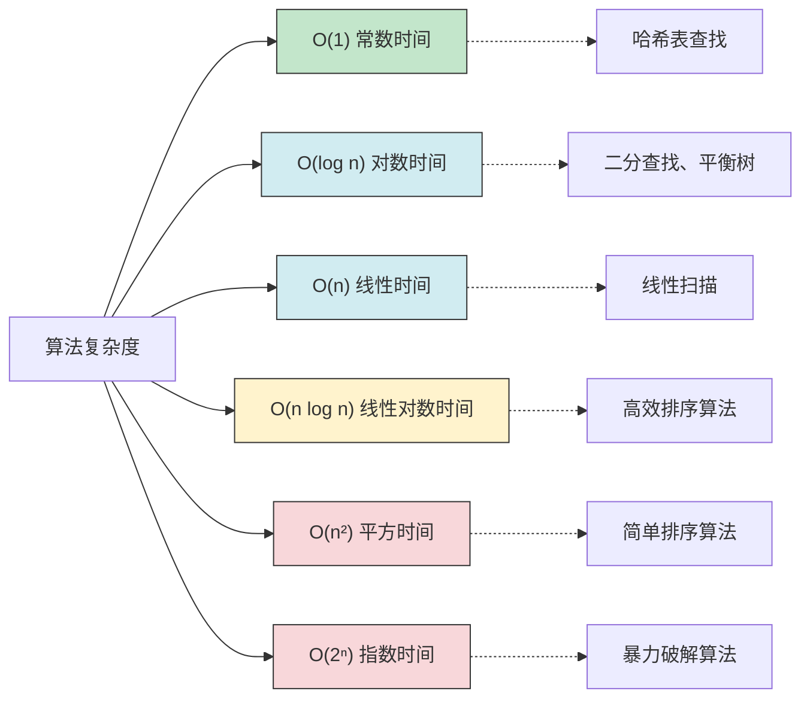

<div className="card">
<div className="card__body">

优化算法时间复杂度的常见策略：

1. **减少嵌套循环**：将O(n²)优化为O(n)或O(n log n)
2. **使用哈希表**：将查找复杂度从O(n)降至O(1)
3. **使用二分查找**：将有序数组查找从O(n)降至O(log n)
4. **动态规划**：避免重复计算，优化递归算法
5. **贪心算法**：在适当场景用局部最优解替代全局最优解
6. **空间换时间**：利用额外空间降低时间复杂度

</div>
</div>

<Tabs>
  <TabItem value="before" label="优化前" default>
  ```java
  // O(n²)复杂度 - 查找两数之和
  public int[] findTwoSum(int[] nums, int target) {
      for (int i = 0; i < nums.length; i++) {
          for (int j = i + 1; j < nums.length; j++) {
              if (nums[i] + nums[j] == target) {
                  return new int[] {i, j};
              }
          }
      }
      return null;
  }
  ```
  </TabItem>
  <TabItem value="after" label="优化后">
  ```java
  // O(n)复杂度 - 使用哈希表优化查找两数之和
  public int[] findTwoSumOptimized(int[] nums, int target) {
      Map<Integer, Integer> numMap = new HashMap<>();
      for (int i = 0; i < nums.length; i++) {
          int complement = target - nums[i];
          if (numMap.containsKey(complement)) {
              return new int[] {numMap.get(complement), i};
          }
          numMap.put(nums[i], i);
      }
      return null;
  }
  ```
  </TabItem>
  <TabItem value="comparison" label="性能对比">
  ```java
  @Service
  public class AlgorithmBenchmark {
      
      public void compareTwoSumAlgorithms() {
          // 准备测试数据
          int[] nums = new int[10000];
          Random random = new Random();
          
          for (int i = 0; i < nums.length; i++) {
              nums[i] = random.nextInt(10000);
          }
          
          int target = nums[random.nextInt(nums.length)] + nums[random.nextInt(nums.length)];
          
          // 测试O(n²)算法
          long startTime = System.nanoTime();
          findTwoSum(nums, target);
          long bruteForceTime = System.nanoTime() - startTime;
          
          // 测试O(n)算法
          startTime = System.nanoTime();
          findTwoSumOptimized(nums, target);
          long optimizedTime = System.nanoTime() - startTime;
          
          // 输出结果
          System.out.println("O(n²)算法执行时间: " + bruteForceTime + "ns");
          System.out.println("O(n)算法执行时间: " + optimizedTime + "ns");
          System.out.println("性能提升: " + (bruteForceTime / optimizedTime) + "倍");
      }
  }
  ```
  </TabItem>
</Tabs>

### 2.3 空间复杂度优化

在某些场景下，我们需要在空间复杂度和时间复杂度之间进行权衡，特别是在内存受限的环境中。

<details>
<summary>空间复杂度与时间复杂度的权衡</summary>

1. **空间换时间**：
   - 预计算结果存储在内存中（如缓存、查找表）
   - 使用额外数据结构加速处理（哈希表、树等）
   - 适用于内存充足、性能要求高的场景

2. **时间换空间**：
   - 使用迭代替代递归避免栈空间消耗
   - 使用位操作节省空间
   - 适用于内存受限场景

3. **权衡因素**：
   - 硬件限制：内存大小、CPU性能
   - 并发用户数：影响总内存需求
   - 数据规模：处理数据量的大小
   - 访问频率：高频访问适合空间换时间

</details>

```java title="空间优化示例"
// 优化前：空间复杂度O(n)
public int fibonacci(int n) {
    int[] fib = new int[n + 1];
    fib[0] = 0;
    fib[1] = 1;
    for (int i = 2; i <= n; i++) {
        fib[i] = fib[i - 1] + fib[i - 2];
    }
    return fib[n];
}

// 优化后：空间复杂度O(1)
public int fibonacciOptimized(int n) {
    if (n <= 1) return n;
    
    int prev = 0;
    int curr = 1;
    for (int i = 2; i <= n; i++) {
        int next = prev + curr;
        prev = curr;
        curr = next;
    }
    return curr;
}
```

## 3. 缓存优化

缓存是提升系统性能最有效的手段之一，通过将频繁访问的数据存储在更快的介质中，可以显著减少访问延迟。

### 3.1 本地缓存

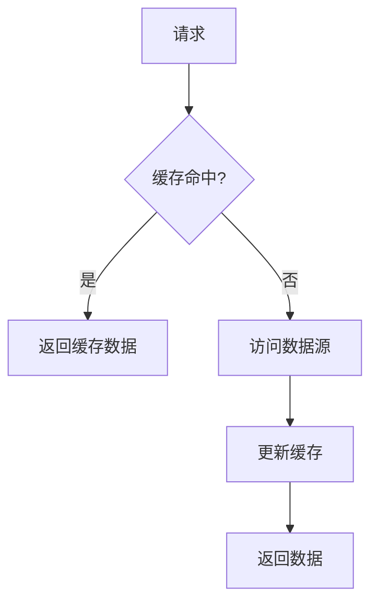

<Tabs>
  <TabItem value="caffeine" label="Caffeine缓存" default>
  ```java
  @Configuration
  public class CaffeineConfig {
      
      @Bean
      public Cache<String, Object> caffeineCache() {
          return Caffeine.newBuilder()
              .maximumSize(10_000)
              .expireAfterWrite(Duration.ofMinutes(5))
              .recordStats()
              .build();
      }
  }
  
  @Service
  public class CaffeineCacheService {
      
      @Autowired
      private Cache<String, Object> caffeineCache;
      
      @Autowired
      private DataRepository repository;
      
      public Object getData(String key) {
          // 从缓存获取
          Object value = caffeineCache.getIfPresent(key);
          if (value != null) {
              return value;
          }
          
          // 缓存未命中，从数据源获取
          value = repository.findByKey(key);
          if (value != null) {
              // 更新缓存
              caffeineCache.put(key, value);
          }
          
          return value;
      }
      
      public Map<String, Object> getCacheStats() {
          Map<String, Object> stats = new HashMap<>();
          stats.put("hitCount", caffeineCache.stats().hitCount());
          stats.put("missCount", caffeineCache.stats().missCount());
          stats.put("hitRate", caffeineCache.stats().hitRate());
          stats.put("evictionCount", caffeineCache.stats().evictionCount());
          stats.put("estimatedSize", caffeineCache.estimatedSize());
          return stats;
      }
  }
  ```
  </TabItem>
  <TabItem value="guava" label="Guava缓存">
  ```java
  @Configuration
  public class GuavaCacheConfig {
      
      @Bean
      public LoadingCache<String, Object> guavaCache() {
          return CacheBuilder.newBuilder()
              .maximumSize(10_000)
              .expireAfterWrite(5, TimeUnit.MINUTES)
              .recordStats()
              .build(new CacheLoader<String, Object>() {
                  @Override
                  public Object load(String key) throws Exception {
                      // 这里实现从数据源加载数据的逻辑
                      return loadFromDataSource(key);
                  }
              });
      }
      
      private Object loadFromDataSource(String key) {
          // 从数据源加载数据的实现
          return null;
      }
  }
  
  @Service
  public class GuavaCacheService {
      
      @Autowired
      private LoadingCache<String, Object> guavaCache;
      
      public Object getData(String key) {
          try {
              // 自动处理缓存未命中情况
              return guavaCache.get(key);
          } catch (ExecutionException e) {
              log.error("获取数据失败", e);
              return null;
          }
      }
      
      public Map<String, Object> getCacheStats() {
          CacheStats stats = guavaCache.stats();
          Map<String, Object> statsMap = new HashMap<>();
          statsMap.put("hitCount", stats.hitCount());
          statsMap.put("missCount", stats.missCount());
          statsMap.put("hitRate", stats.hitRate());
          statsMap.put("evictionCount", stats.evictionCount());
          statsMap.put("totalLoadTime", stats.totalLoadTime());
          statsMap.put("averageLoadPenalty", stats.averageLoadPenalty());
          return statsMap;
      }
  }
  ```
  </TabItem>
  <TabItem value="ehcache" label="EhCache">
  ```java
  @Configuration
  @EnableCaching
  public class EhCacheConfig {
      
      @Bean
      public CacheManager cacheManager() {
          CacheConfiguration<Object, Object> cacheConfiguration = CacheConfigurationBuilder
              .newCacheConfigurationBuilder(Object.class, Object.class,
                  ResourcePoolsBuilder.heap(10000))
              .withExpiry(ExpiryPolicyBuilder.timeToLiveExpiration(Duration.ofMinutes(5)))
              .build();
              
          EhcacheCachingProvider provider = (EhcacheCachingProvider) Caching.getCachingProvider();
          org.ehcache.config.Configuration configuration = new DefaultConfiguration(provider.getDefaultClassLoader());
          
          EhcacheCacheManager ehCacheManager = new EhcacheCacheManager(CacheManagerBuilder
              .newCacheManagerBuilder()
              .withCache("default", cacheConfiguration)
              .build(true));
              
          return ehCacheManager;
      }
  }
  
  @Service
  public class EhCacheService {
      
      @Autowired
      private CacheManager cacheManager;
      
      @Autowired
      private DataRepository repository;
      
      @Cacheable(value = "default", key = "#key")
      public Object getData(String key) {
          // 缓存未命中时执行
          return repository.findByKey(key);
      }
      
      @CacheEvict(value = "default", key = "#key")
      public void invalidateCache(String key) {
          // 方法体可以为空，注解会处理缓存失效
      }
  }
  ```
  </TabItem>
</Tabs>

:::caution 本地缓存注意事项
1. **内存压力**：设置合理的最大大小，避免占用过多内存
2. **过期策略**：选择合适的过期策略（LRU、LFU、FIFO等）
3. **缓存一致性**：多实例场景下的缓存数据一致性问题
4. **缓存穿透**：对不存在的key进行重复查询导致缓存失效
5. **缓存击穿**：热点key过期瞬间导致大量请求直达数据库
6. **缓存雪崩**：大量缓存同时失效导致系统压力突增
:::

### 3.2 分布式缓存

分布式缓存解决了本地缓存在多实例场景下的数据一致性问题，可以作为多个应用实例的共享缓存。

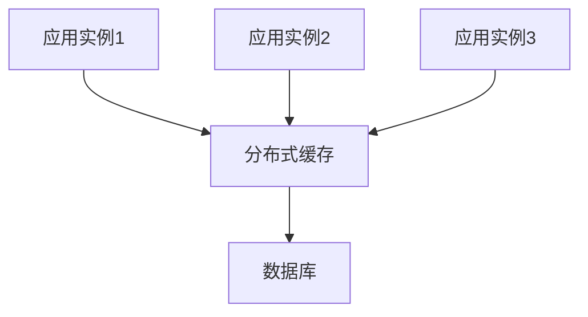

<div className="card">
<div className="card__header">
<h4>分布式缓存特点</h4>
</div>
<div className="card__body">

| 特性 | 说明 |
|------|------|
| **数据一致性** | 多个应用实例访问相同的缓存数据，避免数据不一致 |
| **水平扩展** | 可以通过增加节点提升缓存容量和吞吐量 |
| **故障转移** | 支持节点故障时的自动故障转移，提高可用性 |
| **数据分区** | 通过哈希或一致性哈希等算法对数据进行分区存储 |
| **缓存协议** | 支持多种缓存访问协议，如Memcached、Redis协议等 |

</div>
</div>

<Tabs>
  <TabItem value="redis" label="Redis缓存" default>
  ```java
  @Configuration
  public class RedisConfig {
      
      @Bean
      public RedisConnectionFactory redisConnectionFactory() {
          LettuceConnectionFactory factory = new LettuceConnectionFactory();
          factory.setHostName("localhost");
          factory.setPort(6379);
          factory.afterPropertiesSet();
          return factory;
      }
      
      @Bean
      public RedisTemplate<String, Object> redisTemplate() {
          RedisTemplate<String, Object> template = new RedisTemplate<>();
          template.setConnectionFactory(redisConnectionFactory());
          template.setKeySerializer(new StringRedisSerializer());
          template.setValueSerializer(new Jackson2JsonRedisSerializer<>(Object.class));
          template.afterPropertiesSet();
          return template;
      }
      
      @Bean
      public RedisCacheManager cacheManager() {
          RedisCacheConfiguration cacheConfig = RedisCacheConfiguration.defaultCacheConfig()
              .entryTtl(Duration.ofMinutes(10))
              .serializeKeysWith(RedisSerializationContext.SerializationPair
                  .fromSerializer(new StringRedisSerializer()))
              .serializeValuesWith(RedisSerializationContext.SerializationPair
                  .fromSerializer(new GenericJackson2JsonRedisSerializer()));
                  
          return RedisCacheManager.builder(redisConnectionFactory())
              .cacheDefaults(cacheConfig)
              .build();
      }
  }
  
  @Service
  public class RedisCacheService {
      
      @Autowired
      private RedisTemplate<String, Object> redisTemplate;
      
      @Autowired
      private DataRepository repository;
      
      public Object getData(String key) {
          // 从Redis获取数据
          Object value = redisTemplate.opsForValue().get(key);
          if (value != null) {
              return value;
          }
          
          // 缓存未命中，从数据库获取
          value = repository.findByKey(key);
          if (value != null) {
              // 更新缓存，设置过期时间
              redisTemplate.opsForValue().set(key, value, Duration.ofMinutes(10));
          }
          
          return value;
      }
      
      public void deleteData(String key) {
          // 删除数据库记录
          repository.deleteByKey(key);
          
          // 删除缓存
          redisTemplate.delete(key);
      }
  }
  ```
  </TabItem>
  <TabItem value="redis-cluster" label="Redis集群">
  ```java
  @Configuration
  public class RedisClusterConfig {
      
      @Bean
      public RedisConnectionFactory redisConnectionFactory() {
          RedisClusterConfiguration clusterConfig = new RedisClusterConfiguration();
          clusterConfig.addClusterNode(new RedisNode("redis-1", 6379));
          clusterConfig.addClusterNode(new RedisNode("redis-2", 6379));
          clusterConfig.addClusterNode(new RedisNode("redis-3", 6379));
          
          return new LettuceConnectionFactory(clusterConfig);
      }
      
      @Bean
      public RedisTemplate<String, Object> redisTemplate() {
          RedisTemplate<String, Object> template = new RedisTemplate<>();
          template.setConnectionFactory(redisConnectionFactory());
          template.setKeySerializer(new StringRedisSerializer());
          template.setValueSerializer(new GenericJackson2JsonRedisSerializer());
          template.afterPropertiesSet();
          return template;
      }
  }
  ```
  </TabItem>
  <TabItem value="redis-sentinel" label="Redis哨兵">
  ```java
  @Configuration
  public class RedisSentinelConfig {
      
      @Bean
      public RedisConnectionFactory redisConnectionFactory() {
          RedisSentinelConfiguration sentinelConfig = new RedisSentinelConfiguration()
              .master("mymaster")
              .sentinel("redis-sentinel-1", 26379)
              .sentinel("redis-sentinel-2", 26379)
              .sentinel("redis-sentinel-3", 26379);
              
          return new LettuceConnectionFactory(sentinelConfig);
      }
      
      @Bean
      public RedisTemplate<String, Object> redisTemplate() {
          RedisTemplate<String, Object> template = new RedisTemplate<>();
          template.setConnectionFactory(redisConnectionFactory());
          template.setKeySerializer(new StringRedisSerializer());
          template.setValueSerializer(new GenericJackson2JsonRedisSerializer());
          template.afterPropertiesSet();
          return template;
      }
  }
  ```
  </TabItem>
</Tabs>

### 3.3 缓存策略

缓存策略决定了缓存的使用方式和效果，选择合适的缓存策略对系统性能至关重要。

<details>
<summary>常见缓存策略</summary>

1. **Cache-Aside（旁路缓存）**：
   - 应用程序负责同时维护缓存和数据库
   - 读取数据时先查缓存，缓存未命中再查数据库并更新缓存
   - 写入数据时先更新数据库，然后更新或失效缓存
   
2. **Read-Through**：
   - 缓存层负责从数据源加载数据
   - 应用程序只与缓存层交互，无需关心数据源
   - 缓存未命中时自动从数据源加载
   
3. **Write-Through**：
   - 写入数据时先写入缓存，然后由缓存同步写入数据库
   - 保证数据一致性，但写入性能较差
   
4. **Write-Behind/Write-Back**：
   - 写入数据时只更新缓存，然后异步更新数据库
   - 提高写入性能，但可能导致数据丢失
   
5. **Write-Around**：
   - 写入数据时只更新数据库，不更新缓存
   - 避免写入操作污染缓存，适用于读多写少场景

</details>

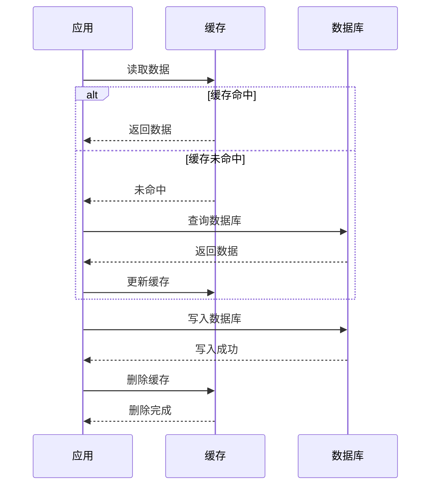

<Tabs>
  <TabItem value="cache-aside" label="Cache-Aside" default>
  ```java
  @Service
  public class CacheAsideService {
      
      @Autowired
      private RedisTemplate<String, Object> redisTemplate;
      
      @Autowired
      private UserRepository userRepository;
      
      // 读取操作
      public User getUser(Long id) {
          String key = "user:" + id;
          
          // 1. 从缓存读取
          User user = (User) redisTemplate.opsForValue().get(key);
          if (user != null) {
              return user;
          }
          
          // 2. 缓存未命中，从数据库读取
          user = userRepository.findById(id).orElse(null);
          if (user != null) {
              // 3. 更新缓存
              redisTemplate.opsForValue().set(key, user, Duration.ofMinutes(30));
          }
          
          return user;
      }
      
      // 写入操作
      @Transactional
      public void updateUser(User user) {
          // 1. 更新数据库
          userRepository.save(user);
          
          // 2. 删除缓存
          redisTemplate.delete("user:" + user.getId());
      }
  }
  ```
  </TabItem>
  <TabItem value="write-through" label="Write-Through">
  ```java
  @Service
  public class WriteThroughService {
      
      @Autowired
      private RedisTemplate<String, Object> redisTemplate;
      
      @Autowired
      private UserRepository userRepository;
      
      // 写入操作
      @Transactional
      public void updateUser(User user) {
          // 1. 更新数据库
          userRepository.save(user);
          
          // 2. 更新缓存
          String key = "user:" + user.getId();
          redisTemplate.opsForValue().set(key, user, Duration.ofMinutes(30));
      }
  }
  ```
  </TabItem>
  <TabItem value="write-behind" label="Write-Behind">
  ```java
  @Service
  public class WriteBehindService {
      
      @Autowired
      private RedisTemplate<String, Object> redisTemplate;
      
      @Autowired
      private UserRepository userRepository;
      
      @Autowired
      private KafkaTemplate<String, User> kafkaTemplate;
      
      // 写入操作
      public void updateUser(User user) {
          // 1. 更新缓存
          String key = "user:" + user.getId();
          redisTemplate.opsForValue().set(key, user, Duration.ofMinutes(30));
          
          // 2. 异步更新数据库
          kafkaTemplate.send("user-updates", user);
      }
      
      // 消费者处理数据库更新
      @KafkaListener(topics = "user-updates")
      public void processUserUpdate(User user) {
          userRepository.save(user);
      }
  }
  ```
  </TabItem>
</Tabs>

## 4. 数据库优化

数据库往往是系统性能的瓶颈，优化数据库访问对提升整体性能至关重要。

### 4.1 索引优化

索引是提升数据库查询性能的关键技术，合理的索引设计可以大幅提升查询速度。

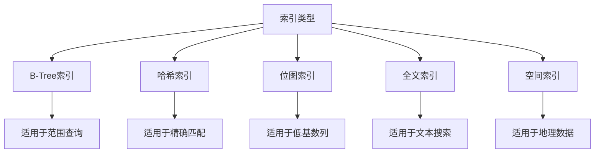

<div className="card">
<div className="card__body">

索引设计的核心原则：

1. **高选择性优先**：为选择性高的列创建索引（如主键、唯一约束列）
2. **组合索引顺序**：最左匹配原则，常用列放在前面
3. **避免过度索引**：索引也需要维护成本，过多索引会影响写性能
4. **覆盖索引**：使用包含所有查询所需字段的索引（索引覆盖）
5. **索引列优化**：避免对索引列进行函数操作，如`WHERE UPPER(name) = 'ABC'`
6. **索引维护**：定期分析和优化索引，删除未使用的索引

</div>
</div>

<Tabs>
  <TabItem value="index-design" label="索引设计" default>
  ```sql
  -- 创建基本索引
  CREATE INDEX idx_user_email ON users (email);
  
  -- 创建组合索引
  CREATE INDEX idx_user_name_city ON users (name, city);
  
  -- 创建唯一索引
  CREATE UNIQUE INDEX idx_user_username ON users (username);
  
  -- 创建部分索引 (PostgreSQL)
  CREATE INDEX idx_active_users ON users (created_at) WHERE active = true;
  
  -- 创建函数索引 (PostgreSQL)
  CREATE INDEX idx_user_email_lower ON users (LOWER(email));
  
  -- 创建全文索引 (MySQL)
  CREATE FULLTEXT INDEX idx_article_content ON articles (title, content);
  ```
  </TabItem>
  <TabItem value="index-best-practices" label="索引最佳实践">
  ```java
  @Repository
  public interface UserRepository extends JpaRepository<User, Long> {
      
      // 使用索引的查询
      @Query("SELECT u FROM User u WHERE u.email = :email")
      Optional<User> findByEmail(String email);
      
      // 组合索引查询 - 利用idx_user_name_city
      @Query("SELECT u FROM User u WHERE u.name = :name AND u.city = :city")
      List<User> findByNameAndCity(String name, String city);
      
      // 范围查询 - 使用索引的最左前缀
      @Query("SELECT u FROM User u WHERE u.name = :name ORDER BY u.city")
      List<User> findByNameOrderByCity(String name);
      
      // 避免的查询模式 - 对索引列使用函数
      @Query("SELECT u FROM User u WHERE LOWER(u.email) = LOWER(:email)")
      Optional<User> findByEmailIgnoreCase(String email);
      
      // 更好的替代方案
      @Query(nativeQuery = true,
          value = "SELECT * FROM users WHERE email = :email COLLATE NOCASE")
      Optional<User> findByEmailCaseInsensitive(String email);
  }
  ```
  </TabItem>
  <TabItem value="index-analysis" label="索引分析">
  ```sql
  -- MySQL索引分析
  EXPLAIN SELECT * FROM users WHERE email = 'user@example.com';
  
  -- PostgreSQL索引分析
  EXPLAIN ANALYZE SELECT * FROM users WHERE email = 'user@example.com';
  
  -- 检查索引使用情况 (MySQL)
  SELECT
      INDEX_NAME,
      TABLE_NAME,
      SEQ_IN_INDEX,
      COLUMN_NAME,
      CARDINALITY
  FROM
      INFORMATION_SCHEMA.STATISTICS
  WHERE
      TABLE_SCHEMA = 'your_database'
      AND TABLE_NAME = 'users'
  ORDER BY
      INDEX_NAME,
      SEQ_IN_INDEX;
      
  -- 检查未使用的索引 (MySQL)
  SELECT
      objects.name AS table_name,
      indexes.name AS index_name,
      dm_db_index_usage_stats.user_seeks,
      dm_db_index_usage_stats.user_scans,
      dm_db_index_usage_stats.user_lookups
  FROM
      sys.dm_db_index_usage_stats
      INNER JOIN sys.indexes ON dm_db_index_usage_stats.object_id = indexes.object_id
          AND dm_db_index_usage_stats.index_id = indexes.index_id
      INNER JOIN sys.objects ON indexes.object_id = objects.object_id
  WHERE
      dm_db_index_usage_stats.user_seeks = 0
      AND dm_db_index_usage_stats.user_scans = 0
      AND dm_db_index_usage_stats.user_lookups = 0
      AND objects.name = 'users';
  ```
  </TabItem>
</Tabs>

### 4.2 查询优化

优化SQL查询是提升数据库性能的重要手段，通过优化查询语句、避免常见陷阱，可以显著提升查询性能。

<details>
<summary>查询优化核心原则</summary>

1. **只查询需要的列**：避免`SELECT *`，只查询需要的列
2. **减少结果集大小**：使用`LIMIT`/`TOP`等限制结果集大小
3. **优化JOIN**：减少JOIN的表数量，选择正确的JOIN类型
4. **分页优化**：使用基于主键的分页，避免`OFFSET`
5. **避免子查询**：尽可能使用JOIN替代子查询
6. **避免全表扫描**：确保查询条件能够使用索引
7. **适当反范式化**：为了性能考虑，适当冗余存储部分数据
8. **批量操作**：使用批量插入/更新替代单条操作

</details>

<Tabs>
  <TabItem value="query-optimization" label="查询优化示例" default>
  ```sql
  -- 优化前：查询所有列，可能不必要
  SELECT * FROM orders WHERE customer_id = 123;
  
  -- 优化后：只查询需要的列
  SELECT order_id, order_date, total_amount 
  FROM orders 
  WHERE customer_id = 123;
  
  -- 优化前：子查询
  SELECT * 
  FROM orders 
  WHERE customer_id IN (SELECT id FROM customers WHERE region = 'Europe');
  
  -- 优化后：使用JOIN
  SELECT o.* 
  FROM orders o 
  JOIN customers c ON o.customer_id = c.id 
  WHERE c.region = 'Europe';
  
  -- 优化前：OFFSET分页
  SELECT * FROM products 
  ORDER BY created_at 
  LIMIT 20 OFFSET 1000;
  
  -- 优化后：基于ID分页
  SELECT * FROM products 
  WHERE id > 1000 
  ORDER BY id 
  LIMIT 20;
  
  -- 优化前：使用函数在WHERE子句
  SELECT * FROM users 
  WHERE YEAR(registration_date) = 2023;
  
  -- 优化后：避免在索引列上使用函数
  SELECT * FROM users 
  WHERE registration_date >= '2023-01-01' 
  AND registration_date < '2024-01-01';
  ```
  </TabItem>
  <TabItem value="orm-query" label="ORM查询优化">
  ```java
  @Repository
  public class OrderRepository {
      
      @PersistenceContext
      private EntityManager entityManager;
      
      // 优化前：获取所有字段
      public List<Order> findByCustomerId(Long customerId) {
          return entityManager.createQuery(
              "SELECT o FROM Order o WHERE o.customer.id = :customerId", Order.class)
              .setParameter("customerId", customerId)
              .getResultList();
      }
      
      // 优化后：仅查询需要的字段
      public List<OrderProjection> findOrderProjectionsByCustomerId(Long customerId) {
          return entityManager.createQuery(
              "SELECT new com.example.OrderProjection(o.id, o.orderDate, o.totalAmount) " +
              "FROM Order o WHERE o.customer.id = :customerId", OrderProjection.class)
              .setParameter("customerId", customerId)
              .getResultList();
      }
      
      // 优化前：使用JOIN FETCH加载所有关联
      public List<Order> findOrdersWithDetails(Long customerId) {
          return entityManager.createQuery(
              "SELECT o FROM Order o " +
              "JOIN FETCH o.items " +
              "JOIN FETCH o.customer " +
              "WHERE o.customer.id = :customerId", Order.class)
              .setParameter("customerId", customerId)
              .getResultList();
      }
      
      // 优化后：使用分页和懒加载
      public List<Order> findOrdersWithPagination(Long customerId, int page, int size) {
          return entityManager.createQuery(
              "SELECT o FROM Order o " +
              "WHERE o.customer.id = :customerId", Order.class)
              .setParameter("customerId", customerId)
              .setFirstResult(page * size)
              .setMaxResults(size)
              .getResultList();
      }
  }
  ```
  </TabItem>
  <TabItem value="batch-operations" label="批量操作">
  ```java
  @Service
  @Transactional
  public class BatchOperationService {
      
      @PersistenceContext
      private EntityManager entityManager;
      
      // 批量插入
      public void batchInsert(List<User> users) {
          final int batchSize = 100;
          
          for (int i = 0; i < users.size(); i++) {
              entityManager.persist(users.get(i));
              
              if (i % batchSize == 0 && i > 0) {
                  // 每插入batchSize条数据，刷新并清理EntityManager
                  entityManager.flush();
                  entityManager.clear();
              }
          }
          entityManager.flush();
          entityManager.clear();
      }
      
      // 批量更新
      public void batchUpdate(List<UserUpdateDTO> updates) {
          final int batchSize = 100;
          
          Query query = entityManager.createQuery(
              "UPDATE User u SET u.status = :status WHERE u.id = :id");
              
          for (int i = 0; i < updates.size(); i++) {
              UserUpdateDTO update = updates.get(i);
              query.setParameter("status", update.getStatus())
                  .setParameter("id", update.getId())
                  .executeUpdate();
                  
              if (i % batchSize == 0 && i > 0) {
                  entityManager.flush();
                  entityManager.clear();
              }
          }
          entityManager.flush();
          entityManager.clear();
      }
      
      // JDBC批量插入
      public void jdbcBatchInsert(List<User> users) {
          JdbcTemplate jdbcTemplate = new JdbcTemplate(dataSource);
          
          jdbcTemplate.batchUpdate(
              "INSERT INTO users (name, email, status) VALUES (?, ?, ?)",
              new BatchPreparedStatementSetter() {
                  @Override
                  public void setValues(PreparedStatement ps, int i) throws SQLException {
                      User user = users.get(i);
                      ps.setString(1, user.getName());
                      ps.setString(2, user.getEmail());
                      ps.setString(3, user.getStatus());
                  }
                  
                  @Override
                  public int getBatchSize() {
                      return users.size();
                  }
              });
      }
  }
  ```
  </TabItem>
</Tabs>

### 4.3 连接池优化

数据库连接池优化是提升数据库访问性能的重要手段，连接池避免了频繁创建和销毁数据库连接的开销。

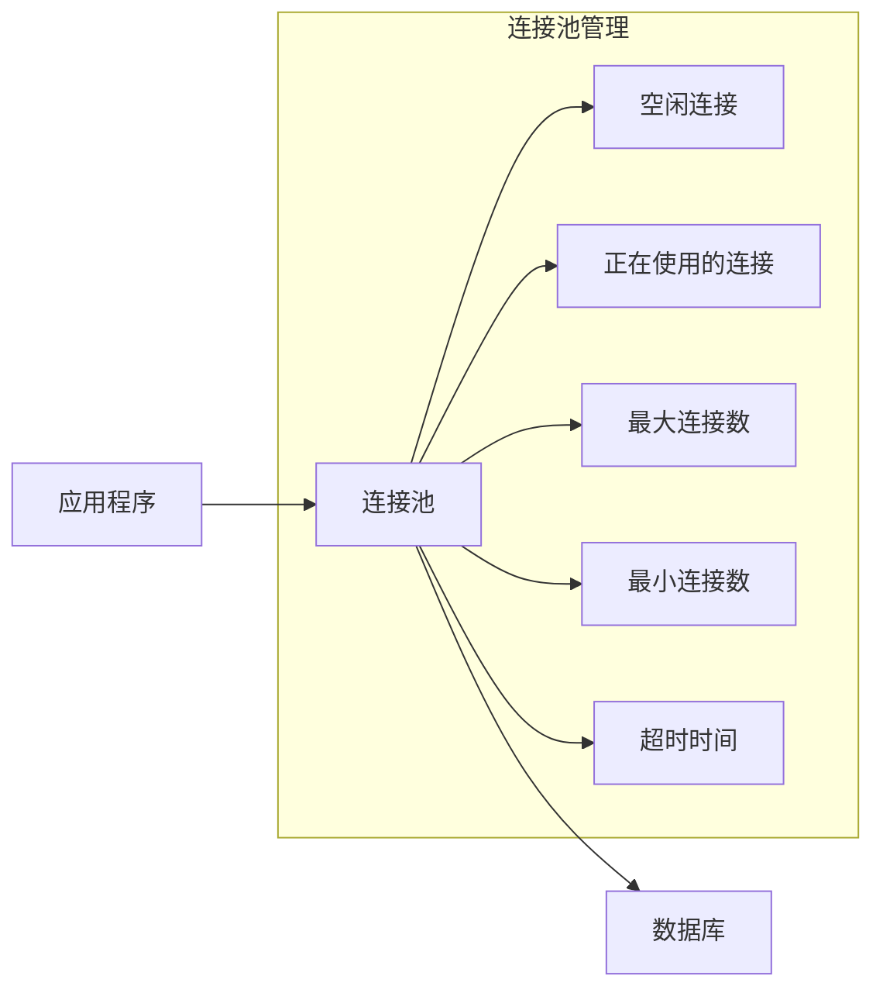

<Tabs>
  <TabItem value="hikari" label="HikariCP配置" default>
  ```java
  @Configuration
  public class HikariConfig {
      
      @Bean
      public DataSource dataSource() {
          com.zaxxer.hikari.HikariConfig config = new com.zaxxer.hikari.HikariConfig();
          config.setJdbcUrl("jdbc:mysql://localhost:3306/mydb");
          config.setUsername("user");
          config.setPassword("password");
          config.setDriverClassName("com.mysql.cj.jdbc.Driver");
          
          // 连接池核心参数
          config.setMaximumPoolSize(20);
          config.setMinimumIdle(5);
          config.setIdleTimeout(30000);
          config.setConnectionTimeout(10000);
          config.setMaxLifetime(1800000);
          
          // 性能优化参数
          config.addDataSourceProperty("cachePrepStmts", "true");
          config.addDataSourceProperty("prepStmtCacheSize", "250");
          config.addDataSourceProperty("prepStmtCacheSqlLimit", "2048");
          config.addDataSourceProperty("useServerPrepStmts", "true");
          
          return new HikariDataSource(config);
      }
  }
  ```
  </TabItem>
  <TabItem value="dbcp2" label="DBCP2配置">
  ```java
  @Configuration
  public class Dbcp2Config {
      
      @Bean
      public DataSource dataSource() {
          BasicDataSource dataSource = new BasicDataSource();
          dataSource.setDriverClassName("com.mysql.cj.jdbc.Driver");
          dataSource.setUrl("jdbc:mysql://localhost:3306/mydb");
          dataSource.setUsername("user");
          dataSource.setPassword("password");
          
          // 连接池大小
          dataSource.setInitialSize(5);
          dataSource.setMaxTotal(20);
          dataSource.setMaxIdle(10);
          dataSource.setMinIdle(5);
          
          // 连接有效性检查
          dataSource.setTestOnBorrow(true);
          dataSource.setValidationQuery("SELECT 1");
          dataSource.setValidationQueryTimeout(5);
          
          // 连接回收参数
          dataSource.setMaxWaitMillis(10000);
          dataSource.setRemoveAbandonedTimeout(60);
          dataSource.setRemoveAbandonedOnBorrow(true);
          dataSource.setRemoveAbandonedOnMaintenance(true);
          
          return dataSource;
      }
  }
  ```
  </TabItem>
  <TabItem value="monitoring" label="连接池监控">
  ```java
  @Component
  @ManagedResource(objectName = "com.example:type=ConnectionPool")
  public class ConnectionPoolMonitor {
      
      private final HikariDataSource dataSource;
      
      public ConnectionPoolMonitor(DataSource dataSource) {
          this.dataSource = (HikariDataSource) dataSource;
      }
      
      @ManagedAttribute
      public int getTotalConnections() {
          return dataSource.getHikariPoolMXBean().getTotalConnections();
      }
      
      @ManagedAttribute
      public int getActiveConnections() {
          return dataSource.getHikariPoolMXBean().getActiveConnections();
      }
      
      @ManagedAttribute
      public int getIdleConnections() {
          return dataSource.getHikariPoolMXBean().getIdleConnections();
      }
      
      @ManagedAttribute
      public int getThreadsAwaitingConnection() {
          return dataSource.getHikariPoolMXBean().getThreadsAwaitingConnection();
      }
      
      @Scheduled(fixedRate = 60000)
      public void logPoolStats() {
          log.info("Connection Pool Stats - Total: {}, Active: {}, Idle: {}, Waiting: {}",
              getTotalConnections(), getActiveConnections(), getIdleConnections(), 
              getThreadsAwaitingConnection());
      }
  }
  ```
  </TabItem>
</Tabs>

:::caution 连接池优化注意事项
1. **连接池大小**：根据硬件资源和并发量合理设置，通常`连接数 = ((CPU核心数 * 2) + 有效磁盘数)`
2. **最小空闲连接**：保持一定数量的空闲连接，减少连接创建开销
3. **连接超时**：设置合理的连接获取超时时间，避免线程长时间等待
4. **连接有效性检查**：定期检查连接有效性，但不要过于频繁
5. **预编译语句缓存**：启用预编译语句缓存，提高查询性能
6. **监控与告警**：实时监控连接池状态，及时发现问题
:::

## 5. 代码层面优化

### 5.1 异步编程

异步编程是提升系统吞吐量的重要手段，通过将阻塞操作异步化，可以提高系统资源利用率。

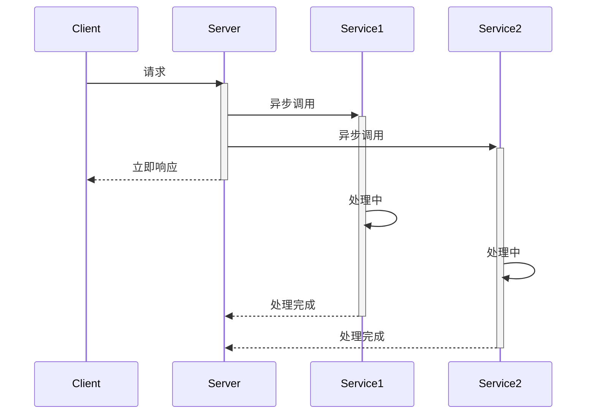

<Tabs>
  <TabItem value="completable-future" label="CompletableFuture" default>
  ```java
  @Service
  public class AsyncService {
      
      @Autowired
      private RestTemplate restTemplate;
      
      @Autowired
      private Executor executor;
      
      @Async
      public CompletableFuture<UserInfo> getUserInfo(Long userId) {
          return CompletableFuture.supplyAsync(() -> {
              // 模拟远程调用
              return restTemplate.getForObject(
                  "https://api.example.com/users/{id}", UserInfo.class, userId);
          }, executor);
      }
      
      @Async
      public CompletableFuture<List<Order>> getUserOrders(Long userId) {
          return CompletableFuture.supplyAsync(() -> {
              // 模拟远程调用
              return restTemplate.getForObject(
                  "https://api.example.com/users/{id}/orders", 
                  new ParameterizedTypeReference<List<Order>>() {}, 
                  userId);
          }, executor);
      }
      
      public CompletableFuture<UserDetails> getUserDetails(Long userId) {
          CompletableFuture<UserInfo> userInfoFuture = getUserInfo(userId);
          CompletableFuture<List<Order>> ordersFuture = getUserOrders(userId);
          
          return CompletableFuture.allOf(userInfoFuture, ordersFuture)
              .thenApply(v -> {
                  UserInfo userInfo = userInfoFuture.join();
                  List<Order> orders = ordersFuture.join();
                  return new UserDetails(userInfo, orders);
              });
      }
  }
  ```
  </TabItem>
  <TabItem value="reactive" label="Spring WebFlux">
  ```java
  @RestController
  @RequestMapping("/api/users")
  public class UserController {
      
      @Autowired
      private UserService userService;
      
      @GetMapping("/{id}")
      public Mono<UserDetails> getUserDetails(@PathVariable Long id) {
          Mono<UserInfo> userInfo = userService.getUserInfo(id);
          Mono<List<Order>> orders = userService.getUserOrders(id);
          
          return Mono.zip(userInfo, orders, UserDetails::new);
      }
  }
  
  @Service
  public class UserService {
      
      @Autowired
      private WebClient webClient;
      
      public Mono<UserInfo> getUserInfo(Long userId) {
          return webClient.get()
              .uri("https://api.example.com/users/{id}", userId)
              .retrieve()
              .bodyToMono(UserInfo.class);
      }
      
      public Mono<List<Order>> getUserOrders(Long userId) {
          return webClient.get()
              .uri("https://api.example.com/users/{id}/orders", userId)
              .retrieve()
              .bodyToFlux(Order.class)
              .collectList();
      }
  }
  ```
  </TabItem>
  <TabItem value="virtual-threads" label="Java虚拟线程">
  ```java
  @Service
  public class VirtualThreadService {
      
      @Autowired
      private UserRepository userRepository;
      
      @Autowired
      private OrderRepository orderRepository;
      
      // 使用Java 19+的虚拟线程
      public UserDetails getUserDetails(Long userId) throws ExecutionException, InterruptedException {
          try (var executor = Executors.newVirtualThreadPerTaskExecutor()) {
              Future<User> userFuture = executor.submit(() -> userRepository.findById(userId).orElse(null));
              Future<List<Order>> ordersFuture = executor.submit(() -> orderRepository.findByUserId(userId));
              
              User user = userFuture.get();
              List<Order> orders = ordersFuture.get();
              
              return new UserDetails(user, orders);
          }
      }
      
      // 处理大量并发请求
      public void processRequests(List<Long> userIds) {
          try (var executor = Executors.newVirtualThreadPerTaskExecutor()) {
              List<Future<UserDetails>> futures = userIds.stream()
                  .map(id -> executor.submit(() -> getUserDetailsBlocking(id)))
                  .collect(Collectors.toList());
                  
              for (Future<UserDetails> future : futures) {
                  UserDetails details = future.get();
                  processUserDetails(details);
              }
          }
      }
      
      private UserDetails getUserDetailsBlocking(Long userId) {
          User user = userRepository.findById(userId).orElse(null);
          List<Order> orders = orderRepository.findByUserId(userId);
          return new UserDetails(user, orders);
      }
      
      private void processUserDetails(UserDetails details) {
          // 处理用户详情
      }
  }
  ```
  </TabItem>
</Tabs>

### 5.2 并行处理

并行处理是充分利用多核CPU资源的重要方式，通过将任务分解为多个子任务并行执行，可以提高处理速度。

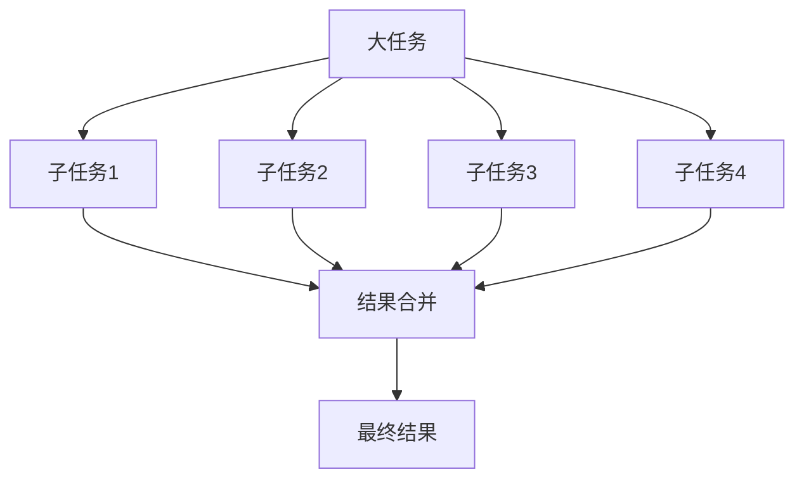

<Tabs>
  <TabItem value="parallel-stream" label="并行流" default>
  ```java
  @Service
  public class ParallelProcessingService {
      
      // 并行处理集合
      public List<ProcessedData> processDataParallel(List<RawData> dataList) {
          return dataList.parallelStream()
              .map(this::processData)
              .collect(Collectors.toList());
      }
      
      // 并行计算统计信息
      public Map<String, Double> calculateStatistics(List<SalesRecord> records) {
          DoubleSummaryStatistics stats = records.parallelStream()
              .mapToDouble(SalesRecord::getAmount)
              .summaryStatistics();
              
          Map<String, Double> result = new HashMap<>();
          result.put("sum", stats.getSum());
          result.put("average", stats.getAverage());
          result.put("max", stats.getMax());
          result.put("min", stats.getMin());
          
          return result;
      }
      
      // 分组处理
      public Map<String, List<Product>> groupProductsByCategory(List<Product> products) {
          return products.parallelStream()
              .collect(Collectors.groupingByConcurrent(Product::getCategory));
      }
      
      private ProcessedData processData(RawData data) {
          // 处理单个数据项的逻辑
          return new ProcessedData(data);
      }
  }
  ```
  </TabItem>
  <TabItem value="fork-join" label="Fork/Join框架">
  ```java
  @Component
  public class DataProcessingTask extends RecursiveTask<List<ProcessedData>> {
      
      private static final int THRESHOLD = 100;
      private final List<RawData> dataList;
      private final int start;
      private final int end;
      
      public DataProcessingTask(List<RawData> dataList, int start, int end) {
          this.dataList = dataList;
          this.start = start;
          this.end = end;
      }
      
      @Override
      protected List<ProcessedData> compute() {
          int length = end - start;
          
          if (length <= THRESHOLD) {
              // 小任务直接处理
              return processSequentially();
          }
          
          // 大任务分解为子任务
          int middle = start + length / 2;
          
          DataProcessingTask leftTask = new DataProcessingTask(dataList, start, middle);
          DataProcessingTask rightTask = new DataProcessingTask(dataList, middle, end);
          
          // 分叉执行子任务
          leftTask.fork();
          List<ProcessedData> rightResult = rightTask.compute();
          List<ProcessedData> leftResult = leftTask.join();
          
          // 合并结果
          List<ProcessedData> result = new ArrayList<>(leftResult);
          result.addAll(rightResult);
          return result;
      }
      
      private List<ProcessedData> processSequentially() {
          List<ProcessedData> result = new ArrayList<>();
          for (int i = start; i < end; i++) {
              result.add(processData(dataList.get(i)));
          }
          return result;
      }
      
      private ProcessedData processData(RawData data) {
          // 处理单个数据项的逻辑
          return new ProcessedData(data);
      }
  }
  
  @Service
  public class ForkJoinService {
      
      private final ForkJoinPool forkJoinPool = new ForkJoinPool();
      
      public List<ProcessedData> processDataParallel(List<RawData> dataList) {
          return forkJoinPool.invoke(new DataProcessingTask(dataList, 0, dataList.size()));
      }
  }
  ```
  </TabItem>
  <TabItem value="completable-future-batch" label="批量异步处理">
  ```java
  @Service
  public class BatchProcessingService {
      
      @Autowired
      private Executor executor;
      
      public List<ProcessedData> processDataInBatches(List<RawData> dataList, int batchSize) {
          // 分批处理
          List<List<RawData>> batches = splitIntoBatches(dataList, batchSize);
          
          // 创建每批数据的CompletableFuture
          List<CompletableFuture<List<ProcessedData>>> futures = batches.stream()
              .map(batch -> CompletableFuture.supplyAsync(() -> processBatch(batch), executor))
              .collect(Collectors.toList());
              
          // 等待所有批次完成并合并结果
          return CompletableFuture.allOf(futures.toArray(new CompletableFuture[0]))
              .thenApply(v -> futures.stream()
                  .flatMap(future -> future.join().stream())
                  .collect(Collectors.toList()))
              .join();
      }
      
      private List<ProcessedData> processBatch(List<RawData> batch) {
          return batch.stream()
              .map(this::processData)
              .collect(Collectors.toList());
      }
      
      private List<List<RawData>> splitIntoBatches(List<RawData> dataList, int batchSize) {
          List<List<RawData>> batches = new ArrayList<>();
          for (int i = 0; i < dataList.size(); i += batchSize) {
              int endIndex = Math.min(i + batchSize, dataList.size());
              batches.add(dataList.subList(i, endIndex));
          }
          return batches;
      }
      
      private ProcessedData processData(RawData data) {
          // 处理单个数据项的逻辑
          return new ProcessedData(data);
      }
  }
  ```
  </TabItem>
</Tabs>

### 5.3 内存优化

内存优化是提高系统性能和稳定性的重要方面，通过合理管理内存使用，可以避免内存泄漏和OOM错误。

<div className="card">
<div className="card__body">

内存优化的核心原则：

1. **对象重用**：避免频繁创建和销毁对象，尤其是大对象
2. **对象池化**：使用对象池重用昂贵的对象，如连接、线程等
3. **合理缓存**：缓存常用数据，但要设置合理的缓存大小
4. **避免内存泄漏**：正确关闭资源，避免强引用持有不再使用的对象
5. **内存分配优化**：减少大对象分配，避免频繁GC
6. **字符串优化**：合理使用字符串，避免频繁字符串拼接

</div>
</div>

<Tabs>
  <TabItem value="object-pool" label="对象池化" default>
  ```java
  @Configuration
  public class ObjectPoolConfig {
      
      @Bean
      public GenericObjectPool<ExpensiveObject> expensiveObjectPool() {
          GenericObjectPoolConfig<ExpensiveObject> config = new GenericObjectPoolConfig<>();
          config.setMaxTotal(20);
          config.setMaxIdle(10);
          config.setMinIdle(5);
          config.setTestOnBorrow(true);
          
          return new GenericObjectPool<>(new ExpensiveObjectFactory(), config);
      }
  }
  
  @Component
  public class ExpensiveObjectFactory extends BasePooledObjectFactory<ExpensiveObject> {
      
      @Override
      public ExpensiveObject create() {
          return new ExpensiveObject();
      }
      
      @Override
      public PooledObject<ExpensiveObject> wrap(ExpensiveObject obj) {
          return new DefaultPooledObject<>(obj);
      }
      
      @Override
      public void passivateObject(PooledObject<ExpensiveObject> p) {
          p.getObject().reset();
      }
      
      @Override
      public boolean validateObject(PooledObject<ExpensiveObject> p) {
          return p.getObject().isValid();
      }
  }
  
  @Service
  public class ObjectPoolService {
      
      @Autowired
      private GenericObjectPool<ExpensiveObject> objectPool;
      
      public void processWithPooledObject() {
          ExpensiveObject obj = null;
          try {
              obj = objectPool.borrowObject();
              obj.doSomething();
          } catch (Exception e) {
              log.error("Error borrowing object from pool", e);
          } finally {
              if (obj != null) {
                  objectPool.returnObject(obj);
              }
          }
      }
  }
  ```
  </TabItem>
  <TabItem value="string-optimization" label="字符串优化">
  ```java
  @Service
  public class StringOptimizationService {
      
      // 优化前：使用+拼接字符串
      public String concatenateBad(List<String> strings) {
          String result = "";
          for (String s : strings) {
              result = result + s;
          }
          return result;
      }
      
      // 优化后：使用StringBuilder
      public String concatenateGood(List<String> strings) {
          StringBuilder sb = new StringBuilder(strings.size() * 16); // 预估大小
          for (String s : strings) {
              sb.append(s);
          }
          return sb.toString();
      }
      
      // 优化后：使用StringJoiner
      public String joinStrings(List<String> strings, String delimiter) {
          StringJoiner joiner = new StringJoiner(delimiter);
          for (String s : strings) {
              joiner.add(s);
          }
          return joiner.toString();
      }
      
      // 优化后：使用String.join
      public String joinWithApi(List<String> strings, String delimiter) {
          return String.join(delimiter, strings);
      }
      
      // 优化后：使用流式API
      public String joinWithStream(List<String> strings, String delimiter) {
          return strings.stream().collect(Collectors.joining(delimiter));
      }
  }
  ```
  </TabItem>
  <TabItem value="memory-leaks" label="内存泄漏避免">
  ```java
  @Service
  public class MemoryLeakPreventionService {
      
      // 使用WeakHashMap防止内存泄漏
      private final Map<Object, Object> cache = Collections.synchronizedMap(new WeakHashMap<>());
      
      // 使用软引用缓存
      private final Map<String, SoftReference<byte[]>> dataCache = new ConcurrentHashMap<>();
      
      // 缓存数据，使用软引用
      public void cacheData(String key, byte[] data) {
          dataCache.put(key, new SoftReference<>(data));
      }
      
      // 获取缓存数据，处理引用被回收的情况
      public byte[] getData(String key) {
          SoftReference<byte[]> reference = dataCache.get(key);
          if (reference == null) {
              return null;
          }
          
          byte[] data = reference.get();
          if (data == null) {
              // 引用已被回收，从数据源重新加载
              dataCache.remove(key);
              return null;
          }
          
          return data;
      }
      
      // 使用try-with-resources自动关闭资源
      public String readFile(Path path) {
          try (BufferedReader reader = Files.newBufferedReader(path)) {
              return reader.lines().collect(Collectors.joining("\n"));
          } catch (IOException e) {
              log.error("Error reading file", e);
              return null;
          }
      }
      
      // 注意清理ThreadLocal变量
      private static final ThreadLocal<UserContext> userContext = ThreadLocal.withInitial(UserContext::new);
      
      public void processRequest() {
          try {
              userContext.get().setUser(getCurrentUser());
              // 处理请求
          } finally {
              // 清理ThreadLocal变量，防止内存泄漏
              userContext.remove();
          }
      }
  }
  ```
  </TabItem>
</Tabs>

## 6. 面试题精选

<details>
<summary>**Q: 如何提升系统的响应时间？**</summary>

**A:** 提升系统响应时间的方法包括：

1. **缓存优化**：
   - 使用多级缓存（本地缓存、分布式缓存）
   - 预热缓存，避免冷启动
   - 缓存热点数据，减少数据库访问

2. **数据库优化**：
   - 优化索引设计，确保查询使用索引
   - 优化SQL查询，避免全表扫描和复杂连接
   - 读写分离，减轻主库负担

3. **代码层面优化**：
   - 异步处理非实时操作
   - 优化算法，降低时间复杂度
   - 使用批处理代替单条处理

4. **网络优化**：
   - 使用CDN加速静态资源
   - 减少HTTP请求数量和大小
   - 启用HTTP/2和压缩

5. **JVM优化**：
   - 调整GC策略，减少停顿时间
   - 适当增加堆内存，减少GC频率
   - 使用JIT编译优化热点代码
</details>

<details>
<summary>**Q: 如何设计一个高性能的缓存系统？**</summary>

**A:** 设计高性能缓存系统的关键点：

1. **多级缓存架构**：
   - L1：本地内存缓存（Caffeine、Guava）
   - L2：分布式缓存（Redis、Memcached）
   - L3：持久化存储（数据库）

2. **缓存策略**：
   - 数据一致性策略：Cache-Aside、Read-Through、Write-Through等
   - 过期策略：TTL、LRU、LFU等
   - 预加载策略：系统启动时预热缓存

3. **缓存穿透、击穿、雪崩防护**：
   - 布隆过滤器预防缓存穿透
   - 互斥锁预防缓存击穿
   - 随机过期时间预防缓存雪崩

4. **监控与维护**：
   - 缓存命中率监控
   - 缓存容量和内存使用监控
   - 缓存自动扩容和收缩机制

5. **分布式场景考虑**：
   - 一致性哈希分片
   - 主从复制和故障转移
   - 跨区域数据同步
</details>

<details>
<summary>**Q: 什么是JVM性能调优？如何进行？**</summary>

**A:** JVM性能调优是优化Java虚拟机运行参数以提高应用性能的过程：

1. **内存分配调优**：
   - 设置合适的堆内存大小（-Xms、-Xmx）
   - 调整新生代和老年代比例（-XX:NewRatio）
   - 调整Eden区和Survivor区比例（-XX:SurvivorRatio）

2. **垃圾回收调优**：
   - 选择合适的垃圾收集器（Serial、Parallel、CMS、G1）
   - 调整GC触发阈值和频率
   - 设置GC日志和监控

3. **JIT编译优化**：
   - 启用方法内联（-XX:+Inline）
   - 优化逃逸分析（-XX:+DoEscapeAnalysis）
   - 调整代码缓存大小（-XX:ReservedCodeCacheSize）

4. **调优步骤**：
   - 收集性能数据：JVM堆转储、GC日志、线程快照
   - 分析问题：内存泄漏、GC频繁、线程阻塞等
   - 调整参数：根据分析结果调整JVM参数
   - 验证效果：性能测试对比调优前后差异
   - 持续优化：根据实际运行情况持续调优

5. **常用工具**：
   - JVisualVM：内存分析、线程分析
   - JMC（Java Mission Control）：实时监控
   - MAT（Memory Analyzer Tool）：堆转储分析
   - GCViewer：GC日志分析
</details>

<details>
<summary>**Q: 如何处理系统的性能瓶颈？**</summary>

**A:** 处理系统性能瓶颈的步骤：

1. **瓶颈识别**：
   - 监控系统各项指标（CPU、内存、磁盘I/O、网络I/O等）
   - 分析慢查询日志和性能追踪数据
   - 通过压力测试发现系统容量极限

2. **CPU瓶颈**：
   - 优化算法，降低时间复杂度
   - 使用并行处理提高CPU利用率
   - 引入缓存减少重复计算
   - 异步处理非实时任务

3. **内存瓶颈**：
   - 检查并修复内存泄漏
   - 优化对象创建和销毁，使用对象池
   - 调整JVM堆内存配置
   - 使用弱引用和软引用管理缓存

4. **磁盘I/O瓶颈**：
   - 使用缓存减少磁盘读取
   - 批量处理文件操作
   - 使用异步I/O和内存映射文件
   - 考虑使用SSD或分布式存储

5. **网络I/O瓶颈**：
   - 减少网络往返次数
   - 使用连接池复用连接
   - 压缩传输数据
   - 使用异步非阻塞I/O

6. **数据库瓶颈**：
   - 优化索引和SQL查询
   - 实施读写分离和分库分表
   - 使用数据库连接池
   - 引入缓存减少数据库访问

7. **水平扩展**：
   - 增加更多服务器实例
   - 实施负载均衡
   - 使用分布式架构
   - 引入服务网格和容器编排
</details>

:::tip 高性能系统设计要点
1. **全面监控**：建立完善的监控系统，及时发现性能问题
2. **算法优化**：选择合适的算法和数据结构，降低时间复杂度
3. **缓存策略**：合理使用多级缓存，减少重复计算和I/O操作
4. **并发处理**：充分利用多核CPU，提高系统吞吐量
5. **数据库优化**：索引设计、查询优化、分库分表等策略
6. **资源管理**：连接池、线程池、对象池等资源复用机制
7. **内存管理**：避免内存泄漏，优化对象创建和销毁
8. **异步处理**：使用异步编程模型，提高系统响应性能
:::

---

通过本章的学习，你应该已经掌握了高性能系统设计的核心概念和优化策略。高性能系统设计是一个持续优化的过程，需要不断监控、分析和改进。在实际项目中，应根据具体场景选择合适的优化方法，在性能、可用性、可维护性之间找到平衡点。
