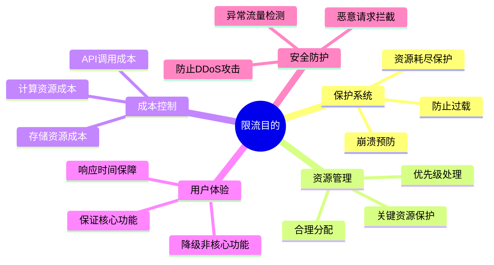
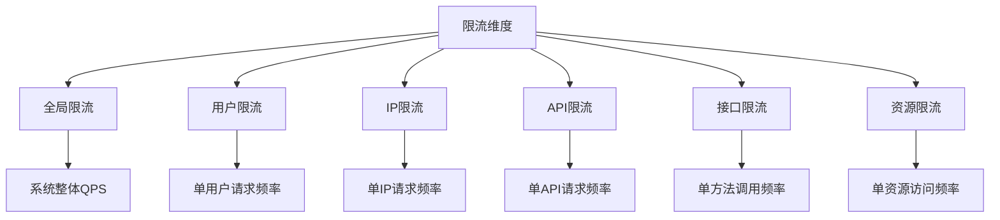
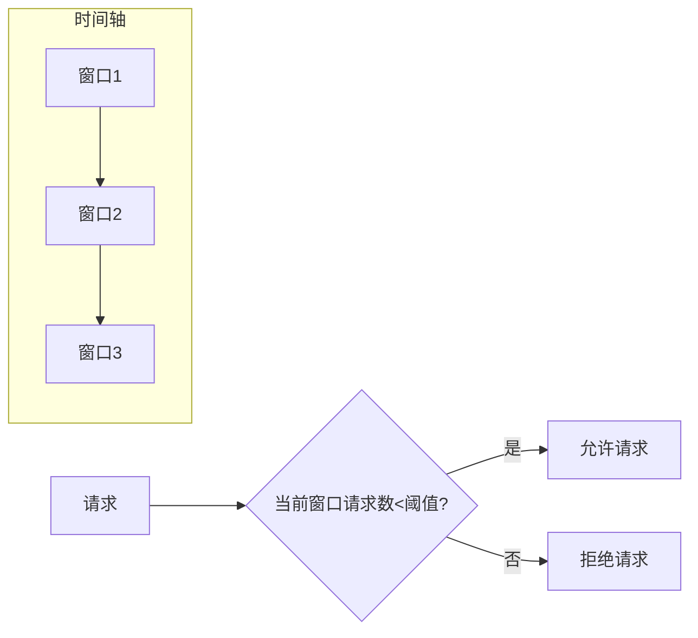
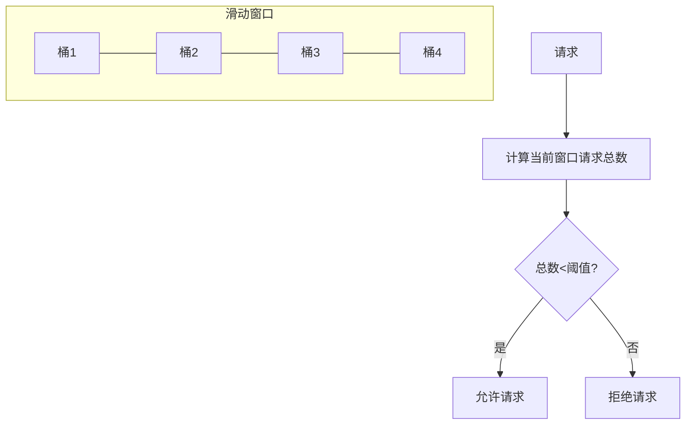
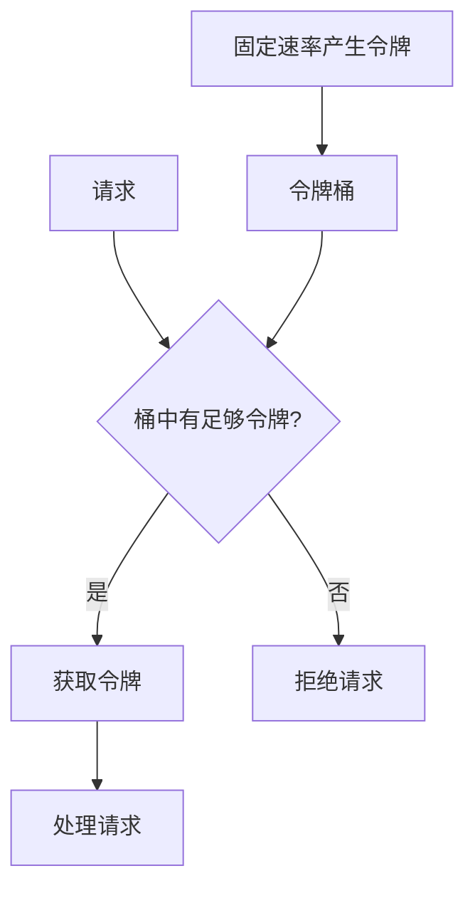
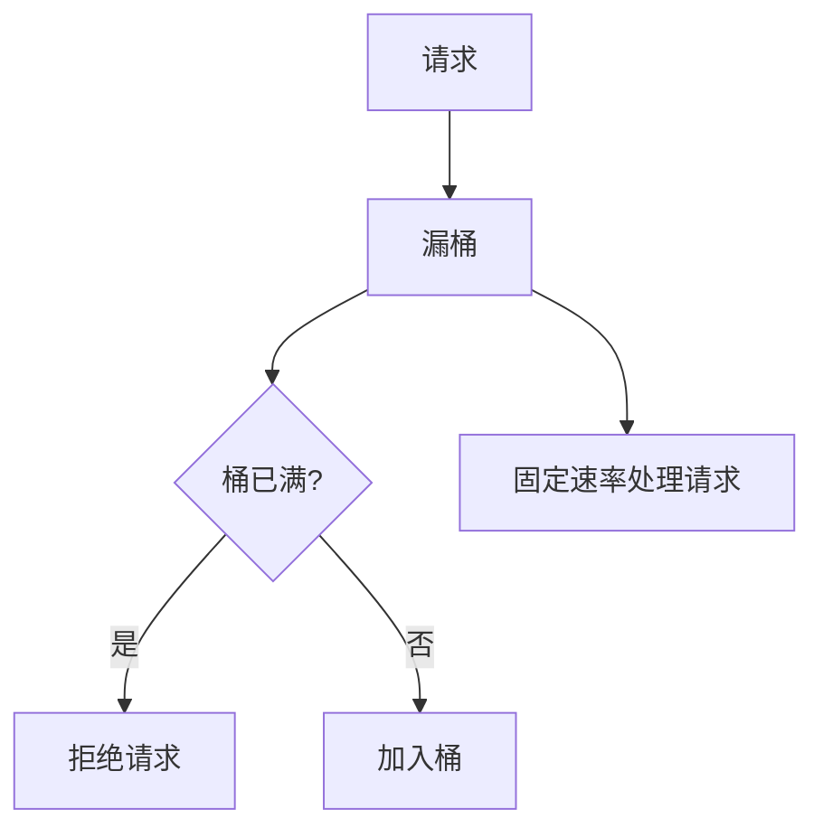

import Tabs from '@theme/Tabs';
import TabItem from '@theme/TabItem';
import TOCInline from '@theme/TOCInline';

# 限流系统设计

限流系统设计是保护系统免受流量冲击、确保系统稳定运行的重要技术。通过合理的限流算法和策略，可以有效控制请求流量，防止系统过载。

:::info 本文内容概览
<TOCInline toc={toc} />
:::

:::tip 核心价值
**限流 = 流量控制 + 系统保护 + 资源管理 + 用户体验 + 成本控制**
- 🚦 **流量控制**：调节请求流量，避免系统过载
- 🛡️ **系统保护**：防止系统崩溃，保证系统稳定性
- 📊 **资源管理**：合理分配系统资源，提高资源利用率
- 👤 **用户体验**：保证核心功能可用，提升用户满意度
- 💰 **成本控制**：降低资源成本，提高系统经济性
:::

## 1. 限流基础概念

### 1.1 限流目的



限流系统的主要目的：

| 目的 | 说明 | 实现方式 |
|------|------|----------|
| **保护系统** | 防止系统过载崩溃 | 限制请求数量 |
| **资源管理** | 合理分配系统资源 | 按优先级分配 |
| **成本控制** | 控制API调用成本 | 限制调用频率 |
| **用户体验** | 保证核心功能可用 | 降级非核心功能 |
| **安全防护** | 防止恶意攻击 | 异常流量检测 |

<Tabs>
  <TabItem value="config" label="限流配置" default>
  ```java
  @Configuration
  public class RateLimitConfig {
      
      @Value("${rate.limit.enabled:true}")
      private boolean rateLimitEnabled;
      
      @Value("${rate.limit.default.qps:100}")
      private int defaultQps;
      
      @Value("${rate.limit.default.burst:200}")
      private int defaultBurst;
      
      @Bean
      public RateLimiter rateLimiter() {
          return RateLimiter.create(defaultQps);
      }
      
      @Bean
      public RateLimitProperties rateLimitProperties() {
          RateLimitProperties properties = new RateLimitProperties();
          properties.setEnabled(rateLimitEnabled);
          properties.setDefaultQps(defaultQps);
          properties.setDefaultBurst(defaultBurst);
          return properties;
      }
  }
  ```
  </TabItem>
  <TabItem value="properties" label="属性配置">
  ```java
  @Component
  public class RateLimitProperties {
      private boolean enabled;
      private int defaultQps;
      private int defaultBurst;
      private Map<String, Integer> userLimits = new HashMap<>();
      private Map<String, Integer> apiLimits = new HashMap<>();
      
      // getter和setter方法
  }
  ```
  </TabItem>
</Tabs>

### 1.2 限流维度

<div className="card">
<div className="card__body">

限流可以从不同维度进行：

1. **全局限流**：对整个系统进行总体流量控制
2. **用户限流**：对单个用户的请求频率进行限制
3. **IP限流**：对来自特定IP地址的请求进行限制
4. **API限流**：对特定API接口的调用频率进行限制
5. **接口限流**：对特定接口方法的调用频率进行限制
6. **资源限流**：对特定资源的访问频率进行限制

</div>
</div>



<Tabs>
  <TabItem value="enum" label="维度定义" default>
  ```java
  public enum RateLimitDimension {
      // 全局限流
      GLOBAL("全局限流", "对整个系统进行限流"),
      
      // 用户限流
      USER("用户限流", "对单个用户进行限流"),
      
      // IP限流
      IP("IP限流", "对单个IP地址进行限流"),
      
      // API限流
      API("API限流", "对特定API接口进行限流"),
      
      // 接口限流
      INTERFACE("接口限流", "对特定接口方法进行限流"),
      
      // 资源限流
      RESOURCE("资源限流", "对特定资源进行限流");
      
      private final String name;
      private final String description;
      
      RateLimitDimension(String name, String description) {
          this.name = name;
          this.description = description;
      }
  }
  ```
  </TabItem>
  <TabItem value="manager" label="限流管理器">
  ```java
  @Component
  public class RateLimitManager {
      
      private final Map<RateLimitDimension, RateLimiter> limiters = new ConcurrentHashMap<>();
      
      public boolean isAllowed(RateLimitDimension dimension, String key) {
          RateLimiter limiter = getOrCreateLimiter(dimension, key);
          return limiter.tryAcquire();
      }
      
      private RateLimiter getOrCreateLimiter(RateLimitDimension dimension, String key) {
          String limiterKey = dimension.name() + ":" + key;
          return limiters.computeIfAbsent(dimension, k -> RateLimiter.create(100.0));
      }
  }
  ```
  </TabItem>
</Tabs>

## 2. 限流算法

:::info
限流算法是限流系统的核心，不同算法有不同的特点和适用场景。常见的限流算法包括固定窗口、滑动窗口、令牌桶和漏桶算法。
:::

<div className="card">
<div className="card__header">
<h4>限流算法对比</h4>
</div>
<div className="card__body">

| 算法 | 优点 | 缺点 | 适用场景 |
|-----|-----|-----|---------|
| **固定窗口** | 简单易实现、内存消耗少 | 边界突发流量问题 | 简单场景、低精度要求 |
| **滑动窗口** | 平滑限流效果、避免边界问题 | 实现复杂、内存消耗大 | 需要精确限流的场景 |
| **令牌桶** | 允许突发流量、灵活配置 | 实现较复杂 | 允许突发流量的场景 |
| **漏桶** | 固定速率处理、流量整形 | 无法应对突发流量 | 需要固定处理速率的场景 |

</div>
</div>

### 2.1 固定窗口算法

固定窗口算法将时间分为固定长度的窗口，在每个窗口内限制请求数量。



<Tabs>
  <TabItem value="fixed" label="固定窗口实现" default>
  ```java
  @Component
  public class FixedWindowRateLimiter {
      
      private final Map<String, WindowInfo> windows = new ConcurrentHashMap<>();
      private final int limit;
      private final long windowSize;
      
      public FixedWindowRateLimiter(int limit, long windowSize) {
          this.limit = limit;
          this.windowSize = windowSize;
      }
      
      public boolean isAllowed(String key) {
          long currentTime = System.currentTimeMillis();
          long windowStart = currentTime - (currentTime % windowSize);
          
          WindowInfo window = windows.compute(key, (k, v) -> {
              if (v == null || v.getWindowStart() != windowStart) {
                  return new WindowInfo(windowStart, 1);
              } else {
                  v.incrementCount();
                  return v;
              }
          });
          
          return window.getCount() <= limit;
      }
      
      public void reset(String key) {
          windows.remove(key);
      }
  }
  ```
  </TabItem>
  <TabItem value="window" label="窗口信息类">
  ```java
  class WindowInfo {
      private final long windowStart;
      private final AtomicInteger count;
      
      public WindowInfo(long windowStart, int initialCount) {
          this.windowStart = windowStart;
          this.count = new AtomicInteger(initialCount);
      }
      
      public long getWindowStart() { return windowStart; }
      public int getCount() { return count.get(); }
      public void incrementCount() { count.incrementAndGet(); }
  }
  ```
  </TabItem>
</Tabs>

:::caution 固定窗口算法的局限性
固定窗口算法在窗口边界可能导致突发流量问题。例如，在一个窗口的末尾和下一个窗口的开头，可能在短时间内通过两倍于阈值的请求。
:::

### 2.2 滑动窗口算法

滑动窗口算法通过将时间窗口分为多个小块，并随着时间推移滑动，提供更平滑的限流效果。



<details>
<summary>滑动窗口工作原理</summary>

1. **窗口分割**：将时间窗口分为多个小桶
2. **请求计数**：每个请求落入对应的时间桶
3. **窗口滑动**：随着时间推移，旧桶淘汰，新桶加入
4. **流量控制**：根据所有桶的请求总数决定是否允许请求

优点：
- 平滑处理请求，避免边界突发问题
- 提供更精确的流量控制
- 适应性强，可根据需求调整桶的数量和大小

</details>

<Tabs>
  <TabItem value="sliding" label="滑动窗口实现" default>
  ```java
  @Component
  public class SlidingWindowRateLimiter {
      
      private final Map<String, SlidingWindow> windows = new ConcurrentHashMap<>();
      private final int limit;
      private final long windowSize;
      private final int bucketCount;
      
      public SlidingWindowRateLimiter(int limit, long windowSize, int bucketCount) {
          this.limit = limit;
          this.windowSize = windowSize;
          this.bucketCount = bucketCount;
      }
      
      public boolean isAllowed(String key) {
          long currentTime = System.currentTimeMillis();
          SlidingWindow window = windows.computeIfAbsent(key, k -> 
              new SlidingWindow(windowSize, bucketCount));
          
          return window.isAllowed(currentTime, limit);
      }
      
      public void reset(String key) {
          windows.remove(key);
      }
  }
  ```
  </TabItem>
  <TabItem value="window-class" label="滑动窗口类">
  ```java
  class SlidingWindow {
      private final long windowSize;
      private final int bucketCount;
      private final long bucketSize;
      private final AtomicLong[] buckets;
      private final AtomicLong lastUpdateTime;
      
      public SlidingWindow(long windowSize, int bucketCount) {
          this.windowSize = windowSize;
          this.bucketCount = bucketCount;
          this.bucketSize = windowSize / bucketCount;
          this.buckets = new AtomicLong[bucketCount];
          this.lastUpdateTime = new AtomicLong(System.currentTimeMillis());
          
          for (int i = 0; i < bucketCount; i++) {
              buckets[i] = new AtomicLong(0);
          }
      }
      
      public boolean isAllowed(long currentTime, int limit) {
          updateBuckets(currentTime);
          
          long totalCount = 0;
          for (AtomicLong bucket : buckets) {
              totalCount += bucket.get();
          }
          
          if (totalCount < limit) {
              int bucketIndex = (int) ((currentTime / bucketSize) % bucketCount);
              buckets[bucketIndex].incrementAndGet();
              return true;
          }
          
          return false;
      }
      
      private void updateBuckets(long currentTime) {
          long lastTime = lastUpdateTime.get();
          if (currentTime - lastTime >= bucketSize) {
              long bucketIndex = (currentTime / bucketSize) % bucketCount;
              long lastBucketIndex = (lastTime / bucketSize) % bucketCount;
              
              // 清空过期的桶
              for (long i = (lastBucketIndex + 1) % bucketCount; i != bucketIndex; 
                   i = (i + 1) % bucketCount) {
                  buckets[(int) i].set(0);
              }
              
              lastUpdateTime.set(currentTime);
          }
      }
  }
  ```
  </TabItem>
</Tabs>

### 2.3 令牌桶算法

令牌桶算法通过以固定速率向桶中添加令牌，请求到达时需要获取令牌才能被处理。



<Tabs>
  <TabItem value="token" label="令牌桶实现" default>
  ```java
  @Component
  public class TokenBucketRateLimiter {
      
      private final Map<String, TokenBucket> buckets = new ConcurrentHashMap<>();
      private final double rate;
      private final int capacity;
      
      public TokenBucketRateLimiter(double rate, int capacity) {
          this.rate = rate;
          this.capacity = capacity;
      }
      
      public boolean isAllowed(String key) {
          TokenBucket bucket = buckets.computeIfAbsent(key, k -> new TokenBucket(rate, capacity));
          return bucket.tryConsume(1);
      }
      
      public boolean isAllowed(String key, int tokens) {
          TokenBucket bucket = buckets.computeIfAbsent(key, k -> new TokenBucket(rate, capacity));
          return bucket.tryConsume(tokens);
      }
      
      public void reset(String key) {
          buckets.remove(key);
      }
  }
  ```
  </TabItem>
  <TabItem value="bucket" label="令牌桶类">
  ```java
  class TokenBucket {
      private final double rate;
      private final int capacity;
      private final AtomicInteger tokens;
      private final AtomicLong lastRefillTime;
      
      public TokenBucket(double rate, int capacity) {
          this.rate = rate;
          this.capacity = capacity;
          this.tokens = new AtomicInteger(capacity);
          this.lastRefillTime = new AtomicLong(System.currentTimeMillis());
      }
      
      public boolean tryConsume(int requestedTokens) {
          refill();
          
          while (true) {
              int currentTokens = tokens.get();
              if (currentTokens < requestedTokens) {
                  return false;
              }
              
              if (tokens.compareAndSet(currentTokens, currentTokens - requestedTokens)) {
                  return true;
              }
          }
      }
      
      private void refill() {
          long now = System.currentTimeMillis();
          long lastRefill = lastRefillTime.get();
          long timePassed = now - lastRefill;
          
          if (timePassed > 0) {
              int newTokens = (int) (timePassed * rate / 1000);
              if (newTokens > 0) {
                  while (true) {
                      int currentTokens = tokens.get();
                      int newTotal = Math.min(currentTokens + newTokens, capacity);
                      
                      if (tokens.compareAndSet(currentTokens, newTotal)) {
                          lastRefillTime.addAndGet(timePassed);
                          break;
                      }
                  }
              }
          }
      }
  }
  ```
  </TabItem>
</Tabs>

:::tip 令牌桶特点
令牌桶算法的关键特点是能够处理突发流量。通过预先存储的令牌，可以允许短时间内的请求突发，同时通过固定速率的令牌产生来限制长期的请求速率。
:::

### 2.4 漏桶算法

漏桶算法以固定速率处理请求，多余的请求存储在桶中，如果桶满则拒绝新请求。



<details>
<summary>漏桶与令牌桶的区别</summary>

**漏桶算法**：
- 请求以固定速率处理
- 不允许突发流量
- 起到流量整形(Traffic Shaping)作用
- 确保系统以稳定的速率处理请求

**令牌桶算法**：
- 可以处理短时间的突发流量
- 长期平均速率受令牌产生速率限制
- 更加灵活，可以通过参数调整应对不同场景
- 适用于需要处理突发流量的场景

</details>

<Tabs>
  <TabItem value="leaky" label="漏桶实现" default>
  ```java
  @Component
  public class LeakyBucketRateLimiter {
      
      private final Map<String, LeakyBucket> buckets = new ConcurrentHashMap<>();
      private final double rate;
      private final int capacity;
      
      public LeakyBucketRateLimiter(double rate, int capacity) {
          this.rate = rate;
          this.capacity = capacity;
      }
      
      public boolean isAllowed(String key) {
          LeakyBucket bucket = buckets.computeIfAbsent(key, k -> new LeakyBucket(rate, capacity));
          return bucket.tryConsume();
      }
      
      public void reset(String key) {
          buckets.remove(key);
      }
  }
  ```
  </TabItem>
  <TabItem value="leaky-bucket" label="漏桶类">
  ```java
  class LeakyBucket {
      private final double rate;
      private final int capacity;
      private final AtomicInteger water;
      private final AtomicLong lastLeakTime;
      
      public LeakyBucket(double rate, int capacity) {
          this.rate = rate;
          this.capacity = capacity;
          this.water = new AtomicInteger(0);
          this.lastLeakTime = new AtomicLong(System.currentTimeMillis());
      }
      
      public boolean tryConsume() {
          leak();
          
          while (true) {
              int currentWater = water.get();
              if (currentWater >= capacity) {
                  return false;
              }
              
              if (water.compareAndSet(currentWater, currentWater + 1)) {
                  return true;
              }
          }
      }
      
      private void leak() {
          long now = System.currentTimeMillis();
          long lastLeak = lastLeakTime.get();
          long timePassed = now - lastLeak;
          
          if (timePassed > 0) {
              int leakedWater = (int) (timePassed * rate / 1000);
              if (leakedWater > 0) {
                  while (true) {
                      int currentWater = water.get();
                      int newWater = Math.max(0, currentWater - leakedWater);
                      
                      if (water.compareAndSet(currentWater, newWater)) {
                          lastLeakTime.set(now);
                          break;
                      }
                  }
              }
          }
      }
  }
  ```
  </TabItem>
</Tabs>

## 3. 限流策略

### 3.1 分级限流

```java title="分级限流实现"
@Component
public class TieredRateLimiter {
    
    private final Map<String, RateLimiter> limiters = new ConcurrentHashMap<>();
    private final RateLimitProperties properties;
    
    public TieredRateLimiter(RateLimitProperties properties) {
        this.properties = properties;
    }
    
    public boolean isAllowed(String key, RateLimitTier tier) {
        RateLimiter limiter = getOrCreateLimiter(key, tier);
        return limiter.tryAcquire();
    }
    
    private RateLimiter getOrCreateLimiter(String key, RateLimitTier tier) {
        String limiterKey = key + ":" + tier.name();
        return limiters.computeIfAbsent(limiterKey, k -> {
            double rate = getRateForTier(tier);
            return RateLimiter.create(rate);
        });
    }
    
    private double getRateForTier(RateLimitTier tier) {
        switch (tier) {
            case VIP:
                return 1000.0; // VIP用户：1000 QPS
            case PREMIUM:
                return 500.0;  // 高级用户：500 QPS
            case STANDARD:
                return 100.0;  // 普通用户：100 QPS
            case FREE:
                return 10.0;   // 免费用户：10 QPS
            default:
                return 10.0;
        }
    }
}

enum RateLimitTier {
    VIP,      // VIP用户
    PREMIUM,  // 高级用户
    STANDARD, // 普通用户
    FREE      // 免费用户
}
```

### 3.2 动态限流

```java title="动态限流实现"
@Component
public class DynamicRateLimiter {
    
    private final Map<String, RateLimiter> limiters = new ConcurrentHashMap<>();
    private final AtomicReference<Double> globalRate = new AtomicReference<>(100.0);
    
    @Scheduled(fixedRate = 5000)
    public void updateRateLimits() {
        // 根据系统负载动态调整限流
        double cpuUsage = getCpuUsage();
        double memoryUsage = getMemoryUsage();
        
        double newRate = calculateNewRate(cpuUsage, memoryUsage);
        globalRate.set(newRate);
        
        // 更新所有限流器
        limiters.values().forEach(limiter -> {
            // 注意：Guava的RateLimiter不支持动态修改速率
            // 这里需要重新创建限流器
        });
    }
    
    private double calculateNewRate(double cpuUsage, double memoryUsage) {
        double baseRate = 100.0;
        
        // CPU使用率超过80%，降低限流
        if (cpuUsage > 80) {
            baseRate *= 0.5;
        }
        
        // 内存使用率超过80%，降低限流
        if (memoryUsage > 80) {
            baseRate *= 0.5;
        }
        
        return Math.max(baseRate, 10.0); // 最低10 QPS
    }
    
    private double getCpuUsage() {
        OperatingSystemMXBean osBean = ManagementFactory.getOperatingSystemMXBean();
        if (osBean instanceof com.sun.management.OperatingSystemMXBean) {
            return ((com.sun.management.OperatingSystemMXBean) osBean).getCpuLoad() * 100;
        }
        return 0.0;
    }
    
    private double getMemoryUsage() {
        Runtime runtime = Runtime.getRuntime();
        long maxMemory = runtime.maxMemory();
        long usedMemory = runtime.totalMemory() - runtime.freeMemory();
        return (double) usedMemory / maxMemory * 100;
    }
}
```

## 4. 限流实现

### 4.1 注解式限流

```java title="限流注解实现"
@Target(ElementType.METHOD)
@Retention(RetentionPolicy.RUNTIME)
public @interface RateLimit {
    String key() default "";           // 限流键
    double qps() default 100.0;        // QPS限制
    int burst() default 200;           // 突发流量限制
    RateLimitDimension dimension() default RateLimitDimension.API;
    String fallback() default "";      // 降级方法
}

@Aspect
@Component
public class RateLimitAspect {
    
    private final Map<String, RateLimiter> limiters = new ConcurrentHashMap<>();
    
    @Around("@annotation(rateLimit)")
    public Object around(ProceedingJoinPoint point, RateLimit rateLimit) throws Throwable {
        String key = getRateLimitKey(point, rateLimit);
        RateLimiter limiter = getOrCreateLimiter(key, rateLimit.qps());
        
        if (limiter.tryAcquire()) {
            return point.proceed();
        } else {
            // 限流触发，执行降级逻辑
            return executeFallback(point, rateLimit);
        }
    }
    
    private String getRateLimitKey(ProceedingJoinPoint point, RateLimit rateLimit) {
        if (!rateLimit.key().isEmpty()) {
            return rateLimit.key();
        }
        
        // 自动生成key
        String methodName = point.getSignature().getName();
        String className = point.getTarget().getClass().getSimpleName();
        return className + ":" + methodName;
    }
    
    private RateLimiter getOrCreateLimiter(String key, double qps) {
        return limiters.computeIfAbsent(key, k -> RateLimiter.create(qps));
    }
    
    private Object executeFallback(ProceedingJoinPoint point, RateLimit rateLimit) throws Throwable {
        if (!rateLimit.fallback().isEmpty()) {
            // 调用降级方法
            Method fallbackMethod = findFallbackMethod(point, rateLimit.fallback());
            if (fallbackMethod != null) {
                return fallbackMethod.invoke(point.getTarget(), point.getArgs());
            }
        }
        
        // 默认降级：抛出限流异常
        throw new RateLimitExceededException("请求频率超限");
    }
    
    private Method findFallbackMethod(ProceedingJoinPoint point, String fallbackMethodName) {
        try {
            return point.getTarget().getClass().getMethod(fallbackMethodName);
        } catch (NoSuchMethodException e) {
            return null;
        }
    }
}

// 使用示例
@RestController
public class UserController {
    
    @RateLimit(qps = 100, dimension = RateLimitDimension.USER)
    @GetMapping("/users/{id}")
    public User getUser(@PathVariable Long id) {
        return userService.getUserById(id);
    }
    
    @RateLimit(qps = 10, fallback = "getUserFallback")
    @GetMapping("/users/{id}/detail")
    public UserDetail getUserDetail(@PathVariable Long id) {
        return userService.getUserDetail(id);
    }
    
    public UserDetail getUserFallback(Long id) {
        // 降级逻辑：返回基本信息
        return new UserDetail(id, "用户" + id, "基本信息");
    }
}
```

### 4.2 过滤器限流

```java title="过滤器限流实现"
@Component
public class RateLimitFilter implements Filter {
    
    private final RateLimiter rateLimiter;
    private final ObjectMapper objectMapper;
    
    public RateLimitFilter() {
        this.rateLimiter = RateLimiter.create(100.0); // 100 QPS
        this.objectMapper = new ObjectMapper();
    }
    
    @Override
    public void doFilter(ServletRequest request, ServletResponse response, FilterChain chain)
            throws IOException, ServletException {
        
        HttpServletRequest httpRequest = (HttpServletRequest) request;
        HttpServletResponse httpResponse = (HttpServletResponse) response;
        
        // 获取限流键
        String key = getRateLimitKey(httpRequest);
        
        if (rateLimiter.tryAcquire()) {
            chain.doFilter(request, response);
        } else {
            // 限流响应
            sendRateLimitResponse(httpResponse);
        }
    }
    
    private String getRateLimitKey(HttpServletRequest request) {
        // 基于IP的限流
        String ip = getClientIp(request);
        
        // 基于用户的限流
        String userId = getUserId(request);
        
        // 基于API的限流
        String api = request.getRequestURI();
        
        return String.format("%s:%s:%s", ip, userId, api);
    }
    
    private String getClientIp(HttpServletRequest request) {
        String xForwardedFor = request.getHeader("X-Forwarded-For");
        if (xForwardedFor != null && !xForwardedFor.isEmpty()) {
            return xForwardedFor.split(",")[0].trim();
        }
        return request.getRemoteAddr();
    }
    
    private String getUserId(HttpServletRequest request) {
        // 从请求头或参数中获取用户ID
        String userId = request.getHeader("X-User-ID");
        if (userId == null) {
            userId = request.getParameter("userId");
        }
        return userId != null ? userId : "anonymous";
    }
    
    private void sendRateLimitResponse(HttpServletResponse response) throws IOException {
        response.setStatus(HttpStatus.TOO_MANY_REQUESTS.value());
        response.setContentType("application/json");
        
        Map<String, Object> result = new HashMap<>();
        result.put("code", 429);
        result.put("message", "请求频率超限，请稍后重试");
        result.put("timestamp", System.currentTimeMillis());
        
        response.getWriter().write(objectMapper.writeValueAsString(result));
    }
}
```

## 5. 限流监控

### 5.1 限流统计

```java title="限流统计实现"
@Component
public class RateLimitStatistics {
    
    private final Map<String, AtomicLong> requestCounts = new ConcurrentHashMap<>();
    private final Map<String, AtomicLong> limitCounts = new ConcurrentHashMap<>();
    private final Map<String, AtomicLong> totalCounts = new ConcurrentHashMap<>();
    
    public void recordRequest(String key, boolean limited) {
        requestCounts.computeIfAbsent(key, k -> new AtomicLong()).incrementAndGet();
        totalCounts.computeIfAbsent(key, k -> new AtomicLong()).incrementAndGet();
        
        if (limited) {
            limitCounts.computeIfAbsent(key, k -> new AtomicLong()).incrementAndGet();
        }
    }
    
    public RateLimitStats getStats(String key) {
        long requests = requestCounts.getOrDefault(key, new AtomicLong()).get();
        long limits = limitCounts.getOrDefault(key, new AtomicLong()).get();
        long total = totalCounts.getOrDefault(key, new AtomicLong()).get();
        
        double limitRate = total > 0 ? (double) limits / total * 100 : 0;
        
        return new RateLimitStats(key, requests, limits, total, limitRate);
    }
    
    public Map<String, RateLimitStats> getAllStats() {
        Map<String, RateLimitStats> stats = new HashMap<>();
        
        for (String key : totalCounts.keySet()) {
            stats.put(key, getStats(key));
        }
        
        return stats;
    }
    
    @Scheduled(fixedRate = 60000) // 每分钟重置计数器
    public void resetCounters() {
        requestCounts.clear();
        limitCounts.clear();
    }
}

class RateLimitStats {
    private final String key;
    private final long requests;
    private final long limits;
    private final long total;
    private final double limitRate;
    
    // 构造函数和getter方法
}
```

### 5.2 限流告警

```java title="限流告警实现"
@Component
public class RateLimitAlert {
    
    @Autowired
    private RateLimitStatistics statistics;
    
    @Autowired
    private EmailService emailService;
    
    @Value("${rate.limit.alert.threshold:80}")
    private double alertThreshold;
    
    @Scheduled(fixedRate = 30000) // 每30秒检查一次
    public void checkRateLimitAlert() {
        Map<String, RateLimitStats> stats = statistics.getAllStats();
        
        for (RateLimitStats stat : stats.values()) {
            if (stat.getLimitRate() > alertThreshold) {
                sendAlert(stat);
            }
        }
    }
    
    private void sendAlert(RateLimitStats stat) {
        String subject = "限流告警";
        String message = String.format(
            "限流键: %s\n" +
            "请求总数: %d\n" +
            "限流次数: %d\n" +
            "限流率: %.2f%%\n" +
            "时间: %s",
            stat.getKey(),
            stat.getTotal(),
            stat.getLimits(),
            stat.getLimitRate(),
            new Date()
        );
        
        try {
            emailService.sendAlertEmail(subject, message);
        } catch (Exception e) {
            log.error("发送限流告警失败", e);
        }
    }
}
```

## 6. 面试题精选

### 6.1 基础概念题

**Q: 什么是限流？为什么需要限流？**

A: 限流是指控制系统访问频率的技术。需要限流的原因：
- **保护系统**：防止系统过载崩溃
- **资源管理**：合理分配系统资源
- **成本控制**：控制API调用成本
- **用户体验**：保证核心功能可用
- **安全防护**：防止恶意攻击

**Q: 常见的限流算法有哪些？各有什么特点？**

A: 常见的限流算法：
- **固定窗口**：简单易实现，但存在临界问题
- **滑动窗口**：解决临界问题，但实现复杂
- **令牌桶**：支持突发流量，适合流量整形
- **漏桶**：平滑流量，但不支持突发流量

### 6.2 算法实现题

**Q: 如何实现令牌桶算法？**

A: 令牌桶算法实现步骤：
- **初始化**：设置令牌生成速率和桶容量
- **令牌生成**：按速率向桶中添加令牌
- **请求处理**：从桶中取出令牌处理请求
- **限流判断**：桶中令牌不足时拒绝请求

**Q: 如何实现滑动窗口算法？**

A: 滑动窗口算法实现步骤：
- **分桶**：将时间窗口分为多个小桶
- **计数**：在每个桶中记录请求数量
- **滑动**：根据当前时间更新窗口
- **统计**：统计窗口内所有桶的请求总数

### 6.3 实际应用题

**Q: 如何设计一个分布式限流系统？**

A: 分布式限流系统设计：
- **集中式存储**：使用Redis存储限流状态
- **分布式协调**：使用Zookeeper或Consul
- **一致性保证**：使用分布式锁或原子操作
- **故障处理**：降级到本地限流
- **监控告警**：实时监控限流状态

**Q: 如何实现动态限流？**

A: 动态限流实现方法：
- **系统监控**：监控CPU、内存、网络等指标
- **动态调整**：根据系统负载调整限流参数
- **配置中心**：使用配置中心动态修改限流规则
- **机器学习**：使用ML算法预测和调整限流

:::tip 限流学习要点
1. **理解限流概念**：掌握限流的目的、维度和策略
2. **掌握限流算法**：学会固定窗口、滑动窗口、令牌桶、漏桶算法
3. **熟悉实现方式**：了解注解式、过滤器式、中间件式限流
4. **学会监控告警**：掌握限流统计、监控、告警机制
5. **了解最佳实践**：学习业界成熟的限流方案
:::

---

通过本章的学习，你应该已经掌握了限流系统设计的核心概念、算法实现和最佳实践。限流系统设计是保护系统稳定运行的重要技术，掌握这些技术可以帮助你构建出健壮的系统。在实际项目中，合理运用限流技术可以有效防止系统过载，保证服务质量。 