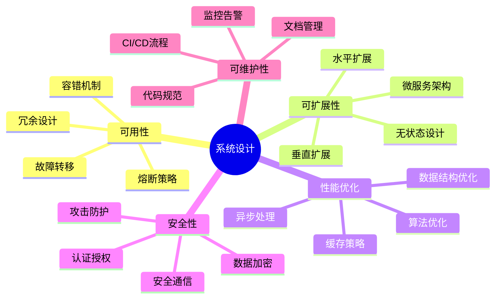
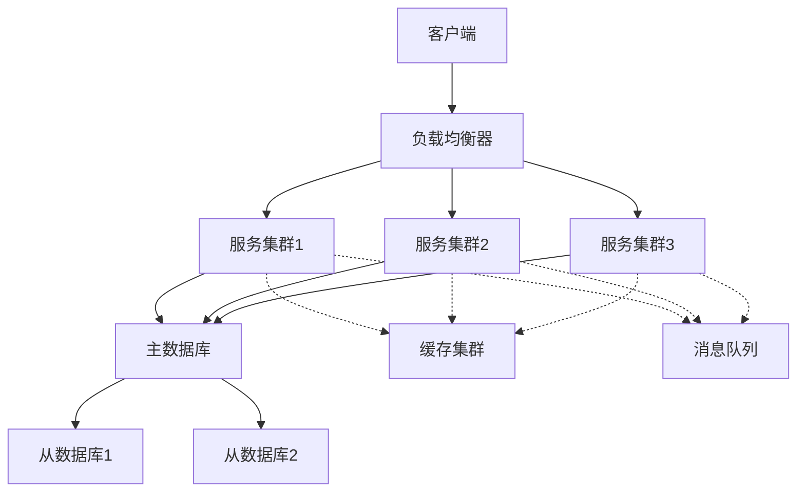
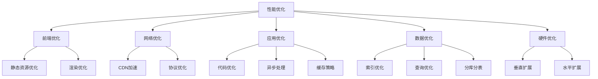
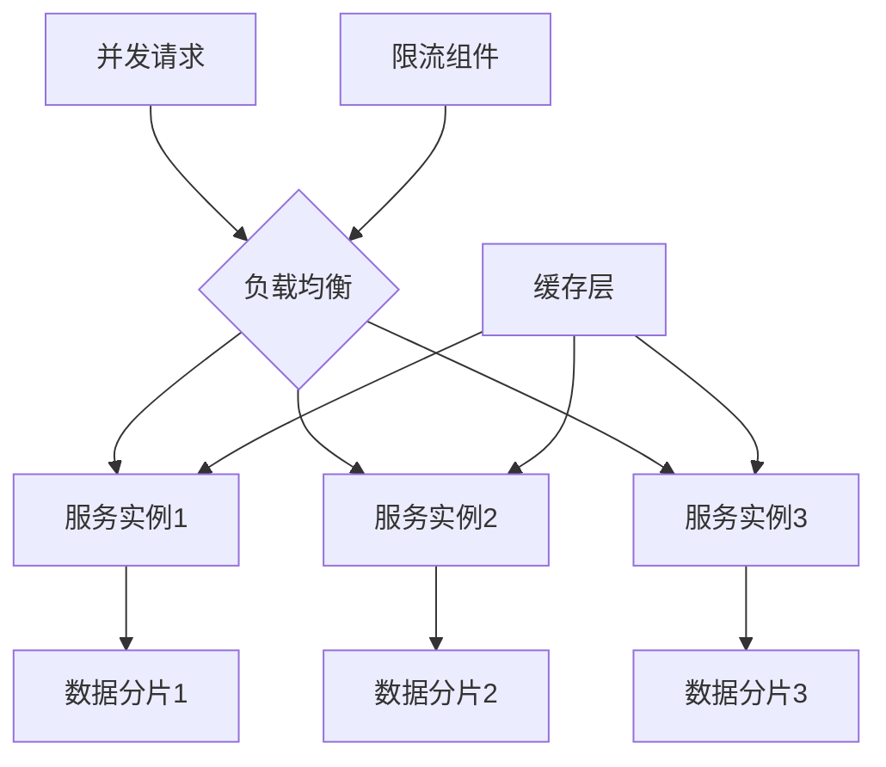
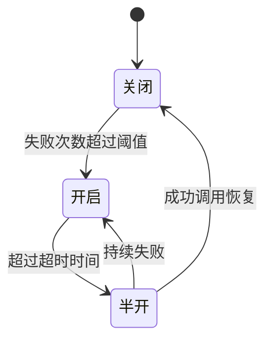
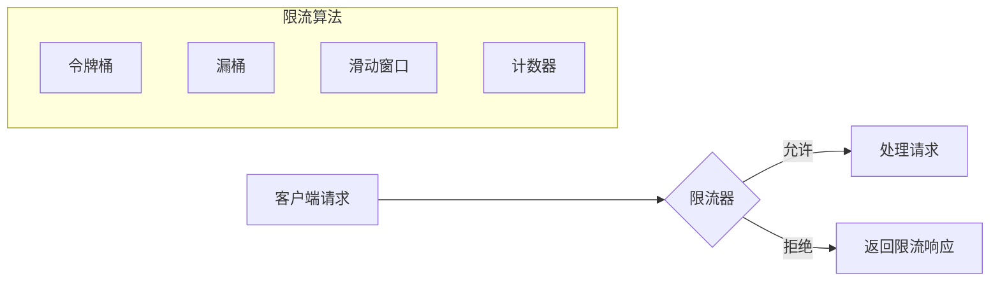
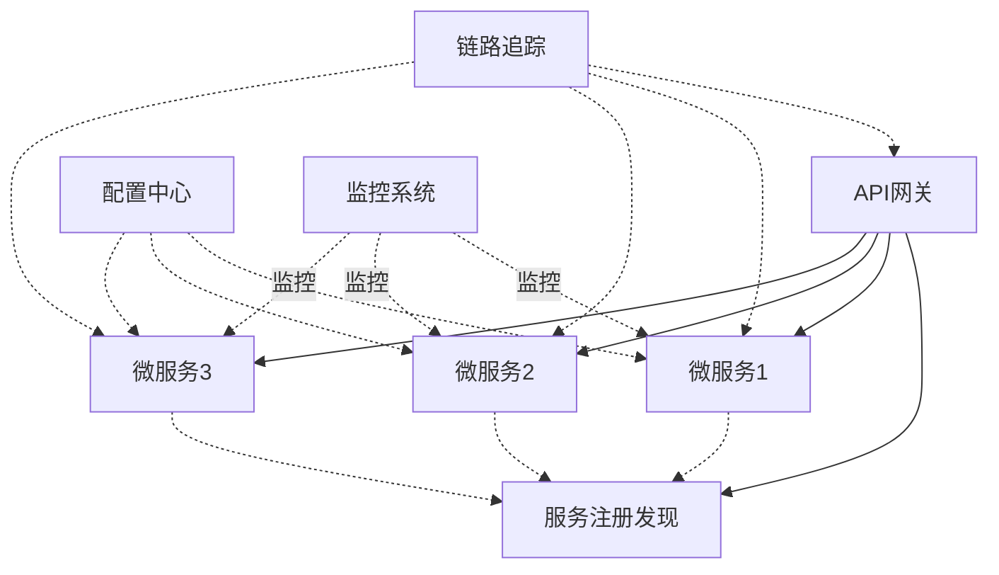
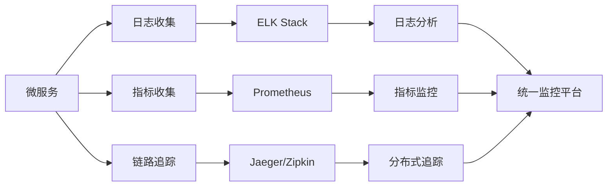

import Tabs from '@theme/Tabs';
import TabItem from '@theme/TabItem';
import TOCInline from '@theme/TOCInline';

# 系统设计总结

本文总结了系统设计中的核心概念、关键技术和最佳实践，帮助你掌握构建高可用、高性能、高并发系统的方法。

:::info 本文内容概览
<TOCInline toc={toc} />
:::

## 1. 系统设计核心概念



系统设计是构建大规模软件系统的艺术和科学，需要考虑多个关键维度：

<div className="card">
<div className="card__body">

1. **可用性 (Availability)**：系统持续提供服务的能力
2. **可扩展性 (Scalability)**：系统应对增长的能力
3. **性能 (Performance)**：系统响应速度和吞吐量
4. **可靠性 (Reliability)**：系统在规定条件下正常运行的能力
5. **安全性 (Security)**：系统抵御攻击和保护数据的能力
6. **可维护性 (Maintainability)**：系统易于修改和扩展的能力

</div>
</div>

## 2. 高可用系统设计

高可用系统设计是确保系统能够持续提供服务，即使在面对故障和挑战时也能保持运行。

### 2.1 可用性级别

<Tabs>
  <TabItem value="levels" label="可用性级别" default>
  
| 可用性级别 | 年度停机时间 | 描述 |
|-----------|-------------|------|
| 99% | 87.6小时 | 基本可用 |
| 99.9% | 8.76小时 | 高可用 |
| 99.99% | 52.56分钟 | 很高可用 |
| 99.999% | 5.26分钟 | 极高可用 |
| 99.9999% | 31.5秒 | 接近完全可用 |

  </TabItem>
  <TabItem value="calculation" label="可用性计算">
  ```
  可用性 = (总时间 - 故障时间) / 总时间
  MTBF (平均故障间隔时间) = 总运行时间 / 故障次数
  MTTR (平均故障修复时间) = 总修复时间 / 故障次数
  ```
  </TabItem>
</Tabs>

### 2.2 高可用架构模式



<details>
<summary>高可用架构要点</summary>

1. **冗余设计**
   - 硬件冗余：多服务器、多机房、异地多活
   - 软件冗余：多实例、多副本、备份恢复

2. **故障转移**
   - 自动检测：健康检查、心跳机制
   - 快速切换：主备切换、负载均衡

3. **数据一致性**
   - 强一致性：同步复制
   - 最终一致性：异步复制
   - CAP理论权衡

4. **监控告警**
   - 系统监控：CPU、内存、磁盘、网络
   - 业务监控：接口延迟、错误率
   - 智能告警：阈值告警、趋势告警

</details>

:::tip 高可用设计核心原则
1. **消除单点故障**：系统中的每个组件都应该有冗余
2. **可靠的跨区域复制**：数据和服务在地理上分散
3. **自动化故障检测与恢复**：减少人工干预
4. **优雅降级**：在部分组件故障时保持核心功能可用
5. **可测试性**：定期进行故障演练和恢复测试
:::

## 3. 高性能系统设计

高性能系统设计旨在优化系统的响应时间、吞吐量和资源利用率。

### 3.1 性能指标

| 指标 | 说明 | 优化方向 |
|------|------|----------|
| **响应时间** | 请求得到响应的时间 | 越低越好 |
| **吞吐量** | 单位时间内处理的请求数 | 越高越好 |
| **并发用户数** | 系统同时支持的活跃用户 | 越高越好 |
| **资源利用率** | CPU、内存等资源的使用效率 | 合理均衡 |
| **延迟** | 请求在系统中传输的时间 | 越低越好 |

### 3.2 性能优化策略



<Tabs>
  <TabItem value="cache" label="缓存策略" default>
  ```java
@Service
public class UserService {
    
      private final UserRepository userRepository;
      private final CacheManager cacheManager;
    
    public User getUserById(Long id) {
          // 先查缓存
          Cache cache = cacheManager.getCache("users");
          User user = cache.get(id, User.class);
        
        if (user == null) {
              // 缓存未命中，查询数据库
            user = userRepository.findById(id).orElse(null);
              
              // 放入缓存
            if (user != null) {
                  cache.put(id, user);
            }
        }
        
        return user;
    }
  }
  ```
  </TabItem>
  <TabItem value="async" label="异步处理">
  ```java
  @Service
  public class NotificationService {
      
      private final KafkaTemplate<String, String> kafkaTemplate;
      private final ObjectMapper objectMapper;
      
      public void sendNotification(Notification notification) {
          try {
              // 异步发送通知
              String message = objectMapper.writeValueAsString(notification);
              kafkaTemplate.send("notifications", message);
          } catch (Exception e) {
              log.error("Failed to send notification", e);
          }
      }
      
      @KafkaListener(topics = "notifications")
      public void processNotification(String message) {
          try {
              Notification notification = objectMapper.readValue(message, Notification.class);
              // 处理通知逻辑
              doSendNotification(notification);
          } catch (Exception e) {
              log.error("Failed to process notification", e);
          }
      }
  }
  ```
  </TabItem>
</Tabs>

## 4. 高并发系统设计

高并发系统设计关注系统同时处理大量并发请求的能力。

### 4.1 并发挑战

<div className="card">
<div className="card__body">

1. **资源竞争**：多个线程/进程争夺同一资源
2. **死锁**：两个或多个操作互相等待对方释放资源
3. **一致性**：确保数据在并发访问中保持一致
4. **性能瓶颈**：系统中限制并发处理能力的短板
5. **扩展性**：系统随并发增长而扩展的能力

</div>
</div>

### 4.2 并发处理策略



<Tabs>
  <TabItem value="scaling" label="水平扩展" default>
  ```java
  @Configuration
  public class ServiceConfig {
      
      @Value("${service.instance.count}")
      private int instanceCount;
      
      @Bean
      public LoadBalancerClient loadBalancerClient() {
          List<ServiceInstance> instances = new ArrayList<>();
          
          for (int i = 0; i < instanceCount; i++) {
              instances.add(new DefaultServiceInstance(
                  "service-" + i,
                  "service",
                  "localhost",
                  8080 + i,
                  false
              ));
          }
          
          return new RoundRobinLoadBalancerClient(instances);
      }
  }
  ```
  </TabItem>
  <TabItem value="sharding" label="数据分片">
  ```java
  @Component
  public class ShardingStrategy {
      
      private final int shardCount;
      
      public ShardingStrategy(@Value("${db.shard.count}") int shardCount) {
          this.shardCount = shardCount;
      }
      
      public int getShardId(String key) {
          return Math.abs(key.hashCode()) % shardCount;
      }
      
      public DataSource getDataSourceByShard(String key) {
          int shardId = getShardId(key);
          return getDataSourceById(shardId);
      }
      
      private DataSource getDataSourceById(int shardId) {
          // 返回对应分片的数据源
          return null; // 实际实现中返回真实的数据源
      }
  }
  ```
  </TabItem>
</Tabs>

## 5. 容错与弹性设计

容错与弹性设计确保系统能够在面对故障和压力时保持稳定运行。

### 5.1 熔断器模式

熔断器模式防止系统调用失败的服务，避免级联故障。



<details>
<summary>熔断器实现示例</summary>

```java
@Component
public class CircuitBreaker {
    
    private final String name;
    private final AtomicReference<CircuitBreakerState> state = new AtomicReference<>(CircuitBreakerState.CLOSED);
    private final AtomicInteger failureCount = new AtomicInteger(0);
    private final AtomicLong lastFailureTime = new AtomicLong(0);
    
    private final int failureThreshold;
    private final long timeout;
    
    public CircuitBreaker(String name, int failureThreshold, long timeout) {
        this.name = name;
        this.failureThreshold = failureThreshold;
        this.timeout = timeout;
    }
    
    public <T> T execute(Supplier<T> supplier) throws CircuitBreakerOpenException {
        if (isOpen()) {
            throw new CircuitBreakerOpenException("Circuit breaker is open for " + name);
        }
        
        try {
            T result = supplier.get();
            reset();
            return result;
        } catch (Exception e) {
            recordFailure();
            throw e;
        }
    }
    
    private boolean isOpen() {
        CircuitBreakerState currentState = state.get();
        
        if (currentState == CircuitBreakerState.OPEN) {
            long now = System.currentTimeMillis();
            if (now - lastFailureTime.get() > timeout) {
                // 尝试半开状态
                state.compareAndSet(CircuitBreakerState.OPEN, CircuitBreakerState.HALF_OPEN);
                return false;
            }
            return true;
        }
        
        return false;
    }
    
    private void recordFailure() {
        CircuitBreakerState currentState = state.get();
        lastFailureTime.set(System.currentTimeMillis());
        
        if (currentState == CircuitBreakerState.CLOSED) {
            if (failureCount.incrementAndGet() >= failureThreshold) {
                state.compareAndSet(CircuitBreakerState.CLOSED, CircuitBreakerState.OPEN);
            }
        } else if (currentState == CircuitBreakerState.HALF_OPEN) {
            state.compareAndSet(CircuitBreakerState.HALF_OPEN, CircuitBreakerState.OPEN);
        }
    }
    
    private void reset() {
        failureCount.set(0);
        if (state.get() == CircuitBreakerState.HALF_OPEN) {
            state.compareAndSet(CircuitBreakerState.HALF_OPEN, CircuitBreakerState.CLOSED);
        }
    }
}
```

</details>

### 5.2 降级策略

降级策略在系统压力大时放弃次要功能，保证核心功能可用。

<Tabs>
  <TabItem value="fallback" label="服务降级" default>
  ```java
  @Service
  public class ProductService {
      
      private final ProductRepository repository;
      private final CircuitBreaker circuitBreaker;
      private final Cache<Long, Product> cache;
      
      public Product getProductById(Long id) {
          try {
              return circuitBreaker.execute(() -> repository.findById(id).orElse(null));
          } catch (CircuitBreakerOpenException e) {
              return getFallbackProduct(id);
          }
      }
      
      private Product getFallbackProduct(Long id) {
          // 尝试从缓存获取
          Product cached = cache.getIfPresent(id);
          if (cached != null) {
              return cached;
          }
          
          // 返回默认产品
          return new Product(id, "默认产品", "暂时无法获取详细信息", 0.0);
    }
}
```
  </TabItem>
  <TabItem value="graceful" label="优雅降级">
  ```java
  @Component
  public class DegradationManager {
      
      private final AtomicInteger systemLoad = new AtomicInteger(0);
      
      // 定义降级级别
      public enum DegradationLevel {
          NONE,       // 正常服务
          LOW,        // 轻度降级
          MEDIUM,     // 中度降级
          HIGH,       // 高度降级
          EMERGENCY   // 紧急降级
      }
      
      // 获取当前降级级别
      public DegradationLevel getCurrentLevel() {
          int load = systemLoad.get();
          
          if (load < 50) {
              return DegradationLevel.NONE;
          } else if (load < 70) {
              return DegradationLevel.LOW;
          } else if (load < 85) {
              return DegradationLevel.MEDIUM;
          } else if (load < 95) {
              return DegradationLevel.HIGH;
          } else {
              return DegradationLevel.EMERGENCY;
          }
      }
      
      // 检查功能是否应该降级
      public boolean shouldDegrade(String feature, DegradationLevel featureLevel) {
          return getCurrentLevel().ordinal() >= featureLevel.ordinal();
    }
}
```
  </TabItem>
</Tabs>

### 5.3 限流保护

限流保护通过控制请求速率防止系统过载。



## 6. 微服务架构设计

微服务架构将系统拆分为小型、自治的服务，每个服务负责特定业务功能。

### 6.1 微服务优势与挑战

<div className="card">
<div className="card__header">
<h4>微服务优势</h4>
</div>
<div className="card__body">

- **技术异构性**：不同服务可以使用不同技术栈
- **弹性**：单个服务故障不会导致整体系统故障
- **可扩展性**：可以独立扩展单个服务
- **部署灵活**：支持持续部署和发布
- **团队自治**：小团队可以独立负责特定服务

</div>
</div>

<div className="card">
<div className="card__header">
<h4>微服务挑战</h4>
</div>
<div className="card__body">

- **分布式复杂性**：处理分布式系统的挑战
- **数据一致性**：跨服务事务难以保证
- **服务依赖管理**：处理服务间依赖和版本兼容
- **测试复杂度**：端到端测试变得更加困难
- **运维复杂度**：需要管理大量独立服务

</div>
</div>

### 6.2 微服务核心组件



<Tabs>
  <TabItem value="gateway" label="API网关" default>
  ```yaml
  spring:
    cloud:
      gateway:
        routes:
        - id: user-service
          uri: lb://user-service
          predicates:
          - Path=/api/users/**
          filters:
          - StripPrefix=1
          - name: CircuitBreaker
            args:
              name: userServiceCircuitBreaker
              fallbackUri: forward:/fallback/users
        - id: order-service
          uri: lb://order-service
          predicates:
          - Path=/api/orders/**
          filters:
          - StripPrefix=1
          - name: RateLimit
            args:
              redis-rate-limiter.replenishRate: 10
              redis-rate-limiter.burstCapacity: 20
  ```
  </TabItem>
  <TabItem value="discovery" label="服务发现">
  ```java
  @SpringBootApplication
  @EnableDiscoveryClient
  public class ServiceApplication {
  
      @Bean
      @LoadBalanced
      public RestTemplate restTemplate() {
          return new RestTemplate();
      }
  
      public static void main(String[] args) {
          SpringApplication.run(ServiceApplication.class, args);
      }
  }
  
  @Service
  public class UserClient {
      
      private final RestTemplate restTemplate;
      
      public User getUser(Long id) {
          return restTemplate.getForObject("http://user-service/users/{id}", User.class, id);
    }
}
```
  </TabItem>
</Tabs>

## 7. 系统监控与可观测性

### 7.1 监控指标

<Tabs>
  <TabItem value="system" label="系统监控" default>
    <ul>
      <li><strong>CPU使用率</strong>：处理器使用情况</li>
      <li><strong>内存使用率</strong>：内存使用情况</li>
      <li><strong>磁盘I/O</strong>：磁盘读写速率</li>
      <li><strong>网络流量</strong>：网络吞吐量</li>
      <li><strong>线程数</strong>：活跃线程数量</li>
    </ul>
  </TabItem>
  <TabItem value="application" label="应用监控">
    <ul>
      <li><strong>请求数</strong>：每秒请求数 (RPS)</li>
      <li><strong>响应时间</strong>：平均、95/99百分位响应时间</li>
      <li><strong>错误率</strong>：请求失败百分比</li>
      <li><strong>吞吐量</strong>：系统处理的业务量</li>
      <li><strong>并发用户数</strong>：同时活跃的用户数</li>
    </ul>
  </TabItem>
  <TabItem value="business" label="业务监控">
    <ul>
      <li><strong>转化率</strong>：业务流程完成率</li>
      <li><strong>订单量</strong>：每小时/天的订单数</li>
      <li><strong>支付成功率</strong>：支付成功比例</li>
      <li><strong>活跃用户数</strong>：DAU/MAU</li>
      <li><strong>平均订单金额</strong>：用户消费情况</li>
    </ul>
  </TabItem>
</Tabs>

### 7.2 日志、指标与追踪



## 8. 系统设计最佳实践

### 8.1 设计原则

<div className="card">
<div className="card__body">

1. **简单性**：保持系统设计简单，避免不必要的复杂性
2. **松耦合**：组件之间最小化依赖，提高系统灵活性
3. **高内聚**：相关功能应该组织在一起
4. **可测试性**：系统设计应便于测试
5. **可扩展性**：系统应能适应未来的增长
6. **容错设计**：预期会有故障并设计应对机制
7. **安全优先**：在设计之初就考虑安全性

</div>
</div>

### 8.2 架构决策记录

记录架构决策是保证系统长期可维护性的关键。

```markdown
# 架构决策记录 (ADR)

## 标题
使用Redis作为分布式缓存

## 状态
已接受

## 背景
系统需要一个高性能的分布式缓存解决方案来减轻数据库负载并提高响应时间。

## 决策
我们决定使用Redis作为分布式缓存解决方案。

## 原因
- 高性能：Redis是内存数据库，提供极高的读写性能
- 丰富的数据结构：支持字符串、哈希、列表等多种数据结构
- 持久化选项：支持RDB和AOF持久化
- 集群支持：可以构建高可用集群
- 社区活跃：有大量的文档和社区支持

## 替代方案
- Memcached：只支持简单键值存储，功能较少
- Hazelcast：Java原生但资源消耗较大
- Ehcache：主要用于单机场景

## 影响
- 需要管理额外的Redis服务器
- 需要处理缓存一致性问题
- 团队需要学习Redis的使用和运维

## 相关决策
- 数据库选型
- 缓存策略设计
```

:::tip 系统设计核心要点
1. **全面考虑**：从可用性、可扩展性、性能等多维度考虑系统设计
2. **预见变化**：设计系统时考虑未来的增长和变化
3. **适度设计**：不过度设计，也不欠设计，做到刚好够用
4. **持续优化**：系统设计是持续进行的过程，而非一次性工作
5. **学习借鉴**：学习成功的案例和模式，避免重复发明轮子
:::

---

通过本章的学习，你应该对系统设计的核心概念和关键技术有了全面的理解。在实际项目中，需要根据具体需求和约束条件，综合运用这些技术和最佳实践，设计出高质量的系统架构。系统设计是一个持续学习和改进的过程，不断实践和总结是提升系统设计能力的关键。 