# 🚀 自动部署完整指南

本项目已配置 **GitHub Actions 自动部署**，每次推送代码都会自动构建并发布到 GitHub Pages。

## 📋 部署系统概览

### 自动化流程

```mermaid
graph LR
    A[本地修改代码] --> B[Git Commit]
    B --> C[Git Push]
    C --> D[触发 GitHub Actions]
    D --> E[安装依赖]
    E --> F[构建网站]
    F --> G[部署到 gh-pages]
    G --> H[网站自动更新]
    
    style D fill:#667eea
    style H fill:#4ade80
```



### 技术栈

- **CI/CD**: GitHub Actions
- **构建工具**: Docusaurus 3.9.2
- **托管平台**: GitHub Pages
- **Node 版本**: 20.x

## 🎯 日常使用流程

### 1️⃣ 修改内容

编辑任何文件：
- 📝 写博客文章
- 📚 更新文档
- 🎨 修改样式
- ⚙️ 调整配置

### 2️⃣ 提交更改

```bash
# 查看修改的文件
git status

# 添加所有修改
git add .

# 提交更改（写清楚改了什么）
git commit -m "你的提交信息"
```

**提交信息规范**：
```bash
# 新功能
git commit -m "feat: 添加新功能说明"

# 修复问题
git commit -m "fix: 修复某个bug"

# 文档更新
git commit -m "docs: 更新文档内容"

# 样式调整
git commit -m "style: 优化页面样式"

# 配置修改
git commit -m "chore: 更新配置文件"
```

### 3️⃣ 推送到 GitHub

```bash
# 推送到远程仓库
git push origin main
```

### 4️⃣ 自动部署开始 🎉

**推送后会立即自动触发部署，无需任何手动操作！**

## 📊 监控部署状态

### 查看部署进度

访问 GitHub Actions 页面：
```
https://github.com/laby-umr/laby-blog-private/actions
```

### 状态标识

| 图标 | 状态 | 说明 |
|-----|------|------|
| 🟡 黄色圆点 | 进行中 | 正在构建和部署 |
| ✅ 绿色勾 | 成功 | 部署完成，网站已更新 |
| ❌ 红色叉 | 失败 | 部署出错，需要检查日志 |

### 部署时间

- **构建时间**: 2-4 分钟
- **发布时间**: 1-2 分钟
- **总时间**: 约 3-6 分钟

## 🔍 部署详细步骤

### 自动执行的任务

#### 步骤 1: 检出代码
```yaml
- uses: actions/checkout@v4
  with:
    fetch-depth: 0
```
获取完整的 Git 历史记录。

#### 步骤 2: 设置 Node.js
```yaml
- name: Setup Node
  uses: actions/setup-node@v4
  with:
    node-version: 20
    cache: npm
```
使用 Node.js 20，并缓存依赖加速构建。

#### 步骤 3: 安装依赖
```bash
npm ci
```
使用 `npm ci` 确保依赖版本一致。

#### 步骤 4: 构建网站
```bash
npm run build
```
生成静态网站文件到 `build/` 目录。

#### 步骤 5: 部署到 GitHub Pages
```yaml
- uses: peaceiris/actions-gh-pages@v3
  with:
    github_token: ${{ secrets.GITHUB_TOKEN }}
    publish_dir: ./build
```
将构建产物推送到 `gh-pages` 分支。

## 🌐 访问网站

### 生产环境
```
https://laby-umr.github.io
```

### 本地开发
```bash
# 启动开发服务器
npm start

# 访问
http://localhost:3000
```

## ⚙️ 配置文件说明

### GitHub Actions 工作流

**位置**: `.github/workflows/deploy.yml`

**触发条件**:
```yaml
on:
  push:
    branches:
      - main      # 推送到 main 分支
      - master    # 推送到 master 分支
  workflow_dispatch:  # 手动触发
```

### 网站配置

**位置**: `docusaurus.config.js`

**关键配置**:
```javascript
{
  url: 'https://laby-umr.github.io',
  baseUrl: '/',
  organizationName: 'laby-umr',
  projectName: 'laby-blog-private',
}
```

## 🛠️ 手动触发部署

### 从 GitHub 界面

1. 访问 Actions 页面
2. 选择 "Deploy to GitHub Pages" 工作流
3. 点击 "Run workflow"
4. 选择分支（通常是 main）
5. 点击绿色的 "Run workflow" 按钮

### 使用 GitHub CLI

```bash
# 安装 GitHub CLI（如果还没有）
# Windows: winget install GitHub.cli

# 手动触发部署
gh workflow run deploy.yml
```

## ❌ 常见问题解决

### 问题 1: 部署失败 - 构建错误

**症状**: Actions 显示红色 ❌

**原因**: 代码有语法错误或构建失败

**解决**:
```bash
# 本地测试构建
npm run build

# 如果本地构建成功，检查 Actions 日志
# 访问: https://github.com/laby-umr/laby-blog-private/actions
```

### 问题 2: 网站没有更新

**症状**: 推送后网站内容没变

**原因**: 
1. 浏览器缓存
2. GitHub Pages 发布延迟
3. 部署未成功

**解决**:
```bash
# 1. 强制刷新浏览器
# Windows: Ctrl + F5
# Mac: Cmd + Shift + R

# 2. 检查 Actions 是否成功
# 3. 等待 5-10 分钟再访问
```

### 问题 3: 依赖安装失败

**症状**: Actions 在安装依赖时失败

**解决**:
```bash
# 确保本地依赖正常
npm ci

# 更新 package-lock.json
npm install

# 提交更新
git add package-lock.json
git commit -m "chore: 更新依赖锁文件"
git push
```

### 问题 4: 权限错误

**症状**: 部署时提示权限不足

**检查**:
1. 仓库是否公开（或使用 GitHub Pro）
2. Actions 权限是否启用

**设置 Actions 权限**:
- 访问: `Settings` → `Actions` → `General`
- 找到 "Workflow permissions"
- 选择 "Read and write permissions"
- 保存

## 📈 部署统计

### 查看部署历史

```bash
# 查看最近的提交
git log --oneline -10

# 查看某个提交的详细信息
git show <commit-hash>
```

### 部署频率建议

- 📝 **写作内容**: 随时提交，自动部署
- 🐛 **Bug 修复**: 立即部署
- ✨ **新功能**: 测试后部署
- 🎨 **样式调整**: 批量提交，减少部署次数

## 🔐 安全最佳实践

### 敏感信息管理

❌ **不要提交**:
- API 密钥
- 密码
- 私钥
- 环境变量（带密钥的）

✅ **应该使用**:
- GitHub Secrets（仓库设置中）
- 环境变量
- `.gitignore` 忽略敏感文件

### 检查敏感信息

```bash
# 搜索可能的敏感信息
git grep -i "password\|secret\|api_key\|private_key"

# 如果发现，立即从历史中移除
git filter-branch --force --index-filter \
  'git rm --cached --ignore-unmatch <文件路径>' \
  --prune-empty --tag-name-filter cat -- --all
```

## 🎓 学习资源

### GitHub Actions
- [GitHub Actions 官方文档](https://docs.github.com/actions)
- [工作流语法](https://docs.github.com/actions/using-workflows/workflow-syntax-for-github-actions)

### Docusaurus
- [Docusaurus 部署文档](https://docusaurus.io/docs/deployment)
- [配置参考](https://docusaurus.io/docs/api/docusaurus-config)

### Git
- [Git 基础教程](https://git-scm.com/book/zh/v2)
- [提交信息规范](https://www.conventionalcommits.org/)

## 📞 获取帮助

### 检查日志

1. **GitHub Actions 日志**
   - 访问 Actions 页面
   - 点击失败的工作流
   - 查看详细日志

2. **本地构建日志**
   ```bash
   npm run build 2>&1 | tee build.log
   ```

### 回滚操作

如果部署出现严重问题：

```bash
# 回滚到上一个提交
git revert HEAD
git push origin main

# 或者回滚到特定提交
git revert <commit-hash>
git push origin main
```

## 📊 性能优化

### 加速部署

1. **使用 npm ci 而非 npm install**
   - 已配置 ✅

2. **启用依赖缓存**
   - 已配置 ✅

3. **减少构建产物大小**
   ```javascript
   // docusaurus.config.js
   future: {
     experimental_faster: true,  // 已启用 ✅
   }
   ```

### 监控构建时间

查看每次部署的时间：
- Actions 页面显示每个步骤的耗时
- 优化最耗时的步骤

## ✅ 部署检查清单

每次重大更新后：

- [ ] 本地测试构建成功 (`npm run build`)
- [ ] 本地预览正常 (`npm start`)
- [ ] 提交信息清晰明确
- [ ] Actions 工作流成功运行
- [ ] 网站内容正确更新
- [ ] 所有链接正常工作
- [ ] 图片资源正确加载
- [ ] 响应式布局正常

---

## 🎉 快速参考

### 完整部署命令

```bash
# 一键部署流程
git add .
git commit -m "你的提交信息"
git push origin main
```

### 重要链接

| 名称 | 链接 |
|------|------|
| 生产网站 | https://laby-umr.github.io |
| GitHub 仓库 | https://github.com/laby-umr/laby-blog-private |
| Actions 页面 | https://github.com/laby-umr/laby-blog-private/actions |
| 仓库设置 | https://github.com/laby-umr/laby-blog-private/settings |

---

**最后更新**: 2025-12-12  
**Docusaurus 版本**: 3.9.2  
**Node.js 版本**: 20.x
