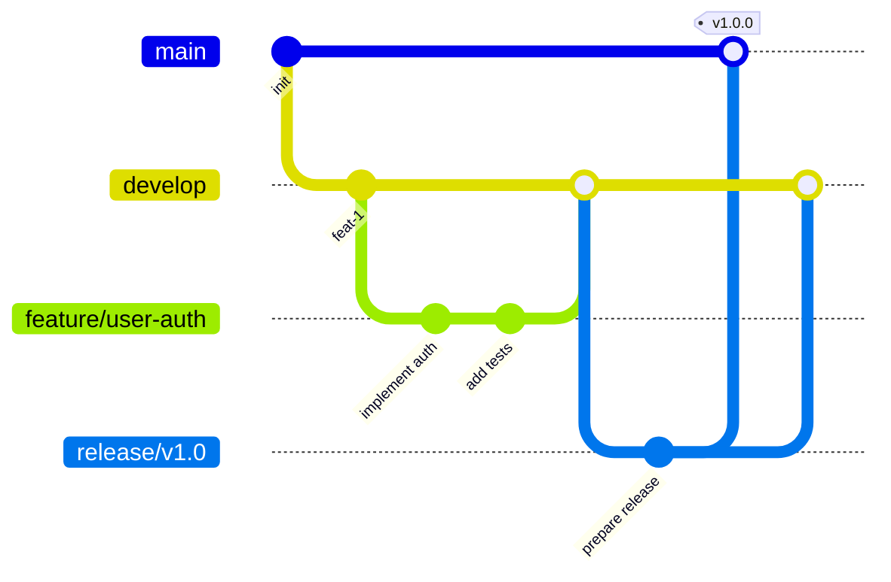

import ComparisonTable from '@site/src/components/ComparisonTable';

# [技术/领域] 最佳实践

> **适用对象**：初级/中级/高级开发者  
> **更新日期**：2025-01-20  
> **维护人**：[团队名称]

---

## 文档目的

本文档总结了 [技术/领域] 的最佳实践，帮助团队：

- 统一编码规范
- 避免常见陷阱
- 提升代码质量
- 提高开发效率

---

## 一、编码规范

### 1.1 命名规范

<ComparisonTable
  caption="命名规范对比"
  headers={['类型', '规范', '示例', '说明']}
  rows={[
    ['变量', 'camelCase', 'userName, isActive', '使用驼峰命名'],
    ['常量', 'UPPER_SNAKE_CASE', 'MAX_SIZE, API_URL', '全大写下划线'],
    ['类名', 'PascalCase', 'UserService, DataModel', '首字母大写驼峰'],
    ['函数', 'camelCase', 'getUserData, handleClick', '动词开头，驼峰命名'],
    ['私有成员', '_camelCase', '_privateMethod', '下划线前缀'],
    ['文件名', 'kebab-case', 'user-service.js', '小写短横线分隔']
  ]}
/>

**示例**：

```javascript
// 推荐
const MAX_RETRY_COUNT = 3;
const userName = 'John';
class UserService {}
function getUserById(id) {}

// 不推荐
const max_retry_count = 3;  // 常量应全大写
const UserName = 'John';    // 变量不应大写开头
class userService {}        // 类名应大写开头
function get_user_by_id() {}  // 函数应驼峰命名
```

### 1.2 注释规范

**函数注释**：

```javascript
/**
 * 根据用户ID获取用户信息
 * 
 * @param {number} userId - 用户ID
 * @param {Object} options - 可选配置项
 * @param {boolean} options.includeDetails - 是否包含详细信息
 * @returns {Promise<User>} 用户对象
 * @throws {NotFoundError} 当用户不存在时
 * 
 * @example
 * const user = await getUserById(123, { includeDetails: true });
 */
async function getUserById(userId, options = {}) {
  // 实现代码
}
```

**复杂逻辑注释**：

```javascript
// 推荐：解释"为什么"而不是"是什么"
// 使用二分查找提升大数组的查找性能
const index = binarySearch(arr, target);

// 不推荐：陈述代码本身
// 调用binarySearch函数
const index = binarySearch(arr, target);
```

### 1.3 代码格式

```javascript
// 推荐：清晰的代码结构
function processUserData(users) {
  if (!users || !Array.isArray(users)) {
    throw new Error('Invalid users array');
  }
  
  return users
    .filter(user => user.isActive)
    .map(user => ({
      id: user.id,
      name: user.name,
      email: user.email
    }))
    .sort((a, b) => a.name.localeCompare(b.name));
}

// 不推荐：混乱的代码格式
function processUserData(users){
if(!users||!Array.isArray(users))throw new Error('Invalid users array');
return users.filter(user=>user.isActive).map(user=>({id:user.id,name:user.name,email:user.email})).sort((a,b)=>a.name.localeCompare(b.name));}
```

---

## 二、设计原则

### 2.1 SOLID原则

| 原则 | 说明 | 示例 |
|------|------|------|
| **S** - 单一职责 | 一个类只负责一件事 | UserService只处理用户相关逻辑 |
| **O** - 开放封闭 | 对扩展开放，对修改封闭 | 使用策略模式扩展功能 |
| **L** - 里氏替换 | 子类可以替换父类 | 子类不改变父类行为 |
| **I** - 接口隔离 | 接口应该小而专一 | 拆分大接口为多个小接口 |
| **D** - 依赖倒置 | 依赖抽象而非具体实现 | 依赖接口而非具体类 |

**单一职责示例**：

```javascript
// 不推荐：职责混乱
class User {
  constructor(name, email) {
    this.name = name;
    this.email = email;
  }
  
  save() {
    // 保存到数据库
  }
  
  sendEmail(message) {
    // 发送邮件
  }
  
  generateReport() {
    // 生成报表
  }
}

// 推荐：职责分离
class User {
  constructor(name, email) {
    this.name = name;
    this.email = email;
  }
}

class UserRepository {
  save(user) {
    // 保存到数据库
  }
}

class EmailService {
  send(user, message) {
    // 发送邮件
  }
}

class ReportService {
  generateUserReport(user) {
    // 生成报表
  }
}
```

### 2.2 DRY原则（Don't Repeat Yourself）

```javascript
// 不推荐：重复代码
function validateEmail(email) {
  const regex = /^\S+@\S+\.\S+$/;
  return regex.test(email);
}

function validateUsername(username) {
  const regex = /^[a-zA-Z0-9_]{3,20}$/;
  return regex.test(username);
}

// 推荐：提取公共逻辑
function validateWithRegex(value, regex) {
  return regex.test(value);
}

const EMAIL_REGEX = /^\S+@\S+\.\S+$/;
const USERNAME_REGEX = /^[a-zA-Z0-9_]{3,20}$/;

const validateEmail = (email) => validateWithRegex(email, EMAIL_REGEX);
const validateUsername = (username) => validateWithRegex(username, USERNAME_REGEX);
```

---

## 三、性能优化

### 3.1 前端性能优化

<ComparisonTable
  caption="前端性能优化技巧"
  headers={['优化项', '技术方案', '提升效果', '优先级']}
  rows={[
    ['资源加载', '懒加载、预加载', '50%+', '高'],
    ['代码分割', 'Code Splitting', '40%+', '高'],
    ['图片优化', 'WebP、压缩', '60%+', '高'],
    ['缓存策略', 'Service Worker', '80%+', '中'],
    ['虚拟滚动', '大列表优化', '90%+', '中'],
    ['防抖节流', '减少函数调用', '30%+', '低']
  ]}
/>

**懒加载示例**：

```javascript
// 推荐：路由懒加载
const UserDashboard = () => import('./components/UserDashboard');

const routes = [
  {
    path: '/dashboard',
    component: UserDashboard  // 仅在访问时加载
  }
];

// 推荐：图片懒加载

```

### 3.2 后端性能优化

**数据库优化**：

```sql
-- 不推荐：未使用索引
SELECT * FROM users WHERE email = 'test@example.com';

-- 推荐：添加索引
CREATE INDEX idx_users_email ON users(email);
SELECT id, name, email FROM users WHERE email = 'test@example.com';
```

**缓存策略**：

```javascript
// 推荐：多级缓存
class UserService {
  constructor() {
    this.cache = new Map();  // 内存缓存
    this.redis = new Redis(); // Redis缓存
  }
  
  async getUser(id) {
    // 1. 检查内存缓存
    if (this.cache.has(id)) {
      return this.cache.get(id);
    }
    
    // 2. 检查Redis缓存
    const cached = await this.redis.get(`user:${id}`);
    if (cached) {
      const user = JSON.parse(cached);
      this.cache.set(id, user);
      return user;
    }
    
    // 3. 查询数据库
    const user = await this.db.findById(id);
    
    // 4. 更新缓存
    await this.redis.setex(`user:${id}`, 3600, JSON.stringify(user));
    this.cache.set(id, user);
    
    return user;
  }
}
```

---

## 四、安全最佳实践

### 4.1 输入验证

```javascript
// 危险：不安全的做法：未验证输入
app.post('/api/users', (req, res) => {
  const user = req.body;
  db.insert(user);  // 可能导致SQL注入
});

// 安全：推荐做法：严格验证
const Joi = require('joi');

const userSchema = Joi.object({
  username: Joi.string().alphanum().min(3).max(30).required(),
  email: Joi.string().email().required(),
  password: Joi.string().min(8).required()
});

app.post('/api/users', async (req, res) => {
  try {
    const value = await userSchema.validateAsync(req.body);
    // 处理已验证的数据
  } catch (error) {
    res.status(400).json({ error: error.message });
  }
});
```

### 4.2 密码处理

```javascript
// 危险：不安全的做法：明文存储密码
const user = {
  username: 'john',
  password: '123456'  // 明文密码
};

// 安全：推荐做法：加密存储
const bcrypt = require('bcrypt');

async function hashPassword(password) {
  const salt = await bcrypt.genSalt(10);
  return await bcrypt.hash(password, salt);
}

const user = {
  username: 'john',
  password: await hashPassword('123456')
};
```

### 4.3 XSS防护

```javascript
// 危险：不安全的做法：直接插入HTML
element.innerHTML = userInput;

// 安全：推荐做法：转义HTML
function escapeHtml(text) {
  const map = {
    '&': '&amp;',
    '<': '&lt;',
    '>': '&gt;',
    '"': '&quot;',
    "'": '&#039;'
  };
  return text.replace(/[&<>"']/g, m => map[m]);
}

element.textContent = escapeHtml(userInput);
```

---

## 五、错误处理

### 5.1 统一错误处理

```javascript
// 推荐：统一错误类
class ApplicationError extends Error {
  constructor(message, statusCode = 500, data = {}) {
    super(message);
    this.name = this.constructor.name;
    this.statusCode = statusCode;
    this.data = data;
    Error.captureStackTrace(this, this.constructor);
  }
}

class ValidationError extends ApplicationError {
  constructor(message, data) {
    super(message, 400, data);
  }
}

class NotFoundError extends ApplicationError {
  constructor(message) {
    super(message, 404);
  }
}

// 使用
throw new ValidationError('Invalid email format', { field: 'email' });
```

### 5.2 错误边界

```javascript
// React错误边界
class ErrorBoundary extends React.Component {
  constructor(props) {
    super(props);
    this.state = { hasError: false, error: null };
  }

  static getDerivedStateFromError(error) {
    return { hasError: true, error };
  }

  componentDidCatch(error, errorInfo) {
    // 记录错误到日志服务
    logErrorToService(error, errorInfo);
  }

  render() {
    if (this.state.hasError) {
      return <ErrorFallback error={this.state.error} />;
    }

    return this.props.children;
  }
}
```

---

## 六、测试最佳实践

### 6.1 单元测试

```javascript
// 推荐：清晰的测试结构
describe('UserService', () => {
  describe('getUserById', () => {
    it('should return user when user exists', async () => {
      // Arrange
      const userId = 123;
      const expectedUser = { id: 123, name: 'John' };
      mockDB.findById.mockResolvedValue(expectedUser);
      
      // Act
      const result = await userService.getUserById(userId);
      
      // Assert
      expect(result).toEqual(expectedUser);
      expect(mockDB.findById).toHaveBeenCalledWith(userId);
    });
    
    it('should throw NotFoundError when user does not exist', async () => {
      // Arrange
      mockDB.findById.mockResolvedValue(null);
      
      // Act & Assert
      await expect(userService.getUserById(999))
        .rejects
        .toThrow(NotFoundError);
    });
  });
});
```

### 6.2 测试覆盖率目标

<ComparisonTable
  caption="测试覆盖率建议"
  headers={['代码类型', '覆盖率目标', '说明']}
  rows={[
    ['核心业务逻辑', '90%+', '必须有充分测试'],
    ['工具函数', '95%+', '应该有完整测试'],
    ['UI组件', '70%+', '重点测试交互逻辑'],
    ['配置代码', '60%+', '基本测试即可']
  ]}
/>

---

## 七、代码审查清单

### 7.1 提交前检查

- [ ] 代码符合团队规范
- [ ] 添加了必要的注释
- [ ] 更新了相关文档
- [ ] 编写了单元测试
- [ ] 测试用例全部通过
- [ ] 没有console.log等调试代码
- [ ] 处理了所有TODO
- [ ] 检查了安全隐患

### 7.2 Code Review要点

**功能性**：
- 代码是否实现了预期功能？
- 边界条件是否处理？
- 错误处理是否完善？

**可读性**：
- 命名是否清晰？
- 逻辑是否易懂？
- 是否需要注释？

**性能**：
- 是否有性能问题？
- 是否有不必要的计算？
- 是否可以优化？

---

## 八、Git最佳实践

### 8.1 提交信息规范

```bash
# 推荐：清晰的提交信息
feat: 添加用户导出功能
fix: 修复登录页面样式问题
docs: 更新API文档
refactor: 重构用户服务代码
test: 添加用户服务单元测试
chore: 更新依赖版本

# 不推荐：模糊的提交信息
update code
fix bug
changes
```

### 8.2 分支策略



---

## 九、文档最佳实践

### 9.1 README模板

```markdown
# 项目名称

简短描述项目功能

## 功能特性

- 功能1
- 功能2
- 功能3

## 快速开始

### 安装
\`\`\`bash
npm install
\`\`\`

### 运行
\`\`\`bash
npm start
\`\`\`

## 文档

详细文档请查看 [文档站点](https://docs.example.com)

## 贡献指南

请查看 [CONTRIBUTING.md](./CONTRIBUTING.md)

## 许可证

MIT
```

---

## 十、常见反模式

### 10.1 避免的做法

<ComparisonTable
  caption="反模式对比"
  headers={['反模式', '问题', '正确做法']}
  rows={[
    ['上帝类', '一个类承担太多职责', '拆分为多个小类'],
    ['意大利面代码', '逻辑混乱，难以维护', '使用清晰的结构'],
    ['魔法数字', '硬编码的数字', '定义为常量'],
    ['过早优化', '在需要前就优化', '先保证正确性'],
    ['重复代码', '相同逻辑多处出现', '提取为公共函数'],
    ['过度设计', '添加不需要的抽象', '保持简单']
  ]}
/>

---

## 总结

:::tip 核心原则
1. **简单优于复杂**：保持代码简洁明了
2. **可读性第一**：代码是写给人看的
3. **持续改进**：不断学习和优化
4. **团队协作**：遵循团队规范
5. **质量保证**：测试和代码审查
:::

---

## 相关资源

- [Clean Code](https://github.com/ryanmcdermott/clean-code-javascript)
- [JavaScript Style Guide](https://github.com/airbnb/javascript)
- [Node.js Best Practices](https://github.com/goldbergyoni/nodebestpractices)

