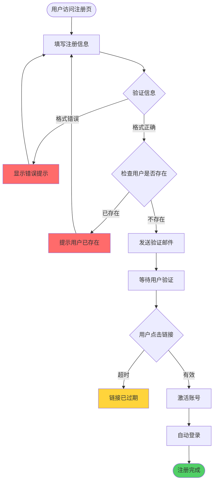
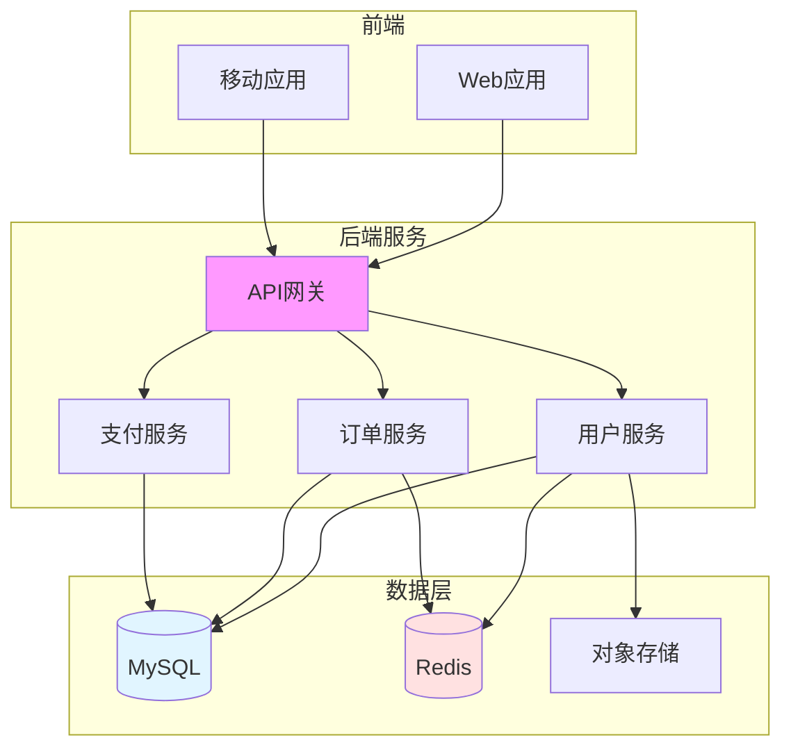

import ComparisonTable from '@site/src/components/ComparisonTable';

# [产品名称] 产品需求文档 (PRD)

> **文档版本**：v1.0  
> **产品负责人**：[姓名]  
> **更新日期**：2025-01-20  
> **状态**：草稿/评审中/已确认

---

## 一、文档概述

### 1.1 修订记录

| 版本 | 日期 | 修改人 | 修改内容 |
|------|------|--------|---------|
| v0.1 | 2025-01-10 | 张三 | 初始版本 |
| v0.2 | 2025-01-15 | 李四 | 添加用户故事 |
| v1.0 | 2025-01-20 | 王五 | 确认发布 |

### 1.2 评审记录

| 角色 | 姓名 | 评审日期 | 状态 | 意见 |
|------|------|---------|------|------|
| 产品经理 | 张三 | 2025-01-18 | 通过 | - |
| 技术负责人 | 李四 | 2025-01-18 | 通过 | 建议优化缓存策略 |
| UX设计师 | 王五 | 2025-01-19 | 通过 | - |
| 测试负责人 | 赵六 | 2025-01-19 | 通过 | 补充测试用例 |

---

## 二、产品概述

### 2.1 产品定位

**一句话描述**：[用一句话说明这是什么产品]

**目标用户**：
- 主要用户群体1
- 主要用户群体2
- 主要用户群体3

**使用场景**：
1. 场景1：[描述]
2. 场景2：[描述]
3. 场景3：[描述]

### 2.2 产品目标

**业务目标**：
- 提升用户活跃度30%
- 提高订单转化率20%
- 降低客服成本15%

**用户价值**：
- 为用户解决XX问题
- 提升用户XX效率
- 改善用户XX体验

### 2.3 竞品分析

<ComparisonTable
  caption="竞品对比分析"
  headers={['功能', '我们的产品', '竞品A', '竞品B', '优势']}
  rows={[
    ['核心功能1', '支持', '支持', '不支持', '功能完整'],
    ['核心功能2', '支持', '部分支持', '支持', '体验更好'],
    ['响应速度', '< 100ms', '< 200ms', '< 500ms', '性能领先'],
    ['价格', '¥99/月', '¥149/月', '¥199/月', '性价比高']
  ]}
/>

---

## 三、需求清单

### 3.1 功能优先级

<ComparisonTable
  caption="功能优先级矩阵"
  headers={['功能模块', '优先级', '开发周期', '依赖', '状态']}
  rows={[
    ['用户注册登录', 'P0 (Must Have)', '2周', '无', '开发中'],
    ['用户中心', 'P1 (Should Have)', '1周', '用户登录', '待开发'],
    ['订单管理', 'P0 (Must Have)', '3周', '用户登录', '待开发'],
    ['支付功能', 'P1 (Should Have)', '2周', '订单管理', '待开发'],
    ['数据分析', 'P2 (Could Have)', '1周', '所有模块', '待规划'],
    ['社交分享', 'P3 (Won\'t Have)', '1周', '无', '暂不考虑']
  ]}
/>

**优先级说明**：
- **P0 (Must Have)**：核心功能，必须实现
- **P1 (Should Have)**：重要功能，应该实现
- **P2 (Could Have)**：辅助功能，可以实现
- **P3 (Won't Have)**：暂不实现

---

## 四、功能详细设计

### 4.1 用户注册功能

#### 4.1.1 功能描述

用户通过邮箱或手机号注册账号，完成账号创建。

#### 4.1.2 用户故事

```
作为一个新用户
我想要通过邮箱注册账号
以便我可以使用产品的全部功能
```

**验收标准**：
- 用户可以输入邮箱和密码
- 系统验证邮箱格式
- 系统发送验证邮件
- 用户点击邮件链接完成验证
- 注册成功后自动登录

#### 4.1.3 业务流程



#### 4.1.4 界面设计

**注册表单**：

```
┌─────────────────────────────────┐
│         用户注册                 │
├─────────────────────────────────┤
│ 邮箱地址                         │
│ [___________________________]   │
│                                 │
│ 密码 (8-20位)                   │
│ [___________________________]   │
│                                 │
│ 确认密码                         │
│ [___________________________]   │
│                                 │
│ [ ] 我已阅读并同意用户协议       │
│                                 │
│ [      注册     ]               │
│                                 │
│ 已有账号？ 立即登录              │
└─────────────────────────────────┘
```

#### 4.1.5 字段说明

| 字段名 | 类型 | 长度 | 必填 | 验证规则 | 说明 |
|--------|------|------|------|---------|------|
| `email` | string | 50 | 是 | 邮箱格式 | 用户邮箱 |
| `password` | string | 8-20 | 是 | 包含字母和数字 | 登录密码 |
| `username` | string | 3-20 | 否 | 字母数字下划线 | 用户名 |
| `agreeTerms` | boolean | - | 是 | true | 同意用户协议 |

#### 4.1.6 交互说明

**输入验证**：
- 实时验证邮箱格式
- 密码强度提示
- 确认密码一致性检查

**错误提示**：
- 邮箱格式错误：请输入正确的邮箱地址
- 密码太弱：密码至少包含字母和数字
- 用户已存在：该邮箱已被注册

#### 4.1.7 异常处理

| 异常情况 | 处理方式 |
|---------|---------|
| 邮箱已被注册 | 提示用户，建议找回密码 |
| 网络超时 | 提示稍后重试，保留已输入信息 |
| 邮件发送失败 | 提供重新发送按钮 |
| 验证码过期 | 提供重新获取验证码 |

---

### 4.2 用户登录功能

#### 4.2.1 功能描述

用户使用邮箱/用户名和密码登录系统。

#### 4.2.2 用户故事

```
作为一个注册用户
我想要登录我的账号
以便访问我的个人信息和使用产品功能
```

#### 4.2.3 功能规则

1. **登录方式**：
   - 支持邮箱+密码
   - 支持用户名+密码
   - 支持手机号+验证码

2. **安全限制**：
   - 连续3次登录失败锁定账号5分钟
   - 密码输入错误后显示找回密码入口
   - 异地登录需要二次验证

3. **记住登录**：
   - 勾选"记住我"保持30天登录状态
   - 不勾选关闭浏览器后退出登录

---

## 五、非功能性需求

### 5.1 性能需求

<ComparisonTable
  caption="性能指标要求"
  headers={['指标', '目标值', '当前值', '优先级']}
  rows={[
    ['页面加载时间', '< 1s', '1.5s', 'P0'],
    ['API响应时间', '< 200ms', '300ms', 'P0'],
    ['并发用户数', '> 10000', '5000', 'P1'],
    ['系统可用性', '> 99.9%', '99.5%', 'P0']
  ]}
/>

### 5.2 安全需求

- **数据加密**：敏感数据使用AES-256加密
- **通信安全**：强制使用HTTPS
- **认证授权**：JWT Token，有效期2小时
- **密码策略**：8-20位，包含字母、数字和特殊字符
- **防护措施**：
  - XSS防护
  - CSRF防护
  - SQL注入防护
  - 接口限流

### 5.3 兼容性需求

**浏览器支持**：
- Chrome 90+
- Firefox 88+
- Safari 14+
- Edge 90+

**设备支持**：
- PC端（1920x1080及以上）
- 平板（768x1024及以上）
- 移动端（375x667及以上）

---

## 六、数据模型

### 6.1 用户表设计

```sql
CREATE TABLE users (
  id BIGINT PRIMARY KEY AUTO_INCREMENT,
  email VARCHAR(100) UNIQUE NOT NULL,
  username VARCHAR(50) UNIQUE,
  password_hash VARCHAR(255) NOT NULL,
  phone VARCHAR(20),
  avatar VARCHAR(255),
  status ENUM('active', 'inactive', 'banned') DEFAULT 'active',
  email_verified BOOLEAN DEFAULT FALSE,
  created_at TIMESTAMP DEFAULT CURRENT_TIMESTAMP,
  updated_at TIMESTAMP DEFAULT CURRENT_TIMESTAMP ON UPDATE CURRENT_TIMESTAMP,
  last_login_at TIMESTAMP NULL,
  INDEX idx_email (email),
  INDEX idx_username (username),
  INDEX idx_phone (phone)
) ENGINE=InnoDB DEFAULT CHARSET=utf8mb4;
```

---

## 七、技术方案

### 7.1 技术栈选型

<ComparisonTable
  caption="技术栈"
  headers={['类别', '技术', '版本', '说明']}
  rows={[
    ['前端框架', 'React', '18.2+', 'UI开发'],
    ['状态管理', 'Redux Toolkit', '1.9+', '状态管理'],
    ['UI组件库', 'Ant Design', '5.0+', '组件库'],
    ['后端框架', 'Node.js', '18+', '服务端'],
    ['Web框架', 'Express', '4.18+', 'API开发'],
    ['数据库', 'MySQL', '8.0+', '数据存储'],
    ['缓存', 'Redis', '7.0+', '缓存和会话']
  ]}
/>

### 7.2 架构设计



---

## 八、项目计划

### 8.1 里程碑

| 阶段 | 时间 | 交付物 | 负责人 |
|------|------|--------|--------|
| 需求评审 | W1 | PRD文档 | 产品经理 |
| 设计评审 | W2 | UI设计稿 | UI设计师 |
| 技术方案 | W3 | 技术方案文档 | 技术负责人 |
| 开发阶段 | W4-W8 | 功能代码 | 开发团队 |
| 测试阶段 | W9-W10 | 测试报告 | 测试团队 |
| 上线发布 | W11 | 生产环境 | 运维团队 |

### 8.2 资源需求

<ComparisonTable
  caption="人力资源配置"
  headers={['角色', '人数', '投入时间', '工作内容']}
  rows={[
    ['产品经理', '1', '全职', '需求管理、项目协调'],
    ['UI设计师', '1', '2周', '界面设计、交互设计'],
    ['前端工程师', '2', '全职', '前端开发'],
    ['后端工程师', '2', '全职', '后端开发'],
    ['测试工程师', '1', '2周', '功能测试、自动化测试']
  ]}
/>

---

## 九、测试计划

### 9.1 测试用例

| 用例ID | 功能 | 测试步骤 | 预期结果 | 优先级 |
|--------|------|---------|---------|--------|
| TC001 | 用户注册 | 输入合法邮箱和密码 | 注册成功，发送验证邮件 | P0 |
| TC002 | 重复注册 | 使用已注册邮箱注册 | 提示邮箱已被注册 | P0 |
| TC003 | 密码强度 | 输入弱密码 | 提示密码强度不够 | P1 |
| TC004 | 邮箱验证 | 点击验证邮件链接 | 账号激活成功 | P0 |

---

## 十、风险评估

### 10.1 技术风险

| 风险 | 可能性 | 影响 | 应对措施 |
|------|--------|------|---------|
| 第三方API不稳定 | 中 | 高 | 实现降级方案，增加重试机制 |
| 数据库性能瓶颈 | 低 | 高 | 提前进行性能测试，准备扩容方案 |
| 前端兼容性问题 | 中 | 中 | 使用Polyfill，充分测试 |

### 10.2 业务风险

| 风险 | 可能性 | 影响 | 应对措施 |
|------|--------|------|---------|
| 用户接受度低 | 中 | 高 | 收集用户反馈，快速迭代 |
| 竞品模仿 | 高 | 中 | 保持创新，建立技术壁垒 |
| 运营成本高 | 低 | 中 | 优化运营策略，降低成本 |

---

## 十一、上线标准

### 11.1 上线检查清单

- [ ] 所有P0功能开发完成
- [ ] 测试用例通过率> 95%
- [ ] 性能测试达标
- [ ] 安全测试通过
- [ ] 监控告警配置完成
- [ ] 数据备份方案就绪
- [ ] 回滚方案准备完成
- [ ] 用户文档编写完成
- [ ] 运维团队培训完成

---

## 附录

### A. 相关文档

- [UI设计稿](./ui-design.md)
- [技术方案](./tech-design.md)
- [测试报告](./test-report.md)
- [用户手册](./user-manual.md)

### B. 参考资料

- [行业最佳实践](https://example.com)
- [竞品分析报告](./competitor-analysis.md)

---

:::tip 文档维护
本文档需要持续更新，请在功能发生变更时及时同步文档内容。
:::

