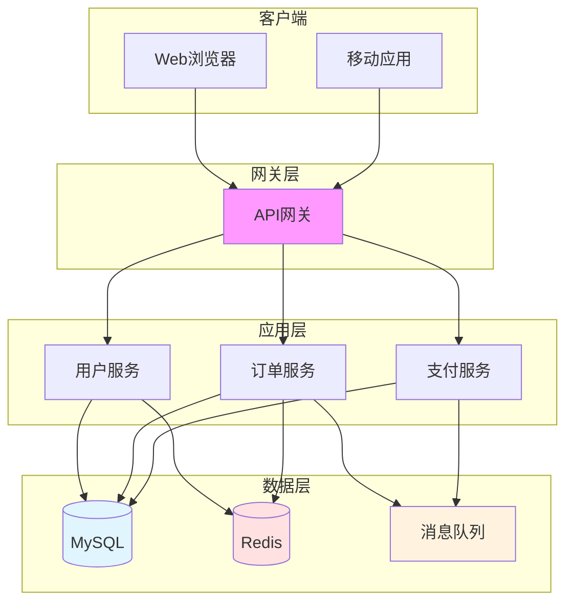
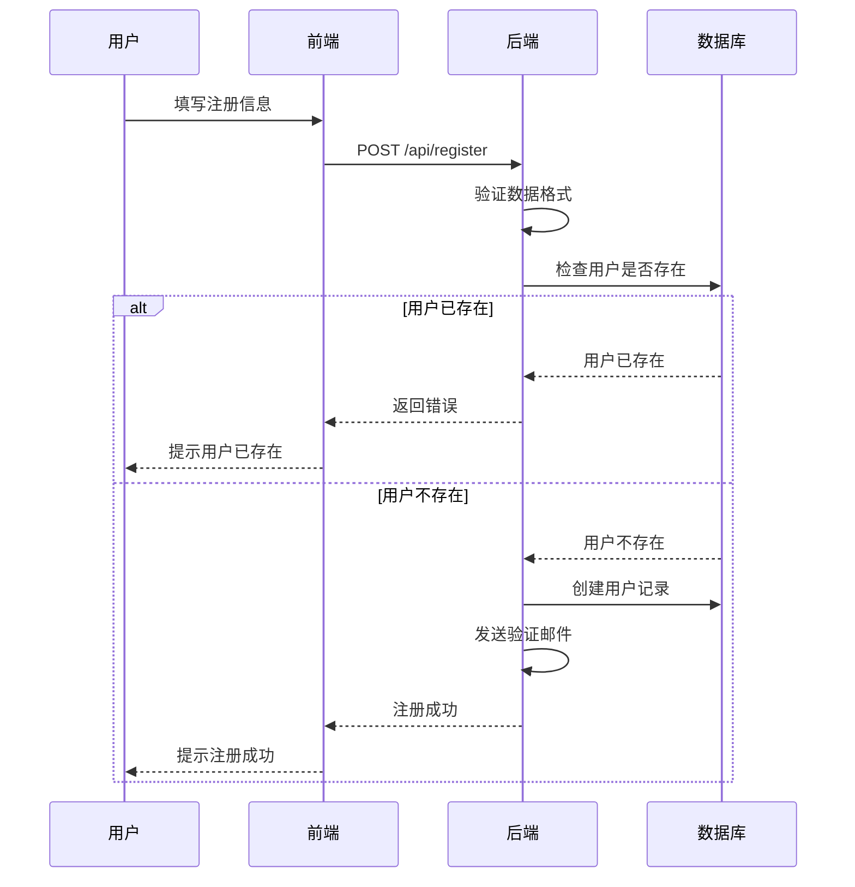
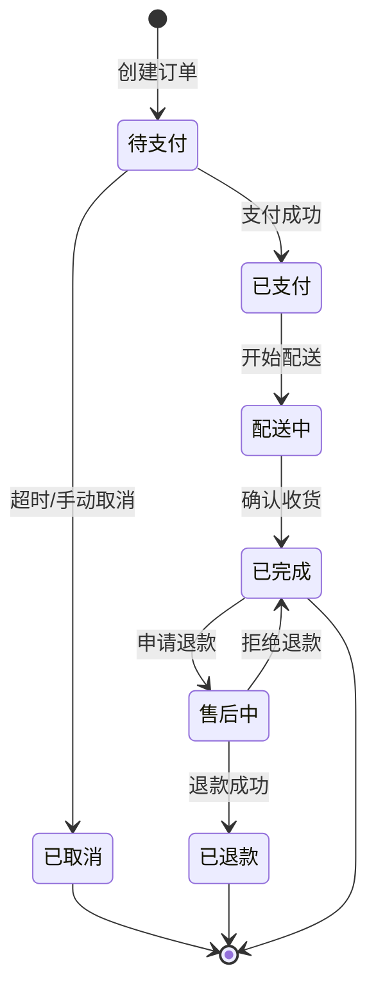

import ComparisonTable from '@site/src/components/ComparisonTable';

# [产品/功能名称] 技术文档

> **文档版本**：v1.0.0  
> **最后更新**：2025-01-20  
> **作者**：[作者姓名]  
> **审核人**：[审核人姓名]

---

## 文档说明

:::info 使用说明
这是一个技术文档模板，适用于编写技术说明书、使用指南、技术规范等文档。
请根据实际需要保留或删除相应章节。
:::

---

## 一、概述

### 1.1 产品简介

**[产品名称]** 是一个 [简短描述产品是什么]。

主要特点：
- 特点 1
- 特点 2  
- 特点 3
- 特点 4

### 1.2 适用场景

本产品适用于以下场景：

1. **场景一**：[描述]
2. **场景二**：[描述]
3. **场景三**：[描述]

### 1.3 技术栈

<ComparisonTable
  caption="核心技术栈"
  headers={['类别', '技术', '版本', '说明']}
  rows={[
    ['前端框架', 'React', '18.2+', '用户界面开发'],
    ['后端框架', 'Spring Boot', '3.0+', '业务逻辑处理'],
    ['数据库', 'MySQL', '8.0+', '数据存储'],
    ['缓存', 'Redis', '7.0+', '性能优化']
  ]}
/>

---

## 二、系统架构

### 2.1 整体架构



### 2.2 核心模块

| 模块名称 | 功能描述 | 技术实现 | 负责人 |
|---------|---------|---------|--------|
| 用户模块 | 用户注册、登录、权限管理 | Spring Security + JWT | 张三 |
| 订单模块 | 订单创建、查询、状态管理 | Spring Boot + MyBatis | 李四 |
| 支付模块 | 支付接口对接、回调处理 | 第三方SDK | 王五 |
| 通知模块 | 消息推送、邮件发送 | WebSocket + SMTP | 赵六 |

---

## 三、快速开始

### 3.1 环境要求

在开始之前，请确保您的开发环境满足以下要求：

| 软件 | 版本要求 | 说明 |
|------|---------|------|
| JDK | 17+ | Java开发工具包 |
| Node.js | 18+ | 前端运行环境 |
| MySQL | 8.0+ | 关系型数据库 |
| Redis | 7.0+ | 缓存数据库 |
| Maven | 3.8+ | 项目构建工具 |

### 3.2 安装步骤

import Tabs from '@theme/Tabs';
import TabItem from '@theme/TabItem';

<Tabs>
  <TabItem value="docker" label="Docker部署" default>
    ```bash
    # 1. 拉取镜像
    docker pull your-image:latest

    # 2. 运行容器
    docker run -d \
      --name your-app \
      -p 8080:8080 \
      -e SPRING_PROFILES_ACTIVE=prod \
      your-image:latest

    # 3. 查看日志
    docker logs -f your-app
    ```
  </TabItem>
  <TabItem value="manual" label="手动部署">
    ```bash
    # 1. 克隆代码
    git clone https://github.com/your-repo/your-project.git
    cd your-project

    # 2. 安装依赖
    npm install
    mvn clean install

    # 3. 配置数据库
    cp application.yml.example application.yml
    # 编辑 application.yml 填写数据库配置

    # 4. 初始化数据库
    mysql -u root -p < db/init.sql

    # 5. 启动应用
    mvn spring-boot:run
    ```
  </TabItem>
  <TabItem value="k8s" label="Kubernetes部署">
    ```bash
    # 1. 创建命名空间
    kubectl create namespace your-app

    # 2. 应用配置
    kubectl apply -f k8s/configmap.yaml
    kubectl apply -f k8s/secret.yaml

    # 3. 部署应用
    kubectl apply -f k8s/deployment.yaml
    kubectl apply -f k8s/service.yaml

    # 4. 查看状态
    kubectl get pods -n your-app
    ```
  </TabItem>
</Tabs>

### 3.3 验证安装

访问以下地址验证安装是否成功：

```
http://localhost:8080/health
```

预期响应：

```json
{
  "status": "UP",
  "version": "1.0.0",
  "timestamp": "2025-01-20T10:00:00Z"
}
```

---

## 四、核心功能

### 4.1 用户管理

#### 4.1.1 用户注册

**功能描述**：用户通过邮箱或手机号注册账户。

**流程图**：



**代码示例**：

```javascript title="用户注册示例"
async function registerUser(userData) {
  try {
    const response = await fetch('/api/register', {
      method: 'POST',
      headers: {
        'Content-Type': 'application/json',
      },
      body: JSON.stringify({
        email: userData.email,
        password: userData.password,
        username: userData.username
      })
    });
    
    const result = await response.json();
    
    if (response.ok) {
      console.log('注册成功', result);
      return { success: true, data: result };
    } else {
      console.error('注册失败', result.message);
      return { success: false, error: result.message };
    }
  } catch (error) {
    console.error('请求失败', error);
    return { success: false, error: error.message };
  }
}
```

#### 4.1.2 用户登录

**功能描述**：用户通过用户名/邮箱和密码登录系统。

**参数说明**：

| 参数名 | 类型 | 必填 | 说明 |
|--------|------|------|------|
| `username` | string | 是 | 用户名或邮箱 |
| `password` | string | 是 | 密码（需加密传输） |
| `remember` | boolean | 否 | 是否记住登录状态 |

---

### 4.2 订单管理

#### 4.2.1 创建订单

**状态流转图**：



---

## 五、配置说明

### 5.1 应用配置

```yaml title="application.yml"
server:
  port: 8080
  servlet:
    context-path: /api

spring:
  datasource:
    url: jdbc:mysql://localhost:3306/your_db
    username: ${DB_USERNAME:root}
    password: ${DB_PASSWORD:password}
    driver-class-name: com.mysql.cj.jdbc.Driver
  
  redis:
    host: ${REDIS_HOST:localhost}
    port: ${REDIS_PORT:6379}
    password: ${REDIS_PASSWORD:}
    database: 0
  
  jpa:
    hibernate:
      ddl-auto: validate
    show-sql: false
    properties:
      hibernate:
        format_sql: true

logging:
  level:
    root: INFO
    com.yourcompany: DEBUG
```

### 5.2 环境变量

| 变量名 | 说明 | 默认值 | 必填 |
|--------|------|--------|------|
| `DB_USERNAME` | 数据库用户名 | root | 是 |
| `DB_PASSWORD` | 数据库密码 | - | 是 |
| `REDIS_HOST` | Redis主机地址 | localhost | 否 |
| `REDIS_PORT` | Redis端口 | 6379 | 否 |
| `JWT_SECRET` | JWT密钥 | - | 是 |

---

## 六、常见问题

### Q1: 如何修改数据库配置？

**A:** 编辑 `application.yml` 文件中的 `spring.datasource` 配置项，或通过环境变量设置。

### Q2: 启动时报端口被占用怎么办？

**A:** 可以通过以下方式解决：

1. **修改端口**：在 `application.yml` 中修改 `server.port`
2. **停止占用进程**：
   ```bash
   # Windows
   netstat -ano | findstr :8080
   taskkill /PID [进程ID] /F
   
   # Linux/Mac
   lsof -i :8080
   kill -9 [进程ID]
   ```

### Q3: 如何启用HTTPS？

**A:** 需要配置SSL证书：

```yaml title="application.yml"
server:
  port: 8443
  ssl:
    enabled: true
    key-store: classpath:keystore.p12
    key-store-password: your-password
    key-store-type: PKCS12
```

---

## 七、性能优化

### 7.1 数据库优化

<ComparisonTable
  caption="优化前后对比"
  headers={['指标', '优化前', '优化后', '提升比例']}
  rows={[
    ['查询响应时间', '500ms', '50ms', '90%'],
    ['并发处理能力', '100 QPS', '1000 QPS', '900%'],
    ['数据库连接数', '200', '50', '75%'],
    ['CPU使用率', '80%', '40%', '50%']
  ]}
/>

**优化措施**：

1. **添加索引**
   ```sql
   CREATE INDEX idx_user_email ON users(email);
   CREATE INDEX idx_order_status ON orders(status, created_at);
   ```

2. **查询优化**
   ```sql
   -- 优化前
   SELECT * FROM users WHERE email LIKE '%@gmail.com';
   
   -- 优化后
   SELECT id, username, email FROM users 
   WHERE email LIKE 'user%@gmail.com';
   ```

3. **使用缓存**
   ```java
   @Cacheable(value = "users", key = "#userId")
   public User getUserById(Long userId) {
       return userRepository.findById(userId).orElse(null);
   }
   ```

---

## 八、安全说明

### 8.1 认证与授权

本系统采用 **JWT (JSON Web Token)** 进行身份认证。

:::danger 安全警告
- 请勿在代码中硬编码密钥
- 定期更换JWT密钥
- Token有效期不要设置过长
- 使用HTTPS传输敏感信息
:::

### 8.2 数据加密

| 数据类型 | 加密方式 | 说明 |
|---------|---------|------|
| 用户密码 | BCrypt | 单向加密，不可逆 |
| 敏感信息 | AES-256 | 对称加密 |
| API通信 | HTTPS/TLS 1.3 | 传输加密 |
| 数据库连接 | SSL | 连接加密 |

---

## 九、监控与运维

### 9.1 健康检查

```bash
# 检查应用状态
curl http://localhost:8080/actuator/health

# 检查详细信息
curl http://localhost:8080/actuator/info

# 查看指标
curl http://localhost:8080/actuator/metrics
```

### 9.2 日志配置

```xml title="logback-spring.xml"
<configuration>
    <appender name="FILE" class="ch.qos.logback.core.rolling.RollingFileAppender">
        <file>logs/application.log</file>
        <rollingPolicy class="ch.qos.logback.core.rolling.TimeBasedRollingPolicy">
            <fileNamePattern>logs/application.%d{yyyy-MM-dd}.log</fileNamePattern>
            <maxHistory>30</maxHistory>
        </rollingPolicy>
        <encoder>
            <pattern>%d{yyyy-MM-dd HH:mm:ss} [%thread] %-5level %logger{36} - %msg%n</pattern>
        </encoder>
    </appender>
    
    <root level="INFO">
        <appender-ref ref="FILE" />
    </root>
</configuration>
```

---

## 十、更新日志

### Version 1.0.0 (2025-01-20)

**新功能**：
- 用户注册和登录功能
- 订单管理模块
- 支付功能集成

**改进**：
- 优化数据库查询性能
- 添加Redis缓存

**修复**：
- 修复用户重复注册问题
- 修复订单状态更新延迟

---

## 十一、联系我们

:::tip 技术支持
如有问题，请通过以下方式联系我们：
- **邮箱**：support@example.com
- **GitHub Issues**：https://github.com/your-repo/issues
- **技术论坛**：https://forum.example.com
:::

---

## 附录

### A. 术语表

| 术语 | 说明 |
|------|------|
| API | Application Programming Interface，应用程序编程接口 |
| JWT | JSON Web Token，JSON网络令牌 |
| QPS | Queries Per Second，每秒查询数 |
| ORM | Object-Relational Mapping，对象关系映射 |

### B. 参考文档

- [Spring Boot 官方文档](https://spring.io/projects/spring-boot)
- [MySQL 性能优化指南](https://dev.mysql.com/doc/)
- [Redis 最佳实践](https://redis.io/docs/)

