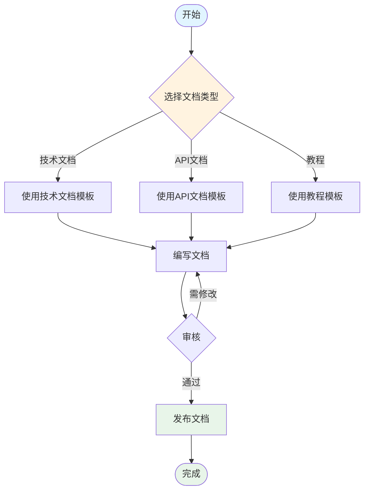

import ComparisonTable from '@site/src/components/ComparisonTable';

# 文档模板使用指南

欢迎使用我们的文档模板库！这里提供了各种类型的专业文档模板，帮助您快速创建高质量的技术文档。

---

## 模板概览

本文档库包含以下模板类型：

### 核心模板

<div style={{
  display: 'grid',
  gridTemplateColumns: 'repeat(auto-fit, minmax(280px, 1fr))',
  gap: '1.5rem',
  margin: '2rem 0'
}}>
  <div style={{
    padding: '1.5rem',
    border: '1px solid var(--ifm-color-emphasis-300)',
    borderRadius: '8px',
    transition: 'all 0.3s ease',
    cursor: 'pointer'
  }}>
    <h3>技术文档模板</h3>
    <p>适用于技术说明、使用指南、技术规范等文档</p>
    <a href="./tech-doc-template">查看模板 →</a>
  </div>

  <div style={{
    padding: '1.5rem',
    border: '1px solid var(--ifm-color-emphasis-300)',
    borderRadius: '8px',
    transition: 'all 0.3s ease',
    cursor: 'pointer'
  }}>
    <h3>API接口文档模板</h3>
    <p>RESTful API、GraphQL等接口文档的标准模板</p>
    <a href="./api-doc-template">查看模板 →</a>
  </div>

</div>

### 专业模板

<div style={{
  display: 'grid',
  gridTemplateColumns: 'repeat(auto-fit, minmax(280px, 1fr))',
  gap: '1.5rem',
  margin: '2rem 0'
}}>
  <div style={{
    padding: '1.5rem',
    border: '1px solid var(--ifm-color-emphasis-300)',
    borderRadius: '8px'
  }}>
    <h3>教程文档模板</h3>
    <p>分步教程、快速入门、实战案例等教学文档</p>
    <a href="./tutorial-template">查看模板 →</a>
  </div>

  <div style={{
    padding: '1.5rem',
    border: '1px solid var(--ifm-color-emphasis-300)',
    borderRadius: '8px'
  }}>
    <h3>最佳实践模板</h3>
    <p>编码规范、设计模式、性能优化等经验总结</p>
    <a href="./best-practices-template">查看模板 →</a>
  </div>

  <div style={{
    padding: '1.5rem',
    border: '1px solid var(--ifm-color-emphasis-300)',
    borderRadius: '8px'
  }}>
    <h3>故障排查模板</h3>
    <p>问题诊断、解决方案、预防措施等运维文档</p>
    <a href="./troubleshooting-template">查看模板 →</a>
  </div>

  <div style={{
    padding: '1.5rem',
    border: '1px solid var(--ifm-color-emphasis-300)',
    borderRadius: '8px'
  }}>
    <h3>产品需求文档模板</h3>
    <p>产品需求、功能设计、用户故事等产品文档</p>
    <a href="./prd-template">查看模板 →</a>
  </div>
</div>

---

## 可用组件一览

我们的文档系统内置了丰富的组件，让您的文档更加生动和专业。

### 信息提示框

使用 Docusaurus 内置的 Admonitions：

:::note
这是一个普通提示框
:::

:::tip
这是一个技巧提示框
:::

:::info
这是一个信息提示框
:::

:::warning
这是一个警告提示框
:::

:::danger
这是一个危险警告框
:::

---

### 比较表格组件

<ComparisonTable
  caption="技术选型对比"
  headers={['特性', 'React', 'Vue', 'Angular']}
  rows={[
    ['学习曲线', '中等', '简单', '较难'],
    ['性能', '优秀', '优秀', '良好'],
    ['生态系统', '丰富', '丰富', '完整'],
    ['适用场景', '大中型应用', '中小型应用', '企业级应用']
  ]}
/>

---

### Mermaid 流程图



---

### 代码块高亮

```javascript title="示例代码.js" {3-5}
function greet(name) {
  // 这是一个普通行
  console.log(`Hello, ${name}!`);
  console.log('这些行会被高亮');
  return `Welcome, ${name}`;
}

greet('World');
```

---

### 选项卡 Tabs

import Tabs from '@theme/Tabs';
import TabItem from '@theme/TabItem';

<Tabs>
  <TabItem value="npm" label="npm" default>
    ```bash
    npm install docusaurus
    ```
  </TabItem>
  <TabItem value="yarn" label="Yarn">
    ```bash
    yarn add docusaurus
    ```
  </TabItem>
  <TabItem value="pnpm" label="pnpm">
    ```bash
    pnpm add docusaurus
    ```
  </TabItem>
</Tabs>

---

### 标准表格

| 模板类型 | 适用场景 | 难度 | 推荐指数 |
|---------|---------|------|---------|
| 技术文档 | 技术说明、使用指南 | 简单 | ★★★★★ |
| API文档 | 接口定义、参数说明 | 中等 | ★★★★★ |
| 系统设计 | 架构设计、技术选型 | 较难 | ★★★★★ |
| 教程文档 | 分步教程、快速入门 | 简单 | ★★★★☆ |

---

## 使用方法

### 第一步：选择模板

根据您的需求，从上方选择合适的文档模板。

### 第二步：复制模板

点击进入模板页面，复制整个 MDX 文件内容。

### 第三步：创建文档

在 `docs` 目录下创建您的文档文件，粘贴模板内容。

### 第四步：自定义内容

根据模板中的说明，填写您的实际内容。

### 第五步：预览和发布

使用 `npm start` 预览文档效果，确认无误后发布。

---

## 最佳实践

### 文档命名规范

```
推荐命名方式：
- user-authentication-guide.mdx
- api-rest-reference.mdx
- mysql-performance-tuning.mdx

不推荐命名方式：
- doc1.mdx
- 文档.mdx
- GUIDE.mdx
```

### 目录结构建议

```
docs/
├── getting-started/        # 入门文档
├── tutorials/             # 教程文档
├── api-reference/         # API参考
├── architecture/          # 架构文档
└── troubleshooting/       # 故障排查
```

---

## 文档质量检查清单

在发布文档前，请确保：

- [ ] 标题层级结构清晰（h1 → h2 → h3）
- [ ] 代码示例完整可运行
- [ ] 包含必要的图表说明
- [ ] 添加了合适的标签
- [ ] 内部链接正确有效
- [ ] 语法和格式正确
- [ ] 包含更新日期
- [ ] 添加了作者信息

---

## 相关资源

- [Docusaurus 官方文档](https://docusaurus.io/)
- [Markdown 语法指南](https://www.markdownguide.org/)
- [Mermaid 图表语法](https://mermaid.js.org/)
- [MDX 文档](https://mdxjs.com/)

---

## 贡献模板

如果您有好的文档模板想要分享，欢迎：

1. Fork 本项目
2. 在 `docs/document-template/` 目录下添加您的模板
3. 提交 Pull Request
4. 等待审核合并

---

:::tip 温馨提示
建议将常用的模板保存到您的代码片段库（Code Snippets）中，以便快速使用！
:::
