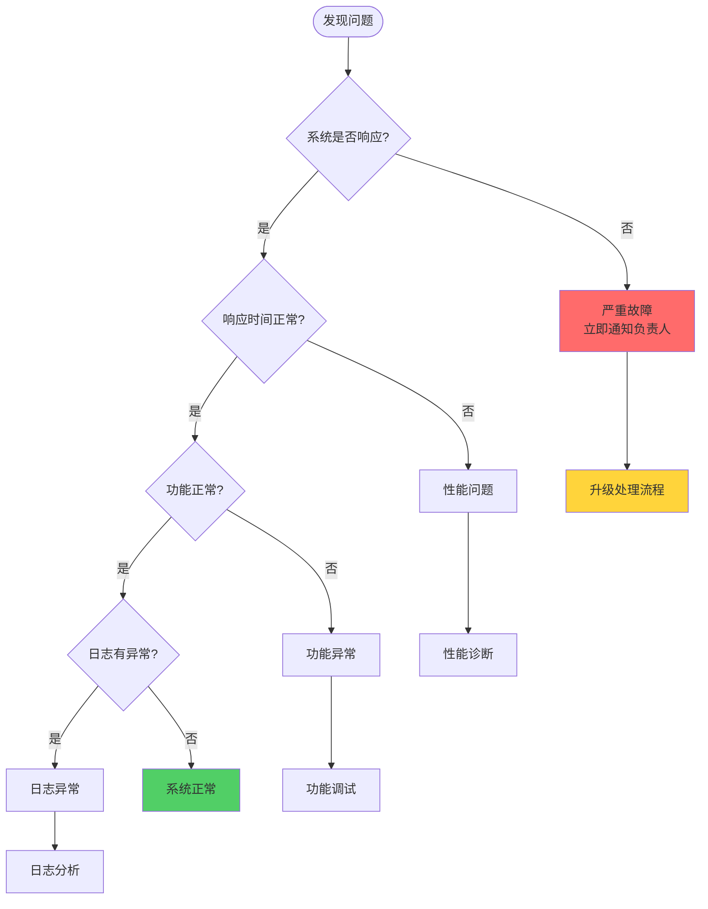
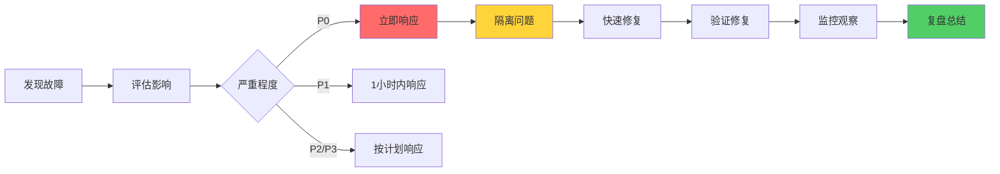

import ComparisonTable from '@site/src/components/ComparisonTable';

# [系统/功能] 故障排查手册

> **文档版本**：v1.0  
> **适用环境**：生产环境 / 测试环境  
> **更新日期**：2025-01-20  
> **维护团队**：[团队名称]

---

## 概述

本文档提供 [系统名称] 的常见故障排查指南，包括问题诊断、解决方案和预防措施。

### 紧急联系方式

| 角色 | 姓名 | 联系方式 | 工作时间 |
|------|------|---------|---------|
| 技术负责人 | 张三 | 138xxxx1234 | 24小时 |
| 运维工程师 | 李四 | 138xxxx5678 | 9:00-21:00 |
| 开发工程师 | 王五 | 138xxxx9012 | 9:00-18:00 |

---

## 一、快速诊断流程



---

## 二、常见问题分类

<ComparisonTable
  caption="问题严重等级"
  headers={['等级', '影响范围', '响应时间', '示例']}
  rows={[
    ['P0 - 紧急', '核心功能不可用，影响所有用户', '15分钟内', '系统宕机、数据库崩溃'],
    ['P1 - 高优先级', '重要功能异常，影响大部分用户', '1小时内', '支付失败、登录缓慢'],
    ['P2 - 中优先级', '部分功能异常，影响部分用户', '4小时内', '报表错误、通知延迟'],
    ['P3 - 低优先级', '小问题，影响体验', '1个工作日内', 'UI显示问题、文案错误']
  ]}
/>

---

## 三、系统无响应问题

### 3.1 问题描述

**症状**：
- 网站无法访问
- API请求超时
- 服务器无响应

### 3.2 诊断步骤

#### 步骤1：检查服务状态

```bash
# 检查应用进程
ps aux | grep java
ps aux | grep node

# 检查端口占用
netstat -tunlp | grep 8080
lsof -i :8080

# 检查系统资源
top
free -h
df -h
```

#### 步骤2：检查网络连接

```bash
# 测试网络连通性
ping api.example.com

# 测试端口是否开放
telnet api.example.com 80
nc -zv api.example.com 80

# 查看网络连接
netstat -an | grep ESTABLISHED
```

#### 步骤3：检查日志

```bash
# 查看应用日志
tail -f /var/log/app/application.log

# 查看错误日志
tail -f /var/log/app/error.log

# 查看系统日志
tail -f /var/log/syslog

# 搜索特定错误
grep "OutOfMemoryError" /var/log/app/*.log
```

### 3.3 常见原因与解决方案

<ComparisonTable
  caption="系统无响应问题解决方案"
  headers={['原因', '症状', '解决方案', '预防措施']}
  rows={[
    [
      '进程崩溃',
      '找不到应用进程',
      '重启应用服务',
      '配置进程守护、添加健康检查'
    ],
    [
      '内存溢出',
      'OutOfMemoryError',
      '增加堆内存、重启服务',
      '优化内存使用、添加监控告警'
    ],
    [
      '端口被占用',
      '无法绑定端口',
      '终止占用进程或更换端口',
      '使用标准端口、配置端口管理'
    ],
    [
      '磁盘空间满',
      '无法写入日志',
      '清理日志文件、扩容磁盘',
      '配置日志轮转、监控磁盘使用'
    ]
  ]}
/>

### 3.4 解决方案示例

#### 方案1：重启应用服务

```bash
# 使用systemd重启
sudo systemctl restart myapp

# 使用PM2重启
pm2 restart myapp

# 使用Docker重启
docker restart myapp-container
```

#### 方案2：清理磁盘空间

```bash
# 查找大文件
du -h /var/log | sort -rh | head -20

# 压缩旧日志
gzip /var/log/app/*.log.1

# 删除旧日志
find /var/log/app -name "*.log.*" -mtime +7 -delete

# 清理Docker镜像
docker system prune -a
```

---

## 四、性能问题

### 4.1 响应时间慢

#### 诊断工具

```bash
# 测试API响应时间
curl -w "\nTime: %{time_total}s\n" https://api.example.com/health

# 使用ab进行压力测试
ab -n 1000 -c 100 https://api.example.com/

# 查看数据库慢查询
mysql> SHOW FULL PROCESSLIST;
mysql> SELECT * FROM information_schema.PROCESSLIST WHERE TIME > 5;
```

#### 性能分析

```bash
# JVM性能分析
jstack <pid> > thread_dump.txt
jmap -heap <pid>

# Node.js性能分析
node --prof app.js
node --prof-process isolate-*.log > processed.txt

# 系统性能分析
vmstat 1 10
iostat -x 1 10
```

### 4.2 数据库性能问题

#### 检查连接数

```sql
-- MySQL
SHOW STATUS LIKE 'Threads_connected';
SHOW VARIABLES LIKE 'max_connections';

-- 查看慢查询
SHOW VARIABLES LIKE 'slow_query%';
SELECT * FROM mysql.slow_log ORDER BY query_time DESC LIMIT 10;
```

#### 优化建议

```sql
-- 添加索引
CREATE INDEX idx_user_email ON users(email);

-- 分析查询计划
EXPLAIN SELECT * FROM users WHERE email = 'test@example.com';

-- 优化表
OPTIMIZE TABLE users;
```

---

## 五、数据库连接问题

### 5.1 连接池耗尽

**症状**：
```
ERROR: Connection pool is exhausted
Unable to acquire connection from pool
```

**诊断**：

```bash
# 查看数据库连接
mysql> SHOW FULL PROCESSLIST;

# 查看连接池配置
grep -A 10 "datasource" application.yml
```

**解决方案**：

```yaml
# 调整连接池配置
spring:
  datasource:
    hikari:
      maximum-pool-size: 20
      minimum-idle: 5
      connection-timeout: 30000
      idle-timeout: 600000
      max-lifetime: 1800000
```

### 5.2 连接超时

**诊断命令**：

```bash
# 测试数据库连接
mysql -h localhost -u root -p -e "SELECT 1"

# 检查网络延迟
ping database-host

# 检查防火墙
telnet database-host 3306
```

---

## 六、内存泄漏问题

### 6.1 诊断步骤

```bash
# 查看内存使用
free -m
ps aux --sort=-%mem | head

# JVM内存分析
jmap -dump:live,format=b,file=heap.bin <pid>

# 使用MAT分析dump文件
# 下载 Eclipse Memory Analyzer Tool

# Node.js内存分析
node --inspect app.js
# 在Chrome中打开 chrome://inspect
```

### 6.2 常见原因

| 原因 | 症状 | 解决方案 |
|------|------|---------|
| 缓存未清理 | 内存持续增长 | 设置缓存过期时间、定期清理 |
| 事件监听器泄漏 | 监听器越来越多 | 及时移除监听器 |
| 闭包引用 | 对象无法回收 | 避免不必要的闭包 |
| 数据库连接未关闭 | 连接数持续增加 | 使用try-finally确保关闭 |

---

## 七、日志分析

### 7.1 错误日志关键词

```bash
# 搜索常见错误
grep -i "error" application.log
grep -i "exception" application.log
grep -i "failed" application.log

# 统计错误次数
grep -c "NullPointerException" application.log

# 查看错误上下文
grep -A 5 -B 5 "OutOfMemoryError" application.log
```

### 7.2 日志分析工具

```bash
# 使用awk分析日志
awk '/ERROR/ {print $0}' application.log

# 使用grep和sort统计
grep "ERROR" application.log | cut -d' ' -f5 | sort | uniq -c | sort -rn

# 实时监控日志
tail -f application.log | grep --line-buffered "ERROR"
```

---

## 八、监控与告警

### 8.1 关键指标

| 指标类型 | 监控项 | 告警阈值 | 处理优先级 |
|---------|--------|---------|-----------|
| **系统资源** | CPU使用率 | > 80% | P1 |
| | 内存使用率 | > 85% | P1 |
| | 磁盘使用率 | > 90% | P0 |
| **应用性能** | API响应时间 | > 1s | P2 |
| | 错误率 | > 1% | P1 |
| | QPS | 异常波动 | P2 |
| **数据库** | 连接数 | > 80% | P1 |
| | 慢查询数 | > 100/分钟 | P2 |
| | 锁等待 | > 5秒 | P1 |

### 8.2 监控工具推荐

<ComparisonTable
  caption="监控工具对比"
  headers={['工具', '类型', '优势', '适用场景']}
  rows={[
    ['Prometheus', '指标监控', '灵活强大、社区活跃', '全面监控'],
    ['Grafana', '可视化', '图表丰富、易于使用', '数据展示'],
    ['ELK Stack', '日志分析', '功能全面、搜索强大', '日志管理'],
    ['Zabbix', '综合监控', '开箱即用、告警完善', '传统监控']
  ]}
/>

---

## 九、应急响应流程

### 9.1 紧急故障处理



### 9.2 故障响应清单

- [ ] 记录故障发现时间
- [ ] 评估影响范围和用户数
- [ ] 通知相关负责人
- [ ] 隔离故障组件
- [ ] 实施临时方案
- [ ] 验证修复效果
- [ ] 监控系统稳定性
- [ ] 编写故障报告
- [ ] 制定预防措施

---

## 十、预防措施

### 10.1 日常检查清单

**每日检查**：
- [ ] 查看系统监控大盘
- [ ] 检查错误日志
- [ ] 查看关键接口性能
- [ ] 确认备份任务执行

**每周检查**：
- [ ] 审查慢查询日志
- [ ] 检查磁盘空间
- [ ] 更新依赖版本
- [ ] 执行压力测试

**每月检查**：
- [ ] 安全漏洞扫描
- [ ] 性能基准测试
- [ ] 故障演练
- [ ] 文档更新

### 10.2 最佳实践

:::tip 💡 运维建议
1. **自动化监控**：配置完善的监控告警系统
2. **日志规范**：统一日志格式，便于分析
3. **文档更新**：及时记录故障和解决方案
4. **演练机制**：定期进行故障演练
5. **备份策略**：确保关键数据定期备份
:::

---

## 十一、常用命令速查

### Linux系统命令

```bash
# 进程管理
ps aux | grep java
kill -9 <pid>
systemctl status myapp

# 网络诊断
netstat -tunlp
ss -tunlp
tcpdump -i eth0 port 80

# 磁盘管理
df -h
du -sh /*
lsof | grep deleted

# 日志查看
tail -f /var/log/app.log
journalctl -u myapp -f
```

### Docker命令

```bash
# 容器管理
docker ps
docker logs -f container_name
docker exec -it container_name bash
docker restart container_name

# 资源查看
docker stats
docker system df
```

---

## 十二、故障案例库

### 案例1：数据库死锁导致服务假死

**时间**：2025-01-15 14:30  
**影响**：订单创建功能不可用，持续15分钟  
**原因**：两个事务互相等待对方释放锁  
**解决**：手动终止死锁事务，优化事务顺序  
**预防**：添加死锁检测告警，优化SQL执行顺序

### 案例2：Redis缓存雪崩

**时间**：2025-01-18 10:00  
**影响**：系统响应慢，数据库负载飙升  
**原因**：大量缓存同时过期，请求直接打到数据库  
**解决**：重启Redis，设置随机过期时间  
**预防**：缓存过期时间添加随机值，实现缓存预热

---

## 附录

### A. 联系方式

| 服务 | 联系方式 |
|------|---------|
| 技术支持热线 | 400-xxx-xxxx |
| 运维邮箱 | ops@example.com |
| 钉钉群 | xxxxx |
| 值班表 | [查看值班表](./on-call-schedule.md) |

### B. 相关文档

- [系统架构文档](./architecture.md)
- [部署手册](./deployment-guide.md)
- [监控配置](./monitoring-setup.md)

---

:::danger 重要提醒
在生产环境进行任何操作前，请务必：
1. 评估影响范围
2. 准备回滚方案
3. 通知相关人员
4. 做好操作记录
:::

