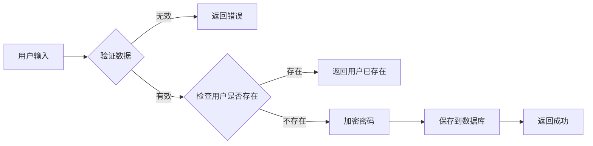

import Tabs from '@theme/Tabs';
import TabItem from '@theme/TabItem';

# [技术/功能] 完整教程

> **难度级别**：★★★☆☆ (初级/中级/高级)  
> **预计时间**：30分钟  
> **更新日期**：2025-01-20  
> **作者**：[作者姓名]

---

## 教程目标

完成本教程后，你将学会：

- 目标 1：掌握核心概念
- 目标 2：完成实际项目
- 目标 3：理解最佳实践
- 目标 4：能够独立开发

---

## 准备工作

### 前置知识

在开始本教程前，你需要了解：

- JavaScript基础知识
- Node.js基本使用
- 命令行操作

### 环境准备

| 软件 | 版本 | 下载链接 |
|------|------|---------|
| Node.js | 18+ | [nodejs.org](https://nodejs.org/) |
| VS Code | 最新版 | [code.visualstudio.com](https://code.visualstudio.com/) |
| Git | 2.0+ | [git-scm.com](https://git-scm.com/) |

---

## 第一步：项目初始化

### 1.1 创建项目目录

```bash
# 创建项目文件夹
mkdir my-awesome-project
cd my-awesome-project

# 初始化Git仓库
git init

# 初始化npm项目
npm init -y
```

:::tip 💡 小贴士
使用 `npm init -y` 可以快速创建 package.json，跳过交互式提问。
:::

### 1.2 安装依赖

<Tabs>
  <TabItem value="npm" label="npm" default>
    ```bash
    npm install express mongoose dotenv
    npm install --save-dev nodemon
    ```
  </TabItem>
  <TabItem value="yarn" label="Yarn">
    ```bash
    yarn add express mongoose dotenv
    yarn add -D nodemon
    ```
  </TabItem>
  <TabItem value="pnpm" label="pnpm">
    ```bash
    pnpm add express mongoose dotenv
    pnpm add -D nodemon
    ```
  </TabItem>
</Tabs>

### 1.3 项目结构

创建以下目录结构：

```
my-awesome-project/
├── src/
│   ├── controllers/
│   ├── models/
│   ├── routes/
│   └── index.js
├── .env
├── .gitignore
└── package.json
```

```bash
# 创建目录
mkdir -p src/{controllers,models,routes}

# 创建文件
touch src/index.js .env .gitignore
```

---

## 第二步：编写核心代码

### 2.1 创建服务器

在 `src/index.js` 中编写代码：

```javascript title="src/index.js" {3-5,8-10}
const express = require('express');
const app = express();
// highlight-next-line
const PORT = process.env.PORT || 3000;

// 中间件配置
app.use(express.json());
// highlight-start
app.use(express.urlencoded({ extended: true }));
// highlight-end

// 健康检查接口
app.get('/health', (req, res) => {
  res.json({ status: 'OK', timestamp: new Date().toISOString() });
});

// 启动服务器
app.listen(PORT, () => {
  console.log(`Server is running on http://localhost:${PORT}`);
});
```

:::note 代码说明
- 第3-5行：定义服务器端口
- 第8-10行：配置中间件，支持JSON和URL编码
:::

### 2.2 创建数据模型

```javascript title="src/models/User.js"
const mongoose = require('mongoose');

const userSchema = new mongoose.Schema({
  username: {
    type: String,
    required: true,
    unique: true,
    trim: true,
    minlength: 3,
    maxlength: 20
  },
  email: {
    type: String,
    required: true,
    unique: true,
    lowercase: true,
    match: /^\S+@\S+\.\S+$/
  },
  password: {
    type: String,
    required: true,
    minlength: 6
  },
  createdAt: {
    type: Date,
    default: Date.now
  }
});

module.exports = mongoose.model('User', userSchema);
```

---

## 第三步：实现业务逻辑

### 3.1 用户注册功能



```javascript title="src/controllers/userController.js"
const User = require('../models/User');
const bcrypt = require('bcryptjs');

exports.register = async (req, res) => {
  try {
    const { username, email, password } = req.body;
    
    // 1. 验证输入
    if (!username || !email || !password) {
      return res.status(400).json({
        success: false,
        message: '请填写完整信息'
      });
    }
    
    // 2. 检查用户是否已存在
    const existingUser = await User.findOne({ 
      $or: [{ email }, { username }] 
    });
    
    if (existingUser) {
      return res.status(409).json({
        success: false,
        message: '用户名或邮箱已被注册'
      });
    }
    
    // 3. 加密密码
    const hashedPassword = await bcrypt.hash(password, 10);
    
    // 4. 创建用户
    const newUser = new User({
      username,
      email,
      password: hashedPassword
    });
    
    await newUser.save();
    
    // 5. 返回成功响应（不返回密码）
    res.status(201).json({
      success: true,
      message: '注册成功',
      data: {
        id: newUser._id,
        username: newUser.username,
        email: newUser.email
      }
    });
    
  } catch (error) {
    console.error('注册错误:', error);
    res.status(500).json({
      success: false,
      message: '服务器错误'
    });
  }
};
```

---

## 第四步：测试功能

### 4.1 启动服务器

```bash
# 开发模式（自动重启）
npm run dev

# 或使用 nodemon
nodemon src/index.js
```

### 4.2 测试API

使用cURL测试注册接口：

```bash
curl -X POST http://localhost:3000/api/register \
  -H "Content-Type: application/json" \
  -d '{
    "username": "testuser",
    "email": "test@example.com",
    "password": "password123"
  }'
```

预期响应：

```json
{
  "success": true,
  "message": "注册成功",
  "data": {
    "id": "507f1f77bcf86cd799439011",
    "username": "testuser",
    "email": "test@example.com"
  }
}
```

---

## 第五步：优化与部署

### 5.1 添加环境变量

编辑 `.env` 文件：

```env title=".env"
PORT=3000
MONGODB_URI=mongodb://localhost:27017/myapp
JWT_SECRET=your-super-secret-key
NODE_ENV=development
```

:::warning ⚠️ 安全提示
永远不要将 `.env` 文件提交到版本控制！请将它添加到 `.gitignore`。
:::

### 5.2 添加错误处理

```javascript title="src/middleware/errorHandler.js"
module.exports = (err, req, res, next) => {
  console.error(err.stack);
  
  res.status(err.status || 500).json({
    success: false,
    message: err.message || '服务器错误',
    ...(process.env.NODE_ENV === 'development' && {
      stack: err.stack
    })
  });
};
```

### 5.3 Docker化部署

```dockerfile title="Dockerfile"
FROM node:18-alpine

WORKDIR /app

COPY package*.json ./
RUN npm ci --only=production

COPY . .

EXPOSE 3000

CMD ["node", "src/index.js"]
```

---

## 总结

恭喜你完成了本教程！你已经学会了：

- 如何搭建Node.js项目
- 如何使用Express创建API
- 如何使用MongoDB存储数据
- 如何实现用户注册功能
- 如何测试和部署应用

---

## 扩展阅读

### 进阶主题

1. **安全性增强**
   - 实现JWT认证
   - 添加请求限流
   - 防止SQL注入

2. **性能优化**
   - 添加Redis缓存
   - 数据库索引优化
   - 使用PM2进行进程管理

3. **测试**
   - 单元测试（Jest）
   - 集成测试（Supertest）
   - 端到端测试

### 相关资源

- [Express官方文档](https://expressjs.com/)
- [Mongoose文档](https://mongoosejs.com/)
- [Node.js最佳实践](https://github.com/goldbergyoni/nodebestpractices)

---

## 💬 练习题

### 练习1：添加用户登录功能

实现用户登录接口，要求：
- 验证用户名和密码
- 返回JWT token
- 处理错误情况

### 练习2：实现密码重置

创建密码重置流程：
- 发送重置邮件
- 验证重置令牌
- 更新用户密码

---

## 常见问题

### Q1: 连接MongoDB失败

**问题**：`MongoNetworkError: connection refused`

**解决方案**：
```bash
# 检查MongoDB是否运行
mongod --version

# 启动MongoDB
# Windows
net start MongoDB

# Linux/Mac
sudo systemctl start mongod
```

### Q2: 端口被占用

**问题**：`Error: listen EADDRINUSE: address already in use :::3000`

**解决方案**：
```bash
# 查找占用端口的进程
# Windows
netstat -ano | findstr :3000

# Linux/Mac
lsof -i :3000

# 终止进程或更换端口
```

---

## 🤝 反馈与贡献

如果你发现教程中的问题，或有改进建议，欢迎：

- 📧 发送邮件到：tutorial@example.com
- 💬 在GitHub提Issue
- 🌟 给我们的项目加星

---

:::tip 🎉 恭喜！
你已经完成了整个教程！现在试着自己构建一个完整的应用吧！
:::

