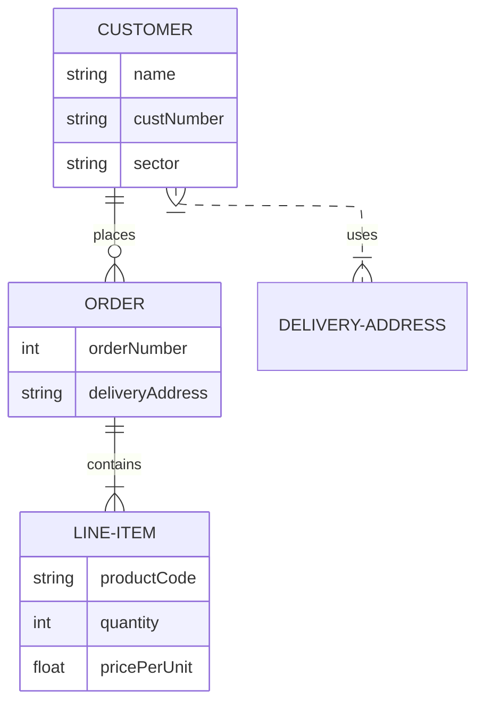
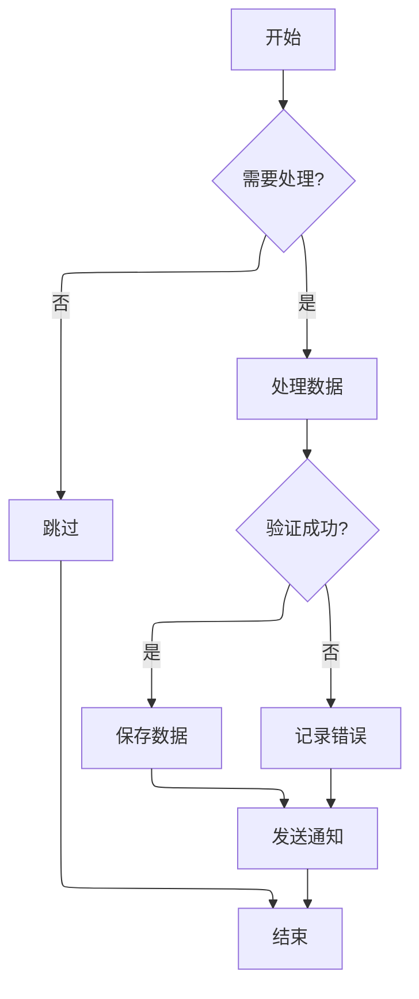
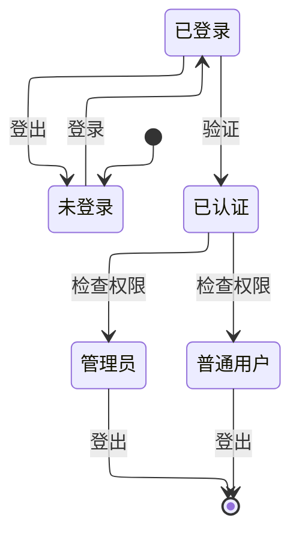

# 🎉 Docusaurus 3.9 新特性演示

本文档展示了 Docusaurus 3.9.2 版本的新特性和功能。

## 📊 Mermaid ELK 布局

Docusaurus 3.9 引入了对 Mermaid ELK 布局的支持，可以创建更复杂和美观的图表。

### 基础 ER 图（使用 ELK 布局）



### 复杂流程图（使用 ELK 布局）



### 状态图（使用 ELK 布局）



## ✨ Markdown 新特性

### Emoji 自动转换

配置了 `markdown.emoji: true` 后，可以使用 emoji 代码：

- :smile: = `:smile:`
- :heart: = `:heart:`
- :rocket: = `:rocket:`
- :fire: = `:fire:`
- :star: = `:star:`

### @site/* 链接支持

现在可以使用 `@site/*` 路径引用文件：

```markdown
查看 [配置文件](@site/docusaurus.config.js)
```

### Markdown 钩子函数

在 `docusaurus.config.js` 中配置了新的 Markdown 钩子：

```javascript
markdown: {
  hooks: {
    // 处理损坏的链接
    onBrokenMarkdownLinks: (link) => {
      console.warn(`Broken link: ${link}`);
      return undefined; // 或返回备用 URL
    },
    // 处理损坏的图片
    onBrokenMarkdownImages: (image) => {
      return '/img/placeholder.png'; // 返回占位图
    },
  },
}
```

## 🌍 i18n 增强

### translate 配置标志

```javascript
i18n: {
  localeConfigs: {
    'zh-Hans': {
      translate: true, // 启用翻译
    },
    'en': {
      translate: true,
    },
  },
}
```

对于不需要翻译的站点，可以设置为 `false` 以提高构建速度。

### Sidebar 翻译 key

可以为侧边栏项设置显式的翻译 key，避免冲突：

```javascript
sidebar: [
  {
    type: 'category',
    label: 'API',
    key: 'api-frontend', // 避免翻译冲突
    items: [],
  },
  {
    type: 'category',
    label: 'API',
    key: 'api-backend', // 不同的 key
    items: [],
  },
]
```

## 🚀 性能优化

### Rspack 1.5

Docusaurus 3.9 升级到 Rspack 1.5，构建速度更快。

### Mermaid 懒加载

Mermaid 库现在采用懒加载，只在需要时才加载，减少初始页面大小。

## 📝 其他改进

### 1. 颜色模式切换优化

修复了使用 `useColorMode()` 钩子时的视觉闪烁问题。

### 2. 长标签优化

改进了侧边栏中长标签的显示效果。

### 3. 打印友好

打印视图自动隐藏"编辑此页"按钮。

### 4. 作者邮箱支持

博客作者现在可以显示邮箱图标：

```yaml
authors:
  laby:
    name: Laby
    email: laby@example.com
    socials:
      email: true
```

## 💡 最佳实践

1. **使用 ELK 布局处理复杂图表**：对于大型或复杂的 Mermaid 图表，使用 ELK 布局可以获得更好的视觉效果。

2. **配置 Markdown 钩子**：使用 `onBrokenMarkdownLinks` 和 `onBrokenMarkdownImages` 钩子优雅地处理损坏的链接和图片。

3. **优化 i18n 配置**：如果不需要翻译，将 `translate` 设为 `false` 可以提高构建速度。

4. **利用 @site/* 路径**：使用 `@site/*` 可以更方便地引用项目文件。

## 📚 参考资源

- [Docusaurus 3.9 发布博客](https://docusaurus.io/blog/releases/3.9)
- [Docusaurus 3.9.2 更新日志](https://docusaurus.io/changelog/3.9.2)
- [Mermaid ELK 文档](https://mermaid.js.org/config/layout.html)

---

**更新时间**: 2025-12-12  
**Docusaurus 版本**: 3.9.2
