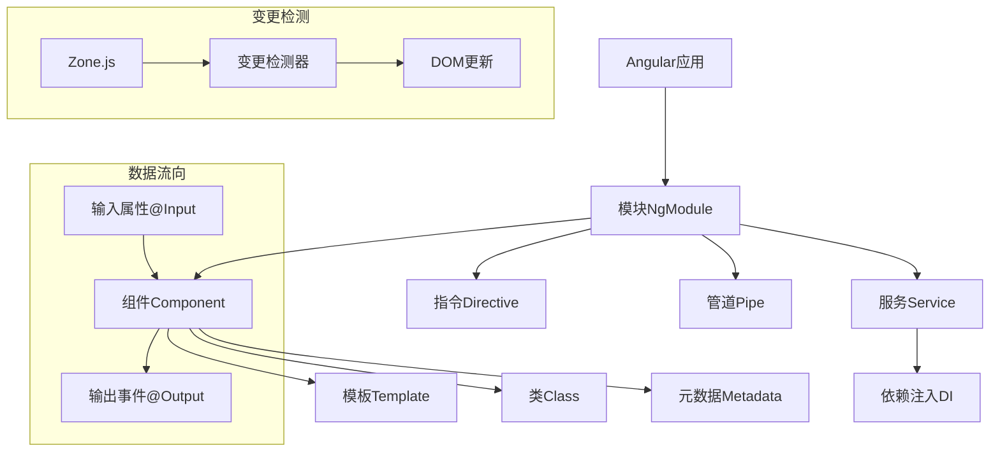

import Tabs from '@theme/Tabs';
import TabItem from '@theme/TabItem';
import CodeBlock from '@theme/CodeBlock';

# Angular基础教程

Angular是由Google维护的一个开源前端框架，它提供了完整的解决方案用于构建复杂的企业级单页面应用程序(SPA)。Angular采用TypeScript语言开发，提供了组件化架构、依赖注入、响应式编程和全面的工具生态系统。

:::tip 核心价值
**Angular框架优势**
- 🏗️ **完整框架**：提供一站式解决方案，不需要选择额外库
- 📦 **组件化架构**：基于组件的模块化开发方式
- 🧰 **依赖注入**：强大的依赖注入系统简化测试和管理
- 📋 **TypeScript支持**：内置TypeScript支持，提供类型安全
- 🛠️ **工具生态**：Angular CLI提供完善的开发工具链
- 🔄 **双向绑定**：灵活的数据绑定机制
:::

## 1. Angular架构概览

Angular应用是由模块、组件和服务等构建块组成的：



### 1.1 核心构建块

- **模块(NgModule)**: 相关组件、指令、管道和服务的容器
- **组件(Component)**: 控制视图的类，负责数据和UI交互
- **模板(Template)**: 定义组件视图的HTML
- **元数据(Metadata)**: 通过装饰器定义类的行为
- **服务(Service)**: 共享数据和功能的可复用类
- **依赖注入(DI)**: 管理组件和服务依赖关系的设计模式

## 2. 开始使用Angular

### 2.1 安装Angular CLI

Angular CLI是一个命令行工具，用于初始化、开发、构建和维护Angular应用：

```bash
# 安装Angular CLI
npm install -g @angular/cli

# 查看版本
ng version
```

### 2.2 创建新项目

使用Angular CLI创建一个新项目：

```bash
# 创建新项目
ng new my-angular-app

# 选项说明:
# --strict: 启用严格模式
# --routing: 添加路由模块
# --style=scss: 使用SCSS预处理器

cd my-angular-app
ng serve
```

### 2.3 Angular项目结构

```
my-angular-app/
├── src/                     # 源代码目录
│   ├── app/                 # 应用程序组件
│   │   ├── app.component.ts # 根组件
│   │   ├── app.component.html
│   │   ├── app.component.scss
│   │   ├── app.component.spec.ts
│   │   ├── app.module.ts    # 根模块
│   │   └── app-routing.module.ts
│   ├── assets/              # 静态资源
│   ├── environments/        # 环境配置
│   ├── favicon.ico
│   ├── index.html           # 主HTML文件
│   ├── main.ts              # 应用入口点
│   ├── polyfills.ts         # 浏览器兼容性脚本
│   └── styles.scss          # 全局样式
├── angular.json             # Angular工作区配置
├── package.json             # NPM依赖
├── tsconfig.json            # TypeScript配置
└── README.md
```

## 3. 组件基础

组件是Angular应用的核心构建块，每个组件包含：
- 一个HTML模板定义视图
- 一个TypeScript类控制逻辑和数据
- CSS样式定义外观

### 3.1 创建组件

使用Angular CLI创建组件：

```bash
ng generate component hero
# 简写形式
ng g c hero
```

组件文件结构：

```
src/app/hero/
├── hero.component.ts       # 组件类和元数据
├── hero.component.html     # HTML模板
├── hero.component.scss     # 样式(SCSS)
└── hero.component.spec.ts  # 单元测试
```

基本组件结构：

```typescript title="hero.component.ts"
import { Component, OnInit } from '@angular/core';

@Component({
  selector: 'app-hero',
  templateUrl: './hero.component.html',
  styleUrls: ['./hero.component.scss']
})
export class HeroComponent implements OnInit {
  // 组件属性
  name: string = 'Windstorm';
  
  constructor() { }

  ngOnInit(): void {
    // 组件初始化逻辑
  }
  
  // 组件方法
  greet(): string {
    return `Hello, ${this.name}!`;
  }
}
```

### 3.2 组件模板语法

Angular模板支持多种绑定语法：

```html title="hero.component.html"
<div class="hero-card">
  <!-- 插值表达式 -->
  <h2>{{ name }}</h2>
  
  <!-- 属性绑定 -->
  
  
  <!-- 事件绑定 -->
  <button (click)="onSelect()">选择</button>
  
  <!-- 双向绑定 (需要FormsModule) -->
  <input [(ngModel)]="name">
  
  <!-- 模板引用变量 -->
  <input #heroInput>
  <button (click)="updateName(heroInput.value)">更新名称</button>
  
  <!-- 条件渲染 -->
  <div *ngIf="isSelected">已选择!</div>
  
  <!-- 列表渲染 -->
  <ul>
    <li *ngFor="let power of powers; let i = index">
      {{ i + 1 }}. {{ power }}
    </li>
  </ul>
  
  <!-- 类绑定 -->
  <div [class.selected]="isSelected">状态展示</div>
  
  <!-- 样式绑定 -->
  <div [style.color]="isActive ? 'green' : 'red'">状态颜色</div>
</div>
```

### 3.3 生命周期钩子

Angular组件有一系列生命周期钩子：

| 钩子 | 时机 | 用途 |
|------|------|------|
| `ngOnChanges` | 输入属性变化时 | 响应输入属性变化 |
| `ngOnInit` | 组件初始化时 | 执行初始化逻辑 |
| `ngDoCheck` | 变更检测运行时 | 自定义变更检测 |
| `ngAfterContentInit` | 内容投影初始化后 | 处理投影内容 |
| `ngAfterContentChecked` | 内容投影检查后 | 检查投影内容变化 |
| `ngAfterViewInit` | 视图初始化后 | 处理子视图逻辑 |
| `ngAfterViewChecked` | 视图检查后 | 检查视图变化 |
| `ngOnDestroy` | 组件销毁前 | 清理资源 |

示例实现：

```typescript
import { Component, OnInit, OnDestroy, OnChanges, SimpleChanges, Input } from '@angular/core';

@Component({
  selector: 'app-lifecycle',
  template: `<div>{{ data }}</div>`
})
export class LifecycleComponent implements OnInit, OnChanges, OnDestroy {
  @Input() data: string;
  
  constructor() {
    console.log('Constructor called');
  }
  
  ngOnChanges(changes: SimpleChanges) {
    console.log('ngOnChanges called', changes);
  }
  
  ngOnInit() {
    console.log('ngOnInit called');
  }
  
  ngOnDestroy() {
    console.log('ngOnDestroy called');
    // 清理代码（取消订阅、清除定时器等）
  }
}
```

## 4. 指令基础

Angular有三种类型的指令：

1. **组件指令**: 带有模板的指令
2. **结构型指令**: 修改DOM结构（*ngIf, *ngFor, *ngSwitch）
3. **属性型指令**: 修改元素的外观或行为（ngClass, ngStyle）

### 4.1 内置指令

```html title="内置指令示例"
<!-- NgIf -->
<div *ngIf="isLoggedIn; else loginBlock">
  欢迎回来，{{ username }}!
</div>
<ng-template #loginBlock>
  请登录以继续
</ng-template>

<!-- NgFor -->
<ul>
  <li *ngFor="let item of items; let i = index; trackBy: trackByFn">
    {{ i + 1 }} - {{ item.name }}
  </li>
</ul>

<!-- NgSwitch -->
<div [ngSwitch]="userRole">
  <div *ngSwitchCase="'admin'">管理员面板</div>
  <div *ngSwitchCase="'editor'">编辑面板</div>
  <div *ngSwitchDefault>用户面板</div>
</div>

<!-- NgClass -->
<div [ngClass]="{
  'active': isActive,
  'disabled': isDisabled,
  'highlight': isHighlighted
}">样式控制</div>

<!-- NgStyle -->
<div [ngStyle]="{
  'color': textColor,
  'font-size.px': fontSize,
  'background-color': isImportant ? 'red' : 'transparent'
}">样式控制</div>
```

### 4.2 自定义指令

创建自定义指令：

```bash
ng generate directive highlight
# 简写
ng g d highlight
```

实现自定义指令：

```typescript title="highlight.directive.ts"
import { Directive, ElementRef, HostListener, Input } from '@angular/core';

@Directive({
  selector: '[appHighlight]'
})
export class HighlightDirective {
  @Input('appHighlight') highlightColor: string = 'yellow';
  @Input() defaultColor: string = '';
  
  constructor(private el: ElementRef) {}
  
  @HostListener('mouseenter') onMouseEnter() {
    this.highlight(this.highlightColor || 'yellow');
  }
  
  @HostListener('mouseleave') onMouseLeave() {
    this.highlight(this.defaultColor);
  }
  
  private highlight(color: string) {
    this.el.nativeElement.style.backgroundColor = color;
  }
}
```

使用自定义指令：

```html
<p appHighlight="lightblue" defaultColor="white">
  鼠标悬停时会高亮显示
</p>
```

## 5. 模块系统

Angular应用由模块组成，主要模块类型包括：

1. **根模块(AppModule)**: 应用的引导模块
2. **功能模块**: 关注特定功能的模块
3. **共享模块**: 提供共享组件/指令/管道的模块
4. **核心模块**: 提供单例服务的模块
5. **路由模块**: 配置路由的模块

### 5.1 创建功能模块

```bash
ng generate module admin
# 简写
ng g m admin
```

模块定义示例：

```typescript title="admin.module.ts"
import { NgModule } from '@angular/core';
import { CommonModule } from '@angular/common';
import { FormsModule } from '@angular/forms';

import { AdminRoutingModule } from './admin-routing.module';
import { AdminDashboardComponent } from './admin-dashboard/admin-dashboard.component';
import { UserManagementComponent } from './user-management/user-management.component';

@NgModule({
  imports: [
    CommonModule,
    FormsModule,
    AdminRoutingModule
  ],
  declarations: [
    AdminDashboardComponent,
    UserManagementComponent
  ],
  exports: [
    AdminDashboardComponent // 导出给其他模块使用
  ]
})
export class AdminModule { }
```

### 5.2 共享模块

创建共享模块：

```typescript title="shared.module.ts"
import { NgModule } from '@angular/core';
import { CommonModule } from '@angular/common';
import { FormsModule } from '@angular/forms';

import { HighlightDirective } from './directives/highlight.directive';
import { ButtonComponent } from './components/button/button.component';
import { CardComponent } from './components/card/card.component';
import { TruncatePipe } from './pipes/truncate.pipe';

@NgModule({
  imports: [
    CommonModule
  ],
  declarations: [
    HighlightDirective,
    ButtonComponent,
    CardComponent,
    TruncatePipe
  ],
  exports: [
    CommonModule,
    FormsModule,
    HighlightDirective,
    ButtonComponent,
    CardComponent,
    TruncatePipe
  ]
})
export class SharedModule { }
```

## 6. 服务与依赖注入

服务是一个广义的类别，用于封装可重用的逻辑，如数据访问、日志记录和业务规则。

### 6.1 创建服务

```bash
ng generate service hero
# 简写
ng g s hero
```

服务实现：

```typescript title="hero.service.ts"
import { Injectable } from '@angular/core';
import { HttpClient } from '@angular/common/http';
import { Observable, of } from 'rxjs';
import { catchError, map, tap } from 'rxjs/operators';

import { Hero } from './hero.model';
import { LoggingService } from './logging.service';

@Injectable({
  providedIn: 'root' // 注册为应用级单例
})
export class HeroService {
  private apiUrl = 'api/heroes';
  
  constructor(
    private http: HttpClient,
    private loggingService: LoggingService
  ) { }
  
  getHeroes(): Observable<Hero[]> {
    return this.http.get<Hero[]>(this.apiUrl).pipe(
      tap(_ => this.log('fetched heroes')),
      catchError(this.handleError<Hero[]>('getHeroes', []))
    );
  }
  
  getHero(id: number): Observable<Hero> {
    const url = `${this.apiUrl}/${id}`;
    return this.http.get<Hero>(url).pipe(
      tap(_ => this.log(`fetched hero id=${id}`)),
      catchError(this.handleError<Hero>(`getHero id=${id}`))
    );
  }
  
  private log(message: string) {
    this.loggingService.log(`HeroService: ${message}`);
  }
  
  private handleError<T>(operation = 'operation', result?: T) {
    return (error: any): Observable<T> => {
      console.error(error);
      this.log(`${operation} failed: ${error.message}`);
      return of(result as T);
    };
  }
}
```

### 6.2 依赖注入

依赖注入(DI)是一种设计模式，用于实现控制反转。Angular的DI系统通过以下方式工作：

1. **提供者(Provider)**: 告诉Angular如何创建服务实例
2. **注入器(Injector)**: 维护服务实例并在需要时创建
3. **依赖(Dependency)**: 服务或对象，注入到类中

提供服务的方式：

```typescript
// 1. 在@Injectable装饰器中提供
@Injectable({
  providedIn: 'root' // 应用级单例
})
export class LoggingService { }

// 2. 在模块中提供
@NgModule({
  providers: [HeroService]
})
export class AppModule { }

// 3. 在组件中提供(组件及其子组件可用)
@Component({
  providers: [UserService]
})
export class UserComponent { }
```

## 7. 表单处理

Angular提供两种表单处理方法：模板驱动表单和响应式表单。

### 7.1 模板驱动表单

基于模板指令，简单直观，适合简单场景：

```typescript title="contact-form.component.ts"
import { Component } from '@angular/core';
import { NgForm } from '@angular/forms';

interface ContactForm {
  name: string;
  email: string;
  message: string;
}

@Component({
  selector: 'app-contact-form',
  templateUrl: './contact-form.component.html'
})
export class ContactFormComponent {
  model: ContactForm = {
    name: '',
    email: '',
    message: ''
  };
  
  submitted = false;
  
  onSubmit(form: NgForm) {
    if (form.valid) {
      console.log('Form submitted', this.model);
      this.submitted = true;
      // 处理表单提交...
    }
  }
}
```

```html title="contact-form.component.html"
<div class="container">
  <div *ngIf="submitted" class="alert alert-success">
    表单已提交成功！
  </div>

  <form #contactForm="ngForm" (ngSubmit)="onSubmit(contactForm)" novalidate>
    <div class="form-group">
      <label for="name">姓名</label>
      <input
        type="text"
        class="form-control"
        id="name"
        name="name"
        [(ngModel)]="model.name"
        required
        #name="ngModel">
      <div [hidden]="name.valid || name.pristine" class="alert alert-danger">
        姓名是必填项
      </div>
    </div>

    <div class="form-group">
      <label for="email">电子邮箱</label>
      <input
        type="email"
        class="form-control"
        id="email"
        name="email"
        [(ngModel)]="model.email"
        required
        email
        #email="ngModel">
      <div [hidden]="email.valid || email.pristine" class="alert alert-danger">
        请输入有效的电子邮箱
      </div>
    </div>

    <div class="form-group">
      <label for="message">留言</label>
      <textarea
        class="form-control"
        id="message"
        name="message"
        rows="5"
        [(ngModel)]="model.message"
        required
        minlength="10"
        #message="ngModel"></textarea>
      <div [hidden]="message.valid || message.pristine" class="alert alert-danger">
        留言至少需要10个字符
      </div>
    </div>

    <button type="submit" class="btn btn-primary" [disabled]="!contactForm.form.valid">
      提交
    </button>
  </form>
</div>
```

### 7.2 响应式表单

基于显式模型定义，更加灵活强大，适合复杂场景：

```typescript title="registration.component.ts"
import { Component, OnInit } from '@angular/core';
import { FormBuilder, FormGroup, FormControl, Validators, AbstractControl, ValidationErrors } from '@angular/forms';

@Component({
  selector: 'app-registration',
  templateUrl: './registration.component.html'
})
export class RegistrationComponent implements OnInit {
  registrationForm: FormGroup;
  submitted = false;
  
  constructor(private fb: FormBuilder) { }
  
  ngOnInit() {
    this.registrationForm = this.fb.group({
      name: ['', [Validators.required, Validators.minLength(3)]],
      email: ['', [Validators.required, Validators.email]],
      password: ['', [Validators.required, Validators.minLength(8)]],
      confirmPassword: ['', Validators.required],
      terms: [false, Validators.requiredTrue]
    }, {
      validators: this.passwordMatchValidator
    });
  }
  
  // 自定义验证器
  passwordMatchValidator(control: AbstractControl): ValidationErrors | null {
    const password = control.get('password');
    const confirmPassword = control.get('confirmPassword');
    
    if (password?.value !== confirmPassword?.value) {
      return { 'passwordMismatch': true };
    }
    
    return null;
  }
  
  get f() {
    return this.registrationForm.controls;
  }
  
  onSubmit() {
    this.submitted = true;
    
    if (this.registrationForm.invalid) {
      return;
    }
    
    console.log('Registration form submitted', this.registrationForm.value);
    // 处理表单提交...
  }
}
```

```html title="registration.component.html"
<div class="container">
  <h2>用户注册</h2>
  
  <form [formGroup]="registrationForm" (ngSubmit)="onSubmit()">
    <div class="form-group">
      <label for="name">姓名</label>
      <input
        type="text"
        id="name"
        formControlName="name"
        class="form-control"
        [ngClass]="{ 'is-invalid': submitted && f.name.errors }">
      <div *ngIf="submitted && f.name.errors" class="invalid-feedback">
        <div *ngIf="f.name.errors.required">姓名是必填项</div>
        <div *ngIf="f.name.errors.minlength">姓名至少需要3个字符</div>
      </div>
    </div>
    
    <div class="form-group">
      <label for="email">电子邮箱</label>
      <input
        type="email"
        id="email"
        formControlName="email"
        class="form-control"
        [ngClass]="{ 'is-invalid': submitted && f.email.errors }">
      <div *ngIf="submitted && f.email.errors" class="invalid-feedback">
        <div *ngIf="f.email.errors.required">电子邮箱是必填项</div>
        <div *ngIf="f.email.errors.email">请输入有效的电子邮箱地址</div>
      </div>
    </div>
    
    <div class="form-group">
      <label for="password">密码</label>
      <input
        type="password"
        id="password"
        formControlName="password"
        class="form-control"
        [ngClass]="{ 'is-invalid': submitted && f.password.errors }">
      <div *ngIf="submitted && f.password.errors" class="invalid-feedback">
        <div *ngIf="f.password.errors.required">密码是必填项</div>
        <div *ngIf="f.password.errors.minlength">密码至少需要8个字符</div>
      </div>
    </div>
    
    <div class="form-group">
      <label for="confirmPassword">确认密码</label>
      <input
        type="password"
        id="confirmPassword"
        formControlName="confirmPassword"
        class="form-control"
        [ngClass]="{ 'is-invalid': submitted && (f.confirmPassword.errors || registrationForm.errors?.passwordMismatch) }">
      <div *ngIf="submitted && (f.confirmPassword.errors || registrationForm.errors?.passwordMismatch)" class="invalid-feedback">
        <div *ngIf="f.confirmPassword.errors?.required">确认密码是必填项</div>
        <div *ngIf="registrationForm.errors?.passwordMismatch">两次输入的密码不匹配</div>
      </div>
    </div>
    
    <div class="form-group form-check">
      <input
        type="checkbox"
        id="terms"
        formControlName="terms"
        class="form-check-input"
        [ngClass]="{ 'is-invalid': submitted && f.terms.errors }">
      <label for="terms" class="form-check-label">我同意所有条款和条件</label>
      <div *ngIf="submitted && f.terms.errors" class="invalid-feedback">
        <div *ngIf="f.terms.errors.required">必须同意条款和条件才能继续</div>
      </div>
    </div>
    
    <button type="submit" class="btn btn-primary">注册</button>
  </form>
</div>
```

## 8. HTTP通信

Angular提供`HttpClient`用于与服务器通信。

```typescript title="data.service.ts"
import { Injectable } from '@angular/core';
import { HttpClient, HttpHeaders, HttpParams } from '@angular/common/http';
import { Observable, throwError } from 'rxjs';
import { catchError, retry, map } from 'rxjs/operators';

import { Product } from './product.model';

@Injectable({
  providedIn: 'root'
})
export class DataService {
  private apiUrl = 'https://api.example.com/products';
  
  constructor(private http: HttpClient) { }
  
  getProducts(category?: string): Observable<Product[]> {
    let params = new HttpParams();
    if (category) {
      params = params.set('category', category);
    }
    
    return this.http.get<Product[]>(this.apiUrl, { params }).pipe(
      retry(2), // 失败时重试
      catchError(this.handleError)
    );
  }
  
  getProduct(id: number): Observable<Product> {
    return this.http.get<Product>(`${this.apiUrl}/${id}`).pipe(
      catchError(this.handleError)
    );
  }
  
  createProduct(product: Product): Observable<Product> {
    const httpOptions = {
      headers: new HttpHeaders({
        'Content-Type': 'application/json'
      })
    };
    
    return this.http.post<Product>(this.apiUrl, product, httpOptions).pipe(
      catchError(this.handleError)
    );
  }
  
  updateProduct(product: Product): Observable<Product> {
    return this.http.put<Product>(`${this.apiUrl}/${product.id}`, product).pipe(
      catchError(this.handleError)
    );
  }
  
  deleteProduct(id: number): Observable<void> {
    return this.http.delete<void>(`${this.apiUrl}/${id}`).pipe(
      catchError(this.handleError)
    );
  }
  
  private handleError(error: any) {
    let errorMessage = '';
    if (error.error instanceof ErrorEvent) {
      // 客户端错误
      errorMessage = `Error: ${error.error.message}`;
    } else {
      // 服务器端错误
      errorMessage = `Error Code: ${error.status}\nMessage: ${error.message}`;
    }
    console.error(errorMessage);
    return throwError(() => new Error(errorMessage));
  }
}
```

在组件中使用HTTP服务：

```typescript title="product-list.component.ts"
import { Component, OnInit } from '@angular/core';
import { DataService } from '../services/data.service';
import { Product } from '../models/product.model';

@Component({
  selector: 'app-product-list',
  templateUrl: './product-list.component.html'
})
export class ProductListComponent implements OnInit {
  products: Product[] = [];
  loading = false;
  error = '';
  
  constructor(private dataService: DataService) { }
  
  ngOnInit(): void {
    this.getProducts();
  }
  
  getProducts(): void {
    this.loading = true;
    this.dataService.getProducts()
      .subscribe({
        next: (data) => {
          this.products = data;
          this.loading = false;
        },
        error: (error) => {
          this.error = error;
          this.loading = false;
        }
      });
  }
  
  deleteProduct(id: number): void {
    if (confirm('确定要删除这个产品吗?')) {
      this.dataService.deleteProduct(id)
        .subscribe({
          next: () => {
            this.products = this.products.filter(p => p.id !== id);
          },
          error: (error) => {
            this.error = error;
          }
        });
    }
  }
}
```

## 9. Angular最佳实践

### 9.1 目录结构

推荐按功能模块组织目录：

```
app/
├── core/                    # 核心功能(单例服务、拦截器等)
│   ├── services/
│   ├── interceptors/
│   └── core.module.ts
├── shared/                  # 共享组件、指令、管道
│   ├── components/
│   ├── directives/
│   ├── pipes/
│   └── shared.module.ts
├── features/                # 按功能划分的模块
│   ├── home/
│   ├── auth/
│   ├── products/
│   └── admin/
├── models/                  # 数据模型/接口
├── utils/                   # 工具函数
├── app-routing.module.ts
├── app.component.ts
└── app.module.ts
```

### 9.2 性能优化

1. **使用OnPush变更检测**：减少不必要的变更检测
2. **延迟加载模块**：提高初始加载性能
3. **追踪NgFor**：为大列表使用trackBy函数
4. **纯管道**：使用纯管道进行数据转换
5. **使用AOT编译**：提前编译提高性能

```typescript
// OnPush变更检测
@Component({
  changeDetection: ChangeDetectionStrategy.OnPush
})

// NgFor优化
<div *ngFor="let item of items; trackBy: trackById"></div>

trackById(index: number, item: any): number {
  return item.id;
}
```

### 9.3 代码风格指南

- 遵循官方Angular风格指南
- 使用类型安全(TypeScript接口和类型)
- 将业务逻辑从组件移至服务
- 避免在模板中使用复杂表达式
- 组件保持小巧、聚焦且可重用
- 使用RxJS操作符简化异步代码 