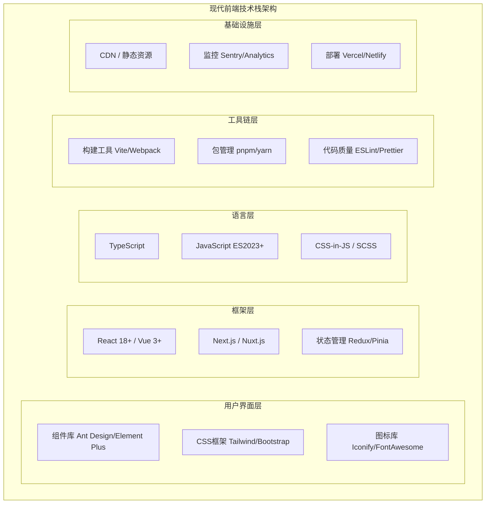
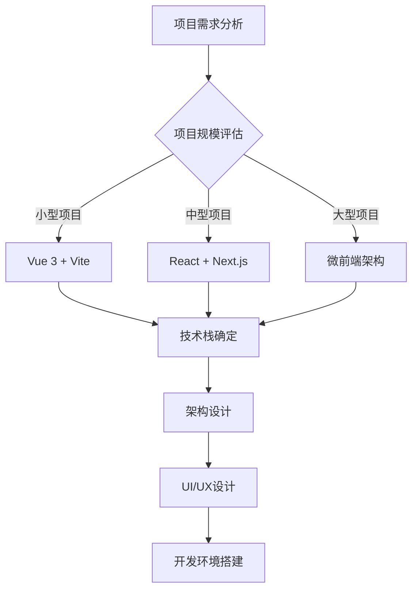
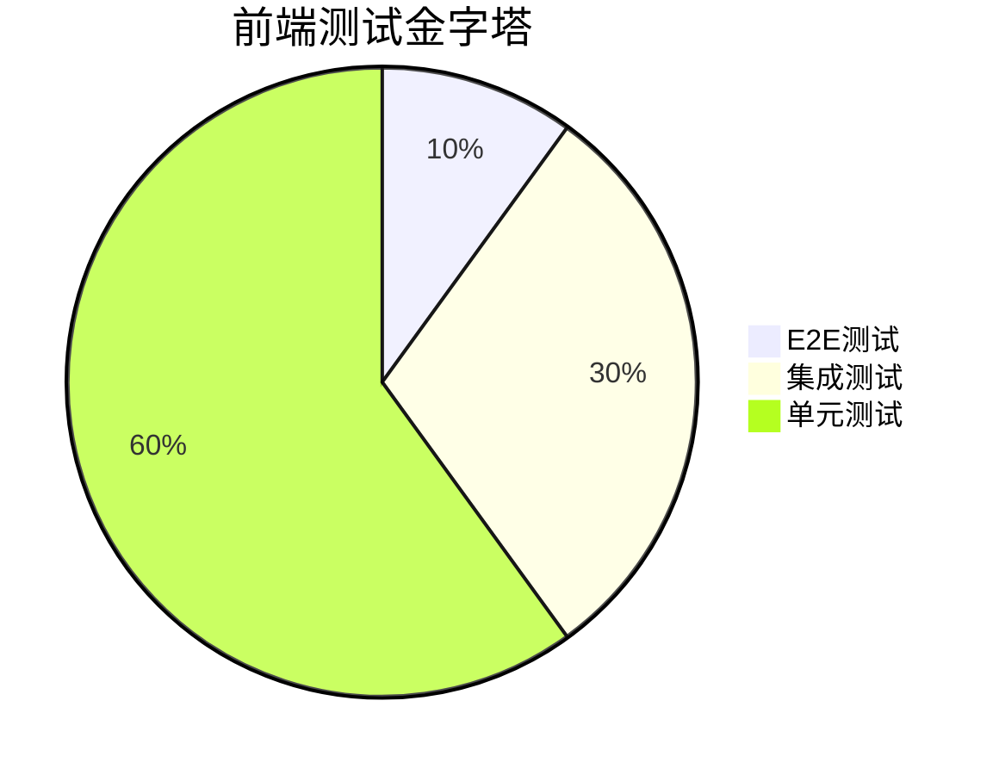
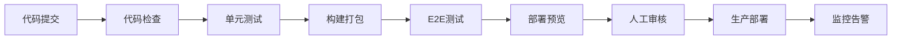

import Tabs from '@theme/Tabs';
import TabItem from '@theme/TabItem';
import CodeBlock from '@theme/CodeBlock';

# 现代前端开发全栈指南

现代前端开发已经从简单的页面制作演进为复杂的工程化体系，涵盖了框架选型、架构设计、性能优化、工程化工具链等多个维度。本指南将深入解析现代前端开发的核心技术和最佳实践，帮助开发者构建高质量的前端应用。

:::tip 核心价值
**现代前端 = 组件化架构 + 工程化工具链 + 性能优化 + 用户体验**
- 🎯 **组件化架构**：可复用、可维护的组件体系
- 🛠️ **工程化工具链**：自动化构建、测试、部署流程
- ⚡ **性能优化**：首屏加载、运行时性能、用户体验优化
- 🎨 **现代化UI**：响应式设计、交互动效、无障碍访问
- 🔧 **开发体验**：热更新、类型检查、调试工具
- 🌐 **跨平台能力**：Web、移动端、桌面端统一开发
:::

## 1. 前端技术栈全景图

### 1.1 技术栈架构层次

现代前端技术栈可以分为多个层次，每个层次都有其特定的职责和技术选型。



#### 技术选型对比矩阵

| 技术类别 | 主流方案 | 优势 | 适用场景 | 学习成本 |
|---------|---------|------|----------|----------|
| **前端框架** | React | 生态丰富、灵活性高 | 大型应用、复杂交互 | ⭐⭐⭐ |
| | Vue | 学习曲线平缓、文档完善 | 中小型项目、快速开发 | ⭐⭐ |
| | Angular | 企业级、完整解决方案 | 大型企业应用 | ⭐⭐⭐⭐ |
| **状态管理** | Redux Toolkit | 可预测、时间旅行调试 | 复杂状态逻辑 | ⭐⭐⭐ |
| | Zustand | 轻量级、简单易用 | 中小型应用 | ⭐⭐ |
| | Pinia | Vue生态、组合式API | Vue项目 | ⭐⭐ |
| **构建工具** | Vite | 快速冷启动、HMR | 现代项目首选 | ⭐⭐ |
| | Webpack | 成熟稳定、插件丰富 | 复杂配置需求 | ⭐⭐⭐⭐ |
| **CSS方案** | Tailwind CSS | 原子化、高度可定制 | 快速原型、设计系统 | ⭐⭐⭐ |
| | CSS Modules | 作用域隔离、零运行时 | 组件化开发 | ⭐⭐ |
| | Styled Components | CSS-in-JS、动态样式 | React生态 | ⭐⭐⭐ |### 1.2 前端开
发生命周期

现代前端开发遵循完整的软件开发生命周期，每个阶段都有相应的工具和最佳实践。

<Tabs>
<TabItem value="planning" label="规划设计">

#### 需求分析与技术选型



**技术选型决策因素**：
- **团队技能**：团队对技术栈的熟悉程度
- **项目规模**：小型、中型、大型项目的不同需求
- **性能要求**：首屏加载、运行时性能指标
- **维护成本**：长期维护和扩展的便利性
- **生态系统**：第三方库、工具链的完善程度

</TabItem>
<TabItem value="development" label="开发阶段">

#### 开发工作流程

```typescript title="现代前端开发工作流"
// 1. 项目初始化
const projectSetup = {
  packageManager: 'pnpm', // 快速、节省磁盘空间
  buildTool: 'vite',      // 快速构建和热更新
  framework: 'react',     // 或 vue、angular
  language: 'typescript', // 类型安全
  linting: 'eslint',      // 代码质量
  formatting: 'prettier', // 代码格式化
  testing: 'vitest',      // 单元测试
  e2e: 'playwright'       // 端到端测试
};

// 2. 开发环境配置
const devEnvironment = {
  hotReload: true,        // 热更新
  sourceMap: true,        // 源码映射
  typeChecking: true,     // 类型检查
  linting: 'onSave',      // 保存时检查
  autoFormat: true        // 自动格式化
};

// 3. 代码组织结构
const projectStructure = `
src/
├── components/         # 可复用组件
│   ├── ui/            # 基础UI组件
│   ├── business/      # 业务组件
│   └── layout/        # 布局组件
├── pages/             # 页面组件
├── hooks/             # 自定义Hooks
├── utils/             # 工具函数
├── services/          # API服务
├── stores/            # 状态管理
├── styles/            # 样式文件
├── types/             # TypeScript类型定义
└── tests/             # 测试文件
`;
```

**开发最佳实践**：
- **组件化开发**：单一职责、可复用、可测试
- **类型安全**：使用TypeScript提供类型检查
- **代码规范**：统一的代码风格和命名规范
- **版本控制**：合理的Git工作流和提交规范
- **文档维护**：组件文档、API文档、README

</TabItem>
<TabItem value="testing" label="测试阶段">

#### 测试策略金字塔



**测试类型与工具**：

| 测试类型 | 测试范围 | 推荐工具 | 测试比例 |
|---------|---------|----------|----------|
| **单元测试** | 函数、组件、Hook | Vitest + Testing Library | 60% |
| **集成测试** | 组件交互、API集成 | MSW + Testing Library | 30% |
| **E2E测试** | 用户完整流程 | Playwright + Cypress | 10% |

```typescript title="测试示例"
// 单元测试示例
import { render, screen } from '@testing-library/react';
import { Button } from './Button';

describe('Button Component', () => {
  it('renders with correct text', () => {
    render(<Button>Click me</Button>);
    expect(screen.getByText('Click me')).toBeInTheDocument();
  });

  it('handles click events', () => {
    const handleClick = vi.fn();
    render(<Button onClick={handleClick}>Click me</Button>);
    
    screen.getByText('Click me').click();
    expect(handleClick).toHaveBeenCalledTimes(1);
  });
});

// E2E测试示例
import { test, expect } from '@playwright/test';

test('user can complete checkout flow', async ({ page }) => {
  await page.goto('/products');
  await page.click('[data-testid="add-to-cart"]');
  await page.click('[data-testid="checkout"]');
  
  await expect(page.locator('[data-testid="success-message"]'))
    .toBeVisible();
});
```

</TabItem>
<TabItem value="deployment" label="部署上线">

#### CI/CD流水线



**部署策略**：
- **蓝绿部署**：零停机时间部署
- **金丝雀发布**：渐进式发布，降低风险
- **回滚机制**：快速回滚到稳定版本
- **监控告警**：实时监控应用状态

</TabItem>
</Tabs>

## 2. React生态系统深度解析

### 2.1 React 18+ 新特性与最佳实践

React 18引入了并发特性、自动批处理、Suspense改进等重要更新，为构建高性能应用提供了更强大的能力。

<Tabs>
<TabItem value="concurrent" label="并发特性">

#### 并发渲染与Suspense

```typescript title="React 18并发特性示例"
import { Suspense, lazy, startTransition, useDeferredValue } from 'react';

// 1. 代码分割与懒加载
const LazyComponent = lazy(() => import('./LazyComponent'));

// 2. 并发渲染组件
function SearchResults({ query }: { query: string }) {
  // 延迟值，降低搜索输入的优先级
  const deferredQuery = useDeferredValue(query);
  
  return (
    <div>
      <h2>搜索结果</h2>
      <Suspense fallback={<SearchSkeleton />}>
        <SearchList query={deferredQuery} />
      </Suspense>
    </div>
  );
}

// 3. 使用startTransition标记非紧急更新
function SearchInput() {
  const [query, setQuery] = useState('');
  const [isPending, startTransition] = useTransition();
  
  const handleSearch = (value: string) => {
    setQuery(value); // 紧急更新：立即更新输入框
    
    startTransition(() => {
      // 非紧急更新：搜索结果可以延迟
      setSearchResults(value);
    });
  };
  
  return (
    <div>
      <input 
        value={query}
        onChange={(e) => handleSearch(e.target.value)}
        placeholder="搜索..."
      />
      {isPending && <Spinner />}
    </div>
  );
}
```

**并发特性优势**：
- **可中断渲染**：React可以暂停渲染工作，优先处理用户交互
- **时间切片**：将长时间的渲染工作分解为小块
- **优先级调度**：根据更新的重要性分配不同优先级
- **更好的用户体验**：减少页面卡顿，提升响应性

</TabItem>
<TabItem value="hooks" label="Hooks最佳实践">

#### 自定义Hooks设计模式

```typescript title="高质量自定义Hooks"
// 1. 数据获取Hook
function useApi<T>(url: string, options?: RequestInit) {
  const [data, setData] = useState<T | null>(null);
  const [loading, setLoading] = useState(true);
  const [error, setError] = useState<Error | null>(null);
  
  useEffect(() => {
    const abortController = new AbortController();
    
    const fetchData = async () => {
      try {
        setLoading(true);
        setError(null);
        
        const response = await fetch(url, {
          ...options,
          signal: abortController.signal
        });
        
        if (!response.ok) {
          throw new Error(`HTTP error! status: ${response.status}`);
        }
        
        const result = await response.json();
        setData(result);
      } catch (err) {
        if (err.name !== 'AbortError') {
          setError(err as Error);
        }
      } finally {
        setLoading(false);
      }
    };
    
    fetchData();
    
    return () => abortController.abort();
  }, [url, JSON.stringify(options)]);
  
  return { data, loading, error };
}

// 2. 本地存储Hook
function useLocalStorage<T>(key: string, initialValue: T) {
  const [storedValue, setStoredValue] = useState<T>(() => {
    try {
      const item = window.localStorage.getItem(key);
      return item ? JSON.parse(item) : initialValue;
    } catch (error) {
      console.error(`Error reading localStorage key "${key}":`, error);
      return initialValue;
    }
  });
  
  const setValue = useCallback((value: T | ((val: T) => T)) => {
    try {
      const valueToStore = value instanceof Function ? value(storedValue) : value;
      setStoredValue(valueToStore);
      window.localStorage.setItem(key, JSON.stringify(valueToStore));
    } catch (error) {
      console.error(`Error setting localStorage key "${key}":`, error);
    }
  }, [key, storedValue]);
  
  return [storedValue, setValue] as const;
}

// 3. 防抖Hook
function useDebounce<T>(value: T, delay: number): T {
  const [debouncedValue, setDebouncedValue] = useState<T>(value);
  
  useEffect(() => {
    const handler = setTimeout(() => {
      setDebouncedValue(value);
    }, delay);
    
    return () => clearTimeout(handler);
  }, [value, delay]);
  
  return debouncedValue;
}

// 4. 使用示例
function UserProfile({ userId }: { userId: string }) {
  const { data: user, loading, error } = useApi<User>(`/api/users/${userId}`);
  const [preferences, setPreferences] = useLocalStorage('userPreferences', {});
  
  if (loading) return <ProfileSkeleton />;
  if (error) return <ErrorMessage error={error} />;
  if (!user) return <NotFound />;
  
  return (
    <div>
      <h1>{user.name}</h1>
      <UserSettings 
        preferences={preferences}
        onPreferencesChange={setPreferences}
      />
    </div>
  );
}
```

</TabItem>
<TabItem value="performance" label="性能优化">

#### React性能优化策略

```typescript title="React性能优化实践"
// 1. 组件记忆化
const ExpensiveComponent = memo(({ data, onUpdate }: Props) => {
  const processedData = useMemo(() => {
    return data.map(item => ({
      ...item,
      processed: expensiveCalculation(item)
    }));
  }, [data]);
  
  const handleUpdate = useCallback((id: string, updates: Partial<Item>) => {
    onUpdate(id, updates);
  }, [onUpdate]);
  
  return (
    <div>
      {processedData.map(item => (
        <ItemCard 
          key={item.id}
          item={item}
          onUpdate={handleUpdate}
        />
      ))}
    </div>
  );
});

// 2. 虚拟滚动
function VirtualList<T>({ 
  items, 
  itemHeight, 
  containerHeight,
  renderItem 
}: VirtualListProps<T>) {
  const [scrollTop, setScrollTop] = useState(0);
  
  const visibleStart = Math.floor(scrollTop / itemHeight);
  const visibleEnd = Math.min(
    visibleStart + Math.ceil(containerHeight / itemHeight) + 1,
    items.length
  );
  
  const visibleItems = items.slice(visibleStart, visibleEnd);
  
  return (
    <div 
      style={{ height: containerHeight, overflow: 'auto' }}
      onScroll={(e) => setScrollTop(e.currentTarget.scrollTop)}
    >
      <div style={{ height: items.length * itemHeight, position: 'relative' }}>
        {visibleItems.map((item, index) => (
          <div
            key={visibleStart + index}
            style={{
              position: 'absolute',
              top: (visibleStart + index) * itemHeight,
              height: itemHeight,
              width: '100%'
            }}
          >
            {renderItem(item, visibleStart + index)}
          </div>
        ))}
      </div>
    </div>
  );
}

// 3. 错误边界
class ErrorBoundary extends Component<
  { children: ReactNode; fallback: ComponentType<{ error: Error }> },
  { hasError: boolean; error: Error | null }
> {
  constructor(props: any) {
    super(props);
    this.state = { hasError: false, error: null };
  }
  
  static getDerivedStateFromError(error: Error) {
    return { hasError: true, error };
  }
  
  componentDidCatch(error: Error, errorInfo: ErrorInfo) {
    console.error('Error caught by boundary:', error, errorInfo);
    // 发送错误报告到监控服务
    reportError(error, errorInfo);
  }
  
  render() {
    if (this.state.hasError) {
      const FallbackComponent = this.props.fallback;
      return <FallbackComponent error={this.state.error!} />;
    }
    
    return this.props.children;
  }
}
```

**性能优化检查清单**：
- ✅ 使用React.memo()避免不必要的重渲染
- ✅ 使用useMemo()缓存昂贵的计算结果
- ✅ 使用useCallback()稳定函数引用
- ✅ 实现虚拟滚动处理大列表
- ✅ 使用代码分割和懒加载
- ✅ 优化Bundle大小和加载性能
- ✅ 使用错误边界处理异常

</TabItem>
</Tabs>

### 2.2 状态管理架构设计

现代React应用的状态管理需要考虑本地状态、全局状态、服务器状态等多个维度，选择合适的状态管理方案至关重要。

<Tabs>
<TabItem value="redux-toolkit" label="Redux Toolkit">

#### 现代Redux最佳实践

```typescript title="Redux Toolkit完整实现"
// 1. Store配置
import { configureStore } from '@reduxjs/toolkit';
import { setupListeners } from '@reduxjs/toolkit/query';
import { userSlice } from './slices/userSlice';
import { apiSlice } from './api/apiSlice';

export const store = configureStore({
  reducer: {
    user: userSlice.reducer,
    api: apiSlice.reducer,
  },
  middleware: (getDefaultMiddleware) =>
    getDefaultMiddleware({
      serializableCheck: {
        ignoredActions: ['persist/PERSIST', 'persist/REHYDRATE'],
      },
    }).concat(apiSlice.middleware),
  devTools: process.env.NODE_ENV !== 'production',
});

setupListeners(store.dispatch);

export type RootState = ReturnType<typeof store.getState>;
export type AppDispatch = typeof store.dispatch;

// 2. Slice定义
import { createSlice, PayloadAction } from '@reduxjs/toolkit';

interface UserState {
  currentUser: User | null;
  preferences: UserPreferences;
  loading: boolean;
  error: string | null;
}

const initialState: UserState = {
  currentUser: null,
  preferences: {
    theme: 'light',
    language: 'zh-CN',
    notifications: true,
  },
  loading: false,
  error: null,
};

export const userSlice = createSlice({
  name: 'user',
  initialState,
  reducers: {
    setUser: (state, action: PayloadAction<User>) => {
      state.currentUser = action.payload;
      state.error = null;
    },
    updatePreferences: (state, action: PayloadAction<Partial<UserPreferences>>) => {
      state.preferences = { ...state.preferences, ...action.payload };
    },
    setLoading: (state, action: PayloadAction<boolean>) => {
      state.loading = action.payload;
    },
    setError: (state, action: PayloadAction<string>) => {
      state.error = action.payload;
      state.loading = false;
    },
    clearError: (state) => {
      state.error = null;
    },
  },
  extraReducers: (builder) => {
    builder
      .addCase(loginUser.pending, (state) => {
        state.loading = true;
        state.error = null;
      })
      .addCase(loginUser.fulfilled, (state, action) => {
        state.loading = false;
        state.currentUser = action.payload;
      })
      .addCase(loginUser.rejected, (state, action) => {
        state.loading = false;
        state.error = action.error.message || '登录失败';
      });
  },
});

// 3. 异步Thunk
import { createAsyncThunk } from '@reduxjs/toolkit';

export const loginUser = createAsyncThunk(
  'user/login',
  async (credentials: LoginCredentials, { rejectWithValue }) => {
    try {
      const response = await authAPI.login(credentials);
      localStorage.setItem('token', response.token);
      return response.user;
    } catch (error) {
      return rejectWithValue(error.message);
    }
  }
);

// 4. RTK Query API定义
import { createApi, fetchBaseQuery } from '@reduxjs/toolkit/query/react';

export const apiSlice = createApi({
  reducerPath: 'api',
  baseQuery: fetchBaseQuery({
    baseUrl: '/api',
    prepareHeaders: (headers, { getState }) => {
      const token = (getState() as RootState).user.token;
      if (token) {
        headers.set('authorization', `Bearer ${token}`);
      }
      return headers;
    },
  }),
  tagTypes: ['User', 'Post', 'Comment'],
  endpoints: (builder) => ({
    getUsers: builder.query<User[], void>({
      query: () => '/users',
      providesTags: ['User'],
    }),
    getUserById: builder.query<User, string>({
      query: (id) => `/users/${id}`,
      providesTags: (result, error, id) => [{ type: 'User', id }],
    }),
    updateUser: builder.mutation<User, { id: string; updates: Partial<User> }>({
      query: ({ id, updates }) => ({
        url: `/users/${id}`,
        method: 'PATCH',
        body: updates,
      }),
      invalidatesTags: (result, error, { id }) => [{ type: 'User', id }],
    }),
  }),
});

export const { useGetUsersQuery, useGetUserByIdQuery, useUpdateUserMutation } = apiSlice;

// 5. 类型安全的Hooks
import { useSelector, useDispatch } from 'react-redux';
import type { TypedUseSelectorHook } from 'react-redux';

export const useAppDispatch = () => useDispatch<AppDispatch>();
export const useAppSelector: TypedUseSelectorHook<RootState> = useSelector;

// 6. 组件中使用
function UserProfile({ userId }: { userId: string }) {
  const dispatch = useAppDispatch();
  const { currentUser, preferences, loading } = useAppSelector(state => state.user);
  const { data: user, error, isLoading } = useGetUserByIdQuery(userId);
  const [updateUser] = useUpdateUserMutation();
  
  const handleUpdatePreferences = (newPreferences: Partial<UserPreferences>) => {
    dispatch(userSlice.actions.updatePreferences(newPreferences));
  };
  
  const handleUpdateProfile = async (updates: Partial<User>) => {
    try {
      await updateUser({ id: userId, updates }).unwrap();
      toast.success('Profile updated successfully');
    } catch (error) {
      toast.error('Failed to update profile');
    }
  };
  
  if (isLoading) return <ProfileSkeleton />;
  if (error) return <ErrorMessage error={error} />;
  
  return (
    <div>
      <UserInfo user={user} onUpdate={handleUpdateProfile} />
      <UserSettings 
        preferences={preferences}
        onUpdate={handleUpdatePreferences}
      />
    </div>
  );
}
```

</TabItem>
<TabItem value="zustand" label="Zustand轻量方案">

#### Zustand状态管理

```typescript title="Zustand实现方案"
import { create } from 'zustand';
import { devtools, persist, subscribeWithSelector } from 'zustand/middleware';
import { immer } from 'zustand/middleware/immer';

// 1. 基础Store定义
interface UserStore {
  // State
  user: User | null;
  preferences: UserPreferences;
  loading: boolean;
  error: string | null;
  
  // Actions
  setUser: (user: User) => void;
  updatePreferences: (preferences: Partial<UserPreferences>) => void;
  login: (credentials: LoginCredentials) => Promise<void>;
  logout: () => void;
  clearError: () => void;
}

export const useUserStore = create<UserStore>()(
  devtools(
    persist(
      subscribeWithSelector(
        immer((set, get) => ({
          // Initial state
          user: null,
          preferences: {
            theme: 'light',
            language: 'zh-CN',
            notifications: true,
          },
          loading: false,
          error: null,
          
          // Actions
          setUser: (user) => set((state) => {
            state.user = user;
            state.error = null;
          }),
          
          updatePreferences: (newPreferences) => set((state) => {
            state.preferences = { ...state.preferences, ...newPreferences };
          }),
          
          login: async (credentials) => {
            set((state) => {
              state.loading = true;
              state.error = null;
            });
            
            try {
              const response = await authAPI.login(credentials);
              set((state) => {
                state.user = response.user;
                state.loading = false;
              });
              localStorage.setItem('token', response.token);
            } catch (error) {
              set((state) => {
                state.error = error.message;
                state.loading = false;
              });
            }
          },
          
          logout: () => set((state) => {
            state.user = null;
            localStorage.removeItem('token');
          }),
          
          clearError: () => set((state) => {
            state.error = null;
          }),
        }))
      ),
      {
        name: 'user-store',
        partialize: (state) => ({ 
          user: state.user, 
          preferences: state.preferences 
        }),
      }
    ),
    { name: 'user-store' }
  )
);

// 2. 计算属性和选择器
export const useUserSelectors = () => {
  const isLoggedIn = useUserStore(state => !!state.user);
  const userName = useUserStore(state => state.user?.name || '');
  const isLoading = useUserStore(state => state.loading);
  const theme = useUserStore(state => state.preferences.theme);
  
  return { isLoggedIn, userName, isLoading, theme };
};

// 3. 分离的Actions
export const userActions = {
  login: (credentials: LoginCredentials) => useUserStore.getState().login(credentials),
  logout: () => useUserStore.getState().logout(),
  updatePreferences: (preferences: Partial<UserPreferences>) => 
    useUserStore.getState().updatePreferences(preferences),
};

// 4. 组件中使用
function LoginForm() {
  const { loading, error } = useUserStore();
  const { isLoggedIn } = useUserSelectors();
  const [credentials, setCredentials] = useState({ email: '', password: '' });
  
  const handleSubmit = async (e: FormEvent) => {
    e.preventDefault();
    await userActions.login(credentials);
  };
  
  if (isLoggedIn) {
    return <Navigate to="/dashboard" replace />;
  }
  
  return (
    <form onSubmit={handleSubmit}>
      <input
        type="email"
        value={credentials.email}
        onChange={(e) => setCredentials(prev => ({ ...prev, email: e.target.value }))}
        placeholder="Email"
        required
      />
      <input
        type="password"
        value={credentials.password}
        onChange={(e) => setCredentials(prev => ({ ...prev, password: e.target.value }))}
        placeholder="Password"
        required
      />
      <button type="submit" disabled={loading}>
        {loading ? 'Logging in...' : 'Login'}
      </button>
      {error && <ErrorMessage message={error} />}
    </form>
  );
}

// 5. 中间件和插件
const loggerMiddleware = (config) => (set, get, api) =>
  config(
    (...args) => {
      console.log('Previous state:', get());
      set(...args);
      console.log('New state:', get());
    },
    get,
    api
  );

// 6. 多Store组合
interface AppStore {
  userStore: UserStore;
  cartStore: CartStore;
  uiStore: UIStore;
}

export const useAppStore = create<AppStore>()((set, get) => ({
  userStore: useUserStore.getState(),
  cartStore: useCartStore.getState(),
  uiStore: useUIStore.getState(),
}));
```

</TabItem>
<TabItem value="server-state" label="服务器状态管理">

#### React Query/TanStack Query

```typescript title="服务器状态管理最佳实践"
import { useQuery, useMutation, useQueryClient, useInfiniteQuery } from '@tanstack/react-query';

// 1. Query Keys工厂
export const queryKeys = {
  all: ['todos'] as const,
  lists: () => [...queryKeys.all, 'list'] as const,
  list: (filters: string) => [...queryKeys.lists(), { filters }] as const,
  details: () => [...queryKeys.all, 'detail'] as const,
  detail: (id: number) => [...queryKeys.details(), id] as const,
};

// 2. API函数
const todoAPI = {
  getAll: async (filters?: TodoFilters): Promise<Todo[]> => {
    const params = new URLSearchParams(filters);
    const response = await fetch(`/api/todos?${params}`);
    if (!response.ok) throw new Error('Failed to fetch todos');
    return response.json();
  },
  
  getById: async (id: number): Promise<Todo> => {
    const response = await fetch(`/api/todos/${id}`);
    if (!response.ok) throw new Error('Failed to fetch todo');
    return response.json();
  },
  
  create: async (todo: CreateTodoRequest): Promise<Todo> => {
    const response = await fetch('/api/todos', {
      method: 'POST',
      headers: { 'Content-Type': 'application/json' },
      body: JSON.stringify(todo),
    });
    if (!response.ok) throw new Error('Failed to create todo');
    return response.json();
  },
  
  update: async ({ id, ...updates }: UpdateTodoRequest): Promise<Todo> => {
    const response = await fetch(`/api/todos/${id}`, {
      method: 'PATCH',
      headers: { 'Content-Type': 'application/json' },
      body: JSON.stringify(updates),
    });
    if (!response.ok) throw new Error('Failed to update todo');
    return response.json();
  },
  
  delete: async (id: number): Promise<void> => {
    const response = await fetch(`/api/todos/${id}`, { method: 'DELETE' });
    if (!response.ok) throw new Error('Failed to delete todo');
  },
};

// 3. 自定义Hooks
export function useTodos(filters?: TodoFilters) {
  return useQuery({
    queryKey: queryKeys.list(JSON.stringify(filters)),
    queryFn: () => todoAPI.getAll(filters),
    staleTime: 5 * 60 * 1000, // 5分钟
    cacheTime: 10 * 60 * 1000, // 10分钟
    refetchOnWindowFocus: false,
    retry: (failureCount, error) => {
      if (error.status === 404) return false;
      return failureCount < 3;
    },
  });
}

export function useTodo(id: number) {
  return useQuery({
    queryKey: queryKeys.detail(id),
    queryFn: () => todoAPI.getById(id),
    enabled: !!id,
    staleTime: 5 * 60 * 1000,
  });
}

export function useCreateTodo() {
  const queryClient = useQueryClient();
  
  return useMutation({
    mutationFn: todoAPI.create,
    onSuccess: (newTodo) => {
      // 乐观更新
      queryClient.setQueryData<Todo[]>(queryKeys.lists(), (old) => 
        old ? [...old, newTodo] : [newTodo]
      );
      
      // 重新获取列表数据
      queryClient.invalidateQueries({ queryKey: queryKeys.lists() });
      
      toast.success('Todo created successfully');
    },
    onError: (error) => {
      toast.error(`Failed to create todo: ${error.message}`);
    },
  });
}

export function useUpdateTodo() {
  const queryClient = useQueryClient();
  
  return useMutation({
    mutationFn: todoAPI.update,
    onMutate: async (updatedTodo) => {
      // 取消相关查询
      await queryClient.cancelQueries({ queryKey: queryKeys.detail(updatedTodo.id) });
      
      // 保存之前的数据
      const previousTodo = queryClient.getQueryData(queryKeys.detail(updatedTodo.id));
      
      // 乐观更新
      queryClient.setQueryData(queryKeys.detail(updatedTodo.id), updatedTodo);
      
      return { previousTodo };
    },
    onError: (err, updatedTodo, context) => {
      // 回滚
      if (context?.previousTodo) {
        queryClient.setQueryData(queryKeys.detail(updatedTodo.id), context.previousTodo);
      }
      toast.error(`Failed to update todo: ${err.message}`);
    },
    onSettled: (data, error, updatedTodo) => {
      // 重新获取数据
      queryClient.invalidateQueries({ queryKey: queryKeys.detail(updatedTodo.id) });
    },
  });
}

// 4. 无限滚动
export function useInfiniteTodos(filters?: TodoFilters) {
  return useInfiniteQuery({
    queryKey: ['todos', 'infinite', filters],
    queryFn: ({ pageParam = 0 }) => 
      todoAPI.getAll({ ...filters, page: pageParam, limit: 20 }),
    getNextPageParam: (lastPage, pages) => {
      return lastPage.length === 20 ? pages.length : undefined;
    },
    staleTime: 5 * 60 * 1000,
  });
}

// 5. 组件使用示例
function TodoList({ filters }: { filters?: TodoFilters }) {
  const { data: todos, isLoading, error, refetch } = useTodos(filters);
  const createTodo = useCreateTodo();
  const updateTodo = useUpdateTodo();
  
  const handleCreate = (todoData: CreateTodoRequest) => {
    createTodo.mutate(todoData);
  };
  
  const handleToggle = (todo: Todo) => {
    updateTodo.mutate({
      id: todo.id,
      completed: !todo.completed,
    });
  };
  
  if (isLoading) return <TodoSkeleton />;
  if (error) return <ErrorMessage error={error} onRetry={refetch} />;
  
  return (
    <div>
      <CreateTodoForm onSubmit={handleCreate} isLoading={createTodo.isLoading} />
      <div className="todo-list">
        {todos?.map(todo => (
          <TodoItem
            key={todo.id}
            todo={todo}
            onToggle={handleToggle}
            isUpdating={updateTodo.isLoading}
          />
        ))}
      </div>
    </div>
  );
}
```

</TabItem>
</Tabs>

## 3. Vue.js生态系统与组合式API

### 3.1 Vue 3组合式API深度实践

Vue 3的组合式API为开发者提供了更灵活的逻辑复用和更好的TypeScript支持，是现代Vue开发的核心。

<Tabs>
<TabItem value="composition-api" label="组合式API">

#### 组合式API最佳实践

```vue title="Vue 3组合式API完整示例"
<template>
  <div class="user-dashboard">
    <!-- 用户信息卡片 -->
    <UserCard 
      :user="user" 
      :loading="userLoading"
      @update="handleUserUpdate"
    />
    
    <!-- 搜索和过滤 -->
    <div class="search-section">
      <input
        v-model="searchQuery"
        placeholder="搜索用户..."
        class="search-input"
      />
      <select v-model="selectedRole" class="role-filter">
        <option value="">所有角色</option>
        <option value="admin">管理员</option>
        <option value="user">普通用户</option>
      </select>
    </div>
    
    <!-- 用户列表 -->
    <div class="user-list">
      <UserListItem
        v-for="user in filteredUsers"
        :key="user.id"
        :user="user"
        @edit="handleEditUser"
        @delete="handleDeleteUser"
      />
    </div>
    
    <!-- 分页 -->
    <Pagination
      :current="currentPage"
      :total="totalUsers"
      :page-size="pageSize"
      @change="handlePageChange"
    />
  </div>
</template>

<script setup lang="ts">
import { ref, computed, watch, onMounted, nextTick } from 'vue';
import { useRouter, useRoute } from 'vue-router';
import { storeToRefs } from 'pinia';
import { useUserStore } from '@/stores/user';
import { useNotification } from '@/composables/useNotification';
import { useDebounce } from '@/composables/useDebounce';
import type { User, UserRole } from '@/types/user';

// Props和Emits定义
interface Props {
  initialUserId?: string;
}

const props = withDefaults(defineProps<Props>(), {
  initialUserId: '',
});

const emit = defineEmits<{
  userSelected: [user: User];
  usersLoaded: [count: number];
}>();

// 路由和状态管理
const router = useRouter();
const route = useRoute();
const userStore = useUserStore();
const { user, users, loading: userLoading } = storeToRefs(userStore);
const { showSuccess, showError } = useNotification();

// 响应式数据
const searchQuery = ref('');
const selectedRole = ref<UserRole | ''>('');
const currentPage = ref(1);
const pageSize = ref(10);
const totalUsers = ref(0);

// 防抖搜索
const debouncedSearchQuery = useDebounce(searchQuery, 300);

// 计算属性
const filteredUsers = computed(() => {
  let result = users.value;
  
  // 搜索过滤
  if (debouncedSearchQuery.value) {
    const query = debouncedSearchQuery.value.toLowerCase();
    result = result.filter(user => 
      user.name.toLowerCase().includes(query) ||
      user.email.toLowerCase().includes(query)
    );
  }
  
  // 角色过滤
  if (selectedRole.value) {
    result = result.filter(user => user.role === selectedRole.value);
  }
  
  return result;
});

const hasUsers = computed(() => filteredUsers.value.length > 0);
const isFirstPage = computed(() => currentPage.value === 1);
const isLastPage = computed(() => {
  return currentPage.value >= Math.ceil(totalUsers.value / pageSize.value);
});

// 方法定义
const fetchUsers = async (page = 1) => {
  try {
    const result = await userStore.fetchUsers({
      page,
      pageSize: pageSize.value,
      search: debouncedSearchQuery.value,
      role: selectedRole.value || undefined,
    });
    
    totalUsers.value = result.total;
    emit('usersLoaded', result.total);
  } catch (error) {
    showError('获取用户列表失败');
    console.error('Failed to fetch users:', error);
  }
};

const handleUserUpdate = async (updates: Partial<User>) => {
  try {
    await userStore.updateUser(user.value!.id, updates);
    showSuccess('用户信息更新成功');
  } catch (error) {
    showError('更新用户信息失败');
  }
};

const handleEditUser = (user: User) => {
  emit('userSelected', user);
  router.push(`/users/${user.id}/edit`);
};

const handleDeleteUser = async (user: User) => {
  if (!confirm(`确定要删除用户 ${user.name} 吗？`)) return;
  
  try {
    await userStore.deleteUser(user.id);
    showSuccess('用户删除成功');
    await fetchUsers(currentPage.value);
  } catch (error) {
    showError('删除用户失败');
  }
};

const handlePageChange = (page: number) => {
  currentPage.value = page;
  fetchUsers(page);
};

// 监听器
watch([debouncedSearchQuery, selectedRole], () => {
  currentPage.value = 1;
  fetchUsers(1);
});

watch(() => route.query, (newQuery) => {
  if (newQuery.search) {
    searchQuery.value = newQuery.search as string;
  }
  if (newQuery.role) {
    selectedRole.value = newQuery.role as UserRole;
  }
}, { immediate: true });

// 生命周期
onMounted(async () => {
  await fetchUsers();
  
  // 如果有初始用户ID，选中该用户
  if (props.initialUserId) {
    const initialUser = users.value.find(u => u.id === props.initialUserId);
    if (initialUser) {
      emit('userSelected', initialUser);
    }
  }
});

// 暴露给模板的方法和数据
defineExpose({
  refreshUsers: () => fetchUsers(currentPage.value),
  resetFilters: () => {
    searchQuery.value = '';
    selectedRole.value = '';
    currentPage.value = 1;
  },
});
</script>

<style scoped>
.user-dashboard {
  padding: 20px;
  max-width: 1200px;
  margin: 0 auto;
}

.search-section {
  display: flex;
  gap: 16px;
  margin-bottom: 24px;
  align-items: center;
}

.search-input {
  flex: 1;
  padding: 8px 12px;
  border: 1px solid #d1d5db;
  border-radius: 6px;
  font-size: 14px;
}

.role-filter {
  padding: 8px 12px;
  border: 1px solid #d1d5db;
  border-radius: 6px;
  font-size: 14px;
  min-width: 120px;
}

.user-list {
  display: grid;
  gap: 16px;
  margin-bottom: 24px;
}

@media (max-width: 768px) {
  .search-section {
    flex-direction: column;
    align-items: stretch;
  }
}
</style>
```

</TabItem>
<TabItem value="composables" label="组合式函数">

#### 高质量Composables设计

```typescript title="Vue 3 Composables最佳实践"
// 1. useApi - 通用API请求Hook
import { ref, unref, type Ref } from 'vue';
import type { MaybeRef } from '@vueuse/core';

interface UseApiOptions<T> {
  immediate?: boolean;
  onSuccess?: (data: T) => void;
  onError?: (error: Error) => void;
  transform?: (data: any) => T;
}

export function useApi<T = any>(
  url: MaybeRef<string>,
  options: UseApiOptions<T> = {}
) {
  const data = ref<T | null>(null);
  const loading = ref(false);
  const error = ref<Error | null>(null);
  
  const execute = async () => {
    try {
      loading.value = true;
      error.value = null;
      
      const response = await fetch(unref(url));
      if (!response.ok) {
        throw new Error(`HTTP error! status: ${response.status}`);
      }
      
      let result = await response.json();
      if (options.transform) {
        result = options.transform(result);
      }
      
      data.value = result;
      options.onSuccess?.(result);
      
      return result;
    } catch (err) {
      const errorObj = err instanceof Error ? err : new Error(String(err));
      error.value = errorObj;
      options.onError?.(errorObj);
      throw errorObj;
    } finally {
      loading.value = false;
    }
  };
  
  if (options.immediate !== false) {
    execute();
  }
  
  return {
    data: readonly(data),
    loading: readonly(loading),
    error: readonly(error),
    execute,
    refresh: execute,
  };
}

// 2. useLocalStorage - 本地存储Hook
import { ref, watch, type Ref } from 'vue';

export function useLocalStorage<T>(
  key: string,
  defaultValue: T,
  options: {
    serializer?: {
      read: (value: string) => T;
      write: (value: T) => string;
    };
  } = {}
): [Ref<T>, (value: T) => void] {
  const serializer = options.serializer || {
    read: (v: string) => {
      try {
        return JSON.parse(v);
      } catch {
        return v as T;
      }
    },
    write: (v: T) => JSON.stringify(v),
  };
  
  const storedValue = ref<T>(defaultValue);
  
  // 初始化
  try {
    const item = localStorage.getItem(key);
    if (item !== null) {
      storedValue.value = serializer.read(item);
    }
  } catch (error) {
    console.error(`Error reading localStorage key "${key}":`, error);
  }
  
  // 监听变化并同步到localStorage
  watch(
    storedValue,
    (newValue) => {
      try {
        localStorage.setItem(key, serializer.write(newValue));
      } catch (error) {
        console.error(`Error setting localStorage key "${key}":`, error);
      }
    },
    { deep: true }
  );
  
  const setValue = (value: T) => {
    storedValue.value = value;
  };
  
  return [storedValue, setValue];
}

// 3. useForm - 表单处理Hook
import { reactive, computed } from 'vue';

interface ValidationRule<T = any> {
  required?: boolean;
  min?: number;
  max?: number;
  pattern?: RegExp;
  validator?: (value: T) => boolean | string;
}

interface FormField<T = any> {
  value: T;
  rules?: ValidationRule<T>[];
  error?: string;
  touched?: boolean;
}

export function useForm<T extends Record<string, any>>(
  initialValues: T,
  validationRules: Partial<Record<keyof T, ValidationRule[]>> = {}
) {
  const form = reactive<Record<keyof T, FormField>>(
    Object.keys(initialValues).reduce((acc, key) => {
      acc[key as keyof T] = {
        value: initialValues[key],
        rules: validationRules[key as keyof T] || [],
        error: '',
        touched: false,
      };
      return acc;
    }, {} as Record<keyof T, FormField>)
  );
  
  const validateField = (fieldName: keyof T): boolean => {
    const field = form[fieldName];
    const rules = field.rules || [];
    
    for (const rule of rules) {
      if (rule.required && (!field.value || field.value === '')) {
        field.error = '此字段为必填项';
        return false;
      }
      
      if (rule.min && field.value.length < rule.min) {
        field.error = `最少需要${rule.min}个字符`;
        return false;
      }
      
      if (rule.max && field.value.length > rule.max) {
        field.error = `最多允许${rule.max}个字符`;
        return false;
      }
      
      if (rule.pattern && !rule.pattern.test(field.value)) {
        field.error = '格式不正确';
        return false;
      }
      
      if (rule.validator) {
        const result = rule.validator(field.value);
        if (result !== true) {
          field.error = typeof result === 'string' ? result : '验证失败';
          return false;
        }
      }
    }
    
    field.error = '';
    return true;
  };
  
  const validateForm = (): boolean => {
    let isValid = true;
    Object.keys(form).forEach(key => {
      const fieldValid = validateField(key as keyof T);
      if (!fieldValid) isValid = false;
    });
    return isValid;
  };
  
  const resetForm = () => {
    Object.keys(form).forEach(key => {
      const field = form[key as keyof T];
      field.value = initialValues[key as keyof T];
      field.error = '';
      field.touched = false;
    });
  };
  
  const setFieldValue = (fieldName: keyof T, value: any) => {
    form[fieldName].value = value;
    form[fieldName].touched = true;
    validateField(fieldName);
  };
  
  const values = computed(() => {
    return Object.keys(form).reduce((acc, key) => {
      acc[key as keyof T] = form[key as keyof T].value;
      return acc;
    }, {} as T);
  });
  
  const errors = computed(() => {
    return Object.keys(form).reduce((acc, key) => {
      const error = form[key as keyof T].error;
      if (error) acc[key as keyof T] = error;
      return acc;
    }, {} as Partial<Record<keyof T, string>>);
  });
  
  const isValid = computed(() => {
    return Object.values(form).every(field => !field.error);
  });
  
  const isDirty = computed(() => {
    return Object.values(form).some(field => field.touched);
  });
  
  return {
    form,
    values,
    errors,
    isValid,
    isDirty,
    validateField,
    validateForm,
    resetForm,
    setFieldValue,
  };
}

// 4. useInfiniteScroll - 无限滚动Hook
import { ref, onMounted, onUnmounted } from 'vue';

export function useInfiniteScroll(
  callback: () => void | Promise<void>,
  options: {
    threshold?: number;
    immediate?: boolean;
  } = {}
) {
  const { threshold = 100, immediate = true } = options;
  const loading = ref(false);
  const isEnd = ref(false);
  
  const handleScroll = async () => {
    if (loading.value || isEnd.value) return;
    
    const { scrollTop, scrollHeight, clientHeight } = document.documentElement;
    
    if (scrollTop + clientHeight >= scrollHeight - threshold) {
      loading.value = true;
      try {
        await callback();
      } catch (error) {
        console.error('Infinite scroll callback error:', error);
      } finally {
        loading.value = false;
      }
    }
  };
  
  onMounted(() => {
    if (immediate) {
      window.addEventListener('scroll', handleScroll);
    }
  });
  
  onUnmounted(() => {
    window.removeEventListener('scroll', handleScroll);
  });
  
  const start = () => {
    window.addEventListener('scroll', handleScroll);
  };
  
  const stop = () => {
    window.removeEventListener('scroll', handleScroll);
  };
  
  const setEnd = (end: boolean) => {
    isEnd.value = end;
  };
  
  return {
    loading: readonly(loading),
    isEnd: readonly(isEnd),
    start,
    stop,
    setEnd,
  };
}

// 5. 使用示例
export default defineComponent({
  setup() {
    // API请求
    const { data: users, loading, error, refresh } = useApi<User[]>('/api/users');
    
    // 本地存储
    const [theme, setTheme] = useLocalStorage('theme', 'light');
    
    // 表单处理
    const { form, values, errors, isValid, setFieldValue, validateForm } = useForm(
      { name: '', email: '', age: 0 },
      {
        name: [{ required: true, min: 2 }],
        email: [{ required: true, pattern: /^[^\s@]+@[^\s@]+\.[^\s@]+$/ }],
        age: [{ required: true, validator: (value) => value >= 18 || '年龄必须大于18岁' }],
      }
    );
    
    // 无限滚动
    const { loading: scrollLoading } = useInfiniteScroll(async () => {
      // 加载更多数据
      await loadMoreUsers();
    });
    
    return {
      users,
      loading,
      error,
      refresh,
      theme,
      setTheme,
      form,
      values,
      errors,
      isValid,
      setFieldValue,
      validateForm,
      scrollLoading,
    };
  },
});
```

</TabItem>
<TabItem value="pinia" label="Pinia状态管理">

#### Pinia现代状态管理

```typescript title="Pinia Store最佳实践"
// 1. 用户Store定义
import { defineStore } from 'pinia';
import { computed, ref } from 'vue';
import type { User, LoginCredentials, UserPreferences } from '@/types/user';
import { authAPI } from '@/services/auth';

export const useUserStore = defineStore('user', () => {
  // State
  const currentUser = ref<User | null>(null);
  const preferences = ref<UserPreferences>({
    theme: 'light',
    language: 'zh-CN',
    notifications: true,
  });
  const loading = ref(false);
  const error = ref<string | null>(null);
  
  // Getters
  const isLoggedIn = computed(() => !!currentUser.value);
  const userName = computed(() => currentUser.value?.name || '');
  const userRole = computed(() => currentUser.value?.role || 'guest');
  const isAdmin = computed(() => userRole.value === 'admin');
  
  // Actions
  const setUser = (user: User) => {
    currentUser.value = user;
    error.value = null;
  };
  
  const updatePreferences = (newPreferences: Partial<UserPreferences>) => {
    preferences.value = { ...preferences.value, ...newPreferences };
  };
  
  const login = async (credentials: LoginCredentials) => {
    loading.value = true;
    error.value = null;
    
    try {
      const response = await authAPI.login(credentials);
      currentUser.value = response.user;
      localStorage.setItem('token', response.token);
      return response;
    } catch (err) {
      error.value = err instanceof Error ? err.message : '登录失败';
      throw err;
    } finally {
      loading.value = false;
    }
  };
  
  const logout = async () => {
    try {
      await authAPI.logout();
    } catch (error) {
      console.error('Logout error:', error);
    } finally {
      currentUser.value = null;
      localStorage.removeItem('token');
    }
  };
  
  const updateProfile = async (updates: Partial<User>) => {
    if (!currentUser.value) throw new Error('No user logged in');
    
    loading.value = true;
    try {
      const updatedUser = await authAPI.updateProfile(currentUser.value.id, updates);
      currentUser.value = { ...currentUser.value, ...updatedUser };
      return updatedUser;
    } catch (err) {
      error.value = err instanceof Error ? err.message : '更新失败';
      throw err;
    } finally {
      loading.value = false;
    }
  };
  
  const clearError = () => {
    error.value = null;
  };
  
  // 持久化
  const $persist = {
    storage: localStorage,
    paths: ['currentUser', 'preferences'],
  };
  
  return {
    // State
    currentUser,
    preferences,
    loading,
    error,
    
    // Getters
    isLoggedIn,
    userName,
    userRole,
    isAdmin,
    
    // Actions
    setUser,
    updatePreferences,
    login,
    logout,
    updateProfile,
    clearError,
    
    // Persist config
    $persist,
  };
});

// 2. 产品Store
export const useProductStore = defineStore('product', () => {
  const products = ref<Product[]>([]);
  const currentProduct = ref<Product | null>(null);
  const loading = ref(false);
  const error = ref<string | null>(null);
  
  // 分页状态
  const pagination = ref({
    page: 1,
    pageSize: 20,
    total: 0,
  });
  
  // 过滤和搜索
  const filters = ref({
    category: '',
    priceRange: [0, 1000],
    inStock: true,
  });
  
  const searchQuery = ref('');
  
  // Getters
  const filteredProducts = computed(() => {
    let result = products.value;
    
    if (searchQuery.value) {
      const query = searchQuery.value.toLowerCase();
      result = result.filter(product =>
        product.name.toLowerCase().includes(query) ||
        product.description.toLowerCase().includes(query)
      );
    }
    
    if (filters.value.category) {
      result = result.filter(product => product.category === filters.value.category);
    }
    
    if (filters.value.inStock) {
      result = result.filter(product => product.stock > 0);
    }
    
    const [minPrice, maxPrice] = filters.value.priceRange;
    result = result.filter(product => 
      product.price >= minPrice && product.price <= maxPrice
    );
    
    return result;
  });
  
  const productsByCategory = computed(() => {
    return products.value.reduce((acc, product) => {
      if (!acc[product.category]) {
        acc[product.category] = [];
      }
      acc[product.category].push(product);
      return acc;
    }, {} as Record<string, Product[]>);
  });
  
  // Actions
  const fetchProducts = async (params?: {
    page?: number;
    pageSize?: number;
    category?: string;
    search?: string;
  }) => {
    loading.value = true;
    error.value = null;
    
    try {
      const response = await productAPI.getProducts(params);
      products.value = response.data;
      pagination.value = {
        page: response.page,
        pageSize: response.pageSize,
        total: response.total,
      };
    } catch (err) {
      error.value = err instanceof Error ? err.message : '获取产品失败';
      throw err;
    } finally {
      loading.value = false;
    }
  };
  
  const fetchProductById = async (id: string) => {
    loading.value = true;
    try {
      const product = await productAPI.getProductById(id);
      currentProduct.value = product;
      return product;
    } catch (err) {
      error.value = err instanceof Error ? err.message : '获取产品详情失败';
      throw err;
    } finally {
      loading.value = false;
    }
  };
  
  const createProduct = async (productData: CreateProductRequest) => {
    loading.value = true;
    try {
      const newProduct = await productAPI.createProduct(productData);
      products.value.unshift(newProduct);
      return newProduct;
    } catch (err) {
      error.value = err instanceof Error ? err.message : '创建产品失败';
      throw err;
    } finally {
      loading.value = false;
    }
  };
  
  const updateProduct = async (id: string, updates: Partial<Product>) => {
    loading.value = true;
    try {
      const updatedProduct = await productAPI.updateProduct(id, updates);
      const index = products.value.findIndex(p => p.id === id);
      if (index !== -1) {
        products.value[index] = updatedProduct;
      }
      if (currentProduct.value?.id === id) {
        currentProduct.value = updatedProduct;
      }
      return updatedProduct;
    } catch (err) {
      error.value = err instanceof Error ? err.message : '更新产品失败';
      throw err;
    } finally {
      loading.value = false;
    }
  };
  
  const deleteProduct = async (id: string) => {
    loading.value = true;
    try {
      await productAPI.deleteProduct(id);
      products.value = products.value.filter(p => p.id !== id);
      if (currentProduct.value?.id === id) {
        currentProduct.value = null;
      }
    } catch (err) {
      error.value = err instanceof Error ? err.message : '删除产品失败';
      throw err;
    } finally {
      loading.value = false;
    }
  };
  
  const setFilters = (newFilters: Partial<typeof filters.value>) => {
    filters.value = { ...filters.value, ...newFilters };
  };
  
  const setSearchQuery = (query: string) => {
    searchQuery.value = query;
  };
  
  const clearFilters = () => {
    filters.value = {
      category: '',
      priceRange: [0, 1000],
      inStock: true,
    };
    searchQuery.value = '';
  };
  
  return {
    // State
    products,
    currentProduct,
    loading,
    error,
    pagination,
    filters,
    searchQuery,
    
    // Getters
    filteredProducts,
    productsByCategory,
    
    // Actions
    fetchProducts,
    fetchProductById,
    createProduct,
    updateProduct,
    deleteProduct,
    setFilters,
    setSearchQuery,
    clearFilters,
  };
});

// 3. Store组合使用
export function useStores() {
  const userStore = useUserStore();
  const productStore = useProductStore();
  
  return {
    userStore,
    productStore,
  };
}

// 4. 组件中使用
export default defineComponent({
  setup() {
    const { userStore, productStore } = useStores();
    const { isLoggedIn, userName } = storeToRefs(userStore);
    const { filteredProducts, loading } = storeToRefs(productStore);
    
    onMounted(() => {
      productStore.fetchProducts();
    });
    
    return {
      isLoggedIn,
      userName,
      filteredProducts,
      loading,
      login: userStore.login,
      logout: userStore.logout,
      setFilters: productStore.setFilters,
    };
  },
});
```

</TabItem>
</Tabs>

## 4. TypeScript在前端开发中的应用

### 4.1 TypeScript高级类型系统

TypeScript为前端开发提供了强大的类型安全保障，通过高级类型系统可以构建更健壮的应用。

<Tabs>
<TabItem value="advanced-types" label="高级类型">

#### 高级类型定义与应用

```typescript title="TypeScript高级类型实践"
// 1. 工具类型和条件类型
type NonNullable<T> = T extends null | undefined ? never : T;
type ReturnType<T extends (...args: any) => any> = T extends (...args: any) => infer R ? R : any;
type Parameters<T extends (...args: any) => any> = T extends (...args: infer P) => any ? P : never;

// 2. 映射类型
type Partial<T> = {
  [P in keyof T]?: T[P];
};

type Required<T> = {
  [P in keyof T]-?: T[P];
};

type Readonly<T> = {
  readonly [P in keyof T]: T[P];
};

// 3. 自定义工具类型
type DeepPartial<T> = {
  [P in keyof T]?: T[P] extends object ? DeepPartial<T[P]> : T[P];
};

type DeepReadonly<T> = {
  readonly [P in keyof T]: T[P] extends object ? DeepReadonly<T[P]> : T[P];
};

type PickByType<T, U> = {
  [P in keyof T as T[P] extends U ? P : never]: T[P];
};

type OmitByType<T, U> = {
  [P in keyof T as T[P] extends U ? never : P]: T[P];
};

// 4. 字符串模板类型
type EventName<T extends string> = `on${Capitalize<T>}`;
type CSSProperty = `--${string}`;
type APIEndpoint<T extends string> = `/api/${T}`;

// 使用示例
type UserEvents = EventName<'click' | 'hover' | 'focus'>; // 'onClick' | 'onHover' | 'onFocus'
type UserAPI = APIEndpoint<'users' | 'posts'>; // '/api/users' | '/api/posts'

// 5. 递归类型
type JSONValue = 
  | string 
  | number 
  | boolean 
  | null 
  | JSONValue[] 
  | { [key: string]: JSONValue };

type TreeNode<T> = {
  value: T;
  children?: TreeNode<T>[];
};

// 6. 品牌类型（Branded Types）
type Brand<T, B> = T & { __brand: B };
type UserId = Brand<string, 'UserId'>;
type Email = Brand<string, 'Email'>;
type URL = Brand<string, 'URL'>;

const createUserId = (id: string): UserId => id as UserId;
const createEmail = (email: string): Email => {
  if (!/^[^\s@]+@[^\s@]+\.[^\s@]+$/.test(email)) {
    throw new Error('Invalid email format');
  }
  return email as Email;
};

// 7. 函数重载类型
interface APIClient {
  get<T>(url: string): Promise<T>;
  get<T>(url: string, config: RequestConfig): Promise<T>;
  post<T, D>(url: string, data: D): Promise<T>;
  post<T, D>(url: string, data: D, config: RequestConfig): Promise<T>;
}

// 8. 泛型约束
interface Lengthwise {
  length: number;
}

function loggingIdentity<T extends Lengthwise>(arg: T): T {
  console.log(arg.length);
  return arg;
}

// 9. 索引访问类型
type Person = {
  name: string;
  age: number;
  address: {
    street: string;
    city: string;
  };
};

type PersonName = Person['name']; // string
type PersonAddress = Person['address']; // { street: string; city: string; }
type PersonAddressCity = Person['address']['city']; // string

// 10. 键值映射类型
type APIResponse<T> = {
  data: T;
  status: number;
  message: string;
};

type UserResponse = APIResponse<User>;
type ProductResponse = APIResponse<Product[]>;

// 11. 条件类型的实际应用
type ApiFunction<T> = T extends (...args: any[]) => Promise<infer R>
  ? (...args: Parameters<T>) => Promise<ApiResponse<R>>
  : never;

// 原始函数
declare function fetchUser(id: string): Promise<User>;
declare function fetchProducts(): Promise<Product[]>;

// 包装后的API函数类型
type WrappedFetchUser = ApiFunction<typeof fetchUser>;
type WrappedFetchProducts = ApiFunction<typeof fetchProducts>;
```

</TabItem>
<TabItem value="react-typescript" label="React + TypeScript">

#### React组件类型定义最佳实践

```typescript title="React TypeScript最佳实践"
// 1. 组件Props类型定义
interface ButtonProps {
  variant?: 'primary' | 'secondary' | 'danger';
  size?: 'small' | 'medium' | 'large';
  disabled?: boolean;
  loading?: boolean;
  children: React.ReactNode;
  onClick?: (event: React.MouseEvent<HTMLButtonElement>) => void;
  className?: string;
  'data-testid'?: string;
}

// 使用React.FC的替代方案（推荐）
const Button = ({ 
  variant = 'primary', 
  size = 'medium', 
  disabled = false,
  loading = false,
  children,
  onClick,
  className,
  ...rest 
}: ButtonProps) => {
  const baseClasses = 'btn';
  const variantClasses = {
    primary: 'btn-primary',
    secondary: 'btn-secondary',
    danger: 'btn-danger',
  };
  const sizeClasses = {
    small: 'btn-sm',
    medium: 'btn-md',
    large: 'btn-lg',
  };
  
  const classes = [
    baseClasses,
    variantClasses[variant],
    sizeClasses[size],
    className,
  ].filter(Boolean).join(' ');
  
  return (
    <button
      className={classes}
      disabled={disabled || loading}
      onClick={onClick}
      {...rest}
    >
      {loading ? <Spinner size="small" /> : children}
    </button>
  );
};

// 2. 泛型组件
interface ListProps<T> {
  items: T[];
  renderItem: (item: T, index: number) => React.ReactNode;
  keyExtractor: (item: T) => string | number;
  loading?: boolean;
  emptyMessage?: string;
  className?: string;
}

function List<T>({
  items,
  renderItem,
  keyExtractor,
  loading = false,
  emptyMessage = 'No items found',
  className,
}: ListProps<T>) {
  if (loading) {
    return <div className="loading">Loading...</div>;
  }
  
  if (items.length === 0) {
    return <div className="empty-state">{emptyMessage}</div>;
  }
  
  return (
    <div className={className}>
      {items.map((item, index) => (
        <div key={keyExtractor(item)}>
          {renderItem(item, index)}
        </div>
      ))}
    </div>
  );
}

// 使用泛型组件
const UserList = () => {
  const users: User[] = [/* ... */];
  
  return (
    <List
      items={users}
      keyExtractor={(user) => user.id}
      renderItem={(user) => (
        <div>
          <h3>{user.name}</h3>
          <p>{user.email}</p>
        </div>
      )}
      emptyMessage="No users found"
    />
  );
};

// 3. 高阶组件类型
type WithLoadingProps = {
  loading: boolean;
};

function withLoading<P extends object>(
  Component: React.ComponentType<P>
): React.ComponentType<P & WithLoadingProps> {
  return ({ loading, ...props }: P & WithLoadingProps) => {
    if (loading) {
      return <div>Loading...</div>;
    }
    return <Component {...(props as P)} />;
  };
}

// 使用HOC
const UserProfileWithLoading = withLoading(UserProfile);

// 4. Render Props类型
interface DataFetcherProps<T> {
  url: string;
  children: (data: {
    data: T | null;
    loading: boolean;
    error: Error | null;
    refetch: () => void;
  }) => React.ReactNode;
}

function DataFetcher<T>({ url, children }: DataFetcherProps<T>) {
  const [data, setData] = useState<T | null>(null);
  const [loading, setLoading] = useState(true);
  const [error, setError] = useState<Error | null>(null);
  
  const fetchData = useCallback(async () => {
    try {
      setLoading(true);
      setError(null);
      const response = await fetch(url);
      const result = await response.json();
      setData(result);
    } catch (err) {
      setError(err as Error);
    } finally {
      setLoading(false);
    }
  }, [url]);
  
  useEffect(() => {
    fetchData();
  }, [fetchData]);
  
  return <>{children({ data, loading, error, refetch: fetchData })}</>;
}

// 使用Render Props
const UserProfile = ({ userId }: { userId: string }) => (
  <DataFetcher<User> url={`/api/users/${userId}`}>
    {({ data: user, loading, error, refetch }) => {
      if (loading) return <div>Loading...</div>;
      if (error) return <div>Error: {error.message}</div>;
      if (!user) return <div>User not found</div>;
      
      return (
        <div>
          <h1>{user.name}</h1>
          <p>{user.email}</p>
          <button onClick={refetch}>Refresh</button>
        </div>
      );
    }}
  </DataFetcher>
);

// 5. Context类型定义
interface AuthContextType {
  user: User | null;
  login: (credentials: LoginCredentials) => Promise<void>;
  logout: () => void;
  loading: boolean;
}

const AuthContext = createContext<AuthContextType | undefined>(undefined);

export const useAuth = (): AuthContextType => {
  const context = useContext(AuthContext);
  if (context === undefined) {
    throw new Error('useAuth must be used within an AuthProvider');
  }
  return context;
};

export const AuthProvider: React.FC<{ children: React.ReactNode }> = ({ children }) => {
  const [user, setUser] = useState<User | null>(null);
  const [loading, setLoading] = useState(false);
  
  const login = async (credentials: LoginCredentials) => {
    setLoading(true);
    try {
      const response = await authAPI.login(credentials);
      setUser(response.user);
    } finally {
      setLoading(false);
    }
  };
  
  const logout = () => {
    setUser(null);
    localStorage.removeItem('token');
  };
  
  const value: AuthContextType = {
    user,
    login,
    logout,
    loading,
  };
  
  return <AuthContext.Provider value={value}>{children}</AuthContext.Provider>;
};

// 6. 自定义Hook类型
interface UseApiResult<T> {
  data: T | null;
  loading: boolean;
  error: Error | null;
  refetch: () => Promise<void>;
}

function useApi<T>(url: string): UseApiResult<T> {
  const [data, setData] = useState<T | null>(null);
  const [loading, setLoading] = useState(true);
  const [error, setError] = useState<Error | null>(null);
  
  const fetchData = useCallback(async () => {
    try {
      setLoading(true);
      setError(null);
      const response = await fetch(url);
      if (!response.ok) {
        throw new Error(`HTTP error! status: ${response.status}`);
      }
      const result = await response.json();
      setData(result);
    } catch (err) {
      setError(err as Error);
    } finally {
      setLoading(false);
    }
  }, [url]);
  
  useEffect(() => {
    fetchData();
  }, [fetchData]);
  
  return { data, loading, error, refetch: fetchData };
}

// 7. 事件处理类型
interface FormProps {
  onSubmit: (data: FormData) => void;
  onChange: (field: string, value: any) => void;
}

const Form: React.FC<FormProps> = ({ onSubmit, onChange }) => {
  const handleSubmit = (e: React.FormEvent<HTMLFormElement>) => {
    e.preventDefault();
    const formData = new FormData(e.currentTarget);
    onSubmit(formData);
  };
  
  const handleInputChange = (e: React.ChangeEvent<HTMLInputElement>) => {
    onChange(e.target.name, e.target.value);
  };
  
  return (
    <form onSubmit={handleSubmit}>
      <input name="username" onChange={handleInputChange} />
      <button type="submit">Submit</button>
    </form>
  );
};

// 8. Ref类型
interface ModalRef {
  open: () => void;
  close: () => void;
}

const Modal = forwardRef<ModalRef, { children: React.ReactNode }>(
  ({ children }, ref) => {
    const [isOpen, setIsOpen] = useState(false);
    
    useImperativeHandle(ref, () => ({
      open: () => setIsOpen(true),
      close: () => setIsOpen(false),
    }));
    
    if (!isOpen) return null;
    
    return (
      <div className="modal">
        <div className="modal-content">
          {children}
          <button onClick={() => setIsOpen(false)}>Close</button>
        </div>
      </div>
    );
  }
);

// 使用Ref
const App = () => {
  const modalRef = useRef<ModalRef>(null);
  
  return (
    <div>
      <button onClick={() => modalRef.current?.open()}>Open Modal</button>
      <Modal ref={modalRef}>
        <p>Modal content</p>
      </Modal>
    </div>
  );
};
```

</TabItem>
<TabItem value="type-safety" label="类型安全实践">

#### 类型安全最佳实践

```typescript title="类型安全实践指南"
// 1. 严格的tsconfig.json配置
{
  "compilerOptions": {
    "strict": true,
    "noImplicitAny": true,
    "noImplicitReturns": true,
    "noImplicitThis": true,
    "noUnusedLocals": true,
    "noUnusedParameters": true,
    "exactOptionalPropertyTypes": true,
    "noUncheckedIndexedAccess": true,
    "noImplicitOverride": true
  }
}

// 2. 类型守卫（Type Guards）
function isString(value: unknown): value is string {
  return typeof value === 'string';
}

function isUser(obj: unknown): obj is User {
  return (
    typeof obj === 'object' &&
    obj !== null &&
    'id' in obj &&
    'name' in obj &&
    'email' in obj
  );
}

function isApiError(error: unknown): error is ApiError {
  return (
    error instanceof Error &&
    'status' in error &&
    'code' in error
  );
}

// 使用类型守卫
function handleApiResponse(response: unknown) {
  if (isUser(response)) {
    // TypeScript知道这里response是User类型
    console.log(response.name);
  } else if (isApiError(response)) {
    // TypeScript知道这里response是ApiError类型
    console.error(`API Error: ${response.status} - ${response.message}`);
  }
}

// 3. 断言函数（Assertion Functions）
function assertIsNumber(value: unknown): asserts value is number {
  if (typeof value !== 'number') {
    throw new Error('Expected number');
  }
}

function assertIsUser(obj: unknown): asserts obj is User {
  if (!isUser(obj)) {
    throw new Error('Expected User object');
  }
}

// 使用断言函数
function processUserData(data: unknown) {
  assertIsUser(data);
  // 这里TypeScript知道data是User类型
  console.log(data.name);
}

// 4. 判别联合类型（Discriminated Unions）
type LoadingState = {
  status: 'loading';
};

type SuccessState = {
  status: 'success';
  data: any;
};

type ErrorState = {
  status: 'error';
  error: string;
};

type AsyncState = LoadingState | SuccessState | ErrorState;

function handleAsyncState(state: AsyncState) {
  switch (state.status) {
    case 'loading':
      return <div>Loading...</div>;
    case 'success':
      // TypeScript知道这里state有data属性
      return <div>Data: {JSON.stringify(state.data)}</div>;
    case 'error':
      // TypeScript知道这里state有error属性
      return <div>Error: {state.error}</div>;
    default:
      // 确保所有情况都被处理
      const _exhaustiveCheck: never = state;
      return _exhaustiveCheck;
  }
}

// 5. 模板字面量类型的实际应用
type HttpMethod = 'GET' | 'POST' | 'PUT' | 'DELETE';
type ApiEndpoint = `/api/${string}`;
type ApiCall<M extends HttpMethod, E extends ApiEndpoint> = {
  method: M;
  endpoint: E;
  data?: M extends 'GET' | 'DELETE' ? never : any;
};

// 类型安全的API调用
const getUserCall: ApiCall<'GET', '/api/users'> = {
  method: 'GET',
  endpoint: '/api/users',
  // data: {} // 这里会报错，因为GET请求不应该有data
};

const createUserCall: ApiCall<'POST', '/api/users'> = {
  method: 'POST',
  endpoint: '/api/users',
  data: { name: 'John', email: 'john@example.com' }
};

// 6. 递归类型的实际应用
type DeepReadonly<T> = {
  readonly [P in keyof T]: T[P] extends object ? DeepReadonly<T[P]> : T[P];
};

type Config = {
  database: {
    host: string;
    port: number;
    credentials: {
      username: string;
      password: string;
    };
  };
  api: {
    baseUrl: string;
    timeout: number;
  };
};

type ReadonlyConfig = DeepReadonly<Config>;
// 所有嵌套属性都变为readonly

// 7. 条件类型的实际应用
type NonNullable<T> = T extends null | undefined ? never : T;
type FunctionPropertyNames<T> = {
  [K in keyof T]: T[K] extends Function ? K : never;
}[keyof T];

type FunctionProperties<T> = Pick<T, FunctionPropertyNames<T>>;

class UserService {
  name = 'UserService';
  version = '1.0.0';
  
  getUser(id: string): Promise<User> {
    return Promise.resolve({} as User);
  }
  
  createUser(data: CreateUserRequest): Promise<User> {
    return Promise.resolve({} as User);
  }
  
  updateUser(id: string, data: Partial<User>): Promise<User> {
    return Promise.resolve({} as User);
  }
}

type UserServiceMethods = FunctionProperties<UserService>;
// 只包含方法的类型：{ getUser: ..., createUser: ..., updateUser: ... }

// 8. 类型安全的环境变量
interface EnvironmentVariables {
  NODE_ENV: 'development' | 'production' | 'test';
  API_BASE_URL: string;
  DATABASE_URL: string;
  JWT_SECRET: string;
}

function getEnvVar<K extends keyof EnvironmentVariables>(
  key: K
): EnvironmentVariables[K] {
  const value = process.env[key];
  if (!value) {
    throw new Error(`Environment variable ${key} is not defined`);
  }
  return value as EnvironmentVariables[K];
}

// 类型安全的使用
const nodeEnv = getEnvVar('NODE_ENV'); // 类型为 'development' | 'production' | 'test'
const apiUrl = getEnvVar('API_BASE_URL'); // 类型为 string

// 9. 类型安全的事件系统
type EventMap = {
  'user:login': { userId: string; timestamp: number };
  'user:logout': { userId: string };
  'order:created': { orderId: string; userId: string; amount: number };
  'order:cancelled': { orderId: string; reason: string };
};

class TypedEventEmitter {
  private listeners: {
    [K in keyof EventMap]?: Array<(data: EventMap[K]) => void>;
  } = {};
  
  on<K extends keyof EventMap>(
    event: K,
    listener: (data: EventMap[K]) => void
  ): void {
    if (!this.listeners[event]) {
      this.listeners[event] = [];
    }
    this.listeners[event]!.push(listener);
  }
  
  emit<K extends keyof EventMap>(event: K, data: EventMap[K]): void {
    const eventListeners = this.listeners[event];
    if (eventListeners) {
      eventListeners.forEach(listener => listener(data));
    }
  }
}

// 类型安全的使用
const emitter = new TypedEventEmitter();

emitter.on('user:login', (data) => {
  // data的类型自动推断为 { userId: string; timestamp: number }
  console.log(`User ${data.userId} logged in at ${data.timestamp}`);
});

emitter.emit('user:login', {
  userId: '123',
  timestamp: Date.now()
});

// 10. 类型安全的路由系统
type RouteParams = {
  '/': {};
  '/users': {};
  '/users/:id': { id: string };
  '/users/:id/posts': { id: string };
  '/users/:id/posts/:postId': { id: string; postId: string };
};

function navigate<T extends keyof RouteParams>(
  path: T,
  ...args: RouteParams[T] extends {} 
    ? [RouteParams[T]] extends [{}] 
      ? [] 
      : [RouteParams[T]]
    : [RouteParams[T]]
): void {
  // 路由导航逻辑
  console.log('Navigating to:', path, args);
}

// 类型安全的使用
navigate('/'); // OK
navigate('/users'); // OK
navigate('/users/:id', { id: '123' }); // OK
navigate('/users/:id/posts/:postId', { id: '123', postId: '456' }); // OK
// navigate('/users/:id'); // 错误：缺少参数
// navigate('/users/:id', { id: 123 }); // 错误：id应该是string类型
```

</TabItem>
</Tabs>

## 5. 前端性能优化全方位指南

### 5.1 加载性能优化策略

前端性能优化是提升用户体验的关键，需要从多个维度进行系统性优化。

<Tabs>
<TabItem value="bundle-optimization" label="打包优化">

#### 代码分割与懒加载

```typescript title="代码分割最佳实践"
// 1. 路由级别的代码分割
import { lazy, Suspense } from 'react';
import { Routes, Route } from 'react-router-dom';

// 懒加载组件
const Home = lazy(() => import('./pages/Home'));
const About = lazy(() => import('./pages/About'));
const Dashboard = lazy(() => import('./pages/Dashboard'));
const UserProfile = lazy(() => import('./pages/UserProfile'));

// 预加载关键路由
const AdminPanel = lazy(() => 
  import(/* webpackChunkName: "admin" */ './pages/AdminPanel')
);

// 条件加载
const AdvancedFeatures = lazy(() => 
  import(/* webpackChunkName: "advanced" */ './components/AdvancedFeatures')
);

function App() {
  return (
    <Suspense fallback={<PageSkeleton />}>
      <Routes>
        <Route path="/" element={<Home />} />
        <Route path="/about" element={<About />} />
        <Route path="/dashboard" element={<Dashboard />} />
        <Route path="/profile" element={<UserProfile />} />
        <Route path="/admin" element={<AdminPanel />} />
      </Routes>
    </Suspense>
  );
}

// 2. 组件级别的懒加载
const LazyModal = lazy(() => import('./components/Modal'));
const LazyChart = lazy(() => import('./components/Chart'));

function Dashboard() {
  const [showModal, setShowModal] = useState(false);
  const [showChart, setShowChart] = useState(false);
  
  return (
    <div>
      <h1>Dashboard</h1>
      
      {/* 条件渲染懒加载组件 */}
      {showModal && (
        <Suspense fallback={<div>Loading modal...</div>}>
          <LazyModal onClose={() => setShowModal(false)} />
        </Suspense>
      )}
      
      {showChart && (
        <Suspense fallback={<ChartSkeleton />}>
          <LazyChart data={chartData} />
        </Suspense>
      )}
      
      <button onClick={() => setShowModal(true)}>Open Modal</button>
      <button onClick={() => setShowChart(true)}>Show Chart</button>
    </div>
  );
}

// 3. 动态导入工具函数
async function loadUtility() {
  const { heavyUtilityFunction } = await import('./utils/heavyUtils');
  return heavyUtilityFunction;
}

// 4. 预加载策略
function usePreloadRoute(routePath: string) {
  useEffect(() => {
    const timer = setTimeout(() => {
      // 在空闲时间预加载路由
      if ('requestIdleCallback' in window) {
        requestIdleCallback(() => {
          import(/* webpackChunkName: "[request]" */ `./pages/${routePath}`);
        });
      }
    }, 2000);
    
    return () => clearTimeout(timer);
  }, [routePath]);
}

// 5. Webpack配置优化
// webpack.config.js
module.exports = {
  optimization: {
    splitChunks: {
      chunks: 'all',
      cacheGroups: {
        // 第三方库单独打包
        vendor: {
          test: /[\\/]node_modules[\\/]/,
          name: 'vendors',
          chunks: 'all',
          priority: 10,
        },
        // 公共组件
        common: {
          name: 'common',
          minChunks: 2,
          chunks: 'all',
          priority: 5,
          reuseExistingChunk: true,
        },
        // React相关库
        react: {
          test: /[\\/]node_modules[\\/](react|react-dom)[\\/]/,
          name: 'react',
          chunks: 'all',
          priority: 20,
        },
      },
    },
    // 运行时代码单独提取
    runtimeChunk: {
      name: 'runtime',
    },
  },
};

// 6. Vite配置优化
// vite.config.ts
export default defineConfig({
  build: {
    rollupOptions: {
      output: {
        manualChunks: {
          // 第三方库分包
          vendor: ['react', 'react-dom'],
          router: ['react-router-dom'],
          ui: ['antd', '@ant-design/icons'],
          utils: ['lodash', 'dayjs'],
        },
      },
    },
    // 启用压缩
    minify: 'terser',
    terserOptions: {
      compress: {
        drop_console: true,
        drop_debugger: true,
      },
    },
  },
});
```

</TabItem>
<TabItem value="resource-optimization" label="资源优化">

#### 静态资源优化策略

```typescript title="资源优化实践"
// 1. 图片优化组件
import { useState, useRef, useEffect } from 'react';

interface OptimizedImageProps {
  src: string;
  alt: string;
  width?: number;
  height?: number;
  loading?: 'lazy' | 'eager';
  placeholder?: string;
  className?: string;
}

const OptimizedImage: React.FC<OptimizedImageProps> = ({
  src,
  alt,
  width,
  height,
  loading = 'lazy',
  placeholder,
  className,
}) => {
  const [isLoaded, setIsLoaded] = useState(false);
  const [error, setError] = useState(false);
  const imgRef = useRef<HTMLImageElement>(null);
  
  // 生成不同尺寸的图片URL
  const generateSrcSet = (baseSrc: string) => {
    const sizes = [320, 640, 960, 1280, 1920];
    return sizes
      .map(size => `${baseSrc}?w=${size} ${size}w`)
      .join(', ');
  };
  
  // WebP支持检测
  const supportsWebP = () => {
    const canvas = document.createElement('canvas');
    canvas.width = 1;
    canvas.height = 1;
    return canvas.toDataURL('image/webp').indexOf('data:image/webp') === 0;
  };
  
  // 获取优化后的图片URL
  const getOptimizedSrc = (originalSrc: string) => {
    if (supportsWebP()) {
      return originalSrc.replace(/\.(jpg|jpeg|png)$/i, '.webp');
    }
    return originalSrc;
  };
  
  useEffect(() => {
    if (!imgRef.current) return;
    
    const observer = new IntersectionObserver(
      (entries) => {
        entries.forEach((entry) => {
          if (entry.isIntersecting) {
            const img = entry.target as HTMLImageElement;
            img.src = getOptimizedSrc(src);
            observer.unobserve(img);
          }
        });
      },
      { threshold: 0.1 }
    );
    
    if (loading === 'lazy') {
      observer.observe(imgRef.current);
    }
    
    return () => observer.disconnect();
  }, [src, loading]);
  
  return (
    <div className={`image-container ${className || ''}`}>
      {!isLoaded && placeholder && (
        <div className="image-placeholder">
          
        </div>
      )}
      
       setIsLoaded(true)}
        onError={() => setError(true)}
        style={{
          opacity: isLoaded ? 1 : 0,
          transition: 'opacity 0.3s ease',
        }}
      />
      
      {error && (
        <div className="image-error">
          Failed to load image
        </div>
      )}
    </div>
  );
};

// 2. 字体优化
// CSS中的字体优化
const fontOptimizationCSS = `
/* 字体预加载 */
@font-face {
  font-family: 'CustomFont';
  src: url('/fonts/custom-font.woff2') format('woff2'),
       url('/fonts/custom-font.woff') format('woff');
  font-display: swap; /* 重要：避免字体加载阻塞 */
  font-weight: 400;
  font-style: normal;
}

/* 字体子集化 */
@font-face {
  font-family: 'CustomFont';
  src: url('/fonts/custom-font-latin.woff2') format('woff2');
  font-display: swap;
  unicode-range: U+0000-00FF, U+0131, U+0152-0153;
}

/* 系统字体栈 */
body {
  font-family: 
    -apple-system,
    BlinkMacSystemFont,
    'Segoe UI',
    'Roboto',
    'Oxygen',
    'Ubuntu',
    'Cantarell',
    'Fira Sans',
    'Droid Sans',
    'Helvetica Neue',
    sans-serif;
}
`;

// 3. CSS优化
const cssOptimization = `
/* 关键CSS内联 */
<style>
  /* 首屏关键样式 */
  .header { /* ... */ }
  .hero { /* ... */ }
  .navigation { /* ... */ }
</style>

/* 非关键CSS延迟加载 */
<link rel="preload" href="/css/non-critical.css" as="style" onload="this.onload=null;this.rel='stylesheet'">
<noscript><link rel="stylesheet" href="/css/non-critical.css"></noscript>
`;

// 4. JavaScript优化
// 使用Web Workers处理重计算
class PerformanceWorker {
  private worker: Worker | null = null;
  
  constructor() {
    if (typeof Worker !== 'undefined') {
      this.worker = new Worker('/workers/performance-worker.js');
    }
  }
  
  async processLargeDataset(data: any[]): Promise<any> {
    if (!this.worker) {
      // Fallback to main thread
      return this.processInMainThread(data);
    }
    
    return new Promise((resolve, reject) => {
      this.worker!.postMessage({ type: 'PROCESS_DATA', data });
      
      this.worker!.onmessage = (event) => {
        if (event.data.type === 'PROCESS_COMPLETE') {
          resolve(event.data.result);
        } else if (event.data.type === 'PROCESS_ERROR') {
          reject(new Error(event.data.error));
        }
      };
    });
  }
  
  private processInMainThread(data: any[]): any {
    // 主线程处理逻辑
    return data.map(item => ({ ...item, processed: true }));
  }
  
  destroy() {
    if (this.worker) {
      this.worker.terminate();
      this.worker = null;
    }
  }
}

// 5. Service Worker缓存策略
// service-worker.js
const CACHE_NAME = 'app-cache-v1';
const STATIC_ASSETS = [
  '/',
  '/static/css/main.css',
  '/static/js/main.js',
  '/manifest.json',
];

// 安装事件 - 缓存静态资源
self.addEventListener('install', (event) => {
  event.waitUntil(
    caches.open(CACHE_NAME)
      .then((cache) => cache.addAll(STATIC_ASSETS))
  );
});

// 网络请求拦截 - 缓存策略
self.addEventListener('fetch', (event) => {
  const { request } = event;
  const url = new URL(request.url);
  
  // API请求 - 网络优先策略
  if (url.pathname.startsWith('/api/')) {
    event.respondWith(
      fetch(request)
        .then((response) => {
          const responseClone = response.clone();
          caches.open(CACHE_NAME)
            .then((cache) => cache.put(request, responseClone));
          return response;
        })
        .catch(() => caches.match(request))
    );
    return;
  }
  
  // 静态资源 - 缓存优先策略
  event.respondWith(
    caches.match(request)
      .then((response) => {
        if (response) {
          return response;
        }
        return fetch(request);
      })
  );
});
```

</TabItem>
<TabItem value="runtime-optimization" label="运行时优化">

#### 运行时性能优化

```typescript title="运行时性能优化策略"
// 1. 虚拟滚动实现
import { useState, useEffect, useMemo, useCallback } from 'react';

interface VirtualScrollProps<T> {
  items: T[];
  itemHeight: number;
  containerHeight: number;
  renderItem: (item: T, index: number) => React.ReactNode;
  overscan?: number;
}

function VirtualScroll<T>({
  items,
  itemHeight,
  containerHeight,
  renderItem,
  overscan = 5,
}: VirtualScrollProps<T>) {
  const [scrollTop, setScrollTop] = useState(0);
  
  // 计算可见范围
  const visibleRange = useMemo(() => {
    const start = Math.floor(scrollTop / itemHeight);
    const end = Math.min(
      start + Math.ceil(containerHeight / itemHeight) + overscan,
      items.length
    );
    
    return {
      start: Math.max(0, start - overscan),
      end,
    };
  }, [scrollTop, itemHeight, containerHeight, items.length, overscan]);
  
  // 可见项目
  const visibleItems = useMemo(() => {
    return items.slice(visibleRange.start, visibleRange.end);
  }, [items, visibleRange]);
  
  // 滚动处理
  const handleScroll = useCallback((e: React.UIEvent<HTMLDivElement>) => {
    setScrollTop(e.currentTarget.scrollTop);
  }, []);
  
  // 总高度
  const totalHeight = items.length * itemHeight;
  
  // 偏移量
  const offsetY = visibleRange.start * itemHeight;
  
  return (
    <div
      style={{
        height: containerHeight,
        overflow: 'auto',
      }}
      onScroll={handleScroll}
    >
      <div style={{ height: totalHeight, position: 'relative' }}>
        <div
          style={{
            transform: `translateY(${offsetY}px)`,
            position: 'absolute',
            top: 0,
            left: 0,
            right: 0,
          }}
        >
          {visibleItems.map((item, index) => (
            <div
              key={visibleRange.start + index}
              style={{ height: itemHeight }}
            >
              {renderItem(item, visibleRange.start + index)}
            </div>
          ))}
        </div>
      </div>
    </div>
  );
}

// 2. 防抖和节流Hook
function useDebounce<T>(value: T, delay: number): T {
  const [debouncedValue, setDebouncedValue] = useState<T>(value);
  
  useEffect(() => {
    const handler = setTimeout(() => {
      setDebouncedValue(value);
    }, delay);
    
    return () => clearTimeout(handler);
  }, [value, delay]);
  
  return debouncedValue;
}

function useThrottle<T>(value: T, limit: number): T {
  const [throttledValue, setThrottledValue] = useState<T>(value);
  const lastRan = useRef(Date.now());
  
  useEffect(() => {
    const handler = setTimeout(() => {
      if (Date.now() - lastRan.current >= limit) {
        setThrottledValue(value);
        lastRan.current = Date.now();
      }
    }, limit - (Date.now() - lastRan.current));
    
    return () => clearTimeout(handler);
  }, [value, limit]);
  
  return throttledValue;
}

// 3. 内存泄漏防护
function useEventListener<T extends keyof WindowEventMap>(
  eventName: T,
  handler: (event: WindowEventMap[T]) => void,
  element: Window | HTMLElement = window
) {
  const savedHandler = useRef(handler);
  
  useEffect(() => {
    savedHandler.current = handler;
  }, [handler]);
  
  useEffect(() => {
    const eventListener = (event: Event) => {
      savedHandler.current(event as WindowEventMap[T]);
    };
    
    element.addEventListener(eventName, eventListener);
    
    return () => {
      element.removeEventListener(eventName, eventListener);
    };
  }, [eventName, element]);
}

// 4. 性能监控Hook
function usePerformanceMonitor() {
  const [metrics, setMetrics] = useState({
    renderTime: 0,
    memoryUsage: 0,
    fps: 0,
  });
  
  useEffect(() => {
    let frameCount = 0;
    let lastTime = performance.now();
    let animationId: number;
    
    const measureFPS = () => {
      frameCount++;
      const currentTime = performance.now();
      
      if (currentTime >= lastTime + 1000) {
        const fps = Math.round((frameCount * 1000) / (currentTime - lastTime));
        
        setMetrics(prev => ({
          ...prev,
          fps,
          memoryUsage: (performance as any).memory?.usedJSHeapSize || 0,
        }));
        
        frameCount = 0;
        lastTime = currentTime;
      }
      
      animationId = requestAnimationFrame(measureFPS);
    };
    
    animationId = requestAnimationFrame(measureFPS);
    
    return () => cancelAnimationFrame(animationId);
  }, []);
  
  const measureRenderTime = useCallback((componentName: string) => {
    const startTime = performance.now();
    
    return () => {
      const endTime = performance.now();
      const renderTime = endTime - startTime;
      
      console.log(`${componentName} render time: ${renderTime.toFixed(2)}ms`);
      
      setMetrics(prev => ({
        ...prev,
        renderTime,
      }));
    };
  }, []);
  
  return { metrics, measureRenderTime };
}

// 5. 组件性能分析
const withPerformanceTracking = <P extends object>(
  WrappedComponent: React.ComponentType<P>,
  componentName: string
) => {
  return React.memo((props: P) => {
    const { measureRenderTime } = usePerformanceMonitor();
    
    useEffect(() => {
      const endMeasure = measureRenderTime(componentName);
      return endMeasure;
    });
    
    return <WrappedComponent {...props} />;
  });
};

// 6. 长列表优化
interface OptimizedListProps<T> {
  items: T[];
  renderItem: (item: T, index: number) => React.ReactNode;
  getItemKey: (item: T, index: number) => string | number;
  estimatedItemHeight?: number;
  threshold?: number;
}

function OptimizedList<T>({
  items,
  renderItem,
  getItemKey,
  estimatedItemHeight = 50,
  threshold = 100,
}: OptimizedListProps<T>) {
  const [visibleItems, setVisibleItems] = useState<T[]>([]);
  const [hasMore, setHasMore] = useState(true);
  const containerRef = useRef<HTMLDivElement>(null);
  
  // 无限滚动
  const { loading } = useInfiniteScroll(
    async () => {
      const startIndex = visibleItems.length;
      const endIndex = Math.min(startIndex + threshold, items.length);
      
      if (startIndex >= items.length) {
        setHasMore(false);
        return;
      }
      
      const newItems = items.slice(startIndex, endIndex);
      setVisibleItems(prev => [...prev, ...newItems]);
    },
    { threshold: 200 }
  );
  
  // 初始化
  useEffect(() => {
    const initialItems = items.slice(0, threshold);
    setVisibleItems(initialItems);
    setHasMore(items.length > threshold);
  }, [items, threshold]);
  
  return (
    <div ref={containerRef} className="optimized-list">
      {visibleItems.map((item, index) => (
        <div key={getItemKey(item, index)} className="list-item">
          {renderItem(item, index)}
        </div>
      ))}
      
      {loading && <div className="loading">Loading more...</div>}
      {!hasMore && <div className="end">No more items</div>}
    </div>
  );
}

// 7. 使用示例
function App() {
  const [searchQuery, setSearchQuery] = useState('');
  const debouncedQuery = useDebounce(searchQuery, 300);
  const { metrics } = usePerformanceMonitor();
  
  const largeDataset = useMemo(() => 
    Array.from({ length: 10000 }, (_, i) => ({
      id: i,
      name: `Item ${i}`,
      value: Math.random() * 100,
    }))
  , []);
  
  const filteredData = useMemo(() => 
    largeDataset.filter(item => 
      item.name.toLowerCase().includes(debouncedQuery.toLowerCase())
    )
  , [largeDataset, debouncedQuery]);
  
  return (
    <div>
      <div className="performance-metrics">
        <span>FPS: {metrics.fps}</span>
        <span>Memory: {(metrics.memoryUsage / 1024 / 1024).toFixed(2)}MB</span>
      </div>
      
      <input
        type="text"
        value={searchQuery}
        onChange={(e) => setSearchQuery(e.target.value)}
        placeholder="Search items..."
      />
      
      <VirtualScroll
        items={filteredData}
        itemHeight={60}
        containerHeight={400}
        renderItem={(item) => (
          <div className="item">
            <h3>{item.name}</h3>
            <p>Value: {item.value.toFixed(2)}</p>
          </div>
        )}
      />
    </div>
  );
}
```

</TabItem>
</Tabs>

## 6. 现代CSS与样式解决方案

### 6.1 CSS-in-JS与原子化CSS

现代前端开发中，CSS的组织和管理方式发生了重大变革，从传统的CSS文件到CSS-in-JS，再到原子化CSS。

<Tabs>
<TabItem value="css-in-js" label="CSS-in-JS">

#### Styled Components与Emotion

```typescript title="CSS-in-JS最佳实践"
// 1. Styled Components基础用法
import styled, { css, ThemeProvider, createGlobalStyle } from 'styled-components';

// 主题定义
const theme = {
  colors: {
    primary: '#007bff',
    secondary: '#6c757d',
    success: '#28a745',
    danger: '#dc3545',
    warning: '#ffc107',
    info: '#17a2b8',
    light: '#f8f9fa',
    dark: '#343a40',
  },
  spacing: {
    xs: '0.25rem',
    sm: '0.5rem',
    md: '1rem',
    lg: '1.5rem',
    xl: '3rem',
  },
  breakpoints: {
    mobile: '576px',
    tablet: '768px',
    desktop: '992px',
    wide: '1200px',
  },
  shadows: {
    sm: '0 1px 3px rgba(0,0,0,0.12), 0 1px 2px rgba(0,0,0,0.24)',
    md: '0 3px 6px rgba(0,0,0,0.16), 0 3px 6px rgba(0,0,0,0.23)',
    lg: '0 10px 20px rgba(0,0,0,0.19), 0 6px 6px rgba(0,0,0,0.23)',
  },
};

// 全局样式
const GlobalStyle = createGlobalStyle`
  * {
    box-sizing: border-box;
    margin: 0;
    padding: 0;
  }
  
  body {
    font-family: -apple-system, BlinkMacSystemFont, 'Segoe UI', 'Roboto', sans-serif;
    line-height: 1.6;
    color: ${props => props.theme.colors.dark};
    background-color: ${props => props.theme.colors.light};
  }
  
  a {
    color: ${props => props.theme.colors.primary};
    text-decoration: none;
    
    &:hover {
      text-decoration: underline;
    }
  }
`;

// 2. 基础组件样式
interface ButtonProps {
  variant?: 'primary' | 'secondary' | 'danger';
  size?: 'small' | 'medium' | 'large';
  fullWidth?: boolean;
  disabled?: boolean;
}

const Button = styled.button<ButtonProps>`
  display: inline-flex;
  align-items: center;
  justify-content: center;
  border: none;
  border-radius: 4px;
  font-weight: 500;
  cursor: pointer;
  transition: all 0.2s ease-in-out;
  
  /* 尺寸变体 */
  ${props => {
    switch (props.size) {
      case 'small':
        return css`
          padding: ${props.theme.spacing.xs} ${props.theme.spacing.sm};
          font-size: 0.875rem;
        `;
      case 'large':
        return css`
          padding: ${props.theme.spacing.md} ${props.theme.spacing.lg};
          font-size: 1.125rem;
        `;
      default:
        return css`
          padding: ${props.theme.spacing.sm} ${props.theme.spacing.md};
          font-size: 1rem;
        `;
    }
  }}
  
  /* 颜色变体 */
  ${props => {
    const color = props.theme.colors[props.variant || 'primary'];
    return css`
      background-color: ${color};
      color: white;
      
      &:hover:not(:disabled) {
        background-color: ${color}dd;
        transform: translateY(-1px);
        box-shadow: ${props.theme.shadows.md};
      }
      
      &:active:not(:disabled) {
        transform: translateY(0);
        box-shadow: ${props.theme.shadows.sm};
      }
    `;
  }}
  
  /* 全宽度 */
  ${props => props.fullWidth && css`
    width: 100%;
  `}
  
  /* 禁用状态 */
  ${props => props.disabled && css`
    opacity: 0.6;
    cursor: not-allowed;
    
    &:hover {
      transform: none;
      box-shadow: none;
    }
  `}
  
  /* 响应式设计 */
  @media (max-width: ${props => props.theme.breakpoints.mobile}) {
    padding: ${props => props.theme.spacing.sm};
    font-size: 0.875rem;
  }
`;

// 3. 复杂组件样式
const Card = styled.div`
  background: white;
  border-radius: 8px;
  box-shadow: ${props => props.theme.shadows.sm};
  overflow: hidden;
  transition: box-shadow 0.2s ease-in-out;
  
  &:hover {
    box-shadow: ${props => props.theme.shadows.md};
  }
`;

const CardHeader = styled.div`
  padding: ${props => props.theme.spacing.lg};
  border-bottom: 1px solid ${props => props.theme.colors.light};
  
  h3 {
    margin: 0;
    color: ${props => props.theme.colors.dark};
  }
`;

const CardBody = styled.div`
  padding: ${props => props.theme.spacing.lg};
`;

const CardFooter = styled.div`
  padding: ${props => props.theme.spacing.md} ${props => props.theme.spacing.lg};
  background-color: ${props => props.theme.colors.light};
  border-top: 1px solid #dee2e6;
  
  display: flex;
  justify-content: flex-end;
  gap: ${props => props.theme.spacing.sm};
`;

// 4. 动画和过渡
const fadeIn = css`
  @keyframes fadeIn {
    from {
      opacity: 0;
      transform: translateY(20px);
    }
    to {
      opacity: 1;
      transform: translateY(0);
    }
  }
`;

const AnimatedContainer = styled.div`
  ${fadeIn}
  animation: fadeIn 0.3s ease-out;
`;

// 5. 响应式工具
const media = {
  mobile: (styles: TemplateStringsArray | string) => css`
    @media (max-width: ${props => props.theme.breakpoints.mobile}) {
      ${styles}
    }
  `,
  tablet: (styles: TemplateStringsArray | string) => css`
    @media (max-width: ${props => props.theme.breakpoints.tablet}) {
      ${styles}
    }
  `,
  desktop: (styles: TemplateStringsArray | string) => css`
    @media (min-width: ${props => props.theme.breakpoints.desktop}) {
      ${styles}
    }
  `,
};

const ResponsiveGrid = styled.div`
  display: grid;
  gap: ${props => props.theme.spacing.md};
  grid-template-columns: repeat(auto-fit, minmax(300px, 1fr));
  
  ${media.mobile`
    grid-template-columns: 1fr;
    gap: ${props => props.theme.spacing.sm};
  `}
`;

// 6. 使用示例
function App() {
  return (
    <ThemeProvider theme={theme}>
      <GlobalStyle />
      <div>
        <ResponsiveGrid>
          <Card>
            <CardHeader>
              <h3>Card Title</h3>
            </CardHeader>
            <CardBody>
              <p>Card content goes here...</p>
            </CardBody>
            <CardFooter>
              <Button variant="secondary" size="small">
                Cancel
              </Button>
              <Button variant="primary" size="small">
                Save
              </Button>
            </CardFooter>
          </Card>
        </ResponsiveGrid>
      </div>
    </ThemeProvider>
  );
}
```

</TabItem>
<TabItem value="tailwind" label="Tailwind CSS">

#### 原子化CSS最佳实践

```typescript title="Tailwind CSS高级应用"
// 1. Tailwind配置文件
// tailwind.config.js
module.exports = {
  content: [
    './src/**/*.{js,jsx,ts,tsx}',
    './public/index.html',
  ],
  theme: {
    extend: {
      colors: {
        primary: {
          50: '#eff6ff',
          100: '#dbeafe',
          500: '#3b82f6',
          600: '#2563eb',
          700: '#1d4ed8',
          900: '#1e3a8a',
        },
        gray: {
          50: '#f9fafb',
          100: '#f3f4f6',
          200: '#e5e7eb',
          300: '#d1d5db',
          400: '#9ca3af',
          500: '#6b7280',
          600: '#4b5563',
          700: '#374151',
          800: '#1f2937',
          900: '#111827',
        },
      },
      spacing: {
        '18': '4.5rem',
        '88': '22rem',
      },
      animation: {
        'fade-in': 'fadeIn 0.5s ease-in-out',
        'slide-up': 'slideUp 0.3s ease-out',
        'bounce-in': 'bounceIn 0.6s ease-out',
      },
      keyframes: {
        fadeIn: {
          '0%': { opacity: '0' },
          '100%': { opacity: '1' },
        },
        slideUp: {
          '0%': { transform: 'translateY(100%)', opacity: '0' },
          '100%': { transform: 'translateY(0)', opacity: '1' },
        },
        bounceIn: {
          '0%': { transform: 'scale(0.3)', opacity: '0' },
          '50%': { transform: 'scale(1.05)' },
          '70%': { transform: 'scale(0.9)' },
          '100%': { transform: 'scale(1)', opacity: '1' },
        },
      },
    },
  },
  plugins: [
    require('@tailwindcss/forms'),
    require('@tailwindcss/typography'),
    require('@tailwindcss/aspect-ratio'),
  ],
};

// 2. 组件类名组合工具
import { clsx, type ClassValue } from 'clsx';
import { twMerge } from 'tailwind-merge';

export function cn(...inputs: ClassValue[]) {
  return twMerge(clsx(inputs));
}

// 3. 可复用的样式变体
const buttonVariants = {
  variant: {
    default: 'bg-primary-600 text-white hover:bg-primary-700',
    destructive: 'bg-red-600 text-white hover:bg-red-700',
    outline: 'border border-gray-300 bg-white text-gray-700 hover:bg-gray-50',
    secondary: 'bg-gray-100 text-gray-900 hover:bg-gray-200',
    ghost: 'text-gray-700 hover:bg-gray-100',
    link: 'text-primary-600 underline-offset-4 hover:underline',
  },
  size: {
    default: 'h-10 px-4 py-2',
    sm: 'h-9 rounded-md px-3',
    lg: 'h-11 rounded-md px-8',
    icon: 'h-10 w-10',
  },
};

interface ButtonProps extends React.ButtonHTMLAttributes<HTMLButtonElement> {
  variant?: keyof typeof buttonVariants.variant;
  size?: keyof typeof buttonVariants.size;
  asChild?: boolean;
}

const Button = React.forwardRef<HTMLButtonElement, ButtonProps>(
  ({ className, variant = 'default', size = 'default', ...props }, ref) => {
    return (
      <button
        className={cn(
          'inline-flex items-center justify-center rounded-md text-sm font-medium',
          'ring-offset-white transition-colors focus-visible:outline-none',
          'focus-visible:ring-2 focus-visible:ring-primary-600 focus-visible:ring-offset-2',
          'disabled:pointer-events-none disabled:opacity-50',
          buttonVariants.variant[variant],
          buttonVariants.size[size],
          className
        )}
        ref={ref}
        {...props}
      />
    );
  }
);

// 4. 复杂布局组件
const Card = React.forwardRef<
  HTMLDivElement,
  React.HTMLAttributes<HTMLDivElement>
>(({ className, ...props }, ref) => (
  <div
    ref={ref}
    className={cn(
      'rounded-lg border border-gray-200 bg-white text-gray-950 shadow-sm',
      className
    )}
    {...props}
  />
));

const CardHeader = React.forwardRef<
  HTMLDivElement,
  React.HTMLAttributes<HTMLDivElement>
>(({ className, ...props }, ref) => (
  <div
    ref={ref}
    className={cn('flex flex-col space-y-1.5 p-6', className)}
    {...props}
  />
));

const CardTitle = React.forwardRef<
  HTMLParagraphElement,
  React.HTMLAttributes<HTMLHeadingElement>
>(({ className, ...props }, ref) => (
  <h3
    ref={ref}
    className={cn(
      'text-2xl font-semibold leading-none tracking-tight',
      className
    )}
    {...props}
  />
));

const CardContent = React.forwardRef<
  HTMLDivElement,
  React.HTMLAttributes<HTMLDivElement>
>(({ className, ...props }, ref) => (
  <div ref={ref} className={cn('p-6 pt-0', className)} {...props} />
));

// 5. 响应式设计模式
const ResponsiveGrid = ({ children }: { children: React.ReactNode }) => (
  <div className="grid grid-cols-1 gap-4 sm:grid-cols-2 lg:grid-cols-3 xl:grid-cols-4">
    {children}
  </div>
);

const ResponsiveContainer = ({ children }: { children: React.ReactNode }) => (
  <div className="container mx-auto px-4 sm:px-6 lg:px-8">
    {children}
  </div>
);

// 6. 动画和交互
const AnimatedCard = ({ children }: { children: React.ReactNode }) => (
  <div className="group relative overflow-hidden rounded-lg bg-white shadow-md transition-all duration-300 hover:shadow-xl hover:-translate-y-1">
    <div className="absolute inset-0 bg-gradient-to-r from-primary-600 to-primary-700 opacity-0 transition-opacity duration-300 group-hover:opacity-10" />
    <div className="relative z-10">
      {children}
    </div>
  </div>
);

const LoadingSpinner = () => (
  <div className="inline-block h-4 w-4 animate-spin rounded-full border-2 border-solid border-current border-r-transparent motion-reduce:animate-[spin_1.5s_linear_infinite]" />
);

// 7. 表单组件
const Input = React.forwardRef<
  HTMLInputElement,
  React.InputHTMLAttributes<HTMLInputElement>
>(({ className, type, ...props }, ref) => {
  return (
    <input
      type={type}
      className={cn(
        'flex h-10 w-full rounded-md border border-gray-300 bg-white px-3 py-2',
        'text-sm ring-offset-white file:border-0 file:bg-transparent file:text-sm file:font-medium',
        'placeholder:text-gray-500 focus-visible:outline-none focus-visible:ring-2',
        'focus-visible:ring-primary-600 focus-visible:ring-offset-2',
        'disabled:cursor-not-allowed disabled:opacity-50',
        className
      )}
      ref={ref}
      {...props}
    />
  );
});

const Label = React.forwardRef<
  HTMLLabelElement,
  React.LabelHTMLAttributes<HTMLLabelElement>
>(({ className, ...props }, ref) => (
  <label
    ref={ref}
    className={cn(
      'text-sm font-medium leading-none peer-disabled:cursor-not-allowed peer-disabled:opacity-70',
      className
    )}
    {...props}
  />
));

// 8. 使用示例
function Dashboard() {
  return (
    <ResponsiveContainer>
      <div className="space-y-8">
        {/* 页面标题 */}
        <div className="border-b border-gray-200 pb-4">
          <h1 className="text-3xl font-bold tracking-tight text-gray-900">
            Dashboard
          </h1>
          <p className="mt-2 text-gray-600">
            Welcome back! Here's what's happening with your projects.
          </p>
        </div>
        
        {/* 统计卡片 */}
        <ResponsiveGrid>
          {[
            { title: 'Total Users', value: '12,345', change: '+12%' },
            { title: 'Revenue', value: '$45,678', change: '+8%' },
            { title: 'Orders', value: '1,234', change: '+23%' },
            { title: 'Conversion', value: '3.2%', change: '-2%' },
          ].map((stat, index) => (
            <AnimatedCard key={index}>
              <Card>
                <CardHeader className="pb-2">
                  <CardTitle className="text-sm font-medium text-gray-600">
                    {stat.title}
                  </CardTitle>
                </CardHeader>
                <CardContent>
                  <div className="text-2xl font-bold">{stat.value}</div>
                  <p className={cn(
                    'text-xs',
                    stat.change.startsWith('+') 
                      ? 'text-green-600' 
                      : 'text-red-600'
                  )}>
                    {stat.change} from last month
                  </p>
                </CardContent>
              </Card>
            </AnimatedCard>
          ))}
        </ResponsiveGrid>
        
        {/* 操作按钮 */}
        <div className="flex flex-wrap gap-4">
          <Button>Create New Project</Button>
          <Button variant="outline">Import Data</Button>
          <Button variant="ghost">View Reports</Button>
        </div>
      </div>
    </ResponsiveContainer>
  );
}
```

</TabItem>
<TabItem value="css-modules" label="CSS Modules">

#### CSS Modules模块化方案

```typescript title="CSS Modules最佳实践"
// 1. Button.module.css
.button {
  display: inline-flex;
  align-items: center;
  justify-content: center;
  padding: 0.5rem 1rem;
  border: none;
  border-radius: 0.375rem;
  font-weight: 500;
  cursor: pointer;
  transition: all 0.2s ease-in-out;
}

.button:disabled {
  opacity: 0.6;
  cursor: not-allowed;
}

.primary {
  background-color: #3b82f6;
  color: white;
}

.primary:hover:not(:disabled) {
  background-color: #2563eb;
  transform: translateY(-1px);
  box-shadow: 0 4px 6px -1px rgba(0, 0, 0, 0.1);
}

.secondary {
  background-color: #6b7280;
  color: white;
}

.outline {
  background-color: transparent;
  color: #374151;
  border: 1px solid #d1d5db;
}

.outline:hover:not(:disabled) {
  background-color: #f9fafb;
}

.small {
  padding: 0.25rem 0.5rem;
  font-size: 0.875rem;
}

.large {
  padding: 0.75rem 1.5rem;
  font-size: 1.125rem;
}

.fullWidth {
  width: 100%;
}

.loading {
  position: relative;
  color: transparent;
}

.loading::after {
  content: '';
  position: absolute;
  top: 50%;
  left: 50%;
  transform: translate(-50%, -50%);
  width: 1rem;
  height: 1rem;
  border: 2px solid currentColor;
  border-radius: 50%;
  border-top-color: transparent;
  animation: spin 1s linear infinite;
}

@keyframes spin {
  to {
    transform: translate(-50%, -50%) rotate(360deg);
  }
}

// 2. Button.tsx
import React from 'react';
import styles from './Button.module.css';
import { cn } from '@/utils/cn';

interface ButtonProps extends React.ButtonHTMLAttributes<HTMLButtonElement> {
  variant?: 'primary' | 'secondary' | 'outline';
  size?: 'small' | 'medium' | 'large';
  fullWidth?: boolean;
  loading?: boolean;
  children: React.ReactNode;
}

export const Button: React.FC<ButtonProps> = ({
  variant = 'primary',
  size = 'medium',
  fullWidth = false,
  loading = false,
  className,
  disabled,
  children,
  ...props
}) => {
  const buttonClasses = cn(
    styles.button,
    styles[variant],
    styles[size],
    {
      [styles.fullWidth]: fullWidth,
      [styles.loading]: loading,
    },
    className
  );

  return (
    <button
      className={buttonClasses}
      disabled={disabled || loading}
      {...props}
    >
      {children}
    </button>
  );
};

// 3. Card.module.css
.card {
  background: white;
  border-radius: 0.5rem;
  box-shadow: 0 1px 3px 0 rgba(0, 0, 0, 0.1), 0 1px 2px 0 rgba(0, 0, 0, 0.06);
  overflow: hidden;
  transition: box-shadow 0.2s ease-in-out;
}

.card:hover {
  box-shadow: 0 4px 6px -1px rgba(0, 0, 0, 0.1), 0 2px 4px -1px rgba(0, 0, 0, 0.06);
}

.header {
  padding: 1.5rem;
  border-bottom: 1px solid #e5e7eb;
}

.title {
  margin: 0;
  font-size: 1.25rem;
  font-weight: 600;
  color: #111827;
}

.subtitle {
  margin: 0.5rem 0 0 0;
  font-size: 0.875rem;
  color: #6b7280;
}

.body {
  padding: 1.5rem;
}

.footer {
  padding: 1rem 1.5rem;
  background-color: #f9fafb;
  border-top: 1px solid #e5e7eb;
  display: flex;
  justify-content: flex-end;
  gap: 0.5rem;
}

.interactive {
  cursor: pointer;
}

.interactive:hover {
  transform: translateY(-2px);
}

// 4. Card.tsx
import React from 'react';
import styles from './Card.module.css';
import { cn } from '@/utils/cn';

interface CardProps {
  children: React.ReactNode;
  interactive?: boolean;
  className?: string;
  onClick?: () => void;
}

interface CardHeaderProps {
  title: string;
  subtitle?: string;
  className?: string;
}

interface CardBodyProps {
  children: React.ReactNode;
  className?: string;
}

interface CardFooterProps {
  children: React.ReactNode;
  className?: string;
}

export const Card: React.FC<CardProps> = ({
  children,
  interactive = false,
  className,
  onClick,
}) => {
  return (
    <div
      className={cn(
        styles.card,
        {
          [styles.interactive]: interactive,
        },
        className
      )}
      onClick={onClick}
    >
      {children}
    </div>
  );
};

export const CardHeader: React.FC<CardHeaderProps> = ({
  title,
  subtitle,
  className,
}) => {
  return (
    <div className={cn(styles.header, className)}>
      <h3 className={styles.title}>{title}</h3>
      {subtitle && <p className={styles.subtitle}>{subtitle}</p>}
    </div>
  );
};

export const CardBody: React.FC<CardBodyProps> = ({
  children,
  className,
}) => {
  return (
    <div className={cn(styles.body, className)}>
      {children}
    </div>
  );
};

export const CardFooter: React.FC<CardFooterProps> = ({
  children,
  className,
}) => {
  return (
    <div className={cn(styles.footer, className)}>
      {children}
    </div>
  );
};

// 5. Layout.module.css
.container {
  max-width: 1200px;
  margin: 0 auto;
  padding: 0 1rem;
}

.grid {
  display: grid;
  gap: 1rem;
}

.gridCols1 {
  grid-template-columns: 1fr;
}

.gridCols2 {
  grid-template-columns: repeat(2, 1fr);
}

.gridCols3 {
  grid-template-columns: repeat(3, 1fr);
}

.gridCols4 {
  grid-template-columns: repeat(4, 1fr);
}

.gridAutoFit {
  grid-template-columns: repeat(auto-fit, minmax(300px, 1fr));
}

@media (max-width: 768px) {
  .container {
    padding: 0 0.5rem;
  }
  
  .gridCols2,
  .gridCols3,
  .gridCols4 {
    grid-template-columns: 1fr;
  }
  
  .gridAutoFit {
    grid-template-columns: 1fr;
  }
}

// 6. Layout.tsx
import React from 'react';
import styles from './Layout.module.css';
import { cn } from '@/utils/cn';

interface ContainerProps {
  children: React.ReactNode;
  className?: string;
}

interface GridProps {
  children: React.ReactNode;
  cols?: 1 | 2 | 3 | 4 | 'auto-fit';
  className?: string;
}

export const Container: React.FC<ContainerProps> = ({
  children,
  className,
}) => {
  return (
    <div className={cn(styles.container, className)}>
      {children}
    </div>
  );
};

export const Grid: React.FC<GridProps> = ({
  children,
  cols = 'auto-fit',
  className,
}) => {
  const gridClass = cols === 'auto-fit' 
    ? styles.gridAutoFit 
    : styles[`gridCols${cols}` as keyof typeof styles];

  return (
    <div className={cn(styles.grid, gridClass, className)}>
      {children}
    </div>
  );
};

// 7. 使用示例
import React from 'react';
import { Container, Grid } from './components/Layout';
import { Card, CardHeader, CardBody, CardFooter } from './components/Card';
import { Button } from './components/Button';

function App() {
  const products = [
    { id: 1, name: 'Product 1', price: '$99' },
    { id: 2, name: 'Product 2', price: '$149' },
    { id: 3, name: 'Product 3', price: '$199' },
  ];

  return (
    <Container>
      <h1>Product Catalog</h1>
      
      <Grid cols={3}>
        {products.map((product) => (
          <Card key={product.id} interactive>
            <CardHeader 
              title={product.name}
              subtitle={`Starting at ${product.price}`}
            />
            <CardBody>
              <p>Product description goes here...</p>
            </CardBody>
            <CardFooter>
              <Button variant="outline" size="small">
                Learn More
              </Button>
              <Button size="small">
                Add to Cart
              </Button>
            </CardFooter>
          </Card>
        ))}
      </Grid>
    </Container>
  );
}

export default App;
```

</TabItem>
</Tabs>