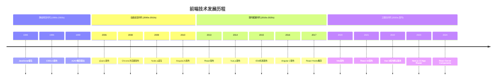
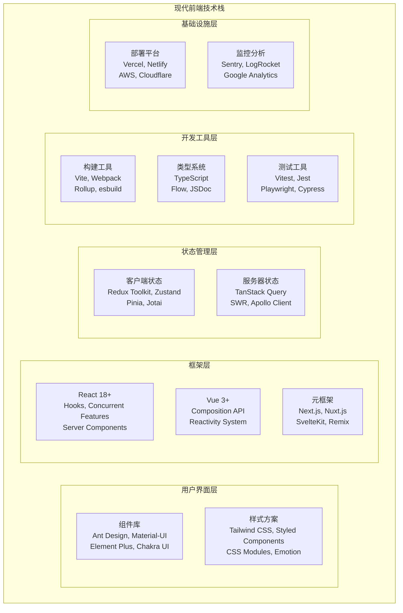
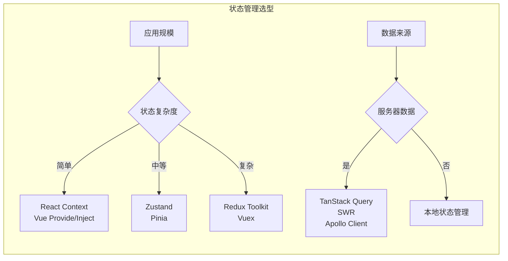
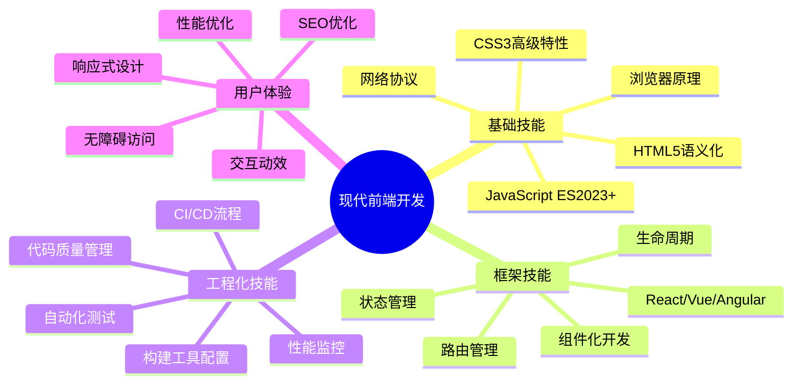
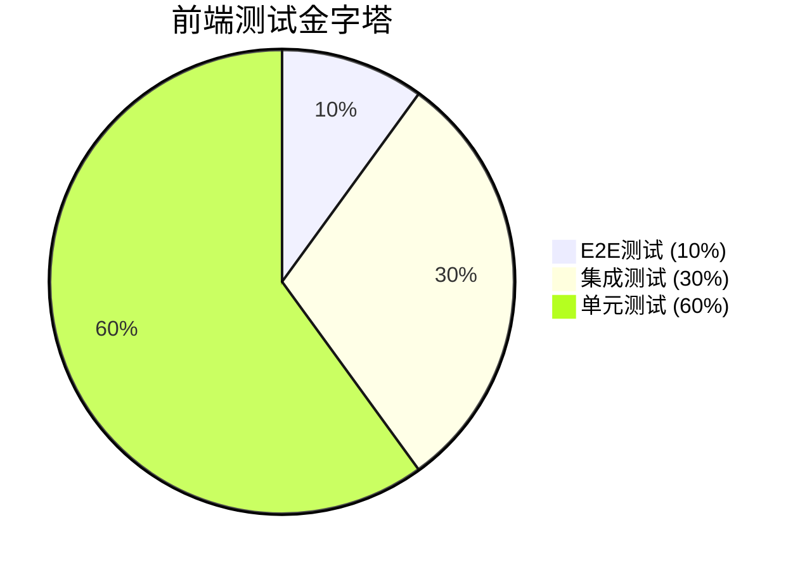
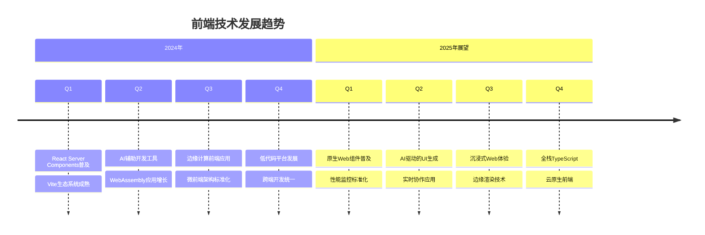

import Tabs from '@theme/Tabs';
import TabItem from '@theme/TabItem';
import CodeBlock from '@theme/CodeBlock';

# 现代前端开发技术全景

现代前端开发已经从简单的网页制作演进为复杂的软件工程体系，涵盖了用户界面、用户体验、性能优化、工程化等多个维度。本指南将全面解析现代前端开发的技术栈、最佳实践和发展趋势。

:::tip 核心价值
**现代前端 = 用户体验 + 工程化 + 性能优化 + 可维护性**
- 🎯 **用户体验至上**：响应式设计、交互动效、无障碍访问
- 🛠️ **工程化体系**：组件化开发、自动化构建、CI/CD流程
- ⚡ **性能优化**：首屏加载、运行时性能、资源优化
- 🔧 **开发效率**：热更新、类型检查、调试工具
- 📱 **跨平台能力**：Web、移动端、桌面端统一技术栈
- 🌐 **生态丰富**：框架、库、工具链完善成熟
:::

## 1. 前端技术演进历程

### 1.1 前端发展时间线



### 1.2 技术栈对比分析

| 技术栈 | 学习曲线 | 生态系统 | 性能表现 | 企业采用 | 适用场景 |
|--------|----------|----------|----------|----------|----------|
| **React生态** | ⭐⭐⭐ | ⭐⭐⭐⭐⭐ | ⭐⭐⭐⭐ | ⭐⭐⭐⭐⭐ | 大型应用、复杂交互 |
| **Vue生态** | ⭐⭐ | ⭐⭐⭐⭐ | ⭐⭐⭐⭐⭐ | ⭐⭐⭐⭐ | 中小型项目、快速开发 |
| **Angular** | ⭐⭐⭐⭐ | ⭐⭐⭐ | ⭐⭐⭐⭐ | ⭐⭐⭐ | 企业级应用 |
| **Svelte** | ⭐⭐ | ⭐⭐ | ⭐⭐⭐⭐⭐ | ⭐⭐ | 性能敏感应用 |
| **原生Web** | ⭐ | ⭐⭐⭐⭐⭐ | ⭐⭐⭐⭐⭐ | ⭐⭐ | 简单页面、组件库 |

## 2. 现代前端核心技术栈

### 2.1 技术栈架构图



### 2.2 技术选型决策矩阵

<Tabs>
<TabItem value="framework" label="框架选型">

#### 前端框架对比

| 对比维度 | React | Vue | Angular | Svelte | 权重 |
|---------|-------|-----|---------|--------|------|
| **学习成本** | 中等 | 较低 | 较高 | 较低 | 20% |
| **开发效率** | 高 | 很高 | 中等 | 高 | 25% |
| **生态系统** | 很丰富 | 丰富 | 丰富 | 一般 | 20% |
| **性能表现** | 良好 | 优秀 | 良好 | 优秀 | 15% |
| **团队规模适应** | 大中小 | 中小 | 大 | 小中 | 10% |
| **长期维护** | 优秀 | 良好 | 优秀 | 一般 | 10% |

**选型建议**：
- **大型企业应用**：React + TypeScript + Next.js
- **快速原型开发**：Vue 3 + Vite + Pinia  
- **性能敏感应用**：Svelte + SvelteKit
- **企业级系统**：Angular + TypeScript

</TabItem>
<TabItem value="state" label="状态管理">

#### 状态管理方案对比



| 状态管理方案 | 适用场景 | 学习成本 | 性能 | 调试工具 |
|-------------|----------|----------|------|----------|
| **React Context** | 简单全局状态 | ⭐ | ⭐⭐⭐ | ⭐⭐ |
| **Redux Toolkit** | 复杂状态逻辑 | ⭐⭐⭐ | ⭐⭐⭐⭐ | ⭐⭐⭐⭐⭐ |
| **Zustand** | 中等复杂度 | ⭐⭐ | ⭐⭐⭐⭐ | ⭐⭐⭐ |
| **TanStack Query** | 服务器状态 | ⭐⭐ | ⭐⭐⭐⭐⭐ | ⭐⭐⭐⭐ |
| **Pinia** | Vue应用 | ⭐⭐ | ⭐⭐⭐⭐ | ⭐⭐⭐⭐ |

</TabItem>
<TabItem value="styling" label="样式方案">

#### CSS解决方案对比

| 方案类型 | 代表技术 | 优势 | 劣势 | 适用场景 |
|---------|----------|------|------|----------|
| **原子化CSS** | Tailwind CSS | 快速开发、一致性 | 类名冗长 | 快速原型、设计系统 |
| **CSS-in-JS** | Styled Components | 动态样式、作用域隔离 | 运行时开销 | React应用 |
| **CSS Modules** | CSS Modules | 零运行时、作用域隔离 | 配置复杂 | 组件化开发 |
| **预处理器** | Sass/Less | 功能丰富、生态成熟 | 编译步骤 | 传统项目 |
| **PostCSS** | PostCSS | 插件生态、现代特性 | 配置复杂 | 现代工程化 |

</TabItem>
</Tabs>

## 3. 前端开发核心能力

### 3.1 核心技能图谱



### 3.2 技能发展路径

<Tabs>
<TabItem value="beginner" label="初级开发者">

#### 基础技能要求

**必备技能清单**：
- ✅ HTML5语义化标签和结构
- ✅ CSS3布局（Flexbox、Grid）
- ✅ JavaScript基础语法和DOM操作
- ✅ 响应式设计原理
- ✅ 版本控制（Git）基础

**学习重点**：
1. **扎实的基础**：深入理解HTML、CSS、JavaScript
2. **实践项目**：完成个人作品集网站
3. **工具熟练**：掌握开发者工具使用
4. **代码规范**：养成良好的编码习惯

```javascript title="初级开发者代码示例"
// 基础DOM操作和事件处理
class TodoApp {
  constructor() {
    this.todos = [];
    this.init();
  }
  
  init() {
    this.bindEvents();
    this.render();
  }
  
  bindEvents() {
    const addBtn = document.getElementById('add-todo');
    const input = document.getElementById('todo-input');
    
    addBtn.addEventListener('click', () => {
      const text = input.value.trim();
      if (text) {
        this.addTodo(text);
        input.value = '';
      }
    });
  }
  
  addTodo(text) {
    const todo = {
      id: Date.now(),
      text,
      completed: false
    };
    this.todos.push(todo);
    this.render();
  }
  
  render() {
    const container = document.getElementById('todo-list');
    container.innerHTML = this.todos.map(todo => `
      <div class="todo-item ${todo.completed ? 'completed' : ''}">
        <span>${todo.text}</span>
        <button onclick="app.toggleTodo(${todo.id})">
          ${todo.completed ? '取消' : '完成'}
        </button>
      </div>
    `).join('');
  }
}

const app = new TodoApp();
```

</TabItem>
<TabItem value="intermediate" label="中级开发者">

#### 进阶技能要求

**技能提升清单**：
- ✅ 现代JavaScript（ES6+）特性
- ✅ 前端框架（React/Vue）熟练使用
- ✅ 构建工具（Webpack/Vite）配置
- ✅ 状态管理和组件设计
- ✅ 单元测试和集成测试

**核心能力**：
1. **组件化思维**：设计可复用的组件
2. **状态管理**：合理管理应用状态
3. **性能优化**：识别和解决性能问题
4. **工程化实践**：建立开发工作流

```typescript title="中级开发者代码示例"
// React组件设计和Hooks使用
import React, { useState, useEffect, useCallback, useMemo } from 'react';
import { debounce } from 'lodash';

interface User {
  id: number;
  name: string;
  email: string;
  role: 'admin' | 'user';
}

interface UserListProps {
  users: User[];
  onUserSelect: (user: User) => void;
}

export const UserList: React.FC<UserListProps> = ({ users, onUserSelect }) => {
  const [searchTerm, setSearchTerm] = useState('');
  const [selectedRole, setSelectedRole] = useState<string>('');
  
  // 防抖搜索
  const debouncedSearch = useCallback(
    debounce((term: string) => {
      setSearchTerm(term);
    }, 300),
    []
  );
  
  // 过滤用户列表
  const filteredUsers = useMemo(() => {
    return users.filter(user => {
      const matchesSearch = user.name.toLowerCase().includes(searchTerm.toLowerCase()) ||
                           user.email.toLowerCase().includes(searchTerm.toLowerCase());
      const matchesRole = !selectedRole || user.role === selectedRole;
      return matchesSearch && matchesRole;
    });
  }, [users, searchTerm, selectedRole]);
  
  return (
    <div className="user-list">
      <div className="filters">
        <input
          type="text"
          placeholder="搜索用户..."
          onChange={(e) => debouncedSearch(e.target.value)}
          className="search-input"
        />
        <select 
          value={selectedRole} 
          onChange={(e) => setSelectedRole(e.target.value)}
          className="role-filter"
        >
          <option value="">所有角色</option>
          <option value="admin">管理员</option>
          <option value="user">普通用户</option>
        </select>
      </div>
      
      <div className="user-grid">
        {filteredUsers.map(user => (
          <UserCard
            key={user.id}
            user={user}
            onClick={() => onUserSelect(user)}
          />
        ))}
      </div>
      
      {filteredUsers.length === 0 && (
        <div className="empty-state">
          <p>未找到匹配的用户</p>
        </div>
      )}
    </div>
  );
};
```

</TabItem>
<TabItem value="senior" label="高级开发者">

#### 专家级技能要求

**高级技能清单**：
- ✅ 架构设计和技术选型
- ✅ 性能优化和监控
- ✅ 微前端和大型应用架构
- ✅ 自动化测试策略
- ✅ 团队协作和代码审查

**核心职责**：
1. **技术架构**：设计可扩展的前端架构
2. **性能优化**：系统性能能优化方案
3. **团队建设**：技术标准和最佳实践
4. **创新驱动**：新技术调研和应用

```typescript title="高级开发者架构示例"
// 微前端架构设计
import { createApp } from 'vue';
import { registerMicroApps, start } from 'qiankun';

// 主应用配置
class MicroFrontendOrchestrator {
  private apps: MicroApp[] = [];
  
  constructor() {
    this.initializeMainApp();
    this.registerSubApps();
  }
  
  private initializeMainApp() {
    const app = createApp(MainApp);
    app.use(router);
    app.use(store);
    app.mount('#app');
  }
  
  private registerSubApps() {
    const microApps = [
      {
        name: 'user-management',
        entry: '//localhost:3001',
        container: '#user-container',
        activeRule: '/user',
        props: {
          routerBase: '/user',
          getGlobalState: this.getGlobalState.bind(this)
        }
      },
      {
        name: 'order-system',
        entry: '//localhost:3002', 
        container: '#order-container',
        activeRule: '/order',
        props: {
          routerBase: '/order',
          getGlobalState: this.getGlobalState.bind(this)
        }
      }
    ];
    
    registerMicroApps(microApps, {
      beforeLoad: this.beforeLoad.bind(this),
      beforeMount: this.beforeMount.bind(this),
      afterUnmount: this.afterUnmount.bind(this)
    });
    
    start({
      prefetch: 'all',
      sandbox: {
        strictStyleIsolation: true,
        experimentalStyleIsolation: true
      }
    });
  }
  
  private async beforeLoad(app: any) {
    console.log(`Loading micro app: ${app.name}`);
    // 预加载资源、权限检查等
  }
  
  private async beforeMount(app: any) {
    console.log(`Mounting micro app: ${app.name}`);
    // 状态同步、事件监听等
  }
  
  private async afterUnmount(app: any) {
    console.log(`Unmounted micro app: ${app.name}`);
    // 清理资源、状态重置等
  }
  
  private getGlobalState() {
    return {
      user: store.state.user,
      theme: store.state.theme,
      permissions: store.state.permissions
    };
  }
}

// 性能监控和错误追踪
class PerformanceMonitor {
  private observer: PerformanceObserver;
  
  constructor() {
    this.initializeMonitoring();
  }
  
  private initializeMonitoring() {
    // Core Web Vitals监控
    this.observeWebVitals();
    
    // 资源加载监控
    this.observeResourceTiming();
    
    // 用户交互监控
    this.observeUserInteractions();
  }
  
  private observeWebVitals() {
    // LCP (Largest Contentful Paint)
    new PerformanceObserver((list) => {
      const entries = list.getEntries();
      const lastEntry = entries[entries.length - 1];
      this.reportMetric('LCP', lastEntry.startTime);
    }).observe({ entryTypes: ['largest-contentful-paint'] });
    
    // FID (First Input Delay)
    new PerformanceObserver((list) => {
      const entries = list.getEntries();
      entries.forEach(entry => {
        this.reportMetric('FID', entry.processingStart - entry.startTime);
      });
    }).observe({ entryTypes: ['first-input'] });
    
    // CLS (Cumulative Layout Shift)
    let clsValue = 0;
    new PerformanceObserver((list) => {
      const entries = list.getEntries();
      entries.forEach(entry => {
        if (!entry.hadRecentInput) {
          clsValue += entry.value;
        }
      });
      this.reportMetric('CLS', clsValue);
    }).observe({ entryTypes: ['layout-shift'] });
  }
  
  private reportMetric(name: string, value: number) {
    // 发送到监控服务
    analytics.track('performance_metric', {
      metric: name,
      value,
      url: window.location.href,
      userAgent: navigator.userAgent,
      timestamp: Date.now()
    });
  }
}
```

</TabItem>
</Tabs>

## 4. 前端开发最佳实践

### 4.1 代码质量保证

<Tabs>
<TabItem value="code-standards" label="代码规范">

#### 代码规范和工具链

```json title="ESLint + Prettier配置"
{
  "extends": [
    "@typescript-eslint/recommended",
    "plugin:react/recommended",
    "plugin:react-hooks/recommended",
    "prettier"
  ],
  "plugins": ["@typescript-eslint", "react", "react-hooks", "import"],
  "rules": {
    "react/react-in-jsx-scope": "off",
    "react/prop-types": "off",
    "@typescript-eslint/explicit-function-return-type": "warn",
    "@typescript-eslint/no-unused-vars": "error",
    "import/order": [
      "error",
      {
        "groups": [
          "builtin",
          "external", 
          "internal",
          "parent",
          "sibling",
          "index"
        ],
        "newlines-between": "always"
      }
    ]
  }
}
```

**代码规范要点**：
- **命名规范**：使用有意义的变量和函数名
- **文件组织**：合理的目录结构和文件命名
- **注释规范**：关键逻辑和复杂算法添加注释
- **类型安全**：充分利用TypeScript类型系统

</TabItem>
<TabItem value="testing" label="测试策略">

#### 测试金字塔实践



| 测试类型 | 测试工具 | 测试范围 | 执行频率 |
|---------|----------|----------|----------|
| **单元测试** | Vitest, Jest | 函数、组件、Hook | 每次提交 |
| **集成测试** | Testing Library | 组件交互、API | 每日构建 |
| **E2E测试** | Playwright, Cypress | 用户流程 | 发布前 |
| **视觉回归** | Chromatic, Percy | UI一致性 | PR审查 |

</TabItem>
<TabItem value="performance" label="性能优化">

#### 性能优化检查清单

**加载性能优化**：
- ✅ 代码分割和懒加载
- ✅ 资源压缩和缓存策略
- ✅ CDN和静态资源优化
- ✅ 关键资源预加载

**运行时性能优化**：
- ✅ 虚拟滚动和分页
- ✅ 防抖和节流
- ✅ 内存泄漏检测
- ✅ 渲染优化

**用户体验优化**：
- ✅ 骨架屏和加载状态
- ✅ 错误边界和降级方案
- ✅ 离线支持和PWA
- ✅ 无障碍访问

</TabItem>
</Tabs>

## 5. 前端发展趋势

### 5.1 技术趋势展望



### 5.2 新兴技术关注点

| 技术领域 | 关键技术 | 成熟度 | 应用前景 | 学习建议 |
|---------|----------|--------|----------|----------|
| **AI辅助开发** | GitHub Copilot, ChatGPT | ⭐⭐⭐⭐ | 提升开发效率 | 积极尝试 |
| **Web3前端** | Web3.js, Ethers.js | ⭐⭐⭐ | 去中心化应用 | 关注发展 |
| **WebAssembly** | Rust, C++编译 | ⭐⭐⭐ | 高性能计算 | 深入学习 |
| **边缘计算** | Edge Functions | ⭐⭐⭐ | 全球化应用 | 实践应用 |
| **低代码平台** | 可视化开发 | ⭐⭐⭐⭐ | 快速原型 | 了解概念 |

:::tip 学习建议
**持续学习路径**：
1. **基础扎实**：深入掌握JavaScript、TypeScript核心概念
2. **框架精通**：选择一个主流框架深入学习
3. **工程化实践**：掌握现代前端工程化工具和流程
4. **性能优化**：学习性能分析和优化技巧
5. **新技术跟进**：关注前端技术发展趋势，适时学习新技术
6. **实践项目**：通过实际项目巩固和应用所学知识
:::

---

现代前端开发是一个快速发展的领域，需要开发者保持持续学习的心态。通过系统性的学习和实践，掌握核心技术和最佳实践，才能在这个充满挑战和机遇的领域中取得成功。 