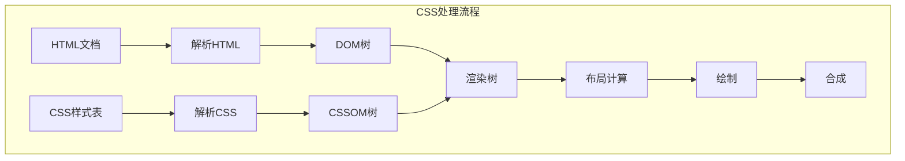

import Tabs from '@theme/Tabs';
import TabItem from '@theme/TabItem';
import CodeBlock from '@theme/CodeBlock';

# CSS核心基础与现代样式技术

CSS（层叠样式表）是控制网页外观与布局的核心技术，从简单的样式装饰发展为强大的布局系统和动画引擎。现代CSS不仅提供了丰富的视觉效果，还支持复杂的响应式布局和交互动画。

:::tip 核心价值
**CSS = 样式控制 + 布局系统 + 动画效果 + 响应式设计**
- 🎨 **样式控制**：颜色、字体、装饰等视觉效果
- 📐 **布局系统**：Flexbox、Grid、定位等布局方案
- ✨ **动画效果**：过渡、关键帧动画、变换
- 📱 **响应式设计**：适配不同设备和屏幕尺寸
- 🔧 **现代特性**：CSS变量、容器查询、逻辑属性
- ⚡ **性能优化**：硬件加速、重绘重排优化
:::

## 1. CSS基础概念与语法

### 1.1 CSS工作原理

CSS通过选择器匹配HTML元素，并应用相应的样式规则。理解CSS的工作原理对于编写高效的样式代码至关重要。



### 1.2 CSS语法结构

CSS规则由选择器和声明块组成，遵循严格的语法规范：

<Tabs>
<TabItem value="syntax" label="基础语法">

```css title="CSS基础语法结构"
/* 选择器 { 属性: 值; } */
h1 {
  color: blue;
  font-size: 24px;
  font-weight: bold;
}

/* 多个选择器 */
h1, h2, h3 {
  font-family: 'Arial', sans-serif;
  margin-bottom: 1rem;
}

/* 嵌套选择器 */
.container .header h1 {
  color: #333;
  text-align: center;
}
```

</TabItem>
<TabItem value="comments" label="注释规范">

```css title="CSS注释最佳实践"
/* ==========================================================================
   主要样式表
   ========================================================================== */

/* 基础样式
   ========================================================================== */
body {
  font-family: Arial, sans-serif;
  line-height: 1.6;
}

/* 组件样式 - 导航栏
   ========================================================================== */
.navbar {
  /* 布局属性 */
  display: flex;
  justify-content: space-between;
  
  /* 视觉属性 */
  background-color: #fff;
  box-shadow: 0 2px 4px rgba(0,0,0,0.1);
  
  /* TODO: 添加响应式断点 */
  /* FIXME: 修复IE11兼容性问题 */
}
```

</TabItem>
<TabItem value="organization" label="代码组织">

```css title="CSS代码组织结构"
/* 1. 重置和基础样式 */
* {
  box-sizing: border-box;
  margin: 0;
  padding: 0;
}

/* 2. 变量定义 */
:root {
  --primary-color: #007acc;
  --secondary-color: #f8f9fa;
  --font-size-base: 16px;
  --line-height-base: 1.5;
}

/* 3. 基础元素样式 */
body {
  font-size: var(--font-size-base);
  line-height: var(--line-height-base);
  color: #333;
}

/* 4. 布局组件 */
.container { /* ... */ }
.grid { /* ... */ }

/* 5. UI组件 */
.button { /* ... */ }
.card { /* ... */ }

/* 6. 工具类 */
.text-center { text-align: center; }
.mb-1 { margin-bottom: 1rem; }

/* 7. 响应式样式 */
@media (max-width: 768px) {
  /* 移动端样式 */
}
```

</TabItem>
</Tabs>

### CSS引入方式

CSS可以通过三种方式添加到HTML中：

1. **内联样式**：直接在HTML元素上使用`style`属性
   ```html
   <p style="color: red; font-size: 18px;">这是一段带有内联样式的文本</p>
   ```

2. **内部样式表**：在HTML文档的`<head>`部分使用`<style>`标签
   ```html
   <head>
     <style>
       p {
         color: red;
         font-size: 18px;
       }
     </style>
   </head>
   ```

3. **外部样式表**：创建单独的CSS文件，然后在HTML中引用（推荐方法）
   ```html
   <head>
     <link rel="stylesheet" href="styles.css">
   </head>
   ```

### CSS层叠与优先级

当多个样式规则应用于同一元素时，CSS遵循特定的优先级规则来确定哪个样式生效：

1. **重要性**：`!important` > 正常声明
2. **特异性**：内联样式 > ID选择器 > 类/属性/伪类选择器 > 元素/伪元素选择器
3. **源代码顺序**：后定义的样式优先级更高

例如：
```css
p { color: red; }                         /* 特异性: 0,0,0,1 */
.text { color: blue; }                    /* 特异性: 0,0,1,0 */
#unique { color: green; }                 /* 特异性: 0,1,0,0 */
p.text#unique { color: yellow; }          /* 特异性: 0,1,1,1 */
p { color: purple !important; }           /* !important 规则覆盖所有 */
```

## 选择器

CSS选择器允许您精确定位要样式化的HTML元素。

### 基本选择器

```css
/* 元素选择器 */
p { color: blue; }

/* 类选择器 */
.highlight { background-color: yellow; }

/* ID选择器 */
#header { font-size: 24px; }

/* 通用选择器 */
* { margin: 0; padding: 0; }

/* 属性选择器 */
[type="text"] { border: 1px solid gray; }
```

### 组合选择器

```css
/* 后代选择器 */
nav a { color: blue; }

/* 子元素选择器 */
nav > a { font-weight: bold; }

/* 相邻兄弟选择器 */
h1 + p { margin-top: 0; }

/* 通用兄弟选择器 */
h1 ~ p { color: gray; }

/* 组合选择器 */
div, span, p { line-height: 1.5; }
```

### 伪类和伪元素

伪类用于定义元素的特殊状态：

```css
/* 链接状态伪类 */
a:link { color: blue; }
a:visited { color: purple; }
a:hover { text-decoration: underline; }
a:active { color: red; }

/* 结构伪类 */
li:first-child { font-weight: bold; }
li:last-child { border-bottom: none; }
li:nth-child(odd) { background-color: #f2f2f2; }
li:nth-child(3n+1) { color: red; }
```

伪元素用于创建不在DOM中的元素：

```css
/* 在元素内容之前/之后插入 */
.box::before {
  content: "❄";
  margin-right: 8px;
}

.box::after {
  content: "";
  display: block;
  clear: both;
}

/* 选择首字母/首行 */
p::first-letter { font-size: 2em; }
p::first-line { font-weight: bold; }

/* 文本选择样式 */
p::selection { background: yellow; color: black; }
```

## 盒模型

CSS盒模型是网页布局的基础，每个HTML元素都被视为一个矩形盒子。

### 盒模型组成

标准盒模型由以下部分组成，从内到外依次是：

1. **内容区域（Content）**：显示元素内容的区域
2. **内边距（Padding）**：内容与边框之间的空间
3. **边框（Border）**：围绕内容和内边距的边界
4. **外边距（Margin）**：元素与其他元素之间的空间

```css
div {
  /* 内容区域 */
  width: 300px;
  height: 200px;
  
  /* 内边距 */
  padding: 20px;
  /* 或单独设置 */
  padding-top: 10px;
  padding-right: 15px;
  padding-bottom: 10px;
  padding-left: 15px;
  
  /* 边框 */
  border: 1px solid black;
  /* 或单独设置 */
  border-width: 1px;
  border-style: solid;
  border-color: black;
  
  /* 外边距 */
  margin: 30px;
  /* 或单独设置 */
  margin-top: 20px;
  margin-right: 15px;
  margin-bottom: 20px;
  margin-left: 15px;
}
```

### 标准盒模型与IE盒模型

1. **标准盒模型（content-box）**：`width`和`height`只应用于内容区域
   ```css
   .box {
     box-sizing: content-box; /* 默认值 */
     width: 100px;
     padding: 10px;
     border: 5px solid black;
     /* 实际宽度 = 100px + 10px*2 + 5px*2 = 130px */
   }
   ```

2. **IE盒模型（border-box）**：`width`和`height`包含内容、内边距和边框
   ```css
   .box {
     box-sizing: border-box;
     width: 100px;
     padding: 10px;
     border: 5px solid black;
     /* 实际宽度 = 100px（内容区域会被压缩） */
   }
   ```

### 外边距折叠

当两个垂直外边距相遇时，它们会合并为一个外边距，高度等于较大的那个外边距值，这称为外边距折叠：

```css
.box1 { margin-bottom: 20px; }
.box2 { margin-top: 30px; }
/* 两个盒子之间的实际间距是30px，而不是50px */
```

防止外边距折叠的方法：
- 使用padding代替margin
- 使用border或padding将元素隔开
- 使用BFC（块级格式化上下文）

## 布局

CSS提供了多种方式来控制网页布局。

### 流式布局

流式布局是CSS的默认布局方式，元素按照文档流依次排列。

```css
p {
  /* 块级元素默认占满整行 */
  display: block;
}

span {
  /* 内联元素在一行内排列 */
  display: inline;
}

img {
  /* 既有块级特性又有内联特性 */
  display: inline-block;
}
```

### 定位

CSS定位允许您从正常文档流中移动元素：

```css
/* 相对定位 - 相对于元素原本位置 */
.relative {
  position: relative;
  top: 20px;
  left: 30px;
}

/* 绝对定位 - 相对于最近的已定位祖先元素 */
.absolute {
  position: absolute;
  top: 50px;
  right: 10px;
}

/* 固定定位 - 相对于视口 */
.fixed {
  position: fixed;
  bottom: 20px;
  right: 20px;
}

/* 粘性定位 - 根据滚动位置在相对和固定之间切换 */
.sticky {
  position: sticky;
  top: 0;
}
```

### Flexbox布局

Flexbox是一维布局模型，专为布局而设计：

```css
/* 父容器 */
.container {
  display: flex;
  flex-direction: row; /* 或column */
  justify-content: space-between; /* 主轴对齐方式 */
  align-items: center; /* 交叉轴对齐方式 */
  flex-wrap: wrap; /* 换行处理 */
  gap: 10px; /* 项目间距 */
}

/* 子项 */
.item {
  flex: 1; /* 占用剩余空间的比例 */
  /* 或单独设置 */
  flex-grow: 1;
  flex-shrink: 1;
  flex-basis: auto;
  
  align-self: flex-start; /* 单独设置交叉轴对齐 */
  order: 2; /* 改变排列顺序 */
}
```

### Grid布局

Grid是一个强大的二维布局系统，用于创建复杂的网格设计：

```css
/* 父容器 */
.grid-container {
  display: grid;
  grid-template-columns: repeat(3, 1fr); /* 3列，宽度相等 */
  grid-template-rows: 100px 200px auto; /* 3行，指定高度 */
  gap: 20px; /* 网格间距 */
  
  /* 命名网格区域 */
  grid-template-areas:
    "header header header"
    "sidebar content content"
    "footer footer footer";
}

/* 子项 */
.header { grid-area: header; }
.sidebar { grid-area: sidebar; }
.content { grid-area: content; }
.footer { grid-area: footer; }

/* 使用网格线放置项目 */
.item {
  grid-column: 1 / 3; /* 从第1条列线到第3条列线 */
  grid-row: 2 / 4; /* 从第2条行线到第4条行线 */
}
```

## 响应式设计

响应式设计使网站能够适应不同设备和屏幕尺寸。

### 媒体查询

媒体查询允许您根据设备特性（如屏幕尺寸）应用不同的样式：

```css
/* 基础样式 - 适用于所有设备 */
body {
  font-size: 16px;
}

/* 平板电脑样式 */
@media screen and (max-width: 1024px) {
  body {
    font-size: 14px;
  }
  
  .container {
    width: 90%;
  }
}

/* 手机样式 */
@media screen and (max-width: 480px) {
  body {
    font-size: 12px;
  }
  
  .container {
    width: 100%;
  }
  
  .sidebar {
    display: none;
  }
}

/* 打印样式 */
@media print {
  .no-print {
    display: none;
  }
  
  body {
    font-size: 12pt;
    color: black;
  }
}
```

### 视口单位

响应式设计中的关键单位：

```css
.hero {
  /* 视口宽度的100% */
  width: 100vw;
  
  /* 视口高度的50% */
  height: 50vh;
}

.text {
  /* 1vmin = 1vw 或 1vh（取较小值） */
  font-size: 5vmin;
  
  /* 1vmax = 1vw 或 1vh（取较大值） */
  margin: 2vmax;
}
```

### 响应式图像

```css
img {
  /* 图像最大为容器宽度的100% */
  max-width: 100%;
  height: auto;
}
```

### 响应式排版

```css
html {
  /* 基础字体大小 */
  font-size: 16px;
}

h1 {
  /* 使用rem单位（相对于根元素html的字体大小） */
  font-size: 2.5rem;
}

p {
  /* 使用em单位（相对于父元素的字体大小） */
  font-size: 1em;
  line-height: 1.5;
  margin-bottom: 1.2em;
}
```

## 动画与过渡

CSS提供了强大的方式来创建动画和平滑过渡。

### 过渡

过渡允许CSS属性值平滑地变化：

```css
.button {
  background-color: blue;
  color: white;
  padding: 10px 20px;
  border-radius: 4px;
  
  /* 过渡设置 */
  transition-property: background-color, transform;
  transition-duration: 0.3s;
  transition-timing-function: ease-in-out;
  transition-delay: 0s;
  
  /* 简写形式 */
  /* transition: background-color 0.3s ease-in-out, transform 0.3s ease-in-out; */
}

.button:hover {
  background-color: darkblue;
  transform: scale(1.05);
}
```

### 动画

使用`@keyframes`规则创建更复杂的动画序列：

```css
/* 定义动画 */
@keyframes bounce {
  0% {
    transform: translateY(0);
  }
  50% {
    transform: translateY(-20px);
  }
  100% {
    transform: translateY(0);
  }
}

/* 应用动画 */
.ball {
  width: 50px;
  height: 50px;
  background-color: red;
  border-radius: 50%;
  
  /* 动画设置 */
  animation-name: bounce;
  animation-duration: 1s;
  animation-timing-function: ease-in-out;
  animation-delay: 0s;
  animation-iteration-count: infinite;
  animation-direction: normal;
  animation-fill-mode: forwards;
  animation-play-state: running;
  
  /* 简写形式 */
  /* animation: bounce 1s ease-in-out infinite; */
}
```

### 变换

使用`transform`属性对元素进行2D或3D转换：

```css
.element {
  /* 2D变换 */
  transform: translate(50px, 20px);  /* 平移 */
  transform: rotate(45deg);          /* 旋转 */
  transform: scale(1.5);             /* 缩放 */
  transform: skew(10deg, 5deg);      /* 倾斜 */
  
  /* 组合变换（从右到左应用） */
  transform: translate(50px, 20px) rotate(45deg) scale(1.5);
  
  /* 3D变换 */
  transform: rotateX(45deg);         /* 沿X轴旋转 */
  transform: rotateY(45deg);         /* 沿Y轴旋转 */
  transform: rotateZ(45deg);         /* 沿Z轴旋转 */
  transform: perspective(500px) rotateY(45deg); /* 添加透视效果 */
}
```

## CSS预处理器

CSS预处理器是扩展CSS功能的工具，如Sass、Less和Stylus。它们添加了变量、嵌套规则、混合、函数等功能。

### Sass示例

```scss
// 变量
$primary-color: #4a6cf7;
$secondary-color: #33d687;
$font-stack: 'Inter', sans-serif;

// 混合宏
@mixin flex-center {
  display: flex;
  justify-content: center;
  align-items: center;
}

@mixin responsive($breakpoint) {
  @if $breakpoint == tablet {
    @media (max-width: 768px) { @content; }
  } @else if $breakpoint == mobile {
    @media (max-width: 480px) { @content; }
  }
}

// 嵌套规则
.card {
  background: white;
  border-radius: 8px;
  padding: 20px;
  
  &:hover {
    box-shadow: 0 10px 20px rgba(0, 0, 0, 0.1);
  }
  
  .card-title {
    color: $primary-color;
    font-family: $font-stack;
    
    // 使用混合宏
    @include flex-center;
  }
  
  // 响应式设计
  @include responsive(mobile) {
    padding: 10px;
  }
}

// 继承
.button {
  padding: 10px 20px;
  border: none;
  border-radius: 4px;
}

.primary-button {
  @extend .button;
  background-color: $primary-color;
  color: white;
}

.secondary-button {
  @extend .button;
  background-color: $secondary-color;
  color: white;
}
```

## 面试题

### 1. 请解释CSS中的盒模型及box-sizing属性的作用。

**答案：**  
CSS盒模型描述了元素占用的空间组成，从内到外包括：内容区域（content）、内边距（padding）、边框（border）和外边距（margin）。

`box-sizing`属性决定了width和height如何应用于元素：
- `content-box`（标准盒模型）：width/height只包含内容区域
- `border-box`（IE盒模型）：width/height包含内容区域、内边距和边框

在响应式设计中，`border-box`通常更容易使用，因为元素的总宽度不会因为添加内边距或边框而改变。

### 2. CSS选择器的优先级是如何计算的？

**答案：**  
CSS选择器优先级按以下规则计算（从高到低）：
1. 内联样式：1000分
2. ID选择器：100分
3. 类选择器、属性选择器和伪类：10分
4. 元素选择器和伪元素：1分

组合多个选择器时，将各部分的分数相加得到总优先级。如果优先级相同，则后定义的样式会覆盖先定义的样式。`!important`规则会覆盖所有其他样式，但应谨慎使用。

### 3. 请解释Flexbox和Grid布局的区别及适用场景。

**答案：**  
**Flexbox（弹性盒子）**：
- 一维布局系统，主要处理行或列
- 内容优先，根据内容大小分配空间
- 适用场景：导航菜单、卡片布局、居中元素、简单的一维排列

**Grid（网格）**：
- 二维布局系统，同时处理行和列
- 布局优先，创建预定义的网格结构
- 适用场景：整体页面布局、复杂的二维布局、不规则布局

选择使用哪种布局取决于需求：如果需要在单一方向（行或列）上布局元素，使用Flexbox；如果需要同时在行和列上创建布局，使用Grid。实际项目中，两者经常结合使用。

### 4. 什么是CSS变量（自定义属性），它们有什么优势？

**答案：**  
CSS变量（自定义属性）是用户定义的实体，可以在整个文档中重复使用：

```css
:root {
  --primary-color: #4a6cf7;
  --secondary-color: #33d687;
}

.button {
  background-color: var(--primary-color);
}
```

优势：
- 减少重复代码，便于维护
- 可通过JavaScript动态修改
- 支持级联和继承
- 可在媒体查询中重新定义，增强响应式设计
- 原生支持，不需要预处理器

### 5. 如何实现CSS的垂直和水平居中？

**答案：**  
实现元素的垂直和水平居中有多种方法：

**Flexbox方法（最现代的方法）**：
```css
.parent {
  display: flex;
  justify-content: center; /* 水平居中 */
  align-items: center;     /* 垂直居中 */
  height: 300px;
}
```

**Grid方法**：
```css
.parent {
  display: grid;
  place-items: center;     /* 垂直和水平居中 */
  height: 300px;
}
```

**使用定位和变换**：
```css
.parent {
  position: relative;
  height: 300px;
}
.child {
  position: absolute;
  top: 50%;
  left: 50%;
  transform: translate(-50%, -50%);
}
```

**使用margin: auto和绝对定位**：
```css
.parent {
  position: relative;
  height: 300px;
}
.child {
  position: absolute;
  top: 0;
  bottom: 0;
  left: 0;
  right: 0;
  margin: auto;
  height: 100px; /* 必须设置高度和宽度 */
  width: 100px;
}
``` 