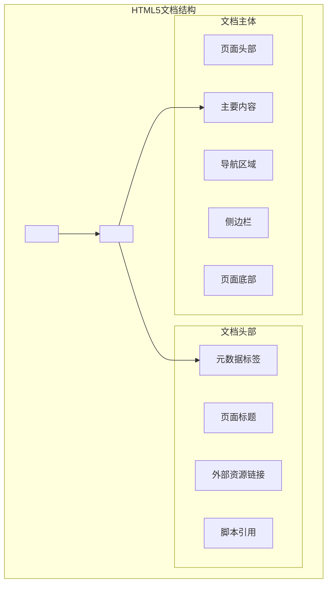

import Tabs from '@theme/Tabs';
import TabItem from '@theme/TabItem';
import CodeBlock from '@theme/CodeBlock';

# HTML核心基础与语义化开发

HTML（超文本标记语言）是构建Web内容的基础，从简单的文档标记发展为现代Web应用的结构基石。HTML5引入的语义化标签和新特性，为开发者提供了更强大的表达能力和更好的用户体验。

:::tip 核心价值
**HTML = 语义化结构 + 表单交互 + 多媒体支持 + 无障碍访问**
- 🏗️ **语义化结构**：清晰的文档结构和内容含义
- 📝 **表单交互**：丰富的输入控件和验证机制
- 🎬 **多媒体支持**：原生音视频和图像处理
- ♿ **无障碍访问**：支持辅助技术和包容性设计
- 🔍 **SEO友好**：搜索引擎优化和结构化数据
- 📱 **跨平台兼容**：统一的Web标准和设备适配
:::

## 1. HTML文档结构与语义化

### 1.1 HTML5文档结构

现代HTML文档遵循清晰的结构层次，每个部分都有其特定的作用和语义含义。



## 文档结构

HTML文档具有明确的结构层次，这对于浏览器正确解析和渲染网页至关重要：

```html
<!DOCTYPE html>
<html lang="zh-CN">
<head>
  <meta charset="UTF-8">
  <meta name="viewport" content="width=device-width, initial-scale=1.0">
  <title>网页标题</title>
  <meta name="description" content="页面描述">
  <link rel="stylesheet" href="styles.css">
  <script src="script.js" defer></script>
</head>
<body>
  <header>
    <!-- 页头内容 -->
  </header>
  <main>
    <!-- 主要内容 -->
  </main>
  <footer>
    <!-- 页脚内容 -->
  </footer>
</body>
</html>
```

### 关键元素解析

- `<!DOCTYPE html>` - 声明文档类型为HTML5
- `<html>` - 文档的根元素，`lang`属性指定页面语言，对无障碍和SEO很重要
- `<head>` - 包含元数据，如标题、字符编码、视口设置、CSS链接等
- `<body>` - 包含页面的所有可见内容

### 元标签的重要性

```html
<meta charset="UTF-8"> <!-- 字符编码 -->
<meta name="viewport" content="width=device-width, initial-scale=1.0"> <!-- 响应式设计必备 -->
<meta name="description" content="页面描述"> <!-- SEO优化 -->
```

元标签虽然不可见，但对SEO、社交媒体分享和移动设备兼容性至关重要。

## 语义化标签

HTML5引入了一系列语义化标签，这些标签不仅使代码更有意义，还有助于无障碍性和SEO优化。

### 常用语义化标签

- `<header>` - 页面或区域的头部
- `<nav>` - 导航链接区域
- `<main>` - 页面的主要内容，每个页面应只有一个
- `<article>` - 独立、可分配的内容
- `<section>` - 文档中的区块
- `<aside>` - 与主内容相关但可以分离的内容
- `<footer>` - 页面或区域的底部
- `<figure>` 和 `<figcaption>` - 图像和其说明
- `<time>` - 日期/时间
- `<mark>` - 高亮文本

### 语义化的优势

```html
<!-- 非语义化写法 -->
<div class="header">
  <div class="nav">...</div>
</div>
<div class="main">
  <div class="article">...</div>
  <div class="sidebar">...</div>
</div>
<div class="footer">...</div>

<!-- 语义化写法 -->
<header>
  <nav>...</nav>
</header>
<main>
  <article>...</article>
  <aside>...</aside>
</main>
<footer>...</footer>
```

语义化HTML提供了：
- 更好的无障碍性（屏幕阅读器能理解内容结构）
- 更好的SEO（搜索引擎理解页面结构）
- 更清晰的代码（提高代码可维护性）

## 表单与输入

表单是用户与网站交互的主要方式，HTML提供了丰富的表单控件。

### 表单基础结构

```html
<form action="/submit" method="post">
  <fieldset>
    <legend>个人信息</legend>
    
    <div>
      <label for="name">姓名:</label>
      <input type="text" id="name" name="name" required>
    </div>
    
    <div>
      <label for="email">邮箱:</label>
      <input type="email" id="email" name="email" required>
    </div>
    
    <div>
      <label for="password">密码:</label>
      <input type="password" id="password" name="password" minlength="8" required>
    </div>
    
    <div>
      <label for="age">年龄:</label>
      <input type="number" id="age" name="age" min="18" max="120">
    </div>
    
    <button type="submit">提交</button>
  </fieldset>
</form>
```

### HTML5新增输入类型

```html
<input type="email"> <!-- 邮箱输入，自带验证 -->
<input type="url"> <!-- URL输入，自带验证 -->
<input type="tel"> <!-- 电话号码输入 -->
<input type="number"> <!-- 数字输入 -->
<input type="range"> <!-- 滑块 -->
<input type="date"> <!-- 日期选择器 -->
<input type="time"> <!-- 时间选择器 -->
<input type="color"> <!-- 颜色选择器 -->
<input type="search"> <!-- 搜索框 -->
```

### 表单验证属性

```html
<input type="text" required> <!-- 必填字段 -->
<input type="text" minlength="3" maxlength="20"> <!-- 长度限制 -->
<input type="number" min="0" max="100"> <!-- 数值范围限制 -->
<input type="text" pattern="[A-Za-z]{3}"> <!-- 使用正则表达式验证 -->
```

## 多媒体元素

HTML5大大增强了对多媒体内容的支持，使得嵌入视频、音频和交互式内容变得更加容易。

### 图像

```html
<!-- 基本图像 -->


<!-- 响应式图像 -->


<!-- 图像与说明 -->
<figure>
  
  <figcaption>2023年销售数据分析</figcaption>
</figure>
```

### 视频

```html
<video controls width="500" poster="thumbnail.jpg">
  <source src="video.mp4" type="video/mp4">
  <source src="video.webm" type="video/webm">
  <p>您的浏览器不支持HTML视频。<a href="video.mp4">下载视频</a>。</p>
</video>
```

### 音频

```html
<audio controls>
  <source src="audio.mp3" type="audio/mpeg">
  <source src="audio.ogg" type="audio/ogg">
  <p>您的浏览器不支持HTML音频。<a href="audio.mp3">下载音频</a>。</p>
</audio>
```

### 内嵌框架

```html
<iframe src="https://www.example.com"
        width="500"
        height="300"
        title="示例网站"
        sandbox="allow-same-origin allow-scripts">
</iframe>
```

## 无障碍开发

网站无障碍性（Accessibility）是确保所有人，包括残障用户，都能访问和使用网站的重要方面。

### ARIA属性

ARIA（Accessible Rich Internet Applications）提供了一套属性，用于增强HTML元素的无障碍性。

```html
<!-- 角色定义 -->
<div role="navigation">...</div>
<div role="button" tabindex="0" aria-pressed="false">自定义按钮</div>

<!-- 状态描述 -->
<div aria-hidden="true">从屏幕阅读器隐藏</div>
<div aria-expanded="false">可展开内容</div>

<!-- 关系属性 -->
<div id="desc">描述文本</div>
<button aria-describedby="desc">有描述的按钮</button>
```

### 无障碍实践

1. **使用适当的HTML标签**
   ```html
   <!-- 不好的做法 -->
   <div onclick="submit()">提交</div>
   
   <!-- 好的做法 -->
   <button type="submit">提交</button>
   ```

2. **为图像提供替代文本**
   ```html
   
   ```

3. **确保键盘可导航**
   ```html
   <a href="#" tabindex="1">首先聚焦</a>
   <a href="#" tabindex="2">其次聚焦</a>
   ```

4. **使用适当的颜色对比度**
   - 文本和背景之间需要足够的对比度
   - 不仅依靠颜色传达信息

5. **提供表单错误的明确反馈**
   ```html
   <input type="email" aria-describedby="email-error">
   <div id="email-error" aria-live="polite">请输入有效的电子邮件地址</div>
   ```

## 面试题

### 1. HTML5与HTML4的区别有哪些？

**答案：** HTML5比HTML4有很多改进，主要包括：
- 引入语义化标签：`<header>`, `<footer>`, `<nav>`, `<section>`等
- 新增多媒体元素：`<video>`, `<audio>`
- 新增表单输入类型：email, date, range等
- 引入Canvas和SVG绘图功能
- 支持本地存储：localStorage, sessionStorage
- 取消了一些过时元素：`<font>`, `<center>`等
- 简化了文档类型声明：`<!DOCTYPE html>`

### 2. 什么是语义化HTML，为什么它很重要？

**答案：** 语义化HTML是指使用正确的HTML元素来表达内容的含义和结构，而不仅仅是为了样式或排版。它很重要，因为：
- 提高网站可访问性，屏幕阅读器能更好地理解内容
- 改善SEO，搜索引擎能更好地解析页面内容和结构
- 增强代码可维护性和可读性
- 帮助不同设备正确显示内容
- 为未来的技术变化做好准备

### 3. `<script>`, `<script async>` 和 `<script defer>` 的区别是什么？

**答案：**
- `<script>`: 立即下载并执行脚本，会阻塞HTML解析，直到脚本下载并执行完成
- `<script async>`: 异步下载脚本，下载完成后立即执行，执行过程会阻塞HTML解析
- `<script defer>`: 异步下载脚本，但延迟执行，直到HTML解析完成后才执行

### 4. 什么是HTML5的数据属性？

**答案：** HTML5的数据属性（data-*属性）是一种存储自定义数据的方式，这些数据能够附加到HTML元素上：
```html
<div data-user-id="123" data-role="admin">用户信息</div>
```
在JavaScript中，可以通过`dataset`属性访问：
```javascript
const div = document.querySelector('div');
console.log(div.dataset.userId); // "123"
console.log(div.dataset.role); // "admin"
```

### 5. HTML表单验证的方式有哪些？

**答案：** HTML表单验证方式包括：
- 使用HTML5内置验证属性：required, minlength, maxlength, min, max, pattern等
- 使用input类型的内置验证：email, url, number等
- 使用表单元素的validity属性进行JavaScript验证
- 使用自定义JavaScript验证逻辑
- 使用第三方表单验证库 