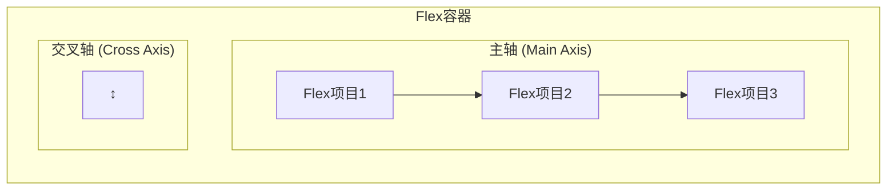
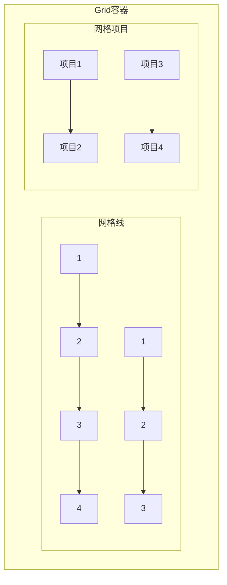

import Tabs from '@theme/Tabs';
import TabItem from '@theme/TabItem';
import CodeBlock from '@theme/CodeBlock';

# 现代CSS布局技术详解

现代CSS布局技术彻底改变了Web设计的方式，从传统的浮动和定位布局发展到Flexbox和Grid等强大的布局系统。这些技术使创建复杂、灵活且响应式的布局变得更加简单和直观。

:::tip 核心价值
**现代布局 = Flexbox + Grid + 响应式设计 + 最佳实践**
- 🎯 **Flexbox**：一维布局，完美处理组件内部排列
- 🏗️ **Grid**：二维布局，理想的页面整体布局方案
- 📱 **响应式设计**：适配各种设备和屏幕尺寸
- ⚡ **性能优化**：现代布局技术性能更优
- 🔧 **开发效率**：减少代码量，提高可维护性
- 🌐 **浏览器支持**：现代浏览器广泛支持
:::

## 1. Flexbox弹性布局

### 1.1 Flexbox核心概念

Flexbox（弹性盒子布局）是一种一维布局方法，用于在容器中分配空间和对齐项目。



#### Flexbox术语解析

| 术语 | 说明 | CSS属性 |
|------|------|---------|
| **Flex容器** | 设置了`display: flex`的父元素 | `display: flex` |
| **Flex项目** | Flex容器的直接子元素 | 自动成为flex项目 |
| **主轴** | Flex容器的主要轴线 | `flex-direction` |
| **交叉轴** | 垂直于主轴的轴线 | 由主轴决定 |
| **主轴起点/终点** | 主轴的开始和结束位置 | `justify-content` |
| **交叉轴起点/终点** | 交叉轴的开始和结束位置 | `align-items` |

<Tabs>
<TabItem value="container" label="容器属性">

#### Flex容器属性详解

```css title="Flex容器完整属性示例"
.flex-container {
  /* 启用Flexbox */
  display: flex; /* 或 inline-flex */
  
  /* 主轴方向 */
  flex-direction: row; /* row | row-reverse | column | column-reverse */
  
  /* 换行控制 */
  flex-wrap: nowrap; /* nowrap | wrap | wrap-reverse */
  
  /* 简写属性 */
  flex-flow: row nowrap; /* flex-direction + flex-wrap */
  
  /* 主轴对齐 */
  justify-content: flex-start; /* flex-start | flex-end | center | space-between | space-around | space-evenly */
  
  /* 交叉轴对齐 */
  align-items: stretch; /* stretch | flex-start | flex-end | center | baseline */
  
  /* 多行交叉轴对齐 */
  align-content: stretch; /* stretch | flex-start | flex-end | center | space-between | space-around | space-evenly */
  
  /* 间距控制 (现代浏览器) */
  gap: 16px; /* 或 row-gap: 16px; column-gap: 16px; */
}
```

**实际应用示例**：

```css title="导航栏布局"
.navbar {
  display: flex;
  justify-content: space-between;
  align-items: center;
  padding: 1rem 2rem;
  background: #fff;
  box-shadow: 0 2px 4px rgba(0,0,0,0.1);
}

.navbar__logo {
  font-size: 1.5rem;
  font-weight: bold;
}

.navbar__menu {
  display: flex;
  gap: 2rem;
  list-style: none;
  margin: 0;
  padding: 0;
}

.navbar__item {
  padding: 0.5rem 1rem;
  border-radius: 4px;
  transition: background-color 0.2s;
}

.navbar__item:hover {
  background-color: #f5f5f5;
}
```

```html title="导航栏HTML结构"
<nav class="navbar">
  <div class="navbar__logo">Logo</div>
  <ul class="navbar__menu">
    <li class="navbar__item">首页</li>
    <li class="navbar__item">产品</li>
    <li class="navbar__item">关于</li>
    <li class="navbar__item">联系</li>
  </ul>
</nav>
```

</TabItem>
<TabItem value="items" label="项目属性">

#### Flex项目属性详解

```css title="Flex项目完整属性示例"
.flex-item {
  /* 排序 */
  order: 0; /* 整数值，默认0 */
  
  /* 放大比例 */
  flex-grow: 0; /* 数值，默认0 */
  
  /* 缩小比例 */
  flex-shrink: 1; /* 数值，默认1 */
  
  /* 基础大小 */
  flex-basis: auto; /* 长度值或auto */
  
  /* 简写属性 */
  flex: 0 1 auto; /* flex-grow + flex-shrink + flex-basis */
  
  /* 单独对齐 */
  align-self: auto; /* auto | flex-start | flex-end | center | baseline | stretch */
}
```

**常用flex简写值**：

```css title="Flex简写属性常用值"
/* 常用预设值 */
.item-1 { flex: 1; }        /* 等价于 flex: 1 1 0% - 平均分配剩余空间 */
.item-2 { flex: auto; }     /* 等价于 flex: 1 1 auto - 基于内容大小分配 */
.item-3 { flex: none; }     /* 等价于 flex: 0 0 auto - 不伸缩 */
.item-4 { flex: initial; }  /* 等价于 flex: 0 1 auto - 默认值 */

/* 实际应用示例 */
.sidebar {
  flex: 0 0 250px; /* 固定宽度侧边栏 */
}

.main-content {
  flex: 1; /* 占据剩余空间 */
}

.footer {
  flex: 0 0 auto; /* 根据内容自适应高度 */
}
```

**复杂布局示例**：

```css title="三栏布局"
.layout {
  display: flex;
  min-height: 100vh;
}

.sidebar {
  flex: 0 0 250px;
  background: #f8f9fa;
  padding: 1rem;
}

.main {
  flex: 1;
  display: flex;
  flex-direction: column;
}

.header {
  flex: 0 0 60px;
  background: #fff;
  border-bottom: 1px solid #e9ecef;
  display: flex;
  align-items: center;
  padding: 0 2rem;
}

.content {
  flex: 1;
  padding: 2rem;
  overflow-y: auto;
}

.footer {
  flex: 0 0 50px;
  background: #f8f9fa;
  display: flex;
  align-items: center;
  justify-content: center;
}
```

</TabItem>
<TabItem value="examples" label="实战案例">

#### Flexbox实战案例

```css title="卡片网格布局"
.card-grid {
  display: flex;
  flex-wrap: wrap;
  gap: 1.5rem;
  padding: 2rem;
}

.card {
  flex: 1 1 300px; /* 最小宽度300px，可伸缩 */
  max-width: 400px; /* 最大宽度限制 */
  background: white;
  border-radius: 8px;
  box-shadow: 0 2px 8px rgba(0,0,0,0.1);
  overflow: hidden;
  transition: transform 0.2s, box-shadow 0.2s;
}

.card:hover {
  transform: translateY(-4px);
  box-shadow: 0 4px 16px rgba(0,0,0,0.15);
}

.card__image {
  width: 100%;
  height: 200px;
  object-fit: cover;
}

.card__content {
  padding: 1.5rem;
}

.card__title {
  margin: 0 0 0.5rem 0;
  font-size: 1.25rem;
  font-weight: 600;
}

.card__description {
  margin: 0 0 1rem 0;
  color: #666;
  line-height: 1.5;
}

.card__actions {
  display: flex;
  gap: 0.5rem;
  justify-content: flex-end;
}
```

```css title="垂直居中布局"
.center-container {
  display: flex;
  justify-content: center;
  align-items: center;
  min-height: 100vh;
  background: linear-gradient(135deg, #667eea 0%, #764ba2 100%);
}

.center-content {
  background: white;
  padding: 3rem;
  border-radius: 12px;
  box-shadow: 0 10px 30px rgba(0,0,0,0.2);
  text-align: center;
  max-width: 400px;
  width: 90%;
}

.center-title {
  margin: 0 0 1rem 0;
  font-size: 2rem;
  color: #333;
}

.center-description {
  margin: 0 0 2rem 0;
  color: #666;
  line-height: 1.6;
}
```

```css title="响应式导航菜单"
.responsive-nav {
  display: flex;
  justify-content: space-between;
  align-items: center;
  padding: 1rem 2rem;
  background: white;
  box-shadow: 0 2px 4px rgba(0,0,0,0.1);
}

.nav__logo {
  font-size: 1.5rem;
  font-weight: bold;
  color: #333;
}

.nav__menu {
  display: flex;
  gap: 2rem;
  list-style: none;
  margin: 0;
  padding: 0;
}

.nav__toggle {
  display: none;
  background: none;
  border: none;
  font-size: 1.5rem;
  cursor: pointer;
}

/* 移动端响应式 */
@media (max-width: 768px) {
  .nav__menu {
    position: fixed;
    top: 70px;
    left: 0;
    right: 0;
    background: white;
    flex-direction: column;
    padding: 1rem 2rem;
    box-shadow: 0 2px 8px rgba(0,0,0,0.1);
    transform: translateY(-100%);
    transition: transform 0.3s ease;
  }
  
  .nav__menu.active {
    transform: translateY(0);
  }
  
  .nav__toggle {
    display: block;
  }
}
```

</TabItem>
</Tabs>

## 2. CSS Grid网格布局

### 2.1 Grid核心概念

CSS Grid是一个二维布局系统，可以同时处理行和列，是创建复杂网页布局的最强大工具。



#### Grid术语解析

| 术语 | 说明 | 示例 |
|------|------|------|
| **Grid容器** | 设置了`display: grid`的元素 | `.container { display: grid; }` |
| **Grid项目** | Grid容器的直接子元素 | 自动成为grid项目 |
| **网格线** | 构成网格结构的分界线 | 行线和列线 |
| **网格轨道** | 两条相邻网格线之间的空间 | 行轨道和列轨道 |
| **网格单元** | 四条网格线围成的区域 | 最小的网格单位 |
| **网格区域** | 由多个网格单元组成的矩形区域 | 可命名的区域 |

<Tabs>
<TabItem value="grid-container" label="容器属性">

#### Grid容器属性详解

```css title="Grid容器完整属性示例"
.grid-container {
  /* 启用Grid */
  display: grid; /* 或 inline-grid */
  
  /* 定义列 */
  grid-template-columns: 200px 1fr 100px; /* 固定 自适应 固定 */
  /* 或使用repeat函数 */
  grid-template-columns: repeat(3, 1fr); /* 三等分 */
  grid-template-columns: repeat(auto-fit, minmax(250px, 1fr)); /* 响应式 */
  
  /* 定义行 */
  grid-template-rows: 60px 1fr 50px; /* 头部 内容 底部 */
  grid-template-rows: repeat(4, 100px); /* 四行，每行100px */
  
  /* 定义区域 */
  grid-template-areas: 
    "header header header"
    "sidebar main aside"
    "footer footer footer";
  
  /* 简写属性 */
  grid-template: 
    "header header header" 60px
    "sidebar main aside" 1fr
    "footer footer footer" 50px
    / 200px 1fr 100px;
  
  /* 间距 */
  gap: 20px; /* 行列间距 */
  row-gap: 20px; /* 行间距 */
  column-gap: 15px; /* 列间距 */
  
  /* 对齐方式 */
  justify-items: stretch; /* start | end | center | stretch */
  align-items: stretch; /* start | end | center | stretch */
  place-items: center; /* align-items + justify-items */
  
  justify-content: start; /* start | end | center | stretch | space-around | space-between | space-evenly */
  align-content: start; /* start | end | center | stretch | space-around | space-between | space-evenly */
  place-content: center; /* align-content + justify-content */
  
  /* 隐式网格 */
  grid-auto-columns: 1fr; /* 隐式列的大小 */
  grid-auto-rows: 100px; /* 隐式行的大小 */
  grid-auto-flow: row; /* row | column | row dense | column dense */
}
```

**实际应用示例**：

```css title="经典网页布局"
.page-layout {
  display: grid;
  grid-template-areas: 
    "header header header"
    "sidebar main aside"
    "footer footer footer";
  grid-template-columns: 250px 1fr 200px;
  grid-template-rows: 60px 1fr 50px;
  min-height: 100vh;
  gap: 1rem;
  padding: 1rem;
}

.header {
  grid-area: header;
  background: #333;
  color: white;
  display: flex;
  align-items: center;
  padding: 0 2rem;
}

.sidebar {
  grid-area: sidebar;
  background: #f8f9fa;
  padding: 1rem;
}

.main {
  grid-area: main;
  background: white;
  padding: 2rem;
  overflow-y: auto;
}

.aside {
  grid-area: aside;
  background: #f8f9fa;
  padding: 1rem;
}

.footer {
  grid-area: footer;
  background: #333;
  color: white;
  display: flex;
  align-items: center;
  justify-content: center;
}
```

</TabItem>
<TabItem value="grid-items" label="项目属性">

#### Grid项目属性详解

```css title="Grid项目完整属性示例"
.grid-item {
  /* 指定位置 */
  grid-column-start: 1;
  grid-column-end: 3;
  grid-row-start: 1;
  grid-row-end: 2;
  
  /* 简写属性 */
  grid-column: 1 / 3; /* 从第1列线到第3列线 */
  grid-row: 1 / 2; /* 从第1行线到第2行线 */
  grid-area: 1 / 1 / 2 / 3; /* row-start / column-start / row-end / column-end */
  
  /* 使用span关键字 */
  grid-column: span 2; /* 跨越2列 */
  grid-row: span 3; /* 跨越3行 */
  
  /* 使用命名区域 */
  grid-area: header; /* 占据名为header的区域 */
  
  /* 单独对齐 */
  justify-self: center; /* start | end | center | stretch */
  align-self: center; /* start | end | center | stretch */
  place-self: center; /* align-self + justify-self */
}
```

**复杂布局示例**：

```css title="杂志式布局"
.magazine-layout {
  display: grid;
  grid-template-columns: repeat(6, 1fr);
  grid-template-rows: repeat(4, 200px);
  gap: 1rem;
  padding: 2rem;
}

.article-main {
  grid-column: 1 / 4; /* 占据前3列 */
  grid-row: 1 / 3; /* 占据前2行 */
  background: #fff;
  border-radius: 8px;
  overflow: hidden;
  box-shadow: 0 4px 12px rgba(0,0,0,0.1);
}

.article-secondary {
  grid-column: 4 / 7; /* 占据后3列 */
  grid-row: 1 / 2; /* 占据第1行 */
  background: #fff;
  border-radius: 8px;
  overflow: hidden;
  box-shadow: 0 4px 12px rgba(0,0,0,0.1);
}

.article-small-1 {
  grid-column: 4 / 5;
  grid-row: 2 / 3;
  background: #fff;
  border-radius: 8px;
  overflow: hidden;
  box-shadow: 0 4px 12px rgba(0,0,0,0.1);
}

.article-small-2 {
  grid-column: 5 / 7;
  grid-row: 2 / 3;
  background: #fff;
  border-radius: 8px;
  overflow: hidden;
  box-shadow: 0 4px 12px rgba(0,0,0,0.1);
}

.article-wide {
  grid-column: 1 / 7; /* 占据全部6列 */
  grid-row: 3 / 5; /* 占据后2行 */
  background: #fff;
  border-radius: 8px;
  overflow: hidden;
  box-shadow: 0 4px 12px rgba(0,0,0,0.1);
}
```

</TabItem>
<TabItem value="grid-examples" label="实战案例">

#### Grid实战案例

```css title="响应式图片画廊"
.gallery {
  display: grid;
  grid-template-columns: repeat(auto-fit, minmax(250px, 1fr));
  grid-auto-rows: 250px;
  gap: 1rem;
  padding: 2rem;
}

.gallery-item {
  position: relative;
  border-radius: 8px;
  overflow: hidden;
  cursor: pointer;
  transition: transform 0.3s ease;
}

.gallery-item:hover {
  transform: scale(1.05);
}

.gallery-item img {
  width: 100%;
  height: 100%;
  object-fit: cover;
}

.gallery-item__overlay {
  position: absolute;
  top: 0;
  left: 0;
  right: 0;
  bottom: 0;
  background: rgba(0,0,0,0.7);
  color: white;
  display: flex;
  align-items: center;
  justify-content: center;
  opacity: 0;
  transition: opacity 0.3s ease;
}

.gallery-item:hover .gallery-item__overlay {
  opacity: 1;
}

/* 特殊尺寸项目 */
.gallery-item--large {
  grid-column: span 2;
  grid-row: span 2;
}

.gallery-item--wide {
  grid-column: span 2;
}

.gallery-item--tall {
  grid-row: span 2;
}
```

```css title="仪表板布局"
.dashboard {
  display: grid;
  grid-template-columns: repeat(12, 1fr);
  grid-template-rows: 60px repeat(6, 1fr);
  gap: 1rem;
  padding: 1rem;
  min-height: 100vh;
  background: #f5f5f5;
}

.dashboard__header {
  grid-column: 1 / -1; /* 占据所有列 */
  background: white;
  border-radius: 8px;
  display: flex;
  align-items: center;
  padding: 0 2rem;
  box-shadow: 0 2px 4px rgba(0,0,0,0.1);
}

.dashboard__sidebar {
  grid-column: 1 / 3; /* 占据前2列 */
  grid-row: 2 / -1; /* 从第2行到最后一行 */
  background: white;
  border-radius: 8px;
  padding: 1rem;
  box-shadow: 0 2px 4px rgba(0,0,0,0.1);
}

.dashboard__main {
  grid-column: 3 / 10; /* 占据第3到第9列 */
  grid-row: 2 / 5; /* 占据第2到第4行 */
  background: white;
  border-radius: 8px;
  padding: 2rem;
  box-shadow: 0 2px 4px rgba(0,0,0,0.1);
}

.dashboard__stats {
  grid-column: 10 / -1; /* 占据最后3列 */
  grid-row: 2 / 4; /* 占据第2到第3行 */
  background: white;
  border-radius: 8px;
  padding: 1rem;
  box-shadow: 0 2px 4px rgba(0,0,0,0.1);
}

.dashboard__chart {
  grid-column: 3 / -1; /* 从第3列到最后 */
  grid-row: 5 / -1; /* 从第5行到最后 */
  background: white;
  border-radius: 8px;
  padding: 2rem;
  box-shadow: 0 2px 4px rgba(0,0,0,0.1);
}

/* 响应式调整 */
@media (max-width: 1024px) {
  .dashboard {
    grid-template-columns: repeat(8, 1fr);
  }
  
  .dashboard__sidebar {
    grid-column: 1 / 3;
  }
  
  .dashboard__main {
    grid-column: 3 / -1;
    grid-row: 2 / 4;
  }
  
  .dashboard__stats {
    grid-column: 3 / -1;
    grid-row: 4 / 5;
  }
  
  .dashboard__chart {
    grid-column: 1 / -1;
    grid-row: 5 / -1;
  }
}

@media (max-width: 768px) {
  .dashboard {
    grid-template-columns: 1fr;
    grid-template-rows: auto;
  }
  
  .dashboard__header,
  .dashboard__sidebar,
  .dashboard__main,
  .dashboard__stats,
  .dashboard__chart {
    grid-column: 1;
    grid-row: auto;
  }
}
```

</TabItem>
</Tabs>

## 3. 多列布局

### 3.1 CSS多列布局

CSS多列布局（Multi-column Layout）用于创建类似报纸的多列文本布局。

```css title="多列布局示例"
.multi-column {
  /* 指定列数 */
  column-count: 3;
  
  /* 指定列宽 */
  column-width: 200px;
  
  /* 简写属性 */
  columns: 3 200px; /* column-count + column-width */
  
  /* 列间距 */
  column-gap: 2rem;
  
  /* 列分割线 */
  column-rule: 2px solid #ddd;
  column-rule-width: 2px;
  column-rule-style: solid;
  column-rule-color: #ddd;
  
  /* 填充方式 */
  column-fill: balance; /* balance | auto */
  
  /* 跨列元素 */
  column-span: all; /* none | all */
}

/* 防止元素被分割 */
.no-break {
  break-inside: avoid;
  page-break-inside: avoid;
}
```

### 3.2 实际应用示例

```css title="文章多列布局"
.article-content {
  columns: 3 250px;
  column-gap: 2rem;
  column-rule: 1px solid #e0e0e0;
  text-align: justify;
  line-height: 1.6;
}

.article-content h2 {
  column-span: all;
  margin: 2rem 0 1rem 0;
  padding-bottom: 0.5rem;
  border-bottom: 2px solid #333;
}

.article-content img {
  max-width: 100%;
  height: auto;
  break-inside: avoid;
}

.article-content blockquote {
  break-inside: avoid;
  margin: 1rem 0;
  padding: 1rem;
  background: #f9f9f9;
  border-left: 4px solid #007acc;
}

/* 响应式调整 */
@media (max-width: 768px) {
  .article-content {
    columns: 1;
  }
}
```

## 4. 响应式布局策略

### 4.1 移动优先设计

```css title="移动优先响应式设计"
/* 基础样式 - 移动端 */
.container {
  width: 100%;
  padding: 1rem;
}

.grid {
  display: grid;
  grid-template-columns: 1fr;
  gap: 1rem;
}

/* 平板端 */
@media (min-width: 768px) {
  .container {
    max-width: 750px;
    margin: 0 auto;
    padding: 1.5rem;
  }
  
  .grid {
    grid-template-columns: repeat(2, 1fr);
    gap: 1.5rem;
  }
}

/* 桌面端 */
@media (min-width: 1024px) {
  .container {
    max-width: 1200px;
    padding: 2rem;
  }
  
  .grid {
    grid-template-columns: repeat(3, 1fr);
    gap: 2rem;
  }
}

/* 大屏幕 */
@media (min-width: 1440px) {
  .container {
    max-width: 1400px;
  }
  
  .grid {
    grid-template-columns: repeat(4, 1fr);
  }
}
```

### 4.2 容器查询

```css title="容器查询示例"
.card-container {
  container-type: inline-size;
  container-name: card;
}

.card {
  padding: 1rem;
  background: white;
  border-radius: 8px;
}

/* 当容器宽度大于400px时 */
@container card (min-width: 400px) {
  .card {
    display: flex;
    gap: 1rem;
  }
  
  .card__image {
    flex: 0 0 150px;
  }
  
  .card__content {
    flex: 1;
  }
}

/* 当容器宽度大于600px时 */
@container card (min-width: 600px) {
  .card {
    padding: 2rem;
  }
  
  .card__image {
    flex: 0 0 200px;
  }
}
```

## 5. 常见布局模式

### 5.1 圣杯布局

```css title="现代圣杯布局"
.holy-grail {
  display: grid;
  grid-template-areas: 
    "header header header"
    "nav main aside"
    "footer footer footer";
  grid-template-columns: 200px 1fr 150px;
  grid-template-rows: auto 1fr auto;
  min-height: 100vh;
}

.header { grid-area: header; }
.nav { grid-area: nav; }
.main { grid-area: main; }
.aside { grid-area: aside; }
.footer { grid-area: footer; }

/* 响应式调整 */
@media (max-width: 768px) {
  .holy-grail {
    grid-template-areas: 
      "header"
      "nav"
      "main"
      "aside"
      "footer";
    grid-template-columns: 1fr;
  }
}
```

### 5.2 卡片布局

```css title="自适应卡片布局"
.card-layout {
  display: grid;
  grid-template-columns: repeat(auto-fit, minmax(300px, 1fr));
  gap: 2rem;
  padding: 2rem;
}

.card {
  background: white;
  border-radius: 12px;
  overflow: hidden;
  box-shadow: 0 4px 6px rgba(0, 0, 0, 0.1);
  transition: all 0.3s ease;
}

.card:hover {
  transform: translateY(-8px);
  box-shadow: 0 12px 24px rgba(0, 0, 0, 0.15);
}

.card__header {
  height: 200px;
  background: linear-gradient(45deg, #667eea, #764ba2);
  position: relative;
}

.card__body {
  padding: 1.5rem;
}

.card__title {
  margin: 0 0 1rem 0;
  font-size: 1.25rem;
  font-weight: 600;
}

.card__description {
  margin: 0 0 1.5rem 0;
  color: #666;
  line-height: 1.5;
}

.card__footer {
  padding: 0 1.5rem 1.5rem;
  display: flex;
  justify-content: space-between;
  align-items: center;
}
```

### 5.3 侧边栏布局

```css title="可折叠侧边栏布局"
.sidebar-layout {
  display: grid;
  grid-template-columns: 250px 1fr;
  grid-template-rows: 60px 1fr;
  min-height: 100vh;
  transition: grid-template-columns 0.3s ease;
}

.sidebar-layout.collapsed {
  grid-template-columns: 60px 1fr;
}

.topbar {
  grid-column: 1 / -1;
  background: white;
  border-bottom: 1px solid #e0e0e0;
  display: flex;
  align-items: center;
  padding: 0 1rem;
}

.sidebar {
  background: #2c3e50;
  color: white;
  padding: 1rem;
  overflow: hidden;
}

.main-content {
  padding: 2rem;
  overflow-y: auto;
}

.sidebar__item {
  display: flex;
  align-items: center;
  padding: 0.75rem;
  margin-bottom: 0.5rem;
  border-radius: 6px;
  cursor: pointer;
  transition: background-color 0.2s;
}

.sidebar__item:hover {
  background-color: rgba(255, 255, 255, 0.1);
}

.sidebar__icon {
  width: 20px;
  height: 20px;
  margin-right: 0.75rem;
  flex-shrink: 0;
}

.sidebar__text {
  white-space: nowrap;
  opacity: 1;
  transition: opacity 0.3s ease;
}

.collapsed .sidebar__text {
  opacity: 0;
}

/* 移动端响应式 */
@media (max-width: 768px) {
  .sidebar-layout {
    grid-template-columns: 1fr;
    grid-template-rows: 60px 1fr;
  }
  
  .sidebar {
    position: fixed;
    top: 60px;
    left: -250px;
    width: 250px;
    height: calc(100vh - 60px);
    z-index: 1000;
    transition: left 0.3s ease;
  }
  
  .sidebar.open {
    left: 0;
  }
  
  .main-content {
    grid-column: 1;
  }
}
```

## 6. 布局调试技巧

### 6.1 Grid调试

```css title="Grid调试样式"
/* 显示网格线 */
.debug-grid {
  background-image: 
    linear-gradient(rgba(255, 0, 0, 0.1) 1px, transparent 1px),
    linear-gradient(90deg, rgba(255, 0, 0, 0.1) 1px, transparent 1px);
  background-size: 20px 20px;
}

/* 显示Grid容器边界 */
.grid-container {
  outline: 2px solid red;
}

/* 显示Grid项目边界 */
.grid-item {
  outline: 1px solid blue;
  background-color: rgba(0, 0, 255, 0.1);
}
```

### 6.2 Flexbox调试

```css title="Flexbox调试样式"
/* 显示Flex容器 */
.flex-container {
  outline: 2px solid green;
  background-color: rgba(0, 255, 0, 0.1);
}

/* 显示Flex项目 */
.flex-item {
  outline: 1px solid orange;
  background-color: rgba(255, 165, 0, 0.1);
}

/* 显示主轴和交叉轴 */
.flex-container::before {
  content: 'Main Axis →';
  position: absolute;
  top: -20px;
  left: 0;
  font-size: 12px;
  color: green;
}
```

## 面试题

### 1. Flexbox和Grid的区别是什么？

**答案：**
- **维度**：Flexbox是一维布局（行或列），Grid是二维布局（行和列）
- **用途**：Flexbox适合组件内部布局，Grid适合页面整体布局
- **对齐**：Flexbox在主轴和交叉轴上对齐，Grid可以在两个维度上精确控制
- **浏览器支持**：Flexbox支持更早，Grid是较新的标准
- **学习曲线**：Flexbox相对简单，Grid功能更强大但复杂

### 2. 如何实现三栏布局？

**答案：**
```css
/* Grid方案 */
.layout {
  display: grid;
  grid-template-columns: 200px 1fr 150px;
  min-height: 100vh;
}

/* Flexbox方案 */
.layout {
  display: flex;
  min-height: 100vh;
}
.sidebar { flex: 0 0 200px; }
.main { flex: 1; }
.aside { flex: 0 0 150px; }
```

### 3. 什么是响应式设计的最佳实践？

**答案：**
- **移动优先**：从小屏幕开始设计，逐步增强
- **弹性单位**：使用相对单位（rem、em、%、vw、vh）
- **媒体查询**：合理设置断点
- **图片优化**：使用响应式图片
- **触摸友好**：确保触摸目标足够大
- **性能优化**：考虑移动端性能限制

### 4. Grid的fr单位是什么？

**答案：**
`fr`（fraction）是Grid布局中的弹性单位，表示可用空间的分数。
```css
grid-template-columns: 1fr 2fr 1fr; /* 1:2:1的比例分配 */
grid-template-columns: 200px 1fr; /* 固定200px，剩余空间给1fr */
```

### 5. 如何实现垂直居中？

**答案：**
```css
/* Flexbox方案 */
.container {
  display: flex;
  justify-content: center;
  align-items: center;
}

/* Grid方案 */
.container {
  display: grid;
  place-items: center;
}

/* 绝对定位方案 */
.container {
  position: relative;
}
.child {
  position: absolute;
  top: 50%;
  left: 50%;
  transform: translate(-50%, -50%);
}
```

通过掌握这些现代CSS布局技术，可以创建出灵活、响应式且易于维护的网页布局，大大提升开发效率和用户体验。 